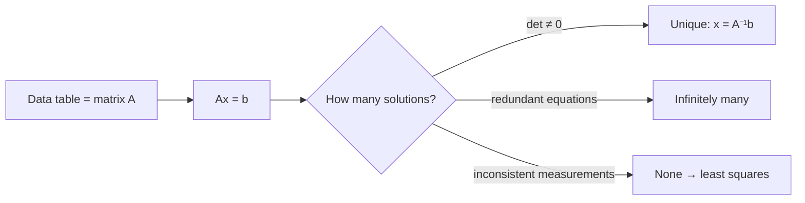
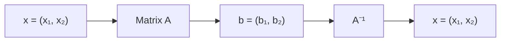
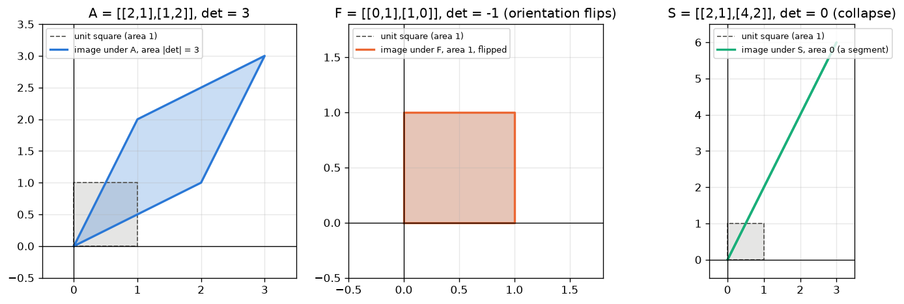
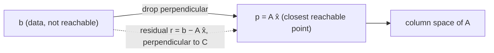
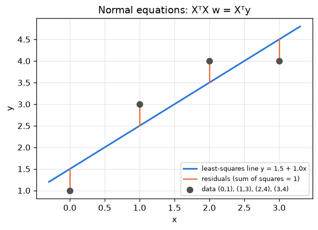
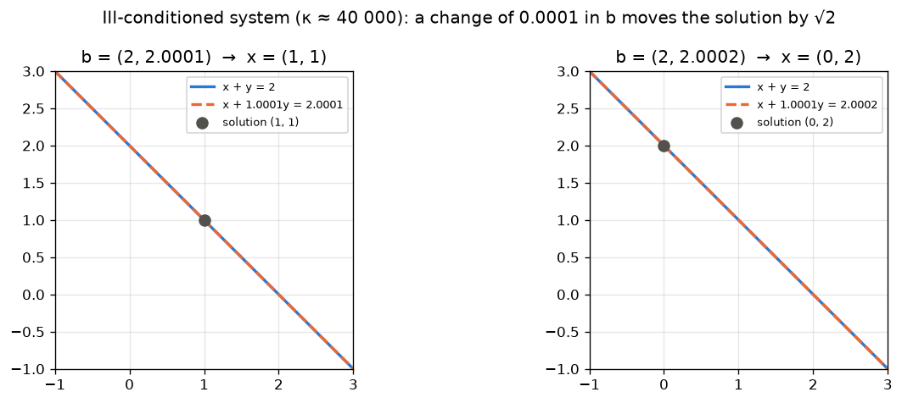

# 01 · Linear Systems, Determinant & Inverse

> **Course:** Applied Mathematics for Data Science & AI · Dr. Arulalan Rajan
>
> **Lectures:** Lecture 1 (16 Sep 2026) and Lecture 2, first half (19 Sep 2026)
>
> **Sources:** handwritten lecture notes pp. 1–12 (`Lecture notes till 3rd October.pdf`). No transcript for these dates.
>
> **Notebooks:** [`code/linear_algebra_part1.ipynb`](code/linear_algebra_part1.ipynb), Parts A–B (class examples) · [`code/01_linear_systems_deep_dive.ipynb`](code/01_linear_systems_deep_dive.ipynb), Parts 1–10 (proof checks, worked examples, case studies, practice-problem checks)
>
> **Level:** 🟢 Basic → 🟡 Intermediate → 🔴 Advanced. Sections 6, 8, 10 and 11 go beyond what was written on the board in Lectures 1–2; they are the standard theory behind it (3×3 determinants, Cramer's rule, least squares, conditioning) and are tagged accordingly.

---

## 📌 Table of Contents

1. [Big Picture](#1-big-picture)
2. [A Matrix is a Data Table](#2-a-matrix-is-a-data-table-)
3. [Linear Systems Ax = b](#3-linear-systems-ax--b-)
4. [The Three Possible Outcomes](#4-the-three-possible-outcomes-)
5. [Solving a General 2×2 System → the Determinant](#5-solving-a-general-22-system--the-determinant-)
6. [Determinants of 3×3 Matrices and Their Properties](#6-determinants-of-33-matrices-and-their-properties-)
7. [The Inverse Matrix](#7-the-inverse-matrix-)
8. [Cramer's Rule](#8-cramers-rule-)
9. [Matrices with Easy Inverses](#9-matrices-with-easy-inverses-)
10. [Least Squares and the Normal Equations](#10-least-squares-and-the-normal-equations-)
11. [Conditioning: When Solutions Are Fragile](#11-conditioning-when-solutions-are-fragile-)
12. [Why We Avoid Computing Inverses](#12-why-we-avoid-computing-inverses-)
13. [Real-World Case Studies](#13-real-world-case-studies-)
14. [Connections to ML / Data Science](#14-connections-to-ml--data-science-)
15. [Common Confusions](#15--common-confusions)
16. [Practice Problems](#16--practice-problems)
17. [Cheat Sheet](#17--cheat-sheet)
18. [Go Deeper](#18--go-deeper-curated-links)

---

## 1. Big Picture

Almost every ML algorithm reduces to **linear algebra on a data matrix**: regression solves a (least-squares) linear system, PCA finds eigenvectors, and neural networks are stacks of matrix multiplications. This course starts at the root: **what does it mean to solve $`Ax = b`$, and when can we?**



The questions this note answers, in order:

1. When does $`Ax = b`$ have exactly one solution? (The **determinant** decides.)
2. How do we write that solution down? (The **inverse**, the **adjugate**, **Cramer's rule**.)
3. Which matrices are cheap to invert? (Identity, reflections, diagonal, **orthogonal**.)
4. What if there is no solution? (**Least squares**, the engine of linear regression.)
5. What if there is a solution but it is extremely sensitive to noise? (**Conditioning**.)

---

## 2. A Matrix is a Data Table 🟢

A matrix is a **table of $`m`$ rows and $`n`$ columns**.

| | Meaning |
|---|---|
| **Every row** | **One observation** of $`n`$ variables |
| **Every column** | **$`m`$ observations** of a single variable |

**Example:** a hospital dataset with 1000 patients × 5 measurements (age, BP, sugar, cholesterol, BMI) is a $`1000 \times 5`$ matrix. Row 17 = everything about patient 17; column 3 = sugar levels of all patients.

> 🔗 This is exactly the `X` matrix in scikit-learn (MLP Note 02: "rows = samples, columns = features"). Keep this picture in mind through the whole course. The professor returns to it when explaining nullity as "redundant features" ([Note 05](05-Null-Space-and-Nullity.md)).

**Shapes decide what is possible.** With $`m`$ equations (rows) and $`n`$ unknowns (columns):

| Shape | Name | Typical situation |
|---|---|---|
| $`m = n`$ | Square | Can have a unique solution; inverse may exist |
| $`m > n`$ | Tall / over-determined | More measurements than unknowns: usually no exact solution → least squares (regression, GPS) |
| $`m < n`$ | Wide / under-determined | Fewer equations than unknowns: infinitely many solutions or none → need extra criteria (regularisation) |

---

## 3. Linear Systems Ax = b 🟢

**Ex 1 (Lecture 1):**

```math
\begin{aligned} 2x + y &= 3 \\ x + 2y &= 3 \end{aligned}
\quad\Longrightarrow\quad
\underbrace{\begin{bmatrix} 2 & 1 \\ 1 & 2 \end{bmatrix}}_{A}
\underbrace{\begin{bmatrix} x \\ y \end{bmatrix}}_{x}
=
\underbrace{\begin{bmatrix} 3 \\ 3 \end{bmatrix}}_{b}
```

Solution: $`x = 1,\ y = 1`$.

**Two ways to read $`Ax = b`$ (the second matters later):**

1. **Row picture:** each equation is a line, and the solution is where the lines meet.
2. **Column picture:** find how much of each **column** to mix to produce $`b`$. This is a **linear combination** ([Note 04](04-Span-Independence-Basis-Dimension.md)):

```math
x\begin{bmatrix}2\\1\end{bmatrix} + y\begin{bmatrix}1\\2\end{bmatrix} = \begin{bmatrix}3\\3\end{bmatrix}
```

With $`x = y = 1`$: $`(2,1) + (1,2) = (3,3)`$ ✓.

**The machine view (from the notes):**



$`A`$ **transforms** input $`x`$ into output $`b`$. Solving means **undoing** the transformation, which is what $`A^{-1}`$ does.

**Linearity — the property everything rests on.** A matrix map satisfies

```math
A(\alpha \mathbf{u} + \beta \mathbf{v}) = \alpha A\mathbf{u} + \beta A\mathbf{v}
```

for all vectors $`\mathbf{u}, \mathbf{v}`$ and scalars $`\alpha, \beta`$. Two consequences used repeatedly below: (i) $`A\mathbf{0} = \mathbf{0}`$, so every linear map fixes the origin; (ii) if $`\mathbf{x}_p`$ solves $`Ax = b`$ and $`A\mathbf{z} = \mathbf{0}`$, then $`\mathbf{x}_p + t\mathbf{z}`$ also solves it for every $`t`$. Point (ii) is exactly why "more than one solution" automatically means "infinitely many" (a line of solutions), never "exactly two".

---

## 4. The Three Possible Outcomes 🟢


| Case | Example | Geometry | Why it happened |
|---|---|---|---|
| **Unique solution** | $`2x+y=3,\ x+2y=3`$ | Lines intersect at one point $`(1,1)`$ | Equations carry independent information |
| **Infinitely many** | $`2x+y=3,\ 4x+2y=6`$ | Same line twice | **Redundant equations** (eq 2 = 2 × eq 1) |
| **No solution** | $`2x+y=3,\ 2x+y=4`$ | Parallel lines | **Measurement inconsistency** |

**Why only these three?** Two lines in the plane either cross once, coincide, or are parallel. In higher dimensions the argument is the linearity argument of Section 3: if two different solutions $`\mathbf{x}_1 \ne \mathbf{x}_2`$ exist, then $`\mathbf{z} = \mathbf{x}_1 - \mathbf{x}_2 \ne \mathbf{0}`$ satisfies $`A\mathbf{z} = \mathbf{0}`$, and $`\mathbf{x}_1 + t\mathbf{z}`$ is a solution for every real $`t`$. So the count is always 0, 1 or ∞.

### Infinitely many solutions (Ex 2)

Both equations say $`y = 3 - 2x`$, so every point on that line works:

| $`x`$ | 1 | 0 | 1.5 | 2 | … |
|---|---|---|---|---|---|
| $`y`$ | 1 | 3 | 0 | −1 | … |

General ("representative") solution:

```math
\begin{pmatrix}x\\y\end{pmatrix} = \begin{pmatrix}x\\3-2x\end{pmatrix} = \begin{pmatrix}0\\3\end{pmatrix} + x\begin{pmatrix}1\\-2\end{pmatrix}
```

The second form is "particular solution + multiple of a null-space direction": $`(1,-2)`$ satisfies $`2(1) + 1(-2) = 0`$, the structure studied in [Note 05](05-Null-Space-and-Nullity.md).

### No solution (Ex 3): what do we do?

The same quantity $`2x+y`$ was "measured" as 3 and as 4: a **measurement inconsistency** (real sensors are noisy). Since an exact solution doesn't exist, we look for the **least-squares solution**: the $`x`$ that makes $`Ax`$ **as close as possible** to $`b`$.

```math
\hat{x} = \arg\min_x \lVert Ax - b\rVert^2
```

In the notes: *"the soln that takes you to a destination closer to the actual one"*, with the squared error (variance) being minimised.

For Ex 3, least squares gives $`Ax = (3.5, 3.5)`$, splitting the difference between 3 and 4 (notebook Part A). The full theory is in [Section 10](#10-least-squares-and-the-normal-equations-).

> 🔗 **This is linear regression!** In MLP Note 03 we had 5 data points (5 equations) and 2 unknowns ($`m, c`$). No line passes through all points, so there is no exact solution, and OLS finds the least-squares one. The normal equation $`\mathbf{w} = (X^\top X)^{-1}X^\top \mathbf{y}`$ is the least-squares solution of $`X\mathbf{w} = \mathbf{y}`$.

### 🔴 Rank criterion (preview of Note 02)

For $`Ax=b`$ with $`n`$ unknowns:

- $`\text{rank}(A) \ne \text{rank}([A\,|\,b])`$ → **no solution**
- $`\text{rank}(A) = \text{rank}([A\,|\,b]) = n`$ → **unique**
- $`\text{rank}(A) = \text{rank}([A\,|\,b]) < n`$ → **infinitely many**

For the three examples: Ex 1 has ranks (2, 2), unique; Ex 2 has ranks (1, 1) < 2, infinite; Ex 3 has ranks (1, 2), none.

---

## 5. Solving a General 2×2 System → the Determinant 🟢

```math
\begin{aligned}
a_{11}x_1 + a_{12}x_2 &= b_1 \quad (1)\\
a_{21}x_1 + a_{22}x_2 &= b_2 \quad (2)
\end{aligned}
```

**Eliminate $`x_2`$:** multiply (1) by $`a_{22}`$ and (2) by $`a_{12}`$, then subtract:

```math
\begin{aligned}
a_{11}a_{22}x_1 + a_{12}a_{22}x_2 &= a_{22}b_1\\
-\;(a_{12}a_{21}x_1 + a_{12}a_{22}x_2 &= a_{12}b_2)\\ \hline
x_1(a_{11}a_{22} - a_{12}a_{21}) &= b_1a_{22} - b_2a_{12}
\end{aligned}
```

**Eliminate $`x_1`$** the same way: multiply (1) by $`a_{21}`$ and (2) by $`a_{11}`$ and subtract (1) from (2), giving $`x_2(a_{11}a_{22} - a_{12}a_{21}) = a_{11}b_2 - a_{21}b_1`$. Hence

```math
x_1 = \frac{b_1a_{22} - b_2a_{12}}{a_{11}a_{22} - a_{12}a_{21}}, \qquad
x_2 = \frac{b_2a_{11} - b_1a_{21}}{a_{11}a_{22} - a_{12}a_{21}}
\qquad \text{provided the denominator} \ne 0
```

The denominator decides everything, so it gets a name:

```math
\boxed{\det(A) = a_{11}a_{22} - a_{12}a_{21}}
```

**Sanity check on Ex 1:** $`\det = 2\cdot2 - 1\cdot1 = 3`$, $`x_1 = (3\cdot2 - 3\cdot1)/3 = 1`$, $`x_2 = (3\cdot2 - 3\cdot1)/3 = 1`$ ✓.

### What the determinant means 🟡

| View | Meaning |
|---|---|
| Algebraic | If $`\det A \ne 0`$, the formula works and the solution is unique |
| **Geometric** | $`\lvert\det A\rvert`$ = **area scaling factor**. $`A`$ maps the unit square to a parallelogram of area $`\lvert\det A\rvert`$ |
| Sign | Negative → orientation flipped (a reflection is involved) |
| $`\det A = 0`$ | $`A`$ squashes the plane onto a line (or point), so information is lost and can't be undone |

Check: Ex 1 has $`\det = 2·2 - 1·1 = 3 \ne 0`$ (unique). Ex 2 has $`\det = 2·2 - 1·4 = 0`$ (not unique).



*Left: $`A`$ from Ex 1 stretches the unit square into a parallelogram of area 3. Middle: the swap matrix $`F`$ keeps area 1 but flips orientation (det −1). Right: the Ex 2 matrix collapses the square onto a segment (det 0). Generated by [`code/figures_01.py`](code/figures_01.py).*

**Why is the area $`\lvert ad - bc\rvert`$? (proof 🟡).** The unit square has sides $`\mathbf{e}_1, \mathbf{e}_2`$; under $`A = [\,a\ b;\ c\ d\,]`$ they go to the columns $`(a, c)`$ and $`(b, d)`$. Put the parallelogram spanned by these inside the bounding rectangle of width $`a + b`$ and height $`c + d`$ (for positive entries). The rectangle minus two corner rectangles ($`bc`$ each) and four triangles ($`ac/2`$ twice, $`bd/2`$ twice) leaves

```math
(a+b)(c+d) - 2bc - ac - bd = ad - bc .
```

Other sign patterns give the same result with a sign, which is why the determinant is a *signed* area.

---

## 6. Determinants of 3×3 Matrices and Their Properties 🟡

The 2×2 formula came from solving the system. For larger systems we need a general definition. The cleanest characterisation: $`\det`$ is the **unique** function of the rows of a square matrix that is

1. **linear in each row** (keeping the other rows fixed),
2. **alternating**: swapping two rows flips its sign (so a matrix with two equal rows has $`\det = 0`$),
3. **normalised**: $`\det I = 1`$.

Everything below follows from these three rules. Geometrically, in 3-D, $`\lvert\det A\rvert`$ is the **volume** of the parallelepiped spanned by the columns.

### 6.1 Cofactor (Laplace) expansion

For an $`n \times n`$ matrix, the **minor** $`M_{ij}`$ is the determinant of the $`(n-1)\times(n-1)`$ matrix obtained by deleting row $`i`$ and column $`j`$. The **cofactor** is $`C_{ij} = (-1)^{i+j}M_{ij}`$. Then, for **any** fixed row $`i`$ (or column $`j`$):

```math
\det A = \sum_{j=1}^{n} a_{ij}C_{ij} \qquad\text{(expansion along row } i\text{)}, \qquad
\det A = \sum_{i=1}^{n} a_{ij}C_{ij} \qquad\text{(along column } j\text{)}
```

The sign pattern $`(-1)^{i+j}`$ is a checkerboard:

```math
\begin{bmatrix} + & - & + \\ - & + & - \\ + & - & + \end{bmatrix}
```

For a general 3×3 matrix, expanding along row 1:

```math
\det\begin{bmatrix} a & b & c \\ d & e & f \\ g & h & i \end{bmatrix}
= a(ei - fh) - b(di - fg) + c(dh - eg)
```

**Tip:** expand along the row or column with the **most zeros**; each zero kills a whole sub-determinant.

### 6.2 Rule of Sarrus (3×3 only)

Copy the first two columns to the right. Add the three "downhill" diagonal products, subtract the three "uphill" ones:

```math
\det A = (aei + bfg + cdh) - (ceg + afh + bdi)
```

⚠️ Sarrus works **only for 3×3**. A 4×4 determinant has $`4! = 24`$ terms, not 8; the diagonal trick gives the wrong answer.

### 6.3 Worked Example 1: one 3×3 determinant, three ways

```math
A = \begin{bmatrix} 2 & 1 & 3 \\ 0 & -1 & 4 \\ 1 & 2 & 0 \end{bmatrix}
```

**(a) Cofactor expansion along row 1:**

```math
\begin{aligned}
\det A &= 2\,\big((-1)(0) - (4)(2)\big) - 1\,\big((0)(0) - (4)(1)\big) + 3\,\big((0)(2) - (-1)(1)\big)\\
&= 2(-8) - 1(-4) + 3(1) = -16 + 4 + 3 = -9
\end{aligned}
```

**(b) Sarrus:** downhill $`aei + bfg + cdh = 2(-1)(0) + 1(4)(1) + 3(0)(2) = 0 + 4 + 0 = 4`$; uphill $`ceg + afh + bdi = 3(-1)(1) + 2(4)(2) + 1(0)(0) = -3 + 16 + 0 = 13`$. So $`\det A = 4 - 13 = -9`$.

**(c) Expansion down column 1** (it contains a zero): $`2\cdot(-8) - 0 + 1\cdot\big((1)(4) - (3)(-1)\big) = -16 + 7 = -9`$.

**Sanity check:** three methods agree, and `np.linalg.det` returns −9.0 (notebook Part 1). Since $`\det \ne 0`$, any system with this coefficient matrix has a unique solution.

### 6.4 Properties, with proofs

| # | Property | One-line reason |
|---|---|---|
| P1 | Swap two rows → $`\det`$ changes sign | Alternating rule |
| P2 | Multiply one row by $`k`$ → $`\det`$ multiplied by $`k`$ | Linear in each row |
| P3 | Add a multiple of one row to another → $`\det`$ **unchanged** | Linearity + equal-rows-gives-zero |
| P4 | Triangular matrix → $`\det`$ = product of diagonal | Repeated expansion down column 1 |
| P5 | $`\det(A^\top) = \det A`$ | Permutation symmetry |
| P6 | $`\det(AB) = \det A\,\det B`$ | Elementary matrices |
| P7 | $`\det(kA) = k^n\det A`$ for $`n\times n`$ | P2 applied to all $`n`$ rows |
| P8 | $`\det(A^{-1}) = 1/\det A`$ | P6 with $`AA^{-1} = I`$ |
| P9 | $`A`$ invertible ⇔ $`\det A \ne 0`$ | Elimination + P1–P4 |

**Proof of P3.** Replace row $`i`$ by $`\mathbf{r}_i + k\mathbf{r}_j`$. By linearity in row $`i`$,

```math
\det(\dots, \mathbf{r}_i + k\mathbf{r}_j, \dots, \mathbf{r}_j, \dots) = \det(\dots, \mathbf{r}_i, \dots, \mathbf{r}_j, \dots) + k\,\det(\dots, \mathbf{r}_j, \dots, \mathbf{r}_j, \dots)
```

and the last determinant has two equal rows, so it is 0 (swapping them changes the sign but not the matrix, so $`D = -D`$, i.e. $`D = 0`$). ∎

**Proof of P4.** For an upper-triangular $`U`$, column 1 has only one non-zero entry $`u_{11}`$, so expanding down column 1 gives $`u_{11}\det U'`$ where $`U'`$ is again upper triangular. Repeating gives $`u_{11}u_{22}\cdots u_{nn}`$. For lower-triangular use rows (or P5). ∎

**Proof of P5 (sketch).** The full (Leibniz) formula is $`\det A = \sum_{\sigma} \text{sgn}(\sigma)\, a_{1\sigma(1)}a_{2\sigma(2)}\cdots a_{n\sigma(n)}`$, summing over all $`n!`$ permutations $`\sigma`$. Each product contains exactly one entry from each row **and** each column. Reading the same product column by column corresponds to $`\sigma^{-1}`$, which has the same sign. So the sum for $`A^\top`$ is the same sum, reordered. For 2×2 it is immediate: $`\det A^\top = a_{11}a_{22} - a_{21}a_{12}`$. ∎

**Proof of P6.** *Case 1: $`A`$ singular.* Then $`AB`$ is singular too (if $`AB`$ had an inverse $`C`$, then $`A(BC) = I`$ would make $`A`$ invertible), so both sides are 0. *Case 2: $`A`$ invertible.* Gauss–Jordan elimination writes $`A = E_1E_2\cdots E_k`$ as a product of elementary matrices (row swap, row scale, row add). For each type, P1–P3 say exactly $`\det(EM) = \det(E)\det(M)`$ for any $`M`$ (with $`\det E = -1`$, $`k`$, $`1`$ respectively). Peeling the factors off one at a time:

```math
\det(AB) = \det(E_1)\det(E_2\cdots E_kB) = \cdots = \det(E_1)\cdots\det(E_k)\det(B) = \det(A)\det(B). \quad\blacksquare
```

The notebook (Part 1) confirms P6 symbolically for 2×2 (sympy simplifies $`\det(AB) - \det A\det B`$ to 0) and numerically on random 4×4 integer matrices ($`-49320 = -49320`$).

**Proof of P9.** Row-reduce $`A`$ to an upper-triangular $`U`$. By P1–P3, $`\det A = (\pm 1)(\text{non-zero scalings})\det U`$, so $`\det A \ne 0 \iff`$ every diagonal entry (pivot) of $`U`$ is non-zero $`\iff`$ there are $`n`$ pivots $`\iff`$ $`A`$ is invertible ([Note 02](02-Gaussian-Elimination-Row-Operations-Rank.md)). ∎

⚠️ **Not a property:** $`\det(A + B) \ne \det A + \det B`$ in general. Take $`A = B = I_2`$: $`\det(2I) = 4`$ but $`\det I + \det I = 2`$.

### 6.5 Worked Example 2: determinant by row reduction

```math
A = \begin{bmatrix} 1 & 2 & 3 \\ 2 & 5 & 7 \\ 1 & 3 & 5 \end{bmatrix}
```

- $`R_2 \leftarrow R_2 - 2R_1`$: row 2 becomes $`(0, 1, 1)`$ (P3: det unchanged).
- $`R_3 \leftarrow R_3 - R_1`$: row 3 becomes $`(0, 1, 2)`$ (unchanged).
- $`R_3 \leftarrow R_3 - R_2`$: row 3 becomes $`(0, 0, 1)`$ (unchanged).

```math
U = \begin{bmatrix} 1 & 2 & 3 \\ 0 & 1 & 1 \\ 0 & 0 & 1 \end{bmatrix}, \qquad \det A = \det U = 1\cdot1\cdot1 = 1
```

**Sanity check:** cofactor expansion of the original, $`1(25 - 21) - 2(10 - 7) + 3(6 - 5) = 4 - 6 + 3 = 1`$ ✓. This is how computers find determinants: $`O(n^3)`$ elimination, never the $`O(n!)`$ expansion.

### 6.6 Worked Example 3: using the properties without computing

$`A`$ is $`3\times3`$ with $`\det A = -2`$. Then:

- $`\det(A^\top) = -2`$ (P5)
- $`\det(3A) = 3^3(-2) = -54`$ (P7, **not** $`3(-2)`$)
- $`\det(A^{-1}) = -1/2`$ (P8)
- $`\det(A^2) = (-2)^2 = 4`$ (P6)
- swapping two rows of $`A`$ gives $`\det = 2`$ (P1)

---

## 7. The Inverse Matrix 🟢

Writing the solution of Section 5 as a matrix times $`b`$:

```math
\begin{bmatrix}x_1\\x_2\end{bmatrix}
= \underbrace{\frac{1}{\det A}\begin{bmatrix} a_{22} & -a_{12}\\ -a_{21} & a_{11}\end{bmatrix}}_{A^{-1}}
\begin{bmatrix}b_1\\b_2\end{bmatrix}
\qquad\Longrightarrow\qquad \boxed{x = A^{-1}b}
```

```math
A^{-1} = \frac{\text{Adj}(A)}{\det(A)}
```

**2×2 recipe:** *swap the diagonal elements, negate the off-diagonal elements, divide by the determinant.*

**Ex 1:**

```math
A = \begin{bmatrix}2&1\\1&2\end{bmatrix},\quad \det A = 3,\quad
A^{-1} = \frac13\begin{bmatrix}2&-1\\-1&2\end{bmatrix},\quad
x = A^{-1}\begin{bmatrix}3\\3\end{bmatrix} = \frac13\begin{bmatrix}6-3\\-3+6\end{bmatrix} = \begin{bmatrix}1\\1\end{bmatrix}\ ✅
```

> 📝 *Notes p.5:* the underbrace labelled $`\det(A)`$ is drawn under $`\frac{1}{a_{11}a_{22}-a_{21}a_{12}}`$. Only the **denominator** is $`\det(A)`$; the whole fraction is $`1/\det(A)`$.

**Definition.** A square matrix $`A`$ is **invertible** if there is a matrix $`B`$ with $`AB = BA = I`$; then $`B`$ is written $`A^{-1}`$.

### The professor's three questions (p. 6) — answered

1. **Does $`A^{-1}`$ exist for all matrices?** No. It exists only for **square** matrices with $`\det A \ne 0`$ (called *non-singular* or *invertible*).
2. **What if $`\det(A) = 0`$?** No inverse. $`Ax = b`$ has either no solution or infinitely many. Geometrically, $`A`$ collapses space, and you can't recover which input produced the output.
3. **Are there matrices whose inverse is easy?** Yes → [Section 9](#9-matrices-with-easy-inverses-).

**Analogy (side note in the notes: $`y = x^3`$, $`y = -8 \Rightarrow x = ?`$):** $`x^3`$ is invertible ($`x = -2`$, uniquely). But $`y = x^2`$ with $`y = 4`$ gives $`x = \pm 2`$: two inputs give the same output, so there's no unique inverse. A matrix with $`\det = 0`$ is like $`x^2`$: many inputs map to the same output.

### 7.1 Basic theorems about inverses (with proofs) 🟡

**Theorem 1 (uniqueness).** If an inverse exists, it is unique.

*Proof.* Suppose $`AB = BA = I`$ and $`AC = CA = I`$. Then

```math
B = BI = B(AC) = (BA)C = IC = C. \quad\blacksquare
```

This is why we may say "**the** inverse" and write $`A^{-1}`$.

**Theorem 2 (product rule, order reverses).** If $`A`$ and $`B`$ are invertible $`n\times n`$, then $`(AB)^{-1} = B^{-1}A^{-1}`$.

*Proof.* Multiply and regroup (matrix multiplication is associative):

```math
(AB)(B^{-1}A^{-1}) = A(BB^{-1})A^{-1} = AIA^{-1} = AA^{-1} = I,
```

and similarly $`(B^{-1}A^{-1})(AB) = I`$. By Theorem 1 this is the inverse. ∎

*Intuition:* to undo "put on socks, then shoes", take off the shoes first. The notebook (Part 2) shows with $`A = [\,1\ 2;\ 3\ 5\,]`$, $`B = [\,2\ 1;\ 1\ 1\,]`$ that $`B^{-1}A^{-1}`$ matches $`(AB)^{-1}`$, while $`A^{-1}B^{-1}`$ gives a different matrix.

**Theorem 3 (transpose).** $`(A^\top)^{-1} = (A^{-1})^\top`$. *Proof:* $`A^\top(A^{-1})^\top = (A^{-1}A)^\top = I^\top = I`$. ∎

**Theorem 4 (one-sided is enough for square matrices).** If $`A`$ is square and $`AB = I`$, then $`BA = I`$ too. (Sketch: $`\det A\det B = 1`$ so $`\det A \ne 0`$, $`A^{-1}`$ exists, and $`B = A^{-1}AB = A^{-1}`$.) This is why checking $`AB = I`$ alone suffices in exercises.

### 7.2 The adjugate formula for n×n

The **adjugate** is the **transpose of the cofactor matrix**: $`\text{Adj}(A)_{ij} = C_{ji}`$. The 2×2 recipe is the special case $`C_{11} = a_{22}`$, $`C_{12} = -a_{21}`$, $`C_{21} = -a_{12}`$, $`C_{22} = a_{11}`$.

**Theorem 5.** $`A\,\text{Adj}(A) = \det(A)\,I`$. Hence, if $`\det A \ne 0`$, $`A^{-1} = \text{Adj}(A)/\det(A)`$.

*Proof.* The $`(i, j)`$ entry of $`A\,\text{Adj}(A)`$ is $`\sum_k a_{ik}C_{jk}`$.

- If $`i = j`$: this is the cofactor expansion of $`\det A`$ along row $`i`$, so it equals $`\det A`$.
- If $`i \ne j`$: this is the cofactor expansion along row $`j`$ of the matrix obtained from $`A`$ by **replacing row $`j`$ with row $`i`$** (the cofactors $`C_{jk}`$ don't involve row $`j`$, so they are unchanged). That matrix has two equal rows, so its determinant is 0.

So the product is $`\det(A)`$ on the diagonal and 0 elsewhere. ∎

### 7.3 Worked Example 4: a 3×3 inverse via the adjugate

```math
B = \begin{bmatrix} 1 & 2 & 3 \\ 0 & 1 & 4 \\ 5 & 6 & 0 \end{bmatrix}
```

**Step 1 — all nine cofactors** (delete row $`i`$, column $`j`$, take the 2×2 determinant, apply the checkerboard sign):

| | $`j=1`$ | $`j=2`$ | $`j=3`$ |
|---|---|---|---|
| $`i=1`$ | $`+(1\cdot0 - 4\cdot6) = -24`$ | $`-(0\cdot0 - 4\cdot5) = 20`$ | $`+(0\cdot6 - 1\cdot5) = -5`$ |
| $`i=2`$ | $`-(2\cdot0 - 3\cdot6) = 18`$ | $`+(1\cdot0 - 3\cdot5) = -15`$ | $`-(1\cdot6 - 2\cdot5) = 4`$ |
| $`i=3`$ | $`+(2\cdot4 - 3\cdot1) = 5`$ | $`-(1\cdot4 - 3\cdot0) = -4`$ | $`+(1\cdot1 - 2\cdot0) = 1`$ |

**Step 2 — determinant** (row 1 times its cofactors): $`1(-24) + 2(20) + 3(-5) = -24 + 40 - 15 = 1`$.

**Step 3 — adjugate = transpose of the cofactor matrix, then divide by det = 1:**

```math
B^{-1} = \frac{1}{1}\begin{bmatrix} -24 & 18 & 5 \\ 20 & -15 & -4 \\ -5 & 4 & 1 \end{bmatrix}
```

**Sanity check:** first row of $`B`$ times first column of $`B^{-1}`$: $`1(-24) + 2(20) + 3(-5) = 1`$ ✓; first row times second column: $`1(18) + 2(-15) + 3(4) = 0`$ ✓. The notebook (Part 2) confirms $`B\,\text{Adj}(B) = I`$. Because $`\det B = 1`$ and all entries are integers, the inverse is also an integer matrix — a property that matters for the Hill cipher (Section 13.1).

---

## 8. Cramer's Rule 🟡

Section 5 already contains Cramer's rule for 2×2: the numerator of $`x_1`$, $`b_1a_{22} - b_2a_{12}`$, is the determinant of $`A`$ with **column 1 replaced by $`b`$**. This pattern holds in every dimension.

**Theorem (Cramer).** If $`\det A \ne 0`$, the unique solution of $`Ax = b`$ is

```math
x_i = \frac{\det A_i}{\det A}, \qquad A_i = A \text{ with column } i \text{ replaced by } b .
```

**Proof (a neat one).** Let $`X_i`$ be the identity matrix with its column $`i`$ replaced by the solution vector $`x`$. Multiplying column by column, $`AX_i`$ has columns $`A\mathbf{e}_1, \dots, Ax, \dots, A\mathbf{e}_n`$, i.e. the columns of $`A`$ with column $`i`$ replaced by $`Ax = b`$. So $`AX_i = A_i`$. Row $`i`$ of $`X_i`$ has a single non-zero entry, $`x_i`$, on the diagonal (every other column is a standard basis vector $`\mathbf{e}_j`$ with a 0 in row $`i`$), so expanding along row $`i`$ gives $`\det X_i = x_i\det(I_{n-1}) = x_i`$. By P6,

```math
\det(A)\,x_i = \det(A)\det(X_i) = \det(AX_i) = \det(A_i). \quad\blacksquare
```

### 8.1 Worked Example 5: Cramer on a 3×3 system

```math
\begin{aligned} x + y + z &= 6 \\ 2y + 5z &= -4 \\ 2x + 5y - z &= 27 \end{aligned}
\qquad
A = \begin{bmatrix} 1 & 1 & 1 \\ 0 & 2 & 5 \\ 2 & 5 & -1 \end{bmatrix},\quad
b = \begin{bmatrix} 6 \\ -4 \\ 27 \end{bmatrix}
```

$`D = \det A = 1(2\cdot(-1) - 5\cdot5) - 1(0\cdot(-1) - 5\cdot2) + 1(0\cdot5 - 2\cdot2) = -27 + 10 - 4 = -21`$.

```math
D_1 = \det\begin{bmatrix} 6 & 1 & 1 \\ -4 & 2 & 5 \\ 27 & 5 & -1 \end{bmatrix} = 6(-27) - 1(4 - 135) + 1(-20 - 54) = -162 + 131 - 74 = -105
```

```math
D_2 = \det\begin{bmatrix} 1 & 6 & 1 \\ 0 & -4 & 5 \\ 2 & 27 & -1 \end{bmatrix} = 1(4 - 135) - 6(0 - 10) + 1(0 + 8) = -131 + 60 + 8 = -63
```

```math
D_3 = \det\begin{bmatrix} 1 & 1 & 6 \\ 0 & 2 & -4 \\ 2 & 5 & 27 \end{bmatrix} = 1(54 + 20) - 1(0 + 8) + 6(0 - 4) = 74 - 8 - 24 = 42
```

So $`x = -105/-21 = 5`$, $`y = -63/-21 = 3`$, $`z = 42/-21 = -2`$.

**Sanity check:** $`5 + 3 - 2 = 6`$ ✓, $`2(3) + 5(-2) = -4`$ ✓, $`2(5) + 5(3) - (-2) = 27`$ ✓ (notebook Part 3).

### 8.2 When (not) to use Cramer

| Use it for | Avoid it for |
|---|---|
| 2×2 and 3×3 by hand | $`n \ge 4`$: needs $`n+1`$ determinants |
| Symbolic formulas (e.g. how $`x_i`$ depends on a parameter) | Anything numeric at scale: with cofactor determinants the cost is $`O(n!)`$ |
| Proving that $`x`$ depends continuously / rationally on $`A`$ and $`b`$ | Singular or nearly singular $`A`$ (division by a tiny $`\det`$) |

The notebook (Part 3) times cofactor expansion against NumPy's LU-based `det`: the cofactor time grows by a factor of roughly $`n`$ for each extra row (already hundreds of milliseconds at $`n = 8`$), while LU stays below 0.1 ms.

---

## 9. Matrices with Easy Inverses 🟡

Computing $`A^{-1}`$ is expensive in general, so the professor ranked the "easy" cases.

### 9.1 Best case: A⁻¹ = A (self-inverse)

**Identity** $`I`$: $`Ix = x`$, so $`I^{-1} = I`$.

```math
I = \begin{bmatrix}1&0\\0&1\end{bmatrix}
```

**Q (p.7):** *Are there more 2×2 matrices with $`A^{-1} = A`$?* (Lecture 2)

Find $`A`$ that swaps the coordinates, $`A(x, y)^\top = (y, x)^\top`$: $`ax+by=y,\ cx+dy=x`$ for all $`x, y`$ gives $`a=0, b=1, c=1, d=0`$.

```math
F = \begin{bmatrix}0&1\\1&0\end{bmatrix},\qquad F F \begin{bmatrix}x\\y\end{bmatrix} = F\begin{bmatrix}y\\x\end{bmatrix} = \begin{bmatrix}x\\y\end{bmatrix} \;\Rightarrow\; F^{-1} = F
```


- $`F`$ is a **reflection about the line $`y = x`$** (the mirror).
- Points **on** the mirror don't move: $`F(1,1)^\top = (1,1)^\top`$. (These are its *eigenvectors with eigenvalue 1*, a preview.)
- **Every reflection about a line through the origin is its own inverse.** Reflect twice and you're back. In general, reflection about the line at angle $`\theta`$ is given below (notebook Part B verifies $`R^2 = I`$).
- **Swap matrices also perform row swaps** in Gaussian elimination ([Note 02](02-Gaussian-Elimination-Row-Operations-Rank.md)).

```math
F_\theta = \begin{bmatrix}\cos2\theta&\sin2\theta\\\sin2\theta&-\cos2\theta\end{bmatrix}
```

**Proof that every reflection is an involution (🟡).** Let $`\mathbf{n}`$ be a unit vector perpendicular to the mirror line. Reflection keeps the component along the mirror and negates the component along $`\mathbf{n}`$: $`F\mathbf{v} = \mathbf{v} - 2(\mathbf{n}^\top\mathbf{v})\mathbf{n}`$, i.e.

```math
F = I - 2\mathbf{n}\mathbf{n}^\top .
```

(This is a **Householder reflection**; it works in any dimension.) Then, using $`\mathbf{n}^\top\mathbf{n} = 1`$,

```math
F^2 = I - 4\mathbf{n}\mathbf{n}^\top + 4\mathbf{n}(\mathbf{n}^\top\mathbf{n})\mathbf{n}^\top = I - 4\mathbf{n}\mathbf{n}^\top + 4\mathbf{n}\mathbf{n}^\top = I . \quad\blacksquare
```

Also $`F^\top = F`$, so $`F`$ is symmetric **and** orthogonal, and $`\det F = -1`$. For the mirror at angle $`\theta`$, $`\mathbf{n} = (-\sin\theta, \cos\theta)`$ and $`I - 2\mathbf{n}\mathbf{n}^\top`$ has entries $`1 - 2\sin^2\theta = \cos2\theta`$, $`2\sin\theta\cos\theta = \sin2\theta`$ and $`1 - 2\cos^2\theta = -\cos2\theta`$, which is exactly $`F_\theta`$ above. With $`\theta = 45°`$ it gives the swap matrix $`F`$.

### 9.2 Next best: diagonal matrices

```math
D = \begin{bmatrix}d_1&0\\0&d_2\end{bmatrix}, \quad D\begin{bmatrix}x\\y\end{bmatrix} = \begin{bmatrix}d_1x\\d_2y\end{bmatrix}, \quad
D^{-1} = \begin{bmatrix}1/d_1&0\\0&1/d_2\end{bmatrix} \quad (d_1, d_2 \ne 0)
```

Each variable is scaled independently, so **the equations are decoupled**: $`ax = c \Rightarrow x = c/a`$, $`by = d \Rightarrow y = d/b`$. For $`n \times n`$ the cost is $`n`$ divisions, and $`\det D = d_1d_2\cdots d_n`$ (P4), so $`D`$ is invertible exactly when no diagonal entry is 0.

**Anti-diagonal variant (Ex 2, p.11):**

```math
\begin{bmatrix}0&d_1\\d_2&0\end{bmatrix}\begin{bmatrix}x\\y\end{bmatrix} = \begin{bmatrix}c\\d\end{bmatrix}
\;\Rightarrow\; y = c/d_1,\ x = d/d_2, \qquad
\det = -d_1d_2, \qquad \text{Adj} = \begin{bmatrix}0&-d_1\\-d_2&0\end{bmatrix}
```

Still trivial. (It's a diagonal matrix combined with a swap.) The zeros on the main diagonal mean there's no **pivot** there, so a row swap is needed to bring non-zeros onto the diagonal (Note 02).

> 🔗 **Why ML loves diagonal matrices:** eigen-decomposition $`A = PDP^{-1}`$ and SVD $`A = U\Sigma V^\top`$ rewrite hard matrices in terms of **diagonal** ones. That is how PCA works.

### 9.3 Third best: orthogonal matrices (A⁻¹ = Aᵀ)

Transpose is free (just re-index), so we want $`A^\top A = I`$:

```math
\begin{bmatrix}a_{11}&a_{21}\\a_{12}&a_{22}\end{bmatrix}\begin{bmatrix}a_{11}&a_{12}\\a_{21}&a_{22}\end{bmatrix}
= \begin{bmatrix}a_{11}^2+a_{21}^2 & a_{11}a_{12}+a_{21}a_{22}\\ a_{12}a_{11}+a_{22}a_{21} & a_{12}^2+a_{22}^2\end{bmatrix} = \begin{bmatrix}1&0\\0&1\end{bmatrix}
```

```math
\boxed{a_{11}^2+a_{21}^2 = a_{12}^2+a_{22}^2 = 1, \qquad a_{11}a_{12}+a_{21}a_{22} = 0}
```

**Interpretation:** each **column has length 1** and the **columns are perpendicular** (dot product 0). Columns are *orthonormal*. In general, the $`(i,j)`$ entry of $`Q^\top Q`$ is the dot product of column $`i`$ with column $`j`$, so $`Q^\top Q = I`$ says exactly "columns orthonormal".

**Classic example, rotation by θ:**

```math
R_\theta = \begin{bmatrix}\cos\theta&-\sin\theta\\\sin\theta&\cos\theta\end{bmatrix},\qquad \cos^2\theta + \sin^2\theta = 1,\quad -\cos\theta\sin\theta + \sin\theta\cos\theta = 0 \;✓
```

$`R_\theta^{-1} = R_\theta^\top = R_{-\theta}`$: rotating back by $`-\theta`$ undoes it.


**Theorem (orthogonal matrices preserve lengths, angles and volume).** If $`Q^\top Q = I`$, then for all $`\mathbf{x}, \mathbf{y}`$:

```math
(Q\mathbf{x})^\top(Q\mathbf{y}) = \mathbf{x}^\top Q^\top Q\,\mathbf{y} = \mathbf{x}^\top\mathbf{y},
\qquad\text{so}\qquad \lVert Q\mathbf{x}\rVert = \lVert\mathbf{x}\rVert
```

and angles (which depend only on dot products and lengths) are unchanged. Moreover $`1 = \det(I) = \det(Q^\top Q) = \det(Q)^2`$, so $`\det Q = \pm1`$: $`+1`$ for rotations, $`-1`$ for reflections. ∎

They're rigid motions: rotations and reflections. The product of two orthogonal matrices is orthogonal ($`(Q_1Q_2)^\top Q_1Q_2 = Q_2^\top Q_2 = I`$), and composition of rotations adds angles: $`R_\alpha R_\beta = R_{\alpha+\beta}`$ (notebook Part 4 checks $`R_{30°}R_{45°} = R_{75°}`$).

### 9.4 Worked Example 6: rotation by 60°

```math
R_{60°} = \begin{bmatrix} 1/2 & -\sqrt{3}/2 \\ \sqrt{3}/2 & 1/2 \end{bmatrix} \approx \begin{bmatrix} 0.5 & -0.866 \\ 0.866 & 0.5 \end{bmatrix}
```

**Orthogonality:** column lengths $`0.25 + 0.75 = 1`$ and $`0.75 + 0.25 = 1`$; dot product $`(1/2)(-\sqrt{3}/2) + (\sqrt{3}/2)(1/2) = 0`$ ✓. $`\det = 1/4 + 3/4 = 1`$ (a rotation, not a reflection).

**Apply to $`\mathbf{v} = (3, 4)`$:**

```math
R_{60°}\mathbf{v} = \begin{bmatrix} 1.5 - 2\sqrt{3} \\ 1.5\sqrt{3} + 2 \end{bmatrix} \approx \begin{bmatrix} -1.9641 \\ 4.5981 \end{bmatrix}
```

**Sanity check:** $`\lVert R\mathbf{v}\rVert^2 = 1.9641^2 + 4.5981^2 \approx 3.858 + 21.142 = 25`$, so the length is still 5 = $`\lVert\mathbf{v}\rVert`$ ✓. Undo with the transpose: $`R^\top(R\mathbf{v}) = \mathbf{v}`$.

> 🔗 **Where they appear:** PCA's principal axes, the $`U, V`$ in SVD, QR decomposition (numerically stable least squares), orthogonal weight initialisation in deep nets, and rotations in computer vision / robotics.

### Summary ranking

| Rank | Type | Inverse | Cost |
|---|---|---|---|
| 1 | Identity / reflection | $`A^{-1} = A`$ | Free |
| 2 | Diagonal (non-zero entries) | Reciprocals | $`O(n)`$ |
| 3 | Orthogonal | $`A^{-1} = A^\top`$ | Free (transpose) |
| — | General | $`\text{Adj}/\det`$ or elimination | $`O(n^3)`$ by elimination |

---

## 10. Least Squares and the Normal Equations 🟡

Lecture 1 met least squares through Ex 3 ("no solution → look for the least squared solution"). This section derives the formula.

**Setting.** $`A`$ is $`m \times n`$ with $`m > n`$ (more equations than unknowns), so $`b`$ is usually **not** in the column space of $`A`$ and $`Ax = b`$ has no solution. We minimise the **sum of squared residuals**

```math
f(x) = \lVert Ax - b\rVert^2 = \sum_{i=1}^{m}\big((Ax)_i - b_i\big)^2 .
```

### 10.1 Derivation 1: geometry (projection)

$`Ax`$ ranges over the column space of $`A`$ (a plane, in the picture below). The point of that plane closest to $`b`$ is the **orthogonal projection** $`\mathbf{p} = A\hat{x}`$: the error $`\mathbf{r} = b - A\hat{x}`$ must be **perpendicular to every column of $`A`$**:

```math
A^\top(b - A\hat{x}) = \mathbf{0}
\quad\Longleftrightarrow\quad
\boxed{A^\top A\,\hat{x} = A^\top b} \qquad\text{(the normal equations)}
```

The name: the residual is *normal* (perpendicular) to the column space.



**Why is the perpendicular foot the minimiser? (proof)** For any $`x`$, write $`Ax - b = A(x - \hat{x}) + (A\hat{x} - b)`$. The first term lies in the column space, the second is perpendicular to it, so their cross term vanishes and by Pythagoras

```math
\lVert Ax - b\rVert^2 = \lVert A(x - \hat{x})\rVert^2 + \lVert A\hat{x} - b\rVert^2 \;\ge\; \lVert A\hat{x} - b\rVert^2 .
```

Equality holds iff $`A(x - \hat{x}) = \mathbf{0}`$. ∎

### 10.2 Derivation 2: calculus

Expand $`f(x) = x^\top A^\top A x - 2b^\top A x + b^\top b`$ and set the gradient to zero:

```math
\nabla f(x) = 2A^\top A x - 2A^\top b = \mathbf{0} \;\Longrightarrow\; A^\top A x = A^\top b .
```

The Hessian $`2A^\top A`$ is positive semi-definite ($`x^\top A^\top A x = \lVert Ax\rVert^2 \ge 0`$), so this stationary point is a minimum. This is the same gradient that gradient-descent linear regression follows step by step.

### 10.3 When is the least-squares solution unique?

$`A^\top A`$ is invertible **iff the columns of $`A`$ are linearly independent**. *Proof:* if $`A^\top A\mathbf{z} = \mathbf{0}`$ then $`\mathbf{z}^\top A^\top A\mathbf{z} = \lVert A\mathbf{z}\rVert^2 = 0`$, so $`A\mathbf{z} = \mathbf{0}`$; independent columns force $`\mathbf{z} = \mathbf{0}`$. Conversely, a dependency $`A\mathbf{z} = \mathbf{0}`$ gives $`A^\top A\mathbf{z} = \mathbf{0}`$. ∎ Then

```math
\hat{x} = (A^\top A)^{-1}A^\top b, \qquad \text{the matrix } (A^\top A)^{-1}A^\top \text{ is the (Moore–Penrose) pseudo-inverse } A^{+} .
```

Ex 3 is the degenerate case: both columns of $`[\,2\ 1;\ 2\ 1\,]`$ are parallel, so $`A^\top A`$ is singular and there are infinitely many least-squares $`\hat{x}`$ — but they all give the same projection $`A\hat{x} = (3.5, 3.5)`$. In ML terms: **collinear features make the regression weights non-unique**, which is what ridge regularisation fixes.

### 10.4 Worked Example 7: least-squares line through 4 points

Fit $`y = c + mx`$ to $`(0,1), (1,3), (2,4), (3,4)`$. Each point gives one equation $`c + m x_i = y_i`$:

```math
X = \begin{bmatrix} 1 & 0 \\ 1 & 1 \\ 1 & 2 \\ 1 & 3 \end{bmatrix},\quad
\mathbf{w} = \begin{bmatrix} c \\ m \end{bmatrix},\quad
\mathbf{y} = \begin{bmatrix} 1 \\ 3 \\ 4 \\ 4 \end{bmatrix}
```

Four equations, two unknowns: no line hits all four points.

**Step 1 — form the normal equations.** $`X^\top X`$ has entries $`\sum 1 = 4`$, $`\sum x_i = 0+1+2+3 = 6`$, $`\sum x_i^2 = 0+1+4+9 = 14`$; $`X^\top\mathbf{y}`$ has entries $`\sum y_i = 12`$, $`\sum x_iy_i = 0+3+8+12 = 23`$:

```math
\begin{bmatrix} 4 & 6 \\ 6 & 14 \end{bmatrix}\begin{bmatrix} c \\ m \end{bmatrix} = \begin{bmatrix} 12 \\ 23 \end{bmatrix}
```

**Step 2 — solve the 2×2** with the inverse formula: $`\det = 4\cdot14 - 6\cdot6 = 20`$,

```math
\begin{bmatrix} c \\ m \end{bmatrix} = \frac{1}{20}\begin{bmatrix} 14 & -6 \\ -6 & 4 \end{bmatrix}\begin{bmatrix} 12 \\ 23 \end{bmatrix}
= \frac{1}{20}\begin{bmatrix} 168 - 138 \\ -72 + 92 \end{bmatrix} = \begin{bmatrix} 1.5 \\ 1 \end{bmatrix}
```

Best line: $`y = 1.5 + x`$.

**Step 3 — residuals:** predictions $`1.5, 2.5, 3.5, 4.5`$; residuals $`\mathbf{r} = \mathbf{y} - X\mathbf{w} = (-0.5, 0.5, 0.5, -0.5)`$; SSE $`= 4 \times 0.25 = 1`$.

**Sanity checks:** (i) residuals sum to 0 (perpendicular to the column of ones — an intercept model always has this); (ii) $`\sum x_ir_i = 0(-0.5) + 1(0.5) + 2(0.5) + 3(-0.5) = 0`$ (perpendicular to the $`x`$ column); (iii) the line passes through the mean point $`(\bar{x}, \bar{y}) = (1.5, 3)`$: $`1.5 + 1.5 = 3`$ ✓. `np.linalg.lstsq` gives the same $`(1.5, 1)`$ (notebook Part 6).



---

## 11. Conditioning: When Solutions Are Fragile 🔴

$`\det A \ne 0`$ says a unique solution **exists**. It does not say the solution is **trustworthy** when $`b`$ (or $`A`$) contains measurement noise or rounding. That is measured by the **condition number**

```math
\kappa(A) = \lVert A\rVert\,\lVert A^{-1}\rVert = \frac{\sigma_{\max}(A)}{\sigma_{\min}(A)} \quad (\text{2-norm; } \sigma = \text{singular values}), \qquad \kappa \ge 1 .
```

**Theorem (error amplification).** If $`Ax = b`$ and $`A(x + \delta x) = b + \delta b`$, then

```math
\frac{\lVert\delta x\rVert}{\lVert x\rVert} \;\le\; \kappa(A)\,\frac{\lVert\delta b\rVert}{\lVert b\rVert} .
```

*Proof.* Subtracting, $`A\,\delta x = \delta b`$, so $`\delta x = A^{-1}\delta b`$ and $`\lVert\delta x\rVert \le \lVert A^{-1}\rVert\,\lVert\delta b\rVert`$. Also $`\lVert b\rVert = \lVert Ax\rVert \le \lVert A\rVert\,\lVert x\rVert`$, i.e. $`1/\lVert x\rVert \le \lVert A\rVert/\lVert b\rVert`$. Multiply the two inequalities. ∎

**Rule of thumb:** with about 16 significant digits in double precision, you can lose up to $`\log_{10}\kappa`$ of them. $`\kappa = 1`$ (orthogonal matrices) is perfect; $`\kappa \approx 10^{16}`$ means the answer may have no correct digits.

**Small determinant ≠ ill-conditioned.** $`0.1 I_{10}`$ has $`\det = 10^{-10}`$ but $`\kappa = 1`$. Conditioning is about the *ratio* of the largest to the smallest stretching, not the overall volume.

### 11.1 Worked Example 8: an ill-conditioned 2×2

```math
K = \begin{bmatrix} 1 & 1 \\ 1 & 1.0001 \end{bmatrix}, \qquad \det K = 1.0001 - 1 = 0.0001
```

The two rows describe **almost parallel lines**. Using the 2×2 inverse formula:

```math
K^{-1} = \frac{1}{0.0001}\begin{bmatrix} 1.0001 & -1 \\ -1 & 1 \end{bmatrix} = \begin{bmatrix} 10001 & -10000 \\ -10000 & 10000 \end{bmatrix}
```

- $`b = (2,\ 2.0001)`$: $`x = (10001\cdot2 - 10000\cdot2.0001,\ -20000 + 20001) = (1, 1)`$.
- $`b = (2,\ 2.0002)`$: $`x = (20002 - 20002,\ -20000 + 20002) = (0, 2)`$.

A change of 0.0001 in one entry of $`b`$ (relative change $`\approx 3.5\times10^{-5}`$) moved the solution from $`(1,1)`$ to $`(0,2)`$ (relative change 1.0, i.e. 100 %). The amplification $`\approx 28\,285`$ is below the bound $`\kappa(K) \approx 40\,002`$ (notebook Part 7, $`\lVert K\rVert_2 \approx 2.00005`$, $`\lVert K^{-1}\rVert_2 \approx 20\,000.5`$).



**Hilbert matrices** $`H_{ij} = 1/(i + j - 1)`$ are the textbook ill-conditioned family. In notebook Part 7, solving $`Hx = H\mathbf{1}`$ (true answer all ones): at $`n = 12`$, $`\kappa \approx 1.6\times10^{16}`$, `solve` returns an answer with error ≈ 0.62 and `inv(H) @ b` error ≈ 20. Both have tiny residuals $`\lVert Hx - b\rVert`$ — **a small residual does not mean a correct answer** when $`\kappa`$ is huge.

**Data-science consequence:** the normal equations square the condition number, $`\kappa(X^\top X) = \kappa(X)^2`$. Nearly collinear features (e.g. height in cm and height in inches with rounding) make $`X^\top X`$ nearly singular and the fitted weights wildly unstable. Remedies: standardise features, drop redundant ones, use QR/SVD-based solvers (`np.linalg.lstsq`), or add ridge regularisation $`(X^\top X + \lambda I)`$, which raises the smallest eigenvalue by $`\lambda`$.

---

## 12. Why We Avoid Computing Inverses 🟡

The notes (p.13): *"$`A^{-1}`$ is difficult to compute. Do we have a technique that gets $`x`$ without computing the inverse?"* Yes: **Gaussian elimination** ([Note 02](02-Gaussian-Elimination-Row-Operations-Rank.md)).

🔴 **Practical rule (numerical linear algebra):** never compute `inv(A) @ b`. Use `np.linalg.solve(A, b)` (LU factorisation). It's ~2–3× faster and more accurate. For $`n = 1000`$: cofactor/adjugate expansion is astronomically slow ($`O(n!)`$), elimination is $`O(n^3/3)`$.

| Method | Cost for $`n\times n`$ | Use |
|---|---|---|
| Cofactor expansion / adjugate / Cramer | $`O(n!)`$ | Hand calculation up to 3×3, proofs |
| Gaussian elimination (LU) | $`\approx \tfrac{2}{3}n^3`$ flops | Default for square systems |
| Explicit inverse then multiply | $`\approx 2n^3`$ flops, plus extra rounding | Only if the inverse matrix itself is needed (e.g. a covariance) |
| QR / SVD | $`O(mn^2)`$ | Least squares, ill-conditioned problems |

The Hilbert experiment of Section 11 shows the accuracy side: at $`n = 8`$ the error with `solve` was $`3.4\times10^{-7}`$ versus $`1.9\times10^{-6}`$ with `inv(H) @ b`.

---

## 13. Real-World Case Studies 🏭

### 13.1 Cryptography: the Hill cipher (invertibility mod 26)

**What it is.** Lester S. Hill's 1929 cipher encrypts letters ($`A = 0, \dots, Z = 25`$) in blocks with a key matrix: $`\mathbf{c} = K\mathbf{p} \bmod 26`$. Decryption needs $`K^{-1} \bmod 26`$, which exists **iff $`\gcd(\det K, 26) = 1`$** — the modular version of "$`\det \ne 0`$". The adjugate formula is the tool, because it involves only integer arithmetic plus one division by $`\det`$, and division mod 26 means multiplying by a modular inverse.

**Worked through (notebook Part 5).**

```math
K = \begin{bmatrix} 3 & 3 \\ 2 & 5 \end{bmatrix},\quad \det K = 15 - 6 = 9,\quad 9^{-1} \equiv 3 \pmod{26}\ (\text{since } 27 = 26 + 1)
```

```math
K^{-1} \equiv 3\begin{bmatrix} 5 & -3 \\ -2 & 3 \end{bmatrix} = \begin{bmatrix} 15 & -9 \\ -6 & 9 \end{bmatrix} \equiv \begin{bmatrix} 15 & 17 \\ 20 & 9 \end{bmatrix} \pmod{26}
```

Encrypt "HELP": HE = $`(7, 4)`$ → $`(3\cdot7 + 3\cdot4,\ 2\cdot7 + 5\cdot4) = (33, 34) \equiv (7, 8)`$ = HI; LP = $`(11, 15)`$ → $`(78, 97) \equiv (0, 19)`$ = AT. Ciphertext **HIAT**, and $`K^{-1}`$ turns it back into HELP.

**Bad keys.** $`[\,2\ 4;\ 1\ 3\,]`$ has $`\det = 2`$, which shares the factor 2 with 26: no inverse exists, and indeed "AN" and "NA" both encrypt to "AN" — two inputs, one output, exactly the $`x^2`$ analogy of Section 7.

**Why it is broken (and why that is a linear-systems lesson).** Encryption is linear, so an attacker who knows a few plaintext–ciphertext pairs sets up $`KP = C`$ with known pairs as the columns of $`P`$ and $`C`$, and solves $`K = CP^{-1} \bmod 26`$. From HELP → HIAT alone: $`P = [\,7\ 11;\ 4\ 15\,]`$ has $`\det = 61 \equiv 9`$ (invertible mod 26) and the notebook (Part 9) recovers $`K = [\,3\ 3;\ 2\ 5\,]`$ exactly. Modern block ciphers (AES) deliberately include non-linear S-boxes for this reason.

### 13.2 Graphics and robotics: rotations that must stay orthogonal

**What it does.** Every 3-D engine (game engines, CAD, AR headsets) and every robot arm stores orientations as $`3\times3`$ rotation matrices (or quaternions converted to them). A robot's end-effector pose is a chain $`R = R_1R_2\cdots R_6`$ of joint rotations; a camera's view transform rotates the world into camera coordinates. Inverting a pose is free because $`R^{-1} = R^\top`$ — no elimination needed, at 60–120 frames per second.

**The numerical catch.** Repeatedly multiplying rotations in floating point slowly destroys orthogonality: the object starts to shear and scale. In notebook Part 4, composing a 1° rotation 3600 times in `float32` (10 full turns) leaves $`\lVert R^\top R - I\rVert \approx 1.2\times10^{-4}`$ and $`\det R \approx 1.000087`$. Engines therefore **re-orthonormalise** periodically: replace $`R`$ by the nearest orthogonal matrix $`UV^\top`$ from its SVD (error drops to $`\approx 7\times10^{-23}`$), or by Gram–Schmidt on the columns.

**Reflections** ($`\det = -1`$) appear as mirror transforms; graphics pipelines check the sign of the determinant of the model matrix to know whether triangle winding (front/back face) has flipped.

### 13.3 Navigation: GPS position by least squares

**What it does.** A receiver measures ranges $`r_i`$ to several satellites at known positions $`(x_i, y_i, z_i)`$ and must find its own position — in 3-D plus a receiver clock bias, i.e. **4 unknowns**, so at least 4 satellites are needed. Receivers normally track more than 4, giving an over-determined, noisy system: exactly the "no exact solution → least squares" case of Ex 3. Each range equation $`(x - x_i)^2 + (y - y_i)^2 + \dots = r_i^2`$ is non-linear; production receivers linearise around the current estimate and solve a least-squares problem at each iteration (Gauss–Newton), often weighting satellites by signal quality.

**A 2-D toy version (notebook Part 6).** Four beacons at $`(0,0), (10,0), (0,10), (10,10)`$; true position $`(3, 4)`$; noisy ranges $`5.05, 8.00, 6.75, 9.20`$. Subtracting the first range equation from the others cancels $`x^2 + y^2`$ and leaves a **linear** system $`2(x_i - x_1)x + 2(y_i - y_1)y = r_1^2 - r_i^2 + x_i^2 + y_i^2 - x_1^2 - y_1^2`$:

```math
\begin{bmatrix} 20 & 0 \\ 0 & 20 \\ 20 & 20 \end{bmatrix}\begin{bmatrix} x \\ y \end{bmatrix} = \begin{bmatrix} 61.5025 \\ 79.94 \\ 140.8625 \end{bmatrix}
```

Three equations, two unknowns, inconsistent because of noise. The normal equations give $`(\hat{x}, \hat{y}) \approx (3.0655, 3.9873)`$, an error of 0.067 units. The geometry of the beacons enters through $`(A^\top A)^{-1}`$: the quantity $`\sqrt{\text{trace}\,(A^\top A)^{-1}}`$ is the toy analogue of GPS's **dilution of precision (DOP)** — satellites bunched in one part of the sky make $`A^\top A`$ ill-conditioned and the fix poor (Section 11).

### 13.4 Planning: diet, budget and input–output systems

**Diet.** Choose servings of foods so that nutrients hit targets exactly. With columns = foods (oats, milk, peanut butter) and rows = grams of protein, carbohydrate, fat per serving (illustrative values), notebook Part 8 solves

```math
\begin{bmatrix} 5 & 8 & 8 \\ 27 & 12 & 6 \\ 3 & 8 & 16 \end{bmatrix}\begin{bmatrix} s_1 \\ s_2 \\ s_3 \end{bmatrix} = \begin{bmatrix} 22 \\ 69 \\ 22 \end{bmatrix}
\;\Rightarrow\; \det = -1152,\quad (s_1, s_2, s_3) = (2,\ 1,\ 0.5)
```

and Cramer's rule agrees. Real diet planning has more foods than nutrients plus cost and non-negativity constraints, which turns it into a linear program (Stigler's 1945 diet problem was one of the first); the square case here is the "unique solution" building block.

**Leontief input–output model (economics).** Sector $`j`$ consumes $`a_{ij}`$ units of sector $`i`$'s product per unit it produces. To meet external demand $`\mathbf{d}`$, total output $`\mathbf{x}`$ must satisfy $`\mathbf{x} = A\mathbf{x} + \mathbf{d}`$, i.e. $`(I - A)\mathbf{x} = \mathbf{d}`$. Wassily Leontief received the 1973 Nobel prize in economics for this framework; national statistics offices publish such tables with dozens of sectors. Two-sector example (notebook Part 9):

```math
A = \begin{bmatrix} 0.2 & 0.3 \\ 0.4 & 0.1 \end{bmatrix},\quad
I - A = \begin{bmatrix} 0.8 & -0.3 \\ -0.4 & 0.9 \end{bmatrix},\quad \det(I - A) = 0.72 - 0.12 = 0.6
```

```math
(I - A)^{-1} = \frac{1}{0.6}\begin{bmatrix} 0.9 & 0.3 \\ 0.4 & 0.8 \end{bmatrix} = \begin{bmatrix} 1.5 & 0.5 \\ 0.6667 & 1.3333 \end{bmatrix},\qquad
\mathbf{d} = \begin{bmatrix} 60 \\ 90 \end{bmatrix} \Rightarrow \mathbf{x} = \begin{bmatrix} 135 \\ 160 \end{bmatrix}
```

Check: $`0.8(135) - 0.3(160) = 108 - 48 = 60`$ ✓, $`-0.4(135) + 0.9(160) = -54 + 144 = 90`$ ✓. Here the **inverse itself is the object of interest**: entry $`(i, j)`$ of $`(I - A)^{-1}`$ (the "Leontief inverse") says how much sector $`i`$ must produce per extra unit of final demand for sector $`j`$ — one of the rare cases where computing $`A^{-1}`$ explicitly is justified.

**Budget allocation** problems ("given total spend in three months, find unit prices") are the same structure; see Practice Problem P21.

---

## 14. Connections to ML / Data Science 🟡

| Linear-algebra idea | ML appearance |
|---|---|
| Matrix rows/cols | Dataset: samples × features |
| $`Ax = b`$ unique solution | Exactly-determined system (rare in practice) |
| No solution → least squares | **Linear regression** (MLP Note 03) |
| Infinitely many solutions | Redundant features → non-unique weights → need **regularisation** |
| $`\det = 0`$ / singular | $`X^\top X`$ not invertible when features are collinear |
| Condition number | Unstable weights with nearly collinear features; reason to standardise and use ridge |
| Orthogonal matrices | PCA axes, QR solvers, rotations, orthogonal initialisation |
| Diagonal matrices | Feature scaling (`StandardScaler` is a diagonal matrix!), eigenvalues |
| $`\det`$ as volume scaling | Change-of-variables in probability: normalising flows add $`\log\lvert\det J\rvert`$ to the log-likelihood; the Gaussian density has $`\det\Sigma`$ in its normaliser |
| $`(AB)^{-1} = B^{-1}A^{-1}`$ | Inverting a stack of invertible layers (e.g. invertible networks) runs the layers in reverse order |

---

## 15. ⚠️ Common Confusions

| Confusion | Clarification |
|---|---|
| "No solution" means the problem is useless | Use least squares: the best approximate answer |
| $`\det(A)`$ is the fraction $`1/(\dots)`$ | $`\det(A) = a_{11}a_{22}-a_{12}a_{21}`$; the inverse uses $`1/\det`$ |
| Every square matrix has an inverse | Only if $`\det \ne 0`$ |
| Non-square matrices have inverses | No (they may have *pseudo-inverses*, used in least squares) |
| Orthogonal = columns perpendicular | Also needs **unit length** (orthonormal) |
| Infinitely many solutions = any $`(x,y)`$ works | Only points on the shared line work |
| $`(AB)^{-1} = A^{-1}B^{-1}`$ | Order reverses: $`B^{-1}A^{-1}`$ |
| $`\det(kA) = k\det A`$ | $`\det(kA) = k^n\det A`$ for $`n\times n`$ |
| $`\det(A+B) = \det A + \det B`$ | False in general ($`A = B = I_2`$: 4 vs 2) |
| Sarrus works for any size | Only 3×3 |
| Adjugate = cofactor matrix | Adjugate is the **transpose** of the cofactor matrix |
| Tiny determinant means ill-conditioned | Use the condition number; $`0.1I`$ has tiny det but $`\kappa = 1`$ |
| Small residual means accurate solution | Not when $`\kappa`$ is large (Hilbert example) |

---

## 16. 📝 Practice Problems

Difficulty: 🟢 basic · 🟡 intermediate · 🔴 advanced/proof. All numbers are checked in notebook Part 10.

<details>
<summary><b>P1.</b> 🟢 Solve 3x + 2y = 7, x − y = −1 using the inverse formula.</summary>

```math
A = \begin{bmatrix}3&2\\1&-1\end{bmatrix},\quad \det A = -3-2 = -5,\quad
A^{-1} = \frac{1}{-5}\begin{bmatrix}-1&-2\\-1&3\end{bmatrix} = \begin{bmatrix}0.2&0.4\\0.2&-0.6\end{bmatrix}
```

$`x = A^{-1}(7,-1)^\top = (1.4-0.4,\ 1.4+0.6) = (1, 2)`$. Check: $`3+4 = 7`$ ✓, $`1-2 = -1`$ ✓.

</details>

<details>
<summary><b>P2.</b> 🟢 For what k does x + ky = 2, 3x + 6y = 5 have no unique solution? Which case occurs?</summary>

$`\det = 6 - 3k = 0 \Rightarrow k = 2`$. Then eq1 × 3: $`3x + 6y = 6 \ne 5`$ → parallel lines → **no solution**.

</details>

<details>
<summary><b>P3.</b> 🟢 Show that the matrix with rows (1, 0) and (0, −1) is its own inverse. What does it do geometrically?</summary>

```math
\begin{bmatrix}1&0\\0&-1\end{bmatrix}\begin{bmatrix}1&0\\0&-1\end{bmatrix} = \begin{bmatrix}1&0\\0&1\end{bmatrix}
```

It maps $`(x,y) \to (x,-y)`$: reflection about the x-axis (the $`\theta = 0`$ case of $`F_\theta`$, $`\det = -1`$).

</details>

<details>
<summary><b>P4.</b> 🟢 Is Q = (1/5)·[[3, −4], [4, 3]] orthogonal? Find its inverse.</summary>

Columns $`(0.6, 0.8)`$ and $`(-0.8, 0.6)`$: lengths 1, dot product $`-0.48+0.48 = 0`$ → orthogonal. Inverse = transpose:

```math
Q^{-1} = Q^\top = \frac15\begin{bmatrix}3&4\\-4&3\end{bmatrix}
```

$`\det Q = (9 + 16)/25 = 1`$, so it is a rotation, by $`\arctan(0.8/0.6) \approx 53.13°`$.

</details>

<details>
<summary><b>P5.</b> 🟢 Find the least-squares solution of x = 1, x = 2, x = 6.</summary>

$`A = (1,1,1)^\top`$; normal equation $`A^\top A x = A^\top b \Rightarrow 3x = 9 \Rightarrow x = 3`$, the **mean**. (Same as "Case 1: predict the mean" in MLP regression.) Residuals $`(-2, -1, 3)`$ sum to 0 ✓.

</details>

<details>
<summary><b>P6.</b> 🟢 Without computing, why must [[2, 4], [3, 6]] be singular?</summary>

Column 2 = 2 × column 1 (or row 2 = 1.5 × row 1). The columns point in the same direction, so the parallelogram has zero area and $`\det = 0`$. (Check: $`12 - 12 = 0`$.)

</details>

<details>
<summary><b>P7.</b> 🟢 MCQ. The determinant of the upper-triangular matrix with rows (2, 5, −1), (0, 3, 7), (0, 0, −4) is: (a) 10 (b) −24 (c) 24 (d) −14</summary>

**(b) −24.** By P4 the determinant of a triangular matrix is the product of the diagonal: $`2 \cdot 3 \cdot (-4) = -24`$. The off-diagonal entries 5, −1, 7 do not matter.

</details>

<details>
<summary><b>P8.</b> 🟢 A is 3×3 with det A = 4. Find det(2A), det(Aᵀ), det(A⁻¹), det(A³).</summary>

- $`\det(2A) = 2^3\cdot4 = 32`$ (P7, not 8)
- $`\det(A^\top) = 4`$ (P5)
- $`\det(A^{-1}) = 1/4`$ (P8)
- $`\det(A^3) = 4^3 = 64`$ (P6 applied twice)

</details>

<details>
<summary><b>P9.</b> 🟡 Compute det of [[1, 2, 3], [4, 5, 6], [7, 8, 10]] by Sarrus and by cofactors.</summary>

**Sarrus:** downhill $`1\cdot5\cdot10 + 2\cdot6\cdot7 + 3\cdot4\cdot8 = 50 + 84 + 96 = 230`$; uphill $`3\cdot5\cdot7 + 1\cdot6\cdot8 + 2\cdot4\cdot10 = 105 + 48 + 80 = 233`$. $`\det = 230 - 233 = -3`$.

**Cofactors (row 1):** $`1(50 - 48) - 2(40 - 42) + 3(32 - 35) = 2 + 4 - 9 = -3`$ ✓.

(With 9 instead of 10 in the corner the matrix would be singular — rows in arithmetic progression. The 10 makes it invertible.)

</details>

<details>
<summary><b>P10.</b> 🟡 Find the inverse of A = [[2, 0, 1], [1, 1, 0], [0, 1, 1]] using the adjugate.</summary>

Cofactors $`C_{ij}`$:

| | $`j=1`$ | $`j=2`$ | $`j=3`$ |
|---|---|---|---|
| $`i=1`$ | $`+(1-0) = 1`$ | $`-(1-0) = -1`$ | $`+(1-0) = 1`$ |
| $`i=2`$ | $`-(0-1) = 1`$ | $`+(2-0) = 2`$ | $`-(2-0) = -2`$ |
| $`i=3`$ | $`+(0-1) = -1`$ | $`-(0-1) = 1`$ | $`+(2-0) = 2`$ |

$`\det A = 2(1) + 0(-1) + 1(1) = 3`$. Transpose the cofactor matrix and divide by 3:

```math
A^{-1} = \frac13\begin{bmatrix} 1 & 1 & -1 \\ -1 & 2 & 1 \\ 1 & -2 & 2 \end{bmatrix}
```

Check row 1 of $`A`$ times column 1: $`(2\cdot1 + 0 + 1\cdot1)/3 = 1`$ ✓; row 1 times column 2: $`(2 + 0 - 2)/3 = 0`$ ✓.

</details>

<details>
<summary><b>P11.</b> 🟡 Solve x + y + z = 6, 2x − y + z = 3, x + 2y − z = 2 by Cramer's rule.</summary>

$`D = 1(1 - 2) - 1(-2 - 1) + 1(4 + 1) = -1 + 3 + 5 = 7`$.

```math
D_1 = \det\begin{bmatrix} 6 & 1 & 1 \\ 3 & -1 & 1 \\ 2 & 2 & -1 \end{bmatrix} = 6(-1) - 1(-5) + 1(8) = 7,\quad
D_2 = \det\begin{bmatrix} 1 & 6 & 1 \\ 2 & 3 & 1 \\ 1 & 2 & -1 \end{bmatrix} = -5 + 18 + 1 = 14
```

```math
D_3 = \det\begin{bmatrix} 1 & 1 & 6 \\ 2 & -1 & 3 \\ 1 & 2 & 2 \end{bmatrix} = 1(-8) - 1(1) + 6(5) = 21
```

$`(x, y, z) = (7/7, 14/7, 21/7) = (1, 2, 3)`$. Check: $`1+2+3 = 6`$, $`2-2+3 = 3`$, $`1+4-3 = 2`$ ✓.

</details>

<details>
<summary><b>P12.</b> 🟢 MCQ. Which matrix is orthogonal? (a) [[1, 1], [−1, 1]] (b) [[0, −1], [1, 0]] (c) [[2, 0], [0, 1/2]] (d) [[1, 0], [1, 1]]</summary>

**(b)**, the rotation by 90°: columns $`(0,1)`$ and $`(-1,0)`$ are unit and perpendicular. (a) has perpendicular columns of length $`\sqrt{2}`$ (orthogonal *directions* but not orthonormal; $`\det = 2`$). (c) has $`\det = 1`$ but stretches $`x`$ by 2, so lengths change. (d) is a shear, columns not perpendicular.

</details>

<details>
<summary><b>P13.</b> 🔴 Prove that the determinant of an orthogonal matrix is +1 or −1. Is the converse true?</summary>

$`Q^\top Q = I \Rightarrow \det(Q^\top)\det(Q) = 1`$ (P6) $`\Rightarrow (\det Q)^2 = 1`$ (P5) $`\Rightarrow \det Q = \pm1`$.

The converse is **false**: the shear with rows $`(1, 1), (0, 1)`$ has $`\det = 1`$ but its columns $`(1,0), (1,1)`$ are not perpendicular, so it is not orthogonal. Determinant ±1 means volume preserved, not shape preserved.

</details>

<details>
<summary><b>P14.</b> 🔴 Prove that if A is invertible and symmetric, then A⁻¹ is symmetric.</summary>

By Theorem 3, $`(A^{-1})^\top = (A^\top)^{-1}`$. Since $`A^\top = A`$, this is $`A^{-1}`$. So $`(A^{-1})^\top = A^{-1}`$. ∎ (Relevance: covariance matrices are symmetric, so their inverses — precision matrices — are symmetric too.)

</details>

<details>
<summary><b>P15.</b> 🟡 Write the reflection about the line through the origin at 30°. Verify F² = I and reflect the point (2, 0).</summary>

With $`2\theta = 60°`$:

```math
F = \begin{bmatrix} \cos 60° & \sin 60° \\ \sin 60° & -\cos 60° \end{bmatrix} = \begin{bmatrix} 1/2 & \sqrt{3}/2 \\ \sqrt{3}/2 & -1/2 \end{bmatrix}
```

$`F^2`$: diagonal entries $`1/4 + 3/4 = 1`$, off-diagonal $`\sqrt{3}/4 - \sqrt{3}/4 = 0`$, so $`F^2 = I`$ ✓.

$`F(2, 0)^\top = (1, \sqrt{3}) \approx (1, 1.7321)`$. Sanity: length $`\sqrt{1 + 3} = 2`$ is preserved, and the image is at 60° — the original at 0° and the image at 60° are symmetric about the 30° mirror ✓.

</details>

<details>
<summary><b>P16.</b> 🟡 Fit the least-squares line y = c + mx to (1, 2), (2, 3), (3, 5), (4, 6). Report the SSE.</summary>

$`\sum 1 = 4`$, $`\sum x = 10`$, $`\sum x^2 = 30`$, $`\sum y = 16`$, $`\sum xy = 2 + 6 + 15 + 24 = 47`$.

```math
\begin{bmatrix} 4 & 10 \\ 10 & 30 \end{bmatrix}\begin{bmatrix} c \\ m \end{bmatrix} = \begin{bmatrix} 16 \\ 47 \end{bmatrix},\quad \det = 120 - 100 = 20
```

```math
\begin{bmatrix} c \\ m \end{bmatrix} = \frac{1}{20}\begin{bmatrix} 30 & -10 \\ -10 & 4 \end{bmatrix}\begin{bmatrix} 16 \\ 47 \end{bmatrix} = \frac{1}{20}\begin{bmatrix} 10 \\ 28 \end{bmatrix} = \begin{bmatrix} 0.5 \\ 1.4 \end{bmatrix}
```

Line $`y = 0.5 + 1.4x`$; predictions $`1.9, 3.3, 4.7, 6.1`$; residuals $`(0.1, -0.3, 0.3, -0.1)`$; SSE $`= 0.01 + 0.09 + 0.09 + 0.01 = 0.2`$. Sanity: residuals sum to 0, and the line passes through $`(\bar{x}, \bar{y}) = (2.5, 4)`$: $`0.5 + 3.5 = 4`$ ✓.

</details>

<details>
<summary><b>P17.</b> 🟡 Encrypt "MATH" with the Hill key K = [[3, 3], [2, 5]] and decrypt it again.</summary>

MA = $`(12, 0)`$ → $`(36, 24) \equiv (10, 24)`$ = **KY**. TH = $`(19, 7)`$ → $`(57 + 21,\ 38 + 35) = (78, 73) \equiv (0, 21)`$ = **AV**. Ciphertext **KYAV**.

Decrypt with $`K^{-1} \equiv [\,15\ 17;\ 20\ 9\,]`$ (Section 13.1): KY → $`(15\cdot10 + 17\cdot24,\ 20\cdot10 + 9\cdot24) = (558, 416) \equiv (12, 0)`$ = MA ✓; AV → $`(357, 189) \equiv (19, 7)`$ = TH ✓.

</details>

<details>
<summary><b>P18.</b> 🟢 Is K = [[2, 3], [1, 4]] a valid Hill-cipher key? If so, find det⁻¹ mod 26.</summary>

$`\det K = 8 - 3 = 5`$; $`\gcd(5, 26) = 1`$, so **yes**. $`5^{-1} \equiv 21 \pmod{26}`$ because $`5 \cdot 21 = 105 = 4\cdot26 + 1`$. Then $`K^{-1} \equiv 21\,[\,4\ {-3};\ {-1}\ 2\,] \bmod 26`$.

</details>

<details>
<summary><b>P19.</b> 🟡 Find the 2-norm condition number of D = diag(100, 0.01) and of any rotation matrix. Which system is safer to solve?</summary>

Singular values of a diagonal matrix are the absolute diagonal entries: $`\kappa(D) = 100/0.01 = 10^4`$. A rotation has both singular values equal to 1 (it preserves lengths), so $`\kappa = 1`$. The rotation system is perfectly conditioned; with $`D`$, relative errors in $`b`$ can be amplified up to $`10^4`$ times (about 4 digits lost). Note $`\det D = 1`$ — the determinant gives no warning.

</details>

<details>
<summary><b>P20.</b> 🔴 For which k is A = [[1, 2, k], [0, 1, 3], [2, k, 1]] singular?</summary>

Expand along row 1:

```math
\det A = 1(1\cdot1 - 3k) - 2(0\cdot1 - 3\cdot2) + k(0\cdot k - 1\cdot2) = 1 - 3k + 12 - 2k = 13 - 5k .
```

Singular iff $`k = 13/5 = 2.6`$. For every other $`k`$, $`Ax = b`$ has a unique solution for every $`b`$. (Sympy confirms $`\det = 0`$ at $`k = 13/5`$.)

</details>

<details>
<summary><b>P21.</b> 🟡 Budget. A shop's bills over three days: 2 notebooks + 3 pens + 1 bag = 360; 1 notebook + 2 pens + 2 bags = 490; 3 notebooks + 1 pen + 1 bag = 370 (rupees). Find the unit prices.</summary>

```math
\begin{bmatrix} 2 & 3 & 1 \\ 1 & 2 & 2 \\ 3 & 1 & 1 \end{bmatrix}\begin{bmatrix} n \\ p \\ g \end{bmatrix} = \begin{bmatrix} 360 \\ 490 \\ 370 \end{bmatrix}
```

$`D = 2(2 - 2) - 3(1 - 6) + 1(1 - 6) = 0 + 15 - 5 = 10`$. Replacing columns: $`D_1 = 500`$, $`D_2 = 200`$, $`D_3 = 2000`$. So notebook = 50, pen = 20, bag = 200.

Check: $`100 + 60 + 200 = 360`$ ✓, $`50 + 40 + 400 = 490`$ ✓, $`150 + 20 + 200 = 370`$ ✓.

</details>

<details>
<summary><b>P22.</b> 🔴 Derive the normal equations for fitting y = c + mx by minimising Σ(yᵢ − c − m xᵢ)² with ordinary calculus, and show they match XᵀX w = Xᵀy.</summary>

Let $`S(c, m) = \sum_i (y_i - c - mx_i)^2`$.

```math
\frac{\partial S}{\partial c} = -2\sum_i (y_i - c - mx_i) = 0 \;\Rightarrow\; nc + m\sum x_i = \sum y_i
```

```math
\frac{\partial S}{\partial m} = -2\sum_i x_i(y_i - c - mx_i) = 0 \;\Rightarrow\; c\sum x_i + m\sum x_i^2 = \sum x_iy_i
```

In matrix form this is exactly

```math
\begin{bmatrix} n & \sum x_i \\ \sum x_i & \sum x_i^2 \end{bmatrix}\begin{bmatrix} c \\ m \end{bmatrix} = \begin{bmatrix} \sum y_i \\ \sum x_iy_i \end{bmatrix} = X^\top X\,\mathbf{w} = X^\top\mathbf{y}
```

with $`X`$ = [column of ones, column of $`x_i`$]. The first equation divided by $`n`$ gives $`\bar{y} = c + m\bar{x}`$: the fitted line always passes through the mean point. The system is singular iff $`n\sum x_i^2 - (\sum x_i)^2 = 0`$, i.e. iff all $`x_i`$ are equal (zero variance) — a vertical cloud of points has no unique best slope.

</details>

<details>
<summary><b>P23.</b> 🟡 With A = [[1, 1], [0, 1]] and B = diag(2, 3), compute (AB)⁻¹ two ways.</summary>

$`AB = [\,2\ 3;\ 0\ 3\,]`$, $`\det = 6`$:

```math
(AB)^{-1} = \frac16\begin{bmatrix} 3 & -3 \\ 0 & 2 \end{bmatrix} = \begin{bmatrix} 1/2 & -1/2 \\ 0 & 1/3 \end{bmatrix}
```

Other way: $`A^{-1} = [\,1\ {-1};\ 0\ 1\,]`$, $`B^{-1} = \text{diag}(1/2, 1/3)`$:

```math
B^{-1}A^{-1} = \begin{bmatrix} 1/2 & 0 \\ 0 & 1/3 \end{bmatrix}\begin{bmatrix} 1 & -1 \\ 0 & 1 \end{bmatrix} = \begin{bmatrix} 1/2 & -1/2 \\ 0 & 1/3 \end{bmatrix}\ ✓
```

The wrong order $`A^{-1}B^{-1}`$ gives $`[\,1/2\ {-1/3};\ 0\ 1/3\,]`$, which differs in the top-right entry.

</details>

<details>
<summary><b>P24.</b> 🟢 True or false, with a reason or counterexample: (i) det(A + B) = det A + det B; (ii) if det A = 0 then Ax = 0 has a non-zero solution; (iii) every orthogonal matrix is a rotation.</summary>

(i) **False:** $`A = B = I_2`$ gives $`\det(2I) = 4 \ne 2`$.
(ii) **True:** $`\det A = 0`$ means fewer than $`n`$ pivots, so there is a free variable and a non-zero null-space vector ([Note 05](05-Null-Space-and-Nullity.md)).
(iii) **False:** reflections are orthogonal with $`\det = -1`$, e.g. the swap matrix $`F`$.

</details>

<details>
<summary><b>P25.</b> 🔴 Long answer. Explain, with the bound from Section 11, why the system with rows (1, 1) and (1, 1.0001) is dangerous in practice even though its determinant is non-zero. Suggest two remedies.</summary>

$`\det = 0.0001 \ne 0`$, so a unique solution exists, but $`\kappa \approx 40\,002`$. By the bound $`\lVert\delta x\rVert/\lVert x\rVert \le \kappa\,\lVert\delta b\rVert/\lVert b\rVert`$, a relative measurement error of $`10^{-4}`$ in $`b`$ can produce a relative error of up to $`\approx 4`$ (400 %) in $`x`$. Worked Example 8 shows a 0.0001 change in $`b_2`$ moving the solution from $`(1, 1)`$ to $`(0, 2)`$. Geometrically the two lines are almost parallel, so a tiny shift of one line slides the intersection far along it.

Remedies: (1) **reformulate / remove redundancy** — the two equations measure nearly the same combination of unknowns; add an equation that measures something genuinely different (better "geometry", like spreading GPS satellites across the sky); (2) **regularise** — solve $`(A^\top A + \lambda I)x = A^\top b`$ (ridge), trading a small bias for a large reduction in variance; (3) use more precise measurements or SVD-based solvers that expose the tiny singular value.

</details>

---

## 17. 🧾 Cheat Sheet

- Matrix: rows = observations, columns = variables.
- $`Ax=b`$ has **one / infinitely many / no** solutions. Infinitely many comes from redundant equations; none comes from inconsistent ones, and then we use **least squares** ($`\min\lVert Ax-b\rVert^2`$).
- 2×2: $`\det = ad - bc`$, the signed area scaling factor; $`\det = 0`$ means singular. Inverse: swap diagonal, negate off-diagonal, divide by det.
- 3×3: cofactor expansion along any row/column (checkerboard signs), or Sarrus (3×3 only).
- Properties: row swap flips sign; row scale by $`k`$ scales det; adding a multiple of a row changes nothing; triangular → product of diagonal; $`\det A^\top = \det A`$; $`\det(AB) = \det A\det B`$; $`\det(kA) = k^n\det A`$; $`\det A^{-1} = 1/\det A`$.
- Inverse is unique; $`(AB)^{-1} = B^{-1}A^{-1}`$; $`(A^\top)^{-1} = (A^{-1})^\top`$; $`A^{-1} = \text{Adj}(A)/\det A`$ with $`\text{Adj}`$ = transpose of cofactors.
- Cramer: $`x_i = \det A_i/\det A`$ (column $`i`$ replaced by $`b`$). Good by hand, bad at scale.
- Easy inverses: $`I`$, reflections ($`F^{-1}=F`$, $`F = I - 2\mathbf{n}\mathbf{n}^\top`$), diagonal (reciprocals), orthogonal ($`Q^{-1}=Q^\top`$, orthonormal columns, $`\lVert Qx\rVert = \lVert x\rVert`$, $`\det = \pm1`$).
- Least squares: $`A^\top A\hat{x} = A^\top b`$; residual ⟂ columns; unique iff columns independent.
- Conditioning: $`\kappa = \sigma_{\max}/\sigma_{\min}`$; relative error in $`x \le \kappa \times`$ relative error in $`b`$; lose ≈ $`\log_{10}\kappa`$ digits; $`\kappa(X^\top X) = \kappa(X)^2`$.
- In code, use `np.linalg.solve` / `np.linalg.lstsq`, never `inv(A) @ b`.

---

## 18. 📚 Go Deeper: Curated Links

| Topic | Why | Link |
|---|---|---|
| The professor's own NPTEL course | Same instructor, same geometric style | [NPTEL — Linear Algebra Through Geometry](https://nptel.ac.in/courses/106108482) · [course page](https://onlinecourses.nptel.ac.in/noc25_cs129/preview) |
| Matrices as transformations | The "box A" picture, visually | [3Blue1Brown — Linear transformations and matrices](https://www.youtube.com/watch?v=kYB8IZa5AuE) |
| Determinant as area | Geometric meaning of det | [3Blue1Brown — The determinant](https://www.youtube.com/watch?v=Ip3X9LOh2dk) |
| Inverse, singular matrices | When and why inverses fail | [3Blue1Brown — Inverse matrices, column space and null space](https://www.youtube.com/watch?v=uQhTuRlWMxw) |
| Row & column picture | Strang's classic first lecture | [MIT 18.06 — L1: The Geometry of Linear Equations](https://www.youtube.com/watch?v=J7DzL2_Na80) |
| Inverses (Gauss–Jordan) | Computing $`A^{-1}`$ properly | [MIT 18.06 — L3: Multiplication and Inverse Matrices](https://www.youtube.com/watch?v=FX4C-JpTFgY) |
| Least squares for data science | Boyd's applied text (free PDF, course textbook #3) | [Boyd & Vandenberghe — Intro to Applied Linear Algebra (VMLS)](https://web.stanford.edu/~boyd/vmls/) |
| Free textbook | Strang's book site (course textbook #2) | [Gilbert Strang — Introduction to Linear Algebra](https://math.mit.edu/~gs/linearalgebra/) |
| ML-oriented maths | Ch. 2 (linear algebra), Ch. 9 (regression as least squares) | [Mathematics for Machine Learning (free)](https://mml-book.github.io/) |
| Least squares in NumPy | SVD-based solver used in the notebook | [`numpy.linalg.lstsq` docs](https://numpy.org/doc/stable/reference/generated/numpy.linalg.lstsq.html) |
| Condition number in NumPy | How `cond` is computed (singular values) | [`numpy.linalg.cond` docs](https://numpy.org/doc/stable/reference/generated/numpy.linalg.cond.html) |
| Hill cipher | History, key condition, known-plaintext attack | [Wikipedia — Hill cipher](https://en.wikipedia.org/wiki/Hill_cipher) |
| Leontief model | Input–output economics, the Leontief inverse | [Wikipedia — Input–output model](https://en.wikipedia.org/wiki/Input%E2%80%93output_model) |

**Course reference books (from notes p.19):** Farin & Hansford, *Practical Linear Algebra* · Gilbert Strang, *Linear Algebra* (5th ed.) · Stephen Boyd, *Intro to Applied Linear Algebra* · NPTEL *Advanced Matrix Theory* (Prof. Vittal Rao) · NPTEL *Linear Algebra through Geometry* (Ashok Rao & Arulalan Rajan)

---
[Applied Math Index](README.md) · ➡️ [02 · Gaussian Elimination, Row Operations & Rank](02-Gaussian-Elimination-Row-Operations-Rank.md)
