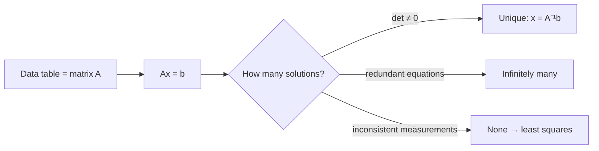
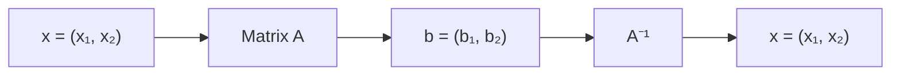
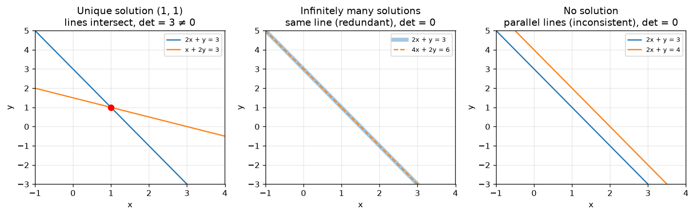
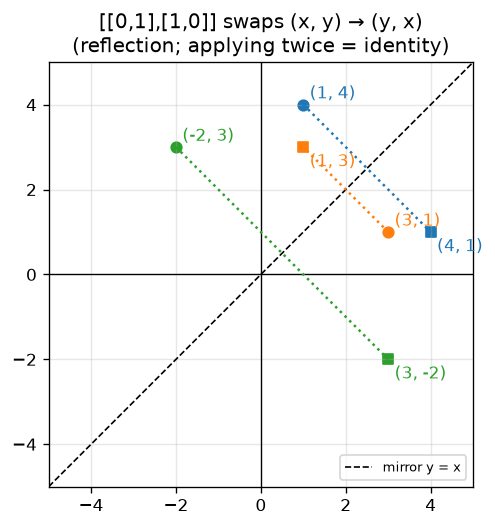
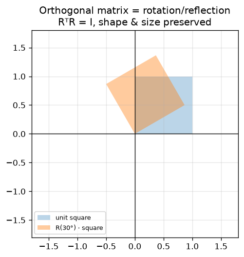

# 01 · Linear Systems, Determinant & Inverse

> **Course:** Applied Mathematics for Data Science & AI · Dr. Arulalan Rajan
>
> **Lectures:** Lecture 1 (16 Sep 2026) and Lecture 2, first half (19 Sep 2026)
>
> **Sources:** handwritten lecture notes pp. 1–12 (`Lecture notes till 3rd October.pdf`). No transcript for these dates.
>
> **Notebook:** [`code/linear_algebra_part1.ipynb`](code/linear_algebra_part1.ipynb), Parts A–B
>
> **Level:** 🟢 Basic → 🟡 Intermediate → 🔴 Advanced

---

## 📌 Table of Contents

1. [Big Picture](#1-big-picture)
2. [A Matrix is a Data Table](#2-a-matrix-is-a-data-table-)
3. [Linear Systems Ax = b](#3-linear-systems-ax--b-)
4. [The Three Possible Outcomes](#4-the-three-possible-outcomes-)
5. [Solving a General 2×2 System → the Determinant](#5-solving-a-general-22-system--the-determinant-)
6. [The Inverse Matrix](#6-the-inverse-matrix-)
7. [Matrices with Easy Inverses](#7-matrices-with-easy-inverses-)
8. [Why We Avoid Computing Inverses](#8-why-we-avoid-computing-inverses-)
9. [Connections to ML / Data Science](#9-connections-to-ml--data-science-)
10. [Common Confusions](#10--common-confusions)
11. [Practice Problems](#11--practice-problems)
12. [Cheat Sheet](#12--cheat-sheet)
13. [Go Deeper](#13--go-deeper-curated-links)

---

## 1. Big Picture

Almost every ML algorithm reduces to **linear algebra on a data matrix**: regression solves a (least-squares) linear system, PCA finds eigenvectors, and neural networks are stacks of matrix multiplications. This course starts at the root: **what does it mean to solve $`Ax = b`$, and when can we?**



---

## 2. A Matrix is a Data Table 🟢

A matrix is a **table of $`m`$ rows and $`n`$ columns**.

| | Meaning |
|---|---|
| **Every row** | **One observation** of $`n`$ variables |
| **Every column** | **$`m`$ observations** of a single variable |

**Example:** a hospital dataset with 1000 patients × 5 measurements (age, BP, sugar, cholesterol, BMI) is a $`1000 \times 5`$ matrix. Row 17 = everything about patient 17; column 3 = sugar levels of all patients.

> 🔗 This is exactly the `X` matrix in scikit-learn (MLP Note 02: "rows = samples, columns = features"). Keep this picture in mind through the whole course. The professor returns to it when explaining nullity as "redundant features" ([Note 05](05-Null-Space-and-Nullity.md)).

---

## 3. Linear Systems Ax = b 🟢

**Ex 1 (Lecture 1):**
```math
\begin{aligned} 2x + y &= 3 \\ x + 2y &= 3 \end{aligned}
\quad\Longrightarrow\quad
\underbrace{\begin{bmatrix} 2 & 1 \\ 1 & 2 \end{bmatrix}}_{A}
\underbrace{\begin{bmatrix} x \\ y \end{bmatrix}}_{x}
=
\underbrace{\begin{bmatrix} 3 \\ 3 \end{bmatrix}}_{b}
```
Solution: $`x = 1,\ y = 1`$.

**Two ways to read $`Ax = b`$ (the second matters later):**

1. **Row picture:** each equation is a line, and the solution is where the lines meet.
2. **Column picture:** $`x\begin{bmatrix}2\\1\end{bmatrix} + y\begin{bmatrix}1\\2\end{bmatrix} = \begin{bmatrix}3\\3\end{bmatrix}`$. Find how much of each **column** to mix to produce $`b`$. This is a **linear combination** ([Note 04](04-Span-Independence-Basis-Dimension.md)).

**The machine view (from the notes):**

$`A`$ **transforms** input $`x`$ into output $`b`$. Solving means **undoing** the transformation, which is what $`A^{-1}`$ does.

---

## 4. The Three Possible Outcomes 🟢



| Case | Example | Geometry | Why it happened |
|---|---|---|---|
| **Unique solution** | $`2x+y=3,\ x+2y=3`$ | Lines intersect at one point $`(1,1)`$ | Equations carry independent information |
| **Infinitely many** | $`2x+y=3,\ 4x+2y=6`$ | Same line twice | **Redundant equations** (eq 2 = 2 × eq 1) |
| **No solution** | $`2x+y=3,\ 2x+y=4`$ | Parallel lines | **Measurement inconsistency** |

### Infinitely many solutions (Ex 2)
Both equations say $`y = 3 - 2x`$, so every point on that line works:

| $`x`$ | 1 | 0 | 1.5 | 2 | … |
|---|---|---|---|---|---|
| $`y`$ | 1 | 3 | 0 | −1 | … |

General ("representative") solution: $`\begin{pmatrix}x\\y\end{pmatrix} = \begin{pmatrix}x\\3-2x\end{pmatrix}`$.

### No solution (Ex 3): what do we do?
The same quantity $`2x+y`$ was "measured" as 3 and as 4: a **measurement inconsistency** (real sensors are noisy). Since an exact solution doesn't exist, we look for the **least-squares solution**: the $`x`$ that makes $`Ax`$ **as close as possible** to $`b`$.
```math
\hat x = \arg\min_x \|Ax - b\|^2
```
In the notes: *"the soln that takes you to a destination closer to the actual one"*, with the squared error (variance) being minimised.

For Ex 3, least squares gives $`Ax = (3.5, 3.5)`$, splitting the difference between 3 and 4 (notebook Part A).

> 🔗 **This is linear regression!** In MLP Note 03 we had 5 data points (5 equations) and 2 unknowns ($`m, c`$). No line passes through all points, so there is no exact solution, and OLS finds the least-squares one. The normal equation $`\mathbf w = (X^\top X)^{-1}X^\top \mathbf y`$ is the least-squares solution of $`X\mathbf w = \mathbf y`$.

### 🔴 Rank criterion (preview of Note 02)
For $`Ax=b`$ with $`n`$ unknowns:

- $`\text{rank}(A) \ne \text{rank}([A\,|\,b])`$ → **no solution**
- $`\text{rank}(A) = \text{rank}([A\,|\,b]) = n`$ → **unique**
- $`\text{rank}(A) = \text{rank}([A\,|\,b]) < n`$ → **infinitely many**

---

## 5. Solving a General 2×2 System → the Determinant 🟢

```math
\begin{aligned}
a_{11}x_1 + a_{12}x_2 &= b_1 \quad (1)\\
a_{21}x_1 + a_{22}x_2 &= b_2 \quad (2)
\end{aligned}
```

**Eliminate $`x_2`$:** multiply (1) by $`a_{22}`$ and (2) by $`a_{12}`$, then subtract:
```math
\begin{aligned}
a_{11}a_{22}x_1 + a_{12}a_{22}x_2 &= a_{22}b_1\\
-\;(a_{12}a_{21}x_1 + a_{12}a_{22}x_2 &= a_{12}b_2)\\ \hline
x_1(a_{11}a_{22} - a_{12}a_{21}) &= b_1a_{22} - b_2a_{12}
\end{aligned}
```
```math
x_1 = \frac{b_1a_{22} - b_2a_{12}}{a_{11}a_{22} - a_{12}a_{21}}, \qquad
x_2 = \frac{b_2a_{11} - b_1a_{21}}{a_{11}a_{22} - a_{12}a_{21}}
\qquad \text{provided the denominator} \ne 0
```

The denominator decides everything, so it gets a name:
```math
\boxed{\det(A) = a_{11}a_{22} - a_{12}a_{21}}
```

### What the determinant means 🟡

| View | Meaning |
|---|---|
| Algebraic | If $`\det A \ne 0`$, the formula works and the solution is unique |
| **Geometric** | $`\lvert\det A\rvert`$ = **area scaling factor**. $`A`$ maps the unit square to a parallelogram of area $`\lvert\det A\rvert`$ |
| Sign | Negative → orientation flipped (a reflection is involved) |
| $`\det A = 0`$ | $`A`$ squashes the plane onto a line (or point), so information is lost and can't be undone |

Check: Ex 1 has $`\det = 2·2 - 1·1 = 3 \ne 0`$ (unique). Ex 2 has $`\det = 2·2 - 1·4 = 0`$ (not unique).

---

## 6. The Inverse Matrix 🟢

Writing the solution as a matrix times $`b`$:
```math
\begin{bmatrix}x_1\\x_2\end{bmatrix}
= \underbrace{\frac{1}{\det A}\begin{bmatrix} a_{22} & -a_{12}\\ -a_{21} & a_{11}\end{bmatrix}}_{A^{-1}}
\begin{bmatrix}b_1\\b_2\end{bmatrix}
\qquad\Longrightarrow\qquad \boxed{x = A^{-1}b}
```
```math
A^{-1} = \frac{\operatorname{Adj}(A)}{\det(A)}
```
**2×2 recipe:** *swap the diagonal elements, negate the off-diagonal elements, divide by the determinant.*

**Ex 1:** $`A = \begin{bmatrix}2&1\\1&2\end{bmatrix}`$, $`\det = 3`$, so $`A^{-1} = \frac13\begin{bmatrix}2&-1\\-1&2\end{bmatrix}`$ and $`x = A^{-1}\begin{bmatrix}3\\3\end{bmatrix} = \begin{bmatrix}1\\1\end{bmatrix}`$ ✅

> 📝 *Notes p.5:* the underbrace labelled $`\det(A)`$ is drawn under $`\frac{1}{a_{11}a_{22}-a_{21}a_{12}}`$. Only the **denominator** is $`\det(A)`$; the whole fraction is $`1/\det(A)`$.

### The professor's three questions (p. 6) — answered

1. **Does $`A^{-1}`$ exist for all matrices?** No. It exists only for **square** matrices with $`\det A \ne 0`$ (called *non-singular* or *invertible*).
2. **What if $`\det(A) = 0`$?** No inverse. $`Ax = b`$ has either no solution or infinitely many. Geometrically, $`A`$ collapses space, and you can't recover which input produced the output.
3. **Are there matrices whose inverse is easy?** Yes → Section 7.

**Analogy (side note in the notes: $`y = x^3`$, $`y = -8 \Rightarrow x = ?`$):** $`x^3`$ is invertible ($`x = -2`$, uniquely). But $`y = x^2`$ with $`y = 4`$ gives $`x = \pm 2`$: two inputs give the same output, so there's no unique inverse. A matrix with $`\det = 0`$ is like $`x^2`$: many inputs map to the same output.

---

## 7. Matrices with Easy Inverses 🟡

Computing $`A^{-1}`$ is expensive in general, so the professor ranked the "easy" cases.

### 7.1 Best case: A⁻¹ = A (self-inverse)
**Identity** $`I = \begin{bmatrix}1&0\\0&1\end{bmatrix}`$: $`Ix = x`$, so $`I^{-1} = I`$.

**Q (p.7):** *Are there more 2×2 matrices with $`A^{-1} = A`$?* (Lecture 2)

Find $`A`$ with $`A\begin{bmatrix}x\\y\end{bmatrix} = \begin{bmatrix}y\\x\end{bmatrix}`$ (swap): $`ax+by=y,\ cx+dy=x`$ gives $`a=0, b=1, c=1, d=0`$.
```math
F = \begin{bmatrix}0&1\\1&0\end{bmatrix},\qquad F F \begin{bmatrix}x\\y\end{bmatrix} = F\begin{bmatrix}y\\x\end{bmatrix} = \begin{bmatrix}x\\y\end{bmatrix} \;\Rightarrow\; F^{-1} = F
```



- $`F`$ is a **reflection about the line $`y = x`$** (the mirror).
- Points **on** the mirror don't move: $`F\begin{bmatrix}1\\1\end{bmatrix} = \begin{bmatrix}1\\1\end{bmatrix}`$. (These are its *eigenvectors with eigenvalue 1*, a preview.)
- **Every reflection about a line through the origin is its own inverse.** Reflect twice and you're back. In general, reflection about the line at angle $`\theta`$ is $`\begin{bmatrix}\cos2\theta&\sin2\theta\\\sin2\theta&-\cos2\theta\end{bmatrix}`$ (notebook Part B verifies $`R^2 = I`$).
- **Swap matrices also perform row swaps** in Gaussian elimination ([Note 02](02-Gaussian-Elimination-Row-Operations-Rank.md)).

### 7.2 Next best: diagonal matrices
```math
D = \begin{bmatrix}d_1&0\\0&d_2\end{bmatrix}, \quad D\begin{bmatrix}x\\y\end{bmatrix} = \begin{bmatrix}d_1x\\d_2y\end{bmatrix}, \quad
D^{-1} = \begin{bmatrix}1/d_1&0\\0&1/d_2\end{bmatrix} \quad (d_1, d_2 \ne 0)
```
Each variable is scaled independently, so **the equations are decoupled**: $`ax = c \Rightarrow x = c/a`$, $`by = d \Rightarrow y = d/b`$.

**Anti-diagonal variant (Ex 2, p.11):** $`\begin{bmatrix}0&d_1\\d_2&0\end{bmatrix}\begin{bmatrix}x\\y\end{bmatrix} = \begin{bmatrix}c\\d\end{bmatrix}`$ gives $`y = c/d_1`$, $`x = d/d_2`$. Still trivial. $`\det = -d_1d_2`$, $`\operatorname{Adj} = \begin{bmatrix}0&-d_1\\-d_2&0\end{bmatrix}`$. (It's a diagonal matrix combined with a swap.) The zeros on the main diagonal mean there's no **pivot** there, so a row swap is needed to bring non-zeros onto the diagonal (Note 02).

> 🔗 **Why ML loves diagonal matrices:** eigen-decomposition $`A = PDP^{-1}`$ and SVD $`A = U\Sigma V^\top`$ rewrite hard matrices in terms of **diagonal** ones. That is how PCA works.

### 7.3 Third best: orthogonal matrices (A⁻¹ = Aᵀ)
Transpose is free (just re-index), so we want $`A^\top A = I`$:
```math
\begin{bmatrix}a_{11}&a_{21}\\a_{12}&a_{22}\end{bmatrix}\begin{bmatrix}a_{11}&a_{12}\\a_{21}&a_{22}\end{bmatrix}
= \begin{bmatrix}a_{11}^2+a_{21}^2 & a_{11}a_{12}+a_{21}a_{22}\\ a_{12}a_{11}+a_{22}a_{21} & a_{12}^2+a_{22}^2\end{bmatrix} = \begin{bmatrix}1&0\\0&1\end{bmatrix}
```
```math
\boxed{a_{11}^2+a_{21}^2 = a_{12}^2+a_{22}^2 = 1, \qquad a_{11}a_{12}+a_{21}a_{22} = 0}
```
**Interpretation:** each **column has length 1** and the **columns are perpendicular** (dot product 0). Columns are *orthonormal*.

**Classic example, rotation by θ:**
```math
R_\theta = \begin{bmatrix}\cos\theta&-\sin\theta\\\sin\theta&\cos\theta\end{bmatrix},\qquad \cos^2\theta + \sin^2\theta = 1,\quad -\cos\theta\sin\theta + \sin\theta\cos\theta = 0 \;✓
```
$`R_\theta^{-1} = R_\theta^\top = R_{-\theta}`$: rotating back by $`-\theta`$ undoes it.



Orthogonal matrices **preserve lengths and angles** ($`\|Qx\| = \|x\|`$). They're rigid motions: rotations and reflections. $`\det = \pm1`$.

> 🔗 **Where they appear:** PCA's principal axes, the $`U, V`$ in SVD, QR decomposition (numerically stable least squares), orthogonal weight initialisation in deep nets, and rotations in computer vision / robotics.

### Summary ranking

| Rank | Type | Inverse | Cost |
|---|---|---|---|
| 1 | Identity / reflection | $`A^{-1} = A`$ | Free |
| 2 | Diagonal (non-zero entries) | Reciprocals | $`O(n)`$ |
| 3 | Orthogonal | $`A^{-1} = A^\top`$ | Free (transpose) |
| — | General | $`\operatorname{Adj}/\det`$ or elimination | $`O(n^3)`$ |

---

## 8. Why We Avoid Computing Inverses 🟡

The notes (p.13): *"$`A^{-1}`$ is difficult to compute. Do we have a technique that gets $`x`$ without computing the inverse?"* Yes: **Gaussian elimination** ([Note 02](02-Gaussian-Elimination-Row-Operations-Rank.md)).

🔴 **Practical rule (numerical linear algebra):** never compute `inv(A) @ b`. Use `np.linalg.solve(A, b)` (LU factorisation). It's ~2–3× faster and more accurate. For $`n = 1000`$: cofactor/adjugate expansion is astronomically slow ($`O(n!)`$), elimination is $`O(n^3/3)`$.

---

## 9. Connections to ML / Data Science 🟡

| Linear-algebra idea | ML appearance |
|---|---|
| Matrix rows/cols | Dataset: samples × features |
| $`Ax = b`$ unique solution | Exactly-determined system (rare in practice) |
| No solution → least squares | **Linear regression** (MLP Note 03) |
| Infinitely many solutions | Redundant features → non-unique weights → need **regularisation** |
| $`\det = 0`$ / singular | $`X^\top X`$ not invertible when features are collinear |
| Orthogonal matrices | PCA axes, QR solvers, rotations |
| Diagonal matrices | Feature scaling (`StandardScaler` is a diagonal matrix!), eigenvalues |

---

## 10. ⚠️ Common Confusions

| Confusion | Clarification |
|---|---|
| "No solution" means the problem is useless | Use least squares: the best approximate answer |
| $`\det(A)`$ is the fraction $`1/(\dots)`$ | $`\det(A) = a_{11}a_{22}-a_{12}a_{21}`$; the inverse uses $`1/\det`$ |
| Every square matrix has an inverse | Only if $`\det \ne 0`$ |
| Non-square matrices have inverses | No (they may have *pseudo-inverses*, used in least squares) |
| Orthogonal = columns perpendicular | Also needs **unit length** (orthonormal) |
| Infinitely many solutions = any $`(x,y)`$ works | Only points on the shared line work |

---

## 11. 📝 Practice Problems

<details>
<summary><b>P1.</b> Solve $`3x + 2y = 7,\ x - y = -1`$ using the inverse formula.</summary>

$`A = \begin{bmatrix}3&2\\1&-1\end{bmatrix}`$, $`\det = -3-2 = -5`$. $`A^{-1} = \frac{1}{-5}\begin{bmatrix}-1&-2\\-1&3\end{bmatrix} = \begin{bmatrix}0.2&0.4\\0.2&-0.6\end{bmatrix}`$. $`x = A^{-1}(7,-1)^\top = (1.4-0.4,\ 1.4+0.6) = (1, 2)`$. Check: $`3+4 = 7`$ ✓, $`1-2 = -1`$ ✓.
</details>

<details>
<summary><b>P2.</b> For what $`k`$ does $`x + ky = 2,\ 3x + 6y = 5`$ have no unique solution? Which case occurs?</summary>

$`\det = 6 - 3k = 0 \Rightarrow k = 2`$. Then eq1 × 3: $`3x + 6y = 6 \ne 5`$ → parallel lines → **no solution**.
</details>

<details>
<summary><b>P3.</b> Show that $`\begin{bmatrix}1&0\\0&-1\end{bmatrix}`$ is its own inverse. What does it do geometrically?</summary>

Squared gives $`I`$. It maps $`(x,y) \to (x,-y)`$: reflection about the x-axis.
</details>

<details>
<summary><b>P4.</b> Is $`\frac{1}{5}\begin{bmatrix}3&-4\\4&3\end{bmatrix}`$ orthogonal? Find its inverse.</summary>

Columns $`(0.6, 0.8)`$ and $`(-0.8, 0.6)`$: lengths 1, dot product $`-0.48+0.48 = 0`$ → orthogonal. Inverse = transpose $`= \frac15\begin{bmatrix}3&4\\-4&3\end{bmatrix}`$. (Rotation by ≈53.13°.)
</details>

<details>
<summary><b>P5.</b> Find the least-squares solution of $`x = 1,\ x = 2,\ x = 6`$.</summary>

$`A = (1,1,1)^\top`$; normal equation $`A^\top A x = A^\top b \Rightarrow 3x = 9 \Rightarrow x = 3`$, the **mean**. (Same as "Case 1: predict the mean" in MLP regression.)
</details>

<details>
<summary><b>P6.</b> Without computing, why must $`\begin{bmatrix}2&4\\3&6\end{bmatrix}`$ be singular?</summary>

Column 2 = 2 × column 1 (or row 2 = 1.5 × row 1). The columns point in the same direction, so the parallelogram has zero area and $`\det = 0`$.
</details>

---

## 12. 🧾 Cheat Sheet

- Matrix: rows = observations, columns = variables.
- $`Ax=b`$ has **one / infinitely many / no** solutions. Infinitely many comes from redundant equations; none comes from inconsistent ones, and then we use **least squares** ($`\min\|Ax-b\|^2`$).
- $`\det\begin{bmatrix}a&b\\c&d\end{bmatrix} = ad - bc`$, the area scaling factor; $`\det = 0`$ means singular.
- $`A^{-1} = \frac{1}{ad-bc}\begin{bmatrix}d&-b\\-c&a\end{bmatrix}`$; $`x = A^{-1}b`$.
- Easy inverses: $`I`$, reflections ($`A^{-1}=A`$), diagonal (reciprocals), orthogonal ($`A^{-1}=A^\top`$, orthonormal columns).
- In code, use `np.linalg.solve`, never `inv`.

---

## 13. 📚 Go Deeper: Curated Links

| Topic | Why | Link |
|---|---|---|
| The professor's own NPTEL course | Same instructor, same geometric style | [NPTEL — Linear Algebra Through Geometry](https://nptel.ac.in/courses/106108482) · [course page](https://onlinecourses.nptel.ac.in/noc25_cs129/preview) |
| Matrices as transformations | The "box A" picture, visually | [3Blue1Brown — Linear transformations and matrices](https://www.youtube.com/watch?v=kYB8IZa5AuE) |
| Determinant as area | Geometric meaning of det | [3Blue1Brown — The determinant](https://www.youtube.com/watch?v=Ip3X9LOh2dk) |
| Inverse, singular matrices | When and why inverses fail | [3Blue1Brown — Inverse matrices, column space and null space](https://www.youtube.com/watch?v=uQhTuRlWMxw) |
| Row & column picture | Strang's classic first lecture | [MIT 18.06 — L1: The Geometry of Linear Equations](https://www.youtube.com/watch?v=J7DzL2_Na80) |
| Inverses (Gauss–Jordan) | Computing $`A^{-1}`$ properly | [MIT 18.06 — L3: Multiplication and Inverse Matrices](https://www.youtube.com/watch?v=FX4C-JpTFgY) |
| Least squares for data science | Boyd's applied text (free PDF, course textbook #3) | [Boyd & Vandenberghe — Intro to Applied Linear Algebra (VMLS)](https://web.stanford.edu/~boyd/vmls/) |
| Free textbook | Strang's book site (course textbook #2) | [Gilbert Strang — Introduction to Linear Algebra](https://math.mit.edu/~gs/linearalgebra/) |
| ML-oriented maths | Ch. 2 (linear algebra), Ch. 9 (regression as least squares) | [Mathematics for Machine Learning (free)](https://mml-book.github.io/) |

**Course reference books (from notes p.19):** Farin & Hansford, *Practical Linear Algebra* · Gilbert Strang, *Linear Algebra* (5th ed.) · Stephen Boyd, *Intro to Applied Linear Algebra* · NPTEL *Advanced Matrix Theory* (Prof. Vittal Rao) · NPTEL *Linear Algebra through Geometry* (Ashok Rao & Arulalan Rajan)

---
[Applied Math Index](README.md) · ➡️ [02 · Gaussian Elimination, Row Operations & Rank](02-Gaussian-Elimination-Row-Operations-Rank.md)
