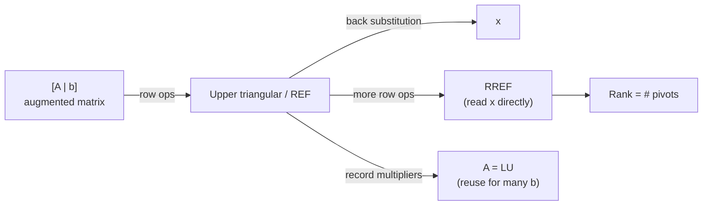
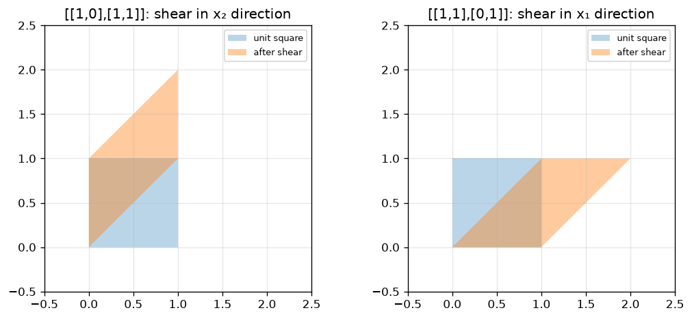
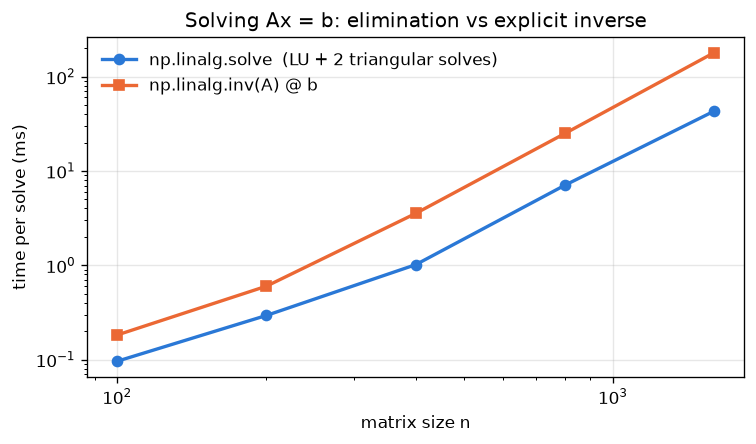
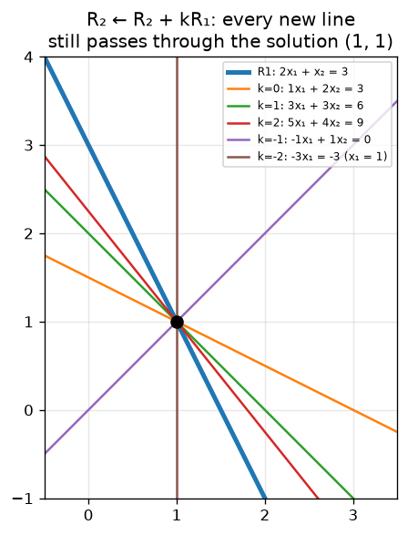
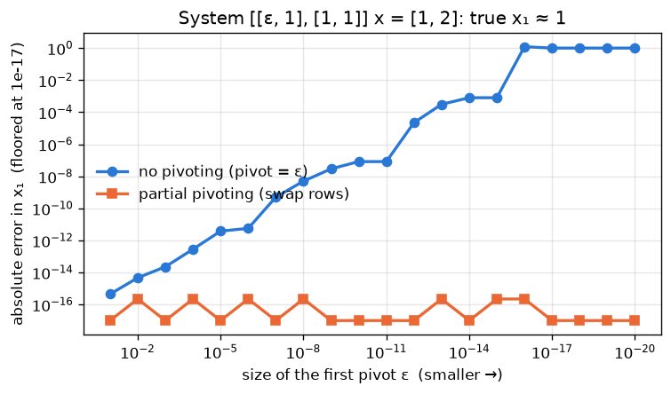

# 02 · Gaussian Elimination, Row Operations, Homogeneous Systems & Rank

> **Course:** Applied Mathematics for Data Science & AI · Dr. Arulalan Rajan
>
> **Lectures:** Lecture 2, second half (19 Sep 2026) and Lecture 3 (23 Sep 2026)
>
> **Sources:** handwritten lecture notes pp. 13–29. No transcript for these dates.
>
> **Notebooks:** [`code/linear_algebra_part1.ipynb`](code/linear_algebra_part1.ipynb), Part C · deep dive: [`code/02_elimination_deep_dive.ipynb`](code/02_elimination_deep_dive.ipynb) (Parts A–H: elimination printer, LU, pivoting, timing, rank, applications, practice-problem checks)

---

## 📌 Table of Contents

1. [Big Picture](#1-big-picture)
2. [Gaussian Elimination + Back Substitution](#2-gaussian-elimination--back-substitution-)
3. [Triangular Matrices and LU Decomposition](#3-triangular-matrices-and-lu-decomposition-)
4. [Row Echelon Form (REF): 5×3 Worked Example](#4-row-echelon-form-ref-53-worked-example-)
5. [Reduced Row Echelon Form (RREF)](#5-reduced-row-echelon-form-rref-)
6. [Elementary Row Operations = Matrices](#6-elementary-row-operations--matrices-)
7. [Why Row Operations Don't Change the Solution (Geometry)](#7-why-row-operations-dont-change-the-solution-geometry-)
8. [Homogeneous Systems Ax = 0](#8-homogeneous-systems-ax--0-)
9. [Rank of a Matrix](#9-rank-of-a-matrix-)
10. [Partial Pivoting and Floating-Point Arithmetic](#10-partial-pivoting-and-floating-point-arithmetic-)
11. [Real-World Case Studies](#11--real-world-case-studies)
12. [Side Note: Galois & Finite Fields](#12-side-note-galois--finite-fields-)
13. [Common Confusions](#13--common-confusions)
14. [Practice Problems](#14--practice-problems)
15. [Cheat Sheet](#15--cheat-sheet)
16. [Go Deeper](#16--go-deeper-curated-links)

---

## 1. Big Picture

Note 01 ended with: *"$`A^{-1}`$ is difficult to compute. Can we get $`x`$ without it?"* **Gaussian elimination** is the answer. It's how computers (and LAPACK/NumPy) actually solve linear systems.

The idea: apply **simple, reversible row operations** that **never change the solution**, until the system becomes **triangular**, then solve from the bottom up.



> 📝 The notes label Gaussian elimination "Iterative". Strictly, it is a **direct** method: a fixed, finite number of steps gives the exact answer, up to rounding. "Iterative" methods (Jacobi, Gauss–Seidel, conjugate gradient, gradient descent!) produce a sequence of improving approximations. Read the note as "step-by-step".

**What this note proves** (each with a worked example):

| Result | Where |
|---|---|
| Row operations never change the solution set | §6.4 |
| Elimination = factorisation $`A = LU`$ (or $`PA = LU`$), cost about $`\frac23 n^3`$ | §2.3, §3.2 |
| The RREF of a matrix is unique | §5.2 |
| All solutions of $`Ax = b`$ are $`x_p + (\text{null space})`$ | §8.4 |
| Row rank = column rank; $`\text{rank}(AB) \le \min`$; $`\text{rank}(A^\top A) = \text{rank}(A)`$ | §9.2 |
| Rouché–Capelli: when is $`Ax = b`$ solvable, and how many solutions | §9.3 |
| Why pivoting is needed in floating point | §10 |

---

## 2. Gaussian Elimination + Back Substitution 🟢

**Example (notes p.13):**

```math
\begin{aligned}
x_1 + x_2 + x_3 &= 3\\
x_1 - x_2 + x_3 &= 1\\
x_1 + x_2 - x_3 &= 1
\end{aligned}
\qquad\Longrightarrow\qquad
[A\,|\,b] = \left[\begin{array}{ccc|c} 1 & 1 & 1 & 3\\ 1 & -1 & 1 & 1\\ 1 & 1 & -1 & 1\end{array}\right]
```

The **augmented matrix** $`[A\,|\,b]`$ carries $`b`$ along so the same operations apply to both sides.

**Step 1: eliminate $`x_1`$ from rows 2 and 3** (pivot = the 1 in position (1,1)):

```math
R_2 \leftarrow R_2 - R_1,\quad R_3 \leftarrow R_3 - R_1:\qquad
\left[\begin{array}{ccc|c} 1 & 1 & 1 & 3\\ 0 & -2 & 0 & -2\\ 0 & 0 & -2 & -2\end{array}\right]
```

This is already **upper triangular**.

**Step 2: back substitution** (bottom row first):

```math
-2x_3 = -2 \Rightarrow x_3 = 1;\qquad -2x_2 = -2 \Rightarrow x_2 = 1;\qquad x_1 + 1 + 1 = 3 \Rightarrow x_1 = 1
```

✅ $`x = (1, 1, 1)`$. Check in the original equations: $`3, 1, 1`$ ✓.

### 2.1 The general algorithm

For each column $`j = 1, 2, \dots`$:

1. Find a **pivot**: a non-zero entry in column $`j`$ at or below row $`j`$. If needed, **swap** rows to bring it up.
2. For every row $`i`$ below, do $`R_i \leftarrow R_i - \frac{a_{ij}}{a_{jj}} R_j`$. The fraction $`\ell_{ij} = \frac{a_{ij}}{a_{jj}}`$ is called the **multiplier**.
3. Move to the next column. If column $`j`$ has no non-zero entry at or below the current row, skip it: that column will have no pivot (a **free** column).

Then back-substitute: for $`i = n, n-1, \dots, 1`$,

```math
x_i = \frac{1}{u_{ii}}\Big(c_i - \sum_{j=i+1}^{n} u_{ij}\,x_j\Big)
```

where $`U = (u_{ij})`$ is the triangular matrix and $`c`$ the transformed right-hand side. This needs every $`u_{ii} \ne 0`$, i.e. $`n`$ pivots.

**Assumptions and edge cases.**

- A pivot must be **non-zero**. A zero in the pivot position is not a failure: swap with a lower row that has a non-zero entry. Only if the whole column below is zero is there no pivot, and then $`A`$ is singular (square case).
- The determinant comes for free: each replacement keeps $`\det`$, each swap flips its sign, so

```math
\det A = (-1)^{\#\text{swaps}} \times (\text{product of the pivots})
```

### 2.2 Worked example: Gauss–Jordan with a forced row swap 🟡

Solve

```math
\begin{aligned}
2y + z &= 1\\
x - 2y - 3z &= -5\\
-x + y + 2z &= 3
\end{aligned}
\qquad
[A\,|\,b] = \left[\begin{array}{ccc|c} 0 & 2 & 1 & 1\\ 1 & -2 & -3 & -5\\ -1 & 1 & 2 & 3\end{array}\right]
```

The (1,1) entry is 0, so it cannot be a pivot. **Swap** $`R_1 \leftrightarrow R_2`$:

```math
\left[\begin{array}{ccc|c} 1 & -2 & -3 & -5\\ 0 & 2 & 1 & 1\\ -1 & 1 & 2 & 3\end{array}\right]
\xrightarrow{R_3 \leftarrow R_3 + R_1}
\left[\begin{array}{ccc|c} 1 & -2 & -3 & -5\\ 0 & 2 & 1 & 1\\ 0 & -1 & -1 & -2\end{array}\right]
```

Scale the second pivot to 1 and clear column 2 **above and below** (Gauss–Jordan):

```math
\xrightarrow{R_2 \leftarrow \frac12 R_2}
\left[\begin{array}{ccc|c} 1 & -2 & -3 & -5\\ 0 & 1 & \tfrac12 & \tfrac12\\ 0 & -1 & -1 & -2\end{array}\right]
\xrightarrow[R_3 \leftarrow R_3 + R_2]{R_1 \leftarrow R_1 + 2R_2}
\left[\begin{array}{ccc|c} 1 & 0 & -2 & -4\\ 0 & 1 & \tfrac12 & \tfrac12\\ 0 & 0 & -\tfrac12 & -\tfrac32\end{array}\right]
```

Third pivot:

```math
\xrightarrow{R_3 \leftarrow -2R_3}
\left[\begin{array}{ccc|c} 1 & 0 & -2 & -4\\ 0 & 1 & \tfrac12 & \tfrac12\\ 0 & 0 & 1 & 3\end{array}\right]
\xrightarrow[R_2 \leftarrow R_2 - \frac12 R_3]{R_1 \leftarrow R_1 + 2R_3}
\left[\begin{array}{ccc|c} 1 & 0 & 0 & 2\\ 0 & 1 & 0 & -1\\ 0 & 0 & 1 & 3\end{array}\right]
```

✅ $`(x, y, z) = (2, -1, 3)`$.

**Sanity check:** $`2(-1) + 3 = 1`$ ✓, $`2 + 2 - 9 = -5`$ ✓, $`-2 - 1 + 6 = 3`$ ✓.
**Bonus:** the pivots before scaling were $`1, 2, -\tfrac12`$ with one swap, so $`\det A = (-1)^1 \cdot (1)(2)(-\tfrac12) = 1`$ (SymPy agrees; notebook Part A prints every step).

### 2.3 How much work? Deriving the 2n³/3 operation count 🔴

At elimination step $`k`$ (pivot in column $`k`$) there are $`n-k`$ rows below the pivot. For each of them:

- 1 division to form the multiplier $`\ell_{ik}`$,
- $`n-k`$ multiplications and $`n-k`$ subtractions to update the rest of the row.

So step $`k`$ costs about $`2(n-k)^2`$ flops. Summing with $`j = n-k`$:

```math
\sum_{j=1}^{n-1} 2j^2 = \frac{2(n-1)n(2n-1)}{6} = \frac{(n-1)n(2n-1)}{3} \approx \frac{2}{3}n^3
```

using $`\sum_{j=1}^{N} j^2 = \frac{N(N+1)(2N+1)}{6}`$ with $`N = n-1`$. Updating $`b`$ and back substitution cost about $`n^2`$ each.

| $`n`$ | exact $`\frac{(n-1)n(2n-1)}{3}`$ | approximation $`\frac23n^3`$ | explicit inverse $`\approx 2n^3`$ | cofactor expansion $`\approx n!`$ |
|---|---|---|---|---|
| 3 | 10 | 18 | 54 | 6 |
| 10 | 570 | 667 | 2,000 | 3,628,800 |
| 100 | 656,700 | 666,667 | 2,000,000 | $`9.3\times10^{157}`$ |

For $`n = 20`$, $`20! \approx 2.4\times10^{18}`$ while $`\frac23 n^3 \approx 5{,}333`$. At $`10^{10}`$ flops per second, $`20!`$ operations take about **7.7 years**; elimination takes under a microsecond.

---

## 3. Triangular Matrices and LU Decomposition 🟢

```math
\underbrace{\begin{bmatrix}*&*&*&*\\0&*&*&*\\0&0&*&*\\0&0&0&*\end{bmatrix}}_{\text{upper triangular}}
\qquad\qquad
\underbrace{\begin{bmatrix}*&0&0&0\\ *&*&0&0\\ *&*&*&0\\ *&*&*&*\end{bmatrix}}_{\text{lower triangular}}
```

| | Upper triangular $`U`$ | Lower triangular $`L`$ |
|---|---|---|
| Zeros | **below** the diagonal | **above** the diagonal |
| Solve by | **back** substitution (last row first) | **forward** substitution (first row first) |
| Cost | about $`n^2`$ flops | about $`n^2`$ flops |

Why triangular matrices are great:

- They are trivially solvable, one variable at a time.
- $`\det`$ = product of the diagonal entries (expand along the first column repeatedly).
- Products and inverses of upper (lower) triangular matrices are again upper (lower) triangular.

### 3.1 Elimination secretly computes A = LU 🟡

Each replacement step $`R_i \leftarrow R_i - \ell_{ij}R_j`$ is multiplication by an elementary matrix $`E_{ij}`$ (identity with $`-\ell_{ij}`$ in position $`(i,j)`$, see §6). For a 3×3 matrix with no swaps:

```math
E_{32}E_{31}E_{21}\,A = U
\quad\Longrightarrow\quad
A = E_{21}^{-1}E_{31}^{-1}E_{32}^{-1}\,U = LU,
\qquad
L = \begin{bmatrix}1&0&0\\ \ell_{21}&1&0\\ \ell_{31}&\ell_{32}&1\end{bmatrix}
```

**Why the multipliers drop straight into $`L`$:** $`E_{ij}^{-1}`$ has $`+\ell_{ij}`$ in position $`(i,j)`$ (undo a subtraction by adding). Multiplying the inverses in the order $`E_{21}^{-1}E_{31}^{-1}E_{32}^{-1}`$ never makes two multipliers interact, so each $`\ell_{ij}`$ lands in its own slot. (In the opposite order, $`E_{32}E_{31}E_{21}`$, they *do* interact, which is why we store $`L`$ and not $`L^{-1}`$.)

**Theorem (existence).** 🔴 If every leading principal minor of an invertible $`A`$ is non-zero, then $`A = LU`$ with unit lower-triangular $`L`$ exists and is unique. For **every** square $`A`$ there is a permutation matrix $`P`$ with $`PA = LU`$: that is elimination with row swaps, which is what LAPACK computes.

Edge case: $`A`$ with rows $`(0, 1)`$ and $`(1, 1)`$ has **no** LU factorisation without a swap, since $`\ell_{11}u_{11} = a_{11} = 0`$ would force $`u_{11} = 0`$ and then $`\det A = 0`$, but $`\det A = -1`$.

**Payoff:** factor once ($`\frac23n^3`$), then each new right-hand side costs only two triangular solves ($`2n^2`$):

```math
Ax = b \iff L(Ux) = b:\qquad \text{solve } Ly = b \text{ (forward)},\quad \text{then } Ux = y \text{ (back)}
```

### 3.2 Worked example: LU of a 3×3, then two right-hand sides 🟡

```math
A = \begin{bmatrix}2&1&1\\4&-6&0\\-2&7&2\end{bmatrix},\qquad
b^{(1)} = \begin{bmatrix}5\\-2\\9\end{bmatrix},\qquad
b^{(2)} = \begin{bmatrix}1\\2\\3\end{bmatrix}
```

**Column 1** (pivot 2): $`\ell_{21} = 4/2 = 2`$, $`\ell_{31} = -2/2 = -1`$.
$`R_2 - 2R_1 = (0, -8, -2)`$, $`R_3 + R_1 = (0, 8, 3)`$.

**Column 2** (pivot −8): $`\ell_{32} = 8/(-8) = -1`$.
$`R_3 + R_2 = (0, 0, 1)`$.

```math
L = \begin{bmatrix}1&0&0\\2&1&0\\-1&-1&1\end{bmatrix},\qquad
U = \begin{bmatrix}2&1&1\\0&-8&-2\\0&0&1\end{bmatrix},\qquad
\det A = 2\cdot(-8)\cdot 1 = -16
```

**First right-hand side.** Forward, $`Ly = b^{(1)}`$: $`y_1 = 5`$, $`y_2 = -2 - 2(5) = -12`$, $`y_3 = 9 + 5 + (-12) = 2`$.
Back, $`Ux = y`$: $`x_3 = 2`$; $`-8x_2 - 2(2) = -12 \Rightarrow x_2 = 1`$; $`2x_1 + 1 + 2 = 5 \Rightarrow x_1 = 1`$. So $`x = (1, 1, 2)`$.

**Second right-hand side (no new elimination!).** $`y_1 = 1`$, $`y_2 = 2 - 2 = 0`$, $`y_3 = 3 + 1 + 0 = 4`$.
$`x_3 = 4`$; $`-8x_2 - 8 = 0 \Rightarrow x_2 = -1`$; $`2x_1 - 1 + 4 = 1 \Rightarrow x_1 = -1`$. So $`x = (-1, -1, 4)`$.

**Sanity check:** $`A(1,1,2)^\top = (2+1+2,\ 4-6,\ -2+7+4) = (5, -2, 9)`$ ✓; $`A(-1,-1,4)^\top = (-2-1+4,\ -4+6,\ 2-7+8) = (1, 2, 3)`$ ✓. NumPy's `det` gives −16 ✓.

> 💻 **Notebook Part B:** our own `lu_nopivot` reproduces exactly these $`L`$ and $`U`$. `scipy.linalg.lu` returns a *different* factorisation, $`A = PLU`$ with pivot 4 first (partial pivoting), and `lu_factor`/`lu_solve` reuse it for both right-hand sides.

---

## 4. Row Echelon Form (REF): 5×3 Worked Example 🟡

**REF ("staircase") rules:**

1. All-zero rows are at the **bottom**.
2. Each row's leading non-zero entry (**pivot**) is **strictly to the right** of the pivot in the row above.
3. Entries **below** each pivot are 0.

**Worked example (notes pp. 16–18):**

```math
A = \begin{bmatrix} 1&1&1\\ 1&1&1\\ 1&-1&1\\ 1&1&-1\\ -1&1&-1 \end{bmatrix}_{5\times3}
```

| Step | Operation | Result (rows) |
|---|---|---|
| 1 | $`R_2 \leftarrow R_2 - R_1`$ | $`R_2 = (0,0,0)`$, a zero row (rows 1 and 2 were identical) |
| 2 | $`R_2 \leftrightarrow R_5`$ (move the zero row down) | $`R_2 = (-1,1,-1)`$, $`R_5 = (0,0,0)`$ |
| 3 | $`R_2 \leftarrow R_2 + R_1`$ | $`R_2 = (0, 2, 0)`$, pivot **2** in column 2 |
| 4 | $`R_3 \leftarrow R_3 - R_1`$ | $`R_3 = (0,-2,0)`$ |
| 5 | $`R_4 \leftarrow R_4 - R_1`$ | $`R_4 = (0,0,-2)`$ |
| 6 | $`R_3 \leftarrow R_3 + R_2`$ | $`R_3 = (0,0,0)`$, another zero row |
| 7 | $`R_3 \leftrightarrow R_4`$ | zero rows to the bottom |

```math
\text{REF} = \begin{bmatrix} \boxed{1}&1&1\\ 0&\boxed{2}&0\\ 0&0&\boxed{-2}\\ 0&0&0\\ 0&0&0 \end{bmatrix}
```

**3 pivots → rank 3.** Two rows became zero, so 2 of the 5 equations (rows) were redundant. All 3 columns are independent. (Verified with NumPy and SymPy in the notebook.)

> 💡 **Reading zero rows:** a zero row means that equation was a **combination of the others**: no new information. For data, that's a duplicate or derived observation.

**REF is not unique.** The notebook's printer (Part A) eliminates in a different order (it uses $`R_3 = (1,-1,1)`$ as the second pivot row) and gets second row $`(0, -2, 0)`$ instead of $`(0, 2, 0)`$. Both are valid REFs. What *is* the same: the **pivot positions** and therefore the rank. Scaling any row of a REF gives another REF, so there are always infinitely many.

---

## 5. Reduced Row Echelon Form (RREF) 🟢

REF plus more cleaning. The four conditions (notes p.18):

1. Every **pivot is 1**.
2. Every element **below** a pivot is 0.
3. Every element **above** a pivot is also 0.
4. All-zero rows are at the **bottom**.

RREF of the 5×3 example:

```math
\text{RREF}(A) = \begin{bmatrix}1&0&0\\0&1&0\\0&0&1\\0&0&0\\0&0&0\end{bmatrix}
```

| | REF | RREF |
|---|---|---|
| Pivots | Any non-zero value | Exactly 1 |
| Above pivots | Anything | 0 |
| Unique for a given matrix? | ❌ No (many REFs) | ✅ **Yes** (exactly one) |
| Solve by | Back substitution | Read off directly |
| Algorithm name | Gaussian elimination | **Gauss–Jordan** elimination |
| Cost (square, $`n`$) | about $`\frac23 n^3`$ | about $`n^3`$ (also clears above the pivots) |

For the 3×3 system of §2, the RREF of $`[A\,|\,b]`$ is

```math
\left[\begin{array}{ccc|c}1&0&0&1\\0&1&0&1\\0&0&1&1\end{array}\right]
```

so you read off $`x_1 = x_2 = x_3 = 1`$.

**Pivot columns vs free columns:** columns *with* pivots correspond to **basic** variables; columns *without* pivots correspond to **free** variables, which can take any value and generate infinitely many solutions ([Note 05](05-Null-Space-and-Nullity.md)).

### 5.1 Reading solutions off the RREF

| RREF of $`[A\,|\,b]`$ contains… | Meaning |
|---|---|
| A row $`(0\ 0\ \cdots\ 0 \mid c)`$ with $`c \ne 0`$ | The equation $`0 = c`$: **no solution** |
| No such row, a pivot in every column of $`A`$ | **Unique** solution, read off the last column |
| No such row, some column of $`A`$ without a pivot | **Infinitely many**: one parameter per free column |

### 5.2 Why the RREF is unique (proof) 🔴

**Lemma (row operations preserve column relations).** For any vector $`c`$, $`Ac = 0 \iff EAc = 0`$ when $`E`$ is invertible. Since $`Ac = c_1a_1 + \dots + c_na_n`$, this says: *a linear relation holds among the columns of $`A`$ exactly when the same relation holds among the columns of $`EA`$.*

**Proof of uniqueness.** Let $`R`$ be any RREF of $`A`$. Read $`R`$ column by column:

1. Column $`j`$ of $`R`$ is a pivot column $`\iff`$ it is **not** a combination of columns $`1, \dots, j-1`$ of $`R`$ (a new pivot is a new unit vector $`e_i`$; a non-pivot column has zeros below the current pivot rows, so it lies in the span of the earlier pivot columns). By the lemma, this happens $`\iff`$ column $`j`$ of $`A`$ is not a combination of the earlier columns of $`A`$. So **the pivot positions are fixed by $`A`$**.
2. A pivot column of $`R`$ is the unit vector $`e_i`$ ($`i`$ = how many pivots so far), so it is fixed too.
3. A non-pivot column $`j`$ of $`R`$ equals $`\sum_i r_{ij}e_i`$ over the earlier pivot columns, so the entries $`r_{ij}`$ are the coefficients writing column $`j`$ as a combination of the earlier pivot columns. By the lemma the same coefficients work for $`A`$, and they are unique because the pivot columns of $`A`$ are linearly independent.

Every entry of $`R`$ is therefore determined by $`A`$ alone, so two RREFs of $`A`$ must coincide. ∎

> 💡 **Takeaway:** the RREF is a *fingerprint* of the column dependencies of $`A`$. That is why `sympy.Matrix.rref()` and hand working always agree, while REFs can differ.

---

## 6. Elementary Row Operations = Matrices 🟡

Lecture 3's key insight: **each row operation is multiplication by a simple matrix $`E`$**. These are called **elementary matrices**. Rule of thumb: **$`E`$ = the identity matrix with the same row operation applied to it.** (Reason: row $`i`$ of $`EA`$ is (row $`i`$ of $`E`$)·$`A`$, so whatever $`E`$ does to the rows of $`I`$, $`EA`$ does to the rows of $`A`$.)

### 6.1 Row swap Rᵢ ↔ Rⱼ

```math
\begin{bmatrix}2&1\\1&2\end{bmatrix}\begin{bmatrix}x_1\\x_2\end{bmatrix} = \begin{bmatrix}3\\3\end{bmatrix}
\;\xrightarrow{R_1\leftrightarrow R_2}\;
\begin{bmatrix}1&2\\2&1\end{bmatrix}\begin{bmatrix}x_1\\x_2\end{bmatrix} = \begin{bmatrix}3\\3\end{bmatrix}
```

The matrix that does it is

```math
E_{\text{swap}} = \begin{bmatrix}0&1\\1&0\end{bmatrix}
```

the **reflection/swap matrix** from Note 01. Swapping the order of equations obviously doesn't change the answer.

> 📝 The notes write "=" between the two augmented matrices. They are **row-equivalent** (written $`\sim`$), not equal.

### 6.2 Scaling: Rᵢ ← kRᵢ, with k ≠ 0

To scale the first component, we need $`E`$ with $`E\,(x_1, x_2)^\top = (kx_1, x_2)^\top`$. Matching coefficients gives

```math
E_{\text{scale}} = \begin{bmatrix}k&0\\0&1\end{bmatrix} \quad\text{or}\quad \begin{bmatrix}1&0\\0&k\end{bmatrix}\ (\text{scales the 2nd}),\qquad k\neq 0
```

Example: $`R_1 \leftarrow 4R_1`$ turns $`2x_1 + x_2 = 3`$ into $`8x_1 + 4x_2 = 12`$. **The same line, so the solution doesn't change.**

**Why $`k \ne 0`$?** Multiplying by 0 wipes the equation (information lost) and isn't reversible: $`\det E = k = 0`$. Concretely, applying $`R_2 \leftarrow 0\cdot R_2`$ to the system above leaves only $`2x_1 + x_2 = 3`$, whose solution set is a whole line instead of the single point $`(1,1)`$: the solution set **grew**.

### 6.3 Replacement: Rᵢ ← Rᵢ + kRⱼ (any real k)

```math
R_2 \leftarrow R_2 + kR_1:\quad \begin{bmatrix}2&1\\1+2k&2+k\end{bmatrix}\begin{bmatrix}x_1\\x_2\end{bmatrix} = \begin{bmatrix}3\\3+3k\end{bmatrix},
\qquad E_{\text{replace}} = \begin{bmatrix}1&0\\k&1\end{bmatrix}
```

**Geometrically, $`E`$ is a shear.** Apply it to the unit square (columns are its corners):



```math
\begin{bmatrix}1&0\\1&1\end{bmatrix}:\ (x_1, x_2) \to (x_1,\ x_2 + x_1)
\qquad\qquad
\begin{bmatrix}1&1\\0&1\end{bmatrix}:\ (x_1, x_2) \to (x_1 + x_2,\ x_2)
```

- The first is a **shear in the $`x_2`$ direction**: points slide up proportionally to $`x_1`$.
- The second is a **shear in the $`x_1`$ direction**.
- A shear keeps the **area** ($`\det = 1`$). Think of pushing the top of a deck of cards sideways.

### All three are invertible

```math
E_{\text{swap}} = \begin{bmatrix}0&1\\1&0\end{bmatrix},\qquad
E_{\text{scale}} = \begin{bmatrix}k&0\\0&1\end{bmatrix},\qquad
E_{\text{replace}} = \begin{bmatrix}1&0\\k&1\end{bmatrix}
```

| Operation | Matrix | $`\det E`$ | Inverse operation | $`E^{-1}`$ |
|---|---|---|---|---|
| Swap | $`E_{\text{swap}}`$ | −1 | Swap again | $`E_{\text{swap}}`$ itself |
| Scale by $`k`$ | $`E_{\text{scale}}`$ | $`k`$ | Scale by $`1/k`$ | diagonal $`(1/k, 1)`$ |
| Replace | $`E_{\text{replace}}`$ | 1 | Replace with $`-k`$ | $`k \to -k`$ |

Because every $`E`$ is invertible, $`EAx = Eb \iff Ax = b`$. **The solution set never changes.** Gaussian elimination is just $`E_k \cdots E_2 E_1 [A\,|\,b]`$.

### 6.4 Theorem: row operations preserve the solution set (proof) 🟡

**Theorem.** If $`[A'\,|\,b'] = E[A\,|\,b]`$ for an invertible $`E`$ (in particular, any product of elementary matrices), then $`Ax = b`$ and $`A'x = b'`$ have **exactly the same** solutions.

**Proof.** ($`\Rightarrow`$) If $`Ax = b`$, multiply on the left by $`E`$: $`EAx = Eb`$, i.e. $`A'x = b'`$.
($`\Leftarrow`$) If $`A'x = b'`$, multiply by $`E^{-1}`$: $`E^{-1}EAx = E^{-1}Eb`$, i.e. $`Ax = b`$. ∎

Both directions matter. Direction ($`\Rightarrow`$) holds for *any* $`E`$, even a non-invertible one, so a non-invertible operation can never lose a solution, but it can **add** fake ones (the $`k = 0`$ example in §6.2). Invertibility is exactly what blocks the extra solutions.

**Corollaries.**

1. $`\det(EA) = \det E \cdot \det A`$ with $`\det E \in \{-1, k, 1\}`$, so row operations never change whether $`\det A = 0`$: **invertibility is preserved**, and so is rank (§9).
2. If $`A`$ is invertible, elimination reaches $`I`$: $`E_k\cdots E_1A = I`$. Hence $`A^{-1} = E_k\cdots E_1`$ and $`A = E_1^{-1}\cdots E_k^{-1}`$: **every invertible matrix is a product of elementary matrices**.

### 6.5 Worked example: A⁻¹ by Gauss–Jordan 🟢

Corollary 2 gives an algorithm: apply the same operations to $`I`$. Row-reduce $`[A\,|\,I] \to [I\,|\,A^{-1}]`$.

```math
\left[\begin{array}{cc|cc}1&2&1&0\\3&7&0&1\end{array}\right]
\xrightarrow{R_2 \leftarrow R_2 - 3R_1}
\left[\begin{array}{cc|cc}1&2&1&0\\0&1&-3&1\end{array}\right]
\xrightarrow{R_1 \leftarrow R_1 - 2R_2}
\left[\begin{array}{cc|cc}1&0&7&-2\\0&1&-3&1\end{array}\right]
```

```math
A^{-1} = \begin{bmatrix}7&-2\\-3&1\end{bmatrix}
```

**Sanity check:** $`AA^{-1}`$ has entries $`7 - 6 = 1`$, $`-2 + 2 = 0`$, $`21 - 21 = 0`$, $`-6 + 7 = 1`$ ✓. Also $`\det A = 7 - 6 = 1`$, matching the adjugate formula of Note 01.

> ⚠️ In practice you almost never need $`A^{-1}`$ itself. To solve $`Ax = b`$, use `np.linalg.solve` (LU). Notebook Part D times it: computing `inv(A) @ b` was about 1.5–4× slower than `solve` for $`n`$ from 100 to 1600 on the test machine (timings vary by machine), and no more accurate.



---

## 7. Why Row Operations Don't Change the Solution (Geometry) 🟢

Take $`2x_1 + x_2 = 3`$ and $`x_1 + 2x_2 = 3`$ (solution $`(1,1)`$), and apply $`R_2 \leftarrow R_2 + kR_1`$:

```math
(1+2k)x_1 + (2+k)x_2 = 3 + 3k
```

| $`k`$ | New second equation |
|---|---|
| 0 | $`x_1 + 2x_2 = 3`$ (original) |
| 1 | $`3x_1 + 3x_2 = 6`$ (i.e. $`x_1 + x_2 = 2`$) |
| 2 | $`5x_1 + 4x_2 = 9`$ |
| −1 | $`-x_1 + x_2 = 0`$ |
| −2 | $`-3x_1 = -3 \Rightarrow x_1 = 1`$ (**$`x_2`$ eliminated!**) |



**Every new line passes through $`(1, 1)`$.** The row operation **rotates the second line about the solution point**. Gaussian elimination picks the special $`k`$ ($`k = -2`$ here) that makes the line vertical: one variable is gone, and the system is triangular.

**Why every line passes through $`(1,1)`$ (algebra):** the new equation is $`(\text{eq}_2) + k(\text{eq}_1)`$. At $`(1,1)`$ both original equations hold, so the left side equals $`3 + 3k`$, the right side, for every $`k`$. The family of lines $`\text{eq}_2 + k\,\text{eq}_1`$ is called a **pencil of lines** through the intersection point. The only line of the pencil that is *not* reached is $`\text{eq}_1`$ itself ($`k \to \infty`$), which is still kept as row 1.

> ✨ **The professor's conclusion:** *"With these row operations, the solution is guaranteed to remain the same."*

---

## 8. Homogeneous Systems Ax = 0 🟡

**Question (p.25):** *Given that $`Ax = b`$ has a solution, how do we know whether it's unique or there are infinitely many?*
**Answer: don't look at $`b`$; solve $`Ax = 0`$.**

$`Ax = 0`$ is the **homogeneous system**.

### 8.1 The trivial solution

$`x = 0`$ **always** solves $`Ax = 0`$. This is the **trivial solution**. So a homogeneous system is **never inconsistent**: the only question is whether it has more solutions.

### 8.2 Non-trivial solutions

Example: $`2x_1 + x_2 = 0,\ 4x_1 + 2x_2 = 0`$

| $`x_1`$ | 0 | 1 | −1 | 2 | −2 |
|---|---|---|---|---|---|
| $`x_2`$ | 0 | −2 | 2 | −4 | 4 |

A **non-trivial** solution: $`x_H = (1, -2)^\top`$.

### 8.3 The key argument (pp. 26–27)

If $`Ax_H = 0`$ with $`x_H \ne 0`$, then for any real $`k`$:

```math
A(kx_H) = k(Ax_H) = k\cdot 0 = 0
```

so **infinitely many** multiples also solve it. Now add this to any particular solution $`x_p`$ of $`Ax = b`$:

```math
\begin{aligned}
Ax_p &= b\\
+\; A(kx_H) &= 0\\ \hline
A(x_p + kx_H) &= b
\end{aligned}
```

```math
\boxed{\text{If } Ax = 0 \text{ has a non-trivial solution, then } Ax = b \text{ (if solvable) has infinitely many solutions.}}
```

**Counting shortcut:** if $`A`$ is $`m \times n`$ with $`m < n`$ (more unknowns than equations), then $`Ax = 0`$ **always** has a non-trivial solution: there are at most $`m`$ pivots, so at least $`n - m \ge 1`$ free variable.

### 8.4 Theorem: complete solution = particular + null space (proof) 🟡

Let $`N(A) = \{h : Ah = 0\}`$ (the **null space**) and suppose $`Ax_p = b`$. Then

```math
\{x : Ax = b\} = \{x_p + h : h \in N(A)\}
```

**Proof.** ($`\supseteq`$) $`A(x_p + h) = Ax_p + Ah = b + 0 = b`$.
($`\subseteq`$) If $`Ax = b`$, put $`h = x - x_p`$. Then $`Ah = Ax - Ax_p = b - b = 0`$, so $`h \in N(A)`$ and $`x = x_p + h`$. ∎

**Consequences.**

- The solution is unique $`\iff N(A) = \{0\}`$ (and a solution exists).
- Over $`\mathbb{R}`$, a linear system has **0, 1 or infinitely many** solutions, never exactly 2. If $`x_1 \ne x_2`$ both solve it, $`h = x_1 - x_2 \ne 0`$ is in $`N(A)`$ and so is every $`th`$.
- Geometrically, the solution set is the null space (a subspace through the origin) **shifted** by $`x_p`$: a point, line, plane, … that need not pass through 0.

**Structure of all solutions:**

```math
\underbrace{x}_{\text{all solutions}} = \underbrace{x_p}_{\text{one particular solution}} + \underbrace{x_H}_{\text{any solution of } Ax=0}
```

Check with Ex 2 from Note 01: $`x_p = (1,1)`$, $`x_H = (1,-2)`$, so $`x = (1+k, 1-2k)`$ is exactly the line $`y = 3 - 2x`$ ✓ (notebook Part C).

> 🔗 **Analogy:** the same structure as linear ODEs: general solution = particular + homogeneous. The set of all $`x_H`$ is the **null space** ([Note 05](05-Null-Space-and-Nullity.md)).

| $`Ax = 0`$ has… | Then $`Ax = b`$ (if consistent) has… | For square $`A`$ |
|---|---|---|
| Only the trivial solution | **Unique** solution | $`\det A \ne 0`$ |
| Non-trivial solutions | **Infinitely many** | $`\det A = 0`$ |

### 8.5 Worked example: 3 equations, 4 unknowns, two free variables 🟡

```math
\begin{aligned}
x_1 + 3x_2 \phantom{{}+x_3} + 2x_4 &= 1\\
x_3 + 4x_4 &= 6\\
x_1 + 3x_2 + x_3 + 6x_4 &= 7
\end{aligned}
\qquad
[A\,|\,b] = \left[\begin{array}{cccc|c}1&3&0&2&1\\0&0&1&4&6\\1&3&1&6&7\end{array}\right]
```

$`R_3 \leftarrow R_3 - R_1`$ gives $`(0, 0, 1, 4 \mid 6)`$, then $`R_3 \leftarrow R_3 - R_2`$ gives a zero row:

```math
\text{RREF} = \left[\begin{array}{cccc|c}\boxed{1}&3&0&2&1\\0&0&\boxed{1}&4&6\\0&0&0&0&0\end{array}\right]
```

- Pivot columns 1 and 3 → basic variables $`x_1, x_3`$. Rank 2.
- Columns 2 and 4 have no pivot → **free** variables $`x_2 = s`$, $`x_4 = t`$.
- No row $`(0\,0\,0\,0 \mid c\ne0)`$ → consistent.

Back out: $`x_1 = 1 - 3s - 2t`$, $`x_3 = 6 - 4t`$.

```math
x = \underbrace{\begin{bmatrix}1\\0\\6\\0\end{bmatrix}}_{x_p\ (s=t=0)} + s\begin{bmatrix}-3\\1\\0\\0\end{bmatrix} + t\begin{bmatrix}-2\\0\\-4\\1\end{bmatrix},\qquad s, t \in \mathbb{R}
```

The two direction vectors span $`N(A)`$, which has dimension $`4 - 2 = 2`$: the solution set is a **plane in ℝ⁴** that misses the origin.

**Sanity check** with $`s = t = 1`$: $`x = (-4, 1, 2, 1)`$. Equation 1: $`-4 + 3 + 2 = 1`$ ✓; equation 2: $`2 + 4 = 6`$ ✓; equation 3: $`-4 + 3 + 2 + 6 = 7`$ ✓. (SymPy `linsolve` in notebook Part E gives the same family.)

---

## 9. Rank of a Matrix 🟡

Rank = **the amount of genuinely independent information** in a matrix. The notes give three equivalent definitions (p.28):

1. If $`A`$ is $`n\times n`$ with $`\det A \ne 0`$, then $`\text{rank}(A) = n`$ (**full rank**).
2. $`\text{rank}(A)`$ = **number of pivot columns** in the RREF of $`A`$.
3. $`\text{rank}(A)`$ = **size of the largest square sub-matrix with non-zero determinant** (largest non-vanishing *minor*).

> 📝 Definition 3 in the notes says "square matrix". It means a square **sub-matrix of $`A`$**.

**Examples:**

```math
A_1 = \begin{bmatrix}0&0\\0&0\end{bmatrix},\quad
A_2 = \begin{bmatrix}0&0\\1&0\end{bmatrix},\quad
A_3 = \begin{bmatrix}2&1\\2&1\end{bmatrix},\quad
A_4 = \begin{bmatrix}2&1\\1&2\end{bmatrix}
```

| Matrix | Rank | Why |
|---|---|---|
| $`A_1`$ | 0 | No non-zero entry at all |
| $`A_2`$ | 1 | $`\det = 0`$ so rank < 2; the entry 1 is a non-zero 1×1 minor |
| $`A_3`$ | 1 | $`\det = 0`$ so rank ≠ 2; $`[2]`$ is a non-zero 1×1 minor |
| $`A_4`$ | 2 | $`\det = 3 \ne 0`$ |
| 5×3 example (§4) | 3 | 3 pivots |

> 📝 Notes p.29: "$`\det = 0 \Rightarrow`$ Rank = 1". $`\det = 0`$ only tells you rank **< 2**. It's rank **1** (not 0) because there is a non-zero entry.

### 9.1 Worked examples: ranks of three matrices 🟡

**(a) A 3×3 with $`\det = 0`$.**

```math
B = \begin{bmatrix}1&2&3\\4&5&6\\7&8&9\end{bmatrix}
\xrightarrow[R_3 - 7R_1]{R_2 - 4R_1}
\begin{bmatrix}1&2&3\\0&-3&-6\\0&-6&-12\end{bmatrix}
\xrightarrow{R_3 - 2R_2}
\begin{bmatrix}1&2&3\\0&-3&-6\\0&0&0\end{bmatrix}
```

Two pivots → **rank 2**. Check with minors: $`\det B = 0`$, but the top-left 2×2 minor is $`1\cdot5 - 2\cdot4 = -3 \ne 0`$ → rank 2 ✓. (Row 3 = 2·row 2 − row 1.)

**(b) A 4×4 of rank 3.**

```math
C = \begin{bmatrix}1&1&0&2\\2&3&1&4\\0&1&1&1\\3&4&1&7\end{bmatrix}
\xrightarrow[R_4 - 3R_1]{R_2 - 2R_1}
\begin{bmatrix}1&1&0&2\\0&1&1&0\\0&1&1&1\\0&1&1&1\end{bmatrix}
\xrightarrow[R_4 - R_2]{R_3 - R_2}
\begin{bmatrix}1&1&0&2\\0&1&1&0\\0&0&0&1\\0&0&0&1\end{bmatrix}
\xrightarrow{R_4 - R_3}
\begin{bmatrix}1&1&0&2\\0&1&1&0\\0&0&0&1\\0&0&0&0\end{bmatrix}
```

Pivots in columns 1, 2, 4 → **rank 3**. Column 3 has no pivot: indeed column 3 = column 2 − column 1. Hence $`\det C = 0`$ even though no two rows are proportional.

**(c) A 4×4 of rank 2.**

```math
D = \begin{bmatrix}2&4&1&3\\1&2&1&1\\3&6&2&4\\1&2&0&2\end{bmatrix}
\xrightarrow[R_2 - \frac12R_1,\ R_3 - \frac32R_1,\ R_4 - \frac12R_1]{}
\begin{bmatrix}2&4&1&3\\0&0&\tfrac12&-\tfrac12\\0&0&\tfrac12&-\tfrac12\\0&0&-\tfrac12&\tfrac12\end{bmatrix}
\xrightarrow[R_4 + R_2]{R_3 - R_2}
\begin{bmatrix}2&4&1&3\\0&0&\tfrac12&-\tfrac12\\0&0&0&0\\0&0&0&0\end{bmatrix}
```

Pivots in columns 1 and 3 → **rank 2**. Column 2 has no pivot (column 2 = 2 × column 1), and the pivot in row 2 *jumps* to column 3: REF pivots need not sit on the diagonal.

**Sanity check:** `np.linalg.matrix_rank` gives 2, 3, 2 for $`B, C, D`$, and the same for their transposes (notebook Part E).

### 9.2 Key rank facts, with proofs 🔴

**Fact 1: row rank = column rank.**
*Proof.* Row operations replace rows by combinations of rows and are reversible, so the **row space** does not change; the non-zero rows of the RREF $`R`$ are independent (each has a 1 where the others have 0), so row rank $`(A)`$ = number of pivots. By the lemma of §5.2, row operations preserve every linear relation among the columns, so column rank $`(A)`$ = column rank $`(R)`$; in $`R`$ the pivot columns are distinct unit vectors and every other column is a combination of them, so column rank = number of pivots. Both equal the number of pivots. ∎
Consequently $`\text{rank}(A) = \text{rank}(A^\top)`$ and $`\text{rank}(A) \le \min(m, n)`$.

**Fact 2: $`\text{rank}(AB) \le \min(\text{rank}A, \text{rank}B)`$.**
*Proof.* Each column of $`AB`$ is $`A(\text{column of } B)`$, a combination of the columns of $`A`$, so $`\text{Col}(AB) \subseteq \text{Col}(A)`$ and $`\text{rank}(AB) \le \text{rank}(A)`$. Each row of $`AB`$ is (row of $`A`$)$`B`$, a combination of the rows of $`B`$, so $`\text{rank}(AB) \le \text{rank}(B)`$. ∎
*ML use:* a two-layer linear network $`W_2W_1x`$ with a hidden width of 64 can never represent a map of rank above 64, however wide the input and output. This is the idea behind LoRA's $`\Delta W = BA`$.

**Fact 3: $`\text{rank}(A^\top A) = \text{rank}(A)`$ for real $`A`$.**
*Proof.* Show the null spaces are equal. If $`Ax = 0`$ then $`A^\top Ax = 0`$. Conversely, if $`A^\top Ax = 0`$, then

```math
0 = x^\top A^\top A x = (Ax)^\top(Ax) = \lVert Ax\rVert^2 \quad\Rightarrow\quad Ax = 0
```

Both matrices have $`n`$ columns, so by rank–nullity they have the same rank. ∎
*Edge case:* the step $`\lVert Ax\rVert^2 = 0 \Rightarrow Ax = 0`$ uses real numbers. Over $`GF(2)`$ it fails: $`a = (1, 1)^\top`$ has rank 1 but $`a^\top a = 1 + 1 = 0`$ has rank 0 (notebook Part G). Over $`\mathbb{C}`$ use $`A^{*}A`$ (conjugate transpose).
*ML use:* in least squares the normal equations $`X^\top X w = X^\top y`$ have a unique solution $`\iff X^\top X`$ is invertible $`\iff \text{rank}(X) = n`$ (no collinear features). See case study 11.5.

**Fact 4: rank–nullity.** $`\text{rank}(A) + \dim N(A) = n`$: every column is either a pivot column or a free column, and each free column contributes one direction of the null space ([Note 05](05-Null-Space-and-Nullity.md)).

**Fact 5: minors.** If $`\text{rank}(A) = r`$, pick $`r`$ independent rows; that $`r\times n`$ block has $`r`$ independent columns, giving an $`r\times r`$ sub-matrix with non-zero determinant. Any $`(r+1)\times(r+1)`$ sub-matrix uses $`r+1`$ rows of $`A`$, which are dependent, so its determinant is 0. This is why definitions 2 and 3 agree.

### 9.3 Rouché–Capelli: consistency and the number of solutions 🟡

**Theorem (Rouché–Capelli).** For $`A \in \mathbb{R}^{m\times n}`$:

```math
Ax = b \text{ is consistent} \iff \text{rank}(A) = \text{rank}([A\,|\,b])
```

and when it is consistent, the solution set has $`n - \text{rank}(A)`$ free parameters.

**Proof.** $`Ax = x_1a_1 + \dots + x_na_n`$, so a solution exists $`\iff b`$ is a combination of the columns $`a_j`$ $`\iff b \in \text{Col}(A)`$. Appending the column $`b`$ leaves the column space (and so the rank) unchanged exactly when $`b`$ already lies in it; otherwise the rank goes up by 1. The count of free parameters is $`\dim N(A) = n - r`$ by §8.4 and rank–nullity. ∎

| Condition | Solutions |
|---|---|
| $`\text{rank}A < \text{rank}[A\,|\,b]`$ | **None** (RREF has a row $`0 = 1`$) |
| $`\text{rank}A = \text{rank}[A\,|\,b] = n`$ | **Unique** |
| $`\text{rank}A = \text{rank}[A\,|\,b] < n`$ | **Infinitely many**, $`n - r`$ free variables |

Special shapes: if $`\text{rank}A = m`$ (full row rank) the system is consistent for **every** $`b`$; if $`n > m`$ the solution can **never** be unique.

### 9.4 Worked example: detecting inconsistency 🟡

```math
A = \begin{bmatrix}1&2&-1\\2&5&1\\1&3&2\end{bmatrix},\qquad b = \begin{bmatrix}3\\8\\6\end{bmatrix}\ \text{ vs }\ b' = \begin{bmatrix}3\\8\\5\end{bmatrix}
```

Same row operations for both: $`R_2 - 2R_1`$, $`R_3 - R_1`$, then $`R_3 - R_2`$.

```math
[A\,|\,b] \to \left[\begin{array}{ccc|c}1&2&-1&3\\0&1&3&2\\0&0&0&\boxed{1}\end{array}\right]
\qquad\qquad
[A\,|\,b'] \to \left[\begin{array}{ccc|c}1&2&-1&3\\0&1&3&2\\0&0&0&0\end{array}\right]
```

- With $`b`$: the last row says $`0 = 1`$. $`\text{rank}A = 2 < \text{rank}[A\,|\,b] = 3`$ → **no solution**. Geometrically, the three planes meet pairwise in parallel lines (no common point).
- With $`b'`$: $`\text{rank}A = \text{rank}[A\,|\,b'] = 2 < 3`$ → **infinitely many**, one free variable $`x_3 = t`$. Back-substitute: $`x_2 = 2 - 3t`$, $`x_1 = 3 - 2(2 - 3t) + t = -1 + 7t`$.

```math
x = \begin{bmatrix}-1\\2\\0\end{bmatrix} + t\begin{bmatrix}7\\-3\\1\end{bmatrix}
```

**Sanity check** ($`t = 0`$): $`-1 + 4 = 3`$ ✓, $`-2 + 10 = 8`$ ✓, $`-1 + 6 = 5`$ ✓. And the direction $`(7, -3, 1)`$ is in $`N(A)`$: $`7 - 6 - 1 = 0`$, $`14 - 15 + 1 = 0`$, $`7 - 9 + 2 = 0`$ ✓.

The trick to see *why* $`b'`$ works: row 3 of $`A`$ equals row 2 − row 1, so consistency needs $`b_3 = b_2 - b_1 = 8 - 3 = 5`$.

### Rank in ML / data science

| Situation | Rank tells you |
|---|---|
| Data matrix $`X`$ ($`m`$ samples × $`n`$ features) | Number of non-redundant features |
| $`\text{rank}(X) < n`$ | Collinear features → $`X^\top X`$ singular → OLS weights not unique |
| Recommender systems (Netflix) | User×movie ratings ≈ **low-rank** matrix (few "taste" factors) |
| **LoRA** fine-tuning of LLMs | Weight updates $`\Delta W = BA`$ restricted to **low rank** $`r \ll d`$ |
| Image compression | Keep the top-$`k`$ singular values (rank-$`k`$ approximation) |
| Numerical rank | `np.linalg.matrix_rank` counts singular values above a tolerance, because rounding makes exact zeros rare |

---

## 10. Partial Pivoting and Floating-Point Arithmetic 🔴

On paper any non-zero pivot works. On a computer, numbers carry about 16 significant digits (float64), and **a tiny pivot creates a huge multiplier that wipes out the information in the other rows**.

### 10.1 Worked example: the 1e-20 pivot

```math
\begin{bmatrix}10^{-20}&1\\1&1\end{bmatrix}\begin{bmatrix}x_1\\x_2\end{bmatrix} = \begin{bmatrix}1\\2\end{bmatrix},
\qquad \text{exact: } x_1 = \frac{1}{1-10^{-20}} \approx 1,\quad x_2 = \frac{1-2\cdot10^{-20}}{1-10^{-20}} \approx 1
```

**Without pivoting** (pivot $`10^{-20}`$, multiplier $`\ell = 10^{20}`$):

```math
a_{22} = 1 - 10^{20} \xrightarrow{\text{rounds to}} -10^{20},\qquad
b_2 = 2 - 10^{20} \xrightarrow{\text{rounds to}} -10^{20}
```

so $`x_2 = 1`$ and then $`x_1 = (1 - x_2)/10^{-20} = 0`$. **$`x_1`$ is completely wrong (0 instead of 1).** The "1" and "2" in row 2 were smaller than the rounding error of $`10^{20}`$ and were lost.

**With partial pivoting** (swap so the larger $`\lvert 1\rvert`$ is the pivot, multiplier $`\ell = 10^{-20}`$):

```math
a_{22} = 1 - 10^{-20} \to 1,\qquad b_2 = 1 - 2\cdot10^{-20} \to 1
\quad\Rightarrow\quad x_2 = 1,\ x_1 = 2 - 1 = 1 \ \checkmark
```

The notebook (Part C) reproduces this: no pivoting gives `[0. 1.]`, pivoting and `np.linalg.solve` give `[1. 1.]`. The error grows as the pivot shrinks:



### 10.2 Worked example: the same effect by hand, in 3-digit arithmetic

Solve $`0.0001x + y = 1`$, $`x + y = 2`$, rounding every result to **3 significant digits**. True answer: $`x = 1.0001\ldots`$, $`y = 0.9999\ldots`$.

| Step | No pivoting (pivot 0.0001) | Partial pivoting (pivot 1) |
|---|---|---|
| Multiplier | $`1/0.0001 = 10000`$ | $`0.0001/1 = 0.0001`$ |
| New $`a_{22}`$ | $`1 - 10000 = -9999 \to -10000`$ | $`1 - 0.0001 = 0.9999 \to 1.00`$ |
| New $`b_2`$ | $`2 - 10000 = -9998 \to -10000`$ | $`1 - 0.0002 = 0.9998 \to 1.00`$ |
| $`y`$ | $`1.00`$ | $`1.00`$ |
| $`x`$ | $`(1 - 1)/0.0001 = 0`$ ❌ | $`2 - 1 = 1.00`$ ✓ |

Verified with 3-digit rounding in notebook Part G.

### 10.3 What partial pivoting guarantees (and what it does not)

**Rule:** at step $`k`$, swap into the pivot position the row with the **largest** $`\lvert a_{ik}\rvert`$ for $`i \ge k`$. Then every multiplier satisfies $`\lvert\ell_{ik}\rvert \le 1`$, so no row is ever multiplied by more than 1 before being added. The result is $`PA = LU`$.

- **Backward stability (in practice):** the computed $`\hat{x}`$ is the exact solution of a nearby system $`(A + \delta A)\hat{x} = b`$, with $`\lVert\delta A\rVert`$ a modest multiple of rounding error times $`\lVert A\rVert`$.
- **Not a cure for ill-conditioning:** if $`A`$ itself is nearly singular (Note 01's ill-conditioned example), even exact elimination on rounded data gives a large error. Pivoting fixes the *algorithm*, not the *problem*.
- **Worst-case growth:** entries of $`U`$ can still grow like $`2^{n-1}`$. Wilkinson's matrix (1 on the diagonal, −1 below, 1 in the last column) gives $`\max\lvert U\rvert = 16, 512, 524288`$ for $`n = 5, 10, 20`$ (notebook Part G). Such matrices are extremely rare in practice, which is why partial pivoting is the universal default.
- **Complete pivoting** (search rows *and* columns) and **rook pivoting** reduce growth further but cost more searching; they are rarely used for dense systems.

---

## 11. 🏭 Real-World Case Studies

### 11.1 Chemistry: balancing equations is a null-space problem

To balance $`a\,\text{C}_3\text{H}_8 + b\,\text{O}_2 \to c\,\text{CO}_2 + d\,\text{H}_2\text{O}`$, conserve each element (products with a minus sign):

```math
\begin{aligned}
\text{C}:&\ \ 3a - c = 0\\
\text{H}:&\ \ 8a - 2d = 0\\
\text{O}:&\ \ 2b - 2c - d = 0
\end{aligned}
\qquad\Longrightarrow\qquad
\begin{bmatrix}3&0&-1&0\\8&0&0&-2\\0&2&-2&-1\end{bmatrix}\begin{bmatrix}a\\b\\c\\d\end{bmatrix} = 0
```

This is **homogeneous** with 3 equations and 4 unknowns, so §8.3 guarantees a non-trivial solution. Rank 3 → a 1-dimensional null space spanned by $`(\tfrac14, \tfrac54, \tfrac34, 1)`$. Scale by 4 to clear fractions:

```math
\text{C}_3\text{H}_8 + 5\,\text{O}_2 \to 3\,\text{CO}_2 + 4\,\text{H}_2\text{O}
```

Check: C 3 = 3, H 8 = 8, O 10 = 6 + 4 ✓. The same code (notebook Part F) balances photosynthesis, $`6\,\text{CO}_2 + 6\,\text{H}_2\text{O} \to \text{C}_6\text{H}_{12}\text{O}_6 + 6\,\text{O}_2`$, and $`4\,\text{Al} + 3\,\text{O}_2 \to 2\,\text{Al}_2\text{O}_3`$. If the null space came out **2-dimensional**, the reaction would be a mix of two independent reactions and "the" balanced equation would not be unique. Chemistry software and stoichiometric models of metabolism (flux-balance analysis, with thousands of reactions) are built on exactly this null space.

### 11.2 Electrical engineering: Kirchhoff's laws and circuit simulators

A two-loop circuit: source $`E_1 = 4\text{ V}`$ with $`R_1 = 2\,\Omega`$ on the left branch (current $`I_1`$), $`R_2 = 1\,\Omega`$ in the shared middle branch ($`I_2`$), source $`E_2 = 6\text{ V}`$ with $`R_3 = 4\,\Omega`$ on the right branch ($`I_3`$), both sources pushing current into the middle branch.

```math
\begin{aligned}
\text{node (current law)}:&\ \ I_1 - I_2 + I_3 = 0\\
\text{left loop (voltage law)}:&\ \ 2I_1 + 1\,I_2 = 4\\
\text{right loop}:&\ \ 1\,I_2 + 4I_3 = 6
\end{aligned}
\qquad
\left[\begin{array}{ccc|c}1&-1&1&0\\2&1&0&4\\0&1&4&6\end{array}\right]
```

$`R_2 - 2R_1 = (0, 3, -2 \mid 4)`$; then $`R_3 - \tfrac13 R_2 = (0, 0, \tfrac{14}{3} \mid \tfrac{14}{3})`$, so $`I_3 = 1`$, $`3I_2 - 2 = 4 \Rightarrow I_2 = 2`$, $`I_1 = 2 - 1 = 1`$.

**Currents $`(I_1, I_2, I_3) = (1, 2, 1)`$ A.** Check: $`1 - 2 + 1 = 0`$ ✓, $`2 + 2 = 4`$ ✓, $`2 + 4 = 6`$ ✓. $`\det = 14 \ne 0`$, so the currents are unique, as physics demands. A negative answer just means the current flows opposite to the drawn arrow (practice P21).

**At scale:** circuit simulators in the SPICE family write these laws as a large, very sparse system (modified nodal analysis) and solve it with **sparse LU with pivoting** at every time step and every Newton iteration; a chip-level simulation may have millions of unknowns.

### 11.3 Civil engineering: traffic flow (a system with a free variable)

One-way streets around a block, $`A \to B \to C \to D \to A`$ with flows $`x_1 = AB`$, $`x_2 = BC`$, $`x_3 = CD`$, $`x_4 = DA`$ (vehicles/hour). External traffic: A has 500 in, 200 out; B 100 in, 300 out; C 400 in, 300 out; D 100 in, 300 out (total in = total out = 1100). Flow in = flow out at each intersection:

```math
\begin{aligned}
A:&\ x_4 + 500 = x_1 + 200 &&\Rightarrow\ x_1 - x_4 = 300\\
B:&\ x_1 + 100 = x_2 + 300 &&\Rightarrow\ x_1 - x_2 = 200\\
C:&\ x_2 + 400 = x_3 + 300 &&\Rightarrow\ x_2 - x_3 = -100\\
D:&\ x_3 + 100 = x_4 + 300 &&\Rightarrow\ x_3 - x_4 = 200
\end{aligned}
```

RREF (notebook Part F):

```math
\left[\begin{array}{cccc|c}1&0&0&-1&300\\0&1&0&-1&100\\0&0&1&-1&200\\0&0&0&0&0\end{array}\right]
```

Rank 3 = rank of the augmented matrix < 4 unknowns → infinitely many solutions with one free flow $`x_4 = t`$:

```math
(x_1, x_2, x_3, x_4) = (300 + t,\ 100 + t,\ 200 + t,\ t),\qquad t \ge 0
```

The zero row appears because the four conservation equations add up to "total in = total out", so one of them is redundant. **Interpretation:** the counts at the edges cannot pin down how many cars circle the block; a traffic engineer needs one more sensor (on any street) to fix $`t`$. The minimum flows, with $`t = 0`$, are $`(300, 100, 200, 0)`$. Physical constraints ($`x_i \ge 0`$, road capacities) turn this into a linear program.

### 11.4 Scientific computing: why every library uses LU with partial pivoting

- **NumPy/SciPy:** `np.linalg.solve` calls LAPACK's `gesv`, which is `getrf` (factor $`PA = LU`$ with partial pivoting) followed by `getrs` (two triangular solves). `scipy.linalg.lu_factor`/`lu_solve` expose the two halves, so a factorisation can be reused for many right-hand sides, as in §3.2. MATLAB's backslash and R's `solve` use the same LAPACK routines for general dense square systems.
- **Why not the inverse:** forming $`A^{-1}`$ costs about $`2n^3`$ versus $`\frac23 n^3`$ for LU, and multiplying by it is no more accurate. Notebook Part D measured `inv(A) @ b` at about 1.5–4× the time of `solve` for $`n = 100`$ to $`1600`$.
- **Why pivoting:** §10 shows that without it a single tiny pivot destroys the answer; with it every multiplier has $`\lvert\ell\rvert \le 1`$.
- **The TOP500 ranking of supercomputers** is based on the **HPL (LINPACK) benchmark**, which solves a dense random $`Ax = b`$ and *requires* LU factorisation with partial pivoting with an operation count of $`\frac23 n^3 + O(n^2)`$, the count derived in §2.3. The November 2024 list's number 1, El Capitan, reached 1.742 EFlop/s (about $`1.7\times10^{18}`$ flops per second) on it.

### 11.5 Data science: the dummy-variable trap (rank deficiency in regression)

One-hot encoding a categorical column with $`K`$ categories and also keeping an intercept makes the design matrix $`X`$ rank-deficient: the $`K`$ dummy columns add up to the all-ones intercept column. With 6 rows, an intercept and 3 city dummies (notebook Part F):

| Design | Shape | $`\text{rank}(X)`$ | $`\text{rank}(X^\top X)`$ |
|---|---|---|---|
| intercept + all 3 dummies | 6×4 | 3 | 3 → $`X^\top X`$ singular, OLS weights not unique |
| intercept + 2 dummies (`drop_first=True`) | 6×3 | 3 | 3 → full rank, unique weights |

The null vector $`(1, -1, -1, -1)`$ (intercept minus all dummies) is exactly the redundancy. This is Fact 3 of §9.2 in action. Libraries handle it by dropping one level (pandas `get_dummies(drop_first=True)`, scikit-learn `OneHotEncoder(drop="first")`) or by regularisation (ridge regression adds $`\lambda I`$, making $`X^\top X + \lambda I`$ invertible).

---

## 12. Side Note: Galois & Finite Fields 🔴

The notes (p.29) mention **Évariste Galois** and **Galois theory → $`GF(p^k)`$**. Galois was a French mathematician who died after a duel in 1832, aged **20**. (The notes say 21; he was born in 1811.) He founded group theory and the theory of **finite fields**, $`GF(p^k)`$: number systems with finitely many elements where $`+, -, \times, \div`$ all work.

**Why mention it here:** linear algebra (elimination, rank, inverses) works over **any field**, not only real numbers. Over $`GF(2) = \{0, 1\}`$ (where $`1+1=0`$), linear algebra powers:

- **Error-correcting codes** (Reed–Solomon codes in QR codes, CDs, 5G; LDPC codes in WiFi)
- **Cryptography** (AES is built on $`GF(2^8)`$)

**Worked example over GF(2).** Solve $`x + y = 1,\ y + z = 1,\ x + y + z = 1`$ where all arithmetic is mod 2.

```math
\left[\begin{array}{ccc|c}1&1&0&1\\0&1&1&1\\1&1&1&1\end{array}\right]
\xrightarrow{R_3 + R_1}
\left[\begin{array}{ccc|c}1&1&0&1\\0&1&1&1\\0&0&1&0\end{array}\right]
```

(Subtracting equals adding in $`GF(2)`$: $`1 + 1 = 0`$.) So $`z = 0`$, $`y = 1 - 0 = 1`$, $`x = 1 - 1 = 0`$: the unique solution is $`(0, 1, 0)`$. Check: $`0 + 1 = 1`$, $`1 + 0 = 1`$, $`0 + 1 + 0 = 1`$ ✓. Elimination is unchanged; only the arithmetic table is different. One property that does **not** carry over is Fact 3 of §9.2 (see its edge case).

---

## 13. ⚠️ Common Confusions

| Confusion | Clarification |
|---|---|
| Row operations change the answer | They don't. Every elementary matrix is invertible (§6.4) |
| Scaling a row by 0 is allowed | No, $`k \ne 0`$ (otherwise information is lost and fake solutions appear) |
| REF is unique | Only **RREF** is unique (§5.2); pivot *positions* are unique for both |
| Gaussian elimination is iterative | It's a direct (finite-step) method |
| $`\det = 0 \Rightarrow`$ rank = 1 | Only rank < n; could be anything from 0 to n−1 |
| $`Ax=0`$ having a non-trivial solution guarantees $`Ax=b`$ has infinitely many | Only **if** $`Ax=b`$ is consistent in the first place |
| Rank counts rows or columns? | Both: row rank = column rank |
| Row operations preserve the column space | No. They preserve the **row space** and the **column relations**; the column space itself can change (e.g. a swap moves a non-zero entry into another row) |
| A zero pivot means the matrix is singular | Only if the whole column below is zero too; otherwise swap rows |
| Pivoting is about exact arithmetic | Partial pivoting is about **rounding error**; in exact arithmetic any non-zero pivot works |
| To solve $`Ax = b`$, compute $`A^{-1}`$ | Use LU (`solve`): about 3× fewer flops, no less accurate |
| $`n > m`$ (more unknowns) means infinitely many solutions | Only if consistent; it means the solution can never be **unique** |

---

## 14. 📝 Practice Problems

Difficulty: 🟢 basic · 🟡 exam-level · 🔴 challenging / beyond syllabus. Every answer is checked in notebook Part H or earlier parts.

<details>
<summary><b>P1 🟢 (numerical).</b> Solve by Gaussian elimination: x + y + z = 6, 2x + 3y + z = 11, x − y + 2z = 5.</summary>

$`R_2 - 2R_1`$: $`(0,1,-1\,|\,-1)`$; $`R_3 - R_1`$: $`(0,-2,1\,|\,-1)`$; $`R_3 + 2R_2`$: $`(0,0,-1\,|\,-3)`$ → $`z = 3`$, $`y = -1 + 3 = 2`$, $`x = 6 - 2 - 3 = 1`$. **(1, 2, 3)**.

Check: $`1 + 2 + 3 = 6`$, $`2 + 6 + 3 = 11`$, $`1 - 2 + 6 = 5`$ ✓.

</details>

<details>
<summary><b>P2 🟢 (numerical).</b> Find the rank of the 3×3 matrix with rows (1, 2, 3), (2, 4, 6), (1, 1, 1).</summary>

$`R_2 - 2R_1 = 0`$; $`R_3 - R_1 = (0,-1,-2)`$ → 2 pivots → **rank 2**. (Its determinant is 0, and the minor from rows 1, 3 and columns 1, 2 is $`1 - 2 = -1 \ne 0`$.)

</details>

<details>
<summary><b>P3 🟢 (short).</b> Write the elementary matrix that performs R₃ ← R₃ − 4R₁ on a 3-row matrix. What is its inverse?</summary>

Apply the operation to $`I_3`$:

```math
E = \begin{bmatrix}1&0&0\\0&1&0\\-4&0&1\end{bmatrix},\qquad E^{-1} = \begin{bmatrix}1&0&0\\0&1&0\\4&0&1\end{bmatrix}
```

(Undo by adding back $`4R_1`$.) Check: $`EE^{-1}`$ has row 3 equal to $`(-4 + 4, 0, 1) = (0, 0, 1)`$ ✓.

</details>

<details>
<summary><b>P4 🟡 (short).</b> Without solving, decide whether the system with rows (1, 2) and (3, 6) and right-hand side (5, 15) has a unique solution, infinitely many, or none.</summary>

$`\det = 6 - 6 = 0`$; $`\text{rank}(A) = 1`$. In $`[A|b]`$, row 2 = 3 × row 1 including $`b`$ ($`15 = 3\cdot5`$), so $`\text{rank}[A|b] = 1`$ → consistent with $`n - r = 1`$ free variable → **infinitely many** (the line $`x_1 + 2x_2 = 5`$). With $`b = (5, 16)`$ it would have **none**.

</details>

<details>
<summary><b>P5 🟡 (numerical).</b> Find a non-trivial solution of x₁ − 2x₂ + x₃ = 0, 2x₁ − 4x₂ + 2x₃ = 0, and describe all solutions.</summary>

The second equation is 2× the first, so there is one equation in 3 unknowns (rank 1, two free variables). $`x_1 = 2s - t`$, with $`x_2 = s`$, $`x_3 = t`$ free:

```math
x = s\begin{bmatrix}2\\1\\0\end{bmatrix} + t\begin{bmatrix}-1\\0\\1\end{bmatrix}
```

a **plane** through the origin. E.g. $`(2,1,0)`$: $`2 - 2 + 0 = 0`$ ✓.

</details>

<details>
<summary><b>P6 🟢 (short).</b> Show that a shear preserves area.</summary>

The shear matrix has rows $`(1, k)`$ and $`(0, 1)`$, so $`\det = 1\cdot1 - k\cdot0 = 1`$, and $`\lvert\det\rvert`$ is the area scaling factor. So every region keeps its area.

</details>

<details>
<summary><b>P7 🟢 (MCQ).</b> Which of these is NOT an elementary row operation? (a) R₁ ↔ R₃ (b) R₂ ← 0·R₂ (c) R₂ ← R₂ + 3R₁ (d) R₁ ← −R₁</summary>

**(b).** Scaling by 0 is not invertible ($`\det E = 0`$) and can enlarge the solution set. (d) is scaling by $`k = -1 \ne 0`$, which is allowed.

</details>

<details>
<summary><b>P8 🟢 (MCQ).</b> The 3×4 matrix with rows (1, 0, 2, 0), (0, 1, −1, 0), (0, 0, 0, 1) is in: (a) neither REF nor RREF (b) REF only (c) RREF (d) not echelon because column 3 has no pivot.</summary>

**(c) RREF.** Pivots (all equal to 1) are in columns 1, 2, 4, each further right than the one above, with zeros above and below. A column without a pivot (column 3) is allowed; it is a free column. As an augmented matrix it would say $`0 = 1`$ (inconsistent); as a coefficient matrix it has rank 3.

</details>

<details>
<summary><b>P9 🟡 (numerical).</b> Find the inverse of the matrix with rows (2, 1) and (5, 3) by Gauss–Jordan.</summary>

```math
\left[\begin{array}{cc|cc}2&1&1&0\\5&3&0&1\end{array}\right]
\xrightarrow{R_1/2}
\left[\begin{array}{cc|cc}1&\tfrac12&\tfrac12&0\\5&3&0&1\end{array}\right]
\xrightarrow{R_2 - 5R_1}
\left[\begin{array}{cc|cc}1&\tfrac12&\tfrac12&0\\0&\tfrac12&-\tfrac52&1\end{array}\right]
\xrightarrow{2R_2}
\left[\begin{array}{cc|cc}1&\tfrac12&\tfrac12&0\\0&1&-5&2\end{array}\right]
\xrightarrow{R_1 - \frac12R_2}
\left[\begin{array}{cc|cc}1&0&3&-1\\0&1&-5&2\end{array}\right]
```

$`A^{-1}`$ has rows $`(3, -1)`$ and $`(-5, 2)`$. Check: $`\det A = 6 - 5 = 1`$, and the adjugate formula gives the same. Row 1 of $`AA^{-1}`$: $`(6 - 5, -2 + 2) = (1, 0)`$ ✓.

</details>

<details>
<summary><b>P10 🟡 (numerical).</b> Find the LU factorisation of the matrix with rows (1, 2) and (3, 8), then use it to solve Ax = (5, 19).</summary>

Multiplier $`\ell_{21} = 3/1 = 3`$; $`R_2 - 3R_1 = (0, 2)`$.

```math
L = \begin{bmatrix}1&0\\3&1\end{bmatrix},\qquad U = \begin{bmatrix}1&2\\0&2\end{bmatrix}
```

Forward: $`y_1 = 5`$, $`y_2 = 19 - 3\cdot5 = 4`$. Back: $`2x_2 = 4 \Rightarrow x_2 = 2`$, $`x_1 = 5 - 4 = 1`$. **x = (1, 2)**. Check: $`1 + 4 = 5`$, $`3 + 16 = 19`$ ✓; $`LU`$ row 2 $`= (3, 6 + 2) = (3, 8)`$ ✓.

</details>

<details>
<summary><b>P11 🟡 (numerical, exam favourite).</b> For which k and m does the system x + y + z = 1, x + 2y + 3z = 2, x + 3y + kz = m have no solution, a unique solution, infinitely many?</summary>

$`R_2 - R_1 = (0, 1, 2 \mid 1)`$, $`R_3 - R_1 = (0, 2, k-1 \mid m-1)`$, then $`R_3 - 2R_2`$:

```math
\left[\begin{array}{ccc|c}1&1&1&1\\0&1&2&1\\0&0&k-5&m-3\end{array}\right]
```

- $`k \ne 5`$: three pivots → **unique** solution (any $`m`$).
- $`k = 5,\ m = 3`$: last row $`0 = 0`$, rank 2 = rank of augmented → **infinitely many** (one free variable).
- $`k = 5,\ m \ne 3`$: last row $`0 = m - 3 \ne 0`$ → **no solution**.

Sanity check: for $`k = 5`$, row 3 of $`A`$ is $`2\cdot`$row 2 − row 1 $`= (1, 3, 5)`$ ✓, so consistency needs $`m = 2\cdot2 - 1 = 3`$ ✓.

</details>

<details>
<summary><b>P12 🟡 (numerical).</b> Find the rank and the RREF of the 3×4 matrix with rows (1, 2, 1, 0), (2, 4, 3, 1), (3, 6, 4, 1).</summary>

$`R_2 - 2R_1 = (0, 0, 1, 1)`$, $`R_3 - 3R_1 = (0, 0, 1, 1)`$, $`R_3 - R_2 = 0`$. Then $`R_1 - R_2 = (1, 2, 0, -1)`$.

```math
\text{RREF} = \begin{bmatrix}1&2&0&-1\\0&0&1&1\\0&0&0&0\end{bmatrix}
```

**Rank 2** (pivots in columns 1 and 3). Shortcut: row 3 = row 1 + row 2. Nullity $`= 4 - 2 = 2`$.

</details>

<details>
<summary><b>P13 🟢 (short).</b> A is 4×7. What is the largest possible rank? If rank A = 4, is Ax = b solvable for every b, and how many solutions are there?</summary>

$`\text{rank} \le \min(4, 7) = 4`$. If $`\text{rank} = 4 = m`$, the column space is all of $`\mathbb{R}^4`$, so **every** $`b`$ is reachable (appending $`b`$ cannot raise the rank above 4). There are $`7 - 4 = 3`$ free variables → **infinitely many** solutions for each $`b`$.

</details>

<details>
<summary><b>P14 🔴 (proof).</b> Prove that rank(AᵀA) = rank(A) for any real matrix A. Where does the proof use "real"?</summary>

Show $`N(A^\top A) = N(A)`$. If $`Ax = 0`$ then $`A^\top Ax = 0`$. If $`A^\top Ax = 0`$ then $`0 = x^\top A^\top Ax = \lVert Ax\rVert^2`$, so $`Ax = 0`$. Equal null spaces and the same number of columns $`n`$ give equal ranks by rank–nullity.

The step "$`\lVert Ax\rVert^2 = 0 \Rightarrow Ax = 0`$" needs real numbers (a sum of squares of reals is 0 only if each is 0). Over $`GF(2)`$, $`a = (1,1)^\top`$ gives $`a^\top a = 0`$.

</details>

<details>
<summary><b>P15 🟡 (numerical).</b> For A with rows (1, 2) and (3, 4), find the elementary matrix E with EA upper triangular, and use it to get det A.</summary>

Need $`R_2 \leftarrow R_2 - 3R_1`$:

```math
E = \begin{bmatrix}1&0\\-3&1\end{bmatrix},\qquad EA = \begin{bmatrix}1&2\\0&-2\end{bmatrix}
```

$`\det E = 1`$, so $`\det A = \det(EA) = 1\cdot(-2) = -2`$. Check: $`4 - 6 = -2`$ ✓.

</details>

<details>
<summary><b>P16 🟡 (numerical).</b> A laptop does 10¹⁰ flops per second. Estimate the time to (a) LU-factor a 1000×1000 matrix, (b) then solve for one new right-hand side, (c) compute a 20×20 determinant by cofactor expansion (about n! operations).</summary>

(a) $`\frac23(1000)^3 \approx 6.67\times10^{8}`$ flops → **about 0.067 s**.
(b) Two triangular solves, $`2n^2 = 2\times10^6`$ flops → **0.2 ms**.
(c) $`20! \approx 2.43\times10^{18}`$ → $`2.43\times10^{8}`$ s ≈ **7.7 years**. Elimination on the same 20×20 matrix needs about 5,333 flops.

</details>

<details>
<summary><b>P17 🟡 (numerical).</b> Apply partial pivoting to the matrix with rows (1, 2, 1), (4, 1, 0), (2, 3, 5). Give P, L, U and det A.</summary>

**Column 1:** the largest $`\lvert\cdot\rvert`$ is 4 (row 2) → swap rows 1 and 2. Multipliers $`1/4`$ and $`2/4`$: old row 1 becomes $`(1,2,1) - \tfrac14(4,1,0) = (0, 1.75, 1)`$; row 3 becomes $`(2,3,5) - \tfrac12(4,1,0) = (0, 2.5, 5)`$.
**Column 2:** $`\lvert 2.5\rvert > \lvert 1.75\rvert`$ → swap again. Multiplier $`1.75/2.5 = 0.7`$; last row $`(0, 0, 1 - 0.7\cdot5) = (0, 0, -2.5)`$.

```math
P = \begin{bmatrix}0&1&0\\0&0&1\\1&0&0\end{bmatrix},\quad
L = \begin{bmatrix}1&0&0\\0.5&1&0\\0.25&0.7&1\end{bmatrix},\quad
U = \begin{bmatrix}4&1&0\\0&2.5&5\\0&0&-2.5\end{bmatrix},\qquad PA = LU
```

(The multipliers are re-ordered by the second swap.) All $`\lvert\ell\rvert \le 1`$ ✓. Two swaps → sign $`+1`$, so $`\det A = 4\cdot2.5\cdot(-2.5) = -25`$ (SymPy: −25 ✓).

</details>

<details>
<summary><b>P18 🟡 (proof).</b> Prove that if Ax = b has two different solutions, it has infinitely many.</summary>

Let $`Ax_1 = Ax_2 = b`$ with $`x_1 \ne x_2`$. Then $`h = x_1 - x_2 \ne 0`$ and $`Ah = b - b = 0`$. For every real $`t`$, $`A(x_1 + th) = b + t\cdot0 = b`$, and distinct $`t`$ give distinct vectors (since $`h \ne 0`$). So there are infinitely many solutions. (Over $`GF(2)`$, $`t`$ has only two values, so "two solutions" is possible there.)

</details>

<details>
<summary><b>P19 🟡 (numerical).</b> Give the complete solution of x₁ + 2x₂ − x₃ + x₄ = 2, 2x₁ + 4x₂ + x₃ + 5x₄ = 7.</summary>

$`R_2 - 2R_1 = (0, 0, 3, 3 \mid 3)`$, $`R_2/3 = (0,0,1,1 \mid 1)`$, $`R_1 + R_2 = (1, 2, 0, 2 \mid 3)`$:

```math
\left[\begin{array}{cccc|c}1&2&0&2&3\\0&0&1&1&1\end{array}\right]
\quad\Rightarrow\quad
x = \begin{bmatrix}3\\0\\1\\0\end{bmatrix} + s\begin{bmatrix}-2\\1\\0\\0\end{bmatrix} + t\begin{bmatrix}-2\\0\\-1\\1\end{bmatrix}
```

Check $`x_p = (3, 0, 1, 0)`$: $`3 - 1 = 2`$ ✓, $`6 + 1 = 7`$ ✓. Direction $`(-2, 0, -1, 1)`$: $`-2 + 1 + 1 = 0`$ ✓, $`-4 - 1 + 5 = 0`$ ✓.

</details>

<details>
<summary><b>P20 🟢 (application).</b> Balance a·Al + b·O₂ → c·Al₂O₃ using a homogeneous linear system.</summary>

Aluminium: $`a - 2c = 0`$. Oxygen: $`2b - 3c = 0`$. Two equations, three unknowns → one free variable. With $`c = t`$: $`a = 2t`$, $`b = \tfrac32 t`$. Smallest integers ($`t = 2`$): **4 Al + 3 O₂ → 2 Al₂O₃**. Check: Al $`4 = 4`$, O $`6 = 6`$ ✓.

</details>

<details>
<summary><b>P21 🟡 (application).</b> In the circuit of §11.2, reverse the right-hand source (E₂ = −6 V, other values unchanged). Find the currents and interpret any negative sign.</summary>

Same matrix, new right-hand side $`(0, 4, -6)`$. $`R_2 - 2R_1 = (0, 3, -2 \mid 4)`$; $`R_3 - \tfrac13R_2 = (0, 0, \tfrac{14}{3} \mid -6 - \tfrac43 = -\tfrac{22}{3})`$, so $`I_3 = -\tfrac{22}{14} = -\tfrac{11}{7}`$. Then $`3I_2 = 4 + 2I_3 = 4 - \tfrac{22}{7} = \tfrac{6}{7}`$, $`I_2 = \tfrac27`$; $`I_1 = I_2 - I_3 = \tfrac{13}{7}`$.

**$`(I_1, I_2, I_3) = (\tfrac{13}{7}, \tfrac{2}{7}, -\tfrac{11}{7})`$ A ≈ (1.857, 0.286, −1.571).** $`I_3 < 0`$: the right-branch current flows opposite to the drawn arrow. Check: $`\tfrac{13 - 2 - 11}{7} = 0`$ ✓, $`\tfrac{26 + 2}{7} = 4`$ ✓, $`\tfrac{2 - 44}{7} = -6`$ ✓.

</details>

<details>
<summary><b>P22 🔴 (proof).</b> Prove rank(AB) ≤ min(rank A, rank B). Give an example where the inequality is strict.</summary>

Columns of $`AB`$ are $`A b_j`$, combinations of the columns of $`A`$ → $`\text{Col}(AB) \subseteq \text{Col}(A)`$ → $`\text{rank}(AB) \le \text{rank}(A)`$. Rows of $`AB`$ are $`(\text{row}_i A)B`$, combinations of rows of $`B`$ → $`\text{rank}(AB) \le \text{rank}(B)`$.

Strict example: $`A`$ with rows $`(1, 0)`$, $`(0, 0)`$ and $`B`$ with rows $`(0, 0)`$, $`(0, 1)`$. Both have rank 1, but $`AB = 0`$ has rank 0.

</details>

<details>
<summary><b>P23 🟢 (true/false).</b> (a) Every matrix has a unique REF. (b) If det A = 0, then rank A = n − 1. (c) Ax = 0 is never inconsistent. (d) Row operations preserve the row space. (e) A 3×5 system Ax = b can have a unique solution.</summary>

(a) **False**: only the RREF is unique. (b) **False**: rank can be anything below $`n`$ (e.g. the zero matrix). (c) **True**: $`x = 0`$ always works. (d) **True**: new rows are combinations of old ones and the operations are reversible. (e) **False**: at most 3 pivots for 5 unknowns leaves at least 2 free variables.

</details>

<details>
<summary><b>P24 🔴 (numerical, pivoting).</b> Wilkinson's 4×4 matrix has 1 on the diagonal, −1 below it, 1 in the last column, 0 elsewhere. Eliminate it with partial pivoting and find the largest entry of U.</summary>

In each column the candidates have $`\lvert\cdot\rvert = 1`$, so no swap is needed (ties keep the current row) and every multiplier is $`-1`$. Each step adds the pivot row to every row below, doubling the last column below the pivot: it goes $`(1, 1, 1, 1) \to (1, 2, 2, 2) \to (1, 2, 4, 4) \to (1, 2, 4, 8)`$.

```math
U = \begin{bmatrix}1&0&0&1\\0&1&0&2\\0&0&1&4\\0&0&0&8\end{bmatrix}
```

$`\max\lvert U\rvert = 8 = 2^{4-1}`$ although $`\max\lvert A\rvert = 1`$. This is the worst case for partial pivoting (§10.3).

</details>

<details>
<summary><b>P25 🔴 (beyond syllabus, GF(2)).</b> Over GF(2), find the rank of the matrix with rows (1, 1, 0), (0, 1, 1), (1, 0, 1). Compare with its rank over ℝ.</summary>

Over $`GF(2)`$: $`R_3 + R_1 = (0, 1, 1) = R_2`$, then $`R_3 + R_2 = 0`$ → **rank 2**.
Over $`\mathbb{R}`$: $`R_3 - R_1 = (0, -1, 1)`$, then $`R_3 + R_2 = (0, 0, 2)`$ → **rank 3** ($`\det = 2`$).
Rank depends on the field: $`\det = 2 \equiv 0 \pmod 2`$.

</details>

---

## 15. 🧾 Cheat Sheet

- **Gaussian elimination:** row ops on $`[A|b]`$ → upper triangular → back substitution. Exactly $`\frac{(n-1)n(2n-1)}{3} \approx \frac23n^3`$ flops for the elimination.
- **Row ops:** swap ($`\det E = -1`$), scale by $`k\neq0`$ ($`\det E = k`$), $`R_i + kR_j`$ (shear, $`\det E = 1`$). All invertible, so the **solution is unchanged**. $`E`$ = the operation applied to $`I`$.
- $`\det A = (-1)^{\#\text{swaps}}\times\prod\text{pivots}`$.
- **LU:** $`A = LU`$ ($`L`$ = multipliers, unit diagonal); with pivoting $`PA = LU`$. Factor once, then $`2n^2`$ per right-hand side.
- **Gauss–Jordan inverse:** $`[A\,|\,I] \to [I\,|\,A^{-1}]`$. But prefer `solve` to `inv`.
- **REF:** staircase of pivots, zeros below them, zero rows at the bottom. **RREF:** additionally pivots = 1 and zeros above them (**unique**).
- **Homogeneous** $`Ax=0`$: always has $`x=0`$. A non-trivial $`x_H`$ means infinitely many solutions $`x_p + kx_H`$. All solutions $`= x_p + N(A)`$.
- **Rank** = number of pivots = number of independent rows = number of independent columns = size of the largest non-zero minor. $`\text{rank}(AB) \le \min`$; $`\text{rank}(A^\top A) = \text{rank}A`$.
- **Rouché–Capelli:** consistent $`\iff \text{rank}A = \text{rank}[A|b]`$; unique $`\iff`$ additionally rank $`= n`$; else $`n - r`$ free variables.
- **Partial pivoting:** biggest $`\lvert\text{pivot}\rvert`$ in the column → $`\lvert\ell\rvert \le 1`$. Essential in floating point (the $`10^{-20}`$ example).

---

## 16. 📚 Go Deeper: Curated Links

| Topic | Why | Link |
|---|---|---|
| Elimination, step by step | Strang's lecture on exactly this algorithm | [MIT 18.06 — L2: Elimination with Matrices](https://www.youtube.com/watch?v=QVKj3LADCnA) |
| Elementary matrices & inverses | Gauss–Jordan computes $`A^{-1}`$ | [MIT 18.06 — L3: Multiplication and Inverse Matrices](https://www.youtube.com/watch?v=FX4C-JpTFgY) |
| LU decomposition | Why the multipliers land in $`L`$; operation counts | [MIT 18.06 — L4: Factorization into A = LU](https://www.youtube.com/watch?v=MsIvs_6vC38) |
| RREF and complete solutions | $`x_p`$ + null space, rank and free variables | [MIT 18.06 — L8: Solving Ax = b, Row Reduced Form R](https://www.youtube.com/watch?v=9Q1q7s1jTzU) |
| Shear and other transformations | Visual intuition for $`E`$ matrices | [3Blue1Brown — Linear transformations](https://www.youtube.com/watch?v=kYB8IZa5AuE) · [Matrix multiplication as composition](https://www.youtube.com/watch?v=XkY2DOUCWMU) |
| Rank, column space, null space | The geometry behind rank | [3Blue1Brown — Inverse matrices, column space and null space](https://www.youtube.com/watch?v=uQhTuRlWMxw) |
| Instructor's NPTEL course | Same notation and geometric approach | [NPTEL — Linear Algebra Through Geometry](https://nptel.ac.in/courses/106108482) |
| Free interactive textbook | Row reduction with interactive demos | [Interactive Linear Algebra (Margalit & Rabinoff), Ch. 1](https://textbooks.math.gatech.edu/ila/) |
| NumPy / SciPy | What to use in practice | [numpy.linalg](https://numpy.org/doc/stable/reference/routines.linalg.html) · [numpy.linalg.solve](https://numpy.org/doc/stable/reference/generated/numpy.linalg.solve.html) · [scipy.linalg.lu_factor](https://docs.scipy.org/doc/scipy/reference/generated/scipy.linalg.lu_factor.html) |
| LAPACK | The library behind NumPy, SciPy, MATLAB and R | [LAPACK at Netlib](https://www.netlib.org/lapack/) |
| LINPACK / HPL benchmark | LU with partial pivoting ranks the world's supercomputers | [TOP500 — The LINPACK Benchmark](https://www.top500.org/project/linpack/) · [HPL](https://www.netlib.org/benchmark/hpl/) |
| Low-rank in modern AI | Rank applied to LLM fine-tuning | [LoRA paper (Hu et al., 2021)](https://arxiv.org/abs/2106.09685) |

---
⬅️ [01 · Linear Systems, Determinant & Inverse](01-Linear-Systems-Determinant-Inverse.md) · [Index](README.md) · ➡️ [03 · Vector Spaces & Subspaces](03-Vector-Spaces-and-Subspaces.md)
