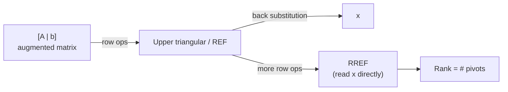

# 02 · Gaussian Elimination, Row Operations, Homogeneous Systems & Rank

> **Course:** Applied Mathematics for Data Science & AI · Dr. Arulalan Rajan
>
> **Lectures:** Lecture 2, second half (19 Sep 2026) and Lecture 3 (23 Sep 2026)
>
> **Sources:** handwritten lecture notes pp. 13–29. No transcript for these dates.
>
> **Notebook:** [`code/linear_algebra_part1.ipynb`](code/linear_algebra_part1.ipynb), Part C

---

## 📌 Table of Contents

1. [Big Picture](#1-big-picture)
2. [Gaussian Elimination + Back Substitution](#2-gaussian-elimination--back-substitution-)
3. [Triangular Matrices](#3-triangular-matrices-)
4. [Row Echelon Form (REF): 5×3 Worked Example](#4-row-echelon-form-ref-53-worked-example-)
5. [Reduced Row Echelon Form (RREF)](#5-reduced-row-echelon-form-rref-)
6. [Elementary Row Operations = Matrices](#6-elementary-row-operations--matrices-)
7. [Why Row Operations Don't Change the Solution (Geometry)](#7-why-row-operations-dont-change-the-solution-geometry-)
8. [Homogeneous Systems Ax = 0](#8-homogeneous-systems-ax--0-)
9. [Rank of a Matrix](#9-rank-of-a-matrix-)
10. [Side Note: Galois & Finite Fields](#10-side-note-galois--finite-fields-)
11. [Common Confusions](#11--common-confusions)
12. [Practice Problems](#12--practice-problems)
13. [Cheat Sheet](#13--cheat-sheet)
14. [Go Deeper](#14--go-deeper-curated-links)

---

## 1. Big Picture

Note 01 ended with: *"$`A^{-1}`$ is difficult to compute. Can we get $`x`$ without it?"* **Gaussian elimination** is the answer. It's how computers (and LAPACK/NumPy) actually solve linear systems.

The idea: apply **simple, reversible row operations** that **never change the solution**, until the system becomes **triangular**, then solve from the bottom up.



> 📝 The notes label Gaussian elimination "Iterative". Strictly, it is a **direct** method: a fixed, finite number of steps gives the exact answer, up to rounding. "Iterative" methods (Jacobi, Gauss–Seidel, conjugate gradient, gradient descent!) produce a sequence of improving approximations. Read the note as "step-by-step".

---

## 2. Gaussian Elimination + Back Substitution 🟢

**Example (notes p.13):**
```math
\begin{aligned}
x_1 + x_2 + x_3 &= 3\\
x_1 - x_2 + x_3 &= 1\\
x_1 + x_2 - x_3 &= 1
\end{aligned}
\qquad\Longrightarrow\qquad
[A\,|\,b] = \left[\begin{array}{ccc|c} 1 & 1 & 1 & 3\\ 1 & -1 & 1 & 1\\ 1 & 1 & -1 & 1\end{array}\right]
```

The **augmented matrix** $`[A\,|\,b]`$ carries $`b`$ along so the same operations apply to both sides.

**Step 1: eliminate $`x_1`$ from rows 2 and 3** (pivot = the 1 in position (1,1)):
```math
R_2 \leftarrow R_2 - R_1,\quad R_3 \leftarrow R_3 - R_1:\qquad
\left[\begin{array}{ccc|c} 1 & 1 & 1 & 3\\ 0 & -2 & 0 & -2\\ 0 & 0 & -2 & -2\end{array}\right]
```
This is already **upper triangular**.

**Step 2: back substitution** (bottom row first):
```math
-2x_3 = -2 \Rightarrow x_3 = 1;\qquad -2x_2 = -2 \Rightarrow x_2 = 1;\qquad x_1 + 1 + 1 = 3 \Rightarrow x_1 = 1
```
✅ $`x = (1, 1, 1)`$. Check in the original equations: $`3, 1, 1`$ ✓.

### The general algorithm
For each column $`j = 1, 2, \dots`$:

1. Find a **pivot**: a non-zero entry in column $`j`$ at or below row $`j`$. If needed, **swap** rows to bring it up.
2. For every row $`i`$ below, do $`R_i \leftarrow R_i - \frac{a_{ij}}{a_{jj}} R_j`$. The fraction $`\frac{a_{ij}}{a_{jj}}`$ is called the **multiplier**.
3. Move to the next column.

Then back-substitute.

🔴 **Cost:** about $`\frac{2}{3}n^3`$ operations, versus $`n!`$ for cofactor-based determinants or inverses. For $`n = 20`$, $`n!`$ is about $`2.4\times10^{18}`$ while $`\frac23 n^3 \approx 5{,}333`$.

🔴 **Partial pivoting:** in floating-point arithmetic, choose the **largest** available pivot (in absolute value) to avoid dividing by tiny numbers, which amplifies rounding error. NumPy/LAPACK always do this.

---

## 3. Triangular Matrices 🟢

| Upper triangular | Lower triangular |
|---|---|
| $`\begin{bmatrix}*&*&*&*\\0&*&*&*\\0&0&*&*\\0&0&0&*\end{bmatrix}`$ | $`\begin{bmatrix}*&0&0&0\\ *&*&0&0\\ *&*&*&0\\ *&*&*&*\end{bmatrix}`$ |
| Zeros **below** the diagonal | Zeros **above** the diagonal |
| Solve by **back** substitution | Solve by **forward** substitution |

Why triangular matrices are great:

- They are trivially solvable, one variable at a time.
- $`\det`$ = product of the diagonal entries.

🔴 **LU decomposition:** Gaussian elimination secretly factorises $`A = LU`$ (L = the multipliers, U = the triangular result). Solving many systems with the same $`A`$ but different $`b`$s then costs only $`O(n^2)`$ each. This is what `scipy.linalg.lu_factor` does.

---

## 4. Row Echelon Form (REF): 5×3 Worked Example 🟡

**REF ("staircase") rules:**

1. All-zero rows are at the **bottom**.
2. Each row's leading non-zero entry (**pivot**) is **strictly to the right** of the pivot in the row above.
3. Entries **below** each pivot are 0.

**Worked example (notes pp. 16–18):**
```math
A = \begin{bmatrix} 1&1&1\\ 1&1&1\\ 1&-1&1\\ 1&1&-1\\ -1&1&-1 \end{bmatrix}_{5\times3}
```

| Step | Operation | Result (rows) |
|---|---|---|
| 1 | $`R_2 \leftarrow R_2 - R_1`$ | $`R_2 = (0,0,0)`$, a zero row (rows 1 and 2 were identical) |
| 2 | $`R_2 \leftrightarrow R_5`$ (move the zero row down) | $`R_2 = (-1,1,-1)`$, $`R_5 = (0,0,0)`$ |
| 3 | $`R_2 \leftarrow R_2 + R_1`$ | $`R_2 = (0, 2, 0)`$, pivot **2** in column 2 |
| 4 | $`R_3 \leftarrow R_3 - R_1`$ | $`R_3 = (0,-2,0)`$ |
| 5 | $`R_4 \leftarrow R_4 - R_1`$ | $`R_4 = (0,0,-2)`$ |
| 6 | $`R_3 \leftarrow R_3 + R_2`$ | $`R_3 = (0,0,0)`$, another zero row |
| 7 | $`R_3 \leftrightarrow R_4`$ | zero rows to the bottom |

```math
\text{REF} = \begin{bmatrix} \boxed{1}&1&1\\ 0&\boxed{2}&0\\ 0&0&\boxed{-2}\\ 0&0&0\\ 0&0&0 \end{bmatrix}
```
**3 pivots → rank 3.** Two rows became zero, so 2 of the 5 equations (rows) were redundant. All 3 columns are independent. (Verified with NumPy and SymPy in the notebook.)

> 💡 **Reading zero rows:** a zero row means that equation was a **combination of the others**: no new information. For data, that's a duplicate or derived observation.

---

## 5. Reduced Row Echelon Form (RREF) 🟢

REF plus more cleaning. The four conditions (notes p.18):

1. Every **pivot is 1**.
2. Every element **below** a pivot is 0.
3. Every element **above** a pivot is also 0.
4. All-zero rows are at the **bottom**.

RREF of the 5×3 example is $`\begin{bmatrix}1&0&0\\0&1&0\\0&0&1\\0&0&0\\0&0&0\end{bmatrix}`$.

| | REF | RREF |
|---|---|---|
| Pivots | Any non-zero value | Exactly 1 |
| Above pivots | Anything | 0 |
| Unique for a given matrix? | ❌ No (many REFs) | ✅ **Yes** (exactly one) |
| Solve by | Back substitution | Read off directly |
| Algorithm name | Gaussian elimination | **Gauss–Jordan** elimination |

For the 3×3 system: RREF of $`[A\,|\,b]`$ = $`\left[\begin{array}{ccc|c}1&0&0&1\\0&1&0&1\\0&0&1&1\end{array}\right]`$, so you read off $`x_1 = x_2 = x_3 = 1`$.

**Pivot columns vs free columns:** columns *with* pivots correspond to **basic** variables; columns *without* pivots correspond to **free** variables, which can take any value and generate infinitely many solutions ([Note 05](05-Null-Space-and-Nullity.md)).

---

## 6. Elementary Row Operations = Matrices 🟡

Lecture 3's key insight: **each row operation is multiplication by a simple matrix $`E`$**. These are called **elementary matrices**.

### 6.1 Row swap Rᵢ ↔ Rⱼ
```math
\begin{bmatrix}2&1\\1&2\end{bmatrix}\begin{bmatrix}x_1\\x_2\end{bmatrix} = \begin{bmatrix}3\\3\end{bmatrix}
\;\xrightarrow{R_1\leftrightarrow R_2}\;
\begin{bmatrix}1&2\\2&1\end{bmatrix}\begin{bmatrix}x_1\\x_2\end{bmatrix} = \begin{bmatrix}3\\3\end{bmatrix}
```
The matrix that does it is $`E = \begin{bmatrix}0&1\\1&0\end{bmatrix}`$, the **reflection/swap matrix** from Note 01. Swapping the order of equations obviously doesn't change the answer.

> 📝 The notes write "=" between the two augmented matrices. They are **row-equivalent** (written $`\sim`$), not equal.

### 6.2 Scaling: Rᵢ ← kRᵢ, with k ≠ 0
To scale the first component: $`\begin{bmatrix}a&b\\c&d\end{bmatrix}\begin{bmatrix}x_1\\x_2\end{bmatrix} = \begin{bmatrix}kx_1\\x_2\end{bmatrix}`$ gives
```math
E = \begin{bmatrix}k&0\\0&1\end{bmatrix} \quad\text{or}\quad \begin{bmatrix}1&0\\0&k\end{bmatrix}\ (\text{scales the 2nd}),\qquad k\neq 0
```
Example: $`R_1 \leftarrow 4R_1`$ turns $`2x_1 + x_2 = 3`$ into $`8x_1 + 4x_2 = 12`$. **The same line, so the solution doesn't change.**

**Why $`k \ne 0`$?** Multiplying by 0 wipes the equation (information lost) and isn't reversible: $`\det E = k = 0`$.

### 6.3 Replacement: Rᵢ ← Rᵢ + kRⱼ (any real k)
```math
R_2 \leftarrow R_2 + kR_1:\quad \begin{bmatrix}2&1\\1+2k&2+k\end{bmatrix}\begin{bmatrix}x_1\\x_2\end{bmatrix} = \begin{bmatrix}3\\3+3k\end{bmatrix},
\qquad E = \begin{bmatrix}1&0\\k&1\end{bmatrix}
```

**Geometrically, $`E`$ is a shear.** Apply it to the unit square (columns are its corners):


- $`\begin{bmatrix}1&0\\1&1\end{bmatrix}`$: **shear in the $`x_2`$ direction**. $`(x_1, x_2) \to (x_1, x_2 + x_1)`$, so points slide up proportionally to $`x_1`$.
- $`\begin{bmatrix}1&1\\0&1\end{bmatrix}`$: **shear in the $`x_1`$ direction**. $`(x_1, x_2) \to (x_1 + x_2, x_2)`$.
- A shear keeps the **area** ($`\det = 1`$). Think of pushing the top of a deck of cards sideways.

### All three are invertible

| Operation | $`E`$ | $`\det E`$ | Inverse operation |
|---|---|---|---|
| Swap | $`\begin{bmatrix}0&1\\1&0\end{bmatrix}`$ | −1 | Swap again |
| Scale by $`k`$ | $`\begin{bmatrix}k&0\\0&1\end{bmatrix}`$ | $`k`$ | Scale by $`1/k`$ |
| Replace | $`\begin{bmatrix}1&0\\k&1\end{bmatrix}`$ | 1 | Replace with $`-k`$ |

Because every $`E`$ is invertible, $`EAx = Eb \iff Ax = b`$. **The solution set never changes.** Gaussian elimination is just $`E_k \cdots E_2 E_1 [A\,|\,b]`$.

---

## 7. Why Row Operations Don't Change the Solution (Geometry) 🟢

Take $`2x_1 + x_2 = 3`$ and $`x_1 + 2x_2 = 3`$ (solution $`(1,1)`$), and apply $`R_2 \leftarrow R_2 + kR_1`$:
```math
(1+2k)x_1 + (2+k)x_2 = 3 + 3k
```

| $`k`$ | New second equation |
|---|---|
| 0 | $`x_1 + 2x_2 = 3`$ (original) |
| 1 | $`3x_1 + 3x_2 = 6`$ (i.e. $`x_1 + x_2 = 2`$) |
| 2 | $`5x_1 + 4x_2 = 9`$ |
| −1 | $`-x_1 + x_2 = 0`$ |
| −2 | $`-3x_1 = -3 \Rightarrow x_1 = 1`$ (**$`x_2`$ eliminated!**) |


**Every new line passes through $`(1, 1)`$.** The row operation **rotates the second line about the solution point**. Gaussian elimination picks the special $`k`$ ($`k = -2`$ here) that makes the line vertical: one variable is gone, and the system is triangular.

> ✨ **The professor's conclusion:** *"With these row operations, the solution is guaranteed to remain the same."*

---

## 8. Homogeneous Systems Ax = 0 🟡

**Question (p.25):** *Given that $`Ax = b`$ has a solution, how do we know whether it's unique or there are infinitely many?*
**Answer: don't look at $`b`$; solve $`Ax = 0`$.**

$`Ax = 0`$ is the **homogeneous system**.

### The trivial solution
$`x = 0`$ **always** solves $`Ax = 0`$. This is the **trivial solution**.

### Non-trivial solutions
Example: $`2x_1 + x_2 = 0,\ 4x_1 + 2x_2 = 0`$

| $`x_1`$ | 0 | 1 | −1 | 2 | −2 |
|---|---|---|---|---|---|
| $`x_2`$ | 0 | −2 | 2 | −4 | 4 |

A **non-trivial** solution: $`x_H = (1, -2)^\top`$.

### The key argument (pp. 26–27)
If $`Ax_H = 0`$ with $`x_H \ne 0`$, then for any real $`k`$:
```math
A(kx_H) = k(Ax_H) = k\cdot 0 = 0
```
so **infinitely many** multiples also solve it. Now add this to any particular solution $`x_p`$ of $`Ax = b`$:
```math
\begin{aligned}
Ax_p &= b\\
+\; A(kx_H) &= 0\\ \hline
A(x_p + kx_H) &= b
\end{aligned}
```

```math
\boxed{\text{If } Ax = 0 \text{ has a non-trivial solution, then } Ax = b \text{ (if solvable) has infinitely many solutions.}}
```

**Structure of all solutions:**
```math
\underbrace{x}_{\text{all solutions}} = \underbrace{x_p}_{\text{one particular solution}} + \underbrace{x_H}_{\text{any solution of } Ax=0}
```
Check with Ex 2 from Note 01: $`x_p = (1,1)`$, $`x_H = (1,-2)`$, so $`x = (1+k, 1-2k)`$ is exactly the line $`y = 3 - 2x`$ ✓ (notebook Part C).

> 🔗 **Analogy:** the same structure as linear ODEs: general solution = particular + homogeneous. The set of all $`x_H`$ is the **null space** ([Note 05](05-Null-Space-and-Nullity.md)).

| $`Ax = 0`$ has… | Then $`Ax = b`$ (if consistent) has… | For square $`A`$ |
|---|---|---|
| Only the trivial solution | **Unique** solution | $`\det A \ne 0`$ |
| Non-trivial solutions | **Infinitely many** | $`\det A = 0`$ |

---

## 9. Rank of a Matrix 🟡

Rank = **the amount of genuinely independent information** in a matrix. The notes give three equivalent definitions (p.28):

1. If $`A`$ is $`n\times n`$ with $`\det A \ne 0`$, then $`\text{rank}(A) = n`$ (**full rank**).
2. $`\text{rank}(A)`$ = **number of pivot columns** in the RREF of $`A`$.
3. $`\text{rank}(A)`$ = **size of the largest square sub-matrix with non-zero determinant** (largest non-vanishing *minor*).

> 📝 Definition 3 in the notes says "square matrix". It means a square **sub-matrix of $`A`$**.

**Examples:**

| Matrix | Rank | Why |
|---|---|---|
| $`\begin{bmatrix}0&0\\0&0\end{bmatrix}`$ | 0 | No non-zero entry at all |
| $`\begin{bmatrix}0&0\\1&0\end{bmatrix}`$ | 1 | $`\det = 0`$ so rank < 2; the entry 1 is a non-zero 1×1 minor |
| $`\begin{bmatrix}2&1\\2&1\end{bmatrix}`$ | 1 | $`\det = 0`$ so rank ≠ 2; $`[2]`$ is a non-zero 1×1 minor |
| $`\begin{bmatrix}2&1\\1&2\end{bmatrix}`$ | 2 | $`\det = 3 \ne 0`$ |
| 5×3 example (§4) | 3 | 3 pivots |

> 📝 Notes p.29: "$`\det = 0 \Rightarrow`$ Rank = 1". $`\det = 0`$ only tells you rank **< 2**. It's rank **1** (not 0) because there is a non-zero entry.

### Key facts (beyond slides) 🔴

- **rank = number of independent rows = number of independent columns** (row rank = column rank, always).
- $`\text{rank}(A) \le \min(m, n)`$.
- **Rank–nullity theorem:** $`\text{rank}(A) + \text{nullity}(A) = n`$ (number of columns). See [Note 05](05-Null-Space-and-Nullity.md).
- Solvability: $`Ax = b`$ is consistent $`\iff \text{rank}(A) = \text{rank}([A\,|\,b])`$.

### Rank in ML / data science

| Situation | Rank tells you |
|---|---|
| Data matrix $`X`$ ($`m`$ samples × $`n`$ features) | Number of non-redundant features |
| $`\text{rank}(X) < n`$ | Collinear features → $`X^\top X`$ singular → OLS weights not unique |
| Recommender systems (Netflix) | User×movie ratings ≈ **low-rank** matrix (few "taste" factors) |
| **LoRA** fine-tuning of LLMs | Weight updates $`\Delta W = BA`$ restricted to **low rank** $`r \ll d`$ |
| Image compression | Keep the top-$`k`$ singular values (rank-$`k`$ approximation) |

---

## 10. Side Note: Galois & Finite Fields 🔴

The notes (p.29) mention **Évariste Galois** and **Galois theory → $`GF(p^k)`$**. Galois was a French mathematician who died after a duel in 1832, aged **20**. (The notes say 21; he was born in 1811.) He founded group theory and the theory of **finite fields**, $`GF(p^k)`$: number systems with finitely many elements where $`+, -, \times, \div`$ all work.

**Why mention it here:** linear algebra (elimination, rank, inverses) works over **any field**, not only real numbers. Over $`GF(2) = \{0, 1\}`$ (where $`1+1=0`$), linear algebra powers:

- **Error-correcting codes** (Reed–Solomon codes in QR codes, CDs, 5G; LDPC codes in WiFi)
- **Cryptography** (AES is built on $`GF(2^8)`$)

---

## 11. ⚠️ Common Confusions

| Confusion | Clarification |
|---|---|
| Row operations change the answer | They don't. Every elementary matrix is invertible |
| Scaling a row by 0 is allowed | No, $`k \ne 0`$ (otherwise information is lost) |
| REF is unique | Only **RREF** is unique |
| Gaussian elimination is iterative | It's a direct (finite-step) method |
| $`\det = 0 \Rightarrow`$ rank = 1 | Only rank < n; could be anything from 0 to n−1 |
| $`Ax=0`$ having a non-trivial solution guarantees $`Ax=b`$ has infinitely many | Only **if** $`Ax=b`$ is consistent in the first place |
| Rank counts rows or columns? | Both: row rank = column rank |

---

## 12. 📝 Practice Problems

<details>
<summary><b>P1.</b> Solve by Gaussian elimination: $`x + y + z = 6,\ 2x + 3y + z = 11,\ x - y + 2z = 5`$.</summary>

$`R_2 - 2R_1`$: $`(0,1,-1\,|\,-1)`$; $`R_3 - R_1`$: $`(0,-2,1\,|\,-1)`$; $`R_3 + 2R_2`$: $`(0,0,-1\,|\,-3)`$ → $`z = 3`$, $`y = -1 + 3 = 2`$, $`x = 6 - 2 - 3 = 1`$. **(1, 2, 3)**.
</details>

<details>
<summary><b>P2.</b> Find the rank of $`\begin{bmatrix}1&2&3\\2&4&6\\1&1&1\end{bmatrix}`$.</summary>

$`R_2 - 2R_1 = 0`$; $`R_3 - R_1 = (0,-1,-2)`$ → 2 pivots → **rank 2**.
</details>

<details>
<summary><b>P3.</b> Write the elementary matrix that performs $`R_3 \leftarrow R_3 - 4R_1`$ on a 3-row matrix. What is its inverse?</summary>

$`E = \begin{bmatrix}1&0&0\\0&1&0\\-4&0&1\end{bmatrix}`$, $`E^{-1} = \begin{bmatrix}1&0&0\\0&1&0\\4&0&1\end{bmatrix}`$ (undo by adding back).
</details>

<details>
<summary><b>P4.</b> Without solving, decide whether $`\begin{bmatrix}1&2\\3&6\end{bmatrix}x = \begin{bmatrix}5\\15\end{bmatrix}`$ has a unique solution, infinitely many, or none.</summary>

$`\det = 0`$; rank(A) = 1; $`[A|b]`$: row 2 = 3 × row 1 including $`b`$ (15 = 3·5), so rank 1 → consistent with a non-trivial null space → **infinitely many**.
</details>

<details>
<summary><b>P5.</b> Find a non-trivial solution of $`x_1 - 2x_2 + x_3 = 0,\ 2x_1 - 4x_2 + 2x_3 = 0`$, and describe all solutions.</summary>

The second equation is 2× the first, so there is one equation in 3 unknowns. $`x_1 = 2s - t`$, with $`x_2 = s`$, $`x_3 = t`$ free: $`x = s(2,1,0) + t(-1,0,1)`$, a **plane** through the origin. E.g. $`(2,1,0)`$.
</details>

<details>
<summary><b>P6.</b> Show that a shear preserves area.</summary>

$`\det\begin{bmatrix}1&k\\0&1\end{bmatrix} = 1`$, and |det| = area scaling factor.
</details>

---

## 13. 🧾 Cheat Sheet

- **Gaussian elimination:** row ops on $`[A|b]`$ → upper triangular → back substitution. About $`\frac23n^3`$ operations.
- **Row ops:** swap ($`\det E = -1`$), scale by $`k\neq0`$ ($`\det E = k`$), $`R_i + kR_j`$ (shear, $`\det E = 1`$). All invertible, so the **solution is unchanged**.
- **REF:** staircase of pivots, zeros below them, zero rows at the bottom. **RREF:** additionally pivots = 1 and zeros above them (unique).
- **Homogeneous** $`Ax=0`$: always has $`x=0`$. A non-trivial $`x_H`$ means infinitely many solutions $`x_p + kx_H`$.
- **Rank** = number of pivots = number of independent rows = number of independent columns = size of the largest non-zero minor.
- Consistent $`\iff \text{rank}A = \text{rank}[A|b]`$; unique $`\iff`$ additionally rank $`= n`$.

---

## 14. 📚 Go Deeper: Curated Links

| Topic | Why | Link |
|---|---|---|
| Elimination, step by step | Strang's lecture on exactly this algorithm | [MIT 18.06 — L2: Elimination with Matrices](https://www.youtube.com/watch?v=QVKj3LADCnA) |
| Elementary matrices & inverses | Gauss–Jordan computes $`A^{-1}`$ | [MIT 18.06 — L3: Multiplication and Inverse Matrices](https://www.youtube.com/watch?v=FX4C-JpTFgY) |
| Shear and other transformations | Visual intuition for $`E`$ matrices | [3Blue1Brown — Linear transformations](https://www.youtube.com/watch?v=kYB8IZa5AuE) · [Matrix multiplication as composition](https://www.youtube.com/watch?v=XkY2DOUCWMU) |
| Rank, column space, null space | The geometry behind rank | [3Blue1Brown — Inverse matrices, column space and null space](https://www.youtube.com/watch?v=uQhTuRlWMxw) |
| Instructor's NPTEL course | Same notation and geometric approach | [NPTEL — Linear Algebra Through Geometry](https://nptel.ac.in/courses/106108482) |
| Free interactive textbook | Row reduction with interactive demos | [Interactive Linear Algebra (Margalit & Rabinoff), Ch. 1](https://textbooks.math.gatech.edu/ila/) |
| NumPy / SciPy | What to use in practice | [numpy.linalg](https://numpy.org/doc/stable/reference/routines.linalg.html) |
| Low-rank in modern AI | Rank applied to LLM fine-tuning | [LoRA paper (Hu et al., 2021)](https://arxiv.org/abs/2106.09685) |

---
⬅️ [01 · Linear Systems, Determinant & Inverse](01-Linear-Systems-Determinant-Inverse.md) · [Index](README.md) · ➡️ [03 · Vector Spaces & Subspaces](03-Vector-Spaces-and-Subspaces.md)
