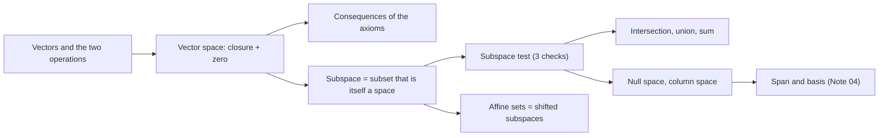
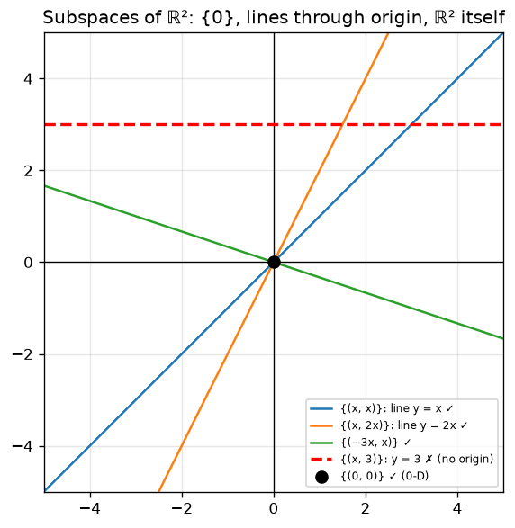
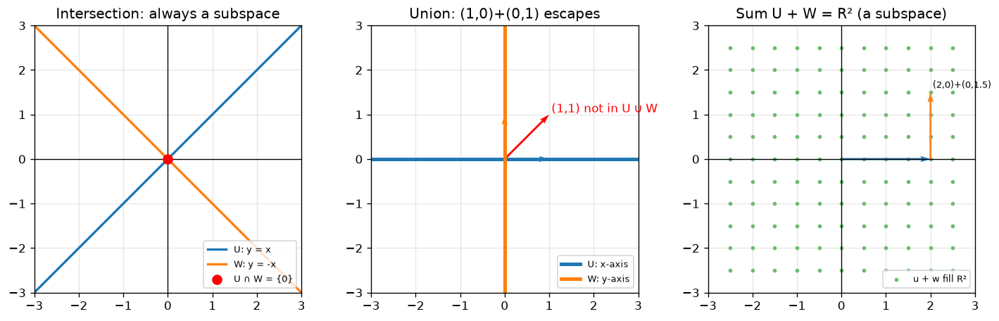
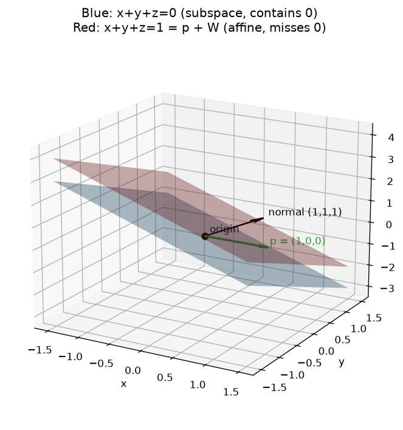
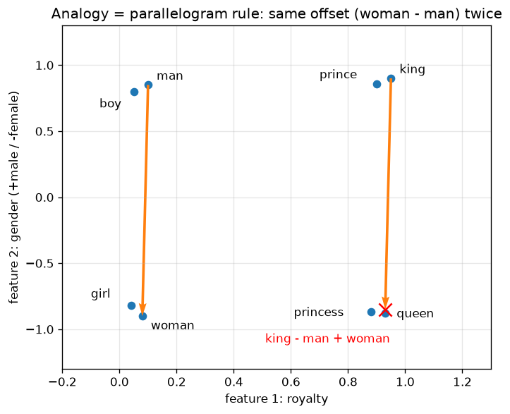

# 03 · Vectors, Vector Spaces & Subspaces

> **Course:** Applied Mathematics for Data Science & AI · Dr. Arulalan Rajan
>
> **Lectures:** 26 Sep 2026 (vectors, vector spaces) and 30 Sep 2026, first part (subspaces & their geometry)
>
> **Sources:** handwritten notes pp. 30–41 and the 30 Sep class transcript
>
> **Notebooks:** [`code/linear_algebra_part1.ipynb`](code/linear_algebra_part1.ipynb), Part D (class examples) · [`code/03_vector_spaces_deep_dive.ipynb`](code/03_vector_spaces_deep_dive.ipynb), Parts 1–10 (randomised and symbolic subspace checks, axioms of P₂, intersection/union/sum, null and column space, affine planes, embeddings, images, audio, practice-problem checks)
>
> **Level:** 🟢 Basic → 🟡 Intermediate → 🔴 Advanced. Sections 5, 8, 10, 11 and 12 go beyond what was written on the board on 26/30 Sep; they are the standard theory behind it (proofs from the axioms, the subspace theorem, intersections/sums, null and column spaces, affine sets) and are tagged accordingly.

---

## 📌 Table of Contents

1. [Big Picture](#1-big-picture)
2. [What is a Vector?](#2-what-is-a-vector-)
3. [The Two Operations](#3-the-two-operations-)
4. [Definition of a Vector Space](#4-definition-of-a-vector-space-)
5. [Consequences of the Axioms (Proofs)](#5-consequences-of-the-axioms-proofs-)
6. [Examples & Non-Examples](#6-examples--non-examples-)
7. [Vector Subspaces](#7-vector-subspaces-)
8. [The Subspace Test: Proof and Worked Examples](#8-the-subspace-test-proof-and-worked-examples-)
9. [Geometry of Subspaces](#9-geometry-of-subspaces-)
10. [Building New Subspaces: Intersection, Union, Sum](#10-building-new-subspaces-intersection-union-sum-)
11. [Subspaces That Come From Matrices](#11-subspaces-that-come-from-matrices-)
12. [Affine Sets: Shifted Subspaces](#12-affine-sets-shifted-subspaces-)
13. [Vector Spaces in ML](#13-vector-spaces-in-ml-)
14. [Real-World Case Studies](#14-real-world-case-studies-)
15. [Professor Emphasised](#15--professor-emphasised)
16. [Common Confusions](#16--common-confusions)
17. [Practice Problems](#17--practice-problems)
18. [Cheat Sheet](#18--cheat-sheet)
19. [Go Deeper](#19--go-deeper-curated-links)

---

## 1. Big Picture

Notes 01–02 treated a matrix as a **table** and solved equations. Now we zoom in on the **objects** the matrix acts on, *vectors*, and on the **"universes" they live in**, *vector spaces*.

Why bother with the abstraction? In ML, **everything becomes a vector**: a house (features), a word (embedding), an image (pixels), a user (preferences), a sound clip (samples), even the weights of a network. Once data lives in a vector space, we can **add**, **scale**, **measure distance and similarity**, and **project**. That is all of ML geometry.

The abstraction pays off because one set of rules covers all these cases. Prove a fact once from the axioms (Section 5) and it holds for arrows, matrices, polynomials, functions and word vectors at the same time.

**Road map of this note.**



---

## 2. What is a Vector? 🟢

| View | Description | Example |
|---|---|---|
| **Physics / geometry** | An arrow with **direction and magnitude** | Velocity of a car |
| **Algebra** | An **ordered list of numbers** (ordered pair, n-tuple) | $`(2, 3)^\top`$, a 2-component vector |
| **Data science** | A **row of the data matrix**: one observation | (area, rooms, age) of a house |
| **Abstract (this course)** | **Any element of a vector space** (§4) | Even matrices and polynomials! |

A 2-D vector is written as a column,

```math
\vec{u} = \begin{pmatrix} x \\ y \end{pmatrix}, \qquad x, y \in \mathbb{R}, \qquad \text{e.g. } \begin{pmatrix} 2 \\ 3 \end{pmatrix},
```

and drawn as an arrow from the origin to the point $`(x, y)`$. In running text the same vector is written in row form as $`(x, y)`$ or $`(x, y)^\top`$.

- **Ordered** matters: $`(2,3) \ne (3,2)`$.
- An ordered $`n`$-tuple $`(x_1, \dots, x_n)`$ is a vector in $`\mathbb{R}^n`$.
- Two vectors are **equal** exactly when all their components are equal. This is what makes "solve for the components" work in every proof below.

**Zero vector** $`\mathbf{0} = (0, 0)`$: all components zero. It has **no direction** (asked in class: *"why call it a vector if it has no magnitude or direction?"* Professor: it's simply the vector whose components are all 0, and it gets a special name because it plays a special role).

---

## 3. The Two Operations 🟢

Think of a "basket" $`\mathcal{V}`$ of elements.

### Vector addition (component-wise)

```math
\vec{u} + \vec{v} = \begin{pmatrix}u_1\\u_2\end{pmatrix} + \begin{pmatrix}v_1\\v_2\end{pmatrix} = \begin{pmatrix}u_1+v_1\\u_2+v_2\end{pmatrix}
```

Example (notes p.34):

```math
\begin{pmatrix}4\\2\end{pmatrix} + \begin{pmatrix}2\\3\end{pmatrix} = \begin{pmatrix}6\\5\end{pmatrix}
```

Geometrically this is the **parallelogram rule**: place the arrows tip-to-tail, or take the diagonal of the parallelogram they span.

If $`\vec{u} + \vec{v} \in \mathcal{V}`$ for all $`\vec{u}, \vec{v} \in \mathcal{V}`$, then $`\mathcal{V}`$ is **closed under vector addition**.

### Scalar multiplication

```math
\alpha\vec{u} = \begin{pmatrix}\alpha u_1\\ \alpha u_2\end{pmatrix},\qquad 5\begin{pmatrix}2\\3\end{pmatrix} = \begin{pmatrix}10\\15\end{pmatrix},\quad -3\begin{pmatrix}2\\3\end{pmatrix} = \begin{pmatrix}-6\\-9\end{pmatrix}
```

Geometrically: **stretch/shrink** the arrow; a negative scalar **flips** it.

If $`\alpha\vec{u} \in \mathcal{V}`$ for every real $`\alpha`$ and every $`\vec{u} \in \mathcal{V}`$, then $`\mathcal{V}`$ is **closed under scalar multiplication**.

> **Closure** = "you can't escape the basket by adding or scaling".

### Linear combinations: both operations at once

Combining the two operations gives a **linear combination** $`a\vec{u} + b\vec{v}`$. Every concept in Notes 04–05 (span, independence, basis, null space) is built on it.

**Worked Example 1.** With $`\vec{u} = (4, 2)`$ and $`\vec{v} = (2, 3)`$:

```math
2\vec{u} - 3\vec{v} = \begin{pmatrix} 8 \\ 4 \end{pmatrix} + \begin{pmatrix} -6 \\ -9 \end{pmatrix} = \begin{pmatrix} 2 \\ -5 \end{pmatrix}
```

*Sanity check:* the first component is $`2\cdot4 - 3\cdot2 = 2`$ and the second is $`2\cdot2 - 3\cdot3 = -5`$, computed directly without forming the intermediate vectors.

**Worked Example 2 (matrices are added and scaled the same way).**

```math
A = \begin{bmatrix} 1 & 2 \\ 3 & 4 \end{bmatrix},\quad B = \begin{bmatrix} 0 & 1 \\ -1 & 2 \end{bmatrix},\qquad
2A - B = \begin{bmatrix} 2-0 & 4-1 \\ 6+1 & 8-2 \end{bmatrix} = \begin{bmatrix} 2 & 3 \\ 7 & 6 \end{bmatrix}
```

*Sanity check:* entry-wise, a 2×2 matrix behaves exactly like the 4-vector $`(a_{11}, a_{12}, a_{21}, a_{22})`$; here $`2(1,2,3,4) - (0,1,-1,2) = (2,3,7,6)`$ ✓.

> 💡 A useful one-line test combines both closures: a set $`W`$ is closed under **both** operations iff $`\vec{u} + k\vec{v} \in W`$ for all $`\vec{u}, \vec{v} \in W`$ and all $`k`$ (proof in Section 8.2).

---

## 4. Definition of a Vector Space 🟢→🟡

**Course definition (notes p.33, p.39):** $`\mathcal{V}(+,\cdot)`$ over the real numbers is a **vector space** if

- **(a)** it is closed under vector addition,
- **(b)** it is closed under scalar multiplication, and
- **(c)** it contains the **zero vector**.

Every element of a vector space is called a **vector**.

### 🔴 The full (textbook) definition

The 3 conditions above are exactly the **subspace test**. They suffice when your set sits inside a known vector space like $`\mathbb{R}^n`$ (which is all this course needs). The complete abstract definition requires, for all $`\vec{u}, \vec{v}, \vec{w} \in \mathcal{V}`$ and scalars $`a, b`$:

| # | Axiom | |
|---|---|---|
| 1 | $`\vec{u} + \vec{v} \in \mathcal{V}`$ | closure (+) |
| 2 | $`\vec{u} + \vec{v} = \vec{v} + \vec{u}`$ | commutativity |
| 3 | $`(\vec{u} + \vec{v}) + \vec{w} = \vec{u} + (\vec{v} + \vec{w})`$ | associativity |
| 4 | $`\exists\, \mathbf{0}: \vec{u} + \mathbf{0} = \vec{u}`$ | zero vector (additive identity) |
| 5 | $`\exists\, {-\vec{u}}: \vec{u} + (-\vec{u}) = \mathbf{0}`$ | additive inverse |
| 6 | $`a\vec{u} \in \mathcal{V}`$ | closure (·) |
| 7 | $`a(\vec{u} + \vec{v}) = a\vec{u} + a\vec{v}`$ | distributivity |
| 8 | $`(a + b)\vec{u} = a\vec{u} + b\vec{u}`$ | distributivity |
| 9 | $`a(b\vec{u}) = (ab)\vec{u}`$ | compatibility |
| 10 | $`1\vec{u} = \vec{u}`$ | identity scalar |

For subsets of $`\mathbb{R}^n`$ with the usual operations, axioms 2, 3, 7–10 are inherited automatically, and closure under scalar multiplication gives 4–5 (take $`a = 0`$ and $`a = -1`$). That's why the 3-condition test works. Section 8.1 turns this sentence into a proof.

> 💡 **Quick zero-vector check:** if $`\mathbf{0} \notin \mathcal{V}`$, stop: it's not a vector space. This is the fastest way to rule things out.

### 4.1 Worked Example 3: the ten axioms for P₂ 🟡

$`P_2`$ is the set of polynomials of degree at most 2, $`p(x) = a_0 + a_1x + a_2x^2`$, with the usual addition and scaling of polynomials. Take the concrete members

```math
p(x) = 1 + 2x - x^2, \qquad q(x) = 3 - x + 4x^2 .
```

| Axiom | Check with these p, q | Why it holds in general |
|---|---|---|
| 1 closure (+) | $`p + q = 4 + x + 3x^2`$, degree 2 ✓ | adding coefficients never raises the degree |
| 2, 3 | coefficient-wise $`+`$ of real numbers | real addition is commutative and associative |
| 4 zero | $`\mathbf{0}`$ = the zero polynomial $`0 + 0x + 0x^2`$ | $`p + 0 = p`$ |
| 5 inverse | $`-p = -1 - 2x + x^2`$, and $`p + (-p) = 0`$ | negate each coefficient |
| 6 closure (·) | $`-3p = -3 - 6x + 3x^2`$ ✓ | scaling never raises the degree |
| 7 | $`2(p + q) = 8 + 2x + 6x^2 = 2p + 2q`$ ✓ | real distributivity per coefficient |
| 8 | $`(2 - 3)p = -1 - 2x + x^2 = 2p - 3p`$ ✓ | real distributivity per coefficient |
| 9, 10 | $`a(bp) = (ab)p`$, $`1p = p`$ | real multiplication per coefficient |

All ten are verified **symbolically for general p, q, r and scalars a, b** in notebook Part 3 (every line prints `True`).

**Why it works, in one sentence.** The map $`a_0 + a_1x + a_2x^2 \mapsto (a_0, a_1, a_2)`$ turns polynomial addition and scaling into ordinary addition and scaling in $`\mathbb{R}^3`$, so $`P_2`$ "is" $`\mathbb{R}^3`$ wearing a different costume. (The technical word is *isomorphic*; Note 04 shows $`\dim P_2 = 3`$.)

**Edge case.** The set of polynomials of degree **exactly** 2 is **not** a vector space: $`(x^2 + x) + (-x^2) = x`$ has degree 1, and it does not contain the zero polynomial. See W9 in Section 8.3.

### 4.2 🔴 Beyond syllabus: unusual operations

The axioms are about the **operations**, not about what the elements look like.

**A strange vector space.** Let $`V = \mathbb{R}^{+}`$ (positive reals) with "addition" $`x \oplus y = xy`$ and "scaling" $`k \odot x = x^k`$. Then $`2 \oplus 3 = 6`$, $`3 \odot 2 = 2^3 = 8`$, the **zero vector is the number 1** (since $`x \oplus 1 = x`$), and the negative of $`4`$ is $`\tfrac14`$ (since $`4 \oplus \tfrac14 = 1`$). Every axiom reduces to a law of exponents, for example axiom 7: $`k \odot (x \oplus y) = (xy)^k = x^ky^k = (k\odot x)\oplus(k \odot y)`$. Notebook Part 10 checks axioms 7–9 symbolically. (The logarithm turns this space into ordinary $`\mathbb{R}`$: this is why log-probabilities can be added.)

**An almost-vector space.** $`\mathbb{R}^2`$ with usual addition but scaling $`k \odot (x, y) = (kx, 0)`$ satisfies axioms 1–9 but fails axiom 10: $`1 \odot (1, 1) = (1, 0) \ne (1, 1)`$. So axiom 10 is not redundant.

---

## 5. Consequences of the Axioms (Proofs) 🟡

For $`\mathbb{R}^n`$ the facts below are obvious component by component. The point of proving them **from the axioms alone** is that they then hold in *every* vector space: matrices, polynomials, functions, signals. Each step cites the axiom used.

**Theorem 5.1 (the zero vector is unique).** If $`\mathbf{0}`$ and $`\mathbf{0}'`$ both satisfy axiom 4, then $`\mathbf{0} = \mathbf{0}'`$.

*Proof.*

```math
\mathbf{0} \overset{(4)}{=} \mathbf{0} + \mathbf{0}' \overset{(2)}{=} \mathbf{0}' + \mathbf{0} \overset{(4)}{=} \mathbf{0}' \qquad \blacksquare
```

(The first step uses that $`\mathbf{0}'`$ is an identity; the last uses that $`\mathbf{0}`$ is.)

**Theorem 5.2 (the negative is unique).** If $`\vec{v} + \vec{w} = \mathbf{0}`$ and $`\vec{v} + \vec{w}' = \mathbf{0}`$, then $`\vec{w} = \vec{w}'`$.

*Proof.*

```math
\vec{w} = \vec{w} + \mathbf{0} = \vec{w} + (\vec{v} + \vec{w}') = (\vec{w} + \vec{v}) + \vec{w}' = \mathbf{0} + \vec{w}' = \vec{w}' \qquad \blacksquare
```

This justifies writing **the** negative, $`-\vec{v}`$. A useful corollary is the **cancellation law**: if $`\vec{u} + \vec{w} = \vec{v} + \vec{w}`$ then $`\vec{u} = \vec{v}`$ (add $`-\vec{w}`$ to both sides and use axioms 3, 5, 4).

**Theorem 5.3 (zero times anything is the zero vector): $`0\vec{v} = \mathbf{0}`$.**

*Proof.* Using the real-number fact $`0 = 0 + 0`$ and axiom 8,

```math
0\vec{v} = (0 + 0)\vec{v} = 0\vec{v} + 0\vec{v}.
```

Add $`-(0\vec{v})`$ to both sides: the left becomes $`\mathbf{0}`$, the right becomes $`0\vec{v} + \mathbf{0} = 0\vec{v}`$ (axioms 3, 5, 4). Hence $`0\vec{v} = \mathbf{0}`$. ∎

> Note the two different zeros: the **scalar** 0 on the left and the **vector** $`\mathbf{0}`$ on the right. This theorem is the reason every subspace must contain the origin (Section 9).

**Theorem 5.4: $`k\mathbf{0} = \mathbf{0}`$ for every scalar k.** Same trick with axioms 4 and 7: $`k\mathbf{0} = k(\mathbf{0} + \mathbf{0}) = k\mathbf{0} + k\mathbf{0}`$, then cancel. ∎

**Theorem 5.5: $`(-1)\vec{v} = -\vec{v}`$.**

*Proof.*

```math
\vec{v} + (-1)\vec{v} \overset{(10)}{=} 1\vec{v} + (-1)\vec{v} \overset{(8)}{=} (1 + (-1))\vec{v} = 0\vec{v} \overset{\text{Thm 5.3}}{=} \mathbf{0}.
```

So $`(-1)\vec{v}`$ is *a* negative of $`\vec{v}`$; by uniqueness (Theorem 5.2) it is *the* negative. ∎

**Theorem 5.6 (no zero divisors): if $`k\vec{v} = \mathbf{0}`$ then $`k = 0`$ or $`\vec{v} = \mathbf{0}`$.**

*Proof.* Suppose $`k \ne 0`$. Then

```math
\vec{v} \overset{(10)}{=} 1\vec{v} = (k^{-1}k)\vec{v} \overset{(9)}{=} k^{-1}(k\vec{v}) = k^{-1}\mathbf{0} \overset{\text{Thm 5.4}}{=} \mathbf{0}. \qquad \blacksquare
```

**Corollary (why a non-zero subspace is infinite).** If $`\vec{v} \ne \mathbf{0}`$ and $`a \ne b`$, then $`a\vec{v} - b\vec{v} = (a - b)\vec{v} \ne \mathbf{0}`$ by Theorem 5.6, so the multiples $`a\vec{v}`$ are all **different**. A subspace containing one non-zero vector contains infinitely many. This is the professor's observation on 30 Sep ("every line through the origin has infinitely many points"), now with a proof.

All of these are illustrated numerically for vectors, matrices and functions in notebook Part 3.

---

## 6. Examples & Non-Examples 🟢

| # | Set | Vector space? | Why |
|---|---|---|---|
| Ex 1 | $`\mathbb{R}`$ (real line) | ✅ | Sum and multiples of reals are real; contains 0 |
| Ex 2 | $`\mathbb{R}^2 = \mathbb{R}\times\mathbb{R}`$ (xy-plane) | ✅ | $`3(2,3) = (6,9)`$, $`(4,2)+(2,3) = (6,5)`$, … |
| Ex 3 | $`S_1 = \{(x_1, x_1) : x_1\in\mathbb{R}\}`$ (line $`y = x`$) | ✅ | Proof below |
| Ex 4 | $`S_2 = \{(x_1, 0)\}`$ (x-axis) | ✅ | Line through the origin |
| Ex 5 | $`S_3 = \{(0, x_2)\}`$ (y-axis) | ✅ | Line through the origin |
| Ex 6 | $`S_4 = \{(x_1, kx_1)\}`$ for a **fixed** $`k`$ (line $`y = kx`$) | ✅ | Line through the origin |
| Ex 7 | $`S_5 = \{(x_1, 3)\}`$ (line $`y = 3`$) | ❌ | $`\mathbf{0} \notin S_5`$; also $`(1,3)+(2,3) = (3,6)\notin S_5`$ |
| Ex 8 | $`S_6 = \{(0,0)\}`$ (just the origin) | ✅ | $`0+0=0`$, $`k\cdot0 = 0`$: the **zero space** |
| Ex 9 | $`\mathcal{M}^{2\times2}`$, all 2×2 real matrices | ✅ | Proof below. "Vectors" needn't be arrows! |

### Proof for Ex 3 (template for any such proof)

Let $`\vec{u} = (u_1, u_1)`$, $`\vec{v} = (v_1, v_1) \in S_1`$, and $`k\in\mathbb{R}`$.

1. **Addition:** $`\vec{u} + \vec{v} = (u_1+v_1,\ u_1+v_1)`$. Both components are equal, so it is in $`S_1`$ ✓
2. **Scalar:** $`k\vec{u} = (ku_1, ku_1)`$. Both components are equal, so it is in $`S_1`$ ✓
3. **Zero:** $`(0,0)`$ has equal components, so it is in $`S_1`$ ✓

Hence $`S_1`$ is a vector space. ∎

> 📝 Small fixes to the handwritten notes. (p.35) The second vector is labelled $`\vec{u}`$ but should be $`\vec{v} = (v_1, v_1)`$. (p.36) Ex 6 is written with "$`x_1\in\mathbb{R},\ k\in\mathbb{R}`$". It must be read as **one fixed $`k`$**. If $`k`$ also varies, the set becomes the union of all lines through the origin, which is **not** closed under addition: $`(1,1) + (-1,1) = (0,2)`$ lies on neither line. (Notebook Part D shows this.)

### Proof for Ex 9: matrices are vectors too

```math
A = \begin{bmatrix} a_1 & a_2 \\ a_3 & a_4 \end{bmatrix},\quad B = \begin{bmatrix} b_1 & b_2 \\ b_3 & b_4 \end{bmatrix},\qquad
A + B = \begin{bmatrix}a_1+b_1&a_2+b_2\\a_3+b_3&a_4+b_4\end{bmatrix} \in \mathcal{M}^{2\times2}
```

```math
kA = \begin{bmatrix} ka_1 & ka_2 \\ ka_3 & ka_4 \end{bmatrix} \in \mathcal{M}^{2\times2}, \qquad \begin{bmatrix} 0 & 0 \\ 0 & 0 \end{bmatrix} \in \mathcal{M}^{2\times2} \quad \checkmark
```

**Big idea:** "vector" means **anything you can add and scale** following the rules. Other vector spaces: polynomials of degree ≤ n; all functions $`f:\mathbb{R}\to\mathbb{R}`$; audio signals; images (a 28×28 image is a vector in $`\mathbb{R}^{784}`$).

### 6.1 Function and polynomial spaces 🟡

| Space | Elements | Addition and scaling | Zero vector |
|---|---|---|---|
| $`P_n`$ | polynomials of degree ≤ n | add/scale coefficients | the zero polynomial |
| $`P`$ | all polynomials (any degree) | same | same |
| $`\mathcal{F}(\mathbb{R})`$ | all functions $`f : \mathbb{R} \to \mathbb{R}`$ | $`(f+g)(x) = f(x) + g(x)`$, $`(kf)(x) = k\,f(x)`$ | $`z(x) = 0`$ for all x |
| $`C[a, b]`$ | continuous functions on $`[a, b]`$ | pointwise | $`z(x) = 0`$ |
| $`\mathbb{R}^{\infty}`$ | infinite sequences $`(x_1, x_2, \dots)`$ | term-wise | $`(0, 0, \dots)`$ |

For functions, "component $`i`$" becomes "value at the point $`x`$": a function is a vector with one component for every real number. This is the picture behind 3Blue1Brown's *Abstract vector spaces* (link in Section 19) and behind kernel methods in ML.

**Worked Example 4: is $`C[0,1]`$ a vector space?** The sum of two continuous functions is continuous and a constant multiple of a continuous function is continuous (standard calculus facts), and the zero function is continuous. Axioms 2–3, 7–10 hold pointwise because they hold for real numbers at each $`x`$. So yes. ✓

**Worked Example 5: solutions of a differential equation.** Let $`S = \{y : y'' + y = 0\}`$. If $`y_1, y_2 \in S`$ then

```math
(y_1 + ky_2)'' + (y_1 + ky_2) = (y_1'' + y_1) + k(y_2'' + y_2) = 0 + k\cdot 0 = 0,
```

and $`y = 0`$ is a solution, so $`S`$ is a vector space. Its members are exactly $`C_1\sin t + C_2\cos t`$ (notebook Part 2 confirms $`y'' + y = 0`$ for this family symbolically). The key was that differentiation is **linear**. Changing the right-hand side to a non-zero constant destroys this (Practice P25).

---

## 7. Vector Subspaces 🟢

**Q (30 Sep):** *Does $`S_1`$ (line $`y=x`$) contain all points of $`\mathbb{R}^2`$?* **No.** But it is a **subset** of $`\mathbb{R}^2`$ that is closed under +, ·, and contains $`\mathbf{0}`$.

> **Definition:** Any **subset** of a vector space which **by itself is a vector space** is called a **vector subspace**.

So Ex 3, 4, 5, 6 and 8 are subspaces of $`\mathbb{R}^2`$. (The notes say "all sets from Ex 3 to Ex 8", but **Ex 7 is excluded**: it's not a vector space.)

### Is ℝ² a subspace of itself? (class discussion)

**Yes.** Set-theoretic reason (professor): **every set is a subset of itself**. Since $`\mathbb{R}^2`$ is a vector space and $`\mathbb{R}^2 \subseteq \mathbb{R}^2`$, it is a subspace of itself. "Sub" does **not** mean "strictly smaller".

> ⚠️ A student suggested "put all subspaces together → you get $`\mathbb{R}^2`$". The professor rejected this reasoning: *"you can't just put everything from the supermarket in a bag and call it a subspace."* **A union of subspaces is generally NOT a subspace** (see the Ex 6 fix above, and the proof in Section 10.2). The **intersection** of subspaces always is (Section 10.1).

**Terminology.** $`\{\mathbf{0}\}`$ and $`V`$ itself are the **trivial** subspaces of $`V`$; any other subspace is **proper and non-trivial**.

---

## 8. The Subspace Test: Proof and Worked Examples 🟡

### 8.1 Theorem (subspace test ⇔ definition)

Let $`V`$ be a vector space and $`W \subseteq V`$, with the operations of $`V`$. Then $`W`$ is a subspace (a vector space in its own right) **if and only if**

```math
\text{(i)}\ \mathbf{0} \in W, \qquad \text{(ii)}\ \vec{u}, \vec{v} \in W \Rightarrow \vec{u} + \vec{v} \in W, \qquad \text{(iii)}\ \vec{u} \in W,\ k \in \mathbb{R} \Rightarrow k\vec{u} \in W .
```

*Proof (⇐).* Assume (i)–(iii).

- Axioms 1 and 6 are (ii) and (iii).
- Axioms 2, 3, 7, 8, 9, 10 are **identities** between vectors. They hold for all vectors of $`V`$, hence in particular for the vectors of $`W`$ ("inherited").
- Axiom 4: $`\mathbf{0} \in W`$ by (i), and $`\vec{u} + \mathbf{0} = \vec{u}`$ holds because it holds in $`V`$.
- Axiom 5: for $`\vec{u} \in W`$, (iii) with $`k = -1`$ gives $`(-1)\vec{u} \in W`$, and $`(-1)\vec{u} = -\vec{u}`$ by Theorem 5.5. So the negative stays inside $`W`$.

*Proof (⇒).* If $`W`$ is a vector space with $`V`$'s operations, (ii) and (iii) are its axioms 1 and 6. It has some zero $`\mathbf{0}_W`$, with $`\mathbf{0}_W + \mathbf{0}_W = \mathbf{0}_W = \mathbf{0}_W + \mathbf{0}_V`$ computed in $`V`$. Cancellation (Section 5) gives $`\mathbf{0}_W = \mathbf{0}_V`$, so (i) holds. ∎

**Edge cases.**

- Condition (i) can be weakened to "**W is non-empty**": pick any $`\vec{u} \in W`$, then $`0\vec{u} = \mathbf{0} \in W`$ by (iii) and Theorem 5.3. But (i) **cannot be dropped**: the **empty set** satisfies (ii) and (iii) vacuously and is still not a subspace.
- (ii) and (iii) are independent. The first quadrant satisfies (i), (ii) but not (iii) (P3). The union of the two axes satisfies (i), (iii) but not (ii) (P4).
- In practice, check (i) **first**: it is the cheapest and kills most non-examples.

### 8.2 The one-step test

**Claim.** A non-empty $`W`$ is a subspace iff $`\vec{u} + k\vec{v} \in W`$ for all $`\vec{u}, \vec{v} \in W`$, $`k \in \mathbb{R}`$.

*Proof.* (⇒) $`k\vec{v} \in W`$ by (iii), then add $`\vec{u}`$ by (ii). (⇐) Take $`\vec{u} = \vec{v}`$, $`k = -1`$: $`\vec{v} - \vec{v} = \mathbf{0} \in W`$. Then $`\mathbf{0} + k\vec{v} = k\vec{v} \in W`$ gives (iii), and $`k = 1`$ gives (ii). ∎

### 8.3 Worked examples: is it a subspace?

The labels W1–W10 match notebook Parts 1–2, which check each one randomly (searching for counterexamples) and symbolically (proving closure for general members).

**Recipe.** ① Is $`\mathbf{0}`$ in it? ② Write two general members and test $`\vec{u} + \vec{v}`$. ③ Test $`k\vec{u}`$ for an arbitrary real $`k`$, **including negative k and k = 0**. If something fails, give one concrete counterexample with numbers.

**W1. $`\{(x, y) : x = 3y\}`$ in ℝ².** ① $`0 = 3\cdot0`$ ✓. General member $`(3s, s)`$. ② $`(3s_1, s_1) + (3s_2, s_2) = (3(s_1 + s_2),\ s_1 + s_2)`$ has the form $`(3s, s)`$ ✓. ③ $`k(3s, s) = (3(ks), ks)`$ ✓. **Subspace**: the line through the origin with direction $`(3, 1)`$.
*Sanity check:* $`(3,1) + (6,2) = (9,3)`$ and $`9 = 3\cdot3`$ ✓.

**W2. $`\{(x, y) : y = x^2\}`$ (a parabola).** ① $`(0,0)`$ ✓ (it passes the cheap test!). ② $`(1,1)`$ and $`(2,4)`$ are in the set, but $`(1,1) + (2,4) = (3,5)`$ and $`3^2 = 9 \ne 5`$ ✗. Also ③ $`2(1,1) = (2,2)`$ but $`2^2 = 4 \ne 2`$ ✗. **Not a subspace.** Lesson: containing $`\mathbf{0}`$ is *necessary, not sufficient*; curved sets fail.

**W3. $`\{(x, y, z) : x - 2y + z = 0 \text{ and } y + z = 0\}`$ in ℝ³.** Solve: $`y = -z`$, then $`x = 2y - z = -3z`$. So the set is $`\{z(-3, -1, 1)\}`$, a line through the origin. ① ✓ ($`z = 0`$). ② $`z_1(-3,-1,1) + z_2(-3,-1,1) = (z_1 + z_2)(-3,-1,1)`$ ✓. ③ ✓. **Subspace** (the intersection of two planes through the origin, Section 10.1).
*Sanity check:* $`(-3,-1,1)`$: $`-3 + 2 + 1 = 0`$ ✓ and $`-1 + 1 = 0`$ ✓.

**W4. $`\{(x, y, z) : x + y + z = 1\}`$.** ① $`0 + 0 + 0 = 0 \ne 1`$ ✗. **Not a subspace** (it is an *affine* plane, Section 12). Symbolically, the sum of two members has coordinate sum $`2`$, and $`k\vec{u}`$ has coordinate sum $`k`$, which equals 1 only for $`k = 1`$.

**W5. $`\{(x, y, z) : z \ge 0\}`$ (upper half-space).** ① ✓. ② sum of non-negatives is non-negative ✓. ③ $`(-1)(0, 0, 1) = (0, 0, -1)`$ ✗. **Not a subspace.** Inequalities almost always fail scaling by a negative number.

**W6. Symmetric 2×2 matrices $`\{A : A^\top = A\}`$.** ① $`0^\top = 0`$ ✓. ② $`(A + B)^\top = A^\top + B^\top = A + B`$ ✓. ③ $`(kA)^\top = kA^\top = kA`$ ✓. **Subspace.** Numerically:

```math
\begin{bmatrix} 1 & 2 \\ 2 & 5 \end{bmatrix} + \begin{bmatrix} 0 & -1 \\ -1 & 3 \end{bmatrix} = \begin{bmatrix} 1 & 1 \\ 1 & 8 \end{bmatrix}, \qquad -3\begin{bmatrix} 1 & 2 \\ 2 & 5 \end{bmatrix} = \begin{bmatrix} -3 & -6 \\ -6 & -15 \end{bmatrix}
```

Both results are symmetric ✓. (Covariance matrices live in this subspace; Section 13.)

**W7. Invertible 2×2 matrices.** ① The zero matrix has $`\det = 0`$, so it is not invertible ✗. Even ignoring (i), ② fails: $`I`$ and $`-I`$ are both invertible ($`\det = 1`$ each), but $`I + (-I) = 0`$ is not. ③ fails at $`k = 0`$: $`\det(kA) = k^2\det A = 0`$. **Not a subspace.** (Invertible matrices form a *group* under multiplication, which is a different structure.)

**W8. Trace-zero 2×2 matrices $`\{A : a_{11} + a_{22} = 0\}`$.** ① $`\text{tr}(0) = 0`$ ✓. ② $`\text{tr}(A + B) = \text{tr}A + \text{tr}B = 0`$ ✓. ③ $`\text{tr}(kA) = k\,\text{tr}A = 0`$ ✓. **Subspace.** General member:

```math
\begin{bmatrix} a & b \\ c & -a \end{bmatrix} = a\begin{bmatrix} 1 & 0 \\ 0 & -1 \end{bmatrix} + b\begin{bmatrix} 0 & 1 \\ 0 & 0 \end{bmatrix} + c\begin{bmatrix} 0 & 0 \\ 1 & 0 \end{bmatrix}
```

**W9. Three subsets of P₂.**

- (a) $`\{p : p(1) = 0\}`$: the zero polynomial vanishes at 1 ✓; $`(p + q)(1) = p(1) + q(1) = 0`$ ✓; $`(kp)(1) = k\,p(1) = 0`$ ✓. **Subspace.**
- (b) $`\{p : p(0) = 1\}`$: zero polynomial has $`p(0) = 0`$ ✗; also $`(p + q)(0) = 2`$. **Not a subspace.**
- (c) $`\{p : \deg p = 2 \text{ exactly}\}`$: no zero polynomial, and $`(x^2 + x) + (-x^2) = x`$ has degree 1 ✗. **Not a subspace.**

Pattern: a condition of the form "**linear expression = 0**" gives a subspace; "**= non-zero constant**" or a degree/sign condition does not.

**W10. Functions.** $`\{f : f(0) = 0\}`$ in $`\mathcal{F}(\mathbb{R})`$ is a subspace ($`(f + kg)(0) = 0 + k\cdot0`$). The solution set of $`y'' - 3y' + 2y = 0`$ is a subspace: $`e^t`$, $`e^{2t}`$ and $`3e^t - 5e^{2t}`$ all satisfy it (notebook Part 2). $`\{f : f(0) = 1\}`$ is not (zero function fails).

### 8.4 The general principle behind the examples

Every "yes" above has the form

```math
W = \{\vec{v} \in V : L(\vec{v}) = \mathbf{0}\}
```

where $`L`$ is **linear**: $`L(\vec{u} + k\vec{v}) = L(\vec{u}) + kL(\vec{v})`$. Examples: $`L(x, y) = x - 3y`$; $`L(A) = A^\top - A`$; $`L(A) = \text{tr}A`$; $`L(p) = p(1)`$; $`L(y) = y'' + y`$; $`L(\vec{x}) = A\vec{x}`$. **Theorem:** such a set is always a subspace, by the one-step test:

```math
L(\vec{u} + k\vec{v}) = L(\vec{u}) + kL(\vec{v}) = \mathbf{0} + k\mathbf{0} = \mathbf{0}, \quad\text{and } L(\mathbf{0}) = \mathbf{0}.
```

Every "no" breaks linearity somewhere: a squared term (W2), a constant on the right (W4), an inequality (W5), a determinant (W7, P5), or a degree condition (W9c). This is the **kernel** (null space) idea, made concrete for matrices in Section 11.

---

## 9. Geometry of Subspaces 🟢→🟡



**All subspaces of ℝ²:**

| Subspace | Geometry | Dimension |
|---|---|---|
| $`\{\mathbf{0}\}`$ | The origin | 0 |
| $`\{t\vec{v}\}`$ | Any **line through the origin** | 1 |
| $`\mathbb{R}^2`$ | The whole plane | 2 |

That's the complete list. There are no others.

### 9.1 Proof that the list is complete 🟡

Let $`W`$ be a subspace of $`\mathbb{R}^2`$.

1. If $`W = \{\mathbf{0}\}`$, done.
2. Otherwise $`W`$ contains some $`\vec{v} \ne \mathbf{0}`$, and by scalar closure the whole line $`\{t\vec{v}\}`$. If $`W`$ is exactly this line, done.
3. Otherwise $`W`$ also contains some $`\vec{w}`$ **not** on that line. Write $`\vec{v} = (a, b)`$, $`\vec{w} = (c, d)`$. "Not on the line" means $`\vec{w}`$ is not a multiple of $`\vec{v}`$, i.e. $`ad - bc \ne 0`$. Now take any target $`(p, q) \in \mathbb{R}^2`$ and solve

```math
\alpha\begin{pmatrix} a \\ b \end{pmatrix} + \beta\begin{pmatrix} c \\ d \end{pmatrix} = \begin{pmatrix} p \\ q \end{pmatrix}
\quad\Longleftrightarrow\quad
\begin{bmatrix} a & c \\ b & d \end{bmatrix}\begin{pmatrix} \alpha \\ \beta \end{pmatrix} = \begin{pmatrix} p \\ q \end{pmatrix}.
```

The determinant is $`ad - bc \ne 0`$, so by Note 01 a solution exists. By closure, $`\alpha\vec{v} + \beta\vec{w} \in W`$, so every $`(p, q)`$ is in $`W`$: $`W = \mathbb{R}^2`$. ∎

**Worked Example 6.** With $`\vec{v} = (1, 2)`$, $`\vec{w} = (1, -1)`$ ($`\det = 1\cdot(-1) - 2\cdot1 = -3 \ne 0`$), the target $`(4, 5)`$ is $`3(1,2) + 1(1,-1)`$. *Check:* $`(3 + 1,\ 6 - 1) = (4, 5)`$ ✓. So any subspace containing these two vectors is all of ℝ².

### 9.2 Generalisation to ℝⁿ (professor)

- Any line through the origin in $`\mathbb{R}^n`$ is a subspace.
- Any plane through the origin is a subspace of a larger vector space (e.g. of $`\mathbb{R}^3`$).
- In general, subspaces of $`\mathbb{R}^n`$ are "flat" objects **through the origin** of dimension 0, 1, …, n.

For $`\mathbb{R}^3`$ the complete list is: the origin, lines through the origin, planes through the origin, and $`\mathbb{R}^3`$ (same proof idea, one more step, using a 3×3 determinant).

**Why must subspaces pass through the origin?** Closure under scalar multiplication with $`\alpha = 0`$ forces $`0\cdot\vec{u} = \mathbf{0}`$ to be inside (Theorem 5.3). A line **not** through the origin (like $`y = 3`$) has no zero vector (*"additive identity is not there"*), so it is never a subspace. (It's an *affine* set: a shifted subspace, Section 12.)

**A single non-zero vector is never a vector space** (professor): $`\{(1,1)\}`$ fails, since $`2(1,1) = (2,2)\notin`$ the set. Only $`\{\mathbf{0}\}`$ works as a one-element vector space.

**Infinitely many points:** every subspace except $`\{\mathbf{0}\}`$ contains **infinitely many** vectors (Corollary in Section 5). That sets up the next question: *how do we describe an infinite set with finitely many vectors?* The professor's analogies on 30 Sep: a vaccine trial does not inject everyone, it picks **representatives** from each group; and the 26 letters of the alphabet **generate** every English text ever written. The vector-space version is **span and basis** ([Note 04](04-Span-Independence-Basis-Dimension.md)).

---

## 10. Building New Subspaces: Intersection, Union, Sum 🟡

Let $`U`$ and $`W`$ be subspaces of the same vector space $`V`$.



### 10.1 Theorem: U ∩ W is a subspace

*Proof.* ① $`\mathbf{0} \in U`$ and $`\mathbf{0} \in W`$, so $`\mathbf{0} \in U \cap W`$. ② If $`\vec{x}, \vec{y} \in U \cap W`$, then $`\vec{x} + \vec{y} \in U`$ (as $`U`$ is closed) and $`\vec{x} + \vec{y} \in W`$ (as $`W`$ is closed), so $`\vec{x} + \vec{y} \in U \cap W`$. ③ Same for $`k\vec{x}`$. ∎

The same argument works for the intersection of **any number** (even infinitely many) of subspaces. Geometrically: two different planes through the origin in ℝ³ meet in a line through the origin.

**Worked Example 7 (P12).** Planes $`x - y - 2z = 0`$ and $`x + y + z = 0`$. Adding the equations: $`2x - z = 0`$, so $`z = 2x`$; then $`y = -x - z = -3x`$. Intersection $`= \{x(1, -3, 2)\}`$, a line.
*Sanity check:* $`1 + 3 - 4 = 0`$ ✓ and $`1 - 3 + 2 = 0`$ ✓ (notebook Part 4 finds the same direction with sympy).

### 10.2 Theorem: U ∪ W is a subspace only if one contains the other

*Proof.* If $`U \subseteq W`$ then $`U \cup W = W`$, a subspace (and symmetrically). Conversely, suppose neither contains the other: pick $`\vec{u} \in U \setminus W`$ and $`\vec{w} \in W \setminus U`$. If $`\vec{u} + \vec{w}`$ were in $`U`$, then $`\vec{w} = (\vec{u} + \vec{w}) - \vec{u} \in U`$, a contradiction. If it were in $`W`$, then $`\vec{u} = (\vec{u} + \vec{w}) - \vec{w} \in W`$, a contradiction. So $`\vec{u} + \vec{w} \notin U \cup W`$, and the union is not closed under addition. ∎

**Worked Example 8.** $`U`$ = line $`y = x`$, $`W`$ = line $`y = -x`$. $`(1,1) \in U`$, $`(1,-1) \in W`$, but $`(1,1) + (1,-1) = (2, 0)`$ lies on neither line. This is exactly the professor's "supermarket bag" point.

### 10.3 Theorem: the sum U + W is a subspace

Define

```math
U + W = \{\vec{u} + \vec{w} : \vec{u} \in U,\ \vec{w} \in W\}.
```

*Proof.* ① $`\mathbf{0} = \mathbf{0} + \mathbf{0}`$. ② $`(\vec{u}_1 + \vec{w}_1) + (\vec{u}_2 + \vec{w}_2) = (\vec{u}_1 + \vec{u}_2) + (\vec{w}_1 + \vec{w}_2)`$, with the first bracket in $`U`$ and the second in $`W`$ (axioms 2–3 let us regroup). ③ $`k(\vec{u} + \vec{w}) = k\vec{u} + k\vec{w}`$ (axiom 7). ∎

$`U + W`$ is the **smallest subspace containing** $`U \cup W`$: any subspace containing both $`U`$ and $`W`$ must contain all their sums. It is the correct way to "put two subspaces together"; the union is not.

**Worked Example 9 (P21).** $`U`$ = x-axis, $`W`$ = line $`y = x`$. Write $`(3, 5) = a(1, 0) + b(1, 1)`$: the second component gives $`b = 5`$, the first gives $`a + b = 3`$, so $`a = -2`$. Hence $`(3,5) = (-2, 0) + (5, 5)`$. Since this works for every target (determinant $`1 \ne 0`$), $`U + W = \mathbb{R}^2`$.
*Sanity check:* $`-2 + 5 = 3`$ ✓, $`0 + 5 = 5`$ ✓.

**🔴 Direct sums.** When $`U \cap W = \{\mathbf{0}\}`$, every vector of $`U + W`$ splits as $`\vec{u} + \vec{w}`$ in **exactly one** way (if $`\vec{u} + \vec{w} = \vec{u}' + \vec{w}'`$ then $`\vec{u} - \vec{u}' = \vec{w}' - \vec{w}`$ lies in both, hence is $`\mathbf{0}`$). This is written $`U \oplus W`$. Example: every square matrix is uniquely symmetric + antisymmetric, $`A = \tfrac12(A + A^\top) + \tfrac12(A - A^\top)`$.

---

## 11. Subspaces That Come From Matrices 🟡

Let $`A`$ be an $`m \times n`$ matrix. Three subspaces come with it. They are previewed here and developed in Notes 04–05.

### 11.1 The null space N(A): solutions of Ax = 0

```math
N(A) = \{\mathbf{x} \in \mathbb{R}^n : A\mathbf{x} = \mathbf{0}\} \subseteq \mathbb{R}^n
```

*Proof that it is a subspace.* $`A\mathbf{0} = \mathbf{0}`$ ✓. If $`A\mathbf{x} = A\mathbf{y} = \mathbf{0}`$ then $`A(\mathbf{x} + k\mathbf{y}) = A\mathbf{x} + kA\mathbf{y} = \mathbf{0}`$ ✓ (matrix multiplication distributes and commutes with scalars). ∎ This is Section 8.4 with $`L(\mathbf{x}) = A\mathbf{x}`$.

**Worked Example 10.**

```math
A = \begin{bmatrix} 1 & 2 & 3 \\ 2 & 4 & 6 \end{bmatrix}
```

Row 2 is twice row 1, so $`A\mathbf{x} = \mathbf{0}`$ reduces to the single equation $`x + 2y + 3z = 0`$: a **plane** through the origin in ℝ³. Free variables $`y, z`$ give

```math
N(A) = \left\{ y\begin{pmatrix} -2 \\ 1 \\ 0 \end{pmatrix} + z\begin{pmatrix} -3 \\ 0 \\ 1 \end{pmatrix} : y, z \in \mathbb{R} \right\}.
```

*Sanity check:* $`(-2) + 2 + 0 = 0`$ ✓, $`-3 + 0 + 3 = 0`$ ✓. Notebook Part 5 checks closure numerically ($`A(\mathbf{x}_1 + \mathbf{x}_2) = A(-7\mathbf{x}_1) = \mathbf{0}`$).

Every homogeneous system in Notes 01–02 therefore has a solution set that is a subspace: the origin alone (unique solution), or a line, plane, … through the origin (infinitely many).

### 11.2 The column space C(A): all reachable right-hand sides

```math
C(A) = \{A\mathbf{x} : \mathbf{x} \in \mathbb{R}^n\} \subseteq \mathbb{R}^m
```

$`A\mathbf{x}`$ is a linear combination of the **columns** of $`A`$ with weights $`x_1, \dots, x_n`$, hence the name.

*Proof that it is a subspace.* $`\mathbf{0} = A\mathbf{0}`$ ✓. $`A\mathbf{x} + kA\mathbf{y} = A(\mathbf{x} + k\mathbf{y})`$ is again of the form $`A(\cdot)`$ ✓. ∎

**Key fact:** $`A\mathbf{x} = \mathbf{b}`$ **has a solution iff b ∈ C(A)**. This restates Note 02's consistency condition in subspace language.

**Worked Example 11 (P23).**

```math
A = \begin{bmatrix} 1 & 2 \\ 2 & 4 \\ 0 & 1 \end{bmatrix}
```

Is $`\mathbf{b} = (3, 6, 1)`$ in $`C(A)`$? Row 3 gives $`x_2 = 1`$, row 1 gives $`x_1 = 3 - 2 = 1`$, and row 2 checks: $`2 + 4 = 6`$ ✓. Yes, $`\mathbf{b} = 1\cdot\text{col}_1 + 1\cdot\text{col}_2`$. Is $`(1, 3, 0)`$? Rows 1 and 2 demand $`x_1 + 2x_2 = 1`$ and $`2x_1 + 4x_2 = 3`$; doubling the first gives $`2 = 3`$ ✗. Not in $`C(A)`$. (Notebook Part 5 confirms with `sympy.linsolve`.)

### 11.3 The row space C(Aᵀ)

The span of the **rows** of $`A`$, a subspace of $`\mathbb{R}^n`$ (the column space of $`A^\top`$). Row operations (Note 02) replace rows by linear combinations of rows, so they **do not change the row space**. That is why the non-zero rows of the echelon form describe it. Note 05 shows that the row space and the null space are orthogonal complements in $`\mathbb{R}^n`$ (🔴 beyond today's syllabus).

| Subspace | Lives in | Contains | Question it answers |
|---|---|---|---|
| $`N(A)`$ | $`\mathbb{R}^n`$ | all $`\mathbf{x}`$ with $`A\mathbf{x} = \mathbf{0}`$ | Which inputs are "invisible" to $`A`$? |
| $`C(A)`$ | $`\mathbb{R}^m`$ | all outputs $`A\mathbf{x}`$ | Which $`\mathbf{b}`$ make $`A\mathbf{x} = \mathbf{b}`$ solvable? |
| $`C(A^\top)`$ | $`\mathbb{R}^n`$ | all combinations of rows | What do the equations really constrain? |

### 11.4 Solutions of Ax = b with b ≠ 0 are NOT a subspace

$`A\mathbf{0} = \mathbf{0} \ne \mathbf{b}`$, so the zero vector is missing. Also, if $`A\mathbf{x}_1 = A\mathbf{x}_2 = \mathbf{b}`$ then $`A(\mathbf{x}_1 + \mathbf{x}_2) = 2\mathbf{b} \ne \mathbf{b}`$. The solution set is instead a **shifted** null space, the subject of the next section.

---

## 12. Affine Sets: Shifted Subspaces 🟡



**Definition.** An **affine set** (affine subspace, "flat") is a set of the form

```math
\vec{p} + W = \{\vec{p} + \vec{w} : \vec{w} \in W\},
```

where $`W`$ is a subspace (the **direction space**) and $`\vec{p}`$ is any fixed vector (a **base point**). Lines and planes **not** through the origin are exactly these.

**Example.** The plane $`x + y + z = 1`$ is $`(1, 0, 0) + W`$ with $`W = \{x + y + z = 0\}`$: it is the blue subspace in the figure pushed along $`\vec{p} = (1, 0, 0)`$. The line $`y = 3`$ (Ex 7) is $`(0, 3) + \text{x-axis}`$.

**Theorem 12.1. An affine set p + W is a subspace iff p ∈ W** (equivalently, iff it contains $`\mathbf{0}`$).

*Proof.* If $`\vec{p} \in W`$ then $`\vec{p} + \vec{w} \in W`$ for every $`\vec{w} \in W`$ and conversely $`\vec{w} = \vec{p} + (\vec{w} - \vec{p})`$, so $`\vec{p} + W = W`$. If $`\mathbf{0} \in \vec{p} + W`$ then $`\mathbf{0} = \vec{p} + \vec{w}`$ for some $`\vec{w} \in W`$, so $`\vec{p} = -\vec{w} \in W`$. ∎

**Theorem 12.2. Affine sets are closed under affine combinations.** If $`\vec{x}, \vec{y} \in \vec{p} + W`$ and $`\lambda \in \mathbb{R}`$, then $`\lambda\vec{x} + (1 - \lambda)\vec{y} \in \vec{p} + W`$.

*Proof.* Write $`\vec{x} = \vec{p} + \vec{w}_1`$, $`\vec{y} = \vec{p} + \vec{w}_2`$. Then

```math
\lambda\vec{x} + (1-\lambda)\vec{y} = (\lambda + 1 - \lambda)\vec{p} + \lambda\vec{w}_1 + (1-\lambda)\vec{w}_2 = \vec{p} + \underbrace{\lambda\vec{w}_1 + (1-\lambda)\vec{w}_2}_{\in W}. \qquad \blacksquare
```

The weights summing to 1 is what keeps the base point from doubling. Notebook Part 6 checks this for $`\vec{x} = (1,0,0)`$, $`\vec{y} = (0,2,-1)`$ on $`x + y + z = 1`$: every combination with $`\lambda \in \{0.3, 2.5, -1\}`$ has coordinate sum exactly 1, while $`\vec{x} + \vec{y}`$ and $`2\vec{x}`$ have coordinate sum 2.

**Theorem 12.3 (structure of all solutions of Ax = b).** If $`\mathbf{x}_p`$ is one solution of $`A\mathbf{x} = \mathbf{b}`$, then the complete solution set is the affine set

```math
\{\mathbf{x} : A\mathbf{x} = \mathbf{b}\} = \mathbf{x}_p + N(A).
```

*Proof.* (⊇) $`A(\mathbf{x}_p + \mathbf{n}) = \mathbf{b} + \mathbf{0} = \mathbf{b}`$. (⊆) If $`A\mathbf{x} = \mathbf{b}`$ then $`A(\mathbf{x} - \mathbf{x}_p) = \mathbf{b} - \mathbf{b} = \mathbf{0}`$, so $`\mathbf{x} - \mathbf{x}_p \in N(A)`$. ∎

**Worked Example 12 (P24).** For the matrix of Worked Example 10 and $`\mathbf{b} = (6, 12)`$: $`\mathbf{x}_p = (1, 1, 1)`$ works ($`1 + 2 + 3 = 6`$, $`2 + 4 + 6 = 12`$). So

```math
\{\mathbf{x} : A\mathbf{x} = \mathbf{b}\} = \begin{pmatrix} 1 \\ 1 \\ 1 \end{pmatrix} + y\begin{pmatrix} -2 \\ 1 \\ 0 \end{pmatrix} + z\begin{pmatrix} -3 \\ 0 \\ 1 \end{pmatrix},
```

a plane parallel to $`N(A)`$ that misses the origin. *Sanity check:* $`y = 1, z = 0`$ gives $`(-1, 2, 1)`$, and $`-1 + 4 + 3 = 6`$ ✓. Adding the two solutions, $`(1,1,1) + (-1,2,1) = (0, 3, 2)`$ gives $`A\mathbf{x} = (12, 24) = 2\mathbf{b}`$: not closed ✓.

**ML relevance.** The decision boundary $`\mathbf{w}^\top\mathbf{x} + b = 0`$ of a linear classifier is an affine hyperplane; it is a subspace only when the bias $`b = 0`$. A bias term exists precisely so that boundaries need not pass through the origin. The probability simplex $`\{p_i \ge 0,\ \sum p_i = 1\}`$ (softmax outputs) lies inside the affine set $`\sum p_i = 1`$.

---

## 13. Vector Spaces in ML 🟡

The professor tied it together on 30 Sep: **"Vector space corresponds to feature space."**

| Linear-algebra concept | ML meaning |
|---|---|
| Vector in $`\mathbb{R}^n`$ | One data point with $`n`$ features |
| Vector space $`\mathbb{R}^n`$ | **Feature space** |
| Subspace | The low-dimensional region where data actually lives (e.g. faces occupy a tiny "subspace" of all possible images) |
| Addition / scaling | Combining embeddings: `king − man + woman ≈ queen` |
| Zero vector / origin | Reference point; after mean-centering, the data's mean |
| $`\mathcal{M}^{m\times n}`$ as a vector space | Neural-network weight matrices: gradient descent *adds* scaled gradients, $`W \leftarrow W - \alpha\nabla W`$, which needs closure! |
| Function spaces | Kernels / SVMs work in (infinite-dimensional) function spaces |
| Null space $`N(X)`$ of a data matrix | Weight directions that change no prediction: the reason weights are non-unique with collinear features |
| Column space $`C(X)`$ | All prediction vectors a linear model can produce; least squares projects $`\mathbf{y}`$ onto it |
| Affine set | Hyperplane decision boundaries ($`\mathbf{w}^\top\mathbf{x} + b = 0`$), the probability simplex |
| Symmetric-matrix subspace | Covariance matrices, kernel (Gram) matrices, Hessians |

> 🔴 **PCA preview:** PCA finds the best **low-dimensional subspace** (through the mean) to project data onto. "Subspace" is the core object of dimensionality reduction. Strictly, the fitted object is the **affine** set $`\bar{\mathbf{x}} + W`$; mean-centering moves it through the origin so it becomes a genuine subspace.

---

## 14. Real-World Case Studies 🏭

### 14.1 NLP: word-embedding arithmetic (word2vec, GloVe, transformers)

**What it does.** Word2vec (Mikolov et al., Google, 2013) maps each word to a vector; the widely used Google News model has 300-dimensional vectors for 3 million words and phrases. The famous observation is that **vector addition captures analogies**: the vector $`\text{king} - \text{man} + \text{woman}`$ is closest (by cosine similarity) to $`\text{queen}`$. The same holds for relations like country → capital. Every modern language model starts with such an embedding table and adds positional vectors to it, which only makes sense because embeddings live in a vector space.

**Why it is vector-space maths.** $`\text{woman} - \text{man}`$ is an "offset" vector. Adding it to $`\text{king}`$ is the parallelogram rule of Section 3: the same offset applied at a different base point.



**Toy version (notebook Part 7).** Hand-made 4-D vectors with axes (royalty, gender, adulthood, food). The result $`\text{king} - \text{man} + \text{woman} = (0.93, -0.85, 0.71, 0.06)`$ has cosine 0.9998 with queen; $`\text{man} - \text{woman} = (0.02, 1.75, -0.01, -0.01)`$ and $`\text{king} - \text{queen} = (0.02, 1.78, -0.02, 0.01)`$ are almost the same "gender direction".

**Debiasing is a subspace operation.** Bolukbasi et al. (2016) found unwanted associations ("man : programmer :: woman : homemaker") and removed them by **projecting** embeddings onto the subspace orthogonal to a learned gender direction $`\vec{g}`$: $`\vec{v} \mapsto \vec{v} - (\vec{v}\cdot\vec{g})\vec{g}`$ for unit $`\vec{g}`$. The set $`\{\vec{v} : \vec{v}\cdot\vec{g} = 0\}`$ is a subspace (Section 8.4 with $`L(\vec{v}) = \vec{v}\cdot\vec{g}`$). In the toy, cosine(king, queen) rises from 0.2738 to 0.9998 after removing the gender direction.

### 14.2 Computer vision: images as vectors

**What it does.** A 28×28 greyscale MNIST digit is a vector in $`\mathbb{R}^{784}`$; a 224×224 RGB image (the standard ImageNet input size) is a vector in $`\mathbb{R}^{150528}`$ ($`224\cdot224\cdot3`$). Blending two images, adjusting brightness, subtracting a background or the mean image are all vector addition and scaling.

**Subtlety.** The set of **valid** images is **not** a subspace: pixel values are bounded (e.g. 0–16 in scikit-learn's 8×8 digits, 0–255 in 8-bit images), so $`3\times`$ an image or $`-1\times`$ an image leaves the valid range. Valid images form a **box** inside the vector space. Models work in the surrounding space anyway and clip at the end.

**Data occupy a small subspace (notebook Part 8).** The scikit-learn digits dataset has 1797 images in $`\mathbb{R}^{64}`$. PCA shows that a 21-dimensional subspace captures 90% of the variance and a 29-dimensional one captures 95%. The first 2 components capture only 0.285 of the variance, the first 10 capture 0.738. "Eigenfaces" (Turk and Pentland, 1991) applied the same idea to face recognition: faces were represented by their coordinates in a low-dimensional subspace of image space.

### 14.3 Audio and signal processing: function spaces in practice

**What it does.** A sampled sound clip is a vector: 1 second of CD audio (44 100 samples per second) is a vector in $`\mathbb{R}^{44100}`$. A mixing desk performs **vector addition** (sum the tracks) and **scalar multiplication** (the volume fader). Noise-cancelling headphones add $`(-1)\times`$ the estimated noise, which is axiom 5 implemented in hardware.

**Toy version (notebook Part 9).** A 20 ms clip sampled at 8000 Hz is a vector of length 160. Mixing a 440 Hz tone with a 0.5-amplitude 660 Hz tone is plain vector addition; subtracting a known noise vector recovers the clean signal to within $`1.1\times10^{-16}`$ (floating-point round-off). The FFT of the mix peaks at the bins 450 Hz and 650 Hz, the nearest bins on the 50 Hz grid ($`8000/160`$) to 440 and 660.

**Subspaces of signals.** Signals whose frequencies all lie below a cutoff (**band-limited** signals) form a subspace: the sum of two such signals has no new frequencies. This subspace is what the sampling theorem is about, and low-pass filtering is projection onto it. Solutions of linear ODEs (Worked Example 5) model circuits and springs; their superposition principle is closure under addition.

### 14.4 Dimensionality reduction: PCA subspaces in industry

**What it does.** PCA picks the $`k`$-dimensional subspace (through the data mean) that keeps the most variance, and replaces each $`n`$-dimensional data point by its $`k`$ coordinates in that subspace. Uses include compressing embeddings before nearest-neighbour search, de-noising sensor data, visualising high-dimensional data in 2-D, and building features for downstream models.

**Why "subspace" and not "any set".** Projection onto a subspace is a **linear** map, so it is cheap (a single matrix multiplication), it commutes with averaging, and the reconstruction error is measured by the orthogonal distance to the subspace. Its axes (principal components) come from the eigenvectors of the covariance matrix, which is symmetric (W6). The digits numbers above are a concrete instance: storing 29 instead of 64 numbers per image keeps 95% of the variance. Note 04 provides the vocabulary (basis, dimension) to make "29-dimensional subspace" precise.

---

## 15. 🎓 Professor Emphasised

1. Vector space = closed under **addition** and **scalar multiplication**, and **contains the zero vector**.
2. **Subspace** = a subset that is itself a vector space.
3. Subspaces of $`\mathbb{R}^2`$: **origin, lines through origin, $`\mathbb{R}^2`$**. Generalise: planes through origin, etc.
4. **Lines not through the origin are never vector spaces** (no zero vector).
5. Every set is a subset of itself, so $`\mathbb{R}^n`$ is a subspace of $`\mathbb{R}^n`$.
6. A single non-zero vector can't form a vector space.
7. Geometry helps in higher dimensions; build the picture in 2-D first.
8. **Vector space ↔ feature space** in ML.
9. A subspace has infinitely many vectors, so we need a few "generators" to describe it (vaccine-trial sampling and the 26 letters of the alphabet as analogies), leading to span and basis.
10. Class participation: the professor strongly wants **everyone** to answer, not just a few. Unmute and respond!

---

## 16. ⚠️ Common Confusions

| Confusion | Clarification |
|---|---|
| A subspace must be smaller | $`V`$ is a subspace of itself; $`\{\mathbf{0}\}`$ is the smallest |
| Any line is a subspace | Only lines **through the origin** |
| Union of subspaces is a subspace | Generally **no** (only if one contains the other); intersection and sum **yes** |
| "Vector" = arrow with numbers | Any element of a vector space (matrices, functions…) |
| $`\{(1,1)\}`$ is a vector space | Not closed under scaling; only $`\{\mathbf{0}\}`$ works as a single point |
| 3 conditions = full definition | They're the subspace test; the full definition has 10 axioms (Section 8.1 proves the test suffices inside a known space) |
| Zero vector = "no vector" | It's a real vector, $`(0,\dots,0)`$; $`\{\mathbf{0}\}`$ is a genuine (0-D) space |
| Contains $`\mathbf{0}`$ ⇒ subspace | Necessary, not sufficient: the parabola $`y = x^2`$ (W2) and the first quadrant (P3) contain $`\mathbf{0}`$ |
| Checking k = 2 is enough for scaling | Must hold for **all** real k: negative k breaks half-spaces, k = 0 breaks "invertible" |
| The empty set is a (trivial) subspace | No: it has no zero vector. The trivial subspace is $`\{\mathbf{0}\}`$ |
| Solutions of Ax = b form a subspace | Only if $`\mathbf{b} = \mathbf{0}`$; otherwise an affine set $`\mathbf{x}_p + N(A)`$ |
| "Affine" is just another word for "linear" | Affine = linear + shift; closed under combinations whose weights sum to 1 |
| Polynomials of degree 2 form a space | Degree **≤ 2** does; degree **exactly** 2 does not |
| Valid images form a subspace of $`\mathbb{R}^{784}`$ | Bounded pixel values make it a box; the surrounding $`\mathbb{R}^{784}`$ is the vector space |

---

## 17. 📝 Practice Problems

Difficulty: 🟢 basic · 🟡 intermediate · 🔴 advanced/proof. Numbers are checked in notebook Parts 1–2, 4–5 and 10.

<details>
<summary><b>P1.</b> 🟢 Is W = {(x, y) : y = 2x + 1} a subspace of ℝ²?</summary>

No: $`(0,0)`$ fails $`0 = 2·0 + 1`$. (It's a line not through the origin, i.e. the affine set $`(0, 1) + \{y = 2x\}`$.)

</details>

<details>
<summary><b>P2.</b> 🟢 Is W = {(x, y, z) : x + y + z = 0} a subspace of ℝ³? What is it geometrically?</summary>

Yes. If $`x_1+y_1+z_1 = 0`$ and $`x_2+y_2+z_2 = 0`$, the sum satisfies it; $`k(x+y+z) = 0`$; and $`(0,0,0)`$ works. Geometrically it is a **plane through the origin** with normal $`(1,1,1)`$. (Section 8.4: it is the null space of $`L(x,y,z) = x + y + z`$.)

</details>

<details>
<summary><b>P3.</b> 🟢 Is the first quadrant {(x, y) : x ≥ 0, y ≥ 0} a subspace?</summary>

No: closed under addition and contains 0, but $`(-1)(1,1) = (-1,-1)`$ escapes. Fails scalar closure. (Notebook Part 1's random checker finds such a counterexample with $`k = -3.5`$.)

</details>

<details>
<summary><b>P4.</b> 🟢 Is {(x, y) : xy = 0} (the union of both axes) a subspace?</summary>

No: $`(1,0) + (0,1) = (1,1)`$, and $`1·1 \ne 0`$. A union of two subspaces, neither containing the other, is not a subspace (Theorem 10.2). It does contain $`\mathbf{0}`$ and is closed under scaling.

</details>

<details>
<summary><b>P5.</b> 🟡 Is the set of 2×2 matrices with determinant 0 a subspace of the 2×2 matrices?</summary>

No:

```math
\begin{bmatrix}1&0\\0&0\end{bmatrix} + \begin{bmatrix}0&0\\0&1\end{bmatrix} = \begin{bmatrix}1&0\\0&1\end{bmatrix} = I,\qquad \det I = 1 .
```

Both summands have $`\det = 0`$, so the set is not closed under addition. It does contain $`0`$ and is closed under scaling ($`\det(kA) = k^2\det A = 0`$).

</details>

<details>
<summary><b>P6.</b> 🟢 Is the set of 2×2 symmetric matrices (A = Aᵀ) a subspace?</summary>

Yes: $`(A+B)^\top = A^\top + B^\top = A + B`$, $`(kA)^\top = kA`$, and $`0^\top = 0`$. See W6 for a numerical instance.

</details>

<details>
<summary><b>P7.</b> 🟢 Is the solution set of Ax = b with b ≠ 0 a subspace? What about Ax = 0?</summary>

$`A\mathbf{x}=\mathbf{b}`$ ($`\mathbf{b}\neq\mathbf{0}`$): no, since $`\mathbf{x} = \mathbf{0}`$ gives $`A\mathbf{0} = \mathbf{0} \ne \mathbf{b}`$. It is the affine set $`\mathbf{x}_p + N(A)`$ (Theorem 12.3). $`A\mathbf{x} = \mathbf{0}`$: **yes**, this is the null space ([Note 05](05-Null-Space-and-Nullity.md)).

</details>

<details>
<summary><b>P8.</b> 🟢 MCQ. Which of these is a subspace of ℝ³? (a) x + y = 1 (b) x² + y² = z (c) 2x − y + 3z = 0 (d) x ≥ 0</summary>

**(c).** It is "linear expression = 0" (a plane through the origin with normal $`(2, -1, 3)`$). (a) misses the origin ($`0 + 0 \ne 1`$). (b) contains the origin but is a curved paraboloid: $`(1, 0, 1)`$ is in it, but $`2(1,0,1) = (2, 0, 2)`$ needs $`4 = 2`$ ✗. (d) fails scaling by $`-1`$.

</details>

<details>
<summary><b>P9.</b> 🟢 Is {(x, y, z) : z = 0} a subspace of ℝ³? Describe it.</summary>

Yes. ① $`(0,0,0)`$ has $`z = 0`$. ② $`(x_1, y_1, 0) + (x_2, y_2, 0) = (x_1 + x_2, y_1 + y_2, 0)`$. ③ $`k(x, y, 0) = (kx, ky, 0)`$. It is the **xy-plane** inside ℝ³: a 2-D subspace. Note it is a *copy* of ℝ², not ℝ² itself (its elements have 3 components).

</details>

<details>
<summary><b>P10.</b> 🟢 Is {(a, 2a, 3a) : a ∈ ℝ} a subspace of ℝ³? Give two members and their sum.</summary>

Yes: it is the line through the origin with direction $`(1, 2, 3)`$. Members $`(1,2,3)`$ and $`(-2,-4,-6)`$ sum to $`(-1,-2,-3)`$, which is the case $`a = -1`$ ✓. In general $`(a,2a,3a) + k(b,2b,3b) = (c, 2c, 3c)`$ with $`c = a + kb`$.

</details>

<details>
<summary><b>P11.</b> 🟡 Show that the set of vectors in ℝ³ orthogonal to n = (1, 2, −1) is a subspace, and verify closure with two members.</summary>

$`W = \{\vec{v} : \vec{n}\cdot\vec{v} = 0\} = \{x + 2y - z = 0\}`$. The map $`L(\vec{v}) = \vec{n}\cdot\vec{v}`$ is linear, so $`W`$ is a subspace (Section 8.4).

Numerically: $`(1, 0, 1)`$ gives $`1 + 0 - 1 = 0`$ ✓; $`(0, 1, 2)`$ gives $`0 + 2 - 2 = 0`$ ✓. Their sum $`(1, 1, 3)`$ gives $`1 + 2 - 3 = 0`$ ✓, and $`-4(1,0,1) = (-4, 0, -4)`$ gives $`-4 + 0 + 4 = 0`$ ✓. Geometrically: the plane through the origin with normal $`\vec{n}`$.

</details>

<details>
<summary><b>P12.</b> 🟡 Find the intersection of the planes x − y − 2z = 0 and x + y + z = 0. Why must it be a subspace?</summary>

Theorem 10.1: an intersection of subspaces is a subspace. Adding the equations: $`2x - z = 0 \Rightarrow z = 2x`$. Then $`y = -x - z = -3x`$. So the intersection is $`\{x(1, -3, 2)\}`$, a line through the origin.

Check: $`1 - (-3) - 2(2) = 0`$ ✓, $`1 + (-3) + 2 = 0`$ ✓.

</details>

<details>
<summary><b>P13.</b> 🟡 Is {(x, y) : x² = y²} a subspace of ℝ²?</summary>

No. The condition is $`(x - y)(x + y) = 0`$: the union of the lines $`y = x`$ and $`y = -x`$. It contains $`\mathbf{0}`$ and is closed under scaling ($`(kx)^2 = (ky)^2`$), but $`(1, 1) + (1, -1) = (2, 0)`$ and $`2^2 \ne 0^2`$ ✗. Another union-of-subspaces failure.

</details>

<details>
<summary><b>P14.</b> 🟡 Is the set of 2×2 upper-triangular matrices a subspace? Verify with an example.</summary>

Yes: the condition is $`a_{21} = 0`$, a linear condition. Sum and multiples of matrices with 0 in position (2,1) keep 0 there, and the zero matrix qualifies.

```math
\begin{bmatrix} 1 & 2 \\ 0 & 3 \end{bmatrix} + \begin{bmatrix} 4 & -1 \\ 0 & 5 \end{bmatrix} = \begin{bmatrix} 5 & 1 \\ 0 & 8 \end{bmatrix}, \qquad 2\begin{bmatrix} 1 & 2 \\ 0 & 3 \end{bmatrix} = \begin{bmatrix} 2 & 4 \\ 0 & 6 \end{bmatrix} .
```

</details>

<details>
<summary><b>P15.</b> 🟡 Is the set of idempotent 2×2 matrices (A² = A) a subspace?</summary>

No. $`I^2 = I`$, so $`I`$ is idempotent, but $`2I`$ is not:

```math
(2I)^2 = \begin{bmatrix} 4 & 0 \\ 0 & 4 \end{bmatrix} \ne \begin{bmatrix} 2 & 0 \\ 0 & 2 \end{bmatrix} = 2I .
```

Also $`I + I = 2I`$ fails addition. The condition $`A^2 = A`$ is quadratic, not linear. (Projection matrices are idempotent; notebook Part 1 finds two projections whose sum is not a projection.)

</details>

<details>
<summary><b>P16.</b> 🟡 Show W = {p ∈ P₂ : p(0) = 0 and p(1) = 0} is a subspace and describe all its members.</summary>

Both conditions are linear ($`p \mapsto p(0)`$ and $`p \mapsto p(1)`$), so $`W`$ is an intersection of two subspaces, hence a subspace.

With $`p = a_0 + a_1x + a_2x^2`$: $`p(0) = a_0 = 0`$ and $`p(1) = a_0 + a_1 + a_2 = 0 \Rightarrow a_1 = -a_2`$. So

```math
W = \{a_2(x^2 - x)\} = \{c\,x(x - 1) : c \in \mathbb{R}\},
```

a "line" in $`P_2`$ through the zero polynomial. Check: $`x(x-1)`$ vanishes at 0 and 1 ✓.

</details>

<details>
<summary><b>P17.</b> 🟡 Is {p ∈ P₂ : p(2) = p(−1)} a subspace? Find its general member.</summary>

Yes: $`L(p) = p(2) - p(-1)`$ is linear, and the set is $`\{L(p) = 0\}`$. With $`p = a_0 + a_1x + a_2x^2`$:

```math
p(2) - p(-1) = (a_0 + 2a_1 + 4a_2) - (a_0 - a_1 + a_2) = 3a_1 + 3a_2 = 0 \;\Rightarrow\; a_2 = -a_1 .
```

General member $`a_0 + a_1(x - x^2)`$. Example: $`p = 1 + x - x^2`$ has $`p(2) = 1 + 2 - 4 = -1`$ and $`p(-1) = 1 - 1 - 1 = -1`$ ✓.

</details>

<details>
<summary><b>P18.</b> 🟡 In C[0,1], which are subspaces? (a) {f : f(0) = 0} (b) {f : f(0) = 1} (c) {f : ∫₀¹ f(t) dt = 0} (d) {f : f(t) ≥ 0 for all t}</summary>

- (a) **Yes**: $`(f + kg)(0) = 0 + k\cdot0 = 0`$, zero function qualifies.
- (b) **No**: the zero function has value 0; also $`(f + g)(0) = 2`$.
- (c) **Yes**: the integral is linear, $`\int(f + kg) = \int f + k\int g = 0`$. Example: $`f(t) = 2t - 1`$ and $`g(t) = \cos 2\pi t`$ both integrate to 0 over $`[0,1]`$, and so does $`f + 5g`$.
- (d) **No**: $`f(t) = 1`$ is in it, $`-f`$ is not.

</details>

<details>
<summary><b>P19.</b> 🟡 Prove from the axioms that (−k)v = −(kv) for every scalar k.</summary>

```math
k\vec{v} + (-k)\vec{v} \overset{(8)}{=} (k + (-k))\vec{v} = 0\vec{v} \overset{\text{Thm 5.3}}{=} \mathbf{0} .
```

So $`(-k)\vec{v}`$ is a negative of $`k\vec{v}`$, and by uniqueness of negatives (Theorem 5.2) $`(-k)\vec{v} = -(k\vec{v})`$. ∎ (Taking $`k = 1`$ recovers Theorem 5.5.)

</details>

<details>
<summary><b>P20.</b> 🟡 Prove that if u + v = u for one particular vector u, then v = 0. (Any vector that acts as the identity even once is the zero vector.)</summary>

Add $`-\vec{u}`$ on the left of both sides:

```math
-\vec{u} + (\vec{u} + \vec{v}) = -\vec{u} + \vec{u} \;\Rightarrow\; (-\vec{u} + \vec{u}) + \vec{v} = \mathbf{0} \;\Rightarrow\; \mathbf{0} + \vec{v} = \mathbf{0} \;\Rightarrow\; \vec{v} = \mathbf{0} .
```

Axioms used: 3 (regroup), 5 and 2 ($`-\vec{u} + \vec{u} = \mathbf{0}`$), 4. ∎

</details>

<details>
<summary><b>P21.</b> 🟡 U = x-axis, W = line y = x in ℝ². Show U + W = ℝ² by writing (3, 5) as u + w.</summary>

$`(3,5) = a(1,0) + b(1,1)`$: second component $`b = 5`$, first $`a + b = 3 \Rightarrow a = -2`$. So $`(3, 5) = (-2, 0) + (5, 5)`$ with $`(-2,0) \in U`$ and $`(5,5) \in W`$.

For a general $`(p, q)`$: $`b = q`$, $`a = p - q`$, always solvable (determinant 1), so $`U + W = \mathbb{R}^2`$. Since $`U \cap W = \{\mathbf{0}\}`$, the split is unique: $`\mathbb{R}^2 = U \oplus W`$.

</details>

<details>
<summary><b>P22.</b> 🔴 Prove: U ∪ W is a subspace if and only if U ⊆ W or W ⊆ U.</summary>

(⇐) If $`U \subseteq W`$ the union equals $`W`$, a subspace; symmetric otherwise.

(⇒) Suppose neither inclusion holds. Pick $`\vec{u} \in U \setminus W`$ and $`\vec{w} \in W \setminus U`$. If $`\vec{u} + \vec{w} \in U`$ then $`\vec{w} = (\vec{u} + \vec{w}) + (-1)\vec{u} \in U`$ (closure of $`U`$), contradiction. If $`\vec{u} + \vec{w} \in W`$ then $`\vec{u} = (\vec{u} + \vec{w}) + (-1)\vec{w} \in W`$, contradiction. So $`\vec{u} + \vec{w} \notin U \cup W`$ although both summands are in it; the union is not closed. ∎

</details>

<details>
<summary><b>P23.</b> 🟡 For the 3×2 matrix A with rows (1, 2), (2, 4), (0, 1), decide whether b = (3, 6, 1) and b = (1, 3, 0) lie in C(A).</summary>

Solve $`A\mathbf{x} = \mathbf{b}`$.

- $`\mathbf{b} = (3, 6, 1)`$: row 3 gives $`x_2 = 1`$; row 1 gives $`x_1 = 3 - 2 = 1`$; row 2: $`2(1) + 4(1) = 6`$ ✓. So $`\mathbf{b} = \text{col}_1 + \text{col}_2 \in C(A)`$.
- $`\mathbf{b} = (1, 3, 0)`$: rows 1–2 say $`x_1 + 2x_2 = 1`$ and $`2(x_1 + 2x_2) = 3`$, i.e. $`2 = 3`$ ✗. Not in $`C(A)`$.

</details>

<details>
<summary><b>P24.</b> 🔴 For the 2×3 matrix A with rows (1, 2, 3) and (2, 4, 6) and b = (6, 12), describe the full solution set of Ax = b and show it is not a subspace.</summary>

Particular solution $`\mathbf{x}_p = (1,1,1)`$: $`1 + 2 + 3 = 6`$, $`2 + 4 + 6 = 12`$ ✓. Null space: $`x + 2y + 3z = 0`$, basis $`(-2, 1, 0)`$, $`(-3, 0, 1)`$. By Theorem 12.3

```math
\mathbf{x} = \begin{pmatrix} 1 \\ 1 \\ 1 \end{pmatrix} + s\begin{pmatrix} -2 \\ 1 \\ 0 \end{pmatrix} + t\begin{pmatrix} -3 \\ 0 \\ 1 \end{pmatrix}, \qquad s, t \in \mathbb{R}.
```

Not a subspace: $`\mathbf{0}`$ gives $`A\mathbf{0} = \mathbf{0} \ne \mathbf{b}`$. Concretely, $`(1,1,1)`$ and $`(-1, 2, 1)`$ are solutions but their sum $`(0, 3, 2)`$ gives $`A\mathbf{x} = (12, 24)`$. Geometrically it is the plane $`x + 2y + 3z = 6`$, parallel to $`N(A)`$.

</details>

<details>
<summary><b>P25.</b> 🔴 Is the solution set of y'' − 3y' + 2y = 0 a subspace of the function space? What about y'' − 3y' + 2y = 4?</summary>

Homogeneous: yes. $`L(y) = y'' - 3y' + 2y`$ is linear, so its zero set is a subspace; it equals $`\{C_1e^t + C_2e^{2t}\}`$ (check $`e^{2t}`$: $`4 - 6 + 2 = 0`$ ✓).

Non-homogeneous: no. $`y = 0`$ gives $`0 \ne 4`$. The constant $`y_p = 2`$ is a particular solution ($`0 - 0 + 4 = 4`$ ✓), and the full solution set is the affine set

```math
y = 2 + C_1e^{t} + C_2e^{2t},
```

the ODE analogue of $`\mathbf{x}_p + N(A)`$ (sympy's `dsolve` returns exactly this, notebook Part 2).

</details>

<details>
<summary><b>P26.</b> 🟡 Which subsets of the 2×2 real matrices are subspaces? (a) diagonal matrices (b) trace-zero matrices (c) matrices with integer entries (d) matrices with a₁₁ = 1</summary>

- (a) **Yes**: conditions $`a_{12} = a_{21} = 0`$ are linear.
- (b) **Yes**: W8.
- (c) **No**: closed under addition and contains 0, but $`\tfrac12 I`$ has entries $`\tfrac12`$. Scalars are **all real numbers**, not just integers.
- (d) **No**: the zero matrix has $`a_{11} = 0`$.

</details>

<details>
<summary><b>P27.</b> 🔴 On ℝ⁺ define x ⊕ y = xy and k ⊙ x = xᵏ. Find the zero vector and the negative of 5, and verify axiom 8.</summary>

Zero vector: need $`x \oplus z = xz = x`$ for all $`x > 0`$, so $`z = 1`$. Negative of 5: $`5 \oplus y = 5y = 1`$, so $`y = \tfrac15`$. Axiom 8:

```math
(a + b) \odot x = x^{a+b} = x^a x^b = (a \odot x) \oplus (b \odot x). \quad \checkmark
```

Note that Theorem 5.3 holds here too: $`0 \odot x = x^0 = 1`$, which is this space's zero vector.

</details>

<details>
<summary><b>P28.</b> 🟢 MCQ. The set {(x, y, z) : x = 2y, z = 0} is (a) a plane through the origin (b) a line through the origin with direction (2, 1, 0) (c) a line not through the origin (d) not a subspace</summary>

**(b).** Two independent linear conditions in ℝ³ leave one free variable: $`y = t`$, $`x = 2t`$, $`z = 0`$, so the set is $`\{t(2, 1, 0)\}`$. Check: $`2 = 2\cdot1`$ ✓, $`z = 0`$ ✓.

</details>

---

## 18. 🧾 Cheat Sheet

- **Vector:** ordered n-tuple / arrow / any element of a vector space.
- **Vector space test (subsets of a known space):** ① $`\mathbf{0} \in V`$ ② $`u+v\in V`$ ③ $`ku\in V`$ for **all** real k. One-step version: $`u + kv \in V`$.
- Check the zero vector first: if it's missing, the set is not a vector space. If it's present, keep checking.
- **From the axioms:** $`\mathbf{0}`$ and $`-v`$ are unique; $`0v = \mathbf{0}`$, $`k\mathbf{0} = \mathbf{0}`$, $`(-1)v = -v`$; $`kv = \mathbf{0} \Rightarrow k = 0`$ or $`v = \mathbf{0}`$.
- **Subspace:** a subset that's itself a vector space. Subspaces of $`\mathbb{R}^2`$ are $`\{\mathbf{0}\}`$, lines through 0, and $`\mathbb{R}^2`$; of ℝ³ add planes through 0.
- **Shortcut:** $`\{v : L(v) = 0\}`$ with $`L`$ linear is always a subspace. Squares, products, constants ≠ 0, inequalities, determinants, "degree exactly" → not.
- Lines/planes **not** through the origin are not subspaces: they are **affine** sets $`p + W`$, closed under combinations with weights summing to 1.
- **Intersection** and **sum** of subspaces are subspaces; **union** only if one contains the other.
- $`N(A)`$ ⊆ ℝⁿ and $`C(A)`$ ⊆ ℝᵐ are subspaces; $`Ax = b`$ solvable ⇔ $`b \in C(A)`$; all solutions $`= x_p + N(A)`$.
- Matrices, polynomials, functions, images, audio clips and word embeddings are vectors too.
- ML: vector space = feature space; PCA = best low-dimensional subspace; bias term = affine shift.

---

## 19. 📚 Go Deeper: Curated Links

| Topic | Why | Link |
|---|---|---|
| What is a vector? | 3 views (physics, CS, maths) unified | [3Blue1Brown — Vectors, Ch. 1](https://www.youtube.com/watch?v=fNk_zzaMoSs) |
| Abstract vector spaces | Functions as vectors | [3Blue1Brown — Abstract vector spaces, Ch. 16](https://www.youtube.com/watch?v=TgKwz5Ikpc8) |
| Subspaces & column space | Strang's treatment | [MIT 18.06 — L6: Column Space and Nullspace](https://www.youtube.com/watch?v=8o5Cmfpeo6g) |
| Full linear algebra course | Lectures, problem sets, exams | [MIT OCW 18.06SC Linear Algebra](https://ocw.mit.edu/courses/18-06sc-linear-algebra-fall-2011/) |
| The professor's NPTEL course | Vector spaces via geometry | [NPTEL — Linear Algebra Through Geometry](https://nptel.ac.in/courses/106108482) |
| Subspaces, interactively | Free online textbook with demos | [Interactive Linear Algebra, §2.6 Subspaces](https://textbooks.math.gatech.edu/ila/subspaces.html) |
| Visual tool used in class | Plot vectors/lines yourself | [GeoGebra Calculator](https://www.geogebra.org/calculator) |
| Embeddings as vectors | Why "vector space = feature space" matters in NLP | [Jay Alammar — The Illustrated Word2vec](https://jalammar.github.io/illustrated-word2vec/) |
| Word2vec paper | Original "vector space" of words | [Mikolov et al. 2013 (arXiv)](https://arxiv.org/abs/1301.3781) |
| Debiasing embeddings | Removing a direction = projecting onto a subspace | [Bolukbasi et al. 2016 (arXiv)](https://arxiv.org/abs/1607.06520) |
| PCA | Finding the best subspace, step by step | [StatQuest — PCA, Step-by-Step](https://www.youtube.com/watch?v=FgakZw6K1QQ) |
| Rigorous treatment | Ch. 2.4 Vector Spaces | [Mathematics for Machine Learning (free)](https://mml-book.github.io/) |

---
⬅️ [02 · Gaussian Elimination & Rank](02-Gaussian-Elimination-Row-Operations-Rank.md) · [Index](README.md) · ➡️ [04 · Span, Independence, Basis, Dimension](04-Span-Independence-Basis-Dimension.md)
