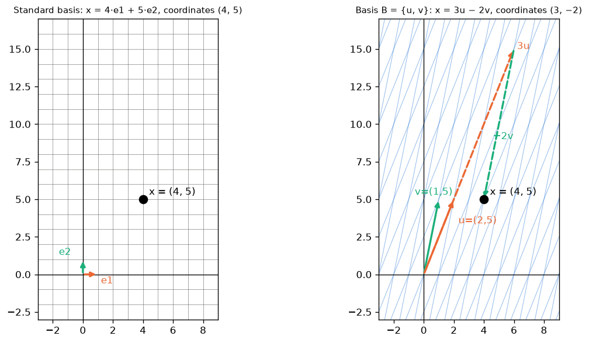
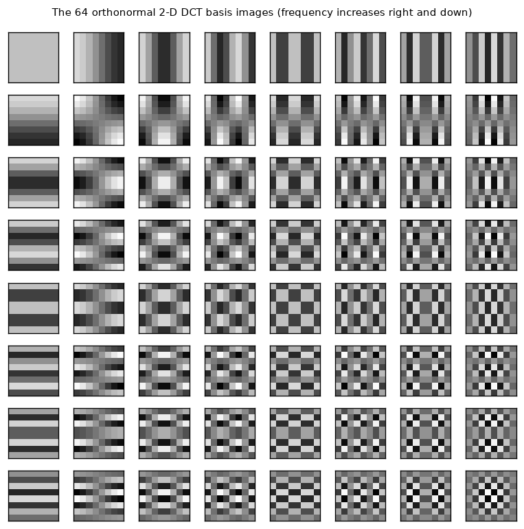
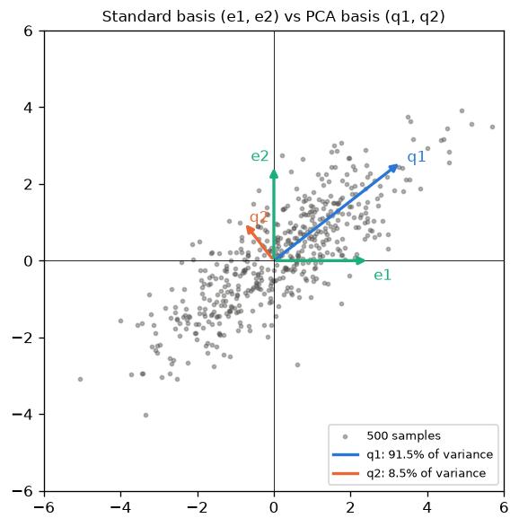

# 04 · Linear Combination, Span, Linear Independence, Basis & Dimension

> **Course:** Applied Mathematics for Data Science & AI · Dr. Arulalan Rajan
>
> **Lectures:** 30 Sep 2026 (main) and 3 Oct 2026 (start: basis of the zero space)
>
> **Sources:** handwritten notes pp. 42–50 and the 30 Sep + 3 Oct class transcripts
>
> **Notebooks:** [`code/linear_algebra_part1.ipynb`](code/linear_algebra_part1.ipynb), Part D · deep dive with every worked example, case study and practice answer of this note: [`code/04_basis_deep_dive.ipynb`](code/04_basis_deep_dive.ipynb) (figures: [`code/figures_04.py`](code/figures_04.py))

---

## 📌 Table of Contents

1. [Big Picture: How Do We Generate a Vector Space?](#1-big-picture-how-do-we-generate-a-vector-space)
2. [Linear Combination](#2-linear-combination-)
3. [Span: Generating ℝ² from Two Vectors](#3-span-generating-ℝ²-from-two-vectors-)
4. [Proof via the Determinant](#4-proof-via-the-determinant-)
5. [Span Is Always a Subspace](#5-span-is-always-a-subspace-)
6. [Linear Independence](#6-linear-independence-)
7. [Basis](#7-basis-)
8. [Dimension](#8-dimension-)
9. [Building a Basis: Prune and Extend](#9-building-a-basis-prune-and-extend-)
10. [Coordinates and Change of Basis](#10-coordinates-and-change-of-basis-)
11. [Beyond ℝⁿ: Polynomial and Matrix Spaces](#11-beyond-ℝⁿ-polynomial-and-matrix-spaces-)
12. [Sums of Subspaces and the Dimension Formula](#12-sums-of-subspaces-and-the-dimension-formula-)
13. [The Professor's Comments (Remarks 1–5)](#13-the-professors-comments-remarks-15-)
14. [Puzzle: Basis of the Zero Space](#14-puzzle-basis-of-the-zero-space-)
15. [Dimension of a Vector vs Dimension of a Space](#15-dimension-of-a-vector-vs-dimension-of-a-space-)
16. [ML Connection: Independent Features](#16-ml-connection-independent-features-)
17. [Real-World Case Studies](#17-real-world-case-studies-)
18. [Code Walkthrough](#18-code-walkthrough)
19. [Professor Emphasised](#19--professor-emphasised)
20. [Common Confusions](#20--common-confusions)
21. [Practice Problems](#21--practice-problems)
22. [Cheat Sheet](#22--cheat-sheet)
23. [Go Deeper](#23--go-deeper-curated-links)

---

## 1. Big Picture: How Do We Generate a Vector Space?

Every subspace (except $`\{\mathbf{0}\}`$) has **infinitely many** vectors. We can't list them. So the question is: *can a few vectors **generate** all of them?*

**Professor's analogies:**

| Analogy | Generators | What they generate |
|---|---|---|
| 💉 **COVID vaccine trials** | A few volunteers from each age/gender/profession group | Confidence about the whole population (you can't test everyone, so you test representatives) |
| 🔤 **English language** | **26 letters** | Every book, article and poem ever written in English |
| 💌 **Joint-family wedding invitation** | One card to the **paternal grandfather** "& family", one to the **maternal grandfather** "& family" | Every relative (if the two families weren't related before the marriage, i.e. they are *independent*) |
| 🔢 **Primes** | 2, 3, 5, 7, … | Every positive integer (as products of prime powers, uniquely: the fundamental theorem of arithmetic) |

In linear algebra the "generators" are a **basis**: a small set of **independent** vectors whose **linear combinations** produce the **entire** space.

> ⚠️ The prime analogy is only an analogy (professor's warning). Primes generate via **multiplication/exponents** and there are **infinitely many** primes. Bases here generate via **addition + scaling**, and in $`\mathbb{R}^n`$ a basis has exactly **n** vectors. *"Don't map this with that, you will land in trouble."*

**Road map of this note.** The four words of the title answer four questions:

| Word | Question it answers |
|---|---|
| **Span** | Which vectors can I *reach* with combinations of my generators? |
| **Independence** | Is any generator *redundant*? |
| **Basis** | A set of generators that reaches everything with *no* redundancy |
| **Dimension** | *How many* generators such a set needs (always the same number) |

Sections 2–8 build these ideas exactly as in class; sections 9–12 add the standard theorems and techniques (finding, extending and switching bases) that every later topic (null space, rank, PCA, eigenvectors) relies on.

---

## 2. Linear Combination 🟢

For vectors $`\vec{u}, \vec{v}`$ and real scalars $`\alpha, \beta`$:

```math
\boxed{\alpha\vec{u} + \beta\vec{v}} \quad\text{is a } \textbf{linear combination} \text{ of } \vec{u} \text{ and } \vec{v}.
```

```math
\alpha\begin{pmatrix}u_1\\u_2\end{pmatrix} + \beta\begin{pmatrix}v_1\\v_2\end{pmatrix} = \begin{pmatrix}\alpha u_1 + \beta v_1\\ \alpha u_2 + \beta v_2\end{pmatrix}
```

More generally: $`c_1\vec{v}_1 + c_2\vec{v}_2 + \dots + c_k\vec{v}_k`$.

### 🎵 Music analogy (professor, for students unsure about linear combinations)

A song you hear is **one track**, but it's made of **many tracks**: vocals, guitar, drums, keyboard.

- Each instrument track = a **vector**.
- The **volume** of each track on the mixing console = a **scalar** ($`\alpha, \beta, \gamma, \dots`$).
- The final mix = **linear combination** = $`\alpha\cdot\text{vocals} + \beta\cdot\text{guitar} + \gamma\cdot\text{drums} + \dots`$

(Bonus: separating a recorded song back into tracks is a real ML problem, *source separation*, and it's essentially "find the coefficients of a linear combination".)

### In the family analogy

- $`\alpha\vec{u}`$ for all $`\alpha`$ = all relatives from the **paternal** side (multiples of one direction: "cousins").
- $`\beta\vec{v}`$ for all $`\beta`$ = all relatives from the **maternal** side.
- $`\alpha\vec{u} + \beta\vec{v}`$ = **every** relative.

### Ax = b is a linear combination! (Notes p.50)

```math
\begin{bmatrix}1&1\\1&-1\\2&1\end{bmatrix}\begin{bmatrix}x_1\\x_2\end{bmatrix} = \begin{bmatrix}b_1\\b_2\\b_3\end{bmatrix}
\iff
x_1\begin{bmatrix}1\\1\\2\end{bmatrix} + x_2\begin{bmatrix}1\\-1\\1\end{bmatrix} = \begin{bmatrix}b_1\\b_2\\b_3\end{bmatrix}
```

The coefficients of $`x_1`$ (1, 1, 2) form the **first column**, so **$`Ax`$ = linear combination of the columns of $`A`$, with weights from $`x`$.** Solving $`Ax=b`$ means asking *"which mix of columns makes $`b`$?"* This is the single most useful way to read matrix–vector multiplication.

**Why it is true in general.** For $`A = [\,\mathbf{a}_1\ \mathbf{a}_2\ \cdots\ \mathbf{a}_n\,]`$ (columns), the $`i`$-th entry of $`Ax`$ is $`\sum_j a_{ij}x_j`$. That is exactly the $`i`$-th entry of $`\sum_j x_j\mathbf{a}_j`$. Since every entry agrees,

```math
Ax = x_1\mathbf{a}_1 + x_2\mathbf{a}_2 + \dots + x_n\mathbf{a}_n .
```

Two consequences used throughout this note:

- $`Ax = b`$ is solvable $`\iff`$ $`b`$ is a linear combination of the columns $`\iff b \in \text{span}\{\mathbf{a}_1,\dots,\mathbf{a}_n\}`$ (the **column space** $`C(A)`$).
- $`Ax = \mathbf{0}`$ has a non-zero solution $`\iff`$ some non-trivial combination of the columns is $`\mathbf{0}`$ $`\iff`$ the columns are **dependent** (§6).

---

## 3. Span: Generating ℝ² from Two Vectors 🟢

**Claim:** if $`\vec{u}, \vec{v} \in \mathbb{R}^2`$ point in **two different directions**, then $`\{\alpha\vec{u} + \beta\vec{v} : \alpha,\beta\in\mathbb{R}\}`$ = **all of $`\mathbb{R}^2`$**.

The set of all linear combinations is called the **span**:

```math
\text{span}\{\vec{u}, \vec{v}\} = \{\alpha\vec{u} + \beta\vec{v} : \alpha, \beta \in \mathbb{R}\}
```

For a general finite set $`S = \{\vec{v}_1,\dots,\vec{v}_k\}`$:

```math
\text{span}(S) = \{c_1\vec{v}_1 + \dots + c_k\vec{v}_k \;:\; c_1,\dots,c_k \in \mathbb{R}\}, \qquad \text{span}(\varnothing) = \{\mathbf{0}\}.
```

**Class example (students chose the vectors):** $`\vec{u} = (2,5)`$, $`\vec{v} = (1,5)`$.


The skewed grid shows that integer combinations tile the plane, and real combinations fill **every** point. Example: $`(1, 0) = 1\cdot\vec{u} - 1\cdot\vec{v}`$.

**The professor's GeoGebra demo (30 Sep):**

- Set $`c_1 = 0`$ and vary $`c_2`$: the result moves along the **line through $`\vec{v}`$** only.
- Set $`c_2 = 0`$ and vary $`c_1`$: the result moves along the line through $`\vec{u}`$.
- Vary both: the resultant visits **all four quadrants**, so it sweeps all of $`\mathbb{R}^2`$.
- Same with $`\vec{u} = (1,0)`$, $`\vec{v} = (0,1)`$: $`x_1(1,0) + x_2(0,1) = (x_1, x_2)`$, so every point is reached trivially.

**Span of ONE non-zero vector** = a line through the origin. E.g. $`\text{span}\{(1,1)\} = \{(x_1, x_1)\}`$ (Ex 3 from Note 03).

**What spans can look like in ℝ³** (for comparison):

| Generators | Span |
|---|---|
| none, or only $`\mathbf{0}`$ | the origin $`\{\mathbf{0}\}`$ |
| one non-zero vector, or several parallel ones | a line through the origin |
| two non-parallel vectors (or more, all in one plane) | a plane through the origin |
| three vectors not in a common plane | all of $`\mathbb{R}^3`$ |

A span is **never** a line or plane that misses the origin, because $`0\cdot\vec{v}_1 + \dots + 0\cdot\vec{v}_k = \mathbf{0}`$ is always a combination.

---

## 4. Proof via the Determinant 🟡

*A student's question in class:* "How is it **guaranteed** that two directions generate everything?"

```math
\alpha\begin{bmatrix}2\\5\end{bmatrix} + \beta\begin{bmatrix}1\\5\end{bmatrix} = \begin{bmatrix}2\alpha+\beta\\5\alpha+5\beta\end{bmatrix} = \underbrace{\begin{bmatrix}2&1\\5&5\end{bmatrix}}_{A}\underbrace{\begin{bmatrix}\alpha\\\beta\end{bmatrix}}_{x} = \begin{bmatrix}w_1\\w_2\end{bmatrix}
```

- $`\det A = 10 - 5 = 5 \ne 0`$, so $`A^{-1}`$ exists.
- **Given any target** $`\vec{w} = (w_1, w_2)`$, take the coefficients below. A solution always exists, so **every** $`\vec{w}`$ is reachable.
- It's also **unique**: no two different $`(\alpha, \beta)`$ give the same $`\vec{w}`$.

```math
\begin{bmatrix}\alpha\\\beta\end{bmatrix} = A^{-1}\vec{w} = \frac{1}{5}\begin{bmatrix}5&-1\\-5&2\end{bmatrix}\begin{bmatrix}w_1\\w_2\end{bmatrix} = \begin{bmatrix}w_1 - \tfrac{1}{5}w_2\\ -w_1 + \tfrac{2}{5}w_2\end{bmatrix}.
```

Hence $`\text{span}\{\vec{u},\vec{v}\} = \mathbb{R}^2`$. ∎

*Sanity check:* for $`\vec{w} = (1,0)`$ the formula gives $`\alpha = 1,\ \beta = -1`$, matching $`(1,0) = \vec{u} - \vec{v}`$ from §3.

> 🔑 **General test:** $`n`$ vectors in $`\mathbb{R}^n`$ span $`\mathbb{R}^n`$ $`\iff`$ the matrix with those vectors as columns has $`\det \ne 0`$. "Two different directions" ⇔ $`\det \ne 0`$ (they aren't multiples of each other).

**Why "different directions" is exactly "det ≠ 0" in ℝ².** For $`\vec{u} = (u_1,u_2)`$ and $`\vec{v} = (v_1,v_2)`$, $`\det = u_1v_2 - u_2v_1`$. This is zero exactly when $`u_1 : u_2 = v_1 : v_2`$, i.e. when one vector is a multiple of the other (same or opposite direction, or one of them is $`\mathbf{0}`$). Geometrically $`\lvert\det\rvert`$ is the area of the parallelogram on $`\vec{u}, \vec{v}`$; zero area means the parallelogram is flat, so the two vectors lie on one line and can only reach that line.

---

## 5. Span Is Always a Subspace 🟡

The cheat sheet says "span is always a subspace". Here is why, and why it is the *smallest* one.

**Theorem 5.1.** For any vectors $`\vec{v}_1,\dots,\vec{v}_k`$ in a vector space $`V`$:

1. $`\text{span}\{\vec{v}_1,\dots,\vec{v}_k\}`$ is a subspace of $`V`$.
2. It is the **smallest** subspace containing all the $`\vec{v}_i`$: any subspace $`W`$ that contains every $`\vec{v}_i`$ contains the whole span.

**Proof.** Let $`S = \text{span}\{\vec{v}_1,\dots,\vec{v}_k\}`$. Check the three subspace conditions from Note 03.

- **Zero vector:** $`\mathbf{0} = 0\vec{v}_1 + \dots + 0\vec{v}_k \in S`$.
- **Closed under addition:** if $`\mathbf{x} = \sum a_i\vec{v}_i`$ and $`\mathbf{y} = \sum b_i\vec{v}_i`$, then $`\mathbf{x} + \mathbf{y} = \sum (a_i + b_i)\vec{v}_i`$, again a combination, so it is in $`S`$.
- **Closed under scaling:** $`c\mathbf{x} = \sum (ca_i)\vec{v}_i \in S`$.

For part 2: a subspace $`W`$ containing every $`\vec{v}_i`$ is closed under scaling (so it contains every $`c_i\vec{v}_i`$) and under addition (so it contains their sum). Hence every element of $`S`$ lies in $`W`$. ∎

**Consequences.**

- Adding a vector that is already in the span **does not change** the span: $`\text{span}\{\vec{v}_1,\dots,\vec{v}_k,\mathbf{w}\} = \text{span}\{\vec{v}_1,\dots,\vec{v}_k\}`$ iff $`\mathbf{w} \in \text{span}\{\vec{v}_1,\dots,\vec{v}_k\}`$. This is precisely what "redundant" will mean in §6.
- The column space $`C(A)`$ of any $`m\times n`$ matrix is a subspace of $`\mathbb{R}^m`$, because it is a span.

### Worked example: is b in the span? 🟢

Take the columns of the p.50 matrix, $`\mathbf{a}_1 = (1,1,2)`$, $`\mathbf{a}_2 = (1,-1,1)`$. Is $`\mathbf{b} = (3,1,5)`$ in their span? Is $`\mathbf{b}' = (3,1,4)`$?

Solve $`x_1\mathbf{a}_1 + x_2\mathbf{a}_2 = \mathbf{b}`$, i.e. row-reduce the augmented matrix:

```math
\left[\begin{array}{cc|c}1&1&3\\1&-1&1\\2&1&5\end{array}\right]
\xrightarrow[R_3 - 2R_1]{R_2 - R_1}
\left[\begin{array}{cc|c}1&1&3\\0&-2&-2\\0&-1&-1\end{array}\right]
\xrightarrow{R_3 - \frac{1}{2}R_2}
\left[\begin{array}{cc|c}1&1&3\\0&-2&-2\\0&0&0\end{array}\right]
```

Consistent: $`x_2 = 1`$, $`x_1 = 2`$. So $`\mathbf{b} = 2\mathbf{a}_1 + \mathbf{a}_2 \in \text{span}`$.

For $`\mathbf{b}' = (3,1,4)`$ the same steps give a last row $`[\,0\ \ 0 \mid -1\,]`$, i.e. $`0 = -1`$: inconsistent, so $`\mathbf{b}' \notin \text{span}`$.

*Sanity check:* $`2(1,1,2) + (1,-1,1) = (3,1,5)`$ ✓. Geometrically the span is the plane through the origin with normal $`\mathbf{a}_1 \times \mathbf{a}_2 = (3,1,-2)`$; $`(3,1,5)\cdot(3,1,-2) = 9+1-10 = 0`$ (on the plane) but $`(3,1,4)\cdot(3,1,-2) = 2 \ne 0`$ (off the plane).

> **Rank form of the test:** $`\mathbf{b} \in \text{span}\{\mathbf{a}_1,\dots,\mathbf{a}_n\} \iff \text{rank}[A] = \text{rank}[A \mid \mathbf{b}]`$. Adding $`\mathbf{b}`$ as an extra column must not create a new pivot.

---

## 6. Linear Independence 🟢→🟡

**Follow-up question:** *"What if I add a third vector, $`\vec{w} = (3,5)`$? Do I get a new direction?"* No. In $`\mathbb{R}^2`$ the third vector adds nothing new. We need a precise word for "adds nothing new".

### Definition (notes p.44)

A set $`\{\vec{v}_1, \vec{v}_2, \dots, \vec{v}_k\}`$ is **linearly independent** if and only if

```math
c_1\vec{v}_1 + c_2\vec{v}_2 + \dots + c_k\vec{v}_k = \mathbf{0} \;\Longrightarrow\; c_1 = c_2 = \dots = c_k = 0
```

**In words:** the **only** way to combine them into the zero vector is the trivial way (all coefficients zero). Otherwise the set is **linearly dependent**.

**Professor's intuition:** *"If I take zero proportion of each vector, I definitely get nothing. But if some **non-zero** proportions also give nothing, there's **redundancy**."*

### Worked example (notes p.45)

$`\vec{u} = (1,0)`$, $`\vec{v} = (0,1)`$, $`\vec{w} = (2,3)`$ (all non-zero):

- $`c = (0,0,0)`$ gives $`\mathbf{0}`$ ✓ (always true, the trivial case)
- $`c = (2, 3, -1)`$: $`2(1,0) + 3(0,1) - 1(2,3) = (0,0)`$ ✗ **non-trivial!**


⇒ $`\{\vec{u}, \vec{v}, \vec{w}\}`$ is **linearly dependent**: $`\vec{w} = 2\vec{u} + 3\vec{v}`$ is redundant.

The notes (p.45) then list pairs that each generate $`\mathbb{R}^2`$: $`\{(1,5),(2,5)\}`$, $`\{(1,5),(3,5)\}`$, $`\{(1,0),(0,1)\}`$, $`\{(2,5),(3,5)\}`$. Any **two** of the three vectors $`(1,5), (2,5), (3,5)`$ already span $`\mathbb{R}^2`$, so the third is always redundant: $`(3,5) = 2(2,5) - (1,5)`$.

### Equivalent views

| Statement | Meaning |
|---|---|
| Dependent | **Some vector is a linear combination of the others** |
| Independent | Each vector contributes a **genuinely new direction** |
| Matrix test | Put the vectors as columns of $`M`$: independent $`\iff`$ $`M\vec{c} = \mathbf{0}`$ has only $`\vec{c} = \mathbf{0}`$ $`\iff`$ $`\text{rank}(M) = k`$ |
| Square case | $`k = n`$ vectors in $`\mathbb{R}^n`$: independent $`\iff \det M \ne 0`$ |

> 🔗 **Link to Note 02:** "$`Ax=0`$ has only the trivial solution" is *exactly* "the columns of $`A`$ are linearly independent". The professor pointed this out: *"I'm cheating you by not telling you we've done this before."*

### Theorem 6.1: equivalent forms of dependence 🟡

For vectors $`\vec{v}_1,\dots,\vec{v}_k`$ (with $`k \ge 2`$) and $`M = [\,\vec{v}_1\ \cdots\ \vec{v}_k\,]`$, the following are **equivalent**:

1. **(Definition)** Some non-trivial combination equals $`\mathbf{0}`$.
2. **(Redundancy)** Some $`\vec{v}_j`$ is a linear combination of the others.
3. **(Span does not shrink)** Some $`\vec{v}_j`$ can be removed without changing the span.
4. **(Non-unique representation)** Some vector $`\mathbf{x}`$ in the span can be written as a combination in **two different ways**.
5. **(Matrix)** $`M\mathbf{c} = \mathbf{0}`$ has a non-zero solution, i.e. $`\text{rank}(M) < k`$, i.e. at least one free variable.

**Proof.**

- **1 ⇒ 2.** Suppose $`\sum_i c_i\vec{v}_i = \mathbf{0}`$ with some $`c_j \neq 0`$. Divide by $`c_j`$ and rearrange:

```math
\vec{v}_j = -\sum_{i\neq j}\frac{c_i}{c_j}\,\vec{v}_i .
```

- **2 ⇒ 1.** If $`\vec{v}_j = \sum_{i\ne j} a_i\vec{v}_i`$, then $`\sum_{i\neq j} a_i\vec{v}_i + (-1)\vec{v}_j = \mathbf{0}`$, and the coefficient $`-1`$ is non-zero.
- **2 ⇔ 3.** By the consequence of Theorem 5.1, removing $`\vec{v}_j`$ leaves the span unchanged exactly when $`\vec{v}_j`$ lies in the span of the remaining vectors.
- **1 ⇔ 4.** If $`\mathbf{x} = \sum a_i\vec{v}_i = \sum b_i\vec{v}_i`$ with $`\mathbf{a} \neq \mathbf{b}`$, subtracting gives $`\sum (a_i - b_i)\vec{v}_i = \mathbf{0}`$, a non-trivial combination. Conversely, if $`\sum c_i\vec{v}_i = \mathbf{0}`$ non-trivially, then $`\mathbf{0}`$ itself has two representations: all-zero and $`\mathbf{c}`$.
- **1 ⇔ 5.** $`M\mathbf{c} = \sum c_i\vec{v}_i`$ (§2), so this is the same statement written with a matrix. ∎

**Ordered version (Linear Dependence Lemma).** If $`\vec{v}_1,\dots,\vec{v}_k`$ are dependent, then either $`\vec{v}_1 = \mathbf{0}`$ or some $`\vec{v}_j`$ lies in the span of the vectors **before** it, $`\vec{v}_1,\dots,\vec{v}_{j-1}`$. (Take a non-trivial relation and let $`j`$ be the largest index with $`c_j \ne 0`$; solve for $`\vec{v}_j`$.) This lemma is what makes "scan left to right and throw away vectors already in the span" a correct algorithm (§9).

### Theorem 6.2: n + 1 vectors in ℝⁿ are always dependent 🟡

This is the corollary a student stated on 3 Oct ("in an $`n`$-dimensional space, any $`n+1`$ vectors are definitely redundant").

**Proof.** Put $`k > n`$ vectors of $`\mathbb{R}^n`$ as the columns of an $`n \times k`$ matrix $`M`$ and solve $`M\mathbf{c} = \mathbf{0}`$ by elimination. Every pivot sits in a different **row**, so there are at most $`n`$ pivots. With $`k > n`$ columns, at least $`k - n \ge 1`$ columns have no pivot, so there is at least one **free variable**. Setting that free variable to 1 and back-substituting gives a non-zero $`\mathbf{c}`$ with $`M\mathbf{c} = \mathbf{0}`$. By Theorem 6.1 the vectors are dependent. ∎

> The same argument says: **a homogeneous system with more unknowns than equations always has a non-trivial solution.** This fact drives the proof that dimension is well defined (§8).

### Quick rules

| Situation | Independent? |
|---|---|
| One non-zero vector | ✅ Always |
| Any set containing $`\mathbf{0}`$ | ❌ Always dependent ($`1\cdot\mathbf{0} = \mathbf{0}`$ is a non-trivial combination) |
| Two vectors | Independent ⇔ neither is a multiple of the other |
| More than $`n`$ vectors in $`\mathbb{R}^n`$ | ❌ **Always dependent** (e.g. 3 vectors in $`\mathbb{R}^2`$), Theorem 6.2 |
| Orthogonal non-zero vectors | ✅ Always (dot the relation with $`\vec{v}_j`$: $`c_j\lVert\vec{v}_j\rVert^2 = 0`$, so $`c_j = 0`$) |
| A subset of an independent set | ✅ Always independent |
| A superset of a dependent set | ❌ Always dependent |

### Worked examples W1–W4: independence by elimination 🟢→🟡

**Method.** Put the vectors as **columns** of $`M`$, row-reduce, count pivots. Independent $`\iff`$ every column has a pivot. If some column has no pivot, back-substitute to read off the dependency.

**W1 (two quick 2-D sets).**

(a) $`\{(2,5),(1,5)\}`$: $`\det = 2\cdot5 - 1\cdot5 = 5 \ne 0`$ → **independent** (the class pair).

(b) $`\{(1,2),(-2,-4)\}`$: $`\det = 1\cdot(-4) - (-2)\cdot 2 = 0`$ → **dependent**. Indeed $`(-2,-4) = -2(1,2)`$, i.e. $`2\vec{v}_1 + \vec{v}_2 = \mathbf{0}`$.

*Sanity check:* $`2(1,2) + (-2,-4) = (0,0)`$ ✓.

**W2.** Are $`(1,2,1),\ (2,1,0),\ (1,-1,2)`$ independent?

```math
M = \begin{bmatrix}1&2&1\\2&1&-1\\1&0&2\end{bmatrix}
\xrightarrow[R_3 - R_1]{R_2 - 2R_1}
\begin{bmatrix}1&2&1\\0&-3&-3\\0&-2&1\end{bmatrix}
\xrightarrow{R_3 - \frac{2}{3}R_2}
\begin{bmatrix}1&2&1\\0&-3&-3\\0&0&3\end{bmatrix}
```

Three pivots (1, −3, 3) for three columns → **independent**, hence a basis of $`\mathbb{R}^3`$.

*Sanity check:* $`\det M = 1\cdot(-3)\cdot 3 = -9 \ne 0`$ (product of pivots; no row swaps), matching the notebook.

**W3.** Are $`(1,1,0),\ (0,1,1),\ (1,2,1)`$ independent?

```math
M = \begin{bmatrix}1&0&1\\1&1&2\\0&1&1\end{bmatrix}
\xrightarrow{R_2 - R_1}
\begin{bmatrix}1&0&1\\0&1&1\\0&1&1\end{bmatrix}
\xrightarrow{R_3 - R_2}
\begin{bmatrix}1&0&1\\0&1&1\\0&0&0\end{bmatrix}
```

Column 3 has no pivot → **dependent**. Reading the reduced matrix with $`c_3 = 1`$: $`c_2 = -1`$, $`c_1 = -1`$, so $`-\vec{v}_1 - \vec{v}_2 + \vec{v}_3 = \mathbf{0}`$, i.e. $`\vec{v}_3 = \vec{v}_1 + \vec{v}_2`$.

*Sanity check:* $`(1,1,0) + (0,1,1) = (1,2,1)`$ ✓. The span is a plane, not $`\mathbb{R}^3`$.

**W4.** Four vectors in $`\mathbb{R}^4`$: $`(1,0,1,2),\ (0,1,1,1),\ (1,1,1,0),\ (2,1,3,5)`$.

```math
\begin{bmatrix}1&0&1&2\\0&1&1&1\\1&1&1&3\\2&1&0&5\end{bmatrix}
\xrightarrow[R_4 - 2R_1]{R_3 - R_1}
\begin{bmatrix}1&0&1&2\\0&1&1&1\\0&1&0&1\\0&1&-2&1\end{bmatrix}
\xrightarrow[R_4 - R_2]{R_3 - R_2}
\begin{bmatrix}1&0&1&2\\0&1&1&1\\0&0&-1&0\\0&0&-3&0\end{bmatrix}
\xrightarrow{R_4 - 3R_3}
\begin{bmatrix}1&0&1&2\\0&1&1&1\\0&0&-1&0\\0&0&0&0\end{bmatrix}
```

Rank 3 < 4 → **dependent** (and $`\det = 0`$). Back-substitute with $`c_4 = 1`$: $`c_3 = 0`$, $`c_2 = -1`$, $`c_1 = -2`$. So $`\vec{v}_4 = 2\vec{v}_1 + \vec{v}_2`$.

*Sanity check:* $`2(1,0,1,2) + (0,1,1,1) = (2,1,3,5)`$ ✓. Note that a 4×4 determinant alone would only say "dependent"; elimination also tells you **which** vector is redundant and **how**.

> 💡 **Floating-point caution.** In code, `np.linalg.matrix_rank` uses singular values with a tolerance. For W4 the singular values are about 6.92, 1.55, 0.89 and 0 (notebook Part 1). For the nearly dependent pair $`(1,1),\ (1, 1+10^{-9})`$ numpy still reports rank 2, but the condition number is about $`4\times10^{9}`$: the set is *numerically* almost dependent, which is exactly the multicollinearity problem in §16.

---

## 7. Basis 🟢

> **Definition (notes p.46):** A **basis** is a set of **linearly independent** vectors whose **all possible linear combinations generate the entire vector space**.

Two requirements:

1. **Spans** the space: enough vectors to reach everything.
2. **Independent**: no redundant vector.

A basis is a **minimal spanning set**, or equivalently a **maximal independent set**.

### Examples (notes p.46)

| Vector space | Basis |
|---|---|
| $`\{(x_1, x_1)\}`$ (line $`y=x`$) | $`\{(1,1)\}`$ |
| $`\{(x_1, 2x_1)\}`$ | $`\{(1,2)\}`$ |
| $`\{(-3x_1, x_1)\}`$ | $`\{(-3,1)\}`$ |
| $`\mathbb{R}^2`$ | $`\{(1,0),(0,1)\}`$ (standard basis), or $`\{(2,5),(1,5)\}`$, or … |
| $`\mathbb{R}^n`$ | standard basis $`\{\mathbf{e}_1,\dots,\mathbf{e}_n\}`$, $`\mathbf{e}_i`$ = 1 in slot $`i`$, 0 elsewhere |

### 👓 Basis = spectacles (professor's analogy)

Why don't we all use the same reading glasses from a shop? **Each person's eye power is different.** Everyone picks lenses that suit them, but **everyone sees the same page.**

- **Field of view** = the vector space (the same for everyone).
- **Spectacles** = the basis you choose to look through.
- Plain glass = standard basis $`\{(1,0),(0,1)\}`$.
- Others need $`\{(1,5),(2,5)\}`$ or $`\{(1,5),(3,5)\}`$ …

*"Depending on how you want to see the problem, you choose a basis."* The same point has **different coordinates** in different bases. E.g. $`(1, 0)`$ in the standard basis is $`(1, -1)`$ in the basis $`\{(2,5),(1,5)\}`$ (notebook Part D). Section 10 turns this into a formula.

**Language version:** you and a famous politician understand the **same English book** using **different vocabularies**. Different bases, same space.

### There are infinitely many bases

For $`\mathbb{R}^2`$ (notes p.48):

```math
B_1 = \{(1,0),(0,1)\},\quad B_2 = \{(2,1),(1,2)\},\quad B_3 = \{(1,4),(-1,2)\},\quad B_4 = \{(-2,-3),(1,-4)\},\ \dots
```

Any two non-parallel vectors work. Check: $`\det B_2 = 4 - 1 = 3`$, $`\det B_3 = 2 + 4 = 6`$, $`\det B_4 = 8 + 3 = 11`$, all non-zero. In fact any non-zero multiple of a basis vector, or any $`\vec{u} + t\vec{v}`$ in place of $`\vec{u}`$, gives another basis, so there are uncountably many.

### Theorem 7.1: coordinates in a basis are unique 🟡

**Statement.** If $`B = \{\mathbf{b}_1,\dots,\mathbf{b}_n\}`$ is a basis of $`V`$, every $`\mathbf{x} \in V`$ can be written as

```math
\mathbf{x} = c_1\mathbf{b}_1 + c_2\mathbf{b}_2 + \dots + c_n\mathbf{b}_n
```

in **exactly one** way. The numbers $`(c_1,\dots,c_n)`$ are the **coordinates** of $`\mathbf{x}`$ in $`B`$, written $`[\mathbf{x}]_B`$.

**Proof.** *Existence:* $`B`$ spans $`V`$. *Uniqueness:* if $`\mathbf{x} = \sum c_i\mathbf{b}_i = \sum d_i\mathbf{b}_i`$, subtract to get $`\sum (c_i - d_i)\mathbf{b}_i = \mathbf{0}`$. Independence forces every $`c_i - d_i = 0`$. ∎

So **spanning ⇔ existence** and **independence ⇔ uniqueness**. A basis is exactly a set of "spectacles" in which every vector has one and only one description. This is the precise version of the professor's remark that "for every $`(\alpha,\beta)`$, $`A(\alpha,\beta)^\top`$ gives different vectors" (notes p.43).

> 🔴 **Why choosing a basis matters in ML:** PCA = choosing the basis aligned with the directions of maximum variance. Fourier transform = the basis of sines/cosines (audio). Wavelets = the JPEG2000 basis. Word embeddings = a learned basis for meaning. **The right basis makes a hard problem easy** (often diagonal, see Note 01 §7). Section 17 works through these with numbers.

---

## 8. Dimension 🟢

Different bases of the same space contain **different vectors** but **always the same number** of them.

> **Definition:** The **number of vectors in any basis** is called the **dimension** of the vector space.

| Space | Dimension | Geometry |
|---|---|---|
| $`\{\mathbf{0}\}`$ | 0 | Point |
| Line through origin | 1 | Only one direction (length) |
| Plane through origin / $`\mathbb{R}^2`$ | 2 | Two directions (length, breadth) |
| $`\mathbb{R}^n`$ | n | |

Professor: *"Dimension corresponds to the number of **independent directions**."*

### Theorem 8.1: all bases have the same size (why the definition makes sense) 🟡

The definition of dimension only works if *every* basis has the same number of vectors. This rests on one inequality.

**Key Lemma (replacement / Steinitz).** If $`\mathbf{w}_1,\dots,\mathbf{w}_m`$ **span** $`V`$ and $`\mathbf{u}_1,\dots,\mathbf{u}_k`$ are **independent** in $`V`$, then $`k \le m`$.

> "Independent sets are never bigger than spanning sets."

**Proof (via a homogeneous system).** Each $`\mathbf{u}_j`$ is in $`V = \text{span}\{\mathbf{w}_i\}`$, so $`\mathbf{u}_j = \sum_{i=1}^m a_{ij}\mathbf{w}_i`$ for some numbers $`a_{ij}`$. Collect them in the $`m\times k`$ matrix $`A = (a_{ij})`$. Suppose, for contradiction, $`k > m`$. Then $`A\mathbf{c} = \mathbf{0}`$ has more unknowns than equations, so (proof of Theorem 6.2) it has a non-zero solution $`\mathbf{c}`$. Now

```math
\sum_{j=1}^k c_j\mathbf{u}_j = \sum_{j=1}^k c_j\sum_{i=1}^m a_{ij}\mathbf{w}_i = \sum_{i=1}^m\Big(\underbrace{\sum_{j=1}^k a_{ij}c_j}_{(A\mathbf{c})_i = 0}\Big)\mathbf{w}_i = \mathbf{0},
```

a non-trivial relation among the $`\mathbf{u}_j`$, contradicting independence. Hence $`k \le m`$. ∎

**Theorem 8.1.** Any two bases $`B`$ (size $`p`$) and $`B'`$ (size $`q`$) of $`V`$ have $`p = q`$.

**Proof.** $`B`$ spans and $`B'`$ is independent, so $`q \le p`$. Swap roles: $`p \le q`$. ∎

**Steinitz exchange, the intuitive picture (sketch).** Start from the spanning list $`\mathbf{w}_1,\dots,\mathbf{w}_m`$ and feed in $`\mathbf{u}_1`$. Since $`\mathbf{u}_1`$ is a combination of the $`\mathbf{w}`$'s with some non-zero coefficient, you can swap out one $`\mathbf{w}`$ for $`\mathbf{u}_1`$ and still span. Repeat with $`\mathbf{u}_2, \mathbf{u}_3, \dots`$; independence of the $`\mathbf{u}`$'s guarantees that the vector thrown out is always a $`\mathbf{w}`$, never an earlier $`\mathbf{u}`$. Each step uses up one $`\mathbf{w}`$, so you can perform at most $`m`$ swaps: $`k \le m`$.

### Corollaries you will use constantly

Let $`\dim V = n`$.

1. Any independent set in $`V`$ has **at most** $`n`$ vectors; any spanning set has **at least** $`n`$.
2. **Two-out-of-three rule.** For a set of exactly $`n`$ vectors in $`V`$: independent ⇔ spanning ⇔ basis. You only need to check **one** of the two conditions. (This is Remark 2 of §13 made precise.)
3. If $`W`$ is a subspace of $`V`$, then $`\dim W \le \dim V`$, with equality **only if** $`W = V`$.
4. $`\dim\mathbb{R}^n = n`$, because the standard basis has $`n`$ vectors.

*Proof of 2 (sketch).* If $`n`$ vectors are independent but do not span, some $`\mathbf{x}`$ lies outside their span; adding it keeps the set independent (Theorem 6.1, form 2), giving $`n+1`$ independent vectors, contradicting 1. If $`n`$ vectors span but are dependent, remove a redundant one (form 3) to get a spanning set of $`n-1`$ vectors, again contradicting 1.

---

## 9. Building a Basis: Prune and Extend 🟡

Two practical questions: (a) given a **spanning** set, how do I **prune** it to a basis? (b) given an **independent** set, how do I **extend** it to a basis?

### Pruning with pivot columns

**Recipe.** Put the vectors as the columns of $`M`$, row-reduce to the reduced row echelon form $`R`$, and note which columns contain pivots. The **original** vectors in those positions form a basis of the span. The entries of each non-pivot column of $`R`$ tell you how that vector is built from the pivot vectors.

**Why it works.** Row operations multiply $`M`$ on the left by an invertible matrix $`E`$, so $`R = EM`$ and

```math
M\mathbf{c} = \mathbf{0} \iff EM\mathbf{c} = \mathbf{0} \iff R\mathbf{c} = \mathbf{0}.
```

So the columns of $`M`$ satisfy **exactly the same linear relations** as the columns of $`R`$. In $`R`$ the pivot columns are distinct standard basis vectors (clearly independent), and each non-pivot column is visibly a combination of the pivot columns to its left. Therefore the same is true for the original columns.

> ⚠️ Use the pivot columns of the **original** matrix $`M`$, not of $`R`$. Row operations preserve the *relations* between columns but change the column space itself.

**W5 (basis and dimension of a span).** Find a basis and the dimension of

```math
S = \text{span}\{(1,2,1,0),\ (2,4,2,0),\ (0,1,1,1),\ (1,3,2,1),\ (1,1,1,1)\}.
```

Row-reducing the 4×5 matrix with these columns gives

```math
R = \begin{bmatrix}1&2&0&1&0\\0&0&1&1&0\\0&0&0&0&1\\0&0&0&0&0\end{bmatrix}
```

- Pivots in columns 1, 3, 5. **Basis:** $`\{(1,2,1,0),\ (0,1,1,1),\ (1,1,1,1)\}`$, so $`\dim S = 3`$.
- Column 2 of $`R`$ is $`(2,0,0,0)`$: $`\vec{v}_2 = 2\vec{v}_1`$.
- Column 4 of $`R`$ is $`(1,1,0,0)`$: $`\vec{v}_4 = \vec{v}_1 + \vec{v}_3`$.

*Sanity check:* $`2(1,2,1,0) = (2,4,2,0)`$ ✓ and $`(1,2,1,0) + (0,1,1,1) = (1,3,2,1)`$ ✓. Since $`\dim S = 3 < 4`$, $`S`$ is a 3-D "hyperplane" inside $`\mathbb{R}^4`$.

### Extending an independent set

**Theorem 9.1.** In an $`n`$-dimensional space, every independent set $`\{\mathbf{u}_1,\dots,\mathbf{u}_k\}`$ can be extended to a basis.

**Proof (algorithm).** If the set spans, it is already a basis. Otherwise pick any $`\mathbf{x}`$ outside its span and add it; the bigger set is still independent (otherwise $`\mathbf{x}`$ would be a combination of the $`\mathbf{u}`$'s). Repeat. Each step increases the size by one, and an independent set can't exceed $`n`$ vectors (§8), so the process stops, at a basis, after $`n - k`$ steps. ∎

**Practical recipe.** Append the standard basis $`\mathbf{e}_1,\dots,\mathbf{e}_n`$ after your vectors and prune the long list with pivot columns. Your own vectors come first and are independent, so they are always pivots; the algorithm keeps just enough $`\mathbf{e}_i`$'s to fill the gaps.

**W8 (extend to a basis of ℝ³).** Extend $`\{(1,1,0),\ (1,0,1)\}`$ to a basis of $`\mathbb{R}^3`$.

- The span of the two vectors is a plane. Its normal is $`(1,1,0)\times(1,0,1) = (1,-1,-1)`$, so the plane is $`x - y - z = 0`$.
- $`\mathbf{e}_1 = (1,0,0)`$ gives $`1 - 0 - 0 = 1 \ne 0`$, so $`\mathbf{e}_1`$ is **not** on the plane; add it.
- Basis: $`\{(1,1,0),\ (1,0,1),\ (1,0,0)\}`$.

The pivot-column recipe on $`[\,(1,1,0)\ (1,0,1)\ \mathbf{e}_1\ \mathbf{e}_2\ \mathbf{e}_3\,]`$ picks the same three columns (notebook Part 3).

*Sanity check:*

```math
\det\begin{bmatrix}1&1&1\\1&0&0\\0&1&0\end{bmatrix} = 1 \neq 0 \;\checkmark
```

(expand along the third column: $`+1\cdot(1\cdot1 - 0\cdot0) = 1`$). Extending $`\{(1,2,3)\}`$ the same way picks $`\mathbf{e}_1, \mathbf{e}_2`$ and gives determinant 3.

---

## 10. Coordinates and Change of Basis 🟡

This is the professor's "spectacles" idea in formulas.

### The basis matrix

Put the basis vectors as the columns of $`P_B = [\,\mathbf{b}_1\ \cdots\ \mathbf{b}_n\,]`$. By §2,

```math
\mathbf{x} = c_1\mathbf{b}_1 + \dots + c_n\mathbf{b}_n = P_B\,[\mathbf{x}]_B
\qquad\Longrightarrow\qquad
[\mathbf{x}]_B = P_B^{-1}\,\mathbf{x}.
```

$`P_B`$ is invertible because its columns are a basis of $`\mathbb{R}^n`$ (independent ⇒ $`\det \ne 0`$).

- $`P_B`$ converts **B-coordinates → standard coordinates**.
- $`P_B^{-1}`$ converts **standard coordinates → B-coordinates**.



*Left: the standard grid; $`\mathbf{x} = (4,5)`$ has coordinates (4, 5). Right: the grid of $`B = \{(2,5),(1,5)\}`$; the same point is $`3\mathbf{u} - 2\mathbf{v}`$, so its B-coordinates are (3, −2). Same point, different spectacles.*

### Converting between two non-standard bases

If $`B`$ and $`C`$ are both bases, then $`\mathbf{x} = P_B[\mathbf{x}]_B = P_C[\mathbf{x}]_C`$, so

```math
[\mathbf{x}]_C = \underbrace{P_C^{-1}P_B}_{P_{C\leftarrow B}}\,[\mathbf{x}]_B,
\qquad
P_{B\leftarrow C} = \left(P_{C\leftarrow B}\right)^{-1} = P_B^{-1}P_C .
```

**Column interpretation.** The $`j`$-th column of $`P_{C\leftarrow B}`$ is $`[\mathbf{b}_j]_C`$, the C-coordinates of the $`j`$-th B-vector. This is often the fastest way to build it by hand.

### Orthonormal bases: coordinates are dot products

If the basis vectors $`\mathbf{q}_1,\dots,\mathbf{q}_n`$ are **orthonormal** ($`\mathbf{q}_i\cdot\mathbf{q}_j = 0`$ for $`i\ne j`$, $`\lVert\mathbf{q}_i\rVert = 1`$), then $`Q^{-1} = Q^\top`$ and

```math
[\mathbf{x}]_Q = Q^\top\mathbf{x} = (\mathbf{q}_1\cdot\mathbf{x},\ \dots,\ \mathbf{q}_n\cdot\mathbf{x}).
```

No system needs to be solved: take dot products. This is why the DCT, Fourier and PCA bases (§17) are all chosen orthonormal.

### W6: coordinates in a non-standard basis 🟢

Find the coordinates of $`\mathbf{x} = (6,5,7)`$ in $`B = \{(1,1,0),\ (0,1,1),\ (1,0,1)\}`$.

Write $`a(1,1,0) + b(0,1,1) + c(1,0,1) = (6,5,7)`$:

```math
\begin{aligned}
a + c &= 6\\
a + b &= 5\\
b + c &= 7
\end{aligned}
```

Adding all three: $`2(a+b+c) = 18`$, so $`a + b + c = 9`$. Subtract each equation: $`b = 9 - 6 = 3`$, $`c = 9 - 5 = 4`$, $`a = 9 - 7 = 2`$. So $`[\mathbf{x}]_B = (2,3,4)`$.

*Sanity check:* $`2(1,1,0) + 3(0,1,1) + 4(1,0,1) = (6,5,7)`$ ✓. Also $`\det P_B = 2 \ne 0`$, so the answer is unique.

### W7: change of basis both ways 🟡

$`B = \{(2,5),(1,5)\}`$ (the class pair) and $`C = \{(1,1),(1,-1)\}`$. A vector has $`[\mathbf{x}]_B = (3,-2)`$. Find $`P_{C\leftarrow B}`$, $`P_{B\leftarrow C}`$ and $`[\mathbf{x}]_C`$.

**Step 1: columns of $`P_{C\leftarrow B}`$.** Express each B-vector in C. For $`(2,5) = p(1,1) + q(1,-1)`$: $`p + q = 2`$, $`p - q = 5`$ ⇒ $`p = 7/2`$, $`q = -3/2`$. For $`(1,5)`$: $`p + q = 1`$, $`p - q = 5`$ ⇒ $`p = 3`$, $`q = -2`$.

```math
P_{C\leftarrow B} = \begin{bmatrix}7/2 & 3\\ -3/2 & -2\end{bmatrix},
\qquad
P_{B\leftarrow C} = \left(P_{C\leftarrow B}\right)^{-1} = \begin{bmatrix}4/5 & 6/5\\ -3/5 & -7/5\end{bmatrix}.
```

($`\det P_{C\leftarrow B} = -7 + 9/2 = -5/2`$, so the inverse is $`-\tfrac{2}{5}`$ times the adjugate.)

**Step 2: convert.**

```math
[\mathbf{x}]_C = P_{C\leftarrow B}\begin{bmatrix}3\\-2\end{bmatrix} = \begin{bmatrix}21/2 - 6\\ -9/2 + 4\end{bmatrix} = \begin{bmatrix}9/2\\-1/2\end{bmatrix}.
```

**Step 3: check through the standard basis.** $`\mathbf{x} = 3(2,5) - 2(1,5) = (4,5)`$, and $`\tfrac{9}{2}(1,1) - \tfrac{1}{2}(1,-1) = (4,5)`$ ✓. Converting back, $`P_{B\leftarrow C}(9/2, -1/2) = (18/5 - 3/5,\ -27/10 + 7/10) = (3,-2)`$ ✓.

### 🔴 Matrices change too (beyond syllabus, preview)

A linear map with matrix $`A`$ in standard coordinates has matrix $`P^{-1}AP`$ in the basis given by the columns of $`P`$. Choosing $`P`$ so that $`P^{-1}AP`$ is **diagonal** is diagonalisation (eigenvectors as the basis), the "right spectacles" that make $`A`$ trivial to understand. This returns later in the course.

---

## 11. Beyond ℝⁿ: Polynomial and Matrix Spaces 🟡

Bases and dimension work in every vector space from Note 03, not just $`\mathbb{R}^n`$. The trick is always the same: **choose a basis, then work with coordinate vectors in $`\mathbb{R}^n`$.**

| Space | Standard basis | Dimension |
|---|---|---|
| $`P_2`$ (polynomials of degree ≤ 2) | $`\{1, x, x^2\}`$ | 3 |
| $`P_n`$ | $`\{1, x, \dots, x^n\}`$ | $`n+1`$ |
| $`\mathcal{M}^{2\times2}`$ | the four matrices with a single 1 | 4 |
| $`\mathcal{M}^{m\times n}`$ | $`mn`$ matrices with a single 1 | $`mn`$ |
| symmetric $`n\times n`$ matrices | entries on and above the diagonal | $`n(n+1)/2`$ |

**Why $`\{1, x, x^2\}`$ is independent.** If $`c_0 + c_1x + c_2x^2 = 0`$ **for every** $`x`$ (the zero polynomial), then all coefficients are zero: a non-zero polynomial of degree ≤ 2 has at most 2 roots, not infinitely many.

**Coordinate map.** Writing $`p(x) = a_0 + a_1x + a_2x^2`$ as the vector $`(a_0, a_1, a_2)`$ turns every question about $`P_2`$ into a question about $`\mathbb{R}^3`$: independence, span and coordinates are all preserved.

### W9: a non-standard polynomial basis

Show $`B = \{1,\ 1+x,\ (1+x)^2\}`$ is a basis of $`P_2`$ and find the coordinates of $`p(x) = 5 + 4x + x^2`$.

**Coefficient vectors** (in the order constant, $`x`$, $`x^2`$): $`1 \to (1,0,0)`$, $`1+x \to (1,1,0)`$, $`(1+x)^2 = 1 + 2x + x^2 \to (1,2,1)`$.

```math
P_B = \begin{bmatrix}1&1&1\\0&1&2\\0&0&1\end{bmatrix},\qquad \det P_B = 1 \neq 0
```

(upper triangular, product of the diagonal), so $`B`$ is a basis (3 independent vectors in a 3-D space).

**Coordinates.** Solve $`c_1\cdot1 + c_2(1+x) + c_3(1+x)^2 = 5 + 4x + x^2`$ by matching coefficients, starting from the top degree:

- $`x^2`$: $`c_3 = 1`$
- $`x`$: $`c_2 + 2c_3 = 4 \Rightarrow c_2 = 2`$
- constant: $`c_1 + c_2 + c_3 = 5 \Rightarrow c_1 = 2`$

So $`[p]_B = (2, 2, 1)`$, i.e. $`p(x) = 2 + 2(1+x) + (1+x)^2`$.

*Sanity check:* $`2 + 2 + 2x + 1 + 2x + x^2 = 5 + 4x + x^2`$ ✓. Bonus check: coordinates in powers of $`(1+x)`$ are the Taylor coefficients at $`x = -1`$: $`p(-1) = 5 - 4 + 1 = 2`$, $`p'(-1) = 4 - 2 = 2`$, $`p''(-1)/2 = 1`$ ✓.

---

## 12. Sums of Subspaces and the Dimension Formula 🔴

*Beyond the lecture, but standard and useful for later topics (rank–nullity, PCA subspaces).*

For subspaces $`U, W`$ of $`V`$, the **sum** $`U + W = \{\mathbf{u} + \mathbf{w} : \mathbf{u}\in U,\ \mathbf{w}\in W\}`$ is the smallest subspace containing both (it equals $`\text{span}(U \cup W)`$; recall from Note 03 that the plain union $`U\cup W`$ is usually *not* a subspace).

**Theorem 12.1 (dimension formula).**

```math
\dim(U + W) = \dim U + \dim W - \dim(U \cap W)
```

This is the linear-algebra version of $`\lvert A\cup B\rvert = \lvert A\rvert + \lvert B\rvert - \lvert A\cap B\rvert`$: the shared directions would otherwise be counted twice.

**Proof sketch.** Take a basis $`\{\mathbf{z}_1,\dots,\mathbf{z}_r\}`$ of $`U\cap W`$. Extend it (§9) to a basis $`\{\mathbf{z}_i\}\cup\{\mathbf{u}_1,\dots,\mathbf{u}_s\}`$ of $`U`$ and to a basis $`\{\mathbf{z}_i\}\cup\{\mathbf{w}_1,\dots,\mathbf{w}_t\}`$ of $`W`$. The combined list $`\{\mathbf{z}_i, \mathbf{u}_j, \mathbf{w}_l\}`$ spans $`U + W`$ (clear), and one checks it is independent: if $`\sum a_i\mathbf{z}_i + \sum b_j\mathbf{u}_j + \sum c_l\mathbf{w}_l = \mathbf{0}`$, then $`\sum c_l\mathbf{w}_l = -(\dots) \in U\cap W`$, so it is a combination of the $`\mathbf{z}_i`$; independence of the $`W`$-basis forces all $`c_l = 0`$, and then independence of the $`U`$-basis forces the rest to vanish. Counting: $`\dim(U+W) = r + s + t = (r+s) + (r+t) - r`$. ∎

**How to compute it.** $`\dim(U+W) = \text{rank}[\,U_{\text{basis}}\mid W_{\text{basis}}\,]`$. Vectors in $`U\cap W`$ come from solving $`U\mathbf{a} = W\mathbf{b}`$, i.e. the null space of $`[\,U \mid -W\,]`$.

### W10: two planes in ℝ³

$`U = \text{span}\{(1,0,0),(0,1,0)\}`$ (the $`xy`$-plane), $`W = \text{span}\{(1,1,0),(0,0,1)\}`$.

- $`\dim U = \dim W = 2`$.
- The four vectors together have rank 3 (they include $`\mathbf{e}_1, \mathbf{e}_2, \mathbf{e}_3`$), so $`U + W = \mathbb{R}^3`$, $`\dim(U+W) = 3`$.
- Formula: $`\dim(U\cap W) = 2 + 2 - 3 = 1`$, a line.
- Which line? A vector in $`W`$ is $`a(1,1,0) + b(0,0,1) = (a,a,b)`$; it lies in the $`xy`$-plane iff $`b = 0`$. So $`U\cap W = \text{span}\{(1,1,0)\}`$ ✓ (matches notebook Part 5).

*Sanity check:* two distinct planes through the origin in $`\mathbb{R}^3`$ always meet in a line, and $`2 + 2 - 3 = 1`$ says exactly that. Two planes in $`\mathbb{R}^4`$ can even meet only at the origin ($`2 + 2 - 4 = 0`$), e.g. $`\text{span}\{\mathbf{e}_1,\mathbf{e}_2\}`$ and $`\text{span}\{\mathbf{e}_3,\mathbf{e}_4\}`$; P22 is a case in $`\mathbb{R}^4`$ where they share a line.

---

## 13. The Professor's Comments (Remarks 1–5) 🟢

1. **A set containing only one non-zero vector is linearly independent.** E.g. $`\{(1,0)\}`$ ✓.
2. **A set of $`n`$ linearly independent vectors (from an $`n`$-dimensional space) is a basis for that space.** 2 independent vectors give a 2-D space, 3 give 3-D, and so on.
   *(Notes p.47 omit "from that space". Two independent vectors in $`\mathbb{R}^3`$ form a basis of a 2-D **plane**, not of $`\mathbb{R}^3`$.)* Proof: the two-out-of-three rule, §8.

3. **Any set containing the zero vector is linearly dependent.**
4. **Every vector space has infinitely many bases, but all bases have the same number of linearly independent vectors** (the same cardinality). Proof: Theorem 8.1.
5. **What is the basis of $`V = \{\mathbf{0}\}`$?** → §14.

Corollary (a student's observation, 3 Oct): *in an $`n`$-dimensional space, any $`n+1`$ vectors are definitely redundant.* Proof: Theorem 6.2 and the Key Lemma of §8.

---

## 14. Puzzle: Basis of the Zero Space 🟡

Homework from 30 Sep, solved on 3 Oct.

**Setup:** $`V = \{(0,0)\}`$ is a vector space (Ex 8). Its only element is $`\mathbf{0}`$, and $`\{\mathbf{0}\}`$ is linearly **dependent** (Remark 3), so $`\{\mathbf{0}\}`$ **cannot** be a basis. So what is?

**Professor's reasoning:**

1. A basis must be a **subset** of the vector space.
2. The subsets of $`\{\mathbf{0}\}`$ are $`\{\mathbf{0}\}`$ and $`\varnothing`$ (the empty set).
3. $`\{\mathbf{0}\}`$ is dependent, so throw it out.
4. What remains is **$`\varnothing`$**, which is (vacuously) independent.

```math
\boxed{\text{Basis of } \{\mathbf{0}\} = \varnothing = \{\ \},\qquad \dim\{\mathbf{0}\} = 0}
```

Why it's consistent: the span of the empty set is defined as $`\{\mathbf{0}\}`$ (the "empty linear combination", a sum of nothing, is $`\mathbf{0}`$). The answer "there is no basis" is **wrong**: the basis exists, it's just empty.

*Why is ∅ "vacuously" independent?* The definition says "every relation $`\sum c_i\vec{v}_i = \mathbf{0}`$ has all $`c_i = 0`$". With no vectors there are no coefficients, so there is nothing that could be non-zero; the condition holds automatically. This convention also keeps the theorems clean: the dimension formula and rank–nullity (Note 05) work for the zero space with $`\dim = 0`$.

> 📝 Notes p.49 write "Basis = $`\{\{\ \}\}`$". That is a set *containing* the empty set. The basis is the empty set itself, $`\{\ \} = \varnothing`$.

**Summary:** origin = **0-D** subspace, line through origin = **1-D**, plane through origin = **2-D**.

---

## 15. Dimension of a Vector vs Dimension of a Space 🟡

**Q (3 Oct):** *"Can the dimension of a vector and of its vector space be different?"* **Yes.**

| | Example |
|---|---|
| Vectors have **5 components** (they live in $`\mathbb{R}^5`$) | $`(1,0,0,0,0)`$, $`(0,1,0,0,0)`$ |
| Their span is only **2-dimensional** | A plane inside $`\mathbb{R}^5`$ |

The line $`\{(x_1, x_1)\}`$ is made of 2-component vectors, but it's a **1-D** subspace of $`\mathbb{R}^2`$: *"only one direction."*

**For $`Ax=b`$ with $`A`$ an $`m\times n`$ matrix:** each column has $`m`$ components (lives in $`\mathbb{R}^m`$), and there are $`n`$ columns. The space spanned by the columns has dimension $`\text{rank}(A) \le \min(m,n)`$. *"It depends on the rank of the matrix."* (If all $`n`$ columns are independent, they span an $`n`$-dimensional subspace of $`\mathbb{R}^m`$.)

**Why $`\text{rank}(A) \le \min(m,n)`$.** The pivot columns form a basis of $`C(A)`$ (§9), so $`\dim C(A)`$ = number of pivots. There is at most one pivot per row ($`\le m`$) and at most one per column ($`\le n`$).

**Data example.** The scikit-learn digits dataset stores each 8×8 image as a vector with 64 components, but the 1797 × 64 data matrix has rank **61**: three pixel positions are zero in every image, so the data actually live in a 61-dimensional subspace of $`\mathbb{R}^{64}`$ (notebook Part 9). And, as §17 shows, most of the *variance* lives in far fewer directions than that.

---

## 16. ML Connection: Independent Features 🟡

The professor's link (30 Sep): **"Vector space ↔ feature space; linear independence ↔ independent features."**

| Linear algebra | ML |
|---|---|
| Basis vectors | A minimal set of **non-redundant features** |
| Dependent vector | **Redundant feature** (e.g. height in cm *and* inches; total = sum of parts) |
| Dimension | **Intrinsic** dimensionality: true degrees of freedom in the data |
| Change of basis | Feature transformation (PCA, whitening) |
| Coordinates in a basis | The feature values in that representation |

**Why redundancy hurts:**

- Linear regression with dependent columns gives $`X^\top X`$ **singular**, so the weights aren't unique (infinitely many solutions! cf. Note 02 §8).
- It wastes memory and compute and makes models harder to interpret.
- Near-dependence (**multicollinearity**) gives unstable, huge weights. That's why we use regularisation (Ridge) or drop features.

**Why dependent columns make $`X^\top X`$ singular (proof).** If $`X\mathbf{c} = \mathbf{0}`$ with $`\mathbf{c} \ne \mathbf{0}`$, then $`X^\top X\mathbf{c} = \mathbf{0}`$ too, so $`X^\top X`$ has a non-trivial null vector and is not invertible. Conversely, if $`X^\top X\mathbf{c} = \mathbf{0}`$ then $`\mathbf{c}^\top X^\top X\mathbf{c} = \lVert X\mathbf{c}\rVert^2 = 0`$, so $`X\mathbf{c} = \mathbf{0}`$. Hence **$`X^\top X`$ is invertible ⇔ the columns of $`X`$ are independent.** Moreover, if $`X\mathbf{c} = \mathbf{0}`$, any weights $`\mathbf{w}`$ and $`\mathbf{w} + t\mathbf{c}`$ give identical predictions $`X\mathbf{w}`$, so the data cannot decide between them. Case study E (§17) shows this on a realistic encoding mistake.

---

## 17. Real-World Case Studies 🟡

Each case is "the same space, better spectacles". All numbers come from the notebook [`code/04_basis_deep_dive.ipynb`](code/04_basis_deep_dive.ipynb), Parts 7–11.

### Case A: JPEG colour, RGB → YCbCr is a change of basis

**Domain:** every JPEG photo (cameras, phones, the web). JPEG/JFIF first converts each pixel's colour from RGB to **YCbCr**: one *luma* (brightness) coordinate Y and two *chroma* (colour-difference) coordinates Cb, Cr. Ignoring the +128 offset on Cb and Cr, this is multiplication by a fixed 3×3 matrix (ITU-R BT.601 weights):

```math
\begin{bmatrix}Y\\C_b\\C_r\end{bmatrix} =
\begin{bmatrix}0.299 & 0.587 & 0.114\\ -0.168736 & -0.331264 & 0.5\\ 0.5 & -0.418688 & -0.081312\end{bmatrix}
\begin{bmatrix}R\\G\\B\end{bmatrix} + \begin{bmatrix}0\\128\\128\end{bmatrix}
```

- $`\det T \approx 0.2363 \ne 0`$, so $`T`$ is invertible: YCbCr is just **another basis of colour space** $`\mathbb{R}^3`$ and no information is lost by the conversion itself. The inverse has rows $`(1, 0, 1.402)`$, $`(1, -0.3441, -0.7141)`$, $`(1, 1.772, 0)`$.
- White (255, 255, 255) → (255, 128, 128) and mid-grey (128, 128, 128) → (128, 128, 128): greys have **zero chroma** (Cb = Cr = 128 after the offset). Pure red (255, 0, 0) → (76.24, 84.97, 255.5), which an 8-bit encoder clamps to 255.
- **Why bother?** Human vision is much more sensitive to brightness detail than to colour detail. In the new basis the two are **separated into different coordinates**, so the encoder can store Cb and Cr at quarter resolution (**4:2:0 subsampling**). Samples per pixel drop from 3 to 1 + 0.25 + 0.25 = **1.5**, halving the raw data before any other compression step. In the RGB basis this trick is impossible, because brightness is spread across all three coordinates.

### Case B: Fourier and DCT bases, the heart of JPEG and MP3

**Domain:** image, audio and video compression. A block of 8×8 pixels is a vector in $`\mathbb{R}^{64}`$. The standard basis means "one pixel at a time". The **2-D DCT-II** gives a different, **orthonormal** basis of $`\mathbb{R}^{64}`$: 64 cosine patterns from flat (top-left) to fine checkerboards (bottom-right).



JPEG computes the DCT coordinates of every 8×8 block (dot products, §10), quantises them, and throws away most high-frequency coefficients because natural images are smooth, so those coordinates are tiny. MP3 and AAC audio use a closely related transform (the modified DCT) on short audio frames.

**Experiment (notebook Part 8):** on all 1797 scikit-learn digit images, keep only the $`k`$ largest-magnitude coordinates of each image, in the pixel basis versus in the DCT basis, and reconstruct.

| Coordinates kept $`k`$ (of 64) | Mean relative error, pixel basis | Mean relative error, DCT basis |
|---|---|---|
| 4 | 0.856 | **0.482** |
| 8 | 0.701 | **0.381** |
| 16 | 0.394 | **0.262** |
| 32 | **0.020** | 0.124 |

- Because the DCT basis is orthonormal, energy is preserved exactly (Parseval: $`\sum x_i^2 = \sum c_i^2`$, checked in the notebook).
- With few coefficients the DCT basis wins clearly: smooth shapes need few cosines.
- **Honest caveat:** at $`k = 32`$ the pixel basis wins. These tiny digit images are already sparse in pixels: about 49% of all pixels are exactly zero, and an image has 32.7 non-zero pixels on average, so keeping 32 pixels is almost lossless. Real photographs are not sparse in pixels, which is why JPEG uses the DCT. *Which basis is best depends on the data.*

### Case C: PCA, choosing a better basis from the data

**Domain:** dimensionality reduction everywhere (genomics, finance risk factors, face recognition's "eigenfaces", preprocessing before clustering). PCA finds an **orthonormal basis** whose first vector points along the direction of maximum variance, the second along the next-largest direction orthogonal to it, and so on.



**2-D example (notebook Part 9):** 500 samples from a correlated 2-D Gaussian with variances 3 and 2 and covariance 2 between the two features.

- The PCA basis vectors are $`\mathbf{q}_1 \approx (0.790, 0.614)`$ and $`\mathbf{q}_2 \approx (-0.614, 0.790)`$; $`Q^\top Q = I`$ (orthonormal).
- $`\mathbf{q}_1`$ carries **91.5%** of the variance, $`\mathbf{q}_2`$ only 8.5%.
- In the new coordinates the sample covariance is diagonal, approximately $`\text{diag}(4.43,\ 0.41)`$: the new features are **uncorrelated**. The correlation in the original features was an artefact of the spectacles.

**64-D example (digits):** the number of PCA basis vectors needed to keep a given share of the variance:

| Variance kept | 80% | 90% | 95% | 99% |
|---|---|---|---|---|
| Basis vectors needed (of 64) | 13 | 21 | 29 | 41 |

So 21 well-chosen coordinates describe 90% of the variation in the images: the **intrinsic** dimension is much smaller than the 64 raw coordinates (and smaller than the rank, 61).

### Case D: One-hot vs dense embeddings in NLP and recommender systems

**Domain:** words in language models, products and users in recommenders. The simplest representation of a vocabulary of $`V`$ items is **one-hot**: item $`i`$ is the standard basis vector $`\mathbf{e}_i \in \mathbb{R}^V`$.

- One-hot vectors are a **basis** of $`\mathbb{R}^V`$: independent, mutually orthogonal, and every pair has dot product 0. That is the problem: "king" is exactly as dissimilar to "queen" as to "banana". The basis encodes identity, not meaning.
- **Dense embeddings** map each item into a much smaller $`\mathbb{R}^d`$. Google's pretrained word2vec vectors (Google News) use $`d = 300`$ for a vocabulary of 3 million words and phrases. By Theorem 6.2, 3 million vectors in $`\mathbb{R}^{300}`$ are massively **dependent**, and that is the point: shared directions (royalty, gender, "fruit-ness") are reused by many words.
- Toy version (notebook Part 10): 6 words in hand-made 3-D embeddings (royalty, gender, fruit). The 6 vectors have rank 3, and $`\text{king} - \text{man} + \text{woman} = (0.9, -0.8, 0) = \text{queen}`$ exactly. The one-hot version of the same vocabulary has rank 6 and all pairwise dot products zero.

### Case E: The dummy-variable trap in regression

**Domain:** any tabular model with categorical inputs (house prices by city, insurance pricing by region, A/B tests by variant). If a categorical feature with 3 levels is one-hot encoded with **all 3** columns and the model also has an intercept column of 1s, then

```math
\text{dummy}_1 + \text{dummy}_2 + \text{dummy}_3 - \mathbf{1} = \mathbf{0},
```

a non-trivial relation among the columns. The columns are **dependent** (§16).

**Simulation (notebook Part 11):** 200 houses, 3 cities, columns = intercept, area, 3 dummies.

| Design | Columns | Rank | $`\text{cond}(X^\top X)`$ |
|---|---|---|---|
| intercept + all 3 dummies | 5 | 4 | $`2.65\times10^{18}`$ (numerically singular) |
| intercept + 2 dummies (one reference city) | 4 | 4 | $`1.80\times10^{5}`$ |

Adding 5 to the intercept and subtracting 5 from every city weight gives **exactly the same predictions**, so no algorithm can identify "the" weights. The fix is to prune to a basis: drop one dummy (`pandas.get_dummies(..., drop_first=True)` or `OneHotEncoder(drop="first")` in scikit-learn), or drop the intercept, or add regularisation.

---

## 18. Code Walkthrough

The deep-dive notebook [`code/04_basis_deep_dive.ipynb`](code/04_basis_deep_dive.ipynb) (executed, outputs saved) is organised as:

| Part | What it does | Note section |
|---|---|---|
| 1 | Independence via rank, RREF, determinant and null vectors (W1–W4); floating-point rank and near-dependence | §6 |
| 2 | Basis of a span from pivot columns (W5) | §9 |
| 3 | Extending an independent set with the standard basis (W8) | §9 |
| 4 | Coordinates and change of basis (W6, W7) | §10 |
| 5 | $`\dim(U+W)`$ and a basis of $`U\cap W`$ (W10, P22) | §12 |
| 6 | Polynomials as coordinate vectors (W9, P18) | §11 |
| 7–11 | Case studies A–E | §17 |
| 12 | Checks of the practice-problem answers | §21 |

**Core helper: an exact independence test (sympy).**

```python
import sympy as sp

def cols(*vs):
    return sp.Matrix.hstack(*[sp.Matrix(v) for v in vs])

M = cols((1, 0, 1, 2), (0, 1, 1, 1), (1, 1, 1, 0), (2, 1, 3, 5))   # W4
R, pivots = M.rref()
print(M.rank(), pivots)          # 3 (0, 1, 2)   -> dependent, v4 is not a pivot
print(list(M.nullspace()[0]))    # [-2, -1, 0, 1] -> v4 = 2 v1 + v2
```

**Change of basis in three lines (W7).**

```python
PB = cols((2, 5), (1, 5)); PC = cols((1, 1), (1, -1))
P_CB = PC.inv() * PB              # Matrix([[7/2, 3], [-3/2, -2]])
print(list(P_CB * sp.Matrix([3, -2])))   # [9/2, -1/2]
```

**Exact (sympy) vs floating (numpy).** Use sympy for small textbook matrices: ranks and RREFs are exact and fractions stay fractions. Use `np.linalg.matrix_rank` (SVD with a tolerance) for real data, and look at the **smallest singular value or condition number** to detect near-dependence, which an exact rank would miss.

The figures in this note are produced by [`code/figures_04.py`](code/figures_04.py).

---

## 19. 🎓 Professor Emphasised

1. **Linear combination** $`\alpha\vec{u} + \beta\vec{v}`$ (music-mixing analogy).
2. Two vectors in **different directions** generate all of $`\mathbb{R}^2`$; proof via $`\det \ne 0 \Rightarrow A^{-1}`$ exists.
3. **Linear independence:** the only combination giving $`\mathbf{0}`$ is all-zero coefficients.
4. Independent vectors are like **primes / alphabets** (analogy only!).
5. **Basis** = independent + spanning; **infinitely many** bases; **all have the same size** = **dimension**.
6. **Basis = spectacles**: choose the one that suits your problem; the space doesn't change.
7. Basis of $`\{\mathbf{0}\}`$ is the **empty set**; dimension 0.
8. **Feature space ↔ vector space**, **independent features ↔ linearly independent vectors**.
9. Recommended: the professor's NPTEL lectures on *Linear Algebra Through Geometry* for more on bases.
10. **Participate in class!** The professor has threatened to switch to plain slides if only 4–5 people keep answering.

---

## 20. ⚠️ Common Confusions

| Confusion | Clarification |
|---|---|
| Independent = perpendicular | Perpendicular implies independent, but not the converse: $`(2,5),(1,5)`$ are independent yet not perpendicular |
| A basis is unique | Infinitely many bases; only the **count** (dimension) is fixed |
| More vectors = bigger span | Not if they're dependent: $`(3,5)`$ adds nothing to $`\{(1,5),(2,5)\}`$ |
| $`\{(1,5),(2,5)\}`$ and $`\{(2,5),(3,5)\}`$ span different spaces | Both span **all of $`\mathbb{R}^2`$**: same space, different spectacles |
| $`\{\mathbf{0}\}`$ has no basis | Its basis is $`\varnothing`$; dim = 0 |
| Dimension = number of components | Dimension of a **space** = size of a basis; a line in $`\mathbb{R}^2`$ is 1-D |
| Independence of scalars $`x_1, x_2`$ | Independence is a property of **vectors**, not scalars (the professor corrected this on 3 Oct) |
| Pairwise independent ⇒ independent | No: $`(1,0), (0,1), (1,1)`$ are pairwise non-parallel but dependent as a triple |
| The pivot columns of the RREF $`R`$ are the basis of $`C(A)`$ | Use the pivot columns of the **original** $`A`$; row operations change the column space |
| Coordinates of a vector are "its entries" | Entries are coordinates in the **standard** basis only; in basis $`B`$ they are $`P_B^{-1}\mathbf{x}`$ |
| $`P_{C\leftarrow B} = P_B^{-1}P_C`$ | Reversed: $`P_{C\leftarrow B} = P_C^{-1}P_B`$ (first go B → standard with $`P_B`$, then standard → C with $`P_C^{-1}`$) |
| $`\det = 0`$ test works for any set | Only for $`n`$ vectors in $`\mathbb{R}^n`$ (square matrix); otherwise use rank |
| A dependent set has a vector that is a multiple of another | Only for two vectors. In W3 no vector is a multiple of another, yet $`\vec{v}_3 = \vec{v}_1 + \vec{v}_2`$ |

---

## 21. 📝 Practice Problems

Difficulty: 🟢 basic · 🟡 exam level · 🔴 challenging / beyond syllabus. The numerical answers are checked in notebook Part 12.

<details>
<summary><b>P1.</b> 🟢 Are (1, 2) and (3, 6) independent? What do they span?</summary>

$`(3,6) = 3(1,2)`$, so $`3\vec{v}_1 - \vec{v}_2 = \mathbf{0}`$ is a non-trivial relation → **dependent** ($`\det = 6 - 6 = 0`$). They span only the line $`\{t(1,2)\}`$ (1-D), not $`\mathbb{R}^2`$.

</details>

<details>
<summary><b>P2.</b> 🟢 Express (7, 4) as a combination of u = (1, 1), v = (1, −1).</summary>

$`\alpha + \beta = 7`$, $`\alpha - \beta = 4`$. Adding: $`2\alpha = 11`$, so $`\alpha = 5.5`$; then $`\beta = 1.5`$.

*Check:* $`5.5(1,1) + 1.5(1,-1) = (7, 4)`$ ✓. (Since $`\vec{u}\perp\vec{v}`$, also $`\alpha = \tfrac{(7,4)\cdot\vec{u}}{\lVert\vec{u}\rVert^2} = 11/2`$.)

</details>

<details>
<summary><b>P3.</b> 🟢 Are (1, 0, 1), (0, 1, 1), (1, 1, 0) independent? Do they form a basis of ℝ³?</summary>

```math
\det\begin{bmatrix}1&0&1\\0&1&1\\1&1&0\end{bmatrix} = 1(0-1) - 0 + 1(0-1) = -2 \ne 0
```

→ independent → 3 independent vectors in $`\mathbb{R}^3`$ → **basis** (two-out-of-three rule).

</details>

<details>
<summary><b>P4.</b> 🟢 Are (1, 2, 3), (4, 5, 6), (7, 8, 9) independent?</summary>

$`\det = 0`$, and indeed $`(7,8,9) = 2(4,5,6) - (1,2,3)`$ → **dependent**. Since $`(1,2,3)`$ and $`(4,5,6)`$ are not parallel, the span is a 2-D plane.

*Check:* $`2(4,5,6) - (1,2,3) = (7,8,9)`$ ✓.

</details>

<details>
<summary><b>P5.</b> 🟡 Find a basis and the dimension of W = {(x, y, z) : x − 2y + z = 0}.</summary>

$`x = 2y - z`$ with $`y, z`$ free: $`(2y - z, y, z) = y(2,1,0) + z(-1,0,1)`$. These two vectors span $`W`$ and are not parallel, so the basis is $`\{(2,1,0), (-1,0,1)\}`$ and $`\dim W = 2`$ (a plane).

*Check:* $`2 - 2 + 0 = 0`$ ✓ and $`-1 - 0 + 1 = 0`$ ✓. Also $`3 - 1 = 2`$: one equation removes one dimension from $`\mathbb{R}^3`$.

</details>

<details>
<summary><b>P6.</b> 🟢 For which k are (1, k) and (k, 4) dependent?</summary>

$`\det = 1\cdot4 - k\cdot k = 4 - k^2 = 0 \Rightarrow k = \pm 2`$. For $`k = 2`$: $`(2,4) = 2(1,2)`$; for $`k = -2`$: $`(-2,4) = -2(1,-2)`$ ✓.

</details>

<details>
<summary><b>P7.</b> 🟢 Give a basis of the space of 2×2 matrices. What is its dimension?</summary>

```math
\left\{\begin{bmatrix}1&0\\0&0\end{bmatrix},\begin{bmatrix}0&1\\0&0\end{bmatrix},\begin{bmatrix}0&0\\1&0\end{bmatrix},\begin{bmatrix}0&0\\0&1\end{bmatrix}\right\}
```

Every matrix is $`aE_{11} + bE_{12} + cE_{21} + dE_{22}`$ in exactly one way, so this is a basis and the dimension is **4**.

</details>

<details>
<summary><b>P8.</b> 🟢 MCQ. Which set is a basis of ℝ³? (a) {(1,0,0), (0,1,0)} (b) {(1,2,3), (0,1,2), (0,0,1)} (c) {(1,1,1), (2,2,2), (0,0,1)} (d) {(1,0,0), (0,1,0), (0,0,1), (1,1,1)}</summary>

**(b).** Its matrix is triangular with diagonal 1, 1, 1, so $`\det = 1 \neq 0`$.

- (a) only 2 vectors: cannot span $`\mathbb{R}^3`$.
- (c) $`(2,2,2) = 2(1,1,1)`$: dependent ($`\det = 0`$).
- (d) 4 vectors in $`\mathbb{R}^3`$: dependent (Theorem 6.2).

</details>

<details>
<summary><b>P9.</b> 🟢 MCQ. Five vectors in ℝ⁴ are given. Which statement is always true? (a) they are independent (b) they span ℝ⁴ (c) they are dependent (d) one of them is zero</summary>

**(c).** More than 4 vectors in $`\mathbb{R}^4`$ are always dependent (Theorem 6.2). (b) can fail (e.g. all five on one line); (a) is impossible; (d) need not hold.

</details>

<details>
<summary><b>P10.</b> 🟡 True or false? (a) If {u, v} and {v, w} are independent, then {u, v, w} is independent. (b) Three vectors that span ℝ³ form a basis. (c) A basis of a subspace of ℝ⁵ can have 6 vectors. (d) If S is independent and v is not in span(S), then S ∪ {v} is independent. (e) The columns of any 3×5 matrix are dependent.</summary>

- (a) **False.** $`\vec{u} = (1,0)`$, $`\vec{v} = (0,1)`$, $`\vec{w} = (1,1)`$: each pair is independent, but $`\vec{w} = \vec{u} + \vec{v}`$.
- (b) **True.** $`n`$ spanning vectors in an $`n`$-dimensional space are a basis (§8, corollary 2).
- (c) **False.** A subspace of $`\mathbb{R}^5`$ has dimension ≤ 5.
- (d) **True.** In a relation $`\sum c_i\mathbf{s}_i + c\vec{v} = \mathbf{0}`$, $`c \ne 0`$ would put $`\vec{v}`$ in span(S); so $`c = 0`$, and then independence of S kills the rest.
- (e) **True.** Five vectors in $`\mathbb{R}^3`$.

</details>

<details>
<summary><b>P11.</b> 🟢 Find the coordinates of (1, 2, 3) in the basis B = {(1,0,0), (1,1,0), (1,1,1)}.</summary>

$`a(1,0,0) + b(1,1,0) + c(1,1,1) = (a+b+c,\ b+c,\ c) = (1,2,3)`$. Back-substitute: $`c = 3`$, $`b = 2 - 3 = -1`$, $`a = 1 - (-1) - 3 = -1`$.

$`[\mathbf{x}]_B = (-1, -1, 3)`$. *Check:* $`-(1,0,0) - (1,1,0) + 3(1,1,1) = (1, 2, 3)`$ ✓.

</details>

<details>
<summary><b>P12.</b> 🟡 B = {(1,2), (3,5)} and C = {(1,0), (1,1)}. Find P_{C←B}, P_{B←C}, and the C-coordinates of the vector with B-coordinates (2, −1).</summary>

**Columns of $`P_{C\leftarrow B}`$** = C-coordinates of the B-vectors. $`p(1,0) + q(1,1) = (p+q, q)`$:

- $`(1,2)`$: $`q = 2`$, $`p = -1`$.
- $`(3,5)`$: $`q = 5`$, $`p = -2`$.

```math
P_{C\leftarrow B} = \begin{bmatrix}-1&-2\\2&5\end{bmatrix},\qquad
P_{B\leftarrow C} = \begin{bmatrix}-5&-2\\2&1\end{bmatrix}
```

($`\det P_{C\leftarrow B} = -5 + 4 = -1`$, so the inverse is minus the adjugate.)

$`[\mathbf{x}]_C = P_{C\leftarrow B}(2,-1)^\top = (-2 + 2,\ 4 - 5) = (0, -1)`$.

*Check:* $`\mathbf{x} = 2(1,2) - (3,5) = (-1,-1)`$ and $`0(1,0) - 1(1,1) = (-1,-1)`$ ✓.

</details>

<details>
<summary><b>P13.</b> 🟡 Find a basis and the dimension of span{(1,2,0,1), (2,4,1,3), (3,6,1,4), (0,0,1,1)}.</summary>

The RREF of the matrix with these columns is

```math
\begin{bmatrix}1&0&1&-2\\0&1&1&1\\0&0&0&0\\0&0&0&0\end{bmatrix}
```

Pivots in columns 1 and 2 → basis $`\{(1,2,0,1),\ (2,4,1,3)\}`$, **dimension 2**. Non-pivot columns: $`\vec{v}_3 = \vec{v}_1 + \vec{v}_2`$ and $`\vec{v}_4 = -2\vec{v}_1 + \vec{v}_2`$.

*Check:* $`(1,2,0,1) + (2,4,1,3) = (3,6,1,4)`$ ✓; $`-2(1,2,0,1) + (2,4,1,3) = (0,0,1,1)`$ ✓.

</details>

<details>
<summary><b>P14.</b> 🟡 Extend {(1,0,1,0), (0,1,0,1)} to a basis of ℝ⁴.</summary>

Append $`\mathbf{e}_1,\dots,\mathbf{e}_4`$ and keep pivot columns. Reasoning directly: every vector in $`\text{span}\{\vec{v}_1,\vec{v}_2\}`$ has the form $`(a, b, a, b)`$.

- $`\mathbf{e}_1 = (1,0,0,0)`$ is not of that form → add it. Now the span is $`\{(a+c, b, a, b)\}`$, where $`x_2 = x_4`$.
- $`\mathbf{e}_2 = (0,1,0,0)`$ has $`x_2 = 1 \neq 0 = x_4`$ → add it.

Basis: $`\{(1,0,1,0),\ (0,1,0,1),\ (1,0,0,0),\ (0,1,0,0)\}`$; its determinant is $`\pm1 \ne 0`$ (the notebook gives 1) ✓. Four independent vectors in $`\mathbb{R}^4`$ → basis.

</details>

<details>
<summary><b>P15.</b> 🟡 For which a are (1,1,1), (1,a,1), (1,1,a) dependent?</summary>

```math
\det\begin{bmatrix}1&1&1\\1&a&1\\1&1&a\end{bmatrix}
\;\xrightarrow{R_2 - R_1,\ R_3 - R_1}\;
\det\begin{bmatrix}1&1&1\\0&a-1&0\\0&0&a-1\end{bmatrix} = (a-1)^2
```

(In the matrix the vectors are columns; the matrix is symmetric, so rows and columns coincide.) Dependent **iff $`a = 1`$**, where all three vectors equal $`(1,1,1)`$ and the span is a line.

</details>

<details>
<summary><b>P16.</b> 🟡 Proof. If {u, v, w} is independent, show {u+v, v+w, w+u} is independent. Is {u−v, v−w, w−u} independent?</summary>

Suppose $`a(\mathbf{u}+\mathbf{v}) + b(\mathbf{v}+\mathbf{w}) + c(\mathbf{w}+\mathbf{u}) = \mathbf{0}`$. Regroup:

```math
(a + c)\mathbf{u} + (a + b)\mathbf{v} + (b + c)\mathbf{w} = \mathbf{0}.
```

Independence of $`\{\mathbf{u},\mathbf{v},\mathbf{w}\}`$ gives $`a + c = 0`$, $`a + b = 0`$, $`b + c = 0`$. The coefficient matrix has determinant 2 ≠ 0, so $`a = b = c = 0`$ (directly: adding all three gives $`a+b+c = 0`$, then each is 0). ∎

The second set is **dependent**: $`(\mathbf{u}-\mathbf{v}) + (\mathbf{v}-\mathbf{w}) + (\mathbf{w}-\mathbf{u}) = \mathbf{0}`$ with coefficients (1, 1, 1).

</details>

<details>
<summary><b>P17.</b> 🟡 Proof. Show (a) every subset of an independent set is independent; (b) every set containing a dependent subset is dependent.</summary>

(a) Let $`S`$ be independent and $`T\subseteq S`$. A relation $`\sum_{\mathbf{t}\in T} c_\mathbf{t}\mathbf{t} = \mathbf{0}`$ is also a relation among the vectors of $`S`$ (give the vectors of $`S\setminus T`$ coefficient 0). Independence of $`S`$ forces all coefficients to be 0, in particular those on $`T`$.

(b) If $`T\subseteq S`$ has a non-trivial relation, extend it by zero coefficients on $`S\setminus T`$: still non-trivial, still equal to $`\mathbf{0}`$. So $`S`$ is dependent. (b) is the contrapositive of (a). Remark 3 (any set with $`\mathbf{0}`$ is dependent) is the special case $`T = \{\mathbf{0}\}`$. ∎

</details>

<details>
<summary><b>P18.</b> 🟡 Show {1+x, 1−x, x²} is a basis of P₂ and find the coordinates of 3 + 5x − 2x².</summary>

Coefficient vectors (constant, $`x`$, $`x^2`$): $`(1,1,0)`$, $`(1,-1,0)`$, $`(0,0,1)`$.

```math
\det\begin{bmatrix}1&1&0\\1&-1&0\\0&0&1\end{bmatrix} = 1\cdot(1\cdot(-1) - 1\cdot1) = -2 \neq 0
```

→ basis. Solve $`a(1+x) + b(1-x) + cx^2 = 3 + 5x - 2x^2`$: $`c = -2`$; $`a + b = 3`$, $`a - b = 5`$ ⇒ $`a = 4`$, $`b = -1`$.

Coordinates $`(4, -1, -2)`$. *Check:* $`4 + 4x - 1 + x - 2x^2 = 3 + 5x - 2x^2`$ ✓.

</details>

<details>
<summary><b>P19.</b> 🟡 What is the dimension of (a) symmetric 2×2 matrices, (b) upper-triangular 3×3 matrices, (c) symmetric n×n matrices?</summary>

(a) A symmetric 2×2 matrix is determined by $`a, b, c`$:

```math
\begin{bmatrix}a&b\\b&c\end{bmatrix} = a\begin{bmatrix}1&0\\0&0\end{bmatrix} + b\begin{bmatrix}0&1\\1&0\end{bmatrix} + c\begin{bmatrix}0&0\\0&1\end{bmatrix}
```

so the dimension is **3**.

(b) Free entries on and above the diagonal: $`3 + 2 + 1 =`$ **6**.

(c) Entries on and above the diagonal: $`n + (n-1) + \dots + 1 = n(n+1)/2`$. Check with (a): $`2\cdot3/2 = 3`$ ✓.

</details>

<details>
<summary><b>P20.</b> 🔴 Let W = {p ∈ P₃ : p(1) = 0}. Prove {x−1, x²−1, x³−1} is a basis of W and state dim W.</summary>

**In W:** each polynomial vanishes at $`x = 1`$ ✓.

**Independent:** the degrees are 1, 2, 3, all different. In a relation $`a(x-1) + b(x^2-1) + c(x^3-1) = 0`$, the $`x^3`$ coefficient gives $`c = 0`$, then the $`x^2`$ coefficient gives $`b = 0`$, then $`a = 0`$. (Coefficient vectors $`(-1,1,0,0), (-1,0,1,0), (-1,0,0,1)`$ have rank 3.)

**Spanning:** if $`p = a_0 + a_1x + a_2x^2 + a_3x^3 \in W`$, then $`p(1) = 0`$, so

```math
p(x) = p(x) - p(1) = a_1(x - 1) + a_2(x^2 - 1) + a_3(x^3 - 1).
```

Hence a basis, and **dim W = 3** = $`\dim P_3 - 1`$ (one linear condition).

</details>

<details>
<summary><b>P21.</b> 🟢 For which h is (2, 0, h) in span{(1,1,2), (1,−1,1)}?</summary>

Solve $`x_1(1,1,2) + x_2(1,-1,1) = (2,0,h)`$. The first two equations: $`x_1 + x_2 = 2`$, $`x_1 - x_2 = 0`$ ⇒ $`x_1 = x_2 = 1`$. The third equation then requires $`h = 2\cdot1 + 1 = 3`$.

**h = 3.** *Check:* the span is the plane with normal $`(3,1,-2)`$ (§5), and $`(2,0,3)\cdot(3,1,-2) = 6 + 0 - 6 = 0`$ ✓.

</details>

<details>
<summary><b>P22.</b> 🔴 In ℝ⁴, U = span{(1,1,0,0), (0,1,1,0)} and W = span{(0,0,1,1), (1,2,1,0)}. Find dim(U+W) and U ∩ W.</summary>

- $`\dim U = \dim W = 2`$ (each pair is non-parallel).
- Notice $`(1,2,1,0) = (1,1,0,0) + (0,1,1,0) \in U`$. So $`U + W = \text{span}\{(1,1,0,0), (0,1,1,0), (0,0,1,1)\}`$, which has rank 3 → $`\dim(U+W) = 3`$.
- Formula: $`\dim(U\cap W) = 2 + 2 - 3 = 1`$. Since $`(1,2,1,0)`$ lies in both, $`U\cap W = \text{span}\{(1,2,1,0)\}`$ (notebook Part 5 agrees).

</details>

<details>
<summary><b>P23.</b> 🟡 Proof. Let B be a basis of V. Show that (a) removing any vector from B gives a set that does not span V; (b) adding any vector of V to B gives a dependent set.</summary>

(a) Remove $`\mathbf{b}_j`$. If the rest still spanned $`V`$, then $`\mathbf{b}_j`$ would be a combination of the others, making $`B`$ dependent (Theorem 6.1, form 2). Contradiction.

(b) For any $`\mathbf{x}\in V`$, $`\mathbf{x} = \sum c_i\mathbf{b}_i`$ because $`B`$ spans. Then $`\sum c_i\mathbf{b}_i - 1\cdot\mathbf{x} = \mathbf{0}`$ is a non-trivial relation (coefficient −1 on $`\mathbf{x}`$). ∎

This proves "a basis is a **minimal spanning set** and a **maximal independent set**".

</details>

<details>
<summary><b>P24.</b> 🟡 ML. A design matrix X has the rows (1,1,0,1), (1,2,1,3), (1,0,2,2), (1,3,1,4), (1,1,1,2) (columns: intercept, a, b, c). Find rank X, explain why XᵀX is singular, and give two weight vectors with identical predictions.</summary>

Column $`c`$ = column $`a`$ + column $`b`$ in every row: $`1 = 1 + 0`$, $`3 = 2 + 1`$, $`2 = 0 + 2`$, $`4 = 3 + 1`$, $`2 = 1 + 1`$. So $`X(0,-1,-1,1)^\top = \mathbf{0}`$, the columns are dependent and **rank X = 3** (the first three columns are independent).

By §16, $`X^\top X(0,-1,-1,1)^\top = \mathbf{0}`$, so $`\det(X^\top X) = 0`$ (verified: exactly 0).

Weights $`\mathbf{w} = (0, 1, 1, 0)`$ and $`\mathbf{w}' = \mathbf{w} + (0,-1,-1,1) = (0,0,0,1)`$ give the same predictions: $`a + b`$ versus $`c`$, which are equal. Fix: drop $`c`$ (prune to a basis) or use Ridge regression.

</details>

<details>
<summary><b>P25.</b> 🟡 Find a basis and the dimension of {x ∈ ℝ⁴ : x₁ + x₂ + x₃ + x₄ = 0 and x₁ − x₂ = 0}.</summary>

From the second equation $`x_2 = x_1`$. The first becomes $`2x_1 + x_3 + x_4 = 0`$, so $`x_4 = -2x_1 - x_3`$ with $`x_1 = s`$, $`x_3 = t`$ free:

```math
(s,\ s,\ t,\ -2s - t) = s(1,1,0,-2) + t(0,0,1,-1).
```

Basis $`\{(1,1,0,-2),\ (0,0,1,-1)\}`$, **dimension 2** = 4 − 2 (two independent equations).

*Check:* $`1 + 1 + 0 - 2 = 0`$, $`1 - 1 = 0`$ ✓; $`0 + 0 + 1 - 1 = 0`$, $`0 - 0 = 0`$ ✓.

</details>

<details>
<summary><b>P26.</b> 🟡 The basis q₁ = (1, 1)/√2, q₂ = (−1, 1)/√2 is ℝ² rotated by 45°. Find the coordinates of x = (2, 1) without solving a system.</summary>

The basis is orthonormal ($`\mathbf{q}_1\cdot\mathbf{q}_2 = 0`$, both unit length), so coordinates are dot products (§10):

```math
c_1 = \mathbf{q}_1\cdot\mathbf{x} = \frac{2 + 1}{\sqrt{2}} = \frac{3}{\sqrt{2}} \approx 2.1213,\qquad
c_2 = \mathbf{q}_2\cdot\mathbf{x} = \frac{-2 + 1}{\sqrt{2}} = -\frac{1}{\sqrt{2}} \approx -0.7071.
```

*Check:* $`\tfrac{3}{\sqrt{2}}\cdot\tfrac{(1,1)}{\sqrt{2}} - \tfrac{1}{\sqrt{2}}\cdot\tfrac{(-1,1)}{\sqrt{2}} = (\tfrac{3}{2} + \tfrac{1}{2},\ \tfrac{3}{2} - \tfrac{1}{2}) = (2, 1)`$ ✓. Length is preserved: $`c_1^2 + c_2^2 = 4.5 + 0.5 = 5 = 2^2 + 1^2`$.

</details>

---

## 22. 🧾 Cheat Sheet

- **Linear combination:** $`c_1\vec{v}_1 + \dots + c_k\vec{v}_k`$. $`Ax`$ = combination of the columns of $`A`$.
- **Span** = the set of all linear combinations; always a subspace, the smallest one containing the vectors. $`\mathbf{b}\in\text{span} \iff \text{rank}[A] = \text{rank}[A\mid\mathbf{b}]`$.
- **Independent:** $`\sum c_i\vec{v}_i = \mathbf{0} \Rightarrow`$ all $`c_i = 0`$. Test: rank of the column matrix = number of vectors (square: $`\det\ne0`$).
- **Dependent** ⇔ some vector is a combination of the others ⇔ some vector can be dropped without shrinking the span ⇔ representations are not unique.
- Contains $`\mathbf{0}`$ → dependent. More than $`n`$ vectors in $`\mathbb{R}^n`$ → dependent. One non-zero vector → independent.
- **Basis** = independent + spanning. Infinitely many; all have the same size. Coordinates in a basis are **unique**.
- **Dimension** = size of any basis: $`\{\mathbf{0}\}`$ → 0 (basis ∅), line → 1, plane → 2, $`\mathbb{R}^n`$ → n, $`P_n`$ → n+1, $`m\times n`$ matrices → mn.
- Independent sets ≤ dim ≤ spanning sets. n independent **or** n spanning vectors in an n-dim space form a basis automatically.
- **Prune:** pivot columns of the **original** matrix. **Extend:** append $`\mathbf{e}_1,\dots,\mathbf{e}_n`$, keep pivots.
- **Coordinates:** $`\mathbf{x} = P_B[\mathbf{x}]_B`$, $`[\mathbf{x}]_B = P_B^{-1}\mathbf{x}`$; orthonormal $`Q`$: $`[\mathbf{x}]_Q = Q^\top\mathbf{x}`$.
- **Change of basis:** $`P_{C\leftarrow B} = P_C^{-1}P_B`$; its columns are $`[\mathbf{b}_j]_C`$.
- **Dimension formula:** $`\dim(U+W) = \dim U + \dim W - \dim(U\cap W)`$.
- ML: basis ↔ non-redundant features; dimension ↔ intrinsic degrees of freedom; dependent columns ⇒ $`X^\top X`$ singular. Better bases: YCbCr, DCT, PCA, embeddings.

---

## 23. 📚 Go Deeper: Curated Links

| Topic | Why | Link |
|---|---|---|
| Span & basis, visually | *The* best visual for this lecture | [3Blue1Brown — Linear combinations, span, and basis vectors](https://www.youtube.com/watch?v=k7RM-ot2NWY) |
| Change of basis ("spectacles") | Same vector, different coordinates | [3Blue1Brown — Change of basis](https://www.youtube.com/watch?v=P2LTAUO1TdA) |
| Independence, basis, dimension | Strang's lecture on exactly these definitions | [MIT 18.06 — L9: Independence, Basis, and Dimension](https://www.youtube.com/watch?v=yjBerM5jWsc) |
| Full MIT course | Lectures, notes and problem sets | [MIT OCW 18.06 Linear Algebra (Spring 2010)](https://ocw.mit.edu/courses/18-06-linear-algebra-spring-2010/) |
| Professor's NPTEL (recommended in class) | Bases in more detail, same instructor | [NPTEL — Linear Algebra Through Geometry](https://nptel.ac.in/courses/106108482) |
| GeoGebra (used in class demo) | Re-create the $`c_1, c_2`$ slider demo | [GeoGebra Calculator](https://www.geogebra.org/calculator) |
| Free interactive textbook | Span & independence with demos | [Interactive Linear Algebra (Margalit & Rabinoff)](https://textbooks.math.gatech.edu/ila/) |
| Basis theorem, dimension | Pivot-column basis and the basis theorem, with demos | [Interactive Linear Algebra — Subspaces, Basis and Dimension](https://textbooks.math.gatech.edu/ila/dimension.html) |
| Steinitz exchange lemma | Statement and proof of §8's key lemma | [Wikipedia — Steinitz exchange lemma](https://en.wikipedia.org/wiki/Steinitz_exchange_lemma) |
| ML-oriented text | §2.5–2.6: independence, basis, rank | [Mathematics for Machine Learning (free)](https://mml-book.github.io/) |
| PCA intuition | Case C step by step | [StatQuest — PCA, Step-by-Step](https://www.youtube.com/watch?v=FgakZw6K1QQ) |
| PCA in code | API used in the notebook | [scikit-learn — PCA](https://scikit-learn.org/stable/modules/generated/sklearn.decomposition.PCA.html) |
| DCT | Definitions and the JPEG connection (Case B) | [Wikipedia — Discrete cosine transform](https://en.wikipedia.org/wiki/Discrete_cosine_transform) · [SciPy `dct`](https://docs.scipy.org/doc/scipy/reference/generated/scipy.fft.dct.html) |
| YCbCr / JPEG | The colour change of basis (Case A) | [Wikipedia — YCbCr](https://en.wikipedia.org/wiki/YCbCr) · [Wikipedia — JPEG](https://en.wikipedia.org/wiki/JPEG) |
| Whole series | 16 short videos, ideal before exams | [3Blue1Brown — Essence of Linear Algebra (playlist)](https://www.youtube.com/playlist?list=PLZHQObOWTQDPD3MizzM2xVFitgF8hE_ab) |

---
⬅️ [03 · Vector Spaces & Subspaces](03-Vector-Spaces-and-Subspaces.md) · [Index](README.md) · ➡️ [05 · Null Space & Nullity](05-Null-Space-and-Nullity.md)
