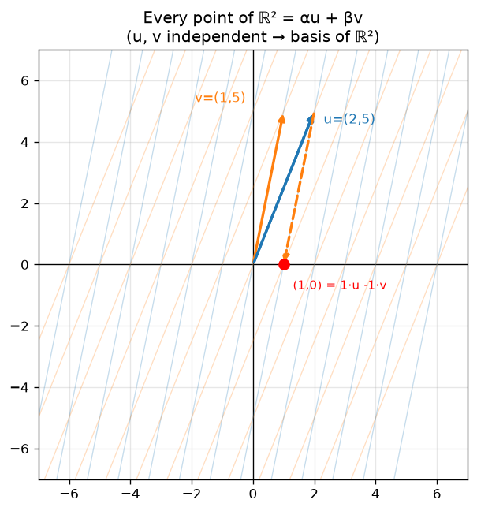
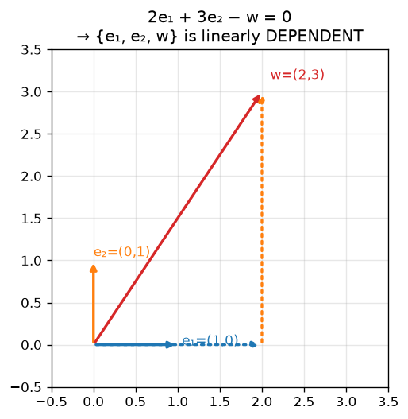

# 04 · Linear Combination, Span, Linear Independence, Basis & Dimension

> **Course:** Applied Mathematics for Data Science & AI · Dr. Arulalan Rajan
>
> **Lectures:** 30 Sep 2026 (main) and 3 Oct 2026 (start: basis of the zero space)
>
> **Sources:** handwritten notes pp. 42–50 and the 30 Sep + 3 Oct class transcripts
>
> **Notebook:** [`code/linear_algebra_part1.ipynb`](code/linear_algebra_part1.ipynb), Part D

---

## 📌 Table of Contents

1. [Big Picture: How Do We Generate a Vector Space?](#1-big-picture-how-do-we-generate-a-vector-space)
2. [Linear Combination](#2-linear-combination-)
3. [Span: Generating ℝ² from Two Vectors](#3-span-generating-ℝ²-from-two-vectors-)
4. [Proof via the Determinant](#4-proof-via-the-determinant-)
5. [Linear Independence](#5-linear-independence-)
6. [Basis](#6-basis-)
7. [Dimension](#7-dimension-)
8. [The Professor's Comments (Remarks 1–5)](#8-the-professors-comments-remarks-15-)
9. [Puzzle: Basis of the Zero Space](#9-puzzle-basis-of-the-zero-space-)
10. [Dimension of a Vector vs Dimension of a Space](#10-dimension-of-a-vector-vs-dimension-of-a-space-)
11. [ML Connection: Independent Features](#11-ml-connection-independent-features-)
12. [Professor Emphasised](#12--professor-emphasised)
13. [Common Confusions](#13--common-confusions)
14. [Practice Problems](#14--practice-problems)
15. [Cheat Sheet](#15--cheat-sheet)
16. [Go Deeper](#16--go-deeper-curated-links)

---

## 1. Big Picture: How Do We Generate a Vector Space?

Every subspace (except $`\{\mathbf 0\}`$) has **infinitely many** vectors. We can't list them. So the question is: *can a few vectors **generate** all of them?*

**Professor's analogies:**

| Analogy | Generators | What they generate |
|---|---|---|
| 💉 **COVID vaccine trials** | A few volunteers from each age/gender/profession group | Confidence about the whole population (you can't test everyone, so you test representatives) |
| 🔤 **English language** | **26 letters** | Every book, article and poem ever written in English |
| 💌 **Joint-family wedding invitation** | One card to the **paternal grandfather** "& family", one to the **maternal grandfather** "& family" | Every relative (if the two families weren't related before the marriage, i.e. they are *independent*) |
| 🔢 **Primes** | 2, 3, 5, 7, … | Every positive integer (as products of prime powers, uniquely: the fundamental theorem of arithmetic) |

In linear algebra the "generators" are a **basis**: a small set of **independent** vectors whose **linear combinations** produce the **entire** space.

> ⚠️ The prime analogy is only an analogy (professor's warning). Primes generate via **multiplication/exponents** and there are **infinitely many** primes. Bases here generate via **addition + scaling**, and in $`\mathbb R^n`$ a basis has exactly **n** vectors. *"Don't map this with that, you will land in trouble."*

---

## 2. Linear Combination 🟢

For vectors $`\vec u, \vec v`$ and real scalars $`\alpha, \beta`$:
```math
\boxed{\alpha\vec u + \beta\vec v} \quad\text{is a } \textbf{linear combination} \text{ of } \vec u \text{ and } \vec v.
```
```math
\alpha\begin{pmatrix}u_1\\u_2\end{pmatrix} + \beta\begin{pmatrix}v_1\\v_2\end{pmatrix} = \begin{pmatrix}\alpha u_1 + \beta v_1\\ \alpha u_2 + \beta v_2\end{pmatrix}
```
More generally: $`c_1\vec v_1 + c_2\vec v_2 + \dots + c_k\vec v_k`$.

### 🎵 Music analogy (professor, for students unsure about linear combinations)
A song you hear is **one track**, but it's made of **many tracks**: vocals, guitar, drums, keyboard.

- Each instrument track = a **vector**.
- The **volume** of each track on the mixing console = a **scalar** ($`\alpha, \beta, \gamma, \dots`$).
- The final mix = **linear combination** = $`\alpha\cdot\text{vocals} + \beta\cdot\text{guitar} + \gamma\cdot\text{drums} + \dots`$

(Bonus: separating a recorded song back into tracks is a real ML problem, *source separation*, and it's essentially "find the coefficients of a linear combination".)

### In the family analogy

- $`\alpha\vec u`$ for all $`\alpha`$ = all relatives from the **paternal** side (multiples of one direction: "cousins").
- $`\beta\vec v`$ for all $`\beta`$ = all relatives from the **maternal** side.
- $`\alpha\vec u + \beta\vec v`$ = **every** relative.

### Ax = b is a linear combination! (Notes p.50)
```math
\begin{bmatrix}1&1\\1&-1\\2&1\end{bmatrix}\begin{bmatrix}x_1\\x_2\end{bmatrix} = \begin{bmatrix}b_1\\b_2\\b_3\end{bmatrix}
\iff
x_1\begin{bmatrix}1\\1\\2\end{bmatrix} + x_2\begin{bmatrix}1\\-1\\1\end{bmatrix} = \begin{bmatrix}b_1\\b_2\\b_3\end{bmatrix}
```
The coefficients of $`x_1`$ (1, 1, 2) form the **first column**, so **$`Ax`$ = linear combination of the columns of $`A`$, with weights from $`x`$.** Solving $`Ax=b`$ means asking *"which mix of columns makes $`b`$?"* This is the single most useful way to read matrix–vector multiplication.

---

## 3. Span: Generating ℝ² from Two Vectors 🟢

**Claim:** if $`\vec u, \vec v \in \mathbb R^2`$ point in **two different directions**, then $`\{\alpha\vec u + \beta\vec v : \alpha,\beta\in\mathbb R\}`$ = **all of $`\mathbb R^2`$**.

The set of all linear combinations is called the **span**:
```math
\operatorname{span}\{\vec u, \vec v\} = \{\alpha\vec u + \beta\vec v : \alpha, \beta \in \mathbb R\}
```

**Class example (students chose the vectors):** $`\vec u = (2,5)`$, $`\vec v = (1,5)`$.



The skewed grid shows that integer combinations tile the plane, and real combinations fill **every** point. Example: $`(1, 0) = 1\cdot\vec u - 1\cdot\vec v`$.

**The professor's GeoGebra demo (30 Sep):**

- Set $`c_1 = 0`$ and vary $`c_2`$: the result moves along the **line through $`\vec v`$** only.
- Set $`c_2 = 0`$ and vary $`c_1`$: the result moves along the line through $`\vec u`$.
- Vary both: the resultant visits **all four quadrants**, so it sweeps all of $`\mathbb R^2`$.
- Same with $`\vec u = (1,0)`$, $`\vec v = (0,1)`$: $`x_1(1,0) + x_2(0,1) = (x_1, x_2)`$, so every point is reached trivially.

**Span of ONE non-zero vector** = a line through the origin. E.g. $`\operatorname{span}\{(1,1)\} = \{(x_1, x_1)\}`$ (Ex 3 from Note 03).

---

## 4. Proof via the Determinant 🟡

*A student's question in class:* "How is it **guaranteed** that two directions generate everything?"

```math
\alpha\begin{bmatrix}2\\5\end{bmatrix} + \beta\begin{bmatrix}1\\5\end{bmatrix} = \begin{bmatrix}2\alpha+\beta\\5\alpha+5\beta\end{bmatrix} = \underbrace{\begin{bmatrix}2&1\\5&5\end{bmatrix}}_{A}\underbrace{\begin{bmatrix}\alpha\\\beta\end{bmatrix}}_{x} = \begin{bmatrix}w_1\\w_2\end{bmatrix}
```
- $`\det A = 10 - 5 = 5 \ne 0`$, so $`A^{-1}`$ exists.
- **Given any target** $`\vec w = (w_1, w_2)`$, take $`\begin{bmatrix}\alpha\\\beta\end{bmatrix} = A^{-1}\vec w`$. A solution always exists, so **every** $`\vec w`$ is reachable.
- It's also **unique**: no two different $`(\alpha, \beta)`$ give the same $`\vec w`$.

Hence $`\operatorname{span}\{\vec u,\vec v\} = \mathbb R^2`$. ∎

> 🔑 **General test:** $`n`$ vectors in $`\mathbb R^n`$ span $`\mathbb R^n`$ $`\iff`$ the matrix with those vectors as columns has $`\det \ne 0`$. "Two different directions" ⇔ $`\det \ne 0`$ (they aren't multiples of each other).

---

## 5. Linear Independence 🟢→🟡

**Follow-up question:** *"What if I add a third vector, $`\vec w = (3,5)`$? Do I get a new direction?"* No. In $`\mathbb R^2`$ the third vector adds nothing new. We need a precise word for "adds nothing new".

### Definition (notes p.44)
A set $`\{\vec v_1, \vec v_2, \dots, \vec v_k\}`$ is **linearly independent** if and only if
```math
c_1\vec v_1 + c_2\vec v_2 + \dots + c_k\vec v_k = \mathbf 0 \;\Longrightarrow\; c_1 = c_2 = \dots = c_k = 0
```
**In words:** the **only** way to combine them into the zero vector is the trivial way (all coefficients zero). Otherwise the set is **linearly dependent**.

**Professor's intuition:** *"If I take zero proportion of each vector, I definitely get nothing. But if some **non-zero** proportions also give nothing, there's **redundancy**."*

### Worked example (notes p.45)
$`\vec u = (1,0)`$, $`\vec v = (0,1)`$, $`\vec w = (2,3)`$ (all non-zero):

- $`c = (0,0,0)`$ gives $`\mathbf 0`$ ✓ (always true, the trivial case)
- $`c = (2, 3, -1)`$: $`2(1,0) + 3(0,1) - 1(2,3) = (0,0)`$ ✗ **non-trivial!**



⇒ $`\{\vec u, \vec v, \vec w\}`$ is **linearly dependent**: $`\vec w = 2\vec u + 3\vec v`$ is redundant.

### Equivalent views

| Statement | Meaning |
|---|---|
| Dependent | **Some vector is a linear combination of the others** |
| Independent | Each vector contributes a **genuinely new direction** |
| Matrix test | Put the vectors as columns of $`M`$: independent $`\iff`$ $`M\vec c = \mathbf 0`$ has only $`\vec c = \mathbf 0`$ $`\iff`$ $`\operatorname{rank}(M) = k`$ |
| Square case | $`k = n`$ vectors in $`\mathbb R^n`$: independent $`\iff \det M \ne 0`$ |

> 🔗 **Link to Note 02:** "$`Ax=0`$ has only the trivial solution" is *exactly* "the columns of $`A`$ are linearly independent". The professor pointed this out: *"I'm cheating you by not telling you we've done this before."*

### Quick rules

| Situation | Independent? |
|---|---|
| One non-zero vector | ✅ Always |
| Any set containing $`\mathbf 0`$ | ❌ Always dependent ($`1\cdot\mathbf 0 = \mathbf 0`$ is a non-trivial combination) |
| Two vectors | Independent ⇔ neither is a multiple of the other |
| More than $`n`$ vectors in $`\mathbb R^n`$ | ❌ **Always dependent** (e.g. 3 vectors in $`\mathbb R^2`$) |
| Orthogonal non-zero vectors | ✅ Always |

---

## 6. Basis 🟢

> **Definition (notes p.46):** A **basis** is a set of **linearly independent** vectors whose **all possible linear combinations generate the entire vector space**.

Two requirements:

1. **Spans** the space: enough vectors to reach everything.
2. **Independent**: no redundant vector.

A basis is a **minimal spanning set**, or equivalently a **maximal independent set**.

### Examples (notes p.46)

| Vector space | Basis |
|---|---|
| $`\{(x_1, x_1)\}`$ (line $`y=x`$) | $`\{(1,1)\}`$ |
| $`\{(x_1, 2x_1)\}`$ | $`\{(1,2)\}`$ |
| $`\{(-3x_1, x_1)\}`$ | $`\{(-3,1)\}`$ |
| $`\mathbb R^2`$ | $`\{(1,0),(0,1)\}`$ (standard basis), or $`\{(2,5),(1,5)\}`$, or … |

### 👓 Basis = spectacles (professor's analogy)
Why don't we all use the same reading glasses from a shop? **Each person's eye power is different.** Everyone picks lenses that suit them, but **everyone sees the same page.**

- **Field of view** = the vector space (the same for everyone).
- **Spectacles** = the basis you choose to look through.
- Plain glass = standard basis $`\{(1,0),(0,1)\}`$.
- Others need $`\{(1,5),(2,5)\}`$ or $`\{(1,5),(3,5)\}`$ …

*"Depending on how you want to see the problem, you choose a basis."* The same point has **different coordinates** in different bases. E.g. $`(1, 0)`$ in the standard basis is $`(1, -1)`$ in the basis $`\{(2,5),(1,5)\}`$ (notebook Part D).

**Language version:** you and a famous politician understand the **same English book** using **different vocabularies**. Different bases, same space.

### There are infinitely many bases
For $`\mathbb R^2`$ (notes p.48):
```math
B_1 = \{(1,0),(0,1)\},\quad B_2 = \{(2,1),(1,2)\},\quad B_3 = \{(1,4),(-1,2)\},\quad B_4 = \{(-2,-3),(1,-4)\},\ \dots
```
Any two non-parallel vectors work (verified: all have $`\det \ne 0`$).

> 🔴 **Why choosing a basis matters in ML:** PCA = choosing the basis aligned with the directions of maximum variance. Fourier transform = the basis of sines/cosines (audio). Wavelets = the JPEG2000 basis. Word embeddings = a learned basis for meaning. **The right basis makes a hard problem easy** (often diagonal, see Note 01 §7).

---

## 7. Dimension 🟢

Different bases of the same space contain **different vectors** but **always the same number** of them.

> **Definition:** The **number of vectors in any basis** is called the **dimension** of the vector space.

| Space | Dimension | Geometry |
|---|---|---|
| $`\{\mathbf 0\}`$ | 0 | Point |
| Line through origin | 1 | Only one direction (length) |
| Plane through origin / $`\mathbb R^2`$ | 2 | Two directions (length, breadth) |
| $`\mathbb R^n`$ | n | |

Professor: *"Dimension corresponds to the number of **independent directions**."*

---

## 8. The Professor's Comments (Remarks 1–5) 🟢

1. **A set containing only one non-zero vector is linearly independent.** E.g. $`\{(1,0)\}`$ ✓.
2. **A set of $`n`$ linearly independent vectors (from an $`n`$-dimensional space) is a basis for that space.** 2 independent vectors give a 2-D space, 3 give 3-D, and so on.
   *(Notes p.47 omit "from that space". Two independent vectors in $`\mathbb R^3`$ form a basis of a 2-D **plane**, not of $`\mathbb R^3`$.)*

3. **Any set containing the zero vector is linearly dependent.**
4. **Every vector space has infinitely many bases, but all bases have the same number of linearly independent vectors** (the same cardinality).
5. **What is the basis of $`V = \{\mathbf 0\}`$?** → §9.

Corollary (a student's observation, 3 Oct): *in an $`n`$-dimensional space, any $`n+1`$ vectors are definitely redundant.*

---

## 9. Puzzle: Basis of the Zero Space 🟡

Homework from 30 Sep, solved on 3 Oct.

**Setup:** $`V = \{(0,0)\}`$ is a vector space (Ex 8). Its only element is $`\mathbf 0`$, and $`\{\mathbf 0\}`$ is linearly **dependent** (Remark 3), so $`\{\mathbf 0\}`$ **cannot** be a basis. So what is?

**Professor's reasoning:**

1. A basis must be a **subset** of the vector space.
2. The subsets of $`\{\mathbf 0\}`$ are $`\{\mathbf 0\}`$ and $`\varnothing`$ (the empty set).
3. $`\{\mathbf 0\}`$ is dependent, so throw it out.
4. What remains is **$`\varnothing`$**, which is (vacuously) independent.

```math
\boxed{\text{Basis of } \{\mathbf 0\} = \varnothing = \{\ \},\qquad \dim\{\mathbf 0\} = 0}
```

Why it's consistent: the span of the empty set is defined as $`\{\mathbf 0\}`$ (the "empty linear combination", a sum of nothing, is $`\mathbf 0`$). The answer "there is no basis" is **wrong**: the basis exists, it's just empty.

> 📝 Notes p.49 write "Basis = $`\{\{\ \}\}`$". That is a set *containing* the empty set. The basis is the empty set itself, $`\{\ \} = \varnothing`$.

**Summary:** origin = **0-D** subspace, line through origin = **1-D**, plane through origin = **2-D**.

---

## 10. Dimension of a Vector vs Dimension of a Space 🟡

**Q (3 Oct):** *"Can the dimension of a vector and of its vector space be different?"* **Yes.**

| | Example |
|---|---|
| Vectors have **5 components** (they live in $`\mathbb R^5`$) | $`(1,0,0,0,0)`$, $`(0,1,0,0,0)`$ |
| Their span is only **2-dimensional** | A plane inside $`\mathbb R^5`$ |

The line $`\{(x_1, x_1)\}`$ is made of 2-component vectors, but it's a **1-D** subspace of $`\mathbb R^2`$: *"only one direction."*

**For $`Ax=b`$ with $`A`$ an $`m\times n`$ matrix:** each column has $`m`$ components (lives in $`\mathbb R^m`$), and there are $`n`$ columns. The space spanned by the columns has dimension $`\operatorname{rank}(A) \le \min(m,n)`$. *"It depends on the rank of the matrix."* (If all $`n`$ columns are independent, they span an $`n`$-dimensional subspace of $`\mathbb R^m`$.)

---

## 11. ML Connection: Independent Features 🟡

The professor's link (30 Sep): **"Vector space ↔ feature space; linear independence ↔ independent features."**

| Linear algebra | ML |
|---|---|
| Basis vectors | A minimal set of **non-redundant features** |
| Dependent vector | **Redundant feature** (e.g. height in cm *and* inches; total = sum of parts) |
| Dimension | **Intrinsic** dimensionality: true degrees of freedom in the data |
| Change of basis | Feature transformation (PCA, whitening) |
| Coordinates in a basis | The feature values in that representation |

**Why redundancy hurts:**

- Linear regression with dependent columns gives $`X^\top X`$ **singular**, so the weights aren't unique (infinitely many solutions! cf. Note 02 §8).
- It wastes memory and compute and makes models harder to interpret.
- Near-dependence (**multicollinearity**) gives unstable, huge weights. That's why we use regularisation (Ridge) or drop features.

---

## 12. 🎓 Professor Emphasised

1. **Linear combination** $`\alpha\vec u + \beta\vec v`$ (music-mixing analogy).
2. Two vectors in **different directions** generate all of $`\mathbb R^2`$; proof via $`\det \ne 0 \Rightarrow A^{-1}`$ exists.
3. **Linear independence:** the only combination giving $`\mathbf 0`$ is all-zero coefficients.
4. Independent vectors are like **primes / alphabets** (analogy only!).
5. **Basis** = independent + spanning; **infinitely many** bases; **all have the same size** = **dimension**.
6. **Basis = spectacles**: choose the one that suits your problem; the space doesn't change.
7. Basis of $`\{\mathbf 0\}`$ is the **empty set**; dimension 0.
8. **Feature space ↔ vector space**, **independent features ↔ linearly independent vectors**.
9. Recommended: the professor's NPTEL lectures on *Linear Algebra Through Geometry* for more on bases.
10. **Participate in class!** The professor has threatened to switch to plain slides if only 4–5 people keep answering.

---

## 13. ⚠️ Common Confusions

| Confusion | Clarification |
|---|---|
| Independent = perpendicular | Perpendicular implies independent, but not the converse: $`(2,5),(1,5)`$ are independent yet not perpendicular |
| A basis is unique | Infinitely many bases; only the **count** (dimension) is fixed |
| More vectors = bigger span | Not if they're dependent: $`(3,5)`$ adds nothing to $`\{(1,5),(2,5)\}`$ |
| $`\{(1,5),(2,5)\}`$ and $`\{(2,5),(3,5)\}`$ span different spaces | Both span **all of $`\mathbb R^2`$**: same space, different spectacles |
| $`\{\mathbf 0\}`$ has no basis | Its basis is $`\varnothing`$; dim = 0 |
| Dimension = number of components | Dimension of a **space** = size of a basis; a line in $`\mathbb R^2`$ is 1-D |
| Independence of scalars $`x_1, x_2`$ | Independence is a property of **vectors**, not scalars (the professor corrected this on 3 Oct) |

---

## 14. 📝 Practice Problems

<details>
<summary><b>P1.</b> Are $`(1,2)`$ and $`(3,6)`$ independent? What do they span?</summary>

$`(3,6) = 3(1,2)`$ → **dependent**. They span only the line $`\{t(1,2)\}`$ (1-D), not $`\mathbb R^2`$.
</details>

<details>
<summary><b>P2.</b> Express $`(7, 4)`$ as a combination of $`\vec u = (1,1)`$, $`\vec v = (1,-1)`$.</summary>

$`\alpha + \beta = 7`$, $`\alpha - \beta = 4`$ → $`\alpha = 5.5`$, $`\beta = 1.5`$.
</details>

<details>
<summary><b>P3.</b> Are $`(1,0,1), (0,1,1), (1,1,0)`$ independent? Basis of $`\mathbb R^3`$?</summary>

$`\det\begin{bmatrix}1&0&1\\0&1&1\\1&1&0\end{bmatrix} = 1(0-1) - 0 + 1(0-1) = -2 \ne 0`$ → independent → 3 independent vectors in $`\mathbb R^3`$ → **basis**.
</details>

<details>
<summary><b>P4.</b> Are $`(1,2,3), (4,5,6), (7,8,9)`$ independent?</summary>

$`\det = 0`$ (indeed $`(7,8,9) = 2(4,5,6) - (1,2,3)`$) → **dependent**; they span a 2-D plane.
</details>

<details>
<summary><b>P5.</b> Find a basis and the dimension of $`W = \{(x,y,z) : x - 2y + z = 0\}`$.</summary>

$`x = 2y - z`$: $`(2y - z, y, z) = y(2,1,0) + z(-1,0,1)`$. Basis $`\{(2,1,0), (-1,0,1)\}`$, dim 2 (a plane).
</details>

<details>
<summary><b>P6.</b> For which $`k`$ are $`(1, k)`$ and $`(k, 4)`$ dependent?</summary>

$`\det = 4 - k^2 = 0 \Rightarrow k = \pm 2`$.
</details>

<details>
<summary><b>P7.</b> Give a basis of $`\mathcal M^{2\times 2}`$. What is its dimension?</summary>

$`\left\{\begin{bmatrix}1&0\\0&0\end{bmatrix},\begin{bmatrix}0&1\\0&0\end{bmatrix},\begin{bmatrix}0&0\\1&0\end{bmatrix},\begin{bmatrix}0&0\\0&1\end{bmatrix}\right\}`$, dim **4**.
</details>

---

## 15. 🧾 Cheat Sheet

- **Linear combination:** $`c_1\vec v_1 + \dots + c_k\vec v_k`$. $`Ax`$ = combination of the columns of $`A`$.
- **Span** = the set of all linear combinations (always a subspace).
- **Independent:** $`\sum c_i\vec v_i = \mathbf 0 \Rightarrow`$ all $`c_i = 0`$. Test: rank of the column matrix = number of vectors (square: $`\det\ne0`$).
- Contains $`\mathbf 0`$ → dependent. More than $`n`$ vectors in $`\mathbb R^n`$ → dependent. One non-zero vector → independent.
- **Basis** = independent + spanning. Infinitely many; all have the same size.
- **Dimension** = size of any basis: $`\{\mathbf 0\}`$ → 0 (basis ∅), line → 1, plane → 2, $`\mathbb R^n`$ → n.
- n independent vectors in an n-dim space form a basis automatically.
- ML: basis ↔ non-redundant features; dimension ↔ intrinsic degrees of freedom.

---

## 16. 📚 Go Deeper: Curated Links

| Topic | Why | Link |
|---|---|---|
| Span & basis, visually | *The* best visual for this lecture | [3Blue1Brown — Linear combinations, span, and basis vectors](https://www.youtube.com/watch?v=k7RM-ot2NWY) |
| Change of basis ("spectacles") | Same vector, different coordinates | [3Blue1Brown — Change of basis](https://www.youtube.com/watch?v=P2LTAUO1TdA) |
| Independence, basis, dimension | Strang's lecture on exactly these definitions | [MIT 18.06 — L9: Independence, Basis, and Dimension](https://www.youtube.com/watch?v=yjBerM5jWsc) |
| Professor's NPTEL (recommended in class) | Bases in more detail, same instructor | [NPTEL — Linear Algebra Through Geometry](https://nptel.ac.in/courses/106108482) |
| GeoGebra (used in class demo) | Re-create the $`c_1, c_2`$ slider demo | [GeoGebra Calculator](https://www.geogebra.org/calculator) |
| Free interactive textbook | Span & independence with demos | [Interactive Linear Algebra (Margalit & Rabinoff)](https://textbooks.math.gatech.edu/ila/) |
| ML-oriented text | §2.5–2.6: independence, basis, rank | [Mathematics for Machine Learning (free)](https://mml-book.github.io/) |
| Whole series | 16 short videos, ideal before exams | [3Blue1Brown — Essence of Linear Algebra (playlist)](https://www.youtube.com/playlist?list=PLZHQObOWTQDPD3MizzM2xVFitgF8hE_ab) |

---
⬅️ [03 · Vector Spaces & Subspaces](03-Vector-Spaces-and-Subspaces.md) · [Index](README.md) · ➡️ [05 · Null Space & Nullity](05-Null-Space-and-Nullity.md)
