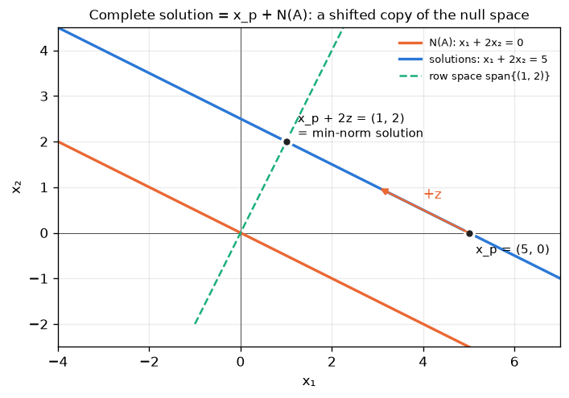
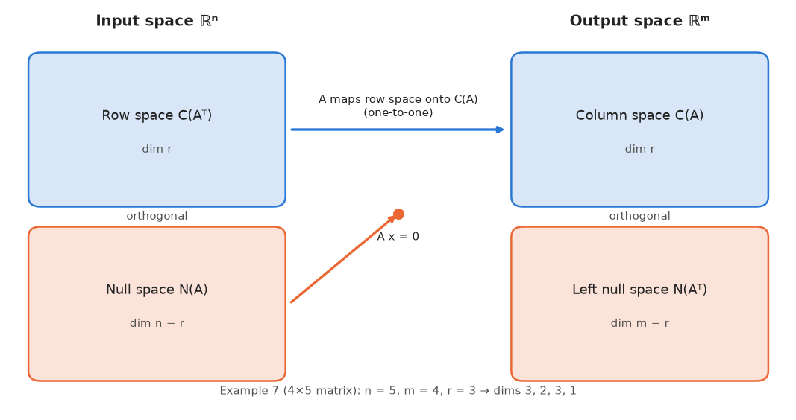
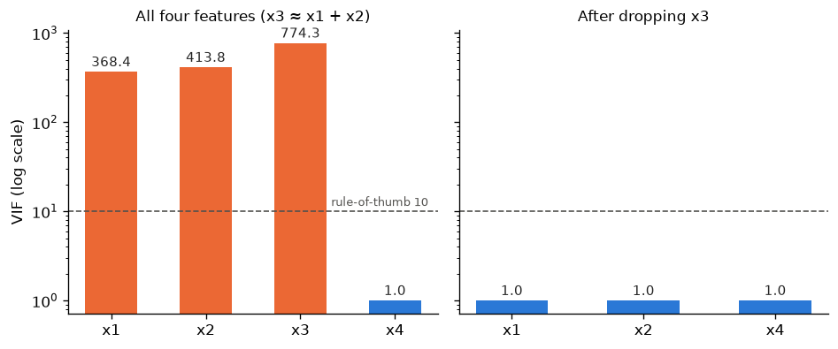

# 05 · Null Space (Kernel) & Nullity

> **Course:** Applied Mathematics for Data Science & AI · Dr. Arulalan Rajan
>
> **Lecture:** 3 October 2026
>
> **Sources:** handwritten notes pp. 50–55 and the 3 Oct class transcript
>
> **Notebooks:** [`code/linear_algebra_part1.ipynb`](code/linear_algebra_part1.ipynb), Part E (incl. detecting redundant features in a dataset) · [`code/05_null_space_deep_dive.ipynb`](code/05_null_space_deep_dive.ipynb) (exact vs numerical null spaces, four subspaces, regression, chemical balancing, Hamming codes, network flow, VIF)
>
> **Next class:** Mon 5 Oct 2026, 8:00–9:30 pm, a **problem-solving session**. The professor will share a problem sheet on WhatsApp beforehand.

---

## 📌 Table of Contents

1. [Big Picture](#1-big-picture)
2. [Where Do Vectors Live? (Dimensions of A, x, b)](#2-where-do-vectors-live-dimensions-of-a-x-b-)
3. [Null Space: Definition](#3-null-space-definition-)
4. [Worked Examples](#4-worked-examples-)
5. [Nullity](#5-nullity-)
6. [Nullity = Number of Redundant Features](#6-nullity--number-of-redundant-features-)
7. [Rank–Nullity Theorem and Its Proof](#7-ranknullity-theorem-and-its-proof-)
8. [The Four Pictures Together](#8-the-four-pictures-together-)
9. [Trivial Null Space ⇔ One-to-One](#9-trivial-null-space--one-to-one-)
10. [The Complete Solution of Ax = b](#10-the-complete-solution-of-ax--b-)
11. [The Four Fundamental Subspaces](#11-the-four-fundamental-subspaces-)
12. [Why Redundancy Breaks Least Squares](#12-why-redundancy-breaks-least-squares-)
13. [Real-World Case Studies](#13--real-world-case-studies)
14. [Code Walkthrough](#14--code-walkthrough)
15. [Professor Emphasised](#15--professor-emphasised)
16. [Common Confusions](#16--common-confusions)
17. [Practice Problems](#17--practice-problems)
18. [Cheat Sheet](#18--cheat-sheet)
19. [Go Deeper](#19--go-deeper-curated-links)

---

## 1. Big Picture

We've seen two facts that now merge:

- **Note 02:** if $`Ax = 0`$ has non-trivial solutions, then $`Ax = b`$ has infinitely many solutions.
- **Note 03:** the set of solutions of $`Ax = 0`$ passes the subspace test.

So the solutions of $`Ax = 0`$ form a **subspace**. It gets a name, the **null space**, and its dimension, the **nullity**, counts **how much redundancy** the matrix has. For a data matrix, that means how many features are redundant.

**Professor's analogy:** *"I am the transformation $`A`$. You (students) are the vectors. Many of you get 'blanked out' sitting through my lecture: my transformation takes you to **nothing** (zero). You are the null space."* 😄

In class the professor wrote $`Ax = b`$ as a combination of columns and announced *"four important things"* to look at in a matrix; the first one was the solution set of $`Ax = 0`$. §11 develops all four (the **four fundamental subspaces**). The null space is the one that answers three practical questions at once:

| Question | Answered by |
|---|---|
| Are my columns (features) independent? | $`N(A) = \{\mathbf{0}\}`$ or not |
| If $`Ax = b`$ has a solution, is it unique? | Solutions $`= x_p + N(A)`$ (§10) |
| Are my regression weights identifiable? | $`N(X^\top X) = N(X)`$ (§12) |

---

## 2. Where Do Vectors Live? (Dimensions of A, x, b) 🟢

```math
A_{m\times n}\; x_{n\times 1} = b_{m\times 1}, \qquad A \in \mathbb{R}^{m\times n},\quad x \in \mathbb{R}^n,\quad b \in \mathbb{R}^m
```

| Object | Size | Lives in |
|---|---|---|
| $`A`$ | $`m`$ rows (equations / observations) × $`n`$ columns (unknowns / features) | $`\mathbb{R}^{m\times n}`$ |
| $`x`$ (input, solution) | $`n`$ components | $`\mathbb{R}^n`$ |
| $`b`$ (output) | $`m`$ components | $`\mathbb{R}^m`$ |

**Example:** $`A`$ is $`3\times2`$, so $`x \in \mathbb{R}^2`$ and $`b \in \mathbb{R}^3`$. Solutions of $`Ax = 0`$ **always** live in $`\mathbb{R}^n`$ (here $`\mathbb{R}^2`$), whatever $`b`$ is.

> The matrix is **fixed** (constant). What varies are the inputs $`x`$ and outputs $`b`$. (Professor, answering "how do we define the space for $`A`$?")

**Class Q (start of lecture):** *"Can the number of components of a vector differ from the dimension of the space it spans?"* Yes. Two independent vectors with five components each span only a **2-dimensional** subspace of $`\mathbb{R}^5`$. Each column of an $`m\times n`$ matrix has $`m`$ components, but how many dimensions the columns span *"really depends on the rank of the matrix."*

**Column picture of Ax.** The handwritten notes (p.50) rewrite the product as a weighted sum of columns:

```math
Ax = \begin{bmatrix}1&1\\1&-1\\2&1\end{bmatrix}\begin{bmatrix}x_1\\x_2\end{bmatrix} = x_1\begin{bmatrix}1\\1\\2\end{bmatrix} + x_2\begin{bmatrix}1\\-1\\1\end{bmatrix}
```

So $`Ax = 0`$ asks: *which weights make the columns cancel out?* That is exactly the question "are the columns dependent?" from Note 04.

---

## 3. Null Space: Definition 🟢

> **Definition:** For $`A \in \mathbb{R}^{m\times n}`$, the set of all solutions of $`Ax = \mathbf{0}`$,
>
> ```math
> \text{Null}(A) = \{x \in \mathbb{R}^n : Ax = \mathbf{0}\},
> ```
>
> forms a vector **subspace of** $`\mathbb{R}^n`$, called the **null space** or **kernel** of $`A`$. Other notations: $`N(A)`$, $`\ker A`$.

**Proof that it's a subspace:**

1. $`A\mathbf{0} = \mathbf{0}`$, so $`\mathbf{0} \in \text{Null}(A)`$ ✓
2. $`Ax = 0,\ Ay = 0 \Rightarrow A(x + y) = Ax + Ay = 0`$ ✓
3. $`A(kx) = kAx = 0`$ ✓ ∎

The proof uses only **linearity** of matrix multiplication. That is why the solution set of $`Ax = b`$ with $`b \ne 0`$ is **not** a subspace: $`A(x+y) = 2b \ne b`$, and $`\mathbf{0}`$ is not a solution.

**What it means:** the null space is **all the input vectors that $`A`$ transforms to zero**: what $`A`$ "kills" or "can't see".

> ⚠️ *"Null space doesn't mean there is nothing in it!"* It always contains at least $`\mathbf{0}`$, and often infinitely many vectors.
>
> ⚠️ *"Kernel" here has nothing to do with the OS kernel or kernel SVMs.* *"One term appears in multiple places. Don't give it the same meaning."*

### Three equivalent readings of "x ∈ Null(A)"

| Reading | Statement |
|---|---|
| Equations | $`x`$ satisfies every homogeneous equation $`a_i^\top x = 0`$ ($`a_i^\top`$ = row $`i`$) |
| Columns | $`x_1 c_1 + \dots + x_n c_n = \mathbf{0}`$: $`x`$ is a **recipe for a dependency** among the columns |
| Geometry | $`x`$ is **perpendicular to every row** of $`A`$ (each $`a_i^\top x = 0`$ is a dot product) |

The third reading is the seed of §11: the null space is orthogonal to the row space.

### Membership test

To test whether a given $`v`$ is in $`\text{Null}(A)`$, **just multiply**: $`v \in \text{Null}(A) \iff Av = \mathbf{0}`$. No row reduction needed. To test whether $`v`$ is in the span of a basis you found, solve for coefficients; both tests must agree (Example 9).

---

## 4. Worked Examples 🟢→🟡

### Example 1: only the trivial solution (notes p.50–51)

```math
A = \begin{bmatrix}1&1\\1&-1\\2&1\end{bmatrix}: \quad x_1 + x_2 = 0,\quad x_1 - x_2 = 0,\quad 2x_1 + x_2 = 0
```

The first two equations say $`x_1 = -x_2`$ **and** $`x_1 = x_2`$, so $`x_1 = x_2 = 0`$ (and this satisfies eq 3).

```math
\text{Null}(A) = \{\mathbf{0}\} \quad\text{(0-D subspace of } \mathbb{R}^2\text{)},\qquad \text{nullity} = 0
```

→ The columns $`(1,1,2)`$ and $`(1,-1,1)`$ are **independent**.

### Example 2: a line (notes p.52)

```math
A = \begin{bmatrix}1&1\\1&1\\1&1\end{bmatrix}: \quad x_1 + x_2 = 0 \text{ (three times)}
```

Solutions: $`(0,0), (1,-1), (-1,1), (2,-2), \dots`$, so $`\text{Null}(A) = \{(x_1, -x_1)\} = \{k(1,-1)\}`$.

```math
\text{a line through the origin} = \text{1-D subspace of } \mathbb{R}^2,\qquad \text{nullity} = 1
```

(This is the "$`y = kx`$ with $`k = -1`$" subspace from Note 03.)

**Class Q:** *"Isn't $`(x_1, -x_1)`$ a 'single entry'?"* No. It's **infinitely many** vectors, $`(23, -23), (47, -47), \dots`$, all lying in **one direction** $`(1, -1)`$. **Dimension counts directions, not vectors.**

### Example 3: the 2×2 version (notes p.54)

```math
\begin{bmatrix}1&1\\1&1\end{bmatrix}\begin{bmatrix}x_1\\x_2\end{bmatrix} = \begin{bmatrix}0\\0\end{bmatrix} \Rightarrow x_2 = -x_1 \Rightarrow \text{Null}(A) = \{k(1,-1)\}
```

Geometrically this is the 135° line ("like the Ramayana snake arrow" ↘):


**Key insight:** *"You don't have to state $`x_2`$ explicitly. The knowledge about $`x_2`$ is contained in $`x_1`$."* The two columns are identical, so one column is redundant.

### Example 4: the zero matrix (notes p.53)

```math
A = 0_{5\times3}:\quad Ax = 0 \text{ for every } x\in\mathbb{R}^3 \Rightarrow \text{Null}(A) = \mathbb{R}^3,\quad \text{nullity} = 3
```

Likewise $`0_{2\times2}`$ gives $`\mathbb{R}^2`$ with nullity 2. A matrix whose null space is all of $`\mathbb{R}^5`$ has nullity 5.

> 🎯 **Only the zero matrix** has the whole $`\mathbb{R}^n`$ as its null space. *"Even a 100×100 matrix with **one** non-zero element won't."* A data matrix of all zeros "recorded nothing".

*Why (proof):* if $`a_{ij} \ne 0`$, then $`Ae_j`$ (column $`j`$) has a non-zero entry $`a_{ij}`$, so the standard basis vector $`e_j \notin \text{Null}(A)`$.

### Example 5: 2×3 by row reduction (notes p.55)

```math
\begin{bmatrix}1&1&2\\1&0&3\end{bmatrix}\begin{bmatrix}x_1\\x_2\\x_3\end{bmatrix} = \begin{bmatrix}0\\0\end{bmatrix}
\;\xrightarrow{R_2 \leftarrow R_2 - R_1}\;
\begin{bmatrix}1&1&2\\0&-1&1\end{bmatrix}\begin{bmatrix}x_1\\x_2\\x_3\end{bmatrix} = \begin{bmatrix}0\\0\end{bmatrix}
```

- Row 2: $`-x_2 + x_3 = 0 \Rightarrow x_2 = x_3`$. Let $`x_3 = t`$ (**free variable**), so $`x_2 = t`$.
- Row 1: $`x_1 + t + 2t = 0 \Rightarrow x_1 = -3t`$.

```math
x = \begin{bmatrix}-3t\\t\\t\end{bmatrix} = t\begin{bmatrix}-3\\1\\1\end{bmatrix}
\;\Rightarrow\; \text{Null}(A) = \text{span}\{(-3,1,1)\},\ \text{a 1-D subspace (line) of } \mathbb{R}^3
```

**Geometry (figure above, right):** each equation is a **plane through the origin** in $`\mathbb{R}^3`$. Two planes meet in a **line**, and that line is the null space.

**Why only the RHS = 0 matters:** row operations on $`0`$ give $`0`$, so the RHS can be ignored. *"Why waste time on that?"*

**Sanity check:** $`A(-3,1,1)^\top = (-3+1+2,\ -3+0+3) = (0, 0)`$ ✓. Rank 2 + nullity 1 = 3 columns ✓.

### 🔗 Connection to the 3 Oct dependence example

The same lecture showed $`3\cdot(1,1) - 1\cdot(1,0) - 1\cdot(2,3) = (0,0)`$, so the columns $`(1,1), (1,0), (2,3)`$ are dependent. Those are exactly the columns of this $`A`$! Equivalently, $`-3\cdot\text{col}_1 + \text{col}_2 + \text{col}_3 = 0`$:

> **Null-space vectors are the recipes (coefficients) of linear dependencies among the columns.** $`Ax = 0`$ means $`x_1\text{col}_1 + \dots + x_n\text{col}_n = \mathbf{0}`$.

### Systematic recipe for Null(A)

1. Row-reduce $`A`$ to (R)REF (ignore the RHS, which stays 0).
2. Identify **pivot columns** (basic variables) and **non-pivot columns** (**free variables**).
3. Set each free variable to a parameter ($`t, s, \dots`$) and solve for the basic variables.
4. Write $`x`$ = parameter × vector + …. Those vectors form a **basis of Null(A)**.
5. **Nullity = number of free variables.**

The vectors in step 4 are called the **special solutions**: each has a **1 in its own free slot and 0 in the other free slots**. §7 proves they always form a basis.

### Example 6: a 3×4 matrix with two free variables 🟡

```math
A = \begin{bmatrix}1&2&0&3\\2&4&1&8\\3&6&1&11\end{bmatrix}
```

**Step 1: eliminate below the first pivot.** $`R_2 \leftarrow R_2 - 2R_1`$, $`R_3 \leftarrow R_3 - 3R_1`$:

```math
\begin{bmatrix}1&2&0&3\\0&0&1&2\\0&0&1&2\end{bmatrix}
\;\xrightarrow{R_3 \leftarrow R_3 - R_2}\;
\begin{bmatrix}1&2&0&3\\0&0&1&2\\0&0&0&0\end{bmatrix} = R \ (\text{already RREF})
```

**Step 2: pivots and free variables.** Pivots in columns 1 and 3; free variables $`x_2 = s`$, $`x_4 = t`$.

**Step 3: solve.** Row 2: $`x_3 + 2x_4 = 0 \Rightarrow x_3 = -2t`$. Row 1: $`x_1 + 2x_2 + 3x_4 = 0 \Rightarrow x_1 = -2s - 3t`$.

**Step 4: basis.**

```math
x = s\begin{bmatrix}-2\\1\\0\\0\end{bmatrix} + t\begin{bmatrix}-3\\0\\-2\\1\end{bmatrix},\qquad \text{Null}(A) = \text{span}\{(-2,1,0,0),\ (-3,0,-2,1)\}
```

**Sanity checks.** $`A(-2,1,0,0)^\top = (-2+2,\ -4+4,\ -6+6) = \mathbf{0}`$ ✓; $`A(-3,0,-2,1)^\top = (-3+0+3,\ -6-2+8,\ -9-2+11) = \mathbf{0}`$ ✓. Rank 2 + nullity 2 = 4 ✓. Read as column dependencies: $`c_2 = 2c_1`$ and $`c_4 = 3c_1 + 2c_3`$, so the 4 columns carry only 2 columns' worth of information.

### Example 7: a 4×5 matrix 🟡

```math
A = \begin{bmatrix}1&3&0&2&-1\\2&6&1&7&0\\0&0&1&4&3\\3&9&1&9&-1\end{bmatrix}
```

**Forward elimination.** $`R_2 \leftarrow R_2 - 2R_1`$, $`R_4 \leftarrow R_4 - 3R_1`$, then $`R_3 \leftarrow R_3 - R_2`$, $`R_4 \leftarrow R_4 - R_2`$:

```math
\begin{bmatrix}1&3&0&2&-1\\0&0&1&3&2\\0&0&1&4&3\\0&0&1&3&2\end{bmatrix}
\;\longrightarrow\;
\begin{bmatrix}1&3&0&2&-1\\0&0&1&3&2\\0&0&0&1&1\\0&0&0&0&0\end{bmatrix}
```

**Back substitution to RREF.** $`R_2 \leftarrow R_2 - 3R_3`$, $`R_1 \leftarrow R_1 - 2R_3`$:

```math
R = \begin{bmatrix}1&3&0&0&-3\\0&0&1&0&-1\\0&0&0&1&1\\0&0&0&0&0\end{bmatrix}
```

Pivot columns 1, 3, 4 (rank 3); free $`x_2 = s`$, $`x_5 = t`$. Reading the rows: $`x_1 = -3s + 3t`$, $`x_3 = t`$, $`x_4 = -t`$.

```math
\text{Null}(A) = \text{span}\left\{\begin{bmatrix}-3\\1\\0\\0\\0\end{bmatrix},\ \begin{bmatrix}3\\0\\1\\-1\\1\end{bmatrix}\right\},\qquad \text{nullity} = 2,\quad 3 + 2 = 5 \ ✓
```

**Sanity check (second vector):** row 1: $`3 + 0 + 0 - 2 - 1 = 0`$; row 2: $`6 + 1 - 7 + 0 = 0`$; row 3: $`1 - 4 + 3 = 0`$; row 4: $`9 + 1 - 9 - 1 = 0`$ ✓.

### Example 8: a rank-deficient 3×3 (a plane of solutions) 🟡

```math
A = \begin{bmatrix}1&2&-1\\2&4&-2\\-3&-6&3\end{bmatrix}
```

Rows 2 and 3 are $`2\times`$ and $`-3\times`$ row 1, so $`R_2 - 2R_1 = 0`$ and $`R_3 + 3R_1 = 0`$. One equation remains: $`x_1 + 2x_2 - x_3 = 0`$. Free $`x_2 = s`$, $`x_3 = t`$, so $`x_1 = -2s + t`$:

```math
\text{Null}(A) = \text{span}\{(-2,1,0),\ (1,0,1)\},\qquad \text{rank } 1,\ \text{nullity } 2,\ 1 + 2 = 3 \ ✓
```

**Geometry:** the null space is the **plane** $`x_1 + 2x_2 - x_3 = 0`$ through the origin, whose **normal vector** is the single independent row $`(1,2,-1)`$. Row space (a line) ⟂ null space (a plane): a preview of §11. Since $`\det A = 0`$, $`A`$ is singular, consistent with §8.

### Example 9: membership tests 🟢

Using $`A`$ from Example 6:

- $`v = (-8, 1, -4, 2)`$: $`Av = (-8+2+0+6,\ -16+4-4+16,\ -24+6-4+22) = (0,0,0)`$, so $`v \in \text{Null}(A)`$. Cross-check with the basis: $`v = 1\cdot(-2,1,0,0) + 2\cdot(-3,0,-2,1)`$ (the free slots $`x_2 = 1`$, $`x_4 = 2`$ give the coefficients directly).
- $`w = (1,1,1,1)`$: $`Aw = (6, 15, 21) \ne \mathbf{0}`$, so $`w \notin \text{Null}(A)`$.

> **Shortcut:** for a vector in the null space, the coefficients on the special solutions are just its **free-variable entries**. That is the independence argument of §7 in action.

---

## 5. Nullity 🟢

> **Definition:** The **dimension of the null space** of $`A`$ is called the **nullity** of $`A`$.

| | Null space | Nullity |
|---|---|---|
| What | A **set** (subspace) of vectors | A **number** |
| Example 2 | The line $`\{k(1,-1)\}`$ | 1 |
| Example 4 | $`\mathbb{R}^3`$ | 3 |
| Example 1 | $`\{\mathbf{0}\}`$ | 0 |
| Example 8 | The plane $`x_1 + 2x_2 - x_3 = 0`$ | 2 |

*"Null space is the collection of vectors. Nullity is a number."* Nullity = number of **independent directions** in the null space = number of **free variables**.

**Range of values:** $`0 \le \text{nullity}(A) \le n`$. It is 0 iff the columns are independent, and $`n`$ iff $`A = 0`$.

**Bounds from the shape alone** (using rank ≤ min(m, n) and §7):

```math
\text{nullity}(A) = n - \text{rank}(A) \;\ge\; n - \min(m, n) = \max(0,\ n - m)
```

So a **wide** matrix ($`n > m`$, more unknowns than equations) always has nullity at least $`n - m \ge 1`$. A $`3\times5`$ matrix has nullity ≥ 2; a $`1000\times100`$ data matrix can have nullity 0.

---

## 6. Nullity = Number of Redundant Features 🟡

Recall (Lecture 1): a data matrix $`A_{m\times n}`$ has **rows = observations** and **columns = variables/features**.

> **Nullity tells us the number of redundant features.**

**Professor's example:** a $`1000 \times 100`$ data matrix (1000 observations of 100 variables) with **nullity = 37** means that out of 100 variables, **37 are redundant**: those 37 columns can be expressed as combinations of the other 63. They add **no new information**.

### Important subtleties (from class Q&A)

| Question | Answer |
|---|---|
| Are redundant columns all zeros? | **No.** They can contain any values; they're just *combinations* of other columns |
| Is redundancy = noise / error? | **No.** Noise is random error. Redundancy is exact duplication of information (e.g. measured the same thing twice and called it a new variable) |
| Can I just set the 37 columns to zero? | **No.** That changes the system. And nullity tells you **how many** are redundant, **not which ones** |
| Which ones are redundant? | Any choice works: if $`c_2 = c_1`$, you may drop either. (*"First answer how many, then we'll find which."*) |

> 🔴 **Precise version:** nullity 37 means there are 37 *independent linear relations* among the columns, i.e. rank = 63. You can choose 63 independent columns (a basis of the column space) and drop the rest. Which 37 get dropped isn't unique.

**How to find *which* columns (one valid choice):** row-reduce; the **pivot columns of the original matrix** form a basis of the column space, and every **free column** is a combination of the pivot columns to its left, with coefficients read off the RREF. In Example 6, RREF column 4 is $`(3, 2, 0)`$, meaning $`c_4 = 3c_1 + 2c_3`$; RREF column 2 is $`(2,0,0)`$, meaning $`c_2 = 2c_1`$. Dropping columns 2 and 4 keeps all the information.

### Real-world examples (from class)

| Redundant feature | Why |
|---|---|
| **Age** when **date of birth** is recorded | Age is derivable from DOB (unless you need exact days, as one student noted) |
| Score on Q9 when the total is 100/100 and all questions carry equal marks | *"The question becomes irrelevant"*: it's determined by the others |
| Height in cm and height in inches | Scaled copy |
| A US-admission application with dozens of attributes | Committees ignore many redundant or irrelevant ones |

Notebook Part E demo: a synthetic 1000×6 health dataset with `height_in = height_cm/2.54` and an engineered `0.5·height + 2·weight` column gives **rank 4, nullity 2**, and RREF identifies the dependencies exactly.

**In practice (beyond slides):**

- *Exact* redundancy → rank deficiency → $`X^\top X`$ singular → regression weights not unique (proved in §12).
- *Near* redundancy (multicollinearity) → tiny singular values → unstable models. Tools: **VIF**, correlation matrices, **PCA / SVD**, Ridge/Lasso regularisation (case study 13.4).

---

## 7. Rank–Nullity Theorem and Its Proof 🟡

Every example satisfies:

```math
\boxed{\text{rank}(A) + \text{nullity}(A) = n \ (\text{number of columns})}
```

| Matrix (rows) | n | rank | nullity |
|---|---|---|---|
| Ex 1: $`(1,1), (1,-1), (2,1)`$ | 2 | 2 | 0 |
| Ex 2: $`(1,1), (1,1), (1,1)`$ | 2 | 1 | 1 |
| Ex 5: $`(1,1,2), (1,0,3)`$ | 3 | 2 | 1 |
| Ex 4: $`0_{5\times3}`$ | 3 | 0 | 3 |
| Ex 6: 3×4 | 4 | 2 | 2 |
| Ex 7: 4×5 | 5 | 3 | 2 |
| Ex 8: 3×3 | 3 | 1 | 2 |
| 1000×100 data, nullity 37 | 100 | 63 | 37 |

**Intuition:** each of the $`n`$ input directions is either **preserved** (contributes to rank, i.e. "useful information") or **killed** (lands in the null space, i.e. "redundant"). In RREF terms: pivot columns + free columns = all columns.

### Proof (pivot / free columns)

Let $`R`$ be the RREF of $`A`$, with $`r`$ pivots.

**Step 1: row operations do not change the null space.** $`R = EA`$ for an invertible $`E`$ (a product of elementary matrices). Then $`Ax = 0 \Rightarrow Rx = EAx = 0`$, and $`Rx = 0 \Rightarrow Ax = E^{-1}Rx = 0`$. So $`N(A) = N(R)`$.

**Step 2: rank = number of pivots.** The pivot columns of $`R`$ are distinct standard basis vectors, hence independent, and every other column of $`R`$ is a combination of them. Because $`E`$ is invertible, the same dependencies hold among the columns of $`A`$ ($`\sum x_j c_j(A) = 0 \iff \sum x_j c_j(R) = 0`$ by Step 1). So the pivot columns of $`A`$ are a basis of $`C(A)`$, and $`\text{rank}(A) = r`$.

**Step 3: the special solutions span N(A).** There are $`n - r`$ free variables. For each free index $`f`$, let $`s_f`$ be the special solution ($`x_f = 1`$, other free variables 0, pivot variables solved from $`R`$). Take any $`x \in N(A)`$ and set $`y = x - \sum_f x_f s_f`$. Then $`y \in N(A)`$ (a subspace) and **every free entry of $`y`$ is 0**. Each non-zero row of $`R`$ reads $`y_{\text{pivot}} + (\text{free terms}) = 0`$, so every pivot entry of $`y`$ is 0 too. Hence $`y = 0`$ and $`x = \sum_f x_f s_f`$.

**Step 4: the special solutions are independent.** In $`\sum_f c_f s_f`$, the entry in free slot $`f`$ equals $`c_f`$ (only $`s_f`$ has a 1 there). If the sum is $`\mathbf{0}`$, every $`c_f = 0`$.

So the $`n - r`$ special solutions form a basis, $`\text{nullity}(A) = n - r`$, and $`\text{rank} + \text{nullity} = r + (n - r) = n`$. ∎

> 🔴 **Linear-map version (beyond syllabus):** for any linear $`T: V \to W`$ with $`\dim V = n`$, $`\dim \ker T + \dim \text{im}\, T = n`$. Proof idea: extend a basis $`u_1,\dots,u_k`$ of $`\ker T`$ to a basis $`u_1,\dots,u_k,v_1,\dots,v_{n-k}`$ of $`V`$; then $`Tv_1,\dots,Tv_{n-k}`$ is a basis of the image.

### Consequences used constantly

| Fact | Why |
|---|---|
| A wide matrix ($`n > m`$) always has a non-trivial null space | rank ≤ m < n ⇒ nullity ≥ 1 |
| For square $`A`$: independent columns ⇔ spanning columns | nullity 0 ⇔ rank n |
| $`\text{rank}(A) = \text{rank}(A^\top)`$ ⇒ $`\dim N(A^\top) = m - r`$ | Apply the theorem to $`A^\top`$ ($`m`$ columns) |
| $`\text{rank}(X^\top X) = \text{rank}(X)`$ | Same null space (§12), same $`n`$ |

---

## 8. The Four Pictures Together 🔴

For square $`A`$ ($`n\times n`$), all of the following are **equivalent**:

| ✅ Invertible case | ❌ Singular case |
|---|---|
| $`\det A \ne 0`$ | $`\det A = 0`$ |
| $`A^{-1}`$ exists | No inverse |
| $`Ax = b`$ has a **unique** solution for every $`b`$ | No solution or infinitely many |
| $`Ax = 0`$ has only $`x = 0`$ | Non-trivial solutions exist |
| $`\text{Null}(A) = \{\mathbf{0}\}`$, nullity 0 | Nullity ≥ 1 |
| rank $`= n`$ (n pivots) | rank < n |
| Columns linearly **independent** | Columns dependent |
| Columns form a **basis** of $`\mathbb{R}^n`$ | Columns span a smaller subspace |
| RREF $`= I`$ | RREF has a zero row |

This **Invertible Matrix Theorem** ties together Notes 01–05. If you understand why each row implies the others, you understand Unit 1.

**One quick chain of implications** (each step is a result proved in this or earlier notes): $`\det A \ne 0`$ ⇒ $`A^{-1}`$ exists ⇒ $`Ax = 0`$ gives $`x = A^{-1}0 = 0`$ ⇒ nullity 0 ⇒ (rank–nullity) rank $`n`$ ⇒ $`n`$ pivots ⇒ RREF $`= I`$ ⇒ $`A`$ is a product of elementary matrices ⇒ $`\det A \ne 0`$.

---

## 9. Trivial Null Space ⇔ One-to-One 🟡

> **Theorem.** $`N(A) = \{\mathbf{0}\}`$ **if and only if** the map $`x \mapsto Ax`$ is **one-to-one (injective)**: $`Ax = Ay \Rightarrow x = y`$.

**Proof.**

- (⇐) Suppose $`A`$ is injective and $`Ax = 0`$. Since also $`A\mathbf{0} = \mathbf{0}`$, we have $`Ax = A\mathbf{0}`$, so $`x = \mathbf{0}`$.
- (⇒) Suppose $`N(A) = \{\mathbf{0}\}`$ and $`Ax = Ay`$. Then $`A(x - y) = \mathbf{0}`$, so $`x - y \in N(A)`$, so $`x = y`$. ∎

**Why it matters.** If two different inputs give the same output, their difference is a null-space vector. In data terms: if $`N(X) \ne \{\mathbf{0}\}`$, two different weight vectors $`w`$ and $`w + z`$ produce **identical predictions** $`Xw = X(w + z)`$, so no amount of data can tell them apart (§12).

**Corollaries.**

| Shape | Injective? |
|---|---|
| Wide ($`n > m`$) | **Never**: nullity ≥ n − m ≥ 1 |
| Tall ($`m > n`$) | Iff rank $`= n`$ (full column rank). Example 1 ($`3\times2`$, rank 2) is injective |
| Square | Injective ⇔ onto ⇔ invertible (rank–nullity forces all three together) |

**Worked check.** Example 1's $`A`$ is injective: if $`Ax = Ay`$ then $`A(x-y) = 0`$, and Example 1 showed only $`x - y = 0`$ solves it. Example 2's $`A`$ is not: $`A(1,0)^\top = A(0,1)^\top = (1,1,1)^\top`$, and indeed $`(1,0) - (0,1) = (1,-1) \in N(A)`$.

---

## 10. The Complete Solution of Ax = b 🟡

> **Theorem.** Suppose $`Ax_p = b`$ for some particular solution $`x_p`$. Then the set of **all** solutions is
>
> ```math
> \{x : Ax = b\} = x_p + N(A) = \{x_p + z : z \in N(A)\}.
> ```

**Proof.** (⊇) If $`z \in N(A)`$ then $`A(x_p + z) = b + 0 = b`$. (⊆) If $`Ax = b`$ then $`A(x - x_p) = b - b = 0`$, so $`z = x - x_p \in N(A)`$ and $`x = x_p + z`$. ∎

**Consequences.**

1. The number of solutions is **0, 1 or ∞**, never 2 or 7: if one solution exists, there are exactly as many as there are null-space vectors.
2. **Unique** solution (when one exists) ⇔ $`N(A) = \{\mathbf{0}\}`$.
3. The solution set is a **shifted copy** (an affine set) of the null space: a line, plane, … **not** through the origin when $`b \ne 0`$.
4. **Existence** is a separate question: $`b`$ must lie in $`C(A)`$. §11 turns this into a test with the left null space.



### Worked example: an underdetermined system

Solve $`Ax = b`$ with $`A`$ from Example 6 and $`b = (4, 11, 15)`$.

**Step 1: row-reduce the augmented matrix** (same operations as Example 6):

```math
[A \mid b] = \left[\begin{array}{cccc|c}1&2&0&3&4\\2&4&1&8&11\\3&6&1&11&15\end{array}\right]
\;\longrightarrow\;
\left[\begin{array}{cccc|c}1&2&0&3&4\\0&0&1&2&3\\0&0&0&0&0\end{array}\right]
```

The last row reads $`0 = 0`$, so the system is **consistent**. (Arithmetic: $`11 - 2\cdot4 = 3`$; $`15 - 3\cdot4 = 3`$; $`3 - 3 = 0`$.)

**Step 2: particular solution.** Set the free variables $`x_2 = x_4 = 0`$: $`x_1 = 4`$, $`x_3 = 3`$, so $`x_p = (4, 0, 3, 0)`$. Check: $`Ax_p = (4,\ 8+3,\ 12+3) = (4, 11, 15)`$ ✓.

**Step 3: add the null space** (from Example 6):

```math
x = \begin{bmatrix}4\\0\\3\\0\end{bmatrix} + s\begin{bmatrix}-2\\1\\0\\0\end{bmatrix} + t\begin{bmatrix}-3\\0\\-2\\1\end{bmatrix}
= \begin{bmatrix}4 - 2s - 3t\\ s\\ 3 - 2t\\ t\end{bmatrix},\qquad s, t \in \mathbb{R}
```

A 2-dimensional plane of solutions inside $`\mathbb{R}^4`$, not through the origin.

**Step 4 (beyond syllabus): the minimum-norm solution.** Of all these solutions, the shortest is the one with **no null-space component**, i.e. the one lying in the row space. The pseudo-inverse gives it:

```math
x^{+} = A^{+}b = \left(\tfrac{1}{17}, \tfrac{2}{17}, \tfrac{9}{17}, \tfrac{21}{17}\right) \approx (0.0588,\ 0.1176,\ 0.5294,\ 1.2353)
```

Check: $`x^{+} = \tfrac{1}{17}(1,2,0,3) + \tfrac{9}{17}(0,0,1,2)`$ is a combination of the RREF rows, and $`x^{+}\cdot(-2,1,0,0) = (-2+2)/17 = 0`$, $`x^{+}\cdot(-3,0,-2,1) = (-3-18+21)/17 = 0`$ ✓. This is exactly what `np.linalg.lstsq` returns for underdetermined systems.

**Step 5: an inconsistent right-hand side.** With $`b' = (4, 11, 16)`$ the last augmented row becomes $`0 = 1`$, so there is no solution: $`\text{rank}[A \mid b'] = 3 \ne \text{rank}\,A = 2`$. §11 explains the pattern: $`b`$ must satisfy $`b_3 = b_1 + b_2`$.

---

## 11. The Four Fundamental Subspaces 🔴

Every $`m\times n`$ matrix $`A`$ of rank $`r`$ carries four subspaces (Strang's "fundamental theorem of linear algebra", beyond the slides but the natural completion of the professor's "four important things"):

| Subspace | Definition | Lives in | Dimension | Basis from RREF |
|---|---|---|---|---|
| Column space $`C(A)`$ | all $`Ax`$ | $`\mathbb{R}^m`$ | $`r`$ | pivot columns **of A** |
| Row space $`C(A^\top)`$ | all combinations of rows | $`\mathbb{R}^n`$ | $`r`$ | non-zero rows **of R** |
| Null space $`N(A)`$ | $`Ax = 0`$ | $`\mathbb{R}^n`$ | $`n - r`$ | special solutions |
| Left null space $`N(A^\top)`$ | $`A^\top y = 0`$, i.e. $`y^\top A = 0^\top`$ | $`\mathbb{R}^m`$ | $`m - r`$ | null space of $`A^\top`$ (or the last $`m - r`$ rows of $`E`$ in $`EA = R`$) |



### Dimensions (proof)

- $`\dim C(A) = r`$: Step 2 of §7.
- $`\dim C(A^\top) = r`$: row operations replace rows by combinations of rows (and are reversible), so $`A`$ and $`R`$ have the **same row space**. The $`r`$ non-zero rows of $`R`$ are independent (each has a 1 in a pivot column where all others have 0). So **row rank = column rank**.
- $`\dim N(A) = n - r`$: rank–nullity.
- $`\dim N(A^\top) = m - r`$: rank–nullity applied to $`A^\top`$, which has $`m`$ columns and rank $`r`$.

Totals: $`r + (n - r) = n`$ in the input space, $`r + (m - r) = m`$ in the output space.

### Orthogonality (proof)

> **Theorem.** Every vector of $`N(A)`$ is orthogonal to every vector of $`C(A^\top)`$; every vector of $`N(A^\top)`$ is orthogonal to every vector of $`C(A)`$.

**Proof.** Let $`x \in N(A)`$ and let $`v = A^\top c`$ be any row-space vector. Then

```math
v^\top x = (A^\top c)^\top x = c^\top (Ax) = c^\top \mathbf{0} = 0.
```

For the second claim, let $`y \in N(A^\top)`$ and $`w = Ax`$ be any column-space vector: $`y^\top w = y^\top A x = (A^\top y)^\top x = 0`$. ∎

**Stronger (orthogonal complements):** the two pieces meet only in $`\mathbf{0}`$ (if $`x`$ is in both, $`x^\top x = 0`$ so $`x = 0`$) and their dimensions add to $`n`$, so together they fill $`\mathbb{R}^n`$: every $`x`$ splits uniquely as $`x = x_{\text{row}} + x_{\text{null}}`$. $`A`$ kills $`x_{\text{null}}`$ and maps the row-space part one-to-one onto $`C(A)`$. That is why the minimum-norm solution in §10 lives in the row space.

### Worked example: the four subspaces of a 3×3

```math
A = \begin{bmatrix}1&2&3\\4&5&6\\7&8&9\end{bmatrix} \;\xrightarrow{\text{RREF}}\; R = \begin{bmatrix}1&0&-1\\0&1&2\\0&0&0\end{bmatrix},\qquad r = 2
```

(Elimination: $`R_2 - 4R_1 = (0,-3,-6)`$, $`R_3 - 7R_1 = (0,-6,-12)`$, then $`R_3 - 2R_2 = 0`$; scale $`R_2`$ by $`-\tfrac13`$ to get $`(0,1,2)`$; $`R_1 - 2R_2 = (1,0,-1)`$.)

| Subspace | Basis | Dim |
|---|---|---|
| $`C(A)`$ | $`(1,4,7),\ (2,5,8)`$ (pivot columns 1, 2 of A) | 2 |
| $`C(A^\top)`$ | $`(1,0,-1),\ (0,1,2)`$ (non-zero rows of R) | 2 |
| $`N(A)`$ | $`(1,-2,1)`$ (free $`x_3 = 1`$: $`x_1 = 1`$, $`x_2 = -2`$) | 1 |
| $`N(A^\top)`$ | $`(1,-2,1)`$ (because $`R_1 - 2R_2 + R_3 = 0`$ in A) | 1 |

**Orthogonality checks:** $`(1,0,-1)\cdot(1,-2,1) = 1 - 1 = 0`$ ✓; $`(0,1,2)\cdot(1,-2,1) = -2 + 2 = 0`$ ✓; $`(1,4,7)\cdot(1,-2,1) = 1 - 8 + 7 = 0`$ ✓; $`(2,5,8)\cdot(1,-2,1) = 2 - 10 + 8 = 0`$ ✓. Dimensions $`2 + 1 = 3 = n`$ and $`2 + 1 = 3 = m`$ ✓. (Here $`N(A)`$ and $`N(A^\top)`$ happen to have the same basis vector; in general they differ and, for non-square $`A`$, live in different spaces.)

**The 4×5 of Example 7:** $`r = 3`$, so the dimensions are 3, 3, 2 and $`4 - 3 = 1`$. The left null space is spanned by $`(-1,-1,0,1)`$: row 4 = row 1 + row 2. The notebook (Part C) confirms every row-space · null-space and column-space · left-null-space dot product is exactly 0.

### The left null space as a consistency test

Since $`C(A) \perp N(A^\top)`$ and the dimensions fill $`\mathbb{R}^m`$:

```math
Ax = b \text{ is solvable} \iff b \in C(A) \iff y^\top b = 0 \ \text{ for every } y \in N(A^\top).
```

For Example 6, $`N(A^\top) = \text{span}\{(-1,-1,1)\}`$ (row 3 = row 1 + row 2), so the condition is $`-b_1 - b_2 + b_3 = 0`$, i.e. $`b_3 = b_1 + b_2`$. $`b = (4,11,15)`$ passes ($`-4-11+15 = 0`$); $`b' = (4,11,16)`$ fails (gives 1). That matches §10, Step 5.

---

## 12. Why Redundancy Breaks Least Squares 🔴

Linear regression solves the **normal equations** $`X^\top X\, w = X^\top y`$. The key fact:

> **Theorem.** $`N(X^\top X) = N(X)`$. Consequently $`\text{rank}(X^\top X) = \text{rank}(X)`$, and $`X^\top X`$ is invertible **iff** the columns of $`X`$ are independent.

**Proof.** (⊇) If $`Xw = 0`$ then $`X^\top X w = X^\top 0 = 0`$. (⊆) If $`X^\top X w = 0`$, multiply on the left by $`w^\top`$:

```math
0 = w^\top X^\top X w = (Xw)^\top (Xw) = \lVert Xw \rVert^2 \;\Rightarrow\; Xw = \mathbf{0}.
```

Both matrices have $`n`$ columns and the same null space, so rank–nullity gives the same rank. $`X^\top X`$ is $`n\times n`$, so it is invertible iff its nullity is 0 iff $`N(X) = \{\mathbf{0}\}`$. ∎

**What this means for regression.**

1. The normal equations are **always consistent**: $`X^\top y \in C(X^\top) = C(X^\top X)`$ (equal ranks, and one contains the other).
2. All least-squares solutions are $`w^\ast + N(X)`$ (§10), and **all give the same predictions** $`Xw`$ (§9).
3. With redundant features, the individual weights are **not identifiable**: their values are arbitrary along null-space directions, so interpreting "the effect of feature $`j`$" is meaningless.

### Worked example: a redundant third feature

```math
X = \begin{bmatrix}1&2&3\\1&0&1\\2&1&3\\0&1&1\end{bmatrix},\quad y = \begin{bmatrix}6\\2\\5\\1\end{bmatrix},\qquad \text{col}_3 = \text{col}_1 + \text{col}_2
```

**Step 1: the Gram matrix.**

```math
X^\top X = \begin{bmatrix}6&4&10\\4&6&10\\10&10&20\end{bmatrix},\qquad \det(X^\top X) = 0,\qquad X^\top y = \begin{bmatrix}18\\18\\36\end{bmatrix}
```

(Entry checks: $`1+1+4+0 = 6`$; $`2\cdot1 + 0 + 1\cdot2 + 0 = 4`$; $`9+1+9+1 = 20`$; $`6+2+10+0 = 18`$.) Row 3 = row 1 + row 2, so rank 2 = rank X.

**Step 2: the null space.** $`N(X) = N(X^\top X) = \text{span}\{(-1,-1,1)\}`$: $`-c_1 - c_2 + c_3 = 0`$.

**Step 3: one solution.** The pseudo-inverse gives $`w^\ast = (0.6, 0.6, 1.2)`$. Check: $`X^\top X w^\ast = (3.6 + 2.4 + 12,\ 2.4 + 3.6 + 12,\ 6 + 6 + 24) = (18, 18, 36)`$ ✓.

**Step 4: all solutions.** $`w = (0.6, 0.6, 1.2) + t(-1,-1,1)`$. For $`t = 0.6`$: $`w = (0, 0, 1.8)`$; for $`t = -1.2`$: $`w = (1.8, 1.8, 0)`$. All three give the **same fitted values**:

```math
Xw = (5.4,\ 1.8,\ 5.4,\ 1.8)^\top \quad\text{for every } t,\qquad \text{residual } y - Xw = (0.6,\ 0.2,\ -0.4,\ -0.8)^\top
```

So one analyst could report "feature 3 has weight 0" and another "features 1 and 2 have weight 0", with identical fit.

**Step 5: fixes.**

| Fix | Effect |
|---|---|
| Drop a redundant column | Restores full column rank; weights become unique |
| Pseudo-inverse / `lstsq` | Picks the min-norm solution $`w^\ast`$, which is ⟂ $`N(X)`$ (here $`w^\ast\cdot(-1,-1,1) = -0.6 - 0.6 + 1.2 = 0`$ ✓) |
| Ridge, $`(X^\top X + \lambda I)w = X^\top y`$ | $`w^\top(X^\top X + \lambda I)w = \lVert Xw\rVert^2 + \lambda\lVert w\rVert^2 > 0`$ for $`w \ne 0`$, so it is always invertible. With $`\lambda = 0.1`$: $`\det = 6.321`$, $`w \approx (0.598, 0.598, 1.196)`$, close to $`w^\ast`$ |

---

## 13. 🏭 Real-World Case Studies

### 13.1 Chemistry: balancing equations is a null-space problem

**Domain:** stoichiometry in combustion engineering, chemical-process simulators, and the "balance" buttons in chemistry software.

A reaction is balanced when, for **every element**, atoms in = atoms out. Put one column per species (reactants positive, products negative) and one row per element; the coefficient vector must satisfy $`Mx = 0`$.

**Methane combustion** $`x_1\,\text{CH}_4 + x_2\,\text{O}_2 \to x_3\,\text{CO}_2 + x_4\,\text{H}_2\text{O}`$:

```math
M = \begin{bmatrix}1&0&-1&0\\4&0&0&-2\\0&2&-2&-1\end{bmatrix}\ \begin{matrix}\leftarrow \text{C}\\ \leftarrow \text{H}\\ \leftarrow \text{O}\end{matrix}
```

Rank 3, 4 species ⇒ nullity 1 ⇒ the reaction is unique up to scale. The special solution (free $`x_4 = 1`$) is $`(\tfrac12, 1, \tfrac12, 1)`$; scaling by 2 gives the smallest integers $`(1, 2, 1, 2)`$:

```math
\text{CH}_4 + 2\,\text{O}_2 \to \text{CO}_2 + 2\,\text{H}_2\text{O}
```

Check: C 1 = 1, H 4 = 4, O 4 = 2 + 2 ✓.

**More results** (notebook Part E): propane $`\text{C}_3\text{H}_8 + 5\,\text{O}_2 \to 3\,\text{CO}_2 + 4\,\text{H}_2\text{O}`$, which is why a propane burner needs 5 volumes of O₂ per volume of fuel; and the redox reaction $`2\,\text{KMnO}_4 + 16\,\text{HCl} \to 2\,\text{KCl} + 2\,\text{MnCl}_2 + 8\,\text{H}_2\text{O} + 5\,\text{Cl}_2`$ (5 elements, 6 species, rank 5, nullity 1). **Nullity > 1** would mean two independent reactions are mixed together and the "balance" is not unique.

### 13.2 Communications: the Hamming(7,4) code is the null space of a parity-check matrix

**Domain:** error-correcting codes in memory and communication. Server ECC memory commonly uses an extended Hamming-type SEC-DED code with 8 check bits per 64 data bits, a (72, 64) code with 12.5% overhead.

Over the binary field GF(2) (arithmetic mod 2), the **codewords are exactly the null space** of the parity-check matrix:

```math
H = \begin{bmatrix}1&0&1&0&1&0&1\\0&1&1&0&0&1&1\\0&0&0&1&1&1&1\end{bmatrix},\qquad \text{codewords} = \{c \in \text{GF}(2)^7 : Hc = 0\}
```

Column $`j`$ of $`H`$ is $`j`$ written in binary (least significant bit on top). Rank 3, 7 columns ⇒ nullity $`7 - 3 = 4`$ ⇒ $`2^4 = 16`$ codewords, which carry **4 data bits**; rate 4/7.

**Encode** data 1011 into positions 3, 5, 6, 7 and choose parities at positions 1, 2, 4 so that $`Hc = 0`$: $`c = 0110011`$.

**Decode with the syndrome.** If the channel flips bit $`k`$, the received word is $`r = c + e_k`$ and

```math
s = Hr = Hc + He_k = 0 + (\text{column } k \text{ of } H).
```

Flipping bit 5 gives $`r = 0110111`$ and $`s = (1, 0, 1)`$, which is 5 in binary: flip bit 5 back and recover 1011. The null space does the work: everything in $`N(H)`$ is "silent", and any single error leaves a unique fingerprint. The minimum weight of a non-zero codeword is 3, so single errors are corrected; two flips are mis-corrected (notebook Part F shows one).

### 13.3 Networks: conservation of flow and independent cycles

**Domain:** traffic engineering, pipe networks, electrical circuits (Kirchhoff's current law), supply-chain flows.

Let $`M`$ be the **node–edge incidence matrix**: column $`j`$ has $`-1`$ at the edge's tail and $`+1`$ at its head. Then $`(Mf)_i`$ = inflow − outflow at node $`i`$, and **conservation of flow** at every node is exactly $`Mf = 0`$. Feasible circulations are the null space.

For 4 nodes A, B, C, D and edges A→B, B→C, C→A, C→D, D→A:

```math
M = \begin{bmatrix}-1&0&1&0&1\\1&-1&0&0&0\\0&1&-1&-1&0\\0&0&0&1&-1\end{bmatrix}
```

Rank 3 (every column sums to 0, so the rows are dependent) ⇒ nullity $`5 - 3 = 2 = E - V + 1`$: the number of **independent loops**. Special solutions: $`(1,1,1,0,0)`$ = loop A→B→C→A and $`(1,1,0,1,1)`$ = loop A→B→C→D→A. The measured flow $`f = (3,3,1,2,2)`$ conserves flow because $`f = 1\cdot(1,1,1,0,0) + 2\cdot(1,1,0,1,1)`$ and $`Mf = 0`$ ✓. The **left null space** is spanned by $`(1,1,1,1)`$: summing all node balances always gives 0, which is why one node equation is redundant.

**Practical use:** every conserving flow is $`f = a(1,1,1,0,0) + b(1,1,0,1,1)`$, so a traffic engineer needs counts on at least **nullity = 2** well-chosen roads to infer all 5. Counting e3 and e4 works (they read off $`a`$ and $`b`$ directly); counting e1 and e2 does not (both equal $`a + b`$).

### 13.4 Data science: multicollinearity, VIF and the dummy-variable trap

**Domain:** regression in econometrics, credit scoring, marketing-mix models; any pipeline using one-hot encoding.

**Exact redundancy → a null-space vector.** With features $`x_1, x_2, x_4`$ independent and $`x_3 = x_1 + x_2`$ exactly, the 500×4 matrix has rank 3, nullity 1, and `scipy.linalg.null_space` returns $`\pm(0.5774, 0.5774, -0.5774, 0)`$, i.e. a multiple of $`(1, 1, -1, 0)`$.

**Near redundancy → a tiny singular value.** With $`x_3 = x_1 + x_2 + 0.05\varepsilon`$ (notebook Part H, seed 42), the matrix has full rank, but the **variance inflation factor**

```math
\text{VIF}_j = \frac{1}{1 - R_j^2},\qquad R_j^2 = \text{the } R^2 \text{ of regressing feature } j \text{ on all the others}
```

flags the problem:

| Feature | VIF (all four) | VIF (x3 dropped) |
|---|---|---|
| x1 | 368.4 | 1.003 |
| x2 | 413.8 | 1.001 |
| x3 | 774.3 | (dropped) |
| x4 | 1.0 | 1.004 |

A common rule of thumb treats VIF > 10 as serious. VIF 774.3 means $`R^2 \approx 1 - 1/774.3 \approx 0.9987`$. The centred data's singular values are $`(38.09, 23.25, 21.68, 0.645)`$ (condition number 59.0) and the right singular vector of the smallest one is $`\approx(-0.577, -0.577, 0.578, 0)`$: the **near-null-space direction** points at the same relation $`x_1 + x_2 - x_3 \approx 0`$.



**The dummy-variable trap.** One-hot encoding a categorical variable with $`k`$ levels gives $`k`$ indicator columns that always **sum to the intercept column**. With an intercept plus all 3 city dummies (12 rows), the design matrix has rank 3 of 4 and null vector $`(-1, 1, 1, 1)`$. Fix: drop one level (`pd.get_dummies(..., drop_first=True)` or `OneHotEncoder(drop="first")`), giving rank 3 of 3.

---

## 14. 💻 Code Walkthrough

All numbers in §§4, 10–13 and the practice solutions come from [`code/05_null_space_deep_dive.ipynb`](code/05_null_space_deep_dive.ipynb) (executed); figures from [`code/figures_05.py`](code/figures_05.py).

| Part | What it does | Key output |
|---|---|---|
| A | sympy `rref`/`nullspace` (exact special solutions) vs `scipy.linalg.null_space` (orthonormal, via SVD) for Examples 5–8; membership tests; tolerance demo | Both bases span the same space (residual 0.0) |
| B | Complete solution of Example 6's system; min-norm solution; left-null-space consistency test | $`x^{+} = (1, 2, 9, 21)/17`$ |
| C | Four subspaces of the 3×3 and the 4×5, with every orthogonality dot product | All products exactly 0 |
| D | $`N(X^\top X) = N(X)`$, non-unique weights, pseudo-inverse, ridge | $`\det(X^\top X) = 0`$, ridge det 6.321 |
| E | Chemical balancing from the null space | (1, 2, 1, 2), (1, 5, 3, 4), (2, 16, 2, 2, 8, 5) |
| F | Hamming(7,4) over GF(2): 16 codewords, encode, syndrome decode | Syndrome (1, 0, 1) → bit 5 |
| G | Incidence matrix, circulations, E − V + 1 | Nullity 2 |
| H | VIF, near-null singular vector, dummy-variable trap | VIF up to 774.3 |
| I | Checks for practice problems | |

**Exact vs numerical.** sympy's `nullspace()` returns the special solutions in rational arithmetic, ideal for hand-checkable answers. `scipy.linalg.null_space` uses the SVD and declares a direction "null" when its singular value is below `rcond × σ_max` (default `rcond = eps × max(m, n)`). With a 4th column equal to col₁ + col₂ plus noise of size 10⁻⁶, the smallest singular value is about 5.2 × 10⁻⁶: the default tolerance (≈ 4 × 10⁻¹³) finds **no** null vector, while `rcond=1e-4` finds one, $`\approx(-0.5774, -0.5774, 0, 0.5774)`$. On real data, "nullity" depends on a chosen tolerance.

```python
import sympy as sp
from scipy.linalg import null_space
import numpy as np

A = [[1, 2, 0, 3], [2, 4, 1, 8], [3, 6, 1, 11]]
print(sp.Matrix(A).nullspace())          # special solutions (-2,1,0,0), (-3,0,-2,1)
N = null_space(np.array(A, float))       # 4x2 orthonormal basis of the same plane
print(np.allclose(np.array(A) @ N, 0))   # True
```

---

## 15. 🎓 Professor Emphasised

1. The solution set of $`Ax = 0`$ is a **subspace of** $`\mathbb{R}^n`$: the **null space / kernel**.
2. **Null space ≠ empty**: it always contains $`\mathbf{0}`$.
3. **Null space is a set; nullity is a number** (its dimension).
4. Dimension counts **independent directions**, not the number of vectors or values.
5. Only the **zero matrix** has the whole space as its null space.
6. **Nullity = number of redundant features/variables.** They can be any values, aren't noise, and nullity says *how many*, not *which*.
7. To find the null space: put RHS = 0, row-reduce, parametrise the free variables.
8. Redundancy comes from **columns**, not rows ("The column, not the rows").
9. **Monday 5 Oct, 8–9:30 pm:** problem-solving session; attempt the WhatsApp problem sheet first. Linear algebra is planned to wrap up by Saturday; next is probability & statistics (or calculus).
10. Participation: *"Teamwork is not 5 people giving moral support while one person works."*

---

## 16. ⚠️ Common Confusions

| Confusion | Clarification |
|---|---|
| Null space = empty / nothing | Always contains $`\mathbf{0}`$; often infinite |
| Nullity = number of solutions | Nullity = **dimension** (number of directions); the number of solutions is 1 or ∞ |
| Null space lives in $`\mathbb{R}^m`$ | It's in $`\mathbb{R}^n`$ (the input/column-count space) |
| Null space is always one dimension lower | No: anything from 0 to n (examples: 0, 1, 2, 3) |
| Nullity = n means many redundant variables | Nullity = n only for the zero matrix (everything is redundant) |
| Nullity identifies *which* features to drop | Only *how many*; the choice isn't unique |
| Redundancy comes from equations (rows) | Nullity concerns dependent **columns** (variables) |
| $`x_1, x_2`$ are "linearly combined" | Scalars aren't combined; **vectors** (columns) are, with $`x_i`$ as weights |
| The solution set of $`Ax = b`$ is a subspace | Only when $`b = 0`$. Otherwise it is $`x_p + N(A)`$, a shifted copy not through the origin |
| Row operations change the null space | No: $`N(EA) = N(A)`$ for invertible $`E`$. They **do** change the column space |
| Basis of $`C(A)`$ = pivot columns of R | Use the pivot columns of the **original** A. For the row space, the rows of R are fine |
| sympy and scipy disagree, so one is wrong | Different bases (special vs orthonormal) of the **same** subspace |
| Rank–nullity uses the number of rows | It uses $`n`$, the number of **columns** |

---

## 17. 📝 Practice Problems

Difficulty: 🟢 basic · 🟡 exam-standard · 🔴 challenging / beyond syllabus.

<details>
<summary><b>P1.</b> 🟢 Find Null(A) and the nullity of the 2×2 matrix with rows (1, 2) and (2, 4).</summary>

```math
A = \begin{bmatrix}1&2\\2&4\end{bmatrix}
```

Row 2 = 2 × row 1, so only $`x_1 + 2x_2 = 0`$ remains. $`x = t(-2, 1)`$. Null(A) is the line spanned by $`(-2,1)`$, nullity 1, rank 1. Check: $`A(-2,1)^\top = (0, 0)`$ ✓.

</details>

<details>
<summary><b>P2.</b> 🟢 Find a basis of Null(A) for the 2×3 matrix with rows (1, 2, 3) and (2, 4, 6).</summary>

```math
A = \begin{bmatrix}1&2&3\\2&4&6\end{bmatrix}
```

$`R_2 - 2R_1 = 0`$, so only $`x_1 + 2x_2 + 3x_3 = 0`$. Free: $`x_2 = s`$, $`x_3 = t`$ → $`x = s(-2,1,0) + t(-3,0,1)`$. Basis $`\{(-2,1,0), (-3,0,1)\}`$, nullity 2 (a plane in $`\mathbb{R}^3`$), rank 1. Check: 1 + 2 = 3 ✓.

</details>

<details>
<summary><b>P3.</b> 🟢 A is 4×7 with rank 4. What is its nullity? Can Ax = 0 have only the trivial solution?</summary>

Nullity = 7 − 4 = 3. No: a wide matrix (more unknowns than equations) **always** has non-trivial null-space vectors.

</details>

<details>
<summary><b>P4.</b> 🟡 A dataset has 500 rows and 12 features; rank = 9. How many features are redundant? What happens to OLS?</summary>

Nullity 12 − 9 = 3 → 3 redundant features. $`X^\top X`$ (12×12) has rank 9 (same null space as X, §12) → singular → the normal equation has no unique solution; use the pseudo-inverse, drop features, or regularise.

</details>

<details>
<summary><b>P5.</b> 🟡 Find Null(A) for the 3×3 matrix with rows (1, 0, −1), (0, 1, 2), (1, 1, 1).</summary>

```math
A = \begin{bmatrix}1&0&-1\\0&1&2\\1&1&1\end{bmatrix}
```

$`R_3 - R_1 - R_2 = 0`$. From $`x_1 = x_3`$ and $`x_2 = -2x_3`$: Null = span$`\{(1,-2,1)\}`$, nullity 1, rank 2. Check: $`1\cdot(1,0,1) - 2\cdot(0,1,1) + 1\cdot(-1,2,1) = (0,0,0)`$ ✓ (columns combined with weights 1, −2, 1).

</details>

<details>
<summary><b>P6.</b> 🟢 True/False: if x_p solves Ax = b and z is in Null(A), then x_p + z solves Ax = b.</summary>

True: $`A(x_p + z) = b + 0 = b`$. (General solution = particular + null space; §10 and Note 02 §8.)

</details>

<details>
<summary><b>P7.</b> 🟢 MCQ. A is 5×3. Null(A) is a subspace of (a) ℝ⁵ (b) ℝ³ (c) ℝ¹⁵ (d) ℝ².</summary>

**(b) ℝ³.** $`Ax`$ is defined only when $`x`$ has 3 components (one per column). The left null space $`N(A^\top)`$ is the one in ℝ⁵.

</details>

<details>
<summary><b>P8.</b> 🟢 Find a basis of the null space of the 2×3 matrix with rows (1, −1, 2) and (−2, 2, −4).</summary>

Row 2 = −2 × row 1, so one equation: $`x_1 - x_2 + 2x_3 = 0`$. Free $`x_2 = s`$, $`x_3 = t`$: $`x_1 = s - 2t`$.

```math
\text{Null}(A) = \text{span}\{(1,1,0),\ (-2,0,1)\},\qquad \text{nullity } 2,\ \text{rank } 1
```

Check: $`(1,1,0)`$: $`1 - 1 + 0 = 0`$ ✓; $`(-2,0,1)`$: $`-2 - 0 + 2 = 0`$ ✓.

</details>

<details>
<summary><b>P9.</b> 🟢 Is v = (2, −1, 1) in the null space of the 2×3 matrix with rows (1, 1, −1) and (0, 1, 1)?</summary>

Multiply: row 1 gives $`2 - 1 - 1 = 0`$, row 2 gives $`0 - 1 + 1 = 0`$. $`Av = (0, 0)`$, so **yes**. (Rank 2, nullity 1, so $`v`$ actually spans the whole null space.)

</details>

<details>
<summary><b>P10.</b> 🟡 Find the complete solution of Ax = (3, 8), where A has rows (1, 2, 1, 4) and (2, 4, 3, 11).</summary>

```math
\left[\begin{array}{cccc|c}1&2&1&4&3\\2&4&3&11&8\end{array}\right]
\xrightarrow{R_2 - 2R_1}
\left[\begin{array}{cccc|c}1&2&1&4&3\\0&0&1&3&2\end{array}\right]
\xrightarrow{R_1 - R_2}
\left[\begin{array}{cccc|c}1&2&0&1&1\\0&0&1&3&2\end{array}\right]
```

Pivots in columns 1, 3; free $`x_2 = s`$, $`x_4 = t`$. Particular ($`s = t = 0`$): $`x_p = (1, 0, 2, 0)`$. Special solutions: $`(-2,1,0,0)`$ and $`(-1,0,-3,1)`$.

```math
x = \begin{bmatrix}1\\0\\2\\0\end{bmatrix} + s\begin{bmatrix}-2\\1\\0\\0\end{bmatrix} + t\begin{bmatrix}-1\\0\\-3\\1\end{bmatrix}
```

Check: $`Ax_p = (1 + 2,\ 2 + 6) = (3, 8)`$ ✓. Rank 2 + nullity 2 = 4 ✓.

</details>

<details>
<summary><b>P11.</b> 🟡 Find a basis for Null(A) and verify rank–nullity, where A has rows (1, 0, 2, −1), (0, 1, −1, 3), (1, 1, 1, 2).</summary>

$`R_3 - R_1 - R_2 = (0,0,0,0)`$, and the first two rows are already in RREF. Pivots: columns 1, 2; free $`x_3 = s`$, $`x_4 = t`$. Then $`x_1 = -2s + t`$, $`x_2 = s - 3t`$.

```math
\text{Null}(A) = \text{span}\{(-2,1,1,0),\ (1,-3,0,1)\}
```

Rank 2 + nullity 2 = 4 ✓. Check row 3 on the second vector: $`1 - 3 + 0 + 2 = 0`$ ✓.

</details>

<details>
<summary><b>P12.</b> 🟢 MCQ. A is 7×4 with rank 4. Which is true? (a) nullity 3 (b) Ax = b has a solution for every b (c) Ax = b has at most one solution (d) A is invertible.</summary>

**(c).** Nullity = 4 − 4 = 0, so solutions are unique when they exist (§10). (a) wrong: nullity is $`n - r`$, not $`m - r`$. (b) wrong: $`C(A)`$ is only 4-dimensional inside ℝ⁷. (d) wrong: A is not square.

</details>

<details>
<summary><b>P13.</b> 🟡 A is 6×9 with rank 4. Give the dimension of each of the four fundamental subspaces and the space each lives in.</summary>

| Subspace | Lives in | Dimension |
|---|---|---|
| $`C(A)`$ | ℝ⁶ | 4 |
| $`C(A^\top)`$ | ℝ⁹ | 4 |
| $`N(A)`$ | ℝ⁹ | 9 − 4 = 5 |
| $`N(A^\top)`$ | ℝ⁶ | 6 − 4 = 2 |

Check: 4 + 5 = 9 and 4 + 2 = 6 ✓.

</details>

<details>
<summary><b>P14.</b> 🟡 For the 3×4 matrix of Example 6, find the left null space and the condition on b for Ax = b to be solvable. Is b = (1, 2, 3) OK? b = (1, 1, 1)?</summary>

Row 3 = row 1 + row 2, so $`-R_1 - R_2 + R_3 = 0`$ and $`N(A^\top) = \text{span}\{(-1,-1,1)\}`$ (dimension $`3 - 2 = 1`$). Condition: $`b_3 = b_1 + b_2`$.

- $`b = (1,2,3)`$: $`3 = 1 + 2`$ ✓ solvable.
- $`b = (1,1,1)`$: $`1 \ne 2`$ ✗ no solution.

</details>

<details>
<summary><b>P15.</b> 🔴 Prove that the null space of A is orthogonal to the row space of A.</summary>

Let $`x \in N(A)`$, so $`a_i^\top x = 0`$ for every row $`a_i^\top`$. Any row-space vector is $`v = \sum_i c_i a_i = A^\top c`$. Then

```math
v^\top x = \sum_i c_i\, a_i^\top x = \sum_i c_i \cdot 0 = 0.
```

Equivalently $`v^\top x = c^\top A x = 0`$. ∎ Corollary: a vector in both spaces satisfies $`x^\top x = 0`$, so $`x = 0`$.

</details>

<details>
<summary><b>P16.</b> 🔴 Prove N(XᵀX) = N(X) and deduce that XᵀX is invertible exactly when the columns of X are independent.</summary>

See §12. (⊇) $`Xw = 0 \Rightarrow X^\top X w = 0`$. (⊆) $`X^\top X w = 0 \Rightarrow w^\top X^\top X w = \lVert Xw\rVert^2 = 0 \Rightarrow Xw = 0`$. $`X^\top X`$ is square $`n\times n`$, so it is invertible iff its null space is $`\{0\}`$ iff $`N(X) = \{0\}`$ iff the columns of $`X`$ are independent. ∎

</details>

<details>
<summary><b>P17.</b> 🟡 Balance C₂H₆ + O₂ → CO₂ + H₂O using a null space.</summary>

Columns C₂H₆, O₂, CO₂, H₂O (products negative); rows C, H, O:

```math
M = \begin{bmatrix}2&0&-1&0\\6&0&0&-2\\0&2&-2&-1\end{bmatrix}
```

Rank 3, nullity 1. Free $`x_4 = 1`$: H row gives $`x_1 = \tfrac13`$; C row gives $`x_3 = \tfrac23`$; O row gives $`2x_2 = 2x_3 + x_4 = \tfrac73`$, so $`x_2 = \tfrac76`$. Multiply by 6: $`(2, 7, 4, 6)`$.

```math
2\,\text{C}_2\text{H}_6 + 7\,\text{O}_2 \to 4\,\text{CO}_2 + 6\,\text{H}_2\text{O}
```

Check: C 4 = 4, H 12 = 12, O 14 = 8 + 6 ✓.

</details>

<details>
<summary><b>P18.</b> 🟡 Hamming(7,4) with the H of §13.2: encode data 0110, then find the syndrome if bit 3 is flipped.</summary>

Data $`d_1 d_2 d_3 d_4 = 0110`$ goes to positions 3, 5, 6, 7: $`c_3 = 0, c_5 = 1, c_6 = 1, c_7 = 0`$.

- $`p_1 = c_3 + c_5 + c_7 = 0 + 1 + 0 = 1`$
- $`p_2 = c_3 + c_6 + c_7 = 0 + 1 + 0 = 1`$
- $`p_4 = c_5 + c_6 + c_7 = 1 + 1 + 0 = 0 \pmod 2`$

Codeword $`1100110`$; $`Hc = 0`$ ✓. Flip bit 3 → $`1110110`$. Syndrome = column 3 of $`H`$ = $`(1, 1, 0)`$, which is $`1 + 2 = 3`$ in binary → flip bit 3 back ✓.

</details>

<details>
<summary><b>P19.</b> 🟢 Hamming(7,4): the received word is 1110000. Is it a codeword? What data does it carry?</summary>

$`Hr`$ = column 1 + column 2 + column 3 = $`(1,0,0) + (0,1,0) + (1,1,0) = (0,0,0) \pmod 2`$. Syndrome 0, so it **is** a codeword (in $`N(H)`$). Data bits at positions 3, 5, 6, 7: **1000**.

</details>

<details>
<summary><b>P20.</b> 🟡 A network has nodes A, B, C and edges e1: A→B, e2: B→C, e3: C→A, e4: A→C. Find the number of independent circulations and a basis.</summary>

```math
M = \begin{bmatrix}-1&0&1&-1\\1&-1&0&0\\0&1&-1&1\end{bmatrix}
```

Columns sum to 0 so rank ≤ 2; rows 1 and 2 are independent, so rank 2 and nullity $`4 - 2 = 2 = E - V + 1`$. A basis: $`(1,1,1,0)`$ (loop A→B→C→A) and $`(-1,-1,0,1)`$ (go A→C directly, return C→B→A against e2, e1). Their sum $`(0,0,1,1)`$ is the 2-cycle A→C→A. Check $`M(-1,-1,0,1)^\top = (1 - 1,\ -1 + 1,\ -1 + 1) = (0,0,0)`$ ✓.

</details>

<details>
<summary><b>P21.</b> 🟡 A regression has an intercept plus one-hot columns for all 4 seasons. What is the nullity of the design matrix (assuming every season appears) and what is the null vector?</summary>

The 4 dummy columns sum to the all-ones intercept column, so there is one dependency: $`-1\cdot\mathbf{1} + d_1 + d_2 + d_3 + d_4 = 0`$. 5 columns, rank 4, **nullity 1**, null vector $`(-1, 1, 1, 1, 1)`$. Fix: drop one season (the baseline) or drop the intercept.

</details>

<details>
<summary><b>P22.</b> 🟢 True/False: if a 3×3 matrix A has (1, 2, 3) in its null space, then det A = 0.</summary>

**True.** A non-zero null-space vector means nullity ≥ 1, so rank < 3, so A is singular (§8).

</details>

<details>
<summary><b>P23.</b> 🔴 Show that rank(AᵀA) = rank(A) for any m×n matrix A, and conclude that rank(AᵀA) ≤ min(m, n).</summary>

$`N(A^\top A) = N(A)`$ (P16). Both $`A^\top A`$ and $`A`$ have $`n`$ columns, so by rank–nullity

```math
\text{rank}(A^\top A) = n - \dim N(A^\top A) = n - \dim N(A) = \text{rank}(A).
```

And $`\text{rank}(A) \le \min(m, n)`$. Consequence: if there are fewer observations than features ($`m < n`$), $`X^\top X`$ ($`n\times n`$) is **always** singular.

</details>

<details>
<summary><b>P24.</b> 🟡 A regression uses features x1, x2 and x3 = 2·x1 − x2. Find the null vector of X. If w = (1, 1, 1) is a least-squares solution, give another with identical predictions.</summary>

$`2c_1 - c_2 - c_3 = 0`$, so $`N(X) = \text{span}\{(2, -1, -1)\}`$. Then $`w' = w + (2,-1,-1) = (3, 0, 0)`$.

Check: $`Xw = x_1 + x_2 + (2x_1 - x_2) = 3x_1`$ and $`Xw' = 3x_1`$ ✓ identical predictions. (The notebook, Part I, checks this on a concrete 4×3 matrix: both give $`(3, 0, 9, 6)`$.)

</details>

<details>
<summary><b>P25.</b> 🔴 A 3×3 matrix A has Null(A) = span{(1, 1, 1)}. What is its rank? What must be true of every row of A?</summary>

Rank $`= 3 - 1 = 2`$. Every row is orthogonal to $`(1,1,1)`$ (§11), i.e. **every row sums to 0**. Example: the rows $`(1,-1,0), (0,1,-1), (-1,0,1)`$ (a graph-Laplacian-like pattern).

</details>

<details>
<summary><b>P26.</b> 🟡 Can a 3×5 matrix have nullity 1? Can a 5×3 matrix have nullity 3?</summary>

- 3×5: rank ≤ 3, so nullity $`= 5 - \text{rank} \ge 2`$. **No.**
- 5×3: nullity 3 means rank 0, i.e. the **zero matrix** (Example 4). **Yes, but only** $`A = 0_{5\times3}`$.

</details>

---

## 18. 🧾 Cheat Sheet

- $`A_{m\times n}`$: $`x\in\mathbb{R}^n`$, $`b\in\mathbb{R}^m`$.
- **Null(A)** $`= \{x : Ax = 0\}`$, a subspace of $`\mathbb{R}^n`$ (aka **kernel**).
- **Nullity** = dim Null(A) = number of free variables = number of redundant columns/features.
- Recipe: RREF → free variables → parametrise → special solutions = basis.
- Membership test: multiply, $`v \in N(A) \iff Av = 0`$.
- Null-space vectors = coefficients of **column dependencies**.
- Nullity 0 ⇔ columns independent ⇔ $`x \mapsto Ax`$ one-to-one ⇔ unique solutions. Only the zero matrix has nullity n.
- **Rank + nullity = n** (proof: pivot columns + free columns).
- Nullity ≥ max(0, n − m): wide matrices always have non-trivial null spaces.
- Complete solution of $`Ax=b`$: $`x_p + \text{Null}(A)`$; min-norm solution lies in the row space.
- Four subspaces: $`C(A)`$ (r, ℝᵐ), $`C(A^\top)`$ (r, ℝⁿ), $`N(A)`$ (n − r, ℝⁿ), $`N(A^\top)`$ (m − r, ℝᵐ); $`N(A) \perp C(A^\top)`$, $`N(A^\top) \perp C(A)`$.
- Solvable ⇔ $`b \perp N(A^\top)`$.
- $`N(X^\top X) = N(X)`$: redundant features ⇒ singular normal equations ⇒ non-unique weights, same predictions. Fixes: drop, pinv, ridge.
- Applications: balancing reactions, parity-check codes ($`2^{n-r}`$ codewords), flow conservation ($`E - V + 1`$ loops), VIF and the dummy-variable trap.

---

## 19. 📚 Go Deeper: Curated Links

| Topic | Why | Link |
|---|---|---|
| Null space visually | Squashing space and what lands on 0 | [3Blue1Brown — Inverse matrices, column space and null space](https://www.youtube.com/watch?v=uQhTuRlWMxw) |
| Null space computation | Strang: special solutions, free variables | [MIT 18.06 — L6: Column Space and Nullspace](https://www.youtube.com/watch?v=8o5Cmfpeo6g) |
| Basis & dimension of null space | Rank–nullity in action | [MIT 18.06 — L9: Independence, Basis, and Dimension](https://www.youtube.com/watch?v=yjBerM5jWsc) |
| The four subspaces | Dimensions and orthogonality, §11 | [MIT 18.06 — L10: The Four Fundamental Subspaces](https://www.youtube.com/watch?v=nHlE7EgJFds) |
| Rank–nullity theorem | Statement and proofs | [Wikipedia — Rank–nullity theorem](https://en.wikipedia.org/wiki/Rank%E2%80%93nullity_theorem) |
| Hamming codes | Parity checks and syndromes visually | [3Blue1Brown — But what are Hamming codes?](https://www.youtube.com/watch?v=X8jsijhllIA) · [Wikipedia — Hamming(7,4)](https://en.wikipedia.org/wiki/Hamming%287%2C4%29) |
| Incidence matrices | Graphs, flows and their null spaces | [Wikipedia — Incidence matrix](https://en.wikipedia.org/wiki/Incidence_matrix) |
| Instructor's NPTEL course | Same instructor's lectures | [NPTEL — Linear Algebra Through Geometry](https://nptel.ac.in/courses/106108482) |
| SciPy null space | Computing it numerically (uses SVD) | [`scipy.linalg.null_space`](https://docs.scipy.org/doc/scipy/reference/generated/scipy.linalg.null_space.html) |
| VIF in code | Variance inflation factor in statsmodels | [statsmodels — `variance_inflation_factor`](https://www.statsmodels.org/stable/generated/statsmodels.stats.outliers_influence.variance_inflation_factor.html) |
| Dummy-variable trap | `drop="first"` in one-hot encoding | [scikit-learn — `OneHotEncoder`](https://scikit-learn.org/stable/modules/generated/sklearn.preprocessing.OneHotEncoder.html) |
| Redundant features → PCA | Practical dimensionality reduction | [scikit-learn — Decomposition (PCA)](https://scikit-learn.org/stable/modules/decomposition.html) |
| Multicollinearity in regression | Why redundant features break OLS | [ISL — Ch. 3.3.3 (free book)](https://www.statlearning.com/) |
| ML-oriented text | §2.7 linear mappings, kernel & image | [Mathematics for Machine Learning (free)](https://mml-book.github.io/) |

---
⬅️ [04 · Span, Independence, Basis, Dimension](04-Span-Independence-Basis-Dimension.md) · [Index](README.md)
