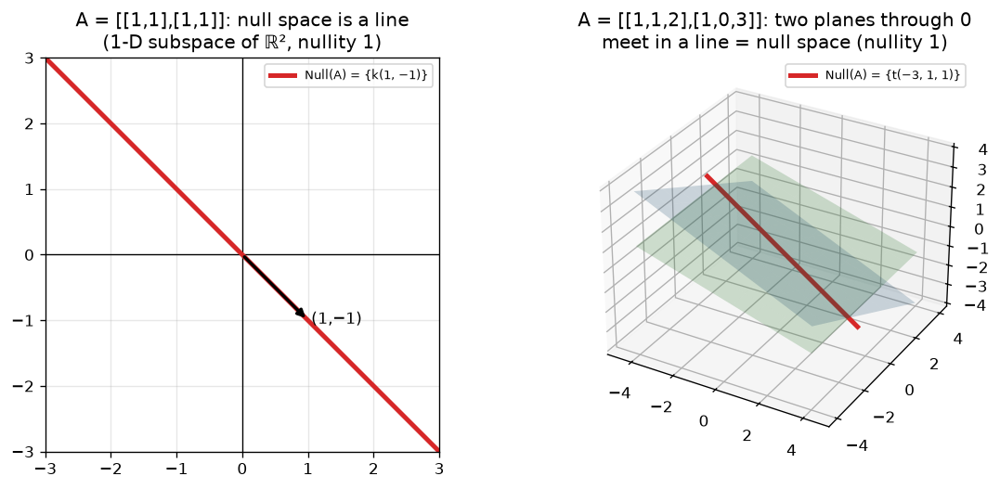

# 05 · Null Space (Kernel) & Nullity

> **Course:** Applied Mathematics for Data Science & AI · Dr. Arulalan Rajan
>
> **Lecture:** 3 October 2026
>
> **Sources:** handwritten notes pp. 50–55 and the 3 Oct class transcript
>
> **Notebook:** [`code/linear_algebra_part1.ipynb`](code/linear_algebra_part1.ipynb), Part E (incl. detecting redundant features in a dataset)
>
> **Next class:** Mon 5 Oct 2026, 8:00–9:30 pm, a **problem-solving session**. The professor will share a problem sheet on WhatsApp beforehand.

---

## 📌 Table of Contents

1. [Big Picture](#1-big-picture)
2. [Where Do Vectors Live? (Dimensions of A, x, b)](#2-where-do-vectors-live-dimensions-of-a-x-b-)
3. [Null Space: Definition](#3-null-space-definition-)
4. [Worked Examples](#4-worked-examples-)
5. [Nullity](#5-nullity-)
6. [Nullity = Number of Redundant Features](#6-nullity--number-of-redundant-features-)
7. [Rank–Nullity Theorem (preview)](#7-ranknullity-theorem-preview-)
8. [The Four Pictures Together](#8-the-four-pictures-together-)
9. [Professor Emphasised](#9--professor-emphasised)
10. [Common Confusions](#10--common-confusions)
11. [Practice Problems](#11--practice-problems)
12. [Cheat Sheet](#12--cheat-sheet)
13. [Go Deeper](#13--go-deeper-curated-links)

---

## 1. Big Picture

We've seen two facts that now merge:

- **Note 02:** if $`Ax = 0`$ has non-trivial solutions, then $`Ax = b`$ has infinitely many solutions.
- **Note 03:** the set of solutions of $`Ax = 0`$ passes the subspace test.

So the solutions of $`Ax = 0`$ form a **subspace**. It gets a name, the **null space**, and its dimension, the **nullity**, counts **how much redundancy** the matrix has. For a data matrix, that means how many features are redundant.

**Professor's analogy:** *"I am the transformation $`A`$. You (students) are the vectors. Many of you get 'blanked out' sitting through my lecture: my transformation takes you to **nothing** (zero). You are the null space."* 😄

---

## 2. Where Do Vectors Live? (Dimensions of A, x, b) 🟢

```math
A_{m\times n}\; x_{n\times 1} = b_{m\times 1}, \qquad A \in \mathbb R^{m\times n},\quad x \in \mathbb R^n,\quad b \in \mathbb R^m
```

| Object | Size | Lives in |
|---|---|---|
| $`A`$ | $`m`$ rows (equations / observations) × $`n`$ columns (unknowns / features) | $`\mathbb R^{m\times n}`$ |
| $`x`$ (input, solution) | $`n`$ components | $`\mathbb R^n`$ |
| $`b`$ (output) | $`m`$ components | $`\mathbb R^m`$ |

**Example:** $`A`$ is $`3\times2`$, so $`x \in \mathbb R^2`$ and $`b \in \mathbb R^3`$. Solutions of $`Ax = 0`$ **always** live in $`\mathbb R^n`$ (here $`\mathbb R^2`$), whatever $`b`$ is.

> The matrix is **fixed** (constant). What varies are the inputs $`x`$ and outputs $`b`$. (Professor, answering "how do we define the space for $`A`$?")

---

## 3. Null Space: Definition 🟢

> **Definition:** For $`A \in \mathbb R^{m\times n}`$, the set of all solutions of $`Ax = \mathbf 0`$,
> ```math
> \operatorname{Null}(A) = \{x \in \mathbb R^n : Ax = \mathbf 0\},
> ```
> forms a vector **subspace of $`\mathbb R^n`$**, called the **null space** or **kernel** of $`A`$.

**Proof that it's a subspace:**

1. $`A\mathbf 0 = \mathbf 0`$, so $`\mathbf 0 \in \operatorname{Null}(A)`$ ✓
2. $`Ax = 0,\ Ay = 0 \Rightarrow A(x + y) = Ax + Ay = 0`$ ✓
3. $`A(kx) = kAx = 0`$ ✓ ∎

**What it means:** the null space is **all the input vectors that $`A`$ transforms to zero**: what $`A`$ "kills" or "can't see".

> ⚠️ *"Null space doesn't mean there is nothing in it!"* It always contains at least $`\mathbf 0`$, and often infinitely many vectors.
> ⚠️ *"Kernel" here has nothing to do with the OS kernel or kernel SVMs.* *"One term appears in multiple places. Don't give it the same meaning."*

---

## 4. Worked Examples 🟢→🟡

### Example 1: only the trivial solution (notes p.50–51)
```math
A = \begin{bmatrix}1&1\\1&-1\\2&1\end{bmatrix}: \quad x_1 + x_2 = 0,\quad x_1 - x_2 = 0,\quad 2x_1 + x_2 = 0
```
The first two equations say $`x_1 = -x_2`$ **and** $`x_1 = x_2`$, so $`x_1 = x_2 = 0`$ (and this satisfies eq 3).
```math
\operatorname{Null}(A) = \{\mathbf 0\} \quad\text{(0-D subspace of } \mathbb R^2\text{)},\qquad \text{nullity} = 0
```
→ The columns $`(1,1,2)`$ and $`(1,-1,1)`$ are **independent**.

### Example 2: a line (notes p.52)
```math
A = \begin{bmatrix}1&1\\1&1\\1&1\end{bmatrix}: \quad x_1 + x_2 = 0 \text{ (three times)}
```
Solutions: $`(0,0), (1,-1), (-1,1), (2,-2), \dots`$, so $`\operatorname{Null}(A) = \{(x_1, -x_1)\} = \{k(1,-1)\}`$.
```math
\text{a line through the origin} = \text{1-D subspace of } \mathbb R^2,\qquad \text{nullity} = 1
```
(This is the "$`y = kx`$ with $`k = -1`$" subspace from Note 03.)

**Class Q:** *"Isn't $`(x_1, -x_1)`$ a 'single entry'?"* No. It's **infinitely many** vectors, $`(23, -23), (47, -47), \dots`$, all lying in **one direction** $`(1, -1)`$. **Dimension counts directions, not vectors.**

### Example 3: the 2×2 version (notes p.54)
```math
\begin{bmatrix}1&1\\1&1\end{bmatrix}\begin{bmatrix}x_1\\x_2\end{bmatrix} = \begin{bmatrix}0\\0\end{bmatrix} \Rightarrow x_2 = -x_1 \Rightarrow \operatorname{Null}(A) = \{k(1,-1)\}
```
Geometrically this is the 135° line ("like the Ramayana snake arrow" ↘):



**Key insight:** *"You don't have to state $`x_2`$ explicitly. The knowledge about $`x_2`$ is contained in $`x_1`$."* The two columns are identical, so one column is redundant.

### Example 4: the zero matrix (notes p.53)
```math
A = 0_{5\times3}:\quad Ax = 0 \text{ for every } x\in\mathbb R^3 \Rightarrow \operatorname{Null}(A) = \mathbb R^3,\quad \text{nullity} = 3
```
Likewise $`0_{2\times2}`$ gives $`\mathbb R^2`$ with nullity 2. A matrix whose null space is all of $`\mathbb R^5`$ has nullity 5.

> 🎯 **Only the zero matrix** has the whole $`\mathbb R^n`$ as its null space. *"Even a 100×100 matrix with **one** non-zero element won't."* A data matrix of all zeros "recorded nothing".

### Example 5: 2×3 by row reduction (notes p.55)
```math
\begin{bmatrix}1&1&2\\1&0&3\end{bmatrix}\begin{bmatrix}x_1\\x_2\\x_3\end{bmatrix} = \begin{bmatrix}0\\0\end{bmatrix}
\;\xrightarrow{R_2 \leftarrow R_2 - R_1}\;
\begin{bmatrix}1&1&2\\0&-1&1\end{bmatrix}\begin{bmatrix}x_1\\x_2\\x_3\end{bmatrix} = \begin{bmatrix}0\\0\end{bmatrix}
```
- Row 2: $`-x_2 + x_3 = 0 \Rightarrow x_2 = x_3`$. Let $`x_3 = t`$ (**free variable**), so $`x_2 = t`$.
- Row 1: $`x_1 + t + 2t = 0 \Rightarrow x_1 = -3t`$.

```math
x = \begin{bmatrix}-3t\\t\\t\end{bmatrix} = t\begin{bmatrix}-3\\1\\1\end{bmatrix}
\;\Rightarrow\; \operatorname{Null}(A) = \operatorname{span}\{(-3,1,1)\},\ \text{a 1-D subspace (line) of } \mathbb R^3
```
**Geometry (figure above, right):** each equation is a **plane through the origin** in $`\mathbb R^3`$. Two planes meet in a **line**, and that line is the null space.

**Why only the RHS = 0 matters:** row operations on $`0`$ give $`0`$, so the RHS can be ignored. *"Why waste time on that?"*

### 🔗 Connection to the 3 Oct dependence example
The same lecture showed $`3\cdot(1,1) - 1\cdot(1,0) - 1\cdot(2,3) = (0,0)`$, so the columns $`(1,1), (1,0), (2,3)`$ are dependent. Those are exactly the columns of this $`A`$! Equivalently, $`-3\cdot\text{col}_1 + \text{col}_2 + \text{col}_3 = 0`$:

> **Null-space vectors are the recipes (coefficients) of linear dependencies among the columns.** $`Ax = 0`$ means $`x_1\text{col}_1 + \dots + x_n\text{col}_n = \mathbf 0`$.

### Systematic recipe for Null(A)

1. Row-reduce $`A`$ to (R)REF (ignore the RHS, which stays 0).
2. Identify **pivot columns** (basic variables) and **non-pivot columns** (**free variables**).
3. Set each free variable to a parameter ($`t, s, \dots`$) and solve for the basic variables.
4. Write $`x`$ = parameter × vector + …. Those vectors form a **basis of Null(A)**.
5. **Nullity = number of free variables.**

---

## 5. Nullity 🟢

> **Definition:** The **dimension of the null space** of $`A`$ is called the **nullity** of $`A`$.

| | Null space | Nullity |
|---|---|---|
| What | A **set** (subspace) of vectors | A **number** |
| Example 2 | The line $`\{k(1,-1)\}`$ | 1 |
| Example 4 | $`\mathbb R^3`$ | 3 |
| Example 1 | $`\{\mathbf 0\}`$ | 0 |

*"Null space is the collection of vectors. Nullity is a number."* Nullity = number of **independent directions** in the null space = number of **free variables**.

**Range of values:** $`0 \le \operatorname{nullity}(A) \le n`$. It is 0 iff the columns are independent, and $`n`$ iff $`A = 0`$.

---

## 6. Nullity = Number of Redundant Features 🟡

Recall (Lecture 1): a data matrix $`A_{m\times n}`$ has **rows = observations** and **columns = variables/features**.

> **Nullity tells us the number of redundant features.**

**Professor's example:** a $`1000 \times 100`$ data matrix (1000 observations of 100 variables) with **nullity = 37** means that out of 100 variables, **37 are redundant**: those 37 columns can be expressed as combinations of the other 63. They add **no new information**.

### Important subtleties (from class Q&A)

| Question | Answer |
|---|---|
| Are redundant columns all zeros? | **No.** They can contain any values; they're just *combinations* of other columns |
| Is redundancy = noise / error? | **No.** Noise is random error. Redundancy is exact duplication of information (e.g. measured the same thing twice and called it a new variable) |
| Can I just set the 37 columns to zero? | **No.** That changes the system. And nullity tells you **how many** are redundant, **not which ones** |
| Which ones are redundant? | Any choice works: if $`c_2 = c_1`$, you may drop either. (*"First answer how many, then we'll find which."*) |

> 🔴 **Precise version:** nullity 37 means there are 37 *independent linear relations* among the columns, i.e. rank = 63. You can choose 63 independent columns (a basis of the column space) and drop the rest. Which 37 get dropped isn't unique.

### Real-world examples (from class)

| Redundant feature | Why |
|---|---|
| **Age** when **date of birth** is recorded | Age is derivable from DOB (unless you need exact days, as one student noted) |
| Score on Q9 when the total is 100/100 and all questions carry equal marks | *"The question becomes irrelevant"*: it's determined by the others |
| Height in cm and height in inches | Scaled copy |
| A US-admission application with dozens of attributes | Committees ignore many redundant or irrelevant ones |

Notebook Part E demo: a synthetic 1000×6 health dataset with `height_in = height_cm/2.54` and an engineered `0.5·height + 2·weight` column gives **rank 4, nullity 2**, and RREF identifies the dependencies exactly.

**In practice (beyond slides):**

- *Exact* redundancy → rank deficiency → $`X^\top X`$ singular → regression weights not unique.
- *Near* redundancy (multicollinearity) → tiny singular values → unstable models. Tools: **VIF**, correlation matrices, **PCA / SVD**, Ridge/Lasso regularisation.

---

## 7. Rank–Nullity Theorem (preview) 🟡

Every example satisfies:
```math
\boxed{\operatorname{rank}(A) + \operatorname{nullity}(A) = n \ (\text{number of columns})}
```

| $`A`$ | n | rank | nullity |
|---|---|---|---|
| $`\begin{bmatrix}1&1\\1&-1\\2&1\end{bmatrix}`$ | 2 | 2 | 0 |
| $`\begin{bmatrix}1&1\\1&1\\1&1\end{bmatrix}`$ | 2 | 1 | 1 |
| $`\begin{bmatrix}1&1&2\\1&0&3\end{bmatrix}`$ | 3 | 2 | 1 |
| $`0_{5\times3}`$ | 3 | 0 | 3 |
| 1000×100 data, nullity 37 | 100 | 63 | 37 |

**Intuition:** each of the $`n`$ input directions is either **preserved** (contributes to rank, i.e. "useful information") or **killed** (lands in the null space, i.e. "redundant"). In RREF terms: pivot columns + free columns = all columns.

---

## 8. The Four Pictures Together 🔴

For square $`A`$ ($`n\times n`$), all of the following are **equivalent**:

| ✅ Invertible case | ❌ Singular case |
|---|---|
| $`\det A \ne 0`$ | $`\det A = 0`$ |
| $`A^{-1}`$ exists | No inverse |
| $`Ax = b`$ has a **unique** solution for every $`b`$ | No solution or infinitely many |
| $`Ax = 0`$ has only $`x = 0`$ | Non-trivial solutions exist |
| $`\operatorname{Null}(A) = \{\mathbf 0\}`$, nullity 0 | Nullity ≥ 1 |
| rank $`= n`$ (n pivots) | rank < n |
| Columns linearly **independent** | Columns dependent |
| Columns form a **basis** of $`\mathbb R^n`$ | Columns span a smaller subspace |
| RREF $`= I`$ | RREF has a zero row |

This **Invertible Matrix Theorem** ties together Notes 01–05. If you understand why each row implies the others, you understand Unit 1.

---

## 9. 🎓 Professor Emphasised

1. The solution set of $`Ax = 0`$ is a **subspace of $`\mathbb R^n`$**: the **null space / kernel**.
2. **Null space ≠ empty**: it always contains $`\mathbf 0`$.
3. **Null space is a set; nullity is a number** (its dimension).
4. Dimension counts **independent directions**, not the number of vectors or values.
5. Only the **zero matrix** has the whole space as its null space.
6. **Nullity = number of redundant features/variables.** They can be any values, aren't noise, and nullity says *how many*, not *which*.
7. To find the null space: put RHS = 0, row-reduce, parametrise the free variables.
8. Redundancy comes from **columns**, not rows ("The column, not the rows").
9. **Monday 5 Oct, 8–9:30 pm:** problem-solving session; attempt the WhatsApp problem sheet first. Linear algebra is planned to wrap up by Saturday; next is probability & statistics (or calculus).
10. Participation: *"Teamwork is not 5 people giving moral support while one person works."*

---

## 10. ⚠️ Common Confusions

| Confusion | Clarification |
|---|---|
| Null space = empty / nothing | Always contains $`\mathbf 0`$; often infinite |
| Nullity = number of solutions | Nullity = **dimension** (number of directions); the number of solutions is 1 or ∞ |
| Null space lives in $`\mathbb R^m`$ | It's in $`\mathbb R^n`$ (the input/column-count space) |
| Null space is always one dimension lower | No: anything from 0 to n (examples: 0, 1, 3) |
| Nullity = n means many redundant variables | Nullity = n only for the zero matrix (everything is redundant) |
| Nullity identifies *which* features to drop | Only *how many*; the choice isn't unique |
| Redundancy comes from equations (rows) | Nullity concerns dependent **columns** (variables) |
| $`x_1, x_2`$ are "linearly combined" | Scalars aren't combined; **vectors** (columns) are, with $`x_i`$ as weights |

---

## 11. 📝 Practice Problems

<details>
<summary><b>P1.</b> Find Null(A) and the nullity of $`A = \begin{bmatrix}1&2\\2&4\end{bmatrix}`$.</summary>

$`x_1 + 2x_2 = 0 \Rightarrow x = t(-2, 1)`$. Null(A) is the line spanned by $`(-2,1)`$, nullity 1, rank 1.
</details>

<details>
<summary><b>P2.</b> Find a basis of Null(A) for $`A = \begin{bmatrix}1&2&3\\2&4&6\end{bmatrix}`$.</summary>

$`R_2 - 2R_1 = 0`$, so only $`x_1 + 2x_2 + 3x_3 = 0`$. Free: $`x_2 = s`$, $`x_3 = t`$ → $`x = s(-2,1,0) + t(-3,0,1)`$. Basis $`\{(-2,1,0), (-3,0,1)\}`$, nullity 2 (a plane in $`\mathbb R^3`$), rank 1. Check: 1 + 2 = 3 ✓.
</details>

<details>
<summary><b>P3.</b> A is 4×7 with rank 4. What is its nullity? Can Ax = 0 have only the trivial solution?</summary>

Nullity = 7 − 4 = 3. No: a wide matrix (more unknowns than equations) **always** has non-trivial null-space vectors.
</details>

<details>
<summary><b>P4.</b> A dataset has 500 rows and 12 features; rank = 9. How many features are redundant? What happens to OLS?</summary>

Nullity 3 → 3 redundant features. $`X^\top X`$ (12×12) has rank 9 → singular → the normal equation has no unique solution; use the pseudo-inverse, drop features, or regularise.
</details>

<details>
<summary><b>P5.</b> Find Null(A) for $`A = \begin{bmatrix}1&0&-1\\0&1&2\\1&1&1\end{bmatrix}`$.</summary>

$`R_3 - R_1 - R_2 = 0`$. From $`x_1 = x_3`$ and $`x_2 = -2x_3`$: Null = span$`\{(1,-2,1)\}`$, nullity 1, rank 2. Check: $`1·(1,0,1) - 2·(0,1,1) + 1·(-1,2,1) = (0,0,0)`$ ✓.
</details>

<details>
<summary><b>P6.</b> True/False: if $`x_p`$ solves $`Ax=b`$ and $`z \in`$ Null(A), then $`x_p + z`$ solves $`Ax = b`$.</summary>

True: $`A(x_p + z) = b + 0 = b`$. (General solution = particular + null space; Note 02 §8.)
</details>

---

## 12. 🧾 Cheat Sheet

- $`A_{m\times n}`$: $`x\in\mathbb R^n`$, $`b\in\mathbb R^m`$.
- **Null(A)** $`= \{x : Ax = 0\}`$, a subspace of $`\mathbb R^n`$ (aka **kernel**).
- **Nullity** = dim Null(A) = number of free variables = number of redundant columns/features.
- Recipe: RREF → free variables → parametrise → basis vectors.
- Null-space vectors = coefficients of **column dependencies**.
- Nullity 0 ⇔ columns independent ⇔ unique solutions. Only the zero matrix has nullity n.
- **Rank + nullity = n.**
- Complete solution of $`Ax=b`$: $`x_p + \text{Null}(A)`$.

---

## 13. 📚 Go Deeper: Curated Links

| Topic | Why | Link |
|---|---|---|
| Null space visually | Squashing space and what lands on 0 | [3Blue1Brown — Inverse matrices, column space and null space](https://www.youtube.com/watch?v=uQhTuRlWMxw) |
| Null space computation | Strang: special solutions, free variables | [MIT 18.06 — L6: Column Space and Nullspace](https://www.youtube.com/watch?v=8o5Cmfpeo6g) |
| Basis & dimension of null space | Rank–nullity in action | [MIT 18.06 — L9: Independence, Basis, and Dimension](https://www.youtube.com/watch?v=yjBerM5jWsc) |
| Instructor's NPTEL course | Same instructor's lectures | [NPTEL — Linear Algebra Through Geometry](https://nptel.ac.in/courses/106108482) |
| SciPy null space | Computing it numerically (uses SVD) | [`scipy.linalg.null_space`](https://docs.scipy.org/doc/scipy/reference/generated/scipy.linalg.null_space.html) |
| Redundant features → PCA | Practical dimensionality reduction | [scikit-learn — Decomposition (PCA)](https://scikit-learn.org/stable/modules/decomposition.html) |
| Multicollinearity in regression | Why redundant features break OLS | [ISL — Ch. 3.3.3 (free book)](https://www.statlearning.com/) |
| ML-oriented text | §2.7 linear mappings, kernel & image | [Mathematics for Machine Learning (free)](https://mml-book.github.io/) |

---
⬅️ [04 · Span, Independence, Basis, Dimension](04-Span-Independence-Basis-Dimension.md) · [Index](README.md)
