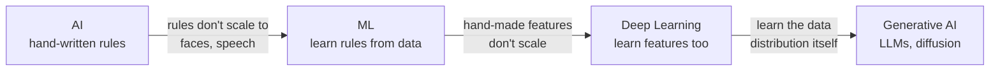
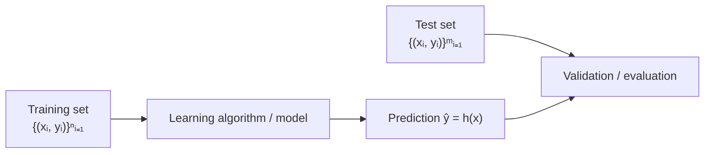
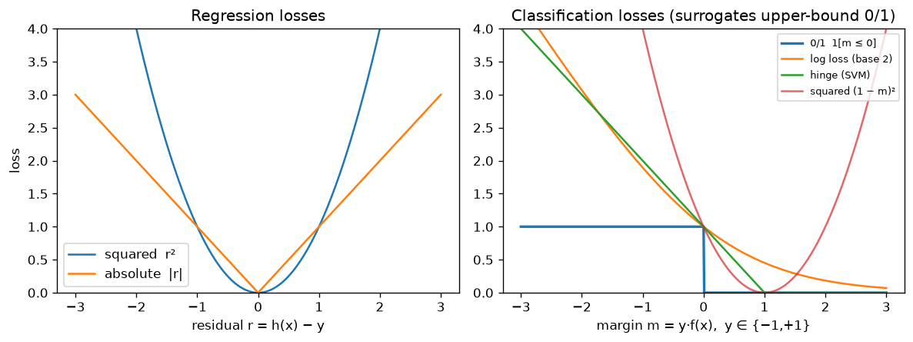
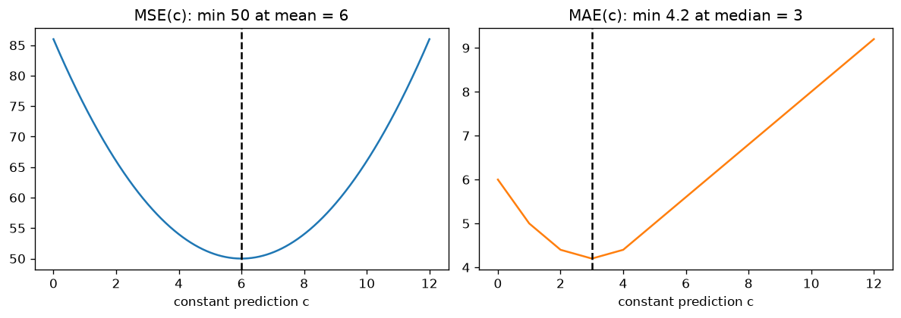
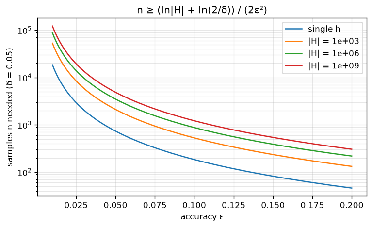
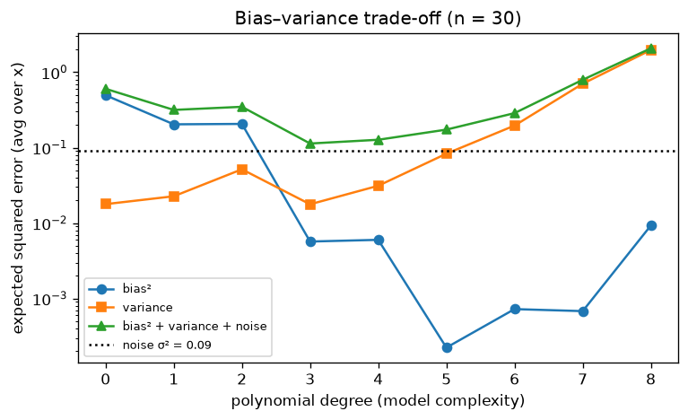
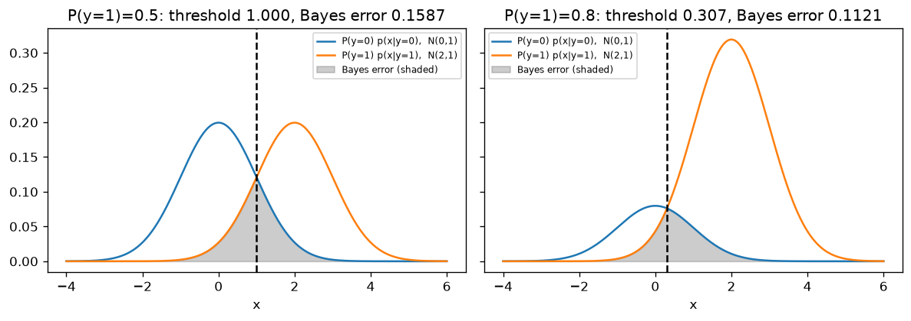

# 01 · Foundations: AI, ML, DL & the Formal Learning Setup

> **Course:** Introduction to Generative AI · M.Tech Sem 1
>
> **Deck:** `Intro_to_GenAI.pdf` ("Introduction to AI, ML and DL"), slides 1–17
>
> **Status:** Based on the slides. Class discussion will be added after the lecture.
>
> **Notebooks:** [`code/neural_networks_from_scratch.ipynb`](code/neural_networks_from_scratch.ipynb), Part A · deep dive: [`code/01_foundations_deep_dive.ipynb`](code/01_foundations_deep_dive.ipynb) (Parts A–J, every number in §7–§12 and the practice problems is recomputed there) · figures: [`code/figures_01.py`](code/figures_01.py)
>
> **Overlap:** the paradigms are covered in depth in [MLP Note 01](../../Machine-Learning-Paradigms/Notes/01-Introduction-to-ML-Paradigms.md). This note focuses on what's **new** here: the formal maths of learning, and why deep learning (and therefore Gen AI) exists.
>
> **Difficulty tags:** 🟢 core / on the slides · 🟡 needs some maths · 🔴 beyond the syllabus (read for depth, interviews and research)

---

## 📌 Table of Contents

1. [Big Picture: The Road to Generative AI](#1-big-picture-the-road-to-generative-ai)
2. [What is AI? The "Easy is Hard" Problem](#2-what-is-ai-the-easy-is-hard-problem-)
3. [What is ML? Mitchell's E–T–P Definition](#3-what-is-ml-mitchells-etp-definition-)
4. [What is Deep Learning?](#4-what-is-deep-learning-)
5. [AI ⊃ ML ⊃ DL ⊃ Gen AI](#5-ai--ml--dl--gen-ai-)
6. [The Three Paradigms (recap)](#6-the-three-paradigms-recap-)
7. [Supervised Learning: The Formal Setup and ERM](#7-supervised-learning-the-formal-setup-and-erm-)
8. [Loss Functions & Learning as Optimisation](#8-loss-functions--learning-as-optimisation-)
9. [Generalisation: Test Sets, Hoeffding and Bias–Variance](#9-generalisation-test-sets-hoeffding-and-biasvariance-)
10. [Unsupervised & Reinforcement Learning](#10-unsupervised--reinforcement-learning-)
11. [The Probabilistic View: Bayes Rule, Bayes-Optimal Classifier, Naive Bayes](#11-the-probabilistic-view-bayes-rule-bayes-optimal-classifier-naive-bayes-)
12. [Bridge to Gen AI: Discriminative vs Generative Models](#12--bridge-to-gen-ai-discriminative-vs-generative-models)
13. [Real-World Case Studies](#13--real-world-case-studies)
14. [Code Walkthrough](#14--code-walkthrough)
15. [Common Confusions](#15--common-confusions)
16. [Exam / Interview Questions](#16--exam--interview-questions)
17. [Practice Problems](#17--practice-problems)
18. [Cheat Sheet](#18--cheat-sheet)
19. [Go Deeper](#19--go-deeper-curated-links)

---

## 1. Big Picture: The Road to Generative AI

This course ends with LLMs and image generators. The first lecture builds the ladder to get there:



Each step removes one more thing humans had to hand-craft: first the **rules**, then the **features**, and finally the model learns to **create data itself**.

### A short history, including the two AI winters (beyond slides)

The ladder above was not climbed smoothly. The field has gone through two **"AI winters"**: periods when promises outran results, funding was cut and the term "AI" became unfashionable.

| Period | What happened | Why it matters for this course |
|---|---|---|
| 1956 | Dartmouth workshop; John McCarthy coins "artificial intelligence" | Symbolic AI: intelligence = manipulating rules and symbols |
| 1958 | Rosenblatt's **perceptron**: a single learned linear unit | The first "neural network" that learns from data |
| 1969 | Minsky & Papert's book *Perceptrons* shows a single-layer perceptron cannot represent XOR | Shallow models have limited representational power (see §4) |
| 1973–~1980 | **First AI winter.** The UK Lighthill Report criticises AI's failure to scale beyond toy problems; DARPA and UK funding are cut | Hand-written search and rules hit the "combinatorial explosion" |
| 1980s | **Expert systems** boom (e.g. DEC's XCON configured computer orders with thousands of hand-written rules) | Knowledge engineering: experts dictate rules to programmers |
| 1986 | Rumelhart, Hinton & Williams popularise **back-propagation** for multi-layer networks | Hidden layers can now be trained → XOR solvable |
| ~1987–1993 | **Second AI winter.** The Lisp-machine market collapses; expert systems prove brittle and expensive to maintain | Rules do not adapt; the "knowledge acquisition bottleneck" |
| 1990s–2000s | Statistical ML wins: SVMs, boosting, Naive Bayes spam filters, LeNet for cheques | Learning from data replaces writing rules |
| 1997 | IBM Deep Blue beats Kasparov at chess (search + hand-tuned evaluation) | Slide 2's example of "rules-based success" |
| 2006 | Hinton et al.: layer-wise pre-training of deep belief networks | The term "deep learning" takes off |
| 2012 | **AlexNet** wins ImageNet by a huge margin on GPUs (§13.2) | Deep learning becomes the default for perception |
| 2016 | **AlphaGo** beats Lee Sedol 4–1 (§13.4) | Deep learning + RL beat humans at Go |
| 2017 | "Attention Is All You Need": the **Transformer** | The architecture behind every modern LLM |
| 2020–2022 | GPT-3 (175B parameters), then ChatGPT (Nov 2022) | Generative AI reaches the public |

> 💡 **The pattern behind both winters:** each time, the approach depended on humans writing down knowledge (search heuristics, expert rules). Each recovery came from systems that **extract knowledge from data**, which is exactly slide 4's message: "AI systems need the ability to acquire their own knowledge, by extracting patterns from raw data."

---

## 2. What is AI? The "Easy is Hard" Problem 🟢

> **Artificial Intelligence** is the field concerned with building machines that can perform tasks that normally require **human intelligence**.

**The surprising history (slide 2):**

| Early AI was **good** at… | Early AI **struggled** with… |
|---|---|
| Problems with clearly defined rules | Tasks humans do **effortlessly and intuitively** |
| Solving maths problems, proving theorems | Recognising a face in an image |
| Playing chess (Deep Blue beat Kasparov in 1997) | Understanding spoken language |

This is **Moravec's paradox** (beyond slides): what's hard for humans (chess, calculus) is easy for computers, and what's easy for a 3-year-old (seeing, hearing, walking) is extremely hard to program. The reason is that we **can't write down the rules** for recognising a face. We do it unconsciously.

> 💡 **The key question (slide 2):** *"Instead of explicitly programming rules for every situation, can a machine **learn** the required behaviour **from data**?"* That question is the birth of ML.

### Why "just write the rules" fails: a back-of-envelope argument

A 100×100 greyscale image with 256 intensity levels can take $`256^{10000}`$ different values, a number with about 24,000 decimal digits. A rule-based face detector would have to say "face / not face" for every one of them. Rules written by hand ("two dark blobs above a lighter region…") break under changes in lighting, pose, glasses, skin tone and occlusion. A learned model instead picks a function $`h`$ from a family $`\mathcal{H}`$ that fits **examples**, and relies on the examples being representative of the images it will meet (the i.i.d. assumption of §7).

---

## 3. What is ML? Mitchell's E–T–P Definition 🟢

> *"A computer program is said to learn from **experience E** with respect to some class of **tasks T** and **performance measure P**, if its performance at tasks in T, as measured by P, improves with experience E."* (Tom Mitchell, 1997)

**A learning problem = Experience (E) + Task (T) + Performance (P).** Always identify all three:

| Problem | E (experience) | T (task) | P (performance) |
|---|---|---|---|
| Email spam filtering | Labelled emails | Classify spam / not spam | Accuracy, precision, recall |
| House-price prediction | Past houses with prices | Predict price | Mean squared error |
| Medical-image diagnosis | Labelled medical images | Detect disease | Sensitivity, specificity, accuracy |
| Robot navigation | Sensor observations + interaction | Reach destination safely | Success rate / reward |

**More examples to practise on:**

| Problem | E | T | P |
|---|---|---|---|
| ChatGPT pre-training | Trillions of words of text | Predict the next token | Perplexity / cross-entropy |
| Netflix recommendations | Watch history | Rank movies for a user | Click-through, watch time |
| AlphaGo | Self-play games | Choose Go moves | Win rate |
| Credit-card fraud | Past transactions labelled fraud / genuine | Flag fraudulent transactions | Recall at a fixed false-alarm rate, money saved |
| Machine translation | Parallel sentence pairs (English–Hindi) | Translate a sentence | BLEU score, human ratings |

**How ML works (slide 4):** `Data → Learn patterns → Make predictions/decisions`. AI systems need to *acquire their own knowledge by extracting patterns from raw data*.

> ⚠️ **Choosing P is a design decision with consequences.** For disease detection, **sensitivity (recall)** matters more than accuracy: missing a cancer (false negative) is far worse than a false alarm. (See confusion-matrix metrics in MLP Note 02.)

### Worked example 3.1: why accuracy can be the wrong P

A disease affects 1% of patients. A "model" that always answers *healthy* has accuracy $`0.99`$ but sensitivity $`0`$: it never finds a single sick patient. Under Mitchell's definition, "improving P with E" is meaningless if P rewards that trivial model. The fix is to choose P to match the cost of errors: sensitivity, the F1 score, or an expected cost $`c_{FN}\cdot\#FN + c_{FP}\cdot\#FP`$.

*Sanity check:* a metric is useful only if the trivial baselines (always-majority, random) score badly on it. Always-healthy scores 0 sensitivity, so sensitivity passes this test; accuracy does not.

---

## 4. What is Deep Learning? 🟢

> **Deep Learning** is a branch of ML that uses **multi-layered neural networks** to automatically learn complex patterns and **representations** from data.

Key points (slide 5):

- "**Deep**" = **many layers** in the neural network.
- It builds **complex concepts out of simpler concepts** (hierarchical).
- **No manual feature design**: it learns useful features automatically from **raw data**.
- It needs **large amounts of data** (and compute).

### The hierarchy of features (the core intuition)

For a face-recognition network:

```
pixels → edges → corners/textures → eyes, nose, mouth → whole face → identity
 layer 0   layer 1       layer 2            layer 3          layer 4     output
```

Each layer combines the previous layer's simple features into more abstract ones. Nobody told the network what an "eye" is. It discovered that eye-detectors are useful for the task.

### Representation learning: what "learning features" means 🟡

A classical pipeline is $`\mathbf{x} \xrightarrow{\ \phi\ (\text{hand-made})\ } \phi(\mathbf{x}) \xrightarrow{\ \text{linear model}\ } \hat{y}`$. A deep network learns $`\phi`$ too:

```math
\hat{y} = \mathbf{w}^\top \phi_\theta(\mathbf{x}), \qquad \phi_\theta = \phi_L \circ \phi_{L-1} \circ \dots \circ \phi_1
```

Both $`\mathbf{w}`$ and the feature map's parameters $`\theta`$ are fitted by minimising the same loss (§8). Bengio, Courville & Vincent's survey (Go Deeper) calls this **representation learning**. Three reasons it works well:

1. **Distributed representations:** $`k`$ binary features can describe $`2^k`$ different combinations ("has glasses", "smiling", "facing left" …), so a modest number of learned features can cover a huge input space.
2. **Composition / re-use:** an edge detector learned in layer 1 is re-used by every higher-level detector that needs edges.
3. **Transfer:** features learned on one task (ImageNet classification, next-token prediction) are useful for many others. This is why pre-trained models, and therefore foundation models such as GPT, are possible.

### Worked example 4.1: XOR, the smallest case for learned features

Use $`\pm 1`$ encoding. Inputs $`(1,1)`$ and $`(-1,-1)`$ have label $`-1`$; inputs $`(1,-1)`$ and $`(-1,1)`$ have label $`+1`$.

**Claim:** no linear classifier $`\text{sign}(w_1x_1 + w_2x_2 + b)`$ gets all four right.

*Proof.* Let $`f(\mathbf{x}) = w_1x_1 + w_2x_2 + b`$. Being correct requires

```math
f(1,1) < 0,\quad f(-1,-1) < 0,\quad f(1,-1) > 0,\quad f(-1,1) > 0 .
```

Adding the first two: $`(w_1 + w_2 + b) + (-w_1 - w_2 + b) = 2b < 0`$. Adding the last two: $`(w_1 - w_2 + b) + (-w_1 + w_2 + b) = 2b > 0`$. Contradiction. ∎

**Fix with one new feature:** $`\phi(\mathbf{x}) = x_1x_2`$. It equals $`+1`$ on the label-(−1) points and $`-1`$ on the label-(+1) points, so $`h(\mathbf{x}) = \text{sign}(-\phi(\mathbf{x}))`$ is perfect. A hidden layer of a neural network can learn a feature that plays the role of $`x_1x_2`$ ([Note 02](02-Neural-Networks-Fundamentals.md) builds it explicitly).

*Sanity check:* $`(1,-1)`$: $`\phi = -1`$, $`h = \text{sign}(1) = +1`$ ✓; $`(-1,-1)`$: $`\phi = 1`$, $`h = -1`$ ✓.

### Classical ML vs Deep Learning

| | Classical ML | Deep Learning |
|---|---|---|
| Features | **Hand-engineered** by domain experts | **Learned** from raw data |
| Data needed | Hundreds to thousands | Thousands to billions |
| Compute | CPU is fine | GPUs/TPUs |
| Interpretability | Higher | Lower ("black box") |
| Best for | Tabular data, small data | Images, audio, text, video |
| Example | Word/noun/verb counts + logistic regression (MLP Note 02 demo) | Text → embedding → Transformer |

### Applications (slide 6)

| Domain | Examples |
|---|---|
| Computer vision | Image classification, object detection, face recognition |
| Speech | Voice assistants, speech-to-text |
| Healthcare | Medical image analysis, disease prediction, drug discovery (AlphaFold) |
| Autonomous vehicles | Object/lane detection, driving decisions |
| Recommendations | Movies, music, products |
| Fraud detection | Unusual patterns in financial transactions |

---

## 5. AI ⊃ ML ⊃ DL ⊃ Gen AI 🟢


```math
\text{Deep Learning} \subset \text{Machine Learning} \subset \text{Artificial Intelligence}
```

| Layer | Example that belongs **only** here |
|---|---|
| AI but not ML | Rule-based expert systems, A* search, classic chess engines |
| ML but not DL | Linear regression, decision trees, random forests, SVM, k-means |
| DL but not Gen AI | ResNet image classifier, a sentiment BERT classifier |
| **Generative AI** | GPT/ChatGPT, Stable Diffusion, DALL·E, Sora, MusicGen |

> ⚠️ Not every generative model is deep: Naive Bayes and Gaussian mixture models are **generative** (§12) but shallow. "Gen AI" in this course means **deep** generative models, which is why the Venn diagram places it inside DL.

---

## 6. The Three Paradigms (recap) 🟢

| Paradigm | Goal | Sub-types / examples |
|---|---|---|
| **Supervised** | Learn a mapping input → output | **Classification** (categorical output), **Regression** (continuous output) |
| **Unsupervised** | Discover patterns; no output label | Clustering, dimensionality reduction |
| **Reinforcement** | Agent acts in an environment and receives rewards/penalties; maximise **cumulative reward** | Games, robotics |

**Example (slide 10): will a person buy a laptop?** The features are age, income, student status and purchase history; the label is *Buy / Not Buy*. The slide's plot shows the classes separated by a **curvy, non-linear boundary** (with a small loop around an outlier). That foreshadows why we need flexible models like neural networks, and also the risk of **over-fitting** to single odd points.

➡️ Full treatment, with semi-/self-supervised learning and the ChatGPT paradigm stack: [MLP Note 01 §9](../../Machine-Learning-Paradigms/Notes/01-Introduction-to-ML-Paradigms.md).

---

## 7. Supervised Learning: The Formal Setup and ERM 🟡

This is the mathematical language the rest of the course (and research papers) will use. **Learn this notation.**

### The ingredients

```math
\mathcal{D} = \{(\mathbf{x}_1, y_1), \dots, (\mathbf{x}_n, y_n)\} \subseteq \mathbb{R}^d \times \mathcal{Y}
```

| Symbol | Name | Meaning |
|---|---|---|
| $`\mathcal{D}`$ | Training data | $`n`$ labelled examples |
| $`\mathbf{x}_i \in \mathbb{R}^d`$ | Input / feature vector | The $`i`$-th sample, with $`d`$ features |
| $`\mathbb{R}^d`$ | **Feature space** | The vector space where inputs live (cf. Applied Math Note 03!) |
| $`y_i \in \mathcal{Y}`$ | Label | Target for the $`i`$-th sample |
| $`\mathcal{Y}`$ | **Label space** | The set of possible outputs |
| $`P(X, Y)`$ | Data distribution | **Unknown** process that generates the data |
| $`h`$ | Hypothesis / model | A function $`h: \mathbb{R}^d \to \mathcal{Y}`$ |
| $`\mathcal{H}`$ | Hypothesis class | The set of functions we search over (e.g. all lines, all neural nets of a given shape) |

**The crucial assumption:** data points are drawn **i.i.d.** (independently, identically distributed) from some **unknown** distribution $`P(X, Y)`$. Training and test data come from the **same** distribution. (When this breaks, you get **data drift**: MLP Note 01 §12.)

**The goal:** find $`h`$ such that for a **new** pair $`(\mathbf{x}, y) \sim P`$, we have $`h(\mathbf{x}) = y`$ with high probability (classification) or $`h(\mathbf{x}) \approx y`$ (regression).

### Label spaces

| Problem | $`\mathcal{Y}`$ | Example |
|---|---|---|
| Binary classification | $`\{0, 1\}`$ or $`\{-1, +1\}`$ | Spam (+1) vs not spam (−1) |
| Multi-class classification | $`\{1, 2, \dots, K\}`$, $`K \ge 2`$ | Digit 0–9 ($`K = 10`$), cat/dog/horse |
| Regression | $`\mathbb{R}`$ | Temperature, height, house price |
| *(beyond slides)* Multi-label | $`\{0,1\}^K`$ | Movie genres (action **and** comedy) |
| *(beyond slides)* Structured / generative | Sequences, images | Translation, **text generation** ← Gen AI |

> 💡 $`\{0,1\}`$ vs $`\{-1,+1\}`$ is a convenience choice. $`\{0,1\}`$ pairs naturally with probabilities and sigmoid; $`\{-1,+1\}`$ pairs naturally with SVMs and perceptrons ($`y\cdot h(x) > 0`$ means correct).

### The basic pipeline (slide 11)



### True risk, empirical risk and ERM 🟡

Fix a **pointwise loss** $`\ell(\hat{y}, y) \ge 0`$ (how bad it is to predict $`\hat{y}`$ when the truth is $`y`$). Two averages of it matter:

```math
\underbrace{R(h) = \mathbb{E}_{(X,Y)\sim P}\big[\ell(h(X), Y)\big]}_{\text{true (population) risk}}
\qquad
\underbrace{\hat{R}_n(h) = \frac{1}{n}\sum_{i=1}^{n} \ell(h(\mathbf{x}_i), y_i)}_{\text{empirical risk = training loss}}
```

We cannot compute $`R(h)`$ because $`P`$ is unknown. **Empirical Risk Minimisation (ERM)** replaces it with the computable average:

```math
\hat{h} = \arg\min_{h \in \mathcal{H}} \hat{R}_n(h)
```

The slides' $`L_{sq}(h)`$ (§8) is exactly $`\hat{R}_n(h)`$ with $`\ell(\hat{y},y) = (\hat{y}-y)^2`$.

**Three more definitions:**

| Name | Definition | Meaning |
|---|---|---|
| Best-in-class hypothesis | $`h^*_{\mathcal{H}} = \arg\min_{h\in\mathcal{H}} R(h)`$ | The best we could do if we knew $`P`$ but had to stay inside $`\mathcal{H}`$ |
| Bayes-optimal predictor | $`f^* = \arg\min_{\text{all } f} R(f)`$ | The best possible predictor of any form (§8, §11) |
| Bayes risk | $`R^* = R(f^*)`$ | The irreducible error: noise in $`Y`$ given $`X`$ |

**Error decomposition** (the most useful single equation for thinking about model choice):

```math
R(\hat{h}) - R^* = \underbrace{\big[R(\hat{h}) - R(h^*_{\mathcal{H}})\big]}_{\text{estimation error (variance-like)}} + \underbrace{\big[R(h^*_{\mathcal{H}}) - R^*\big]}_{\text{approximation error (bias-like)}}
```

- A **bigger** $`\mathcal{H}`$ (deeper network, higher-degree polynomial) lowers the approximation error but, for fixed $`n`$, raises the estimation error.
- **More data** shrinks only the estimation error.
- Deep learning's bet: use a huge $`\mathcal{H}`$ (tiny approximation error) **and** huge $`n`$ (keeps estimation error small).

### Theorem 7.1: the empirical risk of a fixed h is unbiased 🟡

*Statement.* If $`h`$ is chosen **before** seeing the data and the $`(\mathbf{x}_i, y_i)`$ are i.i.d. from $`P`$, then

```math
\mathbb{E}\big[\hat{R}_n(h)\big] = R(h), \qquad \text{Var}\big[\hat{R}_n(h)\big] = \frac{\text{Var}\big[\ell(h(X),Y)\big]}{n}.
```

*Proof.* Let $`Z_i = \ell(h(\mathbf{x}_i), y_i)`$. Because $`h`$ is fixed and the pairs are identically distributed, every $`Z_i`$ has mean $`R(h)`$. By linearity of expectation, $`\mathbb{E}[\frac1n\sum Z_i] = \frac1n \cdot nR(h) = R(h)`$. Because the pairs are independent, the $`Z_i`$ are independent, so the variances add: $`\text{Var}[\frac1n\sum Z_i] = \frac{1}{n^2}\cdot n\,\text{Var}[Z_1]`$. ∎

**Corollary (0/1 loss).** $`Z_i \in \{0,1\}`$ is Bernoulli with mean $`R`$, so $`\text{Var}[Z_i] = R(1-R)`$ and the standard error of the measured error rate is $`\sqrt{R(1-R)/n}`$.

> ⚠️ **The fine print that makes test sets necessary.** The theorem needs $`h`$ to be fixed in advance. The ERM winner $`\hat{h}`$ is chosen **because** it has a small training loss, so $`\hat{R}_n(\hat{h})`$ is biased **downwards** (optimistic). A fresh test set restores the condition: $`\hat{h}`$ is fixed with respect to the test data, so the test error is an unbiased estimate of $`R(\hat{h})`$.

### Worked example 7.1: empirical risk under squared, absolute and 0/1 loss

**Regression.** Data $`(x, y)`$: $`(1,3), (2,5), (3,6), (4,10)`$. Compare $`h_1(x) = 2x + 1`$ and $`h_2(x) = 2.5x`$.

| $`x`$ | $`y`$ | $`h_1`$ | residual | $`h_2`$ | residual |
|---|---|---|---|---|---|
| 1 | 3 | 3 | 0 | 2.5 | −0.5 |
| 2 | 5 | 5 | 0 | 5.0 | 0 |
| 3 | 6 | 7 | 1 | 7.5 | 1.5 |
| 4 | 10 | 9 | −1 | 10.0 | 0 |

- $`h_1`$: $`L_{sq} = (0 + 0 + 1 + 1)/4 = 0.5`$, $`L_{abs} = (0 + 0 + 1 + 1)/4 = 0.5`$.
- $`h_2`$: $`L_{sq} = (0.25 + 0 + 2.25 + 0)/4 = 0.625`$, $`L_{abs} = (0.5 + 0 + 1.5 + 0)/4 = 0.5`$.

Under squared loss, ERM picks $`h_1`$. Under absolute loss the two **tie**. Squared loss prefers several small errors (0, 0, 1, 1) over one large error (0.5, 0, 1.5, 0), because squaring punishes the 1.5 heavily.

**Classification.** Data $`x = (0.5, 1.2, 2.0, 2.7, 3.1, 3.8)`$ with labels $`(0, 0, 1, 0, 1, 1)`$. Hypotheses $`h_t(x) = \mathbb{1}[x > t]`$:

| $`t`$ | predictions | mistakes | $`\hat{R}_{0/1}`$ |
|---|---|---|---|
| 1.0 | 0,1,1,1,1,1 | at 1.2 and 2.7 | 2/6 = 0.3333 |
| 1.5 | 0,0,1,1,1,1 | at 2.7 | 1/6 = 0.1667 |
| 2.9 | 0,0,0,0,1,1 | at 2.0 | 1/6 = 0.1667 |

ERM over $`\mathcal{H} = \{h_{1.0}, h_{1.5}, h_{2.9}\}`$ returns a tie between $`t = 1.5`$ and $`t = 2.9`$; no threshold reaches 0 because the labels are not monotone in $`x`$ (the point at 2.7 is a "noisy" 0).

*Sanity check:* every 0/1 risk is a multiple of $`1/n = 1/6`$ ✓. (Notebook Part J reproduces both tables.)

---

## 8. Loss Functions & Learning as Optimisation 🟡

> A **loss function** evaluates a hypothesis $`h \in \mathcal{H}`$ on the training data and tells us **how bad it is**. Higher loss means worse; **zero loss means perfect predictions** (on that data).

### Squared loss (slide 13)

```math
L_{sq}(h) = \frac1n\sum_{i=1}^n \big(h(\mathbf{x}_i) - y_i\big)^2
```

Two effects of squaring:

1. The loss is **always non-negative**.
2. The loss **grows quadratically** with the size of the mistake: big errors are punished much more.

### Learning = minimisation

```math
\boxed{h^* = \arg\min_{h\in\mathcal{H}} L(h)}
```

This is called **Empirical Risk Minimisation (ERM)**: "empirical" because we average over the training sample, not the true distribution. Notebook Part A tries 4 hypotheses on data from $`y = 3x + 2 + \text{noise}`$. The one with the lowest $`L_{sq}`$ is $`h(x) = 3x + 2`$ ✓.

### Other common losses (beyond slides)

| Loss | Formula | Used for | Note |
|---|---|---|---|
| Squared | $`(h(x)-y)^2`$ | Regression | Sensitive to outliers |
| Absolute | $`\lvert h(x)-y\rvert`$ | Robust regression | Less outlier-sensitive |
| **0/1 loss** | $`\mathbb{1}[h(x) \ne y]`$ | Classification error rate | Not differentiable → can't use gradient descent |
| **Cross-entropy (log loss)** | $`-[y\log\hat{p} + (1-y)\log(1-\hat{p})]`$ | Classification | Differentiable surrogate for 0/1; **used to train every LLM** |
| Hinge | $`\max(0, 1 - y f(x))`$, $`y\in\{-1,+1\}`$ | SVMs | Zero once the margin exceeds 1 |



*Left:* squared loss is below absolute loss for small residuals ($`\lvert r\rvert < 1`$) and far above it for large ones; that is the outlier sensitivity. *Right:* with $`y \in \{-1,+1\}`$ and a real-valued score $`f(x)`$, the **margin** $`m = y f(x)`$ is positive when the prediction is correct. Log loss (base 2) and hinge both lie on or above the 0/1 step and are continuous, so they can be minimised by gradient descent while still pushing the 0/1 error down.

> 🔗 The regression notes ([MLP Note 03](../../Machine-Learning-Paradigms/Notes/03-Supervised-Learning-Regression.md)) show how to actually *do* the arg min: closed form (OLS) or **gradient descent**. Neural networks always use gradient descent.

### What does each loss make the model predict? (the "why" behind loss choice) 🟡

Choosing the loss decides **which summary of** $`P(Y \mid X = \mathbf{x})`$ the ideal model outputs. These three results are the reason MSE gives "average" predictions, MAE gives "typical" predictions, and classifiers output the most probable class.

| Loss | Best prediction at each $`\mathbf{x}`$ | Name |
|---|---|---|
| Squared | $`\mathbb{E}[Y \mid X=\mathbf{x}]`$ | conditional **mean** (regression function) |
| Absolute | $`\text{median}(Y \mid X=\mathbf{x})`$ | conditional **median** |
| 0/1 | $`\arg\max_k P(Y=k \mid X=\mathbf{x})`$ | **Bayes-optimal classifier** (§11) |
| Cross-entropy (on probabilities) | $`\hat{p}_k = P(Y=k \mid X=\mathbf{x})`$ | the **true conditional probabilities** |

Since $`R(h) = \mathbb{E}_X\big[\mathbb{E}[\ell(h(X),Y) \mid X]\big]`$, it is enough to minimise the inner conditional expectation **separately for every** $`\mathbf{x}`$. So each proof below is about a single random variable $`Y`$ (think "$`Y`$ given $`X = \mathbf{x}`$") and a single number $`c`$ we predict.

### Theorem 8.1: squared loss is minimised by the mean

*Statement.* For a random variable $`Y`$ with finite variance and mean $`\mu = \mathbb{E}[Y]`$,

```math
\mathbb{E}\big[(Y-c)^2\big] = \text{Var}(Y) + (\mu - c)^2 ,
```

so the unique minimiser is $`c = \mu`$, and the minimum value is $`\text{Var}(Y)`$.

*Proof.* Write $`Y - c = (Y - \mu) + (\mu - c)`$ and expand:

```math
\mathbb{E}\big[(Y-c)^2\big] = \mathbb{E}\big[(Y-\mu)^2\big] + 2(\mu - c)\,\mathbb{E}[Y-\mu] + (\mu-c)^2 .
```

The middle term is zero because $`\mathbb{E}[Y - \mu] = 0`$. The first term is $`\text{Var}(Y)`$, which does not depend on $`c`$; the last is $`\ge 0`$ and equals $`0`$ only at $`c = \mu`$. ∎

**Empirical version.** For data $`y_1,\dots,y_n`$, $`g(c) = \frac1n\sum (y_i - c)^2`$ has $`g'(c) = -\frac{2}{n}\sum (y_i - c) = 0 \iff c = \bar{y}`$, and $`g''(c) = 2 > 0`$, so the sample mean is the minimiser.

**Consequence.** Applying the theorem at every $`\mathbf{x}`$: the best possible regressor under squared loss is $`f^*(\mathbf{x}) = \mathbb{E}[Y \mid X = \mathbf{x}]`$, and the irreducible error is $`\mathbb{E}[\text{Var}(Y\mid X)]`$, the noise level. Linear regression, neural-network regression and diffusion models' denoisers (trained with MSE) all estimate a conditional mean.

### Theorem 8.2: absolute loss is minimised by the median

*Statement.* $`g(c) = \mathbb{E}\lvert Y - c\rvert`$ is minimised at any median $`m`$ of $`Y`$, i.e. any $`m`$ with $`P(Y \le m) \ge \tfrac12`$ and $`P(Y \ge m) \ge \tfrac12`$.

*Proof (empirical version, the one used in exams).* For data $`y_1,\dots,y_n`$ let $`g(c) = \frac1n\sum_i \lvert y_i - c\rvert`$. Away from the data points each term is linear in $`c`$ with slope $`+1`$ if $`y_i < c`$ and $`-1`$ if $`y_i > c`$. Therefore

```math
g'(c) = \frac{1}{n}\Big(\#\{i : y_i < c\} - \#\{i : y_i > c\}\Big).
```

Moving $`c`$ to the right decreases $`g`$ while fewer than half the points lie to the left of $`c`$, and increases $`g`$ once more than half lie to the left. $`g`$ is convex and piecewise linear, so its minimum is where the slope changes sign: at the middle data point (odd $`n`$) or anywhere between the two middle points (even $`n`$). That is the median. ∎

*Population version.* For continuous $`Y`$ with CDF $`F`$, the same calculation gives $`g'(c) = P(Y < c) - P(Y > c) = 2F(c) - 1`$, which is zero exactly when $`F(c) = \tfrac12`$.

### Worked example 8.1: mean vs median on skewed data

Data $`d = \{1, 2, 3, 4, 20\}`$ (four ordinary values and one outlier, like incomes). Mean $`= 30/5 = 6`$; median $`= 3`$.

| Constant $`c`$ | squared errors | MSE | absolute errors | MAE |
|---|---|---|---|---|
| 3 (median) | 4, 1, 0, 1, 289 | 295/5 = **59.0** | 2, 1, 0, 1, 17 | 21/5 = **4.2** |
| 6 (mean) | 25, 16, 9, 4, 196 | 250/5 = **50.0** | 5, 4, 3, 2, 14 | 28/5 = **5.6** |

The mean wins on MSE (50 < 59), the median wins on MAE (4.2 < 5.6), exactly as Theorems 8.1 and 8.2 predict.

*Sanity check with Theorem 8.1:* the population variance of $`d`$ is $`\text{MSE}(6) = 50`$, so $`\text{MSE}(3) = 50 + (6-3)^2 = 59`$ ✓.



**Robustness.** Replace 20 by 2,000: the mean jumps to 402, the median stays 3. In notebook Part B, appending one value of 10,000 to 1,001 exponential samples moves the mean from 10.16 to 20.13 while the median stays at 6.86. This is why house prices and salaries are reported as medians, and why MAE (or the Huber loss) is used when targets have outliers.

### Theorem 8.3: cross-entropy is the negative log-likelihood (MLE)

The cross-entropy loss is not an arbitrary formula. It is what **maximum likelihood estimation** gives for a probabilistic classifier.

*Setup.* A binary classifier outputs $`\hat{p}_i = P_\theta(Y=1 \mid \mathbf{x}_i)`$ (for example $`\hat{p}_i = \sigma(\mathbf{w}^\top\mathbf{x}_i + b)`$ in logistic regression). The model says $`y_i \sim \text{Bernoulli}(\hat{p}_i)`$, so

```math
P_\theta(y_i \mid \mathbf{x}_i) = \hat{p}_i^{\,y_i}(1-\hat{p}_i)^{1-y_i}, \qquad y_i \in \{0,1\}.
```

*Derivation.* By independence the likelihood of all labels is the product; taking $`-\frac1n\log`$ turns the product into an average:

```math
\begin{aligned}
\mathcal{L}(\theta) &= \prod_{i=1}^{n} \hat{p}_i^{\,y_i}(1-\hat{p}_i)^{1-y_i} \\
-\frac{1}{n}\log\mathcal{L}(\theta) &= \frac{1}{n}\sum_{i=1}^{n} -\big[y_i\log\hat{p}_i + (1-y_i)\log(1-\hat{p}_i)\big] = \text{BCE}(\theta).
\end{aligned}
```

$`\log`$ is increasing and $`-\frac1n`$ flips max to min, so **maximising the likelihood ⇔ minimising the mean binary cross-entropy**. ∎

For $`K`$ classes with softmax outputs $`\hat{p}_{ik}`$ the same steps give **categorical cross-entropy** $`\frac1n\sum_i -\log \hat{p}_{i,y_i}`$: the negative log-probability of the correct class. Next-token training of an LLM is exactly this with $`K = `$ vocabulary size.

**Why it recovers the true probabilities.** If the true label distribution at $`\mathbf{x}`$ is $`p`$ and the model predicts $`q`$, the expected loss is the cross-entropy $`H(p,q) = -\sum_k p_k\log q_k`$, and

```math
H(p, q) = H(p) + D_{\text{KL}}(p \,\Vert\, q) \ge H(p),
```

with equality iff $`q = p`$ (Gibbs' inequality, $`D_{\text{KL}} \ge 0`$). Minimising cross-entropy therefore pushes the model's probabilities towards the true conditional probabilities. Simple numerical check: for a constant prediction $`q`$ on labels with a fraction $`\bar{y}`$ of ones, $`\frac{d}{dq}\big[-\bar{y}\log q - (1-\bar{y})\log(1-q)\big] = -\frac{\bar{y}}{q} + \frac{1-\bar{y}}{1-q} = 0 \iff q = \bar{y}`$. Notebook Part C finds $`\arg\min_q \text{BCE} = 0.667`$ for labels with 4 ones out of 6 ✓.

### Worked example 8.2: cross-entropy values you should know

Loss on a single example when the model gives the **correct** class probability $`\hat{p}`$ (natural log):

| $`\hat{p}`$ for the true class | $`-\ln\hat{p}`$ | Reading |
|---|---|---|
| 0.9 | 0.1054 | confident and right: small loss |
| 0.5 | 0.6931 | a coin flip: $`\ln 2`$ |
| 0.1 | 2.3026 | confident and wrong: large loss |
| 0.01 | 4.6052 | very confident and wrong: the loss keeps growing without bound |

**Mini-batch.** Labels $`y = (1,0,1,1,0,1)`$, predicted $`P(Y=1)`$: $`(0.8, 0.4, 0.3, 0.9, 0.6, 0.7)`$. The probability given to the **true** label is $`0.8, 0.6, 0.3, 0.9, 0.4, 0.7`$, so the per-example losses are $`0.2231, 0.5108, 1.2040, 0.1054, 0.9163, 0.3567`$, and

```math
\text{BCE} = \frac{0.2231 + 0.5108 + 1.2040 + 0.1054 + 0.9163 + 0.3567}{6} = \frac{3.3163}{6} = 0.5527 .
```

The likelihood is $`0.8 \times 0.6 \times 0.3 \times 0.9 \times 0.4 \times 0.7 = 0.036288`$ and $`-\ln(0.036288)/6 = 0.5527`$ ✓ (Theorem 8.3). With threshold 0.5 the third and fifth examples are misclassified, so the 0/1 risk is $`2/6 = 0.3333`$.

**Softmax example.** A 3-class model outputs $`(0.7, 0.2, 0.1)`$ and the true class is the first: loss $`= -\ln 0.7 = 0.3567`$. A model that guesses uniformly over GPT-2's vocabulary of 50,257 tokens has loss $`\ln 50257 = 10.825`$ nats per token; a trained LLM is judged by how far below this it gets. Its **perplexity** is $`e^{\text{loss}}`$: a loss of 2.0 nats means perplexity $`e^{2} = 7.389`$, "as uncertain as a fair choice among about 7.4 tokens".

*Sanity check:* every per-example loss is positive, and the worst one (1.204) belongs to the example where the true class got only 0.3 ✓.

---

## 9. Generalisation: Test Sets, Hoeffding and Bias–Variance 🟡

The slides end with the word **"Generalization"**. It's the whole point:

> **Zero training loss is easy. Just memorise.** A lookup table that returns $`y_i`$ for each $`\mathbf{x}_i`$ has $`L = 0`$ but is useless on new data.

What we really want is low loss on **unseen** data from $`P`$:

```math
\underbrace{\mathbb{E}_{(\mathbf{x},y)\sim P}\big[\ell(h(\mathbf{x}), y)\big]}_{\text{true risk (what we care about)}} \quad\text{vs}\quad \underbrace{\frac1n\sum_i \ell(h(\mathbf{x}_i), y_i)}_{\text{training loss (what we can compute)}}
```

We estimate the true risk with a held-out **test set**, and tune choices on a **validation set**.

| | Training error | Test error | Diagnosis |
|---|---|---|---|
| Under-fitting | High | High | $`\mathcal{H}`$ too simple |
| Good fit | Low | Low | ✓ |
| Over-fitting | Very low | High | Memorised noise; $`\mathcal{H}`$ too flexible or data too small |

The laptop-buyer plot (slide 10) shows a boundary that loops around a single red point. That's a hint of over-fitting.

### How big must the test set be? Hoeffding's inequality 🔴

*(Beyond syllabus; standard in learning-theory courses and interviews.)*

**Hoeffding's inequality.** Let $`Z_1, \dots, Z_n`$ be i.i.d. with values in $`[0,1]`$ and mean $`\mu`$. Then for every $`\varepsilon > 0`$

```math
P\Big(\big\lvert \bar{Z} - \mu \big\rvert > \varepsilon\Big) \le 2e^{-2n\varepsilon^2}, \qquad \bar{Z} = \frac1n\sum_{i=1}^n Z_i .
```

*Proof idea.* (1) Markov's inequality applied to $`e^{s(\bar{Z}-\mu)}`$ gives $`P(\bar{Z} - \mu > \varepsilon) \le e^{-s\varepsilon}\,\mathbb{E}[e^{s(\bar{Z}-\mu)}]`$ for any $`s > 0`$ (the Chernoff trick). (2) Independence factorises the expectation into $`n`$ identical terms. (3) Hoeffding's lemma bounds each term: a zero-mean variable in an interval of length 1 satisfies $`\mathbb{E}[e^{tW}] \le e^{t^2/8}`$. (4) Choosing the best $`s`$ gives $`e^{-2n\varepsilon^2}`$; the other tail adds a second copy, hence the factor 2.

**Apply it to a fixed hypothesis.** With $`Z_i = \ell(h(\mathbf{x}_i), y_i) \in [0,1]`$ (true for 0/1 loss), $`\bar{Z} = \hat{R}_n(h)`$ and $`\mu = R(h)`$. Setting the right-hand side equal to a failure probability $`\delta`$ and solving for $`n`$:

```math
2e^{-2n\varepsilon^2} \le \delta \iff n \ge \frac{\ln(2/\delta)}{2\varepsilon^2}.
```

With that many test examples, the measured error is within $`\pm\varepsilon`$ of the true error with probability at least $`1 - \delta`$, **whatever the distribution** $`P`$.

### Uniform convergence over a finite class: the union bound 🔴

For the **training** set the hypothesis is not fixed: ERM looks at all of $`\mathcal{H}`$. We need every $`h`$ to be well estimated **simultaneously**. For a finite class the union bound $`P(A_1 \cup \dots \cup A_k) \le \sum_j P(A_j)`$ gives

```math
P\Big(\exists h \in \mathcal{H}: \big\lvert \hat{R}_n(h) - R(h)\big\rvert > \varepsilon\Big) \le \sum_{h\in\mathcal{H}} 2e^{-2n\varepsilon^2} = 2\lvert\mathcal{H}\rvert e^{-2n\varepsilon^2},
```

so it suffices to have

```math
n \ge \frac{\ln\lvert\mathcal{H}\rvert + \ln(2/\delta)}{2\varepsilon^2}.
```

**Theorem 9.1 (ERM is nearly as good as the best in class).** On that event (probability $`\ge 1-\delta`$), $`R(\hat{h}) \le R(h^*_{\mathcal{H}}) + 2\varepsilon`$.

*Proof.* Three inequalities in a row:

```math
R(\hat{h}) \;\le\; \hat{R}_n(\hat{h}) + \varepsilon \;\le\; \hat{R}_n(h^*_{\mathcal{H}}) + \varepsilon \;\le\; R(h^*_{\mathcal{H}}) + 2\varepsilon .
```

The first and last use uniform convergence; the middle one holds because $`\hat{h}`$ minimises $`\hat{R}_n`$. ∎

**The key insight:** the required $`n`$ grows with $`\ln\lvert\mathcal{H}\rvert`$, not $`\lvert\mathcal{H}\rvert`$. Bigger model classes need more data, but only logarithmically more. (For infinite classes such as all linear classifiers, $`\ln\lvert\mathcal{H}\rvert`$ is replaced by a capacity measure such as the VC dimension; see Shalev-Shwartz & Ben-David in Go Deeper.)

### Worked example 9.1: Hoeffding sample sizes

(a) **Single model on a test set**, $`\varepsilon = 0.05`$, $`\delta = 0.05`$:

```math
n \ge \frac{\ln(2/0.05)}{2(0.05)^2} = \frac{\ln 40}{0.005} = \frac{3.6889}{0.005} = 737.8 \;\Rightarrow\; n = 738 .
```

(b) **ERM over** $`\lvert\mathcal{H}\rvert = 1000`$ hypotheses, same $`\varepsilon, \delta`$: $`n \ge (\ln 1000 + \ln 40)/0.005 = (6.9078 + 3.6889)/0.005 = 2119.3 \Rightarrow n = 2120`$. A thousand times more hypotheses cost only 2.9× more data.

(c) **Tighter guarantee**, single model, $`\varepsilon = 0.02`$, $`\delta = 0.01`$: $`n \ge \ln(200)/(2 \cdot 0.0004) = 5.2983/0.0008 = 6622.9 \Rightarrow n = 6623`$. Halving $`\varepsilon`$ multiplies $`n`$ by about 4: the $`1/\varepsilon^2`$ law.

(d) **Reverse question:** $`\lvert\mathcal{H}\rvert = 2^{20}`$ (any hypothesis describable in 20 bits), $`n = 10{,}000`$, $`\delta = 0.05`$:

```math
\varepsilon = \sqrt{\frac{20\ln 2 + \ln 40}{2 \cdot 10000}} = \sqrt{\frac{13.8629 + 3.6889}{20000}} = 0.0296 .
```

*Sanity check (notebook Part A):* with $`n = 1000`$ and $`\varepsilon = 0.05`$ the bound is $`2e^{-5} = 0.013`$; in 2,000 simulated training sets the observed frequency of $`\lvert\hat{R} - R\rvert > 0.05`$ was $`0.000`$, below the bound ✓. The bound is distribution-free, hence loose.



### The bias–variance decomposition 🟡

Hoeffding tells us how far training error is from test error. The bias–variance decomposition explains **why** test error is high, for squared loss.

*Assumptions.* $`y = f(\mathbf{x}) + \epsilon`$ with $`\mathbb{E}[\epsilon] = 0`$, $`\text{Var}(\epsilon) = \sigma^2`$, and noise independent of everything else. The learned model $`\hat{h}_{\mathcal{D}}`$ depends on the random training set $`\mathcal{D}`$. Write $`\bar{h}(\mathbf{x}) = \mathbb{E}_{\mathcal{D}}[\hat{h}_{\mathcal{D}}(\mathbf{x})]`$ for the **average model** over training sets.

*Statement.* At a fixed test point $`\mathbf{x}`$,

```math
\mathbb{E}_{\mathcal{D},\epsilon}\Big[\big(y - \hat{h}_{\mathcal{D}}(\mathbf{x})\big)^2\Big] = \underbrace{\sigma^2}_{\text{noise}} + \underbrace{\big(f(\mathbf{x}) - \bar{h}(\mathbf{x})\big)^2}_{\text{bias}^2} + \underbrace{\mathbb{E}_{\mathcal{D}}\Big[\big(\hat{h}_{\mathcal{D}}(\mathbf{x}) - \bar{h}(\mathbf{x})\big)^2\Big]}_{\text{variance}} .
```

*Proof.* Drop the argument $`\mathbf{x}`$. Insert $`f`$ and $`\bar{h}`$:

```math
y - \hat{h}_{\mathcal{D}} = \underbrace{(y - f)}_{=\,\epsilon} + \underbrace{(f - \bar{h})}_{\text{constant}} + \underbrace{(\bar{h} - \hat{h}_{\mathcal{D}})}_{\text{zero mean over } \mathcal{D}} .
```

Square and take expectations. The three squares give $`\sigma^2`$, $`(f-\bar{h})^2`$ and the variance. Each cross term vanishes: $`\mathbb{E}[\epsilon\,(\cdot)] = 0`$ because $`\epsilon`$ has mean zero and is independent of $`\mathcal{D}`$; $`\mathbb{E}_{\mathcal{D}}[(f-\bar{h})(\bar{h}-\hat{h}_{\mathcal{D}})] = (f-\bar{h})\cdot\mathbb{E}_{\mathcal{D}}[\bar{h}-\hat{h}_{\mathcal{D}}] = 0`$ by the definition of $`\bar{h}`$. ∎

| Term | Caused by | Reduced by |
|---|---|---|
| Noise $`\sigma^2`$ | Randomness in $`y`$ given $`\mathbf{x}`$ | Nothing (better features can reduce it) |
| Bias² | $`\mathcal{H}`$ too simple to contain $`f`$ | Bigger / more flexible $`\mathcal{H}`$ |
| Variance | Sensitivity of $`\hat{h}`$ to the particular sample | More data, regularisation, averaging (bagging), simpler $`\mathcal{H}`$ |



The figure (from `figures_01.py`) fits polynomials of degree 0–8 to 30 noisy points from $`y = \sin(2\pi x) + \mathcal{N}(0, 0.3^2)`$, 400 times per degree, and averages over $`x \in [0,1]`$. Total expected error: degree 0 → 0.603 (bias dominates), degree 3 → **0.113** (best; the noise floor is 0.09), degree 8 → 2.074 (variance 1.975 dominates).

### Worked example 9.2: shrinkage trades bias for variance

Estimate a mean $`\mu`$ from $`n`$ i.i.d. samples with variance $`\sigma^2`$, using $`\hat{\mu}_\lambda = \lambda\bar{x}`$ with $`0 \le \lambda \le 1`$.

- Bias: $`\mathbb{E}[\lambda\bar{x}] - \mu = (\lambda - 1)\mu`$.
- Variance: $`\text{Var}(\lambda\bar{x}) = \lambda^2\sigma^2/n`$.
- $`\text{MSE}(\lambda) = (\lambda-1)^2\mu^2 + \lambda^2\sigma^2/n`$. Setting the derivative $`2(\lambda-1)\mu^2 + 2\lambda\sigma^2/n`$ to zero:

```math
\lambda^* = \frac{\mu^2}{\mu^2 + \sigma^2/n}.
```

With $`\mu = 1`$, $`\sigma^2 = 4`$, $`n = 4`$: the unbiased estimator ($`\lambda = 1`$) has MSE $`0 + 4/4 = 1.0`$. $`\lambda^* = 1/(1+1) = 0.5`$ gives bias² $`= 0.25`$, variance $`= 0.25 \cdot 1 = 0.25`$, MSE $`= 0.5`$. **A biased estimator halves the error.** Notebook Part H simulates 200,000 data sets and measures MSE 0.998 and 0.499 ✓.

This is the idea behind **regularisation** (ridge, weight decay, dropout): accept a little bias to remove a lot of variance. (Caveat: $`\lambda^*`$ depends on the unknown $`\mu`$; in practice the amount of shrinkage is tuned on a validation set.)

### Learning curves (notebook Part G)

Polynomial fits to $`y = \sin(2\pi x) + \text{noise}`$ (noise variance 0.09), median MSE over 100 repetitions:

| Degree | n = 15: train / test | n = 50: train / test | n = 500: train / test | Diagnosis |
|---|---|---|---|---|
| 1 | 0.236 / 0.329 | 0.282 / 0.303 | 0.285 / 0.294 | high bias: both errors stay high |
| 3 | 0.061 / 0.126 | 0.083 / 0.100 | 0.093 / 0.094 | good fit: both approach 0.09 |
| 12 | 0.034 / **4.444** | 0.073 / 0.114 | 0.088 / 0.091 | high variance at small n; the gap closes with data |

**Rule:** more data fixes variance, not bias. If train and test errors are both high and close, get a more flexible model; if train is low and test is high, get more data or regularise.

---

## 10. Unsupervised & Reinforcement Learning 🟢

### Unsupervised (slides 14–15)

- The learner receives **only unlabelled** data: no $`y`$.
- It discovers **patterns/structure**, and can then make predictions or identify structure for unseen points.
- **Hard to evaluate quantitatively** (no ground truth).
- Common problems: **clustering** and **dimensionality reduction**.
- Applications: customer segmentation, image segmentation, document clustering, anomaly detection, data visualisation.

> 🔗 **Link to Gen AI:** density estimation (learning $`P(\mathbf{x})`$ from unlabelled data) is also unsupervised learning, and it is exactly what a generative model does (§12). An LLM's pre-training is called **self-supervised**: the labels (next tokens) are cut out of the unlabelled text itself.

### Reinforcement (slides 16–17)

**How did you learn to ride a bicycle?** Not supervised (nobody labelled the "correct" muscle movement each millisecond), not unsupervised: **trial and error**. Falling or wobbling is **negative feedback**; balancing and moving forward is **positive feedback**.

- An **agent** interacts with an **environment** by taking **actions**.
- After each action it gets a **reward or penalty**.
- It learns a **policy** (which action to take in which **state**).
- Goal: **maximise cumulative reward over time**.
- Applications: robotics, self-driving (brake / accelerate / change lanes), game playing (AlphaGo, Atari).

The usual objective is the **discounted return** $`G = \sum_{t=0}^{\infty}\gamma^t r_t`$ with $`0 \le \gamma < 1`$. For example, with $`\gamma = 0.9`$ and rewards $`r_0 = 0, r_1 = 0, r_2 = 1`$ (reach the goal on the third step), $`G = 0.9^2 \cdot 1 = 0.81`$: a reward obtained later counts for less, which pushes the agent towards short paths.

> 🔗 RL is central to Gen AI: **RLHF** (reinforcement learning from human feedback) turned GPT into ChatGPT. More in MLP Note 01 §9.8.

---

## 11. The Probabilistic View: Bayes Rule, Bayes-Optimal Classifier, Naive Bayes 🟡

*(Partly beyond the slides; it is the foundation for §12 and for every probabilistic model later in the course.)*

### Bayes' rule

For a class $`y`$ and an observation $`\mathbf{x}`$:

```math
\underbrace{P(y \mid \mathbf{x})}_{\text{posterior}} = \frac{\overbrace{P(\mathbf{x} \mid y)}^{\text{likelihood}}\;\overbrace{P(y)}^{\text{prior}}}{\underbrace{P(\mathbf{x})}_{\text{evidence}}}, \qquad P(\mathbf{x}) = \sum_{k} P(\mathbf{x} \mid k)\,P(k).
```

*Derivation.* Both $`P(y \mid \mathbf{x})P(\mathbf{x})`$ and $`P(\mathbf{x} \mid y)P(y)`$ equal the joint $`P(\mathbf{x}, y)`$; divide by $`P(\mathbf{x})`$. The denominator is the law of total probability.

### Worked example 11.1: one spam word

20% of e-mails are spam. The word "free" appears in 60% of spam and 5% of ham (non-spam). An e-mail contains "free". Is it spam?

```math
P(\text{spam} \mid \text{free}) = \frac{0.6 \times 0.2}{0.6 \times 0.2 + 0.05 \times 0.8} = \frac{0.12}{0.12 + 0.04} = \frac{0.12}{0.16} = 0.75 .
```

*Sanity check:* the posterior (0.75) is above the prior (0.2) because "free" is 12 times more likely in spam (0.6/0.05); it is far from 1 because ham is 4 times more common.

### Worked example 11.2: the base-rate trap

A disease has prevalence 1%. A test has sensitivity $`P(+ \mid D) = 0.99`$ and specificity $`P(- \mid \neg D) = 0.95`$, so the false-positive rate is 0.05. A patient tests positive:

```math
P(D \mid +) = \frac{0.99 \times 0.01}{0.99 \times 0.01 + 0.05 \times 0.99} = \frac{0.0099}{0.0099 + 0.0495} = \frac{0.0099}{0.0594} = 0.1667 .
```

Only 1 positive in 6 is truly ill: among 10,000 people, 99 of the 100 sick test positive, but so do 495 of the 9,900 healthy. **Priors matter**, and a classifier's precision depends on the class balance it will meet in deployment.

### The Bayes-optimal classifier

**Theorem 11.1.** Under 0/1 loss, the classifier with the smallest possible true risk is

```math
f^*(\mathbf{x}) = \arg\max_{k} P(Y = k \mid X = \mathbf{x}),
```

and its risk, the **Bayes error**, is $`R^* = \mathbb{E}_X\big[1 - \max_k P(Y=k \mid X)\big]`$.

*Proof.* As in §8, minimise the conditional risk at each $`\mathbf{x}`$. Predicting class $`c`$ costs $`\mathbb{E}[\mathbb{1}[Y \ne c] \mid X=\mathbf{x}] = 1 - P(Y = c \mid X=\mathbf{x})`$. This is smallest when $`P(Y=c \mid \mathbf{x})`$ is largest, i.e. $`c = \arg\max_k P(Y=k \mid \mathbf{x})`$. The minimum value at $`\mathbf{x}`$ is $`1 - \max_k P(Y=k\mid\mathbf{x})`$; average over $`X`$. ∎

**Why it matters.** No model, however deep, beats $`R^*`$ on the same features. If two classes truly overlap (the same $`\mathbf{x}`$ can be either class), some error is unavoidable. Every practical classifier is an attempt to **approximate** $`P(Y \mid X)`$ (discriminative) or $`P(X \mid Y)P(Y)`$ (generative) well enough to imitate $`f^*`$.

### Worked example 11.3: Bayes error for two Gaussians

Class 0: $`X \sim \mathcal{N}(0, 1)`$; class 1: $`X \sim \mathcal{N}(2, 1)`$; equal priors. By symmetry the decision threshold is the midpoint $`x = 1`$. Each class is misclassified when it lands on the wrong side of 1, which is one standard deviation from its mean:

```math
R^* = 0.5\,P(X > 1 \mid y=0) + 0.5\,P(X < 1 \mid y=1) = \Phi(-1) = 0.1587 .
```

**Log-odds view.** $`\log\frac{P(y=1\mid x)}{P(y=0\mid x)} = \log\frac{0.5}{0.5} + \frac{x^2 - (x-2)^2}{2} = 2x - 2`$, which is **linear** in $`x`$, so the posterior is $`P(y=1\mid x) = \sigma(2x - 2)`$, a logistic regression. It is 0.5 at $`x = 1`$ ✓. (Unequal priors: practice problem P18.)



### Naive Bayes

To use Bayes' rule we need $`P(\mathbf{x} \mid y)`$ for a whole feature vector. With $`d`$ binary features a full table has $`2^d - 1`$ free numbers per class ($`2^{30} - 1 = 1{,}073{,}741{,}823`$ for $`d = 30`$): impossible to estimate. **Naive Bayes** assumes the features are **conditionally independent given the class**:

```math
P(\mathbf{x} \mid y) = \prod_{j=1}^{d} P(x_j \mid y) \quad\Rightarrow\quad \hat{y} = \arg\max_{k}\; P(k)\prod_{j=1}^{d} P(x_j \mid k).
```

Now there are only $`d`$ numbers per class. The assumption is usually false (the words "free" and "offer" are correlated), but the classifier often still ranks classes correctly, because only the **arg max** matters, not calibrated probabilities.

**Laplace (add-α) smoothing.** For a binary feature, $`\hat{\theta}_{jk} = P(x_j = 1 \mid k) = \dfrac{\text{count}_{jk} + \alpha}{N_k + 2\alpha}`$, where $`N_k`$ is the number of training examples in class $`k`$. Without it ($`\alpha = 0`$), a word never seen in spam gets probability 0, and the product makes $`P(\text{spam} \mid \mathbf{x}) = 0`$ for any e-mail containing it, no matter how much other evidence there is.

**In practice:** multiply many small probabilities and you underflow, so implementations add **log**-probabilities: $`\log P(k) + \sum_j \log P(x_j \mid k)`$.

### Worked example 11.4: Naive Bayes by hand

Eight e-mails, two binary features F = contains "free", M = contains "meeting". Laplace smoothing $`\alpha = 1`$.

| E-mail | F | M | Class |
|---|---|---|---|
| 1 | 1 | 0 | spam |
| 2 | 1 | 0 | spam |
| 3 | 0 | 0 | spam |
| 4 | 0 | 1 | ham |
| 5 | 0 | 1 | ham |
| 6 | 1 | 1 | ham |
| 7 | 0 | 0 | ham |
| 8 | 0 | 1 | ham |

**Step 1, priors:** $`P(\text{spam}) = 3/8 = 0.375`$, $`P(\text{ham}) = 5/8 = 0.625`$.

**Step 2, smoothed likelihoods** ($`N_{\text{spam}} = 3`$, $`N_{\text{ham}} = 5`$):

| | $`P(F=1 \mid \cdot)`$ | $`P(M=1 \mid \cdot)`$ |
|---|---|---|
| spam | $`(2+1)/(3+2) = 0.6`$ | $`(0+1)/(3+2) = 0.2`$ |
| ham | $`(1+1)/(5+2) = 2/7 = 0.2857`$ | $`(4+1)/(5+2) = 5/7 = 0.7143`$ |

**Step 3, new e-mail with "free" and "meeting"** ($`F=1, M=1`$):

```math
\begin{aligned}
\text{spam score} &= 0.375 \times 0.6 \times 0.2 = 0.04500 \\
\text{ham score} &= 0.625 \times \tfrac{2}{7} \times \tfrac{5}{7} = 0.12755 \\
P(\text{spam} \mid F{=}1, M{=}1) &= \frac{0.04500}{0.04500 + 0.12755} = 0.2608 .
\end{aligned}
```

**Step 4, e-mail with "free" but no "meeting"** ($`F=1, M=0`$): spam $`= 0.375 \times 0.6 \times 0.8 = 0.18000`$, ham $`= 0.625 \times \tfrac{2}{7} \times \tfrac{2}{7} = 0.05102`$, so $`P(\text{spam}) = 0.18/0.23102 = 0.7792`$.

*Sanity checks:* (i) scikit-learn's `BernoulliNB(alpha=1)` returns $`0.2608`$ and $`0.7792`$ (notebook Part D) ✓. (ii) Without smoothing, $`P(M=1 \mid \text{spam}) = 0/3 = 0`$, and the first e-mail would get spam probability exactly 0, an overconfident answer from just 3 examples. (iii) A missing feature carries information in the Bernoulli model: $`M = 0`$ multiplies the spam score by $`1 - 0.2 = 0.8`$.

---

## 12. 🔴 Bridge to Gen AI: Discriminative vs Generative Models

*(Beyond these slides: the concept this course is named after.)*

Everything above **predicts $`y`$ from $`\mathbf{x}`$**. A **generative** model instead learns the **distribution of the data itself**, so it can **create new samples**.

| | Discriminative | Generative |
|---|---|---|
| Learns | $`P(Y \mid X)`$ (or $`h: X \to Y`$) | $`P(X)`$ or $`P(X, Y)`$ |
| Question answered | "Is this email spam?" | "What does a typical email look like? Write one." |
| Examples | Logistic regression, ResNet classifier, BERT classifier | Naive Bayes, GMMs, VAEs, GANs, **GPT**, **diffusion models** |
| Output | A label / number | **New data**: text, images, audio |

### A generative classifier is still a classifier

A model of $`P(\mathbf{x}, y) = P(\mathbf{x} \mid y)P(y)`$ classifies through Bayes' rule (§11) **and** can sample: first draw $`y \sim P(y)`$, then $`\mathbf{x} \sim P(\mathbf{x} \mid y)`$. Notebook Part F fits one 2-D Gaussian per Iris species (petal length and width), classifies the training flowers with 98.00% accuracy, and then draws 150 brand-new flowers that look like the real ones. Logistic regression cannot do the second part: it never modelled $`P(\mathbf{x})`$.

### How many parameters does each side estimate?

For $`d = 30`$ real features and $`K = 2`$ classes (the breast-cancer data in notebook Part E):

| Model | What is estimated | Parameters |
|---|---|---|
| Logistic regression (discriminative) | $`\mathbf{w} \in \mathbb{R}^{30}`$, $`b`$ | 31 |
| Gaussian Naive Bayes (generative) | 2 mean vectors + 2 per-feature variance vectors + 1 prior | 60 + 60 + 1 = 121 |
| Gaussian, shared full covariance (LDA) | 2 means + one symmetric 30×30 covariance + 1 prior | 60 + 465 + 1 = 526 |

The generative model must describe **how the features themselves are distributed**, which is more than the classification task needs. When its assumptions are roughly right, those extra constraints help with little data; when they are wrong, they cost accuracy with lots of data.

### Ng & Jordan (2001): which wins, and when?

Ng & Jordan compared logistic regression with Naive Bayes and found a characteristic pattern: the generative model approaches its (higher) asymptotic error **faster**, the discriminative model reaches a **lower** asymptotic error. Notebook Part E reproduces it on the 569-tumour breast-cancer data (mean test accuracy over 50 random splits, 200 test tumours each):

| Training size | GaussianNB | Logistic regression |
|---|---|---|
| 10 | **0.9102** | 0.9054 |
| 20 | **0.9295** | 0.9257 |
| 40 | 0.9385 | **0.9510** |
| 80 | 0.9383 | **0.9635** |
| 160 | 0.9361 | **0.9682** |
| 320 | 0.9357 | **0.9758** |

The curves cross between 20 and 40 training examples. Naive Bayes plateaus near 93.6% because its independence assumption is wrong for these strongly correlated features (radius, perimeter and area measure nearly the same thing).

### How an LLM fits the supervised setup

GPT is trained with **self-supervised** learning. For every position in a text, $`\mathbf{x}`$ = the previous tokens and $`y`$ = the next token, with $`\mathcal{Y}`$ = the vocabulary (~50k–200k tokens). It's multi-class classification with **softmax + cross-entropy** ([Note 02](02-Neural-Networks-Fundamentals.md)). It becomes *generative* by **sampling** a token, appending it, and repeating:

```math
P(\text{text}) = \prod_t P(\text{token}_t \mid \text{token}_1, \dots, \text{token}_{t-1})
```

This is the chain rule of probability, which is **exact**, not an approximation: any joint distribution over sequences can be written this way. The modelling choice is only in how $`P(\text{token}_t \mid \text{history})`$ is parameterised (a Transformer). Training minimises the average of $`-\log P(\text{token}_t \mid \text{history})`$, which by Theorem 8.3 is maximum likelihood for $`P(\text{text})`$. So an LLM is at once a **discriminative next-token classifier** and a **generative model of text**.

| Ingredient from this note | Where it appears in an LLM |
|---|---|
| $`\mathcal{D}`$, i.i.d. assumption | Web-scale text, shuffled into training sequences |
| $`\mathcal{H}`$ | All Transformers with a given architecture (billions of parameters) |
| Loss | Categorical cross-entropy over the vocabulary (§8) |
| ERM | Minimise average next-token loss with gradient descent |
| Generalisation | Held-out perplexity; behaviour on prompts never seen in training |
| Generative sampling | Sample a token from the softmax, append, repeat |
| RL | RLHF fine-tuning towards human preferences (§10) |

---

## 13. 🏭 Real-World Case Studies

### 13.1 Spam filtering: from rules to Naive Bayes to deep learning

| Era | Approach | Concept from this note |
|---|---|---|
| 1990s | Hand-written rules and blocklists ("subject contains FREE!!!") | Symbolic AI: rules written by people; spammers adapt faster than rule writers |
| 2002 | Paul Graham's essay *A Plan for Spam* popularises **Bayesian** filtering: per-word spam probabilities learned from the user's own mail, combined with Bayes' rule | §11 Bayes' rule and Naive Bayes; learning from data (Mitchell E–T–P) |
| 2000s | Naive Bayes in many mail clients (SpamAssassin includes a Bayes component) | Per-user training adapts to drift in what spam looks like |
| 2010s–today | Large providers use deep neural networks over text, sender reputation and user feedback; Google reported in 2019 that a TensorFlow-based model let Gmail block about 100 million additional spam messages per day | Representation learning (§4); evaluation by precision and recall (§3) |

Graham reported that his filter missed fewer than 5 per 1,000 spams with zero false positives on his own mail. Two lessons carry over to modern ML. **(1) Choose P carefully:** a false positive (an important e-mail lost) costs far more than a missed spam, so filters are tuned for very high precision. **(2) The i.i.d. assumption breaks:** spammers change their messages in response to the filter, so the training distribution drifts and the model must keep learning.

### 13.2 ImageNet and AlexNet (2012): why deep learning took over

- **Task (T):** classify photos into 1,000 categories; **E:** about 1.2 million labelled training images (ILSVRC); **P:** top-5 error (the right label must be among the model's 5 guesses).
- **AlexNet** (Krizhevsky, Sutskever & Hinton): 5 convolutional + 3 fully connected layers, about **60 million parameters** and 650,000 neurons, trained on **two GTX 580 GPUs** for five to six days.
- **Result:** top-5 test error **15.3%**, against **26.2%** for the second-best entry, which used hand-engineered features. A gap of about 11 points in one year.
- **Why it worked (in this note's terms):** a huge hypothesis class (tiny approximation error) **plus** a large data set and data augmentation and dropout (controlling the estimation error / variance), with **learned features** (§4) instead of hand-designed ones. GPUs made the optimisation feasible.
- **Aftermath:** within a few years essentially every ImageNet entry was a deep CNN, and pre-trained ImageNet features became the default starting point for other vision tasks (representation transfer).

### 13.3 GPT: a generative model of P(text)

- **Model:** a Transformer that outputs $`P(\text{token}_t \mid \text{previous tokens})`$; GPT-2 uses a vocabulary of 50,257 byte-pair tokens.
- **Scale (GPT-3, Brown et al. 2020):** **175 billion parameters**, trained on about **300 billion tokens**.
- **Learning setup:** self-supervised ERM with categorical cross-entropy (Theorem 8.3 = maximum likelihood). A uniform guess costs $`\ln 50257 = 10.825`$ nats per token; training drives the loss far lower.
- **Generative use:** sampling one token at a time from the chain-rule factorisation (§12). Temperature and top-p sampling choose how adventurous the samples are ([Note 02](02-Neural-Networks-Fundamentals.md) covers softmax temperature).
- **Generalisation in a new form:** GPT-3's paper showed **few-shot** behaviour: given a handful of examples in the prompt, it performs tasks it was never explicitly trained on. The test distribution (user prompts) is different from the training distribution, so the i.i.d. picture of §7 is only an approximation here.
- **RL on top:** ChatGPT added supervised fine-tuning and RLHF, combining all three paradigms of §6 in one product.

### 13.4 AlphaGo: supervised learning + reinforcement learning

- **Problem:** Go has far too many positions for Deep Blue-style search with hand-written evaluation (§2).
- **Stage 1, supervised:** a policy network was trained on about **30 million positions** from human games on the KGS server to predict the expert's move, reaching **57.0%** move-prediction accuracy (Silver et al., *Nature* 2016). This is multi-class classification with cross-entropy.
- **Stage 2, reinforcement:** the policy was improved by **self-play**, with reward +1 for a win and −1 for a loss (§10). A value network learned to predict the winner from a position (regression).
- **Stage 3, search:** Monte Carlo tree search combined the two networks at play time.
- **Results:** beat European champion Fan Hui 5–0 (2015) and world champion Lee Sedol **4–1** (March 2016). The 2017 successor **AlphaGo Zero** learned from self-play alone, with no human games, and beat the version that played Lee Sedol 100–0.
- **Lesson:** E–T–P framing makes the stages clear: E changed from human games to self-play, T stayed "choose a move", P moved from move-prediction accuracy to win rate.

---

## 14. 💻 Code Walkthrough

All code for this note is in [`code/01_foundations_deep_dive.ipynb`](code/01_foundations_deep_dive.ipynb) (executed; outputs below are copied from it). Figures come from [`code/figures_01.py`](code/figures_01.py).

| Part | What it shows | Key output |
|---|---|---|
| A | Empirical vs true risk of a fixed threshold classifier as $`n`$ grows | True risk $`\arctan(0.5)/\pi = 0.1476`$; mean gap $`\lvert\hat{R} - R\rvert`$ = 0.0925 (n = 10) → 0.0087 (n = 1000) → 0.0051 (n = 3000), roughly $`1/\sqrt{n}`$ |
| B | Mean minimises MSE, median minimises MAE | On 1,001 exponential samples: mean 10.164 = arg min MSE (10.160 on the grid); median 6.860 = arg min MAE |
| C | Cross-entropy = negative log-likelihood | Mean BCE 0.5527 by hand = sklearn `log_loss` = $`-\ln(\text{likelihood})/n`$ |
| D | Bayes' rule and Naive Bayes by hand | 0.75; 0.2608 and 0.7792, matching `BernoulliNB` |
| E | Generative vs discriminative learning curves | Table in §12 |
| F | Sampling new data from a fitted generative model | 98.00% training accuracy and 150 sampled flowers |
| G | Learning curves | Table in §9 |
| H | Bias–variance by simulation; shrinkage | Degree 1: bias² 0.2568; degree 3: bias² 0.0003, variance 0.0105 (at $`x_0 = 0.25`$) |
| I | Hoeffding and union-bound calculator | 738, 2120, 6623, ε = 0.0296 |
| J | Recomputes every worked example and practice answer | — |

**The heart of ERM in a few lines** (from Part J):

```python
import numpy as np
xc = np.array([0.5, 1.2, 2.0, 2.7, 3.1, 3.8]); yc = np.array([0, 0, 1, 0, 1, 1])
H = [1.0, 1.5, 2.9]                                    # a finite hypothesis class of thresholds
risk = {t: np.mean((xc > t).astype(int) != yc) for t in H}   # empirical 0/1 risk
t_hat = min(risk, key=risk.get)                        # ERM: arg min over H
print(risk, t_hat)   # {1.0: 0.333.., 1.5: 0.166.., 2.9: 0.166..} 1.5
```

**Hoeffding sample size** (Part I):

```python
import math
def n_class(eps, delta, H=1):
    return math.ceil((math.log(H) + math.log(2 / delta)) / (2 * eps**2))
n_class(0.05, 0.05)          # 738
n_class(0.05, 0.05, 1000)    # 2120
```

---

## 15. ⚠️ Common Confusions

| Confusion | Clarification |
|---|---|
| AI = ML | ML is one approach to AI; rule-based systems are AI without ML |
| Deep learning = any neural network | "Deep" = **many** layers; a 1-hidden-layer net is "shallow" |
| Zero training loss = perfect model | Could be memorisation; check test loss |
| Loss = metric | Loss is optimised (needs to be differentiable); the metric is what you report (accuracy, F1) |
| $`\{-1,+1\}`$ vs $`\{0,1\}`$ labels matter | Just encodings; pick what suits the loss/model |
| Gen AI is separate from ML | It's deep learning applied to modelling $`P(X)`$; same foundations |
| Unsupervised = no evaluation possible | It's hard but not impossible: internal metrics (silhouette), downstream tasks |
| Training error is an unbiased estimate of test error | Only for a hypothesis fixed **before** seeing the data (Theorem 7.1). For the ERM winner it is optimistic |
| MSE and MAE give the same model | Squared loss targets the conditional **mean**, absolute loss the **median**; they differ for skewed data or outliers |
| Cross-entropy is just a heuristic | It is the negative log-likelihood (Theorem 8.3); minimising it is maximum likelihood |
| A good enough model reaches 0% error | Not if classes overlap: the **Bayes error** $`R^*`$ is a floor for every model on those features |
| Naive Bayes needs independent features to work | The independence assumption is usually false; NB often still classifies well, but its probabilities are poorly calibrated |
| A generative model cannot classify | Via Bayes' rule $`P(y\mid\mathbf{x}) \propto P(\mathbf{x}\mid y)P(y)`$ it can (Naive Bayes, Part F) |
| Hoeffding gives the exact error | It gives a distribution-free **upper bound** on the deviation probability; real deviations are usually much smaller |

---

## 16. 📝 Exam / Interview Questions

<details>
<summary><b>Q1.</b> Define ML (Mitchell) and identify E, T, P for a self-driving car's pedestrian detector.</summary>

E: labelled camera frames (pedestrian bounding boxes); T: detect pedestrians in frames; P: recall (missing a pedestrian is critical), precision, mAP.

</details>

<details>
<summary><b>Q2.</b> Why could early AI play chess but not recognise faces?</summary>

Chess has explicit, formal rules that can be coded and searched. Face recognition relies on implicit perceptual knowledge humans can't articulate as rules, so it must be **learned from data** (Moravec's paradox).

</details>

<details>
<summary><b>Q3.</b> Write the formal supervised learning setup. What assumption links training and test data?</summary>

$`\mathcal{D} = \{(\mathbf{x}_i, y_i)\}_{i=1}^n \subseteq \mathbb{R}^d\times\mathcal{Y}`$, drawn i.i.d. from an unknown $`P(X,Y)`$; find $`h\in\mathcal{H}`$ minimising loss so that $`h(\mathbf{x})\approx y`$ for new $`(\mathbf{x},y)\sim P`$. The assumption: train and test come from the **same** distribution (i.i.d.).

</details>

<details>
<summary><b>Q4.</b> Give the label space for: (a) sentiment pos/neg, (b) MNIST, (c) rainfall in mm, (d) next-word prediction.</summary>

(a) $`\{0,1\}`$; (b) $`\{0,\dots,9\}`$; (c) $`\mathbb{R}_{\ge 0}`$; (d) the vocabulary $`\{1,\dots,V\}`$, multi-class with $`V`$ classes.

</details>

<details>
<summary><b>Q5.</b> Two effects of squaring in the squared loss? A disadvantage?</summary>

Non-negative; grows quadratically, so large errors are penalised heavily. Disadvantage: very sensitive to **outliers**.

</details>

<details>
<summary><b>Q6.</b> A model has training loss 0 and test accuracy 52% on a balanced binary task. Diagnose.</summary>

Severe **over-fitting / memorisation**: near-chance test performance. Fix: more data, simpler $`\mathcal{H}`$, regularisation, early stopping, data augmentation.

</details>

<details>
<summary><b>Q7.</b> Discriminative vs generative model: one example each, and what each models.</summary>

Discriminative: logistic regression models $`P(y\mid x)`$. Generative: GPT models $`P(x)`$ (text) autoregressively; diffusion models $`P(\text{image})`$.

</details>

<details>
<summary><b>Q8.</b> Classify learning to ride a bicycle into a paradigm and justify.</summary>

Reinforcement learning: no labelled correct actions; learning by trial and error with feedback (falling = penalty, balance = reward) to maximise long-term reward.

</details>

---

## 17. 📝 Practice Problems

25 further problems (P1–P25). Together with Q1–Q8 above the bank has 33 problems. Tags: 🟢 recall · 🟡 calculation / short derivation · 🔴 proof or beyond syllabus. All numerical answers are recomputed in notebook Part J or in the parts named in the solution.

<details>
<summary><b>P1 🟢 (MCQ).</b> Which belongs to ML but not to DL? (a) A* search (b) random forest (c) GPT-4 (d) ResNet-50</summary>

**(b) random forest.** A* is AI without learning; GPT-4 and ResNet-50 are deep neural networks. A random forest learns from data (ML) but has no learned multi-layer representation (not DL).

</details>

<details>
<summary><b>P2 🟢 (MCQ).</b> For the data 2, 3, 7, 8, 100 the best constant prediction under MAE is (a) 7 (b) 24 (c) 8 (d) 100. What is it under MSE?</summary>

**(a) 7**, the median (Theorem 8.2). Under MSE it is the mean, $`(2+3+7+8+100)/5 = 120/5 = 24`$ (Theorem 8.1). The single outlier 100 drags the mean far above every other point; the median ignores it.

</details>

<details>
<summary><b>P3 🟢.</b> A movie can carry any subset of 5 genres. Give the label space and its size. Is this multi-class?</summary>

$`\mathcal{Y} = \{0,1\}^5`$, with $`2^5 = 32`$ possible labels. It is **multi-label**, not multi-class: a multi-class label picks exactly one of $`K`$ classes, a multi-label one sets each of the 5 bits independently. A common model uses 5 independent sigmoid outputs with binary cross-entropy each.

</details>

<details>
<summary><b>P4 🟡.</b> Compute the empirical squared and absolute risk of h(x) = x + 1 on the data (0, 1.5), (1, 1.5), (2, 3.5), (3, 4).</summary>

Predictions $`1, 2, 3, 4`$; residuals $`h(x) - y = -0.5, 0.5, -0.5, 0`$.

- Squared: $`(0.25 + 0.25 + 0.25 + 0)/4 = 0.75/4 = 0.1875`$.
- Absolute: $`(0.5 + 0.5 + 0.5 + 0)/4 = 1.5/4 = 0.375`$.

*Check:* all residuals have magnitude ≤ 1, so each squared error ≤ absolute error and $`0.1875 \le 0.375`$ ✓.

</details>

<details>
<summary><b>P5 🟡.</b> Data x = (0.5, 1.5, 2.5, 3.5, 4.5), y = (0, 0, 1, 0, 1). Hypothesis class: h_t(x) = 1[x > t] for t ∈ {1, 2, 3}. Run ERM under 0/1 loss.</summary>

| $`t`$ | predictions | mistakes | $`\hat{R}`$ |
|---|---|---|---|
| 1 | 0,1,1,1,1 | at 1.5, 3.5 | 2/5 = 0.4 |
| 2 | 0,0,1,1,1 | at 3.5 | 1/5 = 0.2 |
| 3 | 0,0,0,1,1 | at 2.5, 3.5 | 2/5 = 0.4 |

ERM returns $`\hat{t} = 2`$ with empirical risk 0.2. No threshold reaches 0 because the label at 3.5 breaks monotonicity.

</details>

<details>
<summary><b>P6 🟡.</b> Labels y = (1, 0, 1), predicted P(Y=1) = (0.9, 0.2, 0.6). Compute the mean binary cross-entropy.</summary>

Probability given to the true label: $`0.9, 0.8, 0.6`$. Losses: $`-\ln 0.9 = 0.1054`$, $`-\ln 0.8 = 0.2231`$, $`-\ln 0.6 = 0.5108`$.

```math
\text{BCE} = \frac{0.1054 + 0.2231 + 0.5108}{3} = \frac{0.8393}{3} = 0.2798 .
```

All three predictions are on the correct side of 0.5, so the 0/1 risk is 0 even though BCE is positive: BCE also rewards **confidence**.

</details>

<details>
<summary><b>P7 🟡.</b> A coin gives 7 heads in 10 tosses. Find the maximum-likelihood p and the minimum average BCE.</summary>

Log-likelihood $`7\ln p + 3\ln(1-p)`$; derivative $`7/p - 3/(1-p) = 0 \Rightarrow 7(1-p) = 3p \Rightarrow p = 0.7`$ (the fraction of heads).

Minimum average BCE $`= -(0.7\ln 0.7 + 0.3\ln 0.3) = 0.6109`$ nats, which is the entropy of a Bernoulli(0.7) variable, consistent with $`H(p,q) = H(p) + D_{\text{KL}}`$ and $`D_{\text{KL}} = 0`$ at $`q = p`$.

</details>

<details>
<summary><b>P8 🟡.</b> Prevalence 0.5%, sensitivity 0.98, specificity 0.97. Find P(disease | positive).</summary>

```math
P(D\mid +) = \frac{0.98 \times 0.005}{0.98 \times 0.005 + 0.03 \times 0.995} = \frac{0.0049}{0.0049 + 0.02985} = \frac{0.0049}{0.03475} = 0.1410 .
```

About 14%. Even a test that is 97–98% accurate gives mostly false positives when the disease is rare: the base-rate effect of Worked example 11.2.

</details>

<details>
<summary><b>P9 🟡.</b> P(spam) = 0.4. P(free|spam) = 0.5, P(win|spam) = 0.4, P(free|ham) = 0.1, P(win|ham) = 0.05. Using only these two features (both present), find P(spam | free, win) with Naive Bayes.</summary>

- Spam score: $`0.4 \times 0.5 \times 0.4 = 0.080`$.
- Ham score: $`0.6 \times 0.1 \times 0.05 = 0.003`$.
- $`P(\text{spam}\mid\cdot) = 0.080/(0.080 + 0.003) = 0.080/0.083 = 0.9639`$.

Each word multiplies the spam-to-ham odds: prior odds $`0.4/0.6`$, times likelihood ratios $`5`$ and $`8`$, gives odds $`26.67`$, and $`26.67/27.67 = 0.9639`$ ✓.

</details>

<details>
<summary><b>P10 🟡.</b> The word "unsubscribe" appears in 0 of 30 training spam e-mails. Give P(word | spam) without smoothing and with Bernoulli Laplace smoothing α = 1. Why does it matter?</summary>

Without smoothing: $`0/30 = 0`$. With $`\alpha = 1`$: $`(0 + 1)/(30 + 2) = 1/32 = 0.03125`$.

With the zero estimate, **any** e-mail containing "unsubscribe" gets a spam score of exactly 0, regardless of all other words: one unseen event vetoes all the evidence. Smoothing keeps every probability positive, and its effect fades as the counts grow.

</details>

<details>
<summary><b>P11 🔴.</b> How many test examples guarantee that a fixed classifier's measured error is within ±0.03 of its true error with probability at least 95%?</summary>

Hoeffding with $`\varepsilon = 0.03`$, $`\delta = 0.05`$:

```math
n \ge \frac{\ln(2/0.05)}{2(0.03)^2} = \frac{3.6889}{0.0018} = 2049.4 \;\Rightarrow\; n = 2050 .
```

</details>

<details>
<summary><b>P12 🔴.</b> A hypothesis class contains every classifier describable in 30 bits. How many training examples ensure all empirical risks are within 0.05 of the true risks with probability 99%?</summary>

$`\lvert\mathcal{H}\rvert = 2^{30}`$, so $`\ln\lvert\mathcal{H}\rvert = 30\ln 2 = 20.7944`$; $`\ln(2/0.01) = \ln 200 = 5.2983`$.

```math
n \ge \frac{20.7944 + 5.2983}{2(0.05)^2} = \frac{26.0927}{0.005} = 5218.5 \;\Rightarrow\; n = 5219 .
```

More than a billion hypotheses, yet only about 5,200 examples: the logarithm at work.

</details>

<details>
<summary><b>P13 🔴.</b> With n = 2000 training examples, |H| = 10,000 and δ = 0.05, what accuracy ε does the union bound guarantee? What does Theorem 9.1 then say?</summary>

```math
\varepsilon = \sqrt{\frac{\ln 10^4 + \ln 40}{2 \cdot 2000}} = \sqrt{\frac{9.2103 + 3.6889}{4000}} = \sqrt{0.0032248} = 0.0568 .
```

With probability ≥ 95%, every $`h`$ has $`\lvert\hat{R}_n(h) - R(h)\rvert \le 0.0568`$, and the ERM choice satisfies $`R(\hat{h}) \le R(h^*_{\mathcal{H}}) + 2(0.0568) = R(h^*_{\mathcal{H}}) + 0.1136`$.

</details>

<details>
<summary><b>P14 🟡.</b> Shrinkage estimator λx̄ with μ = 2, σ² = 9, n = 9. Find the optimal λ and compare its MSE with the unbiased estimator.</summary>

$`\text{Var}(\bar{x}) = \sigma^2/n = 1`$. $`\text{MSE}(\lambda) = (\lambda-1)^2\mu^2 + \lambda^2 \cdot 1 = 4(\lambda-1)^2 + \lambda^2`$.

$`\lambda^* = \mu^2/(\mu^2 + \sigma^2/n) = 4/5 = 0.8`$. MSE: bias² $`= 4 \times 0.04 = 0.16`$, variance $`= 0.64`$, total $`0.80`$. Unbiased ($`\lambda = 1`$): MSE $`= 1.00`$. Shrinking by 20% cuts the error by 20%.

</details>

<details>
<summary><b>P15 🟡.</b> A degree-12 polynomial fitted on 15 points has training MSE 0.034 and test MSE 4.444; with 500 points the numbers are 0.088 and 0.091. The noise variance is 0.09. Diagnose both cases.</summary>

n = 15: training error is **below** the noise level (0.034 < 0.09), so the model is fitting noise; test error is 130 times training error: **high variance / over-fitting**. n = 500: train ≈ test ≈ 0.09, so the model is close to the best achievable (Bayes) error: the extra data removed the variance. The bias was never the problem, because a degree-12 polynomial can represent $`\sin(2\pi x)`$ well on [0, 1]. (Numbers from notebook Part G.)

</details>

<details>
<summary><b>P16 🔴 (derivation).</b> Prove that E[(Y − c)²] = Var(Y) + (E[Y] − c)², and conclude what the best regression function is.</summary>

See Theorem 8.1: write $`Y - c = (Y - \mu) + (\mu - c)`$, expand, and use $`\mathbb{E}[Y - \mu] = 0`$ to kill the cross term. The minimiser is $`c = \mu`$.

Conditioning on $`X = \mathbf{x}`$ and applying the result pointwise, $`f^*(\mathbf{x}) = \mathbb{E}[Y \mid X = \mathbf{x}]`$ minimises $`R(f) = \mathbb{E}_X\big[\mathbb{E}[(Y - f(X))^2 \mid X]\big]`$, and the minimum risk is $`\mathbb{E}[\text{Var}(Y\mid X)]`$, the noise variance.

</details>

<details>
<summary><b>P17 🔴 (derivation).</b> Prove that under 0/1 loss the best classifier predicts the class with the largest posterior probability.</summary>

See Theorem 11.1. At a fixed $`\mathbf{x}`$, predicting $`c`$ has conditional risk $`P(Y \ne c \mid \mathbf{x}) = 1 - P(Y = c\mid\mathbf{x})`$, minimised by the $`c`$ with the largest $`P(Y=c\mid\mathbf{x})`$. Because the total risk is the average over $`\mathbf{x}`$ of these conditional risks, choosing the best $`c`$ at every $`\mathbf{x}`$ minimises the total.

</details>

<details>
<summary><b>P18 🔴.</b> Class 0 ~ N(0, 1), class 1 ~ N(2, 1), with P(y = 1) = 0.8. Find the Bayes-optimal threshold and the Bayes error.</summary>

Predict 1 when $`0.8\,\mathcal{N}(x;2,1) > 0.2\,\mathcal{N}(x;0,1)`$. Take logs (the $`1/\sqrt{2\pi}`$ factors cancel):

```math
\ln 0.8 - \frac{(x-2)^2}{2} > \ln 0.2 - \frac{x^2}{2} \iff \frac{x^2 - (x-2)^2}{2} > \ln\frac{0.2}{0.8} \iff 2x - 2 > -\ln 4 .
```

So the threshold is $`t^* = 1 - \tfrac{\ln 4}{2} = 1 - 0.6931 = 0.3069`$: the more common class 1 gets more of the line.

Bayes error:

```math
R^* = 0.2\,P(X > 0.3069 \mid 0) + 0.8\,P(X < 0.3069 \mid 1) = 0.2(0.3795) + 0.8\,\Phi(-1.6931) = 0.0759 + 0.8(0.0452) = 0.1121 .
```

*Check:* lower than the equal-prior error 0.1587, because knowing that one class dominates is extra information. A brute-force search over thresholds gives the same $`t^*`$ and $`R^*`$ (see figure in §11).

</details>

<details>
<summary><b>P19 🟢.</b> Identify E, T and P for an AI code-completion assistant.</summary>

E: large corpora of public source code (and later, logs of which suggestions users accepted). T: predict the next tokens of code given the file context. P: offline, cross-entropy / perplexity on held-out code and pass rate of generated functions on unit tests; online, suggestion acceptance rate. Paradigm: self-supervised pre-training (next-token prediction), possibly followed by fine-tuning on feedback.

</details>

<details>
<summary><b>P20 🟡.</b> With d = 30 real features and 2 classes, count the parameters of logistic regression, Gaussian Naive Bayes and a Gaussian model with one shared full covariance matrix.</summary>

- Logistic regression: 30 weights + 1 bias = **31**.
- Gaussian NB: per class 30 means + 30 variances → $`2 \times 60 = 120`$, plus 1 prior → **121**.
- Shared full covariance: 2 × 30 means = 60, covariance $`30 \cdot 31/2 = 465`$ (symmetric), 1 prior → **526**.

The generative models must describe $`P(\mathbf{x}\mid y)`$, which needs more parameters than the decision boundary alone.

</details>

<details>
<summary><b>P21 🟡.</b> An LLM with vocabulary 50,257 reaches an average cross-entropy of 2.0 nats per token. Compute its perplexity and that of a uniform guesser.</summary>

Perplexity $`= e^{2.0} = 7.389`$. Uniform guesser: loss $`\ln 50257 = 10.825`$ nats, perplexity $`= e^{\ln 50257} = 50{,}257`$. The trained model is as uncertain as a choice among about 7.4 equally likely tokens instead of 50,257.

</details>

<details>
<summary><b>P22 🟢.</b> What caused the two AI winters, and what common lesson do they teach?</summary>

First winter (~1974–1980): early symbolic and search-based AI failed to scale beyond toy problems (combinatorial explosion); the Lighthill Report (1973) and DARPA cut funding. Second winter (~1987–1993): commercial expert systems proved brittle and costly to maintain; the Lisp-machine market collapsed. Common lesson: systems whose knowledge must be **hand-written** do not scale; the recoveries came from methods that **learn from data** (statistical ML, then deep learning), which is slide 4's message.

</details>

<details>
<summary><b>P23 🟡.</b> A classifier's true error rate is 10%. You measure it on 400 test examples. What is the standard deviation of the measured error rate? Is a measured 12% surprising?</summary>

By the corollary of Theorem 7.1: $`\text{SD} = \sqrt{R(1-R)/n} = \sqrt{0.1 \times 0.9/400} = \sqrt{0.000225} = 0.015`$.

12% is $`(0.12 - 0.10)/0.015 = 1.33`$ standard deviations above the truth: not surprising. Differences of 1–2 points between models evaluated on 400 examples are mostly noise.

</details>

<details>
<summary><b>P24 🔴 (derivation).</b> Prove that the sample median minimises (1/n) Σ |yᵢ − c|, and show the minimiser is not unique when n is even.</summary>

See Theorem 8.2. Between data points, $`g'(c) = \frac1n\big(\#\{y_i < c\} - \#\{y_i > c\}\big)`$. For sorted data $`y_{(1)} \le \dots \le y_{(n)}`$:

- $`n`$ odd, $`n = 2m+1`$: the slope is negative for $`c < y_{(m+1)}`$ and positive for $`c > y_{(m+1)}`$, so the unique minimiser is $`y_{(m+1)}`$.
- $`n`$ even, $`n = 2m`$: for every $`c`$ strictly between $`y_{(m)}`$ and $`y_{(m+1)}`$ there are $`m`$ points on each side, so the slope is 0 and $`g`$ is flat: **every** point of $`[y_{(m)}, y_{(m+1)}]`$ is a minimiser. Example: data 1, 2, 3, 4 gives MAE 1.0 for every $`c \in [2, 3]`$.

</details>

<details>
<summary><b>P25 🟡.</b> Show that XOR with ±1 inputs is not linearly separable, and give one feature that makes it separable.</summary>

See Worked example 4.1. Correct classification would require $`2b < 0`$ (from the two label-(−1) points) and $`2b > 0`$ (from the two label-(+1) points), a contradiction. The product feature $`\phi = x_1x_2`$ is $`+1`$ on one class and $`-1`$ on the other, so $`h = \text{sign}(-x_1x_2)`$ separates perfectly. A hidden layer can learn such a feature; that is the point of "deep" models (§4) and the subject of Note 02.

</details>

---

## 18. 🧾 Cheat Sheet

- **AI** = machines doing tasks needing human intelligence. Early AI: rules (chess ✓, faces ✗).
- Two **AI winters** (~1974–80, ~1987–93): hand-written knowledge did not scale; learning from data did.
- **ML** = learn from data: **E + T + P** (Mitchell).
- **DL** = multi-layer neural networks; **learns features**; hierarchical; data and compute hungry.
- **DL ⊂ ML ⊂ AI**; Gen AI ⊂ DL.
- Supervised: $`\mathcal{D} \subseteq \mathbb{R}^d\times\mathcal{Y}`$ i.i.d. from unknown $`P(X,Y)`$; find $`h\in\mathcal{H}`$.
- $`\mathcal{Y}`$: $`\{0,1\}`$/$`\{-1,+1\}`$ (binary), $`\{1..K\}`$ (multi-class), $`\mathbb{R}`$ (regression).
- Squared loss $`\frac1n\sum(h(\mathbf{x}_i)-y_i)^2`$; learning = $`\arg\min_{h\in\mathcal{H}}L(h)`$ (ERM).
- True risk $`R(h) = \mathbb{E}[\ell(h(X),Y)]`$; empirical risk $`\hat{R}_n(h)`$ is unbiased **only for a fixed h**.
- Excess risk = estimation error + approximation error.
- Squared loss → conditional **mean**; absolute → **median**; 0/1 → **arg max posterior**; cross-entropy → **true probabilities**.
- Cross-entropy = negative log-likelihood (MLE); $`H(p,q) = H(p) + D_{\text{KL}}(p\Vert q)`$.
- Hoeffding: $`n \ge \ln(2/\delta)/(2\varepsilon^2)`$ (one h); finite class: $`n \ge (\ln\lvert\mathcal{H}\rvert + \ln(2/\delta))/(2\varepsilon^2)`$; ERM within $`2\varepsilon`$ of best in class.
- Expected squared error = noise + bias² + variance. More data fixes variance, not bias.
- **Generalisation** is the real goal → evaluate on held-out test data.
- Bayes' rule: posterior ∝ likelihood × prior; beware base rates.
- Naive Bayes: $`P(\mathbf{x}\mid y) = \prod_j P(x_j\mid y)`$ + Laplace smoothing; work in log space.
- Unsupervised: patterns without labels (clustering, dim. reduction). RL: agent, environment, reward, policy.
- Generative models learn $`P(X)`$ and can **sample new data**; generative classifiers learn fast, discriminative ones win with more data (Ng & Jordan).
- LLM = next-token classifier trained by cross-entropy = maximum-likelihood generative model of text.

---

## 19. 📚 Go Deeper: Curated Links

| Topic | Why | Link |
|---|---|---|
| Formal ML setup | The source of the $`\mathcal{D}`$, $`\mathcal{H}`$, label-space notation in these slides | [Cornell CS4780 (Kilian Weinberger) — Lecture note 1: ML setup](https://www.cs.cornell.edu/courses/cs4780/2018fa/lectures/lecturenote01_MLsetup.html) |
| Bayes classifier & Naive Bayes | Same course, same notation; §11 of this note | [Cornell CS4780 — Lecture 5: Bayes Classifier and Naive Bayes](https://www.cs.cornell.edu/courses/cs4780/2018fa/lectures/lecturenote05.html) |
| Bias–variance derivation | Full proof in the course's notation | [Cornell CS4780 — Lecture 12: Bias Variance Tradeoff](https://www.cs.cornell.edu/courses/cs4780/2018fa/lectures/lecturenote12.html) |
| Learning theory (🔴) | ERM, Hoeffding, union bound, VC dimension; free PDF | [Shalev-Shwartz & Ben-David — Understanding Machine Learning](https://www.cs.huji.ac.il/~shais/UnderstandingMachineLearning/) |
| Gentle visual ML intro | Train/test, fitting, over-fitting | [StatQuest — A Gentle Introduction to Machine Learning](https://www.youtube.com/watch?v=Gv9_4yMHFhI) |
| Naive Bayes visually | Worked spam example with smoothing | [StatQuest — Naive Bayes, Clearly Explained](https://www.youtube.com/watch?v=O2L2Uv9pdDA) |
| Deep learning textbook | Ch. 1 (history, representation learning), Ch. 5 (ML basics) | [Goodfellow, Bengio & Courville — Deep Learning (free)](https://www.deeplearningbook.org/) |
| Representation learning | Survey behind §4 | [Bengio, Courville & Vincent — Representation Learning: A Review and New Perspectives (arXiv)](https://arxiv.org/abs/1206.5538) |
| Discriminative vs generative | The paper behind §12's learning curves | [Ng & Jordan (NeurIPS 2001) — On Discriminative vs. Generative Classifiers](https://proceedings.neurips.cc/paper/2001/hash/7b7a53e239400a13bd6be6c91c4f6c4e-Abstract.html) |
| Interactive DL textbook | Code in every chapter (PyTorch) | [Dive into Deep Learning (d2l.ai)](https://d2l.ai/) |
| Indian DL course (NPTEL) | Matches the notation used in this deck's NN slides | [NPTEL — Deep Learning (Prof. Mitesh Khapra, IIT Madras)](https://nptel.ac.in/courses/106106201) |
| Bias–variance / generalisation | Over-fitting intuition | [StatQuest — Bias and Variance](https://www.youtube.com/watch?v=EuBBz3bI-aA) |
| Case study: spam | The essay that popularised Bayesian spam filtering | [Paul Graham — A Plan for Spam (2002)](https://paulgraham.com/spam.html) |
| Case study: AlexNet | The 2012 ImageNet paper | [Krizhevsky, Sutskever & Hinton — ImageNet Classification with Deep CNNs](https://papers.nips.cc/paper/4824-imagenet-classification-with-deep-convolutional-neural-networks) |
| Case study: GPT-3 | 175B parameters, few-shot learning | [Brown et al. — Language Models are Few-Shot Learners (arXiv)](https://arxiv.org/abs/2005.14165) |
| Case study: AlphaGo | Supervised + RL + search | [Silver et al. — Mastering the game of Go (Nature 2016)](https://www.nature.com/articles/nature16961) · [Google DeepMind — AlphaGo](https://deepmind.google/research/breakthroughs/alphago/) |
| RL foundations | Bicycle → policies, rewards | [David Silver RL Course — Lecture 1](https://www.youtube.com/watch?v=2pWv7GOvuf0) |
| Where this course is heading | LLMs end-to-end in 1 hour | [Karpathy — Intro to Large Language Models](https://www.youtube.com/watch?v=zjkBMFhNj_g) |

---
[Gen AI Index](README.md) · ➡️ [02 · Neural Networks Fundamentals](02-Neural-Networks-Fundamentals.md)
