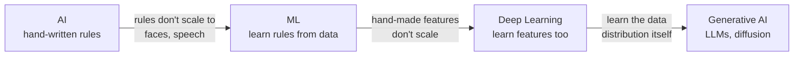
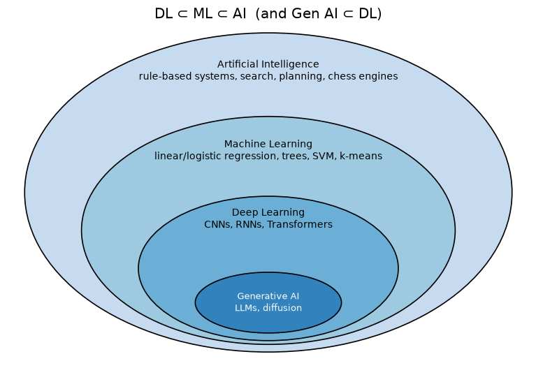
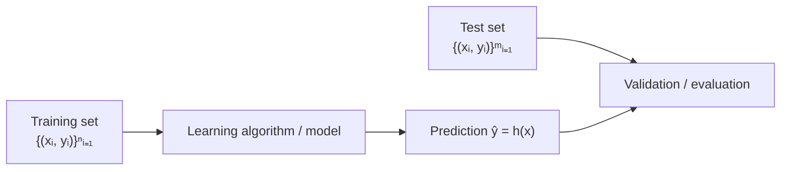

# 01 · Foundations: AI, ML, DL & the Formal Learning Setup

> **Course:** Introduction to Generative AI · M.Tech Sem 1
> **Deck:** `Intro_to_GenAI.pdf` ("Introduction to AI, ML and DL"), slides 1–17
> **Status:** 📄 Written from the **slides only** (no transcript yet). Send the transcript and I'll add a "Professor emphasised" section and class Q&A.
> **Notebook:** [`code/neural_networks_from_scratch.ipynb`](code/neural_networks_from_scratch.ipynb), Part A
> **Overlap:** the paradigms are covered in depth in [MLP Note 01](../../Machine-Learning-Paradigms/Notes/01-Introduction-to-ML-Paradigms.md). This note focuses on what's **new** here: the formal maths of learning, and why deep learning (and therefore Gen AI) exists.

---

## 📌 Table of Contents

1. [Big Picture: The Road to Generative AI](#1-big-picture-the-road-to-generative-ai)
2. [What is AI? The "Easy is Hard" Problem](#2-what-is-ai-the-easy-is-hard-problem-)
3. [What is ML? Mitchell's E–T–P Definition](#3-what-is-ml-mitchells-etp-definition-)
4. [What is Deep Learning?](#4-what-is-deep-learning-)
5. [AI ⊃ ML ⊃ DL ⊃ Gen AI](#5-ai--ml--dl--gen-ai-)
6. [The Three Paradigms (recap)](#6-the-three-paradigms-recap-)
7. [Supervised Learning: The Formal Setup](#7-supervised-learning-the-formal-setup-)
8. [Loss Functions & Learning as Optimisation](#8-loss-functions--learning-as-optimisation-)
9. [Generalisation: Why We Need a Test Set](#9-generalisation-why-we-need-a-test-set-)
10. [Unsupervised & Reinforcement Learning](#10-unsupervised--reinforcement-learning-)
11. [Bridge to Gen AI: Discriminative vs Generative Models](#11--bridge-to-gen-ai-discriminative-vs-generative-models)
12. [Common Confusions](#12--common-confusions)
13. [Exam / Interview Questions](#13--exam--interview-questions)
14. [Cheat Sheet](#14--cheat-sheet)
15. [Go Deeper](#15--go-deeper-curated-links)

---

## 1. Big Picture: The Road to Generative AI

This course ends with LLMs and image generators. The first lecture builds the ladder to get there:



Each step removes one more thing humans had to hand-craft: first the **rules**, then the **features**, and finally the model learns to **create data itself**.

---

## 2. What is AI? The "Easy is Hard" Problem 🟢

> **Artificial Intelligence** is the field concerned with building machines that can perform tasks that normally require **human intelligence**.

**The surprising history (slide 2):**

| Early AI was **good** at… | Early AI **struggled** with… |
|---|---|
| Problems with clearly defined rules | Tasks humans do **effortlessly and intuitively** |
| Solving maths problems, proving theorems | Recognising a face in an image |
| Playing chess (Deep Blue beat Kasparov in 1997) | Understanding spoken language |

This is **Moravec's paradox** (beyond slides): what's hard for humans (chess, calculus) is easy for computers, and what's easy for a 3-year-old (seeing, hearing, walking) is extremely hard to program. The reason is that we **can't write down the rules** for recognising a face. We do it unconsciously.

> 💡 **The key question (slide 2):** *"Instead of explicitly programming rules for every situation, can a machine **learn** the required behaviour **from data**?"* That question is the birth of ML.

---

## 3. What is ML? Mitchell's E–T–P Definition 🟢

> *"A computer program is said to learn from **experience E** with respect to some class of **tasks T** and **performance measure P**, if its performance at tasks in T, as measured by P, improves with experience E."* (Tom Mitchell, 1997)

**A learning problem = Experience (E) + Task (T) + Performance (P).** Always identify all three:

| Problem | E (experience) | T (task) | P (performance) |
|---|---|---|---|
| Email spam filtering | Labelled emails | Classify spam / not spam | Accuracy, precision, recall |
| House-price prediction | Past houses with prices | Predict price | Mean squared error |
| Medical-image diagnosis | Labelled medical images | Detect disease | Sensitivity, specificity, accuracy |
| Robot navigation | Sensor observations + interaction | Reach destination safely | Success rate / reward |

**More examples to practise on:**

| Problem | E | T | P |
|---|---|---|---|
| ChatGPT pre-training | Trillions of words of text | Predict the next token | Perplexity / cross-entropy |
| Netflix recommendations | Watch history | Rank movies for a user | Click-through, watch time |
| AlphaGo | Self-play games | Choose Go moves | Win rate |

**How ML works (slide 4):** `Data → Learn patterns → Make predictions/decisions`. AI systems need to *acquire their own knowledge by extracting patterns from raw data*.

> ⚠️ **Choosing P is a design decision with consequences.** For disease detection, **sensitivity (recall)** matters more than accuracy: missing a cancer (false negative) is far worse than a false alarm. (See confusion-matrix metrics in MLP Note 02.)

---

## 4. What is Deep Learning? 🟢

> **Deep Learning** is a branch of ML that uses **multi-layered neural networks** to automatically learn complex patterns and **representations** from data.

Key points (slide 5):

- "**Deep**" = **many layers** in the neural network.
- It builds **complex concepts out of simpler concepts** (hierarchical).
- **No manual feature design**: it learns useful features automatically from **raw data**.
- It needs **large amounts of data** (and compute).

### The hierarchy of features (the core intuition)
For a face-recognition network:
```
pixels → edges → corners/textures → eyes, nose, mouth → whole face → identity
 layer 0   layer 1       layer 2            layer 3          layer 4     output
```
Each layer combines the previous layer's simple features into more abstract ones. Nobody told the network what an "eye" is. It discovered that eye-detectors are useful for the task.

### Classical ML vs Deep Learning

| | Classical ML | Deep Learning |
|---|---|---|
| Features | **Hand-engineered** by domain experts | **Learned** from raw data |
| Data needed | Hundreds to thousands | Thousands to billions |
| Compute | CPU is fine | GPUs/TPUs |
| Interpretability | Higher | Lower ("black box") |
| Best for | Tabular data, small data | Images, audio, text, video |
| Example | Word/noun/verb counts + logistic regression (MLP Note 02 demo) | Text → embedding → Transformer |

### Applications (slide 6)

| Domain | Examples |
|---|---|
| Computer vision | Image classification, object detection, face recognition |
| Speech | Voice assistants, speech-to-text |
| Healthcare | Medical image analysis, disease prediction, drug discovery (AlphaFold) |
| Autonomous vehicles | Object/lane detection, driving decisions |
| Recommendations | Movies, music, products |
| Fraud detection | Unusual patterns in financial transactions |

---

## 5. AI ⊃ ML ⊃ DL ⊃ Gen AI 🟢



$$
\text{Deep Learning} \subset \text{Machine Learning} \subset \text{Artificial Intelligence}
$$

| Layer | Example that belongs **only** here |
|---|---|
| AI but not ML | Rule-based expert systems, A* search, classic chess engines |
| ML but not DL | Linear regression, decision trees, random forests, SVM, k-means |
| DL but not Gen AI | ResNet image classifier, a sentiment BERT classifier |
| **Generative AI** | GPT/ChatGPT, Stable Diffusion, DALL·E, Sora, MusicGen |

---

## 6. The Three Paradigms (recap) 🟢

| Paradigm | Goal | Sub-types / examples |
|---|---|---|
| **Supervised** | Learn a mapping input → output | **Classification** (categorical output), **Regression** (continuous output) |
| **Unsupervised** | Discover patterns; no output label | Clustering, dimensionality reduction |
| **Reinforcement** | Agent acts in an environment and receives rewards/penalties; maximise **cumulative reward** | Games, robotics |

**Example (slide 10): will a person buy a laptop?** The features are age, income, student status and purchase history; the label is *Buy / Not Buy*. The slide's plot shows the classes separated by a **curvy, non-linear boundary** (with a small loop around an outlier). That foreshadows why we need flexible models like neural networks, and also the risk of **over-fitting** to single odd points.

➡️ Full treatment, with semi-/self-supervised learning and the ChatGPT paradigm stack: [MLP Note 01 §9](../../Machine-Learning-Paradigms/Notes/01-Introduction-to-ML-Paradigms.md).

---

## 7. Supervised Learning: The Formal Setup 🟡

This is the mathematical language the rest of the course (and research papers) will use. **Learn this notation.**

### The ingredients
$$
\mathcal D = \{(\mathbf x_1, y_1), \dots, (\mathbf x_n, y_n)\} \subseteq \mathbb R^d \times \mathcal Y
$$

| Symbol | Name | Meaning |
|---|---|---|
| $\mathcal D$ | Training data | $n$ labelled examples |
| $\mathbf x_i \in \mathbb R^d$ | Input / feature vector | The $i$-th sample, with $d$ features |
| $\mathbb R^d$ | **Feature space** | The vector space where inputs live (cf. Applied Math Note 03!) |
| $y_i \in \mathcal Y$ | Label | Target for the $i$-th sample |
| $\mathcal Y$ | **Label space** | The set of possible outputs |
| $P(X, Y)$ | Data distribution | **Unknown** process that generates the data |
| $h$ | Hypothesis / model | A function $h: \mathbb R^d \to \mathcal Y$ |
| $\mathcal H$ | Hypothesis class | The set of functions we search over (e.g. all lines, all neural nets of a given shape) |

**The crucial assumption:** data points are drawn **i.i.d.** (independently, identically distributed) from some **unknown** distribution $P(X, Y)$. Training and test data come from the **same** distribution. (When this breaks, you get **data drift**: MLP Note 01 §12.)

**The goal:** find $h$ such that for a **new** pair $(\mathbf x, y) \sim P$, we have $h(\mathbf x) = y$ with high probability (classification) or $h(\mathbf x) \approx y$ (regression).

### Label spaces

| Problem | $\mathcal Y$ | Example |
|---|---|---|
| Binary classification | $\{0, 1\}$ or $\{-1, +1\}$ | Spam (+1) vs not spam (−1) |
| Multi-class classification | $\{1, 2, \dots, K\}$, $K \ge 2$ | Digit 0–9 ($K = 10$), cat/dog/horse |
| Regression | $\mathbb R$ | Temperature, height, house price |
| *(beyond slides)* Multi-label | $\{0,1\}^K$ | Movie genres (action **and** comedy) |
| *(beyond slides)* Structured / generative | Sequences, images | Translation, **text generation** ← Gen AI |

> 💡 $\{0,1\}$ vs $\{-1,+1\}$ is a convenience choice. $\{0,1\}$ pairs naturally with probabilities and sigmoid; $\{-1,+1\}$ pairs naturally with SVMs and perceptrons ($y\cdot h(x) > 0$ means correct).

### The basic pipeline (slide 11)


---

## 8. Loss Functions & Learning as Optimisation 🟡

> A **loss function** evaluates a hypothesis $h \in \mathcal H$ on the training data and tells us **how bad it is**. Higher loss means worse; **zero loss means perfect predictions** (on that data).

### Squared loss (slide 13)
$$
L_{sq}(h) = \frac1n\sum_{i=1}^n \big(h(\mathbf x_i) - y_i\big)^2
$$
Two effects of squaring:

1. The loss is **always non-negative**.
2. The loss **grows quadratically** with the size of the mistake: big errors are punished much more.

### Learning = minimisation
$$
\boxed{h^* = \arg\min_{h\in\mathcal H} L(h)}
$$
This is called **Empirical Risk Minimisation (ERM)**: "empirical" because we average over the training sample, not the true distribution. Notebook Part A tries 4 hypotheses on data from $y = 3x + 2 + \text{noise}$. The one with the lowest $L_{sq}$ is $h(x) = 3x + 2$ ✓.

### Other common losses (beyond slides)

| Loss | Formula | Used for | Note |
|---|---|---|---|
| Squared | $(h(x)-y)^2$ | Regression | Sensitive to outliers |
| Absolute | $\lvert h(x)-y\rvert$ | Robust regression | Less outlier-sensitive |
| **0/1 loss** | $\mathbb 1[h(x) \ne y]$ | Classification error rate | Not differentiable → can't use gradient descent |
| **Cross-entropy (log loss)** | $-[y\log\hat p + (1-y)\log(1-\hat p)]$ | Classification | Differentiable surrogate for 0/1; **used to train every LLM** |

> 🔗 The regression notes ([MLP Note 03](../../Machine-Learning-Paradigms/Notes/03-Supervised-Learning-Regression.md)) show how to actually *do* the arg min: closed form (OLS) or **gradient descent**. Neural networks always use gradient descent.

---

## 9. Generalisation: Why We Need a Test Set 🟡

The slides end with the word **"Generalization"**. It's the whole point:

> **Zero training loss is easy. Just memorise.** A lookup table that returns $y_i$ for each $\mathbf x_i$ has $L = 0$ but is useless on new data.

What we really want is low loss on **unseen** data from $P$:
$$
\underbrace{\mathbb E_{(\mathbf x,y)\sim P}\big[\ell(h(\mathbf x), y)\big]}_{\text{true risk (what we care about)}} \quad\text{vs}\quad \underbrace{\frac1n\sum_i \ell(h(\mathbf x_i), y_i)}_{\text{training loss (what we can compute)}}
$$
We estimate the true risk with a held-out **test set**, and tune choices on a **validation set**.

| | Training error | Test error | Diagnosis |
|---|---|---|---|
| Under-fitting | High | High | $\mathcal H$ too simple |
| Good fit | Low | Low | ✓ |
| Over-fitting | Very low | High | Memorised noise; $\mathcal H$ too flexible or data too small |

The laptop-buyer plot (slide 10) shows a boundary that loops around a single red point. That's a hint of over-fitting.

---

## 10. Unsupervised & Reinforcement Learning 🟢

### Unsupervised (slides 14–15)

- The learner receives **only unlabelled** data: no $y$.
- It discovers **patterns/structure**, and can then make predictions or identify structure for unseen points.
- **Hard to evaluate quantitatively** (no ground truth).
- Common problems: **clustering** and **dimensionality reduction**.
- Applications: customer segmentation, image segmentation, document clustering, anomaly detection, data visualisation.

### Reinforcement (slides 16–17)
**How did you learn to ride a bicycle?** Not supervised (nobody labelled the "correct" muscle movement each millisecond), not unsupervised: **trial and error**. Falling or wobbling is **negative feedback**; balancing and moving forward is **positive feedback**.

- An **agent** interacts with an **environment** by taking **actions**.
- After each action it gets a **reward or penalty**.
- It learns a **policy** (which action to take in which **state**).
- Goal: **maximise cumulative reward over time**.
- Applications: robotics, self-driving (brake / accelerate / change lanes), game playing (AlphaGo, Atari).

> 🔗 RL is central to Gen AI: **RLHF** (reinforcement learning from human feedback) turned GPT into ChatGPT. More in MLP Note 01 §9.8.

---

## 11. 🔴 Bridge to Gen AI: Discriminative vs Generative Models

*(Beyond these slides: the concept this course is named after.)*

Everything above **predicts $y$ from $\mathbf x$**. A **generative** model instead learns the **distribution of the data itself**, so it can **create new samples**.

| | Discriminative | Generative |
|---|---|---|
| Learns | $P(Y \mid X)$ (or $h: X \to Y$) | $P(X)$ or $P(X, Y)$ |
| Question answered | "Is this email spam?" | "What does a typical email look like? Write one." |
| Examples | Logistic regression, ResNet classifier, BERT classifier | Naive Bayes, GMMs, VAEs, GANs, **GPT**, **diffusion models** |
| Output | A label / number | **New data**: text, images, audio |

**How an LLM fits the supervised setup:** GPT is trained with **self-supervised** learning. For every position in a text, $\mathbf x$ = the previous tokens and $y$ = the next token, with $\mathcal Y$ = the vocabulary (~50k–200k tokens). It's multi-class classification with **softmax + cross-entropy** ([Note 02](02-Neural-Networks-Fundamentals.md)). It becomes *generative* by **sampling** a token, appending it, and repeating:
$$
P(\text{text}) = \prod_t P(\text{token}_t \mid \text{token}_1, \dots, \text{token}_{t-1})
$$

---

## 12. ⚠️ Common Confusions

| Confusion | Clarification |
|---|---|
| AI = ML | ML is one approach to AI; rule-based systems are AI without ML |
| Deep learning = any neural network | "Deep" = **many** layers; a 1-hidden-layer net is "shallow" |
| Zero training loss = perfect model | Could be memorisation; check test loss |
| Loss = metric | Loss is optimised (needs to be differentiable); the metric is what you report (accuracy, F1) |
| $\{-1,+1\}$ vs $\{0,1\}$ labels matter | Just encodings; pick what suits the loss/model |
| Gen AI is separate from ML | It's deep learning applied to modelling $P(X)$; same foundations |
| Unsupervised = no evaluation possible | It's hard but not impossible: internal metrics (silhouette), downstream tasks |

---

## 13. 📝 Exam / Interview Questions

<details>
<summary><b>Q1.</b> Define ML (Mitchell) and identify E, T, P for a self-driving car's pedestrian detector.</summary>

E: labelled camera frames (pedestrian bounding boxes); T: detect pedestrians in frames; P: recall (missing a pedestrian is critical), precision, mAP.
</details>

<details>
<summary><b>Q2.</b> Why could early AI play chess but not recognise faces?</summary>

Chess has explicit, formal rules that can be coded and searched. Face recognition relies on implicit perceptual knowledge humans can't articulate as rules, so it must be **learned from data** (Moravec's paradox).
</details>

<details>
<summary><b>Q3.</b> Write the formal supervised learning setup. What assumption links training and test data?</summary>

$\mathcal D = \{(\mathbf x_i, y_i)\}_{i=1}^n \subseteq \mathbb R^d\times\mathcal Y$, drawn i.i.d. from an unknown $P(X,Y)$; find $h\in\mathcal H$ minimising loss so that $h(\mathbf x)\approx y$ for new $(\mathbf x,y)\sim P$. The assumption: train and test come from the **same** distribution (i.i.d.).
</details>

<details>
<summary><b>Q4.</b> Give the label space for: (a) sentiment pos/neg, (b) MNIST, (c) rainfall in mm, (d) next-word prediction.</summary>

(a) $\{0,1\}$; (b) $\{0,\dots,9\}$; (c) $\mathbb R_{\ge 0}$; (d) the vocabulary $\{1,\dots,V\}$, multi-class with $V$ classes.
</details>

<details>
<summary><b>Q5.</b> Two effects of squaring in the squared loss? A disadvantage?</summary>

Non-negative; grows quadratically, so large errors are penalised heavily. Disadvantage: very sensitive to **outliers**.
</details>

<details>
<summary><b>Q6.</b> A model has training loss 0 and test accuracy 52% on a balanced binary task. Diagnose.</summary>

Severe **over-fitting / memorisation**: near-chance test performance. Fix: more data, simpler $\mathcal H$, regularisation, early stopping, data augmentation.
</details>

<details>
<summary><b>Q7.</b> Discriminative vs generative model: one example each, and what each models.</summary>

Discriminative: logistic regression models $P(y\mid x)$. Generative: GPT models $P(x)$ (text) autoregressively; diffusion models $P(\text{image})$.
</details>

<details>
<summary><b>Q8.</b> Classify learning to ride a bicycle into a paradigm and justify.</summary>

Reinforcement learning: no labelled correct actions; learning by trial and error with feedback (falling = penalty, balance = reward) to maximise long-term reward.
</details>

---

## 14. 🧾 Cheat Sheet

- **AI** = machines doing tasks needing human intelligence. Early AI: rules (chess ✓, faces ✗).
- **ML** = learn from data: **E + T + P** (Mitchell).
- **DL** = multi-layer neural networks; **learns features**; hierarchical; data and compute hungry.
- **DL ⊂ ML ⊂ AI**; Gen AI ⊂ DL.
- Supervised: $\mathcal D \subseteq \mathbb R^d\times\mathcal Y$ i.i.d. from unknown $P(X,Y)$; find $h\in\mathcal H$.
- $\mathcal Y$: $\{0,1\}$/$\{-1,+1\}$ (binary), $\{1..K\}$ (multi-class), $\mathbb R$ (regression).
- Squared loss $\frac1n\sum(h(\mathbf x_i)-y_i)^2$; learning = $\arg\min_{h\in\mathcal H}L(h)$ (ERM).
- **Generalisation** is the real goal → evaluate on held-out test data.
- Unsupervised: patterns without labels (clustering, dim. reduction). RL: agent, environment, reward, policy.
- Generative models learn $P(X)$ and can **sample new data**.

---

## 15. 📚 Go Deeper: Curated Links

| Topic | Why | Link |
|---|---|---|
| Formal ML setup | The source of the $\mathcal D$, $\mathcal H$, label-space notation in these slides | [Cornell CS4780 (Kilian Weinberger) — Lecture note 1: ML setup](https://www.cs.cornell.edu/courses/cs4780/2018fa/lectures/lecturenote01_MLsetup.html) |
| Gentle visual ML intro | Train/test, fitting, over-fitting | [StatQuest — A Gentle Introduction to Machine Learning](https://www.youtube.com/watch?v=Gv9_4yMHFhI) |
| Deep learning textbook | Ch. 1 (history, representation learning), Ch. 5 (ML basics) | [Goodfellow, Bengio & Courville — Deep Learning (free)](https://www.deeplearningbook.org/) |
| Interactive DL textbook | Code in every chapter (PyTorch) | [Dive into Deep Learning (d2l.ai)](https://d2l.ai/) |
| Indian DL course (NPTEL) | Matches the notation used in this deck's NN slides | [NPTEL — Deep Learning (Prof. Mitesh Khapra, IIT Madras)](https://nptel.ac.in/courses/106106201) |
| Bias–variance / generalisation | Over-fitting intuition | [StatQuest — Bias and Variance](https://www.youtube.com/watch?v=EuBBz3bI-aA) |
| RL foundations | Bicycle → policies, rewards | [David Silver RL Course — Lecture 1](https://www.youtube.com/watch?v=2pWv7GOvuf0) |
| Where this course is heading | LLMs end-to-end in 1 hour | [Karpathy — Intro to Large Language Models](https://www.youtube.com/watch?v=zjkBMFhNj_g) |

---
[Gen AI Index](README.md) · ➡️ [02 · Neural Networks Fundamentals](02-Neural-Networks-Fundamentals.md)
