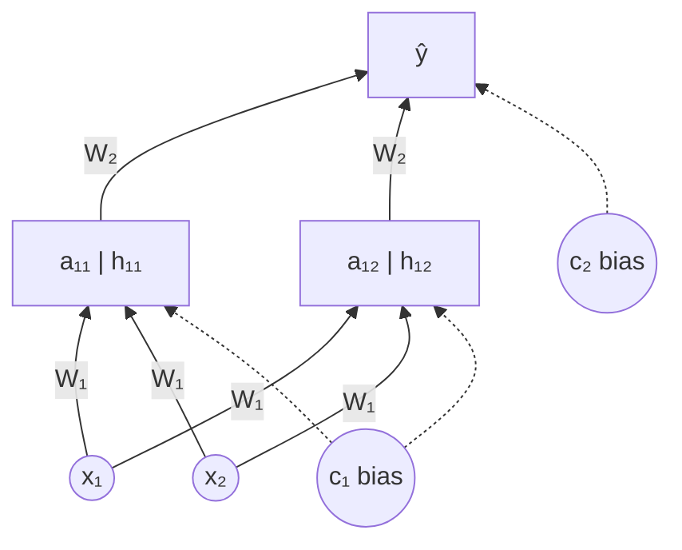
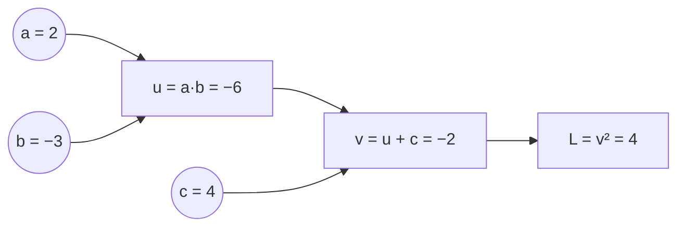
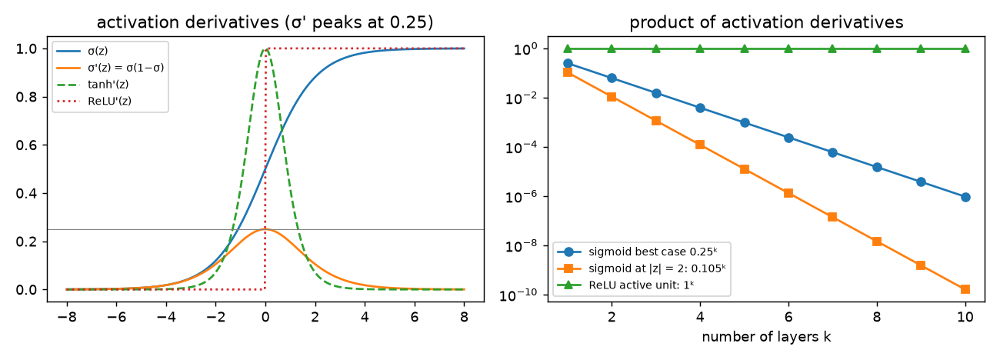
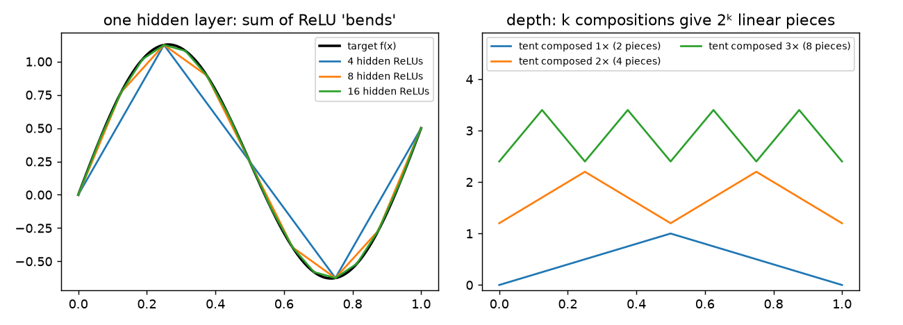
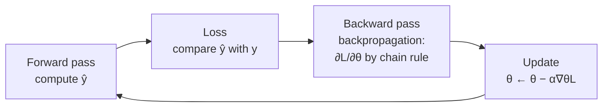
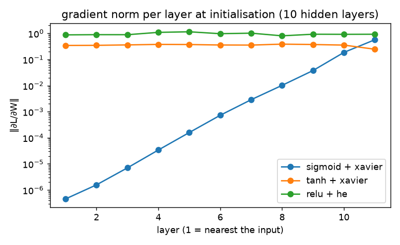
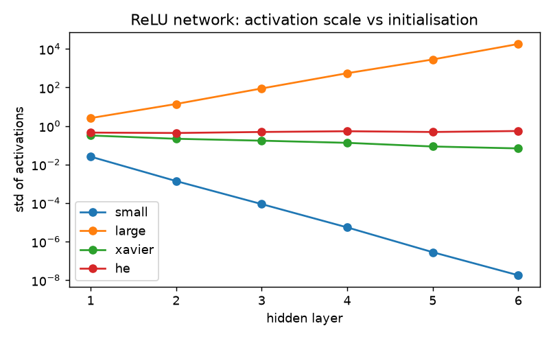

# 02 · Neural Networks: Why, What & How They Compute

> **Course:** Introduction to Generative AI · M.Tech Sem 1
>
> **Deck:** `Intro_to_GenAI.pdf`, slides 18–26
>
> **Status:** Based on the slides. Class discussion will be added after the lecture.
>
> **Notebooks:**
>
> - [`code/neural_networks_from_scratch.ipynb`](code/neural_networks_from_scratch.ipynb), Parts B–G: forward pass by hand, XOR, **a network trained from scratch with backprop**, parameter counting
> - [`code/02_neural_networks_deep_dive.ipynb`](code/02_neural_networks_deep_dive.ipynb), Parts A–J: a NumPy MLP with mini-batches on handwritten digits (96.9% test accuracy), gradient checking, activation comparison, vanishing gradients measured, initialisation experiment, `make_moons` decision boundary, universal approximation and depth, and every number quoted in this note
>
> **Figures:** extra figures for this note are produced by [`code/figures_02.py`](code/figures_02.py)

---

## 📌 Table of Contents

1. [Big Picture](#1-big-picture)
2. [Why Neural Networks? The Limits of Linear Models](#2-why-neural-networks-the-limits-of-linear-models-)
3. [The XOR Problem](#3-the-xor-problem-)
4. [Anatomy of a Neural Network](#4-anatomy-of-a-neural-network-)
5. [A Network is a Composition of Functions](#5-a-network-is-a-composition-of-functions-)
6. [The Forward Pass: How f(x; θ) is Computed](#6-the-forward-pass-how-fx-θ-is-computed-)
7. [Activation Functions](#7-activation-functions-)
8. [Why Non-linearity is Essential](#8-why-non-linearity-is-essential-)
9. [Output Units: Linear, Sigmoid, Softmax](#9-output-units-linear-sigmoid-softmax-)
10. [Feed-Forward Networks: Shapes & Parameter Count](#10-feed-forward-networks-shapes--parameter-count-)
11. [How the Parameters are Learned: Backpropagation](#11-how-the-parameters-are-learned-backpropagation-)
12. [Vanishing & Exploding Gradients](#12-vanishing--exploding-gradients-)
13. [Weight Initialisation: Xavier & He](#13-weight-initialisation-xavier--he-)
14. [Code Walkthrough: the Deep-Dive Notebook](#14--code-walkthrough-the-deep-dive-notebook)
15. [Real-World Case Studies](#15--real-world-case-studies)
16. [From MLPs to Transformers & LLMs](#16--from-mlps-to-transformers--llms)
17. [Common Confusions](#17--common-confusions)
18. [Exam / Interview Questions & Practice Problems](#18--exam--interview-questions--practice-problems)
19. [Cheat Sheet](#19--cheat-sheet)
20. [Go Deeper](#20--go-deeper-curated-links)

---

## 1. Big Picture

Supervised learning wants $`y \approx f(\mathbf{x})`$. Linear models can only draw **straight lines/planes**. Real problems (faces, speech, language) need **curvy, complicated** functions. A **neural network** is a flexible function built by **stacking simple layers**:

```math
\text{layer} = \text{linear map } (W\mathbf{x} + \mathbf{b}) \;\to\; \text{non-linear squash } g(\cdot)
```

Stack enough of them and you can approximate essentially any function. Every model in this course (CNNs, Transformers, GPT, diffusion) is built from this unit.

The lecture (slides 18–26) answers three questions, and this note adds the fourth that the slides only preview:

| Question | Answer in one line | Section |
|---|---|---|
| **Why** do we need neural networks? | Linear models cannot represent non-linear relationships such as XOR | 2–3 |
| **What** is a neural network? | A composition of layers $`\mathbf{h} = g(W\mathbf{x} + \mathbf{b})`$ with learnable $`\theta`$ | 4–5, 10 |
| **How** does it compute $`f(\mathbf{x};\theta)`$? | Forward pass: pre-activation, activation, output unit | 6–9 |
| **How** does it learn $`\theta`$? *(beyond slides)* | Backpropagation (chain rule) + gradient descent, made stable by good activations and initialisation | 11–13 |

---

## 2. Why Neural Networks? The Limits of Linear Models 🟢

**Setup (slide 18):** given $`\{(\mathbf{x}_i, y_i)\}_{i=1}^N`$, learn $`y \approx f(\mathbf{x})`$. *But what if the relationship between $`\mathbf{x}`$ and $`y`$ is complex and cannot be represented by a simple linear model?*

**Definition (slide 19):** Neural networks are ML models **inspired by how the brain processes information**. They consist of **interconnected neurons arranged in layers** that learn patterns from data.

**The need:**

- Linear models learn only **linear relationships** and can't capture **complex interactions** between inputs.
- Many real-world problems are **non-linear**.
- Neural networks use **multiple layers + non-linear transformations** to learn them.
- So they offer a **flexible way to learn complex functions from large datasets**.

> **Goal:** learn a flexible function mapping input $`\mathbf{x}`$ to output $`\hat{y}`$.

**Real-world non-linearities:**

| Problem | Why linear fails |
|---|---|
| House price | Price vs area isn't a straight line; location *interacts* with size |
| Medical risk | Risk explodes when two factors co-occur (smoking **and** age) |
| Image: "is there a cat?" | Shifting the cat 10 pixels changes every pixel value |
| Language | "not bad" ≈ good: words interact |

> 🧠 *Brain analogy, with care:* biological neurons inspired the design (inputs → weighted → fire if above threshold), but modern networks are **mathematical function approximators**, not brain simulations.

### 2.1 What "linear model" means precisely

A linear model computes a score $`s(\mathbf{x}) = \mathbf{w}^\top\mathbf{x} + b`$. For classification it predicts class 1 when $`s(\mathbf{x}) > 0`$, so its decision boundary is the **hyperplane** $`\mathbf{w}^\top\mathbf{x} + b = 0`$. Logistic regression is still linear in this sense: $`\sigma(s)`$ is monotone, so $`\sigma(s) > 0.5 \iff s > 0`$, and the boundary is the same hyperplane. Two consequences follow directly from the definition:

1. **Additivity of effects.** Changing $`x_1`$ by $`\Delta`$ always changes the score by $`w_1\Delta`$, whatever the other features are. An *interaction* ("the effect of $`x_1`$ depends on $`x_2`$") is impossible.
2. **Convex class regions.** The set $`\{\mathbf{x}: s(\mathbf{x}) > 0\}`$ is a half-space, which is convex. Any class whose examples sit in two separate clumps with the other class in between (XOR, concentric rings, two moons) cannot be carved out.

**The classical fix and why it does not scale.** One can hand-craft features such as $`x_1x_2`$ or $`x_1^2`$ and keep a linear model on top (polynomial regression, kernel methods). For $`d`$ inputs, all degree-2 terms already number $`d(d+1)/2`$: for a 28×28 image, $`d = 784`$ gives 307,720 quadratic features, and nobody knows in advance which non-linear features matter. A neural network **learns the features** $`\mathbf{h} = g(W\mathbf{x} + \mathbf{b})`$ from data and then puts a linear model on top of them. That is the whole idea of representation learning.

---

## 3. The XOR Problem 🟢→🟡

| $`x_1`$ | $`x_2`$ | XOR |
|---|---|---|
| 0 | 0 | 0 |
| 0 | 1 | 1 |
| 1 | 0 | 1 |
| 1 | 1 | 0 |

**Slide 20:** *Can a single linear decision boundary correctly classify all four points?* **No.** XOR is a **non-linear** classification problem. That motivates non-linear models.


**Proof that no line works:** suppose $`w_1x_1 + w_2x_2 + b > 0`$ means "1". Then

- $`(0,0)\to0`$: $`b \le 0`$
- $`(0,1)\to1`$: $`w_2 + b > 0`$
- $`(1,0)\to1`$: $`w_1 + b > 0`$
- $`(1,1)\to0`$: $`w_1 + w_2 + b \le 0`$

Adding the middle two: $`w_1 + w_2 + 2b > 0`$, so $`w_1 + w_2 + b > -b \ge 0`$, which contradicts the last line. ∎ (The notebook brute-forces 68,921 lines: the best gets **3/4**.)

**A second proof (convexity).** The midpoint of the two class-1 points $`(0,1)`$ and $`(1,0)`$ is $`(0.5, 0.5)`$, which is also the midpoint of the two class-0 points $`(0,0)`$ and $`(1,1)`$. A half-space is convex, so if it contains both class-1 points it contains $`(0.5,0.5)`$; its complement is also convex (a closed half-space), so it would contain $`(0.5,0.5)`$ too. A point cannot be on both sides. ∎ This argument generalises: whenever the convex hulls of the two classes intersect, no hyperplane separates them.

### 🔴 Solving XOR with one hidden layer (2–2–1 network)
Decompose: **XOR = OR AND (NOT AND)**.

- Hidden neuron $`h_1`$ = **OR**: $`\text{step}(x_1 + x_2 - 0.5)`$
- Hidden neuron $`h_2`$ = **AND**: $`\text{step}(x_1 + x_2 - 1.5)`$
- Output = $`\text{step}(h_1 - h_2 - 0.5)`$

| $`(x_1,x_2)`$ | $`h_1`$ (OR) | $`h_2`$ (AND) | $`\hat{y}`$ |
|---|---|---|---|
| (0,0) | 0 | 0 | 0 ✓ |
| (0,1) | 1 | 0 | 1 ✓ |
| (1,0) | 1 | 0 | 1 ✓ |
| (1,1) | 1 | 1 | 0 ✓ |

In matrix form (column convention, $`W`$ is out × in) the same network is

```math
W_1 = \begin{bmatrix}1 & 1\\ 1 & 1\end{bmatrix},\quad
\mathbf{b}_1 = \begin{bmatrix}-0.5\\ -1.5\end{bmatrix},\quad
W_2 = \begin{bmatrix}1 & -1\end{bmatrix},\quad
b_2 = -0.5,\qquad
\hat{y} = \text{step}\big(W_2\,\text{step}(W_1\mathbf{x} + \mathbf{b}_1) + b_2\big)
```

> 💡 **The big insight:** the hidden layer **changes the representation**. In the original $`(x_1, x_2)`$ space XOR isn't separable. In the hidden $`(h_1, h_2)`$ space the points become $`(0,0), (1,0), (1,0), (1,1)`$, and **one line separates them**. *Deep learning = learning representations in which the problem becomes easy.*

### ✍️ Worked example: XOR with ReLU instead of step (Goodfellow et al., Ch. 6)
Step functions have zero derivative almost everywhere, so they cannot be trained by gradient descent. The textbook solution uses ReLU:

```math
W_1 = \begin{bmatrix}1 & 1\\ 1 & 1\end{bmatrix},\quad
\mathbf{c} = \begin{bmatrix}0\\ -1\end{bmatrix},\quad
\mathbf{w} = \begin{bmatrix}1\\ -2\end{bmatrix},\quad b = 0,\qquad
\hat{y} = \mathbf{w}^\top\,\text{ReLU}(W_1\mathbf{x} + \mathbf{c}) + b
```

| $`\mathbf{x}`$ | $`W_1\mathbf{x} + \mathbf{c}`$ | $`\mathbf{h} = \text{ReLU}(\cdot)`$ | $`\hat{y} = h_1 - 2h_2`$ |
|---|---|---|---|
| (0,0) | (0, −1) | (0, 0) | 0 ✓ |
| (0,1) | (1, 0) | (1, 0) | 1 ✓ |
| (1,0) | (1, 0) | (1, 0) | 1 ✓ |
| (1,1) | (2, 1) | (2, 1) | 2 − 2 = 0 ✓ |

**Sanity check:** the two middle inputs map to the *same* hidden point $`(1,0)`$; the hidden layer has merged the two class-1 points, which is exactly what makes the output linear layer sufficient.

History: Minsky & Papert (1969) showed single-layer perceptrons can't learn XOR, contributing to the first "AI winter". Multi-layer networks trained with **backpropagation** (Rumelhart, Hinton & Williams, 1986) solved it.

---

## 4. Anatomy of a Neural Network 🟢

From slide 21's diagram (2 inputs → 2 hidden → 1 output):



| Term | Meaning |
|---|---|
| **Neuron** | Computes weighted sum + bias, then applies an activation |
| **Layer** | A group of neurons at the same depth; each connects to neurons of the previous layer |
| **Input layer** | Just holds $`\mathbf{x}`$ (no computation) |
| **Hidden layer** | Intermediate representations, not directly observed |
| **Output layer** | Produces $`\hat{y}`$ |
| **Weights** $`W`$ | Strength of each connection |
| **Biases** $`\mathbf{c}`$ (or $`\mathbf{b}`$) | Shift each neuron's threshold |
| **Parameters** $`\theta`$ | **All** weights and biases: what's learned |
| $`a`$ (pre-activation) | Weighted sum + bias, **before** the non-linearity |
| $`h`$ (activation) | Output **after** the non-linearity, $`h = g(a)`$ |
| **Hyper-parameters** *(beyond slides)* | Choices made before training: number of layers, widths, activation, learning rate, batch size. Not learned by gradient descent |

Each neuron in the diagram is drawn split into $`a`$ (bottom) and $`h`$ (top): first compute $`a`$, then squash it to $`h`$.

**What a single neuron does geometrically.** The pre-activation $`a = \mathbf{w}^\top\mathbf{x} + c`$ is (up to the scale $`\lVert\mathbf{w}\rVert`$) the signed distance from $`\mathbf{x}`$ to the hyperplane $`\mathbf{w}^\top\mathbf{x} + c = 0`$. The bias shifts the hyperplane away from the origin; without it every neuron's boundary would pass through $`\mathbf{0}`$. The activation then turns this distance into a "how strongly is this feature present" value: a soft yes/no for sigmoid, a one-sided ramp for ReLU. A hidden layer of $`m`$ neurons therefore cuts input space with $`m`$ hyperplanes, and the next layer combines the resulting regions.

---

## 5. A Network is a Composition of Functions 🟢

**Slide 21:**

- In supervised learning there is a true (unknown) function $`y = f^*(\mathbf{x})`$.
- The network learns an **approximation** $`y \approx f(\mathbf{x};\theta)`$, where $`\theta`$ = weights and biases.
- A deep network builds $`f`$ by **composing** layers:

```math
f(\mathbf{x}) = f^{(3)}\Big(f^{(2)}\big(f^{(1)}(\mathbf{x})\big)\Big)
```

> 🎯 **Key sentence (slide 21):** *"A neural network does not directly learn $`f^*`$. It learns the parameters $`\theta`$ so that $`f(\mathbf{x};\theta)`$ approximates $`f^*(\mathbf{x})`$."*

**Slide 22, layer by layer:**

```math
\begin{aligned}
\mathbf{h}_1 &= g(W_1\mathbf{x} + \mathbf{b}_1) && \text{Layer 1}\\
\mathbf{h}_2 &= g(W_2\mathbf{h}_1 + \mathbf{b}_2) && \text{Layer 2}\\
\hat{y} &= O(W_3\mathbf{h}_2 + \mathbf{b}_3) && \text{Output layer ($O$ = output activation)}
\end{aligned}
```

*"A deep neural network is a composition of simple functions."*

**Analogy: an assembly line.** Raw material ($`\mathbf{x}`$) passes through stations. Each station does one simple transformation; the final product emerges at the end. No station is smart, but the line as a whole builds a car.

### 5.1 🟡 Computational graphs *(beyond slides)*

Composition is what makes networks trainable. Write every elementary operation (multiply, add, activation, loss) as a node in a directed acyclic graph. The **forward pass** evaluates the graph from inputs to the loss and stores every intermediate value. The **backward pass** walks the graph in reverse and applies the **chain rule** at each node: a node $`v`$ that feeds into nodes $`u_1, \dots, u_m`$ receives

```math
\frac{\partial L}{\partial v} = \sum_{k=1}^{m} \frac{\partial L}{\partial u_k}\,\frac{\partial u_k}{\partial v}
```

(the sum handles a value used in several places, e.g. a weight shared across a batch). Each node only needs its **local derivative**; the "upstream gradient" $`\partial L / \partial u_k`$ arrives from the node after it.



### ✍️ Worked example: reverse mode on a tiny graph
$`L = (ab + c)^2`$ with $`a = 2,\ b = -3,\ c = 4`$.

**Forward:** $`u = ab = -6`$, $`v = u + c = -2`$, $`L = v^2 = 4`$.

**Backward** (local derivative × upstream):

| Node | Local derivative | Gradient |
|---|---|---|
| $`v`$ | $`\partial L/\partial v = 2v`$ | $`2(-2) = -4`$ |
| $`c`$ | $`\partial v/\partial c = 1`$ | $`-4 \times 1 = -4`$ |
| $`u`$ | $`\partial v/\partial u = 1`$ | $`-4`$ |
| $`a`$ | $`\partial u/\partial a = b = -3`$ | $`-4 \times -3 = 12`$ |
| $`b`$ | $`\partial u/\partial b = a = 2`$ | $`-4 \times 2 = -8`$ |

**Sanity check:** expand $`L = (ab+c)^2`$, so $`\partial L/\partial a = 2(ab+c)\,b = 2(-2)(-3) = 12`$ ✓.

**Why reverse mode?** A network has one scalar output (the loss) and millions of inputs (the parameters). Reverse mode obtains **all** $`P`$ partial derivatives in one backward sweep costing a small constant multiple (typically 2–3×) of a forward pass. Finite differences would need $`2P`$ forward passes: for the 109,386-parameter MNIST MLP of Section 10 that is 218,772 forward passes per gradient. This is the reason backpropagation, not numerical differentiation, made deep learning practical. PyTorch, JAX and TensorFlow all build this graph automatically ("autograd").

---

## 6. The Forward Pass: How f(x; θ) is Computed 🟡

**Slide 23**, for hidden neuron $`i`$ in layer $`l`$:

**Pre-activation** (weighted sum + bias):

```math
a_i^{l} = \sum_j W_{ij}\,x_j + c_i
```

**Activation:**

```math
h_i^{l} = g(a_i^{l})
```

**Output layer**, same pattern using the hidden activations as inputs:

```math
a_i^{(out)} = \sum_j W_{ij}^{(out)}h_j + c_i^{(out)}, \qquad \hat{y}_i = g_{out}\big(a_i^{(out)}\big)
```

**Matrix form** (how it's actually coded):

```math
\mathbf{a} = W\mathbf{x} + \mathbf{c}, \qquad \mathbf{h} = g(\mathbf{a})
```

Row $`i`$ of $`W`$ holds the weights **into** neuron $`i`$. So $`W`$ has shape (neurons in this layer) × (neurons in the previous layer).

> 📝 **Notation check:** slide 23 says "$`W_{ji}`$ is the weight connecting input $`j`$ to hidden neuron $`i`$" while the formula uses $`W_{ij}x_j`$. Read it as **$`W_{ij}`$ = weight from input $`j`$ to neuron $`i`$** (row = destination, column = source). That matches $`\mathbf{a} = W\mathbf{x}`$. Different textbooks use the transpose convention; always check.

> 🔗 **This is linear algebra from Applied Math!** $`W\mathbf{x}`$ is a **linear combination of the columns of $`W`$** weighted by the inputs (Applied Math Note 04). Each layer maps $`\mathbb{R}^{n_{in}}`$ to $`\mathbb{R}^{n_{out}}`$, and its rank and null space determine what information can pass through.

### ✍️ Worked example 1 (notebook Part C)
ReLU hidden layer, sigmoid output, with

```math
\mathbf{x} = \begin{bmatrix}1\\ 2\end{bmatrix},\quad
W_1 = \begin{bmatrix}0.5 & -1\\ 1.5 & 0.5\end{bmatrix},\quad
\mathbf{c}_1 = \begin{bmatrix}0\\ -1\end{bmatrix},\quad
W_2 = \begin{bmatrix}2 & -1\end{bmatrix},\quad
c_2 = 0.5
```

| Step | Computation | Result |
|---|---|---|
| $`a_{11}`$ | $`0.5(1) + (-1)(2) + 0`$ | −1.5 |
| $`a_{12}`$ | $`1.5(1) + 0.5(2) - 1`$ | 1.5 |
| $`\mathbf{h}_1 = \text{ReLU}(\mathbf{a}_1)`$ | $`\max(0,\cdot)`$ | (0, 1.5) |
| $`a_2`$ | $`2(0) + (-1)(1.5) + 0.5`$ | −1.0 |
| $`\hat{y} = \sigma(a_2)`$ | $`1/(1+e^{1})`$ | **0.2689** |

Interpretation: $`P(y = 1 \mid \mathbf{x}) \approx 27\%`$, so the prediction is class 0. Note that hidden neuron 1 is "off" (ReLU zeroed it). It contributes nothing for this input, and (Section 11) it will also receive **zero gradient** for this input.

### ✍️ Worked example 2: a sigmoid 2-2-1 network
All units sigmoid. This network is used again in Section 11.5 for the backward pass.

```math
\mathbf{x} = \begin{bmatrix}1\\ 0.5\end{bmatrix},\quad
W_1 = \begin{bmatrix}0.2 & -0.3\\ 0.4 & 0.1\end{bmatrix},\quad
\mathbf{b}_1 = \begin{bmatrix}0.1\\ -0.1\end{bmatrix},\quad
W_2 = \begin{bmatrix}0.5 & -0.4\end{bmatrix},\quad
b_2 = 0.2
```

| Step | Computation | Result |
|---|---|---|
| $`a_{1}`$ | $`0.2(1) - 0.3(0.5) + 0.1`$ | 0.15 |
| $`a_{2}`$ | $`0.4(1) + 0.1(0.5) - 0.1`$ | 0.35 |
| $`h_1 = \sigma(0.15)`$ | $`1/(1+e^{-0.15})`$ | 0.5374 |
| $`h_2 = \sigma(0.35)`$ | $`1/(1+e^{-0.35})`$ | 0.5866 |
| $`a_{out}`$ | $`0.5(0.5374) - 0.4(0.5866) + 0.2`$ | 0.2341 |
| $`\hat{y} = \sigma(0.2341)`$ | | **0.5583** |

**Sanity check:** all pre-activations are small, so every sigmoid output is close to 0.5, as expected for weights of size about 0.3.

### 6.1 Batched forward pass and shapes
In practice $`B`$ examples are processed at once. Stack them as **columns** of $`X \in \mathbb{R}^{n_0 \times B}`$:

```math
A_1 = W_1 X + \mathbf{b}_1\mathbf{1}^\top \in \mathbb{R}^{n_1\times B},\qquad H_1 = g(A_1),\qquad A_2 = W_2H_1 + \mathbf{b}_2\mathbf{1}^\top \in \mathbb{R}^{K\times B}
```

The term $`\mathbf{b}\mathbf{1}^\top`$ copies the bias to every column; NumPy does this automatically by **broadcasting**. One matrix product per layer replaces $`B`$ separate matrix-vector products, which is why GPUs (built for large matrix multiplications) made deep learning fast. Libraries such as PyTorch store examples as **rows** ($`X \in \mathbb{R}^{B\times n_0}`$, $`A = XW^\top + \mathbf{b}^\top`$); the mathematics is the transpose of the above.

---

## 7. Activation Functions 🟢→🟡


| Function | Formula | Range | Derivative | Used | Notes |
|---|---|---|---|---|---|
| **Sigmoid** | $`\sigma(z) = \dfrac{1}{1+e^{-z}}`$ | $`(0, 1)`$ | $`\sigma(1-\sigma)`$, max 0.25 | **Output layer for binary classification** | Smoothly turns a score into a probability-like value |
| **Tanh** | $`\dfrac{e^z - e^{-z}}{e^z + e^{-z}}`$ | $`(-1, 1)`$ | $`1 - \tanh^2`$, max 1 | Historically in hidden layers | **Zero-centred**; $`\tanh(z) = 2\sigma(2z) - 1`$ |
| **ReLU** | $`\max(0, z)`$ | $`[0, \infty)`$ | 1 if $`z>0`$, else 0 | **Default for hidden layers** | Cheap; no saturation for $`z > 0`$ |

### 7.1 🟡 Proofs of the derivative formulas

**Claim 1:** $`\sigma'(z) = \sigma(z)\big(1 - \sigma(z)\big)`$.

*Proof.* Write $`\sigma(z) = (1 + e^{-z})^{-1}`$ and use the chain rule:

```math
\sigma'(z) = -(1+e^{-z})^{-2}\cdot(-e^{-z}) = \frac{e^{-z}}{(1+e^{-z})^2} = \underbrace{\frac{1}{1+e^{-z}}}_{\sigma(z)}\cdot\underbrace{\frac{e^{-z}}{1+e^{-z}}}_{1-\sigma(z)}
```

The last factor equals $`1 - \sigma(z)`$ because $`1 - \frac{1}{1+e^{-z}} = \frac{e^{-z}}{1+e^{-z}}`$. ∎

**Consequences.** (i) The derivative is computed from the forward output alone, with no extra exponentials; the notebook's backward pass uses `h*(1-h)`. (ii) With $`s = \sigma(z) \in (0,1)`$, the product $`s(1-s)`$ is a downward parabola maximised at $`s = 0.5`$, i.e. $`z = 0`$, so $`\sigma'(z) \le 0.25`$. (iii) As $`\lvert z\rvert`$ grows, $`\sigma'(z) \to 0`$ ("saturation"): $`\sigma'(2) = 0.105`$, $`\sigma'(5) = 0.0066`$.

**Claim 2:** $`\tanh(z) = 2\sigma(2z) - 1`$, and $`\tanh'(z) = 1 - \tanh^2(z)`$.

*Proof.* $`2\sigma(2z) - 1 = \frac{2}{1+e^{-2z}} - 1 = \frac{1 - e^{-2z}}{1 + e^{-2z}}`$. Multiplying top and bottom by $`e^{z}`$ gives $`\frac{e^{z} - e^{-z}}{e^{z}+e^{-z}} = \tanh(z)`$. For the derivative, use the quotient rule with $`u = e^z - e^{-z}`$, $`v = e^z + e^{-z}`$, $`u' = v`$, $`v' = u`$:

```math
\tanh'(z) = \frac{v\cdot v - u\cdot u}{v^2} = 1 - \frac{u^2}{v^2} = 1 - \tanh^2(z)
```

∎ So tanh is a **rescaled, re-centred sigmoid**: same shape, range $`(-1,1)`$, slope 1 at the origin (four times the sigmoid's 0.25). Numerical check: $`\tanh(0.7) = 0.60437 = 2\sigma(1.4) - 1`$.

**Claim 3:** ReLU is not differentiable at $`z = 0`$, but this does not matter in practice. The left derivative is 0 and the right derivative is 1; any value in $`[0, 1]`$ is a valid *subgradient*. Libraries simply use 0 at $`z = 0`$. A pre-activation is exactly 0.0 in floating point with negligible probability, so the choice never affects training.

### 7.2 Why zero-centring matters (tanh vs sigmoid)
Consider a neuron with $`a = \sum_j w_jh_j + b`$ receiving inputs $`h_j`$ from a sigmoid layer, so every $`h_j > 0`$. Its gradient is $`\partial L/\partial w_j = \delta\,h_j`$, where $`\delta = \partial L/\partial a`$ is one number. All $`\partial L/\partial w_j`$ therefore share the **sign** of $`\delta`$: in one step the weights can all go up or all go down, never some up and some down. Reaching a target direction then requires zig-zag steps. Tanh outputs have both signs, which removes this constraint. This is the reason tanh was preferred to sigmoid in hidden layers before ReLU.

### 🔴 Why ReLU replaced sigmoid/tanh in hidden layers
**Vanishing gradients:** backprop multiplies derivatives layer by layer. With sigmoid, each factor is $`\le 0.25`$, so after 10 layers you get $`\le 0.25^{10} \approx 10^{-6}`$ and early layers barely learn. ReLU's derivative is exactly **1** for active units, so gradients flow. Section 12 quantifies this.

**ReLU's weakness: "dying ReLU".** If $`z < 0`$ always, the gradient is 0 forever. Fixes: Leaky ReLU ($`\max(0.01z, z)`$), ELU. Modern LLMs use smooth variants: **GELU** (GPT, BERT) and **SwiGLU** (LLaMA).

| Variant *(beyond slides)* | Formula | Where used |
|---|---|---|
| Leaky ReLU | $`\max(\alpha z, z)`$, $`\alpha \approx 0.01`$ | GAN discriminators, CNNs |
| ELU | $`z`$ if $`z>0`$, else $`\alpha(e^{z}-1)`$ | Some CNNs |
| GELU | $`z\,\Phi(z)`$, $`\Phi`$ = standard normal CDF | BERT, GPT-2/3 |
| SiLU / Swish | $`z\,\sigma(z)`$ | EfficientNet; inside SwiGLU |
| SwiGLU | $`(\text{SiLU}(W\mathbf{x}))\odot(V\mathbf{x})`$ | LLaMA, PaLM |



---

## 8. Why Non-linearity is Essential 🟡

**Claim:** without activation functions, a deep network is **just one linear layer**.

```math
W_3\big(W_2(W_1\mathbf{x} + \mathbf{b}_1) + \mathbf{b}_2\big) + \mathbf{b}_3 = \underbrace{(W_3W_2W_1)}_{W}\mathbf{x} + \underbrace{(W_3W_2\mathbf{b}_1 + W_3\mathbf{b}_2 + \mathbf{b}_3)}_{\mathbf{b}}
```

A product of matrices is just another matrix, so 100 linear layers = 1 linear layer (notebook Part F checks this numerically).

*Proof by induction.* Suppose the first $`k`$ linear layers equal $`\mathbf{x} \mapsto M_k\mathbf{x} + \mathbf{m}_k`$. Adding layer $`k+1`$ gives $`W_{k+1}(M_k\mathbf{x} + \mathbf{m}_k) + \mathbf{b}_{k+1} = (W_{k+1}M_k)\mathbf{x} + (W_{k+1}\mathbf{m}_k + \mathbf{b}_{k+1})`$, again affine. ∎ There is even a loss: $`\text{rank}(W_3W_2W_1) \le \min_i \text{rank}(W_i)`$, so a narrow linear layer in the middle acts as a bottleneck that can only *remove* information.


On XOR-shaped data: logistic regression gets 52%, an 8-unit MLP with **identity** activation gets 56% (still linear!), and the same MLP with **ReLU** gets **99%**. The only difference between the last two is the non-linearity. The deep-dive notebook (Part H) repeats the experiment on `make_moons`: a 2-16-16-2 network reaches **85.6%** test accuracy with identity activations (the best a straight line can do on that data) and **95.0%** with ReLU.

### 🔴 Universal Approximation Theorem
A network with **one hidden layer** and a non-linear activation can approximate **any continuous function** on a bounded region to any accuracy, given **enough** hidden neurons (Cybenko 1989; Hornik 1991).

- It says such a network **exists**, not that gradient descent will **find** it, nor how many neurons are needed.
- **Depth helps in practice:** deep networks represent many functions with *exponentially fewer* neurons than shallow ones, by reusing features hierarchically.

**Precise statement (one common form).** Let $`g`$ be continuous and not a polynomial, $`K \subset \mathbb{R}^d`$ compact, and $`f^*: K \to \mathbb{R}`$ continuous. For every $`\varepsilon > 0`$ there exist $`N`$ and parameters $`\mathbf{w}_i, b_i, v_i`$ such that

```math
\sup_{\mathbf{x}\in K}\Big\lvert f^*(\mathbf{x}) - \sum_{i=1}^{N} v_i\, g(\mathbf{w}_i^\top\mathbf{x} + b_i)\Big\rvert < \varepsilon
```

### 8.1 🔴 Construction intuition 1: steps → bumps → any function

Work in 1D on $`[0,1]`$ with sigmoid units.

1. **A steep sigmoid is a step.** $`\sigma(k(x - s))`$ rises from 0 to 1 around $`x = s`$, and the rise gets sharper as $`k`$ grows. At distance 0.2 from $`s`$: $`\sigma(10 \times 0.2) = 0.881`$, $`\sigma(100 \times 0.2) = 0.999999998`$.
2. **Two steps make a bump.** $`\sigma(k(x - s_1)) - \sigma(k(x - s_2))`$ with $`s_1 < s_2`$ is ≈1 on $`[s_1, s_2]`$ and ≈0 elsewhere. That is two hidden units with output weights $`+1`$ and $`-1`$.
3. **Bumps make any continuous function.** Split $`[0,1]`$ into $`N`$ intervals of width $`1/N`$ and put a bump of height $`f^*(c_i)`$ on interval $`i`$ ($`c_i`$ its centre). The sum is a staircase approximation of $`f^*`$ using $`2N`$ hidden units. Because $`f^*`$ is continuous on a compact set it is uniformly continuous, so for $`N`$ large enough $`f^*`$ varies by less than $`\varepsilon`$ inside every interval, and the staircase is within about $`\varepsilon`$ of $`f^*`$ everywhere. ∎ (sketch)

In $`d`$ dimensions the same idea builds "towers" from several steps per tower, which shows why the number of units can grow **exponentially in $`d`$**: the theorem is an existence result, not an efficient recipe.

### 8.2 🔴 Construction intuition 2: ReLU networks are piecewise-linear interpolators

**Claim.** Given knots $`0 = t_0 < t_1 < \dots < t_N = 1`$ and values $`f^*(t_i)`$, the piecewise-linear interpolant equals a one-hidden-layer ReLU network with $`N`$ hidden units:

```math
\hat{f}(x) = f^*(t_0) + \sum_{i=0}^{N-1} c_i\,\text{ReLU}(x - t_i),\qquad c_0 = s_0,\quad c_i = s_i - s_{i-1}
```

where $`s_i`$ is the slope of segment $`i`$.

*Proof.* On segment $`[t_j, t_{j+1}]`$ exactly the units $`i \le j`$ are active, so the slope of $`\hat{f}`$ there is $`c_0 + c_1 + \dots + c_j = s_j`$ (telescoping sum). $`\hat{f}(t_0) = f^*(t_0)`$ and $`\hat{f}`$ is continuous with the correct slope on every segment, so it hits every knot value. ∎

Each hidden unit contributes **one "bend"** at $`t_i`$ whose size $`c_i`$ is the change of slope. Standard interpolation theory bounds the error by $`\frac{h^2}{8}\max\lvert f''\rvert`$ with $`h = 1/N`$. Notebook Part I uses $`f^*(x) = \sin(2\pi x) + 0.5x`$, for which $`\max\lvert f''\rvert = 4\pi^2`$:

| Hidden ReLUs $`N`$ | Measured max error | Bound $`4\pi^2/(8N^2)`$ |
|---|---|---|
| 4 | 0.2105 | 0.3084 |
| 8 | 0.0704 | 0.0771 |
| 16 | 0.0188 | 0.0193 |
| 32 | 0.0048 | 0.0048 |
| 64 | 0.0012 | 0.0012 |

Doubling the width divides the error by about 4, exactly the $`1/N^2`$ rate.



### 8.3 🔴 Why depth is efficient: the tent-map argument (Telgarsky, 2016)

The **tent map** $`t(x) = 2\,\text{ReLU}(x) - 4\,\text{ReLU}(x - 0.5)`$ on $`[0,1]`$ goes up from 0 to 1 and back down to 0: 2 linear pieces, using 2 ReLUs. Composing it with itself, $`t(t(x))`$, maps each half of $`[0,1]`$ onto the whole of $`[0,1]`$ and back, so each of the 2 pieces becomes 2: 4 pieces. By induction, $`t^{(k)}`$ (depth $`k`$, only $`2k`$ ReLUs) has $`2^k`$ linear pieces.

**Shallow lower bound.** A one-hidden-layer ReLU network on the real line, $`\sum_i v_i\,\text{ReLU}(w_ix + b_i) + c`$, can change slope only where some $`w_ix + b_i = 0`$: at most one breakpoint per unit, so at most $`m + 1`$ pieces with $`m`$ units. Representing $`t^{(k)}`$ exactly therefore needs $`m \ge 2^k - 1`$.

| Depth $`k`$ | ReLUs (deep) | Linear pieces | ReLUs needed (one hidden layer) |
|---|---|---|---|
| 1 | 2 | 2 | ≥ 1 |
| 3 | 6 | 8 | ≥ 7 |
| 5 | 10 | 32 | ≥ 31 |
| 10 | 20 | 1,024 | ≥ 1,023 |

(Counts verified in notebook Part I.) Depth gives **exponential** expressiveness for linear cost because each layer *reuses* all the folds made by the previous layers. This is the formal version of "deep networks build features hierarchically": edges → textures → parts → objects in vision.

---

## 9. Output Units: Linear, Sigmoid, Softmax 🟢

> *"The hidden layers may be the same, but the **output layer depends on what we are trying to predict**."* (slide 25)

| Problem | Output activation | Output | Example | Loss to pair with *(beyond slides)* |
|---|---|---|---|---|
| **Regression** | **Linear** $`\hat{y} = \mathbf{w}^\top\mathbf{h} + b`$ | Any real number $`(-\infty, \infty)`$ | House price, temperature, height | Mean squared error |
| **Binary classification** | **Sigmoid** $`\hat{y} = \sigma(z)`$ | $`(0, 1)`$, read as $`P(y=1\mid\mathbf{x})`$ | Spam / not spam | Binary cross-entropy |
| **Multi-class classification** | **Softmax** | $`K`$ probabilities summing to 1 | Cat / dog / horse | Categorical cross-entropy |
| **Multi-label** *(beyond slides)* | **Sigmoid per output** | $`K`$ independent probabilities | Tags of a photo (beach, sunset, people) | BCE summed over labels |

### Softmax

```math
\hat{y}_k = \frac{e^{z_k}}{\sum_{j=1}^{K} e^{z_j}}, \qquad k = 1,\dots,K, \qquad \sum_{k=1}^K \hat{y}_k = 1
```

The raw scores $`z_k`$ are called **logits**.

1. $`e^{z}`$ makes every score **positive**.
2. Dividing by the sum **normalises** them to probabilities.
3. It exaggerates differences: the largest logit dominates ("soft" version of arg max).

**Example:** logits $`[2.0, 1.0, 0.1]`$ give probabilities $`[0.659, 0.242, 0.099]`$.


**🔴 Facts worth knowing:**

- **Sigmoid = 2-class softmax:** $`\text{softmax}([z, 0])_1 = \sigma(z)`$ (verified in the notebook).
- **Numerical stability:** compute $`\text{softmax}(\mathbf{z} - \max\mathbf{z})`$. The result is identical, and it avoids overflow from $`e^{1000}`$.
- **Temperature** $`T`$: $`\text{softmax}(\mathbf{z}/T)`$. Low $`T`$ makes outputs more confident (deterministic); high $`T`$ makes them flatter (more random). This is **exactly the "temperature" setting in ChatGPT/LLM APIs**. Every LLM's final layer is a softmax over its whole vocabulary.

**Proof of shift invariance.** For any constant $`c`$, $`\frac{e^{z_k + c}}{\sum_j e^{z_j + c}} = \frac{e^{c}e^{z_k}}{e^{c}\sum_j e^{z_j}} = \frac{e^{z_k}}{\sum_j e^{z_j}}`$. ∎ Choosing $`c = -\max_j z_j`$ makes the largest exponent $`e^0 = 1`$, so nothing overflows and at least one term of the denominator is 1 (no division by zero). Example: softmax of $`(1000, 1001)`$ overflows if done naively but equals softmax of $`(-1, 0)`$, which is $`(0.2689, 0.7311)`$.

### 9.1 🟡 The softmax + cross-entropy gradient is ŷ − y (proof)

With a one-hot target $`\mathbf{y}`$ and $`p_k = \text{softmax}(\mathbf{z})_k`$, the cross-entropy loss is $`L = -\sum_k y_k \log p_k`$.

**Step 1, the softmax Jacobian.** Differentiate $`p_k = e^{z_k}/S`$ with $`S = \sum_j e^{z_j}`$:

```math
\frac{\partial p_k}{\partial z_j} = \frac{\mathbb{1}[k=j]\,e^{z_k}S - e^{z_k}e^{z_j}}{S^2} = p_k\big(\mathbb{1}[k=j] - p_j\big)
```

**Step 2, chain rule through the log.**

```math
\frac{\partial L}{\partial z_j} = -\sum_k \frac{y_k}{p_k}\,p_k\big(\mathbb{1}[k=j] - p_j\big) = -y_j + p_j\sum_k y_k = p_j - y_j
```

using $`\sum_k y_k = 1`$. Hence $`\nabla_{\mathbf{z}} L = \hat{\mathbf{y}} - \mathbf{y}`$. ∎

The same result holds for **sigmoid + binary cross-entropy**: with $`L = -[y\log\sigma(z) + (1-y)\log(1-\sigma(z))]`$ and $`\sigma' = \sigma(1-\sigma)`$,

```math
\frac{\partial L}{\partial z} = -y\frac{\sigma(1-\sigma)}{\sigma} + (1-y)\frac{\sigma(1-\sigma)}{1-\sigma} = -y(1-\sigma) + (1-y)\sigma = \sigma - y
```

and for **linear output + MSE** $`L = \tfrac{1}{2}(\hat{y} - y)^2`$ it is trivially $`\hat{y} - y`$. These three pairings are called **canonical links**: the output non-linearity's derivative cancels against the loss, leaving "prediction minus truth".

**Why not sigmoid + MSE?** Then $`\partial L/\partial z = (\sigma - y)\,\sigma(1-\sigma)`$. If the network is confidently wrong, e.g. $`z = -5`$ for a true $`y = 1`$, then $`\sigma = 0.0067`$ and the gradient is $`-0.0066`$: almost nothing, exactly when learning is most needed. With cross-entropy it is $`\sigma - 1 = -0.9933`$, about 150 times larger.

### ✍️ Worked example: 3-class softmax / cross-entropy gradient (notebook Part B)
Logits $`\mathbf{z} = (2.0,\ 1.0,\ 0.1)`$, true class = **class 2**, so $`\mathbf{y} = (0, 1, 0)`$.

1. Exponentials: $`e^{2} = 7.389`$, $`e^{1} = 2.718`$, $`e^{0.1} = 1.105`$; sum $`S = 11.212`$.
2. Probabilities: $`\mathbf{p} = (0.6590,\ 0.2424,\ 0.0986)`$.
3. Loss: $`L = -\log 0.2424 = 1.4170`$.
4. Gradient: $`\nabla_{\mathbf{z}}L = \mathbf{p} - \mathbf{y} = (0.6590,\ -0.7576,\ 0.0986)`$.

**Interpretation:** gradient descent moves $`\mathbf{z}`$ *against* the gradient, so it **raises** the true logit $`z_2`$ and lowers the others, most strongly the confidently wrong $`z_1`$. **Sanity checks:** the gradient components sum to 0 (because both $`\mathbf{p}`$ and $`\mathbf{y}`$ sum to 1, so adding a constant to all logits changes nothing), and the notebook's finite-difference check gives the same three numbers.

---

## 10. Feed-Forward Networks: Shapes & Parameter Count 🟡

**Slide 26:**

- Input: an $`n`$-dimensional vector (the **0-th layer**).
- $`L - 1`$ **hidden layers** (2 in the figure), each with $`n`$ neurons.
- One **output layer** (the **$`L`$-th layer**) with $`k`$ neurons (e.g. $`k`$ classes).
- $`W_i \in \mathbb{R}^{n\times n}`$, $`\mathbf{b}_i \in \mathbb{R}^n`$ between layers $`i-1`$ and $`i`$ ($`0 < i < L`$).
- $`W_L`$, $`\mathbf{b}_L \in \mathbb{R}^k`$ between the last hidden layer and the output.

"Feed-forward" = information flows **one way**, input → output, with **no loops** (unlike RNNs). Also called a **multi-layer perceptron (MLP)**.

> 📝 **Shape check:** the slide writes $`W_L \in \mathbb{R}^{n\times k}`$. With the $`\mathbf{a} = W\mathbf{h} + \mathbf{b}`$ convention (slide 22), the output weight matrix must be **$`k\times n`$** ($`k`$ outputs, $`n`$ inputs). $`n\times k`$ is correct for the row-vector convention $`\mathbf{a} = \mathbf{h}^\top W`$. The hidden $`W_i`$ are $`n\times n`$ either way. **Rule:** $`W`$ has shape (out × in) when it multiplies a column vector on the left.

### Counting parameters
Each layer: $`(\text{in} \times \text{out})`$ weights $`+ \text{out}`$ biases.

| Network | Computation | Total θ |
|---|---|---|
| 2–2–1 (slide 21) | $`(2·2+2) + (2·1+1)`$ | **9** |
| 2–4–1 (notebook XOR) | $`(2·4+4) + (4·1+1)`$ | **17** |
| 64–64–10 (deep-dive notebook, digits) | $`(64·64+64) + (64·10+10)`$ | **4,810** |
| 784–128–64–10 (MNIST) | $`100{,}480 + 8{,}256 + 650`$ | **109,386** |
| 784–300–100–10 (classic MNIST MLP) | $`235{,}500 + 30{,}100 + 1{,}010`$ | **266,610** |
| Slide 26: $`n`$ inputs, 2 hidden of $`n`$, $`k`$ outputs | $`2(n^2 + n) + (nk + k)`$ | $`n=100, k=10`$: **21,210** |
| GPT-3 | Same idea, 96 Transformer layers wide enough | **175 billion** |

### ✍️ Worked example: what dominates the count?
For 784–128–64–10, the first layer alone holds $`784 \times 128 + 128 = 100{,}480`$ of the 109,386 parameters (91.9%). **Rule of thumb:** the widest *input × output* product dominates; biases are negligible (here 202 in total). This is why image models replaced the first dense layer with **convolutions** (weight sharing), and why LLM parameter counts are dominated by $`d_{model}^2`$-sized matrices (Section 16).

**Sanity check of the slide-26 formula:** with $`n = 2`$, $`k = 1`$ it gives $`2(4 + 2) + (2 + 1) = 15`$, which matches a 2–2–2–1 network: $`6 + 6 + 3 = 15`$ ✓.

---

## 11. How the Parameters are Learned: Backpropagation 🟡

The slides stop at the forward pass. Training follows the same recipe as linear regression (MLP Note 03):



**Backpropagation** = the chain rule, applied efficiently from the output back to the input, reusing intermediate results. For the sigmoid + cross-entropy output, the gradient at the output simplifies beautifully to $`\hat{y} - y`$ (prediction minus truth), exactly like linear regression's error term (proof in Section 9.1).

The notebook (Part E) trains a 2–4–1 network on XOR **from scratch in NumPy**: forward pass, BCE loss, hand-written backprop, and gradient descent. Loss falls to 0.0005 and predictions are `[0 1 1 0]` ✓. It also **verifies backprop against numerical gradients**, the standard debugging technique.

### 11.1 The δ ("error signal") of a layer
Define for every layer $`l`$ the gradient of the loss with respect to its **pre-activation**:

```math
\boldsymbol{\delta}^{(l)} = \frac{\partial L}{\partial \mathbf{a}^{(l)}}
```

Everything follows from three facts, each a one-line application of the chain rule to $`\mathbf{a}^{(l)} = W^{(l)}\mathbf{h}^{(l-1)} + \mathbf{b}^{(l)}`$ and $`\mathbf{h}^{(l)} = g(\mathbf{a}^{(l)})`$.

**(1) Output layer.** With a canonical output/loss pair (Section 9.1): $`\boldsymbol{\delta}^{(L)} = \hat{\mathbf{y}} - \mathbf{y}`$.

**(2) Weight and bias gradients.** Since $`a_i = \sum_j W_{ij}h_j + b_i`$, we have $`\partial a_i/\partial W_{ij} = h_j`$ and $`\partial a_i/\partial b_i = 1`$, so

```math
\frac{\partial L}{\partial W^{(l)}_{ij}} = \delta^{(l)}_i\,h^{(l-1)}_j \;\;\Longrightarrow\;\; \frac{\partial L}{\partial W^{(l)}} = \boldsymbol{\delta}^{(l)}\big(\mathbf{h}^{(l-1)}\big)^\top,\qquad \frac{\partial L}{\partial \mathbf{b}^{(l)}} = \boldsymbol{\delta}^{(l)}
```

The weight gradient is an **outer product**: (error at the destination) × (activity at the source). It has the same shape as $`W^{(l)}`$, out × in.

**(3) Recursion to the previous layer.** $`h^{(l-1)}_j`$ feeds every $`a^{(l)}_i`$ with coefficient $`W^{(l)}_{ij}`$, so $`\partial L/\partial h^{(l-1)}_j = \sum_i W^{(l)}_{ij}\delta^{(l)}_i = \big((W^{(l)})^\top\boldsymbol{\delta}^{(l)}\big)_j`$. Then multiply by the local activation derivative:

```math
\boldsymbol{\delta}^{(l-1)} = \Big(\big(W^{(l)}\big)^\top\boldsymbol{\delta}^{(l)}\Big)\odot g'\big(\mathbf{a}^{(l-1)}\big)
```

($`\odot`$ = element-wise product). The **transpose** of the forward weight matrix carries errors backwards, which is why backprop is sometimes described as "running the network in reverse".

### 11.2 Fully vectorised backprop for a 2-layer network (mini-batch)
Network $`n_0 \to n_1 \to K`$, hidden activation $`g`$, softmax output, mean cross-entropy over a batch of $`B`$ examples stored as columns.

**Forward:**

```math
\begin{aligned}
A_1 &= W_1X + \mathbf{b}_1\mathbf{1}^\top, & H_1 &= g(A_1)\\
A_2 &= W_2H_1 + \mathbf{b}_2\mathbf{1}^\top, & \hat{Y} &= \text{softmax}(A_2)\ \text{(column-wise)}\\
L &= -\frac{1}{B}\sum_{b=1}^{B}\sum_{k=1}^{K} Y_{kb}\log \hat{Y}_{kb}
\end{aligned}
```

**Backward:**

```math
\begin{aligned}
\Delta_2 &= \tfrac{1}{B}\big(\hat{Y} - Y\big) \\
\frac{\partial L}{\partial W_2} &= \Delta_2 H_1^\top, \qquad \frac{\partial L}{\partial \mathbf{b}_2} = \Delta_2\mathbf{1} \\
\Delta_1 &= \big(W_2^\top\Delta_2\big)\odot g'(A_1) \\
\frac{\partial L}{\partial W_1} &= \Delta_1 X^\top, \qquad \frac{\partial L}{\partial \mathbf{b}_1} = \Delta_1\mathbf{1}
\end{aligned}
```

**Shape table** (the best bug detector: if the shapes do not match, the formula is wrong):

| Quantity | Shape | Example: digits, 64–64–10, B = 32 |
|---|---|---|
| $`X`$ | $`n_0 \times B`$ | 64 × 32 |
| $`W_1`$, $`\partial L/\partial W_1 = \Delta_1X^\top`$ | $`n_1 \times n_0`$ | 64 × 64 |
| $`\mathbf{b}_1`$, $`\Delta_1\mathbf{1}`$ | $`n_1 \times 1`$ | 64 × 1 |
| $`A_1, H_1, \Delta_1`$ | $`n_1 \times B`$ | 64 × 32 |
| $`W_2`$, $`\Delta_2H_1^\top`$ | $`K \times n_1`$ | 10 × 64 |
| $`A_2, \hat{Y}, Y, \Delta_2`$ | $`K \times B`$ | 10 × 32 |
| $`W_2^\top\Delta_2`$ | $`n_1 \times B`$ | 64 × 32 |

**Why the sum over the batch appears automatically.** $`(\Delta_2H_1^\top)_{ij} = \sum_b (\Delta_2)_{ib}(H_1)_{jb}`$: the matrix product sums the per-example outer products, which is exactly the chain rule's "sum over all paths" for a weight shared by all $`B`$ examples. The factor $`1/B`$ comes from the mean in $`L`$; forgetting it makes the effective learning rate $`B`$ times too large. These eight lines are precisely `MLP.backward` in notebook Part A.

### ✍️ 11.3 Worked example A: backward pass of the slide-23 network
Continue worked example 1 of Section 6 ($`\hat{y} = 0.2689`$) with true label $`y = 1`$ and BCE loss.

| Step | Computation | Result |
|---|---|---|
| Loss | $`-\log 0.2689`$ | 1.3133 |
| $`\delta_2`$ | $`\hat{y} - y = 0.2689 - 1`$ | −0.7311 |
| $`\partial L/\partial W_2`$ | $`\delta_2\,\mathbf{h}_1^\top = -0.7311 \times (0, 1.5)`$ | (0, −1.0966) |
| $`\partial L/\partial c_2`$ | $`\delta_2`$ | −0.7311 |
| $`W_2^\top\delta_2`$ | $`(2, -1) \times (-0.7311)`$ | (−1.4621, 0.7311) |
| $`\text{ReLU}'(\mathbf{a}_1)`$ | $`\mathbf{a}_1 = (-1.5, 1.5)`$ | (0, 1) |
| $`\boldsymbol{\delta}_1`$ | element-wise product | (0, 0.7311) |
| $`\partial L/\partial \mathbf{c}_1`$ | $`\boldsymbol{\delta}_1`$ | (0, 0.7311) |

The first-layer weight gradient is the outer product $`\boldsymbol{\delta}_1\mathbf{x}^\top`$:

```math
\frac{\partial L}{\partial W_1} = \begin{bmatrix}0\\ 0.7311\end{bmatrix}\begin{bmatrix}1 & 2\end{bmatrix} = \begin{bmatrix}0 & 0\\ 0.7311 & 1.4621\end{bmatrix}
```

**Observations.** The "off" neuron 1 gets **zero** gradient in both its incoming weights and its bias, because $`\text{ReLU}'(-1.5) = 0`$. If that happened for every training input, the neuron would be a *dead ReLU*. After one step with $`\eta = 0.1`$ the prediction rises from 0.2689 to **0.4081** and the loss drops from 1.3133 to **0.8963** (notebook Part B). **Sanity check:** $`\delta_2 < 0`$ means "increase $`a_2`$"; the update $`W_2 \leftarrow W_2 - \eta\,\partial L/\partial W_2`$ raises the weight on $`h_{12}`$ from −1 to −0.8903, which does increase $`a_2`$ ✓.

### ✍️ 11.4 Worked example B: forward, backward and update for a sigmoid 2-2-1 network
Continue worked example 2 of Section 6 ($`\hat{y} = 0.5583`$), true label $`y = 1`$, BCE loss, learning rate $`\eta = 0.5`$.

**Backward, output layer.**

| Step | Computation | Result |
|---|---|---|
| Loss | $`-\log 0.5583`$ | 0.5829 |
| $`\delta_{out}`$ | $`\hat{y} - y`$ | −0.4417 |
| $`\partial L/\partial W_2`$ | $`\delta_{out}\,(h_1, h_2) = -0.4417 \times (0.5374, 0.5866)`$ | (−0.2374, −0.2591) |
| $`\partial L/\partial b_2`$ | $`\delta_{out}`$ | −0.4417 |

**Backward, hidden layer.** $`\sigma'(a_i) = h_i(1 - h_i)`$:

| Step | Neuron 1 | Neuron 2 |
|---|---|---|
| $`W_2^\top\delta_{out}`$ | $`0.5 \times (-0.4417) = -0.2209`$ | $`-0.4 \times (-0.4417) = 0.1767`$ |
| $`\sigma'(a_i) = h_i(1-h_i)`$ | $`0.5374 \times 0.4626 = 0.2486`$ | $`0.5866 \times 0.4134 = 0.2425`$ |
| $`\delta_i`$ | −0.0549 | 0.0428 |

```math
\frac{\partial L}{\partial W_1} = \boldsymbol{\delta}_1\mathbf{x}^\top = \begin{bmatrix}-0.0549\\ 0.0428\end{bmatrix}\begin{bmatrix}1 & 0.5\end{bmatrix} = \begin{bmatrix}-0.0549 & -0.0275\\ 0.0428 & 0.0214\end{bmatrix},\qquad \frac{\partial L}{\partial \mathbf{b}_1} = \begin{bmatrix}-0.0549\\ 0.0428\end{bmatrix}
```

**Update** $`\theta \leftarrow \theta - 0.5\,\nabla_\theta L`$:

```math
W_1 = \begin{bmatrix}0.2275 & -0.2863\\ 0.3786 & 0.0893\end{bmatrix},\quad
\mathbf{b}_1 = \begin{bmatrix}0.1275\\ -0.1214\end{bmatrix},\quad
W_2 = \begin{bmatrix}0.6187 & -0.2704\end{bmatrix},\quad
b_2 = 0.4209
```

**Re-run the forward pass:** $`\hat{y}`$ goes from 0.5583 to **0.6473** and the loss from 0.5829 to **0.4349**.

**Sanity checks.** (i) The prediction moved towards the label $`y = 1`$. (ii) The hidden-layer gradients are roughly 4–10× smaller than the output-layer gradients, because each passed through a factor $`\sigma' \approx 0.25`$ and a weight of size ≤ 0.5: this is vanishing gradient in miniature (Section 12). (iii) Finite differences agree with all nine analytic partial derivatives to within $`1.2\times10^{-10}`$ (notebook Part J.1).

### 11.5 Gradient checking
For any parameter $`\theta_i`$, the central difference

```math
\frac{\partial L}{\partial \theta_i} \approx \frac{L(\theta + \varepsilon\mathbf{e}_i) - L(\theta - \varepsilon\mathbf{e}_i)}{2\varepsilon}
```

has error $`O(\varepsilon^2)`$ (the $`\varepsilon^1`$ terms of the two Taylor expansions cancel), versus $`O(\varepsilon)`$ for the one-sided difference. Compare with the analytic gradient using the relative error $`\lvert g_{num} - g_{ana}\rvert / (\lvert g_{num}\rvert + \lvert g_{ana}\rvert)`$. Values around $`10^{-7}`$ or below indicate a correct implementation; $`10^{-2}`$ indicates a bug. Notebook Part C, on a 5-4-3-3 network with a batch of 7, finds maximum relative errors of $`3.1\times10^{-8}`$ (sigmoid), $`1.1\times10^{-9}`$ (tanh) and $`3.3\times10^{-9}`$ (ReLU). Use it only for debugging: it costs two forward passes **per parameter**.

### 11.6 Mini-batch stochastic gradient descent
Full-batch gradient descent uses all $`N`$ examples per step; **stochastic** gradient descent uses one; **mini-batch** SGD (the standard) uses $`B`$ (typically 32–4096). The mini-batch gradient is an **unbiased** estimate of the full gradient (its expectation over random batches equals the full-data gradient) with variance falling like $`1/B`$. One **epoch** = one pass over the shuffled training set = $`\lceil N/B\rceil`$ steps; for the digits training set ($`N = 1347`$, $`B = 32`$) that is 43 steps per epoch.

---

## 12. Vanishing & Exploding Gradients 🟡→🔴

### 12.1 Where the problem comes from
Unroll the recursion of Section 11.1 from the output down to layer $`l`$. With $`D^{(m)} = \text{diag}\big(g'(\mathbf{a}^{(m)})\big)`$:

```math
\boldsymbol{\delta}^{(l)} = D^{(l)}\big(W^{(l+1)}\big)^\top D^{(l+1)}\big(W^{(l+2)}\big)^\top\cdots D^{(L-1)}\big(W^{(L)}\big)^\top\boldsymbol{\delta}^{(L)}
```

Taking norms and using $`\lVert AB\rVert \le \lVert A\rVert\,\lVert B\rVert`$:

```math
\big\lVert\boldsymbol{\delta}^{(l)}\big\rVert \le \Big(\prod_{m=l}^{L-1}\max\lvert g'\rvert\;\big\lVert W^{(m+1)}\big\rVert\Big)\big\lVert\boldsymbol{\delta}^{(L)}\big\rVert
```

The gradient reaching layer $`l`$ is a **product of $`L - l`$ factors**. If each factor is about $`\rho`$, the gradient scales like $`\rho^{L-l}`$:

- $`\rho < 1`$: it shrinks **exponentially**, the **vanishing gradient** problem. Early layers learn extremely slowly.
- $`\rho > 1`$: it can grow **exponentially**, the **exploding gradient** problem. Updates become huge, the loss jumps to NaN.

Only $`\rho \approx 1`$ is stable, and the activation and the initialisation together decide $`\rho`$.

### ✍️ 12.2 Worked example: 10-layer sigmoid network
The sigmoid factor is at most $`\sigma'(0) = 0.25`$.

| Situation | Factor per layer | After 10 layers |
|---|---|---|
| Sigmoid, best case ($`a = 0`$), unit weights | 0.25 | $`0.25^{10} = 9.54\times10^{-7}`$ |
| Sigmoid, moderately saturated ($`\lvert a\rvert = 2`$) | $`\sigma'(2) = 0.105`$ | $`1.63\times10^{-10}`$ |
| Tanh at $`\lvert a\rvert = 0.5`$ | $`1 - \tanh^2(0.5) = 0.786`$ | 0.0905 |
| ReLU, active unit, unit weight gain | 1 | 1 |

So with sigmoid, the first layer of a 10-layer network receives about **one millionth** of the gradient of the last layer even in the best case; to compensate, the weights would have to be of norm ≥ 4 per layer, which pushes pre-activations into saturation and makes $`\sigma'`$ even smaller. **Exploding side:** a ReLU network whose per-layer gain is 1.1 multiplies gradients by $`1.1^{50} = 117.4`$ over 50 layers; a gain of 0.9 gives $`0.9^{50} = 0.0052`$. The gain must be very close to 1.

**Measured (notebook Part F).** A 10-hidden-layer, width-64 network on one batch of digits at initialisation: the ratio of the gradient norm in layer 1 to that in layer 11 is $`6.5\times10^{-7}`$ for sigmoid + Xavier, 1.47 for tanh + Xavier, and 0.78 for ReLU + He. The same effect shows in training (Part E): a 4-hidden-layer **sigmoid** net is still at loss 2.290 (chance level, test accuracy 10%) after 40 epochs, while tanh reaches 94.9% and ReLU **97.8%**.



### 12.3 Remedies (preview of later lectures)

| Remedy | How it keeps the factor near 1 |
|---|---|
| ReLU-family activations | $`g' = 1`$ on the active side, no saturation |
| Xavier / He initialisation (Section 13) | Chooses $`\text{Var}(W)`$ so that signal variance is preserved layer to layer |
| Batch / layer normalisation | Re-standardises pre-activations at every layer during training |
| Residual connections $`\mathbf{h} + F(\mathbf{h})`$ | Jacobian $`I + \partial F/\partial\mathbf{h}`$: the identity gives a gradient "highway" (ResNets, every Transformer) |
| Gradient clipping | Caps $`\lVert\nabla\rVert`$ to stop explosions (standard for RNNs and LLM training) |
| LSTM / GRU gates | Additive memory path through time in recurrent networks |

---

## 13. Weight Initialisation: Xavier & He 🟡→🔴

### 13.1 Why not zeros? (symmetry)
If all weights of a layer start equal (e.g. zero), every hidden unit in that layer computes the **same** function, receives the **same** $`\delta`$, and therefore gets the **same** update. By induction they stay identical forever, so a layer of 64 units behaves like one unit. Random initialisation **breaks the symmetry**. Notebook Part G confirms it: after training a 64–16–10 net from zeros, its first weight matrix has **1** distinct row. (With ReLU and zero weights it is even worse: all pre-activations are 0, $`\text{ReLU}'(0) = 0`$, and only the output biases move; the loss stays at $`\ln 10 = 2.3026`$.)

### 13.2 The variance argument (Glorot & Bengio, 2010)
Consider $`a_i = \sum_{j=1}^{n_{in}} W_{ij}h_j`$ with **assumptions**: the $`W_{ij}`$ are i.i.d. with mean 0 and variance $`\sigma_w^2`$; the $`h_j`$ are i.i.d. with mean 0 and variance $`v`$; weights and inputs are independent. Then each term has mean 0 and $`\text{Var}(W_{ij}h_j) = E[W_{ij}^2]E[h_j^2] = \sigma_w^2v`$, and variances of independent terms add:

```math
\text{Var}(a_i) = n_{in}\,\sigma_w^2\,v
```

**Forward condition:** to keep the signal's variance constant from layer to layer, $`n_{in}\sigma_w^2 = 1`$, i.e. $`\sigma_w^2 = 1/n_{in}`$ (LeCun initialisation).

**Backward condition:** the same argument applied to $`\boldsymbol{\delta}^{(l-1)} = (W^\top\boldsymbol{\delta}^{(l)})\odot g'`$ (a sum over the $`n_{out}`$ units of the next layer), with $`g' \approx 1`$ near zero for tanh, gives $`\text{Var}(\delta^{(l-1)}) = n_{out}\sigma_w^2\,\text{Var}(\delta^{(l)})`$, requiring $`\sigma_w^2 = 1/n_{out}`$.

**Xavier/Glorot compromise:** both cannot hold unless $`n_{in} = n_{out}`$, so take the harmonic-style average

```math
\sigma_w^2 = \frac{2}{n_{in} + n_{out}}, \qquad \text{or uniform } W \sim U\big[-r, r\big],\ r = \sqrt{\frac{6}{n_{in}+n_{out}}}
```

(since $`U[-r,r]`$ has variance $`r^2/3`$). Designed for **tanh** (symmetric, slope 1 at 0).

### 13.3 He initialisation for ReLU (He et al., 2015)
ReLU outputs are not zero-mean, so track the **second moment**. If $`a`$ is symmetric about 0, then $`\text{ReLU}(a)`$ equals $`a`$ on half of the distribution and 0 on the other half, so

```math
E\big[\text{ReLU}(a)^2\big] = \tfrac{1}{2}E[a^2] = \tfrac{1}{2}\text{Var}(a)
```

With $`\text{Var}(a^{(l+1)}) = n_{in}\sigma_w^2\,E[(h^{(l)})^2] = \tfrac{1}{2}n_{in}\sigma_w^2\,\text{Var}(a^{(l)})`$, preserving variance requires

```math
\sigma_w^2 = \frac{2}{n_{in}}
```

The factor 2 exactly compensates for ReLU discarding half of the signal.

### ✍️ 13.4 Worked example: a 256 → 128 layer

| Scheme | Variance | Std (normal) |
|---|---|---|
| Xavier | $`2/(256+128) = 0.005208`$ | 0.0722 (uniform limit $`r = 0.125`$) |
| He | $`2/256 = 0.0078125`$ | 0.0884 |
| LeCun | $`1/256 = 0.003906`$ | 0.0625 |
| Naive "std 1" | 1 | 1 |

**Empirical check** (notebook Part J.3: 256 standard-normal inputs, 10,000 samples): with std-1 weights, $`\text{Var}(a) = 255.3`$ (theory: 256, so the signal is 16× larger in standard deviation after one layer); with LeCun weights $`\text{Var}(a) = 1.003`$; with He weights $`\text{Var}(a) = 2.006`$ and $`E[\text{ReLU}(a)^2] = 1.003`$, exactly the "variance 2 before ReLU, second moment 1 after" balance.

**Through depth (notebook Part G, 6 ReLU layers of width 64):** the activation standard deviation in layer 6 is $`1.8\times10^{-8}`$ with std-0.01 weights (vanishing), $`1.8\times10^{4}`$ with std-1 weights (exploding), 0.070 with Xavier (slowly shrinking, because Xavier ignores the ReLU halving) and 0.56 with He (stable). Training for 30 epochs: zeros and std-0.01 stay at loss 2.3026 (≈10% accuracy), Xavier reaches 97.6% and He 97.1%.



---

## 14. 💻 Code Walkthrough: the Deep-Dive Notebook

[`code/02_neural_networks_deep_dive.ipynb`](code/02_neural_networks_deep_dive.ipynb) implements everything above in NumPy only (scikit-learn is used just for datasets). All outputs quoted here are from the executed notebook.

| Part | What it does | Key result |
|---|---|---|
| A | `MLP` class: column convention, $`W`$ out × in, softmax output, backward pass of Section 11.2, mini-batch SGD | Training split 64 × 1347, test 64 × 450 |
| B | Reproduces worked examples 11.3 and the 3-class softmax gradient | Matches the tables above |
| C | Gradient check, all three activations | Max relative error ≤ 3.1e-8 |
| D | Digits (8×8), 64–64–10 ReLU, He init, batch 32, lr 0.1, 30 epochs | **96.9% test accuracy** with 4,810 parameters |
| E | Sigmoid vs tanh vs ReLU in a 4-hidden-layer net | 10.0% / 94.9% / 97.8% |
| F | Per-layer gradient norms, 10 hidden layers | Sigmoid layer-1/layer-11 ratio 6.5e-7 |
| G | Zeros / small / large / Xavier / He initialisation | Only Xavier and He train |
| H | `make_moons` decision boundary, identity vs ReLU | 85.6% vs 95.0% |
| I | ReLU interpolation and the tent map | Errors fall as $`1/N^2`$; $`2^k`$ pieces from $`2k`$ ReLUs |
| J | Every remaining number in this note | Includes the sigmoid 2-2-1 example and the Transformer counts |

The heart of the code is the backward pass, a direct transcription of Section 11.2:

```python
def backward(self, Y):
    B = Y.shape[1]
    P = self.cache[-1][1]
    delta = (P - Y) / B                       # dL/dA at the softmax output
    for l in range(len(self.W) - 1, -1, -1):
        H_prev = self.cache[l][1]
        gW[l] = delta @ H_prev.T              # (n_out, B)(B, n_in) -> (n_out, n_in)
        gb[l] = delta.sum(axis=1, keepdims=True)
        if l > 0:
            A_prev, H_prev = self.cache[l]
            delta = (self.W[l].T @ delta) * self.dg(A_prev, H_prev)
```

**Digits confusion matrix highlights (Part D).** Of the 14 errors on 450 test images, 4 are eights predicted as ones and 2 are fives predicted as nines: confusions a human also finds plausible at 8×8 resolution. The training accuracy (98.7%) is close to the test accuracy, so this small network is not badly over-fitting.

**Try it yourself.** Change `sizes=[64, 64, 10]` to `[64, 10]` (no hidden layer, i.e. softmax regression) and compare; then set `act="sigmoid"` with 4 hidden layers and watch the loss stall exactly as Section 12 predicts.

---

## 15. 🏭 Real-World Case Studies

### 15.1 Handwritten digits: US postal codes → MNIST
**Domain:** mail sorting and cheque reading. **Concept:** the forward pass, softmax-style multi-class output, and backpropagation on real data.

- **LeCun et al. (1989), "Backpropagation Applied to Handwritten Zip Code Recognition"** trained a small network on **7,291** 16×16 grey-scale digits from US Postal Service envelopes and tested on **2,007**. It is regarded as the earliest real-world application of a network trained end-to-end with backpropagation. The network had about **9,760 parameters** (tanh units, with weight sharing in the early layers), was trained for 3 days on a SUN-4 workstation, and reached about **5% test error**. A 2022 reproduction by Andrej Karpathy trains the same model in about 90 seconds on a laptop and, adding modern tricks (ReLU, dropout, data augmentation), cuts the error to about 1.5%.
- These ideas became **LeNet**, which was deployed commercially for reading bank cheques in the 1990s, and the **MNIST** benchmark (60,000 training / 10,000 test images of 28×28 pixels). A plain 784–300–100–10 MLP of the kind counted in Section 10 (266,610 parameters) already reaches a few percent error on MNIST.
- **Connection to this note:** the deep-dive notebook's `load_digits` experiment is the same task at 8×8 resolution: 4,810 parameters, 96.9% test accuracy, trained in seconds on a CPU.

### 15.2 Card-fraud detection with MLPs
**Domain:** banks and card networks score every card transaction in real time. **Concept:** sigmoid output + binary cross-entropy, non-linear feature interactions, and choosing a decision threshold.

- The widely used public dataset from the ULB Machine Learning Group (European card-holders, two days of transactions) has **284,807 transactions of which 492 are fraud (0.173%)**, with 30 input features (28 PCA components plus time and amount). A typical model is a small MLP such as 30–64–32–1 (**4,097 parameters**) with a sigmoid output giving $`P(\text{fraud}\mid\mathbf{x})`$.
- Why non-linear: fraud depends on **interactions** (a large amount is normal for this customer at this merchant, suspicious at 3 a.m. in another country), exactly the kind of effect Section 2.1 shows a linear model cannot express.
- **Base-rate arithmetic (notebook Part J.5):** suppose the model catches 90% of frauds (recall 0.90) and wrongly flags 1% of genuine transactions. Per million transactions there are about 1,727 frauds, of which 1,555 are caught, but there are also 9,983 false alarms, so **precision is only 13.5%**. In practice the threshold on the sigmoid output is tuned to the cost of a missed fraud vs the cost of a blocked genuine payment, and accuracy is useless as a metric (predicting "never fraud" scores 99.83%).
- Card networks and payment processors (Visa, Mastercard, PayPal, Stripe and others) publicly describe using neural-network-based risk scoring that must return a decision within the authorisation time budget, which favours compact MLPs whose forward pass is a few small matrix products.

### 15.3 The MLP blocks inside Transformers (GPT, LLaMA)
**Domain:** large language models. **Concept:** the feed-forward network of this lecture is literally a component of every Transformer layer.

Each Transformer block contains attention followed by a position-wise MLP $`d \to 4d \to d`$ applied to every token independently:

```math
\text{MLP}(\mathbf{x}) = W_2\,\text{GELU}(W_1\mathbf{x} + \mathbf{b}_1) + \mathbf{b}_2,\qquad W_1 \in \mathbb{R}^{4d\times d},\quad W_2 \in \mathbb{R}^{d\times 4d}
```

Parameter count per block (notebook Part J.4): MLP $`8d^2 + 5d`$, attention ($`Q, K, V`$ and output projections) $`4d^2 + 4d`$, so the MLP holds **two thirds** of each block.

| Model | $`d`$ | Layers | MLP per layer | Attention per layer | All blocks |
|---|---|---|---|---|---|
| GPT-2 small | 768 | 12 | 4,722,432 | 2,362,368 | 85.0 M |
| GPT-3 | 12,288 | 96 | 1,208,020,992 | 604,028,928 | 174.0 B |

Adding GPT-3's token embedding ($`50{,}257 \times 12{,}288 \approx 0.62`$ B) gives the advertised **175 B**. LLaMA-7B uses a **SwiGLU** MLP with three matrices of size $`4096 \times 11008`$: 135.3 M parameters per layer (4.33 B over 32 layers), again about two thirds of each block. Research (Geva et al., 2021) interprets these MLP layers as **key-value memories** in which much factual knowledge is stored. So "an LLM is mostly MLP" is a fair summary of where its parameters live.

### 15.4 Recommendation models (YouTube, Google Play, Meta)
**Domain:** ranking videos, apps, posts and ads. **Concept:** MLPs on top of learned embeddings; softmax and sigmoid output units at web scale.

- **YouTube (Covington et al., 2016)** frames candidate generation as **extreme multi-class classification**: a tower of ReLU layers turns a user's watch history and context into a vector, and a softmax over **millions of videos** predicts the next watch, the same softmax as Section 9, just with an enormous $`K`$.
- **Google Play's Wide & Deep model (Cheng et al., 2016)** combines a linear "wide" part (memorising specific feature crosses) with a "deep" MLP of ReLU layers (generalising through embeddings). It was productionised on Google Play, an app store with over one billion active users and over one million apps, and online experiments showed it significantly increased app acquisitions compared with wide-only and deep-only models.
- **Meta's DLRM (Naumov et al., 2019)** uses a *bottom MLP* for dense features, embedding tables for categorical features, pairwise dot-product interactions, and a *top MLP* ending in a **sigmoid** that predicts click probability, trained with binary cross-entropy (Section 9.1).

The pattern across all three: embeddings turn IDs into vectors, then exactly the MLP of this lecture combines them, with the output unit chosen by the prediction type.

---

## 16. 🔴 From MLPs to Transformers & LLMs

Everything in this lecture reappears inside a Transformer (GPT):

| This lecture | Inside GPT |
|---|---|
| Linear layer $`W\mathbf{x} + \mathbf{b}`$ | Q/K/V projections, output projection |
| Feed-forward network (MLP) | Every Transformer block has an MLP sub-layer (~⅔ of all parameters, Section 15.3) |
| ReLU | GELU / SwiGLU |
| Softmax | (1) attention weights, (2) next-token probabilities over the vocabulary |
| Composition of layers | 12–100+ stacked Transformer blocks |
| Cross-entropy + backprop + gradient descent | Exactly how LLMs are pre-trained (with Adam) |
| Vanishing gradients, initialisation (Sections 12–13) | Residual connections, layer norm and scaled initialisation make 96-layer training possible |
| Temperature $`T`$ in softmax | The "temperature" knob of every LLM API |

**New ideas still to come:** embeddings (tokens → vectors), **attention** (letting positions talk to each other), residual connections, layer norm, and generative models (autoregressive sampling, VAEs, GANs, diffusion).

---

## 17. ⚠️ Common Confusions

| Confusion | Clarification |
|---|---|
| More layers = always better | More capacity also means more over-fitting and harder training; needs data and regularisation |
| Neural nets simulate the brain | Loosely inspired; really they're composed differentiable functions |
| Linear layers stacked deep = powerful | Without non-linearity they collapse to one linear layer |
| Sigmoid is for hidden layers | Today: sigmoid for **binary outputs**; ReLU-family for hidden layers |
| Softmax outputs are calibrated confidences | They sum to 1 but are often **over-confident**; calibration is a separate problem |
| Universal approximation → any net will learn anything | It guarantees existence, not learnability or size |
| $`W_{ij}`$ convention is universal | Check row = destination vs row = source in each source |
| The input layer has weights | The input layer just holds $`\mathbf{x}`$; weights live **between** layers |
| Backprop is a learning algorithm | Backprop only **computes gradients**; the learning rule is gradient descent (or Adam) that uses them |
| Initialise everything to zero to be "neutral" | Zero init keeps all units in a layer identical forever (symmetry); use Xavier/He |
| Vanishing gradients mean the loss is zero | The loss can be large; it is the gradient reaching **early layers** that is tiny |
| Softmax + cross-entropy needs the softmax Jacobian in code | The combined gradient is simply $`\hat{\mathbf{y}} - \mathbf{y}`$; libraries fuse them (`CrossEntropyLoss` takes logits) |
| Multi-label = multi-class | Multi-label (several tags true at once) uses independent sigmoids, not one softmax |

---

## 18. 📝 Exam / Interview Questions & Practice Problems

Difficulty: 🟢 basic · 🟡 exam standard · 🔴 challenging / beyond syllabus.

<details>
<summary><b>Q1.</b> 🟢 Prove that XOR is not linearly separable.</summary>

Assume $`w_1x_1+w_2x_2+b>0 \iff`$ class 1. The four points give $`b\le0`$, $`w_2+b>0`$, $`w_1+b>0`$, $`w_1+w_2+b\le0`$. Adding the 2nd and 3rd gives $`w_1+w_2+2b>0 \Rightarrow w_1+w_2+b>-b\ge0`$, contradicting the 4th. ∎

</details>

<details>
<summary><b>Q2.</b> 🟢 Design a 2-2-1 network with step activations that computes XOR.</summary>

$`h_1=\text{step}(x_1+x_2-0.5)`$ (OR), $`h_2=\text{step}(x_1+x_2-1.5)`$ (AND), $`\hat{y}=\text{step}(h_1-h_2-0.5)`$. Check: (0,0) → (0,0) → 0; (0,1) and (1,0) → (1,0) → 1; (1,1) → (1,1) → 0.

</details>

<details>
<summary><b>Q3.</b> 🟢 Show that a network with no activation functions is equivalent to a linear model.</summary>

$`W_2(W_1\mathbf{x}+\mathbf{b}_1)+\mathbf{b}_2 = (W_2W_1)\mathbf{x} + (W_2\mathbf{b}_1+\mathbf{b}_2) = W\mathbf{x}+\mathbf{b}`$; by induction, any depth collapses (Section 8).

</details>

<details>
<summary><b>Q4.</b> 🟢 Compute the forward pass for the network below (ReLU hidden layer, linear output).</summary>

```math
\mathbf{x} = \begin{bmatrix}1\\ -1\end{bmatrix},\quad
W_1 = \begin{bmatrix}1 & 2\\ -1 & 1\end{bmatrix},\quad
\mathbf{b}_1 = \begin{bmatrix}0\\ 1\end{bmatrix},\quad
W_2 = \begin{bmatrix}1 & 3\end{bmatrix},\quad
b_2 = -1
```

$`\mathbf{a}_1 = (1-2+0,\ -1-1+1) = (-1, -1)`$; $`\mathbf{h}_1 = (0, 0)`$; $`\hat{y} = 0 + 0 - 1 = -1`$. Both hidden units are off, so the output is just the bias.

</details>

<details>
<summary><b>Q5.</b> 🟢 Which output activation and loss for: (a) predicting age, (b) fraud yes/no, (c) 1000-class ImageNet, (d) next word?</summary>

(a) linear + MSE; (b) sigmoid + BCE; (c) softmax + cross-entropy; (d) softmax over the vocabulary + cross-entropy.

</details>

<details>
<summary><b>Q6.</b> 🟢 Compute softmax([1, 1, 1]) and softmax([1, 2]).</summary>

[1/3, 1/3, 1/3]; $`[1/(1+e), e/(1+e)] \approx [0.269, 0.731]`$.

</details>

<details>
<summary><b>Q7.</b> 🟢 Why is ReLU preferred over sigmoid in hidden layers?</summary>

The sigmoid derivative is ≤ 0.25 and saturates, giving vanishing gradients in deep nets. ReLU has derivative 1 for positive inputs, is cheap to compute, and gives sparse activations.

</details>

<details>
<summary><b>Q8.</b> 🟢 How many parameters does a 10–20–20–3 network have?</summary>

$`(10·20+20) + (20·20+20) + (20·3+3) = 220 + 420 + 63 = 703`$.

</details>

<details>
<summary><b>Q9.</b> 🟡 What does the universal approximation theorem guarantee, and what does it not?</summary>

It guarantees that a one-hidden-layer network with enough units can approximate any continuous function on a compact set. It doesn't say how many units are needed, whether training will find the weights, or how well the network generalises.

</details>

<details>
<summary><b>Q10.</b> 🟢 MCQ: The maximum value of the sigmoid derivative is (a) 1 (b) 0.5 (c) 0.25 (d) it is unbounded.</summary>

**(c) 0.25**, attained at $`z = 0`$ where $`\sigma = 0.5`$ and $`\sigma(1-\sigma) = 0.25`$. Tanh's maximum derivative is 1 and ReLU's is 1.

</details>

<details>
<summary><b>Q11.</b> 🟢 MCQ: A photo can be tagged with any subset of {beach, sunset, people, dog}. The output layer should be (a) one softmax over 4 units (b) 4 independent sigmoids (c) one linear unit (d) one sigmoid.</summary>

**(b)**. The labels are not mutually exclusive, so probabilities must not be forced to sum to 1. Use 4 sigmoid outputs with binary cross-entropy summed over the 4 labels (multi-label classification).

</details>

<details>
<summary><b>Q12.</b> 🟡 Prove that σ'(z) = σ(z)(1 − σ(z)) and evaluate σ'(1.5).</summary>

$`\sigma'(z) = e^{-z}/(1+e^{-z})^2 = \frac{1}{1+e^{-z}}\cdot\frac{e^{-z}}{1+e^{-z}} = \sigma(z)(1-\sigma(z))`$ (Section 7.1).

$`\sigma(1.5) = 1/(1+e^{-1.5}) = 0.8176`$, so $`\sigma'(1.5) = 0.8176 \times 0.1824 = 0.1491`$. **Check:** less than 0.25, as it must be.

</details>

<details>
<summary><b>Q13.</b> 🟡 Show that tanh(z) = 2σ(2z) − 1 and deduce that a tanh network can be rewritten as a sigmoid network.</summary>

$`2\sigma(2z) - 1 = \frac{2 - 1 - e^{-2z}}{1 + e^{-2z}} = \frac{1 - e^{-2z}}{1 + e^{-2z}} = \frac{e^{z} - e^{-z}}{e^{z} + e^{-z}} = \tanh(z)`$.

So a tanh unit $`\tanh(\mathbf{w}^\top\mathbf{x} + b) = 2\sigma(2\mathbf{w}^\top\mathbf{x} + 2b) - 1`$: double the incoming weights and bias, then absorb the factor 2 and the −1 into the next layer's weights and bias. The two networks represent exactly the same functions; they differ in how easily gradient descent trains them (zero-centring, Section 7.2).

</details>

<details>
<summary><b>Q14.</b> 🟡 Logits (1, 2, −1), true class 3. Compute the softmax probabilities, the cross-entropy loss and the gradient with respect to the logits.</summary>

$`e^{1} = 2.718`$, $`e^{2} = 7.389`$, $`e^{-1} = 0.368`$; sum 10.475.

$`\mathbf{p} = (0.2595,\ 0.7054,\ 0.0351)`$. Loss $`= -\log 0.0351 = 3.349`$ (large: the model gives the true class only 3.5%).

Gradient $`= \mathbf{p} - \mathbf{y} = (0.2595,\ 0.7054,\ -0.9649)`$. **Check:** components sum to 0; the true logit gets the large negative gradient, so gradient descent raises it.

</details>

<details>
<summary><b>Q15.</b> 🟡 Prove that softmax(z + c·1) = softmax(z) and use it to evaluate softmax(1000, 1001) safely.</summary>

$`\frac{e^{z_k+c}}{\sum_j e^{z_j+c}} = \frac{e^{c}e^{z_k}}{e^{c}\sum_j e^{z_j}} = \frac{e^{z_k}}{\sum_j e^{z_j}}`$. Subtract the maximum 1001: softmax(−1, 0) $`= (1/(1+e),\ e/(1+e)) = (0.2689,\ 0.7311)`$. Naively, $`e^{1000}`$ overflows to infinity in 64-bit floats and the result would be NaN.

</details>

<details>
<summary><b>Q16.</b> 🟡 A 784–256–10 network (ReLU, softmax) is trained with mini-batches of 32 examples stored as columns. Give the shapes of X, W₁, A₁, Δ₁, ∂L/∂W₁, W₂, Δ₂ and ∂L/∂b₂, and the number of parameters.</summary>

$`X`$: 784 × 32. $`W_1`$: 256 × 784. $`A_1, H_1, \Delta_1`$: 256 × 32. $`\partial L/\partial W_1 = \Delta_1X^\top`$: (256 × 32)(32 × 784) = 256 × 784 ✓ same as $`W_1`$. $`W_2`$: 10 × 256. $`\Delta_2 = (\hat{Y} - Y)/32`$: 10 × 32. $`\partial L/\partial \mathbf{b}_2 = \Delta_2\mathbf{1}`$: 10 × 1.

Parameters: $`784·256 + 256 + 256·10 + 10 = 200{,}960 + 2{,}570 = 203{,}530`$.

</details>

<details>
<summary><b>Q17.</b> 🟡 Backprop by hand. ReLU hidden layer, linear output, loss L = ½(ŷ − y)² with y = 1. Compute ŷ, L and all gradients.</summary>

```math
\mathbf{x} = \begin{bmatrix}2\\ -1\end{bmatrix},\quad
W_1 = \begin{bmatrix}1 & 0\\ -1 & 1\end{bmatrix},\quad
\mathbf{b}_1 = \mathbf{0},\quad
W_2 = \begin{bmatrix}1 & -2\end{bmatrix},\quad
b_2 = 0.5
```

**Forward:** $`\mathbf{a}_1 = (2,\ -2-1) = (2, -3)`$, $`\mathbf{h}_1 = (2, 0)`$, $`\hat{y} = 1(2) - 2(0) + 0.5 = 2.5`$, $`L = \tfrac12(1.5)^2 = 1.125`$.

**Backward:** $`\delta_2 = \hat{y} - y = 1.5`$. $`\partial L/\partial W_2 = 1.5\,(2, 0) = (3, 0)`$, $`\partial L/\partial b_2 = 1.5`$. $`W_2^\top\delta_2 = (1.5, -3)`$, $`\text{ReLU}'(\mathbf{a}_1) = (1, 0)`$, so $`\boldsymbol{\delta}_1 = (1.5, 0)`$ and $`\partial L/\partial\mathbf{b}_1 = (1.5, 0)`$.

```math
\frac{\partial L}{\partial W_1} = \begin{bmatrix}1.5\\ 0\end{bmatrix}\begin{bmatrix}2 & -1\end{bmatrix} = \begin{bmatrix}3 & -1.5\\ 0 & 0\end{bmatrix}
```

**Check:** the second hidden unit is off, so its row of gradients is zero.

</details>

<details>
<summary><b>Q18.</b> 🟡 In the best case each sigmoid layer multiplies the gradient by 0.25. What is the factor after 15 layers, and from how many layers on is it below 10⁻⁶?</summary>

$`0.25^{15} = 9.3\times10^{-10}`$. We need $`0.25^{n} < 10^{-6} \iff n > 6/\log_{10}4 = 9.97`$, so from **n = 10** layers ($`0.25^{10} = 9.54\times10^{-7}`$), while $`0.25^{9} = 3.8\times10^{-6}`$ is still above.

</details>

<details>
<summary><b>Q19.</b> 🟡 A 50-layer ReLU network has a per-layer gradient gain of 1.1. What happens? What if the gain is 0.9?</summary>

$`1.1^{50} = 117.4`$: gradients at the first layer are over 100× those at the last, so early layers take huge steps (exploding gradients, possibly NaN loss). $`0.9^{50} = 0.0052`$: early layers get 0.5% of the gradient (vanishing). The gain must be within a percent or so of 1, which is what careful initialisation, normalisation and residual connections achieve.

</details>

<details>
<summary><b>Q20.</b> 🟡 For a dense layer 400 → 100, give the Xavier normal standard deviation, the Xavier uniform limit, and the He standard deviation.</summary>

Xavier: $`\sigma_w^2 = 2/(400+100) = 0.004`$, $`\sigma_w = 0.0632`$; uniform limit $`r = \sqrt{6/500} = 0.1095`$ (check: $`r^2/3 = 0.004`$ ✓). He: $`\sigma_w^2 = 2/400 = 0.005`$, $`\sigma_w = 0.0707`$.

</details>

<details>
<summary><b>Q21.</b> 🔴 Derive the He initialisation σ²_w = 2/n_in for ReLU layers. State every assumption.</summary>

Assumptions: weights i.i.d., mean 0, variance $`\sigma_w^2`$, independent of the inputs; pre-activations of the previous layer symmetric about 0; biases 0.

1. $`a^{(l+1)}_i = \sum_{j=1}^{n_{in}} W_{ij}h_j`$ with $`h_j = \text{ReLU}(a^{(l)}_j)`$. Each term has mean $`E[W]E[h] = 0`$ and variance $`E[W^2]E[h^2] = \sigma_w^2E[h^2]`$, so $`\text{Var}(a^{(l+1)}) = n_{in}\sigma_w^2E[h^2]`$.
2. By symmetry of $`a^{(l)}`$, $`E[h^2] = \int_0^\infty a^2p(a)\,da = \tfrac12E[(a^{(l)})^2] = \tfrac12\text{Var}(a^{(l)})`$.
3. Hence $`\text{Var}(a^{(l+1)}) = \tfrac12n_{in}\sigma_w^2\,\text{Var}(a^{(l)})`$. Equal variances require $`\sigma_w^2 = 2/n_{in}`$. ∎

Numerical check (notebook J.3): He weights give $`\text{Var}(a) = 2.006`$ and $`E[\text{ReLU}(a)^2] = 1.003`$ for unit-variance inputs.

</details>

<details>
<summary><b>Q22.</b> 🔴 Build a one-hidden-layer ReLU network for the "hat" function that is 0 for x ≤ 0, rises linearly to 1 at x = 0.5, falls to 0 at x = 1 and stays 0 after. Verify at x = 0.25, 0.5, 0.75 and 1.5.</summary>

Slopes: 0, then +2, then −2, then 0. Slope changes at 0, 0.5, 1 are +2, −4, +2, so (Section 8.2)

```math
\text{hat}(x) = 2\,\text{ReLU}(x) - 4\,\text{ReLU}(x - 0.5) + 2\,\text{ReLU}(x - 1)
```

$`\text{hat}(0.25) = 0.5`$; $`\text{hat}(0.5) = 1`$; $`\text{hat}(0.75) = 1.5 - 1 = 0.5`$; $`\text{hat}(1.5) = 3 - 4 + 1 = 0`$ ✓. Three hidden units, output weights (2, −4, 2). Shifted and scaled hats summed together give any piecewise-linear function, which is the 1D universal approximation construction.

</details>

<details>
<summary><b>Q23.</b> 🔴 The tent map t uses 2 ReLUs. How many linear pieces does t composed 5 times have, and how many hidden ReLUs would a one-hidden-layer network need to represent it exactly?</summary>

Each composition doubles the number of pieces: $`2^5 = 32`$ pieces with only $`2 \times 5 = 10`$ ReLUs (depth 5). A one-hidden-layer ReLU network on the real line has at most one breakpoint per unit, hence at most $`m + 1`$ pieces, so it needs $`m \ge 31`$ units. With depth 10 the gap is 20 vs 1,023 (notebook Part I).

</details>

<details>
<summary><b>Q24.</b> 🟡 Explain, with an argument, why initialising all weights of a hidden layer to the same value prevents learning useful features.</summary>

If all incoming weight vectors of a layer are equal, all units compute the same $`a_i`$ and $`h_i`$ for every input. Their outgoing weights are also equal, so in the backward pass $`\delta_i = (W^\top\boldsymbol{\delta})_i\,g'(a_i)`$ is the same for every $`i`$, and so are the gradients $`\delta_i\mathbf{h}^\top`$. After the update the weights are still all equal. By induction they remain equal forever, and the layer has the capacity of a single unit. Notebook Part G: after training from zeros, $`W_1`$ has exactly **1** distinct row.

</details>

<details>
<summary><b>Q25.</b> 🟢 Count the parameters of a 784–256–256–10 MLP. Which layer dominates?</summary>

$`784·256 + 256 = 200{,}960`$; $`256·256 + 256 = 65{,}792`$; $`256·10 + 10 = 2{,}570`$. Total **269,322**. The first layer holds 74.6% of the parameters.

</details>

<details>
<summary><b>Q26.</b> 🟡 GPT-2 small has d = 768, an MLP of width 4d = 3072 and 12 layers. How many parameters are in its MLP sub-layers, and what fraction of a block is MLP if attention has 4d² + 4d parameters?</summary>

Per layer: $`768·3072 + 3072 + 3072·768 + 768 = 4{,}718{,}592 + 3{,}840 = 4{,}722{,}432`$. Over 12 layers: **56,669,184**. Attention: $`4·768^2 + 4·768 = 2{,}362{,}368`$. MLP fraction $`= 4{,}722{,}432 / 7{,}084{,}800 = 0.667`$, i.e. two thirds.

</details>

<details>
<summary><b>Q27.</b> 🟡 A fraud model has recall 90% and a false-positive rate of 1%. Fraud is 0.2% of transactions. What is the precision of its alerts? Why does this matter for choosing the sigmoid threshold?</summary>

Per transaction: true positives $`0.9 \times 0.002 = 0.0018`$, false positives $`0.01 \times 0.998 = 0.00998`$. Precision $`= 0.0018 / (0.0018 + 0.00998) = 0.153`$: only about 15% of alerts are real fraud. Raising the threshold on $`\hat{y}`$ lowers the false-positive rate (fewer blocked customers) at the cost of recall; the right threshold depends on the business costs, not on 0.5.

</details>

<details>
<summary><b>Q28.</b> 🟡 Explain why sigmoid + MSE trains badly when the network is confidently wrong, using z = −5, y = 1.</summary>

$`\sigma(-5) = 0.0067`$. With MSE, $`\partial L/\partial z = (\sigma - y)\sigma(1-\sigma) = (-0.9933)(0.0066) = -0.0066`$. With BCE, $`\partial L/\partial z = \sigma - y = -0.9933`$, about 150× larger. The $`\sigma'`$ factor kills the MSE gradient precisely in the saturated, wrong region; cross-entropy cancels it (Section 9.1).

</details>

<details>
<summary><b>Q29.</b> 🟡 Logits (2, 1, 0.1). Compute the softmax at temperatures T = 0.5 and T = 2 and describe the effect on sampling.</summary>

$`T = 0.5`$ (logits doubled): $`(0.8638,\ 0.1169,\ 0.0193)`$. $`T = 1`$: $`(0.6590,\ 0.2424,\ 0.0986)`$. $`T = 2`$ (logits halved): $`(0.5017,\ 0.3043,\ 0.1940)`$. Low temperature concentrates probability on the top token (more deterministic, repetitive text); high temperature flattens it (more diverse, more errors). The ranking never changes.

</details>

<details>
<summary><b>Q30.</b> 🔴 Long answer: derive the four backpropagation equations for a 2-layer network with mini-batches and explain why the weight gradient is a matrix product.</summary>

See Section 11.1–11.2. (1) $`\Delta_2 = (\hat{Y} - Y)/B`$ from the softmax-CE result and the mean over the batch. (2) $`\partial L/\partial W_2 = \Delta_2H_1^\top`$ because $`\partial a_{ib}/\partial W_{ij} = h_{jb}`$ and the weight is shared by all $`B`$ examples, so the chain rule sums $`\sum_b \delta_{ib}h_{jb}`$, which is the $`(i,j)`$ entry of $`\Delta_2H_1^\top`$; the bias gradient sums $`\Delta_2`$ over columns. (3) $`\Delta_1 = (W_2^\top\Delta_2)\odot g'(A_1)`$ because each $`h_{jb}`$ affects all outputs $`a_{ib}`$ with coefficient $`W_{ij}`$ (sum over $`i`$ = multiply by $`W^\top`$) and then passes through the element-wise activation. (4) $`\partial L/\partial W_1 = \Delta_1X^\top`$ by the same argument as (2). Shapes: every gradient has the shape of its parameter. Cost: each step is one matrix product, so the backward pass costs about twice the forward pass.

</details>

---

## 19. 🧾 Cheat Sheet

- Linear models draw straight boundaries; XOR needs a **hidden layer**.
- Neuron: $`a = \sum_j W_{ij}x_j + c_i`$, then $`h = g(a)`$. Layer: $`\mathbf{h} = g(W\mathbf{x} + \mathbf{b})`$, with $`W`$ of shape out × in.
- Network = composition $`f^{(L)}(\cdots f^{(1)}(\mathbf{x}))`$, learns $`\theta`$ so that $`f(\mathbf{x};\theta)\approx f^*(\mathbf{x})`$.
- Activations: sigmoid (0,1), tanh (−1,1) zero-centred, **ReLU** $`\max(0,z)`$ is the default for hidden layers.
- $`\sigma' = \sigma(1-\sigma) \le 0.25`$; $`\tanh' = 1 - \tanh^2`$; $`\tanh(z) = 2\sigma(2z) - 1`$.
- No non-linearity → collapses to one linear layer.
- Outputs: **linear** (regression), **sigmoid** (binary, $`P(y{=}1|x)`$), **softmax** (multi-class, sums to 1), independent sigmoids (multi-label).
- Softmax $`= e^{z_k}/\sum e^{z_j}`$; subtract the max for stability; temperature $`T`$ controls confidence.
- Softmax + CE, sigmoid + BCE, linear + MSE: output gradient $`= \hat{y} - y`$.
- Backprop: $`\boldsymbol{\delta}^{(L)} = \hat{\mathbf{y}} - \mathbf{y}`$; $`\partial L/\partial W = \boldsymbol{\delta}\mathbf{h}_{prev}^\top`$; $`\boldsymbol{\delta}_{prev} = (W^\top\boldsymbol{\delta})\odot g'(\mathbf{a}_{prev})`$.
- Gradient at depth = product of per-layer factors; $`0.25^{10} \approx 10^{-6}`$ for sigmoid.
- Init: Xavier $`2/(n_{in}+n_{out})`$ (tanh), He $`2/n_{in}`$ (ReLU); never all zeros.
- UAT: one hidden layer suffices in principle; depth gives exponentially more pieces per unit ($`2^k`$ from $`2k`$ ReLUs).
- Parameters per layer = in·out + out.
- Training = forward → loss → **backprop** (chain rule) → gradient step.

---

## 20. 📚 Go Deeper: Curated Links

| Topic | Why | Link |
|---|---|---|
| What is a neural network? | Best visual intro (digits example) | [3Blue1Brown — But what is a neural network?](https://www.youtube.com/watch?v=aircAruvnKk) |
| How networks learn | Gradient descent for NNs | [3Blue1Brown — Gradient descent, how neural networks learn](https://www.youtube.com/watch?v=IHZwWFHWa-w) |
| Backprop intuition + calculus | Prepares for the next lectures | [3Blue1Brown — Backpropagation, intuitively](https://www.youtube.com/watch?v=Ilg3gGewQ5U) · [Backpropagation calculus](https://www.youtube.com/watch?v=tIeHLnjs5U8) |
| Backprop as local gradients on a graph | Section 5.1 and 11 in detail | [Stanford CS231n — Backpropagation, Intuitions](https://cs231n.github.io/optimization-2/) |
| NN main ideas, simply | Neurons as "bent lines" added together | [StatQuest — The Essential Main Ideas of Neural Networks](https://www.youtube.com/watch?v=CqOfi41LfDw) · [ReLU in action](https://www.youtube.com/watch?v=68BZ5f7P94E) · [ArgMax & SoftMax](https://www.youtube.com/watch?v=KpKog-L9veg) |
| Build it yourself (highly recommended) | Backprop from scratch in Python, by an OpenAI co-founder | [Karpathy — Building micrograd](https://www.youtube.com/watch?v=VMj-3S1tku0) · [Neural Networks: Zero to Hero (series → GPT)](https://karpathy.ai/zero-to-hero.html) |
| Play with a network in the browser | Try XOR/spiral with/without hidden layers & activations | [TensorFlow Playground](https://playground.tensorflow.org) |
| Universal approximation, visually | Why one hidden layer is (theoretically) enough | [Nielsen — Neural Networks & Deep Learning, Ch. 4](http://neuralnetworksanddeeplearning.com/chap4.html) |
| Vanishing gradients | Clear derivation with experiments | [Nielsen — Ch. 5, Why are deep networks hard to train?](http://neuralnetworksanddeeplearning.com/chap5.html) |
| Xavier initialisation | Original paper (Section 13.2) | [Glorot & Bengio (2010) — Understanding the difficulty of training deep feedforward networks](https://proceedings.mlr.press/v9/glorot10a.html) |
| He initialisation | Original paper (Section 13.3) | [He et al. (2015) — Delving Deep into Rectifiers](https://arxiv.org/abs/1502.01852) |
| Depth efficiency | The tent-map result (Section 8.3) | [Telgarsky (2016) — Benefits of depth in neural networks](https://arxiv.org/abs/1602.04485) |
| Textbook chapter | Ch. 6 "Deep Feedforward Networks" (XOR example is from here) | [Goodfellow et al. — Deep Learning, Ch. 6](https://www.deeplearningbook.org/contents/mlp.html) |
| Course notes | Neurons, activations, architectures | [Stanford CS231n — Neural Networks Part 1](https://cs231n.github.io/neural-networks-1/) |
| Indian course, same notation ($`a`$, $`h`$, $`W`$, $`c`$, layer $`L`$) | Matches slide 26 exactly | [NPTEL — Deep Learning (Prof. Mitesh Khapra)](https://nptel.ac.in/courses/106106201) |
| Case study: 1989 zip-code network | Reproduction of the first backprop application (Section 15.1) | [Karpathy — Deep Neural Nets: 33 years ago and 33 years from now](https://karpathy.github.io/2022/03/14/lecun1989/) · [MNIST database](http://yann.lecun.com/exdb/mnist/) |
| Case study: card fraud | The dataset used in Section 15.2 | [Kaggle — Credit Card Fraud Detection (ULB)](https://www.kaggle.com/datasets/mlg-ulb/creditcardfraud) |
| Case study: recommenders | Section 15.4 | [Wide & Deep (2016)](https://arxiv.org/abs/1606.07792) · [YouTube DNN recommendations (2016)](https://research.google/pubs/deep-neural-networks-for-youtube-recommendations/) · [DLRM (2019)](https://arxiv.org/abs/1906.00091) |
| MLPs inside Transformers | Section 15.3 | [Geva et al. (2021) — Transformer Feed-Forward Layers Are Key-Value Memories](https://arxiv.org/abs/2012.14913) |
| Where it leads | Transformers & attention | [3Blue1Brown — Transformers](https://www.youtube.com/watch?v=wjZofJX0v4M) · [Attention](https://www.youtube.com/watch?v=eMlx5fFNoYc) · [How LLMs store facts (MLPs!)](https://www.youtube.com/watch?v=9-Jl0dxWQs8) |
| scikit-learn MLP | Quick practical use | [sklearn — Neural network models](https://scikit-learn.org/stable/modules/neural_networks_supervised.html) |

---
⬅️ [01 · AI, ML, DL Foundations](01-AI-ML-DL-Foundations.md) · [Gen AI Index](README.md)
