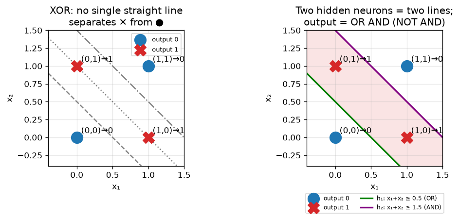
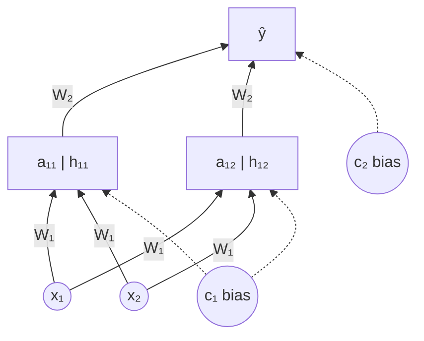
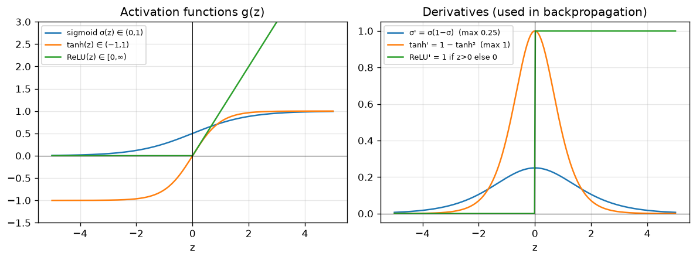
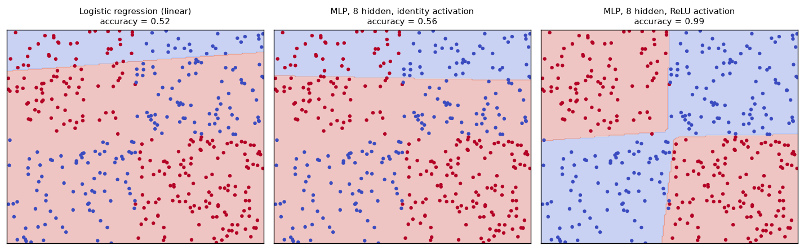
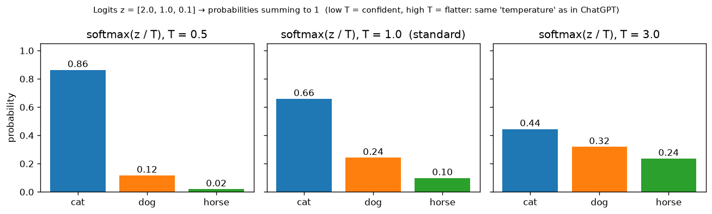
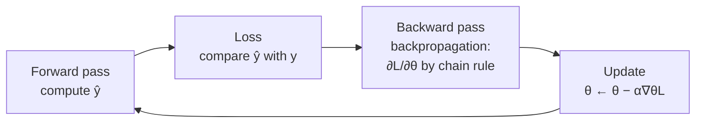

# 02 · Neural Networks: Why, What & How They Compute

> **Course:** Introduction to Generative AI · M.Tech Sem 1
>
> **Deck:** `Intro_to_GenAI.pdf`, slides 18–26
>
> **Status:** Based on the slides. Class discussion will be added after the lecture.
>
> **Notebook:** [`code/neural_networks_from_scratch.ipynb`](code/neural_networks_from_scratch.ipynb), Parts B–G: forward pass by hand, XOR, **a network trained from scratch with backprop**, parameter counting

---

## 📌 Table of Contents

1. [Big Picture](#1-big-picture)
2. [Why Neural Networks? The Limits of Linear Models](#2-why-neural-networks-the-limits-of-linear-models-)
3. [The XOR Problem](#3-the-xor-problem-)
4. [Anatomy of a Neural Network](#4-anatomy-of-a-neural-network-)
5. [A Network is a Composition of Functions](#5-a-network-is-a-composition-of-functions-)
6. [The Forward Pass: How f(x; θ) is Computed](#6-the-forward-pass-how-fx-θ-is-computed-)
7. [Activation Functions](#7-activation-functions-)
8. [Why Non-linearity is Essential](#8-why-non-linearity-is-essential-)
9. [Output Units: Linear, Sigmoid, Softmax](#9-output-units-linear-sigmoid-softmax-)
10. [Feed-Forward Networks: Shapes & Parameter Count](#10-feed-forward-networks-shapes--parameter-count-)
11. [How the Parameters are Learned (preview)](#11-how-the-parameters-are-learned-preview-)
12. [From MLPs to Transformers & LLMs](#12--from-mlps-to-transformers--llms)
13. [Common Confusions](#13--common-confusions)
14. [Exam / Interview Questions](#14--exam--interview-questions)
15. [Cheat Sheet](#15--cheat-sheet)
16. [Go Deeper](#16--go-deeper-curated-links)

---

## 1. Big Picture

Supervised learning wants $`y \approx f(\mathbf x)`$. Linear models can only draw **straight lines/planes**. Real problems (faces, speech, language) need **curvy, complicated** functions. A **neural network** is a flexible function built by **stacking simple layers**:

```math
\text{layer} = \text{linear map } (W\mathbf x + \mathbf b) \;\to\; \text{non-linear squash } g(\cdot)
```

Stack enough of them and you can approximate essentially any function. Every model in this course (CNNs, Transformers, GPT, diffusion) is built from this unit.

---

## 2. Why Neural Networks? The Limits of Linear Models 🟢

**Setup (slide 18):** given $`\{(\mathbf x_i, y_i)\}_{i=1}^N`$, learn $`y \approx f(\mathbf x)`$. *But what if the relationship between $`\mathbf x`$ and $`y`$ is complex and cannot be represented by a simple linear model?*

**Definition (slide 19):** Neural networks are ML models **inspired by how the brain processes information**. They consist of **interconnected neurons arranged in layers** that learn patterns from data.

**The need:**

- Linear models learn only **linear relationships** and can't capture **complex interactions** between inputs.
- Many real-world problems are **non-linear**.
- Neural networks use **multiple layers + non-linear transformations** to learn them.
- So they offer a **flexible way to learn complex functions from large datasets**.

> **Goal:** learn a flexible function mapping input $`\mathbf x`$ to output $`\hat y`$.

**Real-world non-linearities:**

| Problem | Why linear fails |
|---|---|
| House price | Price vs area isn't a straight line; location *interacts* with size |
| Medical risk | Risk explodes when two factors co-occur (smoking **and** age) |
| Image: "is there a cat?" | Shifting the cat 10 pixels changes every pixel value |
| Language | "not bad" ≈ good: words interact |

> 🧠 *Brain analogy, with care:* biological neurons inspired the design (inputs → weighted → fire if above threshold), but modern networks are **mathematical function approximators**, not brain simulations.

---

## 3. The XOR Problem 🟢→🟡

| $`x_1`$ | $`x_2`$ | XOR |
|---|---|---|
| 0 | 0 | 0 |
| 0 | 1 | 1 |
| 1 | 0 | 1 |
| 1 | 1 | 0 |

**Slide 20:** *Can a single linear decision boundary correctly classify all four points?* **No.** XOR is a **non-linear** classification problem. That motivates non-linear models.



**Proof that no line works:** suppose $`w_1x_1 + w_2x_2 + b > 0`$ means "1". Then

- $`(0,0)\to0`$: $`b \le 0`$
- $`(0,1)\to1`$: $`w_2 + b > 0`$
- $`(1,0)\to1`$: $`w_1 + b > 0`$
- $`(1,1)\to0`$: $`w_1 + w_2 + b \le 0`$

Adding the middle two: $`w_1 + w_2 + 2b > 0`$, so $`w_1 + w_2 + b > -b \ge 0`$, which contradicts the last line. ∎ (The notebook brute-forces 68,921 lines: the best gets **3/4**.)

### 🔴 Solving XOR with one hidden layer (2–2–1 network)
Decompose: **XOR = OR AND (NOT AND)**.

- Hidden neuron $`h_1`$ = **OR**: $`\text{step}(x_1 + x_2 - 0.5)`$
- Hidden neuron $`h_2`$ = **AND**: $`\text{step}(x_1 + x_2 - 1.5)`$
- Output = $`\text{step}(h_1 - h_2 - 0.5)`$

| $`(x_1,x_2)`$ | $`h_1`$ (OR) | $`h_2`$ (AND) | $`\hat y`$ |
|---|---|---|---|
| (0,0) | 0 | 0 | 0 ✓ |
| (0,1) | 1 | 0 | 1 ✓ |
| (1,0) | 1 | 0 | 1 ✓ |
| (1,1) | 1 | 1 | 0 ✓ |

> 💡 **The big insight:** the hidden layer **changes the representation**. In the original $`(x_1, x_2)`$ space XOR isn't separable. In the hidden $`(h_1, h_2)`$ space the points become $`(0,0), (1,0), (1,0), (1,1)`$, and **one line separates them**. *Deep learning = learning representations in which the problem becomes easy.*

History: Minsky & Papert (1969) showed single-layer perceptrons can't learn XOR, contributing to the first "AI winter". Multi-layer networks trained with **backpropagation** (Rumelhart, Hinton & Williams, 1986) solved it.

---

## 4. Anatomy of a Neural Network 🟢

From slide 21's diagram (2 inputs → 2 hidden → 1 output):



| Term | Meaning |
|---|---|
| **Neuron** | Computes weighted sum + bias, then applies an activation |
| **Layer** | A group of neurons at the same depth; each connects to neurons of the previous layer |
| **Input layer** | Just holds $`\mathbf x`$ (no computation) |
| **Hidden layer** | Intermediate representations, not directly observed |
| **Output layer** | Produces $`\hat y`$ |
| **Weights** $`W`$ | Strength of each connection |
| **Biases** $`\mathbf c`$ (or $`\mathbf b`$) | Shift each neuron's threshold |
| **Parameters** $`\theta`$ | **All** weights and biases: what's learned |
| $`a`$ (pre-activation) | Weighted sum + bias, **before** the non-linearity |
| $`h`$ (activation) | Output **after** the non-linearity, $`h = g(a)`$ |

Each neuron in the diagram is drawn split into $`a`$ (bottom) and $`h`$ (top): first compute $`a`$, then squash it to $`h`$.

---

## 5. A Network is a Composition of Functions 🟢

**Slide 21:**

- In supervised learning there is a true (unknown) function $`y = f^*(\mathbf x)`$.
- The network learns an **approximation** $`y \approx f(\mathbf x;\theta)`$, where $`\theta`$ = weights and biases.
- A deep network builds $`f`$ by **composing** layers:
```math
f(\mathbf x) = f^{(3)}\Big(f^{(2)}\big(f^{(1)}(\mathbf x)\big)\Big)
```

> 🎯 **Key sentence (slide 21):** *"A neural network does not directly learn $`f^*`$. It learns the parameters $`\theta`$ so that $`f(\mathbf x;\theta)`$ approximates $`f^*(\mathbf x)`$."*

**Slide 22, layer by layer:**
```math
\begin{aligned}
\mathbf h_1 &= g(W_1\mathbf x + \mathbf b_1) && \text{Layer 1}\\
\mathbf h_2 &= g(W_2\mathbf h_1 + \mathbf b_2) && \text{Layer 2}\\
\hat y &= O(W_3\mathbf h_2 + \mathbf b_3) && \text{Output layer ($O$ = output activation)}
\end{aligned}
```
*"A deep neural network is a composition of simple functions."*

**Analogy: an assembly line.** Raw material ($`\mathbf x`$) passes through stations. Each station does one simple transformation; the final product emerges at the end. No station is smart, but the line as a whole builds a car.

---

## 6. The Forward Pass: How f(x; θ) is Computed 🟡

**Slide 23**, for hidden neuron $`i`$ in layer $`l`$:

**Pre-activation** (weighted sum + bias):
```math
a_i^{l} = \sum_j W_{ij}\,x_j + c_i
```
**Activation:**
```math
h_i^{l} = g(a_i^{l})
```
**Output layer**, same pattern using the hidden activations as inputs:
```math
a_i^{(out)} = \sum_j W_{ij}^{(out)}h_j + c_i^{(out)}, \qquad \hat y_i = g_{out}\big(a_i^{(out)}\big)
```

**Matrix form** (how it's actually coded):
```math
\mathbf a = W\mathbf x + \mathbf c, \qquad \mathbf h = g(\mathbf a)
```
Row $`i`$ of $`W`$ holds the weights **into** neuron $`i`$. So $`W`$ has shape (neurons in this layer) × (neurons in the previous layer).

> 📝 **Notation check:** slide 23 says "$`W_{ji}`$ is the weight connecting input $`j`$ to hidden neuron $`i`$" while the formula uses $`W_{ij}x_j`$. Read it as **$`W_{ij}`$ = weight from input $`j`$ to neuron $`i`$** (row = destination, column = source). That matches $`\mathbf a = W\mathbf x`$. Different textbooks use the transpose convention; always check.

> 🔗 **This is linear algebra from Applied Math!** $`W\mathbf x`$ is a **linear combination of the columns of $`W`$** weighted by the inputs (Applied Math Note 04). Each layer maps $`\mathbb R^{n_{in}}`$ to $`\mathbb R^{n_{out}}`$, and its rank and null space determine what information can pass through.

### ✍️ Worked example (notebook Part C)
$`\mathbf x = (1, 2)`$, $`W_1 = \begin{bmatrix}0.5 & -1\\1.5 & 0.5\end{bmatrix}`$, $`\mathbf c_1 = (0, -1)`$, $`W_2 = \begin{bmatrix}2 & -1\end{bmatrix}`$, $`c_2 = 0.5`$, ReLU hidden, sigmoid output.

| Step | Computation | Result |
|---|---|---|
| $`a_{11}`$ | $`0.5(1) + (-1)(2) + 0`$ | −1.5 |
| $`a_{12}`$ | $`1.5(1) + 0.5(2) - 1`$ | 1.5 |
| $`\mathbf h_1 = \text{ReLU}(\mathbf a_1)`$ | $`\max(0,\cdot)`$ | (0, 1.5) |
| $`a_2`$ | $`2(0) + (-1)(1.5) + 0.5`$ | −1.0 |
| $`\hat y = \sigma(a_2)`$ | $`1/(1+e^{1})`$ | **0.2689** |

Interpretation: $`P(y = 1 \mid \mathbf x) \approx 27\%`$, so the prediction is class 0. Note that hidden neuron 1 is "off" (ReLU zeroed it). It contributes nothing for this input.

---

## 7. Activation Functions 🟢→🟡



| Function | Formula | Range | Derivative | Used | Notes |
|---|---|---|---|---|---|
| **Sigmoid** | $`\sigma(z) = \dfrac{1}{1+e^{-z}}`$ | $`(0, 1)`$ | $`\sigma(1-\sigma)`$, max 0.25 | **Output layer for binary classification** | Smoothly turns a score into a probability-like value |
| **Tanh** | $`\dfrac{e^z - e^{-z}}{e^z + e^{-z}}`$ | $`(-1, 1)`$ | $`1 - \tanh^2`$, max 1 | Historically in hidden layers | **Zero-centred**; $`\tanh(z) = 2\sigma(2z) - 1`$ |
| **ReLU** | $`\max(0, z)`$ | $`[0, \infty)`$ | 1 if $`z>0`$, else 0 | **Default for hidden layers** | Cheap; no saturation for $`z > 0`$ |

### 🔴 Why ReLU replaced sigmoid/tanh in hidden layers
**Vanishing gradients:** backprop multiplies derivatives layer by layer. With sigmoid, each factor is $`\le 0.25`$, so after 10 layers you get $`\le 0.25^{10} \approx 10^{-6}`$ and early layers barely learn. ReLU's derivative is exactly **1** for active units, so gradients flow.

**ReLU's weakness: "dying ReLU".** If $`z < 0`$ always, the gradient is 0 forever. Fixes: Leaky ReLU ($`\max(0.01z, z)`$), ELU. Modern LLMs use smooth variants: **GELU** (GPT, BERT) and **SwiGLU** (LLaMA).

---

## 8. Why Non-linearity is Essential 🟡

**Claim:** without activation functions, a deep network is **just one linear layer**.
```math
W_3\big(W_2(W_1\mathbf x + \mathbf b_1) + \mathbf b_2\big) + \mathbf b_3 = \underbrace{(W_3W_2W_1)}_{W}\mathbf x + \underbrace{(W_3W_2\mathbf b_1 + W_3\mathbf b_2 + \mathbf b_3)}_{\mathbf b}
```
A product of matrices is just another matrix, so 100 linear layers = 1 linear layer (notebook Part F checks this numerically).



On XOR-shaped data: logistic regression gets 52%, an 8-unit MLP with **identity** activation gets 56% (still linear!), and the same MLP with **ReLU** gets **99%**. The only difference between the last two is the non-linearity.

### 🔴 Universal Approximation Theorem
A network with **one hidden layer** and a non-linear activation can approximate **any continuous function** on a bounded region to any accuracy, given **enough** hidden neurons (Cybenko 1989; Hornik 1991).

- It says such a network **exists**, not that gradient descent will **find** it, nor how many neurons are needed.
- **Depth helps in practice:** deep networks represent many functions with *exponentially fewer* neurons than shallow ones, by reusing features hierarchically.

---

## 9. Output Units: Linear, Sigmoid, Softmax 🟢

> *"The hidden layers may be the same, but the **output layer depends on what we are trying to predict**."* (slide 25)

| Problem | Output activation | Output | Example | Loss to pair with *(beyond slides)* |
|---|---|---|---|---|
| **Regression** | **Linear** $`\hat y = \mathbf w^\top\mathbf h + b`$ | Any real number $`(-\infty, \infty)`$ | House price, temperature, height | Mean squared error |
| **Binary classification** | **Sigmoid** $`\hat y = \sigma(z)`$ | $`(0, 1)`$, read as $`P(y=1\mid\mathbf x)`$ | Spam / not spam | Binary cross-entropy |
| **Multi-class classification** | **Softmax** | $`K`$ probabilities summing to 1 | Cat / dog / horse | Categorical cross-entropy |

### Softmax
```math
\hat y_k = \frac{e^{z_k}}{\sum_{j=1}^{K} e^{z_j}}, \qquad k = 1,\dots,K, \qquad \sum_{k=1}^K \hat y_k = 1
```
The raw scores $`z_k`$ are called **logits**.

1. $`e^{z}`$ makes every score **positive**.
2. Dividing by the sum **normalises** them to probabilities.
3. It exaggerates differences: the largest logit dominates ("soft" version of arg max).

**Example:** logits $`[2.0, 1.0, 0.1]`$ give probabilities $`[0.659, 0.242, 0.099]`$.



**🔴 Facts worth knowing:**

- **Sigmoid = 2-class softmax:** $`\text{softmax}([z, 0])_1 = \sigma(z)`$ (verified in the notebook).
- **Numerical stability:** compute $`\text{softmax}(\mathbf z - \max\mathbf z)`$. The result is identical, and it avoids overflow from $`e^{1000}`$.
- **Temperature** $`T`$: $`\text{softmax}(\mathbf z/T)`$. Low $`T`$ makes outputs more confident (deterministic); high $`T`$ makes them flatter (more random). This is **exactly the "temperature" setting in ChatGPT/LLM APIs**. Every LLM's final layer is a softmax over its whole vocabulary.

---

## 10. Feed-Forward Networks: Shapes & Parameter Count 🟡

**Slide 26:**

- Input: an $`n`$-dimensional vector (the **0-th layer**).
- $`L - 1`$ **hidden layers** (2 in the figure), each with $`n`$ neurons.
- One **output layer** (the **$`L`$-th layer**) with $`k`$ neurons (e.g. $`k`$ classes).
- $`W_i \in \mathbb R^{n\times n}`$, $`\mathbf b_i \in \mathbb R^n`$ between layers $`i-1`$ and $`i`$ ($`0 < i < L`$).
- $`W_L`$, $`\mathbf b_L \in \mathbb R^k`$ between the last hidden layer and the output.

"Feed-forward" = information flows **one way**, input → output, with **no loops** (unlike RNNs). Also called a **multi-layer perceptron (MLP)**.

> 📝 **Shape check:** the slide writes $`W_L \in \mathbb R^{n\times k}`$. With the $`\mathbf a = W\mathbf h + \mathbf b`$ convention (slide 22), the output weight matrix must be **$`k\times n`$** ($`k`$ outputs, $`n`$ inputs). $`n\times k`$ is correct for the row-vector convention $`\mathbf a = \mathbf h^\top W`$. The hidden $`W_i`$ are $`n\times n`$ either way. **Rule:** $`W`$ has shape (out × in) when it multiplies a column vector on the left.

### Counting parameters
Each layer: $`(\text{in} \times \text{out})`$ weights $`+ \text{out}`$ biases.

| Network | Computation | Total θ |
|---|---|---|
| 2–2–1 (slide 21) | $`(2·2+2) + (2·1+1)`$ | **9** |
| 2–4–1 (notebook XOR) | $`(2·4+4) + (4·1+1)`$ | **17** |
| 784–128–64–10 (MNIST) | $`100{,}480 + 8{,}256 + 650`$ | **109,386** |
| Slide 26: $`n`$ inputs, 2 hidden of $`n`$, $`k`$ outputs | $`2(n^2 + n) + (nk + k)`$ | — |
| GPT-3 | Same idea, 96 Transformer layers wide enough | **175 billion** |

---

## 11. How the Parameters are Learned (preview) 🟡

The slides stop at the forward pass. Training follows the same recipe as linear regression (MLP Note 03):



**Backpropagation** = the chain rule, applied efficiently from the output back to the input, reusing intermediate results. For the sigmoid + cross-entropy output, the gradient at the output simplifies beautifully to $`\hat y - y`$ (prediction minus truth), exactly like linear regression's error term.

The notebook (Part E) trains a 2–4–1 network on XOR **from scratch in NumPy**: forward pass, BCE loss, hand-written backprop, and gradient descent. Loss falls to 0.0005 and predictions are `[0 1 1 0]` ✓. It also **verifies backprop against numerical gradients**, the standard debugging technique.

---

## 12. 🔴 From MLPs to Transformers & LLMs

Everything in this lecture reappears inside a Transformer (GPT):

| This lecture | Inside GPT |
|---|---|
| Linear layer $`W\mathbf x + \mathbf b`$ | Q/K/V projections, output projection |
| Feed-forward network (MLP) | Every Transformer block has an MLP sub-layer (~⅔ of all parameters) |
| ReLU | GELU / SwiGLU |
| Softmax | (1) attention weights, (2) next-token probabilities over the vocabulary |
| Composition of layers | 12–100+ stacked Transformer blocks |
| Cross-entropy + backprop + gradient descent | Exactly how LLMs are pre-trained (with Adam) |

**New ideas still to come:** embeddings (tokens → vectors), **attention** (letting positions talk to each other), residual connections, layer norm, and generative models (autoregressive sampling, VAEs, GANs, diffusion).

---

## 13. ⚠️ Common Confusions

| Confusion | Clarification |
|---|---|
| More layers = always better | More capacity also means more over-fitting and harder training; needs data and regularisation |
| Neural nets simulate the brain | Loosely inspired; really they're composed differentiable functions |
| Linear layers stacked deep = powerful | Without non-linearity they collapse to one linear layer |
| Sigmoid is for hidden layers | Today: sigmoid for **binary outputs**; ReLU-family for hidden layers |
| Softmax outputs are calibrated confidences | They sum to 1 but are often **over-confident**; calibration is a separate problem |
| Universal approximation → any net will learn anything | It guarantees existence, not learnability or size |
| $`W_{ij}`$ convention is universal | Check row = destination vs row = source in each source |
| The input layer has weights | The input layer just holds $`\mathbf x`$; weights live **between** layers |

---

## 14. 📝 Exam / Interview Questions

<details>
<summary><b>Q1.</b> Prove that XOR is not linearly separable.</summary>

Assume $`w_1x_1+w_2x_2+b>0 \iff`$ class 1. The four points give $`b\le0`$, $`w_2+b>0`$, $`w_1+b>0`$, $`w_1+w_2+b\le0`$. Adding the 2nd and 3rd gives $`w_1+w_2+2b>0 \Rightarrow w_1+w_2+b>-b\ge0`$, contradicting the 4th.
</details>

<details>
<summary><b>Q2.</b> Design a 2-2-1 network with step activations that computes XOR.</summary>

$`h_1=\text{step}(x_1+x_2-0.5)`$ (OR), $`h_2=\text{step}(x_1+x_2-1.5)`$ (AND), $`\hat y=\text{step}(h_1-h_2-0.5)`$.
</details>

<details>
<summary><b>Q3.</b> Show that a network with no activation functions is equivalent to a linear model.</summary>

$`W_2(W_1x+b_1)+b_2 = (W_2W_1)x + (W_2b_1+b_2) = Wx+b`$; by induction, any depth collapses.
</details>

<details>
<summary><b>Q4.</b> Compute the forward pass: $`x=(1,-1)`$, $`W_1 = \begin{bmatrix}1&2\\-1&1\end{bmatrix}`$, $`b_1=(0,1)`$, ReLU, $`W_2=[1\;\;3]`$, $`b_2=-1`$, linear output.</summary>

$`a_1 = (1-2+0,\ -1-1+1) = (-1, -1)`$; $`h_1 = (0, 0)`$; $`\hat y = 0 + 0 - 1 = -1`$.
</details>

<details>
<summary><b>Q5.</b> Which output activation and loss for: (a) predicting age, (b) fraud yes/no, (c) 1000-class ImageNet, (d) next word?</summary>

(a) linear + MSE; (b) sigmoid + BCE; (c) softmax + cross-entropy; (d) softmax over the vocabulary + cross-entropy.
</details>

<details>
<summary><b>Q6.</b> Compute softmax([1, 1, 1]) and softmax([1, 2]).</summary>

[1/3, 1/3, 1/3]; $`[1/(1+e), e/(1+e)] \approx [0.269, 0.731]`$.
</details>

<details>
<summary><b>Q7.</b> Why is ReLU preferred over sigmoid in hidden layers?</summary>

The sigmoid derivative is ≤ 0.25 and saturates, giving vanishing gradients in deep nets. ReLU has derivative 1 for positive inputs, is cheap to compute, and gives sparse activations.
</details>

<details>
<summary><b>Q8.</b> How many parameters does a 10–20–20–3 network have?</summary>

$`(10·20+20) + (20·20+20) + (20·3+3) = 220 + 420 + 63 = 703`$.
</details>

<details>
<summary><b>Q9.</b> What does the universal approximation theorem guarantee, and what does it not?</summary>

It guarantees that a one-hidden-layer network with enough units can approximate any continuous function on a compact set. It doesn't say how many units are needed, whether training will find the weights, or how well the network generalises.
</details>

---

## 15. 🧾 Cheat Sheet

- Linear models draw straight boundaries; XOR needs a **hidden layer**.
- Neuron: $`a = \sum_j W_{ij}x_j + c_i`$, then $`h = g(a)`$. Layer: $`\mathbf h = g(W\mathbf x + \mathbf b)`$, with $`W`$ of shape out × in.
- Network = composition $`f^{(L)}(\cdots f^{(1)}(\mathbf x))`$, learns $`\theta`$ so that $`f(\mathbf x;\theta)\approx f^*(\mathbf x)`$.
- Activations: sigmoid (0,1), tanh (−1,1) zero-centred, **ReLU** $`\max(0,z)`$ is the default for hidden layers.
- No non-linearity → collapses to one linear layer.
- Outputs: **linear** (regression), **sigmoid** (binary, $`P(y{=}1|x)`$), **softmax** (multi-class, sums to 1).
- Softmax $`= e^{z_k}/\sum e^{z_j}`$; subtract the max for stability; temperature $`T`$ controls confidence.
- Parameters per layer = in·out + out.
- Training = forward → loss → **backprop** (chain rule) → gradient step.

---

## 16. 📚 Go Deeper: Curated Links

| Topic | Why | Link |
|---|---|---|
| What is a neural network? | Best visual intro (digits example) | [3Blue1Brown — But what is a neural network?](https://www.youtube.com/watch?v=aircAruvnKk) |
| How networks learn | Gradient descent for NNs | [3Blue1Brown — Gradient descent, how neural networks learn](https://www.youtube.com/watch?v=IHZwWFHWa-w) |
| Backprop intuition + calculus | Prepares for the next lectures | [3Blue1Brown — Backpropagation, intuitively](https://www.youtube.com/watch?v=Ilg3gGewQ5U) · [Backpropagation calculus](https://www.youtube.com/watch?v=tIeHLnjs5U8) |
| NN main ideas, simply | Neurons as "bent lines" added together | [StatQuest — The Essential Main Ideas of Neural Networks](https://www.youtube.com/watch?v=CqOfi41LfDw) · [ReLU in action](https://www.youtube.com/watch?v=68BZ5f7P94E) · [ArgMax & SoftMax](https://www.youtube.com/watch?v=KpKog-L9veg) |
| Build it yourself (highly recommended) | Backprop from scratch in Python, by an OpenAI co-founder | [Karpathy — Building micrograd](https://www.youtube.com/watch?v=VMj-3S1tku0) · [Neural Networks: Zero to Hero (series → GPT)](https://karpathy.ai/zero-to-hero.html) |
| Play with a network in the browser | Try XOR/spiral with/without hidden layers & activations | [TensorFlow Playground](https://playground.tensorflow.org) |
| Universal approximation, visually | Why one hidden layer is (theoretically) enough | [Nielsen — Neural Networks & Deep Learning, Ch. 4](http://neuralnetworksanddeeplearning.com/chap4.html) |
| Textbook chapter | Ch. 6 "Deep Feedforward Networks" (XOR example is from here) | [Goodfellow et al. — Deep Learning, Ch. 6](https://www.deeplearningbook.org/contents/mlp.html) |
| Course notes | Neurons, activations, architectures | [Stanford CS231n — Neural Networks Part 1](https://cs231n.github.io/neural-networks-1/) |
| Indian course, same notation ($`a`$, $`h`$, $`W`$, $`c`$, layer $`L`$) | Matches slide 26 exactly | [NPTEL — Deep Learning (Prof. Mitesh Khapra)](https://nptel.ac.in/courses/106106201) |
| Where it leads | Transformers & attention | [3Blue1Brown — Transformers](https://www.youtube.com/watch?v=wjZofJX0v4M) · [Attention](https://www.youtube.com/watch?v=eMlx5fFNoYc) · [How LLMs store facts (MLPs!)](https://www.youtube.com/watch?v=9-Jl0dxWQs8) |
| scikit-learn MLP | Quick practical use | [sklearn — Neural network models](https://scikit-learn.org/stable/modules/neural_networks_supervised.html) |

---
⬅️ [01 · AI, ML, DL Foundations](01-AI-ML-DL-Foundations.md) · [Gen AI Index](README.md)
