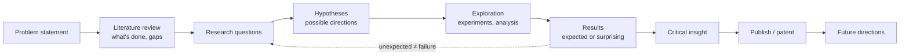

# 01 · Why Research? Course-based vs Research-based Learning & the Path to Research

> **Course:** Introduction to Research (I2R) · Dr. Muthusankar Eswaran (Asst. Prof., ECE) & Prof. S. R. Mahadeva Prasanna (Director, IIIT Dharwad)
>
> **Deck:** `PPT-1.pdf` (dated 22 Sep 2026, 39 slides). Taught over the first sessions; **29 Sep** (Prof. Prasanna) continued from "Qualifications for research".
>
> **Sources:** PPT + both 29 Sep transcripts (7:42 pm and 8:16 pm parts, including a long Q&A)
>
> **Companion:** [02 · Assignments Guide & Research Toolkit](02-Assignments-Guide-and-Research-Toolkit.md)

---

## 📌 Table of Contents

1. [Why This Course Exists](#1-why-this-course-exists)
2. [Course Logistics & Evaluation](#2-course-logistics--evaluation)
3. [Why Research? Big-Picture Motivation](#3-why-research-big-picture-motivation-)
4. [Definitions & Terminology](#4-definitions--terminology-)
5. [Research = Re-Search: The Basic Realisation](#5-research--re-search-the-basic-realisation-)
6. [Course-based vs Research-based Degree](#6-course-based-vs-research-based-degree-)
7. [Qualifications: Who Can Do Research?](#7-qualifications-who-can-do-research-)
8. [Selecting Good Courses & Investing Time](#8-selecting-good-courses--investing-time-)
9. [The Research Experience: Novel, Non-obvious, Often Simple](#9-the-research-experience-novel-non-obvious-often-simple-)
10. [What You Gain from Research](#10-what-you-gain-from-research-)
11. [The Path: Supervisor & Scholar (Phases I–III)](#11-the-path-supervisor--scholar-phases-iiii-)
12. [Meetings, Preparation & the Research Diary](#12-meetings-preparation--the-research-diary-)
13. [Learning to Do Research & Gauging Progress](#13-learning-to-do-research--gauging-progress-)
14. [The M.Tech Project Timeline (Credits & Hours)](#14-the-mtech-project-timeline-credits--hours-)
15. [Time Allocation & Working with Others](#15-time-allocation--working-with-others-)
16. [Publishing: Q&A Insights from Class](#16-publishing-qa-insights-from-class-)
17. [Professor Emphasised](#17--professor-emphasised)
18. [Common Misconceptions](#18--common-misconceptions)
19. [Reflection / Exam Questions](#19--reflection--exam-questions)
20. [Cheat Sheet & Class-Note Template](#20--cheat-sheet--class-note-template)
21. [Go Deeper](#21--go-deeper-curated-links)

---

## 1. Why This Course Exists

The M.Tech's real value comes from the **4-semester project** (30 of 60 credits). **I2R is the "theory" behind that project**: the general principles of carrying out research, so that the **self-driven** project work goes well.

| Theory / lab courses | Research |
|---|---|
| Learn existing knowledge | **Create** new knowledge |
| Structured syllabus | Open-ended, uncertain |
| Become a **consumer** of knowledge | Become a **creator** of knowledge |

**Why now?** *"We are already talking about super-intelligence, not general intelligence… intelligence will become a commodity."* (Prof. Prasanna). Routine development work (even coding) is being automated. The most valued human skill is **problem solving**: taking a problem and getting to a solution, which *is* research.

> *"As a human, I give specs and see outputs coming, and check whether it is according to me."* Concepts still matter, because **you must be able to verify what an AI system produces.**

---

## 2. Course Logistics & Evaluation

- **2 credits** (1.5-0-0-4): 1.5 h × 12 lectures = 18 h + self-study ≈ 12 h. **Tuesdays, 7:45–9:15 pm.**
- **Everything is evaluated online and continuously.**

| Component | Weight | Detail |
|---|---|---|
| Attendance | up to 10% | 9/18 → 2.5% · 12/18 → 5% · 15/18 → 7.5% · 18/18 → 10% |
| **Video on** | up to 5% | 4/18 → 1.25% · 6/18 → 2.5% · 8/18 → 3.75% · 10/18 → 5% |
| **Class-note submission** | **15%** | 100% if within **24 h**, 75% ≤ 3 days, 50% ≤ 5 days, 0 after |
| Assignment 1 | 10% | Plan your research work (Phases I–IV), 4 weeks |
| Assignment 2 | 10% | GenAI tools for research, 8 weeks |
| Assignment 3 | 10% | Topic exploration + 5-paper literature review, 10 weeks |
| End-sem | 40% | |

Grades: A (10), A− (9), B (8), B− (7), C (6), C− (5), D (4).

> 💡 **Easy marks:** keep your **video on** in at least 10 sessions and **submit class notes within 24 hours**. That's 20% of the grade from habits alone. A ready template is in §20.

**Books:** DePoy, *Introduction to Research* (7th ed.) · Baijal, *Introduction to Research* · C. R. Kothari, *Research Methodology* · K. V. Raja Subramanian, *Generative AI for PhD Scholars: Ethical Use of AI in Research* (2025) · Mihir Bellare, [*The Ph.D Experience*](https://cseweb.ucsd.edu/~mihir/phd.html) (many slides on the research experience are adapted from it).

**Syllabus:** Introduction → Topic exploration & literature review → Research gaps, questions & hypotheses → Research exploration → Handling outcomes (expected vs surprising) → Patents, articles, presentations, reports, thesis & defence → Conclusions & future scope → GenAI for research → Principles & ethics (hard work, time management, health, patience, plagiarism).

---

## 3. Why Research? Big-Picture Motivation 🟢

**Research is how humanity moved:**

| From | To |
|---|---|
| Stone age | Generative AI |
| Walking | Supersonic jets |
| Smoke signals, drums, pigeons | 6G communication |
| Isolated villages in silos | A connected "global village" |
| No cure | Advanced treatment |

**The journey of every invention:** a **seed** in someone's mind (research question) → a **dream** (hypothesis) → **reality** (research exploration).

**Two mindsets:** **social** (contribute to society) vs **profit** (inventions, patents, royalties). Both are valid.

### Case study: COVID-19 (slides 13–14)

| Research helped to… | Without research… |
|---|---|
| Identify the virus (SARS-CoV-2) | Virus spreads uncontrollably |
| Develop vaccines (Covaxin, Covishield) | No vaccines |
| Improve testing (RT-PCR) | Infected people unidentified |
| Design treatment & oxygen protocols | Higher death rates |
| Provide data for policy | Government can't plan interventions |

> ***"Research turned fear into understanding and understanding into survival."***

### Thrust areas → enabling fields (national priorities)

| Thrust areas (problems) | Enabling fields (tools) |
|---|---|
| Education · Water · Energy · Food · Agriculture & environment · Health · Sovereign technology · At scale | **Data Science & AI** · Electronics · Computer Science · Quantum tech · VLSI · Semiconductors · Biotechnology · Mathematics |

These fields enable innovation through **sensing, computation, modelling and intelligent systems** to solve real societal problems. **Sovereign technology** (indigenous hardware and software) is a national need: *"Become torch-bearers of Atmanirbhar Bharat and Viksit Bharat."*

### Relevance now: the "need of the hour"
AI is disrupting every area and automating development work. Skills that keep you relevant: **coding, entrepreneurship, research and innovation**. *"Research and innovation is the DNA"*: dream big → study the existing solutions → find the gaps → create new solutions.

---

## 4. Definitions & Terminology 🟢

Three definitions of research (slide 16):

1. *Systematic investigation into and study of materials and sources in order to **establish facts and reach new conclusions**.*
2. *Creative and systematic work undertaken to **increase the stock of knowledge**.* (This is the OECD Frascati Manual definition.)
3. *To observe and understand **what everyone else has done so far** and do **what none have done so far**.*

| Term pair | Distinction | Example |
|---|---|---|
| **Research methodology** vs **research methods** | *Methodology* = the overall **strategy and rationale** (why this approach, how validity is ensured). *Methods* = the specific **techniques/tools** (survey, experiment, simulation, RCT) | Methodology: "quantitative experimental study with controlled baselines"; methods: "5-fold CV, t-test" |
| **Original / fundamental / primary** research | Generates **new** knowledge or data first-hand | Collecting new EEG data; proving a new theorem |
| *(vs secondary research)* | Analyses **existing** data/literature | Literature reviews, meta-analyses |
| **Scientific** vs **applied/engineering** research | Scientific: understand **why** (knowledge for its own sake). Applied: solve a **practical problem** | Discovering the Transformer's in-context learning mechanism vs building a Kannada voice assistant |
| **Invention** vs **innovation** | Invention: creating something **new** (patentable). Innovation: **bringing it into use** with value (product, process, adoption) | Inventing the lithium-ion cell (invention) vs UPI transforming payments in India (innovation) |

---

## 5. Research = Re-Search: The Basic Realisation 🟢

- A **research-based** programme is entirely different from a **course-oriented** one.
- Research exploration ≠ a laboratory course ≠ a project course.

**RE-SEARCH:**

- Several people **before you** looked at the question you're thinking about now.
- They did some work and documented it, but left an **unfinished agenda**.
- **You are not the first, hence search again!**
- Why didn't they find your solution? *They didn't look at it the way you did.*
- **You will not be the last** either, so identify **future directions** for those who follow.

> 💡 This is why **literature review** comes first: you must know what was already done before you can do "what none have done".

---

## 6. Course-based vs Research-based Degree 🟢

| Basis | Course-based study | Research-based study |
|---|---|---|
| Main focus | **Learning existing knowledge** through a structured curriculum | **Creating new knowledge** by exploring questions, solving problems, generating insights |
| Curriculum | Fixed, structured syllabus | Flexible, open-ended, driven by research questions |
| Teaching | Lectures, tutorials, assignments, exams | Investigation, experimentation, data collection & analysis |
| Duration | **Time-bound** (semester/year) | **Not time-bound** (months to years) |
| Evaluation | Exams, quizzes, assignments | Research thesis, dissertation, publications, presentations |
| Role of student | Learner | Researcher / investigator |
| Output | Grades, certificates, diploma | New knowledge, papers, patents, innovations |
| Guidance | Many instructors, defined subjects | **One-to-one** with a supervisor/mentor |
| Purpose | Build foundational knowledge & skills | Advance knowledge, solve real problems, contribute to society |

**Three crisp contrasts (slide 19):**

| Course-based | Research-based |
|---|---|
| **Deterministic**: the syllabus and exam are known | **Stochastic**: outcomes are uncertain |
| **One-to-many** (teacher → class) | **One-to-one** (supervisor ↔ scholar) |
| **Breadth** | **Depth** |

> In a research degree, *"a set of good courses are only **prerequisites**."* The real work is the literature review, seminars, exploration, papers/patents, presentations, thesis and defence.

**Prof. Prasanna on grades:** *"7.5–8 CPI is a good grade. As a working professional looking for a career change, nobody looks at 9 or 9.5 CPI. What matters is the work you have done."* **Don't equate scoring in theory courses with project success. They are different dimensions.**

---

## 7. Qualifications: Who Can Do Research? 🟢

- **ABCR: "Anybody with common sense can do research."**
- You **need not be an academic topper**.
- You must be **willing to invest time and work hard**, every week, not just before the presentation.
- Realise that a research degree is **different** from a course degree.
- Have **patience** when results don't come.
- ***"Walking slow is fine, but stopping completely is dangerous."***

**On uncertainty (29 Sep):** online posts make research sound mentally crushing. It isn't. Research is an **uncertain activity, like daily life**: you plan your day, surprises happen, and you handle them without fear. If your hypothesised result doesn't come, that's normal.

---

## 8. Selecting Good Courses & Investing Time 🟢

- For your **broad research area**, some courses provide crucial deeper knowledge.
- **Discuss with your supervisor**, select a set, and **take the coursework seriously**, for learning rather than grades.
- **Keep questioning:** *"How will this course's knowledge benefit my research?"*
- **Grasp the core concepts**, even if you can't solve every hard problem.

**Example (Prof. Prasanna):** if your project is in **healthcare**, take healthcare-related electives in semesters 2–4. *"Your transcript will then describe your interest; you won't have to stress it."* Courses can even come from other institutes (online) and be credited.

**This semester:** *Mathematical foundations (Applied Math), Machine Learning Paradigms and Introduction to Research are highly relevant to everyone's project.* Of the five 1-credit "Introduction to…" breadth courses, you credit **two**. Most students take **Gen AI** plus one application area (healthcare, SNLP, financial analytics…).

> 🔗 Prof. Prasanna's example: *"Applied Math gives you comfort with the equations you meet when reading research papers. 'I've studied this already' makes reading articles easier."*

---

## 9. The Research Experience: Novel, Non-obvious, Often Simple 🟡

**Myth:** research = solving some very hard problem nobody has solved.
**Reality:** usually there's an existing product or process, and you make an improvement that is **significant** and **non-obvious**.

- *Obvious* improvements are just engineering or system development: no new knowledge.
- *Significant & non-obvious* improvements count as research.

**Research is more than problem solving.** It's about:

1. **Conceptualising** the approach
2. **Formulating research questions**
3. Choosing **directions** (hypotheses) to solve them
4. **Exploration**
5. **Critical insight** into what you found

*"Problem solving is always there, but the role it plays varies"* by field (product, service, fundamental research). The course teaches the **general research lifecycle**, not one recipe:

**Key lessons (slides 23–24, from Bellare's *The Ph.D Experience*):**

- **When you have novelty, publish.**
- After finding a novel solution, you'll wonder why nobody did it before. *They didn't ask that question, or didn't look at it that way.*
- ***"Don't look down on simplicity; good research is often simple."*** Prof. Prasanna: when your solution turns out simple, you may doubt yourself (*"Is this proper? Why didn't others see it?"*). Simple ≠ trivial; others didn't look *through your lens*.
- Your first project likely won't be a famous hard problem; it'll be something where progress is step by step.
- ***"Don't start by thinking about a thesis. Your goal is to produce papers initially."*** The scope narrows semester by semester until the thesis is clear.

**Not getting the expected result is OK.** *"If at the end of the fourth semester you didn't get significant results, but can **explain why**, that is also research."* The committee grades **the path and the time invested**, not just the final number.

**Serendipity example:** read the history of **X-rays**. Röntgen (1895) wasn't looking for X-rays; he noticed an unexpected glow in his lab while experimenting with cathode rays, investigated it, and discovered them (first Nobel Prize in Physics, 1901). Surprising outcomes are part of research (a later syllabus topic: *expected vs surprising outcomes*).

---

## 10. What You Gain from Research 🟢

Beyond technical depth:

- **Confidence in rational thought** and how widely it applies.
- The **inclination and ability to research anything**, expecting to understand it.
- The confidence to **question everything** and look for better ways: *why is it done this way, and how could it be better?*
- The courage to **jump into a new area**, learn it quickly, and say something interesting. *"More than depth in one area, the courage to jump from area to area."*
- **Appreciation of creativity** in others and in all areas of life.
- Being **constructively critical**.

> ⚠️ **Be positively critical, not negatively critical (Prof. Prasanna).** Don't write *"previous work is poor; I have a magic wand."* Everyone contributed according to their ability and context. Say *"this could be improved like this"*, then build your question on it.

**Learning the "nuts and bolts" (the research lifecycle)** is the real goal, so that after the M.Tech, if you change sectors, you can turn any new problem into research questions and solve it.

---

## 11. The Path: Supervisor & Scholar (Phases I–III) 🟡

- **One-to-one** interaction, not a classroom.
- **Every supervisor's style differs** (each found success their own way), and every scholar's preparedness differs. Both sides must adapt.
- *"It is **your** research problem"* vs *"do what I say"*. **Choose a problem you own and find interesting**, not just a "hot topic" and not just what you're told.
- **End goal: make you an independent researcher.**

| Phase | Problem comes from | Your role | Typical timing (M.Tech) |
|---|---|---|---|
| — | Topic identification + literature review | Get ready to "jump in" | **Semester 1** |
| **Phase I** | **Well-defined problem** from the supervisor | Work judiciously → a good publication. (*"Spoon-feeding"*: builds confidence, but risks losing independence) | Semester 2 |
| **Phase II** | **Fuzzy problem**: even the supervisor isn't sure of the solution | Explore yourself, brainstorm with the mentor → good publication | Semester 3 |
| **Phase III** | **You are on your own** | Identify and solve independently | Semester 4 |

**Whom to contact (Q&A):** your **academic mentor** first → **project coordinator** (Dr. Siddharth, HoD) → **programme coordinator** (Dr. Muthusankar). For a problem outside your mentor's area, ask the mentor or coordinator to connect you with another faculty member. An external domain expert can be added through the academic mentor.

---

## 12. Meetings, Preparation & the Research Diary 🟢

### Meeting the supervisor

- **At least once a week** (twice if possible). **Urgent:** take an appointment anytime.
- **Meet even with no progress**: *"That's OK, as long as it's not a habit."*
- *"Working together is fun; both should enjoy."* Build **rapport**.
- **Don't keep problems to yourself.**
- **Explaining your work to someone gives YOU clarity.**
- *"A good deal of research is spontaneous and social."* Many novel ideas come **across the table**, not at the terminal.

### Preparing for meetings

- Prepare a clear presentation; plan the **order** of what you'll say.
- Being well prepared → faster communication and **better feedback**. Being fuzzy → lower-quality feedback.
- Structure: **brief recap of the last meeting → progress → questions / seek suggestions.**
- Treat it as **practice for larger audiences**. But not every meeting needs slides; *"don't go overboard."*

### Research diary

- Take a **notebook** to every meeting; **take notes**, even if it takes time.
- **Ask for clarification or repetition** if needed.
- Make sure you both agree on the **technical issues and next steps**.
- Leave with clarity on **tasks, questions and deliverables** until the next meeting, **written down**.

➡️ Templates for a meeting agenda and diary entry: [Note 02](02-Assignments-Guide-and-Research-Toolkit.md#5-templates).

---

## 13. Learning to Do Research & Gauging Progress 🟢

**Four ways of learning:**

| Mode | Meaning |
|---|---|
| **Learning by thinking** | *"The first rule of research is to think, think and think again. Thinking is fun; if you don't find it so, you may be in the wrong business."* |
| **Learning by example** | Watch how research is done and extrapolate |
| **Natural learning** | Be positive toward learning: appreciate existing work, be positively critical |
| **Understanding vs knowledge** | *"More important to understand well what you know than to know a lot."* Good understanding becomes new knowledge |

**Am I on track?**

- Measures: **understanding → knowledge creation → publications**. Quality publications matter.
- *"Research work is not a job."* You should be **convinced internally** of phase-by-phase improvement.
- **Suggested M.Tech milestones (slide 32):**

| End of | Milestone |
|---|---|
| Semester 1 | **Problem statement finalised** (with literature review) |
| Semester 2 | **First novel result** |
| Semester 3 | **Second novel result + one research article** |
| Semester 4 | **Third novel result + thesis** |

- Develop **communication skills**: clear talks, and clear, correct technical papers.

**Changing the problem is allowed.** Example from an earlier cohort: a student wanted to do depression analysis from **EEG**, with data via friends at NIMHANS. After a semester he still couldn't get the data, so he kept the broad EEG area but switched to **imagined-speech recognition**, where data was available. *"Grades are not based on whether you froze the problem."* But by the **end of semester 1**, you must show an identified problem plus a literature review.

> ⚠️ **Feasibility check (lesson from that example):** before committing, verify **data access, compute and timeline**.

---

## 14. The M.Tech Project Timeline (Credits & Hours)

| Semester | Project credits | Expected effort | Focus |
|---|---|---|---|
| 1 | 3 | ~6 h/week ≈ **70–80 h** | Topic identification, literature review, problem statement |
| 2 | 6 | ≈ **150 h** | Phase I: first novel result |
| 3 | 9 | ≈ **225 h** | Phase II: second result + article |
| 4 | 12 | ≈ **300 h** | Phase III: third result + thesis & defence |
| **Total** | **30** (+ 4 for I2R, literature review & seminar) | ~750 h | **Half of all M.Tech credits** |

- The evaluation committee checks whether your **volume of work matches the credits**, and whether you **understood** the problem, not just a slick presentation built the night before.
- **Document as you go** (papers, diary): by semester 4 you won't remember semester-1 details.
- **End-of-semester Research Conclave:** present a **poster** of your progress to faculty and research scholars to get early feedback.

---

## 15. Time Allocation & Working with Others 🟢

**Time:**

- Styles vary: inspiration/deadline-driven bursts vs a steady 9-to-5 schedule. **Find what works for you.**
- Judge **long-term productivity** (a quarter or a year), not single days.
- *"If a long period passes without significant progress, you should worry."*

**Collaboration:**

- *"Good research needs collaboration."* You learn more and produce more by interacting.
- Talk to your advisor **and to peers**; do joint work, but balance your own pace with theirs.
- **National/international collaborations** give teamwork, faster progress and **recognition**.

---

## 16. Publishing: Q&A Insights from Class 🟡

### "Should I publish early? What if someone copies my idea?"

- **Publish as soon as you have novelty.** In 3 decades, Prof. Prasanna hasn't seen idea theft happen except in rare cases.
- Others may **simultaneously** solve the same problem, but **their journey won't be identical to yours**. That's where uniqueness lies.
- **The big advantage:** a publication is **independently vetted by anonymous reviewers**. If an external thesis examiner later says "not novel", your peer-reviewed papers are the evidence.

### Conference vs journal paper

| | Conference paper | Journal paper |
|---|---|---|
| Prof. Prasanna's analogy | **"0–90° work"**: one quadrant explored, enough to show significant novelty | **"360° work"**: exhaustive, all scenarios explored |
| Presentation | An author presents in person and can answer "what about the other quadrants?" | No author present; everything must be on paper |
| Time | ~3 months of work | ~1 year |
| Strategy | **Register the idea early** (get a priority date) | Extend the conference version significantly → journal |

### arXiv: safe?
Yes: **arXiv gives you a priority date.** If a similar paper appears while yours is under review, your arXiv timestamp shows you were first. (You don't go to court; it establishes precedence.)

### Review papers: write early or late?
Traditionally written by researchers with **5–10 years** in the field, who can give the **holistic big picture**. A novice can only summarise papers. Reviews get **more citations** than research articles, hence their popularity. **Good approach: co-author a review with a mentor who works in the field.**

### Where to publish?

- Venues are tiered: **journals Q1–Q4** (Q1 = top quartile, e.g. by SCImago/JCR), informally **Tier 1–4**. CS conferences are rated **A\*, A, B, C** (the **CORE** ranking).
- Choose **top venues relevant to your problem** with your mentor. A healthcare *economics* journal is wrong for a healthcare *technology* paper.
- **IEEE Transactions** are generally Tier-1/Q1, but **not all Q1 journals are Transactions**.
- Rankings are imperfect. **ICASSP** (est. 1976) is the "who's who" of speech, yet rated **B** in CORE, because only ~¼ of it is speech (the rest is image, video, audio). **Interspeech** (100% speech) is rated **A**. *"Anything below Tier 1–2: the review is not rigorous."*

### Patents & startups

- If you prefer a product or startup, **file a patent instead of (or before) publishing**. **A patent counts as a publication for grading.**
- You can file a **provisional patent** and then publish (describing the process without revealing everything).
- The institute will arrange a session with a **Professor of Practice from an IPR organisation**; there's also a **research park** to incubate startups.

### Big players already in my area?
Dreaming big is good, but check **practical feasibility of demonstrating novelty** within your time. If you have something valuable, **safeguard it with IP** before big players notice.

### Two interests (telecom & healthcare): pick one
*"You can't take two problems as a working professional; you don't have enough time."* Also weigh **who the customers are** and whether you can deploy independently (6G is dominated by Nokia/Ericsson-scale players; healthcare products may be more accessible). The whole semester is available to finalise the problem.

---

## 17. 🎓 Professor Emphasised

1. I2R = the **theory of your M.Tech project**; the project is half your degree.
2. **Problem solving** is the human skill that stays valuable in the AI era.
3. **Anybody with common sense can do research**: invest time **weekly**; patience; *walking slow is fine, stopping is dangerous.*
4. **Choose courses that serve your research**; take them seriously for learning (7.5–8 CPI is fine).
5. Research = **significant + non-obvious** novelty; **good research is often simple**.
6. Learn the **research lifecycle** so you can research **anything** later.
7. **Own your problem**; be **positively critical** of previous work.
8. Phase I (defined) → II (fuzzy) → III (independent). **Meet your mentor weekly**, even with no progress.
9. **Publish (or patent) when you have novelty**; papers come first, the thesis later. Use arXiv for priority; conference first, then journal.
10. Unexpected or negative results are fine **if you can explain why**.

---

## 18. ⚠️ Common Misconceptions

| Misconception | Reality |
|---|---|
| Research is only for toppers | ABCR: common sense + time + patience |
| Research = a very hard unsolved problem | Usually a significant, non-obvious improvement to something existing |
| A simple solution can't be good research | Good research is often simple |
| No expected result = failure | Explaining why is also a contribution |
| Don't publish early or ideas get stolen | Publish/arXiv early: priority date + peer validation |
| Start by planning the thesis | Start by producing papers |
| Meet the mentor only when there's progress | Meet weekly regardless |
| Criticise prior work harshly | Be constructively (positively) critical |
| High CPI = good researcher | Project work matters more; 7.5–8 CPI is fine |
| A problem can't change once chosen | It can, but have a defined problem + literature review by the end of semester 1 |

---

## 19. 📝 Reflection / Exam Questions

<b>Q1.</b> Differentiate a course-based degree from a research-based degree on five dimensions.

Focus (learn existing vs create new), structure (fixed syllabus vs question-driven), time (bound vs not bound), guidance (one-to-many vs one-to-one), nature (deterministic vs stochastic), breadth vs depth, output (grades vs papers/patents/thesis).

<b>Q2.</b> Explain "Research = Re-Search".

Others have studied your question before and left unfinished agendas. You search again, look at it in a new way to go beyond them, and leave future directions for those after you. Hence literature review comes first.

<b>Q3.</b> Distinguish invention vs innovation, and methodology vs methods, with examples.

Invention: creating something new (a new battery chemistry). Innovation: bringing value through adoption (UPI). Methodology: the overall research strategy and its justification. Methods: the specific techniques (surveys, experiments, statistical tests).

<b>Q4.</b> Describe Phases I–III of the supervisor–scholar relationship.

I: well-defined problem from the supervisor → publication (confidence, but risk of dependence). II: fuzzy problem, explored jointly → publication. III: independent researcher.

<b>Q5.</b> Why publish a conference paper before a journal paper?

A conference needs a significant novelty demonstrated in one "quadrant" (~3 months) and secures a priority date. A journal needs exhaustive "360°" validation (~1 year); the conference work is then extended.

<b>Q6.</b> Using COVID-19, explain why research is needed.

Research identified SARS-CoV-2, produced vaccines (Covaxin/Covishield), RT-PCR testing and treatment protocols. Without it: uncontrolled spread, collapse, no data for policy. "Research turned fear into understanding and understanding into survival."

<b>Q7.</b> What does "significant and non-obvious" mean for an M.Tech contribution?

The improvement must matter (measurable value) and not be something any competent engineer would trivially do, i.e. it brings new insight or knowledge rather than routine system development.

---

## 20. 🧾 Cheat Sheet & Class-Note Template

- I2R = theory for the 4-semester project (30/60 credits). **Class notes = 15%: submit within 24 h.**
- Research: systematic, creative work to increase knowledge; *do what none have done*. **Re-Search.**
- Course degree: deterministic, one-to-many, breadth, time-bound. Research degree: stochastic, one-to-one, depth, not time-bound.
- **ABCR**; invest time weekly; patience; never stop.
- Novelty must be **significant + non-obvious**; good research is often **simple**.
- Lifecycle: problem → literature → questions → hypotheses → exploration → results → insight → publish → future work.
- Phases: I defined → II fuzzy → III independent. Mentor **weekly**. Keep a **research diary**.
- Milestones: S1 problem, S2 result 1, S3 result 2 + paper, S4 result 3 + thesis.
- Publish early (arXiv priority; conference ≈ 90° → journal ≈ 360°); Q1–Q4 / CORE A*–C; patent = publication.

**Class-note template (50–150 words, 29 Sep example):**
> *Today Prof. Prasanna explained that the I2R course is the theoretical backbone of our 4-semester M.Tech project, which carries half of our credits. Anyone with common sense can do research if they invest time weekly and stay patient: "walking slow is fine, stopping is dangerous". Research means significant and non-obvious novelty, and good research is often simple. We should choose courses aligned with our research area, own our problem statement, be positively critical of earlier work, and meet our mentor weekly even without progress. The supervisor relationship moves from defined problems (Phase I) to fuzzy ones (II) to independence (III). In Q&A we learned to publish when we have novelty (arXiv gives a priority date), that conference papers precede journals, and that venues are ranked Q1–Q4 / CORE A\*–C; patents also count as publications.*

---

## 21. 📚 Go Deeper: Curated Links

| Topic | Why | Link |
|---|---|---|
| Source of many slides | Bellare's reflections on the research life, advisor relationship, expectations | [Mihir Bellare — The Ph.D Experience](https://cseweb.ucsd.edu/~mihir/phd.html) |
| Classic talk on doing important research | Must-read for any researcher | [Richard Hamming — "You and Your Research" (transcript)](https://www.cs.virginia.edu/~robins/YouAndYourResearch.html) · [video](https://www.youtube.com/watch?v=a1zDuOPkMSw) |
| How to read papers | The 3-pass method (useful for Assignment 3) | [S. Keshav — How to Read a Paper](https://web.stanford.edu/class/ee384m/Handouts/HowtoReadPaper.pdf) |
| Conference rankings | A*/A/B/C ratings for CS venues | [CORE Conference Portal](https://portal.core.edu.au/conf-ranks/) |
| Journal quartiles | Q1–Q4 by subject | [SCImago Journal Rank](https://www.scimagojr.com/) |
| Preprints / priority date | Post early | [arXiv](https://arxiv.org/) |
| Indian patents | Filing, provisional patents | [Office of the Controller General of Patents (IP India)](https://ipindia.gov.in/) |
| Indian theses | Read past theses in your area | [Shodhganga (INFLIBNET)](https://shodhganga.inflibnet.ac.in/) |
| Serendipity example | Röntgen and the discovery of X-rays | [X-ray — History (Wikipedia)](https://en.wikipedia.org/wiki/X-ray#History) |

---
[Research Index](README.md) · ➡️ [02 · Assignments Guide & Research Toolkit](02-Assignments-Guide-and-Research-Toolkit.md)
