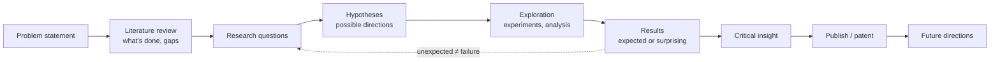
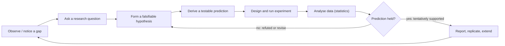
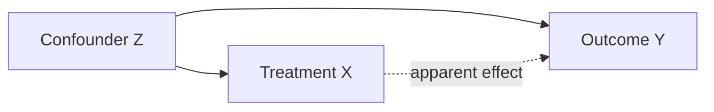

# 01 · Why Research? Course-based vs Research-based Learning & the Path to Research

> **Course:** Introduction to Research (I2R) · Dr. Muthusankar Eswaran (Asst. Prof., ECE) & Prof. S. R. Mahadeva Prasanna (Director, IIIT Dharwad)
>
> **Deck:** `PPT-1.pdf` (dated 22 Sep 2026, 39 slides). Taught over the first sessions; **29 Sep** (Prof. Prasanna) continued from "Qualifications for research".
>
> **Sources:** PPT + both 29 Sep transcripts (7:42 pm and 8:16 pm parts, including a long Q&A)
>
> **Companion:** [02 · Assignments Guide & Research Toolkit](02-Assignments-Guide-and-Research-Toolkit.md) · **Notebook:** [code/01_research_methods_hands_on.ipynb](code/01_research_methods_hands_on.ipynb)

---

## 📌 Table of Contents

**Part A · Course content (lectures)**

1. [Why This Course Exists](#1-why-this-course-exists)
2. [Course Logistics & Evaluation](#2-course-logistics--evaluation)
3. [Why Research? Big-Picture Motivation](#3-why-research-big-picture-motivation-)
4. [Definitions & Terminology](#4-definitions--terminology-)
5. [Research = Re-Search: The Basic Realisation](#5-research--re-search-the-basic-realisation-)
6. [Course-based vs Research-based Degree](#6-course-based-vs-research-based-degree-)
7. [Qualifications: Who Can Do Research?](#7-qualifications-who-can-do-research-)
8. [Selecting Good Courses & Investing Time](#8-selecting-good-courses--investing-time-)
9. [The Research Experience: Novel, Non-obvious, Often Simple](#9-the-research-experience-novel-non-obvious-often-simple-)
10. [What You Gain from Research](#10-what-you-gain-from-research-)
11. [The Path: Supervisor & Scholar (Phases I–III)](#11-the-path-supervisor--scholar-phases-iiii-)
12. [Meetings, Preparation & the Research Diary](#12-meetings-preparation--the-research-diary-)
13. [Learning to Do Research & Gauging Progress](#13-learning-to-do-research--gauging-progress-)
14. [The M.Tech Project Timeline (Credits & Hours)](#14-the-mtech-project-timeline-credits--hours)
15. [Time Allocation & Working with Others](#15-time-allocation--working-with-others-)
16. [Publishing: Q&A Insights from Class](#16-publishing-qa-insights-from-class-)

**Part B · Research methodology in depth**

17. [The Scientific Method & the Detailed Research Lifecycle](#17-the-scientific-method--the-detailed-research-lifecycle-)
18. [Types of Research: A Classification Map](#18-types-of-research-a-classification-map-)
19. [Reasoning: Induction, Deduction & Abduction](#19-reasoning-induction-deduction--abduction-)
20. [Research Design & Variables](#20-research-design--variables-)
21. [Validity & Reliability](#21-validity--reliability-)
22. [Hypotheses, Falsifiability & Statistical Testing](#22-hypotheses-falsifiability--statistical-testing-)
23. [Effect Size, Power & Sample Size](#23-effect-size-power--sample-size-)
24. [Worked Examples](#24-worked-examples-)
25. [The Reproducibility Crisis](#25-the-reproducibility-crisis-)
26. [Technology Readiness Levels (TRL)](#26-technology-readiness-levels-trl-)
27. [Real-World Case Studies](#27-real-world-case-studies-)
28. [Code Walkthrough: Companion Notebook](#28-code-walkthrough-companion-notebook-)

**Part C · Revision**

29. [Professor Emphasised](#29--professor-emphasised)
30. [Common Misconceptions](#30--common-misconceptions)
31. [Reflection / Exam Questions](#31--reflection--exam-questions)
32. [Practice Problems](#32--practice-problems)
33. [Cheat Sheet & Class-Note Template](#33--cheat-sheet--class-note-template)
34. [Go Deeper](#34--go-deeper-curated-links)

---

## 1. Why This Course Exists

The M.Tech's real value comes from the **4-semester project** (30 of 60 credits). **I2R is the "theory" behind that project**: the general principles of carrying out research, so that the **self-driven** project work goes well.

| Theory / lab courses | Research |
|---|---|
| Learn existing knowledge | **Create** new knowledge |
| Structured syllabus | Open-ended, uncertain |
| Become a **consumer** of knowledge | Become a **creator** of knowledge |

**Why now?** *"We are already talking about super-intelligence, not general intelligence… intelligence will become a commodity."* (Prof. Prasanna). Routine development work (even coding) is being automated. The most valued human skill is **problem solving**: taking a problem and getting to a solution, which *is* research.

> *"As a human, I give specs and see outputs coming, and check whether it is according to me."* Concepts still matter, because **you must be able to verify what an AI system produces.**

---

## 2. Course Logistics & Evaluation

- **2 credits** (1.5-0-0-4): 1.5 h × 12 lectures = 18 h + self-study ≈ 12 h. **Tuesdays, 7:45–9:15 pm.**
- **Everything is evaluated online and continuously.**

| Component | Weight | Detail |
|---|---|---|
| Attendance | up to 10% | 9/18 → 2.5% · 12/18 → 5% · 15/18 → 7.5% · 18/18 → 10% |
| **Video on** | up to 5% | 4/18 → 1.25% · 6/18 → 2.5% · 8/18 → 3.75% · 10/18 → 5% |
| **Class-note submission** | **15%** | 100% if within **24 h**, 75% ≤ 3 days, 50% ≤ 5 days, 0 after |
| Assignment 1 | 10% | Plan your research work (Phases I–IV), 4 weeks |
| Assignment 2 | 10% | GenAI tools for research, 8 weeks |
| Assignment 3 | 10% | Topic exploration + 5-paper literature review, 10 weeks |
| End-sem | 40% | |

Grades: A (10), A− (9), B (8), B− (7), C (6), C− (5), D (4).

> 💡 **Easy marks:** keep your **video on** in at least 10 sessions and **submit class notes within 24 hours**. That's 20% of the grade from habits alone. A ready template is in §20.

**Books:** DePoy, *Introduction to Research* (7th ed.) · Baijal, *Introduction to Research* · C. R. Kothari, *Research Methodology* · K. V. Raja Subramanian, *Generative AI for PhD Scholars: Ethical Use of AI in Research* (2025) · Mihir Bellare, [*The Ph.D Experience*](https://cseweb.ucsd.edu/~mihir/phd.html) (many slides on the research experience are adapted from it).

**Syllabus:** Introduction → Topic exploration & literature review → Research gaps, questions & hypotheses → Research exploration → Handling outcomes (expected vs surprising) → Patents, articles, presentations, reports, thesis & defence → Conclusions & future scope → GenAI for research → Principles & ethics (hard work, time management, health, patience, plagiarism).

---

## 3. Why Research? Big-Picture Motivation 🟢

**Research is how humanity moved:**

| From | To |
|---|---|
| Stone age | Generative AI |
| Walking | Supersonic jets |
| Smoke signals, drums, pigeons | 6G communication |
| Isolated villages in silos | A connected "global village" |
| No cure | Advanced treatment |

**The journey of every invention:** a **seed** in someone's mind (research question) → a **dream** (hypothesis) → **reality** (research exploration).

**Two mindsets:** **social** (contribute to society) vs **profit** (inventions, patents, royalties). Both are valid.

### Case study: COVID-19 (slides 13–14)

| Research helped to… | Without research… |
|---|---|
| Identify the virus (SARS-CoV-2) | Virus spreads uncontrollably |
| Develop vaccines (Covaxin, Covishield) | No vaccines |
| Improve testing (RT-PCR) | Infected people unidentified |
| Design treatment & oxygen protocols | Higher death rates |
| Provide data for policy | Government can't plan interventions |

> ***"Research turned fear into understanding and understanding into survival."***

### Thrust areas → enabling fields (national priorities)

| Thrust areas (problems) | Enabling fields (tools) |
|---|---|
| Education · Water · Energy · Food · Agriculture & environment · Health · Sovereign technology · At scale | **Data Science & AI** · Electronics · Computer Science · Quantum tech · VLSI · Semiconductors · Biotechnology · Mathematics |

These fields enable innovation through **sensing, computation, modelling and intelligent systems** to solve real societal problems. **Sovereign technology** (indigenous hardware and software) is a national need: *"Become torch-bearers of Atmanirbhar Bharat and Viksit Bharat."*

### Relevance now: the "need of the hour"
AI is disrupting every area and automating development work. Skills that keep you relevant: **coding, entrepreneurship, research and innovation**. *"Research and innovation is the DNA"*: dream big → study the existing solutions → find the gaps → create new solutions.

---

## 4. Definitions & Terminology 🟢

Three definitions of research (slide 16):

1. *Systematic investigation into and study of materials and sources in order to **establish facts and reach new conclusions**.*
2. *Creative and systematic work undertaken to **increase the stock of knowledge**.* (This is the OECD Frascati Manual definition.)
3. *To observe and understand **what everyone else has done so far** and do **what none have done so far**.*

| Term pair | Distinction | Example |
|---|---|---|
| **Research methodology** vs **research methods** | *Methodology* = the overall **strategy and rationale** (why this approach, how validity is ensured). *Methods* = the specific **techniques/tools** (survey, experiment, simulation, RCT) | Methodology: "quantitative experimental study with controlled baselines"; methods: "5-fold CV, t-test" |
| **Original / fundamental / primary** research | Generates **new** knowledge or data first-hand | Collecting new EEG data; proving a new theorem |
| *(vs secondary research)* | Analyses **existing** data/literature | Literature reviews, meta-analyses |
| **Scientific** vs **applied/engineering** research | Scientific: understand **why** (knowledge for its own sake). Applied: solve a **practical problem** | Discovering the Transformer's in-context learning mechanism vs building a Kannada voice assistant |
| **Invention** vs **innovation** | Invention: creating something **new** (patentable). Innovation: **bringing it into use** with value (product, process, adoption) | Inventing the lithium-ion cell (invention) vs UPI transforming payments in India (innovation) |

---

## 5. Research = Re-Search: The Basic Realisation 🟢

- A **research-based** programme is entirely different from a **course-oriented** one.
- Research exploration ≠ a laboratory course ≠ a project course.

**RE-SEARCH:**

- Several people **before you** looked at the question you're thinking about now.
- They did some work and documented it, but left an **unfinished agenda**.
- **You are not the first, hence search again!**
- Why didn't they find your solution? *They didn't look at it the way you did.*
- **You will not be the last** either, so identify **future directions** for those who follow.

> 💡 This is why **literature review** comes first: you must know what was already done before you can do "what none have done".

---

## 6. Course-based vs Research-based Degree 🟢

| Basis | Course-based study | Research-based study |
|---|---|---|
| Main focus | **Learning existing knowledge** through a structured curriculum | **Creating new knowledge** by exploring questions, solving problems, generating insights |
| Curriculum | Fixed, structured syllabus | Flexible, open-ended, driven by research questions |
| Teaching | Lectures, tutorials, assignments, exams | Investigation, experimentation, data collection & analysis |
| Duration | **Time-bound** (semester/year) | **Not time-bound** (months to years) |
| Evaluation | Exams, quizzes, assignments | Research thesis, dissertation, publications, presentations |
| Role of student | Learner | Researcher / investigator |
| Output | Grades, certificates, diploma | New knowledge, papers, patents, innovations |
| Guidance | Many instructors, defined subjects | **One-to-one** with a supervisor/mentor |
| Purpose | Build foundational knowledge & skills | Advance knowledge, solve real problems, contribute to society |

**Three crisp contrasts (slide 19):**

| Course-based | Research-based |
|---|---|
| **Deterministic**: the syllabus and exam are known | **Stochastic**: outcomes are uncertain |
| **One-to-many** (teacher → class) | **One-to-one** (supervisor ↔ scholar) |
| **Breadth** | **Depth** |

> In a research degree, *"a set of good courses are only **prerequisites**."* The real work is the literature review, seminars, exploration, papers/patents, presentations, thesis and defence.

**Prof. Prasanna on grades:** *"7.5–8 CPI is a good grade. As a working professional looking for a career change, nobody looks at 9 or 9.5 CPI. What matters is the work you have done."* **Don't equate scoring in theory courses with project success. They are different dimensions.**

---

## 7. Qualifications: Who Can Do Research? 🟢

- **ABCR: "Anybody with common sense can do research."**
- You **need not be an academic topper**.
- You must be **willing to invest time and work hard**, every week, not just before the presentation.
- Realise that a research degree is **different** from a course degree.
- Have **patience** when results don't come.
- ***"Walking slow is fine, but stopping completely is dangerous."***

**On uncertainty (29 Sep):** online posts make research sound mentally crushing. It isn't. Research is an **uncertain activity, like daily life**: you plan your day, surprises happen, and you handle them without fear. If your hypothesised result doesn't come, that's normal.

---

## 8. Selecting Good Courses & Investing Time 🟢

- For your **broad research area**, some courses provide crucial deeper knowledge.
- **Discuss with your supervisor**, select a set, and **take the coursework seriously**, for learning rather than grades.
- **Keep questioning:** *"How will this course's knowledge benefit my research?"*
- **Grasp the core concepts**, even if you can't solve every hard problem.

**Example (Prof. Prasanna):** if your project is in **healthcare**, take healthcare-related electives in semesters 2–4. *"Your transcript will then describe your interest; you won't have to stress it."* Courses can even come from other institutes (online) and be credited.

**This semester:** *Mathematical foundations (Applied Math), Machine Learning Paradigms and Introduction to Research are highly relevant to everyone's project.* Of the five 1-credit "Introduction to…" breadth courses, you credit **two**. Most students take **Gen AI** plus one application area (healthcare, SNLP, financial analytics…).

> 🔗 Prof. Prasanna's example: *"Applied Math gives you comfort with the equations you meet when reading research papers. 'I've studied this already' makes reading articles easier."*

---

## 9. The Research Experience: Novel, Non-obvious, Often Simple 🟡

**Myth:** research = solving some very hard problem nobody has solved.
**Reality:** usually there's an existing product or process, and you make an improvement that is **significant** and **non-obvious**.

- *Obvious* improvements are just engineering or system development: no new knowledge.
- *Significant & non-obvious* improvements count as research.

**Research is more than problem solving.** It's about:

1. **Conceptualising** the approach
2. **Formulating research questions**
3. Choosing **directions** (hypotheses) to solve them
4. **Exploration**
5. **Critical insight** into what you found

*"Problem solving is always there, but the role it plays varies"* by field (product, service, fundamental research). The course teaches the **general research lifecycle**, not one recipe:



**Key lessons (slides 23–24, from Bellare's *The Ph.D Experience*):**

- **When you have novelty, publish.**
- After finding a novel solution, you'll wonder why nobody did it before. *They didn't ask that question, or didn't look at it that way.*
- ***"Don't look down on simplicity; good research is often simple."*** Prof. Prasanna: when your solution turns out simple, you may doubt yourself (*"Is this proper? Why didn't others see it?"*). Simple ≠ trivial; others didn't look *through your lens*.
- Your first project likely won't be a famous hard problem; it'll be something where progress is step by step.
- ***"Don't start by thinking about a thesis. Your goal is to produce papers initially."*** The scope narrows semester by semester until the thesis is clear.

**Not getting the expected result is OK.** *"If at the end of the fourth semester you didn't get significant results, but can **explain why**, that is also research."* The committee grades **the path and the time invested**, not just the final number.

**Serendipity example:** read the history of **X-rays**. Röntgen (1895) wasn't looking for X-rays; he noticed an unexpected glow in his lab while experimenting with cathode rays, investigated it, and discovered them (first Nobel Prize in Physics, 1901). Surprising outcomes are part of research (a later syllabus topic: *expected vs surprising outcomes*).

---

## 10. What You Gain from Research 🟢

Beyond technical depth:

- **Confidence in rational thought** and how widely it applies.
- The **inclination and ability to research anything**, expecting to understand it.
- The confidence to **question everything** and look for better ways: *why is it done this way, and how could it be better?*
- The courage to **jump into a new area**, learn it quickly, and say something interesting. *"More than depth in one area, the courage to jump from area to area."*
- **Appreciation of creativity** in others and in all areas of life.
- Being **constructively critical**.

> ⚠️ **Be positively critical, not negatively critical (Prof. Prasanna).** Don't write *"previous work is poor; I have a magic wand."* Everyone contributed according to their ability and context. Say *"this could be improved like this"*, then build your question on it.

**Learning the "nuts and bolts" (the research lifecycle)** is the real goal, so that after the M.Tech, if you change sectors, you can turn any new problem into research questions and solve it.

---

## 11. The Path: Supervisor & Scholar (Phases I–III) 🟡

- **One-to-one** interaction, not a classroom.
- **Every supervisor's style differs** (each found success their own way), and every scholar's preparedness differs. Both sides must adapt.
- *"It is **your** research problem"* vs *"do what I say"*. **Choose a problem you own and find interesting**, not just a "hot topic" and not just what you're told.
- **End goal: make you an independent researcher.**

| Phase | Problem comes from | Your role | Typical timing (M.Tech) |
|---|---|---|---|
| — | Topic identification + literature review | Get ready to "jump in" | **Semester 1** |
| **Phase I** | **Well-defined problem** from the supervisor | Work judiciously → a good publication. (*"Spoon-feeding"*: builds confidence, but risks losing independence) | Semester 2 |
| **Phase II** | **Fuzzy problem**: even the supervisor isn't sure of the solution | Explore yourself, brainstorm with the mentor → good publication | Semester 3 |
| **Phase III** | **You are on your own** | Identify and solve independently | Semester 4 |

**Whom to contact (Q&A):** your **academic mentor** first → **project coordinator** (Dr. Siddharth, HoD) → **programme coordinator** (Dr. Muthusankar). For a problem outside your mentor's area, ask the mentor or coordinator to connect you with another faculty member. An external domain expert can be added through the academic mentor.

---

## 12. Meetings, Preparation & the Research Diary 🟢

### Meeting the supervisor

- **At least once a week** (twice if possible). **Urgent:** take an appointment anytime.
- **Meet even with no progress**: *"That's OK, as long as it's not a habit."*
- *"Working together is fun; both should enjoy."* Build **rapport**.
- **Don't keep problems to yourself.**
- **Explaining your work to someone gives YOU clarity.**
- *"A good deal of research is spontaneous and social."* Many novel ideas come **across the table**, not at the terminal.

### Preparing for meetings

- Prepare a clear presentation; plan the **order** of what you'll say.
- Being well prepared → faster communication and **better feedback**. Being fuzzy → lower-quality feedback.
- Structure: **brief recap of the last meeting → progress → questions / seek suggestions.**
- Treat it as **practice for larger audiences**. But not every meeting needs slides; *"don't go overboard."*

### Research diary

- Take a **notebook** to every meeting; **take notes**, even if it takes time.
- **Ask for clarification or repetition** if needed.
- Make sure you both agree on the **technical issues and next steps**.
- Leave with clarity on **tasks, questions and deliverables** until the next meeting, **written down**.

➡️ Templates for a meeting agenda and diary entry: [Note 02](02-Assignments-Guide-and-Research-Toolkit.md#5-templates).

---

## 13. Learning to Do Research & Gauging Progress 🟢

**Four ways of learning:**

| Mode | Meaning |
|---|---|
| **Learning by thinking** | *"The first rule of research is to think, think and think again. Thinking is fun; if you don't find it so, you may be in the wrong business."* |
| **Learning by example** | Watch how research is done and extrapolate |
| **Natural learning** | Be positive toward learning: appreciate existing work, be positively critical |
| **Understanding vs knowledge** | *"More important to understand well what you know than to know a lot."* Good understanding becomes new knowledge |

**Am I on track?**

- Measures: **understanding → knowledge creation → publications**. Quality publications matter.
- *"Research work is not a job."* You should be **convinced internally** of phase-by-phase improvement.
- **Suggested M.Tech milestones (slide 32):**

| End of | Milestone |
|---|---|
| Semester 1 | **Problem statement finalised** (with literature review) |
| Semester 2 | **First novel result** |
| Semester 3 | **Second novel result + one research article** |
| Semester 4 | **Third novel result + thesis** |

- Develop **communication skills**: clear talks, and clear, correct technical papers.

**Changing the problem is allowed.** Example from an earlier cohort: a student wanted to do depression analysis from **EEG**, with data via friends at NIMHANS. After a semester he still couldn't get the data, so he kept the broad EEG area but switched to **imagined-speech recognition**, where data was available. *"Grades are not based on whether you froze the problem."* But by the **end of semester 1**, you must show an identified problem plus a literature review.

> ⚠️ **Feasibility check (lesson from that example):** before committing, verify **data access, compute and timeline**.

---

## 14. The M.Tech Project Timeline (Credits & Hours)

| Semester | Project credits | Expected effort | Focus |
|---|---|---|---|
| 1 | 3 | ~6 h/week ≈ **70–80 h** | Topic identification, literature review, problem statement |
| 2 | 6 | ≈ **150 h** | Phase I: first novel result |
| 3 | 9 | ≈ **225 h** | Phase II: second result + article |
| 4 | 12 | ≈ **300 h** | Phase III: third result + thesis & defence |
| **Total** | **30** (+ 4 for I2R, literature review & seminar) | ~750 h | **Half of all M.Tech credits** |

- The evaluation committee checks whether your **volume of work matches the credits**, and whether you **understood** the problem, not just a slick presentation built the night before.
- **Document as you go** (papers, diary): by semester 4 you won't remember semester-1 details.
- **End-of-semester Research Conclave:** present a **poster** of your progress to faculty and research scholars to get early feedback.

---

## 15. Time Allocation & Working with Others 🟢

**Time:**

- Styles vary: inspiration/deadline-driven bursts vs a steady 9-to-5 schedule. **Find what works for you.**
- Judge **long-term productivity** (a quarter or a year), not single days.
- *"If a long period passes without significant progress, you should worry."*

**Collaboration:**

- *"Good research needs collaboration."* You learn more and produce more by interacting.
- Talk to your advisor **and to peers**; do joint work, but balance your own pace with theirs.
- **National/international collaborations** give teamwork, faster progress and **recognition**.

---

## 16. Publishing: Q&A Insights from Class 🟡

### "Should I publish early? What if someone copies my idea?"

- **Publish as soon as you have novelty.** In 3 decades, Prof. Prasanna hasn't seen idea theft happen except in rare cases.
- Others may **simultaneously** solve the same problem, but **their journey won't be identical to yours**. That's where uniqueness lies.
- **The big advantage:** a publication is **independently vetted by anonymous reviewers**. If an external thesis examiner later says "not novel", your peer-reviewed papers are the evidence.

### Conference vs journal paper

| | Conference paper | Journal paper |
|---|---|---|
| Prof. Prasanna's analogy | **"0–90° work"**: one quadrant explored, enough to show significant novelty | **"360° work"**: exhaustive, all scenarios explored |
| Presentation | An author presents in person and can answer "what about the other quadrants?" | No author present; everything must be on paper |
| Time | ~3 months of work | ~1 year |
| Strategy | **Register the idea early** (get a priority date) | Extend the conference version significantly → journal |

### arXiv: safe?
Yes: **arXiv gives you a priority date.** If a similar paper appears while yours is under review, your arXiv timestamp shows you were first. (You don't go to court; it establishes precedence.)

### Review papers: write early or late?
Traditionally written by researchers with **5–10 years** in the field, who can give the **holistic big picture**. A novice can only summarise papers. Reviews get **more citations** than research articles, hence their popularity. **Good approach: co-author a review with a mentor who works in the field.**

### Where to publish?

- Venues are tiered: **journals Q1–Q4** (Q1 = top quartile, e.g. by SCImago/JCR), informally **Tier 1–4**. CS conferences are rated **A\*, A, B, C** (the **CORE** ranking).
- Choose **top venues relevant to your problem** with your mentor. A healthcare *economics* journal is wrong for a healthcare *technology* paper.
- **IEEE Transactions** are generally Tier-1/Q1, but **not all Q1 journals are Transactions**.
- Rankings are imperfect. **ICASSP** (est. 1976) is the "who's who" of speech, yet rated **B** in CORE, because only ~¼ of it is speech (the rest is image, video, audio). **Interspeech** (100% speech) is rated **A**. *"Anything below Tier 1–2: the review is not rigorous."*

### Patents & startups

- If you prefer a product or startup, **file a patent instead of (or before) publishing**. **A patent counts as a publication for grading.**
- You can file a **provisional patent** and then publish (describing the process without revealing everything).
- The institute will arrange a session with a **Professor of Practice from an IPR organisation**; there's also a **research park** to incubate startups.

### Big players already in my area?
Dreaming big is good, but check **practical feasibility of demonstrating novelty** within your time. If you have something valuable, **safeguard it with IP** before big players notice.

### Two interests (telecom & healthcare): pick one
*"You can't take two problems as a working professional; you don't have enough time."* Also weigh **who the customers are** and whether you can deploy independently (6G is dominated by Nokia/Ericsson-scale players; healthcare products may be more accessible). The whole semester is available to finalise the problem.

---

## 17. The Scientific Method & the Detailed Research Lifecycle 🟡

> **Scope.** Sections 17–28 deepen the course's "research lifecycle" (slides on research questions, hypotheses and exploration) with standard research-methodology theory from the course books (Kothari; DePoy). The statistics in §22–§24 is 🔴 **beyond syllabus**, but it is exactly what an M.Tech project report needs when claiming "my model is better".

### 17.1 The scientific-method cycle

The scientific method is not a straight line but a **loop**: every answer produces new questions.



Why each step exists:

| Step | Purpose | What goes wrong if skipped |
|---|---|---|
| Observation | Grounds the work in a real phenomenon or gap | Solving a problem nobody has |
| Question | Fixes **what exactly** is unknown | Endless, unfocused "exploration" |
| Hypothesis | Commits to a **specific, refutable** answer | Results can never be wrong, so they mean nothing |
| Prediction | Turns the hypothesis into a measurable consequence | No way to test it |
| Experiment | Produces evidence under **controlled** conditions | Anecdotes instead of evidence |
| Analysis | Separates signal from noise (chance) | Mistaking luck for discovery |
| Conclusion and report | Lets others check and build on it | Knowledge that dies with the researcher |

**Key idea: evidence supports, it never proves.** A hypothesis that survives a test is *corroborated*, not proven; the next experiment may refute it. Mathematics is the exception: a theorem, once proved, stays proved.

### 17.2 The detailed research lifecycle mapped to the M.Tech

The course's lifecycle (§9) expanded into concrete activities and the semester where each happens:

| # | Stage | Concrete activities | Output | M.Tech timing |
|---|---|---|---|---|
| 1 | Area selection | Match interest, mentor expertise, data, compute | Broad area (e.g. "speech for Indian languages") | Sem 1, weeks 1–4 |
| 2 | Literature review | Search (Scholar, IEEE Xplore, arXiv), read 20–50 papers, 3-pass reading, build a comparison table | Survey table + gap list | Sem 1 |
| 3 | Gap identification | What fails, for whom, under which conditions? | 1–3 candidate gaps | Sem 1 |
| 4 | Problem statement and RQs | One-paragraph problem; 2–3 answerable RQs | Problem statement (end of Sem 1 milestone) | Sem 1 end |
| 5 | Hypotheses | Testable directions, each with a predicted measurable effect | H₁, H₂ … with success criteria | Sem 2 start |
| 6 | Research design | Data, baselines, metrics, variables, controls, statistics, sample size | Experiment plan | Sem 2 |
| 7 | Exploration | Implementation, experiments, ablations, error analysis | Results (expected or surprising) | Sem 2–4 |
| 8 | Analysis and insight | Significance, effect sizes, *why* it works or fails | Critical insight | Sem 2–4 |
| 9 | Dissemination | Conference paper → journal; patent; posters at the Research Conclave | Publications / IP | Sem 3–4 |
| 10 | Thesis and defence | Integrate results, conclusions, future scope | Thesis | Sem 4 |

### 17.3 From problem to question to hypothesis

| Level | Form | Example |
|---|---|---|
| Area | A field | Speech recognition |
| Topic | A sub-problem | ASR for low-resource Indian languages |
| Problem statement | What is wrong, for whom, why it matters | "Open ASR models have word error rates (WER) above 40 % on conversational Kannada, limiting voice access for rural users." |
| Research question | An answerable question | "Does fine-tuning on 50 h of synthetic speech reduce WER on conversational Kannada?" |
| Hypothesis | A falsifiable, directional claim | "Fine-tuning on 50 h synthetic + 10 h real data reduces WER by at least 5 points compared with 10 h real data alone." |

A good research question is **FINER**: **F**easible, **I**nteresting, **N**ovel, **E**thical, **R**elevant (a checklist widely used in clinical research, equally useful in engineering). The EEG example in §13 is a FINER failure on *Feasible*: the data never arrived.

---

## 18. Types of Research: A Classification Map 🟡

The same study can be classified along several **independent axes**. Naming the axes forces clarity about what the study can and cannot claim.

| Axis | Categories | Question it answers | Engineering example |
|---|---|---|---|
| **Purpose** | **Basic** (fundamental) vs **applied** | Knowledge for its own sake, or a practical problem? | Why does in-context learning emerge (basic) vs a crop-disease app (applied) |
| **Objective / depth** | **Exploratory** · **descriptive** · **explanatory** (causal) | What is out there? What is it like? Why does it happen? | Survey of Indian-language datasets · measuring WER across dialects · showing that noise *causes* the WER gap |
| **Data** | **Quantitative** · **qualitative** · **mixed methods** | Numbers, meanings, or both? | Accuracy and latency · interviews with farmers about app use · both |
| **Control** | **Experimental** (researcher manipulates the variable, ideally randomly) vs **observational** (just measures) | Can it establish cause? | A/B test of two recommenders vs mining logs of past usage |
| **Time** | **Cross-sectional** (one time point) vs **longitudinal** (same units over time) | A snapshot or change over time? | One-day survey of UPI users vs tracking the same merchants' UPI adoption for 3 years |
| **Setting** | Laboratory · field · simulation | How realistic is the environment? | Benchmark dataset · deployed in a hospital · network simulator (ns-3) |
| **Source** | Primary vs secondary | New data or existing data? | Collecting EEG vs a meta-analysis |
| **Reasoning** | Inductive vs deductive (see §19) | Theory-building or theory-testing? | Pattern-mining logs vs testing a predicted scaling law |

Two further engineering-specific types:

- **Design science / constructive research:** build an artefact (algorithm, system, device) and evaluate it against requirements. Most M.Tech projects are this type.
- **Quasi-experiments:** the researcher compares groups but **cannot randomise** (e.g. comparing two hospitals that already use different software). Causal claims are weaker than in a true experiment.

**Why the control axis matters most.** Only a **randomised experiment** guarantees that, on average, the groups differ *only* in the treatment, so a difference in outcome can be attributed to the treatment. Observational studies must argue away every confounder (§20.3).

---

## 19. Reasoning: Induction, Deduction & Abduction 🟡

| | Deduction | Induction | Abduction |
|---|---|---|---|
| Direction | General → specific | Specific → general | Surprising observation → best explanation |
| Form | All A are B; x is A; so x is B | Every observed A was B; so (probably) all A are B | B is observed; if A were true, B would follow; so A is plausible |
| Certainty | Conclusion **certain** if premises true and the argument valid | Conclusion **probable**; can be overturned by one counter-example | Conclusion is a **hypothesis** to test |
| Role in research | Deriving predictions from a theory; proofs | Generalising from experiments; building theory | Generating hypotheses (often the creative step) |
| Example | "Attention cost grows as n² in sequence length; so doubling n quadruples attention FLOPs." | "Larger models were better on all 30 benchmarks tried; so scale improves performance." | "Röntgen saw a screen glow while the tube was covered; something invisible must pass through the cover." |

**The problem of induction (Hume).** No finite number of observations proves a universal claim: "all swans are white" was believed in Europe until black swans were found in Australia. **Popper's answer (falsificationism):** science advances not by proving theories but by **trying to refute** them. A claim is scientific only if some possible observation could show it false.

**Why the asymmetry?** For a universal hypothesis H and a prediction P derived from it:

```math
\begin{aligned}
&\text{Modus tollens (valid):} && (H \Rightarrow P),\ \neg P \ \vdash\ \neg H \\
&\text{Affirming the consequent (invalid):} && (H \Rightarrow P),\ P \ \nvdash\ H
\end{aligned}
```

One failed prediction refutes H (if the experiment itself is sound); any number of successes only corroborate it.

In a real project the three combine: **abduction** proposes a hypothesis from a surprising error pattern, **deduction** derives what should happen in a new experiment if the hypothesis is right, and **induction** generalises from the experiments run.

---

## 20. Research Design & Variables 🟡

**Research design** is the blueprint that links the research question to the evidence: what is manipulated, what is measured, on whom, how many times, under what controls, and how the data will be analysed. **It is fixed before the experiment**; deciding the analysis after seeing the data invites bias (§25).

### 20.1 Kinds of variables

| Variable | Definition | ML example | Clinical example |
|---|---|---|---|
| **Independent (IV)** | What the researcher changes (the "cause" under study) | Model architecture; augmentation on/off | Vaccine vs placebo |
| **Dependent (DV)** | What is measured (the "effect") | Accuracy, F1, WER, latency | Symptomatic infection |
| **Controlled (constant)** | Kept fixed so they cannot explain the result | Same data split, epochs, tokenizer, hardware | Same follow-up period |
| **Confounding** | Affects **both** IV and DV and is not controlled, creating a spurious association | Bigger model also got more tuning time | Healthier people chose to get vaccinated |
| **Extraneous / nuisance** | Adds noise to the DV but is unrelated to the IV | Random seed, GPU non-determinism | Day-to-day measurement error |
| **Mediating** | Lies on the causal path IV → M → DV | Augmentation → robustness to noise → lower WER | Vaccine → antibodies → protection |
| **Moderating** | Changes the strength of the IV → DV effect | Augmentation helps only for short utterances | Vaccine efficacy differs by age |

### 20.2 Operationalisation

An abstract construct must be turned into a measurable variable. "Model is **better**" might mean higher accuracy, higher F1 on the minority class, lower latency or lower energy. **Choosing the DV is a research decision**; a wrong choice (e.g. plain accuracy on 99 %-negative fraud data) can make a useless model look excellent.

### 20.3 Confounding: why correlation is not causation



If Z drives both X and Y, X and Y are correlated even if X has **no** effect on Y. Remedies, in order of strength:

1. **Randomisation:** assign X by coin flip, so Z cannot influence X. On average Z is balanced across groups.
2. **Control by design:** hold Z fixed (same tuning budget for both models), or **match** units on Z.
3. **Stratification:** compare within levels of Z, then combine (see Simpson's paradox, §24 WE5).
4. **Statistical adjustment:** include Z as a covariate in a regression. This only works for **measured** confounders.

### 20.4 Common designs

| Design | Structure | Strength | Weakness |
|---|---|---|---|
| Between-subjects | Each unit gets one condition | No carry-over | Needs more units; groups may differ |
| Within-subjects / paired | Each unit gets all conditions (e.g. both models on the same seed and split) | Removes unit-to-unit variation, so more power | Order or carry-over effects (in human studies) |
| Factorial (2×2…) | Several IVs crossed | Detects interactions | Number of cells grows fast |
| Randomised controlled trial (RCT) | Random allocation, control group, often blinding | Gold standard for causation | Expensive; may not generalise |
| Ablation study (ML) | Remove one component at a time | Attributes the gain to components | Components can interact |
| Pre-test / post-test | Measure before and after an intervention | Simple | History effects without a control group |

---

## 21. Validity & Reliability 🟡

**Reliability** = consistency: do repeated measurements give the same result? **Validity** = accuracy of the conclusion: does the study measure what it claims, and do its conclusions hold?

The archery analogy: tightly clustered arrows far from the bull's-eye are **reliable but not valid**; arrows scattered evenly around the bull's-eye are valid on average but unreliable. **Reliability is necessary but not sufficient for validity.**

| Type | Question | Threats | ML example of a threat | Remedy |
|---|---|---|---|---|
| **Internal validity** | Did the IV really **cause** the change in the DV? | Confounding, selection bias, history, maturation, instrumentation changes | Test data leaked into training; the new model got more tuning | Randomisation, controls, identical pipelines, leakage checks |
| **External validity** | Does the result **generalise** to other people, settings, times? | Unrepresentative samples, lab-only settings | Trained and tested on studio speech, deployed on phone calls | Diverse test sets, field trials, cross-dataset evaluation |
| **Construct validity** | Does the measure capture the **intended concept**? | Poor operationalisation, mono-method bias | Measuring "fairness" by overall accuracy; BLEU as a proxy for translation quality | Multiple metrics, human evaluation, validated instruments |
| **Statistical conclusion validity** | Is the statistical inference correct? | Low power, wrong test, multiple comparisons, p-hacking | One run per model; 20 metrics tested, best one reported | Power analysis, correct test, correction for multiple tests |

**Types of reliability:**

| Type | Meaning | Typical statistic |
|---|---|---|
| Test–retest | Same measure, same subjects, two occasions | Correlation between occasions |
| Inter-rater (inter-annotator) | Different raters label the same items | Cohen's κ (2 raters), Fleiss' κ (many) |
| Internal consistency | Items in a questionnaire measure the same construct | Cronbach's α |
| Run-to-run (computational) | Same code, different seeds | SD across seeds |

**Cohen's kappa** corrects raw agreement for agreement expected by chance:

```math
\kappa = \frac{p_o - p_e}{1 - p_e}, \qquad p_e = \sum_{k} p_{k}^{(1)}\, p_{k}^{(2)}
```

where $`p_o`$ is the observed proportion of agreement and $`p_{k}^{(r)}`$ is the proportion of items rater $`r`$ put in class $`k`$. **Why the formula:** two raters labelling at random with their own base rates would agree on a fraction $`p_e`$ purely by chance; κ measures how much of the remaining room $`1-p_e`$ is achieved. κ = 1 is perfect agreement, κ = 0 is chance level. Common (rough) reading: 0.61–0.80 substantial, above 0.80 almost perfect.

---

## 22. Hypotheses, Falsifiability & Statistical Testing 🔴

### 22.1 What makes a good hypothesis

A research hypothesis is a **tentative, testable answer** to the research question. It should be:

1. **Falsifiable:** some possible result would show it wrong. "Our method may improve performance in some settings" can never fail, so it is not a hypothesis.
2. **Specific and directional:** names the variables, the direction and ideally the size of the effect.
3. **Grounded:** follows from the literature or a mechanism, not from a guess.
4. **Operational:** says how the variables are measured.

### 22.2 Null and alternative hypotheses

Statistical testing reformulates the research hypothesis as two complementary statements about a population parameter (for example the mean accuracy gain $`\mu_D`$):

```math
H_0:\ \mu_D = 0 \quad(\text{no effect}) \qquad\qquad H_1:\ \mu_D \neq 0 \ \ (\text{two-sided}) \ \text{ or } \ \mu_D > 0 \ \ (\text{one-sided})
```

The test assumes $`H_0`$ and asks whether the data would be **surprising** under it. This is proof by contradiction made probabilistic: if the data are very unlikely when $`H_0`$ is true, $`H_0`$ is rejected in favour of $`H_1`$.

### 22.3 The p-value

```math
p = P\left(\text{test statistic at least as extreme as observed} \ \middle|\ H_0 \text{ true}\right)
```

**What a p-value is NOT** (American Statistical Association statement, 2016):

- It is **not** the probability that $`H_0`$ is true.
- It is **not** the probability that the result happened "by chance".
- p < 0.05 does **not** mean the effect is large or important.
- p > 0.05 does **not** prove there is no effect ("absence of evidence is not evidence of absence").
- Scientific conclusions should not rest on whether p crosses a threshold alone; report effect sizes and confidence intervals.

### 22.4 Errors and decisions

| | $`H_0`$ actually true | $`H_0`$ actually false |
|---|---|---|
| **Reject** $`H_0`$ | **Type I error** (false positive), probability α | Correct: **power** = 1 − β |
| **Fail to reject** $`H_0`$ | Correct, probability 1 − α | **Type II error** (false negative), probability β |

- **α** (significance level, usually 0.05) is chosen by the researcher **before** seeing the data.
- **β** depends on the true effect size, the noise, the sample size and α. Reducing α (stricter test) raises β unless n grows.
- Courtroom analogy: $`H_0`$ = "innocent". A Type I error convicts an innocent person; a Type II error acquits a guilty one. The legal system sets α small ("beyond reasonable doubt") and accepts a larger β.

### 22.5 The t-test, derived

Given n paired differences $`d_1, \dots, d_n`$ (e.g. accuracy of B minus A on the same seed), with sample mean $`\bar{d}`$ and sample standard deviation $`s_d`$:

1. If the $`d_i`$ are independent with mean $`\mu_D`$ and SD σ, then $`\bar{d}`$ has mean $`\mu_D`$ and standard deviation $`\sigma/\sqrt{n}`$ (the **standard error**), because the variance of a sum of independent terms is the sum of variances: $`\text{Var}(\bar{d}) = n\sigma^2/n^2 = \sigma^2/n`$.
2. Standardising under $`H_0: \mu_D = 0`$ gives $`z = \bar{d}/(\sigma/\sqrt{n})`$, which is standard normal if the $`d_i`$ are normal (or approximately, for large n, by the central limit theorem).
3. σ is unknown, so it is replaced by $`s_d`$. This extra uncertainty makes the statistic follow **Student's t** distribution with $`n-1`$ degrees of freedom (one degree of freedom is used up estimating the mean):

```math
t = \frac{\bar{d}}{s_d / \sqrt{n}} \ \sim\ t_{n-1} \quad \text{under } H_0, \qquad s_d = \sqrt{\frac{1}{n-1}\sum_{i=1}^{n} (d_i - \bar{d})^2}
```

For **two independent groups** with unequal variances, **Welch's t-test** uses

```math
t = \frac{\bar{x}_B - \bar{x}_A}{\sqrt{\dfrac{s_A^2}{n_A} + \dfrac{s_B^2}{n_B}}}, \qquad
\nu \approx \frac{\left(\dfrac{s_A^2}{n_A} + \dfrac{s_B^2}{n_B}\right)^2}{\dfrac{(s_A^2/n_A)^2}{n_A - 1} + \dfrac{(s_B^2/n_B)^2}{n_B - 1}}
```

(the Welch–Satterthwaite approximation for the degrees of freedom ν).

**Why pairing helps.** For paired data, $`\text{Var}(B - A) = \sigma_A^2 + \sigma_B^2 - 2\rho\,\sigma_A\sigma_B`$. When the two models share split-to-split noise (correlation ρ close to 1), the variance of the difference is much smaller than $`\sigma_A^2 + \sigma_B^2`$, which is what an unpaired test assumes. Worked Example 2 (§24) shows the same data giving p ≈ 0.18 unpaired and p ≈ 0.001 paired.

### 22.6 Comparing two accuracies

- **Independent test sets** (rare in ML): two-proportion z-test with pooled proportion $`\hat{p}`$:

```math
z = \frac{\hat{p}_B - \hat{p}_A}{\sqrt{\hat{p}(1-\hat{p})\left(\dfrac{1}{n_A} + \dfrac{1}{n_B}\right)}}
```

- **Same test set** (the usual case): **McNemar's test** uses only the discordant items, b = (A right, B wrong) and c = (A wrong, B right). Under $`H_0`$ each discordant item is equally likely to go either way, so b ~ Binomial(b + c, 0.5). The large-sample statistic is

```math
\chi^2 = \frac{(b - c)^2}{b + c} \ \sim\ \chi^2_1, \qquad \chi^2_{\text{cc}} = \frac{(\lvert b - c\rvert - 1)^2}{b + c} \ \ (\text{continuity-corrected})
```

Items both models get right (or both get wrong) carry **no information** about which is better.

### 22.7 Multiple comparisons

If k independent tests are each run at level α and all null hypotheses are true,

```math
P(\text{at least one false positive}) = 1 - (1 - \alpha)^k
```

because each test avoids a false positive with probability 1 − α and independence lets the probabilities multiply. For α = 0.05 and k = 20 this is 0.6415. **Bonferroni correction:** test each at α/k. By the union bound, $`P(\cup_i E_i) \le \sum_i P(E_i) = k \cdot \alpha/k = \alpha`$, and this holds **even without independence**.

---

## 23. Effect Size, Power & Sample Size 🔴

### 23.1 Effect size

A p-value mixes **how big** an effect is with **how much data** there is (notebook Part 2: the same effect gives median p = 0.26 with 3 runs and p < 0.0001 with 50). An **effect size** measures magnitude alone.

```math
d = \frac{\bar{x}_B - \bar{x}_A}{s_p}, \qquad s_p = \sqrt{\frac{(n_A - 1)s_A^2 + (n_B - 1)s_B^2}{n_A + n_B - 2}}
```

Cohen's rough benchmarks: d = 0.2 small, 0.5 medium, 0.8 large (originally for behavioural science; in ML benchmarks with tiny run-to-run noise, d values above 2 are common, so **also report the raw difference** in accuracy points). For paired designs, $`d_z = \bar{d}/s_d`$.

**Statistical vs practical significance.** With a million test items, a 0.05-point accuracy gain can have p < 0.001 yet be useless in practice. With 5 seeds, a 2-point gain can have p = 0.2 yet be worth pursuing with more runs.

### 23.2 Confidence intervals

A 95 % confidence interval for a mean gain is

```math
\bar{d} \ \pm\ t_{0.975,\,n-1} \cdot \frac{s_d}{\sqrt{n}}
```

**Interpretation:** if the whole experiment were repeated many times, 95 % of the intervals built this way would contain the true mean gain. A CI shows **both** size and uncertainty; a CI excluding 0 corresponds to p < 0.05 for a two-sided test.

### 23.3 Sample size for a margin of error (derivation)

Goal: estimate a proportion p (e.g. the share of users who prefer a feature, or a model's accuracy) to within ±E with 95 % confidence.

1. The sample proportion $`\hat{p}`$ has standard error $`\sqrt{p(1-p)/n}`$ (binomial variance divided by $`n^2`$).
2. By the normal approximation, $`\hat{p}`$ lies within $`z_{0.975}\sqrt{p(1-p)/n}`$ of p with probability 0.95, where $`z_{0.975} = 1.96`$.
3. Set this half-width equal to E and solve:

```math
E = z\sqrt{\frac{p(1-p)}{n}} \ \ \Longrightarrow\ \ n = \frac{z^2\, p(1-p)}{E^2}
```

4. **Worst case p = 0.5:** $`p(1-p)`$ has derivative $`1 - 2p`$, which is zero at p = 0.5, and the second derivative −2 < 0, so the maximum is 0.25. Using p = 0.5 when nothing is known guarantees the margin.
5. **For a mean** with known (or pilot-estimated) SD σ: $`n = (z\sigma/E)^2`$.
6. **Finite population** of size N: $`n = n_0 / \left(1 + (n_0 - 1)/N\right)`$.

Because n grows as $`1/E^2`$, **halving the margin needs four times the sample**.

### 23.4 Power and sample size for comparing two groups

For a two-sided two-sample test with standardised effect d, the normal approximation gives, per group,

```math
n \approx \frac{2\,(z_{1-\alpha/2} + z_{1-\beta})^2}{d^2}
```

**Derivation sketch.** Under $`H_1`$ the z-statistic is approximately normal with mean $`d\sqrt{n/2}`$ and variance 1 (the difference of two means has SD $`\sigma\sqrt{2/n}`$). Rejection happens when the statistic exceeds $`z_{1-\alpha/2}`$. Power 1 − β requires $`d\sqrt{n/2} - z_{1-\alpha/2} = z_{1-\beta}`$; squaring and solving for n gives the formula. For α = 0.05 and power 0.8: $`z_{0.975} = 1.95996`$, $`z_{0.8} = 0.84162`$, so d = 0.5 needs $`2(2.80158)^2/0.25 = 62.79`$, i.e. **63 per group** (notebook Part 4 confirms exact power 0.795 at n = 63).

---
## 24. Worked Examples 🟡

All numbers below were computed in Python and are reproduced in the [companion notebook](code/01_research_methods_hands_on.ipynb) (Parts 4, 6–11).

### WE1 · From a vague idea to a testable hypothesis (five ideas)

The recipe: **idea → problem statement (who suffers, how much, why) → research question → falsifiable hypothesis with a number → variables.**

| Vague idea | Problem statement | Research question | Testable hypothesis | IV | DV | Controls |
|---|---|---|---|---|---|---|
| "Use AI for crop disease" | Smallholder farmers lack timely diagnosis of tomato leaf disease; lab-trained classifiers lose accuracy on phone photos taken in the field | Does training with field-style augmentation (blur, shadows, cluttered backgrounds) reduce the lab-to-field accuracy drop? | Augmented training reduces the lab-to-field accuracy drop from the baseline by at least 10 points | Augmentation (on/off) | Accuracy on a held-out set of field photos | Same backbone, epochs, test set, seeds |
| "Make UPI fraud detection better" | Fraud is under 1 % of transactions, so accuracy is meaningless and rare fraud patterns are missed | Does adding graph features (payer–payee network) improve detection of rare fraud? | Graph features raise PR-AUC by at least 0.05 at the same false-positive budget | Feature set (tabular vs tabular + graph) | PR-AUC; recall at 1 % FPR | Same time-based split, same model family |
| "Detect depression from speech" | Screening needs clinicians; speech is cheap to collect, but models trained on one corpus fail on others | Do prosodic features generalise across corpora better than spectrogram embeddings? | The cross-corpus F1 drop is smaller for prosodic features than for embeddings | Feature type | Cross-corpus F1 | Same classifier, same label definition (e.g. PHQ-8 ≥ 10) |
| "Reduce LLM hallucination" | Chatbots in customer support invent policy details | Does retrieval-augmented generation (RAG) reduce unsupported claims compared with the same model without retrieval? | RAG reduces the rate of unsupported claims by at least 30 % (relative) on a 500-question set | Retrieval (on/off) | % answers with an unsupported claim (2 annotators, κ reported) | Same model, prompt template, temperature 0 |
| "Smart traffic lights" | Fixed-time signals at a junction cause long peak-hour queues | Does an adaptive controller reduce average waiting time compared with fixed-time control? | Average waiting time falls by at least 15 % in simulation at peak demand | Controller type | Mean waiting time per vehicle | Same simulated demand, road network, random seeds |

**Sanity check:** each hypothesis could clearly turn out **false** (falsifiable), names a number (success criterion), and the controls remove the most obvious alternative explanation.

### WE2 · Paired vs Welch t-test by hand: is Model B better than Model A?

Two models are trained on 5 seeds; on each seed **both use the same train/test split**.

| Seed | 1 | 2 | 3 | 4 | 5 |
|---|---|---|---|---|---|
| Model A accuracy | 0.800 | 0.825 | 0.809 | 0.840 | 0.818 |
| Model B accuracy | 0.817 | 0.834 | 0.826 | 0.854 | 0.829 |
| d = B − A | 0.017 | 0.009 | 0.017 | 0.014 | 0.011 |

$`H_0: \mu_D = 0`$ vs $`H_1: \mu_D \neq 0`$, α = 0.05.

**(a) Welch (unpaired, wrong for this design).**

- Means: $`\bar{x}_A = 4.092/5 = 0.8184`$, $`\bar{x}_B = 4.160/5 = 0.8320`$; difference 0.0136.
- Squared deviations sum to 0.0009372 for A and 0.0007580 for B, so $`s_A^2 = 0.0009372/4 = 0.0002343`$ and $`s_B^2 = 0.0001895`$.
- $`\text{SE} = \sqrt{0.0002343/5 + 0.0001895/5} = \sqrt{0.00008476} = 0.009207`$.
- $`t = 0.0136/0.009207 = 1.477`$, Welch df ν = 7.91, critical value $`t_{0.975,\,7.91} = 2.31`$.
- p = 0.178 → **fail to reject** $`H_0`$.

**(b) Paired (correct).**

- $`\bar{d} = 0.068/5 = 0.0136`$.
- Deviations $`d_i - \bar{d}`$: 0.0034, −0.0046, 0.0034, 0.0004, −0.0026. Squares: 1.156, 2.116, 1.156, 0.016, 0.676 (×10⁻⁵); sum 5.12 × 10⁻⁵.
- $`s_d^2 = 5.12\times 10^{-5}/4 = 1.28 \times 10^{-5}`$, so $`s_d = 0.003578`$.
- $`\text{SE} = 0.003578/\sqrt{5} = 0.0016`$, and $`t = 0.0136/0.0016 = 8.50`$ with 4 df.
- Critical value $`t_{0.975,4} = 2.776`$; p = 0.00105 → **reject** $`H_0`$.
- 95 % CI: $`0.0136 \pm 2.776 \times 0.0016 = [0.0092,\ 0.0180]`$. Effect size $`d_z = 0.0136/0.003578 = 3.80`$.

**Interpretation.** Model B is about 1.4 accuracy points better (95 % CI 0.9 to 1.8 points). The Welch test missed this because the seeds' difficulty varies a lot (A ranges over 4 points) and both models move together (correlation 0.975); the paired test cancels the shared variation.

**Sanity check:** B beats A on **all 5** seeds. Under $`H_0`$ (a fair coin for each seed) that has probability $`2 \times 0.5^5 = 0.0625`$ two-sided, a cruder test (the sign test) pointing the same way.

### WE3 · Two classifiers on 1000 test items: z-test vs McNemar

Model A gets 850/1000 correct, Model B 875/1000.

**(a) If the two test sets were independent:** pooled $`\hat{p} = 1725/2000 = 0.8625`$.

```math
\text{SE} = \sqrt{0.8625 \times 0.1375 \times \left(\tfrac{1}{1000} + \tfrac{1}{1000}\right)} = 0.01540, \qquad z = \frac{0.875 - 0.850}{0.01540} = 1.623, \qquad p = 0.1045
```

Not significant.

**(b) Same test set, with the discordant counts:** b = 30 items A right / B wrong, c = 55 items A wrong / B right (check: c − b = 25 = 875 − 850 ✓).

```math
\chi^2 = \frac{(30 - 55)^2}{30 + 55} = \frac{625}{85} = 7.353 \ \ (p = 0.0067), \qquad \chi^2_{\text{cc}} = \frac{(25-1)^2}{85} = 6.776 \ \ (p = 0.0092)
```

The exact binomial version gives p = 0.0088. **Significant.** Pairing again extracts more information: 915 of the 1000 items were "ties" that only add noise to the unpaired test.

### WE4 · Sample size for a margin of error

**(a)** A survey estimates the share of small merchants in a district who accept UPI, to within ±5 points at 95 % confidence, with no prior guess.

```math
n = \frac{1.96^2 \times 0.5 \times 0.5}{0.05^2} = \frac{0.9604}{0.0025} = 384.16 \ \to\ 385
```

(Always round **up**: 384 would give a margin slightly above 5 points.) With the exact $`z_{0.975} = 1.959964`$, $`n_0 = 384.15`$, still 385.

**(b)** For ±3 points: $`n = 0.9604/0.0009 = 1067.1 \to 1068`$. Going from ±5 to ±3 points multiplies the cost by about 2.8 (= (5/3)²).

**(c)** If the district has only N = 2000 merchants: $`n = 384.15/(1 + 383.15/2000) = 322.4 \to 323`$.

**(d)** For a mean: inference latency has SD σ ≈ 12 ms (pilot); to estimate the mean within ±2 ms, $`n = (1.96 \times 12 / 2)^2 = 11.76^2 = 138.3 \to 139`$ measurements.

**Sanity check (simulation, notebook Part 7):** with n = 385 and true p = 0.5, the estimate fell within ±0.05 in 94.7 % of 200,000 simulated surveys, matching the intended 95 % (the small shortfall comes from the discreteness of the binomial).

### WE5 · Spotting confounders (three scenarios + Simpson's paradox)

| Scenario | Naive conclusion | Likely confounder | Better design |
|---|---|---|---|
| A large model, trained by a team with a big GPU budget, beats a small model trained by a team with little compute | "Bigger architecture is better" | **Tuning budget** (hyper-parameter search, epochs) drives both the choice of model and the accuracy | Give both models the **same** tuning budget; or randomise; or adjust for budget |
| Hospitals that adopted an AI triage tool have lower mortality | "The tool saves lives" | **Hospital resources / urban location**: richer hospitals adopt tools *and* have better outcomes anyway | Stepped-wedge or cluster-randomised rollout; compare before/after with controls |
| Students who attend weekend coaching score higher | "Coaching raises scores" | **Motivation and family income** affect both attendance and scores | Randomised offer of coaching (lottery); or match students on prior scores |

In the simulated version of the first scenario (notebook Part 9), the true effect of model size is **zero**, yet the naive comparison credits the big model with +0.0358 accuracy; adjusting for the budget brings the estimate to 0.0001.

**Simpson's paradox: the kidney-stone data (Charig et al., 1986).**

| Treatment | Small stones | Large stones | All patients |
|---|---|---|---|
| A (open surgery) | 81/87 = **93.1 %** | 192/263 = **73.0 %** | 273/350 = 78.0 % |
| B (percutaneous) | 234/270 = 86.7 % | 55/80 = 68.8 % | 289/350 = **82.6 %** |

A is better within **each** stone size, yet B looks better overall. Reason: stone size is a confounder. Large stones are harder (lower success for both treatments), and A was given to 263 of the 343 large-stone cases. The pooled rate of A is dragged down by its harder case mix. **The stratified comparison is the valid one here** because stone size affects treatment choice and outcome but is not caused by the treatment.

**ML version:** Model A scores 450/500 on easy items and 30/100 on hard items (80.0 % overall); Model B scores 92/100 easy and 170/500 hard (43.7 % overall). B is better on both subsets (92 % vs 90 %, 34 % vs 30 %); standardised to a 50/50 mix, A = 60.0 % and B = 63.0 %. Comparing models on **different test sets** is a confounded design.

### WE6 · Classifying eight studies by type

| # | Study | Purpose | Objective | Data | Control | Time |
|---|---|---|---|---|---|---|
| 1 | Randomly assigning 2,000 app users to two recommendation algorithms for 2 weeks and comparing click-through | Applied | Explanatory | Quantitative | **Experimental** (A/B test) | Short longitudinal |
| 2 | Interviewing 15 rural shopkeepers about why they do or do not use UPI | Applied | Exploratory | **Qualitative** | Observational | Cross-sectional |
| 3 | Measuring WER of three open ASR models on 10 Indian languages | Applied | **Descriptive** | Quantitative | Observational (benchmarking) | Cross-sectional |
| 4 | Proving a new upper bound on the sample complexity of a learning algorithm | **Basic** | Explanatory | (Theoretical) | — | — |
| 5 | Following the same 500 diabetic patients' glucose readings for 5 years to predict complications | Applied | Explanatory / predictive | Quantitative | Observational | **Longitudinal** (cohort) |
| 6 | Survey of 1,000 engineers' AI-tool usage plus 20 follow-up interviews | Applied | Descriptive + exploratory | **Mixed methods** | Observational | Cross-sectional |
| 7 | Covaxin Phase 3: randomised, double-blind, placebo-controlled trial | Applied | Explanatory (causal) | Quantitative | **Experimental (RCT)** | Longitudinal follow-up |
| 8 | Probing which attention heads in a trained Transformer track syntax | **Basic** | Exploratory / explanatory | Quantitative | Experimental (interventions on the model) | — |

**Sanity check:** "experimental" requires the **researcher** to assign the condition. Study 5 is observational even though it is long and quantitative.

### WE7 · Type I errors, many tests and "discoveries"

**(a)** A student evaluates 20 metrics comparing two identical models and reports any with p < 0.05. Probability of at least one false "win": $`1 - 0.95^{20} = 1 - 0.3585 = 0.6415`$. Bonferroni threshold: 0.05/20 = 0.0025 (simulated family-wise rate 0.046, notebook Part 3).

**(b)** Peeking: testing after every 5 seeds up to 50 and stopping at the first p < 0.05 gave a false-positive rate of **0.202** when the models were identical, against 0.052 for a single planned test (notebook Part 10).

**(c)** Positive predictive value (Ioannidis, 2005). Of hypotheses tested in a field, suppose 1 in 5 is true (prior odds R = 0.25), power is 0.8 and α = 0.05:

```math
\text{PPV} = \frac{(1-\beta)R}{(1-\beta)R + \alpha} = \frac{0.8 \times 0.25}{0.8 \times 0.25 + 0.05} = \frac{0.20}{0.25} = 0.80
```

With long-shot hypotheses (R = 0.1) and low power (0.2): PPV = 0.02/0.07 = **0.286**, so most "significant" findings would be false.

**Derivation of PPV.** Out of many hypotheses, a fraction R/(1 + R) are true and 1/(1 + R) false. True ones are declared significant at rate 1 − β; false ones at rate α. So PPV = $`\frac{(1-\beta)R/(1+R)}{(1-\beta)R/(1+R) + \alpha/(1+R)}`$, and the 1 + R cancels.

### WE8 · Inter-annotator reliability (Cohen's kappa)

Two annotators label 100 chatbot answers as "hallucinated" (Y) or not (N): both Y = 40, annotator 1 Y / annotator 2 N = 10, annotator 1 N / annotator 2 Y = 5, both N = 45.

- Observed agreement $`p_o = (40 + 45)/100 = 0.85`$.
- Annotator 1 says Y for 50 %, annotator 2 for 45 %. Chance agreement $`p_e = 0.50 \times 0.45 + 0.50 \times 0.55 = 0.225 + 0.275 = 0.50`$.
- $`\kappa = (0.85 - 0.50)/(1 - 0.50) = 0.70`$: **substantial** agreement, so the labels are reliable enough to serve as a DV (construct still needs a clear definition of "hallucinated").

---

## 25. The Reproducibility Crisis 🟡

**Reproducibility** = same data + same code → same result. **Replicability** = a new, independent study (new data) → consistent result. (Usage varies across fields; these are the definitions used by the US National Academies.)

**Evidence that there is a problem:**

| Study | Finding |
|---|---|
| Ioannidis (2005), *PLoS Medicine*, "Why Most Published Research Findings Are False" | Derived the PPV argument of WE7: small samples, small effects, many tested relationships, flexible designs and financial interest all lower the chance that a "significant" finding is true |
| Open Science Collaboration (2015), *Science* | Re-ran **100** studies from three 2008 psychology journals: **97 %** of originals were significant, only **36 %** of replications; replication effect sizes were about **half** the originals |
| Baker (2016), *Nature* survey of **1,576** researchers | More than **70 %** had tried and failed to reproduce another scientist's experiment; more than half had failed to reproduce **their own** |

**Causes (and their ML versions):**

| Cause | Meaning | In ML |
|---|---|---|
| Low power | Too few subjects or runs | One seed per model |
| p-hacking | Trying analyses until p < 0.05 | Trying metrics, subsets, seeds until the new method wins |
| HARKing | Hypothesising After the Results are Known | Writing the "motivation" after finding which trick worked |
| Publication bias | Only positive results get published | Negative results and failed baselines are unpublished |
| Undisclosed flexibility | Many unreported choices ("garden of forking paths") | Tuning the proposed method far more than the baselines |
| Data leakage | Information from the test set reaches training | Normalising with statistics of the full dataset; near-duplicate images across splits |
| Benchmark overfitting | Repeated reuse of one test set | Years of papers tuned on the same leaderboard |

**Remedies:** pre-registration and registered reports (the design and analysis are reviewed before data collection); sharing code, data and trained weights; fixed seeds and reporting the variance over several seeds; equal tuning budgets for baselines; power analysis; correction for multiple comparisons; reproducibility checklists (NeurIPS introduced one in its 2019 reproducibility programme; Pineau et al., 2021, *JMLR*). For an M.Tech project: **keep the research diary (§12) and version-controlled code so that the semester-4 thesis can reproduce every semester-2 number.**

---

## 26. Technology Readiness Levels (TRL) 🟡

TRLs measure the **maturity** of a technology on a 1–9 scale. The scale originated at NASA in the 1970s and was later adopted widely (e.g. by the EU's Horizon 2020 programme). NASA's level descriptions, condensed:

| TRL | NASA description (condensed) | Stage | Example: a Kannada voice assistant |
|---|---|---|---|
| 1 | Basic principles observed and reported | Basic research | Papers on self-supervised speech representations |
| 2 | Technology concept / application formulated; speculative, little experimental proof | Applied research | "These representations could enable low-resource Kannada ASR" |
| 3 | Analytical and laboratory proof of concept | Proof of concept | Fine-tuned model beats baseline WER on a benchmark |
| 4 | Components validated together in the laboratory | Lab validation | ASR + intent model + TTS working end-to-end on a laptop |
| 5 | Breadboard validated in a relevant (near-realistic) environment | Relevant environment | Tested on recorded phone calls with real background noise |
| 6 | Prototype demonstrated in a relevant environment | Prototype | App piloted with 50 users in one district |
| 7 | Prototype demonstrated in the operational environment | Pilot in operation | Deployed in a state helpline for 3 months |
| 8 | Actual system completed and qualified | Qualified product | Passes load, security and accessibility tests |
| 9 | Actual system proven in successful operations | Deployed at scale | Running for a year with 1 million users |

**Why it matters for research:** an M.Tech project typically moves an idea from **TRL 2–3 to TRL 4–5**. Funding agencies and industry partners ask for the TRL, and it marks the boundary between **research** (TRL 1–4: uncertainty about *whether* it works) and **development** (TRL 6–9: uncertainty about *cost, scale and reliability*). The professor's point that "obvious improvements are engineering" (§9) maps onto this: high-TRL work is valuable but usually not new knowledge.

---
## 27. Real-World Case Studies 🟢

### 27.1 AlphaFold: a 50-year problem, a blind test, and an open release

- **Problem.** Predicting a protein's 3-D structure from its amino-acid sequence. Since Anfinsen's work (Nobel Prize 1972) it was known that the sequence determines the structure, but experimental determination (X-ray crystallography, cryo-EM) can take months to years per protein.
- **How progress was measured.** **CASP** (Critical Assessment of protein Structure Prediction), run every two years since 1994, is a **blind** test: teams predict structures that have been solved experimentally but not yet published. Nobody can tune on the test set, which protects **internal validity** and prevents benchmark overfitting (§25).
- **Result.** At CASP14 (2020), DeepMind's AlphaFold 2 reached a **median GDT score of 92.4** (out of 100) across all targets; a score around 90 is informally considered competitive with experimental methods. The method was published in *Nature* (Jumper et al., 2021) with open code.
- **Scale and impact.** With EMBL-EBI, the AlphaFold Protein Structure Database was expanded in July 2022 to **more than 200 million** predicted structures, covering nearly all catalogued proteins. The 2024 Nobel Prize in Chemistry went half to Demis Hassabis and John Jumper (protein structure prediction) and half to David Baker (computational protein design).
- **Research-method lessons.** (i) A **well-defined, externally validated metric** (GDT on blind targets) made the claim credible. (ii) Building on decades of prior work (co-evolution, the Protein Data Bank): **Re-Search** (§5). (iii) Open release of code and data multiplied the impact far beyond one paper: **innovation**, not just invention (§4).

### 27.2 "Attention Is All You Need" (2017): a simple, falsifiable bet

- **Hypothesis (implicit).** Recurrence and convolution are **not necessary** for state-of-the-art sequence transduction; attention alone suffices and parallelises better. This was falsifiable: if the attention-only model had scored below recurrent models, the claim would have failed.
- **Design.** Vaswani et al. (NeurIPS 2017) compared against published baselines on the standard WMT 2014 benchmarks and ran an **ablation study** (their Table 3) that varies **one factor at a time**: number of heads, key dimension, model size, dropout, positional encoding. That is the controlled-variable logic of §20 applied to architectures.
- **Results.** **28.4 BLEU** on English→German, more than 2 BLEU above the previous best results including ensembles, and **41.8 BLEU** on English→French after training for **3.5 days on eight GPUs**, a small fraction of the training cost of earlier best models.
- **Lessons.** (i) "Good research is often simple" (§9): the core idea fits in one equation, $`\text{softmax}(QK^\top/\sqrt{d_k})V`$. (ii) A conference paper establishing the idea, posted on arXiv (§16), became the foundation of BERT, GPT and nearly all modern LLMs. (iii) **A critique worth noting:** results were reported as single numbers with no variance over runs, and BLEU is an imperfect proxy for translation quality (**construct validity**, §21). Later work added human evaluation and multi-seed reporting.

### 27.3 India: Chandrayaan-3, UPI and Covaxin

**Chandrayaan-3 (ISRO): learning from failure.** Chandrayaan-2's lander crashed during descent in September 2019. Instead of only repeating the design, ISRO described its approach for Chandrayaan-3 as **failure-based design**: analyse what could go wrong and build margins for it. Changes included four variable-thrust engines instead of five, a higher attitude-correction rate, a **laser Doppler velocimeter**, strengthened landing legs, more redundancy and a larger target landing area. Launched on **14 July 2023**, the lander soft-landed on **23 August 2023 at 18:04 IST** near **69° S**, making India the fourth country to soft-land on the Moon and the first near the lunar south pole. **Research lesson:** a "failed" result explained well (§9: "if you can explain why, that is also research") becomes the hypothesis for the next attempt.

**UPI (NPCI): innovation at scale.** UPI (launched in 2016 by the National Payments Corporation of India) combined existing pieces (IMPS rails, mobile phones, virtual payment addresses, QR codes) into an interoperable, open system. It is the textbook **innovation** of §4: the value came from design and adoption, not a new physical invention. In **August 2023 UPI crossed 10 billion transactions in a single month** for the first time (10.58 billion, up 67 % year-on-year). Research angles: fraud detection on highly imbalanced data (WE1), system scalability, and longitudinal adoption studies (WE6).

**Covaxin (Bharat Biotech with ICMR–NIV): an RCT as research design.** Covaxin (BBV152) is an inactivated whole-virion vaccine. Its Phase 3 trial was a **randomised, double-blind, placebo-controlled** study with **25,798 participants** across India, published in *The Lancet* (Ella et al., 2021). Of **130** symptomatic cases, **24** were in the vaccine group and **106** in the placebo group; the reported efficacy against symptomatic COVID-19 was **77.8 %** (93.4 % against severe disease).

Vaccine efficacy is $`\text{VE} = 1 - \text{RR}`$, where RR is the risk ratio (attack rate vaccinated / attack rate placebo). With 1:1 randomisation the arms are almost equal in size, so roughly

```math
\text{VE} \approx 1 - \frac{24}{106} = 1 - 0.2264 = 0.774
```

close to the published 77.8 % (the paper's exact figure uses the precise group sizes and follow-up). **Why each design element exists:** randomisation removes confounding (healthier people choosing the vaccine); the placebo controls for expectation effects; double-blinding stops participants and assessors from biasing symptom reports; pre-specifying the case count for analysis prevents peeking (§24 WE7b).

### 27.4 Serendipity: X-rays and penicillin

| | X-rays | Penicillin |
|---|---|---|
| Who, when | Wilhelm Röntgen, November 1895 (Würzburg) | Alexander Fleming, 1928 (St Mary's Hospital, London) |
| The surprise | A fluorescent screen glowed while his cathode-ray tube was covered with black card | A *Penicillium* mould contaminating a *Staphylococcus* culture plate had killed the bacteria around it |
| What made it research | He did not dismiss it: weeks of systematic experiments on what the rays pass through, then publication | He reported it in 1929; Howard Florey and Ernst Chain's Oxford team (1939–41) purified it and showed it worked in animals and patients |
| Recognition | First Nobel Prize in Physics, 1901 | Nobel Prize in Physiology or Medicine, 1945 (Fleming, Chain, Florey) |

**Lessons.** (i) The surprising observation is an **abductive** seed (§19); the systematic follow-up is what turns luck into knowledge. Pasteur's line, *"chance favours only the prepared mind"*, sums it up. (ii) **Invention vs innovation again:** Fleming's discovery became a medicine only through a decade of other researchers' work. (iii) **Record anomalies in the research diary (§12)**: an unexpected result is data, not noise.

---

## 28. Code Walkthrough: Companion Notebook 🟡

[`code/01_research_methods_hands_on.ipynb`](code/01_research_methods_hands_on.ipynb) (executed; numpy, scipy, pandas, scikit-learn only, no downloads):

| Part | What it does | Key output |
|---|---|---|
| 1 | Logistic regression vs depth-3 tree on Breast Cancer Wisconsin, 15 seeds; Welch and paired t-tests, effect sizes, CI | LR wins on all 15 seeds; mean gain 0.0476, 95 % CI [0.0367, 0.0584], paired t = 9.38 |
| 2 | Fixed effect (d = 1), n = 3…50 runs | Median p falls from 0.26 (n = 3) to below 0.0001 (n = 50) |
| 3 | Type I error under H₀; 20 comparisons; Bonferroni | Rate 0.047; P(any false positive in 20) ≈ 0.65 (theory 0.6415); Bonferroni 0.046 |
| 4 | Power: formula vs exact noncentral t vs simulation | d = 0.5 needs 63 per group (exact power 0.795) |
| 5 | Bootstrap CI for accuracy on 143 test items | Accuracy 0.9441, bootstrap CI [0.9021, 0.9790] |
| 6 | Re-checks WE2 | Welch p = 0.178 vs paired p = 0.00105 |
| 7 | Sample size for a margin of error, finite-population correction, coverage simulation | 385 for ±5 points; coverage 0.947 |
| 8 | z-test vs McNemar; real LR vs tree on one split | Real split: b = 10, c = 3; naive z p = 0.047 but McNemar p = 0.052 (exact 0.092): borderline, not a clear win |
| 9 | Simpson's paradox (kidney stones, ML version) and a simulated confounder with regression adjustment | Naive effect 0.0358 vs adjusted 0.0001 (truth 0) |
| 10 | p-hacking by optional stopping | False-positive rate 0.202 with peeking vs 0.052 without |
| 11 | PPV grid over prior odds and power | PPV ranges from 0.29 (R = 0.1, power 0.2) to 0.94 (R = 1, power 0.8) |

The core idiom for any "my model is better" claim (from Part 1):

```python
from scipy import stats
paired = stats.ttest_rel(acc_new, acc_baseline)          # same seeds/splits for both models
d = acc_new - acc_baseline
ci = stats.t.interval(0.95, len(d) - 1, loc=d.mean(), scale=stats.sem(d))
print(paired.pvalue, d.mean(), ci)                       # report all three, not only p
```

---

## 29. 🎓 Professor Emphasised

1. I2R = the **theory of your M.Tech project**; the project is half your degree.
2. **Problem solving** is the human skill that stays valuable in the AI era.
3. **Anybody with common sense can do research**: invest time **weekly**; patience; *walking slow is fine, stopping is dangerous.*
4. **Choose courses that serve your research**; take them seriously for learning (7.5–8 CPI is fine).
5. Research = **significant + non-obvious** novelty; **good research is often simple**.
6. Learn the **research lifecycle** so you can research **anything** later.
7. **Own your problem**; be **positively critical** of previous work.
8. Phase I (defined) → II (fuzzy) → III (independent). **Meet your mentor weekly**, even with no progress.
9. **Publish (or patent) when you have novelty**; papers come first, the thesis later. Use arXiv for priority; conference first, then journal.
10. Unexpected or negative results are fine **if you can explain why**.

---

## 30. ⚠️ Common Misconceptions

| Misconception | Reality |
|---|---|
| Research is only for toppers | ABCR: common sense + time + patience |
| Research = a very hard unsolved problem | Usually a significant, non-obvious improvement to something existing |
| A simple solution can't be good research | Good research is often simple |
| No expected result = failure | Explaining why is also a contribution |
| Don't publish early or ideas get stolen | Publish/arXiv early: priority date + peer validation |
| Start by planning the thesis | Start by producing papers |
| Meet the mentor only when there's progress | Meet weekly regardless |
| Criticise prior work harshly | Be constructively (positively) critical |
| High CPI = good researcher | Project work matters more; 7.5–8 CPI is fine |
| A problem can't change once chosen | It can, but have a defined problem + literature review by the end of semester 1 |
| p = 0.03 means a 3 % chance that H₀ is true | p is computed **assuming** H₀; it is not the probability of H₀ |
| p > 0.05 proves the models are equal | It means the data could not detect a difference; check power and the CI |
| A significant result is an important result | Significance ≠ size; report the effect size and CI |
| A confirmed hypothesis is proven | It is corroborated; one sound counter-example can refute it |
| Correlation in logs shows the feature caused the gain | Without randomisation or control, a confounder may explain it |
| One run per model is enough | Run several seeds and use a paired test |
| Reliable measurement = valid measurement | Reliability is necessary, not sufficient |

---

## 31. 📝 Reflection / Exam Questions

<details>
<summary><b>Q1.</b> Differentiate a course-based degree from a research-based degree on five dimensions.</summary>

Focus (learn existing vs create new), structure (fixed syllabus vs question-driven), time (bound vs not bound), guidance (one-to-many vs one-to-one), nature (deterministic vs stochastic), breadth vs depth, output (grades vs papers/patents/thesis).

</details>

<details>
<summary><b>Q2.</b> Explain "Research = Re-Search".</summary>

Others have studied your question before and left unfinished agendas. You search again, look at it in a new way to go beyond them, and leave future directions for those after you. Hence literature review comes first.

</details>

<details>
<summary><b>Q3.</b> Distinguish invention vs innovation, and methodology vs methods, with examples.</summary>

Invention: creating something new (a new battery chemistry). Innovation: bringing value through adoption (UPI). Methodology: the overall research strategy and its justification. Methods: the specific techniques (surveys, experiments, statistical tests).

</details>

<details>
<summary><b>Q4.</b> Describe Phases I–III of the supervisor–scholar relationship.</summary>

I: well-defined problem from the supervisor → publication (confidence, but risk of dependence). II: fuzzy problem, explored jointly → publication. III: independent researcher.

</details>

<details>
<summary><b>Q5.</b> Why publish a conference paper before a journal paper?</summary>

A conference needs a significant novelty demonstrated in one "quadrant" (~3 months) and secures a priority date. A journal needs exhaustive "360°" validation (~1 year); the conference work is then extended.

</details>

<details>
<summary><b>Q6.</b> Using COVID-19, explain why research is needed.</summary>

Research identified SARS-CoV-2, produced vaccines (Covaxin/Covishield), RT-PCR testing and treatment protocols. Without it: uncontrolled spread, collapse, no data for policy. "Research turned fear into understanding and understanding into survival."

</details>

<details>
<summary><b>Q7.</b> What does "significant and non-obvious" mean for an M.Tech contribution?</summary>

The improvement must matter (measurable value) and not be something any competent engineer would trivially do, i.e. it brings new insight or knowledge rather than routine system development.

</details>

---
## 32. 📝 Practice Problems

🟢 = recall / direct application · 🟡 = multi-step · 🔴 = derivation, design or beyond syllabus. Numerical answers are checked in the [notebook](code/01_research_methods_hands_on.ipynb) or by the stated arithmetic.

<details>
<summary><b>P1 🟢 (MCQ).</b> Which statement is a falsifiable hypothesis? (a) "Our model may help in some cases." (b) "Deep learning is the future of healthcare." (c) "Adding 10 h of synthetic speech reduces WER on the test set by at least 3 points." (d) "Research is important."</summary>

**(c).** It names a variable (synthetic data), a measurable outcome (WER) and a threshold that a result could fail to meet. (a) cannot fail; (b) and (d) are opinions with no measurable prediction.

</details>

<details>
<summary><b>P2 🟢 (MCQ).</b> A one-day online survey of 800 M.Tech students' study hours is: (a) longitudinal experimental (b) cross-sectional observational (c) longitudinal observational (d) cross-sectional experimental.</summary>

**(b).** One time point → cross-sectional; the researcher manipulates nothing → observational.

</details>

<details>
<summary><b>P3 🟢 (MCQ).</b> A Type I error is: (a) failing to detect a real effect (b) rejecting a true null hypothesis (c) using the wrong test (d) a measurement error.</summary>

**(b)** A false positive. Its probability (when H₀ is true) is α. (a) is a Type II error.

</details>

<details>
<summary><b>P4 🟢 (MCQ).</b> According to the ASA (2016) statement, p = 0.03 means: (a) a 3 % chance that H₀ is true (b) a 97 % chance the effect is real (c) if H₀ were true, a result at least this extreme would occur 3 % of the time (d) the effect is large.</summary>

**(c).** The p-value is a probability about the data **given** H₀, not about H₀ itself, and says nothing about effect size.

</details>

<details>
<summary><b>P5 🟢 (MCQ).</b> An M.Tech prototype that works end-to-end on a laptop with lab data, but has not been tested in a realistic environment, is at about which TRL? (a) 1 (b) 4 (c) 7 (d) 9</summary>

**(b) TRL 4:** components validated together in the laboratory. TRL 5 needs a relevant (near-realistic) environment; TRL 7 needs the operational environment.

</details>

<details>
<summary><b>P6 🟢 (Short).</b> Give one example each of deductive, inductive and abductive reasoning from ML research.</summary>

- **Deductive:** "Self-attention cost is O(n²) in sequence length; therefore doubling the context quadruples attention compute." Certain, given the premise.
- **Inductive:** "Data augmentation improved accuracy on all 8 datasets tried; therefore it probably helps on similar datasets." Probable only.
- **Abductive:** "The model fails mostly on images taken at night; the most plausible explanation is low illumination missing from training data." A hypothesis to test next.

</details>

<details>
<summary><b>P7 🟢 (Short).</b> Distinguish internal and external validity with one threat to each in an ASR project.</summary>

**Internal validity:** did the change (e.g. new augmentation) really cause the WER drop? Threat: the new model was also trained for more epochs (confound). **External validity:** does the WER drop hold beyond the test set? Threat: test set is read speech from one studio, while deployment is noisy phone calls.

</details>

<details>
<summary><b>P8 🟡 (Numerical).</b> How many respondents are needed to estimate a proportion within ±4 points at 95 % confidence, with no prior estimate?</summary>

Use p = 0.5 (worst case): $`n = 1.96^2 \times 0.25 / 0.04^2 = 0.9604/0.0016 = 600.25`$. Round up: **601** (exact z gives 600.23, still 601). **Check:** between 385 (±5) and 1068 (±3), as expected.

</details>

<details>
<summary><b>P9 🟡 (Numerical).</b> A pilot suggests about 20 % of users will enable a feature. What sample gives ±5 points at 95 %?</summary>

$`n = 1.96^2 \times 0.2 \times 0.8 / 0.05^2 = 3.8416 \times 0.16 / 0.0025 = 245.9`$ → **246**. Smaller than 385 because $`p(1-p) = 0.16 < 0.25`$. **Caution:** if the pilot guess is wrong (true p near 0.5), the margin will be wider than planned.

</details>

<details>
<summary><b>P10 🟡 (Numerical).</b> Energy per inference has SD about 8 mJ. How many measurements estimate the mean within ±1 mJ with 99 % confidence?</summary>

$`z_{0.995} = 2.5758`$. $`n = (2.5758 \times 8 / 1)^2 = 20.607^2 = 424.6`$ → **425**. **Check:** at 95 % (z = 1.96) it would be 246; higher confidence costs more data.

</details>

<details>
<summary><b>P11 🟡 (Numerical).</b> A paper reports 0.90 accuracy for a method. Re-running it 5 times gives 0.912, 0.905, 0.918, 0.909, 0.915. Test H₀: μ = 0.90 (two-sided, α = 0.05).</summary>

Mean = 4.559/5 = 0.9118. Deviations: 0.0002, −0.0068, 0.0062, −0.0028, 0.0032; squares sum = 1.028 × 10⁻⁴; s² = 2.57 × 10⁻⁵, s = 0.005070. SE = 0.005070/√5 = 0.002267. t = (0.9118 − 0.90)/0.002267 = **5.20**, df = 4, critical 2.776, **p = 0.0065**. Reject H₀: the re-run accuracy is significantly **higher** than reported (about 1.2 points), perhaps due to a different library version, which is itself worth recording.

</details>

<details>
<summary><b>P12 🟡 (Numerical).</b> Model A: 960/1200 correct on one test set; Model B: 996/1200 on an independent test set of the same size. Two-proportion z-test.</summary>

$`\hat{p}_A = 0.80`$, $`\hat{p}_B = 0.83`$, pooled $`\hat{p} = 1956/2400 = 0.815`$. SE = $`\sqrt{0.815 \times 0.185 \times (2/1200)} = 0.01585`$. z = 0.03/0.01585 = **1.892**, **p = 0.058**. Not significant at 0.05, though close: a 3-point gain is plausible, but 1200 items per set cannot confirm it. Report the CI and gather more data rather than claiming a win.

</details>

<details>
<summary><b>P13 🟡 (Numerical).</b> On the same 500 test items, b = 12 items are right for A only and c = 28 right for B only. Is B better? Use McNemar.</summary>

$`\chi^2 = (12 - 28)^2/40 = 256/40 = 6.40`$, **p = 0.0114**. Continuity-corrected: $`(16 - 1)^2/40 = 5.625`$, p = 0.0177. Exact binomial: p = 0.0166. All below 0.05 → B is significantly better. Accuracy difference = (28 − 12)/500 = 3.2 points. The other 460 items (ties) do not enter the test.

</details>

<details>
<summary><b>P14 🟡 (Numerical).</b> Ten metrics are each tested at α = 0.05 when no real differences exist (independent tests). Probability of at least one false positive? Bonferroni threshold?</summary>

$`1 - 0.95^{10} = 1 - 0.5987 = 0.4013`$, about a 40 % chance of a spurious "win". Bonferroni: test each at 0.05/10 = **0.005**, which keeps the family-wise rate at most 0.05.

</details>

<details>
<summary><b>P15 🟡 (Numerical).</b> How many seeds per model are needed to detect d = 0.3 with 90 % power at α = 0.05 (two-sided, normal approximation)?</summary>

$`z_{0.975} = 1.95996`$, $`z_{0.90} = 1.28155`$; sum = 3.24151, squared = 10.5074. $`n = 2 \times 10.5074 / 0.09 = 233.5`$ → **234 per group**. **Sanity check:** smaller effect and higher power than the d = 0.5 / 80 % case (63) → many more runs, as expected since n ∝ 1/d².

</details>

<details>
<summary><b>P16 🟢 (Numerical).</b> Mean accuracies 0.874 (new) and 0.861 (baseline), pooled SD 0.010. Compute Cohen's d and interpret.</summary>

d = (0.874 − 0.861)/0.010 = 0.013/0.010 = **1.3**, "large" by Cohen's benchmarks. In raw terms the gain is 1.3 accuracy points; whether that matters depends on the application (state both).

</details>

<details>
<summary><b>P17 🟡 (Numerical).</b> Two annotators label 200 items: both Y = 70, A-Y/B-N = 20, A-N/B-Y = 10, both N = 100. Compute Cohen's κ.</summary>

$`p_o = (70 + 100)/200 = 0.85`$. A says Y for 90/200 = 0.45; B for 80/200 = 0.40. $`p_e = 0.45 \times 0.40 + 0.55 \times 0.60 = 0.18 + 0.33 = 0.51`$. $`\kappa = (0.85 - 0.51)/(1 - 0.51) = 0.34/0.49 = 0.694`$: substantial agreement. **Note:** same 85 % raw agreement as WE8 but lower κ, because chance agreement is higher here.

</details>

<details>
<summary><b>P18 🟢 (Numerical).</b> A classifier gets 92 % accuracy on 250 test items. Give the 95 % Wald confidence interval.</summary>

SE = $`\sqrt{0.92 \times 0.08 / 250} = 0.01716`$; margin = 1.96 × 0.01716 = 0.0336. CI = **[0.886, 0.954]**. A competing model at 90 % lies inside this interval, so this test set alone cannot separate them.

</details>

<details>
<summary><b>P19 🟡 (Numerical).</b> A vaccine trial randomises 1:1 into equal arms; 10 cases occur in the vaccine arm and 50 in the placebo arm. Estimate the efficacy.</summary>

RR ≈ 10/50 = 0.2 (equal arm sizes, so the attack-rate ratio equals the case ratio). VE = 1 − 0.2 = **80 %**. **Check:** compare Covaxin, 1 − 24/106 ≈ 77.4 % (§27.3).

</details>

<details>
<summary><b>P20 🟡 (Numerical).</b> In a field, half the tested hypotheses are true in the sense of prior odds R = 0.5, studies have power 0.5 and α = 0.05. What fraction of significant findings are true?</summary>

PPV = (0.5 × 0.5)/(0.5 × 0.5 + 0.05) = 0.25/0.30 = **0.833**. Raising power to 0.8 gives 0.40/0.45 = 0.889 (notebook Part 11 grid).

</details>

<details>
<summary><b>P21 🟡 (Short).</b> Identify the likely confounder: (a) cities with more ice-cream sales have more drowning deaths; (b) papers with released code get more citations; (c) users of a premium app tier churn less.</summary>

(a) **Hot weather** raises both. (b) **Lab reputation / paper quality / venue**: top labs release code more and get cited more anyway. (c) **Engagement and income**: committed users both upgrade and stay. In each case, compare within strata of the confounder or randomise if possible.

</details>

<details>
<summary><b>P22 🟡 (Numerical).</b> Model A: easy 450/500, hard 30/100. Model B: easy 92/100, hard 170/500. Which is better? Explain the paradox.</summary>

Overall: A = 480/600 = 80.0 %, B = 262/600 = 43.7 %. Per subset: easy A 90 % < B 92 %; hard A 30 % < B 34 %. **B is better on both subsets**; A only looks better because its test set is mostly easy (Simpson's paradox). Standardised to a 50/50 mix: A = 60 %, B = 63 %. Fix: evaluate both on the **same** test set.

</details>

<details>
<summary><b>P23 🔴 (Derivation).</b> Derive the sample size formula for estimating a proportion within ±E and show why p = 0.5 is the conservative choice.</summary>

$`\hat{p}`$ is the mean of n Bernoulli(p) variables, each with variance p(1 − p), so $`\text{Var}(\hat{p}) = p(1-p)/n`$. By the CLT, $`\hat{p} \approx N(p, p(1-p)/n)`$, so with probability 0.95, $`\lvert \hat{p} - p\rvert \le 1.96\sqrt{p(1-p)/n}`$. Setting the right side equal to E and squaring: $`n = 1.96^2 p(1-p)/E^2`$. The function f(p) = p − p² has f′(p) = 1 − 2p = 0 at p = 0.5 and f″ = −2 < 0, so 0.25 is its maximum; using it guarantees the margin for every true p.

</details>

<details>
<summary><b>P24 🔴 (Derivation).</b> Show that testing each of k hypotheses at α/k keeps the probability of any false positive at most α, without assuming independence. Compare with the exact value under independence for k = 20.</summary>

Let $`E_i`$ = "test i gives a false positive", with $`P(E_i) \le \alpha/k`$. By the union bound (Boole's inequality), $`P(E_1 \cup \dots \cup E_k) \le \sum_i P(E_i) \le k \cdot \alpha/k = \alpha`$. No independence is needed. Under independence, the exact value is $`1 - (1 - 0.0025)^{20} = 0.0488`$, just under 0.05; uncorrected it would be $`1 - 0.95^{20} = 0.6415`$.

</details>

<details>
<summary><b>P25 🔴 (Design).</b> Design an experiment to test "Data augmentation with simulated phone-line noise improves Kannada ASR on real phone calls". Specify the hypotheses, variables, controls, sample size reasoning, statistical test and validity threats.</summary>

- **H₀:** mean WER (augmented) = mean WER (baseline) on real phone calls. **H₁:** augmented WER is lower (pre-register a minimum worthwhile gain, e.g. 2 points).
- **IV:** augmentation (off/on). **DV:** WER on a held-out set of **real** phone calls (not simulated noise, for **construct and external validity**).
- **Controls:** same pretrained model, data hours, epochs, learning-rate schedule, decoding settings and tuning budget for both arms; test set never used for tuning (use a separate dev set).
- **Design:** paired: for each seed (e.g. 5–10 seeds), train both arms with identical data order apart from augmentation; also report per-utterance WER differences on the same test set.
- **Sample size:** from a pilot, estimate the SD of per-seed WER differences; choose the number of seeds with the power formula (§23.4) for the 2-point minimum gain. Also ensure the test set has enough hours (several hundred utterances) for a tight CI.
- **Test:** paired t-test over seeds (or a Wilcoxon signed-rank test if differences look non-normal) plus a bootstrap CI over utterances; report mean gain, 95 % CI and effect size.
- **Threats:** **internal**: accidental extra training steps in the augmented arm; **external**: calls from one telecom operator or region only; **construct**: WER ignores whether intent is understood (add an intent-accuracy metric); **statistical**: testing many augmentation variants without correction.

</details>

---

## 33. 🧾 Cheat Sheet & Class-Note Template

- I2R = theory for the 4-semester project (30/60 credits). **Class notes = 15%: submit within 24 h.**
- Research: systematic, creative work to increase knowledge; *do what none have done*. **Re-Search.**
- Course degree: deterministic, one-to-many, breadth, time-bound. Research degree: stochastic, one-to-one, depth, not time-bound.
- **ABCR**; invest time weekly; patience; never stop.
- Novelty must be **significant + non-obvious**; good research is often **simple**.
- Lifecycle: problem → literature → questions → hypotheses → exploration → results → insight → publish → future work.
- Phases: I defined → II fuzzy → III independent. Mentor **weekly**. Keep a **research diary**.
- Milestones: S1 problem, S2 result 1, S3 result 2 + paper, S4 result 3 + thesis.
- Publish early (arXiv priority; conference ≈ 90° → journal ≈ 360°); Q1–Q4 / CORE A*–C; patent = publication.

**Methodology formulas and rules (§17–§26):**

- Types: basic/applied · exploratory/descriptive/explanatory · qual/quant/mixed · experimental/observational · cross-sectional/longitudinal.
- Deduction certain, induction probable, abduction generates hypotheses; **falsifiable** or it is not a hypothesis.
- Variables: IV (changed), DV (measured), controlled (fixed), confounder (affects both IV and DV) → randomise, control, stratify, adjust.
- Validity: internal (cause?), external (generalises?), construct (right measure?), statistical conclusion. Reliability ≠ validity. κ = (pₒ − pₑ)/(1 − pₑ).
- Type I = false positive (α); Type II = false negative (β); power = 1 − β.
- Paired t = d̄ / (s_d/√n), df = n − 1. Same test set → **McNemar** χ² = (b − c)²/(b + c).
- n = z²p(1 − p)/E² (385 for ±5 %, 1068 for ±3 %); n ≈ 2(z₁₋α/₂ + z₁₋β)²/d² per group (63 for d = 0.5, 80 % power).
- k tests: 1 − (1 − α)ᵏ; Bonferroni α/k. PPV = (1 − β)R / ((1 − β)R + α).
- TRL 1–9: research ≈ TRL 1–4; M.Tech moves TRL 2–3 → 4–5.

**Class-note template (50–150 words, 29 Sep example):**
> *Today Prof. Prasanna explained that the I2R course is the theoretical backbone of our 4-semester M.Tech project, which carries half of our credits. Anyone with common sense can do research if they invest time weekly and stay patient: "walking slow is fine, stopping is dangerous". Research means significant and non-obvious novelty, and good research is often simple. We should choose courses aligned with our research area, own our problem statement, be positively critical of earlier work, and meet our mentor weekly even without progress. The supervisor relationship moves from defined problems (Phase I) to fuzzy ones (II) to independence (III). In Q&A we learned to publish when we have novelty (arXiv gives a priority date), that conference papers precede journals, and that venues are ranked Q1–Q4 / CORE A\*–C; patents also count as publications.*

---

## 34. 📚 Go Deeper: Curated Links

| Topic | Why | Link |
|---|---|---|
| Source of many slides | Bellare's reflections on the research life, advisor relationship, expectations | [Mihir Bellare — The Ph.D Experience](https://cseweb.ucsd.edu/~mihir/phd.html) |
| Classic talk on doing important research | Must-read for any researcher | [Richard Hamming — "You and Your Research" (transcript)](https://www.cs.virginia.edu/~robins/YouAndYourResearch.html) · [video](https://www.youtube.com/watch?v=a1zDuOPkMSw) |
| How to read papers | The 3-pass method (useful for Assignment 3) | [S. Keshav — How to Read a Paper](https://web.stanford.edu/class/ee384m/Handouts/HowtoReadPaper.pdf) |
| Conference rankings | A*/A/B/C ratings for CS venues | [CORE Conference Portal](https://portal.core.edu.au/conf-ranks/) |
| Journal quartiles | Q1–Q4 by subject | [SCImago Journal Rank](https://www.scimagojr.com/) |
| Preprints / priority date | Post early | [arXiv](https://arxiv.org/) |
| Indian patents | Filing, provisional patents | [Office of the Controller General of Patents (IP India)](https://ipindia.gov.in/) |
| Indian theses | Read past theses in your area | [Shodhganga (INFLIBNET)](https://shodhganga.inflibnet.ac.in/) |
| Serendipity example | Röntgen and the discovery of X-rays | [X-ray — History (Wikipedia)](https://en.wikipedia.org/wiki/X-ray#History) · [Nobel Prize in Physics 1901](https://www.nobelprize.org/prizes/physics/1901/summary/) |
| Penicillin | Fleming, Florey, Chain | [Nobel Prize in Physiology or Medicine 1945](https://www.nobelprize.org/prizes/medicine/1945/summary/) · [History of penicillin (Wikipedia)](https://en.wikipedia.org/wiki/History_of_penicillin) |
| Scientific method, falsification | Philosophy behind hypotheses | [Stanford Encyclopedia: Scientific Method](https://plato.stanford.edu/entries/scientific-method/) · [Karl Popper](https://plato.stanford.edu/entries/popper/) |
| p-values, power, bootstrap | Clear short videos | [StatQuest: p-values](https://www.youtube.com/watch?v=vemZtEM63GY) · [Statistical Power](https://www.youtube.com/watch?v=Rsc5znwR5FA) · [Power Analysis](https://www.youtube.com/watch?v=VX_M3tIyiYk) · [Bootstrapping](https://www.youtube.com/watch?v=Xz0x-8-cgaQ) |
| Probability and statistics course | Full course with notes | [MIT OCW 18.05 Introduction to Probability and Statistics](https://ocw.mit.edu/courses/18-05-introduction-to-probability-and-statistics-spring-2022/) |
| Reproducibility | The PPV argument; the 1,576-researcher survey | [Ioannidis (2005), PLoS Medicine](https://journals.plos.org/plosmedicine/article?id=10.1371/journal.pmed.0020124) · [Baker (2016), Nature](https://www.nature.com/articles/533452a) · [Replication crisis (Wikipedia)](https://en.wikipedia.org/wiki/Replication_crisis) · [Center for Open Science](https://www.cos.io/) |
| Simpson's paradox | Kidney-stone and other examples | [Simpson's paradox (Wikipedia)](https://en.wikipedia.org/wiki/Simpson%27s_paradox) |
| TRL | NASA's definitions | [NASA — Technology Readiness Levels](https://www.nasa.gov/directorates/somd/space-communications-navigation-program/technology-readiness-levels/) |
| AlphaFold | Paper and database | [Jumper et al. (2021), Nature](https://www.nature.com/articles/s41586-021-03819-2) · [AlphaFold DB](https://alphafold.ebi.ac.uk/) · [Nobel Prize in Chemistry 2024](https://www.nobelprize.org/prizes/chemistry/2024/summary/) |
| Transformer | The original paper | [Vaswani et al. (2017), arXiv:1706.03762](https://arxiv.org/abs/1706.03762) |
| Chandrayaan-3 | Mission page | [ISRO — Chandrayaan-3](https://www.isro.gov.in/Chandrayaan3.html) |
| Covaxin Phase 3 | The RCT paper | [Ella et al. (2021), The Lancet](https://doi.org/10.1016/S0140-6736%2821%2902000-6) |
| UPI | Background and statistics | [Unified Payments Interface (Wikipedia)](https://en.wikipedia.org/wiki/Unified_Payments_Interface) |

---
[Research Index](README.md) · ➡️ [02 · Assignments Guide & Research Toolkit](02-Assignments-Guide-and-Research-Toolkit.md)
