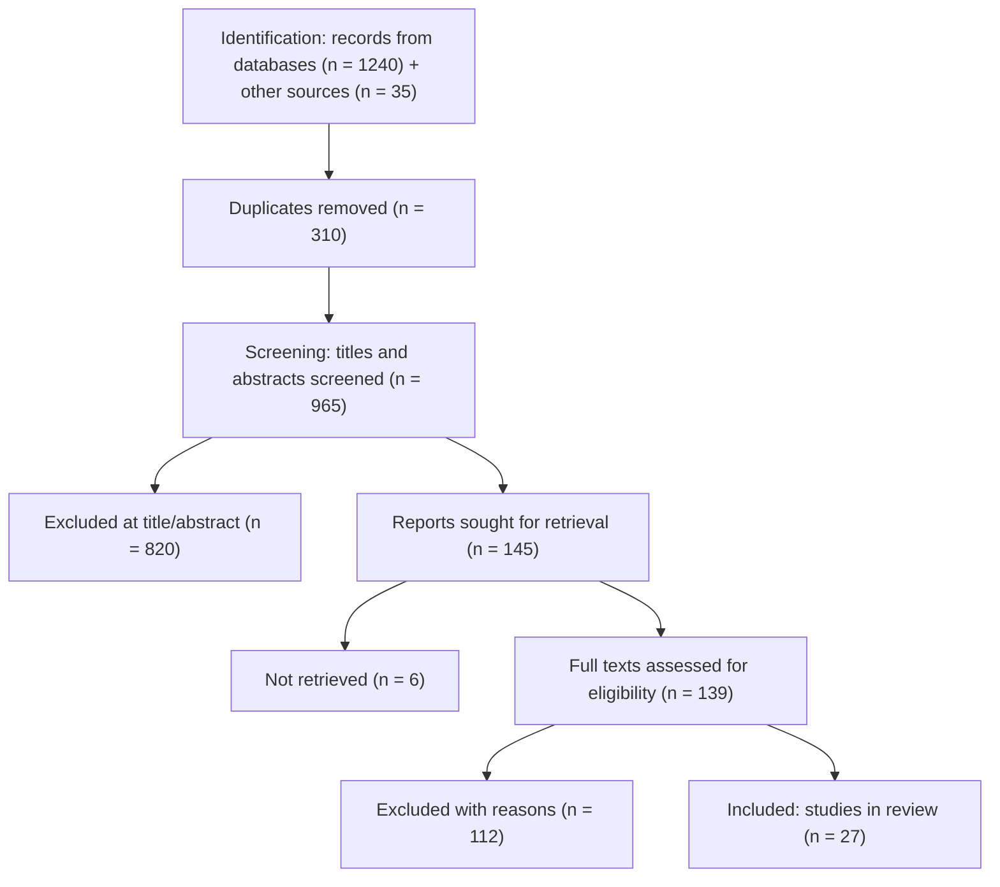
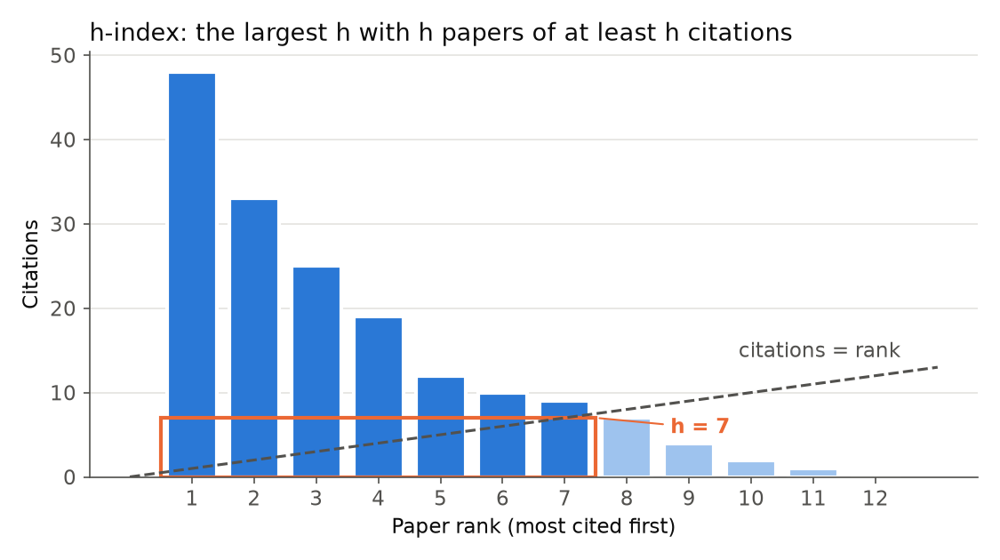
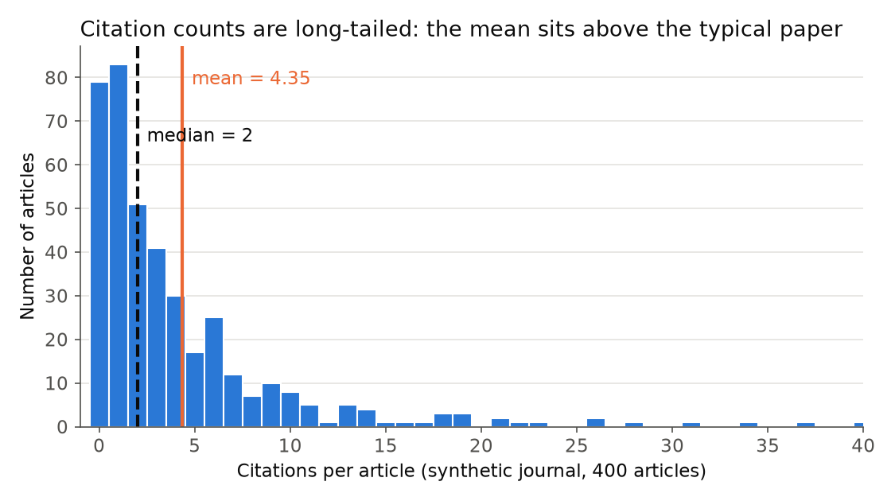
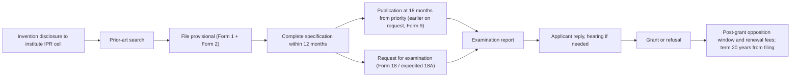

# 02 · Assignments Guide & Practical Research Toolkit

> **Course:** Introduction to Research (I2R) · IIIT Dharwad
>
> **Sources:** assignment slides 36–38 of `PPT-1.pdf` and the 29 Sep discussion. Everything else is a **practical toolkit (beyond slides)** to help you do the assignments and your M.Tech project well.
>
> ⚠️ **This note gives structure, methods and templates, not answers.** The assignments are graded individual work, and the course has an ethics & plagiarism component. Use these as scaffolding and write your own content.
>
> 💻 **Companion notebook:** [`code/02_bibliometrics_hands_on.ipynb`](code/02_bibliometrics_hands_on.ipynb) (h-index/i10/g-index calculators, journal metrics, PRISMA counter, search precision/recall, paraphrase-overlap checker, literature matrix export, IEEE/APA formatter, critical-path Gantt, optional Semantic Scholar query). Figures: [`code/figures_02.py`](code/figures_02.py).

---

## 📌 Table of Contents

1. [The Three Assignments at a Glance](#1-the-three-assignments-at-a-glance)
2. [Assignment 1: Planning Your Research (Phases I–IV)](#2-assignment-1-planning-your-research-phases-iiv)
3. [Assignment 2: GenAI Tools for Research](#3-assignment-2-genai-tools-for-research)
4. [Assignment 3: Topic Exploration & a 5-Paper Literature Review](#4-assignment-3-topic-exploration--a-5-paper-literature-review)
5. [Templates](#5-templates)
6. [From Gap to Research Question to Hypothesis](#6-from-gap-to-research-question-to-hypothesis)
7. [ML/DS-Specific Research Hygiene](#7-mlds-specific-research-hygiene)
8. [Systematic Searching: Boolean Queries, Snowballing and PRISMA](#8-systematic-searching-boolean-queries-snowballing-and-prisma)
9. [Bibliometrics: Measuring Papers, People and Venues](#9-bibliometrics-measuring-papers-people-and-venues)
10. [Citing Correctly: IEEE vs APA](#10-citing-correctly-ieee-vs-apa)
11. [Paraphrasing, Plagiarism and Disclosing AI Use](#11-paraphrasing-plagiarism-and-disclosing-ai-use)
12. [Anatomy of a Research Paper (IMRaD)](#12-anatomy-of-a-research-paper-imrad)
13. [Anatomy of a Patent (with the Indian Process)](#13-anatomy-of-a-patent-with-the-indian-process)
14. [Writing a Proposal and Planning It with a Gantt Chart](#14-writing-a-proposal-and-planning-it-with-a-gantt-chart)
15. [Real-World Case Studies](#15-real-world-case-studies)
16. [Code Walkthrough](#16-code-walkthrough)
17. [📝 Practice Problems](#17--practice-problems)
18. [Tool Directory (verified links)](#18-tool-directory-verified-links)

---

## 1. The Three Assignments at a Glance

| # | Topic | Time | Weight | Core deliverable |
|---|---|---|---|---|
| **A1** | **How to plan your research work**: focus of Phase I, II, III, IV | 4 weeks | 10% | A phased plan for your M.Tech research |
| **A2** | **How to use GenAI tools for research**: literature review, research exploration, slide decks, reports | 8 weeks | 10% | Tool evaluation / case study across 4 stages |
| **A3** | **Topic exploration & literature review** (prototype study): pick a problem (with a supervisor or your own), find **5 papers**, write a **literature review report** | 10 weeks | 10% | A literature review report on 5 papers |

> 💡 A1 → A3 → your semester-1 project evaluation all point the same way: **problem statement + literature review by the end of semester 1**. Do the assignments **on your actual M.Tech topic**: one effort, three payoffs.

---

## 2. Assignment 1: Planning Your Research (Phases I–IV)

The slide asks for the **focus of Phases I–IV**. A natural mapping onto the 4-semester M.Tech, consistent with the lecture:

| Phase | Semester | Credits / hours | Focus (from lecture) | Typical outputs |
|---|---|---|---|---|
| **I** | 1 | 3 cr · ~75 h | Broad area → sub-field → **literature review & critical review** → list questions → **finalise the problem statement** | Problem statement, literature review, (maybe a review paper with your mentor) |
| **II** | 2 | 6 cr · ~150 h | Hypothesise solutions; explore; **first novel result** | Conference paper / arXiv preprint |
| **III** | 3 | 9 cr · ~225 h | **Second novel result**; extend toward a **journal-quality** study; **one research article** | Journal / conference paper, poster at the Research Conclave |
| **IV** | 4 | 12 cr · ~300 h | **Third novel result**, consolidation, **thesis writing & defence**, future scope | Thesis, defence, final paper/patent |

(The lecture's *supervisor phases*, I defined → II fuzzy → III independent, run alongside: you should become more independent each semester.)

**What a strong plan includes (checklist):**

- [ ] Broad area + why it matters (link to a thrust area: health, energy, education, agriculture…)
- [ ] Narrowed sub-field and a **candidate problem statement** (one sentence)
- [ ] **Feasibility**: data access, compute, tools, mentor expertise (remember the EEG example!)
- [ ] Courses for semesters 2–4 that support the topic
- [ ] Per-phase **objectives, activities, deliverables, milestones** (a Gantt-style table)
- [ ] **Risks & fallback plans** (e.g. "if hospital data is unavailable → use the public dataset X")
- [ ] Target venues (conference first, then journal; check CORE / SCImago)
- [ ] Mentor meeting cadence (weekly) and research-diary habit
- [ ] Ethics: data privacy, consent, plagiarism, responsible GenAI use

**How to turn the checklist into a plan (method):**

1. **Work backwards from fixed dates.** The semester-1 evaluation, conference deadlines and the thesis submission are immovable. Put them on the timeline first.
2. **Break each phase into tasks of 1–4 weeks** with a visible output (a table, a plot, a draft section). A task that cannot be shown to a mentor is too vague.
3. **Write dependencies explicitly** ("baseline experiments need the dataset and the literature matrix"). Dependencies decide the **critical path**, the chain of tasks that sets the project length (worked example in §14).
4. **Add slack where risk is high:** data access, ethics approval and hardware are the usual delays.
5. **Attach a fallback** to every risky task (public dataset, smaller model, simulated data).

| Phase | A measurable milestone (example form, not content) |
|---|---|
| I | "Literature matrix of ≥ 15 papers; problem statement approved by mentor by week 14" |
| II | "Baseline reproduced within 1 point of the published number; first improvement tested over 3 seeds" |
| III | "Second contribution evaluated; paper submitted to a named venue" |
| IV | "Thesis chapters drafted by month 3 of the semester; defence slides reviewed" |

---

## 3. Assignment 2: GenAI Tools for Research

The slide lists **four stages**. For each, evaluate tools on **what they do well, failure modes, and responsible use**.

| Stage | Tool categories | Example tools (verify each yourself) |
|---|---|---|
| **Literature review** | Semantic search, citation graphs, paper Q&A, summarisation | Semantic Scholar, Connected Papers, Research Rabbit, Elicit, Consensus, NotebookLM, ChatGPT/Claude with uploaded PDFs |
| **Research exploration** | Brainstorming, code assistants, experiment design, data analysis | Claude/ChatGPT/Gemini, GitHub Copilot / Claude Code, Jupyter AI, Hugging Face Papers (papers + code) |
| **Slide-deck preparation** | Outline → slides, figure generation | Gamma, Copilot in PowerPoint, Canva Magic, Beamer + LLM help |
| **Report preparation** | Drafting, editing, LaTeX, references | Overleaf (+ AI assist), Grammarly, Zotero / Mendeley for references, LLMs for language polishing |

**A strong A2 report goes beyond listing tools:**

1. Run the **same task** (e.g. "find key papers on X") on 2–3 tools and **compare** coverage, accuracy and speed.
2. **Document failure cases.** The #1 risk: **hallucinated citations** (papers that don't exist, wrong authors/years). Always verify the DOI/arXiv ID.
3. **Ethics & policy:** disclose AI use; never submit AI text as your own original contribution; don't upload confidential, employer or patient data to public tools; check venue policies on AI-written text (many forbid listing AI as an author).
4. Reflect: where did AI **save time** and where did it **mislead**? (This connects to the course's ethics unit and the reference book *Generative AI for PhD Scholars: Ethical Use of AI in Research*.)

> 🔗 Your Gen AI course notes explain *why* LLMs hallucinate: they sample likely next tokens and don't look facts up (Gen AI Note 01 §11).

### 3.1 Failure modes of AI literature tools (what to test in A2)

| Failure mode | What it looks like | How to detect it | Mitigation |
|---|---|---|---|
| **Fabricated reference** | Plausible title, real-sounding authors, a DOI that does not resolve or points to a different paper | Resolve every DOI / arXiv ID; search the exact title in Google Scholar | Use tools that return links to indexed records (Semantic Scholar, Elicit) and still verify |
| **Mis-attributed claim** | A real paper cited for a result it does not contain | Open the PDF and find the sentence/table | Quote page/table numbers in your notes |
| **Wrong metadata** | Correct paper, wrong year, venue, author order or pages | Compare with the DOI record or DBLP | Import references via DOI into Zotero, never retype |
| **Coverage bias** | Only open-access or English papers; misses recent or paywalled work | Compare with a manual database search (precision/recall test, §8.2) | Combine AI search with Scopus/IEEE Xplore queries |
| **Recency gap** | Tool's model or index has a cut-off date | Ask for papers from the last 6 months and check | Check arXiv listings and recent proceedings directly |
| **Over-confident summary** | Summary drops limitations, conditions or negative results | Read the paper's limitations and threats-to-validity section | Treat summaries as a reading guide, not as evidence |
| **Sycophancy** | Tool agrees with the premise of a leading question | Ask the same question neutrally and in reverse | Phrase queries neutrally; ask for counter-evidence |
| **Privacy leak** | Unpublished data or a confidential draft pasted into a public tool | Policy check before upload | Use institution-approved tools; remove identifiers |

Measured scale of the first problem: in a study published in *Scientific Reports* (2023), Walters and Wilder asked ChatGPT to write short literature reviews on 42 topics and checked 636 citations; **55% of the GPT-3.5 citations and 18% of the GPT-4 citations were fabricated**, and many of the real ones contained substantive errors (43% and 24% respectively). See case study §15.1.

**Evaluation protocol for A2 (structure only).** Pick 1 task per stage, 2–3 tools per task, and score each output on the same rubric: *correctness* (fraction of verifiable claims that check out), *coverage* (recall against a hand-built list), *time saved*, *effort to verify*, *policy compliance*. Report the rubric table, then 2–3 concrete failure examples with screenshots.

---

## 4. Assignment 3: Topic Exploration & a 5-Paper Literature Review

### Step 1: topic exploration
Broad area → sub-field → specific problem. Use survey papers, recent top-venue proceedings and PhD theses (Shodhganga) to map the landscape.

### Step 2: search strategy (be systematic)

- Build a **keyword set** with synonyms: e.g. ("speech emotion recognition" OR "SER") AND ("low-resource" OR "Indian languages") AND ("self-supervised" OR "wav2vec").
- Search **Google Scholar, Semantic Scholar, IEEE Xplore, ACM DL, arXiv**.
- **Snowballing:** follow references **backward** (what they cite) and citations **forward** (who cites them). Connected Papers / Research Rabbit visualise this.
- Prefer **recent (≈ last 3–5 years) + seminal** papers from **good venues** (Q1/Q2 journals, CORE A*/A conferences).
- Database-specific syntax, a worked query refinement, snowballing rules and the PRISMA flow are in **§8**. Even a 5-paper review should state *where* you searched, *which* query you ran, *when*, and *how* you filtered, so the selection is reproducible.

### Step 3: select 5 papers (a balanced mix)

| Slot | Paper type |
|---|---|
| 1 | A **survey / review** (the map of the field) |
| 2 | The **seminal / most-cited** method |
| 3–4 | **Recent state-of-the-art** methods (different approaches) |
| 5 | A paper closest to **your intended problem / setting** (data, language, domain) |

### Step 4: read efficiently with Keshav's 3-pass method

| Pass | Time | Read | Goal |
|---|---|---|---|
| 1 | 5–10 min | Title, abstract, intro, section headings, conclusion | **The 5 Cs**: Category, Context, Correctness, Contributions, Clarity → keep or drop? |
| 2 | ~1 h | Figures, tables, main arguments (skip proofs) | Summarise the method and evidence |
| 3 | 4–5 h | Everything; mentally re-implement | Find hidden assumptions, weaknesses, **gaps** |

### Step 5: the literature matrix (the secret to a good review)
Fill one row per paper (template in §5.3), then write the review **by theme, not paper-by-paper**:

- ❌ "Paper 1 did… Paper 2 did… Paper 3 did…" (annotated bibliography)
- ✅ "Two families of approaches exist: A (papers 1, 3) and B (2, 4). A achieves… but fails when…; B… However, none of them address **[gap]**."

### Step 6: suggested report structure

1. Introduction: the problem and why it matters
2. Search methodology: databases, keywords, inclusion criteria
3. Background / key concepts
4. **Thematic review** of the 5 papers (with the comparison table)
5. **Critical analysis**: strengths, limitations (be *positively* critical!)
6. **Research gaps** → candidate research questions
7. Conclusion & future directions
8. References (consistent style, e.g. IEEE; managed with Zotero)

> ⚠️ **Plagiarism:** paraphrase in your own words and **cite every idea** you took (syllabus: *paraphrasing and giving credit to the original authors*). AI-paraphrasing someone's text without citing them is still plagiarism.

---

## 5. Templates

### 5.1 Weekly mentor-meeting agenda (5 minutes to prepare)

```markdown
## Meeting — <date> — <mentor>
**Since last meeting (recap):** decisions/actions agreed on <prev date>
**Progress:** 1. … 2. …  (attach 1 plot/table if any)
**Blockers / questions:** 1. … 2. …
**Proposed next steps:** …
**Asks from mentor:** feedback on X / pointer to Y
```

### 5.2 Research diary entry

```markdown
### <date> — <topic>
- Goal today:
- What I did / read:
- Result / observation (incl. surprises & failures):
- Why I think it happened:
- Decision / next step:
- Open questions for mentor:
- Links (code commit, notebook, paper):
```

### 5.3 Literature matrix (for A3 and your project)

| # | Citation (venue, year, tier) | Problem addressed | Method / key idea | Data | Metrics & main result | Strengths | Limitations / assumptions | Gap it leaves | Relevance to me |
|---|---|---|---|---|---|---|---|---|---|
| 1 | | | | | | | | | |
| 2 | | | | | | | | | |

**Worked example: the matrix filled for three famous papers (facts from the papers' own abstracts).** This shows the *level of detail* per cell. The critique columns are deliberately left as prompts: writing them is the actual skill being graded.

| # | Citation (venue, year) | Problem addressed | Method / key idea | Data | Main result (as reported) | Limitation / question to ask |
|---|---|---|---|---|---|---|
| 1 | He et al., CVPR 2016 (arXiv 10 Dec 2015) | Deeper networks are harder to optimise | Learn residual functions via identity shortcut connections | ImageNet, CIFAR-10, COCO | Nets up to 152 layers; ensemble 3.57% top-5 error on ImageNet test; 1st place ILSVRC 2015 classification | Which part of the gain is depth vs. shortcut? How does it behave with little data? |
| 2 | Vaswani et al., NeurIPS 2017 (arXiv 12 Jun 2017) | Recurrence limits parallel training in sequence transduction | Transformer: attention only, no recurrence or convolution | WMT 2014 En–De, En–Fr | 28.4 BLEU En–De; 41.8 BLEU En–Fr after 3.5 days on 8 GPUs | Cost of attention for long sequences? Results on low-resource languages? |
| 3 | Devlin et al., NAACL 2019 (arXiv 11 Oct 2018) | Unidirectional pre-training limits context use | Masked-language-model pre-training of a deep bidirectional Transformer (BERT) | BooksCorpus + English Wikipedia (pre-training); 11 NLP tasks | GLUE 80.5 (+7.7 points); SQuAD v1.1 test F1 93.2 | Pre-training compute? Transfer to Indian languages? |

**Thematic synthesis sentence built from this matrix (form to imitate):** *"Two of the three works (1, 2) change the network's connectivity to make optimisation or parallelism easier, while (3) changes the training objective; all three report results on large English or ImageNet-scale benchmarks, which leaves open how they behave in low-resource settings."* Notice that one sentence compares, groups and identifies a gap. The notebook (Part 7) exports this matrix as CSV and Markdown so it can be reused.

### 5.4 One-line problem statement formula
> *"Existing **[approach]** for **[task]** on **[data/setting]** suffers from **[limitation]**. We investigate whether **[idea]** can **[measurable improvement]**, evaluated by **[metric]** on **[dataset]**."*

---

## 6. From Gap to Research Question to Hypothesis

The syllabus moves **gaps → questions → hypotheses → exploration**. Make each one concrete:

| Stage | Weak | Strong |
|---|---|---|
| **Gap** | "Not much work on Kannada ASR" | "Self-supervised ASR models reach <10% WER for English but >30% WER for Kannada with < 50 h labelled data (papers 2, 4)" |
| **Research question** | "Can we improve Kannada ASR?" | "Does continued pre-training of wav2vec 2.0 on 500 h of *unlabelled* Kannada audio reduce WER in the 10 h-labelled setting?" |
| **Hypothesis** (testable, falsifiable) | "It will be better" | "Continued pre-training reduces WER by ≥ 15% relative vs the multilingual baseline, at equal fine-tuning data" |
| **Exploration** | "Train a model" | Baseline vs proposed, 3 random seeds, ablation on pre-training hours (100/250/500 h), significance test |

**A good RQ is FINER:** Feasible, Interesting, Novel, Ethical, Relevant.

---

## 7. ML/DS-Specific Research Hygiene

Things reviewers check in DS/AI papers (and your M.Tech committee will too):

| Practice | Why |
|---|---|
| **Strong baselines** (incl. simple ones) | Shows your improvement isn't trivial (cf. the "predict the mean" baseline in MLP Note 03) |
| **Proper train/val/test split**; no test-set tuning; no leakage | Honest generalisation (MLP Note 02) |
| **Multiple random seeds**, mean ± std | Results vary with the seed (MLP Note 02 §12) |
| **Ablation studies** | Show *which* component causes the gain |
| **Statistical significance** | A 0.3% gain may be noise |
| **Reproducibility**: code, configs, data versions, `requirements.txt` | Others (and future you) can re-run it |
| **Error analysis** | Where and why it fails → the next research question |
| **Report negative results honestly** | *"If you can explain why it didn't work, that's research too."* |

---

## 8. Systematic Searching: Boolean Queries, Snowballing and PRISMA

> *Beyond slides:* this section makes "search 5 papers" (slide 38) reproducible. A search that cannot be repeated by someone else is an anecdote, not a method.

### 8.1 Boolean logic as set algebra

Every database treats a query as an operation on **sets of documents**. If $`A`$ is the set of records matching term A:

```math
\begin{aligned}
A \text{ AND } B &= A \cap B &&\text{(narrows: fewer results)}\\
A \text{ OR } B &= A \cup B &&\text{(broadens: synonyms)}\\
A \text{ NOT } B &= A \setminus B &&\text{(excludes: use sparingly, it silently drops relevant papers)}
\end{aligned}
```

From inclusion–exclusion, $`\lvert A \cup B\rvert = \lvert A\rvert + \lvert B\rvert - \lvert A \cap B\rvert`$: adding a synonym with OR can never reduce the result count, and adding a concept with AND can never increase it. A well-formed query is therefore a **conjunction of disjunctions**, one OR-group per concept:

```math
Q = (\text{synonyms of concept 1}) \;\text{AND}\; (\text{synonyms of concept 2}) \;\text{AND}\; (\text{synonyms of concept 3})
```

**Why parentheses matter.** Databases differ in operator precedence. Scopus, for example, evaluates OR before AND, while many other systems evaluate AND first. `speech AND emotion OR affect` therefore means different things in different databases. Always bracket every OR-group explicitly.

### 8.2 Database syntax at a glance

| Feature | Google Scholar | IEEE Xplore (Command Search) | Scopus (Advanced) |
|---|---|---|---|
| Exact phrase | `"speech emotion"` | `"speech emotion"` | `{speech emotion}` exact; `"speech emotion"` loose (ignores punctuation) |
| Synonyms | `OR` (upper case) | `OR` | `OR` |
| Exclude | `-survey` | `NOT` | `AND NOT` |
| Truncation | not supported | `recogni*` | `recogni*`, `wom?n` |
| Proximity | not supported | `NEAR/3`, `ONEAR/3` (ordered) | `W/3` (any order), `PRE/3` (ordered) |
| Field search | `intitle:`, `author:`, `source:` | `"Document Title":`, `"Abstract":`, `"Author Keywords":`, `"All Metadata":` | `TITLE-ABS-KEY()`, `TITLE()`, `AUTH()`, `SRCTITLE()` |
| Year filter | sidebar "Custom range" | Filters panel | `PUBYEAR > 2019` |
| Document type | not available | Filters (Conferences, Journals) | `DOCTYPE(ar)`, `DOCTYPE(cp)` |
| Best use | Broad coverage, grey literature, citations | IEEE/IET journals and conferences | Curated multidisciplinary abstracts, export for bibliometrics |

Google Scholar has no truncation or proximity and ignores many nesting patterns, so keep its queries short and phrase-based. Check each database's help page before relying on a feature (links in §18).

### 8.3 Worked example: building and refining a query

**Research question (example topic):** *Do self-supervised speech models help emotion recognition when labelled data are scarce?*

**Step 1: split into concepts and list synonyms.**

| Concept | Synonyms / variants |
|---|---|
| Task | speech emotion recognition; emotion recognition from speech/voice; affect recognition |
| Setting | low-resource; low resource; few-shot; limited labelled data |
| Method | self-supervised; wav2vec 2.0; HuBERT; WavLM |

**Step 2: first draft (Scopus).**

```text
TITLE-ABS-KEY(("speech emotion recognition" OR "SER")
  AND ("low-resource" OR "few-shot")
  AND ("self-supervised" OR wav2vec*))
```

**Step 3: diagnose.** "SER" also means *symbol error rate* in communications papers, so it pulls in false hits. "low-resource" misses "limited labelled data". The task phrase misses "emotion recognition from speech".

**Step 4: refined query.**

```text
TITLE-ABS-KEY((emotion* W/3 (speech OR voice OR acoustic))
  AND ("low-resource" OR "low resource" OR "few-shot" OR "limited labelled" OR "limited labeled")
  AND ("self-supervised" OR wav2vec* OR hubert OR wavlm))
AND PUBYEAR > 2019 AND (DOCTYPE(ar) OR DOCTYPE(cp))
```

The same logic in the other two databases:

```text
IEEE Xplore:  ("All Metadata":"speech emotion" OR "All Metadata":"emotion recognition")
              AND ("All Metadata":"self-supervised" OR "All Metadata":wav2vec*)
              AND ("All Metadata":"low-resource" OR "All Metadata":"few-shot")

Scholar:      "speech emotion recognition" "self-supervised" "low-resource" OR "few-shot"
```

**Step 5: measure the query instead of guessing.** Build a small **gold set**: papers known to be relevant (from a survey's reference list, or found by snowballing). Then compute

```math
\text{precision} = \frac{\lvert \text{retrieved} \cap \text{relevant}\rvert}{\lvert \text{retrieved}\rvert}, \qquad
\text{recall} = \frac{\lvert \text{retrieved} \cap \text{relevant}\rvert}{\lvert \text{relevant}\rvert}, \qquad
F_1 = \frac{2PR}{P + R}
```

Suppose the gold set has 40 papers. The broad draft returns 400 records containing 30 of them; the refined query returns 90 records containing 27.

| Query | Retrieved | Gold hits | Precision | Recall | F₁ |
|---|---|---|---|---|---|
| Broad draft | 400 | 30 | 30/400 = 0.075 | 30/40 = 0.750 | 0.136 |
| Refined | 90 | 27 | 27/90 = 0.300 | 27/40 = 0.675 | 0.415 |

The refined query loses 3 gold papers (recall falls by 0.075) but the screening load falls from 400 to 90 abstracts, so F₁ triples. **Sanity check:** precision rose and recall fell, exactly what adding constraints with AND must do. Recover the 3 lost papers by **snowballing** rather than by re-broadening the query. (Notebook Part 5 reproduces this table.)

### 8.4 Snowballing

Snowballing (Wohlin, EASE 2014, DOI 10.1145/2601248.2601268) complements keyword search because it follows the citation graph, not the vocabulary:

1. **Start set:** 3–6 clearly relevant papers from different groups and years (a survey plus key methods).
2. **Backward snowballing:** scan each paper's reference list; screen by title, then abstract, then full text.
3. **Forward snowballing:** in Google Scholar or Semantic Scholar, open "Cited by" for each paper and screen the citing papers.
4. **Iterate** on the newly included papers until an iteration adds nothing new (saturation).
5. **Record** every iteration: how many candidates, how many included, why others were excluded.

Backward snowballing finds older, foundational work; forward snowballing finds newer work and reveals whether a method was later criticised or superseded. Connected Papers and Research Rabbit visualise the same graph but do not replace screening.

### 8.5 The PRISMA 2020 flow

PRISMA (Preferred Reporting Items for Systematic reviews and Meta-Analyses; Page et al., *BMJ* 2021, DOI 10.1136/bmj.n71) is a 27-item reporting checklist plus a **flow diagram** that accounts for every record. It comes from medicine but is now standard for systematic reviews in computing as well.



**Worked example: checking the arithmetic of a PRISMA diagram.** Each box must equal the previous box minus what was removed:

```math
\begin{aligned}
\text{identified} &= 1240 + 35 = 1275\\
\text{screened} &= 1275 - 310 = 965\\
\text{sought} &= 965 - 820 = 145\\
\text{assessed} &= 145 - 6 = 139\\
\text{included} &= 139 - 112 = 27
\end{aligned}
```

The 112 full-text exclusions must be broken down by reason (for example 41 wrong population, 38 no evaluation on real data, 21 not peer reviewed, 12 duplicate study; 41 + 38 + 21 + 12 = 112). **Sanity check:** no box can be negative and the numbers must decrease monotonically; the notebook's `prisma()` function asserts both. Reviewers often find errors in exactly these sums.

For A3, a full systematic review is not required, but a **mini-PRISMA** paragraph ("searched X and Y on <date> with query Q; 214 records → 38 abstracts → 12 full texts → 5 selected using criteria C1–C3") makes the 5-paper selection defensible.

---

## 9. Bibliometrics: Measuring Papers, People and Venues

> *Beyond slides:* the lecture's advice to target good venues ("check CORE / SCImago") depends on these numbers. Knowing how they are computed protects you from over-reading them.

### 9.1 The h-index

Sort a researcher's $`n`$ papers by citations, $`c_{(1)} \ge c_{(2)} \ge \dots \ge c_{(n)}`$. The **h-index** (Hirsch, *PNAS* 102(46), 2005) is

```math
h = \max\{k \in \{0, 1, \dots, n\} : c_{(k)} \ge k\}
```

i.e. the largest $`h`$ such that $`h`$ papers have at least $`h`$ citations each (with $`h = 0`$ if no paper is cited).

**Why it is well-defined and easy to compute.** The condition $`c_{(k)} \ge k`$ is *downward closed*: if it holds for $`k`$, then for any $`j < k`$, $`c_{(j)} \ge c_{(k)} \ge k > j`$, so it holds for $`j`$ too. The set of valid $`k`$ is therefore $`\{1, \dots, h\}`$, and $`h`$ is simply the **number of ranks where the condition holds**. That is the one-line algorithm in the notebook.

**Two bounds (proof).** The top $`h`$ papers each have at least $`h`$ citations, so with total citations $`C`$:

```math
C \;\ge\; \sum_{i=1}^{h} c_{(i)} \;\ge\; h \cdot h = h^2 \quad\Longrightarrow\quad h \le \sqrt{C}, \qquad\text{and trivially } h \le n.
```

So $`h \le \min(n, \sqrt{C})`$. A researcher with 100 total citations can never have $`h > 10`$, however the citations are spread.

**Geometric view.** On a rank–citation plot, $`h`$ is the side of the largest square under the curve that touches the diagonal "citations = rank".



### 9.2 The i10-index and the g-index

- **i10-index** (Google Scholar): the number of papers with at least 10 citations, $`i_{10} = \lvert\{j : c_j \ge 10\}\rvert`$.
- **g-index** (Egghe, 2006): the largest $`g`$ such that the top $`g`$ papers together have at least $`g^2`$ citations:

```math
g = \max\Big\{k \le n : \sum_{i=1}^{k} c_{(i)} \ge k^2\Big\}
```

**Claim: g ≥ h.** At $`k = h`$, the top $`h`$ papers have $`\sum_{i \le h} c_{(i)} \ge h^2`$ (shown above), so $`k = h`$ satisfies the g-condition and $`g \ge h`$. The g-index rewards a few very highly cited papers, which the h-index ignores. (Some tools allow $`g > n`$ by padding with zero-citation "papers"; this note caps $`g`$ at $`n`$.)

### 9.3 Worked example: h, i10 and g from a citation list

Researcher A has 12 papers with citations 48, 33, 25, 19, 12, 10, 9, 7, 4, 2, 1, 0 (already sorted).

| Rank k | 1 | 2 | 3 | 4 | 5 | 6 | 7 | 8 | 9 | 10 | 11 | 12 |
|---|---|---|---|---|---|---|---|---|---|---|---|---|
| Citations | 48 | 33 | 25 | 19 | 12 | 10 | 9 | 7 | 4 | 2 | 1 | 0 |
| Is c ≥ k? | ✓ | ✓ | ✓ | ✓ | ✓ | ✓ | ✓ (9 ≥ 7) | ✗ (7 < 8) | ✗ | ✗ | ✗ | ✗ |
| Cumulative sum | 48 | 81 | 106 | 125 | 137 | 147 | 156 | 163 | 167 | 169 | 170 | 170 |
| k² | 1 | 4 | 9 | 16 | 25 | 36 | 49 | 64 | 81 | 100 | 121 | 144 |

- **h = 7**: rank 7 has 9 ≥ 7; rank 8 has 7 < 8.
- **i10 = 6**: papers with 48, 33, 25, 19, 12, 10 citations (the 10 counts: "at least 10").
- **g = 12**: the cumulative sum stays above k² up to k = 12 (170 ≥ 144), and g is capped at n = 12.

**Sanity check:** total C = 170, $`\sqrt{170} \approx 13.04`$, so h = 7 respects $`h \le \sqrt{C}`$; and g = 12 ≥ h = 7 as proved.

**Contrast with two other profiles** (computed in notebook Part 1):

| Profile | Citations | h | i10 | g | Lesson |
|---|---|---|---|---|---|
| B "one hit" | 100, 3, 2, 1, 1 | 2 | 1 | 5 | h ignores how far the top paper exceeds h |
| C "steady" | 6, 6, 6, 6, 6, 6 | 6 | 0 | 6 | i10 is blind below 10 citations |

### 9.4 Journal-level metrics: impact factor, CiteScore, SJR and quartiles

**Journal Impact Factor** (Clarivate, Journal Citation Reports; Web of Science data). For year $`Y`$, with $`C_Y(t)`$ the citations received in year $`Y`$ by items the journal published in year $`t`$, and $`N(t)`$ the number of *citable items* (articles and reviews) published in year $`t`$:

```math
\text{JIF}_{Y} = \frac{C_{Y}(Y-1) + C_{Y}(Y-2)}{N(Y-1) + N(Y-2)}
```

A known asymmetry: the numerator counts citations to *all* items (including editorials and letters), while the denominator counts only citable items, which can inflate the JIF of journals that publish many editorials.

**CiteScore** (Elsevier, Scopus data; methodology revised in 2020) uses a **four-year window on both sides**: citations received in years $`Y-3 \dots Y`$ by documents published in $`Y-3 \dots Y`$, divided by the number of those documents (articles, reviews, conference papers, data papers and book chapters):

```math
\text{CiteScore}_{Y} = \frac{\text{citations in } [Y-3, Y] \text{ to documents published in } [Y-3, Y]}{\text{documents published in } [Y-3, Y]}
```

**SJR** (SCImago Journal Rank, Scopus data) is a PageRank-style prestige score: a citation from a highly ranked journal counts more than one from a low-ranked journal, over a three-year window, with journal self-citation limited. SCImago also publishes the **quartiles** students usually quote.

**Quartile rule.** Within one subject category of $`N`$ journals ranked by the metric, the journal at rank $`r`$ has percentile $`p = r/N`$:

```math
Q = \begin{cases} \text{Q1} & p \le 0.25\\ \text{Q2} & 0.25 < p \le 0.50\\ \text{Q3} & 0.50 < p \le 0.75\\ \text{Q4} & p > 0.75 \end{cases}
```

A journal can be Q1 in one category and Q2 in another, so always quote the category.

**Worked example: an impact factor from counts.** A journal published 120 citable items in 2023 and 140 in 2024. In 2025, items from 2023 were cited 610 times and items from 2024 were cited 480 times.

```math
\text{JIF}_{2025} = \frac{610 + 480}{120 + 140} = \frac{1090}{260} \approx 4.192
```

**Sanity check:** each recent item was cited about 4 times in one year; 1090/260 lies between 610/120 ≈ 5.08 (older items, more time to be cited) and 480/140 ≈ 3.43 (newer items), as a pooled ratio must.

**Worked example: CiteScore.** The same journal published 150, 160, 170 and 180 documents in 2022–2025, and those documents received 3300 citations during 2022–2025:

```math
\text{CiteScore}_{2025} = \frac{3300}{150 + 160 + 170 + 180} = \frac{3300}{660} = 5.0
```

**Worked example: quartile.** Rank 48 of 210 in its category: $`p = 48/210 \approx 0.229 \le 0.25`$, so **Q1**. Rank 160 of 210: $`p \approx 0.762 > 0.75`$, so **Q4**.

### 9.5 Why these numbers mislead (use them carefully)



- **Skew.** Citation counts are long-tailed. In the synthetic journal above (400 articles, notebook Part 2), the mean is 4.35 but the median is 2; the top 10% of articles earn 45.8% of all citations and 19.8% are never cited. A JIF is a **mean**, so it describes the journal, not a typical paper in it, and certainly not *your* paper.
- **Small-journal volatility.** A journal with 150 citable items and 300 citations has JIF 2.00; one paper cited 900 times lifts it to (300 + 900)/150 = 8.00 (notebook Part 3).
- **Field dependence.** Typical citation rates differ by field (biomedicine vs. mathematics vs. CS), so compare only within a subject category, which is exactly what quartiles do.
- **Conferences.** In CS, top conferences (NeurIPS, CVPR, ACL) often carry more weight than journals; JIF does not cover them. Use the CORE ranking for conferences.
- **Gaming.** Citation cartels, coercive citation and excessive self-citation exist. The **San Francisco Declaration on Research Assessment (DORA, 2012)** asks institutions not to use journal metrics as a surrogate for the quality of individual articles or researchers.
- **Database dependence.** Google Scholar counts more sources (theses, preprints, slides), so a researcher's Scholar h-index is usually higher than the Scopus or Web of Science value. Always name the source and date.

---

## 10. Citing Correctly: IEEE vs APA

> Slide 38 asks for a literature review *report*; a consistent reference style is part of that report. IEEE is the norm in electrical engineering and much of CS; APA is common in psychology, education and many interdisciplinary venues. Use whatever the venue (or the instructor) specifies, and **let a reference manager (Zotero) generate it**.

| Aspect | IEEE | APA (7th edition) |
|---|---|---|
| In-text | Numbered in order of first appearance: "as shown in [3]" | Author–date: "(He et al., 2016)" or "He et al. (2016) showed" |
| Reference list order | By number | Alphabetical by first author's surname |
| Author names | Initials first: K. He, X. Zhang | Surname first: He, K., Zhang, X. |
| Many authors | More than six: first author + "et al." | Up to 20 listed; "&" before the last |
| Title | In quotation marks, sentence case | Sentence case, no quotes; journal/book in italics |
| Year position | Near the end | Right after the authors, in parentheses |
| Conference | "in Proc. <abbreviated conf.>, year, pp. x–y" | "In *Proceedings of …* (pp. x–y)" |
| DOI | "doi: 10.xxxx/…" | "https://doi.org/10.xxxx/…" |

**Worked example 1: a conference paper (ResNet).** Metadata from the DOI record 10.1109/CVPR.2016.90: authors Kaiming He, Xiangyu Zhang, Shaoqing Ren, Jian Sun; CVPR 2016; pages 770–778.

```text
IEEE:  [1] K. He, X. Zhang, S. Ren, and J. Sun, "Deep residual learning for image recognition,"
       in Proc. IEEE Conf. Comput. Vis. Pattern Recognit. (CVPR), 2016, pp. 770–778,
       doi: 10.1109/CVPR.2016.90.

APA:   He, K., Zhang, X., Ren, S., & Sun, J. (2016). Deep residual learning for image recognition.
       In Proceedings of the IEEE Conference on Computer Vision and Pattern Recognition
       (pp. 770–778). https://doi.org/10.1109/CVPR.2016.90
```

**Worked example 2: a journal article (the h-index paper).** DOI 10.1073/pnas.0507655102.

```text
IEEE:  [2] J. E. Hirsch, "An index to quantify an individual's scientific research output,"
       Proc. Natl. Acad. Sci. USA, vol. 102, no. 46, pp. 16569–16572, 2005,
       doi: 10.1073/pnas.0507655102.

APA:   Hirsch, J. E. (2005). An index to quantify an individual's scientific research output.
       Proceedings of the National Academy of Sciences, 102(46), 16569–16572.
       https://doi.org/10.1073/pnas.0507655102
```

**Worked example 3: eight authors (Transformer), citing the arXiv version.**

```text
IEEE:  [3] A. Vaswani et al., "Attention is all you need," 2017, arXiv:1706.03762.

APA:   Vaswani, A., Shazeer, N., Parmar, N., Uszkoreit, J., Jones, L., Gomez, A. N., Kaiser, Ł.,
       & Polosukhin, I. (2017). Attention is all you need. arXiv. https://doi.org/10.48550/arXiv.1706.03762
```

When a peer-reviewed version exists (here NeurIPS 2017), cite that version in a final report; cite the preprint only when it is the only version or when a specific preprint revision matters.

**Common errors examiners spot:** mixing styles; "et al." in an APA reference list for fewer than 21 authors; missing pages or DOI; citing a blog summary instead of the paper; references in the list that are never cited in the text (and vice versa); title capitalisation copied inconsistently from different sources.

---

## 11. Paraphrasing, Plagiarism and Disclosing AI Use

> The syllabus names *"paraphrasing and giving credit to the original authors"*. This section turns that into checkable rules.

### 11.1 What counts as plagiarism

| Type | Description | Fix |
|---|---|---|
| **Verbatim copying** | Sentences copied without quotation marks | Quote ("…") with citation, or paraphrase |
| **Patchwriting** (mosaic) | Source sentence kept, a few words swapped for synonyms | Rewrite from understanding, not from the sentence |
| **Idea plagiarism** | Own words, but someone else's idea, result or figure without credit | Cite the source of every idea |
| **Self-plagiarism** (text recycling, duplicate publication) | Reusing one's own published text or results as new without disclosure | Cite the earlier work; follow the venue's policy on extensions |
| **AI-mediated plagiarism** | Paraphrasing tools or LLMs used to disguise a source's text | Still plagiarism: the idea and structure remain the source's |
| **Citation plagiarism** | Copying another paper's reference list without reading the cited works | Cite only what has been read |

### 11.2 How similarity reports work, and the UGC levels

Tools such as Turnitin, iThenticate and DrillBit (used by many Indian universities) match **runs of words** against a database and report a similarity percentage with highlighted sources. A simple proxy is the share of word 3-grams in the candidate that also appear in the source:

```math
\text{containment}_{3}(\text{cand}, \text{src}) = \frac{\lvert G_3(\text{cand}) \cap G_3(\text{src})\rvert}{\lvert G_3(\text{cand})\rvert}
```

where $`G_3(s)`$ is the set of consecutive word triples in $`s`$.

The **UGC (Promotion of Academic Integrity and Prevention of Plagiarism in Higher Educational Institutions) Regulations, 2018** define four levels for theses, dissertations and research papers:

| Level | Similarity | Consequence for students (summary) |
|---|---|---|
| 0 | up to 10% | Minor similarities, no penalty |
| 1 | above 10% to 40% | Revised script to be resubmitted within a limited time |
| 2 | above 40% to 60% | Debarred from resubmitting a revised script for a period |
| 3 | above 60% | Registration for the programme cancelled |

The regulations **exclude** from the similarity check: quoted work with permission/attribution; references, bibliography, table of contents, preface and acknowledgements; generic terms, laws, standard symbols and standard equations. The "core work" (abstract, summary, hypothesis, observations, results, conclusions, recommendations) should have no similarity, apart from common knowledge or coincidental terms of up to 14 consecutive words. The regulations' definition of a "script" excludes course assignments, but institutes apply their own integrity policies to coursework, so treat these levels as the standard to meet.

**A low percentage does not prove originality** (idea plagiarism and translated plagiarism are invisible to string matching), and a high percentage is not automatically plagiarism (a long, correctly quoted passage still matches). The report is evidence for a human judgement.

### 11.3 Worked example: spotting plagiarism in paraphrases

*Source sentence (written for this example, standing in for a passage from the ResNet paper):* "Residual connections let the gradient flow directly through many layers, which makes very deep networks much easier to optimise than plain stacks of layers."

| Candidate | Text | 3-gram containment | Verdict |
|---|---|---|---|
| A | "Residual connections let the gradient flow directly through many layers, which makes very deep networks far easier to optimise than plain stacks." | 0.850 | **Plagiarism** (verbatim with one word changed, no quotes, no citation) |
| B | "Skip connections allow the gradient to flow straight through many layers, making very deep networks much easier to optimise than plain layer stacks." | 0.381 | **Patchwriting**: same structure and order, synonyms swapped, no citation; unacceptable even though the score is moderate |
| C | "Adding identity shortcuts gives the error signal a direct path backwards, so networks with over a hundred layers train well, whereas equally deep plain networks show higher training error [1]." | 0.000 | **Acceptable paraphrase**: new structure, adds understanding, cited |

**How to write version C (method):** read the passage, close it, explain the idea aloud or in notes, write from the notes, then compare with the source to check that no phrase was carried over and the meaning is unchanged, and add the citation. **Sanity check:** B's score is far below A's, yet both are plagiarism; the decisive test is *structure + missing citation*, not the number. (Notebook Part 6 computes these scores.)

### 11.4 Self-plagiarism and reuse

- Re-publishing a conference paper as a journal paper is normal **if** the venue allows it, the earlier version is cited and disclosed in the cover letter, and the journal version adds substantial new content. Each venue states its own rule; read it.
- Copying the literature-review chapter of your own earlier report into the thesis is usually acceptable within the same degree, with the mentor's agreement; copying it into a paper needs citation and venue compliance.
- Submitting the same assignment report to two courses without permission is self-plagiarism.

### 11.5 Disclosing AI use

Publisher and ethics-body policies broadly agree on three points (check the current policy of each venue, as they change):

1. **AI tools cannot be authors**: authorship implies accountability, which a tool cannot take (positions of COPE and major publishers such as Springer Nature and Elsevier).
2. **Use must be disclosed**, typically in the methods or acknowledgements, stating the tool, version, purpose and extent. IEEE, for example, asks authors to disclose AI-generated content in the acknowledgements.
3. **Authors remain responsible** for every claim, citation and figure, including those drafted with AI help.

**Disclosure template (structure):**

```markdown
**Use of generative AI.** <Tool name and version> was used on <dates> for <purpose: e.g. language
editing of Sections 2–3 / generating an initial list of search terms / debugging plotting code>.
All AI-suggested references were verified against their DOI records. The authors reviewed and
edited all output and take full responsibility for the content. No confidential or personal data
were provided to the tool.
```

---

## 12. Anatomy of a Research Paper (IMRaD)

Most empirical papers follow **IMRaD**: Introduction, Methods, Results and Discussion. Knowing what each part must answer speeds up both reading (Keshav's passes, §4) and writing.

| Part | Question it answers | Typical length (8-page conference paper) | Reader checks |
|---|---|---|---|
| Title + Abstract | What was done, how, what was found? | ~150–250 words | Is the claim specific and quantified? |
| **I**ntroduction | Why does it matter; what is missing; what do we contribute? | ~1 page | Gap clearly stated; contributions listed as bullets |
| Related work | How does it differ from prior work? | 0.5–1 page | Organised by theme, not a list (cf. §4 Step 5) |
| **M**ethods | What exactly was done? | 2–3 pages | Reproducible: data, model, hyper-parameters, baselines |
| **R**esults | What was observed? | 2–3 pages | Tables with mean ± std, ablations, significance |
| **D**iscussion | What does it mean; when does it fail? | 0.5–1 page | Limitations, threats to validity, error analysis |
| Conclusion | What should the reader remember; what next? | ~0.25 page | No new results |
| References | Whose work does this build on? | as needed | Consistent style, all cited |

**The "funnel" of an introduction (template):** context (1–2 sentences) → specific problem → what existing work does → what it lacks (**the gap**) → "In this paper we…" → bullet list of contributions → paper organisation. A literature review report (A3) follows the same funnel, ending at research questions instead of contributions.

**Writing order that works in practice:** figures and tables first → methods → results → discussion → introduction → abstract → title. The introduction is easier once the results are known.

---

## 13. Anatomy of a Patent (with the Indian Process)

> *Beyond slides (🔴 beyond syllabus in detail):* the lecture lists patents as a possible Phase IV output. This section explains the document and the Indian procedure so that a researcher does not destroy patent rights by publishing too early.

### 13.1 The three tests

Under the **Patents Act, 1970** an invention must be:

| Test | Meaning (Act wording, simplified) | Typical failure |
|---|---|---|
| **Novelty** | Not anticipated by publication or use anywhere before the filing (priority) date | The inventor's own arXiv preprint or conference talk before filing |
| **Inventive step** (Sec. 2(1)(ja)) | A technical advance or economic significance, *and* not obvious to a person skilled in the art | An obvious combination of two known techniques |
| **Industrial applicability** (Sec. 2(1)(ac)) | Capable of being made or used in an industry | A purely abstract idea |

**Section 3 exclusions** matter for CS/AI researchers: Section 3(k) excludes "a mathematical or business method or a computer programme per se or algorithms". An ML model *as such* is not patentable in India; an invention that applies it with a technical effect (for example a device or a technical process that is improved) may be, subject to the Patent Office's guidelines on computer-related inventions.

**Prior art** is everything made public before the priority date: papers, preprints, theses, patents, products, videos, even a poster. A prior-art search (Google Patents, The Lens, IP India's search, plus a normal literature search) comes **before** drafting.

### 13.2 Parts of a patent specification

| Part | Purpose |
|---|---|
| Title | Short, technical |
| Field of the invention | Technical area |
| Background / prior art | What exists and its drawbacks (the "gap", as in a paper) |
| Objects of the invention | What the invention achieves |
| Summary | The invention in brief, mirroring the main claim |
| Brief description of drawings | One line per figure |
| Detailed description | Enough for a person skilled in the art to make and use it (**enablement**), including the best method known |
| **Claims** | The legal boundary of protection; everything else supports them |
| Abstract | ~150 words, for search |

**Claims.** An **independent claim** stands alone and defines the broadest protection. A **dependent claim** refers back ("The device of claim 1, wherein …") and adds a feature; it is narrower, so it may survive if the independent claim is found to lack novelty. Each claim is one sentence: a **preamble** ("A wearable device for …"), a transition ("comprising", which is open-ended), and the **elements** with how they interact.

### 13.3 Worked example: drafting claims for a hypothetical invention

*Hypothetical invention (for illustration only; a real filing needs a prior-art search, since accelerometer-based fall detection is a crowded field):* a wrist-worn fall detector that saves battery by waking its classifier only when a coarse acceleration threshold is crossed, and that confirms falls with a barometric height drop.

```text
1. A wearable fall-detection device comprising:
   a housing configured to be worn on a wrist of a user;
   a tri-axial accelerometer disposed in the housing;
   a low-power comparator configured to generate a wake-up signal when the magnitude of the
     acceleration measured by the accelerometer exceeds a wake-up threshold;
   a processor configured, only upon receiving the wake-up signal, to compute features from a
     window of accelerometer samples and to classify the window as a fall or a non-fall using
     a stored classification model; and
   a wireless transmitter configured to transmit an alert when the window is classified as a fall,
   whereby the processor remains in a sleep state while the acceleration magnitude stays below the
   wake-up threshold.

2. The device of claim 1, wherein the window spans 1 to 4 seconds of samples centred on the
   instant at which the wake-up threshold is exceeded.

3. The device of claim 1, further comprising a barometric pressure sensor, wherein the processor
   transmits the alert only when the pressure change over the window corresponds to a decrease
   in height of the device exceeding a height threshold.
```

**Check the draft against the rules:** claim 1 is independent and recites hardware with a technical effect (power saving), which avoids the Section 3(k) "algorithm per se" objection; claims 2 and 3 each depend on claim 1 and add one feature; every term in the claims ("wake-up threshold", "window") must be explained in the detailed description; the numbers in claim 2 are hypothetical and would need support from experiments.

### 13.4 Provisional vs complete specification in India

| | Provisional specification | Complete specification |
|---|---|---|
| Purpose | Secure an early **priority date** while the work is still developing | Full disclosure and claims for examination |
| Claims | Not required | Required |
| Deadline | — | Within **12 months** of the provisional filing, or the application is deemed abandoned (Sec. 9(1)) |
| Typical use by researchers | File before submitting the paper | File after the experiments are complete |

**The Indian process (simplified):**



Key time limits: publication normally after **18 months** from the priority date (Sec. 11A); the request for examination is due within **31 months** of the priority date for applications filed on or after 15 March 2024 (Patents (Amendment) Rules, 2024; previously 48 months); pre-grant opposition is possible after publication and before grant; patent term is **20 years** from the filing date (Sec. 53). Startups, small entities and some other categories may request **expedited examination**.

**Grace period warning.** India has no general grace period: disclosure before filing destroys novelty, except narrow cases in Section 31 (for example a paper read by the inventor before a learned society, or display at a notified exhibition, followed by filing within 12 months). The USA allows a one-year grace period for the inventor's own disclosures; Europe essentially does not. **Rule for researchers:** talk to the IPR cell *before* posting on arXiv or submitting a paper about a potentially patentable device or process.

---

## 14. Writing a Proposal and Planning It with a Gantt Chart

### 14.1 Proposal structure (template)

A research proposal (for the semester-1 evaluation, a funding call, or a PhD application) answers seven questions:

| Section | Question | Length guide |
|---|---|---|
| Title & one-line problem statement | What exactly? (use §5.4) | 1–2 lines |
| Background & motivation | Why now, why does it matter? | ½ page |
| Literature review & gap | What is known; what is missing? (from the matrix) | 1–2 pages |
| Objectives / research questions | What will be answered? (FINER, §6) | 3–5 bullets |
| Methodology | How: data, methods, baselines, metrics, validation | 1–2 pages |
| Work plan & timeline | When: tasks, dependencies, milestones, Gantt | ½ page + chart |
| Expected outcomes, risks, ethics, resources | What will exist at the end; what could go wrong; what is needed | ½ page |

Each objective should map to at least one method and one milestone; a quick consistency check is a small **objective × task** table with ticks.

### 14.2 Worked example: critical path for a semester plan

| Task | Duration (weeks) | Depends on |
|---|---|---|
| A Literature search | 3 | — |
| B Deep reading + literature matrix | 4 | A |
| C Dataset setup | 2 | A |
| D Baseline experiments | 5 | B, C |
| E Proposed method | 3 | D |
| F Ethics / data approval | 2 | C |
| G Write-up | 2 | E, F |

**Forward pass** (earliest start ES = max EF of predecessors; earliest finish EF = ES + duration):

```math
\begin{aligned}
A&: [0, 3] \qquad B: [3, 7] \qquad C: [3, 5] \qquad D: [\max(7, 5), 12] = [7, 12]\\
E&: [12, 15] \qquad F: [5, 7] \qquad G: [\max(15, 7), 17] = [15, 17]
\end{aligned}
```

**Backward pass** (latest finish LF = min LS of successors; LS = LF − duration), starting from the project end T = 17: G [15, 17]; E [12, 15]; F [13, 15]; D [7, 12]; C [5, 7]; B [3, 7]; A [0, 3].

**Slack = LS − ES:** A 0, B 0, C 2, D 0, E 0, F 8, G 0. The **critical path is A → B → D → E → G = 3 + 4 + 5 + 3 + 2 = 17 weeks**. Any delay in deep reading or baselines delays the whole project, whereas dataset setup can slip 2 weeks and ethics approval 8 weeks without harm.

**Sanity check:** the critical path's durations sum to the project length (17), and every critical task has zero slack. Notebook Part 9 computes the same table and draws the Gantt chart. If dataset setup instead took 5 weeks, the critical path would move to A → C → D → E → G and the project would take 18 weeks (Practice Problem 21).

---

## 15. Real-World Case Studies

### 15.1 Hallucinated citations in a court filing (Mata v. Avianca, USA, 2023)

**What happened.** In a personal-injury suit against the airline Avianca in the US District Court for the Southern District of New York, the plaintiff's lawyers filed a brief opposing dismissal that cited judicial decisions such as *Varghese v. China Southern Airlines* and *Martinez v. Delta Air Lines*. Neither the airline's lawyers nor the court could find them: the cases, quotations and internal citations had been generated by ChatGPT, which, when asked, also "confirmed" that they were real. On **22 June 2023** Judge P. Kevin Castel sanctioned two lawyers and their firm, imposing a **USD 5,000 penalty** and requiring them to send letters to the real judges falsely named as authors of the fake opinions.

**Measured scale in academia.** Walters and Wilder (*Scientific Reports*, 2023, DOI 10.1038/s41598-023-41032-5) found 55% (GPT-3.5) and 18% (GPT-4) of generated bibliographic citations to be fabricated across 636 citations.

**Lessons for A2 and A3.**

1. Fluency is not evidence: a tool that fabricates will also fabricate a confirmation.
2. Verification must use an independent source (DOI resolver, publisher page, DBLP, Google Scholar), never the same tool.
3. The responsibility stays with the person who signs the document; the court sanctioned the lawyers, not the tool.
4. Make verification a **logged step** in the workflow: a column "DOI checked (date)" in the literature matrix.

### 15.2 arXiv and priority in machine learning

**What arXiv does.** arXiv is a moderated (not peer-reviewed) preprint server, now operated by Cornell University. Every submission gets a permanent identifier (e.g. 1706.03762) and a public **timestamp**, and every revision is kept as a numbered version (v1, v2, …). In fast-moving fields such as ML, the community treats the first public arXiv date as the de-facto date of an idea.

**Evidence from three landmark papers (dates from arXiv and the conferences):**

| Paper | arXiv v1 | Peer-reviewed venue | Lead time |
|---|---|---|---|
| ResNet (He et al.) | 10 Dec 2015 | CVPR, June 2016 | ≈ 6 months |
| Transformer (Vaswani et al.) | 12 Jun 2017 | NeurIPS, December 2017 | ≈ 6 months |
| BERT (Devlin et al.) | 11 Oct 2018 | NAACL, June 2019 | ≈ 8 months |

All three were widely used and built upon before the conference presentation. A group that waits for the conference to publish risks being "scooped" by a similar idea posted on arXiv weeks earlier.

**Trade-offs a researcher must manage:**

- **Peer review.** A preprint has not been reviewed; cite the reviewed version when it exists and read preprints critically.
- **Double-blind review.** Venues differ on whether and when preprints may be posted or publicised during review; read the call for papers.
- **Patents.** An arXiv posting is a public disclosure: in India it destroys novelty for any later patent filing (§13.4). File first, post second.
- **Versioning.** Cite the version used (e.g. "arXiv:1706.03762v5") if results changed between versions.

### 15.3 The IP India process for a university invention (walk-through)

Consider a hypothetical M.Tech project that produces the fall-detection device of §13.3, with a provisional application filed on **1 February 2026**.

| Step | Rule | Date (computed) |
|---|---|---|
| Provisional filed (priority date) | — | 1 Feb 2026 |
| Paper may now be submitted | Disclosure after the priority date does not anticipate matter described in the provisional; matter added later gets only the later date | after 1 Feb 2026 |
| Complete specification due | 12 months (Sec. 9(1)) | 1 Feb 2027 |
| Publication in the Patent Journal (unless early publication requested) | 18 months from priority | 1 Aug 2027 |
| Request for examination due | 31 months from priority (filings on/after 15 Mar 2024) | 1 Sep 2028 |
| Patent expires if granted and renewed | 20 years from filing date (Sec. 53) | 1 Feb 2046 (term counted from the date of filing of the application) |

**Who does what.** The inventors write an invention disclosure for the institute's IPR cell; the cell (often with a registered patent agent) runs the prior-art search, decides whether to file, and handles forms and fees; the inventors supply drawings, experimental data and replies to the examination report. Many institutes have an IPR policy that specifies ownership and revenue sharing between inventor and institute; read it before starting a funded project.

**Lesson.** The patent clock and the publication clock interact. The safe order is **disclose to IPR cell → file provisional → submit paper / post preprint → complete specification within 12 months**, using the year to collect the experimental results that support the claims.

---

## 16. Code Walkthrough

The notebook [`code/02_bibliometrics_hands_on.ipynb`](code/02_bibliometrics_hands_on.ipynb) has been executed end to end; every number in §§8–15 that comes from a calculation is reproduced there.

| Part | Function(s) | Reproduces |
|---|---|---|
| 1 | `h_index`, `i10_index`, `g_index` + asserts | §9.3 table (A: h 7, i10 6, g 12); profiles B and C; Problems 1–4 |
| 2 | rank plot, lognormal histogram | the figures in §9; mean 4.35 vs median 2 |
| 3 | `jif`, `citescore`, `quartile` | 4.192, 5.0, Q1/Q4; the 2.00 → 8.00 volatility example |
| 4 | `prisma` | the §8.5 flow (1275 → 965 → 145 → 139 → 27) with non-negativity checks |
| 5 | `search_quality` | precision/recall/F₁ table in §8.3 |
| 6 | `containment` | 0.850 / 0.381 / 0.000 in §11.3 |
| 7 | pandas → CSV and Markdown | the literature matrix of §5.3 (`code/outputs/02_literature_matrix.*`) |
| 8 | `ieee`, `apa` | the references in §10 (handles "Ming-Wei" → "M.-W.") |
| 9 | forward/backward pass, Gantt bars | critical path A → B → D → E → G = 17 weeks |
| 10 | `s2_search` (off by default) | live Semantic Scholar results when `RUN_ONLINE = True`; cached sample otherwise |

The core of the h-index calculator is one line, a direct translation of the downward-closed condition proved in §9.1:

```python
def h_index(cites):
    c = sorted(cites, reverse=True)
    return sum(1 for rank, x in enumerate(c, start=1) if x >= rank)
```

The search-quality function is the set formula of §8.3:

```python
def search_quality(retrieved, relevant_known):
    retrieved, relevant_known = set(retrieved), set(relevant_known)
    hit = len(retrieved & relevant_known)
    p, r = hit / len(retrieved), hit / len(relevant_known)
    return dict(hits=hit, precision=p, recall=r, F1=2 * p * r / (p + r))
```

---

## 17. 📝 Practice Problems

Difficulty: 🟢 basic · 🟡 exam-standard · 🔴 challenging. All numerical answers were computed in Python (notebook Parts 1–9). The problems practise *methods*; none is an assignment answer.

### A. Bibliometrics

**P1 🟢 (MCQ).** A researcher's papers have 10, 8, 5, 4 and 3 citations. The h-index is: (a) 3 (b) 4 (c) 5 (d) 10.

<details><summary>Solution</summary>

Sorted: 10, 8, 5, 4, 3. Rank 4 has 4 ≥ 4 ✓; rank 5 has 3 < 5 ✗. So **h = 4, option (b)**. Sanity check: $`h \le \sqrt{30} \approx 5.48`$ ✓.

</details>

**P2 🟢.** Papers with 25, 12, 10, 9, 3 citations. Find the i10-index and h-index.

<details><summary>Solution</summary>

i10 counts papers with **at least** 10 citations: 25, 12, 10 → **i10 = 3**. h: rank 4 has 9 ≥ 4 ✓, rank 5 has 3 < 5 ✗ → **h = 4**. Note that i10 can be smaller than h (here 3 < 4) when the h-core papers have fewer than 10 citations.

</details>

**P3 🟡.** Citations: 15, 15, 12, 11, 10, 10, 10, 9, 3. Compute h, i10 and g.

<details><summary>Solution</summary>

| k | 1 | 2 | 3 | 4 | 5 | 6 | 7 | 8 | 9 |
|---|---|---|---|---|---|---|---|---|---|
| c | 15 | 15 | 12 | 11 | 10 | 10 | 10 | 9 | 3 |
| cumulative | 15 | 30 | 42 | 53 | 63 | 73 | 83 | 92 | 95 |
| k² | 1 | 4 | 9 | 16 | 25 | 36 | 49 | 64 | 81 |

- h: rank 8 has 9 ≥ 8 ✓; rank 9 has 3 < 9 ✗ → **h = 8**.
- i10: seven papers have ≥ 10 → **i10 = 7**.
- g: 95 ≥ 81 at k = 9 = n → **g = 9**.

Sanity check: $`\sqrt{95} \approx 9.75 \ge 8`$ ✓ and g ≥ h ✓.

</details>

**P4 🟡.** Citations given *unsorted*: 0, 1, 4, 4, 5, 5, 8, 20, 31. Compute h, i10, g.

<details><summary>Solution</summary>

Sort first: 31, 20, 8, 5, 5, 4, 4, 1, 0. Cumulative: 31, 51, 59, 64, 69, 73, 77, 78, 78.

- h: rank 5 has 5 ≥ 5 ✓; rank 6 has 4 < 6 ✗ → **h = 5**.
- i10: 31 and 20 → **i10 = 2**.
- g: k = 8: 78 ≥ 64 ✓; k = 9: 78 < 81 ✗ → **g = 8**.

The common error is reading the list in the given order (rank 1 = 0 citations), which gives a meaningless answer.

</details>

**P5 🟡 (proof).** Prove that $`h \le \sqrt{C}`$, where C is total citations. Can a researcher with 130 citations have h = 12?

<details><summary>Solution</summary>

The h-core consists of h papers each with at least h citations, so $`C \ge \sum_{i=1}^{h} c_{(i)} \ge h^2`$, hence $`h \le \sqrt{C}`$. For C = 130, $`\sqrt{130} \approx 11.40`$, so **h ≤ 11; h = 12 is impossible** (it would need at least 144 citations).

</details>

**P6 🔴 (proof).** Prove that g ≥ h for every citation list, and give an example where g > h.

<details><summary>Solution</summary>

By P5's argument, the top h papers have $`\sum_{i \le h} c_{(i)} \ge h^2`$, so k = h satisfies the g-condition $`\sum_{i \le k} c_{(i)} \ge k^2`$. Since g is the *largest* such k, **g ≥ h**. Example: 100, 3, 2, 1, 1 has h = 2 (rank 3: 2 < 3), while the cumulative sums 100, 103, 105, 106, 107 exceed 1, 4, 9, 16, 25 up to k = 5, so g = 5 > 2.

</details>

**P7 🟢.** A journal published 80 citable items in 2023 and 95 in 2024. In 2025 these were cited 250 and 190 times respectively. Compute the 2025 JIF.

<details><summary>Solution</summary>

```math
\text{JIF}_{2025} = \frac{250 + 190}{80 + 95} = \frac{440}{175} \approx 2.514
```

Sanity check: between 190/95 = 2.0 and 250/80 = 3.125 ✓.

</details>

**P8 🟡.** A journal published 95, 110, 120 and 125 documents in 2022–2025; these received 2100 citations in 2022–2025. Compute CiteScore 2025. Why can CiteScore and JIF differ for the same journal?

<details><summary>Solution</summary>

```math
\text{CiteScore}_{2025} = \frac{2100}{95 + 110 + 120 + 125} = \frac{2100}{450} \approx 4.667
```

They differ because of (i) the window (4 years on both sides vs. 2 publication years cited in one year), (ii) the database (Scopus vs. Web of Science), and (iii) document types (CiteScore counts conference papers, book chapters etc. in the denominator; JIF counts only articles and reviews).

</details>

**P9 🟢.** A subject category has 210 journals. Give the quartile of journals ranked 52, 53 and 158.

<details><summary>Solution</summary>

52/210 ≈ 0.248 ≤ 0.25 → **Q1**; 53/210 ≈ 0.252 → **Q2**; 158/210 ≈ 0.752 > 0.75 → **Q4**. Note how one rank position changes the quartile label: quartiles are coarse and sensitive near boundaries.

</details>

**P10 🟡 (short answer).** A student argues: "My paper is in a journal with JIF 8, so my paper is high impact." Give three reasons this is wrong.

<details><summary>Solution</summary>

1. JIF is a **mean** of a skewed distribution: in §9.5's example the mean is 4.35 but the median 2, and the top 10% of papers earn 45.8% of citations; most papers are cited less than the JIF.
2. One or two highly cited papers can dominate a small journal's JIF (2.00 → 8.00 example).
3. JIF measures the journal over a specific window and database, not the article; DORA explicitly warns against using journal metrics to judge individual articles. Article-level evidence (its own citations, reuse, reproductions) is the relevant measure.

</details>

### B. Searching and systematic reviews

**P11 🟢 (MCQ).** In Scopus, which finds "emotion" within three words of "speech" in either order? (a) `emotion NEAR/3 speech` (b) `emotion W/3 speech` (c) `emotion PRE/3 speech` (d) `"emotion speech"`.

<details><summary>Solution</summary>

**(b)**. `W/n` is unordered proximity in Scopus; `PRE/n` requires the first term to precede the second; `NEAR/n` is IEEE Xplore syntax; the quoted phrase requires adjacency.

</details>

**P12 🟡.** A query retrieves 250 records containing 20 of the 32 papers in a gold set. Compute precision, recall and F₁, and say what to do next.

<details><summary>Solution</summary>

```math
P = \frac{20}{250} = 0.080,\qquad R = \frac{20}{32} = 0.625,\qquad F_1 = \frac{2(0.08)(0.625)}{0.08 + 0.625} \approx 0.142
```

Recall is moderate and precision is low. Inspect the 12 missed gold papers to find missing synonyms (add them with OR), and inspect a sample of false hits to find ambiguous terms (replace them with phrases or proximity operators). Then re-measure.

</details>

**P13 🟡 (structure).** Write a Scopus query for the example question "Can drone imagery with deep learning detect crop diseases in Indian farms?"

<details><summary>Solution</summary>

One OR-group per concept, each bracketed:

```text
TITLE-ABS-KEY((drone* OR UAV* OR "unmanned aerial")
  AND ("crop disease*" OR "plant disease*" OR blight OR rust OR "leaf spot")
  AND ("deep learning" OR CNN* OR "convolutional neural" OR transformer*))
AND (TITLE-ABS-KEY(India*) OR AFFILCOUNTRY(India))
AND PUBYEAR > 2019
```

Points examiners look for: synonyms, truncation (`drone*`), brackets around every OR-group, a geographic or setting constraint that is justified, a date limit stated in the methods, and a note that the country filter may reduce recall (studies of Indian crops by foreign groups).

</details>

**P14 🟢.** Complete a PRISMA flow: 860 database records + 20 from other sources; 140 duplicates; 610 excluded at title/abstract; 4 reports not retrieved; 96 excluded at full text.

<details><summary>Solution</summary>

Identified 860 + 20 = **880** → screened 880 − 140 = **740** → sought 740 − 610 = **130** → assessed 130 − 4 = **126** → included 126 − 96 = **30**. Sanity check: monotone decrease, no negatives; the 96 exclusions must be listed by reason.

</details>

**P15 🟡 (short answer).** Explain backward and forward snowballing, what each tends to find, and when to stop.

<details><summary>Solution</summary>

Backward: screen the reference lists of the included papers; it finds **older, foundational** work. Forward: screen papers that cite the included papers (Google Scholar or Semantic Scholar "Cited by"); it finds **newer** work, including critiques and improvements. Iterate on newly included papers; stop at **saturation**, when an iteration yields no new included paper, and report the number of candidates and inclusions per iteration.

</details>

### C. Citations, plagiarism and AI use

**P16 🟢.** Write the IEEE reference for BERT (Devlin, Chang, Lee, Toutanova; NAACL-HLT 2019; pp. 4171–4186; DOI 10.18653/v1/N19-1423).

<details><summary>Solution</summary>

```text
J. Devlin, M.-W. Chang, K. Lee, and K. Toutanova, "BERT: Pre-training of deep bidirectional
transformers for language understanding," in Proc. NAACL-HLT, 2019, pp. 4171–4186,
doi: 10.18653/v1/N19-1423.
```

Check: initials before surnames, hyphenated given name "Ming-Wei" → "M.-W.", "and" before the last author, title in quotes, pages and DOI.

</details>

**P17 🟡.** Write both IEEE and APA references for Wohlin's snowballing paper (EASE 2014, pp. 1–10, DOI 10.1145/2601248.2601268).

<details><summary>Solution</summary>

```text
IEEE: C. Wohlin, "Guidelines for snowballing in systematic literature studies and a replication
      in software engineering," in Proc. 18th Int. Conf. Eval. Assess. Softw. Eng. (EASE), 2014,
      pp. 1–10, doi: 10.1145/2601248.2601268.

APA:  Wohlin, C. (2014). Guidelines for snowballing in systematic literature studies and a
      replication in software engineering. In Proceedings of the 18th International Conference
      on Evaluation and Assessment in Software Engineering (pp. 1–10).
      https://doi.org/10.1145/2601248.2601268
```

</details>

**P18 🟢 (MCQ).** Under the UGC 2018 regulations, similarity of 8%, 27%, 45% and 63% fall in which levels?

<details><summary>Solution</summary>

8% → **Level 0** (up to 10%); 27% → **Level 1** (above 10% to 40%); 45% → **Level 2** (above 40% to 60%); 63% → **Level 3** (above 60%). The check excludes references, bibliography, acknowledgements, properly attributed quotes and standard equations.

</details>

**P19 🟡.** Source: "Transformers replace recurrence with attention, so all positions in a sequence can be processed in parallel during training." Classify each candidate: (i) "Transformers swap recurrence for attention, so every position of a sequence can be handled in parallel while training." (ii) "Because the Transformer relies on attention rather than recurrence, its training is not forced to step through a sequence token by token [2]." (iii) Candidate (ii) without "[2]".

<details><summary>Solution</summary>

- (i) **Patchwriting**: same structure and clause order, synonyms swapped, no citation. Its word 3-gram containment is only 0.125, so a similarity checker might not flag it, yet it is still plagiarism.
- (ii) **Acceptable paraphrase**: new structure, explains the consequence, cited (3-gram containment 0.000).
- (iii) **Idea plagiarism**: original wording but the idea is presented without credit.

Lesson: the number does not decide; structure and attribution do.

</details>

**P20 🟡 (short answer).** A student wants to submit a journal paper that extends their own conference paper. What must be done to avoid self-plagiarism?

<details><summary>Solution</summary>

Check the journal's policy on extended conference versions; cite the conference paper; disclose the relationship in the cover letter; add substantial new content (new experiments, analysis or method), rewrite reused text where possible, and do not re-present old results as new; ensure the conference publisher's copyright allows reuse of figures. The similarity report will show the overlap, so the disclosure must explain it.

</details>

### D. Papers, patents and planning

**P21 🟡.** In §14.2, dataset setup (C) takes 5 weeks instead of 2. Recompute the project length, critical path and the slack of B and F.

<details><summary>Solution</summary>

Forward pass: A [0, 3]; B [3, 7]; C [3, 8]; D starts at max(7, 8) = 8 → [8, 13]; E [13, 16]; F [8, 10]; G starts at max(16, 10) = 16 → [16, 18]. **Project = 18 weeks.** Backward pass from 18: G LS 16; E LS 13; D LS 8; F LF 16, LS 14; C LF = min(LS_D, LS_F) = min(8, 14) = 8, LS 3; B LF 8, LS 4; A LS 0. Slack: **B = 4 − 3 = 1**, **F = 14 − 8 = 6**, others 0. **Critical path A → C → D → E → G** = 3 + 5 + 5 + 3 + 2 = 18 ✓.

</details>

**P22 🟡.** Assign each sentence to an IMRaD section: (a) "We fine-tuned the model for 10 epochs with learning rate 3e-5." (b) "Accuracy drops for speakers over 60, possibly because they are under-represented in training." (c) "Existing methods require hundreds of hours of labelled audio." (d) "Table 2 shows a 4.1-point gain over the baseline." (e) "Future work will test other languages."

<details><summary>Solution</summary>

(a) **Methods**; (b) **Discussion** (interpretation and limitation); (c) **Introduction** (the gap); (d) **Results**; (e) **Conclusion**. A typical error is putting interpretation such as (b) in Results; Results report, Discussion explains.

</details>

**P23 🟢 (MCQ).** "3. The device of claim 1, further comprising a barometric pressure sensor …" is: (a) an independent claim (b) a dependent claim (c) a provisional claim (d) prior art.

<details><summary>Solution</summary>

**(b)**: it refers back to claim 1 and adds a feature, so it is narrower and depends on claim 1. (Provisional specifications do not need claims at all.)

</details>

**P24 🟡.** Which patentability requirement fails in each case (India)? (a) The team posted the method on arXiv three months before filing. (b) The claim combines a standard camera with a standard CNN in the usual way. (c) The claim is "a new loss function for training neural networks". (d) A sensor device that measurably reduces battery use.

<details><summary>Solution</summary>

(a) **Novelty**: the team's own preprint is prior art; arXiv is not a "learned society" reading or notified exhibition under Section 31. (b) **Inventive step**: obvious to a person skilled in the art. (c) **Section 3(k) exclusion**: mathematical method / algorithm per se. (d) Satisfies **industrial applicability**; novelty and inventive step still need a prior-art search.

</details>

**P25 🔴.** A provisional application is filed on 15 July 2025. Compute the deadline for the complete specification, the normal publication date, and the request-for-examination deadline.

<details><summary>Solution</summary>

Complete specification: 12 months → **15 July 2026**. Publication: 18 months from priority → **15 January 2027** (earlier if Form 9 is filed). RFE: 31 months (filed after 15 March 2024) → **15 February 2028**. If the complete specification is not filed by 15 July 2026, the application is deemed abandoned.

</details>

**P26 🔴 (long answer, structure).** Design a protocol for a mini systematic review for a thesis chapter. List the sections and what each must contain.

<details><summary>Solution</summary>

1. **Research questions** (2–3, FINER).
2. **Sources**: databases (e.g. Scopus, IEEE Xplore, ACM DL, arXiv) with justification.
3. **Search strings** per database, with the date run.
4. **Inclusion/exclusion criteria** (years, language, document type, must report evaluation on real data, etc.).
5. **Screening procedure**: title/abstract then full text; ideally two screeners on a sample with agreement measured (e.g. Cohen's κ).
6. **Snowballing**: start set, iterations, stopping rule.
7. **Data-extraction form** = literature-matrix columns (§5.3).
8. **Quality assessment** checklist (baselines, seeds, data availability).
9. **Synthesis plan**: thematic grouping, comparison tables.
10. **Reporting**: PRISMA flow diagram with counts and reasons; threats to validity (database coverage, language bias, publication bias).

</details>

### E. AI literature tools

**P27 🟡 (AI tools).** An LLM produces 20 references for a literature review. Using the GPT-4 fabrication rate reported by Walters and Wilder, how many would be expected to be fabricated, and what verification procedure should be followed?

<details><summary>Solution</summary>

Expected fabricated: 20 × 0.18 = **3.6**, i.e. about 3–4 references (and, among the real ones, roughly a quarter had substantive errors in that study). Procedure: for each reference, resolve the DOI or arXiv ID; if none, search the exact title in Google Scholar/DBLP; confirm authors, year, venue and pages; open the paper and confirm it contains the claim attributed to it; delete anything unverifiable; record "verified on <date>" in the matrix; disclose the tool use (§11.5).

</details>

---

## 18. Tool Directory (verified links)

| Purpose | Tool |
|---|---|
| Search | [Google Scholar](https://scholar.google.com/) · [Semantic Scholar](https://www.semanticscholar.org/) · [arXiv](https://arxiv.org/) |
| Citation maps | [Connected Papers](https://www.connectedpapers.com/) · [Research Rabbit](https://www.researchrabbit.ai/) |
| AI literature assistants | [Elicit](https://elicit.com/) · [Consensus](https://consensus.app/) (always verify citations) |
| Papers with code | [Hugging Face Papers](https://huggingface.co/papers) |
| Reference management | [Zotero](https://www.zotero.org/) (free, browser plug-in, BibTeX export) |
| Writing (LaTeX) | [Overleaf](https://www.overleaf.com/) |
| Venue quality | [CORE conference ranks](https://portal.core.edu.au/conf-ranks/) · [SCImago journal quartiles](https://www.scimagojr.com/) |
| Indian theses | [Shodhganga](https://shodhganga.inflibnet.ac.in/) |
| Patents (India) | [IP India](https://ipindia.gov.in/) |
| Reading method | [Keshav — How to Read a Paper](https://web.stanford.edu/class/ee384m/Handouts/HowtoReadPaper.pdf) |
| Mindset | [Hamming — You and Your Research](https://www.cs.virginia.edu/~robins/YouAndYourResearch.html) · [Bellare — The Ph.D Experience](https://cseweb.ucsd.edu/~mihir/phd.html) |
| Search syntax help | [Google Scholar search tips](https://scholar.google.com/intl/en/scholar/help.html) (IEEE Xplore and Scopus: use the in-site "Search tips" / "Advanced search" help pages) |
| Systematic reviews | [PRISMA statement](https://www.prisma-statement.org/) · [PRISMA 2020 flow diagram templates](https://www.prisma-statement.org/prisma-2020-flow-diagram) |
| Journal metrics | [CiteScore (Elsevier)](https://www.elsevier.com/products/scopus/metrics/citescore) |
| Citation styles | [IEEE Reference Guide (PDF)](https://journals.ieeeauthorcenter.ieee.org/wp-content/uploads/sites/7/IEEE_Reference_Guide.pdf) · [APA reference examples](https://apastyle.apa.org/style-grammar-guidelines/references/examples) |
| Plagiarism rules (India) | [UGC Academic Integrity Regulations 2018 (PDF)](https://www.ugc.gov.in/pdfnews/7771545_academic-integrity-Regulation2018.pdf) |
| AI citation study | [Walters & Wilder (2023), Scientific Reports](https://www.nature.com/articles/s41598-023-41032-5) |
| Paper metadata API | [Semantic Scholar API docs](https://api.semanticscholar.org/api-docs/) (used in notebook Part 10) |
| Preprints | [arXiv help & FAQ](https://info.arxiv.org/help/faq/index.html) |
| Patent search | [Google Patents](https://patents.google.com/) · [The Lens](https://www.lens.org/) · [Patents Act, Section 9 (IP India)](https://ipindia.gov.in/acts/patent-act-1970/section-9) · [WIPO PCT system](https://www.wipo.int/en/web/pct-system) |
| Research integrity news | [Retraction Watch](https://retractionwatch.com/) |

---
⬅️ [01 · Why Research & the Research Path](01-Why-Research-and-the-Research-Path.md) · [Research Index](README.md)
