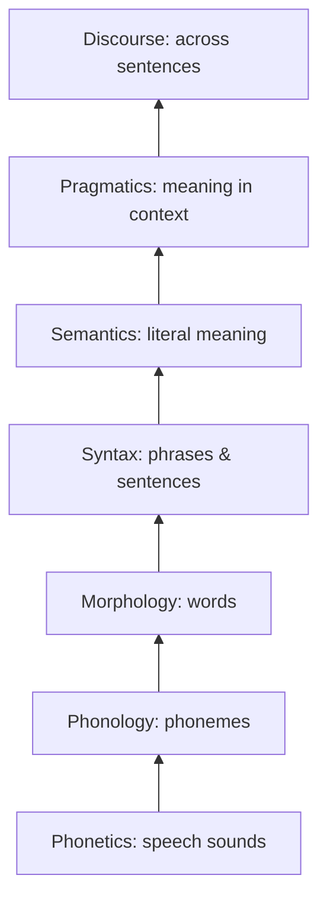
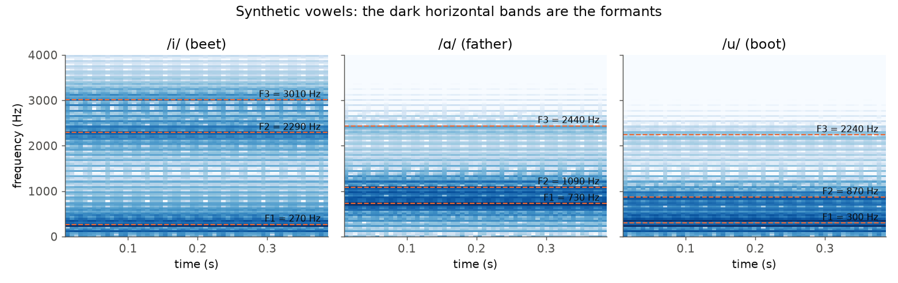
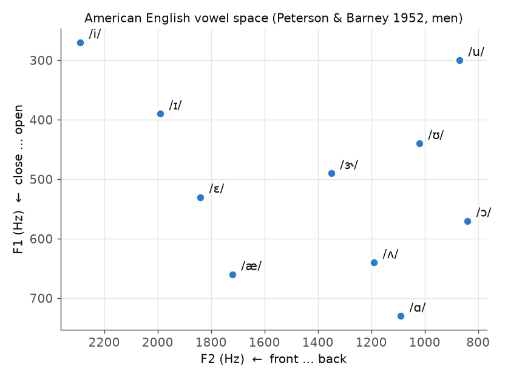
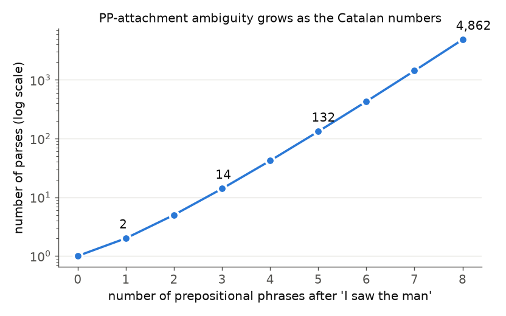

# 01 · What is SNLP? History & the Information Layers of Language

> **Course:** Introduction to Speech & Natural Language Processing (1-credit elective) · Dr. Krishnendu Ghosh · IIIT Dharwad
>
> **Lectures:** Lecture 0 (course intro) and Lecture 1 (Information Layers of SNLP), Sep 2026
>
> **Sources:** `Lecture 0.pdf`, `Lecture 1.pdf`. No transcript for these two; the 30 Sep transcript (Note 02) refers back to them.
>
> **Notebooks:** [`code/01_language_layers_deep_dive.ipynb`](code/01_language_layers_deep_dive.ipynb) (Parts A–M: plural rules on CMUdict, morphology, a CKY parser from scratch, WordNet, Lesk, first-order logic, formants, minimal pairs, speech acts, centering, practice checks) · [`code/lexical_processing_hands_on.ipynb`](code/lexical_processing_hands_on.ipynb), Parts H–I (syntax tree, word senses). Figures: [`code/figures_01.py`](code/figures_01.py).
>
> **Level tags:** 🟢 core (slides) · 🟡 standard depth expected in quizzes/assignments · 🔴 beyond syllabus (for depth and interviews)

---

## 📌 Table of Contents

1. [Big Picture](#1-big-picture)
2. [What is SNLP?](#2-what-is-snlp-)
3. [Speech Processing vs NLP](#3-speech-processing-vs-nlp-)
4. [History: Four Eras](#4-history-four-eras-)
5. [The Stages (Layers) of NLP](#5-the-stages-layers-of-nlp-)
6. [Layer 1: Phonetics](#6-layer-1-phonetics-)
7. [Layer 2: Phonology](#7-layer-2-phonology-)
8. [Layer 3: Morphology](#8-layer-3-morphology-)
9. [Layer 4: Syntax](#9-layer-4-syntax-)
10. [Layer 5: Semantics](#10-layer-5-semantics-)
11. [Layer 6: Pragmatics](#11-layer-6-pragmatics-)
12. [Layer 7: Discourse](#12-layer-7-discourse-)
13. [All Layers in One Example: a Voice Assistant](#13-all-layers-in-one-example-a-voice-assistant-)
14. [Ambiguity at Every Layer](#14-ambiguity-at-every-layer-)
15. [Real-World Case Studies](#15--real-world-case-studies)
16. [Code Walkthrough: the Companion Notebook](#16--code-walkthrough-the-companion-notebook)
17. [Common Confusions](#17--common-confusions)
18. [Quiz-Style Questions](#18--quiz-style-questions)
19. [Practice Problems](#19--practice-problems)
20. [Cheat Sheet](#20--cheat-sheet)
21. [Go Deeper](#21--go-deeper-curated-links)

---

## 1. Big Picture

**About the course (Lecture 0):** a **high-level** introduction to speech and NLP that focuses on **applications, pipelines and intuition**: how machines process speech and text, and how systems like **voice assistants** and **chatbots** work. Big picture plus small hands-on toy models; **not deep theory**.

**Objectives:** know what SNLP can do · learn the **speech → text → meaning** pipeline · build intuition · know the key components before building models · explore common tasks · build small toy models.


### Syllabus at a glance

| Unit | Topic | Hours | Notes |
|---|---|---|---|
| 1 | What is SNLP: speech vs NLP, real-world systems, end-to-end pipelines, applications | 2 | This note |
| 2 | Basic speech processing: speech production, spoken language processing, acquisition, feature extraction, neural speech representations | 4 | |
| 3 | Basic text processing: tokenization, stopwords, stemming vs lemmatization, n-grams, BoW, TF-IDF, Word2Vec, GloVe | 3 | [Note 02](02-Lexical-Processing-Part-1.md) starts this |
| 4 | Speech applications: ASR pipeline, Whisper / wav2vec, TTS pipeline | 2 | |
| 6 | NLP applications: text classification, sentiment, POS, NER, dependency parsing, semantic ambiguity, LLMs, challenges | 3 | |

*(The slides jump from Unit 4 to Unit 6; there is no Unit 5 listed.)*

### Assessment & key dates

| Component | Weight | Date |
|---|---|---|
| Theoretical assignments (2) | 24% | A1: **14 Oct** · A2: **9 Dec** |
| **Quizzes (12)** | **36%** | One per class, open about a week (e.g. the 30 Sep quiz was due before the next Tuesday) |
| Project formulation | 20% | Presentation: **23 Dec** |
| Attendance | 20% / 10% | Semester ends 27 Dec |

> 💡 12 quizzes make up 36% of the grade, so **don't miss weekly quizzes**. The cheat sheets at the end of each note are built for quiz revision.

**Electives rule (from the 30 Sep class):** the "Introduction to …" courses are all **1-credit**; you can **credit two** and audit the rest. Your specialisation vertical later can be different.

**Books:** Jurafsky & Martin, *Speech and Language Processing* (3rd ed. draft, free online) · Benesty, Sondhi & Huang, *Springer Handbook of Speech Processing* · Bird, Klein & Loper, *NLTK Book* · Huang, Acero & Hon, *Spoken Language Processing* · Rabiner & Juang, *Fundamentals of Speech Recognition*.

### How to read this note

Sections 1–5 are the slide content (definitions, history, the layer stack). Sections 6–12 take one layer each and go deeper than the slides: the theory behind each layer, the standard algorithm that works at that layer (formant analysis, rewrite rules, morphological segmentation, CKY parsing, Lesk WSD, speech-act classification, centering), and fully worked examples. Section 14 collects the ambiguity found at each layer, section 15 has industry case studies, and section 19 is a 24-problem practice bank with full solutions. Every computable number in this note is produced by the companion notebook.

---

## 2. What is SNLP? 🟢

> **Speech & Natural Language Processing (SNLP)** is a field of AI that allows machines to **read**, **derive meaning from text**, and **produce documents**.

- It works **in the background** of many services: chatbots, virtual assistants, social-media tracking.
- Language technologies have major penetration into the information and communication industry.

**Everyday SNLP you use:** Google Search autocomplete · Gmail Smart Reply and spam filtering · Google Translate · Alexa/Siri/Google Assistant · YouTube auto-captions · ChatGPT · Grammarly · UPI voice payments in Hindi · Bhashini (Govt. of India's Indian-language translation platform).

**Two complementary views of the field.**

| View | Question | Typical output |
|---|---|---|
| **Understanding (NLU / ASR)** | What did the user say and mean? | Transcript, parse tree, intent + slots, sentiment label |
| **Generation (NLG / TTS)** | How do we express this meaning? | Text, translated sentence, summary, synthetic speech |

Most products combine both: a translator understands the source sentence and generates the target; a voice assistant recognises, interprets, decides and then speaks.

---

## 3. Speech Processing vs NLP 🟢

| | Speech processing | Natural language processing |
|---|---|---|
| Input | **Audio signal** (waveform) | **Text** (characters) |
| Core problems | Recognise (ASR), synthesise (TTS), identify speaker, detect emotion | Understand, classify, translate, summarise, generate |
| Low-level unit | Samples → frames → **phonemes** | Characters → **tokens/words** |
| Extra difficulty | Noise, accents, speaking rate, no spaces between words in audio | Ambiguity, context, sarcasm |
| Example systems | Whisper, wav2vec 2.0, Google TTS | BERT, GPT, Google Translate |

They meet in **spoken dialogue systems**: speech → (ASR) → text → (NLU) → meaning → (dialogue manager) → response text → (TTS) → speech.

**Why speech is harder than it looks.** Text arrives already segmented into characters and (in most scripts) words. Speech arrives as a continuous pressure wave sampled thousands of times a second (16 000 samples/s is standard for ASR), with no pauses between most words, with the same phoneme sounding different in different neighbours (coarticulation), and with speaker, channel and noise variation on top. The phonetic and phonological layers exist precisely to turn that continuous signal into discrete units that the higher layers can use.

---

## 4. History: Four Eras 🟢

| Period | Era | How it worked | Coverage |
|---|---|---|---|
| 1950–1960 | **Prehistory** | Scientific knowledge of AI and linguistics extremely limited (e.g. the 1954 Georgetown–IBM Russian→English demo; Turing test 1950) | — |
| 1960–1990 | **Symbolic** | **Rules handwritten by experts** (ELIZA 1966, grammars, expert systems) | Very limited |
| 1990–2010 | **Statistical** | ML on data **annotated by experts** (HMMs for speech, n-gram LMs, statistical MT) | Good |
| 2010–present | **Neural** | ML on **non-annotated** (raw) data: word embeddings (2013), seq2seq (2014), Transformers (2017), BERT/GPT (2018–), LLMs | Excellent |

> 🔗 This mirrors the MLP course's story: rules → learned from labelled data → **self-supervised** learning on raw text (MLP Note 01 §9.5).

**What changed between eras, layer by layer.** In the symbolic era every layer had its own hand-built component (a pronunciation lexicon, morphological rules, a hand-written grammar, a logical form, dialogue scripts). In the statistical era each component became a model trained on annotated data (HMM acoustic models, POS taggers trained on the Penn Treebank, probabilistic parsers). In the neural era a single network often covers several layers at once (Whisper maps audio straight to text; an LLM handles syntax, semantics and much of pragmatics implicitly). The layer view in this note is still how errors are **diagnosed** and how components are **evaluated**.

---

## 5. The Stages (Layers) of NLP 🟢

Language carries information at **several layers**. Each builds on the one below.

| Layer | Unit studied | Question it answers |
|---|---|---|
| **Phonetics** | Speech sounds | How are sounds produced and perceived? |
| **Phonology** | Phonemes | Which sound patterns does *this* language use? |
| **Morphology** | Words (morphemes) | How are words built from meaningful pieces? |
| **Syntax** | Phrases & sentences | How are words arranged into sentences? |
| **Semantics** | Literal meaning of phrases & sentences | What does it mean? |
| **Pragmatics** | Meaning in context | What does the speaker *intend*? |
| **Discourse** | Multi-sentence text | How do sentences connect? |



**Two directions (slide diagram):**

- **Analyse** (understand) = go **up**: sounds → … → intended meaning (ASR + NLU).
- **Generate** (produce) = go **down**: intent → … → sounds (NLG + TTS).

The slide also draws this as an **onion**: each outer ring contains everything inside it.

> 💡 **Ambiguity exists at every layer.** That's why NLP is hard. Each section below has an example, and section 14 collects them.

**Each layer has a representation and an algorithm.** This table is the map for sections 6–12.

| Layer | Representation | Classic algorithm / resource | Notebook part |
|---|---|---|---|
| Phonetics | Waveform, spectrogram, formants, IPA | Source–filter model, LPC formant estimation | I |
| Phonology | Phoneme strings, rewrite rules | A → B / C _ D rules, minimal-pair search, CMUdict | A, J |
| Morphology | Morpheme segmentation + glosses | Suffix stripping, finite-state analysers | B |
| Syntax | Constituency / dependency trees | CFG + CKY, chart parsing | C, D, H |
| Semantics | First-order logic, predicate–argument, WordNet | Model checking, Lesk WSD, path similarity | E, F, G |
| Pragmatics | Speech-act labels, implicatures | Intent classifiers, Grice's maxims | K1 |
| Discourse | Coreference chains, coherence relations | Pronoun resolution, centering theory | K2, K3 |

---

## 6. Layer 1: Phonetics 🟢

> **Phonetics** studies the **production, transmission and perception of sounds**, without prior knowledge of the language being spoken.

Three branches: **articulatory** (how the mouth and tongue make sounds), **acoustic** (the physics of sound waves), **auditory** (how the ear and brain perceive them).

**Why it matters:**

- The foundation of **ASR** (speech → text) and **TTS** (text → speech).
- Maps **audio signals → phonemes → text**.
- Enables correct pronunciation modelling in **multilingual** systems.

**Example: IPA transcription.** The International Phonetic Alphabet gives one symbol per sound, independent of spelling:

| Word | IPA | Meaning |
|---|---|---|
| cat | /kæt/ | Animal |
| bat | /bæt/ | Animal |

English spelling is unreliable ("though", "through", "tough" all end in "-ough" but sound different); IPA isn't. Speech systems work on phones, not letters. The CMU Pronouncing Dictionary (notebook Part A) writes them as `DH OW`, `TH R UW`, `T AH F`: three different vowels and two different final consonants behind the same four letters.

**Ambiguity:** "recognise speech" vs "wreck a nice beach" are acoustically almost identical.

### 6.1 Articulatory phonetics: voicing, place, manner 🟡

Every consonant is described by **three features**:

1. **Voicing:** do the vocal folds vibrate? /b d g v z/ are **voiced**; /p t k f s/ are **voiceless**. (Put a finger on your throat and say "zzzz" then "ssss".)
2. **Place of articulation:** where the airflow is obstructed (lips, teeth, alveolar ridge, hard palate, soft palate/velum, glottis).
3. **Manner of articulation:** how it is obstructed: complete closure then release (**stop/plosive**), narrow gap with turbulence (**fricative**), stop + fricative (**affricate**), air through the nose (**nasal**), only slight narrowing (**approximant**, incl. **lateral** /l/).

English consonants (IPA):

| Manner ↓ / Place → | Bilabial | Labiodental | Dental | Alveolar | Post-alveolar | Palatal | Velar | Glottal |
|---|---|---|---|---|---|---|---|---|
| Stop | p b | | | t d | | | k g | |
| Fricative | | f v | θ ð | s z | ʃ ʒ | | | h |
| Affricate | | | | | tʃ dʒ | | | |
| Nasal | m | | | n | | | ŋ | |
| Approximant | (w) | | | ɹ, l (lateral) | | j | (w) | |

Where two symbols share a cell, the left one is voiceless and the right one voiced. /w/ is labial-velar (both lips and velum).

**Indian languages add contrasts English lacks.** Hindi stops have a **four-way** contrast at each place: voiceless unaspirated क /k/, voiceless aspirated ख /kʰ/, voiced unaspirated ग /g/, voiced aspirated (breathy) घ /gʱ/. Hindi and most Indian languages also separate **dental** त /t̪/ from **retroflex** ट /ʈ/ (tongue tip curled back). Indian English often maps English alveolar /t d/ to retroflex [ʈ ɖ], one of the most audible accent features an ASR system must learn.

**Vowels** have no obstruction, so they are described by tongue **height** (close/high ↔ open/low), tongue **backness** (front ↔ back) and **lip rounding**. /i/ (beet) is close front unrounded; /u/ (boot) is close back rounded; /ɑ/ (father) is open back unrounded.

### 6.2 Acoustic phonetics: the source–filter model 🟡

Speech production is modelled as a **source** passed through a **filter**:

- **Source:** for voiced sounds, the vocal folds open and close periodically at the **fundamental frequency** F0 (about 100–150 Hz for adult men, 180–250 Hz for adult women). Its spectrum is a comb of **harmonics** at F0, 2F0, 3F0, …
- **Filter:** the vocal tract (pharynx + mouth + lips) is a tube whose **resonances** amplify some harmonics and damp others. The resonance peaks are the **formants** F1, F2, F3, …

```math
S(f) = \underbrace{G(f)}_{\text{source (glottis)}} \cdot \underbrace{H(f)}_{\text{filter (vocal tract)}} \cdot \underbrace{R(f)}_{\text{lip radiation}}
```

Pitch (who is speaking, intonation) lives in the **source**; the vowel identity lives in the **filter**. That separation is why the same vowel can be sung on any note, and why ASR features such as MFCCs are designed to keep the spectral envelope (the filter) and discard the fine harmonic structure (the source).

**Derivation: formants of a uniform tube.** Model the neutral vowel (schwa) as a tube of length L, **closed** at the glottis and **open** at the lips.

1. At the closed end the air cannot move, so particle velocity is zero and **pressure is maximal** (an antinode).
2. At the open end the pressure equals atmospheric pressure, so the **pressure is zero** (a node).
3. A standing wave with a pressure antinode at one end and a node at the other fits an odd number of quarter wavelengths into the tube: $`L = (2n-1)\lambda/4`$ for $`n = 1, 2, 3, \dots`$.
4. With $`f = c/\lambda`$:

```math
F_n = \frac{(2n-1)\,c}{4L}, \qquad n = 1, 2, 3, \dots
```

The assumptions are a uniform cross-section, rigid walls and no losses; real vowels move away from this by narrowing the tube at different places, which shifts each formant up or down.

**Worked example 6.1 (tube formants).** Adult male vocal tract, L = 17.5 cm, speed of sound in warm moist air c = 350 m/s.

- F1 = 1 × 350 / (4 × 0.175) = 350 / 0.7 = **500 Hz**
- F2 = 3 × 500 = **1500 Hz**
- F3 = 5 × 500 = **2500 Hz**

For a shorter tract, L = 14 cm: F1 = 350 / 0.56 = **625 Hz**, F2 = **1875 Hz**, F3 = **3125 Hz** (notebook Part I).

*Sanity check:* formants are odd multiples of F1 (1 : 3 : 5), and a shorter tube gives higher formants by exactly the length ratio 17.5/14 = 1.25 (625/500 = 1.25). This is why women's and children's vowels have higher formants and why ASR systems apply **vocal tract length normalisation**.

### 6.3 Spectrograms and formants 🟡

A **spectrogram** is the magnitude of the short-time Fourier transform: cut the signal into overlapping windows, take the FFT of each, and plot time (x) against frequency (y) with energy as darkness. Formants appear as **dark horizontal bands**; their positions identify the vowel.



*Figure: synthetic vowels made by passing a 120 Hz pulse train through three resonators at Peterson–Barney average male formants (`code/figures_01.py`). /i/ has a very low F1 and a very high F2; /ɑ/ has F1 and F2 close together in the middle; /u/ has both low.*

**Worked example 6.2 (time–frequency resolution).** The figure uses a sampling rate of 10 000 Hz and windows of 256 samples.

- Window duration = 256 / 10 000 = **0.0256 s = 25.6 ms**.
- Frequency bin spacing = 10 000 / 256 = **39.06 Hz**.
- The harmonics of a 120 Hz voice are 120 Hz apart, about 3 bins, so they are **resolved** as separate thin lines (a **narrowband** spectrogram). A **wideband** spectrogram uses a short window (around 3–5 ms), whose coarse frequency resolution (several hundred Hz) smears the harmonics together and leaves only the formant envelope plus sharp timing of each glottal pulse.

*Sanity check:* window length × bin spacing = 0.0256 × 39.06 = 1.0. You cannot have fine time and fine frequency resolution at once (the uncertainty principle of Fourier analysis).

**The vowel space.** Plot F1 (down) against F2 (right-to-left) and the vowels fall into the same shape as the articulatory vowel chart: F1 rises as the tongue **lowers** (open vowels), F2 rises as the tongue moves **forward** (front vowels).



**Worked example 6.3 (reading formants).** Classify a vowel with F1 = 270 Hz, F2 = 2290 Hz.

- F1 is the lowest in the chart → tongue high → **close** vowel.
- F2 is the highest in the chart → tongue front → **front** vowel.
- Close front = **/i/** (beet). *Check against the table:* Peterson–Barney /i/ = (270, 2290). ✓

The notebook (Part I) runs **LPC** (linear predictive coding) on the synthetic waveform and recovers F2 and F3 within a few Hz (e.g. /ɑ/: true (730, 1090, 2440), estimated (730, 1087, 2439)). F1 of the close vowels is overestimated (/i/: 270 → 308 Hz) because a 120 Hz source only samples the spectrum every 120 Hz, so a resonance near 270 Hz is pinned down by just two harmonics.

---

## 7. Layer 2: Phonology 🟢

> **Phonology** studies the **rules that organise patterns of sounds** in a particular human language.

Phonetics is universal (all possible sounds); phonology is **language-specific** (which sound differences *matter* in this language).

**Slide examples:**

- **right / light**, **arrive / alive**: /r/ vs /l/ distinguishes words in English (they are separate **phonemes**). In Japanese they're not distinct, which is why native Japanese speakers find this pair hard.
- **Bengaluru**: the pronunciation and spelling of names vary by language and region (Bangalore → Bengaluru); phonological rules differ across Kannada and English.

**Why it matters:**

- Determines **pronunciation rules**. Example: the English plural suffix sounds different depending on the previous sound:

| Word | Plural pronounced | Rule |
|---|---|---|
| cats | /s/ | after voiceless sounds (/t/, /k/, /p/) |
| dogs | /z/ | after voiced sounds (/g/, /d/, vowels) |
| horses | /ɪz/ | after hissing sounds (/s/, /z/, /ʃ/) |

- Important for **speech synthesis** (TTS must say "dogz", not "dogs") and **accent modelling**.
- Helps build **phoneme-level models for low-resource languages** (many Indian languages have little text data).

> 🇮🇳 **Indian-language example:** Hindi distinguishes aspirated vs unaspirated stops: क (ka) vs ख (kha), प (pa) vs फ (pha). These are different phonemes in Hindi but not in English.

### 7.1 Phonemes, allophones and minimal pairs 🟡

- A **phone** is a physical speech sound, written in square brackets: [pʰ], [p].
- A **phoneme** is an abstract sound category that **distinguishes words** in a given language, written in slashes: /p/.
- **Allophones** are the different phones that realise one phoneme, usually predictable from context.

**The minimal-pair test.** Two words that differ in exactly one sound and mean different things (*right/light*, *pat/bat*) prove that the two sounds are different phonemes. If two sounds never contrast and instead occur in **complementary distribution** (each only in its own contexts), they are allophones of one phoneme.

**Worked example 7.1 (aspiration: allophone in English, phoneme in Hindi).**

- English *pin* is pronounced [pʰɪn] (with a puff of air), *spin* is [spɪn] (no puff). [pʰ] occurs at the start of a stressed syllable, [p] after /s/. They never distinguish two English words: complementary distribution → **allophones** of /p/.
- Hindi पल /pəl/ "moment" vs फल /pʰəl/ "fruit": a minimal pair → **separate phonemes**.
- Consequence for NLP: an English ASR acoustic model can merge [p] and [pʰ] into one unit; a Hindi model **must not**.

**Mining minimal pairs from a dictionary** (notebook Part J, 51 434 CMUdict words that WordNet also knows):

| Contrast | Minimal pairs found | Examples |
|---|---|---|
| /r/ – /l/ | 1123 | fry/fly, pray/play, right/light |
| /t/ – /d/ | 868 | beat/bead, pat/pad |
| /p/ – /b/ | 622 | pat/bat, pin/bin |
| /iː/ – /ɪ/ | 434 | beat/bit, sheep/ship |
| /s/ – /z/ | 321 | sip/zip |
| /θ/ – /ð/ | 5 | ether/either, teeth/teethe |

The count measures the contrast's **functional load**: /r/–/l/ carries a lot of meaning in English (so confusing them hurts intelligibility), while /θ/–/ð/ is phonemic but almost never the only difference between two words.

### 7.2 Phonological rules: A → B / C _ D 🟡

Phonologists write context-dependent sound changes as **rewrite rules**:

```math
A \rightarrow B \;/\; C \,\_\_\, D
```

read "A becomes B when preceded by C and followed by D" (the blank marks where A sits). Either context may be empty. Rules are written over **features** (e.g. [−voice], [+sibilant]) so one rule covers a whole class of sounds.

**The English plural, derived.** Assume the plural morpheme is **underlyingly /z/** (the form that appears in the "elsewhere" case, after vowels and voiced consonants). Two ordered rules then generate all three surface forms:

```math
\begin{aligned}
\text{R1 (epenthesis):}\quad & \varnothing \rightarrow \text{ɪ} \;/\; [+\text{sibilant}] \,\_\_\, \text{z} \\
\text{R2 (devoicing):}\quad & \text{z} \rightarrow \text{s} \;/\; [-\text{voice}] \,\_\_
\end{aligned}
```

**Worked example 7.2 (three derivations).**

| | cat + PL | dog + PL | horse + PL |
|---|---|---|---|
| Underlying | /kæt + z/ | /dɒg + z/ | /hɔːs + z/ |
| R1 epenthesis | – (t not a sibilant) | – | hɔːs**ɪ**z |
| R2 devoicing | kæt**s** (t is voiceless) | – (g is voiced) | – (ɪ is voiced) |
| Surface | **[kæts]** | **[dɒgz]** | **[hɔːsɪz]** |

*Why the order matters:* if R2 applied first to /hɔːs + z/, the voiceless /s/ would devoice the suffix to give *hɔːss*, and R1 would then find no /z/ to break up: the wrong form. R1 must **bleed** R2 (destroy its context) by applying first.

*Why /z/ is the underlying form:* choosing /s/ would need a voicing rule after voiced sounds **and** after vowels (two environments); /z/ needs only devoicing after voiceless sounds. The simpler grammar wins.

**Past tense** works the same way with underlying /d/: ɪ is inserted after /t/ or /d/ (*wanted* [wɒntɪd]), and /d/ devoices to [t] after a voiceless sound (*walked* [wɔːkt]); elsewhere it stays [d] (*played*).

**Tested on real data.** The notebook (Part A) implements both rules over CMUdict phonemes and checks them against the dictionary's own pronunciation of the plural/past form: **41/41** regular plurals and **16/16** regular past tenses correct. Over all 13 214 CMUdict words that are a plain-s plural of another entry, the allomorphs are distributed /z/ 8384, /s/ 3755, /ɪz/ 1075, so the voiced form really is the most common one.

**Worked example 7.3 (nasal place assimilation).** The negative prefix *in-* has underlying /ɪn/. The nasal copies the place of the next consonant:

```math
\text{n} \rightarrow \text{m} \;/\; \_\_\, \{\text{p}, \text{b}, \text{m}\} \qquad \text{n} \rightarrow \text{ŋ} \;/\; \_\_\, \{\text{k}, \text{g}\}
```

- in + possible → /ɪn.pɒsəbl/ → **[ɪmpɒsəbl]** (spelling also changes: *im*possible)
- in + correct → /ɪn.kərɛkt/ → **[ɪŋkərɛkt]** (spelling unchanged)
- in + definite → no rule applies → [ɪndɛfɪnət]

The notebook's general A → B / C _ D engine reproduces CMUdict for *impossible* and *imbalance*; for *incorrect* CMUdict writes N, not NG, because it is a **phonemic** dictionary and [ŋ] before /k/ is a predictable allophone it does not record. That is a good example of the phonemic vs phonetic levels.

**Indian-language phonology in practice.** Kannada and Telugu words end in vowels, so English loanwords gain a final vowel (*bus* → *bassu*). Hindi speakers often insert a vowel before word-initial /s/ + consonant clusters (*school* → *iskūl*). These are phonological rules of the speaker's first language applied to English, and an Indian-English ASR or TTS system has to model them.

---

## 8. Layer 3: Morphology 🟢

> **Morphology** studies how **words are composed of morphemes**, the **smallest meaningful units** of language.

A word = **one root/stem** + **zero or more affixes** (prefixes, suffixes).

**Examples:** draw · draw+s · draw+ing+s · un+draw+able · **unhappiness** = un- (prefix) + happy (root) + -ness (suffix).

**Why it matters:**

- Used in **stemming, lemmatization, machine translation, search, speech synthesis**.
- **Reduces vocabulary size** by grouping inflected forms (run, runs, running → RUN).
- **Critical for morphologically rich languages.** Kannada, Tamil, Malayalam, Turkish and Finnish glue many morphemes into one word. Example (Kannada): ಮನೆಗಳಲ್ಲಿ (*manegaḷalli*) = mane (house) + gaḷu (plural) + alli (in) = "in the houses". One word, three morphemes.

**Ambiguity:** "unlockable" = un+(lockable), i.e. *cannot be locked*, or (unlock)+able, i.e. *can be unlocked*?

➡️ Morphology is the starting point of **lexical processing**, covered in detail in [Note 02](02-Lexical-Processing-Part-1.md).

### 8.1 Kinds of morphemes 🟡

| Distinction | Meaning | Example |
|---|---|---|
| **Free** vs **bound** | Can stand alone as a word, or must attach | *happy* (free) vs *-ness*, *un-* (bound) |
| **Root** vs **affix** | Carries the core lexical meaning, or modifies it | *nation* in *inter-nation-al* |
| **Prefix / suffix / infix / circumfix** | Attaches before, after, inside, or around | *un-*, *-ness*; Tagalog infix *-um-*; German *ge-…-t* (*gespielt*) |
| **Allomorphs** | Different forms of one morpheme | plural /s/, /z/, /ɪz/ (section 7.2); *in-/im-/il-/ir-* |
| **Suppletion** | A form with no segmentable relation to the root | *go → went*, *good → better* |

### 8.2 Inflection vs derivation 🟡

| Property | Inflectional | Derivational |
|---|---|---|
| What it does | Marks grammatical features (number, tense, case, person) | Creates a new word (new meaning, often new category) |
| Category change? | Never (*cat → cats*, still a noun) | Often (*happy*ADJ → *happiness*N, *nation*N → *national*ADJ) |
| Productivity | Applies to almost every word of the class | Gappy (*happiness* but not *\*sadity*) |
| Position | Outermost (after all derivation) | Closer to the root |
| Required by syntax? | Yes (*he walk\** is ungrammatical) | No |
| English inventory | Only 8: plural -s, possessive -'s, 3sg -s, past -ed, past participle -en, progressive -ing, comparative -er, superlative -est | Hundreds: un-, re-, -ness, -ize, -ation, -able, … |

**Worked example 8.1 (layering).** *nationalized* = nation (root, N) + -al (derivational, N → ADJ) + -ize (derivational, ADJ → V) + -ed (inflectional, past). Derivational suffixes are inside, the single inflectional suffix is outermost, exactly as the table predicts. A stemmer that strips only inflection returns *nationalize*; a more aggressive stemmer may continue down to *nation*, changing the meaning.

### 8.3 Morphological typology: how languages build words 🟡

| Type | Morphemes per word | Boundaries | Example |
|---|---|---|---|
| **Isolating (analytic)** | About 1 | n/a | Vietnamese, largely Mandarin; English is mostly analytic (*will have been walking* uses separate words) |
| **Agglutinative** | Many | Clear; one meaning per affix | Turkish *ev-ler-imiz-den* "from our houses"; Kannada *mane-gaḷ-alli*; Tamil *vīṭu-kaḷ-il*; Finnish, Japanese |
| **Fusional (inflecting)** | Several | Blurred; one affix carries several features | Hindi *laṛk-iyõ* (‑iyõ = feminine + plural + oblique case at once); Sanskrit, Russian, Spanish *habl-o* (‑o = 1st person + singular + present + indicative) |
| **Polysynthetic** 🔴 | Very many; a whole sentence can be one word | Varies | Inuktitut, Mohawk |

Two numerical measures (Greenberg's indices) place a language on these scales: the **index of synthesis** = morphemes ÷ words (about 1 for isolating languages, well above 2 for agglutinative ones), and the **index of fusion** = proportion of morpheme boundaries that are not cleanly segmentable.

**Worked example 8.2 (segmenting 8 words across languages; notebook Part B).**

| Word | Language | Segmentation | Gloss | Morphemes |
|---|---|---|---|---|
| unhappiness | English | un-happy-ness | NEG-happy-NMLZ | 3 |
| internationalization | English | inter-nation-al-ize-ation | between-nation-ADJ-VERB-NMLZ | 5 |
| ಮನೆಗಳಲ್ಲಿ *manegaḷalli* | Kannada | mane-gaḷ-alli | house-PL-LOC "in the houses" | 3 |
| ಮರಗಳನ್ನು *maragaḷannu* | Kannada | mara-gaḷ-annu | tree-PL-ACC "the trees (object)" | 3 |
| வீடுகளில் *vīṭukaḷil* | Tamil | vīṭu-kaḷ-il | house-PL-LOC "in the houses" | 3 |
| *evlerimizden* | Turkish | ev-ler-imiz-den | house-PL-1PL.POSS-ABL "from our houses" | 4 |
| लड़कियों *laṛkiyõ* | Hindi | laṛk-iyõ | child-F.PL.OBL "girls (oblique)" | 2 |
| went | English | go+PAST (suppletive) | no segmentable boundary | 1 |

Glosses follow the Leipzig conventions: hyphens separate morphemes, capitals are grammatical morphemes (PL plural, LOC locative "in", ACC accusative, ABL ablative "from", POSS possessive, OBL oblique, NMLZ nominaliser).

Index of synthesis for these 8 words = (3 + 5 + 3 + 3 + 3 + 4 + 2 + 1) / 8 = 24 / 8 = **3.0**.

*Sanity check:* the Kannada, Tamil and Turkish words have exactly one affix per grammatical meaning (PL, then case), the agglutinative signature. The Hindi word has *fewer* segmentable morphemes (2) but the same amount of information (gender + number + case), because the features are **fused** into one suffix.

**Worked example 8.3 (why naive suffix stripping fails).** The notebook's greedy longest-suffix stripper for transliterated Kannada correctly splits *manegaḷalli* → mane + gaḷ (PL) + alli (LOC) and *pustakagaḷu* → pustaka + gaḷu (PL). It fails on *maneyinda* "from the house", returning the non-word stem *maney*, because a glide **y** is inserted between *mane* and *-inda* (sandhi); and it does not split *manege* "to the house" at all, because the dative surfaces as *-ge* after a vowel. Real analysers for Indian languages (finite-state transducers, or neural segmenters) model these **morphophonological** changes: the morphology and phonology layers interact at every morpheme boundary.

**Why vocabulary explodes in agglutinative languages.** A Kannada noun can combine with plural (or not) and with around eight case endings, and further clitics stack on top, so one noun root yields dozens of surface forms. A word-level model trained on a fixed corpus sees most of these forms rarely or never. This is the main reason modern multilingual models use **subword** tokenisation (BPE, SentencePiece), a data-driven approximation to morphological segmentation (Note 02 and the Gen AI course).

---

## 9. Layer 4: Syntax 🟡

> **Syntax** studies the **rules and constraints** that govern how words are **organised into sentences**.

- Closely connected to **formal language theory** and **rewriting grammars** (context-free grammars, as in compilers).
- **Difference from formal languages:** NLP systems must be **robust** to input that **doesn't follow grammar rules** (tweets, chat, speech disfluencies). A compiler rejects bad syntax; a chatbot can't.

### Two ways to represent sentence structure

**(a) Phrase structure (constituency) tree.** Example: *Alice/N eats/V strawberries/N with/P chocolate/N*

```
                S
        ┌───────┴────────┐
        NP               VP
        │        ┌───────┴────────┐
        N        V                NP
        │        │          ┌─────┴─────┐
      Alice    eats         NP          PP
                            │       ┌───┴───┐
                            N       P       NP
                            │       │       │
                      strawberries with     N
                                            │
                                        chocolate
```

S = sentence, NP = noun phrase, VP = verb phrase, PP = prepositional phrase. Words group into nested **constituents**.

> 🔴 **Ambiguity!** The notebook's grammar finds **2 parses**: "strawberries-with-chocolate" (PP attached to the noun, as on the slide) vs "eats … with chocolate" (PP attached to the verb, like "eats with a fork"). This **PP-attachment ambiguity** is a classic problem. Compare "I saw the man with the telescope."

**(b) Dependency tree.** Example: *Rolls-Royce said it expects its U.S. sales to remain steady.* Each word points to its **head** with a labelled relation:

```
said (ROOT)
├── nsubj ──▶ Rolls-Royce
└── ccomp ──▶ expects
              ├── nsubj ──▶ it
              ├── obj ────▶ sales
              │             ├── nmod:poss ──▶ its
              │             └── compound ───▶ U.S.
              └── xcomp ──▶ remain
                            ├── mark ──▶ to
                            └── xcomp ─▶ steady
```

(Universal Dependencies v2 labels; the slide's figure may use the older Stanford label set.)
Dependency trees show **who did what to whom** directly (subject, object, modifiers), and are popular because they work similarly across languages ([Universal Dependencies](https://universaldependencies.org/) covers 100+ languages including Hindi, Tamil, Telugu, Marathi).

| Constituency | Dependency |
|---|---|
| Groups words into nested phrases | Links words directly (head → dependent) |
| Good for grammar theory, compilers | Good for information extraction, free-word-order languages (Indian languages!) |

**Why syntax matters:** parsing, machine translation (word order: English is SVO, Hindi/Kannada are **SOV**: "Ram ate an apple" vs "राम ने सेब खाया"), question answering. It helps models find **subject, object, verb**.

### 9.1 Context-free grammars, formally 🟡

A **context-free grammar** is a 4-tuple

```math
G = (N, \Sigma, R, S)
```

where $`N`$ is a set of **non-terminals** (S, NP, VP, PP, N, V, …), $`\Sigma`$ is the set of **terminals** (the words), $`R`$ is a set of **rules** $`A \rightarrow \beta`$ with $`A \in N`$ and $`\beta \in (N \cup \Sigma)^{*}`$, and $`S \in N`$ is the **start symbol**. "Context-free" means a rule for A can be applied wherever A appears, regardless of its neighbours (contrast the phonological rules of section 7.2, which are context-*sensitive*). A sentence is **grammatical** if S derives it; each derivation corresponds to a **parse tree**, and a sentence with more than one tree is **structurally ambiguous**.

**Chomsky normal form (CNF).** A grammar is in CNF if every rule has one of two shapes:

```math
A \rightarrow B\,C \qquad \text{or} \qquad A \rightarrow w \qquad (A, B, C \in N,\; w \in \Sigma)
```

Every CFG that does not generate the empty string can be converted to an equivalent CNF grammar (same set of sentences):

1. **Remove ε-rules** (A → nothing) by adding copies of rules with the optional symbol left out.
2. **Remove unit rules** A → B by copying B's right-hand sides up to A (e.g. NP → N and N → 'Alice' become NP → 'Alice').
3. **Replace terminals inside long rules** by new pre-terminals (A → *to* B becomes A → T B, T → *to*).
4. **Binarise** rules with three or more children: A → B C D becomes A → B X and X → C D.

The notebook (Part C) converts the slide's grammar (which has VP → V NP PP and NP → N) with NLTK: the result has `VP -> V VP@$@V`, `VP@$@V -> NP PP` and `NP -> 'Alice'` etc., and the parse count stays **2** both before and after conversion.

### 9.2 The CKY algorithm 🟡

**CKY** (Cocke–Kasami–Younger) is a dynamic-programming parser for CNF grammars. Number the gaps between words 0 … n. Cell `table[i][j]` holds every non-terminal that can derive words i … j−1.

```
for i in 0..n-1:                          # length-1 spans
    table[i][i+1] = { A : A -> w_i in R }
for span in 2..n:                         # longer spans, shortest first
    for i in 0..n-span:
        j = i + span
        for k in i+1..j-1:                # every split point
            for each rule A -> B C:
                if B in table[i][k] and C in table[k][j]:
                    add A to table[i][j]  # keep a back-pointer (k, B, C)
accept iff S in table[0][n]
```

**Why it is correct (proof sketch).** By induction on span length. Spans of length 1 are filled directly from the lexical rules. A non-terminal A derives words i … j−1 (span ≥ 2) iff, since the grammar is in CNF, some rule A → B C and some split k have B deriving i … k−1 and C deriving k … j−1. Both are strictly shorter spans, already complete by the induction hypothesis, and the loop tries every k and every rule. So each cell ends up holding exactly the non-terminals that derive its span.

**Why it is O(n³) (proof).** The three nested position loops visit every triple (i, k, j) with $`0 \le i < k < j \le n`$ exactly once. Choosing 3 distinct values out of the n + 1 positions 0 … n, in increasing order, gives

```math
\binom{n+1}{3} = \frac{(n+1)\,n\,(n-1)}{6} = \frac{n^3 - n}{6} = O(n^3)
```

triples, and each one tries at most $`\lvert R\rvert`$ rules, so time is $`O(n^3 \lvert G\rvert)`$ and the table needs $`O(n^2)`$ cells. The notebook counts the loop iterations directly: 20, 56, 165, 1330, 10 660 triples for n = 5, 7, 10, 20, 40, matching $`(n^3-n)/6`$ every time. Doubling the sentence length (10 → 20 words) multiplies the work by 1330/165 ≈ **8.06**, close to 2³ = 8.

*Recognition* (is the sentence grammatical?) and *counting* parses are both polynomial. *Listing* all parses can be exponential, because the number of trees itself can be exponential (section 9.4).

### 9.3 Worked example: a full CKY chart

Grammar (CNF, notebook Part C):

```
S -> NP VP        VP -> V NP | VP PP      NP -> Det N | NP PP      PP -> P NP
NP -> 'she' | 'fish' | 'forks'   V -> 'eats'   P -> 'with'
```

Sentence: *she₀ eats₁ fish₂ with₃ forks₄* (n = 5).

**Step 1: length-1 spans (diagonal).** [0,1] she = NP; [1,2] eats = V; [2,3] fish = NP; [3,4] with = P; [4,5] forks = NP.

**Step 2: length-2 spans.**

- [0,2] *she eats*: split k=1 gives (NP, V). No rule A → NP V. **Empty.**
- [1,3] *eats fish*: (V, NP) matches VP → V NP. **VP.**
- [2,4] *fish with*: (NP, P). No rule. **Empty.**
- [3,5] *with forks*: (P, NP) matches PP → P NP. **PP.**

**Step 3: length-3 spans.**

- [0,3] *she eats fish*: k=1 gives (NP, VP[1,3]) → **S**; k=2 gives (empty, NP), nothing.
- [1,4] *eats fish with*: k=2 (V, empty); k=3 (VP, P), no rule. **Empty.**
- [2,5] *fish with forks*: k=3 gives (NP, PP) → NP → NP PP. **NP.**

**Step 4: length-4 spans.**

- [0,4] *she eats fish with*: needs [1,4] or [2,4] or ends in P; all fail. **Empty.**
- [1,5] *eats fish with forks*: k=2 gives (V, NP[2,5]) → **VP** (the fish have forks); k=3 gives (VP[1,3], PP[3,5]) → **VP** (eating with forks); k=4 gives ([1,4] empty, NP), nothing. **VP × 2.**

**Step 5: the whole sentence.** [0,5]: k=1 gives (NP, VP[1,5]) → S, and since VP[1,5] has 2 analyses, **S × 2**. Other splits use empty cells.

| i \ j | 1 | 2 | 3 | 4 | 5 |
|---|---|---|---|---|---|
| **0** | NP | – | S | – | **S×2** |
| **1** | | V | VP | – | VP×2 |
| **2** | | | NP | – | NP |
| **3** | | | | P | PP |
| **4** | | | | | NP |

*Sanity check:* the notebook's from-scratch CKY prints this exact chart, rebuilds 2 trees from the back-pointers, and `nltk.ChartParser` returns the **same set of 2 trees**. One tree attaches *with forks* to *fish* (NP → NP PP), the other to *eats* (VP → VP PP); the grammar has no way to know that fish do not carry forks, which is a semantic fact.

### 9.4 How fast does ambiguity grow? 🔴

Take *I saw the man* and keep appending PPs: *with the telescope*, *in the park*, *on the hill*, … Each new PP can attach to the verb phrase or to any earlier noun phrase that is still "open" on the right edge of the tree. The CKY parse counts from the notebook (Part D) are

| PPs | Words | Parses | Catalan number |
|---|---|---|---|
| 0 | 4 | 1 | C₁ = 1 |
| 1 | 7 | 2 | C₂ = 2 |
| 2 | 10 | 5 | C₃ = 5 |
| 3 | 13 | 14 | C₄ = 14 |
| 4 | 16 | 42 | C₅ = 42 |
| 5 | 19 | 132 | C₆ = 132 |



The counts are the **Catalan numbers**

```math
C_m = \frac{1}{m+1}\binom{2m}{m}, \qquad \text{parses}(k \text{ PPs}) = C_{k+1}
```

(a result of Church & Patil, 1982). The intuition: the attachments must nest without crossing, exactly like ways of fully bracketing a sequence, which the Catalan numbers count. They grow roughly like $`4^m`$, so a sentence with 8 PPs already has C₉ = 4862 parses. This is why practical parsers are **probabilistic** (PCFGs, neural parsers): they score the trees and return the best one instead of enumerating all of them.

### 9.5 Constituency vs dependency, in more depth 🟡

A **dependency tree** has one node per word, one root, and one labelled arc from each head to each dependent. Converting a constituency tree to dependencies is mechanical once each phrase has a designated **head** (the V of a VP, the N of an NP).

**Worked example 9.1 (word order and dependencies).** English *Ram ate an apple* (SVO) and Hindi राम ने सेब खाया *Rām ne seb khāyā* (SOV, literally "Ram ERG apple ate") have **the same dependency arcs** in different linear order:

| Arc | English | Hindi |
|---|---|---|
| root | ate | खाया khāyā |
| nsubj (agent) | ate → Ram | खाया → राम |
| obj | ate → apple | खाया → सेब |
| det / case | apple → an | राम → ने (case marker) |

In Hindi the ergative marker *ne* identifies the agent, so सेब राम ने खाया (*seb Rām ne khāyā*) is also grammatical and has the same arcs. A constituency grammar would need a separate rule for each order; dependency trees with case features describe both at once. That is why dependency parsing (and the Universal Dependencies treebanks) dominates for Indian languages.

---

## 10. Layer 5: Semantics 🟡

> **Semantics** studies the **meaning** of linguistic expressions: words, phrases, sentences.

Common representations of meaning:

| Representation | Example for "Alice eats strawberries" |
|---|---|
| **Logical** (first-order logic) | $`\exists e.\ \text{Eating}(e) \land \text{Eater}(e, \text{Alice}) \land \text{Eaten}(e, \text{strawberries})`$ |
| **Predicate–argument structure** | eat(agent = Alice, theme = strawberries) |
| **Graph** (e.g. AMR, knowledge graphs) | (Alice) —eats→ (strawberries) |

**Why it matters:**

- Core for **word embeddings** (Word2Vec, GloVe: Unit 3), **translation**, **chatbots**, **question answering**.
- Resolves **word sense disambiguation (WSD)**. Example: **"bank"** → *financial institution* or *river bank* (WordNet lists **18** senses; notebook Part I).

From the 30 Sep class: "blood **bank**" (repository), "my money is in the **bank**" (account/institution), "the **bank** declared a strike" (its employees/union), "**river bank**" (geography). Choosing the sense needs context from the semantic level, not the lexical level.

### 10.1 First-order logic as a meaning representation 🟡

FOL has **constants** (alice, nlp), **variables** (x, y), **predicates** (student(x), read(x, y)), connectives (¬, ∧, ∨, →) and **quantifiers** ∀ ("for all") and ∃ ("there exists"). A formula is **true or false in a model**: a domain of individuals plus the set of individuals (or pairs) for which each predicate holds. Checking truth in a model is how a question-answering system over a database works: translate the question to logic, evaluate it against the facts.

**The ∀-with-→, ∃-with-∧ rule (and why).**

- "Every student likes NLP" = $`\forall x\,(\text{student}(x) \rightarrow \text{like}(x, \text{nlp}))`$. Writing ∧ instead would say *everything in the domain is a student and likes NLP*, false as soon as a book exists.
- "Some student likes NLP" = $`\exists x\,(\text{student}(x) \land \text{like}(x, \text{nlp}))`$. Writing → instead would be true whenever some non-student exists (a false antecedent makes the implication true), so it would say almost nothing.

**Worked example 10.1 (five sentences to FOL, evaluated in a model).** Model (notebook Part G): students = {Alice, Ravi}; books = {b1, b2}; like = {(Alice, nlp), (Ravi, nlp)}; eat = {(Alice, strawberries)}; read = {(Alice, b1), (Ravi, b2)}; nobody failed.

| # | Sentence | FOL | True in model? |
|---|---|---|---|
| 1 | Alice eats strawberries | $`\text{eat}(\text{alice}, \text{strawberries})`$ | True: (Alice, strawberries) is in *eat* |
| 2 | Every student likes NLP | $`\forall x\,(\text{student}(x) \rightarrow \text{like}(x, \text{nlp}))`$ | True: both students like NLP |
| 3 | Some student likes NLP | $`\exists x\,(\text{student}(x) \land \text{like}(x, \text{nlp}))`$ | True: x = Alice works |
| 4 | No student failed | $`\neg \exists x\,(\text{student}(x) \land \text{failed}(x))`$ | True: *failed* is empty |
| 5a | Every student reads some book (narrow ∃) | $`\forall x\,(\text{student}(x) \rightarrow \exists y\,(\text{book}(y) \land \text{read}(x, y)))`$ | True: Alice→b1, Ravi→b2 |
| 5b | … one particular book (wide ∃) | $`\exists y\,(\text{book}(y) \land \forall x\,(\text{student}(x) \rightarrow \text{read}(x, y)))`$ | False: neither b1 nor b2 is read by both |

*Sanity check:* `nltk.sem` evaluates all six formulas in the same model and returns True, True, True, True, True, False. Sentence 5 shows **quantifier-scope ambiguity**: one English sentence, two logical forms, different truth values. Note that 5b entails 5a but not the other way round.

**Event semantics** (the slide's form, $`\exists e.\ \text{Eating}(e) \land \dots`$) introduces an event variable e so that any number of modifiers can be added as extra conjuncts (… ∧ Time(e, yesterday) ∧ Instrument(e, fork)) without changing the arity of the predicate.

### 10.2 Lexical semantics and WordNet 🟡

**WordNet** groups words into **synsets** (sets of synonyms that express one concept) and links synsets by relations:

| Relation | Meaning | WordNet example (notebook Part E) |
|---|---|---|
| Synonymy | same meaning | car.n.01 = {car, auto, automobile, machine, motorcar} |
| Antonymy | opposite (between lemmas) | good ↔ bad |
| Hypernymy / hyponymy | IS-A (more general / more specific) | car → motor_vehicle; vehicle → {sled, rocket, wheeled_vehicle, …} |
| Meronymy / holonymy | PART-OF / HAS-PART | tree has parts {trunk, limb, crown, stump, burl}; substance {heartwood, sapwood} |
| Polysemy | one word, many related senses | *bank*: 18 senses (10 noun, 8 verb); *run*: 57; *play*: 52 |

Following hypernyms from *dog* gives the path entity → physical_entity → object → whole → living_thing → organism → animal → domestic_animal → dog.

**Path similarity.** For two synsets joined by a shortest IS-A path of d edges,

```math
\text{sim}_{\text{path}}(s_1, s_2) = \frac{1}{1 + d}
```

So identical synsets score 1 and the score falls as the path lengthens.

**Worked example 10.2.** dog.n.01 → canine.n.02 → carnivore.n.01 ← feline.n.01 ← cat.n.01: d = 4 edges, so path similarity = 1/(1 + 4) = **0.200**. The lowest common hypernym is *carnivore*. dog vs car meet only at *whole* (d = 12), giving 1/13 = **0.077**.

*Sanity check:* NLTK's `path_similarity` returns 0.200 and 0.077, and the lowest common hypernyms *carnivore.n.01* and *whole.n.02*.

### 10.3 Word sense disambiguation with the Lesk algorithm 🟡

**Idea (Lesk, 1986):** a word's correct sense is the one whose dictionary definition shares the most words with the context. **Simplified Lesk:**

```
best_sense = most frequent sense; max_overlap = 0
context = set of content words in the sentence (minus the target word)
for each sense s of the word:
    signature = content words in the gloss (+ examples) of s
    overlap = |context ∩ signature|
    if overlap > max_overlap: best_sense, max_overlap = s, overlap
return best_sense
```

**Worked example 10.3 (Lesk by hand for "bank").** Two senses, glosses and examples from WordNet, stopwords removed:

- **bank#1 (river)** = bank.n.01 signature: {sloping, land, especially, slope, beside, body, water, pulled, canoe, sat, river, watched, currents}
- **bank#2 (money)** = depository_financial_institution.n.01 signature: {financial, institution, accepts, deposits, channels, money, lending, activities, cashed, check, holds, mortgage, home}

*Sentence A:* "I went to the bank to deposit money and pay my mortgage."
Context = {went, deposit, money, pay, mortgage}.

- ∩ bank#1 = ∅ → overlap **0**
- ∩ bank#2 = {money, mortgage} → overlap **2**
- Choose **bank#2 (financial)**. ✓

*Sentence B:* "We sat on the bank of the river and watched the water."
Context = {sat, river, watched, water}.

- ∩ bank#1 = {sat, river, watched, water} → overlap **4**
- ∩ bank#2 = ∅ → overlap **0**
- Choose **bank#1 (river)**. ✓

*Sanity check and a subtlety:* the notebook gets the same overlaps (2 and 4). Note that *deposit* in sentence A does **not** match *deposits* in the gloss: without stemming or lemmatisation (Note 02) the overlap would be 3. Lesk depends on the lexical layer.

**Where Lesk fails** (notebook Part F, all 18 WordNet senses):

- *"The bank approved the loan for the new house"* → both simplified Lesk and `nltk.wsd.lesk` choose bank.n.06 ("the funds held by a gambling **house**"), because *house* is the only overlapping word and *loan* is not in the financial gloss.
- *"Fishermen stood on the muddy bank of the stream"* → zero overlap with every sense; the answer is whichever sense is tried first.
- *"You can bank on me"* → a verb use, but neither version filters by part of speech.

Lesk is therefore a **baseline**. Better systems extend the signature (with related synsets, or with corpus examples) or, today, compare **contextual embeddings** of the target word with embeddings of each sense.

---

## 11. Layer 6: Pragmatics 🟡

> **Pragmatics** studies how expressions are **used for specific communicative goals**. Unlike semantics, it asks **what an expression means in a given context**.

Key concept: the **speech act**, an **action performed through language** (requesting, promising, warning, apologising…).

**Example:** *"Can you pass the salt?"* / *"Can you open the window?"*

- **Semantics** (literal): a yes/no question about your **ability**.
- **Pragmatics** (intended): a **polite request**. Answering "Yes, I can" without passing it is a pragmatic failure.

**Why it matters:**

- Chatbots and dialogue systems must infer **intent, tone and implied meaning**.
- Used in **sarcasm** and **emotion detection**: "Great, my flight is delayed again 🙄" is literally positive but pragmatically negative (cf. the sentiment examples in MLP Note 01 §5).
- Intent detection in voice assistants: "It's cold in here" → *turn on the heater*.

### 11.1 Speech-act theory 🟡

**Austin (1962)** separated three acts in every utterance:

| Act | What it is | "Can you pass the salt?" |
|---|---|---|
| **Locutionary** | Saying words with a literal meaning | A question about the hearer's ability |
| **Illocutionary** | The action intended by saying it | A request |
| **Perlocutionary** | The effect on the hearer | The hearer passes the salt |

**Searle (1976)** classified illocutionary acts into five types:

| Class | Speaker's aim | Example | Voice-assistant analogue |
|---|---|---|---|
| **Assertive** | State something as true | "The meeting is at noon." | Information the system may store |
| **Directive** | Get the hearer to do something | "Turn off the lights." / "Could you…?" | The main intent class |
| **Commissive** | Commit the speaker to a future act | "I promise to call tomorrow." | Reminders the user sets for themselves |
| **Expressive** | Express a feeling | "Thanks a lot!", "Sorry for the delay." | Small talk, sentiment |
| **Declaration** | Change the world by saying it (needs authority) | "I hereby resign." / "I now pronounce you…" | Rare; legal and ceremonial |

A **direct** speech act uses the sentence type that matches its function (imperative for a command); an **indirect** speech act uses another type (an interrogative *Can you…?* to make a request). Indirect requests are the norm in polite speech, so an intent classifier that relies on sentence type alone will misread them.

**Felicity conditions.** A speech act only "works" if its conditions hold: a request presumes the hearer **can** do the act and the speaker **wants** it done. Indirect requests work by questioning or asserting one of these conditions: *Can you…?* (ability), *I would like…* (desire), *Would you mind…?* (willingness).

**Worked example 11.1 (rule-based speech-act tagging; notebook Part K1).** A small regex tagger (*can/could/would you* → indirect request; imperative verb first → command; *I promise* → commissive; *thank/sorry* → expressive; *hereby* → declaration; final "?" → question; otherwise assertive) labels "Can you pass the salt?" as DIRECTIVE (indirect request) and "Turn off the lights." as DIRECTIVE (command). It labels "It's cold in here." as **ASSERTIVE**, which may be wrong: in a room with an open window it is a request. The string alone does not contain the answer, which is the whole point of pragmatics.

### 11.2 Grice's cooperative principle and implicature 🟡

**Grice (1975):** conversation works because participants assume each other to be cooperative, following four **maxims**:

| Maxim | Rule of thumb |
|---|---|
| **Quantity** | Say as much as is needed, and no more |
| **Quality** | Say only what you believe true and have evidence for |
| **Relation** | Be relevant |
| **Manner** | Be clear, brief, orderly; avoid ambiguity and obscurity |

When a speaker **openly flouts** a maxim, the hearer, still assuming cooperation, infers an extra meaning: a **conversational implicature**. Implicatures are **cancellable** ("Some students passed; in fact all of them did" is not a contradiction), which distinguishes them from **entailments** (what the sentence logically guarantees).

**Worked example 11.2 (identifying flouted maxims).**

| Exchange | Maxim flouted | Implicature |
|---|---|---|
| A: "How was the exam?" B: "The hall had good fans." | **Relation** (answer is off-topic) | The exam went badly |
| A reference letter for a research post: "He has excellent handwriting and was always punctual." | **Quantity** (far too little relevant information) | He is not a strong candidate |
| "Oh great, another Monday." | **Quality** (literally false praise; sarcasm) | The speaker dislikes Mondays |
| A: "Did you finish the report?" B: "I wrote the introduction." | **Quantity** (scalar: says less than "finished") | The report is not finished |
| "She produced a series of sounds that corresponded closely with the score of the song." (instead of "she sang") | **Manner** (needlessly long-winded) | The singing was bad (Grice's own example) |

**Scalar implicature** (row 4, and the classic *some → not all*): choosing a weaker word on a scale (⟨some, all⟩, ⟨warm, hot⟩, ⟨possible, certain⟩) implies the stronger one does not hold, because a cooperative speaker would otherwise have used it (Quantity). Sentiment and summarisation systems that ignore this read "The food was okay" as positive when diners usually mean lukewarm.

---

## 12. Layer 7: Discourse 🟡

> **Discourse analysis** studies written and spoken language in relation to its **social context**. A discourse is a piece of text with **multiple sub-topics** and **coherence relations** between them, such as **explanation**, **elaboration** and **contrast**.

**Example (coreference):** *"John bought a car. He loves it."* → **"He" = John**, **"it" = the car**.

| Coherence relation | Example |
|---|---|
| Explanation (cause) | "I stayed home. **I was sick.**" |
| Elaboration | "The laptop is great. **The battery lasts 12 hours.**" |
| Contrast | "The camera is excellent. **However, the battery is weak.**" |

**Why it matters:** text **summarisation**, **coreference resolution**, document understanding, and capturing cause–effect / elaboration / contrast. Mixed-sentiment reviews need the *contrast* relation to get aspect-level sentiment right.

### 12.1 Coreference and anaphora 🟡

**Coreference resolution** groups all mentions that refer to the same entity into a **chain**: {John, He}, {a car, it}.

| Phenomenon | Example | Note |
|---|---|---|
| **Anaphora** (refers back) | "John bought a car. **He** loves it." | The common case |
| **Cataphora** (refers forward) | "Before **he** left, John locked the door." | Pronoun precedes its antecedent |
| **Bridging** | "I bought a car. **The engine** is noisy." | *The engine* = the car's engine (part-of, a WordNet meronym) |
| **Zero anaphora** | Kannada/Hindi often drop the subject: "Ravi came. ∅ Sat down." | Very common in Indian languages; the system must recover the missing subject |

**Constraints and preferences used by resolvers (notebook Part K2):**

1. **Agreement** (hard): number, gender, person must match (*she* cannot be *John*).
2. **Binding** (hard): in "Mary saw her", *her* ≠ Mary (otherwise English uses *herself*).
3. **Recency** (soft): prefer the most recent compatible entity.
4. **Grammatical role** (soft): prefer subjects over objects.

On "Mary met Susan. She gave her a book." the notebook resolver outputs She → Mary (subject preference) and her → Susan (binding forbids Mary). Hard cases need **world knowledge**: in the Winograd sentence "The trophy didn't fit in the suitcase because **it** was too big", *it* = the trophy; change *big* to *small* and *it* = the suitcase. No agreement, recency or role rule distinguishes them.

### 12.2 Centering theory 🔴

**Centering** (Grosz, Joshi & Weinstein, 1995) measures **local coherence** by tracking which entity each utterance is "about".

- **Cf(Uₙ)** (forward-looking centres): entities mentioned in Uₙ, ranked by salience (subject > object > others).
- **Cp(Uₙ)** (preferred centre): the top-ranked element of Cf(Uₙ).
- **Cb(Uₙ)** (backward-looking centre): the highest-ranked element of Cf(Uₙ₋₁) that is mentioned again in Uₙ.

Transitions between consecutive utterances:

| | Cb(Uₙ) = Cb(Uₙ₋₁) (or no previous Cb) | Cb(Uₙ) ≠ Cb(Uₙ₋₁) |
|---|---|---|
| **Cb(Uₙ) = Cp(Uₙ)** | CONTINUE | SMOOTH-SHIFT |
| **Cb(Uₙ) ≠ Cp(Uₙ)** | RETAIN | ROUGH-SHIFT |

The theory predicts that readers prefer **CONTINUE > RETAIN > SMOOTH-SHIFT > ROUGH-SHIFT**; a text full of rough shifts reads as incoherent. Its **pronoun rule**: if anything in Uₙ is pronominalised, the Cb must be too.

**Worked example 12.1 (centering transitions; notebook Part K3).**

| Utterance | Cf (ranked) | Cb | Cp | Transition |
|---|---|---|---|---|
| U1: John went to his favourite music store to buy a piano. | John, store, piano | – | John | – |
| U2: He had frequented the store for many years. | John, store | John | John | CONTINUE |
| U3: He was excited that he could finally buy a piano. | John, piano | John | John | CONTINUE |
| U4: It was closing just as John arrived. | store, John | John | store | RETAIN |

*Check U4:* Cf(U3) = [John, piano]; the highest-ranked one mentioned in U4 is John, so Cb(U4) = John = Cb(U3); but Cp(U4) = store ≠ John → RETAIN. Readers find U4 slightly jarring: the pronoun *It* refers to the store, while the discourse centre, John, is named in full.

---

## 13. All Layers in One Example: a Voice Assistant 🟡

User says: *"Hey Google, can you book me a cab to the airport? My flight's at 6."*

| Layer | What the system does |
|---|---|
| Phonetics | Converts the audio waveform into acoustic features → phone probabilities |
| Phonology | Applies English sound patterns; handles the Indian-English accent |
| Morphology | "flight's" = flight + 's (is); "book" is a verb here (not a noun) |
| Syntax | Parses: [you] [book] [me] [a cab] [to the airport] |
| Semantics | book(agent=assistant, beneficiary=user, theme=cab, destination=airport) |
| Pragmatics | "Can you…" = a **request**, not an ability question |
| Discourse | "6" refers to the flight time → infer pickup ≈ 3:30–4:00 am; "My flight" links to "airport" |

Modern end-to-end neural models (Whisper + an LLM) learn many of these layers implicitly, but the layers are still how we **diagnose errors** ("it misheard" = phonetic; "it misunderstood" = semantic/pragmatic).

**Error diagnosis by layer (same request).**

| Observed failure | Layer at fault | Typical fix |
|---|---|---|
| Transcript says "book me a cap" | Phonetics/phonology (b/p, voicing confusions in noise) | More accented and noisy training audio |
| "flight's" read as plural *flights* | Morphology / tokenisation | Better clitic handling |
| "a cab to the airport" parsed as the cab belonging to the airport | Syntax (attachment) | Slot-filling model trained on travel requests |
| Answers "Yes, I can" | Pragmatics (indirect request) | Intent classifier that maps *can you* + action verb to a command |
| Books a cab for 6 pm | Discourse + world knowledge | Reason from "flight at 6" to an early-morning pickup and confirm |

---

## 14. Ambiguity at Every Layer 🟡

| Layer | Type of ambiguity | Example | What resolves it |
|---|---|---|---|
| Phonetics | Segmentation of continuous speech | "recognise speech" / "wreck a nice beach"; "ice cream" / "I scream" | Language model over word sequences |
| Phonology | Homophones; accent-driven mergers | *right/write*; /v/–/w/ merged in some Indian English | Context; speaker adaptation |
| Morphology | Multiple segmentations | *unlockable* = un-(lockable) or (unlock)-able | Meaning of the context |
| Morphology / POS | Category ambiguity | *flies* (noun or verb), *book* (noun or verb) | POS tagging with context |
| Syntax | Attachment, coordination | "I saw the man with the telescope"; "old men and women" | Semantics and world knowledge, probabilistic parsing |
| Semantics | Word senses; quantifier scope | *bank*; "Every student reads some book" | WSD; context |
| Pragmatics | Literal vs intended force | "Can you pass the salt?"; "Great, another delay" | Situation, tone, shared knowledge |
| Discourse | Reference | "The trophy didn't fit in the suitcase because it was too big" | World knowledge |

**The classic multi-layer example: "Time flies like an arrow."** Under a toy grammar the notebook (Part H) finds **2** parses: N V PP (*time passes quickly, as an arrow does*) and N N V NP (*"time-flies" are fond of an arrow*). Adding an imperative rule S → VP gives a **3rd**: V NP PP (*measure the speed of flies the way you would time an arrow*). The POS ambiguity of *time*, *flies* and *like* at the morphological/lexical layer multiplies into syntactic ambiguity, and only semantics and world knowledge leave one sensible reading. NLTK's tagger simply picks one tag sequence (time/NN flies/NNS like/IN an/DT arrow/NN).

> 💡 Ambiguity **compounds** up the stack. If a 10-word sentence has 2 senses for 3 of its words and 5 parses, a system that cannot use context faces 2 × 2 × 2 × 5 = 40 combinations before pragmatics and discourse even start. Disambiguation at each layer, using information from the layers above, is what makes NLP tractable.

---

## 15. 🏭 Real-World Case Studies

### Case 1: voice assistants (Alexa, Siri, Google Assistant) across the layers

- **Phonetics:** a small **wake-word** model ("Alexa", "Hey Google") runs continuously on the device; only after it fires is audio sent for full recognition. Microphone arrays and beamforming handle far-field speech.
- **Phonology:** pronunciation lexicons (like CMUdict) and grapheme-to-phoneme models cover names and new words; accent adaptation is essential for Indian English, where retroflex stops and /v/–/w/ mergers are common.
- **Morphology/syntax/semantics:** the NLU component turns the transcript into an **intent** plus **slots**: "book me a cab to the airport" → `BookRide(destination=airport)`. This is a predicate–argument structure (section 10).
- **Pragmatics:** indirect requests ("Can you…", "It's dark in here") must be mapped to commands, and a confirmation strategy is needed when confidence is low.
- **Discourse:** follow-ups ("And how long will **it** take?") need the dialogue state to resolve *it* to the ride just booked.
- **Lesson:** a failure is usually located at one layer, and products log ASR confidence and NLU confidence separately for exactly that reason.

### Case 2: Google Translate and ambiguity errors

- Google moved from phrase-based statistical MT to **Google Neural Machine Translation (GNMT)** in 2016. The GNMT paper (Wu et al., 2016) reports that, in human side-by-side evaluation on isolated simple sentences, it **reduces translation errors by an average of 60%** compared with the phrase-based production system.
- **Lexical/semantic ambiguity:** *bank*, *bat*, *spring* must be disambiguated before choosing a target word; one-sentence-at-a-time translation lacks the discourse context that often decides the sense.
- **Morphological/pragmatic ambiguity, gender:** Turkish *o* is a gender-neutral pronoun. Sentences like *o bir doktor* / *o bir hemşire* used to come out as "he is a doctor" / "she is a nurse", copying stereotypes from the training data. Google responded in 2018 by showing **both** gendered translations for such single sentences. The source sentence is ambiguous (or unspecified) and the target language forces a choice.
- **Syntactic:** English → Hindi/Kannada must reorder SVO into SOV and attach case markers, so a PP-attachment error in the parse becomes a visible word-order error in the output.

### Case 3: Bhashini and AI4Bharat (Indian-language technology)

- **Bhashini** is the Government of India's language-technology platform (Ministry of Electronics and IT, under the National Language Translation Mission, launched in 2022). It exposes ASR, MT and TTS services for Indian languages so that government and private apps can offer services in the user's language.
- **AI4Bharat** (IIT Madras) builds open models and datasets for Indian languages; its **IndicTrans2** translation model covers **all 22 scheduled Indian languages** (Gala et al., 2023).
- **Layers that matter most here:** **morphology** (agglutinative Dravidian languages: one Kannada or Tamil word = a whole English phrase, so subword tokenisation is essential); **phonology/phonetics** (aspiration and retroflex contrasts, many low-resource languages with little transcribed speech); **syntax** (SOV order, free word order, case markers); **discourse/pragmatics** (code-mixing such as Hinglish, honorific forms such as *āp* vs *tum*, dropped subjects).
- **Lesson:** techniques built for English (word-level vocabularies, fixed word order) degrade sharply on Indian languages; layer-aware design (subwords, dependency representations, script-aware normalisation) is what closes the gap.

### Case 4: grammar checkers (Grammarly, LanguageTool, Microsoft Editor)

- **Morphology + syntax:** subject–verb agreement ("The list of items **are** long" → *is*; the head noun is *list*, not *items*, so the checker needs the parse, not the nearest noun); wrong verb forms (*have went*).
- **Semantics / lexical choice:** confusables (*their/there/they're*, *affect/effect*), which share pronunciation (a phonology fact) but differ in meaning.
- **Pragmatics:** tone and formality suggestions (rewriting a blunt request as an indirect one is exactly Searle's direct → indirect speech act).
- **Rules vs learning:** LanguageTool is open source and largely built on hand-written error **patterns** (symbolic era methods, still useful for precision), complemented by statistical/neural models; commercial checkers rely mostly on neural sequence-to-sequence correction. The slide's robustness requirement is front and centre: the input is by definition ungrammatical, and the system must still parse it well enough to propose a fix.

---

## 16. 💻 Code Walkthrough: the Companion Notebook

[`code/01_language_layers_deep_dive.ipynb`](code/01_language_layers_deep_dive.ipynb) (executed; NLTK, NumPy and SciPy only):

| Part | Layer | What it shows | Key output |
|---|---|---|---|
| A | Phonology | Plural and past-tense rules over CMUdict phonemes | 41/41 plurals, 16/16 past forms correct |
| B | Morphology | Segmentation of 8 words; greedy Kannada suffix stripper | Index of synthesis 3.0; sandhi failures |
| C | Syntax | CKY from scratch, chart printing, tree rebuilding, CNF conversion, loop counting | Same 2 trees as `nltk.ChartParser`; (n³ − n)/6 triples |
| D | Syntax | Parses vs number of PPs | 1, 2, 5, 14, 42, 132 (Catalan) |
| E | Semantics | WordNet relations and path similarity | dog–cat 0.200, dog–car 0.077 |
| F | Semantics | Simplified Lesk vs `nltk.wsd.lesk` | Hand example correct; failure cases explained |
| G | Semantics | FOL with `nltk.sem` evaluated in a model | Scope ambiguity: True vs False |
| H | All | "Time flies like an arrow" | 2 parses, 3 with S → VP |
| I | Phonetics | Tube formants, source–filter synthesis, LPC | (730, 1087, 2439) for /ɑ/ |
| J | Phonology | Minimal pairs from CMUdict; A → B / C _ D engine | r/l 1123 pairs; nasal assimilation |
| K | Pragmatics, discourse | Speech-act tagger, pronoun resolver, centering | CONTINUE/RETAIN transitions |
| L, M | Checks | Every computable practice answer | — |

The heart of CKY (Part C) is a few lines. Counting subtrees instead of storing a boolean is what lets the same chart report how many parses exist:

```python
for span in range(2, n + 1):
    for i in range(0, n - span + 1):
        j = i + span
        for k in range(i + 1, j):
            for B, nb in table[i][k].items():
                for C, nc in table[k][j].items():
                    for A in binary.get((B, C), []):
                        table[i][j][A] += nb * nc        # number of subtrees
                        back[i][j][A].append((k, B, C))  # back-pointer
```

The plural rule (Part A) is three ordered checks, mirroring R1 and R2 of section 7.2:

```python
def plural_suffix(singular_phones):
    last = strip(singular_phones)[-1]
    if last in SIBILANTS: return ["IH", "Z"]   # R1 epenthesis
    if last in VOICELESS: return ["S"]         # R2 devoicing
    return ["Z"]                               # elsewhere: underlying /z/
```

The older shared notebook [`code/lexical_processing_hands_on.ipynb`](code/lexical_processing_hands_on.ipynb) (Parts H–I) draws the slide's syntax tree and lists the WordNet senses of *bank*.

---

## 17. ⚠️ Common Confusions

| Confusion | Clarification |
|---|---|
| Phonetics = phonology | Phonetics: physical sounds (universal). Phonology: which sound distinctions matter in a language |
| Phoneme = letter | A phoneme is a sound category; English has about 44 phonemes but 26 letters, and one letter can spell several phonemes |
| Allophones are "wrong" pronunciations | They are the normal, predictable variants of one phoneme ([pʰ] in *pin*, [p] in *spin*) |
| Semantics = pragmatics | Semantics: literal meaning. Pragmatics: meaning in context / intent |
| Implicature = entailment | Entailments cannot be cancelled; implicatures can ("some, in fact all") |
| Syntax errors make text unusable | NLP must be robust to ungrammatical input |
| Morphology = stemming | Stemming is one (crude) application of morphology |
| Inflection vs derivation = suffix vs prefix | Both can be suffixes; the difference is whether a new word (derivation) or a grammatical form of the same word (inflection) is made |
| CKY works on any grammar | It needs CNF; other grammars must be converted first (or use Earley / chart parsing) |
| "Every student reads some book" has one meaning | Two scopes, two logical forms, possibly different truth values |
| Discourse = long text | It's about **relations** (coreference, coherence) across sentences |
| NLP = only English | Morphologically rich and low-resource languages (most Indian languages) are a major focus |

---

## 18. ❓ Quiz-Style Questions

<details>
<summary><b>Q1.</b> Name the NLP layer involved: (a) "lead" (metal) vs "lead" (guide) pronounced differently; (b) splitting "unbelievable"; (c) "He" refers to "John"; (d) "Can you close the door?" as a request.</summary>

(a) Phonology/phonetics (pronunciation) plus semantics (sense); (b) morphology; (c) discourse (coreference); (d) pragmatics (speech act).

</details>

<details>
<summary><b>Q2.</b> Order the layers from sound to context.</summary>

Phonetics → phonology → morphology → syntax → semantics → pragmatics → discourse.

</details>

<details>
<summary><b>Q3.</b> Why must NLP syntax be more robust than a compiler's?</summary>

Real language (chat, speech, tweets) is often ungrammatical; the system must still extract meaning instead of rejecting the input.

</details>

<details>
<summary><b>Q4.</b> Match the era to the method: symbolic, statistical, neural.</summary>

Symbolic (1960–90): handwritten expert rules. Statistical (1990–2010): ML on expert-annotated data. Neural (2010–): ML on large non-annotated data.

</details>

<details>
<summary><b>Q5.</b> Why is "cats" /s/ but "dogs" /z/?</summary>

A phonological rule: the plural suffix is voiced (/z/) after voiced sounds (/g/) and voiceless (/s/) after voiceless sounds (/t/). After sibilants (horses) it's /ɪz/.

</details>

<details>
<summary><b>Q6.</b> Give two parses of "I saw the man with the telescope".</summary>

(1) I used the telescope to see the man (PP attaches to the verb); (2) the man had a telescope (PP attaches to the noun).

</details>

<details>
<summary><b>Q7.</b> Why is morphology especially important for Indian languages?</summary>

They are morphologically rich and agglutinative (many morphemes per word). Without morphological analysis the vocabulary explodes and most word forms are rare or unseen.

</details>

---

## 19. 📝 Practice Problems

Levels: 🟢 direct recall/application · 🟡 multi-step · 🔴 derivation or open design. Problems marked *(nb)* are checked in notebook Parts L–M.

<details>
<summary><b>P1 🟢 (MCQ).</b> Which layer is mainly responsible in each case? (a) An ASR system writes "I scream" for "ice cream". (b) "flies" tagged as a noun instead of a verb. (c) "Some students passed" understood as "not all passed". (d) "The camera is excellent. However, the battery is weak." read as mixed sentiment.</summary>

- (a) **Phonetics/phonology**: the acoustic stream is the same; the error is in segmenting continuous speech into words.
- (b) **Morphology/lexical (POS)**: category ambiguity of the word form *flies*, which then propagates into syntax.
- (c) **Pragmatics**: a scalar implicature (Quantity maxim); "some" does not logically exclude "all".
- (d) **Discourse**: the *contrast* coherence relation signalled by "However".

</details>

<details>
<summary><b>P2 🟢 (MCQ).</b> Which statement belongs to phonology rather than phonetics? (A) /s/ is made with turbulent airflow at the alveolar ridge. (B) F1 of /ɑ/ is about 730 Hz. (C) In Japanese, [r] and [l] do not distinguish words. (D) The cochlea maps frequency to position along the basilar membrane.</summary>

**(C).** It states which distinction is meaningful **in a particular language**. (A) is articulatory phonetics, (B) acoustic phonetics, (D) auditory phonetics: all universal descriptions of sounds.

</details>

<details>
<summary><b>P3 🟢 (Short).</b> Describe /p/, /b/, /m/, /s/, /z/, /k/, /ŋ/ by voicing, place and manner.</summary>

| Sound | Voicing | Place | Manner |
|---|---|---|---|
| /p/ | voiceless | bilabial | stop |
| /b/ | voiced | bilabial | stop |
| /m/ | voiced | bilabial | nasal |
| /s/ | voiceless | alveolar | fricative |
| /z/ | voiced | alveolar | fricative |
| /k/ | voiceless | velar | stop |
| /ŋ/ | voiced | velar | nasal |

Check: /p/–/b/ and /s/–/z/ are pairs differing only in voicing; /m/–/b/ differ only in manner (nasal vs oral).

</details>

<details>
<summary><b>P4 🟡 (Numerical) (nb).</b> Model a vocal tract as a uniform tube of length 15 cm, closed at the glottis and open at the lips, with c = 350 m/s. Compute F1, F2, F3 and compare with a 17.5 cm tract.</summary>

$`F_n = (2n-1)c/(4L)`$ with 4L = 0.60 m:

- F1 = 350 / 0.60 = **583.3 Hz**
- F2 = 3 × 583.3 = **1750.0 Hz**
- F3 = 5 × 583.3 = **2916.7 Hz**

For 17.5 cm: 500, 1500, 2500 Hz. Ratio 583.3/500 = 1.167 = 17.5/15. ✓ Shorter tract → proportionally higher formants. The notebook prints [583.3, 1750.0, 2916.7].

</details>

<details>
<summary><b>P5 🟡 (Short) (nb).</b> Predict the plural ending of map, bed, wish, laugh, month, judge and the past-tense ending of hope, beg, wait, buzz.</summary>

Plural (underlying /z/; epenthesis after sibilants; devoicing after voiceless sounds):

- map (/p/ voiceless) → **/s/**; bed (/d/ voiced) → **/z/**; wish (/ʃ/ sibilant) → **/ɪz/**; laugh (/f/ voiceless) → **/s/**; month (/θ/ voiceless) → **/s/**; judge (/dʒ/ sibilant) → **/ɪz/**.

Past (underlying /d/; epenthesis after /t d/; devoicing after voiceless sounds):

- hope (/p/) → **/t/**; beg (/g/) → **/d/**; wait (/t/) → **/ɪd/**; buzz (/z/, voiced, not t/d) → **/d/**.

The notebook's rule functions over CMUdict give exactly S, Z, IHZ, S, S, IHZ and T, D, IHD, D. Note *laugh*: the letters end in "gh" but the sound is voiceless /f/, so the phonemes, not the spelling, drive the rule.

</details>

<details>
<summary><b>P6 🔴 (Derivation).</b> Using the rules R1 (∅ → ɪ / [+sibilant] _ z) and R2 (z → s / [−voice] _), derive the plural of "bus" in both rule orders and explain which order is correct and why /z/ (not /s/) is chosen as the underlying form.</summary>

Underlying /bʌs + z/.

- **R1 then R2:** R1: /s/ is a sibilant followed by z → insert ɪ: bʌsɪz. R2: z is now preceded by ɪ (voiced) → no change. Surface **[bʌsɪz]** ✓.
- **R2 then R1:** R2: z preceded by /s/ (voiceless) → s: bʌss. R1: needs [+sibilant] _ z, but there is no z → no change. Surface \*[bʌss] ✗.

So R1 must apply first; it **bleeds** R2 by separating the suffix from the voiceless consonant.

Underlying /z/: with /z/, one rule (devoicing after voiceless sounds) covers the /s/ cases, and the voiced form surfaces "elsewhere" (after vowels and voiced consonants, the largest class: 8384 of 13 214 CMUdict plurals). With underlying /s/ we would need voicing after voiced consonants **and** after vowels, and the ɪz form would need its own voicing step. The /z/ analysis is simpler.

</details>

<details>
<summary><b>P7 🟡 (Short).</b> (a) Are [pʰ] and [p] phonemes or allophones in English? In Hindi? Justify with evidence. (b) CMUdict writes "incorrect" with N, although speakers say [ŋ]. Why?</summary>

(a) English: [pʰ] appears at the start of stressed syllables (*pin*), [p] after /s/ (*spin*); they never distinguish two words → complementary distribution → **allophones** of /p/. Hindi: पल /pəl/ "moment" vs फल /pʰəl/ "fruit" is a **minimal pair** → **separate phonemes**.

(b) CMUdict is a **phonemic** transcription. [ŋ] before /k/ is a predictable variant (allophone) of /n/ produced by nasal place assimilation, so a phonemic dictionary records the phoneme /n/. Contrast *impossible*, where the change to /m/ is also reflected in spelling and in the dictionary.

</details>

<details>
<summary><b>P8 🟢 (Short).</b> Segment and label each affix as inflectional or derivational: rewritings, happier, nationalized, children, unkindness.</summary>

- **rewritings** = re- (derivational: "again") + write + -ing (derivational here: forms a noun, "a rewriting") + -s (inflectional: plural).
- **happier** = happy + -er (inflectional: comparative; still an adjective).
- **nationalized** = nation + -al (derivational, N → ADJ) + -ize (derivational, ADJ → V) + -ed (inflectional, past).
- **children** = child + -ren (inflectional, irregular plural).
- **unkindness** = un- (derivational, negation) + kind + -ness (derivational, ADJ → N).

Check: in every word the inflectional suffix, when present, is the outermost one.

</details>

<details>
<summary><b>P9 🟢 (MCQ).</b> Match each language to its dominant morphological type: (i) Vietnamese, (ii) Turkish, (iii) Hindi, (iv) Kannada. Types: isolating, agglutinative, fusional.</summary>

(i) Vietnamese: **isolating** (about one morpheme per word). (ii) Turkish: **agglutinative** (*ev-ler-imiz-den*, one meaning per suffix). (iii) Hindi: **fusional** in its noun and verb endings (*laṛk-iyõ*: one suffix = feminine + plural + oblique). (iv) Kannada: **agglutinative** (*mane-gaḷ-alli*).

</details>

<details>
<summary><b>P10 🟡 (Numerical) (nb).</b> Using the segmentation table of worked example 8.2, compute the index of synthesis (a) for all 8 words, (b) for the four Indian-language words only. Why does counting "went" as one morpheme understate English's synthesis?</summary>

(a) Morphemes: 3, 5, 3, 3, 3, 4, 2, 1 → total 24. Index = 24 / 8 = **3.0** (the notebook prints 3.0).

(b) Kannada 3 + 3, Tamil 3, Hindi 2 = 11 over 4 words = **2.75**.

*went* expresses two meanings (GO + PAST) but has no segmentable boundary (suppletion). Counting by **meanings** instead of **segments** would give 2, raising the 8-word index to 25/8 = 3.125. The Hindi word shows the same issue: its 2 segments carry 4 pieces of information (root, gender, number, case). The index of synthesis counts segments; fusion is measured separately.

</details>

<details>
<summary><b>P11 🔴 (Long).</b> Draw the two morphological structures of "unlockable", give the meaning of each, and explain what this says about the two English prefixes un-.</summary>

1. **[un- [lock -able]]**: *lockable* (ADJ, "can be locked") then *un-* + ADJ = "not lockable" → **cannot be locked**.
2. **[[un- lock] -able]**: *unlock* (V, "reverse locking") then *-able* → **can be unlocked**.

English has two homophonous prefixes: **un-₁** attaches to adjectives and means "not" (*unhappy*); **un-₂** attaches to verbs and means "reverse the action" (*untie*, *unlock*). The ambiguity arises because *-able* turns a verb into an adjective, so either prefix can apply depending on whether it attaches before or after *-able*. Morphological structure, like syntactic structure, is a tree, and different trees mean different things.

</details>

<details>
<summary><b>P12 🟡 (Numerical) (nb).</b> Using the CNF grammar of section 9.3 (with Det → the, N → man | park, V → saw, P → in), fill the CKY chart for "she saw the man in the park" and give the number of parses.</summary>

Words: she₀ saw₁ the₂ man₃ in₄ the₅ park₆ (n = 7).

- Length 1: NP, V, Det, N, P, Det, N.
- Length 2: [2,4] *the man* → NP (Det N); [5,7] *the park* → NP. Others empty.
- Length 3: [1,4] *saw the man* → VP (V NP); [4,7] *in the park* → PP (P NP).
- Length 4: [0,4] *she saw the man* → S (NP VP).
- Length 5: [2,7] *the man in the park* → NP (NP PP).
- Length 6: [1,7] → VP via (V, NP[2,7]) and via (VP[1,4], PP[4,7]) → **VP×2**.
- Length 7: [0,7] → (NP, VP[1,7]) → **S×2**.

| i \ j | 1 | 2 | 3 | 4 | 5 | 6 | 7 |
|---|---|---|---|---|---|---|---|
| **0** | NP | – | – | S | – | – | **S×2** |
| **1** | | V | – | VP | – | – | VP×2 |
| **2** | | | Det | NP | – | – | NP |
| **3** | | | | N | – | – | – |
| **4** | | | | | P | – | PP |
| **5** | | | | | | Det | NP |
| **6** | | | | | | | N |

**2 parses**: she saw [the man in the park] vs she [saw the man] [in the park]. The notebook prints exactly this chart.

</details>

<details>
<summary><b>P13 🟡 (Numerical) (nb).</b> For n = 6, 10 and 20 words, how many CKY chart cells (spans) are there, and how many (i, k, j) split triples does CKY examine? By what factor does the work grow from n = 10 to n = 20?</summary>

Cells = number of spans (i, j) with 0 ≤ i < j ≤ n = n(n + 1)/2; triples = $`\binom{n+1}{3} = (n^3 - n)/6`$.

| n | Cells | Triples |
|---|---|---|
| 6 | 6·7/2 = **21** | (216 − 6)/6 = **35** |
| 10 | **55** | (1000 − 10)/6 = **165** |
| 20 | **210** | (8000 − 20)/6 = **1330** |

Growth 10 → 20: 1330 / 165 = **8.06** ≈ 2³, the cubic behaviour. (Cells grow only as n², 210/55 ≈ 3.8.) The notebook's loop counter agrees.

</details>

<details>
<summary><b>P14 🟡 (Numerical) (nb).</b> How many parses does the section 9.4 grammar give for (a) "I saw the man on the hill with the telescope", (b) the same base with 4 PPs, (c) with 6 PPs? Verify with the Catalan formula.</summary>

parses(k PPs) = $`C_{k+1} = \frac{1}{k+2}\binom{2k+2}{k+1}`$.

- (a) k = 2: $`C_3 = \binom{6}{3}/4 = 20/4 =`$ **5**. The CKY parser returns 5 for this 10-word sentence. The five readings (the attachments may not cross): (1) both PPs on *saw*; (2) *on the hill* on *saw*, *with the telescope* on *hill*; (3) *on the hill* on *man*, *with the telescope* on *saw*; (4) both PPs on *man*; (5) *on the hill* on *man*, *with the telescope* on *hill*. The reading "*on the hill* on *saw*, *with the telescope* on *man*" is impossible: it would need crossing branches.
- (b) k = 4: $`C_5 = \binom{10}{5}/6 = 252/6 =`$ **42**.
- (c) k = 6: $`C_7 = \binom{14}{7}/8 = 3432/8 =`$ **429**.

The notebook prints Catalan(4), Catalan(5), Catalan(7) = 14, 42, 429.

</details>

<details>
<summary><b>P15 🔴 (Derivation).</b> Convert to CNF: S → NP VP; VP → V NP | V NP PP; NP → N | NP PP; PP → P NP; N → Alice | strawberries | chocolate; V → eats; P → with. Show that the number of parses of "Alice eats strawberries with chocolate" is unchanged.</summary>

1. **No ε-rules** to remove.
2. **Unit rule** NP → N: replace with NP → Alice | strawberries | chocolate (keep N → … only if N is used elsewhere; here it is not needed, but keeping it is harmless).
3. **Binarise** VP → V NP PP: new symbol X, VP → V X and X → NP PP.
4. All remaining rules are A → B C or A → w.

Result: S → NP VP; VP → V NP | V X; X → NP PP; NP → NP PP | Alice | strawberries | chocolate; PP → P NP; V → eats; P → with.

Parses of *Alice eats strawberries with chocolate*: (1) VP → V NP with NP → NP PP (strawberries-with-chocolate); (2) VP → V X with X → NP PP (eats … with chocolate). Still **2**, one to one with the original trees (the original rule VP → V NP PP ↔ VP → V X). NLTK's `chomsky_normal_form()` produces the same structure (its X is named `VP@$@V`) and `ChartParser` gives 2 parses for both grammars.

</details>

<details>
<summary><b>P16 🟡 (Short).</b> Give the dependency arcs (head → dependent, label) for "Ravi reads a book" and for Hindi रवि किताब पढ़ता है (*Ravi kitāb paṛhtā hai*, "Ravi book reads is"). What is the same and what differs?</summary>

English: root = **reads**; reads → Ravi (nsubj); reads → book (obj); book → a (det).

Hindi: root = **पढ़ता** *paṛhtā*; paṛhtā → रवि *Ravi* (nsubj); paṛhtā → किताब *kitāb* (obj); paṛhtā → है *hai* (aux).

Same: the core predicate–argument arcs (subject and object of the reading verb). Different: linear order (SVO vs SOV), Hindi has no article but an auxiliary *hai*, and English needs a determiner. Dependency structure is largely language-independent, which is why Universal Dependencies uses one label set for 100+ languages.

</details>

<details>
<summary><b>P17 🟡 (Numerical) (nb).</b> In the model of worked example 10.1, write FOL for and evaluate: (a) "Every student reads some book", (b) "Some student failed", (c) "Every book is read by some student".</summary>

- (a) $`\forall x\,(\text{student}(x) \rightarrow \exists y\,(\text{book}(y) \land \text{read}(x, y)))`$. Alice reads b1, Ravi reads b2 → **True**.
- (b) $`\exists x\,(\text{student}(x) \land \text{failed}(x))`$. *failed* is empty → **False**.
- (c) $`\forall x\,(\text{book}(x) \rightarrow \exists y\,(\text{student}(y) \land \text{read}(y, x)))`$. b1 is read by Alice, b2 by Ravi → **True**.

`nltk.sem` returns True, False, True. Note that (b) is exactly the negation of "No student failed", which was True. ✓

</details>

<details>
<summary><b>P18 🟡 (Numerical) (nb).</b> Compute WordNet path similarity for dog–cat, car–bicycle, dog–wolf, car–truck given shortest IS-A distances of 4, 4, 2 and 2 edges. Which pairs are most similar and why?</summary>

$`\text{sim} = 1/(1+d)`$:

- dog–cat: 1/5 = **0.200** (via carnivore)
- car–bicycle: 1/5 = **0.200** (via wheeled_vehicle)
- dog–wolf: 1/3 = **0.333** (both canines)
- car–truck: 1/3 = **0.333** (both motor vehicles)

dog–wolf and car–truck are most similar: they share a closer common hypernym. NLTK gives 0.200, 0.200, 0.333, 0.333 with distances 4, 4, 2, 2. Limitation: every edge counts the same, whether it is near the root (very general) or near the leaves (very specific).

</details>

<details>
<summary><b>P19 🟡 (Numerical) (nb).</b> Apply simplified Lesk with the two "bank" signatures of worked example 10.3 to (a) "We dragged the boat out of the water onto the bank", (b) "The bank will not lend money without a mortgage".</summary>

(a) Context words (NLTK stopwords removed) = {dragged, boat, water, onto}. The only word shared with any signature is **water** (bank#1). Overlaps: bank#1 = **1**, bank#2 = **0** → **river bank** ✓. Note *boat* does not match *canoe*: Lesk only counts identical strings.

(b) Context = {lend, money, without, mortgage} (NLTK's list does not treat *without* as a stopword). Shared with bank#2: {money, mortgage} → **2**; with bank#1: **0** → **financial bank** ✓. *lend* does not match *lending* without stemming.

The notebook gives bank#1 (1, ['water']) and bank#2 (2, ['money', 'mortgage']).

</details>

<details>
<summary><b>P20 🟢 (Short) (nb).</b> Classify by Searle's types (or as a question): (a) "Could you send the report by 5?" (b) "I promise to be there at 6." (c) "Sorry for the delay." (d) "The meeting is at noon." (e) "I hereby resign." (f) "Is the shop open?"</summary>

- (a) **Directive**, indirect (interrogative form, request function).
- (b) **Commissive**.
- (c) **Expressive**.
- (d) **Assertive** (in context it might also be an indirect reminder).
- (e) **Declaration** (changes the speaker's employment status, given the authority to do so).
- (f) A **question** (a directive requesting information).

The notebook's rule tagger outputs DIRECTIVE (indirect request), COMMISSIVE, EXPRESSIVE, ASSERTIVE, DECLARATION, QUESTION.

</details>

<details>
<summary><b>P21 🟡 (Short).</b> Name the maxim flouted and the implicature: (a) A: "Is the new phone good?" B: "The box is very nice." (b) A: "Where does Asha live?" B: "Somewhere in South India." (when B knows the exact address) (c) "Brilliant, the power cut again." (d) A: "Did you like the movie?" B: "Some scenes were fine."</summary>

- (a) **Relation** (talks about the box, not the phone) and Quantity → the phone itself is not good.
- (b) **Quantity** (less informative than B could be) → B does not want to reveal the address. (If B does not know more, the maxim is *observed*, not flouted: Quality prevents B from saying more than B knows.)
- (c) **Quality** (sarcasm: literally false praise) → the speaker is annoyed.
- (d) **Quantity**, scalar ⟨some, all⟩ → B did not like most of the movie. Cancellable: "Some scenes were fine; actually, all of them were" is not contradictory.

</details>

<details>
<summary><b>P22 🟡 (Short) (nb).</b> Compute Cb, Cp and the centering transition for U2–U4: U1 "Ravi met Kiran at the station." U2 "He gave him a ticket." U3 "Kiran thanked him." U4 "Kiran boarded the train."</summary>

Ranking subject > object > other. He = Ravi, him = Kiran in U2 (binding and subject continuity); him = Ravi in U3.

| | Cf | Cb | Cp | Transition |
|---|---|---|---|---|
| U1 | Ravi, Kiran, station | – | Ravi | – |
| U2 | Ravi, Kiran, ticket | Ravi | Ravi | **CONTINUE** (Cb = Cp, no previous Cb) |
| U3 | Kiran, Ravi | Ravi (highest of Cf(U2) realised) | Kiran | **RETAIN** (Cb same as U2, but ≠ Cp) |
| U4 | Kiran, train | Kiran (Ravi not mentioned) | Kiran | **SMOOTH-SHIFT** (Cb changed, = Cp) |

The notebook's centering function prints CONTINUE, RETAIN, SMOOTH-SHIFT. The discourse reads naturally: the RETAIN in U3 announces the upcoming shift to Kiran.

</details>

<details>
<summary><b>P23 🟢 (Short).</b> Resolve "it" in (a) "The trophy didn't fit in the suitcase because it was too big" and (b) "… because it was too small". Why can't agreement, recency or subject preference decide?</summary>

(a) *it* = **the trophy** (big things don't fit into containers). (b) *it* = **the suitcase** (a small container cannot hold things).

Both candidates are singular and neuter (agreement allows both), both are in the same clause (recency barely differs), and swapping a single adjective flips the answer without changing any syntactic role. The decision needs **world knowledge** about sizes and containment. Such pairs (the Winograd Schema Challenge) were designed as a test of commonsense reasoning that surface statistics cannot pass.

</details>

<details>
<summary><b>P24 🔴 (Long/design).</b> Design a layer-by-layer pipeline for a Kannada voice-banking assistant that handles "ನನ್ನ ಖಾತೆಯಲ್ಲಿ ಎಷ್ಟು ಹಣ ಇದೆ?" (*nanna khāteyalli eṣṭu haṇa ide?*, "How much money is in my account?"). For each layer, name one ambiguity or difficulty and one remedy.</summary>

| Layer | Difficulty | Remedy |
|---|---|---|
| Phonetics | Phone-line audio (8 kHz), background noise, aspirated vs unaspirated stops (ಖ *kh* in *khāte*) | Train/fine-tune ASR on telephone-band Kannada; noise augmentation |
| Phonology | Speakers vary: aspiration often dropped (*kāte*), English loans (*balance*, *account*) with Kannada vowel endings (*akauṇṭu*) | Pronunciation variants in the lexicon; subword ASR units |
| Morphology | *khāte-y-alli* = account + glide + LOC; *nanna* = I.GEN; agglutination means unseen word forms | Subword tokenisation or a morphological analyser that handles sandhi (the glide *y*) |
| Syntax | SOV, free word order (*eṣṭu haṇa nanna khāteyalli ide?* is also fine) | Dependency-based or neural intent/slot model, robust to order |
| Semantics | *haṇa* "money" maps to the *balance* of a specific account; which account if the user has several? | Map to `GetBalance(account=?)`; slot-filling with account disambiguation |
| Pragmatics | The question is a request for action (look up the balance and say it); politeness and code-mixing ("balance eṣṭu ide?") | Intent classifier trained on code-mixed data; honorific-aware responses |
| Discourse | Follow-ups: "ಮತ್ತೆ ಕಳೆದ ತಿಂಗಳು?" (*matte kaḷeda tiṅgaḷu?*, "and last month?") refers back to the same account and query type | Dialogue state tracking (carry over account and intent) |

Cross-cutting: authenticate before revealing a balance, confirm low-confidence recognitions, and fall back to a human agent. Resources: Bhashini / AI4Bharat ASR, MT and TTS models for Kannada.

</details>

---

## 20. 🧾 Cheat Sheet

- **SNLP** = AI that lets machines read, understand and produce language (speech + text).
- Pipeline: **speech →(ASR) text →(NLU) meaning →(NLG/TTS) speech**.
- Eras: prehistory (50s) → **symbolic** rules (60–90) → **statistical** ML (90–2010) → **neural** (2010–).
- Layers: **Phonetics** (sounds) → **Phonology** (sound rules, e.g. plural /s/ /z/ /ɪz/) → **Morphology** (morphemes: un+happy+ness) → **Syntax** (phrase-structure & dependency trees) → **Semantics** (meaning; "bank" senses) → **Pragmatics** (intent; "Can you pass the salt?") → **Discourse** (coreference "He"→John; coherence relations).
- Analyse = upward; generate = downward.
- **Ambiguity at every layer** → that's why NLP is hard.
- **Phonetics:** consonant = voicing + place + manner; vowel = height + backness + rounding. Source–filter: pitch from source, vowel from filter. Tube formants $`F_n = (2n-1)c/(4L)`$ → 500/1500/2500 Hz for 17.5 cm. F1 ↑ = more open, F2 ↑ = more front.
- **Phonology:** minimal pair ⇒ separate phonemes; complementary distribution ⇒ allophones. Rule format A → B / C _ D. Plural: underlying /z/, epenthesis before devoicing.
- **Morphology:** inflection (grammatical form, outermost, 8 English suffixes) vs derivation (new word). Isolating / agglutinative (Turkish, Kannada, Tamil) / fusional (Hindi, Sanskrit). Index of synthesis = morphemes/word.
- **Syntax:** CFG (N, Σ, R, S); CNF = A → B C or A → w. CKY: O(n³·|G|) time, $`\binom{n+1}{3}`$ split triples. PP-attachment parses = Catalan numbers 1, 2, 5, 14, 42, 132.
- **Semantics:** ∀ goes with →, ∃ with ∧; scope ambiguity. WordNet: synonym, antonym, hypernym, meronym. Path sim = 1/(1 + d). Lesk = maximum gloss overlap.
- **Pragmatics:** Austin's locution/illocution/perlocution; Searle's 5 (assertive, directive, commissive, expressive, declaration); Grice's maxims (Quantity, Quality, Relation, Manner); implicatures are cancellable.
- **Discourse:** anaphora, cataphora, bridging, zero anaphora; agreement + binding + recency + subject preference; centering CONTINUE > RETAIN > SMOOTH-SHIFT > ROUGH-SHIFT.

---

## 21. 📚 Go Deeper: Curated Links

| Topic | Why | Link |
|---|---|---|
| Course textbook (free) | The main text; all chapters free | [Jurafsky & Martin — Speech and Language Processing (3rd ed. draft)](https://web.stanford.edu/~jurafsky/slp3/) |
| NLTK book (reference book) | Hands-on Python NLP, free | [Natural Language Processing with Python](https://www.nltk.org/book/) |
| CFGs and parsing in NLTK | Grammars, chart parsing, ambiguity (sections 9.1–9.4) | [NLTK Book ch. 8: Analyzing Sentence Structure](https://www.nltk.org/book/ch08.html) |
| WordNet and Lesk in NLTK | Synsets, relations, `lesk` (section 10) | [NLTK WordNet HOWTO](https://www.nltk.org/howto/wordnet.html) · [NLTK WSD HOWTO](https://www.nltk.org/howto/wsd.html) |
| IPA chart | All phonetic symbols, with audio | [International Phonetic Association — IPA chart](https://www.internationalphoneticassociation.org/content/ipa-chart) |
| Pronunciation dictionary | The ARPAbet dictionary used in notebook Parts A and J | [CMU Pronouncing Dictionary](http://www.speech.cs.cmu.edu/cgi-bin/cmudict) |
| Dependency trees across languages | Includes Indian languages | [Universal Dependencies](https://universaldependencies.org/) |
| Speech acts and implicature | Austin, Searle, Grice in depth (section 11) | [Stanford Encyclopedia of Philosophy: Speech Acts](https://plato.stanford.edu/entries/speech-acts/) · [Implicature](https://plato.stanford.edu/entries/implicature/) |
| Google's neural MT | The GNMT paper (case study 2) | [Wu et al. 2016, arXiv:1609.08144](https://arxiv.org/abs/1609.08144) |
| Indian-language MT | IndicTrans2, all 22 scheduled languages (case study 3) | [Gala et al. 2023, arXiv:2305.16307](https://arxiv.org/abs/2305.16307) · [Bhashini](https://bhashini.gov.in/) |
| Stanford NLP course | Lecture 1: intro & word vectors (bridge to Units 3 and 6) | [CS224N Lecture 1](https://www.youtube.com/watch?v=rmVRLeJRkl4) · [course site](https://web.stanford.edu/class/cs224n/) |
| Indian-language NLP | Tools and models for Indic languages | [AI4Bharat (IIT Madras)](https://ai4bharat.iitm.ac.in/) · [Indic NLP Library](https://github.com/anoopkunchukuttan/indic_nlp_library) |
| Open-source grammar checker | Rule patterns + ML (case study 4) | [LanguageTool](https://languagetool.org/) |
| How LLMs see text | Tokens instead of words (bridge to Gen AI) | [Hugging Face — Tokenizers](https://huggingface.co/learn/nlp-course/chapter6/1) |

---
[SNLP Index](README.md) · ➡️ [02 · Lexical Processing, Part 1](02-Lexical-Processing-Part-1.md)
