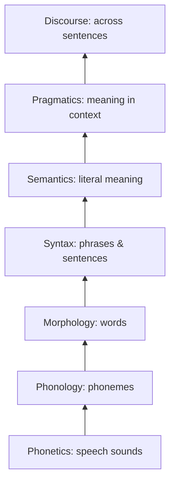

# 01 · What is SNLP? History & the Information Layers of Language

> **Course:** Introduction to Speech & Natural Language Processing (1-credit elective) · Dr. Krishnendu Ghosh · IIIT Dharwad
> **Lectures:** Lecture 0 (course intro) and Lecture 1 (Information Layers of SNLP), Sep 2026
> **Sources:** `Lecture 0.pdf`, `Lecture 1.pdf`. No transcript for these two; the 30 Sep transcript (Note 02) refers back to them.
> **Notebook:** [`code/lexical_processing_hands_on.ipynb`](code/lexical_processing_hands_on.ipynb), Parts H–I (syntax tree, word senses)

---

## 📌 Table of Contents

1. [Big Picture](#1-big-picture)
2. [What is SNLP?](#2-what-is-snlp-)
3. [Speech Processing vs NLP](#3-speech-processing-vs-nlp-)
4. [History: Four Eras](#4-history-four-eras-)
5. [The Stages (Layers) of NLP](#5-the-stages-layers-of-nlp-)
6. [Layer 1: Phonetics](#6-layer-1-phonetics-)
7. [Layer 2: Phonology](#7-layer-2-phonology-)
8. [Layer 3: Morphology](#8-layer-3-morphology-)
9. [Layer 4: Syntax](#9-layer-4-syntax-)
10. [Layer 5: Semantics](#10-layer-5-semantics-)
11. [Layer 6: Pragmatics](#11-layer-6-pragmatics-)
12. [Layer 7: Discourse](#12-layer-7-discourse-)
13. [All Layers in One Example: a Voice Assistant](#13-all-layers-in-one-example-a-voice-assistant-)
14. [Common Confusions](#14--common-confusions)
15. [Quiz-Style Questions](#15--quiz-style-questions)
16. [Cheat Sheet](#16--cheat-sheet)
17. [Go Deeper](#17--go-deeper-curated-links)

---

## 1. Big Picture

**About the course (Lecture 0):** a **high-level** introduction to speech and NLP that focuses on **applications, pipelines and intuition**: how machines process speech and text, and how systems like **voice assistants** and **chatbots** work. Big picture plus small hands-on toy models; **not deep theory**.

**Objectives:** know what SNLP can do · learn the **speech → text → meaning** pipeline · build intuition · know the key components before building models · explore common tasks · build small toy models.


### Syllabus at a glance

| Unit | Topic | Hours | Notes |
|---|---|---|---|
| 1 | What is SNLP: speech vs NLP, real-world systems, end-to-end pipelines, applications | 2 | This note |
| 2 | Basic speech processing: speech production, spoken language processing, acquisition, feature extraction, neural speech representations | 4 | |
| 3 | Basic text processing: tokenization, stopwords, stemming vs lemmatization, n-grams, BoW, TF-IDF, Word2Vec, GloVe | 3 | [Note 02](02-Lexical-Processing-Part-1.md) starts this |
| 4 | Speech applications: ASR pipeline, Whisper / wav2vec, TTS pipeline | 2 | |
| 6 | NLP applications: text classification, sentiment, POS, NER, dependency parsing, semantic ambiguity, LLMs, challenges | 3 | |

*(The slides jump from Unit 4 to Unit 6; there is no Unit 5 listed.)*

### Assessment & key dates

| Component | Weight | Date |
|---|---|---|
| Theoretical assignments (2) | 24% | A1: **14 Oct** · A2: **9 Dec** |
| **Quizzes (12)** | **36%** | One per class, open about a week (e.g. the 30 Sep quiz was due before the next Tuesday) |
| Project formulation | 20% | Presentation: **23 Dec** |
| Attendance | 20% / 10% | Semester ends 27 Dec |

> 💡 12 quizzes make up 36% of the grade, so **don't miss weekly quizzes**. The cheat sheets at the end of each note are built for quiz revision.

**Electives rule (from the 30 Sep class):** the "Introduction to …" courses are all **1-credit**; you can **credit two** and audit the rest. Your specialisation vertical later can be different.

**Books:** Jurafsky & Martin, *Speech and Language Processing* (3rd ed. draft, free online) · Benesty, Sondhi & Huang, *Springer Handbook of Speech Processing* · Bird, Klein & Loper, *NLTK Book* · Huang, Acero & Hon, *Spoken Language Processing* · Rabiner & Juang, *Fundamentals of Speech Recognition*.

---

## 2. What is SNLP? 🟢

> **Speech & Natural Language Processing (SNLP)** is a field of AI that allows machines to **read**, **derive meaning from text**, and **produce documents**.

- It works **in the background** of many services: chatbots, virtual assistants, social-media tracking.
- Language technologies have major penetration into the information and communication industry.

**Everyday SNLP you use:** Google Search autocomplete · Gmail Smart Reply and spam filtering · Google Translate · Alexa/Siri/Google Assistant · YouTube auto-captions · ChatGPT · Grammarly · UPI voice payments in Hindi · Bhashini (Govt. of India's Indian-language translation platform).

---

## 3. Speech Processing vs NLP 🟢

| | Speech processing | Natural language processing |
|---|---|---|
| Input | **Audio signal** (waveform) | **Text** (characters) |
| Core problems | Recognise (ASR), synthesise (TTS), identify speaker, detect emotion | Understand, classify, translate, summarise, generate |
| Low-level unit | Samples → frames → **phonemes** | Characters → **tokens/words** |
| Extra difficulty | Noise, accents, speaking rate, no spaces between words in audio | Ambiguity, context, sarcasm |
| Example systems | Whisper, wav2vec 2.0, Google TTS | BERT, GPT, Google Translate |

They meet in **spoken dialogue systems**: speech → (ASR) → text → (NLU) → meaning → (dialogue manager) → response text → (TTS) → speech.

---

## 4. History: Four Eras 🟢

| Period | Era | How it worked | Coverage |
|---|---|---|---|
| 1950–1960 | **Prehistory** | Scientific knowledge of AI and linguistics extremely limited (e.g. the 1954 Georgetown–IBM Russian→English demo; Turing test 1950) | — |
| 1960–1990 | **Symbolic** | **Rules handwritten by experts** (ELIZA 1966, grammars, expert systems) | Very limited |
| 1990–2010 | **Statistical** | ML on data **annotated by experts** (HMMs for speech, n-gram LMs, statistical MT) | Good |
| 2010–present | **Neural** | ML on **non-annotated** (raw) data: word embeddings (2013), seq2seq (2014), Transformers (2017), BERT/GPT (2018–), LLMs | Excellent |

> 🔗 This mirrors the MLP course's story: rules → learned from labelled data → **self-supervised** learning on raw text (MLP Note 01 §9.5).

---

## 5. The Stages (Layers) of NLP 🟢

Language carries information at **several layers**. Each builds on the one below.

| Layer | Unit studied | Question it answers |
|---|---|---|
| **Phonetics** | Speech sounds | How are sounds produced and perceived? |
| **Phonology** | Phonemes | Which sound patterns does *this* language use? |
| **Morphology** | Words (morphemes) | How are words built from meaningful pieces? |
| **Syntax** | Phrases & sentences | How are words arranged into sentences? |
| **Semantics** | Literal meaning of phrases & sentences | What does it mean? |
| **Pragmatics** | Meaning in context | What does the speaker *intend*? |
| **Discourse** | Multi-sentence text | How do sentences connect? |



**Two directions (slide diagram):**

- **Analyse** (understand) = go **up**: sounds → … → intended meaning (ASR + NLU).
- **Generate** (produce) = go **down**: intent → … → sounds (NLG + TTS).

The slide also draws this as an **onion**: each outer ring contains everything inside it.

> 💡 **Ambiguity exists at every layer.** That's why NLP is hard. Each section below has an example.

---

## 6. Layer 1: Phonetics 🟢

> **Phonetics** studies the **production, transmission and perception of sounds**, without prior knowledge of the language being spoken.

Three branches: **articulatory** (how the mouth and tongue make sounds), **acoustic** (the physics of sound waves), **auditory** (how the ear and brain perceive them).

**Why it matters:**

- The foundation of **ASR** (speech → text) and **TTS** (text → speech).
- Maps **audio signals → phonemes → text**.
- Enables correct pronunciation modelling in **multilingual** systems.

**Example: IPA transcription.** The International Phonetic Alphabet gives one symbol per sound, independent of spelling:

| Word | IPA | Meaning |
|---|---|---|
| cat | /kæt/ | Animal |
| bat | /bæt/ | Animal |

English spelling is unreliable ("though", "through", "tough" all end in "-ough" but sound different); IPA isn't. Speech systems work on phones, not letters.

**Ambiguity:** "recognise speech" vs "wreck a nice beach" are acoustically almost identical.

---

## 7. Layer 2: Phonology 🟢

> **Phonology** studies the **rules that organise patterns of sounds** in a particular human language.

Phonetics is universal (all possible sounds); phonology is **language-specific** (which sound differences *matter* in this language).

**Slide examples:**

- **right / light**, **arrive / alive**: /r/ vs /l/ distinguishes words in English (they are separate **phonemes**). In Japanese they're not distinct, which is why native Japanese speakers find this pair hard.
- **Bengaluru**: the pronunciation and spelling of names vary by language and region (Bangalore → Bengaluru); phonological rules differ across Kannada and English.

**Why it matters:**

- Determines **pronunciation rules**. Example: the English plural suffix sounds different depending on the previous sound:

| Word | Plural pronounced | Rule |
|---|---|---|
| cats | /s/ | after voiceless sounds (/t/, /k/, /p/) |
| dogs | /z/ | after voiced sounds (/g/, /d/, vowels) |
| horses | /ɪz/ | after hissing sounds (/s/, /z/, /ʃ/) |

- Important for **speech synthesis** (TTS must say "dogz", not "dogs") and **accent modelling**.
- Helps build **phoneme-level models for low-resource languages** (many Indian languages have little text data).

> 🇮🇳 **Indian-language example:** Hindi distinguishes aspirated vs unaspirated stops: क (ka) vs ख (kha), प (pa) vs फ (pha). These are different phonemes in Hindi but not in English.

---

## 8. Layer 3: Morphology 🟢

> **Morphology** studies how **words are composed of morphemes**, the **smallest meaningful units** of language.

A word = **one root/stem** + **zero or more affixes** (prefixes, suffixes).

**Examples:** draw · draw+s · draw+ing+s · un+draw+able · **unhappiness** = un- (prefix) + happy (root) + -ness (suffix).

**Why it matters:**

- Used in **stemming, lemmatization, machine translation, search, speech synthesis**.
- **Reduces vocabulary size** by grouping inflected forms (run, runs, running → RUN).
- **Critical for morphologically rich languages.** Kannada, Tamil, Malayalam, Turkish and Finnish glue many morphemes into one word. Example (Kannada): ಮನೆಗಳಲ್ಲಿ (*manegaḷalli*) = mane (house) + gaḷu (plural) + alli (in) = "in the houses". One word, three morphemes.

**Ambiguity:** "unlockable" = un+(lockable), i.e. *cannot be locked*, or (unlock)+able, i.e. *can be unlocked*?

➡️ Morphology is the starting point of **lexical processing**, covered in detail in [Note 02](02-Lexical-Processing-Part-1.md).

---

## 9. Layer 4: Syntax 🟡

> **Syntax** studies the **rules and constraints** that govern how words are **organised into sentences**.

- Closely connected to **formal language theory** and **rewriting grammars** (context-free grammars, as in compilers).
- **Difference from formal languages:** NLP systems must be **robust** to input that **doesn't follow grammar rules** (tweets, chat, speech disfluencies). A compiler rejects bad syntax; a chatbot can't.

### Two ways to represent sentence structure

**(a) Phrase structure (constituency) tree.** Example: *Alice/N eats/V strawberries/N with/P chocolate/N*
```
                S
        ┌───────┴────────┐
        NP               VP
        │        ┌───────┴────────┐
        N        V                NP
        │        │          ┌─────┴─────┐
      Alice    eats         NP          PP
                            │       ┌───┴───┐
                            N       P       NP
                            │       │       │
                      strawberries with     N
                                            │
                                        chocolate
```
S = sentence, NP = noun phrase, VP = verb phrase, PP = prepositional phrase. Words group into nested **constituents**.

> 🔴 **Ambiguity!** The notebook's grammar finds **2 parses**: "strawberries-with-chocolate" (PP attached to the noun, as on the slide) vs "eats … with chocolate" (PP attached to the verb, like "eats with a fork"). This **PP-attachment ambiguity** is a classic problem. Compare "I saw the man with the telescope."

**(b) Dependency tree.** Example: *Rolls-Royce said it expects its U.S. sales to remain steady.* Each word points to its **head** with a labelled relation:
```
said (ROOT)
├── nsubj ──▶ Rolls-Royce
└── ccomp ──▶ expects
              ├── nsubj ──▶ it
              ├── obj ────▶ sales
              │             ├── nmod:poss ──▶ its
              │             └── compound ───▶ U.S.
              └── xcomp ──▶ remain
                            ├── mark ──▶ to
                            └── xcomp ─▶ steady
```
(Universal Dependencies v2 labels; the slide's figure may use the older Stanford label set.)
Dependency trees show **who did what to whom** directly (subject, object, modifiers), and are popular because they work similarly across languages ([Universal Dependencies](https://universaldependencies.org/) covers 100+ languages including Hindi, Tamil, Telugu, Marathi).

| Constituency | Dependency |
|---|---|
| Groups words into nested phrases | Links words directly (head → dependent) |
| Good for grammar theory, compilers | Good for information extraction, free-word-order languages (Indian languages!) |

**Why syntax matters:** parsing, machine translation (word order: English is SVO, Hindi/Kannada are **SOV**: "Ram ate an apple" vs "राम ने सेब खाया"), question answering. It helps models find **subject, object, verb**.

---

## 10. Layer 5: Semantics 🟡

> **Semantics** studies the **meaning** of linguistic expressions: words, phrases, sentences.

Common representations of meaning:

| Representation | Example for "Alice eats strawberries" |
|---|---|
| **Logical** (first-order logic) | $\exists e.\ \text{Eating}(e) \land \text{Eater}(e, \text{Alice}) \land \text{Eaten}(e, \text{strawberries})$ |
| **Predicate–argument structure** | eat(agent = Alice, theme = strawberries) |
| **Graph** (e.g. AMR, knowledge graphs) | (Alice) —eats→ (strawberries) |

**Why it matters:**

- Core for **word embeddings** (Word2Vec, GloVe: Unit 3), **translation**, **chatbots**, **question answering**.
- Resolves **word sense disambiguation (WSD)**. Example: **"bank"** → *financial institution* or *river bank* (WordNet lists **18** senses; notebook Part I).

From the 30 Sep class: "blood **bank**" (repository), "my money is in the **bank**" (account/institution), "the **bank** declared a strike" (its employees/union), "**river bank**" (geography). Choosing the sense needs context from the semantic level, not the lexical level.

---

## 11. Layer 6: Pragmatics 🟡

> **Pragmatics** studies how expressions are **used for specific communicative goals**. Unlike semantics, it asks **what an expression means in a given context**.

Key concept: the **speech act**, an **action performed through language** (requesting, promising, warning, apologising…).

**Example:** *"Can you pass the salt?"* / *"Can you open the window?"*

- **Semantics** (literal): a yes/no question about your **ability**.
- **Pragmatics** (intended): a **polite request**. Answering "Yes, I can" without passing it is a pragmatic failure.

**Why it matters:**

- Chatbots and dialogue systems must infer **intent, tone and implied meaning**.
- Used in **sarcasm** and **emotion detection**: "Great, my flight is delayed again 🙄" is literally positive but pragmatically negative (cf. the sentiment examples in MLP Note 01 §5).
- Intent detection in voice assistants: "It's cold in here" → *turn on the heater*.

---

## 12. Layer 7: Discourse 🟡

> **Discourse analysis** studies written and spoken language in relation to its **social context**. A discourse is a piece of text with **multiple sub-topics** and **coherence relations** between them, such as **explanation**, **elaboration** and **contrast**.

**Example (coreference):** *"John bought a car. He loves it."* → **"He" = John**, **"it" = the car**.

| Coherence relation | Example |
|---|---|
| Explanation (cause) | "I stayed home. **I was sick.**" |
| Elaboration | "The laptop is great. **The battery lasts 12 hours.**" |
| Contrast | "The camera is excellent. **However, the battery is weak.**" |

**Why it matters:** text **summarisation**, **coreference resolution**, document understanding, and capturing cause–effect / elaboration / contrast. Mixed-sentiment reviews need the *contrast* relation to get aspect-level sentiment right.

---

## 13. All Layers in One Example: a Voice Assistant 🟡

User says: *"Hey Google, can you book me a cab to the airport? My flight's at 6."*

| Layer | What the system does |
|---|---|
| Phonetics | Converts the audio waveform into acoustic features → phone probabilities |
| Phonology | Applies English sound patterns; handles the Indian-English accent |
| Morphology | "flight's" = flight + 's (is); "book" is a verb here (not a noun) |
| Syntax | Parses: [you] [book] [me] [a cab] [to the airport] |
| Semantics | book(agent=assistant, beneficiary=user, theme=cab, destination=airport) |
| Pragmatics | "Can you…" = a **request**, not an ability question |
| Discourse | "6" refers to the flight time → infer pickup ≈ 3:30–4:00 am; "My flight" links to "airport" |

Modern end-to-end neural models (Whisper + an LLM) learn many of these layers implicitly, but the layers are still how we **diagnose errors** ("it misheard" = phonetic; "it misunderstood" = semantic/pragmatic).

---

## 14. ⚠️ Common Confusions

| Confusion | Clarification |
|---|---|
| Phonetics = phonology | Phonetics: physical sounds (universal). Phonology: which sound distinctions matter in a language |
| Semantics = pragmatics | Semantics: literal meaning. Pragmatics: meaning in context / intent |
| Syntax errors make text unusable | NLP must be robust to ungrammatical input |
| Morphology = stemming | Stemming is one (crude) application of morphology |
| Discourse = long text | It's about **relations** (coreference, coherence) across sentences |
| NLP = only English | Morphologically rich and low-resource languages (most Indian languages) are a major focus |

---

## 15. 📝 Quiz-Style Questions

<details>
<summary><b>Q1.</b> Name the NLP layer involved: (a) "lead" (metal) vs "lead" (guide) pronounced differently; (b) splitting "unbelievable"; (c) "He" refers to "John"; (d) "Can you close the door?" as a request.</summary>

(a) Phonology/phonetics (pronunciation) plus semantics (sense); (b) morphology; (c) discourse (coreference); (d) pragmatics (speech act).
</details>

<details>
<summary><b>Q2.</b> Order the layers from sound to context.</summary>

Phonetics → phonology → morphology → syntax → semantics → pragmatics → discourse.
</details>

<details>
<summary><b>Q3.</b> Why must NLP syntax be more robust than a compiler's?</summary>

Real language (chat, speech, tweets) is often ungrammatical; the system must still extract meaning instead of rejecting the input.
</details>

<details>
<summary><b>Q4.</b> Match the era to the method: symbolic, statistical, neural.</summary>

Symbolic (1960–90): handwritten expert rules. Statistical (1990–2010): ML on expert-annotated data. Neural (2010–): ML on large non-annotated data.
</details>

<details>
<summary><b>Q5.</b> Why is "cats" /s/ but "dogs" /z/?</summary>

A phonological rule: the plural suffix is voiced (/z/) after voiced sounds (/g/) and voiceless (/s/) after voiceless sounds (/t/). After sibilants (horses) it's /ɪz/.
</details>

<details>
<summary><b>Q6.</b> Give two parses of "I saw the man with the telescope".</summary>

(1) I used the telescope to see the man (PP attaches to the verb); (2) the man had a telescope (PP attaches to the noun).
</details>

<details>
<summary><b>Q7.</b> Why is morphology especially important for Indian languages?</summary>

They are morphologically rich and agglutinative (many morphemes per word). Without morphological analysis the vocabulary explodes and most word forms are rare or unseen.
</details>

---

## 16. 🧾 Cheat Sheet

- **SNLP** = AI that lets machines read, understand and produce language (speech + text).
- Pipeline: **speech →(ASR) text →(NLU) meaning →(NLG/TTS) speech**.
- Eras: prehistory (50s) → **symbolic** rules (60–90) → **statistical** ML (90–2010) → **neural** (2010–).
- Layers: **Phonetics** (sounds) → **Phonology** (sound rules, e.g. plural /s/ /z/ /ɪz/) → **Morphology** (morphemes: un+happy+ness) → **Syntax** (phrase-structure & dependency trees) → **Semantics** (meaning; "bank" senses) → **Pragmatics** (intent; "Can you pass the salt?") → **Discourse** (coreference "He"→John; coherence relations).
- Analyse = upward; generate = downward.
- **Ambiguity at every layer** → that's why NLP is hard.

---

## 17. 📚 Go Deeper: Curated Links

| Topic | Why | Link |
|---|---|---|
| Course textbook (free) | The main text; all chapters free | [Jurafsky & Martin — Speech and Language Processing (3rd ed. draft)](https://web.stanford.edu/~jurafsky/slp3/) |
| NLTK book (reference book) | Hands-on Python NLP, free | [Natural Language Processing with Python](https://www.nltk.org/book/) |
| IPA chart | All phonetic symbols, with audio | [International Phonetic Association — IPA chart](https://www.internationalphoneticassociation.org/content/ipa-chart) |
| Dependency trees across languages | Includes Indian languages | [Universal Dependencies](https://universaldependencies.org/) |
| Stanford NLP course | Lecture 1: intro & word vectors (bridge to Units 3 and 6) | [CS224N Lecture 1](https://www.youtube.com/watch?v=rmVRLeJRkl4) · [course site](https://web.stanford.edu/class/cs224n/) |
| Indian-language NLP | Tools and models for Indic languages | [AI4Bharat (IIT Madras)](https://ai4bharat.iitm.ac.in/) · [Indic NLP Library](https://github.com/anoopkunchukuttan/indic_nlp_library) |
| How LLMs see text | Tokens instead of words (bridge to Gen AI) | [Hugging Face — Tokenizers](https://huggingface.co/learn/nlp-course/chapter6/1) |

---
[SNLP Index](README.md) · ➡️ [02 · Lexical Processing, Part 1](02-Lexical-Processing-Part-1.md)
