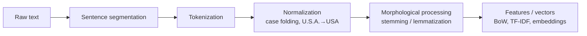

# 02 · Lexical Processing in NLP, Part 1

> **Course:** Introduction to Speech & Natural Language Processing · Dr. Krishnendu Ghosh · IIIT Dharwad
> **Lecture:** Lecture 2, 30 Sep 2026 (46 + 15 min). Sentence segmentation onwards continues next class.
> **Sources:** `Lecture 2.pdf` + both 30 Sep transcript parts
> **Notebook:** [`code/lexical_processing_hands_on.ipynb`](code/lexical_processing_hands_on.ipynb), Parts A–G. The professor's own Colab code: [Lecture 2 Colab](https://colab.research.google.com/drive/1I5S7q_jiuAACft0xSXBos0qJwvWnYGKn?usp=sharing)
> **Assessment:** the quiz for this lecture was due before the next Tuesday. Theoretical Assignment 1 is due **14 Oct** and is (per class) based on this lecture.

---

## 📌 Table of Contents

1. [Big Picture](#1-big-picture)
2. [Morphological Parsing](#2-morphological-parsing-)
3. [The Vocabulary of Lexical Processing (11 Terms)](#3-the-vocabulary-of-lexical-processing-11-terms-)
4. [Four Perspectives: Grouping the Terms](#4-four-perspectives-grouping-the-terms-)
5. [Tokens: The Unit Depends on the Task](#5-tokens-the-unit-depends-on-the-task-)
6. [Types, Tokens & Vocabulary Richness](#6-types-tokens--vocabulary-richness-)
7. [Stemming vs Lemmatization](#7-stemming-vs-lemmatization-)
8. [The Porter Stemmer](#8-the-porter-stemmer-)
9. [Sentence Segmentation](#9-sentence-segmentation-)
10. [Word Tokenization & Its Issues](#10-word-tokenization--its-issues-)
11. [Text Normalization & Case Folding](#11-text-normalization--case-folding-)
12. [Class Q&A: Code-Mixed Social Media Text](#12-class-qa-code-mixed-social-media-text-)
13. [Professor Emphasised](#13--professor-emphasised)
14. [Common Confusions](#14--common-confusions)
15. [Quiz-Style Questions](#15--quiz-style-questions)
16. [Cheat Sheet](#16--cheat-sheet)
17. [Go Deeper](#17--go-deeper-curated-links)

---

## 1. Big Picture

> **Lexical** = to do with **words**. Lexical processing extracts all the information that is present **inside a word**, without yet looking at the sentence around it (that's syntax and semantics).

It's the **first step of every NLP pipeline**: before a model can learn anything, raw text must be split into units (tokens) and normalised.



> 🔗 You already used this in the MLP demo (Note 02): `word_tokenize` + POS tags → word/noun/verb counts. And LLMs start with a **tokenizer** (Gen AI Note 01).

---

## 2. Morphological Parsing 🟢

| Term | Definition |
|---|---|
| **Morpheme** | The **smallest meaningful unit** that makes up words |
| **Stem** | The **core meaning-bearing** morpheme |
| **Affix** | A morpheme that **adheres to the stem**, often with a **grammatical function** |
| **Morphological parser** | Splits a word into its morphemes: **cats → cat + s** |

**Professor's explanation:** in *unhappy*, both **un** and **happy** carry meaning (negation; a pleasant state). Splitting further ("u", "n", "hap") destroys the meaning, so the morphemes are un + happy.

**Morpheme is the umbrella term:**
```
                Morpheme (smallest meaningful unit)
                 ┌──────────┴──────────┐
               Stem                  Affix
       (core meaning, can          (no meaning alone; modifies
        often stand alone)          the stem's meaning/function)
          e.g. happy               ┌─────┬──────┬──────┬──────────┐
                                 prefix suffix infix  circumfix
                                  un-   -ness  -bloody- ge-…-t
```

**Grammatical function of affixes:** *-ness* turns an adjective into a noun (happy → happiness); *-ing* makes a continuous verb form; *un-* negates.

Notebook Part C has a toy parser: `unhappiness → un- + happy + -ness`, `drawings → draw + -ing + -s`, `unavailable → un- + available`.

---

## 3. The Vocabulary of Lexical Processing (11 Terms) 🟢

| Term | Definition | Example |
|---|---|---|
| **Lexeme** | The abstract **base unit of meaning** representing **all inflected forms** of a word, like a dictionary entry or idea | run, runs, ran, running → lexeme **RUN** |
| **Word** | A **concrete instance** of a lexeme appearing in text or speech | In "He **runs** fast", *runs* is one form of RUN |
| **Lemma** | The **canonical/dictionary form** used to represent a lexeme **computationally** | lemma(running) = lemma(ran) = **run**; lemma(better) = **good** |
| **Type** | A **unique** word form (distinct spelling) in a text | "The cat chased the cat" → **3 types** (the, cat, chased) |
| **Token** | **Each individual occurrence** in a text | Same sentence → **5 tokens** |
| **Term** | A word or phrase denoting a **domain-specific concept** | Medical: "heart attack", "myocardial infarction" |
| **Morpheme** | Smallest meaningful unit; can't be divided further without losing meaning | unhappiness → un- + happy + -ness |
| **Stem** | Core part to which affixes attach; **not always a valid word** | computing, computer, computed → **comput** |
| **Affix** | Morpheme attached to a stem to change meaning or function | un- (prefix), -ness (suffix) |
| **Lemmatization** | Mapping inflected forms → lemma using **vocabulary + morphology rules** | ran → run |
| **Stemming** | **Rule-based truncation** to a stem | computing → comput |

### Lexeme vs word vs lemma (the most confusing trio)
**Professor's analogy:** you're watching someone running and want to describe it. In your mind there's the **concept** RUN: that's the **lexeme**. When you write *"He is running"*, the form that appears on paper is the **word**. A computer needs a **string** to stand for the concept: that's the **lemma** "run".

> 🇮🇳 **Sanskrit analogy (professor):** remember **शब्दरूप (śabda-rūpa)** and **धातुरूप (dhātu-rūpa)** from school? A lexeme is like the root (धातु/शब्द) together with its whole table of forms. The dictionary lists only **run**, not run/runs/ran/running.

**Class Q:** *Is every word a lexeme?* **Answer:** a lexeme is the **conceptual** form; a word is its **realisation** in text. While the idea is in your mind it's a lexeme; once you use it in a sentence it becomes a word.

### Lexeme vs morpheme: opposite directions

| Morpheme view | Lexeme view |
|---|---|
| Start with a **whole word**, **break it down** into pieces | Start with a **base form**, ask **what forms can be built** from it |
| happiness → happy + ness | RUN → run, runs, ran, running |
| Segmenting | Grouping |

They can coincide: in *ran*, the only morpheme is "ran" itself, while the lexeme is RUN.

### Types vs tokens: the slide's examples
**"Data is the new oil. Data drives decisions."**

- **Tokens = 8**: Data, is, the, new, oil., Data, drives, decisions.
- **Types = 7**: Data appears twice but is counted once.

> ⚠️ **Counts depend on preprocessing** (notebook Part A):
>
> - "The cat chased the cat" has **3 types only after lower-casing**; case-sensitive, "The" ≠ "the" gives **4**.
> - With plain space splitting, "oil." keeps its period, so "oil" and "oil." would be different types.
>
> Always state your tokenization and normalization rules when reporting counts. (Typical quiz trap!)

### Term vs lexeme

- **Lexeme** = a **generic** concept that means the same everywhere ("boy", "dog").
- **Term** = **domain-specific**: "force" in physics, "consideration" in contract law, "heart attack" in medicine.
- *"All terms are words (or multi-word phrases), but not all words are terms."*
- A term can be a single token or **several tokens together** ("myocardial infarction", "machine learning").

**Class Q: is "domain" the same as language?** No. Domain = **application area** (legal, medical, physics, chemistry), not English vs Hindi.

---

## 4. Four Perspectives: Grouping the Terms 🟢

The professor stressed that these terms aren't redundant. **Each comes from a different perspective/application:**

| Group | Terms | Perspective | Typical use |
|---|---|---|---|
| **1. Lexeme – Lemma – Word** | Where does a word come from; what is its base? | **Grammatical / dictionary** | Lemmatization, search, MT |
| **2. Token – Type** | **Statistical / corpus-level** counting (not linguistic) | How rich is a vocabulary? | Corpus statistics, authorship, LM vocabularies |
| **3. Morpheme – Stem – Affix** | How is the word **built**? | **Morphological** (word-building) | Stemming, morphological parsing |
| **4. Term** | Which **domain concepts** are present? | **Domain-specific** | Summarisation, information extraction |

**Example of group 4 (from class):** summarising a 10-page **patient history** for a busy doctor. Whether the **medical terms** (symptoms, diagnoses) appear in the summary matters; which city or month the patient visited doesn't. Similarly for **legal** summarisation, the legal terms matter, not the addresses.

---

## 5. Tokens: The Unit Depends on the Task 🟡

> *"Token is the base unit you are processing at a particular point of time."* It can be anything, depending on application, data and task.

| Application | Token = | Why |
|---|---|---|
| Most text tasks | **Word** | Smallest meaningful unit we usually work with |
| Speech systems | **Syllable** | The unit you utter at once; you can't stop mid-syllable |
| ASR (speech → text) | **Voiced / unvoiced segments** of the signal | The signal must be chunked first |
| Extractive summarisation | **Sentence** | Sentences are selected **as-is**, never modified internally |
| Image processing | **Pixel / patch** | (Vision Transformers literally call 16×16 patches "tokens") |
| Handling unseen words, LLMs | **Sub-word** | See below |
| Morphological parsing | Word (input) → morphemes (output) | |

### Sub-word tokens (the professor's *unavailable* example) 🔴
If training data contains *un-* and *available* but never *unavailable*, then treating *unavailable* as one token gives an **out-of-vocabulary (OOV)** word with no meaning. Splitting it into **un + available** recovers the meaning from known pieces.

This is exactly what modern tokenizers do:

- **BPE** (Byte-Pair Encoding: GPT), **WordPiece** (BERT), **SentencePiece/Unigram** (T5, LLaMA, most Indic models).
- They learn sub-word pieces automatically from frequency. Notebook Part G implements BPE from scratch: `unavailable → [un, available]`, `undoable → [un, do, able]`.

**Class Q:** *Are word, sub-word and character tokens all in one library?* **A:** It depends on the application. In machine translation you may need word level **and** sub-word level (e.g. plural markers differ between languages). But **at any single step, you work with one kind of token.**

---

## 6. Types, Tokens & Vocabulary Richness 🟡

**Professor's motivation:** to judge **how rich** a language or an author's vocabulary is. A person who knows 100 words reuses them constantly (low type count); an author who knows 1,000 words has many more types for the same number of tokens.

**Type–Token Ratio (TTR)** = types / tokens (beyond slides). Notebook Part A, first 20,000 alphabetic tokens:

| Text | Types | TTR |
|---|---|---|
| Melville, *Moby Dick* | 4,357 | **0.218** (rich, varied vocabulary) |
| Austen, *Emma* | 2,544 | 0.127 |
| Carroll, *Alice in Wonderland* | 2,162 | 0.108 |
| *King James Bible* | 1,663 | **0.083** (repetitive, formulaic) |

⚠️ TTR always falls as the text gets longer, so compare equal-length samples.

**Heaps' law (beyond slides):** vocabulary size grows with corpus size as $V \approx kN^{\beta}$ with $\beta \approx 0.4$–$0.6$. **New words never stop appearing** (names, typos, new slang). That's why fixed word vocabularies fail and sub-word tokenization (§5) is needed.

**Morphologically rich languages** (in the professor's sense: one word with many derivations) have many more types per token than English. A Kannada or Tamil corpus has a much larger type count than an English one of the same size.

---

## 7. Stemming vs Lemmatization 🟢

Two ways to reduce word variants to a common base:

| | **Stemming** | **Lemmatization** |
|---|---|---|
| Output | **Stem** (may not be a real word) | **Lemma** (always a valid dictionary word) |
| Method | **Crude chopping** of the longest matching prefix/suffix by rules | **Dictionary lookup** + morphology (+ POS) |
| Speed | ⚡ **Very fast** | 🐢 Slower |
| Grammar-aware? | No ("not grammatical at all") | Yes |
| computing | comput | compute |
| ran | ran ❌ | run ✅ |
| better | better ❌ | good ✅ |
| studies | studi | study |
| Mistakes | Over-stemming (universal, university → univers); under-stemming (ran ≠ run) | Needs the correct **POS**: `lemmatize("ran")` without POS = "ran" |
| Use when | Search engines / IR, speed matters, large corpora | Chatbots, MT, QA, when correctness matters |

(Real outputs: NLTK Porter vs WordNet lemmatizer in notebook Part B.)

**Professor's key points:**

- Stemming: *"we don't think much; we see the longest possible suffix or prefix and take it out. Whatever remains is the stem."* Crude, but fast, and *"in most cases mistakes don't change application performance too much."*
- Lemmatization: *"not fast, needs a dictionary lookup"*. It checks that the resulting pieces are valid dictionary words.

> 📝 **Slide vs reality:** the slides list "Better, best → lemma: good". WordNet's lemmatizer returns **good** for *better* but **best** for *best* (it treats "best" as its own lemma). Dictionaries differ; linguistically, both are forms of GOOD.

### The stemming slide example (Treasure Island)
> *This was not the map we found in Billy Bones's chest, but an accurate copy, complete in all things-names and heights and soundings-with the single exception of the red crosses and the written notes.*

→ *thi wa not the map we found in billi bone s chest but an accur copi complet in all thing name and height and sound with the singl except of the red cross and the written note*

The rule "strip final *s*" turns *This → Thi* and *was → wa* (nonsense stems), yet for **search** it still works: "notes" and "note" now match.

---

## 8. The Porter Stemmer 🟢

The most famous stemming algorithm (Martin Porter, 1980).

- A **series of rewrite rules run in series**.
- A **cascade**: the output of each pass feeds the next pass.

**Sample rules (slide):**

| Rule | Example |
|---|---|
| ATIONAL → ATE | relational → relate |
| ING → ε **if the stem contains a vowel** | motoring → motor (but *sing* stays *sing*) |
| SSES → SS | grasses → grass |

The vowel condition stops "sing" from becoming "s". Rules always have **exceptions**, so mistakes happen.

> 📝 NLTK's Porter implementation gives *relational → relat*, because later passes in the cascade remove more (step 4 drops "-ate"). The slide shows the result of one rule in isolation. Notebook Part B.

---

## 9. Sentence Segmentation 🟡

*Started at the end of 30 Sep; continues next class.*

- **"!" and "?"** are mostly **unambiguous** sentence boundaries.
- **"." is very ambiguous**:
  - Abbreviations: *Dr.*, *Inc.*, *Mr.*, *Rs.*
  - Numbers: *.02%*, *4.3*
  - Initials, URLs, *p.m.*

**Common algorithm:**

1. **Tokenize first**, using rules or ML to classify each period as (a) part of a word or (b) a sentence boundary.
2. An **abbreviation dictionary** helps.
3. Then sentence segmentation can often be done with simple rules on top of the tokenization.

**Q (professor): what is the token for this task?** **Word.** You need to know *what word the period belongs to* ("Dr" is a known abbreviation; "4.3" is a number).

Notebook Part D on *"Dr. Rao joined IIIT Dharwad in 2020. The fee rose by .02% to Rs. 4.3 lakh! …"*:

- A naive split on ". " gives 10 broken "sentences" (*"Dr."*, *"Mr."* alone…).
- NLTK **Punkt** (learned abbreviations) fixes *Dr.*, *Mr.*, *Inc.*, *p.m.*, but still breaks after **"Rs."**. It has never seen Indian currency abbreviations, so domain-specific abbreviation lists matter.

---

## 10. Word Tokenization & Its Issues 🟡

### Space-based tokenization
The simplest approach for languages that put **spaces between words** (Latin, Greek, Cyrillic, Arabic, and Devanagari/Kannada/Tamil scripts): split on whitespace.

**Unix tools:** the `tr` command, from Ken Church's ***UNIX for Poets***. Given a text file, output word tokens and their frequencies:
```bash
tr -sc 'A-Za-z' '\n' < alice.txt | tr 'A-Z' 'a-z' | sort | uniq -c | sort -nr | head
#  ↑ every non-letter → newline   ↑ lowercase       ↑ count     ↑ most frequent first
```
Output on *Alice in Wonderland*: the (1642), and (872), to (729), a (632), it (595), she (553) … (notebook Part E: the Python equivalent).

> Not all languages use spaces: **Chinese, Japanese, Thai** need **word segmentation** models.

### Why you can't just strip punctuation

| Case | Examples |
|---|---|
| Internal punctuation | m.p.h., **Ph.D.**, **AT&T**, cap'n |
| Prices | **`$45.55`** |
| Dates | **01/02/06** (ambiguous too: 1 Feb or Jan 2?) |
| URLs | http://www.stanford.edu |
| Hashtags | **#nlproc** |
| Emails | someone@cs.colorado.edu |
| **Clitics**: words that can't stand alone | "are" in **we're**; French *je* in *j'ai*, *le* in *l'honneur* |
| **Multi-word expressions (MWEs)**: should these be one token? | **New York**, rock 'n' roll |

Notebook Part E compares three tokenizers on one sentence containing all of these:

| Input | `.split()` | NLTK `word_tokenize` | Custom regex |
|---|---|---|---|
| We're | We're | We, 're | We're |
| `$45.55` | `$45.55` | `$`, `45.55` | `$45.55` |
| URL | ✓ whole | http, :, //www… ❌ | ✓ whole |
| #nlproc | ✓ | #, nlproc | ✓ |
| email | ✓ | someone, @, … ❌ | ✓ |
| New York | 2 tokens | 2 tokens | 2 tokens (MWEs need a dictionary) |

**Lesson:** there is **no universally right tokenizer**. Choose (or write) one that fits your data (tweets ≠ legal text ≠ code).

---

## 11. Text Normalization & Case Folding 🟢

> **Every NLP task requires text normalization:** ① tokenizing (segmenting) words, ② **normalizing word formats**, ③ **segmenting sentences**.

### Word normalization
Put words/tokens into a **standard format**:

| Variants | Normalized |
|---|---|
| U.S.A. / USA | USA |
| uhhuh / uh-huh | uhhuh |
| Fed / fed | depends (see below) |
| am, is, be, are | **be** (lemmatization) |

### Case folding

- For **information retrieval (search):** reduce everything to **lower case**, since users mostly type lower case.
- Possible exception: upper case **mid-sentence** often marks names: *General Motors*, *Fed* vs *fed*, *SAIL* (Steel Authority of India) vs *sail*.
- For **sentiment analysis, machine translation and information extraction**, **case is helpful**: **US** (country) vs **us** (pronoun).

**Rule of thumb:** normalization **merges** things. Merge when the distinction is noise for your task; keep it when it carries meaning.

---

## 12. Class Q&A: Code-Mixed Social Media Text 🔴

**A student's question:** *Indian social media mixes Hindi/regional words written in English letters ("transliterated"). How would I detect anti-social content?*

**Professor's approach:**

1. **Tokenize**: Indian languages are space-delimited, so split on spaces and punctuation.
2. **Language identification** per token. In native scripts, **Unicode ranges** reveal the language (Devanagari vs Latin).
3. Run **morphological parsers for each candidate language** (e.g. Hindi and English). The parser for the correct language returns valid morphemes; the other returns nothing.
4. Combine the word-level information into sentence-level meaning, which is the **semantic level** (later classes).

**Extra (beyond class):** romanised Hindi ("kya kar rahe ho") has **no Unicode signal**, so language ID needs character n-gram models or a transliteration step back to Devanagari ([AI4Bharat IndicXlit](https://ai4bharat.iitm.ac.in/), [Indic NLP Library](https://github.com/anoopkunchukuttan/indic_nlp_library)).

**Another Q: same spelling, different meaning across languages?** In written text, spelling settles most cases ("hare" vs "here" sound alike but are spelled differently). True **polysemy** (bank) is resolved at the **semantic** level, not the lexical level.

---

## 13. 🎓 Professor Emphasised

1. Lexical = **word level**; we don't look beyond the word yet.
2. **Morpheme** is the umbrella term; it splits into **stem** (core meaning) and **affix** (no meaning alone, grammatical function).
3. **Lexeme** = concept/dictionary entry; **word** = actual appearance; **lemma** = computational canonical form.
4. **Type** = unique; **token** = every occurrence. Token = *"the base unit processed at a particular time"*: word, syllable, sentence, sub-word or pixel, depending on the task.
5. **Term** = domain-specific (medical, legal).
6. The terms come from **four different perspectives**.
7. **Stemming**: crude, fast, non-grammatical; the stem may be invalid. **Lemmatization**: dictionary-based, valid words, slower.
8. Explore the **Porter stemmer** rules yourself.
9. **"." is ambiguous** for sentence segmentation; tokenize first.
10. Run the **Colab codebase** (token/type counts, lemmas, stems).
11. Quiz uploaded; **Assignment 1 (14 Oct)** is based on this lecture.

---

## 14. ⚠️ Common Confusions

| Confusion | Clarification |
|---|---|
| Stem = lemma | Stem may be invalid (*comput*); lemma is a dictionary word (*compute*) |
| Morpheme = stem | Stem is one kind of morpheme; affixes are morphemes too |
| Lexeme = word | Lexeme is abstract (RUN); words are its concrete forms (runs, ran) |
| Types count is fixed for a sentence | Depends on case folding & punctuation handling |
| Token always = word | Token = whatever unit the task processes |
| Term = any word | Only domain-specific concept words/phrases |
| Lemmatizer knows the POS | You often must **pass the POS** (WordNet assumes noun) |
| Case folding is always good | Hurts sentiment/MT/NER (US vs us) |
| "." always ends a sentence | Abbreviations, decimals, URLs, initials… |

---

## 15. 📝 Quiz-Style Questions

<details>
<summary><b>Q1.</b> "To be or not to be, that is the question." How many tokens and types (lower-cased, punctuation removed)?</summary>

Tokens: to, be, or, not, to, be, that, is, the, question = **10**. Types: to, be, or, not, that, is, the, question = **8**.
</details>

<details>
<summary><b>Q2.</b> Identify the morphemes, stem and affix types in "reconsiderations".</summary>

re- (prefix) + consider (stem) + -ation (suffix) + -s (suffix, plural): 4 morphemes.
</details>

<details>
<summary><b>Q3.</b> Give the stem (Porter) and lemma of: studies, caring, geese, was.</summary>

Porter: studi, care, gees, wa. Lemmas: study, care, goose, be. (Stemming can't handle irregular forms like geese/was.)
</details>

<details>
<summary><b>Q4.</b> Lexeme or word? (a) the entry RUN in your mental dictionary; (b) "ran" in "She ran home".</summary>

(a) Lexeme; (b) word (a concrete form of the lexeme RUN).
</details>

<details>
<summary><b>Q5.</b> Why does ING → ε require a vowel in the stem?</summary>

To avoid wrongly stripping words like "sing" or "thing" to "s"/"th"; a valid English stem must contain a vowel.
</details>

<details>
<summary><b>Q6.</b> When should you NOT apply case folding? Give an example.</summary>

For NER, sentiment and MT: "US" (country) vs "us" (pronoun); "Apple" (company) vs "apple" (fruit).
</details>

<details>
<summary><b>Q7.</b> What is the token unit for extractive summarisation, and why?</summary>

The sentence: sentences are selected whole and never modified internally.
</details>

<details>
<summary><b>Q8.</b> Classify by perspective: type, lemma, affix, term.</summary>

Type: statistical/corpus. Lemma: grammatical/dictionary. Affix: morphological. Term: domain-specific.
</details>

<details>
<summary><b>Q9.</b> Why is "Dr. Sharma arrived at 4.30 p.m." hard to segment?</summary>

"Dr." (abbreviation), "4.30" (decimal/time) and "p.m." (abbreviation) all contain periods that aren't sentence boundaries; only the final "." is.
</details>

---

## 16. 🧾 Cheat Sheet

- **Lexical processing** = extracting information **within words**.
- **Morpheme** (smallest meaningful unit) = **stem** (core) + **affixes** (prefix un-, suffix -ness, infix fan-bloody-tastic, circumfix German ge-spiel-t).
- **Morphological parser:** cats → cat + s.
- **Lexeme** (concept RUN) · **word** (runs in text) · **lemma** (run, the dictionary form).
- **Token** (every occurrence) vs **type** (unique): "The cat chased the cat" = 5 tokens, 3 types (lower-cased).
- **Term** = domain-specific (heart attack).
- **Stemming** = crude, fast, possibly invalid stems (comput); **Porter** = cascade of rewrite rules (ATIONAL→ATE, ING→ε if vowel, SSES→SS).
- **Lemmatization** = dictionary + POS, valid lemma (ran→run, better→good).
- Sentence segmentation: "!"/"?" are easy, "." is ambiguous → tokenize first + abbreviation dictionary.
- Tokenization issues: Ph.D., `$45.55`, dates, URLs, #tags, emails, clitics (we're), MWEs (New York).
- Normalization: U.S.A.→USA; case folding helps IR but hurts NER/MT/sentiment.
- Sub-word tokens (BPE) handle unseen words: unavailable → un + available.

---

## 17. 📚 Go Deeper: Curated Links

| Topic | Why | Link |
|---|---|---|
| Textbook chapter for this lecture | "Words and Tokens": tokenization, normalization, morphology, BPE | [Jurafsky & Martin SLP3 — Ch. 2](https://web.stanford.edu/~jurafsky/slp3/2.pdf) |
| NLTK book (course reference) | Ch. 3: processing raw text, stemming, lemmatization, segmentation | [NLTK Book — Ch. 3](https://www.nltk.org/book/ch03.html) |
| Porter stemmer | The algorithm, by its author | [Martin Porter — The Porter Stemming Algorithm](https://tartarus.org/martin/PorterStemmer/) |
| Professor's code | Run this; the assignment builds on it | [Lecture 2 Colab notebook](https://colab.research.google.com/drive/1I5S7q_jiuAACft0xSXBos0qJwvWnYGKn?usp=sharing) |
| Sub-word tokenization | BPE explained step by step | [Hugging Face — BPE tokenization](https://huggingface.co/learn/nlp-course/chapter6/5) |
| How GPT tokenizes | Why LLMs struggle with spelling/arithmetic | [Karpathy — Let's build the GPT Tokenizer](https://www.youtube.com/watch?v=zduSFxRajkE) · [Tiktokenizer playground](https://tiktokenizer.vercel.app/) |
| Indian-language tokenization | Indic scripts, normalization, transliteration | [Indic NLP Library](https://github.com/anoopkunchukuttan/indic_nlp_library) · [AI4Bharat](https://ai4bharat.iitm.ac.in/) |
| Stanford NLP course | Word vectors (Unit 3 preview) | [CS224N Lecture 1](https://www.youtube.com/watch?v=rmVRLeJRkl4) |

---
⬅️ [01 · Information Layers](01-Information-Layers-of-SNLP.md) · [SNLP Index](README.md)
