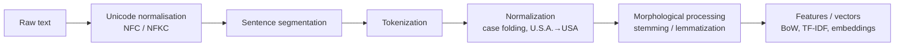
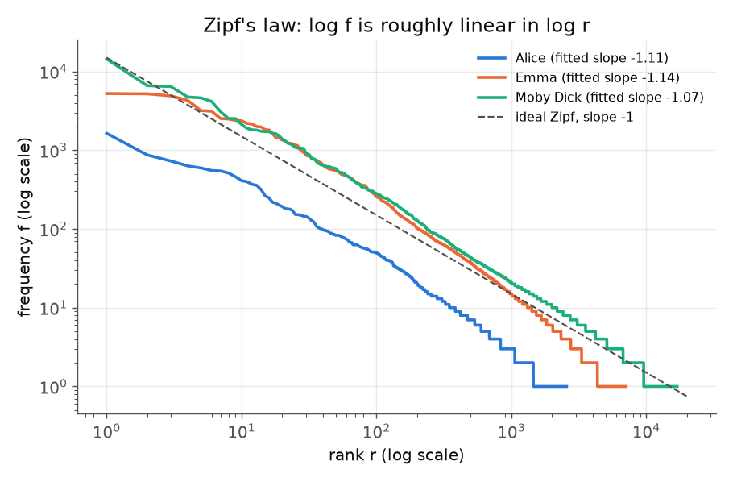
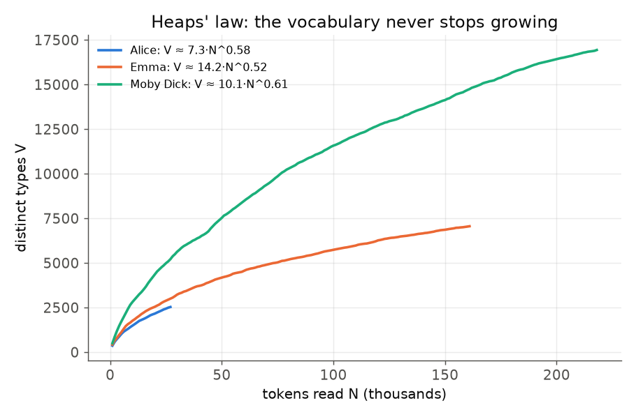
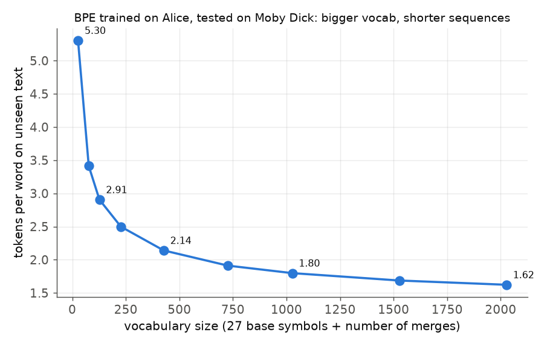
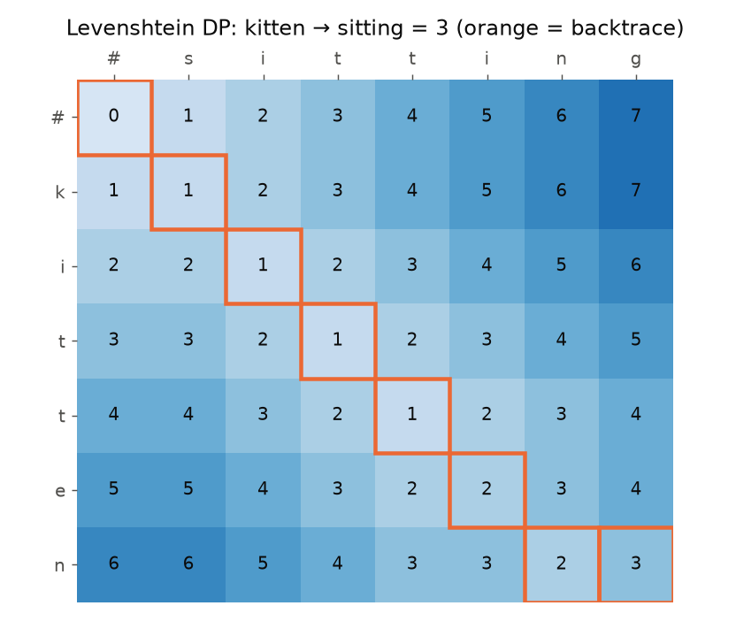

# 02 · Lexical Processing in NLP, Part 1

> **Course:** Introduction to Speech & Natural Language Processing · Dr. Krishnendu Ghosh · IIIT Dharwad
>
> **Lecture:** Lecture 2, 30 Sep 2026 (46 + 15 min). Sentence segmentation onwards continues next class.
>
> **Sources:** `Lecture 2.pdf` + both 30 Sep transcript parts
>
> **Notebooks:** [`code/lexical_processing_hands_on.ipynb`](code/lexical_processing_hands_on.ipynb), Parts A–G (class-level demos) · [`code/02_lexical_deep_dive.ipynb`](code/02_lexical_deep_dive.ipynb), Parts A–J (every number in the deep-dive sections, worked examples and practice solutions of this note). Figures: [`code/figures_02.py`](code/figures_02.py). The professor's own Colab code: [Lecture 2 Colab](https://colab.research.google.com/drive/1I5S7q_jiuAACft0xSXBos0qJwvWnYGKn?usp=sharing)
>
> **Assessment:** the quiz for this lecture was due before the next Tuesday. Theoretical Assignment 1 is due **14 Oct** and is (per class) based on this lecture.
>
> **Difficulty tags:** 🟢 core/syllabus · 🟡 needs practice · 🔴 beyond the slides (deep dive or bridge to later lectures)

---

## 📌 Table of Contents

1. [Big Picture](#1-big-picture)
2. [Morphological Parsing](#2-morphological-parsing-)
3. [The Vocabulary of Lexical Processing (11 Terms)](#3-the-vocabulary-of-lexical-processing-11-terms-)
4. [Four Perspectives: Grouping the Terms](#4-four-perspectives-grouping-the-terms-)
5. [Tokens: The Unit Depends on the Task](#5-tokens-the-unit-depends-on-the-task-)
6. [Types, Tokens & Vocabulary Richness](#6-types-tokens--vocabulary-richness-)
7. [Zipf's Law & Heaps' Law](#7-zipfs-law--heaps-law-)
8. [Stemming vs Lemmatization](#8-stemming-vs-lemmatization-)
9. [The Porter Stemmer](#9-the-porter-stemmer-)
10. [Sentence Segmentation](#10-sentence-segmentation-)
11. [Word Tokenization & Its Issues](#11-word-tokenization--its-issues-)
12. [Sub-word Tokenization: BPE, WordPiece, Unigram](#12-sub-word-tokenization-bpe-wordpiece-unigram-)
13. [Text Normalization, Case Folding, Unicode & Stop Words](#13-text-normalization-case-folding-unicode--stop-words-)
14. [Bridge: Edit Distance (Levenshtein)](#14-bridge-edit-distance-levenshtein-)
15. [Real-World Case Studies](#15-real-world-case-studies-)
16. [Class Q&A: Code-Mixed Social Media Text](#16-class-qa-code-mixed-social-media-text-)
17. [Professor Emphasised](#17--professor-emphasised)
18. [Common Confusions](#18--common-confusions)
19. [Quiz-Style Questions](#19--quiz-style-questions)
20. [Practice Problems](#20--practice-problems)
21. [Cheat Sheet](#21--cheat-sheet)
22. [Go Deeper](#22--go-deeper-curated-links)

---

## 1. Big Picture

> **Lexical** = to do with **words**. Lexical processing extracts all the information that is present **inside a word**, without yet looking at the sentence around it (that's syntax and semantics).

It's the **first step of every NLP pipeline**: before a model can learn anything, raw text must be split into units (tokens) and normalised.



> 🔗 You already used this in the MLP demo (Note 02): `word_tokenize` + POS tags → word/noun/verb counts. And LLMs start with a **tokenizer** (Gen AI Note 01).

**Why the order matters.** Each stage makes a decision that later stages cannot undo. If Unicode normalisation is skipped, two visually identical words are different strings and every later count is wrong (§13). If sentence segmentation splits after "Dr.", the tokenizer receives a broken sentence (§10). If a stemmer conflates *universe* and *university* (§8), no downstream classifier can tell them apart again. A useful mental model: **every lexical step is a function that merges strings into equivalence classes**. The design question is always *which differences are noise for this task and which carry meaning?*

| Stage | Merges | Typical error if too aggressive | Typical error if too timid |
|---|---|---|---|
| Unicode normalisation | different byte sequences for the same character | NFKC turns "x²" into "x2" | "café" ≠ "café" |
| Case folding | Upper/lower variants | US (country) = us (pronoun) | "Apple" ≠ "apple" at the start of a sentence |
| Stemming | Inflected / derived forms | universe = university | run ≠ ran |
| Stop-word removal | (deletes) function words | "to be or not to be" → nothing | index dominated by "the" |
| Sub-word tokenization | (splits) rare words into frequent pieces | sequences too long | out-of-vocabulary words |

---

## 2. Morphological Parsing 🟢

| Term | Definition |
|---|---|
| **Morpheme** | The **smallest meaningful unit** that makes up words |
| **Stem** | The **core meaning-bearing** morpheme |
| **Affix** | A morpheme that **adheres to the stem**, often with a **grammatical function** |
| **Morphological parser** | Splits a word into its morphemes: **cats → cat + s** |

**Professor's explanation:** in *unhappy*, both **un** and **happy** carry meaning (negation; a pleasant state). Splitting further ("u", "n", "hap") destroys the meaning, so the morphemes are un + happy.

**Morpheme is the umbrella term:**

```
                Morpheme (smallest meaningful unit)
                 ┌──────────┴──────────┐
               Stem                  Affix
       (core meaning, can          (no meaning alone; modifies
        often stand alone)          the stem's meaning/function)
          e.g. happy               ┌─────┬──────┬──────┬──────────┐
                                 prefix suffix infix  circumfix
                                  un-   -ness  -bloody- ge-…-t
```

**Grammatical function of affixes:** *-ness* turns an adjective into a noun (happy → happiness); *-ing* makes a continuous verb form; *un-* negates.

Notebook Part C has a toy parser: `unhappiness → un- + happy + -ness`, `drawings → draw + -ing + -s`, `unavailable → un- + available`.

### Inflection vs derivation (beyond slides) 🟡

Affixes come in two flavours, and the distinction explains why stemmers and lemmatizers behave differently:

| | **Inflectional** | **Derivational** |
|---|---|---|
| What it does | Marks grammar (number, tense, person) | Creates a **new word**, often a new POS |
| Changes POS? | Never | Often: happy (ADJ) → happiness (N) |
| Changes core meaning? | No | Often: happy → unhappy |
| English examples | -s, -ed, -ing, -er/-est (comparative) | un-, re-, -ness, -ation, -able, -ize |
| Removed by a lemmatizer? | **Yes** (ran → run) | **No** (happiness stays happiness) |
| Removed by Porter? | Yes (step 1) | Often yes (steps 2–4: -ness, -ation, -able) |

So a lemmatizer maps **inflected** forms to one lemma, while a stemmer also strips many **derivational** suffixes. That is why Porter sends *generalizations* all the way down to *gener* (§9), while WordNet's lemmatizer only removes the plural (*generalization*).

**Morphologically rich languages.** English has about 8 inflectional suffixes. Kannada, Tamil, Telugu, Malayalam (Dravidian) and Turkish or Finnish are **agglutinative**: many morphemes are glued in a row, each carrying one grammatical feature, so a single "word" can carry what English expresses in a phrase. Consequences: many more **types**, far more unseen word forms at test time, and a much bigger payoff from morphological parsing or sub-word tokenization (§12).

---

## 3. The Vocabulary of Lexical Processing (11 Terms) 🟢

| Term | Definition | Example |
|---|---|---|
| **Lexeme** | The abstract **base unit of meaning** representing **all inflected forms** of a word, like a dictionary entry or idea | run, runs, ran, running → lexeme **RUN** |
| **Word** | A **concrete instance** of a lexeme appearing in text or speech | In "He **runs** fast", *runs* is one form of RUN |
| **Lemma** | The **canonical/dictionary form** used to represent a lexeme **computationally** | lemma(running) = lemma(ran) = **run**; lemma(better) = **good** |
| **Type** | A **unique** word form (distinct spelling) in a text | "The cat chased the cat" → **3 types** (the, cat, chased) |
| **Token** | **Each individual occurrence** in a text | Same sentence → **5 tokens** |
| **Term** | A word or phrase denoting a **domain-specific concept** | Medical: "heart attack", "myocardial infarction" |
| **Morpheme** | Smallest meaningful unit; can't be divided further without losing meaning | unhappiness → un- + happy + -ness |
| **Stem** | Core part to which affixes attach; **not always a valid word** | computing, computer, computed → **comput** |
| **Affix** | Morpheme attached to a stem to change meaning or function | un- (prefix), -ness (suffix) |
| **Lemmatization** | Mapping inflected forms → lemma using **vocabulary + morphology rules** | ran → run |
| **Stemming** | **Rule-based truncation** to a stem | computing → comput |

### Lexeme vs word vs lemma (the most confusing trio)
**Professor's analogy:** you're watching someone running and want to describe it. In your mind there's the **concept** RUN: that's the **lexeme**. When you write *"He is running"*, the form that appears on paper is the **word**. A computer needs a **string** to stand for the concept: that's the **lemma** "run".

> 🇮🇳 **Sanskrit analogy (professor):** remember **शब्दरूप (śabda-rūpa)** and **धातुरूप (dhātu-rūpa)** from school? A lexeme is like the root (धातु/शब्द) together with its whole table of forms. The dictionary lists only **run**, not run/runs/ran/running.

**Class Q:** *Is every word a lexeme?* **Answer:** a lexeme is the **conceptual** form; a word is its **realisation** in text. While the idea is in your mind it's a lexeme; once you use it in a sentence it becomes a word.

### Lexeme vs morpheme: opposite directions

| Morpheme view | Lexeme view |
|---|---|
| Start with a **whole word**, **break it down** into pieces | Start with a **base form**, ask **what forms can be built** from it |
| happiness → happy + ness | RUN → run, runs, ran, running |
| Segmenting | Grouping |

They can coincide: in *ran*, the only morpheme is "ran" itself, while the lexeme is RUN.

### Types vs tokens: the slide's examples
**"Data is the new oil. Data drives decisions."**

- **Tokens = 8**: Data, is, the, new, oil., Data, drives, decisions.
- **Types = 7**: Data appears twice but is counted once.

> ⚠️ **Counts depend on preprocessing** (notebook Part A):
>
> - "The cat chased the cat" has **3 types only after lower-casing**; case-sensitive, "The" ≠ "the" gives **4**.
> - With plain space splitting, "oil." keeps its period, so "oil" and "oil." would be different types.
>
> Always state your tokenization and normalization rules when reporting counts. (Typical quiz trap!)

### Term vs lexeme

- **Lexeme** = a **generic** concept that means the same everywhere ("boy", "dog").
- **Term** = **domain-specific**: "force" in physics, "consideration" in contract law, "heart attack" in medicine.
- *"All terms are words (or multi-word phrases), but not all words are terms."*
- A term can be a single token or **several tokens together** ("myocardial infarction", "machine learning").

**Class Q: is "domain" the same as language?** No. Domain = **application area** (legal, medical, physics, chemistry), not English vs Hindi.

---

## 4. Four Perspectives: Grouping the Terms 🟢

The professor stressed that these terms aren't redundant. **Each comes from a different perspective/application:**

| Group | Terms | Perspective | Typical use |
|---|---|---|---|
| **1. Lexeme – Lemma – Word** | Where does a word come from; what is its base? | **Grammatical / dictionary** | Lemmatization, search, MT |
| **2. Token – Type** | **Statistical / corpus-level** counting (not linguistic) | How rich is a vocabulary? | Corpus statistics, authorship, LM vocabularies |
| **3. Morpheme – Stem – Affix** | How is the word **built**? | **Morphological** (word-building) | Stemming, morphological parsing |
| **4. Term** | Which **domain concepts** are present? | **Domain-specific** | Summarisation, information extraction |

**Example of group 4 (from class):** summarising a 10-page **patient history** for a busy doctor. Whether the **medical terms** (symptoms, diagnoses) appear in the summary matters; which city or month the patient visited doesn't. Similarly for **legal** summarisation, the legal terms matter, not the addresses.

---

## 5. Tokens: The Unit Depends on the Task 🟡

> *"Token is the base unit you are processing at a particular point of time."* It can be anything, depending on application, data and task.

| Application | Token = | Why |
|---|---|---|
| Most text tasks | **Word** | Smallest meaningful unit we usually work with |
| Speech systems | **Syllable** | The unit you utter at once; you can't stop mid-syllable |
| ASR (speech → text) | **Voiced / unvoiced segments** of the signal | The signal must be chunked first |
| Extractive summarisation | **Sentence** | Sentences are selected **as-is**, never modified internally |
| Image processing | **Pixel / patch** | (Vision Transformers literally call 16×16 patches "tokens") |
| Handling unseen words, LLMs | **Sub-word** | See below and §12 |
| Morphological parsing | Word (input) → morphemes (output) | |

### Sub-word tokens (the professor's *unavailable* example) 🔴
If training data contains *un-* and *available* but never *unavailable*, then treating *unavailable* as one token gives an **out-of-vocabulary (OOV)** word with no meaning. Splitting it into **un + available** recovers the meaning from known pieces.

This is exactly what modern tokenizers do:

- **BPE** (Byte-Pair Encoding: GPT family, byte-level), **WordPiece** (BERT and its descendants), **Unigram LM** via the **SentencePiece** toolkit (T5, ALBERT, XLNet, mBART). SentencePiece can also train BPE models (LLaMA's tokenizer is a SentencePiece BPE model).
- They learn sub-word pieces automatically from frequency. Notebook Part G implements BPE from scratch: `unavailable → [un, available]`, `undoable → [un, do, able]`. The full algorithm, with a hand-worked example, is in §12.

**Class Q:** *Are word, sub-word and character tokens all in one library?* **A:** It depends on the application. In machine translation you may need word level **and** sub-word level (e.g. plural markers differ between languages). But **at any single step, you work with one kind of token.**

---

## 6. Types, Tokens & Vocabulary Richness 🟡

**Professor's motivation:** to judge **how rich** a language or an author's vocabulary is. A person who knows 100 words reuses them constantly (low type count); an author who knows 1,000 words has many more types for the same number of tokens.

**Type–Token Ratio (TTR)** (beyond slides). With $`N`$ tokens and $`V`$ types,

```math
\text{TTR} = \frac{V}{N}, \qquad 0 < \text{TTR} \le 1 .
```

TTR = 1 means no word repeats; a small TTR means heavy repetition. Notebook Part A of the class notebook, first 20,000 alphabetic tokens:

| Text | Types | TTR |
|---|---|---|
| Melville, *Moby Dick* | 4,357 | **0.218** (rich, varied vocabulary) |
| Austen, *Emma* | 2,544 | 0.127 |
| Carroll, *Alice in Wonderland* | 2,162 | 0.108 |
| *King James Bible* | 1,663 | **0.083** (repetitive, formulaic) |

⚠️ TTR always falls as the text gets longer, so compare equal-length samples. **Why?** Every new token is either a new type (V grows by 1) or a repeat (V unchanged), so V grows at most as fast as N, and in practice much more slowly (Heaps' law, §7): $`V \approx kN^{\beta}`$ gives $`\text{TTR} \approx kN^{\beta-1}`$, which decreases because $`\beta < 1`$. Comparing a 1,000-word essay with a 100,000-word novel by raw TTR is meaningless.

**Heaps' law (beyond slides):** vocabulary size grows with corpus size as $`V \approx kN^{\beta}`$ with $`\beta \approx 0.4`$–$`0.6`$. **New words never stop appearing** (names, typos, new slang). That's why fixed word vocabularies fail and sub-word tokenization (§5, §12) is needed. Full treatment with fitted parameters in §7.

**Morphologically rich languages** (in the professor's sense: one word with many derivations) have many more types per token than English. A Kannada or Tamil corpus has a much larger type count than an English one of the same size.

### Worked example 6.1: types, tokens and TTR under different normalisations 🟢

> Text: *"The runner runs. The Runners ran; a runner's run is running, and RUNNING runs!"*

Four pipelines, each adding one normalisation step (notebook Part B):

| Pipeline | Rule | Tokens | Types | TTR |
|---|---|---|---|---|
| N1 | whitespace split, nothing else | 14 | 13 | 0.929 |
| N2 | N1 + lower-case + strip punctuation + drop possessive *'s* | 14 | 10 | 0.714 |
| N3 | N2 + Porter stemmer | 14 | 7 | 0.500 |
| N4 | N2 + WordNet lemmatizer with POS tags (instead of Porter) | 14 | 6 | 0.429 |

**Step by step.**

1. **N1** types: The, runner, runs., Runners, ran;, a, runner's, run, is, running,, and, RUNNING, runs! The only repeat is "The" (twice), so 14 tokens and 13 types. Punctuation glued to words makes "runs." and "runs!" different types.
2. **N2** tokens: the, runner, runs, the, runners, ran, a, runner, run, is, running, and, running, runs. Distinct: {a, and, is, ran, run, runner, runners, running, runs, the} = **10**.
3. **N3** Porter maps runners → runner, running → run, runs → run. Distinct: {a, and, is, ran, run, runner, the} = **7**. Porter cannot touch the irregular *ran*.
4. **N4** the POS tagger labels *ran* VBD and *is* VBZ, so the lemmatizer returns run and **be**. Distinct: {a, and, be, run, runner, the} = **6**.

**Sanity check:** the token count stays 14 from N2 on (normalisation never adds or removes tokens; only tokenization does), and the type count can only fall or stay equal as we add merging steps: 13 ≥ 10 ≥ 7 ≥ 6. ✔

> **Moral.** "This text has a TTR of 0.43" is meaningless unless you also say "after lower-casing, punctuation removal and POS-aware lemmatization".

---

## 7. Zipf's Law & Heaps' Law 🟡

*Beyond the slides, but the reason why stop words, sub-word tokenizers and smoothing exist.* Figures: [`code/figures_02.py`](code/figures_02.py); numbers: deep-dive notebook Part A.

### 7.1 Zipf's law: the rank–frequency law

Sort the types of a corpus by frequency: rank $`r = 1`$ is the most frequent. Zipf (1935, 1949) observed

```math
f(r) \approx \frac{C}{r^{s}}, \qquad s \approx 1 ,
```

so the 2nd word occurs about half as often as the 1st, the 10th about a tenth as often. As a **probability distribution** over a vocabulary of $`V`$ types,

```math
p(r) = \frac{1/r^{s}}{H_{V,s}}, \qquad H_{V,s} = \sum_{k=1}^{V} \frac{1}{k^{s}} .
```

For $`s = 1`$, $`H_{V,1}`$ is the harmonic number $`H_V \approx \ln V + 0.5772`$.

**Why a straight line on log–log axes.** Take $`\log`$ of both sides:

```math
\log f = \log C - s \log r .
```

This is $`y = b + m x`$ with $`x = \log r`$, $`y = \log f`$, slope $`m = -s`$ and intercept $`b = \log C`$. So a power law appears as a **straight line of slope −s** on a log–log plot.

**Estimating s.** Fit a least-squares line to the points $`(\log r, \log f)`$:

```math
\hat{s} = -\frac{\sum_{r} (x_r - \bar{x})(y_r - \bar{y})}{\sum_{r} (x_r - \bar{x})^{2}}, \qquad \hat{C} = 10^{\bar{y} + \hat{s}\bar{x}} .
```

Two practical cautions: (i) the tail (thousands of words seen once) forms flat "steps" on the plot that bias the fit, so we fit ranks 1–1000 only; (ii) least squares on log–log data is the classroom method; statisticians prefer maximum-likelihood estimation for power laws. Both give slopes near 1 for English.



| Text (lower-cased alphabetic tokens) | N tokens | V types | Fitted s (ranks 1–1000) | Fitted C | Hapax legomena (types seen once) |
|---|---|---|---|---|---|
| *Alice in Wonderland* | 27,335 | 2,569 | 1.114 | 6,807 | 1,114 (43.4 % of types) |
| *Emma* | 161,975 | 7,096 | 1.136 | 41,948 | 2,751 (38.8 %) |
| *Moby Dick* | 218,382 | 16,950 | 1.072 | 35,079 | 7,385 (43.6 %) |

**Consequences for NLP.**

1. **A few types cover most tokens.** In *Moby Dick* the top 10 types cover 23.5 % of all tokens, the top 100 cover 51.3 %, the top 1000 cover 76.7 %. NLTK's 198-word English stop list alone accounts for **49.4 %** of the tokens. Half of any index is function words, hence stop-word removal (§13).
2. **Most types are rare.** About 40 % of types occur exactly once. Any word-level model has almost no data for most of its vocabulary: the **data sparsity** problem behind smoothing (N-gram lectures) and behind sub-word tokenization (§12).
3. **No vocabulary is ever complete.** The tail is long; new rare words keep arriving. Heaps' law quantifies this.

**Why does Zipf's law hold?** There is no single accepted derivation. Zipf's own explanation was a "principle of least effort" balancing speaker effort (few, reused words) against listener effort (many precise words). Miller (1957) showed that even a monkey typing random letters and spaces produces a Zipf-like distribution of "words", so the law partly reflects simple combinatorics. Exam answers should state it as an **empirical** law.

### Worked example 7.1: a Zipf check on *Alice* 🟡

The `tr` pipeline in §11 gives the top 10 counts of *Alice* (N = 27,335 tokens). Under an exact Zipf law with $`s = 1`$, the product $`r \cdot f`$ would be constant.

| r | word | f | r·f | share f/N |
|---|---|---|---|---|
| 1 | the | 1642 | 1642 | 6.01 % |
| 2 | and | 872 | 1744 | 3.19 % |
| 3 | to | 729 | 2187 | 2.67 % |
| 4 | a | 632 | 2528 | 2.31 % |
| 5 | it | 595 | 2975 | 2.18 % |
| 6 | she | 553 | 3318 | 2.02 % |
| 7 | i | 545 | 3815 | 1.99 % |
| 8 | of | 514 | 4112 | 1.88 % |
| 9 | said | 462 | 4158 | 1.69 % |
| 10 | you | 411 | 4110 | 1.50 % |

**Reading the table.**

- r·f is **not** constant: it grows from 1642 to about 4100. The top of the distribution is "flatter" than an exact $`1/r`$ law (the 2nd word has 53 % of the 1st word's count, not 50 %; the 10th has 25 %, not 10 %).
- Predicting rank 10 from rank 1 with the ideal law gives $`1642/10 = 164.2`$, badly below the true 411. With the **fitted** parameters $`\hat{C} = 6807.4`$, $`\hat{s} = 1.114`$: $`f(10) = 6807.4 / 10^{1.114} \approx 523.6`$, closer but now too high.
- *said* at rank 9 is a genre effect (a story full of dialogue); *she* at rank 6 reflects a female protagonist.

**Sanity check:** the shares sum to 25.4 % for 10 words, consistent with the Moby Dick figure (23.5 % for the top 10). Zipf's law is an approximation that is good over **several orders of magnitude of rank** (the plot above) but poor for the first few ranks. ✔

### 7.2 Heaps' law: vocabulary growth

Read a corpus token by token and record the number of distinct types seen so far. Heaps (1978) (also Herdan) found

```math
V(N) \approx k \, N^{\beta}, \qquad 0 < \beta < 1 .
```

- $`\beta < 1`$: vocabulary grows **sub-linearly** (more and more tokens are repeats), but **never stops growing**: names, numbers, typos, new slang and technical terms keep appearing.
- *Introduction to Information Retrieval* (Manning, Raghavan, Schütze, Ch. 5) reports typical values $`30 \le k \le 100`$ and $`\beta \approx 0.5`$ for large collections; on Reuters-RCV1 the fit is $`k = 44`$, $`\beta = 0.49`$.

**Estimation.** Taking logs, $`\ln V = \ln k + \beta \ln N`$, again a straight line. With many $`(N, V)`$ points use least squares; with **two points** solve directly:

```math
\beta = \frac{\ln(V_2 / V_1)}{\ln(N_2 / N_1)}, \qquad k = \frac{V_1}{N_1^{\beta}} .
```

**Useful corollary (doubling rule):** doubling the corpus multiplies the vocabulary by $`2^{\beta}`$; for $`\beta = 0.5`$ that is $`\sqrt{2} \approx 1.41`$.



### Worked example 7.2: fitting and using Heaps' law on *Moby Dick* 🟡

Least-squares fit on the 218 points $`(N, V)`$ at N = 1000, 2000, …: $`\hat{\beta} = 0.609`$, $`\hat{k} = 10.11`$ (notebook Part A).

1. **Predict V at the full length.** $`V = 10.11 \times 218382^{0.609}`$. Compute $`\ln 218382 = 12.294`$, so $`218382^{0.609} = e^{0.609 \times 12.294} = e^{7.487} \approx 1786`$, and $`V \approx 10.11 \times 1786 \approx 18{,}060`$. The notebook's unrounded value is **18,064**; the actual V is **16,950**, so the prediction is 6.6 % high.
2. **Predict V if the book were twice as long.** $`V(2N) = V(N) \cdot 2^{0.609} = 18064 \times 1.525 \approx 27{,}550`$ (notebook: 27,553).
3. **Two-point estimate.** The first 10,000 tokens contain 2,816 types; the first 200,000 contain 16,432. Then $`\beta = \ln(16432/2816) / \ln 20 = 1.764 / 2.996 = 0.589`$ and $`k = 2816 / 10000^{0.589} \approx 12.4`$, close to the full fit.

**Sanity check:** $`\beta \approx 0.6`$ lies in the expected 0.4–0.7 band, and the predicted V(2N) is less than 2V(N) (sub-linear growth). ✔

**Why this matters for system design.** A word-level vocabulary frozen at training time keeps meeting new words at test time: the OOV rate never reaches zero. Two fixes: map rare words to `<UNK>` (losing information), or use **sub-word units**, whose inventory is fixed and small but can spell any word (§12). Heaps' law is the quantitative argument for sub-word tokenization.

---

## 8. Stemming vs Lemmatization 🟢

Two ways to reduce word variants to a common base:

| | **Stemming** | **Lemmatization** |
|---|---|---|
| Output | **Stem** (may not be a real word) | **Lemma** (always a valid dictionary word) |
| Method | **Crude chopping** of the longest matching prefix/suffix by rules | **Dictionary lookup** + morphology (+ POS) |
| Speed | ⚡ **Very fast** | 🐢 Slower |
| Grammar-aware? | No ("not grammatical at all") | Yes |
| computing | comput | compute |
| ran | ran ❌ | run ✅ |
| better | better ❌ | good ✅ |
| studies | studi | study |
| Mistakes | Over-stemming (universal, university → univers); under-stemming (ran ≠ run) | Needs the correct **POS**: `lemmatize("ran")` without POS = "ran" |
| Use when | Search engines / IR, speed matters, large corpora | Chatbots, MT, QA, when correctness matters |

(Real outputs: NLTK Porter vs WordNet lemmatizer in notebook Part B.)

**Professor's key points:**

- Stemming: *"we don't think much; we see the longest possible suffix or prefix and take it out. Whatever remains is the stem."* Crude, but fast, and *"in most cases mistakes don't change application performance too much."*
- Lemmatization: *"not fast, needs a dictionary lookup"*. It checks that the resulting pieces are valid dictionary words.

> 📝 **Slide vs reality:** the slides list "Better, best → lemma: good". WordNet's lemmatizer returns **good** for *better* but **best** for *best* (it treats "best" as its own lemma). Dictionaries differ; linguistically, both are forms of GOOD.

### The stemming slide example (Treasure Island)
> *This was not the map we found in Billy Bones's chest, but an accurate copy, complete in all things-names and heights and soundings-with the single exception of the red crosses and the written notes.*

→ *thi wa not the map we found in billi bone s chest but an accur copi complet in all thing name and height and sound with the singl except of the red cross and the written note*

The rule "strip final *s*" turns *This → Thi* and *was → wa* (nonsense stems), yet for **search** it still works: "notes" and "note" now match.

### 8.1 Over-stemming and under-stemming 🟡

A stemmer defines equivalence classes ("all words with the same stem"). Compare them with the true classes ("all words with the same meaning/lexeme"):

- **Over-stemming** (a false merge, hurts **precision**): two words with **different** meanings get the **same** stem.
- **Under-stemming** (a missed merge, hurts **recall**): two forms of the **same** lexeme get **different** stems.

Real outputs (deep-dive notebook Part D):

| Pair | Porter | Lancaster | Error type |
|---|---|---|---|
| universe / university | univers / univers | univers / univers | over-stemming (both) |
| general / generous | gener / gener | gen / gen | over-stemming |
| organ / organization | organ / organ | org / org | over-stemming |
| policy / police | polici / polic | policy / pol | Porter keeps them apart (correct) |
| new / news | new / news | new / new | Lancaster over-stems |
| absorb / absorption | absorb / absorpt | absorb / absorb | Porter under-stems; Lancaster merges (correct) |
| run / ran | run / ran | run / ran | under-stemming (irregular verb) |
| goose / geese | goos / gees | goos / gees | under-stemming (irregular plural) |
| matrix / matrices | matrix / matric | matrix / mat | under-stemming (Latin plural) |

There is a **trade-off**: a more aggressive stemmer fixes under-stemming but creates over-stemming. In IR terms, stemming generally **raises recall** (more documents match) and may **lower precision** (some of them are irrelevant).

### 8.2 Porter vs Snowball vs Lancaster 🟡

| Stemmer | Year | Character |
|---|---|---|
| **Porter** | 1980 | 5 steps of suffix rules guarded by the measure m (§9). The classic. |
| **Snowball (Porter2)** | ~2001 | Porter's own revision: fixes known Porter oddities (e.g. *fairly → fair*, *generously → generous*), uses regions R1/R2 instead of m, multilingual framework. |
| **Lancaster (Paice–Husk)** | 1990 | Iterative rule table; applies rules repeatedly. **Most aggressive.** |

On the 10,000 most frequent Gutenberg word types (mean word length 6.74 letters), notebook Part D:

| Stemmer | Distinct stems | Mean stem length |
|---|---|---|
| Porter | 6,680 | 5.65 |
| Snowball | 6,557 | 5.63 |
| Lancaster | 5,703 | 4.96 |

Fewer distinct stems = more merging = more aggressive. Selected outputs:

| word | Porter | Snowball | Lancaster |
|---|---|---|---|
| generously | gener | generous | gen |
| fairly | fairli | fair | fair |
| crying | cri | cri | cry |
| dying | die | die | dying |
| maximum | maximum | maximum | maxim |
| provision | provis | provis | provid |
| was | wa | was | was |
| skies | sky | sky | ski |

**Practical rule:** Snowball is the sensible default for English IR; Lancaster when you want maximum recall and can tolerate nonsense merges; Porter when you must match a published baseline.

### 8.3 POS-dependent lemmatization 🟡

A lemmatizer must know **which word** it is looking at, and the same string can be several words:

| String | as noun | as verb | as adjective |
|---|---|---|---|
| running | running | **run** | running |
| meeting | meeting | **meet** | meeting |
| leaves | **leaf** | **leave** | leaves |
| better | better | better | **good** |
| worse | worse | worse | **bad** |
| was | **wa** ⚠️ | **be** | was |
| ran | ran | **run** | ran |
| saw | saw | saw | saw |

(Real WordNet outputs, deep-dive notebook Part E.)

**How WordNet's lemmatizer works (the "morphy" procedure).** (1) Look the word up in an **exception list** for that POS (irregular forms: ran → run, geese → goose, better (adj) → good). (2) Otherwise apply POS-specific **detachment rules** (nouns: -s → ∅, -ses → -s, -ves → -f, -ies → -y, -men → -man, …; verbs: -s → ∅, -ies → -y, -ed → -e, -ed → ∅, -ing → -e, -ing → ∅; adjectives: -er → ∅, -est → ∅, …) and accept the first candidate that **is in the dictionary** for that POS. (3) If nothing matches, return the word unchanged.

This explains every oddity above:

- *was* as a noun: rule "-s → ∅" gives **wa**, which WordNet does list as a noun (WA, the abbreviation of Washington state; lookups are case-insensitive), so it is accepted. This is why the **default noun POS** is dangerous.
- *saw* as a verb returns **saw** (not *see*): "saw" is itself a verb lemma (to saw wood), and the dictionary form is accepted first.
- *better* as a verb stays *better* ("to better oneself" is a verb).

**Recipe:** tag first, then lemmatize with the tagger's POS mapped to WordNet's (NN* → n, VB* → v, JJ* → a, RB* → r). For *"The leaves fell while she was leaving the meeting; we were meeting better players"*, the tagger + lemmatizer give leaves → **leaf** (NNS), was → **be**, leaving → **leave**, meeting (NN) → **meeting**, meeting (VBG) → **meet**, better (JJR) → **good**, players → **player**. The same string *meeting* gets two different lemmas in one sentence, which no stemmer can do.

---

## 9. The Porter Stemmer 🟢

The most famous stemming algorithm (Martin Porter, 1980).

- A **series of rewrite rules run in series**.
- A **cascade**: the output of each pass feeds the next pass.

**Sample rules (slide):**

| Rule | Example |
|---|---|
| ATIONAL → ATE | relational → relate |
| ING → ε **if the stem contains a vowel** | motoring → motor (but *sing* stays *sing*) |
| SSES → SS | grasses → grass |

The vowel condition stops "sing" from becoming "s". Rules always have **exceptions**, so mistakes happen.

> 📝 NLTK's Porter implementation gives *relational → relat*, because later passes in the cascade remove more (step 5a drops the final "-e" of *relate*). The slide shows the result of one rule in isolation. Notebook Part B.

The professor asked the class to *"explore what rules Porter has created"*. The complete algorithm follows; the deep-dive notebook Part C re-implements it with a rule-by-rule trace and checks it against NLTK on all 41,487 word types in the Gutenberg corpus (identical except for words of length ≤ 2, which Porter's reference code leaves untouched).

### 9.1 Consonants, vowels and the measure m 🟡

- A **consonant** is a letter other than a, e, i, o, u, **and other than y preceded by a consonant**. So in *toy* the y is a consonant (preceded by the vowel o); in *syzygy* the y's are vowels.
- Write a maximal run of consonants as **C** and a maximal run of vowels as **V**. **Every** word then has the form

```math
[C]\,(VC)^{m}\,[V]
```

  where square brackets mean "optional". The exponent $`m`$ is the **measure** of the word (or stem).

| m | Examples (Porter's own) | CV pattern of one example |
|---|---|---|
| 0 | tr, ee, tree, y, by | tree = CCVV → C·V, no VC pair |
| 1 | trouble, oats, trees, ivy | trouble = CCVVCCV → C·VC·V |
| 2 | troubles, private, oaten, orrery | troubles = CCVVCCVC → C·VC·VC |

**Why m?** It is a cheap proxy for "how many syllables does the stem have". Requiring $`m > 0`$ or $`m > 1`$ before removing a suffix stops the algorithm from chopping a word down to a meaningless stub: *-ate* is removed from *activate* (stem *activ*, m = 2) but not from *rate* (stem *r*, m = 0).

**Conditions used in rules:**

| Symbol | Meaning |
|---|---|
| (m > k) | measure of the stem (what remains after removing the suffix) exceeds k |
| \*S, \*L, \*T … | stem ends with that letter |
| \*v\* | stem contains a vowel |
| \*d | stem ends with a double consonant (-tt, -ss, …) |
| \*o | stem ends cvc, where the second c is **not** w, x or y (-wil, -hop) |

**Rule selection.** Within a step, the rule with the **longest matching suffix** is chosen. If its condition fails, the step does nothing (shorter suffixes are not tried).

### 9.2 The five steps

**Step 1a (plurals):**

| Rule | Example |
|---|---|
| SSES → SS | caresses → caress |
| IES → I | ponies → poni |
| SS → SS | caress → caress |
| S → ε | cats → cat |

**Step 1b (past tense and -ing):**

| Rule | Example |
|---|---|
| (m > 0) EED → EE | agreed → agree; feed → feed (stem "f" has m = 0) |
| (\*v\*) ED → ε | plastered → plaster; bled → bled (no vowel in "bl") |
| (\*v\*) ING → ε | motoring → motor; sing → sing |

If the 2nd or 3rd rule fired, a **clean-up** follows (restores letters the suffix removal broke):

| Rule | Example |
|---|---|
| AT → ATE | conflat(ed) → conflate |
| BL → BLE | troubl(ed) → trouble |
| IZ → IZE | siz(ed) → size |
| (\*d and not (\*L or \*S or \*Z)) → single letter | hopp(ing) → hop; but fizz(ed) → fizz, fall(ing) → fall |
| (m = 1 and \*o) → E | fil(ing) → file |

**Step 1c:** (\*v\*) Y → I: happy → happi; sky → sky (no vowel before y).

**Step 2 (m > 0), double suffixes to single ones:** ATIONAL → ATE, TIONAL → TION, ENCI → ENCE, ANCI → ANCE, IZER → IZE, ABLI → ABLE, ALLI → AL, ENTLI → ENT, ELI → E, OUSLI → OUS, IZATION → IZE, ATION → ATE, ATOR → ATE, ALISM → AL, IVENESS → IVE, FULNESS → FUL, OUSNESS → OUS, ALITI → AL, IVITI → IVE, BILITI → BLE. Example: formaliti → formal.

**Step 3 (m > 0):** ICATE → IC, ATIVE → ε, ALIZE → AL, ICITI → IC, ICAL → IC, FUL → ε, NESS → ε. Examples: triplicate → triplic, hopeful → hope, electrical → electric.

**Step 4 (m > 1), strip a final suffix:** AL, ANCE, ENCE, ER, IC, ABLE, IBLE, ANT, EMENT, MENT, ENT, ION (only if the stem ends in S or T), OU, ISM, ATE, ITI, OUS, IVE, IZE → ε. Examples: revival → reviv, adjustable → adjust, effective → effect, computer → comput.

**Step 5a:** (m > 1) E → ε: probate → probat. (m = 1 and not \*o) E → ε: cease → ceas; but rate → rate.

**Step 5b:** (m > 1 and \*d and \*L) → single letter: controll → control; roll → roll.

### Worked example 9.1: Porter by hand on eight words 🟡

For each step we find the longest matching suffix, compute m of the **remaining stem**, check the condition, and pass the result on. Verified line by line in deep-dive notebook Part C.

| # | Word | Step that fires | Stem checked (CV form, m) | Result |
|---|---|---|---|---|
| 1 | caresses | 1a SSES → SS | (no condition) | **caress** |
| 2 | ponies | 1a IES → I | (no condition) | **poni** |
| 3 | hopping | 1b ING → ε | "hopp" has a vowel ✔ | hopp |
| | | 1b clean-up: \*d, not L/S/Z | double "pp" | **hop** |
| 4 | filing | 1b ING → ε | "fil" has a vowel ✔ | fil |
| | | 1b clean-up: m = 1 and \*o | fil = CVC, m = 1; ends c-v-c with l ∉ {w,x,y} ✔ | file |
| | | 5a E → ε? | stem "fil": m = 1 but \*o holds, so **no** | **file** |
| 5 | relational | 2 ATIONAL → ATE | rel = CVC, m = 1 > 0 ✔ | relate |
| | | 4 ATE? | "relate" ends in ATE, stem "rel" m = 1, needs m > 1 ✘ | relate |
| | | 5a E → ε | stem "relat" = CVCVC, m = 2 > 1 ✔ | **relat** |
| 6 | conditional | 2 TIONAL → TION | condi = CVCCV, m = 1 > 0 ✔ | condition |
| | | 4 ION → ε | condit = CVCCVC, m = 2 > 1 ✔ and ends in T ✔ | **condit** |
| 7 | generalizations | 1a S → ε | | generalization |
| | | 2 IZATION → IZE | general = CVCVCVC, m = 3 > 0 ✔ | generalize |
| | | 3 ALIZE → AL | gener = CVCVC, m = 2 > 0 ✔ | general |
| | | 4 AL → ε | gener, m = 2 > 1 ✔ | **gener** |
| 8 | oscillators | 1a S → ε | | oscillator |
| | | 2 ATOR → ATE | oscill = VCCVCC, m = 2 > 0 ✔ | oscillate |
| | | 4 ATE → ε | oscill, m = 2 > 1 ✔ | oscill |
| | | 5b double L, m > 1 | oscill, m = 2 ✔ | **oscil** |

**Sanity checks.**

- *relational* and *relate* both end at **relat**, so a search for one finds the other. ✔ (That is the point of stemming, even though *relat* is not a word.)
- In row 5, step 2 happens to produce a string ending in ATE, but step 4 refuses to remove it because the stem *rel* is too short (m = 1). The measure condition is doing its job.
- *generalizations → gener* collides with *generous → gener* (Porter), an over-stemming example from §8.1. Snowball stops at *general*.

---

## 10. Sentence Segmentation 🟡

*Started at the end of 30 Sep; continues next class.*

- **"!" and "?"** are mostly **unambiguous** sentence boundaries.
- **"." is very ambiguous**:
  - Abbreviations: *Dr.*, *Inc.*, *Mr.*, *Rs.*
  - Numbers: *.02%*, *4.3*
  - Initials, URLs, *p.m.*

**Common algorithm:**

1. **Tokenize first**, using rules or ML to classify each period as (a) part of a word or (b) a sentence boundary.
2. An **abbreviation dictionary** helps.
3. Then sentence segmentation can often be done with simple rules on top of the tokenization.

**Q (professor): what is the token for this task?** **Word.** You need to know *what word the period belongs to* ("Dr" is a known abbreviation; "4.3" is a number).

Notebook Part D on *"Dr. Rao joined IIIT Dharwad in 2020. The fee rose by .02% to Rs. 4.3 lakh! …"*:

- A naive split on ". " gives 10 broken "sentences" (*"Dr."*, *"Mr."* alone…).
- NLTK **Punkt** (learned abbreviations) fixes *Dr.*, *Mr.*, *Inc.*, *p.m.*, but still breaks after **"Rs."**. It has never seen Indian currency abbreviations, so domain-specific abbreviation lists matter.

### 10.1 Sentence segmentation as classification (beyond slides) 🟡

Every candidate boundary character (".", "!", "?") gets a binary label **EOS / not-EOS**. Useful features for a period at the end of token *w* followed by token *w′*:

| Feature | Evidence for "not a boundary" | Evidence for "boundary" |
|---|---|---|
| Is *w* in an abbreviation list? | Dr, Mr, Rs, Inc, i.e, p.m | — |
| Shape of *w* | single capital letter (initial "A."), internal periods (U.S.A.), digits (4.3) | ordinary lower-case word |
| Case of *w′* | lower-case next word ("Rs. 4.5 lakh, i.e. about") | capitalised next word |
| Is *w′* a number? | "Rs. 4.5" | — |
| Quote or bracket after "!" or "?" | — | `big!"` then a capital: boundary after the quote |

**Punkt** (Kiss & Strunk, 2006), the model behind NLTK's `sent_tokenize`, learns most of this **unsupervised**: it collects types that very often occur with a final period, are short, and contain internal periods, and treats them as abbreviations. It also learns frequent sentence starters and collocations. Being statistical, it only knows abbreviations that were frequent in its training text, which is why *Rs.* and *i.e.* fail below.

### Worked example 10.1: a tricky paragraph 🟡

> *Dr. A. P. J. Abdul Kalam visited IIIT Dharwad at 10 a.m. on Monday. He said, "Dream big!" The fee is Rs. 4.5 lakh, i.e. about 5.4k USD. Visit www.iiitdwd.ac.in. Was it worth it? Yes.*

**Gold standard:** 6 sentences, ending after *Monday.*, *big!"*, *USD.*, *ac.in.*, *it?* and *Yes.*

| Method | Pieces | False splits | Missed boundaries |
|---|---|---|---|
| Regex "split after . ! ? followed by whitespace" | 12 | 7 (after Dr., A., P., J., a.m., Rs., i.e.) | 1 (after `big!"`, because the quote sits between "!" and the space) |
| NLTK Punkt (pre-trained English) | 8 | 2 (after Rs., i.e.) | 0 |
| Punkt + domain abbreviation list {dr, rs, i.e, a.m, a, p, j} | **6** | 0 | 0 |

(Real outputs, deep-dive notebook Part J.)

**Observations.**

1. "a.m. on Monday" is correctly kept together by Punkt because the next word is lower-case.
2. The URL *www.iiitdwd.ac.in.* contains three internal periods; only the last one is a boundary. A tokenizer that recognises URLs first (§11) solves this for any method.
3. Adding five domain abbreviations fixed every error. **Domain-specific abbreviation lists are cheap and effective**, exactly the professor's point.

**Sanity check:** 12 naive pieces − 7 false splits + 1 missed boundary = 6 = the gold count. ✔

---

## 11. Word Tokenization & Its Issues 🟡

### Space-based tokenization
The simplest approach for languages that put **spaces between words** (Latin, Greek, Cyrillic, Arabic, and Devanagari/Kannada/Tamil scripts): split on whitespace.

**Unix tools:** the `tr` command, from Ken Church's ***UNIX for Poets***. Given a text file, output word tokens and their frequencies:

```bash
tr -sc 'A-Za-z' '\n' < alice.txt | tr 'A-Z' 'a-z' | sort | uniq -c | sort -nr | head
#  ↑ every non-letter → newline   ↑ lowercase       ↑ count     ↑ most frequent first
```

Output on *Alice in Wonderland*: the (1642), and (872), to (729), a (632), it (595), she (553) … (notebook Part E: the Python equivalent). These are exactly the counts used in the Zipf check of §7.

> Not all languages use spaces: **Chinese, Japanese, Thai** need **word segmentation** models.

### Why you can't just strip punctuation

| Case | Examples |
|---|---|
| Internal punctuation | m.p.h., **Ph.D.**, **AT&T**, cap'n |
| Prices | **`$45.55`** |
| Dates | **01/02/06** (ambiguous too: 1 Feb or Jan 2?) |
| URLs | http://www.stanford.edu |
| Hashtags | **#nlproc** |
| Emails | someone@cs.colorado.edu |
| **Clitics**: words that can't stand alone | "are" in **we're**; French *je* in *j'ai*, *le* in *l'honneur* |
| **Multi-word expressions (MWEs)**: should these be one token? | **New York**, rock 'n' roll |

Notebook Part E compares three tokenizers on one sentence containing all of these:

| Input | `.split()` | NLTK `word_tokenize` | Custom regex |
|---|---|---|---|
| We're | We're | We, 're | We're |
| `$45.55` | `$45.55` | `$`, `45.55` | `$45.55` |
| URL | ✓ whole | http, :, //www… ❌ | ✓ whole |
| #nlproc | ✓ | #, nlproc | ✓ |
| email | ✓ | someone, @, … ❌ | ✓ |
| New York | 2 tokens | 2 tokens | 2 tokens (MWEs need a dictionary) |

**Lesson:** there is **no universally right tokenizer**. Choose (or write) one that fits your data (tweets ≠ legal text ≠ code).

### 11.1 Regular expressions for tokenization 🟡

A rule-based tokenizer is usually **one regular expression with many alternatives**, applied with `re.findall`. Three facts decide whether it works:

1. **Alternatives are tried left to right, and the first one that matches wins** (Python's `re` is "leftmost-first", not "longest match"). So specific patterns (URL, e-mail, price, date, abbreviation) must come **before** the generic word pattern, or `http` would be grabbed as a word.
2. **Each alternative should be as greedy as its token type allows**: `\d+(?:[.,]\d+)*%?` takes "4.3%" whole; `\w+(?:[-'&]\w+)*` takes "state-of-the-art", "we're" and "AT&T" whole.
3. **`\w` is not "any letter in any script".** In Python, `\w` matches Unicode letters and digits but **not combining marks** (categories Mn/Mc). Devanagari vowel signs and the virama are combining marks, so `re.findall(r"\w+", "नमस्ते दुनिया")` returns `['नमस', 'त', 'द', 'न', 'य']`: the word is shredded (deep-dive notebook Part I). The fix is to add the Indic blocks explicitly (U+0900–U+0DFF covers Devanagari through Sinhala, minus the danda "।" U+0964 and double danda U+0965, which are punctuation) plus ZWJ/ZWNJ.

The deep-dive notebook's tokenizer (Part I), in priority order:

```python
W = r"[\wऀ-ॣ०-෿‌‍]"   # word character incl. Indic marks
TOKEN_RE = re.compile(r'''
    https?://\S+                       # URLs
  | [\w.+-]+@[\w-]+(?:\.[\w-]+)+       # e-mail addresses
  | [#@]\w+                            # hashtags, mentions
  | [$₹]\d+(?:[.,]\d+)*                # prices
  | \d{1,2}/\d{1,2}/\d{2,4}            # dates
  | \d+(?:[.,]\d+)*%?                  # numbers, decimals, percentages
  | (?:[A-Za-z]\.){2,}                 # abbreviations such as U.S.A.
  | W+(?:[-'&]W+)*                     # words incl. hyphens, apostrophes, AT&T, Indic marks
  | \.\.\.|[^\w\s]                     # ellipsis or any single punctuation mark
'''.replace("W", W), re.VERBOSE)
```

### Worked example 11.1: unit tests for a tokenizer 🟢

| Input | Regex tokenizer (all tests pass) | NLTK `word_tokenize` |
|---|---|---|
| We're paying `$45.55` on 01/02/06. | We're · paying · `$45.55` · on · 01/02/06 · . | We · 're · paying · `$` · 45.55 · on · 01/02/06 · . |
| Mail someone@cs.colorado.edu or see http://www.stanford.edu | Mail · someone@cs.colorado.edu · or · see · http://www.stanford.edu | Mail · someone · @ · cs.colorado.edu · or · see · http · : · //www.stanford.edu |
| #nlproc rocks at 4.3% growth | #nlproc · rocks · at · 4.3% · growth | # · nlproc · rocks · at · 4.3 · % · growth |
| The U.S.A. and AT&T, state-of-the-art... | The · U.S.A. · and · AT&T · , · state-of-the-art · ... | The · U.S.A. · and · AT · & · T · , · state-of-the-art · ... |
| Fee: ₹1,20,000 only! | Fee · : · ₹1,20,000 · only · ! | (not tested) |
| भारत महान है। | भारत · महान · है · । | (not tested) |

**Reading it.** NLTK's tokenizer follows the Penn Treebank convention (split clitics "We 're", split currency symbols), which is **right for parsing** (the parser wants "'re" as a separate verb) and **wrong for search over tweets**. Again: no universal tokenizer.

**Sanity check:** the Indian-format number ₹1,20,000 stays whole because the price pattern allows repeated `[.,]\d+` groups of any length (Western-style `\d{3}` grouping would break the lakh format). ✔

---

## 12. Sub-word Tokenization: BPE, WordPiece, Unigram 🔴

*Beyond the slides; extends the professor's* unavailable *example (§5). Deep-dive notebook Part F.*

**The problem (from Heaps' law, §7):** a word-level vocabulary is never complete. **Character-level** tokens never go out of vocabulary but make sequences 5–6× longer and force the model to learn spelling. **Sub-word** tokens sit in between: frequent words stay whole, rare words are split into frequent pieces.

All three standard algorithms have two parts: a **token learner** (builds the vocabulary from a training corpus) and a **token segmenter** (splits new text using that vocabulary).

### 12.1 BPE (Byte-Pair Encoding)

Originally a data-compression algorithm (Gage, 1994), adapted to NMT by Sennrich, Haddow & Birch (2016).

**Learner.**

1. Pre-tokenize the corpus into words (usually on whitespace) and count them. Append an **end-of-word marker** `_` so that a suffix piece "er_" differs from a word-internal "er".
2. Start with the vocabulary = all individual characters.
3. Repeat k times: count every **adjacent symbol pair** (weighted by word frequency); **merge the most frequent pair** into a new symbol; add it to the vocabulary; record the merge.

**Segmenter.** Split a new word into characters, then apply the learned merges **in the order they were learned**.

Final vocabulary size = (number of base characters) + k, so **k is the knob** that sets the vocabulary size.

### Worked example 12.1: training BPE for 8 merges and encoding new words 🟡

Corpus (Jurafsky & Martin's example): *low* ×5, *lowest* ×2, *newer* ×6, *wider* ×3, *new* ×2. Base symbols: {_, d, e, i, l, n, o, r, s, t, w} (11 symbols).

**Initial pair counts** (each pair is counted once per occurrence, times the word count):

| pair | count | from |
|---|---|---|
| e r | 9 | newer (6) + wider (3) |
| r _ | 9 | newer (6) + wider (3) |
| n e | 8 | newer (6) + new (2) |
| e w | 8 | newer (6) + new (2) |
| w e | 8 | lowest (2) + newer (6) |
| l o | 7 | low (5) + lowest (2) |
| o w | 7 | low (5) + lowest (2) |
| w _ | 7 | low (5) + new (2) |
| w i, i d, d e | 3 each | wider |
| e s, s t, t _ | 2 each | lowest |

**Merges** (ties broken alphabetically; Jurafsky & Martin break the tie at merge 3 the other way, *n e* first, and end with the same vocabulary after merge 4):

| # | Merge | Count | Corpus afterwards |
|---|---|---|---|
| 1 | e + r → er | 9 | l o w _ · l o w e s t _ · n e w er _ · w i d er _ · n e w _ |
| 2 | er + _ → er_ | 9 | … n e w er_ · w i d er_ … |
| 3 | e + w → ew | 8 | … n ew er_ · n ew _ |
| 4 | n + ew → new | 8 | … new er_ · new _ |
| 5 | l + o → lo | 7 | lo w _ · lo w e s t _ … |
| 6 | lo + w → low | 7 | low _ · low e s t _ … |
| 7 | new + er_ → newer_ | 6 | … newer_ … |
| 8 | low + _ → low_ | 5 | low_ · low e s t _ · newer_ · w i d er_ · new _ |

**Why merge 1 recounts:** after merging "e r", the pair "r _" no longer exists (the r is now inside "er"), but "er _" now has count 9. That is why the counts are recomputed after every merge.

**Encoding unseen words** (apply merges in order):

| Word (never seen) | After 5 merges | After 8 merges |
|---|---|---|
| lower | lo · w · er_ | **low · er_** |
| newest | new · e · s · t · _ | new · e · s · t · _ |
| widest | w · i · d · e · s · t · _ | w · i · d · e · s · t · _ |
| renew | r · e · new · _ | r · e · new · _ |

*lower* was never in the corpus, yet it is encoded as the meaningful pieces **low + er_** (comparative suffix): the *unavailable → un + available* idea, learned automatically.

**Sanity check:** vocabulary size after 8 merges = 11 + 8 = 19 symbols, and no word ever needs more symbols than it has characters (+1 for `_`). ✔

### 12.2 WordPiece

Used by BERT (Google). Training is like BPE, but the pair to merge maximises a **likelihood-based score** instead of raw frequency:

```math
\text{score}(a, b) = \frac{\text{count}(ab)}{\text{count}(a)\,\text{count}(b)} .
```

This is (up to a constant) the ratio $`P(ab) / (P(a)P(b))`$: how much more often $`a`$ and $`b`$ appear together than if they were independent. A frequent pair of two **very** frequent symbols (like "e r") scores low; a pair of rarer symbols that almost always occur together scores high.

**Same corpus, first WordPiece merges** (no BPE merges yet; symbol counts: e 19, w 18, _ 18, r 9, n 8, l 7, o 7, d 3, i 3, s 2, t 2):

| pair | count(ab) | score | BPE would choose it? |
|---|---|---|---|
| s t | 2 | 2/(2·2) = **0.5** ← merge 1 | no (count only 2) |
| i d | 3 | 3/(3·3) = 0.333 ← merge 2 | no |
| l o | 7 | 7/(7·7) = 0.143 ← merge 3 | 5th |
| e r | 9 | 9/(19·9) = 0.053 | **1st** |

**Encoding in WordPiece** is different too: BERT marks word-internal pieces with a `##` prefix (no end-of-word marker) and segments each word by **greedy longest-match-first**: take the longest vocabulary entry that is a prefix of the word, then repeat on the remainder; if some remainder cannot be matched, the whole word becomes `[UNK]`.

### 12.3 Unigram language model (SentencePiece)

Kudo (2018). Instead of building up by merges, Unigram **starts with a large vocabulary and prunes it**:

- Each piece $`x`$ has a probability $`p(x)`$; a segmentation $`\mathbf{x} = (x_1, \dots, x_n)`$ of a word has probability $`P(\mathbf{x}) = \prod_{i} p(x_i)`$ (pieces assumed independent).
- **Segmenting** = finding the most probable segmentation, by **Viterbi** dynamic programming over end positions: $`\text{best}[j] = \max_{i<j} \text{best}[i] \cdot p(w_{i:j})`$.
- **Training** = EM: estimate $`p(x)`$ from expected counts, then remove the 10–20 % of pieces whose removal reduces the corpus likelihood least; repeat until the target vocabulary size is reached.
- Because it is probabilistic, it can **sample** alternative segmentations during training (subword regularisation), which makes models more robust.

### Worked example 12.2: Viterbi segmentation of *unavailable* 🟡

Toy vocabulary probabilities: un 0.05, avail 0.02, able 0.04, unavail 0.0005, availab 0.001, le 0.02, plus single letters (≤ 0.05).

| Candidate segmentation | Probability |
|---|---|
| un · avail · able | 0.05 × 0.02 × 0.04 = **4 × 10⁻⁵** ← Viterbi choice |
| unavail · able | 0.0005 × 0.04 = 2 × 10⁻⁵ |
| un · availab · le | 0.05 × 0.001 × 0.02 = 1 × 10⁻⁶ |

Viterbi returns **un · avail · able** (deep-dive notebook Part F3). Note that a segmentation with **fewer** pieces is not automatically preferred; each piece's probability matters.

**Sanity check:** every multi-piece product is smaller than each of its factors, so a long chain of single letters (each ≤ 0.05) has a vanishing probability: Unigram naturally prefers a few frequent pieces. ✔

### 12.4 Comparison and the vocabulary-size trade-off

| | BPE | WordPiece | Unigram |
|---|---|---|---|
| Direction | bottom-up (merge) | bottom-up (merge) | top-down (prune) |
| Merge / keep criterion | pair frequency | count(ab)/(count(a)count(b)) | corpus likelihood |
| Segmenting new text | replay merges in order | greedy longest match | Viterbi (most probable) |
| Multiple segmentations? | no (deterministic) | no | yes (can sample) |
| Used in | GPT family (byte-level), RoBERTa | BERT, DistilBERT | T5, ALBERT, XLNet, mBART (via SentencePiece) |

**Byte-level BPE.** GPT-2-style tokenizers run BPE over **UTF-8 bytes** instead of characters. The base vocabulary is then just 256 symbols and **nothing is ever out of vocabulary**: any string in any script is some sequence of bytes.

**How large should the vocabulary be?** Train BPE on *Alice* and measure tokens per word on 50,000 unseen tokens of *Moby Dick* (figure script `code/figures_02.py`):

| Merges | Vocabulary size | Tokens per word on unseen text |
|---|---|---|
| 0 (characters + `_`) | 27 | 5.305 |
| 50 | 77 | 3.412 |
| 200 | 227 | 2.499 |
| 1000 | 1027 | 1.799 |
| 2000 | 2027 | 1.623 |



**Diminishing returns:** the first 200 merges cut the sequence length by 53 %; the next 1800 cut it by only another 35 %. The trade-off:

| Larger vocabulary | Smaller vocabulary |
|---|---|
| shorter sequences → more text fits in a fixed context window, faster attention | longer sequences |
| bigger embedding and output matrices: $`V \times d`$ parameters each | small matrices |
| many rare tokens with little training data | every token well trained |
| words stay whole (better for morphology-poor languages) | more splitting (robust to typos, rare words) |

**Arithmetic check of the matrix cost:** BERT-base has $`V = 30{,}522`$ WordPiece tokens and $`d = 768`$, so its embedding matrix alone holds $`30522 \times 768 = 23{,}440{,}896 \approx 23.4\text{M}`$ parameters. A 250,000-token multilingual vocabulary at the same $`d`$ would need $`192\text{M}`$.

---

## 13. Text Normalization, Case Folding, Unicode & Stop Words 🟢

> **Every NLP task requires text normalization:** ① tokenizing (segmenting) words, ② **normalizing word formats**, ③ **segmenting sentences**.

### Word normalization
Put words/tokens into a **standard format**:

| Variants | Normalized |
|---|---|
| U.S.A. / USA | USA |
| uhhuh / uh-huh | uhhuh |
| Fed / fed | depends (see below) |
| am, is, be, are | **be** (lemmatization) |

### Case folding

- For **information retrieval (search):** reduce everything to **lower case**, since users mostly type lower case.
- Possible exception: upper case **mid-sentence** often marks names: *General Motors*, *Fed* vs *fed*, *SAIL* (Steel Authority of India) vs *sail*.
- For **sentiment analysis, machine translation and information extraction**, **case is helpful**: **US** (country) vs **us** (pronoun).

**Rule of thumb:** normalization **merges** things. Merge when the distinction is noise for your task; keep it when it carries meaning.

**A common compromise ("truecasing"):** lower-case only the **first word of each sentence** (whose capital is purely positional) and keep mid-sentence capitals. *"Apple released…"* keeps *Apple*; *"Apples are…"* becomes *apples*. A better version predicts the most likely case of each word from corpus statistics.

### 13.1 Unicode normalisation (beyond slides) 🟡

Text is a sequence of **code points** (U+0000 … U+10FFFF), stored as bytes in UTF-8 (1 byte for ASCII, 2 for Latin accents, **3 for Indic scripts**, 4 for emoji). The trap: **the same visible text can have several code-point sequences.**

- **Canonical equivalence:** truly the same character. *é* can be one code point U+00E9 or *e* U+0065 + combining acute U+0301. In Python, `"café" == "café"` is **False**.
- **Compatibility equivalence:** same "meaning", different appearance or formatting: the ligature fi vs "fi", ① vs 1, x² vs x2, full-width Ｈｅｌｌｏ vs Hello.

The Unicode standard (UAX #15) defines four normal forms:

| Form | Decompose? | Recompose? | Also folds compatibility characters? |
|---|---|---|---|
| **NFD** | canonical | no | no |
| **NFC** | canonical | **yes** | no |
| **NFKD** | compatibility | no | **yes** |
| **NFKC** | compatibility | **yes** | **yes** |

### Worked example 13.1: what each form does 🟡

(Real outputs, deep-dive notebook Part H.)

| Input (code points) | NFC | NFD | NFKC |
|---|---|---|---|
| é = U+00E9 | U+00E9 | U+0065 U+0301 | é (U+00E9) |
| e + ◌́ = U+0065 U+0301 | **U+00E9** | U+0065 U+0301 | é (U+00E9) |
| Å Angstrom sign U+212B | U+00C5 | U+0041 U+030A | Å (U+00C5) |
| fi U+FB01 | unchanged | unchanged | **"fi"** |
| ① U+2460 | unchanged | unchanged | **"1"** |
| x² | unchanged | unchanged | **"x2"** ⚠️ |
| Ｈｅｌｌｏ (full-width) | unchanged | unchanged | **"Hello"** |
| क़ U+0958 (precomposed qa) | **U+0915 U+093C** | U+0915 U+093C | U+0915 U+093C |

**Lessons.**

1. **Always apply NFC (or NFKC) before counting, matching or indexing.** After NFC, the two spellings of *café* compare equal.
2. **NFKC is lossy**: it turns "x²" into "x2" and would turn "H₂O" into "H2O". Good for search keys, bad for scientific text you need to display.
3. **Devanagari nukta letters surprise people.** The precomposed letters U+0958–U+095F (क़ ख़ ग़ ज़ ड़ ढ़ फ़ य़) are **composition exclusions**: even NFC **decomposes** them into consonant + nukta (U+093C) and never recomposes them. So "NFC means precomposed" is false for Hindi; the normalised form of क़ is two code points.

### 13.2 Indic-script issues 🟡

| Issue | What happens | Example |
|---|---|---|
| **Combining marks** | vowel signs (matras) and virama are separate code points of category Mn/Mc | नमस्ते = न म स ् त े: 6 code points, 18 UTF-8 bytes, 3 written syllables (न · म · स्ते) |
| **Regex `\w`** | does not match Mn/Mc, so words are shredded | §11.1 |
| **ZWJ / ZWNJ** (U+200D / U+200C) | invisible characters that request a half-form or prevent a ligature; **no normal form removes them** | क्ष (3 code points) vs क्‍ष (4) vs क्‌ष (4): the same word may appear with and without them |
| **Nukta** | precomposed vs decomposed (above) | क़ vs क + ़ |
| **Multiple encodings of "the same" spelling** | spelling variation and legacy-font text converted to Unicode | हिन्दी vs हिंदी (conjunct vs anusvara) are both common spellings of "Hindi" |
| **Agglutination** | Dravidian words carry many suffixes | many more types per token (§6) |

A practical Indic pipeline therefore does: NFC → remove or standardise ZWJ/ZWNJ → script-specific normaliser (the [Indic NLP Library](https://github.com/anoopkunchukuttan/indic_nlp_library) normaliser; Elasticsearch's `indic_normalization` filter, §15) → tokenizer that understands combining marks.

### 13.3 Stop words: trade-offs 🟡

**Stop words** are very frequent function words (the, of, and, to, is …). Zipf's law (§7) says they dominate the token stream: NLTK's 198-word English list covers **49.4 %** of *Moby Dick*'s tokens.

| Remove stop words | Keep stop words |
|---|---|
| Index / bag-of-words roughly halves in size | Phrase queries survive: "to be or not to be" consists **only** of stop words; "The Who" (a band) |
| Classic bag-of-words classifiers focus on content words | **Negation survives**: removing "not" turns "not good" into "good" (fatal for sentiment) |
| Faster matching | Word order, questions ("who", "where") and relations ("of", "in") carry meaning |
| TF-IDF already down-weights them anyway | Neural models and LLMs need the full text |

**Modern practice:** web-scale search engines and neural models **keep** stop words and let weighting (TF-IDF, BM25, attention) handle them. Elasticsearch's default `standard` analyzer has its stop filter **disabled by default**. Stop-word removal remains useful for topic modelling, keyword extraction and small bag-of-words models. Never use a generic list blindly: in legal text "shall" and "may" carry meaning; in a medical corpus "patient" is effectively a stop word.

---

## 14. Bridge: Edit Distance (Levenshtein) 🔴

*Beyond this lecture; it appears with spelling correction and string similarity, and it is the first dynamic-programming algorithm of the course. Deep-dive notebook Part G.*

**Minimum edit distance** between strings $`a`$ (length $`n`$) and $`b`$ (length $`m`$): the minimum total cost of **insertions**, **deletions** and **substitutions** that turn $`a`$ into $`b`$. **Levenshtein distance** uses cost 1 for each. (Jurafsky & Martin's textbook variant uses substitution cost 2, i.e. a substitution counts as a deletion plus an insertion.)

### 14.1 The recurrence and why it is correct

Let $`D(i, j)`$ be the distance between the prefixes $`a_{1..i}`$ and $`b_{1..j}`$. Then

```math
D(i, 0) = i, \qquad D(0, j) = j,
```

```math
D(i, j) = \min \begin{cases} D(i-1, j) + 1 & \text{delete } a_i \\ D(i, j-1) + 1 & \text{insert } b_j \\ D(i-1, j-1) + \text{sub}(a_i, b_j) & \text{substitute (cost 0 if } a_i = b_j\text{)} \end{cases}
```

**Proof sketch (optimal substructure).** Write any optimal edit script as an **alignment** of the two prefixes. Look at its **last column**. Only three things can be there: (1) $`a_i`$ aligned with nothing (a deletion), (2) nothing aligned with $`b_j`$ (an insertion), or (3) $`a_i`$ aligned with $`b_j`$ (a copy or substitution). Remove that last column; what remains is an alignment of the shorter prefixes, and it must itself be **optimal** (otherwise swapping in a cheaper one would give a cheaper total, contradicting optimality). So the optimum is the cost of the last column plus the optimal cost of the corresponding smaller problem, minimised over the three cases. The base cases are obvious: turning $`i`$ characters into the empty string needs exactly $`i`$ deletions. ∎

**Complexity.** The table has $`(n+1)(m+1)`$ cells, each filled in $`O(1)`$: time $`O(nm)`$. Space $`O(nm)`$ to keep the backtrace, or $`O(\min(n, m))`$ with two rows if only the distance is needed.

**It is a metric** (with unit costs): $`D(a,b) \ge 0`$, $`D(a,b) = 0 \iff a = b`$, symmetry (every insertion in one direction is a deletion in the other), and the **triangle inequality** $`D(a,c) \le D(a,b) + D(b,c)`$ (concatenating an $`a \to b`$ script with a $`b \to c`$ script gives some $`a \to c`$ script, and the optimum is no worse).

### Worked example 14.1: kitten → sitting 🟡

Rows = *kitten* (with # for the empty prefix), columns = *sitting*.

|   | # | s | i | t | t | i | n | g |
|---|---|---|---|---|---|---|---|---|
| **#** | 0 | 1 | 2 | 3 | 4 | 5 | 6 | 7 |
| **k** | 1 | **1** | 2 | 3 | 4 | 5 | 6 | 7 |
| **i** | 2 | 2 | **1** | 2 | 3 | 4 | 5 | 6 |
| **t** | 3 | 3 | 2 | **1** | 2 | 3 | 4 | 5 |
| **t** | 4 | 4 | 3 | 2 | **1** | 2 | 3 | 4 |
| **e** | 5 | 5 | 4 | 3 | 2 | **2** | 3 | 4 |
| **n** | 6 | 6 | 5 | 4 | 3 | 3 | **2** | **3** |

**Filling three cells by hand.**

- $`D(1,1)`$ (k vs s): $`\min(D(0,1)+1,\ D(1,0)+1,\ D(0,0)+1) = \min(2, 2, 1) = 1`$ (substitute k → s).
- $`D(2,2)`$ (i vs i): $`\min(D(1,2)+1,\ D(2,1)+1,\ D(1,1)+0) = \min(3, 3, 1) = 1`$ (copy).
- $`D(6,7)`$ (n vs g): $`\min(D(5,7)+1,\ D(6,6)+1,\ D(5,6)+1) = \min(5, 3, 4) = 3`$ (insert g).

**Backtrace** (bold cells; orange path in the figure): from $`D(6,7) = 3`$ go left (insert g) to $`D(6,6) = 2`$, diagonal (copy n) to $`D(5,5)`$, diagonal (substitute e → i, cost 1) to $`D(4,4) = 1`$, three diagonal copies (t, t, i) to $`D(1,1) = 1`$, and a diagonal substitution k → s to $`D(0,0) = 0`$. **Edits: sub k → s, sub e → i, insert g. Distance = 3.**



**Sanity check:** the lengths differ by 1, so at least 1 insertion is needed, and k/s and e/i clearly differ: 3 is plausible as a minimum; any path must cost at least $`\lvert n - m\rvert = 1`$. ✔

### 14.2 Variants

| Pair | Levenshtein (sub = 1) | sub = 2 (J&M) | Damerau (with transposition) |
|---|---|---|---|
| intention → execution | 5 | **8** | — |
| sunday → saturday | 3 | — | — |
| flaw → lawn | 2 | — | — |
| teh → the | 2 | — | **1** |
| recieve → receive | 2 | — | **1** |
| form → from | 2 | — | **1** |

**Damerau–Levenshtein** (here the "optimal string alignment" version) adds an **adjacent transposition** at cost 1 via one more case in the minimum: $`D(i-2, j-2) + 1`$ if $`a_i = b_{j-1}`$ and $`a_{i-1} = b_j`$. Transposed letters are one of the most common typing errors, so spelling correctors use it.

---

## 15. Real-World Case Studies 🔴

### 15.1 Elasticsearch analyzers: the whole lecture as a config file

Elasticsearch (and OpenSearch, Solr; all built on Apache Lucene) runs every document **and every query** through an **analyzer** = character filters → one **tokenizer** → a chain of **token filters**. The same chain must be used at index time and query time, otherwise "Running" in a query would never match "run" in the index.

| Analyzer | Chain (from the official docs) | Lecture concept |
|---|---|---|
| `standard` (default) | standard tokenizer (Unicode Text Segmentation, UAX #29) → lowercase; stop filter **disabled by default** | tokenization, case folding |
| `english` | standard tokenizer → possessive stemmer (removes 's) → lowercase → English stop list → keyword marker (protects listed words from stemming) → **Porter** stemmer | stop words, stemming, §9 |
| `hindi` | standard tokenizer → lowercase → decimal_digit (Devanagari digits → 0–9) → keyword marker → **indic_normalization** → hindi_normalization → Hindi stop list → Hindi stemmer | Unicode/Indic normalisation, §13 |

The stemmer filter's documented example: *"the foxes jumping quickly"* → **the fox jump quickli**. *quickli* is the Porter step-1c Y → I rule from §9. The keyword-marker filter exists precisely because of **over-stemming**: brand or product names that must not be stemmed are listed there.

### 15.2 LLM token counts: cost, context and language disparity

An LLM never sees words; it sees tokenizer output (§12). Three consequences follow directly from this lecture:

1. **Cost.** APIs bill per token. *Illustrative arithmetic* (hypothetical price of USD 2.50 per million input tokens and a typical English rate of 1.3 tokens per word): 1,000,000 documents × 500 words × 1.3 = 650 million tokens → **USD 1,625**. If another language needs 4× as many tokens for the same content, the same job costs **USD 6,500**.
2. **Context window.** A fixed window of, say, 128k tokens holds 4× less content in a language that is tokenized 4× less efficiently.
3. **Language disparity.** Petrov et al. (2023, "Language Model Tokenizers Introduce Unfairness Between Languages") found the same text translated into different languages can differ by **up to 15×** in tokenized length, and even byte-level and character-level models show **over 4×** differences for some language pairs.

**Reproducing the effect in miniature** (deep-dive notebook Part F4): a byte-level BPE with 500 merges trained only on English (*Emma*):

| Sentence | Characters | UTF-8 bytes | BPE tokens | Tokens per character |
|---|---|---|---|---|
| "India is a country with many languages and scripts." | 51 | 51 | 25 | 0.49 |
| "भारत अनेक भाषाओं और लिपियों वाला देश है।" | 40 | 106 | 99 | 2.48 |

The Hindi sentence needs **≈ 4× the tokens** for the same meaning: every Devanagari character costs 3 bytes, and no English-trained merge ever combines those bytes. Multilingual tokenizers reduce (but do not remove) the gap by allocating vocabulary to Indic scripts. The same mechanism explains why LLMs are weak at counting letters or reversing words: the model sees *strawberry* as a few multi-letter tokens, not as 10 letters.

### 15.3 Spelling correction: edit distance + word frequencies

Peter Norvig's well-known essay "How to Write a Spelling Corrector" builds a corrector in about half a page of Python:

- **Candidates:** all known words within edit distance 1 (deletions, transpositions, replacements, insertions), else within distance 2. The 7-letter typo *speling* already has 390 distinct strings at distance 1 (deep-dive notebook Part G); only a handful are real words.
- **Ranking:** choose the candidate with the highest corpus frequency $`P(c)`$ (a noisy-channel model $`P(c \mid w) \propto P(w \mid c) P(c)`$ with a crude error model "distance 1 is always more likely than distance 2").
- **Reported results:** 75 % correct on a development set of 270 words and 68 % on a final test set of 400 words, at about 35–41 words per second.

The deep-dive notebook rebuilds it on the Gutenberg corpus: *speling → spelling, korrect → correct, teh → the, captian → captain, recieve → receive, abuot → about*, but *whaal → shall*, a reminder that frequency without context and without a real error model makes confident mistakes. Production systems (search-engine "Did you mean", mobile keyboards) add keyboard-distance error models, query logs and context from neighbouring words.

### 15.4 Tokenizing Indian languages

India's languages stress every component of this lecture at once:

- **Unicode hygiene first:** nukta composition exclusions, ZWJ/ZWNJ and spelling variants (§13.2) mean that two visually identical words often fail a string comparison. Normalise before anything else.
- **Script-aware tokenization:** naive regexes shred Devanagari and Kannada words (§11.1); the danda "।" is the sentence-final mark, not ".".
- **Rich morphology:** agglutinative Dravidian languages produce huge type counts (§6, §7); word-level vocabularies explode, which is why Indic models use sub-word tokenizers trained on Indic text.
- **Token tax for LLMs:** English-centric tokenizers spend several tokens per Indic character (§15.2), so Indic users pay more, get less context and see slower responses. This is a major motivation for Indic-specific models and tokenizers (e.g. work by [AI4Bharat](https://ai4bharat.iitm.ac.in/)).
- **Code-mixing and romanisation:** "yaar ye movie bahut achhi thi" has no script signal at all (§16); Unicode-block script detection works only for native-script tokens (deep-dive notebook Part H: *yaar → LATIN, ये → DEVANAGARI, ಕನ್ನಡ → KANNADA*).

---

## 16. Class Q&A: Code-Mixed Social Media Text 🔴

**A student's question:** *Indian social media mixes Hindi/regional words written in English letters ("transliterated"). How would I detect anti-social content?*

**Professor's approach:**

1. **Tokenize**: Indian languages are space-delimited, so split on spaces and punctuation.
2. **Language identification** per token. In native scripts, **Unicode ranges** reveal the language (Devanagari vs Latin).
3. Run **morphological parsers for each candidate language** (e.g. Hindi and English). The parser for the correct language returns valid morphemes; the other returns nothing.
4. Combine the word-level information into sentence-level meaning, which is the **semantic level** (later classes).

**Extra (beyond class):** romanised Hindi ("kya kar rahe ho") has **no Unicode signal**, so language ID needs character n-gram models or a transliteration step back to Devanagari ([AI4Bharat IndicXlit](https://ai4bharat.iitm.ac.in/), [Indic NLP Library](https://github.com/anoopkunchukuttan/indic_nlp_library)).

**Another Q: same spelling, different meaning across languages?** In written text, spelling settles most cases ("hare" vs "here" sound alike but are spelled differently). True **polysemy** (bank) is resolved at the **semantic** level, not the lexical level.

---

## 17. 🎓 Professor Emphasised

1. Lexical = **word level**; we don't look beyond the word yet.
2. **Morpheme** is the umbrella term; it splits into **stem** (core meaning) and **affix** (no meaning alone, grammatical function).
3. **Lexeme** = concept/dictionary entry; **word** = actual appearance; **lemma** = computational canonical form.
4. **Type** = unique; **token** = every occurrence. Token = *"the base unit processed at a particular time"*: word, syllable, sentence, sub-word or pixel, depending on the task.
5. **Term** = domain-specific (medical, legal).
6. The terms come from **four different perspectives**.
7. **Stemming**: crude, fast, non-grammatical; the stem may be invalid. **Lemmatization**: dictionary-based, valid words, slower.
8. Explore the **Porter stemmer** rules yourself.
9. **"." is ambiguous** for sentence segmentation; tokenize first.
10. Run the **Colab codebase** (token/type counts, lemmas, stems).
11. Quiz uploaded; **Assignment 1 (14 Oct)** is based on this lecture.

---

## 18. ⚠️ Common Confusions

| Confusion | Clarification |
|---|---|
| Stem = lemma | Stem may be invalid (*comput*); lemma is a dictionary word (*compute*) |
| Morpheme = stem | Stem is one kind of morpheme; affixes are morphemes too |
| Lexeme = word | Lexeme is abstract (RUN); words are its concrete forms (runs, ran) |
| Types count is fixed for a sentence | Depends on case folding & punctuation handling |
| Token always = word | Token = whatever unit the task processes |
| Term = any word | Only domain-specific concept words/phrases |
| Lemmatizer knows the POS | You often must **pass the POS** (WordNet assumes noun: *was* → *wa*) |
| Case folding is always good | Hurts sentiment/MT/NER (US vs us) |
| "." always ends a sentence | Abbreviations, decimals, URLs, initials… |
| m in Porter = number of vowels | m = number of **VC** pairs in $`[C]\,(VC)^{m}\,[V]`$: *tree* has vowels but m = 0 |
| Porter tries shorter suffixes if the longest fails | No: the longest match is chosen, and if its condition fails the step does nothing |
| Zipf says r·f is exactly constant | Only approximately, and worst for the top ranks (§7) |
| TTR can compare texts of different lengths | TTR falls with length (Heaps' law); compare equal-size samples |
| BPE picks the most frequent **word** | It merges the most frequent adjacent **symbol pair** |
| WordPiece = BPE | Same merge loop, different score (likelihood ratio) and greedy longest-match encoding |
| NFC always gives precomposed characters | Not for composition exclusions such as Devanagari क़ (U+0958) |
| Python `\w` matches any letter of any script | Not combining marks: Indic vowel signs and virama are dropped |
| Stop-word removal is always good | It breaks phrase queries and negation ("not good") |

---

## 19. 📝 Quiz-Style Questions

<details>
<summary><b>Q1.</b> "To be or not to be, that is the question." How many tokens and types (lower-cased, punctuation removed)?</summary>

Tokens: to, be, or, not, to, be, that, is, the, question = **10**. Types: to, be, or, not, that, is, the, question = **8**.

</details>

<details>
<summary><b>Q2.</b> Identify the morphemes, stem and affix types in "reconsiderations".</summary>

re- (prefix) + consider (stem) + -ation (suffix) + -s (suffix, plural): 4 morphemes.

</details>

<details>
<summary><b>Q3.</b> Give the stem (Porter) and lemma of: studies, caring, geese, was.</summary>

Porter: studi, care, gees, wa. Lemmas: study, care, goose, be. (Stemming can't handle irregular forms like geese/was.)

</details>

<details>
<summary><b>Q4.</b> Lexeme or word? (a) the entry RUN in your mental dictionary; (b) "ran" in "She ran home".</summary>

(a) Lexeme; (b) word (a concrete form of the lexeme RUN).

</details>

<details>
<summary><b>Q5.</b> Why does ING → ε require a vowel in the stem?</summary>

To avoid wrongly stripping words like "sing" or "thing" to "s"/"th"; a valid English stem must contain a vowel.

</details>

<details>
<summary><b>Q6.</b> When should you NOT apply case folding? Give an example.</summary>

For NER, sentiment and MT: "US" (country) vs "us" (pronoun); "Apple" (company) vs "apple" (fruit).

</details>

<details>
<summary><b>Q7.</b> What is the token unit for extractive summarisation, and why?</summary>

The sentence: sentences are selected whole and never modified internally.

</details>

<details>
<summary><b>Q8.</b> Classify by perspective: type, lemma, affix, term.</summary>

Type: statistical/corpus. Lemma: grammatical/dictionary. Affix: morphological. Term: domain-specific.

</details>

<details>
<summary><b>Q9.</b> Why is "Dr. Sharma arrived at 4.30 p.m." hard to segment?</summary>

"Dr." (abbreviation), "4.30" (decimal/time) and "p.m." (abbreviation) all contain periods that aren't sentence boundaries; only the final "." is.

</details>

---

## 20. 📝 Practice Problems

24 problems, 🟢 easy · 🟡 medium · 🔴 hard. Every numerical answer is reproduced in [`code/02_lexical_deep_dive.ipynb`](code/02_lexical_deep_dive.ipynb) or by the short arithmetic shown.

<details>
<summary><b>P1 🟢 (MCQ)</b> Which Unicode normal form(s) turn the ligature "fi" (U+FB01) into the two letters "fi"? (a) NFC only (b) NFD only (c) NFKC and NFKD (d) all four</summary>

**(c).** The ligature is a **compatibility** character, not a canonical one. NFC and NFD only handle canonical equivalence and leave U+FB01 unchanged; NFKC and NFKD fold compatibility characters, giving "fi" (notebook Part H).

</details>

<details>
<summary><b>P2 🟢</b> "A rose is a rose is a rose." After lower-casing and removing punctuation, give tokens, types and TTR.</summary>

Tokens: a, rose, is, a, rose, is, a, rose = **8**. Types: {a, rose, is} = **3**. TTR = 3/8 = **0.375**.

Sanity check: types ≤ tokens ✔, and the heavy repetition gives a low TTR ✔.

</details>

<details>
<summary><b>P3 🟢</b> Compute Porter's measure m for: tr, ivy, troubles, hopping.</summary>

| word | CV pattern | collapsed | m |
|---|---|---|---|
| tr | CC | C | 0 |
| ivy | VCV (y after vowel i is a consonant) | V·C·V | 1 |
| troubles | CCVVCCVC | C·V·C·V·C | 2 |
| hopping | CVCCVCC | C·V·C·V·C | 2 |

m counts the VC pairs after collapsing runs. (Notebook Part C prints Porter's own list: tr 0, ivy 1, troubles 2.)

</details>

<details>
<summary><b>P4 🟡</b> Apply Porter step 1b (with its clean-up) to: plastered, bled, sized, failing, fizzed, tanned.</summary>

| word | rule | stem check | clean-up | result |
|---|---|---|---|---|
| plastered | ED → ε | "plaster" has a vowel ✔ | none applies | plaster |
| bled | ED → ε? | "bl" has **no** vowel ✘ | — | bled |
| sized | ED → ε | "siz" ✔ | IZ → IZE | size |
| failing | ING → ε | "fail" ✔ | fail: not double, m = 1 but ends V-V-C, so not \*o | fail |
| fizzed | ED → ε | "fizz" ✔ | double zz, but Z is excluded | fizz |
| tanned | ED → ε | "tann" ✔ | double nn → single | tan |

All verified with the trace implementation (notebook Part C / scratch checks).

</details>

<details>
<summary><b>P5 🟡</b> Trace Porter on "electrical" and on "formality".</summary>

**electrical:** step 3 ICAL → IC (stem "electr" = VCVCC, m = 2 > 0 ✔) → *electric*; step 4 IC → ε (stem "electr", m = 2 > 1 ✔) → **electr**.

**formality:** step 1c Y → I (stem "formalit" has a vowel) → *formaliti*; step 2 ALITI → AL (stem "form" = CVC, m = 1 > 0 ✔) → *formal*; step 4 AL → ε needs m("form") > 1, but m = 1 ✘ → **formal**.

Sanity check: both outputs match NLTK's `PorterStemmer`.

</details>

<details>
<summary><b>P6 🟡</b> Why does Porter give agreed → agre but feed → feed?</summary>

Rule (m > 0) EED → EE. For *agreed*, the stem before EED is "agr" = VCC, m = 1 > 0, so *agreed* → *agree*; then step 5a removes the final e because the stem "agre" has m = 1 and does **not** end in cvc (it ends in a vowel) → **agre**. For *feed*, the stem is "f", m = 0, so the rule does not fire, and ED → ε is not tried (only the longest matching suffix EED is considered) → **feed**.

</details>

<details>
<summary><b>P7 🟢</b> Classify each case as over-stemming or under-stemming (Porter): (a) universe/university → univers/univers; (b) absorb/absorption → absorb/absorpt; (c) general/generous → gener/gener; (d) goose/geese → goos/gees.</summary>

(a) **over** (different meanings merged); (b) **under** (same lexeme kept apart); (c) **over**; (d) **under**. Over-stemming hurts precision, under-stemming hurts recall (notebook Part D).

</details>

<details>
<summary><b>P8 🟡</b> What does WordNet's lemmatizer return for "leaves", "was" and "better" (i) with no POS, (ii) with the correct POS in "She leaves", "He was here", "a better plan"? Explain any surprise.</summary>

(i) No POS = noun: leaves → **leaf**, was → **wa**, better → **better**.
(ii) leaves (verb) → **leave**, was (verb) → **be**, better (adjective) → **good**.

Surprise: *was* as a noun becomes *wa* because the noun rule "-s → ∅" produces a string that WordNet lists as a noun (WA), so the morphy procedure accepts it. Always pass the POS.

</details>

<details>
<summary><b>P9 🟡</b> In <i>Alice</i>, "the" (rank 1) occurs 1642 times. Predict the count of the rank-10 word with (a) the ideal Zipf law s = 1, (b) the fitted law C = 6807.4, s = 1.114. The actual count is 411 ("you"). Comment.</summary>

(a) $`f(10) = 1642/10 = 164.2`$.
(b) $`f(10) = 6807.4 / 10^{1.114} = 6807.4 / 13.00 \approx 523.6`$.

The actual 411 lies between them. The ideal law anchored on rank 1 is far off because the very top of the distribution is flatter than $`1/r`$; the fitted law is pulled by ranks 1–1000 and overshoots at rank 10. Zipf is a good **global** description, a poor predictor for an individual top rank.

</details>

<details>
<summary><b>P10 🟡</b> Assume an ideal Zipf law (s = 1) over V = 10,000 types. What fraction of all tokens is the most frequent word? The top 10? The top 100? Compare with <i>Moby Dick</i>.</summary>

$`H_{10000} = \sum_{k=1}^{10000} 1/k = 9.7876`$.

- Rank 1: $`1/H = 1/9.7876 = 10.2\,\%`$.
- Top 10: $`H_{10}/H_{10000} = 2.9290/9.7876 = 29.9\,\%`$.
- Top 100: $`H_{100}/H_{10000} = 5.1874/9.7876 = 53.0\,\%`$.

*Moby Dick* (V = 16,950): top 10 cover 23.5 %, top 100 cover 51.3 %. The ideal law gets the top-100 coverage nearly right and overstates the top-10 share, consistent with P9.

</details>

<details>
<summary><b>P11 🟡</b> <i>Alice</i> has V = 2,569 types at N = 27,335 tokens. Assuming Heaps' β = 0.576, find k and predict V for a 100,000-token text in the same style.</summary>

$`k = V / N^{\beta} = 2569 / 27335^{0.576}`$. $`\ln 27335 = 10.216`$, $`0.576 \times 10.216 = 5.884`$, $`e^{5.884} = 359.4`$, so $`k = 2569/359.4 = 7.15`$.

$`V(100{,}000) = 7.15 \times 100000^{0.576} = 7.15 \times e^{0.576 \times 11.513} = 7.15 \times e^{6.631} = 7.15 \times 758.6 \approx 5{,}423`$ types.

Sanity check: 100,000/27,335 = 3.66× more tokens gives $`3.66^{0.576} = 2.11`$× more types (2569 × 2.11 ≈ 5423 ✔).

</details>

<details>
<summary><b>P12 🔴</b> The first 10,000 tokens of <i>Moby Dick</i> contain 2,816 types and the first 200,000 contain 16,432. Estimate β and k of Heaps' law from these two points. How many types would a 2-million-token corpus of the same style have?</summary>

$`\beta = \dfrac{\ln(16432/2816)}{\ln(200000/10000)} = \dfrac{\ln 5.835}{\ln 20} = \dfrac{1.764}{2.996} = 0.589`$.

$`k = 2816 / 10000^{0.589} = 2816 / 226.6 = 12.4`$.

$`V(2 \times 10^{6}) = 16432 \times 10^{0.589} = 16432 \times 3.88 \approx 63{,}800`$ types (ten times the tokens multiplies types by $`10^{\beta}`$).

Caveat: extrapolating 10× beyond the data assumes the same style; a real 2M-token corpus mixing authors would have more.

</details>

<details>
<summary><b>P13 🟡</b> BPE without an end-of-word marker on the corpus: hug ×10, pug ×5, pun ×12, bun ×4, hugs ×5. Perform 3 merges (ties alphabetical) and encode "bugs" and "mug".</summary>

Base vocabulary: {b, g, h, n, p, s, u}.

Initial pair counts: u g = 10 + 5 + 5 = **20**, p u = 5 + 12 = 17, u n = 12 + 4 = 16, h u = 10 + 5 = 15, g s = 5, b u = 4.

1. Merge **u g → ug** (20). Corpus: h ug, p ug, p u n, b u n, h ug s.
2. Recount: u n = 16, h ug = 15, p u = 12, p ug = 5, ug s = 5, b u = 4. Merge **u n → un** (16).
3. Recount: h ug = 15, p un = 12, … Merge **h ug → hug** (15).

Vocabulary: {b, g, h, n, p, s, u, ug, un, hug}.

Encoding: *bugs* → b · ug · s (merge 1 applies; no merge creates "bug"). *mug* → **[UNK]** · ug: "m" is not in the base vocabulary, which is why byte-level BPE (256 base bytes) is used in practice.

</details>

<details>
<summary><b>P14 🟡</b> On the same corpus as P13, which pair would WordPiece merge first? Symbol counts: u 36, g 20, p 17, n 16, h 15, s 5, b 4.</summary>

Scores count(ab)/(count(a)count(b)):

- u g: 20/(36·20) = 0.0278; p u: 17/(17·36) = 0.0278; u n: 16/(36·16) = 0.0278; h u: 15/(15·36) = 0.0278; b u: 4/(4·36) = 0.0278
- **g s: 5/(20·5) = 0.05** ← highest

WordPiece merges **g s** first, although it is the second-rarest pair, because *s* (almost) only ever appears after *g*. BPE merged *u g* first.

</details>

<details>
<summary><b>P15 🟢 (MCQ)</b> Match tokenizer algorithm to model: BERT, GPT-2, T5. Options: WordPiece, byte-level BPE, Unigram (SentencePiece).</summary>

BERT → **WordPiece**; GPT-2 → **byte-level BPE**; T5 → **Unigram via SentencePiece**.

</details>

<details>
<summary><b>P16 🟡</b> Compute the Levenshtein distance sunday → saturday and list one optimal edit script.</summary>

Distance **3**. One optimal script (notebook backtrace): s · **insert a** · **insert t** · u · **sub n → r** · d · a · y.

Sanity check: the length difference is 2, so ≥ 2 insertions are necessary; "sun" vs "satur" also needs n → r, giving 3. ✔

</details>

<details>
<summary><b>P17 🟡</b> With substitution cost 2 (insert/delete cost 1), what is the distance intention → execution? Why is it larger than with cost 1?</summary>

Cost 1: **5** (five substitutions: i→e, n→x, t→e, e→c, n→u). Cost 2: **8** (delete i, sub n→e, sub t→x, insert c, sub n→u: 1 + 2 + 2 + 1 + 2 = 8).

With cost 2, a substitution is no cheaper than a delete + insert, so the optimum switches to an alignment with fewer substitutions; the five-substitution script would now cost 10.

</details>

<details>
<summary><b>P18 🔴 (derivation)</b> Prove that the Levenshtein distance satisfies the triangle inequality D(a, c) ≤ D(a, b) + D(b, c), and explain why the DP recurrence needs only three cases.</summary>

**Triangle inequality.** Let $`S_1`$ be an optimal script turning $`a`$ into $`b`$ (cost $`D(a,b)`$) and $`S_2`$ an optimal script turning $`b`$ into $`c`$ (cost $`D(b,c)`$). Applying $`S_1`$ then $`S_2`$ turns $`a`$ into $`c`$ with cost $`D(a,b) + D(b,c)`$. $`D(a,c)`$ is the **minimum** over all scripts from $`a`$ to $`c`$, so it is at most the cost of this particular one. ∎

**Three cases.** In an optimal alignment of $`a_{1..i}`$ and $`b_{1..j}`$, the last column contains either ($`a_i`$, gap), (gap, $`b_j`$) or ($`a_i`$, $`b_j`$); no other column type exists. Removing it leaves an alignment of a smaller prefix pair that must itself be optimal (cut-and-paste argument). Hence $`D(i,j)`$ is the minimum of the three "smaller optimum + last-column cost" values, which is exactly the recurrence of §14.1.

</details>

<details>
<summary><b>P19 🟢</b> Levenshtein vs Damerau distance for "form" → "from"? Which is more useful for a spelling corrector?</summary>

Levenshtein **2** (two substitutions o→r, r→o); Damerau (with adjacent transposition) **1**. Transpositions are a very common typing error, so Damerau ranks the intended word closer; Norvig's corrector includes transpositions in its distance-1 edits.

</details>

<details>
<summary><b>P20 🟡</b> "café" can be stored as NFC or NFD. Give the number of code points and UTF-8 bytes in each, and say whether Python's == considers them equal.</summary>

NFC: c a f é(U+00E9) = **4 code points**, 1+1+1+2 = **5 bytes**. NFD: c a f e ◌́(U+0301) = **5 code points**, 1+1+1+1+2 = **6 bytes**. `==` compares code points, so they are **not equal** until both are normalised to the same form (notebook Part H).

</details>

<details>
<summary><b>P21 🟡</b> How many code points and UTF-8 bytes are in "हिन्दी"? Why does re.findall(r"\w+", "हिन्दी") not return the whole word?</summary>

हिन्दी = ह ि न ् द ी: **6 code points** (HA, VOWEL SIGN I, NA, VIRAMA, DA, VOWEL SIGN II), each 3 bytes in UTF-8 → **18 bytes**. The vowel signs and the virama are combining marks (category Mn/Mc), which Python's `\w` does not match, so the regex breaks the word at each of them. Fix: add the Devanagari block (U+0900–U+0963, U+0966–U+097F) to the character class (§11.1).

</details>

<details>
<summary><b>P22 🟡</b> "Mr. Rao earned 3.5 lakh in 2023. Wow! Is that more than Ms. Iyer? She works at Infosys Ltd. in Bengaluru." How many true sentences? How many pieces does a naive "split after . ! ? + space" give, and where are the errors?</summary>

True sentences: **4** (… 2023. | Wow! | … Iyer? | … Bengaluru.).

Naive split: **7** pieces: "Mr." | "Rao earned 3.5 lakh in 2023." | "Wow!" | "Is that more than Ms." | "Iyer?" | "She works at Infosys Ltd." | "in Bengaluru.". Three false splits, after the abbreviations **Mr.**, **Ms.** and **Ltd.**. The decimal "3.5" is safe because no space follows its period. NLTK Punkt returns the correct 4 sentences here (verified).

Sanity check: 4 + 3 false splits = 7 ✔.

</details>

<details>
<summary><b>P23 🟡</b> Illustrative cost: an API charges USD 2.50 per million input tokens. A company summarises 1,000,000 documents of 500 words each. English averages 1.3 tokens per word; a Hindi version of the same documents needs 4× as many tokens. Compute both costs.</summary>

English: 1,000,000 × 500 × 1.3 = 650,000,000 tokens = 650 M → 650 × 2.50 = **USD 1,625**.
Hindi: 4 × 650 M = 2,600 M tokens → **USD 6,500**.

Same information, 4× the bill, and each document also uses 4× more of the context window. This is the "token tax" of §15.2.

</details>

<details>
<summary><b>P24 🔴 (design)</b> Design the lexical-processing pipeline for a search engine over Hindi–English code-mixed tweets (both Devanagari and romanised Hindi). Justify each step and state one thing you would deliberately NOT do.</summary>

1. **Unicode NFC** + remove/standardise ZWJ/ZWNJ + map nukta and Devanagari digit variants (§13.1–13.2): identical-looking strings must compare equal.
2. **Tokenizer** with explicit patterns for URLs, @mentions, #hashtags, emoji and numbers, placed before a word pattern that includes Indic combining marks (§11.1). Optionally split hashtags (#IndiaWins → india wins).
3. **Per-token script detection** by Unicode block (§16); for Latin-script tokens, a character n-gram language identifier to separate English from romanised Hindi.
4. **Normalise romanised Hindi** spelling variants (achha / acha / accha) with a transliteration model or edit-distance clustering (§14); optionally transliterate to Devanagari.
5. **Case folding** for Latin tokens (tweets are used inconsistently cased; search users type lower case).
6. **Light stemming per language**: an English stemmer for English tokens, a Hindi stemmer for Devanagari, at index **and** query time (§15.1).
7. **Sub-word or character n-gram index** as a fallback for misspellings and unseen words (§7, §12).

**Deliberately NOT:** aggressive stop-word removal (negation "nahi"/"not" decides abusive vs non-abusive meaning, §13.3), and NFKC on the stored text (keep the original for display; use folded keys only for matching).

</details>

---

## 21. 🧾 Cheat Sheet

- **Lexical processing** = extracting information **within words**.
- **Morpheme** (smallest meaningful unit) = **stem** (core) + **affixes** (prefix un-, suffix -ness, infix fan-bloody-tastic, circumfix German ge-spiel-t). Inflectional affixes keep the POS; derivational ones make new words.
- **Morphological parser:** cats → cat + s.
- **Lexeme** (concept RUN) · **word** (runs in text) · **lemma** (run, the dictionary form).
- **Token** (every occurrence) vs **type** (unique): "The cat chased the cat" = 5 tokens, 3 types (lower-cased). TTR = V/N falls with length.
- **Zipf:** $`f(r) \approx C/r^{s}`$, s ≈ 1, a straight line of slope −s on log–log axes; top 100 words ≈ half of all tokens; ≈ 40 % of types are hapaxes.
- **Heaps:** $`V \approx kN^{\beta}`$, β ≈ 0.5–0.6; two-point estimate β = ln(V₂/V₁)/ln(N₂/N₁); the vocabulary never stops growing.
- **Term** = domain-specific (heart attack).
- **Stemming** = crude, fast, possibly invalid stems (comput). Over-stemming (universe = university) vs under-stemming (run ≠ ran). Aggressiveness: Lancaster > Porter ≈ Snowball.
- **Porter** = cascade of 5 steps; measure m = number of VC in $`[C]\,(VC)^{m}\,[V]`$; longest suffix wins; conditions (m > 0), (m > 1), \*v\*, \*d, \*o.
- **Lemmatization** = dictionary + POS, valid lemma (ran→run, better→good); default noun POS gives was → wa.
- Sentence segmentation: "!"/"?" are easy, "." is ambiguous → tokenize first + abbreviation dictionary (Punkt + domain list).
- Tokenization issues: Ph.D., `$45.55`, dates, URLs, #tags, emails, clitics (we're), MWEs (New York). Regex: specific patterns first; `\w` misses Indic combining marks.
- Sub-word tokens (BPE) handle unseen words: unavailable → un + available.
- **BPE** merges the most frequent pair; **WordPiece** maximises count(ab)/(count(a)count(b)); **Unigram** prunes a big vocabulary and segments by Viterbi. Bigger vocab = shorter sequences, bigger embedding matrix.
- **Unicode:** NFC/NFD (canonical), NFKC/NFKD (also compatibility: fi→fi, x²→x2). Devanagari क़ decomposes even under NFC; ZWJ/ZWNJ survive every form.
- Normalization: U.S.A.→USA; case folding helps IR but hurts NER/MT/sentiment; stop-word removal halves an index but breaks "to be or not to be" and negation.
- **Levenshtein:** D(i,j) = min(del + 1, ins + 1, diag + sub); O(nm); kitten→sitting = 3; Damerau adds transpositions (teh→the = 1).

---

## 22. 📚 Go Deeper: Curated Links

| Topic | Why | Link |
|---|---|---|
| Textbook chapter for this lecture | "Words and Tokens": tokenization, normalization, morphology, BPE, edit distance | [Jurafsky & Martin SLP3 — Ch. 2](https://web.stanford.edu/~jurafsky/slp3/2.pdf) |
| NLTK book (course reference) | Ch. 3: processing raw text, stemming, lemmatization, segmentation | [NLTK Book — Ch. 3](https://www.nltk.org/book/ch03.html) |
| Porter stemmer | The algorithm, by its author; the full rule list | [Martin Porter — The Porter Stemming Algorithm](https://tartarus.org/martin/PorterStemmer/) · [rule definitions](https://tartarus.org/martin/PorterStemmer/def.txt) |
| Snowball | Porter2 and stemmers for many languages | [snowballstem.org](https://snowballstem.org/) |
| Zipf's law | An entertaining tour of the mystery | [Vsauce — The Zipf Mystery](https://www.youtube.com/watch?v=fCn8zs912OE) |
| Heaps' and Zipf's laws in IR | Parameter estimates on a real collection | [IR Book — Heaps' law](https://nlp.stanford.edu/IR-book/html/htmledition/heaps-law-estimating-the-number-of-terms-1.html) · [IR Book — Zipf's law](https://nlp.stanford.edu/IR-book/html/htmledition/zipfs-law-modeling-the-distribution-of-terms-1.html) |
| Professor's code | Run this; the assignment builds on it | [Lecture 2 Colab notebook](https://colab.research.google.com/drive/1I5S7q_jiuAACft0xSXBos0qJwvWnYGKn?usp=sharing) |
| Sub-word tokenization | BPE, WordPiece and Unigram step by step | [Hugging Face — BPE](https://huggingface.co/learn/nlp-course/chapter6/5) · [WordPiece](https://huggingface.co/learn/nlp-course/chapter6/6) · [Unigram](https://huggingface.co/learn/nlp-course/chapter6/7) |
| Original sub-word papers | BPE for NMT; Unigram LM; SentencePiece; WordPiece in GNMT | [Sennrich et al. 2016](https://arxiv.org/abs/1508.07909) · [Kudo 2018](https://arxiv.org/abs/1804.10959) · [Kudo & Richardson 2018](https://arxiv.org/abs/1808.06226) · [Wu et al. 2016](https://arxiv.org/abs/1609.08144) |
| How GPT tokenizes | Why LLMs struggle with spelling/arithmetic | [Karpathy — Let's build the GPT Tokenizer](https://www.youtube.com/watch?v=zduSFxRajkE) · [Tiktokenizer playground](https://tiktokenizer.vercel.app/) |
| Tokenizer unfairness | Up to 15× token-length differences across languages | [Petrov et al. 2023](https://arxiv.org/abs/2305.15425) |
| Unicode | Normal forms; text segmentation rules | [UAX #15 — Normalization Forms](https://unicode.org/reports/tr15/) · [UAX #29 — Text Segmentation](https://unicode.org/reports/tr29/) |
| Spelling correction | Edit distance + word frequencies in half a page | [Norvig — How to Write a Spelling Corrector](https://norvig.com/spell-correct.html) |
| Search-engine analyzers | The lecture's pipeline as configuration | [Elasticsearch — language analyzers](https://www.elastic.co/docs/reference/text-analysis/analysis-lang-analyzer) · [standard analyzer](https://www.elastic.co/docs/reference/text-analysis/analysis-standard-analyzer) · [stemmer filter](https://www.elastic.co/docs/reference/text-analysis/analysis-stemmer-tokenfilter) |
| Indian-language tokenization | Indic scripts, normalization, transliteration | [Indic NLP Library](https://github.com/anoopkunchukuttan/indic_nlp_library) · [AI4Bharat](https://ai4bharat.iitm.ac.in/) |
| Stanford NLP course | Word vectors (Unit 3 preview) | [CS224N Lecture 1](https://www.youtube.com/watch?v=rmVRLeJRkl4) |

---
⬅️ [01 · Information Layers](01-Information-Layers-of-SNLP.md) · [SNLP Index](README.md)
