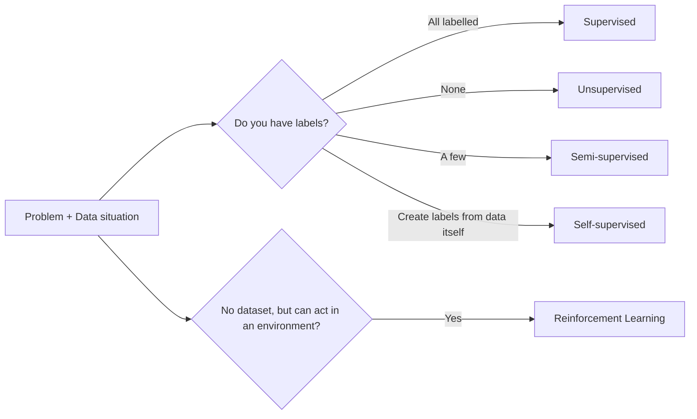
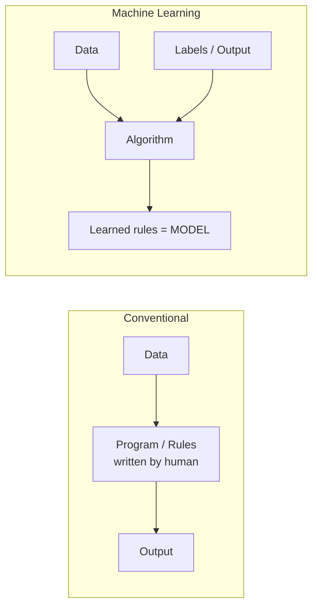
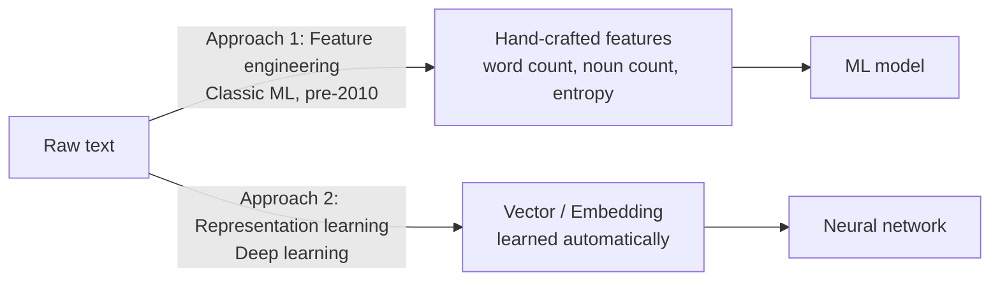
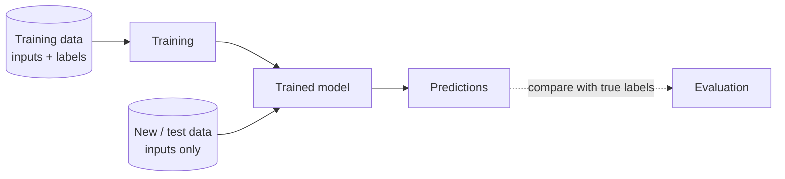
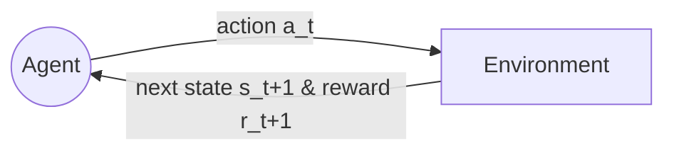
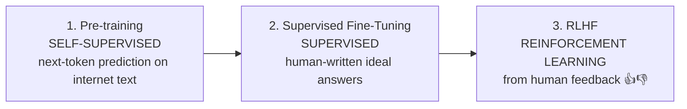
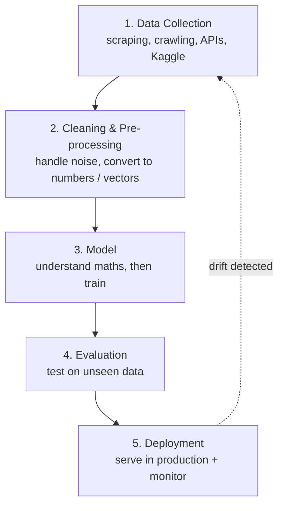
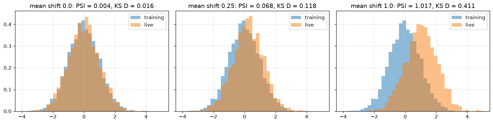
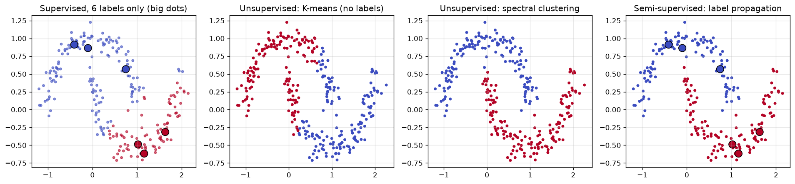
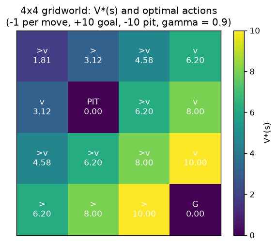

# 01 · Introduction to Machine Learning Paradigms

> **Course:** Machine Learning Paradigms (DS602) · Dr. Sunil Saumya · IIIT Dharwad
>
> **Lecture:** 1 October 2026 (Week 1)
>
> **Sources:** `01_MLP_Introduction.pdf`, `MLP_Course_Plan_Sep2026.pdf`, Oct 1 class transcripts (both parts)
>
> **Level:** 🟢 Basic → 🟡 Intermediate → 🔴 Advanced (marked per section)

---

## 📌 Table of Contents

1. [Big Picture](#1-big-picture)
2. [What is Machine Learning?](#2-what-is-machine-learning-)
3. [Conventional Programming vs Machine Learning](#3-conventional-programming-vs-machine-learning-)
4. [When to Use (and NOT Use) ML](#4-when-to-use-and-not-use-ml-)
5. [Case Study: Why Rule-Based Sentiment Analysis Fails](#5-case-study-why-rule-based-sentiment-analysis-fails-)
6. [Algorithm vs Model vs Code](#6-algorithm-vs-model-vs-code-)
7. [Data Must Become Numbers: Features, Vectors, Embeddings](#7-data-must-become-numbers-features-vectors-embeddings-)
8. [Two Phases: Training & Testing](#8-two-phases-training--testing-)
9. [The Learning Paradigms](#9-the-learning-paradigms-)
10. [Paradigm Comparison & How to Choose](#10-paradigm-comparison--how-to-choose-)
11. [The ML Workflow / Pipeline](#11-the-ml-workflow--pipeline-)
12. [Data Drift & Why Models Degrade](#12-data-drift--why-models-degrade-)
13. [Each Paradigm as an Optimisation Problem](#13-each-paradigm-as-an-optimisation-problem-)
14. [Inductive Bias and the No-Free-Lunch Theorem](#14-inductive-bias-and-the-no-free-lunch-theorem-)
15. [ML vs Rules as a Cost/Benefit Decision](#15-ml-vs-rules-as-a-costbenefit-decision-)
16. [Drift: Formal Definitions and Detection Statistics](#16-drift-formal-definitions-and-detection-statistics-)
17. [Classifying Real Scenarios by Paradigm](#17-classifying-real-scenarios-by-paradigm-)
18. [Real-World Case Studies](#18-real-world-case-studies-)
19. [Code Walkthrough: the Hands-On Notebook](#19-code-walkthrough-the-hands-on-notebook-)
20. [Professor Emphasised](#20--professor-emphasised)
21. [Common Confusions](#21--common-confusions)
22. [Exam / Interview Questions](#22--exam--interview-questions)
23. [Practice Problems](#23--practice-problems)
24. [Cheat Sheet](#24--cheat-sheet)
25. [Go Deeper: Curated Links](#25--go-deeper-curated-links)

---

## 1. Big Picture

This course is about **the different ways a machine can learn from data**. Each "way" is called a **paradigm**.

The same problem (e.g., *"is this Amazon review positive or negative?"*) can be solved by different paradigms depending on **what data you have** (labels? no labels? only some labels? no data at all, only an environment?) and **what problem you are solving**.



**Course roadmap (from the course plan):**

| Weeks | Unit | Paradigms | Hands-on |
|---|---|---|---|
| 1 | Intro | Overview, terminology | Sentiment demo |
| 2–3 | Unit 1 | Supervised & Unsupervised | Linear regression (house prices), K-means (image segmentation) |
| 4 | Unit 1 | Semi-supervised & Active | Label propagation, uncertainty sampling |
| 5 | Unit 1 | Self-supervised | Contrastive learning (SimCLR) |
| 6 | Unit 2 | Reinforcement | Q-learning, OpenAI Gym |
| 7 | Unit 2 | Transfer | Fine-tuning ResNet |
| 8 | Unit 2 | Generative | Transformer, language modelling |
| 9 | Unit 3 | Zero/one/few-shot | Siamese networks |
| 10 | Unit 3 | Continual | Progressive neural nets |
| 11 | Unit 3 | Multimodal | Cross-modal attention, VQA |
| 12 | Unit 3 | Meta-learning | MAML |
| 13–14 | — | Emerging paradigms, projects | Presentations, demos |

**Evaluation:** Attendance 10% · Class notes 10% (50–100 word summary; full credit within 1 day) · Project 15% · Assignments 20% · Quiz 10% (week 4) · Mid-sem 15% (weeks 1–7) · End-sem 20% (weeks 1–14).

> 💡 **Tip:** The "class notes" component (10%) needs a 50–100 word summary within 1 day. The Cheat Sheet section of each note is written so you can adapt it for that.

---

## 2. What is Machine Learning? 🟢

- The term **"Machine Learning"** was coined by **Arthur Samuel in 1959** (he built a checkers program that improved by playing against itself).
- ML evolved from **statistical learning** and **pattern recognition**.
- **Goal:** make computers *learn from data* **without being explicitly programmed** with the rules.

### A more formal definition (Tom Mitchell, 1997) — *beyond slides*
> A program is said to **learn** from experience **E** with respect to some task **T** and performance measure **P**, if its performance at T, as measured by P, improves with experience E.

| Example | Task T | Experience E | Performance P |
|---|---|---|---|
| Spam filter | Classify email spam / not | Emails labelled by users | % correctly classified |
| Review sentiment | Positive / negative | Labelled reviews | Accuracy |
| Self-driving car | Drive safely | Driving episodes (actions + outcomes) | Reward: safety, efficiency |

### Where ML sits

```
Artificial Intelligence
 └── Machine Learning
      └── Neural Networks / Deep Learning
           └── LLMs, Generative AI (ChatGPT, etc.)
```
Professor (in Q&A): *"LLM is a neural network. A neural network is machine learning. And machine learning is a part of AI."* Gen AI is built on **deep** neural networks.

---

## 3. Conventional Programming vs Machine Learning 🟢

### The slide example: computing a student's Division

| Quiz I (/15) | Quiz II (/15) | Mid (/30) | End (/40) | **Total (Input)** | **Division (Label)** |
|---|---|---|---|---|---|
| 12 | 15 | 10 | 30 | 67 | 1 |
| 15 | 15 | 18 | 33 | 81 | 1 |
| 5 | 5 | 21 | 22 | 53 | 2 |
| 2 | 5 | 10 | 25 | 42 | 3 |
| 7 | 12 | 25 | 25 | 69 | 1 |

**Conventional approach:** a human writes the rules.

```python
if total >= 60:   division = "first"
elif total >= 45: division = "second"
else:             division = "third"
```

**ML approach:** give the machine `(total, division)` pairs + an algorithm → the machine **discovers the thresholds (60, 45) itself**.



> 🎯 **The fundamental difference (professor's words):** *"Rule extraction, program extraction, or threshold identification — the machine does, rather than we as human beings were doing in the conventional approach."*

**Clarification raised in class:** "If there is no program, what is ML?" We still **write code** (to load data, call the algorithm). What we *don't* write is **the pattern/rule/threshold**. The algorithm finds it.

---

## 4. When to Use (and NOT Use) ML 🟢

### Rule of thumb

- ✅ **Rules are simple and can be hand-coded → DON'T use ML.**
- ✅ **Data is high-dimensional, or rules are hard to define → USE ML.**

### Case 1: One-dimensional, simple → No ML needed
`Total → Division`. One input column; you can eyeball the threshold. ML *could* be used, but it brings **unnecessary cost**: data preparation, labelling, training, maintenance. A 3-line `if-else` is cheaper and fully explainable.

### Case 2: High-dimensional → ML suitable

| Nouns | Verbs | Entropy | Difficult Words | Lex Diversity | Class |
|---|---|---|---|---|---|
| 8 | 7 | 0.169 | 12 | 0.964 | 1 |
| 25 | 19 | 0.059 | 23 | 0.667 | 1 |
| 169 | 94 | 0.013 | 126 | 0.492 | 1 |
| 71 | 28 | 0.030 | 64 | 0.664 | 0 |

Why hand-coding fails here (professor's reasons):

1. **Multiple conditions interact.** Like *"If no rain AND I get a vehicle on time → I reach college at 9"*. Class depends on a *combination* of 5 columns, not one.
2. **Continuous / unbounded ranges.** `Nouns` ∈ [0, ∞), `Entropy` is continuous. Infinitely many candidate thresholds → impossible to search by hand.

### 🔴 Deeper: why high dimensions break human intuition
With *d* features and even 10 candidate thresholds each, there are $`10^d`$ combinations of rules. With *d* = 5 that's 100,000; with *d* = 100 (normal for text) it's astronomically large. ML algorithms search this space efficiently using **optimisation** (e.g., gradient descent — next topics).

### Real-world decision examples

| Problem | ML? | Why |
|---|---|---|
| GST calculation on an invoice | ❌ | Law gives exact formula |
| Grade → division | ❌ | Fixed thresholds |
| Detecting fraudulent UPI transactions | ✅ | Hundreds of signals, patterns change constantly |
| Diagnosing diabetic retinopathy from eye images | ✅ | Pixels = millions of dimensions |
| Predicting house price | ✅ | Many interacting factors (area, location, age…) |
| Sorting a list | ❌ | Exact algorithm exists |

---

## 5. Case Study: Why Rule-Based Sentiment Analysis Fails 🟢→🟡

**Task:** Predict whether a product review is positive or negative.

| ID | Rating | Review Text | Class |
|---|---|---|---|
| 0 | 1 | Worst product...power bank started to burn...what can I do... | 1 |
| 2 | 1 | Don't buy...used product...full heating problem... | 1 |
| 4 | 4 | Didn't expect much...very satisfied with the product... | 0 |
| 5 | 1 | Worked well...then stopped working...cheated from Amazon | 0 |

> ⚠️ **Note on label conventions:** In *this* slide, Negative = 1, Positive = 0. In the later case study (Section 11 and Note 02) it flips: Positive = 1, Negative = 0. Labels are just arbitrary encodings. Always check which convention a dataset uses. (Also notice row 5 — "cheated from Amazon" — is labelled 0, which looks like a **label noise** example: real datasets have mistakes in labels too.)

### Three ways to solve it

1. **Manual (human experts / linguists):** most accurate, but impossible at Amazon scale (thousands of reviews daily).
2. **Rule-based (keyword dictionary):** `if review contains {"worst", "disappointed", "don't"} → negative`.
3. **Machine Learning:** learn the signal from labelled examples.

### Why rule-based fails

| Problem | Example |
|---|---|
| Dictionary is never complete | New slang tomorrow: "this phone is mid" |
| **Sarcasm** | "Great, it died in 2 days. Just great." (has "great" but is negative) |
| **Mixed sentiment** | "Camera is awesome, battery is worst." |
| Long, unstructured, noisy text | "...", emojis 😡, short forms, typos |
| Emojis carry meaning | Removing 😍 or 😡 loses sentiment signal |
| **Language is contextual** | "This movie was *sick*!" (positive among youth) |
| Same sentence, different readings | Ambiguity between readers |

### Why ML is suitable

- Learns sentiment signals from **training data** rather than from hand-written rules.
- Works with **vectorised** text (TF-IDF, embeddings).
- **Scales** to large, varied corpora.

### Real-world impact (from lecture)
E-commerce sites aggregate review sentiment → new customers make informed decisions; companies can drill down to **aspect-level** sentiment ("battery: negative, camera: positive") — this is called **Aspect-Based Sentiment Analysis (ABSA)**.

---

## 6. Algorithm vs Model vs Code 🟢

A frequently confused trio (asked in class):

| Term | Meaning | Analogy |
|---|---|---|
| **Algorithm** | A *series of steps* to solve a task. Theory/maths. E.g., "Linear regression: fit a line minimising squared error." | A recipe in a cookbook |
| **Model** | The algorithm **after it has been trained on data**: it has learned specific numbers (parameters). E.g., `votes = 2.74·words − 7.59`. | The actual dish you cooked with your ingredients |
| **Code** | The implementation (Python, scikit-learn) that runs the algorithm on data to produce a model. | Your kitchen + utensils |

Professor: *"It's an algorithm which we convert into a model… Algorithm is only: what is linear regression, what are the steps. It's like theory and implementation."*

Examples of classification algorithms mentioned: **Logistic Regression, Support Vector Machine (SVM), Neural Networks.**

### Does the hardware change the answer?
Q (class): *Does learning depend on quantum vs classical computer?*
A: **Learning quality depends on data + algorithm only.** Hardware (CPU / GPU / TPU / quantum) affects **speed/latency** and how much data you can practically process — not *what* is learned.

> 🔴 *Fine print:* In practice, floating-point precision and parallel non-determinism on GPUs can cause tiny numerical differences, but conceptually the professor's statement holds.

---

## 7. Data Must Become Numbers: Features, Vectors, Embeddings 🟡

> *"Machine doesn't understand ABCD. Machine only understands numbers."*

Everything — text, image, audio, video — must be converted into **numbers** before a model can learn.

| Data type | How it becomes numbers |
|---|---|
| Image | Already a **matrix of pixel values** (e.g., 28×28 grayscale; 224×224×3 colour) |
| Text | Hand-crafted **features** (word count, noun count) **or** a **vector** (TF-IDF, word embeddings) |
| Speech | Spectrogram / MFCC features → vectors |
| Video | Sequence of image frames → tensors |

### Two approaches



1. **Feature extraction (manual):** a **domain expert** decides which features matter (a linguist for text, a doctor for medical records). Used heavily before ~2010 when datasets were small (hundreds of rows).
2. **Automatic (deep learning):** convert raw input to a vector and let the network learn the features. Needed now because data is in millions/billions of rows; manual feature design doesn't scale.

### Vector vs Embedding

- For now: **same thing** — a list of numbers representing an item.
- Nuance (beyond slides): an **embedding** is a *learned* dense vector where **geometry carries meaning** — similar words/sentences are close together. E.g., `vec("king") − vec("man") + vec("woman") ≈ vec("queen")`.
- Vectors have **direction**: you can plot them; the angle between two review vectors tells you how similar they are (cosine similarity).

> ⚠️ **Class confusion clarified:** The **label** (0/1) is the *output*; **vectorisation** applies to the *input*. The label column is not "the vector".

### Bits and hardware
The machine ultimately stores everything as 0s and 1s, but that's the hardware's job — as ML practitioners we work at the level of numbers/vectors.

---

## 8. Two Phases: Training & Testing 🟢

> *"The most important part: ML models work in two phases."*

| Phase | What happens | Human analogy |
|---|---|---|
| **Training (learning)** | Model sees input–output examples and adjusts itself | Learning to drive with an instructor |
| **Testing (inference/prediction)** | Model predicts on **new, unseen** data | Driving alone on a new road |

- **Conventional software** has *no* training phase: write code once → input → output.
- In ML, we **validate** the model by testing on data it **did not see during training**. That is how we know it learned the *pattern* rather than memorising the examples.



---

## 9. The Learning Paradigms 🟢→🟡

The course is named *Paradigms* because there are **multiple ways to make a machine learn**. Choice depends on the data situation and the problem.

### 9.1 Supervised Learning

- **Data:** input–output pairs $`(x_i, y_i)`$ are available. "Labelled dataset".
- **Why "supervised":** the true label acts like a **supervisor/teacher**. If the model predicts class 0 but the truth is 1, the error **corrects** it.
  - Professor's example: model says $`2 \times 2 = 3`$; the target 4 tells it "you're off by 1, adjust".
  - Like a teacher correcting you in class, or parents guiding you at home.
- **Most popular, most reliable, easiest** — but needs labels, and **labels cost money** (human annotation).
- **Two flavours:** Regression (continuous output) and Classification (categorical output) — Note 03.
- **Examples:** house-price prediction, spam detection, disease diagnosis from X-rays.

### 9.2 Unsupervised Learning

- **Data:** inputs only, **no labels**.
- **Goal:** find **hidden structure** — e.g., **clusters** of similar items.
- Can't "prove" a cluster is correct (no ground truth), but there are **internal quality measures** (e.g., Silhouette score — upcoming).
- **Professor's healthcare example:** a hospital gives you thousands of patient PDFs, no labels, and asks you to group patients by disease → clustering.
- **Examples:** customer segmentation, grouping news articles, anomaly detection, image segmentation (K-means in this course).

### 9.3 Reinforcement Learning (RL)

- **Data:** none upfront! An **agent** learns by **acting** in an **environment** and getting **rewards/penalties**.
- **Professor's example: autonomous car**
  - **Agent** = the car.
  - **Environment** = everything else: roads, traffic lights, pedestrians, other cars.
  - **State** = e.g., "traffic light is green".
  - **Actions** = {stop, accelerate, maintain speed}.
  - **Reward/penalty** = from goals like **safety** (crossed safely → reward) and **efficiency** (crawling at 10 km/h with 10 cars behind → penalty).
  - Initially, action probabilities may be **uniform** (each 0.33). With experience, rewards shift the probabilities → this learned mapping state→action is the **policy**.
- Human analogy: learning to drive — rules from the instructor help initially, but you really learn by **acting and observing outcomes**.



🔴 **Deeper:** The agent maximises the **cumulative (discounted) reward** $`G_t = r_{t+1} + \gamma r_{t+2} + \gamma^2 r_{t+3} + \dots`$, where $`0 \le \gamma \le 1`$ is the discount factor. The policy $`\pi(a \mid s)`$ is the probability of action *a* in state *s*. Covered in Week 6 (Q-learning). The full MDP formulation, value functions and the Bellman equation, with worked numbers, are in [Section 13.5](#135-reinforcement-learning--maximise-return-in-a-markov-decision-process).

### 9.4 Semi-Supervised Learning

- **Data:** a **few labelled** + **many unlabelled** examples.
- **Example (lecture):** You collect 1,00,000 tweets for sentiment; you can only afford to label 100. Use both the 100 labelled and 99,900 unlabelled tweets.
- **Intuition:** unlabelled data reveals the *shape* of the data (clusters); the few labels tell you *which* cluster is which. (Technique: label propagation — Week 4.)

### 9.5 Self-Supervised Learning (SSL)

- **Data:** no human labels, but we **create the supervision from the input itself**.
- **Professor's example (ChatGPT-style next-word prediction):** from the sentence *"finds hidden pattern or structure in unlabelled data"*:

| Input (context) | Output (label) |
|---|---|
| finds | hidden |
| finds hidden | pattern |
| finds hidden pattern | or |
| finds hidden pattern or | structure |

  The label is **part of the raw data**, so it is **always correct**. No human needed.

- **Unsupervised vs self-supervised (asked in class):**
  - *Unsupervised:* take the data **as-is**, find groups. Data isn't changed.
  - *Self-supervised:* **transform** the data to create input→output pairs, then train like supervised learning.
- **Examples:** LLMs (GPT: predict next token; BERT: predict masked word), SimCLR (image: two augmented crops of the same photo should have similar representations).
- **Generative learning evolved from self-supervised learning.**

### 9.6 Generative Learning

- Learns the **data distribution** so it can **generate new samples** like the training data: text (GPT), images (Stable Diffusion, DALL·E), music, code.

### 9.7 Meta, Multimodal, Continual Learning (preview)

| Paradigm | One-liner | Example |
|---|---|---|
| **Meta-learning** | "Learning to learn" — adapt to new tasks quickly from few examples | MAML: a model that adapts to a new language with 5 examples |
| **Multimodal** | Fuse multiple data types | Visual Question Answering: image + question → answer; GPT-4o (text+image+audio) |
| **Continual** | Keep learning over time without forgetting old knowledge | A spam filter that keeps adapting to new spam |
| **Transfer** | Reuse a model trained on one task for another | Fine-tune ImageNet-trained ResNet to detect plant diseases |
| **Active** | Model asks a human to label the *most useful* examples | Labelling only the X-rays the model is least sure about |

### 9.8 Combining paradigms — the ChatGPT story 🔴
Asked in class: *"Can self-supervised learning come under RL?"* → **No, different paradigms, but systems combine them.**



The thumbs-up / thumbs-down you click in ChatGPT is feedback that can feed into **RLHF** (Reinforcement Learning from Human Feedback). The professor noted this is also a kind of **fine-tuning**.

**Fine-tuning (defined):** take an already trained model and train it further for a new/related task. Ways: full fine-tuning, using it as a feature extractor, adding feedback signals, etc. (Week 7 — Transfer Learning). Example: a model trained for positive/negative can be fine-tuned to also predict *neutral*.

---

## 10. Paradigm Comparison & How to Choose 🟡

| Paradigm | Needs labels? | Learns from | Example task |
|---|---|---|---|
| Supervised | Yes | Labelled data | Predicting house prices |
| Unsupervised | No | Unlabelled data | Customer segmentation |
| Semi-supervised | Partially | Mixed | Text classification with few labels |
| Self-supervised | No (creates its own) | Structure in data | Contrastive image learning, LLM pre-training |
| Reinforcement | No labels | Rewards from environment | Game playing, robotics |
| Generative | Yes/No | Patterns / distribution | Text / image generation |

### Why so many paradigms?

- Different problems need different approaches; some need labels, some don't.
- Some learn in stages, some adapt continuously.
- **It's not only about accuracy** — also **cost, manpower (labelling), latency, memory**. Every paradigm has pros and cons.
- Shift from *data-centric* to *context-aware* ML.

### 🎯 How to choose (professor): **the problem statement decides, not the data alone**

| Problem | Suitable paradigm |
|---|---|
| Cat vs dog classification | Supervised (label a few hundred images) |
| Find & segment unknown objects in images | Unsupervised / self-supervised |
| Generate new images | Self-supervised / generative |
| Robot learning to walk | Reinforcement |
| Medical images: 50 labelled, 50,000 unlabelled | Semi-supervised (or self-supervised pre-training + fine-tune) |

---

## 11. The ML Workflow / Pipeline 🟢



| Stage | In this course? |
|---|---|
| Data collection | ❌ Mostly use public datasets |
| Cleaning / pre-processing / vectorisation | ✅ "Invest good time" |
| Model (maths + code) | ✅ Core focus |
| Evaluation | ✅ |
| Deployment | ❌ Covered in later semesters |

### Pre-processing depends on the problem (Q&A)

- No universal recipe. Example: emojis — **remove** them for topic classification, **keep** them for sentiment analysis.
- Modern LLM products do lots of automatic pre-processing: **tokenisation** (text → token IDs), wrapping your query in a **system prompt template**, **safety filtering** (jailbreak detection) before the model sees it, and converting token IDs back to words at the output.

### First case study (formally)
**Problem:** Given review text, votes, and rating → predict sentiment (1 = positive, 0 = negative).

| Review Text | Votes | Rating | Sentiment |
|---|---|---|---|
| Worst product ever, broke in a day. | 3 | 1.0 | 0 |
| Absolutely love it! Works perfectly as expected. | 15 | 5.0 | 1 |
| Decent quality, but overpriced. | 5 | 3.0 | 0 |
| Amazing value for money, very satisfied. | 20 | 5.0 | 1 |
| Late delivery and poor support. | 4 | 2.0 | 0 |

- **Inputs (features):** Review Text (unstructured → must be converted to numbers), Votes (integer), Rating (float).
- **Output (label):** Sentiment ∈ {0, 1} → **categorical** → **binary classification**.
- Hands-on walkthrough of this pipeline → **[Note 02](02-ML-Pipeline-Hands-On.md)**.

---

## 12. Data Drift & Why Models Degrade 🟡→🔴

Raised by a classmate working in hospital ML (blood transfusion, acute kidney disease, cardiac arrest prediction): *"Predictions deteriorate over time. How is that handled?"*

**Professor's explanation:** The **nature of data changes over time**. Your writing style in 10th grade ≠ graduation ≠ the internet era ≠ now (AI-assisted). A sentiment model trained 5 years ago sees very different text today.

**Solution:** monitor the deployed model; **retrain** or do **continual learning** (Week 10). There is **no fixed expiry** (6 months? 1 year?) — you find out by monitoring. That's partly why we see model versions (GPT-4, GPT-5…).

### 🔴 Beyond slides: types of drift

| Type | What changes | Example |
|---|---|---|
| **Data / covariate drift** | Input distribution $`P(X)`$ | New phone model photos look different; COVID-era patients are younger |
| **Concept drift** | Relationship $`P(Y \mid X)`$ | "Sick" used to mean ill; now also means "awesome" |
| **Label drift** | Output distribution $`P(Y)`$ | Fraud rate jumps during festival sales |

**How industry handles it:** monitor input statistics and live accuracy (when labels arrive later), set alerts on distribution distance (e.g., PSI, KL divergence, KS test), scheduled retraining, sliding-window training, continual learning. Formal definitions, the PSI and KS formulas with worked numbers, and a real hospital example are in [Section 16](#16-drift-formal-definitions-and-detection-statistics-) and [Section 18.2](#182-a-medical-model-degraded-by-drift-the-epic-sepsis-model).

---

## 13. Each Paradigm as an Optimisation Problem 🟡→🔴

> Every paradigm in Section 9 can be written as **"choose parameters that minimise (or maximise) some objective"**. What changes from paradigm to paradigm is *where the objective's signal comes from*: human labels, the geometry of the data, the data itself, or rewards from an environment. Seeing the objectives side by side is the cleanest way to answer *"how is paradigm A different from paradigm B?"* in an exam. (The formal treatment is 🔴 beyond the Week-1 slides; each paradigm gets its own week later.)

| Paradigm | Signal comes from | Objective (what is optimised) |
|---|---|---|
| Supervised | Human labels $`y_i`$ | Minimise average loss $`\frac{1}{n}\sum_i \ell(f(x_i), y_i)`$ (ERM) |
| Unsupervised | Geometry / density of $`x`$ | Minimise within-cluster distance, or maximise likelihood $`\sum_i \log p_\theta(x_i)`$ |
| Semi-supervised | Few labels + shape of unlabelled data | Supervised loss on labelled points + smoothness penalty over all points |
| Self-supervised | Labels manufactured from $`x`$ itself | Supervised loss on a pretext task (next token, masked token, contrastive) |
| Reinforcement | Scalar reward from the environment | Maximise expected discounted return $`\mathbb{E}_\pi[G_0]`$ |

### 13.1 Supervised learning = Empirical Risk Minimisation (ERM)

**Set-up and assumptions.**

1. Pairs $`(x, y)`$ are drawn **independently** from one fixed but unknown joint distribution $`P(X, Y)`$ (the **i.i.d. assumption**). Drift (Section 16) is exactly the violation of "fixed".
2. We choose a **hypothesis class** $`\mathcal{H}`$ (all straight lines, all thresholds, all neural networks of a given shape …).
3. A **loss function** $`\ell(\hat{y}, y) \ge 0`$ measures how bad a prediction is: squared error $`(\hat{y}-y)^2`$ for regression, 0-1 loss $`\mathbf{1}[\hat{y} \ne y]`$ or cross-entropy for classification.

The quantity we actually care about is the **true risk** (expected loss on future data):

```math
R(h) = \mathbb{E}_{(x,y)\sim P}\big[\ell(h(x), y)\big]
```

We cannot compute it because $`P`$ is unknown. We only have $`n`$ samples, so we minimise the **empirical risk** instead:

```math
\hat{R}_n(h) = \frac{1}{n}\sum_{i=1}^{n} \ell(h(x_i), y_i), \qquad \hat{h} = \arg\min_{h \in \mathcal{H}} \hat{R}_n(h)
```

**Why this is reasonable.** For any *fixed* $`h`$, $`\hat{R}_n(h)`$ is an average of $`n`$ i.i.d. numbers whose mean is $`R(h)`$, so by the law of large numbers $`\hat{R}_n(h) \to R(h)`$. The catch is that $`\hat{h}`$ is *chosen using the same data*, so we need the convergence to hold for **all** $`h \in \mathcal{H}`$ at once. For a finite class with a loss in $`[0,1]`$, Hoeffding's inequality plus a union bound gives, with probability at least $`1-\delta`$, for every $`h \in \mathcal{H}`$:

```math
R(h) \le \hat{R}_n(h) + \sqrt{\frac{\ln\lvert\mathcal{H}\rvert + \ln(1/\delta)}{2n}}
```

*Proof sketch.* Hoeffding: for one fixed $`h`$, $`P\big(R(h) - \hat{R}_n(h) > \epsilon\big) \le e^{-2n\epsilon^2}`$. Union bound over $`\lvert\mathcal{H}\rvert`$ hypotheses: the probability that **any** of them deviates by more than $`\epsilon`$ is at most $`\lvert\mathcal{H}\rvert e^{-2n\epsilon^2}`$. Set this equal to $`\delta`$ and solve for $`\epsilon`$. ∎

Three lessons hidden in that one formula:

- More data ($`n \uparrow`$) shrinks the gap between training and test error like $`1/\sqrt{n}`$.
- A richer hypothesis class ($`\lvert\mathcal{H}\rvert \uparrow`$) widens the gap: **overfitting** is the price of flexibility (but only logarithmically).
- Zero training error says nothing by itself; the bound is what turns training error into a promise about test error. This is the formal version of the professor's "test on data the model has not seen" (Section 8).

#### Worked Example 13.1: ERM learns the "first division" threshold from the slide table

**Data (slide, Section 3):** totals $`67, 81, 53, 42, 69`$ with divisions $`1, 1, 2, 3, 1`$. Learn the rule "first division iff total ≥ t" with 0-1 loss.

**Step 1: write the empirical risk for each candidate t.** Three rows (67, 81, 69) are first division; two (53, 42) are not.

| Threshold t | Predicted "first" for | Mistakes | $`\hat{R}_5(t)`$ |
|---|---|---|---|
| 45 | 67, 81, 53, 69 | 53 wrongly "first" | 1/5 = 0.2 |
| 53 | 67, 81, 53, 69 | 53 wrongly "first" | 0.2 |
| 55 | 67, 81, 69 | none | 0.0 |
| 60 | 67, 81, 69 | none | 0.0 |
| 67 | 67, 81, 69 | none | 0.0 |
| 68 | 81, 69 | 67 missed | 0.2 |
| 70 | 81 | 67 and 69 missed | 0.4 |

**Step 2: find the minimisers.** Every $`t \in (53, 67]`$ has zero empirical risk. ERM alone **cannot** choose among them.

**Step 3: break the tie with an inductive bias.** A *maximum-margin* rule (the idea behind SVMs) puts the threshold half-way between the closest opposite-class points: $`t = (53 + 67)/2 = 60`$. That happens to equal the true rule. Doing the same for "second vs third" gives $`(42 + 53)/2 = 47.5`$, whereas the true rule is 45.

**Step 4: how much should we trust a 5-row result?** Take $`\lvert\mathcal{H}\rvert = 100`$ candidate integer thresholds and $`\delta = 0.05`$. Then $`\ln 100 = 4.605`$, $`\ln 20 = 2.996`$, so the bound's gap is

```math
\sqrt{\frac{4.605 + 2.996}{2 \times 5}} = \sqrt{0.760} = 0.872 \quad (n = 5), \qquad \sqrt{\frac{7.601}{2000}} = 0.0617 \quad (n = 1000)
```

**Sanity check:** with 5 rows the guarantee is almost vacuous (true error could be up to 87%), which is why the learned 47.5 differs from the true 45. With 1,000 rows the guarantee tightens to about 6 percentage points. The numbers are reproduced in the notebook, Part B.

### 13.2 Unsupervised learning = fit the geometry or the density

There is no $`y`$, so the objective must be defined on $`x`$ alone. Two common families:

**(a) Clustering objective (K-means, Week 2–3).** Choose $`K`$ centres $`\mu_1, \dots, \mu_K`$ and an assignment $`c(i)`$ of each point to a centre to minimise the **within-cluster sum of squares (SSE)**:

```math
J(c, \mu) = \sum_{i=1}^{n} \big\lVert x_i - \mu_{c(i)} \big\rVert^2
```

Two facts make the K-means algorithm work, each a one-line proof:

- For fixed centres, $`J`$ is minimised by assigning every point to its **nearest** centre (each term is minimised separately).
- For fixed assignments, $`J`$ is minimised by setting each centre to the **mean** of its points: $`\frac{\partial}{\partial \mu_k}\sum_{i: c(i)=k}\lVert x_i - \mu_k\rVert^2 = -2\sum_{i: c(i)=k}(x_i - \mu_k) = 0 \Rightarrow \mu_k = \bar{x}_k`$.

Alternating the two steps can never increase $`J`$, and there are finitely many assignments, so the algorithm stops (at a local, not necessarily global, minimum).

**(b) Density objective (Gaussian mixtures, generative models).** Choose parameters $`\theta`$ of a probability model to maximise the **log-likelihood** $`\sum_i \log p_\theta(x_i)`$. Generative learning (Section 9.6) is this idea scaled up: a model that assigns high probability to real data can also *sample* new data.

#### Worked Example 13.2: which clustering does K-means prefer?

Points on a line: $`1, 2, 3, 10, 11, 12`$, $`K = 2`$.

- Clustering A = $`\{1,2,3\}, \{10,11,12\}`$. Means 2 and 11. SSE $`= (1+0+1) + (1+0+1) = 4`$.
- Clustering B = $`\{1,2,3,10\}, \{11,12\}`$. Means 4 and 11.5. SSE $`= (9+4+1+36) + (0.25+0.25) = 50.5`$.

K-means prefers A (4 < 50.5). **Sanity check:** A is the split a human would draw; B puts 10 with points 6 units away. Computed in the notebook, Part F.

> ⚠️ **Inductive bias warning.** SSE rewards round, similar-sized clusters. On the two-moons data in the notebook (Part A), K-means scores an adjusted Rand index of only 0.234 because the true clusters are curved. The objective, not the algorithm's effort, is what fails.

### 13.3 Semi-supervised learning = supervised loss + "use the shape of the data"

Unlabelled points carry no $`y`$, so they can help only if we **assume** a link between the shape of $`P(X)`$ and the labels. The three standard assumptions:

| Assumption | Statement | When it fails |
|---|---|---|
| **Smoothness** | Points close together (in a high-density region) have the same label | Labels change sharply inside a dense region |
| **Cluster** | Points in the same cluster share a label; the decision boundary passes through **low-density** regions | Classes overlap heavily (one blob, two labels) |
| **Manifold** | High-dimensional data lie near a low-dimensional surface; distances along it are what matter | Data truly fill the whole space |

A typical **graph-based objective** (label propagation, Week 4): build a similarity graph with weights $`w_{ij}`$ (large when $`x_i`$ and $`x_j`$ are close), then find soft labels $`f_i`$:

```math
\min_{f} \; \sum_{i \in L} (f_i - y_i)^2 \;+\; \lambda \sum_{i,j} w_{ij}\,(f_i - f_j)^2
```

The first term fits the few labels $`L`$; the second, summed over **all** points, penalises neighbours that disagree, which is the smoothness assumption written as maths. In the limit where labelled points are clamped ($`f_i = y_i`$ exactly), setting the derivative with respect to an unlabelled $`f_u`$ to zero gives

```math
\frac{\partial}{\partial f_u} \sum_{i,j} w_{ij}(f_i - f_j)^2 = 4\sum_{j} w_{uj}(f_u - f_j) = 0 \;\;\Rightarrow\;\; f_u = \frac{\sum_j w_{uj} f_j}{\sum_j w_{uj}}
```

So every unlabelled point's value is the **weighted average of its neighbours**: a *harmonic function*. Label propagation is the iterative algorithm that reaches this fixed point.

#### Worked Example 13.3: label propagation on a 5-node chain

Nodes 1–2–3–4–5 in a line, all edge weights 1. Node 1 is labelled positive ($`f_1 = 1`$), node 5 negative ($`f_5 = 0`$). Nodes 2, 3, 4 are unlabelled.

**Step 1: harmonic condition.** $`f_2 = (f_1 + f_3)/2`$, $`f_3 = (f_2 + f_4)/2`$, $`f_4 = (f_3 + f_5)/2`$.

**Step 2: rewrite as a linear system** (multiply by 2 and move terms):

```math
\begin{bmatrix} 2 & -1 & 0 \\ -1 & 2 & -1 \\ 0 & -1 & 2 \end{bmatrix} \begin{bmatrix} f_2 \\ f_3 \\ f_4 \end{bmatrix} = \begin{bmatrix} 1 \\ 0 \\ 0 \end{bmatrix}
```

**Step 3: solve.** From the first equation $`f_3 = 2f_2 - 1`$; the third gives $`f_3 = 2f_4`$; the second $`-f_2 + 2f_3 - f_4 = 0`$. Substituting $`f_4 = f_3/2`$ and $`f_2 = (f_3+1)/2`$: $`-(f_3+1)/2 + 2f_3 - f_3/2 = 0 \Rightarrow f_3 = 0.5`$, so $`f_2 = 0.75`$, $`f_4 = 0.25`$.

**Step 4: threshold at 0.5.** Node 2 → positive, node 4 → negative, node 3 is exactly on the boundary.

**Sanity check:** values fall linearly from 1 to 0 along the chain, as a "weighted average of neighbours" must on a line; node 3, equidistant from both labels, gets 0.5. (`np.linalg.solve` in Part F prints `[0.75 0.5 0.25]`.)

### 13.4 Self-supervised learning = supervised learning on a pretext task

A **pretext task** manufactures $`(x, y)`$ pairs from unlabelled data; the model is trained on it with an ordinary supervised loss, and the *representation* it learns is later reused (fine-tuning, Section 9.8). The three pretext tasks you must know:

| Pretext task | Input → target | Loss | Used by |
|---|---|---|---|
| Next-token prediction (causal LM) | tokens $`w_1 \dots w_{t-1}`$ → $`w_t`$ | $`-\sum_t \log p_\theta(w_t \mid w_{<t})`$ | GPT family |
| Masked-token prediction (MLM) | sentence with ~15% tokens hidden → hidden tokens | $`-\sum_{t \in M} \log p_\theta(w_t \mid \tilde{w})`$ | BERT |
| Contrastive (instance discrimination) | two augmentations of the same image → "these match" | InfoNCE (below) | SimCLR, CLIP-style models |

The next-token loss is exactly what the professor's table in Section 9.5 trains on: a sentence of $`T`$ tokens yields $`T-1`$ (context, next word) pairs, all with correct labels.

**Contrastive loss (InfoNCE).** Embed an anchor $`z`$, its positive $`z^{+}`$ (another view of the same item) and negatives $`z^{-}_1, \dots, z^{-}_{K}`$. With cosine similarity $`s(\cdot,\cdot)`$ and a temperature $`\tau > 0`$:

```math
\mathcal{L} = -\log \frac{\exp\big(s(z, z^{+})/\tau\big)}{\exp\big(s(z, z^{+})/\tau\big) + \sum_{k=1}^{K} \exp\big(s(z, z^{-}_k)/\tau\big)}
```

It is simply **cross-entropy for a (K+1)-way classification** "which candidate is my positive?". Two properties follow directly:

- If all similarities are equal, the probability is $`1/(K+1)`$ and the loss is $`\ln(K+1)`$: the chance level.
- The loss decreases when the positive is pulled closer ($`s(z,z^{+}) \uparrow`$) or negatives are pushed away. Smaller $`\tau`$ sharpens the softmax, so hard negatives dominate the gradient.

#### Worked Example 13.4: InfoNCE by hand

Similarities: positive 0.9, negatives 0.1 and 0.3, temperature $`\tau = 0.5`$.

**Step 1: divide by τ.** $`1.8, 0.2, 0.6`$.

**Step 2: exponentiate.** $`e^{1.8} = 6.0496`$, $`e^{0.2} = 1.2214`$, $`e^{0.6} = 1.8221`$. Sum = 9.0931.

**Step 3: probability of the positive.** $`6.0496 / 9.0931 = 0.6653`$.

**Step 4: loss.** $`-\ln 0.6653 = 0.4075`$.

**Sanity check:** chance level for 3 candidates is $`\ln 3 = 1.0986`$; our loss is well below it because the positive is the most similar. With $`\tau = 0.1`$ the same similarities give loss 0.0028 (the softmax becomes almost one-hot). Both values are in the notebook, Part F.

### 13.5 Reinforcement learning = maximise return in a Markov Decision Process

The car example (Section 9.3) is formalised as a **Markov Decision Process (MDP)**, a 5-tuple $`(\mathcal{S}, \mathcal{A}, P, R, \gamma)`$:

| Symbol | Meaning | Car example |
|---|---|---|
| $`\mathcal{S}`$ | set of states | light is green / red, speed, distance to the car ahead |
| $`\mathcal{A}`$ | set of actions | stop, accelerate, maintain speed |
| $`P(s' \mid s, a)`$ | transition probability | how the world changes after the action |
| $`R(s, a)`$ or $`r_{t+1}`$ | reward | + for crossing safely, − for crawling with 10 cars behind |
| $`\gamma \in [0, 1)`$ | discount factor | how much future rewards matter vs immediate ones |

**Markov property (the key assumption):** $`P(s_{t+1} \mid s_t, a_t, s_{t-1}, a_{t-1}, \dots) = P(s_{t+1} \mid s_t, a_t)`$. The current state contains everything relevant about the past. If it does not (e.g., the state omits the car's speed), the problem is *partially observable* and harder.

**Return.** From time $`t`$:

```math
G_t = r_{t+1} + \gamma r_{t+2} + \gamma^2 r_{t+3} + \dots = \sum_{k=0}^{\infty} \gamma^{k} r_{t+k+1}
```

Two facts used everywhere:

1. **Recursion:** $`G_t = r_{t+1} + \gamma\,G_{t+1}`$. *Proof:* factor $`\gamma`$ out of every term after the first: $`G_t = r_{t+1} + \gamma\,(r_{t+2} + \gamma r_{t+3} + \dots) = r_{t+1} + \gamma G_{t+1}`$. ∎
2. **Boundedness:** if $`\lvert r\rvert \le R_{\max}`$ and $`\gamma < 1`$, then $`\lvert G_t\rvert \le R_{\max}\sum_k \gamma^k = R_{\max}/(1-\gamma)`$ (geometric series). This is *why* we discount in continuing tasks: without it the sum could be infinite. The quantity $`1/(1-\gamma)`$ is the **effective horizon**: 10 steps for $`\gamma = 0.9`$, 100 for $`\gamma = 0.99`$.

**Policy and value functions.**

- **Policy** $`\pi(a \mid s)`$: probability of action $`a`$ in state $`s`$ (the professor's "0.33 each initially, then updated by rewards").
- **State-value** $`V^{\pi}(s) = \mathbb{E}_\pi[G_t \mid s_t = s]`$: how good it is to be in $`s`$ if you follow $`\pi`$.
- **Action-value** $`Q^{\pi}(s, a) = \mathbb{E}_\pi[G_t \mid s_t = s, a_t = a]`$: how good it is to take $`a`$ in $`s`$ and follow $`\pi`$ afterwards.

**Bellman expectation equation (derivation).** Start from the definition and use the recursion:

```math
\begin{aligned}
V^{\pi}(s) &= \mathbb{E}_\pi\big[r_{t+1} + \gamma G_{t+1} \mid s_t = s\big] \\
&= \sum_{a} \pi(a \mid s) \sum_{s'} P(s' \mid s, a)\Big[R(s,a,s') + \gamma\,\mathbb{E}_\pi[G_{t+1} \mid s_{t+1} = s']\Big] \\
&= \sum_{a} \pi(a \mid s) \sum_{s'} P(s' \mid s, a)\Big[R(s,a,s') + \gamma\,V^{\pi}(s')\Big]
\end{aligned}
```

The second line conditions on the action and next state (law of total expectation); the third uses the Markov property, so the future after $`s'`$ does not depend on how we reached $`s'`$.

For a finite MDP, stack the values into a vector. With $`R^{\pi}`$ the expected one-step reward and $`P^{\pi}`$ the state-to-state transition matrix under $`\pi`$:

```math
V^{\pi} = R^{\pi} + \gamma P^{\pi} V^{\pi} \quad\Longrightarrow\quad V^{\pi} = (I - \gamma P^{\pi})^{-1} R^{\pi}
```

$`I - \gamma P^{\pi}`$ is always invertible for $`\gamma < 1`$: $`P^{\pi}`$ is a stochastic matrix, so all its eigenvalues have $`\lvert\lambda\rvert \le 1`$, so every eigenvalue of $`\gamma P^{\pi}`$ has modulus at most $`\gamma < 1`$, and 1 cannot be one of them.

**Bellman optimality equation.** The best achievable value satisfies

```math
V^{*}(s) = \max_{a} \sum_{s'} P(s' \mid s, a)\big[R(s,a,s') + \gamma V^{*}(s')\big], \qquad Q^{*}(s,a) = \sum_{s'} P(s' \mid s, a)\big[R(s,a,s') + \gamma \max_{a'} Q^{*}(s', a')\big]
```

and the optimal policy is greedy with respect to $`Q^{*}`$. *Why iterating it converges:* the Bellman operator $`T`$ is a $`\gamma`$-**contraction** in the max-norm, $`\lVert TV - TU\rVert_\infty \le \gamma \lVert V - U\rVert_\infty`$ (because $`\lvert\max_a f(a) - \max_a g(a)\rvert \le \max_a \lvert f(a) - g(a)\rvert`$ and the transition probabilities sum to 1). By the Banach fixed-point theorem, value iteration $`V_{k+1} = T V_k`$ converges to the unique fixed point $`V^{*}`$ from any start, with the error shrinking by a factor $`\gamma`$ per sweep.

**Q-learning (Week 6 preview)** estimates $`Q^{*}`$ *without knowing* $`P`$ or $`R`$, from sampled transitions $`(s, a, r, s')`$:

```math
Q(s,a) \leftarrow Q(s,a) + \alpha\Big[\underbrace{r + \gamma \max_{a'} Q(s', a')}_{\text{TD target}} - Q(s,a)\Big]
```

It is a stochastic version of the optimality equation: move the current estimate a step of size $`\alpha`$ towards a one-sample estimate of the right-hand side.

#### Worked Example 13.5: a discounted return

An agent receives rewards $`-1, -1, -1, +10`$ (three costly moves, then the goal), $`\gamma = 0.9`$.

**Forward:** $`G_0 = -1 + 0.9(-1) + 0.81(-1) + 0.729(10) = -1 - 0.9 - 0.81 + 7.29 = 4.58`$.

**Backward with the recursion** (how code computes it): $`G_3 = 10`$; $`G_2 = -1 + 0.9 \times 10 = 8.0`$; $`G_1 = -1 + 0.9 \times 8 = 6.2`$; $`G_0 = -1 + 0.9 \times 6.2 = 4.58`$. ✓ Same answer.

**Effect of γ:**

| γ | G₀ | Interpretation |
|---|---|---|
| 0 | −1 | Myopic: only the next reward counts |
| 0.5 | −0.5 | Goal reward shrunk to 10 × 0.125 = 1.25 |
| 0.9 | 4.58 | Goal still worth the walk |
| 1 | 7 | Plain sum (only safe for episodes that end) |

**Sanity check:** $`G_0`$ rises monotonically with $`\gamma`$ here because the only positive reward is the last one. (Notebook, Part C1.)

#### Worked Example 13.6: values in a tiny corridor (optimal vs random policy)

States S0 – S1 – S2 – G in a row; G is terminal with $`V(G) = 0`$. Every move costs $`-1`$; actions are left/right; moving left from S0 hits a wall and stays in S0. $`\gamma = 0.9`$.

**(a) Optimal policy "always right".** From S2 one move reaches G: $`V^{*}(S2) = -1`$. From S1: $`-1 + 0.9(-1) = -1.9`$. From S0: $`-1 + 0.9(-1.9) = -2.71`$.

**(b) Uniform random policy** ($`\pi = 0.5`$ each way). Bellman expectation equations:

```math
\begin{aligned}
V_0 &= -1 + 0.9\,(0.5\,V_0 + 0.5\,V_1) \\
V_1 &= -1 + 0.9\,(0.5\,V_0 + 0.5\,V_2) \\
V_2 &= -1 + 0.9\,(0.5\,V_1 + 0.5 \times 0)
\end{aligned}
```

Solving (exact fractions with sympy): $`V_0 = -11600/1889 = -6.141`$, $`V_1 = -9980/1889 = -5.283`$, $`V_2 = -6380/1889 = -3.377`$.

**Sanity checks:** (i) every random-policy value is worse than the optimal one, as it must be, since $`V^{*} \ge V^{\pi}`$ for every policy; (ii) values get worse further from the goal; (iii) all values are above the floor $`-1/(1-0.9) = -10`$ (paying −1 forever). (Notebook, Part C2.)

#### Worked Example 13.7: a two-state MDP solved by the matrix formula

A fixed policy induces transitions $`P^{\pi}`$ with rows $`(0.8, 0.2)`$ and $`(0.4, 0.6)`$, rewards $`R^{\pi} = (2, -1)`$, $`\gamma = 0.9`$.

**Step 1: equations.** $`V_1 = 2 + 0.9(0.8V_1 + 0.2V_2)`$ and $`V_2 = -1 + 0.9(0.4V_1 + 0.6V_2)`$, i.e.

```math
0.28\,V_1 - 0.18\,V_2 = 2, \qquad -0.36\,V_1 + 0.46\,V_2 = -1
```

**Step 2: Cramer's rule.** Determinant $`= 0.28 \times 0.46 - 0.18 \times 0.36 = 0.1288 - 0.0648 = 0.064`$.

$`V_1 = (2 \times 0.46 - 0.18 \times 1)/0.064 = 0.74/0.064 = 11.5625`$; $`V_2 = (0.28 \times (-1) + 0.36 \times 2)/0.064 = 0.44/0.064 = 6.875`$.

**Step 3: iterative check.** Starting from $`V = 0`$, repeated application of $`V \leftarrow R + \gamma P V`$ gives $`(2, -1)`$, $`(3.26, -0.82)`$, $`(4.1996, -0.2692)`$, … and reaches $`(11.5625, 6.875)`$ by iteration 200, as the contraction argument promises.

**Sanity check:** state 2 has negative immediate reward but positive value, because with probability 0.4 per step it moves to the rewarding state 1.

#### Worked Example 13.8: a 3-armed bandit (RL with one state)

Arms pay 1 with probabilities $`0.2, 0.5, 0.7`$ (unknown to the agent). A bandit is an MDP with a single state, so only exploration vs exploitation remains.

- Uniform random play earns $`(0.2+0.5+0.7)/3 = 0.4667`$ per pull.
- $`\varepsilon`$-greedy with $`\varepsilon = 0.1`$, once its greedy choice is the best arm, earns $`0.9 \times 0.7 + 0.1 \times 0.4667 = 0.6767`$.
- The optimum (always arm 3) earns 0.7; the gap $`0.7 - 0.6767 = 0.0233`$ is the permanent **price of exploration** at fixed $`\varepsilon`$.

**Sanity check (simulation, Part C3):** 2,000 runs × 1,000 pulls give an average of 0.677 over the last 100 pulls, choosing the best arm 93.1% of the time (theory: $`0.9 + 0.1/3 = 0.933`$).

---

## 14. Inductive Bias and the No-Free-Lunch Theorem 🔴

### 14.1 Inductive bias

Training data are finite; infinitely many functions fit them. **Inductive bias** is the set of assumptions a learner uses to choose among hypotheses that fit the training data equally well. Worked Example 13.1 showed it concretely: every threshold in $`(53, 67]`$ had zero training error, and only the max-margin *preference* picked 60.

| Learner | Its inductive bias |
|---|---|
| Linear regression | Output is (close to) a linear function of the inputs |
| K-nearest neighbours | Nearby points have similar labels (smoothness) |
| K-means | Clusters are compact, roughly spherical, similar in size |
| Decision tree | Axis-aligned splits; shorter trees preferred |
| SVM | Among separating boundaries, prefer the widest margin |
| CNN | Local patterns matter, and the same pattern can appear anywhere (translation equivariance) |
| Semi-supervised (graph) | Labels are smooth along the data graph (cluster assumption) |
| Regularisation (L2) | Small weights preferred, so simpler functions |

A learner with **no** bias cannot generalise at all: it has no reason to prefer one completion of the unseen inputs over another. The next result makes that precise.

### 14.2 No-Free-Lunch (NFL) theorem: intuition and a counting proof

**Statement (Wolpert, 1996, informal).** Averaged uniformly over **all possible** target functions, every learning algorithm has the **same** expected accuracy on points outside the training set, namely 50% for binary labels. No algorithm is better than another (or than random guessing) "in general"; one is better only on problems that match its inductive bias.

#### Worked Example 14.1: counting proof on 2 boolean inputs

**Step 1: the universe.** Inputs are $`(0,0), (0,1), (1,0), (1,1)`$. A binary target function assigns 0/1 to each input: $`2^4 = 16`$ possible functions.

**Step 2: training data.** We observe $`(0,0) \to 0`$, $`(0,1) \to 1`$, $`(1,0) \to 1`$.

**Step 3: which functions are still possible?** Only the label at $`(1,1)`$ is free, so exactly 2 functions are consistent: $`(0,1,1,0)`$ (XOR) and $`(0,1,1,1)`$ (OR).

**Step 4: any learner.** Whatever a learner predicts at $`(1,1)`$, it is right for one of the two consistent functions and wrong for the other. Averaged uniformly: 50% off-training-set accuracy, *for every learner*.

**General proof sketch.** With $`m`$ unseen inputs there are $`2^m`$ consistent functions, and for each unseen input exactly half of them say 1. Any fixed prediction is therefore correct on exactly half: expected accuracy $`1/2`$, independent of the learner. ∎

**Sanity check (notebook, Part F):** enumerating all 16 functions returns exactly the two listed, with predictions $`[0, 1]`$ at $`(1,1)`$.

### 14.3 What NFL does and does not say

- It does **not** say ML is useless. Real-world targets are not uniformly random; they are smooth, structured, compositional. Learners whose bias matches that structure win.
- It **does** justify the professor's rule "the problem statement decides the paradigm": you choose a paradigm (and an algorithm) whose assumptions match the problem.
- It explains why we **validate empirically** on held-out data (Section 8) rather than trusting any algorithm by reputation.
- Practical corollary: always compare against a simple baseline (majority class, mean prediction, a hand-written rule). Note 03 starts regression with exactly such a mean baseline.

---

## 15. ML vs Rules as a Cost/Benefit Decision 🟡

The rule of thumb in Section 4 ("simple rules → don't use ML") is a special case of a cost comparison. Over a planning period, pick the option with the lower **total cost**:

```math
\text{Total cost} = \underbrace{C_{\text{build}}}_{\text{data, labels, training}} + \underbrace{C_{\text{run}}}_{\text{serving, monitoring, retraining}} + \underbrace{\sum_{\text{errors}} (\text{number of errors}) \times (\text{cost per error})}_{\text{cost of being wrong}}
```

- For **rules**, $`C_{\text{build}}`$ is a developer's time, $`C_{\text{run}}`$ is near zero, and the error term is zero if the rules are *exactly* known (GST, grade divisions).
- For **ML**, $`C_{\text{build}}`$ includes labelling (often the largest item) and $`C_{\text{run}}`$ includes drift monitoring; the payoff is a smaller error term when rules are unknown or high-dimensional.
- Non-monetary costs belong in the comparison too: explainability (regulators may require reasons), latency, memory, and the risk of silent degradation.

#### Worked Example 15.1: estimating the cost of labels

**Task:** label 100,000 tweets for sentiment (Section 9.4's example). Assume 30 seconds per tweet, 3 annotators per tweet (majority vote, to control label noise), INR 300 per annotator-hour.

**Step 1: annotation time.** $`100{,}000 \times 30 \times 3 = 9{,}000{,}000`$ seconds $`= 9{,}000{,}000 / 3600 = 2{,}500`$ hours.

**Step 2: money.** $`2{,}500 \times 300 = 7{,}50{,}000`$ INR (7.5 lakh).

**Step 3: the semi-supervised alternative.** Label only 1,000 tweets: $`1{,}000 \times 30 \times 3 / 3600 = 25`$ hours, i.e. INR 7,500, and let the 99,000 unlabelled tweets supply the structure.

**Sanity check:** 2,500 hours is about 1.2 person-years at 2,000 working hours per year: the professor's point that "labels cost money" in concrete terms. Whether the cheaper option is acceptable depends on how much accuracy semi-supervised learning gives up, which must be measured (the notebook's two-moons demo: 6 labels + unlabelled data matched the fully labelled model, while 6 labels alone gave 75%).

#### Worked Example 15.2: fraud screening, rules vs ML

**Assumptions (illustrative numbers):** 1,000,000 transactions per month; fraud rate 0.2% (so 2,000 frauds); average loss per missed fraud INR 20,000; every flagged transaction costs INR 50 to review.

| | Rule engine | ML model |
|---|---|---|
| Recall (share of fraud caught) | 60% | 85% |
| False-positive rate on genuine transactions | 1.0% | 0.5% |
| Frauds caught | 1,200 | 1,700 |
| Frauds missed | 800 | 300 |
| False alarms (of 998,000 genuine) | 9,980 | 4,990 |
| Loss from missed fraud | 800 × 20,000 = 1,60,00,000 | 300 × 20,000 = 60,00,000 |
| Review cost | (1,200 + 9,980) × 50 = 5,59,000 | (1,700 + 4,990) × 50 = 3,34,500 |
| **Monthly cost of errors** | **1,65,59,000** | **63,34,500** |

**Decision:** ML saves $`1{,}65{,}59{,}000 - 63{,}34{,}500 = 1{,}02{,}24{,}500`$ INR (about 1.02 crore) per month in error cost. It is worth building if its own build-plus-run cost is clearly below that. For GST computation the error term of exact rules is zero, so no ML project can ever pay for itself there.

**Sanity check:** the missed-fraud line dominates both totals, which is why fraud teams optimise recall at an acceptable false-alarm rate rather than raw accuracy (a model that says "never fraud" is 99.8% accurate and useless).

---

## 16. Drift: Formal Definitions and Detection Statistics 🔴

### 16.1 Definitions

Write the joint distribution in two ways:

```math
P(X, Y) = P(X)\,P(Y \mid X) = P(Y)\,P(X \mid Y)
```

A model learns (an approximation of) $`P(Y \mid X)`$ from training-time data $`P_{\text{train}}`$. **Drift** means $`P_{\text{live}}(X, Y) \ne P_{\text{train}}(X, Y)`$. Which factor changed determines the type:

| Type | What changes | What stays | Example | Detectable without labels? |
|---|---|---|---|---|
| **Covariate (data) drift** | $`P(X)`$ | $`P(Y \mid X)`$ | A new X-ray machine gives brighter images | ✅ yes, compare input distributions |
| **Prior (label) drift** | $`P(Y)`$ | $`P(X \mid Y)`$ | Flu season raises the share of positive cases | Partly (prediction distribution shifts) |
| **Concept drift** | $`P(Y \mid X)`$ | possibly $`P(X)`$ | Fraudsters change tactics; "sick" now praises | ❌ needs (delayed) labels |

Drift can also be classified by its **time profile**: *sudden* (a policy change overnight), *gradual* (old and new concepts alternate), *incremental* (slow continuous change, like writing style), and *recurring* (seasonal, e.g. festival sales).

**Why covariate drift alone can hurt.** Even with $`P(Y \mid X)`$ fixed, the true risk $`\mathbb{E}_{P_{\text{live}}(X)}\big[\mathbb{E}[\ell \mid X]\big]`$ re-weights the input space. If live inputs move into a region that was rare in training, the model is evaluated where it learned least. If the model is correct everywhere (the notebook's linear example), covariate drift is harmless, which is why a drift alarm is a reason to *investigate*, not automatically to retrain.

### 16.2 Population Stability Index (PSI)

Bin a feature (or the model score) using training-time bin edges, typically 10 equal-frequency bins. Let $`e_i`$ be the training (expected) share and $`a_i`$ the live (actual) share in bin $`i`$:

```math
\text{PSI} = \sum_{i=1}^{B} (a_i - e_i)\,\ln\frac{a_i}{e_i}
```

**Property 1: PSI is a symmetrised KL divergence.**

```math
\text{KL}(a \,\Vert\, e) + \text{KL}(e \,\Vert\, a) = \sum_i a_i \ln\frac{a_i}{e_i} + \sum_i e_i \ln\frac{e_i}{a_i} = \sum_i a_i \ln\frac{a_i}{e_i} - \sum_i e_i \ln\frac{a_i}{e_i} = \sum_i (a_i - e_i)\ln\frac{a_i}{e_i}
```

**Property 2: PSI ≥ 0, with equality iff a = e.** Each term is $`\ge 0`$ on its own: if $`a_i > e_i`$ both factors are positive; if $`a_i < e_i`$ both are negative; if equal, the term is 0.

**Industry rule of thumb (credit-risk practice, not a statistical test):** PSI < 0.1 no significant shift; 0.1–0.25 moderate shift, investigate; > 0.25 significant shift, act (recalibrate or retrain).

**Practical catch: empty bins.** If some $`a_i = 0`$, $`\ln(a_i/e_i) = -\infty`$. Implementations replace zeros by a small $`\varepsilon`$, and the result then depends on $`\varepsilon`$ (Practice Problem 23).

#### Worked Example 16.1: PSI on five bins

Training shares $`e = (0.10, 0.20, 0.40, 0.20, 0.10)`$; live shares $`a = (0.05, 0.15, 0.35, 0.25, 0.20)`$.

| Bin | eᵢ | aᵢ | aᵢ − eᵢ | ln(aᵢ/eᵢ) | Term |
|---|---|---|---|---|---|
| 1 | 0.10 | 0.05 | −0.05 | ln 0.5 = −0.6931 | 0.0347 |
| 2 | 0.20 | 0.15 | −0.05 | ln 0.75 = −0.2877 | 0.0144 |
| 3 | 0.40 | 0.35 | −0.05 | ln 0.875 = −0.1335 | 0.0067 |
| 4 | 0.20 | 0.25 | +0.05 | ln 1.25 = 0.2231 | 0.0112 |
| 5 | 0.10 | 0.20 | +0.10 | ln 2 = 0.6931 | 0.0693 |
| | | | | **PSI** | **0.1362** |

**Interpretation:** 0.136 is in the 0.1–0.25 band: moderate shift, investigate. The last bin contributes half of the total (mass moved to high values).

**Sanity checks:** (i) $`\text{KL}(a\Vert e) = 0.0699`$ and $`\text{KL}(e\Vert a) = 0.0663`$ add up to 0.1362 ✓ (Property 1). (ii) A tiny shift $`a = (0.11, 0.19, 0.41, 0.19, 0.10)`$ gives PSI 0.0022, far below 0.1. (Notebook, Part E.)

### 16.3 Two-sample Kolmogorov–Smirnov (KS) test

For a **continuous** feature, compare the empirical CDFs of the training sample (size $`n`$) and the live sample (size $`m`$):

```math
D_{n,m} = \sup_{x} \big\lvert F_{\text{train}}(x) - F_{\text{live}}(x) \big\rvert, \qquad F(x) = \frac{\#\{\text{sample values} \le x\}}{\text{sample size}}
```

- $`H_0`$: both samples come from the same distribution. Reject at level $`\alpha`$ (large samples) if

```math
D_{n,m} > c(\alpha)\sqrt{\frac{n+m}{n\,m}}, \qquad c(\alpha) = \sqrt{-\tfrac{1}{2}\ln\tfrac{\alpha}{2}}, \quad c(0.05) = 1.358
```

- **Why it works:** under $`H_0`$, the distribution of $`D`$ does not depend on what the common distribution is (it is *distribution-free*), so one table of critical values serves every continuous feature.
- **Strength:** no binning, sensitive to any kind of difference (location, spread, shape).
- **Weakness at scale:** the critical value shrinks like $`1/\sqrt{n}`$. With $`n = m = 1000`$ it is $`1.358\sqrt{2000/10^6} = 0.0607`$, so with millions of rows even a harmless shift is "significant". In production, teams therefore alert on the **effect size** $`D`$ (or PSI) rather than the p-value alone.

#### Worked Example 16.2: KS statistic by hand

Training sample $`x = \{1,2,3,4,5\}`$, live sample $`y = \{3,4,5,6,7\}`$.

| v | F_train(v) | F_live(v) | Gap |
|---|---|---|---|
| 1 | 0.2 | 0.0 | 0.2 |
| 2 | 0.4 | 0.0 | **0.4** |
| 3 | 0.6 | 0.2 | **0.4** |
| 4 | 0.8 | 0.4 | **0.4** |
| 5 | 1.0 | 0.6 | **0.4** |
| 6 | 1.0 | 0.8 | 0.2 |
| 7 | 1.0 | 1.0 | 0.0 |

$`D = 0.4`$. Large-sample critical value at 5%: $`1.358\sqrt{10/25} = 0.859`$; $`0.4 < 0.859`$, so we do **not** reject $`H_0`$. scipy's exact test agrees: `ks_2samp` gives statistic 0.4, p-value 0.873.

**Sanity check:** the samples clearly differ in location (shift of 2), but with 5 points each there is not enough evidence. Small monitoring windows miss real drift; huge windows flag trivial drift. Choosing the window size is a design decision.

### 16.4 What monitoring can and cannot see (notebook, Part E)

A logistic-regression model was trained on 2-D inputs where $`y = \mathbf{1}[x_1 + x_2 > 0]`$, then scored on three live batches:

| Live batch | Accuracy | KS statistic on x₁ |
|---|---|---|
| No drift | 0.999 | 0.015 |
| Covariate drift (inputs shifted by +1.5) | 1.000 | 0.538 |
| Concept drift (true rule becomes $`x_1 - x_2 > 0`$) | 0.512 | 0.025 |

Covariate drift raised a loud input alarm but did no harm; concept drift destroyed accuracy while the input statistics stayed silent. **Lesson:** monitor inputs (PSI/KS) *and* outcomes (accuracy, calibration once labels arrive), and treat each alarm as a question, not an answer.

Simulated gradual shift of a standard-normal feature (training 5,000 rows, live 2,000 rows, 10 equal-frequency bins):

| Mean shift | PSI | KS D | KS p-value |
|---|---|---|---|
| 0.00 | 0.0043 | 0.0164 | 0.83 |
| 0.05 | 0.0053 | 0.0348 | 0.062 |
| 0.10 | 0.0323 | 0.0786 | 4.1e-08 |
| 0.25 | 0.0678 | 0.1129 | 2.7e-16 |
| 0.50 | 0.2777 | 0.2260 | 2.0e-64 |
| 1.00 | 1.0442 | 0.4066 | 4.3e-212 |

A shift of 0.1 standard deviations is already "significant" for KS ($`p \approx 4 \times 10^{-8}`$) while PSI (0.03) calls it negligible; at 0.5 standard deviations both agree that action is needed.



*Figure: one draw of the same simulation (made by `code/figures_01.py`; values differ slightly from the table because the random samples differ).*

---

## 17. Classifying Real Scenarios by Paradigm 🟡

The method: ask (1) *what is the output and do we have it?* (2) *is there an environment that gives rewards?* (3) *can targets be cut out of the raw data itself?*

| # | Scenario | Paradigm | Justification |
|---|---|---|---|
| 1 | Bank approves loans using 10 years of applications marked "repaid / defaulted" | Supervised (classification) | Every row has the true outcome label |
| 2 | Predict tomorrow's electricity demand of a city | Supervised (regression) | Past demand is the continuous label for past days |
| 3 | A telecom groups 5 crore subscribers by usage pattern for marketing | Unsupervised (clustering) | No predefined groups; structure is discovered |
| 4 | Flag unusual server-log patterns no one has seen before | Unsupervised (anomaly detection) | Novel attacks have no labels; "far from normal" is the signal |
| 5 | 300 radiologist-labelled chest X-rays and 1,00,000 unlabelled ones | Semi-supervised (or self-supervised pre-training + fine-tuning) | Few labels, abundant unlabelled data from the same distribution |
| 6 | Pre-train a language model on all Kannada Wikipedia text | Self-supervised | Next/masked token targets come from the text itself |
| 7 | A warehouse robot learns to pick objects by trial | Reinforcement | Actions change the state; success gives reward; no labelled dataset |
| 8 | Dynamic pricing that adjusts a cab fare and observes whether riders book | Reinforcement (contextual bandit) | Each price is an action whose reward (booking, revenue) is observed only for the action taken |
| 9 | Generate product images for a catalogue from text descriptions | Generative (built on self-supervised pre-training) | Learns the data distribution in order to sample new items |
| 10 | Compute income tax from salary slabs | **No ML** (rules) | Exact rules are written in law; ML adds cost and error |
| 11 | A support chatbot fine-tuned on 5,000 curated Q&A pairs, then improved from thumbs-up/down | Self-supervised → supervised → RL (combination) | Same three-stage recipe as ChatGPT (Section 9.8) |
| 12 | A spam filter that must keep up with new spam every week | Supervised + continual learning | Labels come from "report spam" clicks; the concept drifts over time |

> 💡 **Exam technique:** state the paradigm **and** the deciding fact (label availability, reward signal, or self-generated target). One-word answers lose marks.

---

## 18. Real-World Case Studies 🟡

### 18.1 Recommendations: Netflix and Amazon (supervised + unsupervised + bandits)

- **Netflix Prize (2006–2009).** Netflix released 100,480,507 ratings that 480,189 users gave to 17,770 movies and offered USD 1,000,000 to the first team that beat its own rating predictor (Cinematch) by 10% in RMSE. On 21 September 2009 the prize went to *BellKor's Pragmatic Chaos*, with a 10.06% improvement. Paradigm view: predicting a star rating from (user, movie) is **supervised regression**; the winning blends relied heavily on **matrix factorisation**, which learns hidden "taste" factors, a representation-learning idea close to unsupervised learning.
- **Business value.** Netflix's own engineers (Gomez-Uribe & Hunt, *ACM Transactions on Management Information Systems*, 2015) reported that recommendations influence about 80% of hours streamed, and estimated that personalisation and recommendations save the company more than USD 1 billion a year by reducing cancellations.
- **Amazon item-to-item collaborative filtering.** Amazon's 2003 paper (Linden, Smith & York, *IEEE Internet Computing*) described recommending items *similar to what you bought* by computing item–item similarity offline from co-purchase data. In 2017, for its 20th anniversary, *IEEE Internet Computing* chose it as the single paper in its history that had best withstood the "test of time" ([Amazon Science history](https://www.amazon.science/the-history-of-amazons-recommendation-algorithm)). Paradigm view: similarity from co-occurrence, with no explicit labels, is an **unsupervised** signal; modern systems add supervised click-prediction models and **bandit/RL** exploration (showing some new items to learn whether users like them).
- **Lesson for this course:** one product uses several paradigms. The choice depends on the sub-problem (rating prediction, similarity, exploration), exactly the professor's "problem statement decides".

### 18.2 A medical model degraded by drift: the Epic Sepsis Model

Directly relevant to the class question on hospital models deteriorating over time (Section 12).

- **The model:** a proprietary sepsis-risk score embedded in the Epic electronic health record, used at hundreds of US hospitals; it recalculates every 15 minutes.
- **External validation (Wong et al., *JAMA Internal Medicine*, 2021):** at Michigan Medicine (27,697 patients, 38,455 hospitalisations, sepsis in 2,552 = 7%), the hospitalisation-level AUROC was **0.63**. The model missed 1,709 of the 2,552 sepsis patients (67%) while alerting on 18% of all hospitalisations, creating heavy alert fatigue.
- **Drift during COVID-19 (Wong et al., *JAMA Network Open*, 2021):** across 24 hospitals, in the 3 weeks after each health system's first COVID-19 case compared with the 3 weeks before, the share of patients triggering sepsis alerts per day rose from 9% (953 of 10,159) to 21% (1,363 of 6,634). Total daily alerts rose 43% even though the hospital census fell 35%. The patient mix changed suddenly (elective surgeries were cancelled, sicker patients remained): a textbook **covariate shift** that a fixed model could not absorb.
- **Lesson:** monitor live inputs and alert rates (PSI on the score distribution would have jumped), validate locally before deployment, and plan retraining/recalibration. Accuracy reported at launch is not a lifetime guarantee.

> A related public example of drift is **Google Flu Trends**, which estimated influenza activity from search queries; Lazer et al. (*Science*, 2014) documented that it overestimated flu prevalence for 100 out of 108 weeks starting in August 2011, partly because search behaviour and Google's own search features changed under the model.

### 18.3 RLHF in ChatGPT (self-supervised → supervised → reinforcement)

- **Stage 1, self-supervised pre-training:** GPT-3 (Brown et al., 2020) is an autoregressive language model with **175 billion parameters** trained by next-token prediction on web-scale text.
- **Stage 2, supervised fine-tuning (SFT):** human labellers write ideal answers to prompts; the model is fine-tuned on these demonstrations.
- **Stage 3, RL from human feedback:** labellers *rank* several model outputs; a **reward model** is trained (supervised) to predict those rankings; then the language model is optimised with RL (PPO) to maximise the reward model's score, with a penalty for drifting too far from the SFT model.
- **Result (Ouyang et al., *InstructGPT*, 2022):** in human evaluations, outputs of the **1.3B-parameter InstructGPT** were preferred to those of the **175B GPT-3**, despite having 100× fewer parameters. ChatGPT was announced in November 2022 as a sibling model trained with the same recipe.
- **MDP mapping (Section 13.5):** state = prompt + text so far; action = next token; episode = one full response; reward = reward-model score at the end. The thumbs-up/down buttons the professor mentioned are a source of preference data of this kind.

### 18.4 BERT and GPT: self-supervised pre-training at scale

- **BERT (Devlin et al., 2018):** pre-trained on BooksCorpus (800M words) and English Wikipedia (2,500M words) with two self-supervised tasks: **masked language modelling** (15% of tokens chosen; of those 80% replaced by `[MASK]`, 10% by a random token, 10% left unchanged) and next-sentence prediction. BERT-Base has 110M parameters and BERT-Large 340M. Fine-tuning the pre-trained model with one extra output layer set new state-of-the-art results on 11 NLP benchmarks at release.
- **Why 80/10/10?** `[MASK]` never appears at fine-tuning time; mixing in random and unchanged tokens forces the model to build a good representation of *every* token, not only masked ones.
- **GPT:** next-token prediction only, which makes it a natural *generator* (Section 9.6: generative learning grew out of self-supervised learning).
- **Lesson:** the expensive, label-free stage is done once; many cheap supervised fine-tunings reuse it. This is why "self-supervised pre-training + fine-tune" is often the best answer to "50 labelled, 50,000 unlabelled" (Section 10).

### 18.5 UPI and bank fraud detection in India (supervised + unsupervised, under drift)

- **Scale:** NPCI's monthly statistics show UPI crossing 10 billion transactions per month in August 2023 and growing since. Every transaction must be risk-scored within a few hundred milliseconds, which rules out manual review except for a tiny flagged fraction.
- **Why rules alone fail:** fraud patterns (fake collect requests, QR-code scams, mule accounts) change constantly (concept drift) and depend on interactions among hundreds of signals (device, location, velocity, payee history): exactly Section 4's "high-dimensional, rules hard to define".
- **Typical design:** a **supervised** classifier trained on confirmed fraud labels (which arrive with a delay, after complaints and chargebacks), plus **unsupervised** anomaly scores for never-seen patterns, plus hard rules for regulatory limits. In December 2024 the Reserve Bank of India announced *MuleHunter.AI*, an AI/ML model from the Reserve Bank Innovation Hub to help banks detect mule accounts.
- **Class imbalance:** in the widely used public European credit-card dataset (ULB, on Kaggle), only 492 of 284,807 transactions (0.172%) are fraud. A model that never flags anything is 99.83% "accurate", so the field reports precision, recall and PR-AUC instead (Worked Example 15.2).
- **Drift monitoring:** PSI on the model score and on key features, tracked weekly; alerts during festival sales (label drift) are expected and must be distinguished from real attacks.

---

## 19. Code Walkthrough: the Hands-On Notebook 🟡

📓 **Notebook:** [`code/01_paradigms_hands_on.ipynb`](code/01_paradigms_hands_on.ipynb) (executed; all numbers in Sections 13–16 are recomputed there). Figures come from [`code/figures_01.py`](code/figures_01.py).

### Part A: one dataset, three paradigms

Two interleaving half-moons (300 points, noise 0.1), 240 for training, 60 for testing.

| Setting | Labels used | Test accuracy / agreement |
|---|---|---|
| Supervised (RBF-SVM), all labels | 240 | accuracy 1.000 |
| Supervised (RBF-SVM), few labels | 6 | accuracy 0.750 |
| Semi-supervised (`LabelPropagation`, kNN graph, k = 10) | 6 + 234 unlabelled | accuracy 1.000 |
| Unsupervised K-means (k = 2) | 0 | ARI 0.234 (best-permutation accuracy 0.743) |
| Unsupervised spectral clustering (kNN graph, 15 neighbours) | 0 | ARI 0.960 (best-permutation accuracy 0.990) |



What the table shows:

- **Unlabelled data helped enormously** because the moons satisfy the cluster assumption: 6 labels + 234 unlabelled points matched 240 labels.
- **The unsupervised result depends on the objective's inductive bias.** K-means (compact, round clusters) cuts the moons in the wrong place; a graph-based method follows them. Spectral clustering is also sensitive to its graph: with 10 neighbours instead of 15 its ARI falls to about 0.40.
- **Clusters have no names.** The unsupervised methods are scored with the adjusted Rand index (ARI) because cluster "0" may correspond to class 1; semi-supervision supplies the names.

The core of the semi-supervised call (scikit-learn marks unlabelled points with `-1`):

```python
y_semi = np.full_like(y_tr, -1)          # -1 = "no label"
y_semi[few] = y_tr[few]                  # keep only 6 labels
lp = LabelPropagation(kernel="knn", n_neighbors=10, max_iter=2000).fit(X_tr, y_semi)
lp.predict(X_te)                         # labels spread along the kNN graph
```

### Parts B–C: ERM and RL arithmetic

Part B reproduces Worked Example 13.1 (zero-error thresholds from 54 to 67 among integers; midpoint 60). Part C reproduces Worked Examples 13.5–13.8, including the bandit simulation (mean reward 0.677 in the last 100 pulls; best arm chosen 93.1% of the time).

### Part D: Q-learning on a 4×4 gridworld

States 0–15, start at the top-left, goal at the bottom-right (+10), a pit at state 5 (−10), −1 per move, $`\gamma = 0.9`$. Value iteration (which knows the model) converges in 6 sweeps; model-free Q-learning ($`\alpha = 0.1`$, $`\varepsilon = 0.1`$, 20,000 episodes, exploring starts) reaches the same values to within $`1.4 \times 10^{-14}`$.



**Check one value by hand:** from the start, the shortest safe path has 6 moves (5 costing −1, the last entering the goal for +10):

```math
V^{*}(0) = -1 - 0.9 - 0.81 - 0.729 - 0.6561 + 0.59049 \times 10 = -4.0951 + 5.9049 = 1.8098 \approx 1.81
```

matching the top-left cell of the figure. The core update is three lines:

```python
a = rng.integers(4) if rng.random() < eps else int(np.argmax(Q[s]))   # epsilon-greedy
s2, r, done = step(s, a)
Q[s, a] += alpha * (r + (0.0 if done else gamma * Q[s2].max()) - Q[s, a])
```

The average undiscounted return from the start rises from 2.46 (first 100 episodes from state 0) to 3.87 (last 100). It stays below the optimal 5 because the agent still explores 10% of the time.

### Part E: drift detection

Implements PSI (with the $`\varepsilon`$ fix for empty bins) and calls `scipy.stats.ks_2samp`; produces the tables in Section 16.

```python
def psi(expected, actual, eps=1e-4):
    e = np.clip(np.asarray(expected, float), eps, None); a = np.clip(np.asarray(actual, float), eps, None)
    e, a = e / e.sum(), a / a.sum()
    return float(np.sum((a - e) * np.log(a / e)))
```

### Part F: small checks

InfoNCE (0.4075 and 0.0028), the chain harmonic solution (0.75, 0.5, 0.25), K-means SSE (4 vs 50.5), No-Free-Lunch enumeration, and the labelling-cost arithmetic.

---

## 20. 🎓 Professor Emphasised

1. **Fundamental difference:** in ML, the *machine* extracts rules/thresholds; in conventional programming, the *human* writes them.
2. **Don't use ML if simple hand-coded rules work** — ML comes with large data, labelling and training costs.
3. **Data is a must** for ML (RL is the exception: can start with a policy and no dataset).
4. **ML works in two phases:** training then testing.
5. **Machines understand only numbers** → text/images/audio must be vectorised.
6. **Problem statement decides the paradigm**, not data alone.
7. Accuracy is not everything: **cost, manpower, latency, memory** matter.
8. Label = output = target (used interchangeably).

---

## 21. ⚠️ Common Confusions

| Confusion | Clarification |
|---|---|
| "ML means no programming" | You still code; you don't hand-write the *decision rules* |
| Algorithm = model | Algorithm = recipe; model = trained instance with learned parameters |
| Unsupervised = self-supervised | Unsupervised uses raw data as-is; self-supervised *creates* labels from data |
| Self-supervised labels can be wrong | They come from the data itself (next word), so they are always "correct" for the training task |
| Faster hardware = better model | Hardware affects speed, not *what* is learned |
| Class 1 always = positive | Encoding is arbitrary; check each dataset |
| A model trained once works forever | Data drift → monitor and retrain |
| "No drift alarm on inputs means the model is fine" | Concept drift changes $`P(Y \mid X)`$ and is invisible to PSI/KS on inputs; you need labels (Section 16.4) |
| "A significant KS p-value means retrain now" | With large samples tiny harmless shifts are significant; look at effect size (D, PSI) and at model performance |
| "Zero training error means a perfect model" | Many hypotheses can fit the training data (Worked Example 13.1); generalisation needs enough data and the right inductive bias |
| "Algorithm X is the best algorithm" | No-Free-Lunch: no learner wins on all problems; it wins where its bias matches the problem |
| "Discount factor γ = 1 is always fine" | Only for episodes that end; for continuing tasks the return can be infinite without γ < 1 |
| "Self-supervised = unsupervised, so no loss function" | SSL trains with an ordinary supervised loss (cross-entropy, InfoNCE) on manufactured targets |

---

## 22. 📝 Exam / Interview Questions

<details>
<summary><b>Q1.</b> Differentiate conventional programming from machine learning with an example.</summary>

Conventional: human writes rules (`if total >= 60: first division`); input + rules → output. ML: input + output examples → algorithm learns the rules (model), which then maps new inputs to outputs. Example: division calculation (rules simple → conventional) vs sentiment from text (rules impossible to enumerate → ML).

</details>

<details>
<summary><b>Q2.</b> When should you NOT use machine learning?</summary>

When rules are simple, known and stable (tax computation, grade thresholds, sorting). ML adds data collection, labelling, training and monitoring cost, and reduces explainability, without benefit.

</details>

<details>
<summary><b>Q3.</b> Give 4 reasons a keyword-based sentiment system fails.</summary>

Incomplete dictionary / new words; sarcasm; mixed sentiment; contextual meaning; noisy unstructured text with emojis; ambiguity.

</details>

<details>
<summary><b>Q4.</b> Explain the RL components using an autonomous car.</summary>

Agent = car; environment = roads, signals, pedestrians; state = e.g. green light; actions = stop/accelerate/maintain; reward = + for safety, − for inefficiency; policy = learned probabilities of actions per state, updated from cumulative reward.

</details>

<details>
<summary><b>Q5.</b> How is self-supervised learning different from unsupervised learning? Give an example.</summary>

Unsupervised finds structure in unlabelled data without altering it (K-means clustering). Self-supervised creates input-output pairs from the data itself and trains in a supervised manner (next-word prediction in GPT; SimCLR augmentations).

</details>

<details>
<summary><b>Q6.</b> Which paradigms are used to build ChatGPT?</summary>

Self-supervised pre-training (next-token), supervised fine-tuning on human demonstrations, and reinforcement learning from human feedback (RLHF).

</details>

<details>
<summary><b>Q7.</b> What is data drift? How do you handle it?</summary>

Change in data distribution (or input-output relation) after deployment, causing degraded accuracy. Handle with monitoring, drift detection, retraining / continual learning.

</details>

<details>
<summary><b>Q8.</b> Classify: (a) predicting tomorrow's temperature, (b) grouping customers by purchase behaviour, (c) teaching a robot arm to grasp, (d) training on 200 labelled + 20,000 unlabelled CT scans.</summary>

(a) Supervised regression, (b) unsupervised clustering, (c) reinforcement learning, (d) semi-supervised.

</details>

---

## 23. 📝 Practice Problems

> 25 problems: 🟢 basic · 🟡 intermediate · 🔴 advanced. Try each before opening the solution. Every number was checked in Python (most appear in the notebook).

<details>
<summary><b>P1 🟢 (MCQ).</b> A model is trained to predict the next word of Wikipedia sentences. Which paradigm is this? (a) Supervised (b) Unsupervised (c) Self-supervised (d) Reinforcement</summary>

**(c) Self-supervised.** The target (next word) is cut out of the raw text itself; no human labels are involved. It is trained *like* supervised learning, but the supervision is generated from the data (Section 13.4). It is not unsupervised, because the data are transformed into input→target pairs.

</details>

<details>
<summary><b>P2 🟢 (MCQ).</b> Q-learning with Q(s,a) = 2, reward r = 1, max Q(s′,·) = 5, γ = 0.9, α = 0.1. The updated Q(s,a) is (a) 2.10 (b) 2.35 (c) 5.50 (d) 3.50</summary>

TD target $`= r + \gamma \max_{a'} Q(s',a') = 1 + 0.9 \times 5 = 5.5`$. TD error $`= 5.5 - 2 = 3.5`$. Update: $`2 + 0.1 \times 3.5 = 2.35`$. **Answer (b).** (c) is the target itself, which would be correct only with $`\alpha = 1`$; (d) is the TD error.

</details>

<details>
<summary><b>P3 🟢 (Short).</b> Write the 5-tuple that defines an MDP and explain each element for the autonomous-car example.</summary>

$`(\mathcal{S}, \mathcal{A}, P, R, \gamma)`$:

- $`\mathcal{S}`$, states: signal colour, own speed, distance to obstacles.
- $`\mathcal{A}`$, actions: stop, accelerate, maintain speed.
- $`P(s' \mid s,a)`$, transition probabilities: how the scene changes after an action (other cars move, the light may change).
- $`R`$, reward: positive for crossing safely, negative for unsafe or inefficient behaviour (crawling at 10 km/h with 10 cars behind).
- $`\gamma`$, discount factor: how much future rewards count relative to immediate ones.

The Markov property assumes the current state summarises everything relevant from the past.

</details>

<details>
<summary><b>P4 🟢 (Numerical).</b> Rewards 0, 0, 1 arrive at t = 1, 2, 3 and the episode ends. Compute G₀ for γ = 0.95.</summary>

$`G_0 = 0 + 0.95 \times 0 + 0.95^2 \times 1 = 0.9025`$.

**Check (backwards):** $`G_2 = 1`$, $`G_1 = 0 + 0.95 \times 1 = 0.95`$, $`G_0 = 0 + 0.95 \times 0.95 = 0.9025`$ ✓.

</details>

<details>
<summary><b>P5 🟢 (Numerical).</b> An agent receives reward +1 at every step forever. What is its return for γ = 0.9 and γ = 0.99? What is the "effective horizon"?</summary>

Geometric series: $`G = \sum_{k \ge 0}\gamma^k = 1/(1-\gamma)`$. For $`\gamma = 0.9`$: $`G = 10`$; for $`\gamma = 0.99`$: $`G = 100`$. The effective horizon $`1/(1-\gamma)`$ (10 or 100 steps) is roughly how far ahead the agent "looks": rewards much further away are discounted to almost nothing ($`0.9^{50} \approx 0.005`$).

</details>

<details>
<summary><b>P6 🟢 (Classification).</b> Name the paradigm and the deciding fact: (a) grouping songs into moods with no tags, (b) a drone learning to hover from crash/no-crash feedback, (c) 50 labelled + 50,000 unlabelled satellite images, (d) predicting a used car's price from 10,000 past sales, (e) computing EMI from a loan formula.</summary>

(a) **Unsupervised**: no labels, structure discovered. (b) **Reinforcement**: actions change the state; reward signal, no dataset. (c) **Semi-supervised** (or self-supervised pre-training + fine-tuning): few labels, many unlabelled images. (d) **Supervised regression**: each past sale has the true price. (e) **No ML**: an exact formula exists, so ML would only add cost and error.

</details>

<details>
<summary><b>P7 🟡 (Numerical).</b> In state s, action a₁ gives reward 1 and moves to s′ with V(s′) = 10; action a₂ gives reward 5 and ends the episode. γ = 0.9. (i) Find V*(s). (ii) Find V^π(s) for π(a₁|s) = 0.3, π(a₂|s) = 0.7 (assume V^π(s′) = 10).</summary>

(i) $`Q(s,a_1) = 1 + 0.9 \times 10 = 10`$; $`Q(s,a_2) = 5 + 0 = 5`$. Bellman optimality: $`V^{*}(s) = \max(10, 5) = 10`$, optimal action $`a_1`$.

(ii) Bellman expectation: $`V^{\pi}(s) = 0.3 \times 10 + 0.7 \times 5 = 3 + 3.5 = 6.5`$.

**Check:** $`6.5 < 10`$, consistent with $`V^{\pi} \le V^{*}`$. The greedy action ignores the tempting immediate reward of 5.

</details>

<details>
<summary><b>P8 🟡 (Numerical).</b> A binary feature had a 50/50 split in training; live it is 70/30. Compute the PSI and interpret.</summary>

$`\text{PSI} = (0.7 - 0.5)\ln(0.7/0.5) + (0.3 - 0.5)\ln(0.3/0.5) = 0.2 \times 0.3365 + (-0.2)(-0.5108) = 0.0673 + 0.1022 = 0.1695`$.

Between 0.1 and 0.25: **moderate shift, investigate.** Note the asymmetry: the shrinking bin contributes more, because $`\lvert\ln 0.6\rvert > \ln 1.4`$.

</details>

<details>
<summary><b>P9 🟡 (Numerical).</b> Points 1, 2, 3, 10, 11, 12 and K = 2. Compute the K-means objective for {1,2,3},{10,11,12} and for {1,2,3,10},{11,12}. Which would K-means converge to if started from centres 2 and 11?</summary>

First: means 2 and 11; SSE $`= (1+0+1) + (1+0+1) = 4`$. Second: means 4 and 11.5; SSE $`= (9+4+1+36) + (0.25+0.25) = 50.5`$.

Starting from centres 2 and 11: assignment step puts 1, 2, 3 with centre 2 and 10, 11, 12 with centre 11; the update step returns the same means; converged to the first clustering (SSE 4).

</details>

<details>
<summary><b>P10 🟡 (Numerical).</b> With similarities 0.9 (positive), 0.1 and 0.3 (negatives), compute the InfoNCE loss for τ = 0.1 and compare with τ = 0.5 (loss 0.4075).</summary>

Divide by τ: 9, 1, 3. Exponentiate: $`e^9 = 8103.08`$, $`e^1 = 2.718`$, $`e^3 = 20.09`$. Probability of the positive $`= 8103.08/(8103.08 + 2.718 + 20.09) = 0.99719`$. Loss $`= -\ln 0.99719 = 0.0028`$.

A lower temperature sharpens the softmax: the same similarities now look like a near-certain match, so the loss is about 145× smaller. Very small τ makes training focus almost only on the hardest negatives.

</details>

<details>
<summary><b>P11 🟡 (Numerical).</b> A fraud model always predicts "genuine". Its accuracy was measured when fraud was 0.2% of transactions. During a festival sale fraud rises to 1%. What happens to its accuracy and its recall? What kind of drift is this?</summary>

Accuracy = share of genuine transactions: $`1 - 0.002 = 99.8\%`$ before, $`1 - 0.01 = 99.0\%`$ after. Recall (fraud caught) = 0% in both cases. This is **prior (label) drift**: $`P(Y)`$ changed. Lesson: on imbalanced problems accuracy hides failure; monitor recall/precision.

</details>

<details>
<summary><b>P12 🟡 (Numerical).</b> Active learning picks the 2,000 most informative X-rays to label. Each takes 30 s, 3 radiologists label each image, and the rate is INR 300 per hour. What is the labelling cost, and what fraction is it of labelling 1,00,000 images?</summary>

Time: $`2{,}000 \times 30 \times 3 = 180{,}000`$ s $`= 50`$ hours. Cost: $`50 \times 300 = 15{,}000`$ INR. For 1,00,000 images: $`100{,}000 \times 30 \times 3/3600 = 2{,}500`$ hours $`= 7{,}50{,}000`$ INR. Fraction: $`15{,}000 / 7{,}50{,}000 = 2\%`$. (Realistic radiologist rates are far higher; the 2% ratio is what matters.)

</details>

<details>
<summary><b>P13 🟡 (Short).</b> Why can a KS test on input features never detect pure concept drift? What must be monitored instead?</summary>

Pure concept drift changes $`P(Y \mid X)`$ while $`P(X)`$ can stay identical. KS (and PSI) compare only input distributions, so they see no difference: in the notebook, KS gave D = 0.025 while accuracy fell to 0.512. Detecting it needs **labels**: track live accuracy/precision/recall or calibration as delayed labels arrive (chargebacks, diagnoses), or use proxy outcomes and a small stream of human-reviewed samples.

</details>

<details>
<summary><b>P14 🟡 (Numerical).</b> Training values {1, 2, 3, 4, 5}, live values {3, 4, 5, 6, 7}. Compute the KS statistic and decide at 5% using the large-sample critical value.</summary>

Empirical CDF gaps at v = 1…7: 0.2, 0.4, 0.4, 0.4, 0.4, 0.2, 0.0, so $`D = 0.4`$. Critical value $`1.358\sqrt{(5+5)/(5 \times 5)} = 1.358 \times 0.632 = 0.859`$. $`0.4 < 0.859`$, so do **not** reject "same distribution" (scipy exact p-value 0.873). Five points are too few to confirm a shift of 2.

</details>

<details>
<summary><b>P15 🟡 (Numerical).</b> BERT masks 15% of a 512-token sequence, and of those replaces 80% with [MASK], 10% with a random token and leaves 10% unchanged. How many tokens fall in each group (expected values)? How many next-token training pairs does an 8-token sentence give a GPT-style model?</summary>

Selected: $`0.15 \times 512 = 76.8 \approx 77`$. [MASK]: $`0.8 \times 76.8 = 61.44`$; random: $`0.1 \times 76.8 = 7.68`$; unchanged: 7.68. The loss is computed only on the ~77 selected positions.

An 8-token sentence gives $`8 - 1 = 7`$ (context → next token) pairs, like the professor's table in Section 9.5.

</details>

<details>
<summary><b>P16 🟡 (Numerical).</b> Using the finite-class bound with |H| = 100 and δ = 0.05, compute the generalisation gap for n = 5 and n = 1000. How many samples make the gap at most 0.03?</summary>

Gap $`= \sqrt{(\ln 100 + \ln 20)/(2n)} = \sqrt{7.601/(2n)}`$. For $`n = 5`$: $`\sqrt{0.760} = 0.872`$. For $`n = 1000`$: $`\sqrt{0.0038} = 0.0617`$.

For gap ≤ 0.03: $`7.601/(2n) \le 0.0009 \Rightarrow n \ge 7.601/0.0018 = 4222.8`$, so **n = 4,223**.

</details>

<details>
<summary><b>P17 🔴 (Proof).</b> Prove that G_t = r_{t+1} + γ G_{t+1}, and that |G_t| ≤ R_max/(1 − γ) when |r| ≤ R_max and γ < 1.</summary>

**Recursion:** $`G_t = \sum_{k\ge0}\gamma^k r_{t+k+1} = r_{t+1} + \sum_{k\ge1}\gamma^k r_{t+k+1} = r_{t+1} + \gamma\sum_{j\ge0}\gamma^{j} r_{t+j+2} = r_{t+1} + \gamma G_{t+1}`$ (substituting $`j = k - 1`$).

**Bound:** by the triangle inequality, $`\lvert G_t\rvert \le \sum_k \gamma^k \lvert r_{t+k+1}\rvert \le R_{\max}\sum_k\gamma^k = R_{\max}/(1-\gamma)`$, a convergent geometric series because $`0 \le \gamma < 1`$. ∎

</details>

<details>
<summary><b>P18 🔴 (Derivation).</b> Derive the Bellman expectation equation and its matrix solution. Why is I − γP^π invertible?</summary>

$`V^{\pi}(s) = \mathbb{E}_\pi[G_t \mid s_t = s] = \mathbb{E}_\pi[r_{t+1} + \gamma G_{t+1} \mid s_t = s]`$ (recursion). Condition on $`a`$ and $`s'`$ (total expectation): $`= \sum_a \pi(a\mid s)\sum_{s'}P(s'\mid s,a)[R(s,a,s') + \gamma\,\mathbb{E}_\pi[G_{t+1}\mid s_{t+1}=s']]`$. By the Markov property the inner expectation is $`V^{\pi}(s')`$.

For finitely many states: $`V = R^{\pi} + \gamma P^{\pi}V \Rightarrow (I - \gamma P^{\pi})V = R^{\pi} \Rightarrow V = (I-\gamma P^{\pi})^{-1}R^{\pi}`$.

Invertibility: $`P^{\pi}`$ is row-stochastic, so $`\lVert P^{\pi}\rVert_\infty = 1`$ and every eigenvalue satisfies $`\lvert\lambda\rvert \le 1`$. Eigenvalues of $`\gamma P^{\pi}`$ have modulus ≤ γ < 1, so 1 is not an eigenvalue, so $`I - \gamma P^{\pi}`$ is non-singular. (Equivalently, the Neumann series $`\sum_k (\gamma P^{\pi})^k`$ converges to the inverse.)

</details>

<details>
<summary><b>P19 🔴 (Proof).</b> Show that PSI = KL(a‖e) + KL(e‖a), and that PSI ≥ 0 with equality iff a = e.</summary>

$`\text{KL}(a\Vert e) + \text{KL}(e\Vert a) = \sum_i a_i\ln(a_i/e_i) + \sum_i e_i\ln(e_i/a_i) = \sum_i a_i\ln(a_i/e_i) - \sum_i e_i\ln(a_i/e_i) = \sum_i (a_i - e_i)\ln(a_i/e_i) = \text{PSI}`$.

Non-negativity term by term: $`\ln`$ is increasing and $`\ln 1 = 0`$, so $`a_i - e_i`$ and $`\ln(a_i/e_i)`$ always have the same sign; their product is $`\ge 0`$ and is 0 only when $`a_i = e_i`$. Hence PSI = 0 iff every bin matches. (Alternatively, each KL is ≥ 0 by Gibbs' inequality.) ∎

</details>

<details>
<summary><b>P20 🔴 (Derivation).</b> On a chain 1–2–3–4–5 with unit weights, f₁ = 1 and f₅ = 0 are clamped. Show that the harmonic solution is linear and compute f₂, f₃, f₄. What changes if node 3 is also labelled 0?</summary>

Harmonic condition $`f_u = (f_{u-1} + f_{u+1})/2`$ means $`f_{u+1} - f_u = f_u - f_{u-1}`$: constant differences, i.e. a straight line from 1 to 0 over 4 steps. So $`f_2 = 0.75`$, $`f_3 = 0.5`$, $`f_4 = 0.25`$ (also from the 3×3 system in Worked Example 13.3).

If $`f_3 = 0`$ is clamped, the chain splits into two independent segments: $`f_2 = (1 + 0)/2 = 0.5`$ and $`f_4 = (0 + 0)/2 = 0`$. One extra label changes node 2 from confidently positive to undecided: labels influence their graph neighbourhood.

</details>

<details>
<summary><b>P21 🔴 (Numerical/Proof).</b> Boolean functions on 3 inputs: how many are there? After observing the labels of 5 distinct inputs, how many remain consistent, and what is any learner's average accuracy on the 3 unseen inputs?</summary>

There are $`2^3 = 8`$ inputs, so $`2^8 = 256`$ functions. Five labels fix 5 outputs; the 3 unseen outputs are free: $`2^3 = 8`$ consistent functions. For each unseen input, exactly 4 of the 8 functions output 1, so any prediction is right for 4 of 8: average off-training-set accuracy **50%**, whatever the learner (No-Free-Lunch, Section 14.2).

</details>

<details>
<summary><b>P22 🔴 (Long answer).</b> A hospital's acute-kidney-injury (AKI) risk model degrades over two years. Design a drift-monitoring and response plan.</summary>

1. **Baseline:** store the training distribution of each key input (creatinine, urine output, age, medication flags) and of the model's risk score, with 10 equal-frequency bin edges.
2. **Input monitoring (weekly):** PSI per feature and on the score; KS on continuous labs. Alert at PSI > 0.1 (investigate) and > 0.25 (act). Use effect sizes, not p-values alone, because hospital volumes make tiny shifts "significant".
3. **Data-quality checks:** a new lab analyser or a changed unit (mg/dL vs µmol/L) shows up as sudden covariate drift; fix the pipeline, not the model.
4. **Outcome monitoring:** AKI labels arrive after 48–72 h; track AUROC, recall at the alert threshold, calibration (predicted vs observed rate) and alert volume per day (the Epic sepsis case: alerts +43% during COVID-19).
5. **Response ladder:** recalibrate (cheap, fixes prior drift) → retrain on a recent sliding window → revisit features (concept drift) → continual learning with safeguards against forgetting.
6. **Governance:** clinician review before any new version goes live, version numbering, and a shadow period where old and new models run side by side.

</details>

<details>
<summary><b>P23 🟡 (Numerical).</b> Training shares (0.3, 0.4, 0.3); live shares (0.5, 0.5, 0). Compute PSI with zeros replaced by ε = 10⁻⁴ and renormalised. Why is the answer fragile?</summary>

After clipping and renormalising: $`a \approx (0.49995, 0.49995, 0.00009999)`$. Terms: bin 1 $`(0.49995-0.3)\ln(1.6665) = 0.1021`$; bin 2 $`(0.49995-0.4)\ln(1.2499) = 0.0223`$; bin 3 $`(0.0001-0.3)\ln(0.0003333) = 2.4011`$. PSI ≈ **2.53**.

The third term is driven by $`\ln\varepsilon`$: with a different ε the answer changes a lot (ε = 10⁻³ without renormalising gives 1.83). Both values are far above 0.25, so the decision ("major shift") is robust even though the number is not. Prefer bins wide enough that no bin is empty.

</details>

<details>
<summary><b>P24 🟡 (Numerical).</b> Fraud cost model: 1,000,000 transactions, 0.2% fraud, loss INR 20,000 per missed fraud, INR 50 per review. Model A: recall 85%, FPR 0.5%. Model B: recall 90%, FPR 2%. Which has lower monthly error cost?</summary>

Frauds = 2,000; genuine = 998,000.

A: caught 1,700, missed 300, false alarms 4,990. Cost $`= 300 \times 20{,}000 + (1{,}700 + 4{,}990) \times 50 = 60{,}00{,}000 + 3{,}34{,}500 = 63{,}34{,}500`$.

B: caught 1,800, missed 200, false alarms 19,960. Cost $`= 200 \times 20{,}000 + (1{,}800 + 19{,}960) \times 50 = 40{,}00{,}000 + 10{,}88{,}000 = 50{,}88{,}000`$.

**B is cheaper** by INR 12,46,500 despite 4× more false alarms, because a missed fraud costs 400× a review. (If review capacity is limited, 21,760 reviews a month may still be infeasible: cost models must include constraints.)

</details>

<details>
<summary><b>P25 🔴 (Numerical).</b> In the corridor S0–S1–S2–G (−1 per move, γ = 0.9, wall on the left of S0), solve the Bellman expectation equations for the uniform random policy.</summary>

Equations: $`V_0 = -1 + 0.45V_0 + 0.45V_1`$, $`V_1 = -1 + 0.45V_0 + 0.45V_2`$, $`V_2 = -1 + 0.45V_1`$.

From the third, $`V_2 = -1 + 0.45V_1`$. From the first, $`V_0 = (-1 + 0.45V_1)/0.55`$. Substitute into the second: $`V_1 = -1 + 0.45(-1 + 0.45V_1)/0.55 + 0.45(-1 + 0.45V_1)`$, i.e. $`V_1(1 - 0.36818 - 0.2025) = -1 - 0.81818 - 0.45`$, so $`V_1 = -2.26818/0.42932 = -5.2832`$. Then $`V_2 = -1 + 0.45(-5.2832) = -3.3774`$ and $`V_0 = (-1 - 2.3774)/0.55 = -6.1408`$.

Exact: $`V_0 = -11600/1889`$, $`V_1 = -9980/1889`$, $`V_2 = -6380/1889`$. Compare with the optimal $`-2.71, -1.9, -1`$: random wandering costs 2–3× more.

</details>

---

## 24. 🧾 Cheat Sheet

- **ML** (Samuel, 1959): computers learn patterns from data instead of being explicitly programmed.
- **Conventional:** Data + Rules → Output. **ML:** Data + Output → Rules (model).
- **Use ML** when data is high-dimensional / rules hard to define; **avoid** when rules are simple.
- **Algorithm** = steps (theory); **Model** = trained algorithm (learned parameters).
- Everything → **numbers/vectors** before learning.
- **Two phases:** train → test on unseen data.
- **Paradigms:** Supervised (labels) · Unsupervised (no labels) · Semi (few labels) · Self-supervised (labels from data) · RL (rewards from environment) · Generative · Transfer · Meta · Multimodal · Continual.
- **Pipeline:** Collect → Clean/Pre-process → Model → Evaluate → Deploy (→ monitor drift).
- **Choose paradigm by problem statement**; trade-offs include cost, labels, latency, memory.
- **Objectives:** supervised = ERM $`\min \frac{1}{n}\sum \ell(f(x_i), y_i)`$; K-means = min within-cluster SSE; semi-supervised = labelled loss + graph smoothness; SSL = supervised loss on a pretext task (next/masked token, InfoNCE); RL = max $`\mathbb{E}[G_0]`$.
- **RL:** MDP $`(\mathcal{S}, \mathcal{A}, P, R, \gamma)`$; $`G_t = r_{t+1} + \gamma G_{t+1}`$; Bellman $`V^{\pi} = R^{\pi} + \gamma P^{\pi}V^{\pi}`$; Q-learning moves Q towards $`r + \gamma\max_{a'}Q(s',a')`$.
- **Inductive bias** picks among hypotheses that fit equally; **NFL**: averaged over all problems, every learner scores 50% off the training set.
- **ML vs rules:** compare build + run + error costs; labelling 1 lakh items at 30 s × 3 annotators ≈ 2,500 hours.
- **Drift:** covariate $`P(X)`$, prior $`P(Y)`$, concept $`P(Y \mid X)`$. **PSI** $`= \sum (a_i - e_i)\ln(a_i/e_i)`$ (< 0.1 ok, 0.1–0.25 watch, > 0.25 act); **KS** $`D = \sup \lvert F_1 - F_2\rvert`$. Input monitors cannot see concept drift.

**50–100 word class summary (template):**
> Today we learned that machine learning lets a computer discover rules from data rather than having humans hand-code them. ML is useful when data is high-dimensional and rules are hard to define (e.g., review sentiment), but unnecessary for simple threshold problems. Models work in two phases: training and testing on unseen data. We surveyed learning paradigms — supervised, unsupervised, semi-supervised, self-supervised, and reinforcement learning — chosen by the problem statement and label availability, and saw the ML pipeline: collection, cleaning, modelling, evaluation, deployment.

---

## 25. 📚 Go Deeper: Curated Links

**Where to go deeper:**

| Topic | Why read it | Link |
|---|---|---|
| ML in 15 minutes (visual) | Best gentle intro: train/test, model, bias | [StatQuest — A Gentle Introduction to Machine Learning](https://www.youtube.com/watch?v=Gv9_4yMHFhI) |
| Google ML Crash Course | Free, structured, interactive; covers supervised basics | [developers.google.com/machine-learning/crash-course](https://developers.google.com/machine-learning/crash-course) |
| Neural networks intuition | Why "LLM is a neural network" | [3Blue1Brown — But what is a neural network?](https://www.youtube.com/watch?v=aircAruvnKk) |
| Reinforcement learning foundations | Agent, environment, reward, policy — formal treatment | [David Silver RL Course — Lecture 1](https://www.youtube.com/watch?v=2pWv7GOvuf0) · [Sutton & Barto book (free)](http://incompleteideas.net/book/the-book-2nd.html) |
| How ChatGPT is built (SSL → SFT → RLHF) | Paradigm combination explained | [Karpathy — Intro to Large Language Models (1 hr)](https://www.youtube.com/watch?v=zjkBMFhNj_g) · [Hugging Face — Illustrating RLHF](https://huggingface.co/blog/rlhf) |
| RLHF paper | Research-level source | [InstructGPT (Ouyang et al., 2022)](https://arxiv.org/abs/2203.02155) |
| Embeddings / vectors for text | What "vectorised text" really means | [Jay Alammar — The Illustrated Word2vec](https://jalammar.github.io/illustrated-word2vec/) |
| Self-supervised / contrastive learning | Preview of Week 5 | [Lilian Weng — Contrastive Representation Learning](https://lilianweng.github.io/posts/2021-05-31-contrastive/) · [SimCLR paper](https://arxiv.org/abs/2002.05709) |
| Data / concept drift | Answers the healthcare drift question in depth | [Lu et al. — Learning under Concept Drift: A Review](https://arxiv.org/abs/2004.05785) · [Google — Rules of ML](https://developers.google.com/machine-learning/guides/rules-of-ml) |
| Tokenisation in LLMs | The pre-processing ChatGPT does internally | [Hugging Face NLP Course — Tokenizers](https://huggingface.co/learn/nlp-course/chapter6/1) |
| MDPs and the Bellman equation | Section 13.5 in lecture form | [David Silver RL Course — Lecture 2: Markov Decision Process](https://www.youtube.com/watch?v=lfHX2hHRMVQ) |
| Self-supervised pre-training papers | Sources for Section 18.3–18.4 | [BERT (Devlin et al., 2018)](https://arxiv.org/abs/1810.04805) · [GPT-3 (Brown et al., 2020)](https://arxiv.org/abs/2005.14165) · [InfoNCE / CPC (van den Oord et al., 2018)](https://arxiv.org/abs/1807.03748) |
| RL from human preferences | The idea RLHF builds on | [Christiano et al., 2017](https://arxiv.org/abs/1706.03741) |
| Semi-supervised learning in scikit-learn | `LabelPropagation`, `LabelSpreading`, self-training | [scikit-learn — Semi-supervised learning](https://scikit-learn.org/stable/modules/semi_supervised.html) |
| KS test API | Used in the notebook's drift part | [scipy.stats.ks_2samp](https://docs.scipy.org/doc/scipy/reference/generated/scipy.stats.ks_2samp.html) |
| Drift in a deployed clinical model | Section 18.2 source (open access) | [Wong et al., Sepsis model alerts before and during COVID-19 (JAMA Netw Open, 2021)](https://pmc.ncbi.nlm.nih.gov/articles/PMC8605481/) |
| Recommendation history | Section 18.1 sources | [Netflix Prize (Wikipedia)](https://en.wikipedia.org/wiki/Netflix_Prize) · [Amazon Science — history of Amazon's recommendation algorithm](https://www.amazon.science/the-history-of-amazons-recommendation-algorithm) |
| Imbalanced fraud data to practise on | 284,807 transactions, 0.172% fraud | [Kaggle — Credit Card Fraud Detection (ULB)](https://www.kaggle.com/datasets/mlg-ulb/creditcardfraud) |

**Course textbooks (from slides):** Duda & Hart *Pattern Classification* · Bishop *PRML* (2006) · Bishop *Neural Networks for Pattern Recognition* · Yegnanarayana *Artificial Neural Networks* · Géron *Hands-On ML* ([code on GitHub](https://github.com/ageron/handson-ml3)) · [scikit-learn docs](https://scikit-learn.org/stable/)

---
⬅️ [MLP Index](README.md) · ➡️ [02 · ML Pipeline Hands-On](02-ML-Pipeline-Hands-On.md)
