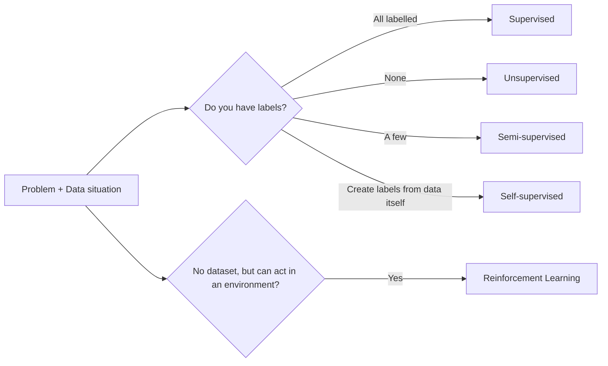
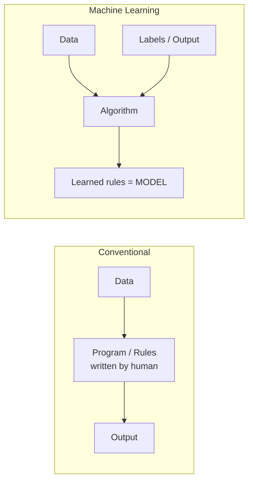
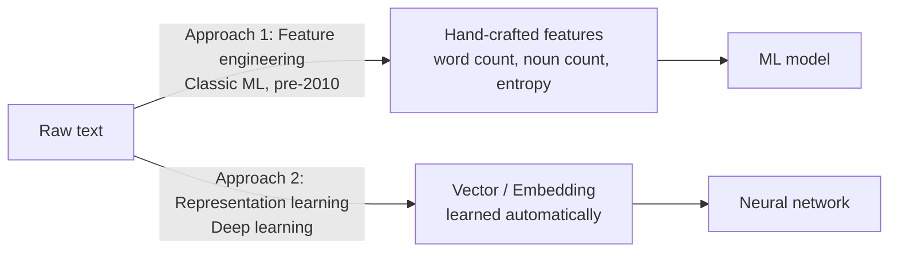
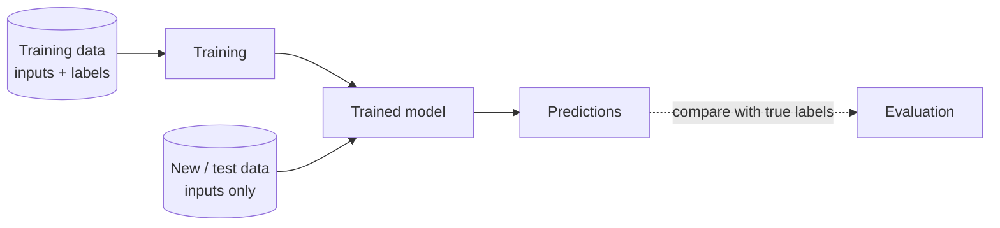
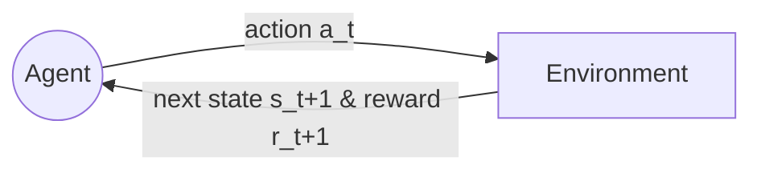
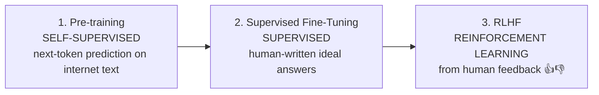
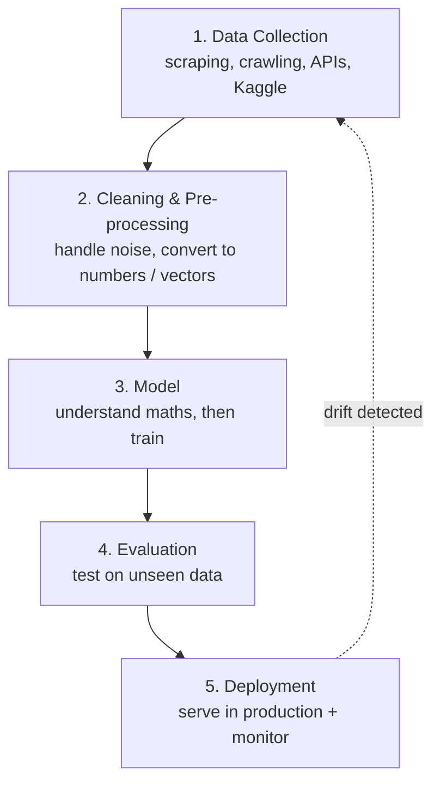

# 01 · Introduction to Machine Learning Paradigms

> **Course:** Machine Learning Paradigms (DS602) · Dr. Sunil Saumya · IIIT Dharwad
>
> **Lecture:** 1 October 2026 (Week 1)
>
> **Sources:** `01_MLP_Introduction.pdf`, `MLP_Course_Plan_Sep2026.pdf`, Oct 1 class transcripts (both parts)
>
> **Level:** 🟢 Basic → 🟡 Intermediate → 🔴 Advanced (marked per section)

---

## 📌 Table of Contents

1. [Big Picture](#1-big-picture)
2. [What is Machine Learning?](#2-what-is-machine-learning-)
3. [Conventional Programming vs Machine Learning](#3-conventional-programming-vs-machine-learning-)
4. [When to Use (and NOT Use) ML](#4-when-to-use-and-not-use-ml-)
5. [Case Study: Why Rule-Based Sentiment Analysis Fails](#5-case-study-why-rule-based-sentiment-analysis-fails-)
6. [Algorithm vs Model vs Code](#6-algorithm-vs-model-vs-code-)
7. [Data Must Become Numbers: Features, Vectors, Embeddings](#7-data-must-become-numbers-features-vectors-embeddings-)
8. [Two Phases: Training & Testing](#8-two-phases-training--testing-)
9. [The Learning Paradigms](#9-the-learning-paradigms-)
10. [Paradigm Comparison & How to Choose](#10-paradigm-comparison--how-to-choose-)
11. [The ML Workflow / Pipeline](#11-the-ml-workflow--pipeline-)
12. [Data Drift & Why Models Degrade](#12-data-drift--why-models-degrade-)
13. [Professor Emphasised](#13--professor-emphasised)
14. [Common Confusions](#14--common-confusions)
15. [Exam / Interview Questions](#15--exam--interview-questions)
16. [Cheat Sheet](#16--cheat-sheet)
17. [Go Deeper: Curated Links](#17--go-deeper-curated-links)

---

## 1. Big Picture

This course is about **the different ways a machine can learn from data**. Each "way" is called a **paradigm**.

The same problem (e.g., *"is this Amazon review positive or negative?"*) can be solved by different paradigms depending on **what data you have** (labels? no labels? only some labels? no data at all, only an environment?) and **what problem you are solving**.



**Course roadmap (from the course plan):**

| Weeks | Unit | Paradigms | Hands-on |
|---|---|---|---|
| 1 | Intro | Overview, terminology | Sentiment demo |
| 2–3 | Unit 1 | Supervised & Unsupervised | Linear regression (house prices), K-means (image segmentation) |
| 4 | Unit 1 | Semi-supervised & Active | Label propagation, uncertainty sampling |
| 5 | Unit 1 | Self-supervised | Contrastive learning (SimCLR) |
| 6 | Unit 2 | Reinforcement | Q-learning, OpenAI Gym |
| 7 | Unit 2 | Transfer | Fine-tuning ResNet |
| 8 | Unit 2 | Generative | Transformer, language modelling |
| 9 | Unit 3 | Zero/one/few-shot | Siamese networks |
| 10 | Unit 3 | Continual | Progressive neural nets |
| 11 | Unit 3 | Multimodal | Cross-modal attention, VQA |
| 12 | Unit 3 | Meta-learning | MAML |
| 13–14 | — | Emerging paradigms, projects | Presentations, demos |

**Evaluation:** Attendance 10% · Class notes 10% (50–100 word summary; full credit within 1 day) · Project 15% · Assignments 20% · Quiz 10% (week 4) · Mid-sem 15% (weeks 1–7) · End-sem 20% (weeks 1–14).

> 💡 **Tip:** The "class notes" component (10%) needs a 50–100 word summary within 1 day. Section 16 (Cheat Sheet) of each note is written so you can adapt it for that.

---

## 2. What is Machine Learning? 🟢

- The term **"Machine Learning"** was coined by **Arthur Samuel in 1959** (he built a checkers program that improved by playing against itself).
- ML evolved from **statistical learning** and **pattern recognition**.
- **Goal:** make computers *learn from data* **without being explicitly programmed** with the rules.

### A more formal definition (Tom Mitchell, 1997) — *beyond slides*
> A program is said to **learn** from experience **E** with respect to some task **T** and performance measure **P**, if its performance at T, as measured by P, improves with experience E.

| Example | Task T | Experience E | Performance P |
|---|---|---|---|
| Spam filter | Classify email spam / not | Emails labelled by users | % correctly classified |
| Review sentiment | Positive / negative | Labelled reviews | Accuracy |
| Self-driving car | Drive safely | Driving episodes (actions + outcomes) | Reward: safety, efficiency |

### Where ML sits
```
Artificial Intelligence
 └── Machine Learning
      └── Neural Networks / Deep Learning
           └── LLMs, Generative AI (ChatGPT, etc.)
```
Professor (in Q&A): *"LLM is a neural network. A neural network is machine learning. And machine learning is a part of AI."* Gen AI is built on **deep** neural networks.

---

## 3. Conventional Programming vs Machine Learning 🟢

### The slide example: computing a student's Division

| Quiz I (/15) | Quiz II (/15) | Mid (/30) | End (/40) | **Total (Input)** | **Division (Label)** |
|---|---|---|---|---|---|
| 12 | 15 | 10 | 30 | 67 | 1 |
| 15 | 15 | 18 | 33 | 81 | 1 |
| 5 | 5 | 21 | 22 | 53 | 2 |
| 2 | 5 | 10 | 25 | 42 | 3 |
| 7 | 12 | 25 | 25 | 69 | 1 |

**Conventional approach:** a human writes the rules.
```python
if total >= 60:   division = "first"
elif total >= 45: division = "second"
else:             division = "third"
```

**ML approach:** give the machine `(total, division)` pairs + an algorithm → the machine **discovers the thresholds (60, 45) itself**.



> 🎯 **The fundamental difference (professor's words):** *"Rule extraction, program extraction, or threshold identification — the machine does, rather than we as human beings were doing in the conventional approach."*

**Clarification raised in class:** "If there is no program, what is ML?" We still **write code** (to load data, call the algorithm). What we *don't* write is **the pattern/rule/threshold**. The algorithm finds it.

---

## 4. When to Use (and NOT Use) ML 🟢

### Rule of thumb

- ✅ **Rules are simple and can be hand-coded → DON'T use ML.**
- ✅ **Data is high-dimensional, or rules are hard to define → USE ML.**

### Case 1: One-dimensional, simple → No ML needed
`Total → Division`. One input column; you can eyeball the threshold. ML *could* be used, but it brings **unnecessary cost**: data preparation, labelling, training, maintenance. A 3-line `if-else` is cheaper and fully explainable.

### Case 2: High-dimensional → ML suitable

| Nouns | Verbs | Entropy | Difficult Words | Lex Diversity | Class |
|---|---|---|---|---|---|
| 8 | 7 | 0.169 | 12 | 0.964 | 1 |
| 25 | 19 | 0.059 | 23 | 0.667 | 1 |
| 169 | 94 | 0.013 | 126 | 0.492 | 1 |
| 71 | 28 | 0.030 | 64 | 0.664 | 0 |

Why hand-coding fails here (professor's reasons):

1. **Multiple conditions interact.** Like *"If no rain AND I get a vehicle on time → I reach college at 9"*. Class depends on a *combination* of 5 columns, not one.
2. **Continuous / unbounded ranges.** `Nouns` ∈ [0, ∞), `Entropy` is continuous. Infinitely many candidate thresholds → impossible to search by hand.

### 🔴 Deeper: why high dimensions break human intuition
With *d* features and even 10 candidate thresholds each, there are $`10^d`$ combinations of rules. With *d* = 5 that's 100,000; with *d* = 100 (normal for text) it's astronomically large. ML algorithms search this space efficiently using **optimisation** (e.g., gradient descent — next topics).

### Real-world decision examples

| Problem | ML? | Why |
|---|---|---|
| GST calculation on an invoice | ❌ | Law gives exact formula |
| Grade → division | ❌ | Fixed thresholds |
| Detecting fraudulent UPI transactions | ✅ | Hundreds of signals, patterns change constantly |
| Diagnosing diabetic retinopathy from eye images | ✅ | Pixels = millions of dimensions |
| Predicting house price | ✅ | Many interacting factors (area, location, age…) |
| Sorting a list | ❌ | Exact algorithm exists |

---

## 5. Case Study: Why Rule-Based Sentiment Analysis Fails 🟢→🟡

**Task:** Predict whether a product review is positive or negative.

| ID | Rating | Review Text | Class |
|---|---|---|---|
| 0 | 1 | Worst product...power bank started to burn...what can I do... | 1 |
| 2 | 1 | Don't buy...used product...full heating problem... | 1 |
| 4 | 4 | Didn't expect much...very satisfied with the product... | 0 |
| 5 | 1 | Worked well...then stopped working...cheated from Amazon | 0 |

> ⚠️ **Note on label conventions:** In *this* slide, Negative = 1, Positive = 0. In the later case study (Section 11 and Note 02) it flips: Positive = 1, Negative = 0. Labels are just arbitrary encodings. Always check which convention a dataset uses. (Also notice row 5 — "cheated from Amazon" — is labelled 0, which looks like a **label noise** example: real datasets have mistakes in labels too.)

### Three ways to solve it

1. **Manual (human experts / linguists):** most accurate, but impossible at Amazon scale (thousands of reviews daily).
2. **Rule-based (keyword dictionary):** `if review contains {"worst", "disappointed", "don't"} → negative`.
3. **Machine Learning:** learn the signal from labelled examples.

### Why rule-based fails

| Problem | Example |
|---|---|
| Dictionary is never complete | New slang tomorrow: "this phone is mid" |
| **Sarcasm** | "Great, it died in 2 days. Just great." (has "great" but is negative) |
| **Mixed sentiment** | "Camera is awesome, battery is worst." |
| Long, unstructured, noisy text | "...", emojis 😡, short forms, typos |
| Emojis carry meaning | Removing 😍 or 😡 loses sentiment signal |
| **Language is contextual** | "This movie was *sick*!" (positive among youth) |
| Same sentence, different readings | Ambiguity between readers |

### Why ML is suitable

- Learns sentiment signals from **training data** rather than from hand-written rules.
- Works with **vectorised** text (TF-IDF, embeddings).
- **Scales** to large, varied corpora.

### Real-world impact (from lecture)
E-commerce sites aggregate review sentiment → new customers make informed decisions; companies can drill down to **aspect-level** sentiment ("battery: negative, camera: positive") — this is called **Aspect-Based Sentiment Analysis (ABSA)**.

---

## 6. Algorithm vs Model vs Code 🟢

A frequently confused trio (asked in class):

| Term | Meaning | Analogy |
|---|---|---|
| **Algorithm** | A *series of steps* to solve a task. Theory/maths. E.g., "Linear regression: fit a line minimising squared error." | A recipe in a cookbook |
| **Model** | The algorithm **after it has been trained on data**: it has learned specific numbers (parameters). E.g., `votes = 2.74·words − 7.59`. | The actual dish you cooked with your ingredients |
| **Code** | The implementation (Python, scikit-learn) that runs the algorithm on data to produce a model. | Your kitchen + utensils |

Professor: *"It's an algorithm which we convert into a model… Algorithm is only: what is linear regression, what are the steps. It's like theory and implementation."*

Examples of classification algorithms mentioned: **Logistic Regression, Support Vector Machine (SVM), Neural Networks.**

### Does the hardware change the answer?
Q (class): *Does learning depend on quantum vs classical computer?*
A: **Learning quality depends on data + algorithm only.** Hardware (CPU / GPU / TPU / quantum) affects **speed/latency** and how much data you can practically process — not *what* is learned.

> 🔴 *Fine print:* In practice, floating-point precision and parallel non-determinism on GPUs can cause tiny numerical differences, but conceptually the professor's statement holds.

---

## 7. Data Must Become Numbers: Features, Vectors, Embeddings 🟡

> *"Machine doesn't understand ABCD. Machine only understands numbers."*

Everything — text, image, audio, video — must be converted into **numbers** before a model can learn.

| Data type | How it becomes numbers |
|---|---|
| Image | Already a **matrix of pixel values** (e.g., 28×28 grayscale; 224×224×3 colour) |
| Text | Hand-crafted **features** (word count, noun count) **or** a **vector** (TF-IDF, word embeddings) |
| Speech | Spectrogram / MFCC features → vectors |
| Video | Sequence of image frames → tensors |

### Two approaches


1. **Feature extraction (manual):** a **domain expert** decides which features matter (a linguist for text, a doctor for medical records). Used heavily before ~2010 when datasets were small (hundreds of rows).
2. **Automatic (deep learning):** convert raw input to a vector and let the network learn the features. Needed now because data is in millions/billions of rows; manual feature design doesn't scale.

### Vector vs Embedding

- For now: **same thing** — a list of numbers representing an item.
- Nuance (beyond slides): an **embedding** is a *learned* dense vector where **geometry carries meaning** — similar words/sentences are close together. E.g., `vec("king") − vec("man") + vec("woman") ≈ vec("queen")`.
- Vectors have **direction**: you can plot them; the angle between two review vectors tells you how similar they are (cosine similarity).

> ⚠️ **Class confusion clarified:** The **label** (0/1) is the *output*; **vectorisation** applies to the *input*. The label column is not "the vector".

### Bits and hardware
The machine ultimately stores everything as 0s and 1s, but that's the hardware's job — as ML practitioners we work at the level of numbers/vectors.

---

## 8. Two Phases: Training & Testing 🟢

> *"The most important part: ML models work in two phases."*

| Phase | What happens | Human analogy |
|---|---|---|
| **Training (learning)** | Model sees input–output examples and adjusts itself | Learning to drive with an instructor |
| **Testing (inference/prediction)** | Model predicts on **new, unseen** data | Driving alone on a new road |

- **Conventional software** has *no* training phase: write code once → input → output.
- In ML, we **validate** the model by testing on data it **did not see during training**. That is how we know it learned the *pattern* rather than memorising the examples.



---

## 9. The Learning Paradigms 🟢→🟡

The course is named *Paradigms* because there are **multiple ways to make a machine learn**. Choice depends on the data situation and the problem.

### 9.1 Supervised Learning

- **Data:** input–output pairs $`(x_i, y_i)`$ are available. "Labelled dataset".
- **Why "supervised":** the true label acts like a **supervisor/teacher**. If the model predicts class 0 but the truth is 1, the error **corrects** it.
  - Professor's example: model says $`2 \times 2 = 3`$; the target 4 tells it "you're off by 1, adjust".
  - Like a teacher correcting you in class, or parents guiding you at home.
- **Most popular, most reliable, easiest** — but needs labels, and **labels cost money** (human annotation).
- **Two flavours:** Regression (continuous output) and Classification (categorical output) — Note 03.
- **Examples:** house-price prediction, spam detection, disease diagnosis from X-rays.

### 9.2 Unsupervised Learning

- **Data:** inputs only, **no labels**.
- **Goal:** find **hidden structure** — e.g., **clusters** of similar items.
- Can't "prove" a cluster is correct (no ground truth), but there are **internal quality measures** (e.g., Silhouette score — upcoming).
- **Professor's healthcare example:** a hospital gives you thousands of patient PDFs, no labels, and asks you to group patients by disease → clustering.
- **Examples:** customer segmentation, grouping news articles, anomaly detection, image segmentation (K-means in this course).

### 9.3 Reinforcement Learning (RL)

- **Data:** none upfront! An **agent** learns by **acting** in an **environment** and getting **rewards/penalties**.
- **Professor's example: autonomous car**
  - **Agent** = the car.
  - **Environment** = everything else: roads, traffic lights, pedestrians, other cars.
  - **State** = e.g., "traffic light is green".
  - **Actions** = {stop, accelerate, maintain speed}.
  - **Reward/penalty** = from goals like **safety** (crossed safely → reward) and **efficiency** (crawling at 10 km/h with 10 cars behind → penalty).
  - Initially, action probabilities may be **uniform** (each 0.33). With experience, rewards shift the probabilities → this learned mapping state→action is the **policy**.
- Human analogy: learning to drive — rules from the instructor help initially, but you really learn by **acting and observing outcomes**.



🔴 **Deeper:** The agent maximises the **cumulative (discounted) reward** $`G_t = r_{t+1} + \gamma r_{t+2} + \gamma^2 r_{t+3} + \dots`$, where $`0 \le \gamma \le 1`$ is the discount factor. The policy $`\pi(a \mid s)`$ is the probability of action *a* in state *s*. Covered in Week 6 (Q-learning).

### 9.4 Semi-Supervised Learning

- **Data:** a **few labelled** + **many unlabelled** examples.
- **Example (lecture):** You collect 1,00,000 tweets for sentiment; you can only afford to label 100. Use both the 100 labelled and 99,900 unlabelled tweets.
- **Intuition:** unlabelled data reveals the *shape* of the data (clusters); the few labels tell you *which* cluster is which. (Technique: label propagation — Week 4.)

### 9.5 Self-Supervised Learning (SSL)

- **Data:** no human labels, but we **create the supervision from the input itself**.
- **Professor's example (ChatGPT-style next-word prediction):** from the sentence *"finds hidden pattern or structure in unlabelled data"*:

| Input (context) | Output (label) |
|---|---|
| finds | hidden |
| finds hidden | pattern |
| finds hidden pattern | or |
| finds hidden pattern or | structure |

  The label is **part of the raw data**, so it is **always correct**. No human needed.

- **Unsupervised vs self-supervised (asked in class):**
  - *Unsupervised:* take the data **as-is**, find groups. Data isn't changed.
  - *Self-supervised:* **transform** the data to create input→output pairs, then train like supervised learning.
- **Examples:** LLMs (GPT: predict next token; BERT: predict masked word), SimCLR (image: two augmented crops of the same photo should have similar representations).
- **Generative learning evolved from self-supervised learning.**

### 9.6 Generative Learning

- Learns the **data distribution** so it can **generate new samples** like the training data: text (GPT), images (Stable Diffusion, DALL·E), music, code.

### 9.7 Meta, Multimodal, Continual Learning (preview)

| Paradigm | One-liner | Example |
|---|---|---|
| **Meta-learning** | "Learning to learn" — adapt to new tasks quickly from few examples | MAML: a model that adapts to a new language with 5 examples |
| **Multimodal** | Fuse multiple data types | Visual Question Answering: image + question → answer; GPT-4o (text+image+audio) |
| **Continual** | Keep learning over time without forgetting old knowledge | A spam filter that keeps adapting to new spam |
| **Transfer** | Reuse a model trained on one task for another | Fine-tune ImageNet-trained ResNet to detect plant diseases |
| **Active** | Model asks a human to label the *most useful* examples | Labelling only the X-rays the model is least sure about |

### 9.8 Combining paradigms — the ChatGPT story 🔴
Asked in class: *"Can self-supervised learning come under RL?"* → **No, different paradigms, but systems combine them.**



The thumbs-up / thumbs-down you click in ChatGPT is feedback that can feed into **RLHF** (Reinforcement Learning from Human Feedback). The professor noted this is also a kind of **fine-tuning**.

**Fine-tuning (defined):** take an already trained model and train it further for a new/related task. Ways: full fine-tuning, using it as a feature extractor, adding feedback signals, etc. (Week 7 — Transfer Learning). Example: a model trained for positive/negative can be fine-tuned to also predict *neutral*.

---

## 10. Paradigm Comparison & How to Choose 🟡

| Paradigm | Needs labels? | Learns from | Example task |
|---|---|---|---|
| Supervised | Yes | Labelled data | Predicting house prices |
| Unsupervised | No | Unlabelled data | Customer segmentation |
| Semi-supervised | Partially | Mixed | Text classification with few labels |
| Self-supervised | No (creates its own) | Structure in data | Contrastive image learning, LLM pre-training |
| Reinforcement | No labels | Rewards from environment | Game playing, robotics |
| Generative | Yes/No | Patterns / distribution | Text / image generation |

### Why so many paradigms?

- Different problems need different approaches; some need labels, some don't.
- Some learn in stages, some adapt continuously.
- **It's not only about accuracy** — also **cost, manpower (labelling), latency, memory**. Every paradigm has pros and cons.
- Shift from *data-centric* to *context-aware* ML.

### 🎯 How to choose (professor): **the problem statement decides, not the data alone**

| Problem | Suitable paradigm |
|---|---|
| Cat vs dog classification | Supervised (label a few hundred images) |
| Find & segment unknown objects in images | Unsupervised / self-supervised |
| Generate new images | Self-supervised / generative |
| Robot learning to walk | Reinforcement |
| Medical images: 50 labelled, 50,000 unlabelled | Semi-supervised (or self-supervised pre-training + fine-tune) |

---

## 11. The ML Workflow / Pipeline 🟢



| Stage | In this course? |
|---|---|
| Data collection | ❌ Mostly use public datasets |
| Cleaning / pre-processing / vectorisation | ✅ "Invest good time" |
| Model (maths + code) | ✅ Core focus |
| Evaluation | ✅ |
| Deployment | ❌ Covered in later semesters |

### Pre-processing depends on the problem (Q&A)

- No universal recipe. Example: emojis — **remove** them for topic classification, **keep** them for sentiment analysis.
- Modern LLM products do lots of automatic pre-processing: **tokenisation** (text → token IDs), wrapping your query in a **system prompt template**, **safety filtering** (jailbreak detection) before the model sees it, and converting token IDs back to words at the output.

### First case study (formally)
**Problem:** Given review text, votes, and rating → predict sentiment (1 = positive, 0 = negative).

| Review Text | Votes | Rating | Sentiment |
|---|---|---|---|
| Worst product ever, broke in a day. | 3 | 1.0 | 0 |
| Absolutely love it! Works perfectly as expected. | 15 | 5.0 | 1 |
| Decent quality, but overpriced. | 5 | 3.0 | 0 |
| Amazing value for money, very satisfied. | 20 | 5.0 | 1 |
| Late delivery and poor support. | 4 | 2.0 | 0 |

- **Inputs (features):** Review Text (unstructured → must be converted to numbers), Votes (integer), Rating (float).
- **Output (label):** Sentiment ∈ {0, 1} → **categorical** → **binary classification**.
- Hands-on walkthrough of this pipeline → **[Note 02](02-ML-Pipeline-Hands-On.md)**.

---

## 12. Data Drift & Why Models Degrade 🟡→🔴

Raised by a classmate working in hospital ML (blood transfusion, acute kidney disease, cardiac arrest prediction): *"Predictions deteriorate over time. How is that handled?"*

**Professor's explanation:** The **nature of data changes over time**. Your writing style in 10th grade ≠ graduation ≠ the internet era ≠ now (AI-assisted). A sentiment model trained 5 years ago sees very different text today.

**Solution:** monitor the deployed model; **retrain** or do **continual learning** (Week 10). There is **no fixed expiry** (6 months? 1 year?) — you find out by monitoring. That's partly why we see model versions (GPT-4, GPT-5…).

### 🔴 Beyond slides: types of drift

| Type | What changes | Example |
|---|---|---|
| **Data / covariate drift** | Input distribution $`P(X)`$ | New phone model photos look different; COVID-era patients are younger |
| **Concept drift** | Relationship $`P(Y \mid X)`$ | "Sick" used to mean ill; now also means "awesome" |
| **Label drift** | Output distribution $`P(Y)`$ | Fraud rate jumps during festival sales |

**How industry handles it:** monitor input statistics and live accuracy (when labels arrive later), set alerts on distribution distance (e.g., PSI, KL divergence, KS test), scheduled retraining, sliding-window training, continual learning.

---

## 13. 🎓 Professor Emphasised

1. **Fundamental difference:** in ML, the *machine* extracts rules/thresholds; in conventional programming, the *human* writes them.
2. **Don't use ML if simple hand-coded rules work** — ML comes with large data, labelling and training costs.
3. **Data is a must** for ML (RL is the exception: can start with a policy and no dataset).
4. **ML works in two phases:** training then testing.
5. **Machines understand only numbers** → text/images/audio must be vectorised.
6. **Problem statement decides the paradigm**, not data alone.
7. Accuracy is not everything: **cost, manpower, latency, memory** matter.
8. Label = output = target (used interchangeably).

---

## 14. ⚠️ Common Confusions

| Confusion | Clarification |
|---|---|
| "ML means no programming" | You still code; you don't hand-write the *decision rules* |
| Algorithm = model | Algorithm = recipe; model = trained instance with learned parameters |
| Unsupervised = self-supervised | Unsupervised uses raw data as-is; self-supervised *creates* labels from data |
| Self-supervised labels can be wrong | They come from the data itself (next word), so they are always "correct" for the training task |
| Faster hardware = better model | Hardware affects speed, not *what* is learned |
| Class 1 always = positive | Encoding is arbitrary; check each dataset |
| A model trained once works forever | Data drift → monitor and retrain |

---

## 15. 📝 Exam / Interview Questions

<details>
<summary><b>Q1.</b> Differentiate conventional programming from machine learning with an example.</summary>

Conventional: human writes rules (`if total >= 60: first division`); input + rules → output. ML: input + output examples → algorithm learns the rules (model), which then maps new inputs to outputs. Example: division calculation (rules simple → conventional) vs sentiment from text (rules impossible to enumerate → ML).
</details>

<details>
<summary><b>Q2.</b> When should you NOT use machine learning?</summary>

When rules are simple, known and stable (tax computation, grade thresholds, sorting). ML adds data collection, labelling, training and monitoring cost, and reduces explainability, without benefit.
</details>

<details>
<summary><b>Q3.</b> Give 4 reasons a keyword-based sentiment system fails.</summary>

Incomplete dictionary / new words; sarcasm; mixed sentiment; contextual meaning; noisy unstructured text with emojis; ambiguity.
</details>

<details>
<summary><b>Q4.</b> Explain the RL components using an autonomous car.</summary>

Agent = car; environment = roads, signals, pedestrians; state = e.g. green light; actions = stop/accelerate/maintain; reward = + for safety, − for inefficiency; policy = learned probabilities of actions per state, updated from cumulative reward.
</details>

<details>
<summary><b>Q5.</b> How is self-supervised learning different from unsupervised learning? Give an example.</summary>

Unsupervised finds structure in unlabelled data without altering it (K-means clustering). Self-supervised creates input-output pairs from the data itself and trains in a supervised manner (next-word prediction in GPT; SimCLR augmentations).
</details>

<details>
<summary><b>Q6.</b> Which paradigms are used to build ChatGPT?</summary>

Self-supervised pre-training (next-token), supervised fine-tuning on human demonstrations, and reinforcement learning from human feedback (RLHF).
</details>

<details>
<summary><b>Q7.</b> What is data drift? How do you handle it?</summary>

Change in data distribution (or input-output relation) after deployment, causing degraded accuracy. Handle with monitoring, drift detection, retraining / continual learning.
</details>

<details>
<summary><b>Q8.</b> Classify: (a) predicting tomorrow's temperature, (b) grouping customers by purchase behaviour, (c) teaching a robot arm to grasp, (d) training on 200 labelled + 20,000 unlabelled CT scans.</summary>

(a) Supervised regression, (b) unsupervised clustering, (c) reinforcement learning, (d) semi-supervised.
</details>

---

## 16. 🧾 Cheat Sheet

- **ML** (Samuel, 1959): computers learn patterns from data instead of being explicitly programmed.
- **Conventional:** Data + Rules → Output. **ML:** Data + Output → Rules (model).
- **Use ML** when data is high-dimensional / rules hard to define; **avoid** when rules are simple.
- **Algorithm** = steps (theory); **Model** = trained algorithm (learned parameters).
- Everything → **numbers/vectors** before learning.
- **Two phases:** train → test on unseen data.
- **Paradigms:** Supervised (labels) · Unsupervised (no labels) · Semi (few labels) · Self-supervised (labels from data) · RL (rewards from environment) · Generative · Transfer · Meta · Multimodal · Continual.
- **Pipeline:** Collect → Clean/Pre-process → Model → Evaluate → Deploy (→ monitor drift).
- **Choose paradigm by problem statement**; trade-offs include cost, labels, latency, memory.

**50–100 word class summary (template):**
> Today we learned that machine learning lets a computer discover rules from data rather than having humans hand-code them. ML is useful when data is high-dimensional and rules are hard to define (e.g., review sentiment), but unnecessary for simple threshold problems. Models work in two phases: training and testing on unseen data. We surveyed learning paradigms — supervised, unsupervised, semi-supervised, self-supervised, and reinforcement learning — chosen by the problem statement and label availability, and saw the ML pipeline: collection, cleaning, modelling, evaluation, deployment.

---

## 17. 📚 Go Deeper: Curated Links

**Where to go deeper:**

| Topic | Why read it | Link |
|---|---|---|
| ML in 15 minutes (visual) | Best gentle intro: train/test, model, bias | [StatQuest — A Gentle Introduction to Machine Learning](https://www.youtube.com/watch?v=Gv9_4yMHFhI) |
| Google ML Crash Course | Free, structured, interactive; covers supervised basics | [developers.google.com/machine-learning/crash-course](https://developers.google.com/machine-learning/crash-course) |
| Neural networks intuition | Why "LLM is a neural network" | [3Blue1Brown — But what is a neural network?](https://www.youtube.com/watch?v=aircAruvnKk) |
| Reinforcement learning foundations | Agent, environment, reward, policy — formal treatment | [David Silver RL Course — Lecture 1](https://www.youtube.com/watch?v=2pWv7GOvuf0) · [Sutton & Barto book (free)](http://incompleteideas.net/book/the-book-2nd.html) |
| How ChatGPT is built (SSL → SFT → RLHF) | Paradigm combination explained | [Karpathy — Intro to Large Language Models (1 hr)](https://www.youtube.com/watch?v=zjkBMFhNj_g) · [Hugging Face — Illustrating RLHF](https://huggingface.co/blog/rlhf) |
| RLHF paper | Research-level source | [InstructGPT (Ouyang et al., 2022)](https://arxiv.org/abs/2203.02155) |
| Embeddings / vectors for text | What "vectorised text" really means | [Jay Alammar — The Illustrated Word2vec](https://jalammar.github.io/illustrated-word2vec/) |
| Self-supervised / contrastive learning | Preview of Week 5 | [Lilian Weng — Contrastive Representation Learning](https://lilianweng.github.io/posts/2021-05-31-contrastive/) · [SimCLR paper](https://arxiv.org/abs/2002.05709) |
| Data / concept drift | Answers the healthcare drift question in depth | [Lu et al. — Learning under Concept Drift: A Review](https://arxiv.org/abs/2004.05785) · [Google — Rules of ML](https://developers.google.com/machine-learning/guides/rules-of-ml) |
| Tokenisation in LLMs | The pre-processing ChatGPT does internally | [Hugging Face NLP Course — Tokenizers](https://huggingface.co/learn/nlp-course/chapter6/1) |

**Course textbooks (from slides):** Duda & Hart *Pattern Classification* · Bishop *PRML* (2006) · Bishop *Neural Networks for Pattern Recognition* · Yegnanarayana *Artificial Neural Networks* · Géron *Hands-On ML* ([code on GitHub](https://github.com/ageron/handson-ml3)) · [scikit-learn docs](https://scikit-learn.org/stable/)

---
⬅️ [MLP Index](README.md) · ➡️ [02 · ML Pipeline Hands-On](02-ML-Pipeline-Hands-On.md)
