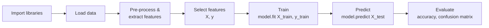
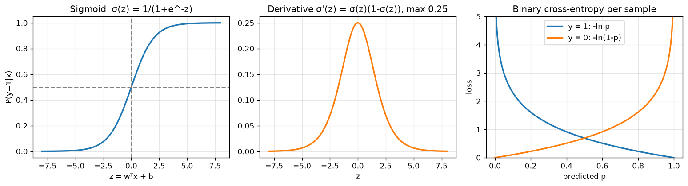
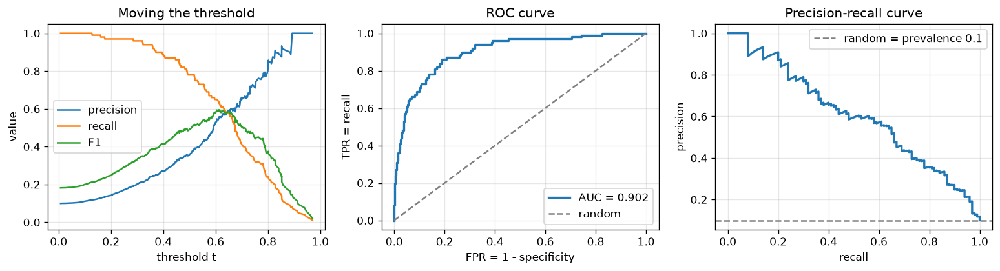

# 02 · The ML Pipeline, Hands-On (Sentiment Demo + Iris)

> **Course:** Machine Learning Paradigms (DS602) · Dr. Sunil Saumya · IIIT Dharwad
>
> **Lecture:** 3 October 2026 (Week 1, 1 h 18 min)
>
> **Sources:** Oct 3 class transcript, Colab demo shown in class, first slides of `MLP_Unit_1_Supervised_Learning_Regression.pdf` (supervised learning definition)
>
> **Notebooks:** [`code/02_ml_pipeline_hands_on.ipynb`](code/02_ml_pipeline_hands_on.ipynb) re-creates the class demo, the iris demo and a solution to the `load_digits` homework. [`code/02_pipeline_deep_dive.ipynb`](code/02_pipeline_deep_dive.ipynb) runs the same pipeline on 2,000 real movie reviews (TF-IDF, cross-validation, ROC/PR, thresholds, leakage, logistic regression from scratch); see [Section 22](#22-deep-dive-notebook-real-sentiment-classification-).
>
> **Deep-dive sections (15–23)** add the theory and proofs behind the demo (logistic regression, metrics, ROC/AUC, cross-validation, leakage, scaling, TF-IDF), worked examples, case studies, and a 25-problem practice bank (Section 27).

---

## 📌 Table of Contents

1. [Big Picture](#1-big-picture)
2. [Toolkit: The Python Libraries](#2-toolkit-the-python-libraries-)
3. [Step 1: Data](#3-step-1-data-)
4. [Step 2: Feature Extraction (Hand-Crafted)](#4-step-2-feature-extraction-hand-crafted-)
5. [Feature Selection & Pearson Correlation](#5-feature-selection--pearson-correlation-)
6. [Step 3: Training (fit)](#6-step-3-training-fit-)
7. [Step 4: Testing (predict)](#7-step-4-testing-predict-)
8. [Step 5: Evaluation: Accuracy & Confusion Matrix](#8-step-5-evaluation-accuracy--confusion-matrix-)
9. [Decision Boundary](#9-decision-boundary-)
10. [Supervised Learning: Formal Definition](#10-supervised-learning-formal-definition-)
11. [Iris Demo: Full Pipeline with train_test_split](#11-iris-demo-full-pipeline-with-train_test_split-)
12. [Random Seed & Reproducibility](#12-random-seed--reproducibility-)
13. [Training vs Fine-tuning](#13-training-vs-fine-tuning-)
14. [Homework: load_digits](#14-homework-load_digits-)
15. [Logistic Regression: Theory and Proofs](#15-logistic-regression-theory-and-proofs-)
16. [Classification Metrics in Depth](#16-classification-metrics-in-depth-)
17. [ROC, AUC, PR Curves and Choosing the Threshold](#17-roc-auc-pr-curves-and-choosing-the-threshold-)
18. [Train/Validation/Test, Cross-Validation and Leakage](#18-trainvalidationtest-cross-validation-and-leakage-)
19. [Feature Scaling: The Maths](#19-feature-scaling-the-maths-)
20. [Text as Numbers: Bag-of-Words and TF-IDF](#20-text-as-numbers-bag-of-words-and-tf-idf-)
21. [Worked Examples](#21-worked-examples-)
22. [Deep-Dive Notebook: Real Sentiment Classification](#22-deep-dive-notebook-real-sentiment-classification-)
23. [Real-World Case Studies](#23-real-world-case-studies-)
24. [Professor Emphasised](#24--professor-emphasised)
25. [Common Confusions](#25--common-confusions)
26. [Exam / Interview Questions](#26--exam--interview-questions)
27. [Practice Problems](#27--practice-problems)
28. [Cheat Sheet](#28--cheat-sheet)
29. [Go Deeper: Curated Links](#29--go-deeper-curated-links)

---

## 1. Big Picture

Last class was theory: what ML is and what the paradigms are. This class ran **one complete ML pipeline end-to-end** before learning any algorithm in depth, so that every later topic fits into a familiar frame.



> *"This is the pipeline we are going to follow all the time."* — Every hands-on in this course (at least the conventional ML ones) will repeat these steps with a different dataset or algorithm.

---

## 2. Toolkit: The Python Libraries 🟢

| Library | Used for | In the demo |
|---|---|---|
| **pandas** | Tabular data as a `DataFrame` | Holding reviews + features |
| **NumPy** | Arrays and maths | Model input (`.values`) |
| **matplotlib / seaborn** | Plots | Decision boundary, t-SNE plot |
| **scikit-learn** (`sklearn`) | ML algorithms, datasets, metrics | `LogisticRegression`, `accuracy_score`, `confusion_matrix`, `load_iris`, `train_test_split`, `StandardScaler` |
| **NLTK** | Natural Language Toolkit (text processing) | `word_tokenize`, `pos_tag` |

**Philosophy (professor):** first understand the **maths** of an algorithm; after that, use the **library**. Re-writing from scratch is good for understanding but not required. (These notes give from-scratch code too, for understanding.)

**`import` vs `nltk.download` (asked in class):**

- `import nltk` loads the *library code*.
- `nltk.download("punkt")` downloads *data/model files* the library needs (a tokenizer model, a POS-tagger model). Colab doesn't ship these by default, so you download them once per session or you get a `LookupError`.

```python
nltk.download("punkt"); nltk.download("punkt_tab")      # tokenizer
nltk.download("averaged_perceptron_tagger_eng")         # English part-of-speech tagger
```

**Is a DataFrame required for ML?** No. It is only a convenient **table representation** for humans. It has nothing to do with ML itself. Models take **arrays** (hence `.values`). The 0, 1, 2… index column is added by pandas and is not part of your data.

---

## 3. Step 1: Data 🟢

The training data is created inline as a Python dict → DataFrame:

| review_text | votes | rating | label |
|---|---|---|---|
| Worst product ever, broke in a day. | 3 | 1.0 | 0 |
| Absolutely love it! Works perfectly as expected. | 15 | 5.0 | 1 |
| Decent quality, but overpriced. | 5 | 3.0 | 0 |
| Amazing value for money, very satisfied. | 20 | 5.0 | 1 |
| Late delivery and poor support. | 4 | 2.0 | 0 |

- `votes` and `rating` are already numbers → no processing needed.
- `review_text` is **unstructured text** → the machine can't use it directly → **feature extraction**.

---

## 4. Step 2: Feature Extraction (Hand-Crafted) 🟢→🟡

### Why hand-crafted features? A bit of history

| Era | Data size | How features were made |
|---|---|---|
| Before ~2010 | Hundreds of rows | **Domain experts** design features (linguists for text, doctors for medical data) |
| Now (deep learning) | Millions to trillions of rows | Raw data → **vector/embedding**, and the network learns features automatically |

Manual features don't scale to huge data ("it will take years"), but they are great for **understanding** what a model sees. That's why the class started with them.

### The three features

| Feature | How it's computed |
|---|---|
| `word_count` | `len(x.split())`: split on whitespace, count pieces |
| `noun_count` | Tokenise → POS-tag → count tags starting with `NN` |
| `verb_count` | Tokenise → POS-tag → count tags starting with `VB` |

### Concepts used

**Tokenisation** splits text into units (tokens). `word_tokenize("John's big idea")` → `['John', "'s", 'big', 'idea']`. Note that `'s` became its own token: a tokenizer is smarter than `.split()`. LLMs also use tokenizers (sub-word tokens).

**POS (Part-of-Speech) tagging** labels each token with its grammatical role (Penn Treebank tagset):

```text
pos_tag(word_tokenize("John's big idea isn't all that bad."))
[('John','NNP'), ("'s",'POS'), ('big','JJ'), ('idea','NN'), ('is','VBZ'),
 ("n't",'RB'), ('all','PDT'), ('that','DT'), ('bad','JJ'), ('.','.')]
```

| Tag | Meaning | Tag | Meaning |
|---|---|---|---|
| NN | noun, singular | VB | verb, base form |
| NNS | noun, plural | VBD | verb, past tense |
| NNP | proper noun | VBZ | verb, 3rd person singular present ("is") |
| JJ | adjective | RB | adverb |
| DT | determiner | PDT | pre-determiner |

> 💡 Using `tag.startswith("NN")` catches **all** noun tags (NN, NNS, NNP, NNPS). Checking only one tag such as `NNP` would miss common nouns.

**Lambda functions:** `df["review_text"].apply(lambda x: len(x.split()))`

- `lambda x: <expr>` is a small **anonymous function**: input on the left of `:`, output on the right.
- `.apply` runs it on **every row** of the column, one at a time (it acts like an iterator).

```python
def add_features(df):
    df["word_count"] = df["review_text"].apply(lambda x: len(x.split()))
    df["noun_count"] = df["review_text"].apply(
        lambda x: sum(1 for _, tag in pos_tag(word_tokenize(x)) if tag.startswith("NN")))
    df["verb_count"] = df["review_text"].apply(
        lambda x: sum(1 for _, tag in pos_tag(word_tokenize(x)) if tag.startswith("VB")))
    return df
```

Result (from the notebook; NLTK versions may differ slightly):

| review | word_count | noun_count | verb_count | label |
|---|---|---|---|---|
| Worst product ever, broke in a day. | 7 | 3 | 1 | 0 |
| Absolutely love it! Works perfectly as expected. | 7 | 0 | 3 | 1 |
| Decent quality, but overpriced. | 4 | 2 | 1 | 0 |
| Amazing value for money, very satisfied. | 6 | 2 | 1 | 1 |
| Late delivery and poor support. | 5 | 2 | 0 | 0 |

### Features are domain-specific
Asked in class: *"Why nouns and verbs?"* They suit **text**. For **healthcare** records, nouns and verbs are irrelevant; **symptoms**, lab values and age are the features. The domain decides the features.

---

## 5. Feature Selection & Pearson Correlation 🟡

The demo used **only 2 features** (`word_count`, `verb_count`). The choice was **random**, made only for **visual clarity**, because we can plot at most 2-D/3-D. For training you can use all features.

**Q (class):** *Can we try feature combinations and compare?* Yes, but brute force over many features is inefficient. A better first step is to **measure each feature's linear relationship with the target** using the **Pearson correlation coefficient**:

```math
r_{x,y} = \frac{\sum_i (x_i - \bar{x})(y_i - \bar{y})}{\sqrt{\sum_i (x_i - \bar{x})^2}\,\sqrt{\sum_i (y_i - \bar{y})^2}} \in [-1, 1]
```

| r | Meaning |
|---|---|
| ≈ +1 | Strong positive linear relation |
| ≈ −1 | Strong negative linear relation |
| ≈ 0 | No **linear** relation |

Iris example from the notebook (correlation with the target):

```text
petal width   0.957   ← most useful
petal length  0.949
sepal length  0.783
sepal width  -0.427   ← weakest
```

> ⚠️ **Limits (beyond slides):**
>
> - Pearson only detects **linear** relations. $`y = x^2`$ on symmetric data gives $`r \approx 0`$ even though $`y`$ depends completely on $`x`$.
> - Correlation with a **categorical** target is only meaningful when the classes have a natural order or for binary 0/1.
> - Two features can be useless alone but powerful together (XOR-like).
> - Better tools: mutual information, model-based importance, L1 regularisation, recursive feature elimination ([scikit-learn feature selection](https://scikit-learn.org/stable/modules/feature_selection.html)).
> - Notice the same numerator, $`\sum (x_i-\bar{x})(y_i - \bar{y})`$, as in the **OLS slope** in [Note 03](03-Supervised-Learning-Regression.md). The two are linked: $`m = r \cdot \frac{s_y}{s_x}`$.

---

## 6. Step 3: Training (fit) 🟢

```python
FEATURES = ["word_count", "verb_count"]
X_train = train_df[FEATURES].values    # input  → 2-D array, shape (n_samples, n_features)
y_train = train_df["label"].values     # output → 1-D array, shape (n_samples,)

model = LogisticRegression()
model.fit(X_train, y_train)            # learn from BOTH inputs and labels
```

- **Rows = data points (samples), columns = features.** Keep this convention in mind for everything.
- `X` (capital) = feature matrix; `y` (small) = label vector. This is the standard naming.
- Labels are given, so this is **supervised**. Labels are categorical (0/1), so it is **classification**.

### "Logistic *regression*" does classification?! (asked in class)
Yes, it is a **classification** algorithm. Internally it computes a **probability** with the sigmoid function, and a **threshold** (0.5) turns that probability into a class:

```math
P(y=1 \mid x) = \sigma(w^\top x + b) = \frac{1}{1 + e^{-(w^\top x + b)}}, \qquad \hat{y} = \begin{cases}1 & P \ge 0.5\\ 0 & \text{otherwise}\end{cases}
```

The name says "regression" because it **regresses the log-odds** linearly: $`\log\frac{P}{1-P} = w^\top x + b`$. The derivation of the sigmoid from the log-odds, the cross-entropy loss and its gradient are in [Section 15](#15-logistic-regression-theory-and-proofs-).

```text
From the notebook: weights = [0.382, 0.650], bias = -3.453
→ P(positive) = σ(0.382·word_count + 0.650·verb_count − 3.453)
```

---

## 7. Step 4: Testing (predict) 🟢

**Rule 1: Same pipeline on test data.** Apply the *exact same* feature extraction and the *same chosen features* used in training. A model trained on `[word_count, verb_count]` cannot accept `[noun_count, rating]`. It would error out, or silently give nonsense.

**Rule 2: Never feed test labels to the model.** In reality, test data is **future data**, such as tomorrow's reviews, so it has no labels. We keep labels for our test set **only to evaluate**.

```python
y_pred = model.predict(X_test)          # inputs ONLY (compare: fit(X, y) used both)
```

| | `fit` | `predict` |
|---|---|---|
| Phase | Training | Testing / inference |
| Receives | `X_train` **and** `y_train` | `X_test` only |
| Returns | Trained model | Predicted labels |

The labels must be in the **same format** as during training (0/1 vs True/False) for comparison. Logistic regression outputs a probability and **thresholds** it into 0/1 (`model.predict_proba` shows the raw probabilities).

---

## 8. Step 5: Evaluation: Accuracy & Confusion Matrix 🟢→🟡

### Class result
The model predicted `1 0 1 0 0` against true `0 1 0 1 0`. Only the last one was right, so **accuracy = 1/5 = 20%**. (The notebook's re-creation, with different test reviews, gives 40%.)

### Accuracy

```math
\text{Accuracy} = \frac{\text{\# correct predictions}}{\text{\# total predictions}}
```
Manual counting works for 5 rows; for thousands, use `accuracy_score(y_test, y_pred)`.

### Confusion matrix: *where* is the model wrong?
For binary labels, the four outcomes are:

| | **Predicted 0 (neg)** | **Predicted 1 (pos)** |
|---|---|---|
| **Actual 0 (neg)** | **TN** (true negative) ✅ | **FP** (false positive) ❌ *false alarm* |
| **Actual 1 (pos)** | **FN** (false negative) ❌ *miss* | **TP** (true positive) ✅ |

> ⚠️ **Layout warning:** scikit-learn's `confusion_matrix(y_true, y_pred)` puts **rows = actual, columns = predicted**, with classes in sorted order. For labels `[0, 1]` that gives `[[TN, FP], [FN, TP]]`, so **top-left is TN, not TP**. Many textbooks put TP top-left (positive class first). In class the top-left cell was called "true positive"; for the sklearn output, read it as TN. Always check the axis labels.

### 🔴 Accuracy can lie: the majority-class trap
In the notebook's TF-IDF challenge, the model predicted **all 0** and still scored **60%**, because 3 of the 5 test reviews were negative. On imbalanced data (fraud is 0.1% of transactions), "always predict not-fraud" gives 99.9% accuracy and is useless. That's why we need **precision, recall and F1** (full treatment in [Section 16](#16-classification-metrics-in-depth-), worked numbers in [WE1](#we1-all-metrics-from-three-confusion-matrices)):

```math
\text{Precision} = \frac{TP}{TP+FP}, \quad \text{Recall} = \frac{TP}{TP+FN}, \quad F_1 = \frac{2PR}{P+R}
```

---

## 9. Decision Boundary 🟡

A classifier divides the feature space into **regions**, one per class. The border between them is the **decision boundary**.

- For logistic regression the boundary is a **straight line** (a hyperplane in higher dimensions): $`w_1 x_1 + w_2 x_2 + b = 0`$.
- In the class plot: circles were training points, crosses were test points, and the background was shaded red/blue by predicted class.
- **Ideal model:** every red point sits in the red region and every blue point in the blue region.
- **Class result:** red and blue points were mixed in the same regions, so the model makes errors (20% accuracy).

**Why so poor?** Only **5 training examples**, and **word count and verb count carry almost no sentiment information**. "Worst product ever" and "Amazing value for money" have similar lengths. Better features (the words themselves, embeddings) and much more data are needed.

### Multi-class boundaries (Iris)
With 3 classes, one line can't separate all three. You need **multiple boundaries**: one line splits class A from B and C, another splits B from C. sklearn's `LogisticRegression` handles multi-class with a softmax (multinomial) formulation by default.

---

## 10. Supervised Learning: Formal Definition 🟢

From the regression deck:

- Given input–output pairs with labels.
- **Input:** $`X = \{\bar{x}_1, \bar{x}_2, \dots, \bar{x}_N\}`$; **Output:** $`Y = \{\bar{y}_1, \bar{y}_2, \dots, \bar{y}_N\}`$
- $`(\bar{x}_i, \bar{y}_i)`$ form a **pair**. In layman's terms, this is a **labelled dataset**.
- Each $`\bar{x}_i`$ is **one row (sample)**, which is itself a vector of features (hence the bar).
- We use this input–output relationship to **train** a model.
- **Rule:** *if a labelled dataset is available, go for supervised learning.*

Mathematically, we want to learn a function $`f`$ such that $`f(\bar{x}_i) \approx \bar{y}_i`$ and, crucially, $`f(\bar{x}_{new}) \approx \bar{y}_{new}`$ on **unseen** data (generalisation).

| | Regression | Classification |
|---|---|---|
| Output type | Continuous number | Discrete category |
| Example from class | Predict **votes** a review gets | Predict **sentiment** 0/1 |
| Other examples | House price, temperature, salary | Spam/not, disease/healthy, digit 0–9 |
| Typical loss | Mean squared error | Cross-entropy (log loss) |
| Typical metric | MSE, RMSE, MAE, R² | Accuracy, precision, recall, F1 |

➡️ Regression in depth: [Note 03](03-Supervised-Learning-Regression.md).

---

## 11. Iris Demo: Full Pipeline with train_test_split 🟢→🟡

### The dataset

- Introduced by **R. A. Fisher (1936)**, a British statistician and biologist. It is the "hello world" of classification.
- **150 samples**, **4 features** (sepal length, sepal width, petal length, petal width, all in cm), **3 classes** (*setosa*, *versicolor*, *virginica*), 50 of each.
- Built into scikit-learn: `from sklearn.datasets import load_iris`.
- **Synonyms:** target = label = output.

```python
iris = load_iris()
X, y = iris.data, iris.target          # X: (150, 4), y: values 0/1/2
iris.target_names                      # ['setosa', 'versicolor', 'virginica']
iris.feature_names
```

All features are already numeric, so **no feature extraction** is needed. Labels are categories, so this is **multi-class classification**.

### t-SNE plot: seeing 4-D data in 2-D
The data is 4-dimensional and can't be plotted directly. **t-SNE** (t-distributed Stochastic Neighbour Embedding) maps it to 2-D while trying to keep **neighbours close**. In the plot, *setosa* forms its own island, while *versicolor* and *virginica* sit close together and are harder to separate.

> ⚠️ t-SNE is for **visualisation only**: distances between far-apart clusters and cluster sizes aren't meaningful, and the model doesn't use it. See ["How to use t-SNE effectively"](https://distill.pub/2016/misread-tsne/).

### Pre-processing: StandardScaler (preview)

```math
z = \frac{x - \mu}{\sigma}
```
This puts each feature on a comparable scale (mean 0, std 1). It matters for gradient-based models (see the learning-rate discussion in Note 03). **Fit the scaler on training data only**, then apply it to test data. Otherwise test information "leaks" into training.

### Train/test split

```python
X_train, X_test, y_train, y_test = train_test_split(
    X, y, test_size=0.2, random_state=42, stratify=y)    # 120 train / 30 test
```
- **80/20:** 80% to learn from, 20% held out to evaluate honestly.
- **How it decides (asked in class):** it **shuffles randomly**, then takes the first 80% for training. Shuffling matters because iris is stored sorted by class (50 setosa, then 50 versicolor…). Without shuffling, the test set would contain only *virginica*!
- `stratify=y` (beyond class) keeps the class proportions equal in both sets.
- Result in the notebook: **93.3% accuracy** with logistic regression.

### Common split ratios

| Data size | Typical split |
|---|---|
| Small (hundreds) | 80/20, or better **k-fold cross-validation** |
| Medium | 70/15/15 train/validation/test |
| Huge (millions) | 98/1/1 is enough |

The **validation** set is used to tune choices (hyperparameters, features). The **test** set is touched only once, at the very end. Cross-validation and leakage are covered in [Section 18](#18-trainvalidationtest-cross-validation-and-leakage-).

---

## 12. Random Seed & Reproducibility 🟡

**Q (class):** *What is a seed? Must it be less than 150?*

- Shuffling is random, so each run gives a different split and a slightly different accuracy.
- The **seed** fixes the random number generator's starting point. **Same seed → same "random" sequence → same split → same results.**
- The seed value has **no connection to the number of rows**. `random_state=42` or `random_state=2026` both work for 150 rows. It's just an ID for a particular random sequence.

> 🔍 **Correction of an analogy:** In class the seed was compared to "how many times you shuffle the dice". A more precise picture: a computer's random numbers are **pseudo-random**, produced by a deterministic formula. The seed is the **starting value** of that formula. Same start → identical sequence. It does not control "how much" randomness.

From the notebook:

```text
seed= 0  first test row: [5.8, 2.8, 5.1, 2.4]  accuracy=1.000
seed= 1  first test row: [5.8, 4.0, 1.2, 0.2]  accuracy=0.967
seed=42  first test row: [6.1, 2.8, 4.7, 1.2]  accuracy=1.000
seed=42  first test row: [6.1, 2.8, 4.7, 1.2]  accuracy=1.000   ← identical: reproducible
```
💡 Accuracy changes with the seed, so a single split is a **noisy** estimate. **Cross-validation** averages over several splits.

---

## 13. Training vs Fine-tuning 🟡

| | Training | Fine-tuning |
|---|---|---|
| Starts from | Random / fresh parameters | An **already trained** model |
| When | First | **Always after** at least one round of training |
| Example | Train sentiment model on pos/neg | Adapt it to also predict **neutral** using new labelled data |

A model trained only on positive/negative will **never** output "neutral". It has never seen that class. Fine-tuning on new data teaches it. (Week 7: Transfer Learning.)

---

## 14. Homework: load_digits 🟢

> *"Practise this notebook, then repeat the same pipeline with `load_digits` (or any other sklearn dataset)."*

**About the dataset:** 1,797 images of handwritten digits 0–9, each **8×8 pixels** → flattened to **64 features** (pixel intensities 0–16). 10 classes. People write digits in their own styles, and the model must recognise them anyway.

**Steps:** swap `load_iris` for `load_digits` and keep everything else the same. Try it yourself first. The full solution is in Part C of the notebook.

**Notebook solution:** logistic regression with StandardScaler → **≈97.2% accuracy**. The notebook also shows which digits were confused. With seed 42, most errors are 8 ↔ 1 (6 of the 10 mistakes).

**Extensions to try:**

1. Swap `LogisticRegression` for `KNeighborsClassifier` or `SVC` and compare.
2. Train on only 10% of the data. How does accuracy change?
3. Plot the misclassified images. Would *you* have got them right?

---

## 15. Logistic Regression: Theory and Proofs 🟡→🔴

Section 6 used logistic regression as a black box. This section opens the box. Everything here is standard textbook material (Jurafsky & Martin, Ch. "Logistic Regression"; Bishop, Ch. 4); the full lecture treatment comes in the classification unit, so the proofs are marked 🔴 where they go beyond what was shown in class.

### 15.1 From probability to log-odds

A probability $`p \in (0, 1)`$ cannot be modelled directly by a linear function $`w^\top x + b`$, because a line takes every value in $`(-\infty, \infty)`$. Two transformations stretch $`p`$ onto the whole real line:

1. **Odds:** $`\text{odds} = \frac{p}{1-p} \in (0, \infty)`$. A probability of 0.8 is odds of 4 ("4 to 1").
2. **Log-odds (logit):** $`\text{logit}(p) = \ln\frac{p}{1-p} \in (-\infty, \infty)`$. For $`p = 0.8`$, $`\ln 4 = 1.3863`$; for $`p = 0.2`$, $`\ln 0.25 = -1.3863`$ (symmetric).

**Modelling assumption.** The log-odds of the positive class is linear in the features:

```math
\ln\frac{p}{1-p} = w^\top x + b = z
```

**Derivation of the sigmoid.** Solve for $`p`$:

```math
\begin{aligned}
\frac{p}{1-p} &= e^{z} \\
p &= e^{z}(1-p) = e^{z} - p\,e^{z} \\
p\,(1 + e^{z}) &= e^{z} \\
p &= \frac{e^{z}}{1+e^{z}} = \frac{1}{1+e^{-z}} = \sigma(z)
\end{aligned}
```

So the sigmoid is not an arbitrary "squashing" choice: it is exactly the inverse of the logit. This is why the method is called logistic **regression**: it is a linear regression on the log-odds scale.

**Interpreting a weight.** Raise feature $`x_j`$ by 1 with everything else fixed. The log-odds rise by $`w_j`$, so the odds are **multiplied by** $`e^{w_j}`$. In the class demo, $`w_{\text{verb}} = 0.650`$ gives $`e^{0.650} = 1.9155`$: each extra verb nearly doubles the odds of "positive". $`w_{\text{word}} = 0.382`$ gives a factor $`e^{0.382} = 1.4652`$ per extra word. (With 5 training rows these weights mean nothing about English; the interpretation rule is what matters.)

### 15.2 Properties of the sigmoid



| Property | Statement | Why it matters |
|---|---|---|
| Range | $`0 < \sigma(z) < 1`$ | Output is a valid probability |
| Midpoint | $`\sigma(0) = 0.5`$ | Threshold 0.5 ⇔ $`z = 0`$ |
| Symmetry | $`\sigma(-z) = 1 - \sigma(z)`$ | $`P(y=0)`$ has the same form |
| Monotone | $`z_1 < z_2 \Rightarrow \sigma(z_1) < \sigma(z_2)`$ | Ranking by $`z`$ = ranking by $`p`$ (so ROC-AUC is the same for both) |
| Derivative | $`\sigma'(z) = \sigma(z)\,(1-\sigma(z)) \le 0.25`$ | Makes the gradient of the loss very simple |

**Proof of the derivative.**

```math
\sigma'(z) = \frac{d}{dz}\,(1+e^{-z})^{-1} = \frac{e^{-z}}{(1+e^{-z})^2} = \underbrace{\frac{1}{1+e^{-z}}}_{\sigma(z)}\cdot\underbrace{\frac{e^{-z}}{1+e^{-z}}}_{1-\sigma(z)}
```

The second factor is $`1 - \sigma(z)`$ because $`1 - \frac{1}{1+e^{-z}} = \frac{e^{-z}}{1+e^{-z}}`$. The product $`s(1-s)`$ is maximised at $`s = 0.5`$, giving 0.25.

**Proof of the symmetry.** $`1 - \sigma(z) = \frac{e^{-z}}{1+e^{-z}} = \frac{1}{e^{z}+1} = \sigma(-z)`$ (multiply top and bottom by $`e^{z}`$).

### 15.3 The decision boundary is a hyperplane

Because $`\sigma`$ is monotone with $`\sigma(0) = 0.5`$:

```math
\hat{y} = 1 \iff \sigma(w^\top x + b) \ge 0.5 \iff w^\top x + b \ge 0
```

The set $`\{x : w^\top x + b = 0\}`$ is a line in 2-D, a plane in 3-D, a **hyperplane** in general. Three consequences:

- **Any threshold gives a parallel hyperplane.** $`\sigma(z) \ge t \iff z \ge \ln\frac{t}{1-t}`$. Changing $`t`$ shifts the boundary but never rotates or bends it. For $`t = 0.9`$ the boundary is $`w^\top x + b = \ln 9 = 2.1972`$.
- **Confidence grows with distance.** The signed distance from $`x`$ to the boundary is $`\frac{w^\top x + b}{\lVert w\rVert}`$. Far from the boundary $`\lvert z\rvert`$ is large and $`p`$ is near 0 or 1; on the boundary $`p = 0.5`$.
- **Logistic regression cannot draw curved boundaries** in the original features. XOR-shaped data defeats it unless non-linear features (products, squares, n-grams, embeddings) are added. This links back to the class plot: with `word_count` and `verb_count` no straight line separates the 5 reviews.

### 15.4 Binary cross-entropy from maximum likelihood

Each label is a coin flip whose bias depends on $`x`$: $`y_i \sim \text{Bernoulli}(p_i)`$ with $`p_i = \sigma(w^\top x_i + b)`$. The probability of the observed label can be written in one line, because the exponent switches the right factor on:

```math
P(y_i \mid x_i) = p_i^{\,y_i}\,(1-p_i)^{\,1-y_i} \qquad (y_i = 1 \Rightarrow p_i,\quad y_i = 0 \Rightarrow 1-p_i)
```

**Assumption:** the $`n`$ samples are independent. Then the likelihood is a product, and the log turns it into a sum:

```math
\begin{aligned}
L(w,b) &= \prod_{i=1}^{n} p_i^{\,y_i}(1-p_i)^{\,1-y_i} \\
\ln L(w,b) &= \sum_{i=1}^{n} \big[\,y_i \ln p_i + (1-y_i)\ln(1-p_i)\,\big]
\end{aligned}
```

Maximising $`\ln L`$ is the same as minimising its negative average, the **binary cross-entropy (log loss)**:

```math
J(w,b) = -\frac{1}{n}\sum_{i=1}^{n} \big[\,y_i \ln p_i + (1-y_i)\ln(1-p_i)\,\big]
```

**Behaviour of one term.** For a positive example the loss is $`-\ln p`$: 0.1054 at $`p = 0.9`$, 0.6931 at $`p = 0.5`$, 4.6052 at $`p = 0.01`$. Confident mistakes are punished without bound, which is exactly what a probability model should do.

**Why not mean squared error?** With $`p = \sigma(z)`$, the MSE gradient carries an extra factor $`\sigma'(z)`$, which is almost 0 when $`\lvert z\rvert`$ is large. A confidently wrong prediction then learns almost nothing ("vanishing gradient"), and the MSE surface in $`w`$ is not convex. Cross-entropy cancels that factor (next subsection).

### 15.5 The gradient

**Step 1: derivative with respect to z for one sample.** Using $`\frac{dp}{dz} = p(1-p)`$:

```math
\begin{aligned}
\ell &= -\big[y\ln p + (1-y)\ln(1-p)\big] \\
\frac{\partial \ell}{\partial z} &= -\Big[\frac{y}{p} - \frac{1-y}{1-p}\Big]\,p(1-p) = -\big[y(1-p) - (1-y)p\big] = p - y
\end{aligned}
```

**Step 2: chain rule.** Since $`z = w^\top x + b`$, $`\frac{\partial z}{\partial w_j} = x_j`$ and $`\frac{\partial z}{\partial b} = 1`$. Averaging over samples:

```math
\nabla_{w} J = \frac{1}{n}\sum_{i=1}^{n} (p_i - y_i)\,x_i = \frac{1}{n}X^\top(p - y), \qquad \frac{\partial J}{\partial b} = \frac{1}{n}\sum_{i=1}^{n}(p_i - y_i)
```

This is **the same form as linear regression's MSE gradient** (Note 03), with prediction $`p_i`$ in place of $`\hat{y}_i`$: error times input. Each sample pushes $`w`$ in the direction of $`x_i`$, weighted by how wrong it was.

**Gradient descent update** (learning rate $`\eta`$): $`w \leftarrow w - \eta\,\nabla_{w}J`$, $`b \leftarrow b - \eta\,\partial J/\partial b`$. Worked numerically in WE6 below and in notebook Part J (checked against finite differences).

### 15.6 Convexity: one global minimum 🔴

Differentiate the gradient once more. With $`S = \text{diag}\big(p_1(1-p_1), \dots, p_n(1-p_n)\big)`$:

```math
H = \nabla^2_{w} J = \frac{1}{n}X^\top S X, \qquad v^\top H v = \frac{1}{n}\sum_{i=1}^{n} p_i(1-p_i)\,(x_i^\top v)^2 \ \ge 0 \quad \text{for every } v
```

Every term is a non-negative weight times a square, so $`H`$ is positive semi-definite and $`J`$ is **convex**. Hence any point where the gradient is zero is a global minimum, and gradient descent with a small enough step cannot get stuck in a bad local minimum. Notebook Part L confirms this: plain gradient descent and scikit-learn's L-BFGS solver reach the same intercept (0.3432) and weights that agree to about 0.01, with identical test accuracy (0.9591).

### 15.7 Why there is no closed-form solution 🔴

For linear regression, setting the gradient to zero gives linear equations, $`X^\top X w = X^\top y`$, solved in one step (normal equation, Note 03). For logistic regression the stationarity condition is

```math
\sum_{i=1}^{n}\big(\sigma(w^\top x_i + b) - y_i\big)\,x_i = 0
```

and $`w`$ sits inside the non-linear $`\sigma`$ in every term. There is no algebraic way to isolate $`w`$, so the minimum is found **iteratively**: gradient descent, Newton's method (which for this loss is called IRLS, iteratively re-weighted least squares, $`w \leftarrow w - H^{-1}\nabla J`$), or quasi-Newton methods such as L-BFGS (scikit-learn's default `solver="lbfgs"`).

### 15.8 Separable data: the weights run away 🔴

**Claim.** If some $`(w, b)`$ classifies every training point correctly, the unregularised loss has **no minimiser**; its infimum is 0 and is approached only as $`\lVert w\rVert \to \infty`$.

**Proof.** Write labels as $`s_i = 2y_i - 1 \in \{-1, +1\}`$; then the per-sample loss is $`\ln(1 + e^{-s_i z_i})`$. Perfect separation means the margins $`m_i = s_i(w^\top x_i + b)`$ are all positive. Scaling the parameters by $`c > 1`$ gives loss $`\frac{1}{n}\sum_i \ln(1 + e^{-c\,m_i})`$, which is strictly decreasing in $`c`$ and tends to 0 as $`c \to \infty`$. Every candidate is beaten by a larger multiple of itself, so no finite minimiser exists. ∎

In practice the solver stops at a huge $`\lVert w\rVert`$ and outputs probabilities of exactly 0 or 1. Text data with 100,000+ TF-IDF features is almost always separable, which is one reason regularisation is on by default.

### 15.9 Regularisation and the parameter C

scikit-learn minimises (L2 penalty, the default):

```math
\min_{w,b}\ \frac{1}{2}\lVert w\rVert^2 + C\sum_{i=1}^{n}\ln\!\big(1 + e^{-s_i(w^\top x_i + b)}\big)
```

- $`C`$ is the **inverse** regularisation strength. Small $`C`$: the penalty dominates, weights are pulled toward 0, the model is simpler (risk of underfitting). Large $`C`$: the data term dominates (risk of overfitting).
- The penalty makes the objective **strictly convex**, so the minimiser exists and is unique even for separable data (fixes 15.8).
- `penalty="l1"` uses $`\lVert w\rVert_1`$ instead and drives many weights exactly to 0, which performs feature selection (beyond syllabus here).
- $`C`$ is a hyperparameter, so it is chosen by cross-validation. Notebook Part C on movie reviews: $`C = 0.1, 1, 10, 100`$ gives mean CV accuracy 0.8387, 0.8588, 0.8738, 0.8781.
- 🔴 Bayesian reading: L2 regularisation is maximum a posteriori estimation with a Gaussian prior on $`w`$.

### 15.10 More than two classes (preview)

With $`K`$ classes, each class gets its own score $`z_k = w_k^\top x + b_k`$, and the **softmax** turns scores into probabilities: $`P(y = k \mid x) = \frac{e^{z_k}}{\sum_{j} e^{z_j}}`$. The loss becomes categorical cross-entropy, $`-\ln P(y = \text{true class} \mid x)`$. For $`K = 2`$ softmax reduces to the sigmoid of $`z_1 - z_0`$. This is what `LogisticRegression` did on iris (Section 11).

---

## 16. Classification Metrics in Depth 🟡

### 16.1 Every metric from four counts

All binary metrics below are ratios of the four cells $`TP, FP, FN, TN`$ ($`n`$ = total, $`P = TP + FN`$ actual positives, $`N = FP + TN`$ actual negatives).

| Metric (synonyms) | Formula | Question it answers |
|---|---|---|
| Accuracy | $`\frac{TP+TN}{n}`$ | What fraction of all predictions are right? |
| Precision (PPV) | $`\frac{TP}{TP+FP}`$ | When the model says "positive", how often is it right? |
| Recall (sensitivity, TPR, hit rate) | $`\frac{TP}{TP+FN}`$ | Of the real positives, how many did we catch? |
| Specificity (TNR) | $`\frac{TN}{TN+FP}`$ | Of the real negatives, how many did we correctly clear? |
| False positive rate (fall-out) | $`\frac{FP}{FP+TN} = 1 - \text{spec}`$ | How often is a negative raised as an alarm? |
| Negative predictive value | $`\frac{TN}{TN+FN}`$ | When the model says "negative", how often is it right? |
| F1 | $`\frac{2PR}{P+R} = \frac{2TP}{2TP+FP+FN}`$ | One number balancing precision and recall |
| F-beta | $`\frac{(1+\beta^2)PR}{\beta^2P+R}`$ | Like F1, but recall counts $`\beta`$ times as much |
| Balanced accuracy | $`\frac{\text{recall} + \text{specificity}}{2}`$ | Accuracy as if the classes were equally frequent |
| MCC (Matthews) | $`\frac{TP\cdot TN - FP\cdot FN}{\sqrt{(TP+FP)(TP+FN)(TN+FP)(TN+FN)}}`$ | Correlation between prediction and truth, in [−1, 1] |

(In the F-formulas, $`P`$ and $`R`$ are precision and recall.)

**Memory hook.** Precision and recall share the numerator $`TP`$. Precision divides by the **predicted** positives (column of the confusion matrix), recall by the **actual** positives (row).

### 16.2 Why F1 uses the harmonic mean

**Derivation of the count form.** Substitute $`P = \frac{TP}{TP+FP}`$ and $`R = \frac{TP}{TP+FN}`$:

```math
F_1 = \frac{2PR}{P+R} = \frac{2\,\frac{TP^2}{(TP+FP)(TP+FN)}}{\frac{TP(TP+FN) + TP(TP+FP)}{(TP+FP)(TP+FN)}} = \frac{2TP}{2TP+FP+FN}
```

So F1 ignores $`TN`$ completely: it is a score about the positive class only.

**Why harmonic?** For positive numbers, harmonic ≤ geometric ≤ arithmetic mean, with equality only when $`P = R`$. The harmonic mean is dragged toward the **smaller** value. A useless "flag everything" classifier on a 1%-positive problem has $`P = 0.01, R = 1`$: arithmetic mean 0.505 (looks fine), F1 $`= \frac{2(0.01)(1)}{1.01} = 0.0198`$ (correctly terrible). Also, F1 is the reciprocal of the average of the reciprocals: $`\frac{1}{F_1} = \frac{1}{2}\big(\frac{1}{P} + \frac{1}{R}\big)`$.

**F-beta.** $`F_\beta = \frac{(1+\beta^2)\,TP}{(1+\beta^2)\,TP + \beta^2 FN + FP}`$. A false negative is weighted $`\beta^2`$ times as much as a false positive. $`F_2`$ suits screening (misses are worse); $`F_{0.5}`$ suits spam filtering (false alarms are worse).

### 16.3 Precision depends on prevalence; recall does not

Let $`\pi`$ = fraction of positives (prevalence). By Bayes' rule,

```math
\text{Precision} = P(y=1 \mid \hat{y}=1) = \frac{\text{recall}\cdot\pi}{\text{recall}\cdot\pi + (1-\text{specificity})(1-\pi)}
```

Recall and specificity are properties of the classifier on each class separately, so they do not change when the class mix changes. Precision mixes the two classes, so the **same classifier** has lower precision when positives become rarer. Example (recall 0.90, specificity 0.95): precision is 0.6667 at $`\pi = 0.10`$, 0.1538 at $`\pi = 0.01`$ and 0.0829 at $`\pi = 0.005`$. This is the base-rate effect behind the medical case study in Section 23.

### 16.4 Multi-class averaging

For $`K`$ classes, compute precision, recall and F1 **per class** (one-vs-rest), then average:

- **Macro:** plain mean over classes. Every class counts equally, so small classes matter.
- **Weighted:** mean weighted by class support.
- **Micro:** pool all TP, FP, FN first. For single-label multi-class problems, micro-F1 = micro-precision = micro-recall = **accuracy** (every wrong prediction is one FP for some class and one FN for another).

`classification_report` prints all of these (see notebook Part D; it also prints per-class rows, where "recall of class neg" is the specificity of class pos).

---

## 17. ROC, AUC, PR Curves and Choosing the Threshold 🟡→🔴

A logistic model outputs a **score** $`p`$. The confusion matrix exists only after a threshold $`t`$ is chosen. Curves summarise **all thresholds at once**.



*Synthetic scores, 900 negatives and 100 positives, produced by `code/figures_02.py`. Raising $`t`$ trades recall for precision; F1 peaks in between. ROC-AUC is 0.902; the PR baseline is the prevalence 0.1.*

### 17.1 ROC curve

Sort samples by score and lower $`t`$ from $`+\infty`$ to $`-\infty`$. At each $`t`$, plot $`(\text{FPR}, \text{TPR})`$. The curve starts at $`(0, 0)`$ (nothing flagged) and ends at $`(1, 1)`$ (everything flagged). Each positive passed moves it **up** by $`1/P`$, each negative moves it **right** by $`1/N`$.

- The diagonal TPR = FPR is a random scorer.
- A perfect scorer goes straight up to $`(0, 1)`$ and then right.
- A curve below the diagonal means the scores are inverted.

### 17.2 AUC equals a ranking probability 🔴

**Theorem.** ROC-AUC = probability that a randomly chosen positive gets a higher score than a randomly chosen negative (ties count ½):

```math
\text{AUC} = \frac{1}{P\cdot N}\sum_{i:\,y_i=1}\ \sum_{j:\,y_j=0}\Big(\mathbb{1}[s_i > s_j] + \tfrac{1}{2}\,\mathbb{1}[s_i = s_j]\Big)
```

**Proof sketch.** The curve moves right by $`1/N`$ exactly once per negative $`j`$. That horizontal step happens at height $`\text{TPR} = \frac{\#\{\text{positives with } s_i > s_j\}}{P}`$, so it adds a rectangle of area $`\frac{1}{N}\cdot\frac{\#\{i : s_i > s_j\}}{P}`$. Summing over all negatives counts the correctly ordered (positive, negative) pairs and divides by $`P\cdot N`$. A tie makes the step diagonal and contributes half a rectangle. ∎

Consequences:

- AUC uses **only the ranking**. Any monotone transform of the scores (for example $`z`$ instead of $`p`$) gives the same AUC. It says nothing about whether the probabilities are calibrated.
- AUC does not depend on prevalence, because TPR and FPR are each computed within one class.
- Notebook Part E verifies the theorem on 400 test reviews: the pairwise count and `roc_auc_score` both give 0.9546.
- In credit scoring the same number is reported as the **Gini coefficient** $`= 2\,\text{AUC} - 1`$.

### 17.3 Precision–recall curve and average precision

Plot precision against recall as $`t`$ varies. The random baseline is a horizontal line at the **prevalence** $`\pi`$ (a random flagger is right $`\pi`$ of the time), not 0.5. **Average precision** summarises it as $`\text{AP} = \sum_k (R_k - R_{k-1})\,P_k`$, the precision at each threshold weighted by the recall gained.

**When to prefer PR over ROC.** When positives are rare, FPR stays tiny even with many false alarms (its denominator $`N`$ is huge), so ROC looks optimistic. Precision exposes those false alarms directly. Notebook Part K: with 9% positive reviews the test ROC-AUC is 0.8668 but AP is only 0.4958.

### 17.4 Choosing the threshold

The threshold is a **decision**, not a property of the model. Four principled ways:

1. **Equal costs, calibrated probabilities:** $`t = 0.5`$ minimises the expected error rate.
2. **Cost-based (derivation).** Let a false negative cost $`C_{FN}`$ and a false positive $`C_{FP}`$ (correct decisions cost 0). For a sample with probability $`p`$ of being positive, predicting "negative" has expected cost $`p\,C_{FN}`$ and predicting "positive" has expected cost $`(1-p)\,C_{FP}`$. Predict positive when it is cheaper:

```math
(1-p)\,C_{FP} < p\,C_{FN} \iff p > t^{*} = \frac{C_{FP}}{C_{FP} + C_{FN}}
```

With $`C_{FN} = 20, C_{FP} = 1`$ (missed disease), $`t^{*} = 1/21 = 0.0476`$. With $`C_{FP} = 10, C_{FN} = 1`$ (real e-mail lost in spam), $`t^{*} = 10/11 = 0.9091`$. Equal costs give 0.5, recovering rule 1.

3. **Constraint-based:** "the lowest threshold that keeps precision ≥ 0.90" (notebook Part F picks $`t = 0.540`$) or "recall ≥ 0.95".
4. **Metric-maximising:** the $`t`$ that maximises F1 or $`F_\beta`$ (notebook Part K picks $`t = 0.2117`$ on 9%-positive data).

**Rule:** choose $`t`$ on **validation or out-of-fold** predictions, never on the test set. The threshold is a hyperparameter, and tuning it on test data is test-set leakage (Section 18.4).

---

## 18. Train/Validation/Test, Cross-Validation and Leakage 🟡

### 18.1 Three sets, three jobs

| Set | Used for | Touched |
|---|---|---|
| Training | Fitting parameters ($`w, b`$; TF-IDF vocabulary and IDF; scaler mean and std) | Many times |
| Validation | Choosing hyperparameters ($`C`$, threshold, features, model family) | Many times |
| Test | One final, unbiased estimate of performance on new data | **Once** |

**Why the test set must be used only once.** Each evaluation is a noisy estimate. If 20 models are compared on the same test set and the best one is reported, the reported score is the *maximum of 20 noisy numbers*, which is biased upward ("winner's curse"). Once a decision has been made by looking at the test score, that set has become a validation set.

### 18.2 k-fold cross-validation

When data is small, a single validation split is wasteful and noisy (Section 12 showed iris accuracy moving from 0.967 to 1.000 with the seed). **k-fold CV** fixes both:

1. Shuffle, then split the training data into $`k`$ equal folds.
2. For $`i = 1, \dots, k`$: train on the other $`k-1`$ folds, evaluate on fold $`i`$, obtaining score $`s_i`$.
3. Report $`\bar{s} = \frac{1}{k}\sum_i s_i`$ and the spread $`\text{sd} = \sqrt{\frac{1}{k}\sum_i (s_i - \bar{s})^2}`$.

Every sample is used for validation exactly once and for training $`k-1`$ times. The cost is $`k`$ model fits. Typical values are $`k = 5`$ or 10; $`k = n`$ is leave-one-out (LOOCV), nearly unbiased but expensive and high-variance.

> 💡 **Two kinds of "std".** scikit-learn's `cv_results_["std_test_score"]` and `np.std` use the population formula (divide by $`k`$). The sample formula divides by $`k-1`$. The *standard error of the mean* is $`\text{sd}/\sqrt{k}`$, smaller still. Fold scores are not independent (training folds overlap), so all of these are rough, but they show whether a 0.5% difference between two models is meaningful (usually not).

### 18.3 Stratified k-fold

Plain k-fold can, by chance, give a fold with very few positives. **Stratified** k-fold splits each class separately so every fold keeps the overall class proportions. With 1,000 samples and 5% positives, an 80/20 stratified split puts exactly 40 positives in training and 10 in test. It is scikit-learn's default for classifiers when `cv` is an integer, and it is essential for imbalanced or small data. Related splitters:

- **GroupKFold:** all rows from one patient, user or product stay in the same fold.
- **TimeSeriesSplit:** always train on the past and validate on the future.
- **Nested CV** 🔴: an inner CV loop tunes hyperparameters, an outer loop estimates the performance of the whole tuning procedure.

### 18.4 A taxonomy of data leakage

**Leakage** = any information at training or model-selection time that will not be available when the model is used for real. It makes validation scores optimistic, sometimes wildly.

| Type | What happens | Example | Fix |
|---|---|---|---|
| Pre-processing leakage | Scaler, imputer or TF-IDF vocabulary/IDF fitted on all data before the split | Test means and stds shape the training inputs | Split first; put pre-processing inside a `Pipeline` |
| Feature-selection leakage | Features chosen using labels of all rows | Notebook Part I-2: pure noise scores 0.880 ± 0.081 instead of the honest 0.520 ± 0.075 | Do selection inside each CV fold |
| Target leakage | A feature is a consequence of the label | "refund_issued" when predicting "complaint"; a lab test ordered only after diagnosis | Ask "would I know this at prediction time?" |
| Temporal leakage | Random split on time-ordered data | Training on next month's prices to predict this month | Out-of-time split, `TimeSeriesSplit` |
| Group/duplicate leakage | The same entity (or a near-copy) appears in train and test | Same patient's scans, reposted reviews | `GroupKFold`, de-duplication |
| Test-set reuse | Hyperparameters or threshold tuned on the test set | Picking the threshold that maximises test F1 | Tune on validation or out-of-fold predictions |

Notebook Part I-1 shows the mild case: scaling before the split changed accuracy on 2 of 20 seeds (mean 0.9749 vs 0.9743), because the mean of feature 0 moved only from 14.1044 (train) to 14.1273 (all rows). The harm is not the size of the difference; it is that the number is no longer an honest estimate. Kapoor and Narayanan (2023) traced leakage in hundreds of published ML papers across many scientific fields.

---

## 19. Feature Scaling: The Maths 🟡

### 19.1 Three scalers

| Scaler | Formula (statistics from **train only**) | Result on train | Robust to outliers? |
|---|---|---|---|
| Standardisation (`StandardScaler`) | $`z = \frac{x - \mu}{\sigma}`$ | Mean 0, std 1 | No (mean and std are pulled by outliers) |
| Min-max (`MinMaxScaler`) | $`x' = \frac{x - x_{\min}}{x_{\max} - x_{\min}}`$ | Range [0, 1] | No (one extreme value squeezes the rest) |
| Robust (`RobustScaler`) | $`x' = \frac{x - \text{median}}{\text{IQR}}`$ | Median 0, IQR 1 | Yes |

**Proof that standardised data has mean 0 and variance 1.** $`\bar{z} = \frac{1}{n}\sum_i\frac{x_i-\mu}{\sigma} = \frac{1}{\sigma}\big(\bar{x} - \mu\big) = 0`$. $`\text{Var}(z) = \frac{1}{n}\sum_i\frac{(x_i-\mu)^2}{\sigma^2} = \frac{\sigma^2}{\sigma^2} = 1`$. (scikit-learn uses the population $`\sigma`$, dividing by $`n`$.)

**Test data can leave the training range.** With min-max fitted on a training range [20, 80], a test value of 95 maps to $`(95-20)/60 = 1.25`$. This is correct behaviour, not a bug: the test set must be transformed with the training parameters.

### 19.2 Why scaling matters for logistic regression

1. **Optimisation.** Gradient descent moves every weight with one learning rate. If one feature is in thousands (income) and another in units (age), the loss surface is a long thin valley and gradient descent zig-zags (same picture as the MSE contours in Note 03). Standardising makes the valley rounder and convergence faster.
2. **Regularisation.** The penalty $`\frac{1}{2}\lVert w\rVert^2`$ treats all weights equally. A feature measured in metres needs a weight 1,000 times larger than the same feature in millimetres, so it would be penalised much more. Scaling makes the penalty unit-free.
3. **Distance-based models** (kNN, SVM with RBF kernel, k-means) are dominated by the feature with the largest numbers unless features are scaled.

### 19.3 An invariance result 🔴

**Claim.** Without regularisation, standardising features does not change logistic regression's predictions (only its weights).

**Proof.** Let $`x'_j = (x_j - \mu_j)/\sigma_j`$. Given any $`(w, b)`$ in original units, define $`w'_j = w_j\sigma_j`$ and $`b' = b + \sum_j w_j\mu_j`$. Then

```math
w'^\top x' + b' = \sum_j w_j\sigma_j\frac{x_j-\mu_j}{\sigma_j} + b + \sum_j w_j\mu_j = \sum_j w_j x_j + b = w^\top x + b
```

Every model in one parametrisation has an exact twin in the other with the same $`z`$ for every input, so the minimum loss and the predictions coincide. ∎ With L2 regularisation the twin has a different penalty ($`\sum_j w_j^2\sigma_j^2`$ instead of $`\sum_j w_j^2`$), so the regularised solutions, and predictions, differ. That is why scaling matters in practice.

**Sparse text features.** TF-IDF matrices are sparse (most entries 0). Subtracting the mean would make every entry non-zero and blow up memory, so text pipelines use **row L2-normalisation** (built into `TfidfVectorizer`) instead of `StandardScaler`, or `StandardScaler(with_mean=False)`.

---

## 20. Text as Numbers: Bag-of-Words and TF-IDF 🟡

The class demo turned a review into 2 numbers (word and verb counts) and scored 20%. The standard first upgrade is to let **every word be a feature**.

### 20.1 Bag-of-words (BoW)

Fix a vocabulary $`V`$ of $`\lvert V\rvert`$ words learnt from the **training** documents. Document $`d`$ becomes a vector in $`\mathbb{R}^{\lvert V\rvert}`$ whose entry for term $`t`$ is the count $`\text{tf}(t, d)`$. Order is thrown away: "not good, bad" and "bad, not good" are identical bags. **n-grams** recover some order by also counting word pairs ("not good", "the best"); notebook Part G shows "the best" and "the worst" among the strongest features.

### 20.2 TF-IDF

Raw counts over-weight words such as "the", "movie" or "film" that appear in almost every review. **Inverse document frequency** down-weights them. With $`N`$ documents and $`\text{df}(t)`$ = number of documents containing $`t`$:

```math
\text{idf}_{\text{classic}}(t) = \ln\frac{N}{\text{df}(t)}, \qquad \text{idf}_{\text{sklearn}}(t) = \ln\frac{1+N}{1+\text{df}(t)} + 1
```

```math
\text{tfidf}(t, d) = \text{tf}(t, d)\cdot\text{idf}(t), \qquad v_d \leftarrow \frac{v_d}{\lVert v_d\rVert_2}
```

**Why each piece is there:**

- **ln N/df:** a term in every document gets $`\ln 1 = 0`$ (it cannot distinguish documents); a rare term gets a large weight. Information-theoretically, $`-\ln\frac{\text{df}}{N}`$ is the "surprise" of seeing the term in a random document.
- **+1 inside (smoothing):** behaves as if one extra document contained every term, so a term with $`\text{df} = 0`$ at transform time cannot cause division by zero.
- **+1 outside:** keeps terms that appear in every document from being zeroed out completely.
- **L2 normalisation:** long and short reviews become comparable, and the dot product of two normalised vectors is their **cosine similarity**.
- **Sublinear tf** (`sublinear_tf=True`): uses $`1 + \ln\text{tf}`$ so that the 10th "great" adds less than the 1st. The notebook uses it.

### 20.3 Limitations

- No meaning: "excellent" and "superb" are unrelated dimensions (embeddings, Week 6+, fix this).
- Negation and sarcasm are only partly handled by bigrams.
- Very high-dimensional and sparse: the notebook vocabulary has 116,452 unigrams and bigrams for 1,600 reviews, so regularisation is essential (Section 15.8).
- The vocabulary is fixed at training time; new slang becomes invisible (out-of-vocabulary).

---

## 21. Worked Examples 🟡

### WE1. All metrics from three confusion matrices

**(a) Balanced, decent model.** $`TP = 40, FN = 10, FP = 5, TN = 45`$, $`n = 100`$.

- Accuracy $`= (40+45)/100 = 0.85`$
- Precision $`= 40/(40+5) = 40/45 = 0.8889`$
- Recall $`= 40/(40+10) = 0.80`$
- Specificity $`= 45/(45+5) = 0.90`$; FPR $`= 0.10`$
- F1 $`= \frac{2\cdot 40}{2\cdot 40 + 5 + 10} = 80/95 = 0.8421`$
- $`F_2 = \frac{5\,(0.8889)(0.80)}{4(0.8889) + 0.80} = \frac{3.5556}{4.3556} = 0.8163`$ (pulled toward recall, the lower value); $`F_{0.5} = 0.8696`$ (pulled toward precision)
- Balanced accuracy $`= (0.80 + 0.90)/2 = 0.85`$; MCC $`= \frac{40\cdot45 - 5\cdot10}{\sqrt{45\cdot50\cdot50\cdot55}} = \frac{1750}{2487.5} = 0.7035`$

*Sanity check:* classes are balanced (50/50), so accuracy and balanced accuracy agree, as they should.

**(b) The class demo.** True `[0,1,0,1,0]`, predicted `[1,0,1,0,0]`: $`TP = 0, FN = 2, FP = 2, TN = 1`$.

- Accuracy $`= 1/5 = 0.20`$; precision $`= 0/2 = 0`$; recall $`= 0/2 = 0`$; F1 $`= 0`$
- Specificity $`= 1/3 = 0.3333`$; balanced accuracy $`= (0 + 0.3333)/2 = 0.1667`$
- MCC $`= \frac{0\cdot 1 - 2\cdot 2}{\sqrt{2\cdot 2\cdot 3\cdot 3}} = \frac{-4}{6} = -0.6667`$

*Sanity check:* negative MCC and balanced accuracy below 0.5 mean the model is **worse than random**; flipping its outputs would score 0.8. With 5 training rows and uninformative features this is noise, not a systematic inversion.

**(c) Imbalanced: fraud detection.** 1,000 transactions, 10 frauds. $`TP = 8, FN = 2, FP = 40, TN = 950`$.

- Accuracy $`= 958/1000 = 0.958`$, which is *lower* than the 0.990 of "always predict not-fraud"
- Precision $`= 8/48 = 0.1667`$: only 1 alert in 6 is real
- Recall $`= 8/10 = 0.80`$; specificity $`= 950/990 = 0.9596`$
- F1 $`= \frac{16}{16 + 40 + 2} = 16/58 = 0.2759`$; $`F_2 = 0.4545`$; $`F_{0.5} = 0.1980`$
- Balanced accuracy $`= (0.80 + 0.9596)/2 = 0.8798`$; MCC $`= 0.3536`$

*Sanity check:* the trivial "never fraud" model has accuracy 0.990 but recall 0, balanced accuracy 0.5 and undefined F1/MCC. Our model is far more useful despite lower accuracy. Accuracy ranks them the wrong way round. (All values checked in notebook Part M.)

### WE2. Sigmoid predictions with the class-demo weights

$`w = (0.382, 0.650)`$ for (`word_count`, `verb_count`), $`b = -3.453`$.

| Review (wc, vc) | $`z = 0.382\,wc + 0.650\,vc - 3.453`$ | $`p = \sigma(z)`$ | $`\hat{y}`$ | True |
|---|---|---|---|---|
| (7, 1) | 2.674 + 0.650 − 3.453 = −0.129 | 0.4678 | 0 | 0 |
| (7, 3) | 2.674 + 1.950 − 3.453 = 1.171 | 0.7633 | 1 | 1 |
| (4, 1) | 1.528 + 0.650 − 3.453 = −1.275 | 0.2184 | 0 | 0 |
| (6, 1) | 2.292 + 0.650 − 3.453 = −0.511 | 0.3750 | 0 | 1 |
| (5, 0) | 1.910 + 0 − 3.453 = −1.543 | 0.1761 | 0 | 0 |

Training accuracy = 4/5. **Decision boundary:** $`0.382\,wc + 0.650\,vc = 3.453`$, i.e. $`vc = (3.453 - 0.382\,wc)/0.650`$. For a 7-word review, $`vc > 0.779/0.650 = 1.1985`$, so it needs at least 2 verbs to be called positive.

*Sanity check:* the first row has $`z`$ just below 0 and $`p`$ just below 0.5, consistent with $`\sigma(0) = 0.5`$. The model is essentially "long and verb-rich ⇒ positive", which explains its 20% on the class test set.

### WE3. TF-IDF by hand (3 documents)

Corpus: $`d_1`$ = "good movie good plot", $`d_2`$ = "bad movie", $`d_3`$ = "good acting bad plot". $`N = 3`$. Vocabulary (alphabetical): acting, bad, good, movie, plot.

**Step 1: document frequencies.** acting 1; bad 2; good 2; movie 2; plot 2.

**Step 2: IDF (scikit-learn smooth).** $`\text{idf}(\text{acting}) = \ln\frac{4}{2} + 1 = 0.6931 + 1 = 1.6931`$; every other term $`= \ln\frac{4}{3} + 1 = 0.2877 + 1 = 1.2877`$. (Classic IDF would give $`\ln 3 = 1.0986`$ and $`\ln 1.5 = 0.4055`$.)

**Step 3: tf × idf.** $`d_1`$ has good ×2, movie ×1, plot ×1:

```math
\begin{aligned}
d_1 &: (0,\ 0,\ 2\times1.2877,\ 1.2877,\ 1.2877) = (0,\ 0,\ 2.5754,\ 1.2877,\ 1.2877)\\
d_2 &: (0,\ 1.2877,\ 0,\ 1.2877,\ 0)\\
d_3 &: (1.6931,\ 1.2877,\ 1.2877,\ 0,\ 1.2877)
\end{aligned}
```

**Step 4: L2 norms.** $`\lVert d_1\rVert = \sqrt{2.5754^2 + 1.2877^2 + 1.2877^2} = \sqrt{6.6327 + 1.6582 + 1.6582} = 3.1542`$; $`\lVert d_2\rVert = 1.2877\sqrt{2} = 1.8211`$; $`\lVert d_3\rVert = \sqrt{1.6931^2 + 3(1.2877^2)} = 2.8002`$.

**Step 5: normalise.**

| | acting | bad | good | movie | plot |
|---|---|---|---|---|---|
| $`d_1`$ | 0 | 0 | 0.8165 | 0.4082 | 0.4082 |
| $`d_2`$ | 0 | 0.7071 | 0 | 0.7071 | 0 |
| $`d_3`$ | 0.6047 | 0.4599 | 0.4599 | 0 | 0.4599 |

*Sanity checks:* each row has length 1 (e.g. $`0.8165^2 + 2(0.4082^2) = 1.000`$). "acting", the rarest word, gets the largest weight in $`d_3`$. Cosine similarities: $`d_1\cdot d_3 = 0.5632`$ (share "good", "plot"), $`d_1\cdot d_2 = 0.2887`$ (share only "movie"). Matches `TfidfVectorizer` exactly (notebook Part B).

### WE4. Standardisation and min-max scaling

Training feature: $`x = (2, 4, 4, 4, 5, 5, 7, 9)`$.

- Mean $`\mu = 40/8 = 5`$.
- Squared deviations: 9, 1, 1, 1, 0, 0, 4, 16; sum 32; population variance $`32/8 = 4`$; $`\sigma = 2`$. (Sample std $`= \sqrt{32/7} = 2.1381`$; `StandardScaler` uses 2.)
- $`z = (x - 5)/2 = (-1.5, -0.5, -0.5, -0.5, 0, 0, 1, 2)`$.
- A **test** value 11 maps to $`(11 - 5)/2 = 3.0`$ using the training $`\mu, \sigma`$.
- Min-max with train min 2, max 9: $`x' = (x - 2)/7 = (0, 0.2857, 0.2857, 0.2857, 0.4286, 0.4286, 0.7143, 1)`$. Test value 11 → $`9/7 = 1.2857`$ (outside [0, 1], and that is fine).

*Sanity check:* the z-values sum to 0 and their squares sum to 8 = n, so mean 0 and variance 1.

### WE5. 5-fold cross-validation: mean ± std

Fold accuracies: 0.80, 0.85, 0.90, 0.75, 0.85.

- Mean $`= 4.15/5 = 0.83`$.
- Deviations: −0.03, 0.02, 0.07, −0.08, 0.02. Squares: 0.0009, 0.0004, 0.0049, 0.0064, 0.0004; sum 0.0130.
- Population std $`= \sqrt{0.0130/5} = \sqrt{0.0026} = 0.0510`$; sample std $`= \sqrt{0.0130/4} = 0.0570`$.
- Report: **0.83 ± 0.05**.

Real case (notebook Part C, best model): folds 0.8938, 0.8625, 0.8656, 0.8781, 0.8906 → **0.8781 ± 0.0127**. A rival model scoring 0.8738 (the $`C = 10`$ row) is within one std, so the choice between $`C = 10`$ and $`C = 100`$ is not clear-cut.

*Sanity check:* the mean lies between the smallest and largest folds, and the std is smaller than half the range ($`(0.90 - 0.75)/2 = 0.075`$).

### WE6. One gradient-descent step for logistic regression

Data (notebook Part J): $`x_1 = (1,2), x_2 = (2,1), x_3 = (3,3), x_4 = (0,1)`$, $`y = (0, 0, 1, 1)`$. Start $`w = (0.5, -0.5), b = 0`$, $`\eta = 0.1`$.

**Forward pass.** $`z = (0.5 - 1,\ 1 - 0.5,\ 1.5 - 1.5,\ 0 - 0.5) = (-0.5, 0.5, 0, -0.5)`$, so $`p = (0.3775, 0.6225, 0.5, 0.3775)`$.

**Loss.** $`-\ln(1-0.3775) = 0.4740`$, $`-\ln(1-0.6225) = 0.9742`$, $`-\ln 0.5 = 0.6931`$, $`-\ln 0.3775 = 0.9742`$. Mean $`J = 0.7788`$.

**Errors.** $`p - y = (0.3775, 0.6225, -0.5, -0.6225)`$.

**Gradients.**

```math
\begin{aligned}
\frac{\partial J}{\partial w_1} &= \tfrac{1}{4}\big(1(0.3775) + 2(0.6225) + 3(-0.5) + 0(-0.6225)\big) = \tfrac{0.1225}{4} = 0.0306\\
\frac{\partial J}{\partial w_2} &= \tfrac{1}{4}\big(2(0.3775) + 1(0.6225) + 3(-0.5) + 1(-0.6225)\big) = \tfrac{-0.745}{4} = -0.1862\\
\frac{\partial J}{\partial b} &= \tfrac{1}{4}\big(0.3775 + 0.6225 - 0.5 - 0.6225\big) = -0.0306
\end{aligned}
```

**Update.** $`w = (0.5 - 0.00306,\ -0.5 + 0.01862) = (0.4969, -0.4814)`$, $`b = 0.0031`$. New loss **0.7753** (< 0.7788).

*Sanity check:* the loss fell, and the finite-difference gradient in Part J agrees to 4 decimals.

### WE7. ROC-AUC by hand

Scores sorted high to low with labels: 0.9 (+), 0.8 (+), 0.7 (−), 0.6 (+), 0.55 (−), 0.4 (+), 0.3 (−), 0.2 (−). $`P = 4, N = 4`$, 16 pairs.

**Pair counting.** Positive 0.9 beats all 4 negatives; 0.8 beats 4; 0.6 beats 0.55, 0.3, 0.2 (3); 0.4 beats 0.3, 0.2 (2). Total 13, so $`\text{AUC} = 13/16 = 0.8125`$.

**Curve check.** Walking down the list, the ROC points are (0,0) → (0,0.25) → (0,0.5) → (0.25,0.5) → (0.25,0.75) → (0.5,0.75) → (0.5,1) → (1,1). Area = $`0.25(0.5) + 0.25(0.75) + 0.5(1) = 0.125 + 0.1875 + 0.5 = 0.8125`$ ✓.

**Thresholds.**

| t | TP | FP | Precision | Recall |
|---|---|---|---|---|
| 0.85 | 1 | 0 | 1.000 | 0.25 |
| 0.65 | 2 | 1 | 0.667 | 0.50 |
| 0.50 | 3 | 2 | 0.600 | 0.75 |
| 0.35 | 4 | 2 | 0.667 | 1.00 |

Precision is **not** monotone in $`t`$ (0.600 then 0.667), while recall is. Average precision for these scores is 0.8542.

### WE8. Base rates and screening (Bayes)

A test has sensitivity 0.90 and specificity 0.95; prevalence 1%. Per 10,000 people: 100 sick → 90 TP, 10 FN; 9,900 healthy → 495 FP, 9,405 TN. Precision (PPV) $`= 90/(90+495) = 0.1538`$. **Only 15% of positive results are true.** The same test at 10% prevalence has PPV 0.6667 (Section 16.3).

*Sanity check:* FP = 0.05 × 9,900 = 495 is five times TP, which is why PPV is far below sensitivity.

---

## 22. Deep-Dive Notebook: Real Sentiment Classification 🟡

**Notebook:** [`code/02_pipeline_deep_dive.ipynb`](code/02_pipeline_deep_dive.ipynb) (executed; all numbers in this note come from it). It runs the **same five-step pipeline** as the class, on the NLTK `movie_reviews` corpus (Pang & Lee, 2004: 1,000 positive + 1,000 negative film reviews, mean 746 words). Figures for Sections 15 and 17 come from [`code/figures_02.py`](code/figures_02.py).

| Part | What it does | Key output |
|---|---|---|
| A | Load corpus; stratified 80/20 split, test locked away | 1,600 train / 400 test, 50% positive each |
| B | TF-IDF by hand on 3 documents vs `TfidfVectorizer` | Identical (WE3) |
| C | Pipeline(TF-IDF 1–2-grams, LR); stratified 5-fold grid over $`C`$ | Best $`C = 100`$: CV accuracy 0.8781 ± 0.0127, ROC-AUC 0.9489 ± 0.0090 |
| D | Refit on all train; evaluate once on test | Accuracy 0.8725; CM `[[172, 28], [23, 177]]` |
| E | ROC and PR curves; AUC as pair ranking | ROC-AUC 0.9546, AP 0.9605 |
| F | Threshold from out-of-fold predictions (precision ≥ 0.90 policy) | $`t = 0.540`$; test precision 0.8832, recall 0.8700 |
| G | Largest weights | Positive: "great", "the best", "excellent"; negative: "bad" (−8.38), "worst", "boring" |
| H | 9%-positive variant | At $`t = 0.5`$ the balanced model finds only 2 of 30 positives (acc 0.9152) |
| I | Leakage demos | Scaling before split: tiny effect; selection before split: noise scores 0.880 vs honest 0.520 |
| J | One gradient step by hand | WE6, checked with finite differences |
| K | Imbalanced done right | OOF F1-optimal $`t = 0.2117`$: test recall 0.60, F1 0.5070 (was 0.1250) |
| L | Full gradient descent vs scikit-learn ($`C = 1`$) | Same intercept 0.3432, same test accuracy 0.9591 |
| M | Re-computes WE1, WE2, WE4, WE5, WE7 | All match |

**Code walkthrough: the whole leak-free pipeline in a few lines.**

```python
from sklearn.pipeline import make_pipeline
from sklearn.feature_extraction.text import TfidfVectorizer
from sklearn.linear_model import LogisticRegression
from sklearn.model_selection import StratifiedKFold, GridSearchCV, cross_val_predict

pipe = make_pipeline(TfidfVectorizer(min_df=2, ngram_range=(1, 2), sublinear_tf=True),
                     LogisticRegression(max_iter=2000))
skf  = StratifiedKFold(n_splits=5, shuffle=True, random_state=42)
grid = GridSearchCV(pipe, {"logisticregression__C": [0.1, 1, 10, 100]}, cv=skf).fit(X_train, y_train)
p_oof = cross_val_predict(grid.best_estimator_, X_train, y_train, cv=skf,
                          method="predict_proba")[:, 1]   # choose the threshold from these
```

Three design points: (1) TF-IDF lives **inside** the pipeline, so each CV fold learns its own vocabulary and IDF (no pre-processing leakage); (2) the folds are **stratified**; (3) the threshold is picked from **out-of-fold** probabilities, and the test set is used once at the end.

**From 20% to 87%.** Same algorithm, same pipeline. The gain comes from (a) 1,600 instead of 5 training documents and (b) features that carry sentiment (the words) instead of length counts. This is the class's point about features made concrete.

---

## 23. Real-World Case Studies 🟡

### Case 1: E-mail spam filtering (precision first)

- **Pipeline mapping.** Data: e-mails labelled by users' "Report spam"/"Not spam" clicks. Features: tokens of subject and body (bag-of-words), sender reputation, links, headers. Model: Paul Graham's 2002 essay *A Plan for Spam* popularised word-probability (naive Bayes) filters; production systems now combine linear models and neural networks. Google states that Gmail blocks more than 99.9% of spam, phishing and malware.
- **Metric choice.** A false positive (a job offer sent to the spam folder) is far worse than a false negative (one spam in the inbox). With $`C_{FP} = 10\,C_{FN}`$ the cost-optimal threshold is $`10/11 = 0.909`$ (Section 17.4), so the filter acts only when very sure; $`F_{0.5}`$ or "recall at precision ≥ 0.999" are the natural targets.
- **Leakage and drift.** Spammers adapt (misspellings, images instead of text), so a model validated on last year's mail overestimates today's performance: validate out-of-time and retrain continuously.

### Case 2: Credit scoring (interpretable logistic regression)

- **Why logistic regression.** Banks need to explain each decision to customers and regulators (for example, adverse-action reasons under US fair-lending rules). A linear log-odds model gives each feature an additive, explainable contribution.
- **Scorecards.** The log-odds are rescaled to points: $`\text{score} = \text{offset} + \text{factor}\cdot\ln(\text{odds of good})`$ with $`\text{factor} = \text{PDO}/\ln 2`$ ("points to double the odds"). With PDO = 20 and score 600 at odds 50:1: factor $`= 20/0.6931 = 28.854`$, offset $`= 600 - 28.854\ln 50 = 487.12`$; odds 100:1 → 620, odds 25:1 → 580. Consumer scores such as FICO (range 300–850) follow the same idea.
- **Evaluation.** Defaults are rare (a few percent), so accuracy is useless; the industry reports **Gini = 2·AUC − 1** (AUC 0.75 → Gini 0.50) and validates **out-of-time** to avoid temporal leakage. Features such as "number of collection calls" can be target leakage if they occur after the default.

### Case 3: Medical screening (recall first, and Bayes)

- **Metric choice.** Missing a cancer (FN) can cost a life; a false alarm costs a follow-up test and anxiety. With $`C_{FN} = 20\,C_{FP}`$ the optimal threshold is $`1/21 = 0.048`$: flag anyone with even a 5% estimated risk. Sensitivity (recall) and $`F_2`$ are the headline metrics.
- **The base-rate trap (WE8).** A screen with sensitivity 0.90 and specificity 0.95 at 1% prevalence has PPV 0.15: most positives are false. That is why screening is a **two-stage** process: a cheap, high-recall screen, then a precise confirmatory test (biopsy, PCR) on the flagged few.
- **Leakage hazards.** Scans from the same patient in train and test (use `GroupKFold`); hospital-specific artefacts (a scanner model or a ruler in the image) that correlate with the label in one dataset but not elsewhere.

### Case 4: Amazon review sentiment (the class demo at scale)

- **The data.** The class's toy table (review text, votes, rating, label) mirrors real product reviews. The widely used *Amazon Review Polarity* benchmark (Zhang, Zhao & LeCun, 2015) has 3.6 million training and 400,000 test reviews, built by labelling 1–2-star reviews negative and 4–5-star reviews positive and dropping 3-star ones. Labels come free from star ratings (**weak supervision**), exactly like the `rating` column in the class data.
- **Baseline.** TF-IDF n-grams + logistic regression (this note's notebook) is still the standard first model: fast, interpretable (top words), and strong; deep models are compared against it.
- **What goes wrong.** Negation ("not bad"), sarcasm, domain shift (a model trained on book reviews misreads "unpredictable" for electronics), and duplicated reviews across products (group leakage). Product teams usually care about **recall on negative reviews** to route complaints to support quickly.

---

## 24. 🎓 Professor Emphasised

1. **The pipeline:** libraries → data → pre-process/feature extraction → train → test/predict → evaluate. You'll repeat this all course.
2. Text must be converted to **numbers** (features or vectors).
3. **Feature extraction** used to be done by domain experts; deep learning automated it because data became huge.
4. At test time, use the **same features/pre-processing** as at training time.
5. **Never use test labels for prediction.** Real test data is future data with no labels.
6. `fit(X, y)` for training; `predict(X)` for testing.
7. **Pearson correlation** helps select features with strong linear relationships to the target.
8. **Seed = reproducibility** of random splits.
9. **Fine-tuning always comes after training.**
10. Practise the notebook and the `load_digits` exercise. They come back in the next class.

---

## 25. ⚠️ Common Confusions

| Confusion | Clarification |
|---|---|
| DataFrame is an ML concept | It's just a table structure (pandas); models take arrays |
| `import` = `download` | `import` loads code; `nltk.download` fetches model/data files |
| Logistic regression = regression | It's a **classifier** (probability → threshold) |
| Top-left of sklearn's confusion matrix = TP | For labels `[0,1]` it's **TN** (`[[TN, FP], [FN, TP]]`) |
| Higher accuracy = good model | Check class balance and the confusion matrix |
| Seed must be < number of rows | Seed is unrelated to data size |
| t-SNE plot shows what the model sees | It's only a 2-D visualisation of 4-D data |
| Scale using all data before splitting | Fit scalers on **train only** (avoid data leakage) |
| `noun_count` with tag `NNP` only | Use `startswith("NN")` to capture all noun types |
| The sigmoid is an arbitrary squashing function | It is the exact inverse of the log-odds (Section 15.1) |
| Logistic regression can be solved like OLS in one step | No closed form; it is solved iteratively, but the loss is convex (Sections 15.6–15.7) |
| Large `C` = strong regularisation | `C` is the **inverse** strength: small `C` = strong penalty |
| Precision and recall are fixed properties of a model | Both depend on the threshold; precision also depends on prevalence |
| AUC 0.5 on the PR curve is the random baseline | ROC baseline is AUC 0.5; PR baseline is the prevalence |
| Tune the threshold on the test set | Tune it on validation / out-of-fold predictions |
| `fit_transform` TF-IDF on all documents, then CV | Put the vectoriser inside a `Pipeline` so each fold learns its own vocabulary |
| A 0.4% CV difference means one model is better | Compare it with the fold std (e.g. ± 0.013) |

---

## 26. 📝 Exam / Interview Questions

<details>
<summary><b>Q1.</b> List the steps of a typical supervised ML pipeline.</summary>

Import libraries → load/collect data → clean & pre-process (feature extraction / vectorisation, scaling) → split into train/test → train (`fit`) → predict on test (`predict`) → evaluate (accuracy, confusion matrix…) → (deploy, monitor).

</details>

<details>
<summary><b>Q2.</b> Why must the same feature extraction be applied at train and test time?</summary>

The model learned weights for specific input dimensions in a specific representation. A different representation means the input space is different, so predictions are meaningless (or the call errors on shape mismatch).

</details>

<details>
<summary><b>Q3.</b> A model predicts [1,0,1,0,0] for true labels [0,1,0,1,0]. Compute accuracy and the confusion matrix (sklearn layout).</summary>

Correct: only index 4 → accuracy = 1/5 = 0.2. TN: actual 0 & predicted 0 = 1 (idx 4); FP: actual 0 & predicted 1 = 2 (idx 0, 2); FN: actual 1 & predicted 0 = 2 (idx 1, 3); TP = 0. Matrix `[[1, 2], [2, 0]]`.

</details>

<details>
<summary><b>Q4.</b> Why is logistic regression called "regression" if it classifies?</summary>

It fits a linear model to the log-odds of the positive class, then passes it through a sigmoid to get a probability, which is thresholded to give a class.

</details>

<details>
<summary><b>Q5.</b> What is the purpose of `random_state` in `train_test_split`?</summary>

It seeds the pseudo-random shuffle so that the split (and results) are reproducible across runs.

</details>

<details>
<summary><b>Q6.</b> Why might 95% accuracy be a bad result?</summary>

If 95% of samples belong to one class, a model that always predicts that class gets 95% while being useless. Use precision, recall, F1 and the confusion matrix.

</details>

<details>
<summary><b>Q7.</b> What does Pearson correlation measure, and what is one limitation for feature selection?</summary>

Strength and direction of the linear relationship between two variables (−1 to 1). It misses non-linear relationships and feature interactions.

</details>

<details>
<summary><b>Q8.</b> Iris: number of samples, features, classes? Why is shuffling essential before splitting it?</summary>

150 samples, 4 features, 3 classes (50 each). The data is stored sorted by class, so an unshuffled 80/20 split would put only one class in the test set.

</details>

---

## 27. 📝 Practice Problems

Difficulty: 🟢 basic · 🟡 exam-standard · 🔴 challenging / beyond syllabus. Every answer was computed in Python (notebook Part M and the scripts behind this note).

<details>
<summary><b>P1 🟢 (MCQ).</b> For labels [0, 1], scikit-learn's <code>confusion_matrix(y_true, y_pred)</code> returns which layout? (a) [[TP, FP], [FN, TN]] (b) [[TN, FP], [FN, TP]] (c) [[TN, FN], [FP, TP]] (d) [[TP, FN], [FP, TN]]</summary>

**(b).** Rows are actual classes, columns are predicted classes, both in sorted order 0, 1. Row 0 (actual negative): predicted 0 → TN, predicted 1 → FP. Row 1 (actual positive): FN, TP. Option (c) is the transpose (rows = predicted), the layout of some textbooks.

</details>

<details>
<summary><b>P2 🟢 (MCQ).</b> A cancer screen must miss as few patients as possible. Which metric should be maximised first? (a) precision (b) specificity (c) recall (d) accuracy</summary>

**(c) Recall** $`= TP/(TP+FN)`$: it falls only when positives are missed (FN). Precision and specificity penalise false alarms instead, and accuracy is dominated by the many healthy people.

</details>

<details>
<summary><b>P3 🟢.</b> Compute σ(0), σ(2), σ(−2). What is σ(2) + σ(−2), and why?</summary>

$`\sigma(0) = 1/(1+1) = 0.5`$. $`\sigma(2) = 1/(1+e^{-2}) = 1/1.1353 = 0.8808`$. $`\sigma(-2) = 1/(1+e^{2}) = 1/8.3891 = 0.1192`$. Sum $`= 1`$ by the symmetry $`\sigma(-z) = 1 - \sigma(z)`$ (Section 15.2).

</details>

<details>
<summary><b>P4 🟢.</b> A model says P(positive) = 0.8. Give the odds and the log-odds. What z produces it?</summary>

Odds $`= 0.8/0.2 = 4`$. Log-odds $`= \ln 4 = 1.3863`$. Since $`z`$ is the log-odds, $`z = 1.3863`$; check: $`\sigma(1.3863) = 1/(1 + 0.25) = 0.8`$ ✓.

</details>

<details>
<summary><b>P5 🟡.</b> y_true = [1,1,1,0,0,0,0,1,0,1], y_pred = [1,0,1,0,1,0,0,1,0,0]. Find TP, FP, FN, TN, accuracy, precision, recall, specificity and F1.</summary>

Go position by position: (1,1) TP, (1,0) FN, (1,1) TP, (0,0) TN, (0,1) FP, (0,0) TN, (0,0) TN, (1,1) TP, (0,0) TN, (1,0) FN.

- TP = 3, FN = 2, FP = 1, TN = 4 (total 10 ✓)
- Accuracy $`= 7/10 = 0.70`$; precision $`= 3/4 = 0.75`$; recall $`= 3/5 = 0.60`$; specificity $`= 4/5 = 0.80`$
- F1 $`= \frac{2\cdot3}{2\cdot3 + 1 + 2} = 6/9 = 0.6667`$

sklearn: `confusion_matrix` → `[[4, 1], [2, 3]]`.

</details>

<details>
<summary><b>P6 🟢.</b> Precision 0.6, recall 0.9. Compute F1 and compare with the arithmetic mean.</summary>

F1 $`= \frac{2(0.6)(0.9)}{0.6 + 0.9} = 1.08/1.5 = 0.72`$. Arithmetic mean $`= 0.75`$. F1 is lower because the harmonic mean is pulled toward the smaller value (0.6).

</details>

<details>
<summary><b>P7 🟡.</b> Precision 0.5, recall 0.8. Compute F1, F2 and F0.5. Which is largest and why?</summary>

- F1 $`= 2(0.4)/1.3 = 0.6154`$
- F2 $`= \frac{5(0.5)(0.8)}{4(0.5) + 0.8} = 2/2.8 = 0.7143`$
- F0.5 $`= \frac{1.25(0.5)(0.8)}{0.25(0.5) + 0.8} = 0.5/0.925 = 0.5405`$

F2 is largest because it weights recall (the larger value, 0.8) more; F0.5 is pulled toward precision (0.5).

</details>

<details>
<summary><b>P8 🟡.</b> Labels y = [1, 0, 1, 0], predicted probabilities p = [0.9, 0.2, 0.6, 0.4]. Compute the binary cross-entropy.</summary>

Per sample: $`-\ln 0.9 = 0.1054`$; $`-\ln(1-0.2) = -\ln 0.8 = 0.2231`$; $`-\ln 0.6 = 0.5108`$; $`-\ln(1-0.4) = -\ln 0.6 = 0.5108`$. Sum $`= 1.3502`$; mean **0.3375** (`sklearn.metrics.log_loss` agrees). The two "barely right" predictions (0.6 and 0.4) contribute most.

</details>

<details>
<summary><b>P9 🟡.</b> w = (2, −1), b = −1. Write the decision boundary and classify (1, 0), (0, 1) and (1, 1) with probabilities.</summary>

Boundary: $`2x_1 - x_2 - 1 = 0 \iff x_2 = 2x_1 - 1`$.

- (1, 0): $`z = 2 - 0 - 1 = 1`$, $`p = \sigma(1) = 0.7311`$ → class 1.
- (0, 1): $`z = 0 - 1 - 1 = -2`$, $`p = 0.1192`$ → class 0.
- (1, 1): $`z = 2 - 1 - 1 = 0`$, $`p = 0.5`$: exactly on the boundary (scikit-learn's `predict` returns class 0 when $`z = 0`$ because it uses $`z > 0`$; with the rule $`p \ge 0.5`$ it is class 1, a tie either way).

</details>

<details>
<summary><b>P10 🟡.</b> A training feature has mean 50 and std 10; its training min and max are 20 and 80. Standardise test values 65 and 30, and min-max scale a test value 95.</summary>

$`z(65) = (65 - 50)/10 = 1.5`$; $`z(30) = (30-50)/10 = -2.0`$. Min-max: $`(95 - 20)/(80 - 20) = 75/60 = 1.25`$. The value lies outside [0, 1]; that is correct, because the test set must use the training parameters (refitting on test would be leakage).

</details>

<details>
<summary><b>P11 🟡.</b> Corpus: "the cat sat", "the dog sat", "the cat ran", "a bird flew". Using scikit-learn's smooth IDF, compute idf for "the", "cat", "bird", and the normalised TF-IDF vector of document 1.</summary>

$`N = 4`$. df(the) = 3, df(cat) = 2, df(sat) = 2, df(bird) = 1.

- idf(the) $`= \ln(5/4) + 1 = 1.2231`$
- idf(cat) = idf(sat) $`= \ln(5/3) + 1 = 1.5108`$
- idf(bird) $`= \ln(5/2) + 1 = 1.9163`$

Document 1 (each term once): raw (the, cat, sat) = (1.2231, 1.5108, 1.5108); norm $`= \sqrt{1.4961 + 2.2826 + 2.2826} = 2.4620`$; normalised (0.4968, 0.6137, 0.6137), all other entries 0. "the" gets the smallest weight because it is the most common. (Default `TfidfVectorizer` would drop the one-letter word "a"; the computation used a token pattern that keeps it, which does not affect document 1.)

</details>

<details>
<summary><b>P12 🟡.</b> 10-fold CV accuracies: 0.91, 0.88, 0.93, 0.86, 0.90, 0.89, 0.92, 0.87, 0.90, 0.94. Report mean ± std (population), the sample std and the standard error.</summary>

Mean $`= 9.00/10 = 0.90`$. Deviations: 0.01, −0.02, 0.03, −0.04, 0, −0.01, 0.02, −0.03, 0, 0.04; squares sum to 0.0060. Population std $`= \sqrt{0.0006} = 0.0245`$; sample std $`= \sqrt{0.0060/9} = 0.0258`$; standard error $`= 0.0258/\sqrt{10} = 0.0082`$. Report **0.900 ± 0.024**.

</details>

<details>
<summary><b>P13 🟡.</b> Positive scores {0.8, 0.6, 0.4}, negative scores {0.7, 0.3, 0.2}. Compute ROC-AUC by pair counting.</summary>

9 (positive, negative) pairs. 0.8 beats all three negatives (3); 0.6 beats 0.3 and 0.2 (2); 0.4 beats 0.3 and 0.2 (2). Total 7, so AUC $`= 7/9 = 0.7778`$ (`roc_auc_score` agrees).

</details>

<details>
<summary><b>P14 🟡.</b> A disease has prevalence 2%. A test has sensitivity 95% and specificity 90%. What fraction of positive results are true positives? What is the NPV?</summary>

Per 10,000 people: 200 sick → 190 TP, 10 FN; 9,800 healthy → 980 FP, 8,820 TN. PPV $`= 190/(190 + 980) = 0.1624`$. NPV $`= 8820/(8820 + 10) = 0.9989`$. A negative result is very reassuring; a positive one means only a 16% chance of disease, so confirmatory testing is needed.

</details>

<details>
<summary><b>P15 🟢.</b> 1,000 samples with 5% positives are split 80/20 with stratify=y. How many positives are in each part? What could happen without stratification on a tiny dataset?</summary>

50 positives in total → 40 in training, 10 in test. Without stratification the count in the test set is random; for small data a split could contain very few (even zero) positives, making recall undefined and every metric noisy.

</details>

<details>
<summary><b>P16 🟡.</b> One sample x = (1, 2), y = 1. Start at w = (0, 0), b = 0, η = 0.5. Do one gradient step and report the loss before and after.</summary>

$`z = 0`$, $`p = 0.5`$, loss $`= -\ln 0.5 = 0.6931`$. Error $`p - y = -0.5`$. Gradients: $`\nabla_w = (p-y)x = (-0.5, -1.0)`$, $`\partial_b = -0.5`$. Update: $`w = (0 + 0.25,\ 0 + 0.5) = (0.25, 0.5)`$, $`b = 0.25`$. New $`z = 0.25 + 1.0 + 0.25 = 1.5`$, $`p = 0.8176`$, loss $`= 0.2014`$. The prediction moved toward the label, as it should.

</details>

<details>
<summary><b>P17 🟡.</b> Identify the leak (if any) in each: (a) TF-IDF fitted on all 2,000 reviews, then 5-fold CV; (b) hospital readmission model with feature "discharge_summary_length"; (c) predicting next month's sales with a random 80/20 split of daily rows; (d) threshold chosen to maximise F1 on the test set; (e) scaler fitted on the training fold only inside a Pipeline.</summary>

(a) **Pre-processing leakage**: vocabulary and IDF saw the validation folds. Put `TfidfVectorizer` inside the pipeline. (b) Possibly **target leakage**, if the summary is written after the outcome is known or reflects it; check what is known at prediction time. (c) **Temporal leakage**: the model trains on days after the days it is tested on; use an out-of-time split. (d) **Test-set reuse**: the reported F1 is optimistic; choose the threshold on validation or out-of-fold predictions. (e) No leak; this is the correct procedure.

</details>

<details>
<summary><b>P18 🟡.</b> A 3-class confusion matrix (rows actual, columns predicted) is [[45, 3, 2], [4, 38, 8], [1, 6, 43]]. Compute per-class precision, recall, F1, macro-F1 and accuracy. What is micro-F1?</summary>

Column sums (predicted): 50, 47, 53. Row sums (actual): 50, 50, 50.

| Class | Precision | Recall | F1 |
|---|---|---|---|
| 0 | 45/50 = 0.9000 | 45/50 = 0.90 | 0.9000 |
| 1 | 38/47 = 0.8085 | 38/50 = 0.76 | 0.7835 |
| 2 | 43/53 = 0.8113 | 43/50 = 0.86 | 0.8350 |

Macro-F1 $`= (0.9000 + 0.7835 + 0.8350)/3 = 0.8395`$. Accuracy $`= (45 + 38 + 43)/150 = 126/150 = 0.84`$. Micro-F1 = accuracy = **0.84** for single-label multi-class problems (Section 16.4).

</details>

<details>
<summary><b>P19 🔴 (derivation).</b> Prove σ′(z) = σ(z)(1 − σ(z)) and use it to show that for binary cross-entropy ∂ℓ/∂z = p − y.</summary>

Derivative: $`\sigma'(z) = \frac{e^{-z}}{(1+e^{-z})^2} = \sigma(z)\cdot\frac{e^{-z}}{1+e^{-z}} = \sigma(z)(1 - \sigma(z))`$.

Loss: $`\ell = -[y\ln p + (1-y)\ln(1-p)]`$ with $`p = \sigma(z)`$. Chain rule:

```math
\frac{\partial \ell}{\partial z} = -\Big[\frac{y}{p} - \frac{1-y}{1-p}\Big]p(1-p) = -\big[y(1-p) - (1-y)p\big] = -\big[y - yp - p + yp\big] = p - y
```

Since $`\partial z/\partial w_j = x_j`$, $`\partial\ell/\partial w_j = (p - y)x_j`$, giving $`\nabla_w J = \frac{1}{n}X^\top(p - y)`$.

</details>

<details>
<summary><b>P20 🔴 (proof).</b> Show that the binary cross-entropy of logistic regression is convex in w.</summary>

From P19, $`\nabla_w J = \frac{1}{n}\sum_i (p_i - y_i)x_i`$. Differentiating $`p_i = \sigma(w^\top x_i)`$ again gives $`\nabla_w p_i = p_i(1-p_i)x_i`$, so

```math
H = \frac{1}{n}\sum_{i} p_i(1-p_i)\,x_i x_i^\top, \qquad v^\top H v = \frac{1}{n}\sum_i p_i(1-p_i)\,(x_i^\top v)^2 \ge 0
```

because $`0 < p_i < 1`$ and squares are non-negative. A twice-differentiable function with a positive semi-definite Hessian everywhere is convex, so every stationary point is a global minimum. (The labels $`y_i`$ do not appear in $`H`$.)

</details>

<details>
<summary><b>P21 🔴 (proof).</b> Show that if the training data is linearly separable, unregularised logistic regression has no finite maximum-likelihood solution. How does C fix this?</summary>

Use labels $`s_i \in \{-1, +1\}`$, per-sample loss $`\ln(1 + e^{-s_i z_i})`$. Separable means some $`(w, b)`$ has margins $`m_i = s_i(w^\top x_i + b) > 0`$ for all $`i`$. For $`c > 1`$, the loss at $`(cw, cb)`$ is $`\frac{1}{n}\sum_i\ln(1 + e^{-c\,m_i})`$, strictly smaller than at $`c = 1`$ and tending to 0 as $`c \to \infty`$. Since the loss is always positive, no finite point attains the infimum 0. With L2 regularisation the objective $`\frac{1}{2}\lVert w\rVert^2 + C\sum_i\ell_i`$ grows without bound as $`\lVert w\rVert \to \infty`$ and is strictly convex, so a unique finite minimiser exists; smaller $`C`$ keeps $`\lVert w\rVert`$ smaller.

</details>

<details>
<summary><b>P22 🔴 (derivation).</b> A missed disease costs 20 units, a false alarm 1 unit. Derive the optimal threshold on a calibrated probability p. Then do the same for a spam filter where losing a real e-mail costs 10 and letting spam through costs 1.</summary>

Predict positive when the expected cost of doing so is lower: $`(1-p)\,C_{FP} < p\,C_{FN} \iff p > \frac{C_{FP}}{C_{FP} + C_{FN}}`$.

- Disease: $`C_{FN} = 20, C_{FP} = 1`$ → $`t^{*} = 1/21 = 0.0476`$.
- Spam ("positive" = spam): a false positive moves a real mail to spam, $`C_{FP} = 10`$; a false negative lets spam in, $`C_{FN} = 1`$ → $`t^{*} = 10/11 = 0.9091`$.

Equal costs give 0.5. The derivation assumes calibrated probabilities; if they are not, choose $`t`$ empirically on validation data.

</details>

<details>
<summary><b>P23 🔴 (proof).</b> Show that standardising the features does not change the predictions of unregularised logistic regression, but does change those of L2-regularised logistic regression.</summary>

For $`x'_j = (x_j - \mu_j)/\sigma_j`$, map $`w'_j = w_j\sigma_j`$, $`b' = b + \sum_j w_j\mu_j`$. Then $`w'^\top x' + b' = w^\top x + b`$ for every $`x`$ (Section 19.3), and the map is invertible, so the two parametrisations describe the same set of models with the same losses; the minimiser's predictions agree. With L2 regularisation the penalty in original units is $`\sum_j w_j^2`$ but for the twin it is $`\sum_j w_j^2\sigma_j^2`$: features with large $`\sigma_j`$ are penalised more in one parametrisation than in the other, so the optimum moves and predictions change.

</details>

<details>
<summary><b>P24 🟡 (long answer).</b> Notebook Part H/K: on 9%-positive data, a class-weighted model has test accuracy 0.9152 and recall 0.0667 at t = 0.5, and accuracy 0.8939, recall 0.60, F1 0.5070 at t = 0.2117. Which threshold is better, and how should t have been chosen?</summary>

The second. At $`t = 0.5`$ the model finds 2 of 30 positives (F1 0.1250); "always negative" would score accuracy 0.9091, almost the same. At $`t = 0.2117`$ it finds 18 of 30 with precision 0.4390 (18 of 41 flags correct); accuracy falls slightly because 23 negatives are now flagged, but F1 quadruples. The threshold was selected as the F1-maximiser of **out-of-fold** training predictions (Part K), so the test numbers remain an honest estimate. The ROC-AUC (0.8668) is the same at both thresholds: the ranking did not change, only the operating point.

</details>

<details>
<summary><b>P25 🟢 (MCQ).</b> On a dataset with 2% positives, what precision does a random classifier achieve, and hence what is the baseline of the PR curve? (a) 0.5 (b) 0.02 (c) 0.98 (d) depends on the threshold</summary>

**(b) 0.02.** A random flagger's alerts are a random sample of the data, so 2% of them are positive at any threshold. The PR-curve baseline is the prevalence, unlike the ROC baseline (the diagonal, AUC 0.5).

</details>

---

## 28. 🧾 Cheat Sheet

```python
# THE pipeline (memorise)
from sklearn.model_selection import train_test_split
from sklearn.preprocessing import StandardScaler
from sklearn.linear_model import LogisticRegression
from sklearn.metrics import accuracy_score, confusion_matrix

X_tr, X_te, y_tr, y_te = train_test_split(X, y, test_size=0.2, random_state=42, stratify=y)
sc = StandardScaler().fit(X_tr)                       # fit on TRAIN only
model = LogisticRegression(max_iter=1000).fit(sc.transform(X_tr), y_tr)
y_pred = model.predict(sc.transform(X_te))
print(accuracy_score(y_te, y_pred)); print(confusion_matrix(y_te, y_pred))
```
- Rows = samples, columns = features; `X` = inputs, `y` = labels.
- Text → features (word/noun/verb counts via NLTK) or vectors (TF-IDF, embeddings).
- `fit(X, y)` trains; `predict(X)` infers (no labels).
- Accuracy = correct/total; sklearn confusion matrix = `[[TN, FP], [FN, TP]]`.
- Seed → reproducible split. Shuffle before splitting.
- Pearson r ∈ [−1, 1] measures linear association → quick feature screening.

**Formulas to remember (deep dive):**

| Item | Formula |
|---|---|
| Sigmoid and log-odds | $`p = \sigma(z) = \frac{1}{1+e^{-z}}`$, $`z = \ln\frac{p}{1-p}`$, $`\sigma' = \sigma(1-\sigma)`$ |
| Cross-entropy | $`J = -\frac{1}{n}\sum_i [y_i\ln p_i + (1-y_i)\ln(1-p_i)]`$ |
| Gradient | $`\nabla_w J = \frac{1}{n}X^\top(p-y)`$, $`\partial J/\partial b = \frac{1}{n}\sum_i(p_i - y_i)`$ |
| Precision / recall / specificity | $`\frac{TP}{TP+FP}`$ / $`\frac{TP}{TP+FN}`$ / $`\frac{TN}{TN+FP}`$ |
| F1 / F-beta | $`\frac{2TP}{2TP+FP+FN}`$ / $`\frac{(1+\beta^2)PR}{\beta^2P+R}`$ |
| AUC | $`P(s_{+} > s_{-})`$; Gini $`= 2\,\text{AUC}-1`$ |
| Cost-optimal threshold | $`t^{*} = \frac{C_{FP}}{C_{FP}+C_{FN}}`$ |
| TF-IDF (sklearn) | $`\text{tf}\cdot\big(\ln\frac{1+N}{1+\text{df}}+1\big)`$, then L2-normalise rows |
| Standardise | $`z = (x-\mu_{\text{train}})/\sigma_{\text{train}}`$ |

- Leakage checklist: split first; all fitting inside a `Pipeline`; group and time-aware splits; test set used once.

**50–100 word class summary (template):**
> We implemented a complete supervised ML pipeline in Colab. For review sentiment, we extracted hand-crafted text features (word, noun and verb counts) using NLTK tokenisation and POS tagging, trained a logistic regression classifier with fit(), predicted unseen reviews with predict(), and evaluated using accuracy and a confusion matrix; poor features and tiny data gave only 20% accuracy. We then classified the Iris dataset using train_test_split (80/20 with a random seed for reproducibility) and discussed Pearson correlation for feature selection. Homework: repeat with load_digits.

---

## 29. 📚 Go Deeper: Curated Links

| Topic | Why | Link |
|---|---|---|
| Confusion matrix | Clear visual explanation of TP/TN/FP/FN | [StatQuest — The Confusion Matrix](https://www.youtube.com/watch?v=Kdsp6soqA7o) |
| Logistic regression intuition | Preview of the classification lectures | [StatQuest — Logistic Regression](https://www.youtube.com/watch?v=yIYKR4sgzI8) |
| Pearson correlation | Formula + intuition + pitfalls | [StatQuest — Pearson's Correlation](https://www.youtube.com/watch?v=xZ_z8KWkhXE) |
| t-SNE | What the iris plot is doing | [StatQuest — t-SNE](https://www.youtube.com/watch?v=NEaUSP4YerM) · [Distill — How to Use t-SNE Effectively](https://distill.pub/2016/misread-tsne/) |
| Cross-validation | Fixes the "accuracy depends on seed" issue | [StatQuest — Cross Validation](https://www.youtube.com/watch?v=fSytzGwwBVw) · [sklearn docs](https://scikit-learn.org/stable/modules/cross_validation.html) |
| POS tagging with NLTK | Full tag list + tagging theory | [NLTK Book, Ch. 5 — Categorizing and Tagging Words](https://www.nltk.org/book/ch05.html) |
| Data leakage & pitfalls | Why "fit scaler on train only" | [sklearn — Common pitfalls](https://scikit-learn.org/stable/common_pitfalls.html) |
| Scaling & pre-processing | StandardScaler and friends | [sklearn — Preprocessing](https://scikit-learn.org/stable/modules/preprocessing.html) |
| Feature selection | Beyond Pearson | [sklearn — Feature selection](https://scikit-learn.org/stable/modules/feature_selection.html) |
| API references | Functions used in class | [`train_test_split`](https://scikit-learn.org/stable/modules/generated/sklearn.model_selection.train_test_split.html) · [`LogisticRegression`](https://scikit-learn.org/stable/modules/generated/sklearn.linear_model.LogisticRegression.html) · [`confusion_matrix`](https://scikit-learn.org/stable/modules/generated/sklearn.metrics.confusion_matrix.html) · [`load_iris`](https://scikit-learn.org/stable/modules/generated/sklearn.datasets.load_iris.html) · [`load_digits`](https://scikit-learn.org/stable/modules/generated/sklearn.datasets.load_digits.html) |
| Iris dataset origin | Fisher's 1936 data | [UCI ML Repository — Iris](https://archive.ics.uci.edu/dataset/53/iris) |
| Practice | Short hands-on course | [Kaggle Learn — Intro to Machine Learning](https://www.kaggle.com/learn/intro-to-machine-learning) |
| ROC and AUC | The curve and the area, step by step | [StatQuest — ROC and AUC, Clearly Explained!](https://www.youtube.com/watch?v=4jRBRDbJemM) · [Google ML Crash Course — ROC and AUC](https://developers.google.com/machine-learning/crash-course/classification/roc-and-auc) |
| Logistic regression via MLE | Where cross-entropy comes from | [StatQuest — Logistic Regression Details Pt 2: Maximum Likelihood](https://www.youtube.com/watch?v=BfKanl1aSG0) · [Jurafsky & Martin, *Speech and Language Processing* (logistic regression chapter)](https://web.stanford.edu/~jurafsky/slp3/) |
| All sklearn metrics | Precision, recall, F-beta, AP, MCC, averaging | [sklearn — Metrics and scoring](https://scikit-learn.org/stable/modules/model_evaluation.html) |
| BoW and TF-IDF | `CountVectorizer`, `TfidfVectorizer`, smoothing | [sklearn — Text feature extraction](https://scikit-learn.org/stable/modules/feature_extraction.html) |
| Stratified CV | API and options | [`StratifiedKFold`](https://scikit-learn.org/stable/modules/generated/sklearn.model_selection.StratifiedKFold.html) |
| Leakage in research | Leakage audit across 17 fields | [Kapoor & Narayanan (2023), arXiv:2207.07048](https://arxiv.org/abs/2207.07048) |
| Datasets used | Movie reviews (notebook) and Amazon polarity (case study) | [Pang & Lee — Movie Review Data](https://www.cs.cornell.edu/people/pabo/movie-review-data/) · [Zhang, Zhao & LeCun (2015), arXiv:1509.01626](https://arxiv.org/abs/1509.01626) |
| Spam filtering history | Word-probability spam filter | [Paul Graham — A Plan for Spam (2002)](https://paulgraham.com/spam.html) |

---
⬅️ [01 · Introduction](01-Introduction-to-ML-Paradigms.md) · [MLP Index](README.md) · ➡️ [03 · Supervised Learning: Regression](03-Supervised-Learning-Regression.md)
