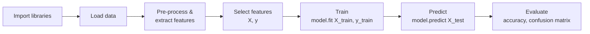

# 02 · The ML Pipeline, Hands-On (Sentiment Demo + Iris)

> **Course:** Machine Learning Paradigms (DS602) · Dr. Sunil Saumya · IIIT Dharwad
> **Lecture:** 3 October 2026 (Week 1, 1 h 18 min)
> **Sources:** Oct 3 class transcript, Colab demo shown in class, first slides of `MLP_Unit_1_Supervised_Learning_Regression.pdf` (supervised learning definition)
> **Notebook:** [`code/02_ml_pipeline_hands_on.ipynb`](code/02_ml_pipeline_hands_on.ipynb). It re-creates the demo, the iris demo and a solution to the `load_digits` homework.

---

## 📌 Table of Contents

1. [Big Picture](#1-big-picture)
2. [Toolkit: The Python Libraries](#2-toolkit-the-python-libraries-)
3. [Step 1: Data](#3-step-1-data-)
4. [Step 2: Feature Extraction (Hand-Crafted)](#4-step-2-feature-extraction-hand-crafted-)
5. [Feature Selection & Pearson Correlation](#5-feature-selection--pearson-correlation-)
6. [Step 3: Training (fit)](#6-step-3-training-fit-)
7. [Step 4: Testing (predict)](#7-step-4-testing-predict-)
8. [Step 5: Evaluation: Accuracy & Confusion Matrix](#8-step-5-evaluation-accuracy--confusion-matrix-)
9. [Decision Boundary](#9-decision-boundary-)
10. [Supervised Learning: Formal Definition](#10-supervised-learning-formal-definition-)
11. [Iris Demo: Full Pipeline with train_test_split](#11-iris-demo-full-pipeline-with-train_test_split-)
12. [Random Seed & Reproducibility](#12-random-seed--reproducibility-)
13. [Training vs Fine-tuning](#13-training-vs-fine-tuning-)
14. [Homework: load_digits](#14-homework-load_digits-)
15. [Professor Emphasised](#15--professor-emphasised)
16. [Common Confusions](#16--common-confusions)
17. [Exam / Interview Questions](#17--exam--interview-questions)
18. [Cheat Sheet](#18--cheat-sheet)
19. [Go Deeper: Curated Links](#19--go-deeper-curated-links)

---

## 1. Big Picture

Last class was theory: what ML is and what the paradigms are. This class ran **one complete ML pipeline end-to-end** before learning any algorithm in depth, so that every later topic fits into a familiar frame.



> *"This is the pipeline we are going to follow all the time."* — Every hands-on in this course (at least the conventional ML ones) will repeat these steps with a different dataset or algorithm.

---

## 2. Toolkit: The Python Libraries 🟢

| Library | Used for | In the demo |
|---|---|---|
| **pandas** | Tabular data as a `DataFrame` | Holding reviews + features |
| **NumPy** | Arrays and maths | Model input (`.values`) |
| **matplotlib / seaborn** | Plots | Decision boundary, t-SNE plot |
| **scikit-learn** (`sklearn`) | ML algorithms, datasets, metrics | `LogisticRegression`, `accuracy_score`, `confusion_matrix`, `load_iris`, `train_test_split`, `StandardScaler` |
| **NLTK** | Natural Language Toolkit (text processing) | `word_tokenize`, `pos_tag` |

**Philosophy (professor):** first understand the **maths** of an algorithm; after that, use the **library**. Re-writing from scratch is good for understanding but not required. (These notes give from-scratch code too, for understanding.)

**`import` vs `nltk.download` (asked in class):**

- `import nltk` loads the *library code*.
- `nltk.download("punkt")` downloads *data/model files* the library needs (a tokenizer model, a POS-tagger model). Colab doesn't ship these by default, so you download them once per session or you get a `LookupError`.

```python
nltk.download("punkt"); nltk.download("punkt_tab")      # tokenizer
nltk.download("averaged_perceptron_tagger_eng")         # English part-of-speech tagger
```

**Is a DataFrame required for ML?** No. It is only a convenient **table representation** for humans. It has nothing to do with ML itself. Models take **arrays** (hence `.values`). The 0, 1, 2… index column is added by pandas and is not part of your data.

---

## 3. Step 1: Data 🟢

The training data is created inline as a Python dict → DataFrame:

| review_text | votes | rating | label |
|---|---|---|---|
| Worst product ever, broke in a day. | 3 | 1.0 | 0 |
| Absolutely love it! Works perfectly as expected. | 15 | 5.0 | 1 |
| Decent quality, but overpriced. | 5 | 3.0 | 0 |
| Amazing value for money, very satisfied. | 20 | 5.0 | 1 |
| Late delivery and poor support. | 4 | 2.0 | 0 |

- `votes` and `rating` are already numbers → no processing needed.
- `review_text` is **unstructured text** → the machine can't use it directly → **feature extraction**.

---

## 4. Step 2: Feature Extraction (Hand-Crafted) 🟢→🟡

### Why hand-crafted features? A bit of history

| Era | Data size | How features were made |
|---|---|---|
| Before ~2010 | Hundreds of rows | **Domain experts** design features (linguists for text, doctors for medical data) |
| Now (deep learning) | Millions to trillions of rows | Raw data → **vector/embedding**, and the network learns features automatically |

Manual features don't scale to huge data ("it will take years"), but they are great for **understanding** what a model sees. That's why the class started with them.

### The three features

| Feature | How it's computed |
|---|---|
| `word_count` | `len(x.split())`: split on whitespace, count pieces |
| `noun_count` | Tokenise → POS-tag → count tags starting with `NN` |
| `verb_count` | Tokenise → POS-tag → count tags starting with `VB` |

### Concepts used

**Tokenisation** splits text into units (tokens). `word_tokenize("John's big idea")` → `['John', "'s", 'big', 'idea']`. Note that `'s` became its own token: a tokenizer is smarter than `.split()`. LLMs also use tokenizers (sub-word tokens).

**POS (Part-of-Speech) tagging** labels each token with its grammatical role (Penn Treebank tagset):

```text
pos_tag(word_tokenize("John's big idea isn't all that bad."))
[('John','NNP'), ("'s",'POS'), ('big','JJ'), ('idea','NN'), ('is','VBZ'),
 ("n't",'RB'), ('all','PDT'), ('that','DT'), ('bad','JJ'), ('.','.')]
```

| Tag | Meaning | Tag | Meaning |
|---|---|---|---|
| NN | noun, singular | VB | verb, base form |
| NNS | noun, plural | VBD | verb, past tense |
| NNP | proper noun | VBZ | verb, 3rd person singular present ("is") |
| JJ | adjective | RB | adverb |
| DT | determiner | PDT | pre-determiner |

> 💡 Using `tag.startswith("NN")` catches **all** noun tags (NN, NNS, NNP, NNPS). Checking only one tag such as `NNP` would miss common nouns.

**Lambda functions:** `df["review_text"].apply(lambda x: len(x.split()))`

- `lambda x: <expr>` is a small **anonymous function**: input on the left of `:`, output on the right.
- `.apply` runs it on **every row** of the column, one at a time (it acts like an iterator).

```python
def add_features(df):
    df["word_count"] = df["review_text"].apply(lambda x: len(x.split()))
    df["noun_count"] = df["review_text"].apply(
        lambda x: sum(1 for _, tag in pos_tag(word_tokenize(x)) if tag.startswith("NN")))
    df["verb_count"] = df["review_text"].apply(
        lambda x: sum(1 for _, tag in pos_tag(word_tokenize(x)) if tag.startswith("VB")))
    return df
```

Result (from the notebook; NLTK versions may differ slightly):

| review | word_count | noun_count | verb_count | label |
|---|---|---|---|---|
| Worst product ever, broke in a day. | 7 | 3 | 1 | 0 |
| Absolutely love it! Works perfectly as expected. | 7 | 0 | 3 | 1 |
| Decent quality, but overpriced. | 4 | 2 | 1 | 0 |
| Amazing value for money, very satisfied. | 6 | 2 | 1 | 1 |
| Late delivery and poor support. | 5 | 2 | 0 | 0 |

### Features are domain-specific
Asked in class: *"Why nouns and verbs?"* They suit **text**. For **healthcare** records, nouns and verbs are irrelevant; **symptoms**, lab values and age are the features. The domain decides the features.

---

## 5. Feature Selection & Pearson Correlation 🟡

The demo used **only 2 features** (`word_count`, `verb_count`). The choice was **random**, made only for **visual clarity**, because we can plot at most 2-D/3-D. For training you can use all features.

**Q (class):** *Can we try feature combinations and compare?* Yes, but brute force over many features is inefficient. A better first step is to **measure each feature's linear relationship with the target** using the **Pearson correlation coefficient**:

$$
r_{x,y} = \frac{\sum_i (x_i - \bar x)(y_i - \bar y)}{\sqrt{\sum_i (x_i - \bar x)^2}\,\sqrt{\sum_i (y_i - \bar y)^2}} \in [-1, 1]
$$

| r | Meaning |
|---|---|
| ≈ +1 | Strong positive linear relation |
| ≈ −1 | Strong negative linear relation |
| ≈ 0 | No **linear** relation |

Iris example from the notebook (correlation with the target):
```text
petal width   0.957   ← most useful
petal length  0.949
sepal length  0.783
sepal width  -0.427   ← weakest
```

> ⚠️ **Limits (beyond slides):**
>
> - Pearson only detects **linear** relations. $y = x^2$ on symmetric data gives $r \approx 0$ even though $y$ depends completely on $x$.
> - Correlation with a **categorical** target is only meaningful when the classes have a natural order or for binary 0/1.
> - Two features can be useless alone but powerful together (XOR-like).
> - Better tools: mutual information, model-based importance, L1 regularisation, recursive feature elimination ([scikit-learn feature selection](https://scikit-learn.org/stable/modules/feature_selection.html)).
> - Notice the same numerator, $\sum (x_i-\bar x)(y_i - \bar y)$, as in the **OLS slope** in [Note 03](03-Supervised-Learning-Regression.md). The two are linked: $m = r \cdot \frac{s_y}{s_x}$.

---

## 6. Step 3: Training (fit) 🟢

```python
FEATURES = ["word_count", "verb_count"]
X_train = train_df[FEATURES].values    # input  → 2-D array, shape (n_samples, n_features)
y_train = train_df["label"].values     # output → 1-D array, shape (n_samples,)

model = LogisticRegression()
model.fit(X_train, y_train)            # learn from BOTH inputs and labels
```

- **Rows = data points (samples), columns = features.** Keep this convention in mind for everything.
- `X` (capital) = feature matrix; `y` (small) = label vector. This is the standard naming.
- Labels are given, so this is **supervised**. Labels are categorical (0/1), so it is **classification**.

### "Logistic *regression*" does classification?! (asked in class)
Yes, it is a **classification** algorithm. Internally it computes a **probability** with the sigmoid function, and a **threshold** (0.5) turns that probability into a class:

$$
P(y=1 \mid x) = \sigma(w^\top x + b) = \frac{1}{1 + e^{-(w^\top x + b)}}, \qquad \hat y = \begin{cases}1 & P \ge 0.5\\ 0 & \text{otherwise}\end{cases}
$$

The name says "regression" because it **regresses the log-odds** linearly: $\log\frac{P}{1-P} = w^\top x + b$. Full maths comes later in the classification lectures.

```text
From the notebook: weights = [0.382, 0.650], bias = -3.453
→ P(positive) = σ(0.382·word_count + 0.650·verb_count − 3.453)
```

---

## 7. Step 4: Testing (predict) 🟢

**Rule 1: Same pipeline on test data.** Apply the *exact same* feature extraction and the *same chosen features* used in training. A model trained on `[word_count, verb_count]` cannot accept `[noun_count, rating]`. It would error out, or silently give nonsense.

**Rule 2: Never feed test labels to the model.** In reality, test data is **future data**, such as tomorrow's reviews, so it has no labels. We keep labels for our test set **only to evaluate**.

```python
y_pred = model.predict(X_test)          # inputs ONLY (compare: fit(X, y) used both)
```

| | `fit` | `predict` |
|---|---|---|
| Phase | Training | Testing / inference |
| Receives | `X_train` **and** `y_train` | `X_test` only |
| Returns | Trained model | Predicted labels |

The labels must be in the **same format** as during training (0/1 vs True/False) for comparison. Logistic regression outputs a probability and **thresholds** it into 0/1 (`model.predict_proba` shows the raw probabilities).

---

## 8. Step 5: Evaluation: Accuracy & Confusion Matrix 🟢→🟡

### Class result
The model predicted `1 0 1 0 0` against true `0 1 0 1 0`. Only the last one was right, so **accuracy = 1/5 = 20%**. (My re-creation with different test reviews gives 40%; see the notebook.)

### Accuracy
$$
\text{Accuracy} = \frac{\text{\# correct predictions}}{\text{\# total predictions}}
$$
Manual counting works for 5 rows; for thousands, use `accuracy_score(y_test, y_pred)`.

### Confusion matrix: *where* is the model wrong?
For binary labels, the four outcomes are:

| | **Predicted 0 (neg)** | **Predicted 1 (pos)** |
|---|---|---|
| **Actual 0 (neg)** | **TN** (true negative) ✅ | **FP** (false positive) ❌ *false alarm* |
| **Actual 1 (pos)** | **FN** (false negative) ❌ *miss* | **TP** (true positive) ✅ |

> ⚠️ **Layout warning:** scikit-learn's `confusion_matrix(y_true, y_pred)` puts **rows = actual, columns = predicted**, with classes in sorted order. For labels `[0, 1]` that gives `[[TN, FP], [FN, TP]]`, so **top-left is TN, not TP**. Many textbooks put TP top-left (positive class first). In class the top-left cell was called "true positive"; for the sklearn output, read it as TN. Always check the axis labels.

### 🔴 Accuracy can lie: the majority-class trap
In the notebook's TF-IDF challenge, the model predicted **all 0** and still scored **60%**, because 3 of the 5 test reviews were negative. On imbalanced data (fraud is 0.1% of transactions), "always predict not-fraud" gives 99.9% accuracy and is useless. That's why we need **precision, recall and F1** (upcoming):

$$
\text{Precision} = \frac{TP}{TP+FP}, \quad \text{Recall} = \frac{TP}{TP+FN}, \quad F_1 = \frac{2PR}{P+R}
$$

---

## 9. Decision Boundary 🟡

A classifier divides the feature space into **regions**, one per class. The border between them is the **decision boundary**.

- For logistic regression the boundary is a **straight line** (a hyperplane in higher dimensions): $w_1 x_1 + w_2 x_2 + b = 0$.
- In the class plot: circles were training points, crosses were test points, and the background was shaded red/blue by predicted class.
- **Ideal model:** every red point sits in the red region and every blue point in the blue region.
- **Class result:** red and blue points were mixed in the same regions, so the model makes errors (20% accuracy).

**Why so poor?** Only **5 training examples**, and **word count and verb count carry almost no sentiment information**. "Worst product ever" and "Amazing value for money" have similar lengths. Better features (the words themselves, embeddings) and much more data are needed.

### Multi-class boundaries (Iris)
With 3 classes, one line can't separate all three. You need **multiple boundaries**: one line splits class A from B and C, another splits B from C. sklearn's `LogisticRegression` handles multi-class with a softmax (multinomial) formulation by default.

---

## 10. Supervised Learning: Formal Definition 🟢

From the regression deck:

- Given input–output pairs with labels.
- **Input:** $X = \{\bar x_1, \bar x_2, \dots, \bar x_N\}$; **Output:** $Y = \{\bar y_1, \bar y_2, \dots, \bar y_N\}$
- $(\bar x_i, \bar y_i)$ form a **pair**. In layman's terms, this is a **labelled dataset**.
- Each $\bar x_i$ is **one row (sample)**, which is itself a vector of features (hence the bar).
- We use this input–output relationship to **train** a model.
- **Rule:** *if a labelled dataset is available, go for supervised learning.*

Mathematically, we want to learn a function $f$ such that $f(\bar x_i) \approx \bar y_i$ and, crucially, $f(\bar x_{new}) \approx \bar y_{new}$ on **unseen** data (generalisation).

| | Regression | Classification |
|---|---|---|
| Output type | Continuous number | Discrete category |
| Example from class | Predict **votes** a review gets | Predict **sentiment** 0/1 |
| Other examples | House price, temperature, salary | Spam/not, disease/healthy, digit 0–9 |
| Typical loss | Mean squared error | Cross-entropy (log loss) |
| Typical metric | MSE, RMSE, MAE, R² | Accuracy, precision, recall, F1 |

➡️ Regression in depth: [Note 03](03-Supervised-Learning-Regression.md).

---

## 11. Iris Demo: Full Pipeline with train_test_split 🟢→🟡

### The dataset

- Introduced by **R. A. Fisher (1936)**, a British statistician and biologist. It is the "hello world" of classification.
- **150 samples**, **4 features** (sepal length, sepal width, petal length, petal width, all in cm), **3 classes** (*setosa*, *versicolor*, *virginica*), 50 of each.
- Built into scikit-learn: `from sklearn.datasets import load_iris`.
- **Synonyms:** target = label = output.

```python
iris = load_iris()
X, y = iris.data, iris.target          # X: (150, 4), y: values 0/1/2
iris.target_names                      # ['setosa', 'versicolor', 'virginica']
iris.feature_names
```

All features are already numeric, so **no feature extraction** is needed. Labels are categories, so this is **multi-class classification**.

### t-SNE plot: seeing 4-D data in 2-D
The data is 4-dimensional and can't be plotted directly. **t-SNE** (t-distributed Stochastic Neighbour Embedding) maps it to 2-D while trying to keep **neighbours close**. In the plot, *setosa* forms its own island, while *versicolor* and *virginica* sit close together and are harder to separate.

> ⚠️ t-SNE is for **visualisation only**: distances between far-apart clusters and cluster sizes aren't meaningful, and the model doesn't use it. See ["How to use t-SNE effectively"](https://distill.pub/2016/misread-tsne/).

### Pre-processing: StandardScaler (preview)
$$ z = \frac{x - \mu}{\sigma} $$
This puts each feature on a comparable scale (mean 0, std 1). It matters for gradient-based models (see the learning-rate discussion in Note 03). **Fit the scaler on training data only**, then apply it to test data. Otherwise test information "leaks" into training.

### Train/test split
```python
X_train, X_test, y_train, y_test = train_test_split(
    X, y, test_size=0.2, random_state=42, stratify=y)    # 120 train / 30 test
```
- **80/20:** 80% to learn from, 20% held out to evaluate honestly.
- **How it decides (asked in class):** it **shuffles randomly**, then takes the first 80% for training. Shuffling matters because iris is stored sorted by class (50 setosa, then 50 versicolor…). Without shuffling, the test set would contain only *virginica*!
- `stratify=y` (beyond class) keeps the class proportions equal in both sets.
- Result in the notebook: **93.3% accuracy** with logistic regression.

### Common split ratios

| Data size | Typical split |
|---|---|
| Small (hundreds) | 80/20, or better **k-fold cross-validation** |
| Medium | 70/15/15 train/validation/test |
| Huge (millions) | 98/1/1 is enough |

The **validation** set is used to tune choices (hyperparameters, features). The **test** set is touched only once, at the very end.

---

## 12. Random Seed & Reproducibility 🟡

**Q (class):** *What is a seed? Must it be less than 150?*

- Shuffling is random, so each run gives a different split and a slightly different accuracy.
- The **seed** fixes the random number generator's starting point. **Same seed → same "random" sequence → same split → same results.**
- The seed value has **no connection to the number of rows**. `random_state=42` or `random_state=2026` both work for 150 rows. It's just an ID for a particular random sequence.

> 🔍 **Correction of an analogy:** In class the seed was compared to "how many times you shuffle the dice". A more precise picture: a computer's random numbers are **pseudo-random**, produced by a deterministic formula. The seed is the **starting value** of that formula. Same start → identical sequence. It does not control "how much" randomness.

From the notebook:
```text
seed= 0  first test row: [5.8, 2.8, 5.1, 2.4]  accuracy=1.000
seed= 1  first test row: [5.8, 4.0, 1.2, 0.2]  accuracy=0.967
seed=42  first test row: [6.1, 2.8, 4.7, 1.2]  accuracy=1.000
seed=42  first test row: [6.1, 2.8, 4.7, 1.2]  accuracy=1.000   ← identical: reproducible
```
💡 Accuracy changes with the seed, so a single split is a **noisy** estimate. **Cross-validation** averages over several splits.

---

## 13. Training vs Fine-tuning 🟡

| | Training | Fine-tuning |
|---|---|---|
| Starts from | Random / fresh parameters | An **already trained** model |
| When | First | **Always after** at least one round of training |
| Example | Train sentiment model on pos/neg | Adapt it to also predict **neutral** using new labelled data |

A model trained only on positive/negative will **never** output "neutral". It has never seen that class. Fine-tuning on new data teaches it. (Week 7: Transfer Learning.)

---

## 14. Homework: load_digits 🟢

> *"Practise this notebook, then repeat the same pipeline with `load_digits` (or any other sklearn dataset)."*

**About the dataset:** 1,797 images of handwritten digits 0–9, each **8×8 pixels** → flattened to **64 features** (pixel intensities 0–16). 10 classes. People write digits in their own styles, and the model must recognise them anyway.

**Steps:** swap `load_iris` for `load_digits` and keep everything else the same. Try it yourself first. The full solution is in Part C of the notebook.

**Notebook solution:** logistic regression with StandardScaler → **≈97.2% accuracy**. The notebook also shows which digits were confused. With seed 42, most errors are 8 ↔ 1 (6 of the 10 mistakes).

**Extensions to try:**

1. Swap `LogisticRegression` for `KNeighborsClassifier` or `SVC` and compare.
2. Train on only 10% of the data. How does accuracy change?
3. Plot the misclassified images. Would *you* have got them right?

---

## 15. 🎓 Professor Emphasised

1. **The pipeline:** libraries → data → pre-process/feature extraction → train → test/predict → evaluate. You'll repeat this all course.
2. Text must be converted to **numbers** (features or vectors).
3. **Feature extraction** used to be done by domain experts; deep learning automated it because data became huge.
4. At test time, use the **same features/pre-processing** as at training time.
5. **Never use test labels for prediction.** Real test data is future data with no labels.
6. `fit(X, y)` for training; `predict(X)` for testing.
7. **Pearson correlation** helps select features with strong linear relationships to the target.
8. **Seed = reproducibility** of random splits.
9. **Fine-tuning always comes after training.**
10. Practise the notebook and the `load_digits` exercise. They come back in the next class.

---

## 16. ⚠️ Common Confusions

| Confusion | Clarification |
|---|---|
| DataFrame is an ML concept | It's just a table structure (pandas); models take arrays |
| `import` = `download` | `import` loads code; `nltk.download` fetches model/data files |
| Logistic regression = regression | It's a **classifier** (probability → threshold) |
| Top-left of sklearn's confusion matrix = TP | For labels `[0,1]` it's **TN** (`[[TN, FP], [FN, TP]]`) |
| Higher accuracy = good model | Check class balance and the confusion matrix |
| Seed must be < number of rows | Seed is unrelated to data size |
| t-SNE plot shows what the model sees | It's only a 2-D visualisation of 4-D data |
| Scale using all data before splitting | Fit scalers on **train only** (avoid data leakage) |
| `noun_count` with tag `NNP` only | Use `startswith("NN")` to capture all noun types |

---

## 17. 📝 Exam / Interview Questions

<details>
<summary><b>Q1.</b> List the steps of a typical supervised ML pipeline.</summary>

Import libraries → load/collect data → clean & pre-process (feature extraction / vectorisation, scaling) → split into train/test → train (`fit`) → predict on test (`predict`) → evaluate (accuracy, confusion matrix…) → (deploy, monitor).
</details>

<details>
<summary><b>Q2.</b> Why must the same feature extraction be applied at train and test time?</summary>

The model learned weights for specific input dimensions in a specific representation. A different representation means the input space is different, so predictions are meaningless (or the call errors on shape mismatch).
</details>

<details>
<summary><b>Q3.</b> A model predicts [1,0,1,0,0] for true labels [0,1,0,1,0]. Compute accuracy and the confusion matrix (sklearn layout).</summary>

Correct: only index 4 → accuracy = 1/5 = 0.2. TN: actual 0 & predicted 0 = 1 (idx 4); FP: actual 0 & predicted 1 = 2 (idx 0, 2); FN: actual 1 & predicted 0 = 2 (idx 1, 3); TP = 0. Matrix `[[1, 2], [2, 0]]`.
</details>

<details>
<summary><b>Q4.</b> Why is logistic regression called "regression" if it classifies?</summary>

It fits a linear model to the log-odds of the positive class, then passes it through a sigmoid to get a probability, which is thresholded to give a class.
</details>

<details>
<summary><b>Q5.</b> What is the purpose of `random_state` in `train_test_split`?</summary>

It seeds the pseudo-random shuffle so that the split (and results) are reproducible across runs.
</details>

<details>
<summary><b>Q6.</b> Why might 95% accuracy be a bad result?</summary>

If 95% of samples belong to one class, a model that always predicts that class gets 95% while being useless. Use precision, recall, F1 and the confusion matrix.
</details>

<details>
<summary><b>Q7.</b> What does Pearson correlation measure, and what is one limitation for feature selection?</summary>

Strength and direction of the linear relationship between two variables (−1 to 1). It misses non-linear relationships and feature interactions.
</details>

<details>
<summary><b>Q8.</b> Iris: number of samples, features, classes? Why is shuffling essential before splitting it?</summary>

150 samples, 4 features, 3 classes (50 each). The data is stored sorted by class, so an unshuffled 80/20 split would put only one class in the test set.
</details>

---

## 18. 🧾 Cheat Sheet

```python
# THE pipeline (memorise)
from sklearn.model_selection import train_test_split
from sklearn.preprocessing import StandardScaler
from sklearn.linear_model import LogisticRegression
from sklearn.metrics import accuracy_score, confusion_matrix

X_tr, X_te, y_tr, y_te = train_test_split(X, y, test_size=0.2, random_state=42, stratify=y)
sc = StandardScaler().fit(X_tr)                       # fit on TRAIN only
model = LogisticRegression(max_iter=1000).fit(sc.transform(X_tr), y_tr)
y_pred = model.predict(sc.transform(X_te))
print(accuracy_score(y_te, y_pred)); print(confusion_matrix(y_te, y_pred))
```
- Rows = samples, columns = features; `X` = inputs, `y` = labels.
- Text → features (word/noun/verb counts via NLTK) or vectors (TF-IDF, embeddings).
- `fit(X, y)` trains; `predict(X)` infers (no labels).
- Accuracy = correct/total; sklearn confusion matrix = `[[TN, FP], [FN, TP]]`.
- Seed → reproducible split. Shuffle before splitting.
- Pearson r ∈ [−1, 1] measures linear association → quick feature screening.

**50–100 word class summary (template):**
> We implemented a complete supervised ML pipeline in Colab. For review sentiment, we extracted hand-crafted text features (word, noun and verb counts) using NLTK tokenisation and POS tagging, trained a logistic regression classifier with fit(), predicted unseen reviews with predict(), and evaluated using accuracy and a confusion matrix; poor features and tiny data gave only 20% accuracy. We then classified the Iris dataset using train_test_split (80/20 with a random seed for reproducibility) and discussed Pearson correlation for feature selection. Homework: repeat with load_digits.

---

## 19. 📚 Go Deeper: Curated Links

| Topic | Why | Link |
|---|---|---|
| Confusion matrix | Clear visual explanation of TP/TN/FP/FN | [StatQuest — The Confusion Matrix](https://www.youtube.com/watch?v=Kdsp6soqA7o) |
| Logistic regression intuition | Preview of the classification lectures | [StatQuest — Logistic Regression](https://www.youtube.com/watch?v=yIYKR4sgzI8) |
| Pearson correlation | Formula + intuition + pitfalls | [StatQuest — Pearson's Correlation](https://www.youtube.com/watch?v=xZ_z8KWkhXE) |
| t-SNE | What the iris plot is doing | [StatQuest — t-SNE](https://www.youtube.com/watch?v=NEaUSP4YerM) · [Distill — How to Use t-SNE Effectively](https://distill.pub/2016/misread-tsne/) |
| Cross-validation | Fixes the "accuracy depends on seed" issue | [StatQuest — Cross Validation](https://www.youtube.com/watch?v=fSytzGwwBVw) · [sklearn docs](https://scikit-learn.org/stable/modules/cross_validation.html) |
| POS tagging with NLTK | Full tag list + tagging theory | [NLTK Book, Ch. 5 — Categorizing and Tagging Words](https://www.nltk.org/book/ch05.html) |
| Data leakage & pitfalls | Why "fit scaler on train only" | [sklearn — Common pitfalls](https://scikit-learn.org/stable/common_pitfalls.html) |
| Scaling & pre-processing | StandardScaler and friends | [sklearn — Preprocessing](https://scikit-learn.org/stable/modules/preprocessing.html) |
| Feature selection | Beyond Pearson | [sklearn — Feature selection](https://scikit-learn.org/stable/modules/feature_selection.html) |
| API references | Functions used in class | [`train_test_split`](https://scikit-learn.org/stable/modules/generated/sklearn.model_selection.train_test_split.html) · [`LogisticRegression`](https://scikit-learn.org/stable/modules/generated/sklearn.linear_model.LogisticRegression.html) · [`confusion_matrix`](https://scikit-learn.org/stable/modules/generated/sklearn.metrics.confusion_matrix.html) · [`load_iris`](https://scikit-learn.org/stable/modules/generated/sklearn.datasets.load_iris.html) · [`load_digits`](https://scikit-learn.org/stable/modules/generated/sklearn.datasets.load_digits.html) |
| Iris dataset origin | Fisher's 1936 data | [UCI ML Repository — Iris](https://archive.ics.uci.edu/dataset/53/iris) |
| Practice | Short hands-on course | [Kaggle Learn — Intro to Machine Learning](https://www.kaggle.com/learn/intro-to-machine-learning) |

---
⬅️ [01 · Introduction](01-Introduction-to-ML-Paradigms.md) · [MLP Index](README.md) · ➡️ [03 · Supervised Learning: Regression](03-Supervised-Learning-Regression.md)
