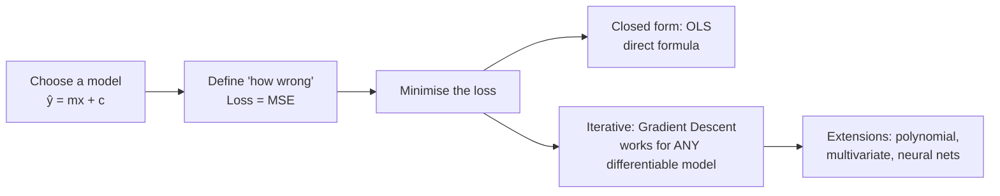
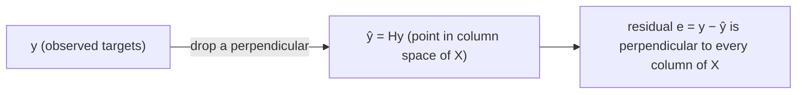

# 03 · Supervised Learning: Regression (Linear, Gradient Descent, Polynomial, Multivariate)

> **Course:** Machine Learning Paradigms (DS602) · Dr. Sunil Saumya · IIIT Dharwad
>
> **Deck:** `MLP_Unit_1_Supervised_Learning_Regression.pdf` (dated 3 Oct 2026)
>
> **Status:** Based on the slides. Linear regression is taught in the next lecture; class discussion will be added then. Sections 20–27 go deeper than the slides (proofs, convergence theory, regularisation, diagnostics, case studies) and are marked 🔴 where they are beyond the syllabus.
>
> **Notebooks:**
>
> - [`code/03_linear_regression.ipynb`](code/03_linear_regression.ipynb): OLS by hand, GD from scratch, GD variants, polynomial, multivariate, house-price case study.
> - [`code/03_regression_deep_dive.ipynb`](code/03_regression_deep_dive.ipynb): normal equation vs `lstsq` vs sklearn, projection geometry, the 2/L learning-rate limit, condition numbers and scaling, ridge/lasso paths, residual diagnostics, CV for polynomial degree, bias–variance by simulation, checks of every hand calculation, delivery-time and electricity-demand case studies.
>
> **Figures:** generated by [`code/make_figures.py`](code/make_figures.py)

---

## 📌 Table of Contents

1. [Big Picture](#1-big-picture)
2. [Regression vs Classification](#2-regression-vs-classification-)
3. [Case 1: No Inputs, Predict the Mean](#3-case-1-no-inputs--predict-the-mean-)
4. [Case 2: Simple Linear Regression](#4-case-2-simple-linear-regression-)
5. [OLS: Deriving the Formulas](#5-ols-deriving-the-formulas-)
6. [Worked Example & Slide Correction](#6-worked-example--slide-correction-)
7. [Loss Function: MSE](#7-loss-function-mse-)
8. [Convexity of MSE](#8-convexity-of-mse-)
9. [Gradient Descent](#9-gradient-descent-)
10. [Gradient Descent for Linear Regression (derivation)](#10-gradient-descent-for-linear-regression-derivation-)
11. [The Learning Rate α](#11-the-learning-rate-α-)
12. [Batch vs Stochastic vs Mini-batch GD](#12-batch-vs-stochastic-vs-mini-batch-gd-)
13. [Polynomial Regression](#13-polynomial-regression-)
14. [Multivariate Linear Regression](#14-multivariate-linear-regression-)
15. [Normal Equation (closed form, beyond slides)](#15-normal-equation-closed-form-beyond-slides-)
16. [Evaluating Regression Models](#16-evaluating-regression-models-)
17. [Over-fitting, Bias–Variance, Regularisation](#17-over-fitting-biasvariance-regularisation-)
18. [Advanced: Why Squared Error? (Probabilistic View)](#18--advanced-why-squared-error-probabilistic-view)
19. [Case Study: House Prices](#19-case-study-house-prices-)
20. [Deep Dive: Matrix Calculus, the Normal Equation and Projection Geometry](#20-deep-dive-matrix-calculus-the-normal-equation-and-projection-geometry-)
21. [Deep Dive: When Does Gradient Descent Converge?](#21-deep-dive-when-does-gradient-descent-converge-)
22. [Deep Dive: The Bias–Variance Decomposition](#22-deep-dive-the-biasvariance-decomposition-)
23. [Deep Dive: Ridge and Lasso](#23-deep-dive-ridge-and-lasso-)
24. [Goodness of Fit and Residual Diagnostics](#24-goodness-of-fit-and-residual-diagnostics-)
25. [Choosing Model Complexity with Cross-Validation](#25-choosing-model-complexity-with-cross-validation-)
26. [Real-World Case Studies](#26-real-world-case-studies-)
27. [Code Walkthrough: the Deep-Dive Notebook](#27-code-walkthrough-the-deep-dive-notebook-)
28. [Common Confusions](#28--common-confusions)
29. [Exam / Interview Questions](#29--exam--interview-questions)
30. [Practice Problems](#30--practice-problems)
31. [Cheat Sheet](#31--cheat-sheet)
32. [Go Deeper: Curated Links](#32--go-deeper-curated-links)

---

## 1. Big Picture

Regression answers **"how much?"** questions: how many votes, what price, what salary, what temperature.

The whole topic follows a single storyline:



> 💡 **Why this matters beyond regression:** "Model + loss + gradient descent" is **exactly** how neural networks and LLMs are trained, only with billions of parameters instead of two. Master it here.

---

## 2. Regression vs Classification 🟢

The same review dataset, two different questions:

| Review Text | Votes | Rating | Sentiment |
|---|---|---|---|
| Worst product ever, broke in a day. | 7 | 1.0 | 0 |
| Absolutely love it! Works perfectly as expected. | 8 | 5.0 | 1 |
| Decent quality, but overpriced. | 4 | 3.0 | 0 |
| Amazing value for money, very satisfied. | 7 | 5.0 | 1 |
| Late delivery and poor support. | 5 | 2.0 | 0 |

| | Regression | Classification |
|---|---|---|
| Problem | Given text + rating → predict **votes** | Given text + votes + rating → predict **sentiment** |
| Output | **Continuous** real number | **Categorical** (0/1) |
| Question type | "How much / how many?" | "Which class?" |
| More examples | House price, rainfall in mm, stock price, delivery time | Spam/ham, fraud/legit, digit 0–9, tumour benign/malignant |

> ⚠️ **Tricky cases:** "Votes" are integers, yet we treat them as regression because they're ordered quantities where being off by 1 is better than off by 10. A rating of 1–5 *could* be either (regression or ordinal classification). The deciding question: **does distance between values carry meaning?**

> 📝 **Naming trap (from class):** *logistic regression*, used in the Iris demo, is a **classification** model despite its name. It outputs a probability and then a class; it is covered with classification.

---

## 3. Case 1: No Inputs → Predict the Mean 🟢

*"Predict how many votes a review will receive,"* but you are given **only the output column**:

| Votes (Y) |
|---|
| 3, 15, 5, 20, 4 |

The best you can do is predict the **mean = 9.4** for every review.

**Why the mean? (Proof, beyond slides.)** We want the constant $`k`$ minimising $`L(k) = \frac1n\sum (y_i - k)^2`$. Setting $`\frac{dL}{dk} = -\frac2n\sum(y_i - k) = 0`$ gives $`k = \frac1n\sum y_i = \bar{y}`$. Since $`L''(k) = 2 > 0`$, this stationary point is a minimum. ∎

**A second, purely algebraic proof** (no calculus). For any constant $`k`$,

```math
\sum_i (y_i - k)^2 = \sum_i (y_i - \bar{y})^2 + n(\bar{y} - k)^2
```

because the cross term $`2(\bar{y}-k)\sum_i (y_i - \bar{y})`$ is zero. The first term does not depend on $`k`$ and the second is ≥ 0, vanishing only at $`k = \bar{y}`$.

> 🎯 This is the **baseline model**. Any real model must beat it. Here its MSE = **46.64** (the population variance of Y). The **R²** metric (Section 16) literally measures "how much better than predicting the mean".

> 🔗 **Edge case:** if the loss were the absolute error $`\frac1n\sum\lvert y_i - k\rvert`$, the best constant would be the **median** (here 5), not the mean. The choice of loss decides the "best" summary.

---

## 4. Case 2: Simple Linear Regression 🟢

Now we also have an input, word count:

| Word Count (X) | Votes (Y) |
|---|---|
| 7 | 3 |
| 8 | 15 |
| 4 | 5 |
| 7 | 20 |
| 5 | 4 |

**Assumption:** votes are a **linear function** of word count:

```math
\hat{Y} = mX + c
```

- $`m`$ = **slope**: extra votes per extra word
- $`c`$ = **intercept**: predicted votes at 0 words
- In the ML notation used later: $`\hat{y} = w_0 + w_1 x`$ (so $`w_1 = m`$, $`w_0 = c`$). These are the **parameters/weights** the model learns.

**Goal:** find the **best-fit line**, the line closest to all the points.


> 📝 **Small data note:** if you count the words yourself, "Absolutely love it! Works perfectly as expected." has 7 words and "Amazing value for money, very satisfied." has 6. The slide uses 8 and 7. These notes keep the slide's values so the numbers match your exam material.

---

## 5. OLS: Deriving the Formulas 🟡

**Ordinary Least Squares (OLS)** picks $`m, c`$ that minimise the **sum of squared residuals**:

```math
S(m,c) = \sum_{i=1}^{n} \big(Y_i - (mX_i + c)\big)^2
```

A **residual** $`e_i = Y_i - \hat{Y}_i`$ is the vertical gap between a point and the line (the green vertical segments in the figure above).

**Step 1: derivative with respect to c, set to 0**

```math
\frac{\partial S}{\partial c} = -2\sum (Y_i - mX_i - c) = 0 \;\Rightarrow\; \sum Y_i = m\sum X_i + nc \;\Rightarrow\; \boxed{c = \bar{Y} - m\bar{X}}
```

➡️ Meaning: **the best-fit line always passes through $`(\bar{X}, \bar{Y})`$**. Equivalently, the residuals sum to zero: $`\sum e_i = 0`$.

**Step 2: derivative with respect to m, set to 0**

```math
\frac{\partial S}{\partial m} = -2\sum X_i (Y_i - mX_i - c) = 0
```

Equivalently $`\sum X_i e_i = 0`$: the residuals are uncorrelated with the input. Substitute $`c = \bar{Y} - m\bar{X}`$:

```math
\sum X_i\big[(Y_i - \bar{Y}) - m(X_i - \bar{X})\big] = 0
\;\Rightarrow\; m = \frac{\sum X_i (Y_i - \bar{Y})}{\sum X_i (X_i - \bar{X})}
```

Because $`\sum \bar{X} (Y_i - \bar{Y}) = 0`$ and $`\sum \bar{X}(X_i - \bar{X}) = 0`$, we can subtract $`\bar{X}`$ inside freely:

```math
\boxed{m = \frac{\sum (X_i - \bar{X})(Y_i - \bar{Y})}{\sum (X_i - \bar{X})^2} = \frac{\text{Cov}(X,Y)}{\text{Var}(X)} = \frac{S_{xy}}{S_{xx}}}
```

> 🔗 **Connection:** $`m = r_{XY}\cdot \frac{s_Y}{s_X}`$, where $`r`$ is the Pearson correlation from [Note 02](02-ML-Pipeline-Hands-On.md#5-feature-selection--pearson-correlation-). Slope and correlation share the same numerator.

**Step 3 (beyond slides): is the stationary point really a minimum?** The Hessian of $`S`$ is

```math
\nabla^2 S = \begin{bmatrix} 2\sum X_i^2 & 2\sum X_i \\ 2\sum X_i & 2n \end{bmatrix},
\qquad
\det = 4n\sum X_i^2 - 4\Big(\sum X_i\Big)^2 = 4n\,S_{xx}
```

The top-left entry is positive and the determinant is positive whenever the $`X_i`$ are not all equal ($`S_{xx} > 0`$), so the Hessian is positive definite and the point is the **unique global minimum**. For the slide data: $`\sum X_i^2 = 203`$, $`\sum X_i = 31`$, so the Hessian is $`[[406, 62], [62, 10]]`$ with determinant $`4060 - 3844 = 216 = 4\cdot 5\cdot 10.8`$ ✅.

> ⚠️ **Edge case:** if every $`X_i`$ is the same, $`S_{xx} = 0`$ and the slope is undefined: infinitely many lines pass through the vertical column of points equally well. Data must vary in X to learn a slope.

---

## 6. Worked Example & Slide Correction 🟢

Means: $`\bar{X} = 31/5 = 6.2`$, $`\bar{Y} = 47/5 = 9.4`$

| $`X_i`$ | $`Y_i`$ | $`X_i - \bar{X}`$ | $`Y_i - \bar{Y}`$ | $`(X_i-\bar{X})(Y_i-\bar{Y})`$ | $`(X_i-\bar{X})^2`$ |
|---|---|---|---|---|---|
| 7 | 3 | 0.8 | −6.4 | −5.12 | 0.64 |
| 8 | 15 | 1.8 | 5.6 | 10.08 | 3.24 |
| 4 | 5 | −2.2 | −4.4 | 9.68 | 4.84 |
| 7 | 20 | 0.8 | 10.6 | 8.48 | 0.64 |
| 5 | 4 | −1.2 | −5.4 | 6.48 | 1.44 |
| **Σ** | | **0** | **0** | **29.60** | **10.80** |

```math
m = \frac{29.6}{10.8} = \mathbf{2.74}, \qquad c = 9.4 - 2.74 \times 6.2 = \mathbf{-7.59}
```

```math
\boxed{\hat{Y} = 2.74X - 7.59}
```

> ⚠️ **The slide shows $`m = 4.41`$, $`c = -18.00`$ (i.e. $`\hat{Y} = 4.41X - 18.00`$). That is an arithmetic error.** Evidence (see notebook Part A):
>
> | Line | MSE on the 5 points |
> |---|---|
> | Mean only (baseline) | 46.64 |
> | Slide: $`4.41X - 18.00`$ | 36.44 |
> | **Correct OLS: $`2.74X - 7.59`$** | **30.41** ✅ (lowest possible) |
>
> `np.polyfit`, `sklearn.LinearRegression` and gradient descent all return **2.7407, −7.5926**. Since OLS is *by definition* the line with the lowest squared error, any line with higher MSE can't be the OLS answer. In an exam, **show the table above**. Use the method from the slides and compute carefully. You may want to mention this to the professor.

**Sanity checks to do in exams:**

1. $`\sum (X_i - \bar{X}) = 0`$ and $`\sum (Y_i - \bar{Y}) = 0`$ (they always do).
2. The line passes through $`(\bar{X}, \bar{Y})`$: $`2.74 \times 6.2 - 7.59 = 9.40`$ ✅
3. The sign of $`m`$ matches the scatter trend (more words → more votes, so positive).
4. The fitted MSE (30.41) is below the baseline MSE (46.64). If it is not, something is wrong.

**Interpretation:** each extra word adds ≈2.74 votes. The intercept (−7.59 votes at 0 words) is **meaningless** physically, because we never observed reviews near 0 words. **Don't extrapolate** outside the data range. With only 5 points and R² ≈ 0.35, the slope is also very uncertain; a second sample of 5 reviews could give a quite different line (this is *variance*, Section 22).

---

## 7. Loss Function: MSE 🟢

The final hypothesis $`\hat{Y} = mX + c`$ needs a score for "how wrong". **Mean Squared Error:**

```math
L(m, c) = \frac{1}{n}\sum_{i=1}^{n} \big(Y_i - (mX_i + c)\big)^2
```

**Goal: choose $`m, c`$ to minimise MSE.**

**Why square the errors?**

| Reason | Explanation |
|---|---|
| Signs don't cancel | Errors of +5 and −5 would sum to 0 otherwise |
| Penalises big errors more | An error of 10 costs 100, not 10 |
| Smooth & differentiable | Allows calculus, giving closed form and gradient descent |
| Convex for linear models | One global minimum, no local traps (Section 8) |
| Statistical justification | Equals maximum likelihood under Gaussian noise (Section 18) |

**Downside:** sensitive to **outliers**. One crazy point (a review with 10,000 votes) drags the line. Alternatives: **MAE** (absolute error) or **Huber loss**, which is quadratic for small errors and linear for large ones:

```math
\ell_\delta(e) = \begin{cases} \tfrac12 e^2 & \lvert e\rvert \le \delta \\ \delta\big(\lvert e\rvert - \tfrac12\delta\big) & \lvert e\rvert > \delta \end{cases}
```

### Effect of different lines on MSE

The slides show three lines (poor fit → better → best OLS fit), with error decreasing. Every line has an MSE; OLS is the one at the bottom of the "error bowl".

---

## 8. Convexity of MSE 🟡

**Slide experiment:** fix $`c`$, vary $`m`$, compute MSE for each $`m`$, and plot. The result is a **U-shaped (convex)** curve.


**Why it's convex (proof sketch):** as a function of $`m`$,

```math
L(m) = \frac1n\sum (Y_i - c - mX_i)^2 \;\Rightarrow\; L''(m) = \frac{2}{n}\sum X_i^2 \;\ge 0
```

A positive second derivative everywhere means the curve bends upward everywhere: a **bowl**. In 2-D $`(m, c)`$ the surface is a **paraboloid** (bowl). Formally, its Hessian $`\frac{2}{n}X^\top X`$ is positive semi-definite. The full matrix proof is in Section 20.3.

**Why we care:** for a convex function, **any local minimum is the global minimum**. Gradient descent can't get stuck in a wrong valley. (Neural network losses are **non-convex**, which is why training them is harder.)

**Proof that local = global for convex functions.** Suppose $`\mathbf{w}_1`$ is a local minimum but some $`\mathbf{w}_2`$ has $`L(\mathbf{w}_2) < L(\mathbf{w}_1)`$. By convexity, for every $`t \in (0, 1]`$,

```math
L\big((1-t)\mathbf{w}_1 + t\mathbf{w}_2\big) \le (1-t)L(\mathbf{w}_1) + tL(\mathbf{w}_2) < L(\mathbf{w}_1)
```

Taking $`t`$ tiny gives points arbitrarily close to $`\mathbf{w}_1`$ with a lower loss, contradicting "local minimum". ∎

---

## 9. Gradient Descent 🟢→🟡

OLS gives a direct formula, but only for this special case. **Gradient descent (GD)** is the **general-purpose** minimiser that works for almost any differentiable loss (logistic regression, neural nets, LLMs).

### Intuition: walking down a foggy hill

You're on a hillside in thick fog and want to reach the valley. You can't see far, but you can feel the **slope under your feet**. Take a step **downhill**, feel again, step again. Repeat until the ground is flat.

- **Slope under your feet** = gradient (partial derivatives)
- **Step size** = learning rate $`\alpha`$
- **Flat ground** = minimum (gradient ≈ 0)

### Algorithm (slides)

Given a function $`G(\theta_0, \theta_1)`$:

1. Start with some $`(\theta_0, \theta_1)`$, e.g. zeros or random.
2. Repeat until convergence:

```math
\theta_j := \theta_j - \alpha \frac{\partial}{\partial \theta_j} G(\theta_0, \theta_1), \qquad j = 0, 1
```

3. The values at the minimum are the optimal parameters.

**Why the minus sign?** The gradient points **uphill** (direction of steepest increase). We want to go down, so we step in the **negative** gradient direction.

- If $`\frac{\partial G}{\partial \theta} > 0`$ (rising to the right), $`\theta`$ decreases, so we move left. ✅
- If $`\frac{\partial G}{\partial \theta} < 0`$ (falling to the right), $`\theta`$ increases, so we move right. ✅

**Why is the negative gradient the steepest descent direction? (proof)** For a small step $`\mathbf{d}`$ with fixed length $`\lVert\mathbf{d}\rVert = \varepsilon`$, a first-order Taylor expansion gives $`G(\boldsymbol{\theta} + \mathbf{d}) \approx G(\boldsymbol{\theta}) + \nabla G^\top \mathbf{d}`$. By Cauchy–Schwarz, $`\nabla G^\top \mathbf{d} \ge -\lVert\nabla G\rVert\,\varepsilon`$, with equality exactly when $`\mathbf{d}`$ points along $`-\nabla G`$. So among all directions of the same length, $`-\nabla G`$ decreases $`G`$ the most. ∎

> ⚠️ **Simultaneous update:** compute **both** gradients using the *old* $`\theta_0, \theta_1`$, then update both. Updating $`\theta_0`$ first and then using the new $`\theta_0`$ to compute $`\theta_1`$'s gradient is a classic bug.

**Stopping criteria ("until convergence"):** change in cost < tolerance (e.g. $`10^{-6}`$), gradient norm ≈ 0, or a maximum number of iterations.

---

## 10. Gradient Descent for Linear Regression (derivation) 🟡

**Cost (slides use the ½ convention):**

```math
C(w_0, w_1) = \frac{1}{2M}\sum_{i=1}^{M}\big(w_0 + w_1 x_i - y_i\big)^2
```

Map to GD: $`\theta_0 = w_0`$, $`\theta_1 = w_1`$, $`G = C`$.

> 💡 **Why $`\frac{1}{2M}`$ instead of $`\frac1M`$?** The ½ cancels the 2 that comes down from the square when differentiating. It's cosmetic: scaling the cost by a constant doesn't move the minimum (it just rescales $`\alpha`$).

**Partial derivatives (chain rule):** let $`e_i = w_0 + w_1 x_i - y_i`$ (prediction − truth).

```math
\frac{\partial C}{\partial w_0} = \frac{1}{2M}\sum 2e_i \cdot \frac{\partial e_i}{\partial w_0} = \frac{1}{M}\sum_{i=1}^{M} (w_0 + w_1 x_i - y_i)\cdot 1
```

```math
\frac{\partial C}{\partial w_1} = \frac{1}{2M}\sum 2e_i \cdot \frac{\partial e_i}{\partial w_1} = \frac{1}{M}\sum_{i=1}^{M} (w_0 + w_1 x_i - y_i)\, x_i
```

**Update rules:**

```math
w_0 := w_0 - \alpha\,\frac{1}{M}\sum_{i=1}^{M}(w_0 + w_1 x_i - y_i)
```

```math
w_1 := w_1 - \alpha\,\frac{1}{M}\sum_{i=1}^{M}(w_0 + w_1 x_i - y_i)\,x_i
```

**Reading the formula:** the update = average error × (input that the weight multiplies). For $`w_0`$ that input is 1; for $`w_1`$ it is $`x_i`$. **This pattern generalises to every weight in multivariate regression** (Section 14).

> 🔗 **Fixed point = OLS.** GD stops moving exactly when both gradients are 0, i.e. $`\sum e_i = 0`$ and $`\sum x_i e_i = 0`$. These are the same two equations as Steps 1 and 2 of Section 5, so the only possible resting point is the OLS solution.

### From scratch (NumPy)

```python
def gradient_descent(x, y, alpha=0.01, iters=1000, w0=0.0, w1=0.0):
    M = len(x)
    for _ in range(iters):
        err = w0 + w1 * x - y                       # e_i for all i
        grad_w0 = err.sum() / M
        grad_w1 = (err * x).sum() / M
        w0, w1 = w0 - alpha * grad_w0, w1 - alpha * grad_w1   # simultaneous!
    return w0, w1
```

On the slide data it converges to **w1 = 2.7407, w0 = −7.5926**, exactly the OLS answer. The path below goes down the bowl:


> 🔴 **Notice the zig-zag along a long narrow valley.** Because $`x`$ isn't centred (values 4–8), the bowl is stretched, and GD needed ~20,000 iterations. **Standardising** $`x`$ (mean 0, std 1) makes the bowl round, and GD converges in ~50 iterations (notebook Part C). This is *why* we use `StandardScaler` before gradient-based models. Section 21 turns this picture into a theorem: the iteration count grows with the **condition number** of $`X^\top X`$.

### Worked first iteration (exam-style)

Start $`w_0 = w_1 = 0`$, $`\alpha = 0.01`$. Predictions are all 0, so $`e_i = -y_i = [-3, -15, -5, -20, -4]`$.

- $`\frac{\partial C}{\partial w_0} = \frac{1}{5}(-47) = -9.4`$ → $`w_0 = 0 - 0.01(-9.4) = 0.094`$
- $`\frac{\partial C}{\partial w_1} = \frac15(-3·7 - 15·8 - 5·4 - 20·7 - 4·5) = \frac15(-321) = -64.2`$ → $`w_1 = 0 - 0.01(-64.2) = 0.642`$

Both weights increased, since the line must rise to reach the points. ✅ Three full iterations on a smaller dataset are worked in Section 21 (Worked Example 21.A).

---

## 11. The Learning Rate α 🟢

| α | Behaviour |
|---|---|
| **Too small** (e.g. 0.0005) | Tiny steps, very slow convergence |
| **Moderate** (e.g. 0.01) | Smooth, stable convergence |
| **Too large** (e.g. 0.1+, problem-dependent) | **Overshoots** the minimum, oscillates, may **diverge** (cost explodes) |


**Why large α diverges:** if a step jumps past the valley floor to a point **higher** on the other side, the next gradient is even bigger, so the next jump is bigger again, and the cost explodes.

**Exact threshold (Section 21):** for linear regression with cost $`\frac{1}{2M}\lVert X\mathbf{w} - \mathbf{y}\rVert^2`$, batch GD converges for every starting point **if and only if** $`0 < \alpha < 2/L`$, where $`L`$ is the largest eigenvalue of $`X^\top X / M`$. On the raw slide data $`2/L = 0.0481`$, which is why α = 0.1 diverges there.

**Practical tips (beyond slides):**

- Try α on a log scale: 0.001, 0.003, 0.01, 0.03, 0.1, 0.3, 1.
- **Plot cost vs iteration.** It should decrease monotonically (for batch GD). If it rises, α is too large.
- **Scale features** first. Then one α suits all weights.
- Modern optimisers adapt α automatically: **Momentum, RMSProp, Adam** (used for neural nets).
- **Learning-rate schedules:** start large, decay over time.

> ✏️ "Good" α depends on the data scale. In the figure, α = 1.0 converges in one step because the data is standardised. On raw data, α = 0.1 can already diverge. Never memorise a "good α"; **check the loss curve**.

---

## 12. Batch vs Stochastic vs Mini-batch GD 🟡

They differ in **how many samples are used to compute each gradient**:

| Variant | Samples per update | Pros | Cons |
|---|---|---|---|
| **Batch GD** | All M | Exact gradient, smooth & stable | Slow per step; whole dataset must fit in memory |
| **Stochastic GD (SGD)** | 1 | Very fast updates; noise can escape shallow local minima; online learning | Noisy, zig-zag; never fully settles (needs decaying α) |
| **Mini-batch GD** | b (e.g. 32–512) | Best of both; GPU-friendly vectorisation | One more hyperparameter (batch size) |


**Reading the plot:** *per epoch* (one full pass over the data), SGD and mini-batch make **many** updates, so they drop fast. Batch makes only **one** update per epoch, so it's slowest per epoch. Per update (right panel) batch is smoothest, and SGD is noisiest.

**Terminology:**

- **Epoch** = one pass over the entire training set.
- **Iteration / step** = one parameter update.
- Updates per epoch = M / batch size.

**Why SGD still works (beyond slides).** If sample $`i`$ is drawn uniformly at random, the single-sample gradient $`\mathbf{g}_i = (\mathbf{w}^\top\mathbf{x}^{(i)} - y^{(i)})\,\mathbf{x}^{(i)}`$ satisfies $`\mathbb{E}[\mathbf{g}_i] = \nabla C(\mathbf{w})`$: it is an **unbiased** estimate of the full gradient. Each step is right on average, but has variance. A mini-batch of size $`b`$ averages $`b`$ such estimates and divides that variance by about $`b`$. Because the noise never vanishes at the optimum, a fixed α leaves SGD jiggling around the minimum; a decaying schedule (e.g. $`\alpha_t \propto 1/t`$) is needed for exact convergence.

> 💡 In deep learning, "SGD" in code almost always means **mini-batch** GD. Every LLM is trained with mini-batch gradient methods (Adam variants).

---

## 13. Polynomial Regression 🟢→🟡

When the relationship is **curved**, a straight line under-fits. Add powers of $`x`$:

```math
\hat{y}_i = w_0 + w_1 x_i + w_2 x_i^2 + w_3 x_i^3
```

**GD updates (slides).** Same pattern: error × the input each weight multiplies:

```math
w_k := w_k - \alpha \frac1M\sum_{i=1}^{M}\big(w_0 + w_1x_i + w_2x_i^2 + w_3x_i^3 - y_i\big)\,x_i^{k}, \qquad k = 0,1,2,3
```

> 🔑 **Key insight: polynomial regression is still *linear* regression.** "Linear" means **linear in the parameters** $`w`$, not in $`x`$. Create new features $`x_2 = x^2`$, $`x_3 = x^3`$ and it becomes multivariate linear regression: same maths, same convex MSE. (`sklearn.preprocessing.PolynomialFeatures` does exactly this.)


**Choosing the degree (notebook Part E: train vs test MSE):**

| Degree | Train MSE | Test MSE | Verdict |
|---|---|---|---|
| 1 | 14.04 | 14.35 | Under-fit (too simple) |
| 3 | 4.96 | 3.59 | Good |
| 9 | 4.12 | 3.13 | OK |
| 15 | 3.16 | **544.06** | Over-fit (memorised noise) |

Train error **always** decreases with degree; test error is **U-shaped**. Choose the degree by **validation/test error**, never by train error. Section 25 does this properly with K-fold cross-validation.

⚠️ With high powers ($`x^{15}`$), feature values explode in scale, so **feature scaling is essential** for GD. The columns $`x, x^2, \dots, x^{15}`$ are also highly correlated with each other, which makes $`X^\top X`$ nearly singular (huge condition number). That is one reason high-degree fits swing wildly.

**Counting features.** With $`d`$ original features, `PolynomialFeatures(degree=k)` produces all monomials of total degree ≤ k, which is $`\binom{d+k}{k}`$ columns including the constant. For $`d = 10`$, $`k = 2`$ that is already 66 columns; the count grows fast, which is another reason regularisation (Section 23) matters.

---

## 14. Multivariate Linear Regression 🟡

### Motivation (slides: salary prediction)

- **Univariate:** $`x`$ = total experience in months, $`y`$ = salary (₹), M = 100 samples. Learn $`y = h_w(x)`$; predict $`\hat{y}^{(k)} = h_w(x_k)`$, expecting $`\hat{y}^{(k)} \approx y_k`$.
- But experience has components: **teaching ($`x_1`$), research ($`x_2`$), admin ($`x_3`$)**. Univariate uses $`x = x_1 + x_2 + x_3`$ and treats a month of research the same as a month of admin.
- Each component may affect salary differently, so give each its **own weight**.

### Model

```math
h_w(x) = w_0 + w_1x_1 + w_2x_2 + \dots + w_Nx_N
```

Add a dummy feature $`x_0 = 1`$:

```math
h_w(x) = w_0x_0 + w_1x_1 + \dots + w_Nx_N = \mathbf{w}^\top \mathbf{x}
```

where $`\mathbf{w} = [w_0, w_1, \dots, w_N]^\top`$ and $`\mathbf{x} = [x_0, x_1, \dots, x_N]^\top`$ are **(N+1)-dimensional column vectors**. The prediction is their **inner (dot) product**.

> 💡 **Why $`x_0 = 1`$?** It folds the intercept into the dot product, so there's no special case and everything becomes one clean matrix operation.

### Data in matrix form

- $`X`$ is an $`M \times (N+1)`$ matrix: row $`i`$ is sample $`\mathbf{x}^{(i)\top}`$ (with leading 1), column $`j`$ is feature $`j`$.
- $`\mathbf{y}`$ is an $`M`$-dimensional column vector.
- Notation: $`x^{(i)}_j`$ = feature $`j`$ of sample $`i`$ (superscript = **which row**, subscript = **which column**).

### Cost

```math
\min_{\mathbf{w}} C(\mathbf{w}) = \min_{\mathbf{w}}\frac{1}{2M}\sum_{i=1}^{M}\big(\mathbf{w}^\top \mathbf{x}^{(i)} - y^{(i)}\big)^2
```

### Gradient & update (for each j = 0, …, N)

```math
\frac{\partial C}{\partial w_j} = \frac{1}{M}\sum_{i=1}^{M}\big(\mathbf{w}^\top \mathbf{x}^{(i)} - y^{(i)}\big)\,x^{(i)}_j
\qquad
w_j := w_j - \alpha\frac{1}{M}\sum_{i=1}^{M}\big(\mathbf{w}^\top \mathbf{x}^{(i)} - y^{(i)}\big)\,x^{(i)}_j
```

Repeat all (N+1) updates simultaneously until convergence.

> 📝 **Slide typo:** two update lines in the deck read $`(w_0 + w_1x^{(i)} - y^{(i)})`$. In the multivariate case it should be the full prediction $`\mathbf{w}^\top\mathbf{x}^{(i)}`$, as in the $`w_N`$ line.

### 🔴 Vectorised form (what you actually code)

All N+1 updates in one line:

```math
\nabla_{\mathbf{w}} C = \frac{1}{M}X^\top(X\mathbf{w} - \mathbf{y}), \qquad \mathbf{w} := \mathbf{w} - \alpha\,\frac{1}{M}X^\top(X\mathbf{w} - \mathbf{y})
```

```python
w = np.zeros(N + 1)
for _ in range(iters):
    w -= alpha * X.T @ (X @ w - y) / M      # X already contains the column of 1s
```

Shapes: $`X\mathbf{w}`$ is (M,), the error is (M,), $`X^\top \cdot`$ error is (N+1,). ✅

**Notebook Part F result** (synthetic salary data, true weights `[20000, 300, 500, 150]`):

```text
GD              : [19668.63   300.26   505.82   148.37]
Normal equation : [19668.63   300.26   505.82   148.37]
sklearn         : [19668.63   300.26   505.82   148.37]
```

All three agree. Research months pay the most per month (≈₹506), admin the least (≈₹148), which a univariate model on *total* experience could never reveal.

**Interpreting a coefficient:** $`w_j`$ = expected change in $`y`$ per unit increase in $`x_j`$, **holding all other features constant**. Two consequences:

- A coefficient's **size depends on the unit** of its feature (₹ per month vs ₹ per year differ by 12×). Compare importance only after standardising features.
- Under **multicollinearity** (features that move together), "holding the others constant" barely happens in the data, so individual coefficients become unstable even when predictions are fine (Section 20.5).

---

## 15. Normal Equation (closed form, beyond slides) 🔴

OLS generalised to many features. Set the gradient to zero:

```math
X^\top(X\mathbf{w} - \mathbf{y}) = 0 \;\Rightarrow\; X^\top X\,\mathbf{w} = X^\top \mathbf{y} \;\Rightarrow\; \boxed{\mathbf{w} = (X^\top X)^{-1}X^\top \mathbf{y}}
```

(The univariate formulas in Section 5 are the special case N = 1.) The full matrix-calculus derivation, the convexity proof and the geometry are in **Section 20**; a 2-feature example solved by hand is Worked Example 20.B.

| | Normal equation | Gradient descent |
|---|---|---|
| Iterations | None (one shot) | Many |
| Learning rate | Not needed | Must tune α |
| Cost | $`O(MN^2 + N^3)`$ to form and solve $`X^\top X`$ | $`O(MN)`$ per iteration |
| Works when | N up to ~10⁴ | N huge; streaming data |
| Generalises to | Only linear least squares | Any differentiable model (logistic, NN) |
| Feature scaling | Not needed | Strongly recommended |

> ⚠️ If features are **perfectly correlated** (e.g. experience in months *and* in years), $`X^\top X`$ is **singular** (not invertible). Use `np.linalg.lstsq` / pseudo-inverse, or drop the duplicate feature, or use regularisation. Never compute `inv()` explicitly in code.

**Recovering Section 5 from the normal equation.** With one feature, $`X`$ has columns $`\mathbf{1}`$ and $`\mathbf{x}`$, so

```math
X^\top X = \begin{bmatrix} n & \sum x_i \\ \sum x_i & \sum x_i^2 \end{bmatrix},
\qquad
X^\top \mathbf{y} = \begin{bmatrix} \sum y_i \\ \sum x_i y_i \end{bmatrix}
```

The first row of $`X^\top X\,\mathbf{w} = X^\top\mathbf{y}`$ is $`n w_0 + w_1\sum x_i = \sum y_i`$, i.e. $`w_0 = \bar{y} - w_1\bar{x}`$; substituting into the second row gives $`w_1 = S_{xy}/S_{xx}`$. Same answer, as it must be.

---

## 16. Evaluating Regression Models 🟢

| Metric | Formula | Units | Notes |
|---|---|---|---|
| **MSE** | $`\frac1n\sum(y_i-\hat{y}_i)^2`$ | squared units | Penalises big errors; used as loss |
| **RMSE** | $`\sqrt{\text{MSE}}`$ | same as $`y`$ | "Typical error size" |
| **MAE** | $`\frac1n\sum\lvert y_i-\hat{y}_i\rvert`$ | same as $`y`$ | Robust to outliers |
| **MAPE** | $`\frac{100}{n}\sum\lvert y_i-\hat{y}_i\rvert / \lvert y_i\rvert`$ | % | Scale-free; undefined if any $`y_i = 0`$ |
| **R²** | $`1 - \frac{\sum(y_i-\hat{y}_i)^2}{\sum(y_i-\bar{y})^2}`$ | unitless | 1 = perfect; 0 = no better than the mean; < 0 = worse than the mean |
| **Adjusted R²** | $`1 - (1-R^2)\frac{n-1}{n-p-1}`$ | unitless | Penalises extra features ($`p`$ = number of features) |

For the slide example: R² = 1 − 30.41/46.64 = **0.35**. Word count explains ~35% of the variance in votes. With only $`n = 5`$ points and $`p = 1`$ feature, adjusted R² = $`1 - 0.652 \times 4/3 = `$ **0.13**: much less impressive once the small sample is accounted for.

> Always evaluate on **held-out test data**, and compare against the **mean baseline**. Proofs (R² = r² for one feature, R² never decreases when a feature is added) and worked metric calculations are in Section 24.

**RMSE vs MAE.** Always $`\text{MAE} \le \text{RMSE}`$ (by the power-mean inequality). A large gap between them signals a few large errors. Equal values mean all absolute errors are the same size.

---

## 17. Over-fitting, Bias–Variance, Regularisation 🟡→🔴

| | Under-fitting (high bias) | Good fit | Over-fitting (high variance) |
|---|---|---|---|
| Model | Too simple | Just right | Too complex |
| Train error | High | Low | **Very low** |
| Test error | High | Low | **High** |
| Example | Line through a cubic curve | Cubic | Degree-15 polynomial |
| Fix | More features, higher degree | — | More data, simpler model, **regularisation**, cross-validation |

The formal statement, $`\text{expected test error} = \text{bias}^2 + \text{variance} + \text{noise}`$, is derived in **Section 22**.

**Regularisation (preview; full theory in Section 23):** add a penalty on large weights to the loss.

- **Ridge (L2):** $`\text{MSE} + \lambda\sum w_j^2`$ shrinks weights smoothly.
- **Lasso (L1):** $`\text{MSE} + \lambda\sum \lvert w_j\rvert`$ drives some weights to exactly 0 (automatic feature selection).
- **Elastic Net:** both.

### Assumptions of linear regression (for valid inference)

1. **Linearity** of the relationship (in parameters).
2. **Independent** errors.
3. **Homoscedasticity**: constant error variance.
4. **Normally distributed** errors (for confidence intervals / tests).
5. No severe **multicollinearity** among features.

Check them with residual plots: residuals vs predicted should look like random noise with no pattern. Section 24.4 shows how each violation looks and how to fix it.

> 💡 **What breaks if an assumption fails?** OLS *predictions* can still be useful when assumptions 3 and 4 fail. What breaks are the *standard errors*, confidence intervals and p-values. Failure of assumption 1 (wrong functional form) breaks the predictions themselves.

---

## 18. 🔴 Advanced: Why Squared Error? (Probabilistic View)

Assume data is generated as $`y = \mathbf{w}^\top\mathbf{x} + \varepsilon`$ with Gaussian noise $`\varepsilon \sim \mathcal{N}(0, \sigma^2)`$. Then

```math
p(y_i \mid \mathbf{x}_i; \mathbf{w}) = \frac{1}{\sqrt{2\pi}\sigma}\exp\!\left(-\frac{(y_i - \mathbf{w}^\top \mathbf{x}_i)^2}{2\sigma^2}\right)
```

The log-likelihood of all data is

```math
\log \mathcal{L}(\mathbf{w}) = -\frac{n}{2}\log(2\pi\sigma^2) - \frac{1}{2\sigma^2}\sum_i (y_i - \mathbf{w}^\top\mathbf{x}_i)^2
```

**Maximising likelihood is the same as minimising the sum of squared errors.** So MSE isn't arbitrary: it's the **maximum likelihood estimator** under Gaussian noise. (With Laplace noise you'd get MAE instead.) This "loss = negative log-likelihood" idea is how **cross-entropy** arises for classification and for training **LLMs**. You'll see this again in Gen AI.

**Estimating the noise level.** Differentiating the log-likelihood with respect to $`\sigma^2`$ gives the MLE $`\hat{\sigma}^2 = \text{SSE}/n`$. The unbiased version divides by $`n - p - 1`$ (the residual degrees of freedom), because fitting $`p + 1`$ parameters uses up that many directions of the data (Section 20.4: the residual lives in an $`(n - p - 1)`$-dimensional subspace).

**Priors give regularisation.** Adding a Gaussian prior $`\mathbf{w} \sim \mathcal{N}(0, \tau^2 I)`$ and maximising the posterior (MAP) adds $`\frac{1}{2\tau^2}\lVert\mathbf{w}\rVert^2`$ to the loss: that is **ridge** with $`\lambda = \sigma^2/\tau^2`$. A Laplace prior gives **lasso**. A strong prior belief that weights are small (small $`\tau`$) means a large $`\lambda`$.

---

## 19. Case Study: House Prices 🟢

The course plan's supervised case study: *Linear Regression · predicting house prices · scikit-learn.* Notebook Part G uses the **California Housing** dataset (20,640 districts, 8 features: median income, house age, rooms, location…; target = median house value in units of 100,000 USD).

```python
pipe = make_pipeline(StandardScaler(), LinearRegression()).fit(X_train, y_train)
```

| Model | RMSE | MAE | R² |
|---|---|---|---|
| Baseline (predict mean) | 1.145 | 0.906 | 0.000 |
| LinearRegression (OLS / normal equation) | 0.746 | 0.533 | 0.576 |
| SGDRegressor (gradient descent) | 0.742 | 0.530 | 0.580 |

- OLS and GD reach essentially the **same solution**, as theory predicts.
- Most influential (standardised) features: **latitude, longitude, median income**. Location and income drive price, as in real estate everywhere.
- R² ≈ 0.58: decent for a straight-line model. Non-linear models (trees, boosting) reach ~0.8+. That's a hint of why later paradigms exist.
- The residual diagnostics for this exact model (capped target, fan shape, 15 negative price predictions) are analysed in Section 24.4, and the industry context is in Section 26.1.

**Real-world uses of regression:** Zillow/MagicBricks price estimates, Swiggy/Zomato delivery-time prediction, electricity demand forecasting, crop yield prediction, insurance premium estimation, ride-fare estimation.

---

## 20. Deep Dive: Matrix Calculus, the Normal Equation and Projection Geometry 🔴

Beyond the slides. This section proves that the normal equation is correct, that its solution is the global minimum, and explains *why* it works geometrically.

### 20.1 Three matrix-calculus rules

For a vector $`\mathbf{w} \in \mathbb{R}^{d}`$, a constant vector $`\mathbf{a}`$ and a constant matrix $`A`$:

| Function of w | Gradient with respect to w | Check in 1-D |
|---|---|---|
| $`\mathbf{a}^\top\mathbf{w}`$ | $`\mathbf{a}`$ | $`\frac{d}{dw}(aw) = a`$ |
| $`\mathbf{w}^\top A\mathbf{w}`$ | $`(A + A^\top)\mathbf{w}`$, which is $`2A\mathbf{w}`$ if $`A`$ is symmetric | $`\frac{d}{dw}(aw^2) = 2aw`$ |
| $`\lVert X\mathbf{w} - \mathbf{y}\rVert^2`$ | $`2X^\top(X\mathbf{w} - \mathbf{y})`$ | $`\frac{d}{dw}(xw - y)^2 = 2x(xw - y)`$ |

**Proof of the second rule.** $`\mathbf{w}^\top A\mathbf{w} = \sum_{j}\sum_{k} w_j A_{jk} w_k`$. Differentiating with respect to $`w_m`$, the terms with $`j = m`$ give $`\sum_k A_{mk}w_k = (A\mathbf{w})_m`$ and the terms with $`k = m`$ give $`\sum_j w_jA_{jm} = (A^\top\mathbf{w})_m`$. ∎

### 20.2 Derivation of the normal equation

Expand the sum of squared errors:

```math
S(\mathbf{w}) = \lVert \mathbf{y} - X\mathbf{w}\rVert^2 = (\mathbf{y} - X\mathbf{w})^\top(\mathbf{y} - X\mathbf{w}) = \mathbf{y}^\top\mathbf{y} - 2\mathbf{w}^\top X^\top\mathbf{y} + \mathbf{w}^\top X^\top X\,\mathbf{w}
```

(The two cross terms $`\mathbf{y}^\top X\mathbf{w}`$ and $`\mathbf{w}^\top X^\top\mathbf{y}`$ are the same scalar, so they combine.) Apply rule 1 to the middle term with $`\mathbf{a} = X^\top\mathbf{y}`$ and rule 2 to the last term with the symmetric $`A = X^\top X`$:

```math
\nabla_{\mathbf{w}} S = -2X^\top\mathbf{y} + 2X^\top X\,\mathbf{w}
```

Setting it to zero gives the **normal equations** $`X^\top X\,\mathbf{w} = X^\top\mathbf{y}`$. If $`X^\top X`$ is invertible, $`\hat{\mathbf{w}} = (X^\top X)^{-1}X^\top\mathbf{y}`$. Dividing $`S`$ by $`2M`$ (the slide cost) multiplies the gradient by $`1/(2M)`$ and gives exactly the GD gradient $`\frac1M X^\top(X\mathbf{w} - \mathbf{y})`$ of Section 14.

### 20.3 Convexity: the Hessian is positive semi-definite

Differentiating the gradient once more gives the Hessian $`\nabla^2 S = 2X^\top X`$ (constant: it does not depend on $`\mathbf{w}`$). For **any** vector $`\mathbf{v}`$,

```math
\mathbf{v}^\top (X^\top X)\,\mathbf{v} = (X\mathbf{v})^\top (X\mathbf{v}) = \lVert X\mathbf{v}\rVert^2 \ge 0
```

so $`X^\top X`$ is **positive semi-definite** and $`S`$ is convex. Moreover:

- $`\lVert X\mathbf{v}\rVert^2 = 0`$ only if $`X\mathbf{v} = \mathbf{0}`$. If the columns of $`X`$ are **linearly independent** (full column rank), this forces $`\mathbf{v} = \mathbf{0}`$, so $`X^\top X`$ is **positive definite**, invertible, and the minimiser is **unique**.
- If the columns are dependent (duplicate or collinear features, or more features than samples), there is a whole line/plane of minimisers, all with the same SSE.

**Exact second-order expansion (a cleaner proof of global optimality).** Since $`S`$ is quadratic, for any $`\mathbf{w}`$ and the solution $`\hat{\mathbf{w}}`$ of the normal equations,

```math
S(\mathbf{w}) = S(\hat{\mathbf{w}}) + (\mathbf{w} - \hat{\mathbf{w}})^\top X^\top X\,(\mathbf{w} - \hat{\mathbf{w}}) = S(\hat{\mathbf{w}}) + \lVert X(\mathbf{w} - \hat{\mathbf{w}})\rVert^2 \ge S(\hat{\mathbf{w}})
```

The linear term vanishes because $`X^\top(\mathbf{y} - X\hat{\mathbf{w}}) = \mathbf{0}`$. No other $`\mathbf{w}`$ can do better. ∎

### 20.4 Projection geometry: least squares is a perpendicular drop

Think of $`\mathbf{y}`$ as one point in $`\mathbb{R}^{M}`$ (one coordinate per sample). Every prediction vector $`X\mathbf{w}`$ is a linear combination of the columns of $`X`$, so the set of all possible predictions is the **column space** $`\mathcal{C}(X)`$, a flat subspace of dimension $`p + 1`$ (features + intercept). Least squares chooses the point of $`\mathcal{C}(X)`$ **closest** to $`\mathbf{y}`$, and the closest point on a flat subspace is the **orthogonal projection**.



The normal equations say exactly this: $`X^\top(\mathbf{y} - \hat{\mathbf{y}}) = \mathbf{0}`$, i.e. the residual is **orthogonal to every column** of $`X`$. Consequences:

| Property | Statement | Why |
|---|---|---|
| Hat matrix | $`\hat{\mathbf{y}} = H\mathbf{y}`$ with $`H = X(X^\top X)^{-1}X^\top`$ | It "puts the hat on y" |
| Symmetric | $`H^\top = H`$ | $`(X^\top X)^{-1}`$ is symmetric |
| Idempotent | $`H^2 = H`$ | Projecting twice changes nothing |
| Trace | $`\text{tr}(H) = p + 1`$ | $`\text{tr}(X(X^\top X)^{-1}X^\top) = \text{tr}((X^\top X)^{-1}X^\top X) = \text{tr}(I_{p+1})`$ |
| Residuals sum to 0 | $`\sum e_i = 0`$ when an intercept column of 1s is present | The 1s column is one of the columns e is orthogonal to |
| Pythagoras | $`\text{SST} = \text{SSR} + \text{SSE}`$ | $`\hat{\mathbf{y}} - \bar{y}\mathbf{1}`$ lies in the column space, $`\mathbf{e}`$ is perpendicular to it |

Here $`\text{SST} = \sum(y_i - \bar{y})^2`$, $`\text{SSR} = \sum(\hat{y}_i - \bar{y})^2`$ (explained) and $`\text{SSE} = \sum(y_i - \hat{y}_i)^2`$ (residual). The Pythagoras identity is why $`R^2 = \text{SSR}/\text{SST} = 1 - \text{SSE}/\text{SST}`$ lies between 0 and 1 on the training data.

**Notebook Part A (diabetes data, 442 patients, 10 features + intercept):** $`X^\top\mathbf{e}`$ is 0 to 8 decimals, $`H`$ is symmetric and idempotent, $`\text{tr}(H) = 11.0`$ (= 10 + 1), and SST = 2,621,009.1 = SSR + SSE, giving R² = 0.5177. The normal equation, `lstsq`, `pinv` and scikit-learn agree to within $`2.4\times10^{-11}`$.

### 20.5 When XᵀX is singular

If one column is a linear combination of others, $`X^\top X`$ has rank < p + 1 and no inverse. Notebook Part A builds experience in months **and** in years (months/12): rank of $`X^\top X`$ = 2 of 3, condition number ≈ $`5.23\times10^{17}`$ (numerically infinite). `np.linalg.lstsq` still returns the **minimum-norm** solution (via the SVD / pseudo-inverse), weights (19514.9, 306.59, 25.55). The individual weights are arbitrary, but the effective slope per month, $`w_1 + w_2/12 = 308.72`$, is well determined. Lesson: under collinearity, **predictions are fine, individual coefficients are not interpretable**. Ridge (Section 23) fixes the non-uniqueness.

### Worked Example 20.A: OLS by hand on a new dataset (delivery distance → delivery time) 🟢

Six food orders: distance $`x`$ (km) and delivery time $`y`$ (min).

| i | $`x_i`$ | $`y_i`$ | $`x_i - \bar{x}`$ | $`y_i - \bar{y}`$ | product | $`(x_i - \bar{x})^2`$ |
|---|---|---|---|---|---|---|
| 1 | 1 | 12 | −2.5 | −9 | 22.5 | 6.25 |
| 2 | 2 | 15 | −1.5 | −6 | 9.0 | 2.25 |
| 3 | 3 | 20 | −0.5 | −1 | 0.5 | 0.25 |
| 4 | 4 | 22 | 0.5 | 1 | 0.5 | 0.25 |
| 5 | 5 | 27 | 1.5 | 6 | 9.0 | 2.25 |
| 6 | 6 | 30 | 2.5 | 9 | 22.5 | 6.25 |
| **Σ** | 21 | 126 | 0 | 0 | **64.0** | **17.5** |

**Step 1, means:** $`\bar{x} = 21/6 = 3.5`$, $`\bar{y} = 126/6 = 21`$.

**Step 2, slope and intercept:**

```math
m = \frac{S_{xy}}{S_{xx}} = \frac{64}{17.5} = \frac{128}{35} \approx 3.657, \qquad c = \bar{y} - m\bar{x} = 21 - \frac{128}{35}\times 3.5 = 21 - 12.8 = 8.2
```

```math
\boxed{\hat{y} = 8.2 + 3.657\,x}
```

**Step 3, residuals** $`e_i = y_i - \hat{y}_i`$: predictions 11.857, 15.514, 19.171, 22.829, 26.486, 30.143, so residuals are 0.143, −0.514, 0.829, −0.829, 0.514, −0.143.

**Sanity checks:** $`\sum e_i = 0`$ ✅ and $`\sum x_i e_i = 0.143 - 1.029 + 2.486 - 3.314 + 2.571 - 0.857 = 0`$ ✅ (both normal equations hold); the line passes through (3.5, 21) ✅; slope positive like the data ✅.

**Interpretation:** each extra km adds about 3.66 minutes; the intercept 8.2 min is a plausible fixed cost (order hand-off, parking), and here x = 0 is close to the data range, so it is meaningful. Prediction for a 7 km order: $`8.2 + 3.657\times 7 = 33.8`$ min (mild extrapolation, beyond the observed 6 km). The metrics for this fit are computed in Worked Example 24.A.

### Worked Example 20.B: normal equation by hand with two features 🟡

Five flats: $`x_1`$ = carpet area (hundreds of sq ft), $`x_2`$ = an amenities score, $`y`$ = price (₹ lakh).

| $`x_1`$ | $`x_2`$ | $`y`$ |
|---|---|---|
| 1 | 2 | 6 |
| 2 | 1 | 6 |
| 3 | 4 | 11 |
| 4 | 3 | 12 |
| 5 | 5 | 16 |

**Route 1: the full normal equation.** With a column of 1s,

```math
X^\top X = \begin{bmatrix} 5 & 15 & 15 \\ 15 & 55 & 53 \\ 15 & 53 & 55 \end{bmatrix},
\qquad
X^\top\mathbf{y} = \begin{bmatrix} 51 \\ 179 \\ 178 \end{bmatrix}
```

Solving a 3×3 system by hand is slow; the exam-friendly route is to **centre first**, which removes the intercept and leaves a 2×2 system.

**Route 2: centre, solve 2×2, recover the intercept.** Means: $`\bar{x}_1 = 3`$, $`\bar{x}_2 = 3`$, $`\bar{y} = 51/5 = 10.2`$. Centred columns: $`\tilde{x}_1 = (-2, -1, 0, 1, 2)`$, $`\tilde{x}_2 = (-1, -2, 1, 0, 2)`$, $`\tilde{y} = (-4.2, -4.2, 0.8, 1.8, 5.8)`$.

```math
S_{11} = \sum\tilde{x}_1^2 = 10,\quad S_{22} = \sum\tilde{x}_2^2 = 10,\quad S_{12} = \sum\tilde{x}_1\tilde{x}_2 = 2 + 2 + 0 + 0 + 4 = 8
```

```math
S_{1y} = 8.4 + 4.2 + 0 + 1.8 + 11.6 = 26, \qquad S_{2y} = 4.2 + 8.4 + 0.8 + 0 + 11.6 = 25
```

The centred normal equations and their solution by Cramer's rule:

```math
\begin{bmatrix} 10 & 8 \\ 8 & 10 \end{bmatrix}\begin{bmatrix} w_1 \\ w_2 \end{bmatrix} = \begin{bmatrix} 26 \\ 25 \end{bmatrix},
\qquad \det = 100 - 64 = 36
```

```math
w_1 = \frac{10\cdot 26 - 8\cdot 25}{36} = \frac{60}{36} = \frac{5}{3} \approx 1.667, \qquad
w_2 = \frac{10\cdot 25 - 8\cdot 26}{36} = \frac{42}{36} = \frac{7}{6} \approx 1.167
```

```math
w_0 = \bar{y} - w_1\bar{x}_1 - w_2\bar{x}_2 = 10.2 - 5 - 3.5 = 1.7
```

```math
\boxed{\hat{y} = 1.7 + 1.667\,x_1 + 1.167\,x_2}
```

**Sanity checks:** residuals are (0.3, −0.2, −0.367, 0.133, 0.133), they sum to 0 ✅ and are orthogonal to both feature columns ✅; SSE = 0.3; plugging $`\mathbf{w}`$ into the first row of Route 1, $`5(1.7) + 15(1.667) + 15(1.167) = 8.5 + 25 + 17.5 = 51`$ ✅. Notebook Part H reproduces all of it.

> 💡 **Why the coefficients differ from simple regressions.** $`x_1`$ and $`x_2`$ are correlated ($`S_{12} = 8`$ out of a maximum of 10), so each coefficient measures the effect of one feature **after accounting for the other**. Fitting $`y`$ on $`x_1`$ alone would give slope $`26/10 = 2.6`$, which silently absorbs part of the effect of $`x_2`$ (omitted-variable bias).

---

## 21. Deep Dive: When Does Gradient Descent Converge? 🔴

### 21.1 GD on a quadratic is a linear recurrence

Write the slide cost as $`C(\mathbf{w}) = \frac{1}{2M}\lVert X\mathbf{w} - \mathbf{y}\rVert^2`$ and let $`H = X^\top X/M`$ (its Hessian). Since $`\nabla C(\mathbf{w}) = H(\mathbf{w} - \mathbf{w}^*)`$ (using the normal equations $`H\mathbf{w}^* = X^\top\mathbf{y}/M`$), the GD update gives

```math
\mathbf{w}_{k+1} - \mathbf{w}^* = (I - \alpha H)(\mathbf{w}_k - \mathbf{w}^*) \quad\Rightarrow\quad \mathbf{w}_k - \mathbf{w}^* = (I - \alpha H)^k(\mathbf{w}_0 - \mathbf{w}^*)
```

### 21.2 Theorem: the 2/L rule

Diagonalise the symmetric PSD matrix $`H = Q\Lambda Q^\top`$ with eigenvalues $`0 < \lambda_{\min} \le \dots \le \lambda_{\max} = L`$ (assume full column rank). In eigen-coordinates $`\mathbf{z}_k = Q^\top(\mathbf{w}_k - \mathbf{w}^*)`$ the recurrence **decouples**:

```math
z_{k,i} = (1 - \alpha\lambda_i)^k\, z_{0,i}, \qquad i = 1,\dots,d
```

Each coordinate shrinks to 0 for every start **iff** $`\lvert 1 - \alpha\lambda_i\rvert < 1`$, i.e. $`0 < \alpha\lambda_i < 2`$. This must hold for every $`i`$, and the binding one is the largest eigenvalue:

```math
\boxed{\text{GD converges for every starting point} \iff 0 < \alpha < \frac{2}{L}, \qquad L = \lambda_{\max}\Big(\frac{X^\top X}{M}\Big)}
```

If $`\alpha > 2/L`$, the coordinate along the top eigenvector is multiplied by a number with absolute value > 1 each step, flips sign every step (oscillation) and grows geometrically (divergence). ∎

### 21.3 Speed: the condition number

With the best fixed step $`\alpha^* = 2/(\lambda_{\min} + \lambda_{\max})`$, the slowest coordinate shrinks by

```math
\rho = \frac{\kappa - 1}{\kappa + 1}\ \text{per step}, \qquad \kappa = \frac{\lambda_{\max}}{\lambda_{\min}}\ \text{(condition number)}
```

To reduce the error by a factor $`\varepsilon`$ needs about $`\ln(1/\varepsilon)/\ln(1/\rho) \approx \frac{\kappa}{2}\ln(1/\varepsilon)`$ steps for large $`\kappa`$. **Iterations grow linearly with the condition number.** Geometrically, $`\kappa`$ is the squared ratio of the long and short axes of the elliptical contours of the bowl: a large $`\kappa`$ is the "long narrow valley" of Section 10.

### 21.4 Why feature scaling helps

For one feature plus intercept,

```math
H = \begin{bmatrix} 1 & \bar{x} \\ \bar{x} & \overline{x^2}\end{bmatrix}
```

A large mean $`\bar{x}`$ couples $`w_0`$ and $`w_1`$ and stretches the bowl; a large spread of feature scales across columns does the same in many dimensions. After standardisation every feature has mean 0 and variance 1, so $`H`$ becomes the identity (one feature) or the **correlation matrix** (many features), whose eigenvalues are all near 1 unless features are strongly correlated.

**Notebook Parts B–C (real outputs):**

| Data | κ raw | κ standardised | GD iterations raw | GD iterations standardised |
|---|---|---|---|---|
| Slide data (word count → votes) | 799.2 | 1.0 | 5521 | 1 |
| California housing (8 features) | 5.68 × 10¹⁰ | 44.5 | > 20,000 (not converged) | 272 |

(Iterations to reach relative error $`10^{-6}`$ with the best fixed step for each case.) Scaling **does not change the fitted predictions** of plain least squares; it only changes how easy the problem is for GD. (For ridge/lasso it *does* change the solution, because the penalty treats all coefficients alike.)

### Worked Example 21.A: three GD iterations by hand 🟡

Data (1, 2), (2, 3), (3, 5); start at $`w_0 = w_1 = 0`$; $`\alpha = 0.1`$; cost $`\frac{1}{2M}\sum e_i^2`$ with $`e_i = w_0 + w_1x_i - y_i`$, M = 3.

| Iter | errors $`e_i`$ | $`\partial C/\partial w_0`$ | $`\partial C/\partial w_1`$ | new $`w_0`$ | new $`w_1`$ | cost after |
|---|---|---|---|---|---|---|
| start | (−2, −3, −5) | — | — | 0 | 0 | 6.3333 |
| 1 | (−2, −3, −5) | −10/3 = −3.3333 | (−2 − 6 − 15)/3 = −7.6667 | 0.3333 | 0.7667 | 1.2826 |
| 2 | (−0.9, −1.1333, −2.3667) | −4.4/3 = −1.4667 | (−0.9 − 2.2667 − 7.1)/3 = −3.4222 | 0.4800 | 1.1089 | 0.2807 |
| 3 | (−0.4111, −0.3022, −1.1933) | −1.9067/3 = −0.6356 | (−0.4111 − 0.6044 − 3.58)/3 = −1.5319 | 0.5436 | 1.2621 | 0.0819 |

How to read row 2: after iteration 1 the predictions are $`0.3333 + 0.7667x = (1.1, 1.8667, 2.6333)`$, so the errors are $`(1.1 - 2, 1.8667 - 3, 2.6333 - 5)`$. Each update is $`w := w - 0.1\times\text{gradient}`$, e.g. $`w_1 = 0.7667 + 0.34222 = 1.1089`$.

**Sanity checks:** the cost falls every step (6.33 → 1.28 → 0.28 → 0.08) ✅. The OLS optimum is $`w_0 = 1/3`$, $`w_1 = 1.5`$ with cost 0.0278, and GD is heading there. Note that $`w_0`$ has **overshot** (0.54 > 0.33): the fast direction (mostly $`w_1`$) is being fixed first and the slow direction will drag $`w_0`$ back later. That is the zig-zag of an ill-conditioned bowl in miniature. Is α = 0.1 safe? $`H = [[1, 2], [2, 4.667]]`$ has eigenvalues 0.1202 and 5.5465, so $`2/L = 0.3606 > 0.1`$ ✅.

### Worked Example 21.B: the largest stable learning rate from eigenvalues 🟡

Slide data $`X = (7, 8, 4, 7, 5)`$ with an intercept column.

**Step 1, build H = XᵀX/M.** $`\frac1M\sum 1 = 1`$, $`\bar{x} = 6.2`$, $`\overline{x^2} = 203/5 = 40.6`$:

```math
H = \begin{bmatrix} 1 & 6.2 \\ 6.2 & 40.6 \end{bmatrix}
```

**Step 2, eigenvalues of a 2×2:** $`\lambda = \frac{\text{tr} \pm \sqrt{\text{tr}^2 - 4\det}}{2}`$ with $`\text{tr} = 41.6`$ and $`\det = 40.6 - 38.44 = 2.16`$:

```math
\lambda = \frac{41.6 \pm \sqrt{1730.56 - 8.64}}{2} = \frac{41.6 \pm 41.496}{2} \;\Rightarrow\; \lambda_{\max} = 41.548,\quad \lambda_{\min} = 0.052
```

**Step 3:** $`\alpha_{\max} = 2/41.548 = 0.04814`$; $`\kappa = 41.548/0.052 \approx 799`$; best fixed step $`2/(\lambda_{\min} + \lambda_{\max}) = 2/41.6 = 0.04808`$, contraction $`\rho = (\kappa - 1)/(\kappa + 1) = 0.9975`$ per step, so about $`\ln(10^{-6})/\ln(0.9975) \approx 5521`$ steps for a millionfold error reduction.

**Check against the notebook (Part B):** after 300 iterations the cost is 15.98 at $`0.5\times 2/L`$, 15.58 at $`0.99\times 2/L`$, but $`7.3\times 10^{6}`$ at $`1.01\times 2/L`$ and $`3.5\times10^{26}`$ at $`1.05\times 2/L`$. A 2% change in α across the threshold separates convergence from explosion. ✅

**After standardising** $`x`$: $`H = I`$, both eigenvalues are 1, $`\alpha_{\max} = 2`$, $`\kappa = 1`$, and α = 1 lands on the optimum in **one** step (the same thing the learning-rate figure in Section 11 shows).

---

## 22. Deep Dive: The Bias–Variance Decomposition 🔴

### 22.1 Set-up and derivation

Assume $`y = f(x) + \varepsilon`$ with $`\mathbb{E}[\varepsilon] = 0`$, $`\text{Var}(\varepsilon) = \sigma^2`$, noise independent of the training set $`\mathcal{D}`$. Train a model on a random $`\mathcal{D}`$ and call its prediction at a fixed test point $`x_0`$ $`\hat{f}(x_0)`$. It is random because $`\mathcal{D}`$ is. Let $`\bar{f}(x_0) = \mathbb{E}_{\mathcal{D}}[\hat{f}(x_0)]`$ be the average prediction over training sets. The expected squared error on a fresh $`y_0 = f(x_0) + \varepsilon_0`$:

```math
\begin{aligned}
\mathbb{E}\big[(y_0 - \hat{f})^2\big]
&= \mathbb{E}\big[(\varepsilon_0 + f - \bar{f} + \bar{f} - \hat{f})^2\big] \\
&= \underbrace{\mathbb{E}[\varepsilon_0^2]}_{\sigma^2} + \underbrace{(f - \bar{f})^2}_{\text{bias}^2} + \underbrace{\mathbb{E}\big[(\hat{f} - \bar{f})^2\big]}_{\text{variance}} + \text{cross terms}
\end{aligned}
```

All three cross terms vanish:

- $`2\,(f - \bar{f})\,\mathbb{E}[\varepsilon_0] = 0`$ and $`2\,\mathbb{E}[\varepsilon_0(\bar{f} - \hat{f})] = 2\,\mathbb{E}[\varepsilon_0]\,\mathbb{E}[\bar{f} - \hat{f}] = 0`$ because the fresh noise has mean 0 and is independent of $`\hat{f}`$;
- $`2(f - \bar{f})\,\mathbb{E}[\bar{f} - \hat{f}] = 0`$ because $`\mathbb{E}[\hat{f}] = \bar{f}`$ by definition.

```math
\boxed{\mathbb{E}\big[(y_0 - \hat{f}(x_0))^2\big] = \underbrace{\big(f(x_0) - \bar{f}(x_0)\big)^2}_{\text{bias}^2} + \underbrace{\text{Var}\big(\hat{f}(x_0)\big)}_{\text{variance}} + \underbrace{\sigma^2}_{\text{irreducible}}}
```

Averaging over test points gives the same decomposition for the expected test MSE.

| Term | Meaning | Goes down when |
|---|---|---|
| Bias² | Systematic error of the *average* model; wrong shape | Model gets more flexible |
| Variance | How much the fit changes from one training set to another | Model gets simpler, more data, more regularisation |
| σ² | Noise in the labels; no model can remove it | Never (better measurements only) |

### 22.2 Simulation (notebook Part G)

500 training sets of 30 points from $`y = \sin x + \varepsilon`$, $`\sigma = 0.3`$ (so $`\sigma^2 = 0.09`$), polynomial fits of degree 1, 3, 12:

| Degree | Bias² | Variance | Noise | Sum | Simulated test MSE |
|---|---|---|---|---|---|
| 1 | 0.1191 | 0.0188 | 0.09 | 0.2279 | 0.2252 |
| 3 | 0.0024 | 0.0115 | 0.09 | 0.1039 | 0.1030 |
| 12 | 5.1957 | 2502.2 | 0.09 | 2507.5 | 2507.4 |

The sum of the three terms matches the directly simulated error (up to Monte-Carlo noise), confirming the identity. Degree 1 is bias-dominated (a line cannot bend like sin), degree 3 is near-optimal, and degree 12 is a variance catastrophe: with 30 random points, some training sets leave gaps where the degree-12 polynomial swings to enormous values. Its "bias²" is also large only because the *average* of such wild fits is itself distorted.

### Worked Example 22.A: decomposing the error at one point 🟡

Four models trained on four different samples predict $`\hat{f}(x_0) = 4.6, 5.4, 5.0, 4.4`$. The true value is $`f(x_0) = 5.5`$ and the noise variance is $`\sigma^2 = 0.1`$.

1. Average prediction: $`\bar{f} = (4.6 + 5.4 + 5.0 + 4.4)/4 = 19.4/4 = 4.85`$.
2. Bias²: $`(5.5 - 4.85)^2 = 0.65^2 = 0.4225`$.
3. Variance: deviations $`(-0.25, 0.55, 0.15, -0.45)`$, squares $`(0.0625, 0.3025, 0.0225, 0.2025)`$, mean $`0.59/4 = 0.1475`$.
4. Expected squared error: $`0.4225 + 0.1475 + 0.1 = 0.67`$.

**Sanity check:** bias dominates, so this model family is too simple (or wrongly specified) near $`x_0`$; adding more data would barely help, while a more flexible model would.

---

## 23. Deep Dive: Ridge and Lasso 🔴

### 23.1 Ridge: closed form and why it always exists

Ridge minimises (intercept excluded from the penalty; centre $`X`$ and $`\mathbf{y}`$ first so the intercept drops out):

```math
J(\mathbf{w}) = \lVert\mathbf{y} - X\mathbf{w}\rVert^2 + \lambda\lVert\mathbf{w}\rVert^2
```

Using the rules of Section 20.1: $`\nabla J = -2X^\top\mathbf{y} + 2X^\top X\mathbf{w} + 2\lambda\mathbf{w} = 0`$, so

```math
\boxed{\hat{\mathbf{w}}_{\text{ridge}} = (X^\top X + \lambda I)^{-1}X^\top\mathbf{y}}
```

**Invertibility proof.** For $`\mathbf{v} \ne \mathbf{0}`$: $`\mathbf{v}^\top(X^\top X + \lambda I)\mathbf{v} = \lVert X\mathbf{v}\rVert^2 + \lambda\lVert\mathbf{v}\rVert^2 \ge \lambda\lVert\mathbf{v}\rVert^2 > 0`$ when $`\lambda > 0`$. So the matrix is positive definite, hence invertible, **even when XᵀX is singular** (duplicate features, p > n). Equivalently, every eigenvalue $`\lambda_i \ge 0`$ of $`X^\top X`$ becomes $`\lambda_i + \lambda > 0`$, which also **lowers the condition number** from $`\lambda_{\max}/\lambda_{\min}`$ to $`(\lambda_{\max} + \lambda)/(\lambda_{\min} + \lambda)`$.

**Shrinkage view.** In the eigenbasis of $`X^\top X`$, OLS's coefficient along eigen-direction $`i`$ is multiplied by $`\frac{\lambda_i}{\lambda_i + \lambda}`$ in ridge. Directions with lots of data spread (large $`\lambda_i`$) are barely touched; poorly determined directions (small $`\lambda_i`$, where OLS has high variance) are shrunk the most. Ridge trades a little bias for a large cut in variance.

> 💡 **scikit-learn convention.** `Ridge(alpha=λ)` minimises exactly $`\lVert\mathbf{y} - X\mathbf{w}\rVert^2 + \lambda\lVert\mathbf{w}\rVert^2`$ (sum, not mean), so the formula above matches it; notebook Part D shows a max difference of $`2.8\times10^{-14}`$ on the diabetes data. `Lasso(alpha=α)` instead uses $`\frac{1}{2n}\lVert\mathbf{y} - X\mathbf{w}\rVert^2 + \alpha\lVert\mathbf{w}\rVert_1`$. Check the objective before comparing λ values across libraries.

### 23.2 Lasso: why the L1 penalty produces exact zeros

Lasso has no closed form in general, but the **orthonormal case** ($`X^\top X = I`$) shows the mechanism. Let $`\mathbf{z} = X^\top\mathbf{y}`$ (the OLS solution in this case). Then $`\frac12\lVert\mathbf{y} - X\mathbf{w}\rVert^2 = \text{const} + \frac12\lVert\mathbf{w} - \mathbf{z}\rVert^2`$, and the problems separate per coordinate:

```math
\min_{w_j}\; \tfrac12(w_j - z_j)^2 + \lambda\lvert w_j\rvert
```

For $`w_j > 0`$ the derivative is $`w_j - z_j + \lambda = 0 \Rightarrow w_j = z_j - \lambda`$ (valid only if $`z_j > \lambda`$); symmetrically for $`w_j < 0`$. If $`\lvert z_j\rvert \le \lambda`$, neither side has a stationary point and the minimum sits at the kink, $`w_j = 0`$ (the subgradient $`[-\lambda, \lambda]`$ of $`\lambda\lvert w\rvert`$ at 0 contains $`z_j`$). Result, the **soft-thresholding** operator:

```math
\hat{w}_j^{\text{lasso}} = \text{sign}(z_j)\,\max\big(\lvert z_j\rvert - \lambda,\ 0\big),
\qquad
\hat{w}_j^{\text{ridge}} = \frac{z_j}{1 + \lambda}
```

(the ridge formula is for the matching objective $`\frac12\lVert\mathbf{y} - X\mathbf{w}\rVert^2 + \frac{\lambda}{2}\lVert\mathbf{w}\rVert^2`$). Ridge **scales** every coefficient by the same factor and never reaches 0; lasso **subtracts** a constant and clips small coefficients to exactly 0.

**Geometric picture.** Equivalently, minimise the squared error subject to $`\lVert\mathbf{w}\rVert_1 \le t`$ (a diamond) or $`\lVert\mathbf{w}\rVert_2^2 \le t`$ (a disc). The elliptical error contours usually first touch the diamond at a **corner**, where some coordinates are 0; a disc has no corners, so ridge solutions are generically non-zero.

### 23.3 Coefficient paths (notebook Part D, diabetes data, standardised)

As the penalty grows, ridge coefficients shrink smoothly toward 0, while lasso coefficients hit 0 one by one: with `Lasso(alpha)` = 0.1, 1, 5, 20, the number of non-zero coefficients out of 10 is **9, 7, 5, 3**. λ is chosen by cross-validation (`RidgeCV`, `LassoCV`). **Always standardise before ridge/lasso**, otherwise the penalty punishes features merely for being measured in small units.

| | Ridge (L2) | Lasso (L1) | Elastic Net |
|---|---|---|---|
| Closed form | Yes | No (coordinate descent) | No |
| Exact zeros | Never | Yes (feature selection) | Yes |
| Correlated features | Shares weight among them | Tends to pick one arbitrarily | Groups them |
| Fixes singular XᵀX | Yes | Partly (solution may be non-unique) | Yes |
| Bayesian prior | Gaussian | Laplace | Mixture |

### Worked Example 23.A: ridge at two values of λ 🟡

**(a) Slide data, one feature.** After centring, ridge for one feature is $`w = S_{xy}/(S_{xx} + \lambda)`$ with $`S_{xy} = 29.6`$, $`S_{xx} = 10.8`$:

| λ | slope | intercept $`\bar{y} - w\bar{x}`$ |
|---|---|---|
| 0 (OLS) | 29.6/10.8 = 2.7407 | 9.4 − 2.7407 × 6.2 = −7.593 |
| 1 | 29.6/11.8 = 2.5085 | 9.4 − 2.5085 × 6.2 = −6.153 |
| 10 | 29.6/20.8 = 1.4231 | 9.4 − 1.4231 × 6.2 = 0.577 |

The slope shrinks toward 0 and the line rotates about $`(\bar{x}, \bar{y})`$; at λ → ∞ it becomes the flat mean baseline. scikit-learn's `Ridge` gives 2.5085 and 1.4231 (notebook Part H) ✅.

**(b) A singular design.** $`X`$ has rows (1, 2), (2, 4), (3, 6) (second column = 2 × first), $`\mathbf{y} = (2, 4, 7)`$, no intercept. $`X^\top X = [[14, 28], [28, 56]]`$ has determinant $`784 - 784 = 0`$, so OLS has no unique answer. $`X^\top\mathbf{y} = (31, 62)`$. With λ:

```math
\begin{bmatrix} 14 + \lambda & 28 \\ 28 & 56 + \lambda \end{bmatrix}\mathbf{w} = \begin{bmatrix} 31 \\ 62 \end{bmatrix}
```

Try $`w_2 = 2w_1`$ (by symmetry of the problem): row 1 gives $`(14 + \lambda + 56)w_1 = 31`$, row 2 gives $`(28 + 112 + 2\lambda)w_1 = 62`$; both reduce to $`w_1 = 31/(70 + \lambda)`$. So λ = 1: $`\mathbf{w} = (0.4366, 0.8732)`$; λ = 10: $`\mathbf{w} = (0.3875, 0.775)`$. As λ → 0 the solution tends to the minimum-norm pseudo-inverse solution $`31/70 = 0.4429`$, $`(0.4429, 0.8857)`$, matching notebook Part D ✅.

### Worked Example 23.B: soft-thresholding vs shrinkage 🟡

Orthonormal design, OLS coefficients $`\mathbf{z} = (3, -0.5, 1.2)`$, λ = 1.

- Lasso: $`\text{sign}(z_j)\max(\lvert z_j\rvert - 1, 0) = (2, 0, 0.2)`$: the small coefficient is removed, the others lose exactly 1.
- Ridge: $`z_j/(1 + 1) = (1.5, -0.25, 0.6)`$: everything halves, nothing becomes 0.

**Sanity check:** lasso keeps the large coefficient closer to its OLS value (2 vs 1.5) but kills the small one, which is the behaviour that makes it a feature selector.

---

## 24. Goodness of Fit and Residual Diagnostics 🟡

### 24.1 R², and two useful facts

From the Pythagoras identity (Section 20.4), on the training data with an intercept:

```math
R^2 = 1 - \frac{\text{SSE}}{\text{SST}} = \frac{\text{SSR}}{\text{SST}} \in [0, 1]
```

**Fact 1: for simple regression, R² = r².** With $`\hat{y}_i - \bar{y} = m(x_i - \bar{x})`$, $`\text{SSR} = m^2 S_{xx} = \frac{S_{xy}^2}{S_{xx}}`$, so $`R^2 = \frac{S_{xy}^2}{S_{xx}S_{yy}} = r^2`$. Slide data: $`r^2 = 0.3479`$, the same 0.35 as in Section 16 ✅.

**Fact 2: adding a feature never lowers training R².** The bigger model can always set the new weight to 0 and reproduce the smaller model, so its minimum SSE is ≤ the smaller model's. Training R² therefore rewards junk features, which motivates adjusted R² and held-out evaluation. On **test** data R² can be negative (Section 29, Q10).

### 24.2 Adjusted R²

```math
R^2_{\text{adj}} = 1 - \frac{\text{SSE}/(n - p - 1)}{\text{SST}/(n - 1)} = 1 - (1 - R^2)\frac{n - 1}{n - p - 1}
```

It compares *variance estimates* (each sum divided by its degrees of freedom), so an extra feature raises it only if it cuts SSE by more than the lost degree of freedom costs. It can be negative, and it is always ≤ R².

### Worked Example 24.A: all metrics for the delivery model 🟢

Using the fit of Worked Example 20.A ($`n = 6`$, $`p = 1`$), residuals (0.143, −0.514, 0.829, −0.829, 0.514, −0.143).

| Quantity | Calculation | Value |
|---|---|---|
| SSE | 0.0204 + 0.2645 + 0.6865 + 0.6865 + 0.2645 + 0.0204 (exactly 68/35) | 1.9429 |
| SST | 81 + 36 + 1 + 1 + 36 + 81 | 236 |
| MSE | 1.9429/6 | 0.3238 min² |
| RMSE | √0.3238 | 0.569 min |
| MAE | (0.143 + 0.514 + 0.829 + 0.829 + 0.514 + 0.143)/6 = 2.971/6 | 0.495 min |
| R² | 1 − 1.9429/236 | 0.9918 |
| Adjusted R² | 1 − (1.9429/236) × 5/4 | 0.9897 |
| Baseline MSE | SST/6 | 39.33 min² |

**Sanity checks:** MAE (0.495) ≤ RMSE (0.569) ✅; R² = r² with $`r = 64/\sqrt{17.5 \times 236} = 0.99588`$, $`r^2 = 0.9918`$ ✅; model MSE is about 1/121 of the baseline MSE ✅.

### Worked Example 24.B: adjusted R² for the two-feature flat model 🟡

From Worked Example 20.B: SSE = 0.3, SST = $`\sum\tilde{y}^2 = 17.64 + 17.64 + 0.64 + 3.24 + 33.64 = 72.8`$, $`n = 5`$, $`p = 2`$.

```math
R^2 = 1 - \frac{0.3}{72.8} = 0.99588, \qquad R^2_{\text{adj}} = 1 - \frac{0.3}{72.8}\times\frac{4}{2} = 0.99176
```

With only 2 residual degrees of freedom, the penalty factor is 2, so adjusted R² drops noticeably even though the fit is excellent.

### 24.3 Which metric when?

| Situation | Prefer | Reason |
|---|---|---|
| Large errors are disproportionately costly (e.g. grid under-supply) | RMSE / MSE | Squares punish big misses |
| Outliers in labels, want "typical" error | MAE, median absolute error | Linear penalty |
| Comparing across products/cities of different scale | MAPE (if no zeros), R² | Scale-free |
| Comparing models with different numbers of features on training data | Adjusted R², or better, CV error | Penalises complexity |

### 24.4 Residual diagnostics

| Plot | Healthy | Pattern | Diagnosis | Typical fix |
|---|---|---|---|---|
| Residuals vs fitted | Random band around 0 | Curve (U or arch) | Non-linearity missed | Add polynomial/hinge features, transform x |
| Residuals vs fitted | Constant width | Funnel / fan | Heteroscedasticity | Log-transform y, weighted least squares |
| Residuals vs time/order | No trend | Runs, waves | Autocorrelation (time series) | Lag features, time-series models |
| Q-Q plot | Points on line | Heavy tails / S-shape | Non-normal errors | Robust loss (Huber), transform y |
| Residuals vs a feature | Random | Pattern | Feature enters non-linearly | Transform that feature |
| Leverage (diagonal of H) | No extreme values | Few points with $`h_{ii} \gg (p+1)/n`$ | Influential points | Inspect; robust regression |

**California housing diagnostics (notebook Part E, test set):** R² = 0.576, RMSE = 0.746. Three findings:

1. **A capped target.** 4.81% of districts have value exactly 5.0 (USD 500k recorded for anything above), which shows up as a diagonal stripe in residuals vs fitted. A linear model cannot learn a ceiling.
2. **Impossible predictions.** 15 test predictions are negative prices.
3. **Fan shape and heavy tails** (heteroscedasticity, Q-Q tails).

Fitting $`\log y`$ instead (Part E, second cell) removes negative predictions (0 instead of 15) and lowers the median absolute error from 0.410 to 0.350, yet the RMSE gets *worse* (1.531 vs 0.746) because exponentiating a few large log-predictions produces wild values (the largest prediction is 78.5, i.e. USD 7.85 million). A transform fixes some symptoms and creates others; the right metric depends on which errors matter.

---

## 25. Choosing Model Complexity with Cross-Validation 🟡

A single train/test split gives a noisy estimate and wastes data. **K-fold cross-validation**: split the training data into K folds; for each fold, train on the other K − 1 and measure error on the held-out fold; average the K errors. Choose the hyperparameter (degree, λ) with the lowest mean CV error, then refit on all training data and report the final test error once.


**Notebook Part F:** 60 points from $`y = 0.5x^3 - x^2 + 2x + \varepsilon`$, $`\sigma = 3`$, 5-fold CV for degrees 1–12 (pipeline: `PolynomialFeatures` → `StandardScaler` → `LinearRegression`).

| Degree | Train MSE | CV MSE (mean) | CV std across folds |
|---|---|---|---|
| 1 | 23.53 | 24.78 | 10.17 |
| 2 | 13.92 | 15.69 | 5.88 |
| 3 | 8.48 | 9.94 | 3.66 |
| 4 | 7.88 | **9.63** | 2.56 |
| 6 | 7.24 | 9.93 | 4.29 |
| 9 | 7.05 | 11.54 | 5.94 |
| 12 | 6.42 | 12.73 | 5.42 |

Train MSE falls monotonically; CV MSE is U-shaped with its minimum at degree 4, one more than the true degree 3. The **one-standard-error rule** (choose the simplest model whose CV error is within one standard error of the minimum) handles this: SE ≈ 2.56/√5 = 1.145, threshold 9.63 + 1.145 = 10.77, and the simplest degree under it is **3**. CV differences smaller than their own noise should not decide the model.

> ⚠️ **Leakage trap:** the scaler and polynomial expansion must be inside the pipeline so they are re-fit on each training fold. Fitting `StandardScaler` on all data before CV leaks test-fold statistics into training.

> ⚠️ **Time series:** for demand forecasting (Section 26.3) use forward-chaining splits (`TimeSeriesSplit`), never shuffled K-fold, or future information leaks into the past.

---

## 26. Real-World Case Studies 🟢

### 26.1 House prices: Zillow (US) and MagicBricks / 99acres (India)

**What the model does.** Automated valuation models (AVMs) such as Zillow's *Zestimate* and the price estimates on Indian portals predict a home's market value from features: area, bedrooms, bathrooms, age, floor, location (latitude/longitude, locality), amenities and recent nearby sales. The classical starting point is a **hedonic regression**: $`\log(\text{price})`$ regressed on property features, so each coefficient is roughly a percentage price premium (for example, the premium per extra bathroom or per km closer to a metro station).

**Concepts from this note in action:**

- Log target (Section 24.4) because prices are right-skewed and errors scale with price (heteroscedasticity).
- Location dominates, exactly as in the California model where latitude, longitude and income were the largest standardised coefficients (Section 19).
- Interaction and polynomial features (area × locality) and regularisation (thousands of locality dummies) — Sections 13 and 23.
- Production systems moved on to gradient-boosted trees and neural networks, but linear models remain the interpretable baseline.

**Cautionary numbers: Zillow Offers (2021).** Zillow used its price forecasts to *buy* homes directly (iBuying). Its Q3 2021 filing recorded a **USD 304.4 million inventory write-down** because homes bought during the quarter were worth less than their purchase prices; on 2 Nov 2021 the board decided to wind down Zillow Offers, with about a **25% workforce reduction**. The company cited "home pricing unpredictability" in a fast-changing market. Lessons: (1) a small average error becomes a large loss when every error is acted on at scale, (2) the training distribution (pre-2021 prices) shifted, which no in-sample R² reveals, and (3) prediction **uncertainty**, not just the point estimate, must drive decisions.

### 26.2 Delivery time: Swiggy, Zomato, Uber Eats

**What the model does.** When an order is placed, the app shows an ETA ("32 min"). It is a regression on features such as distance, restaurant preparation time (historical for that restaurant and dish), number of items, time of day, day of week, weather, and current rider availability. The same model family predicts sub-parts: food-preparation time, rider travel time, and hand-off time.

**Industry detail.** Uber's published system **DeeprETA** (arXiv 2206.02127) does not predict the ETA from scratch: a routing engine produces a physical ETA from the road graph, and a learned model predicts the **residual** (the correction) from features such as time, location and trip type. Learning a residual on top of a strong baseline is the same idea as R² measuring improvement over a baseline. The paper also discusses asymmetric losses, since being late and being early have different costs to customers.

**Notebook Part I (synthetic data with Swiggy/Zomato-style features, 5000 orders).** True effects: 5 min base, 3 min/km, 0.8 min per minute of prep time, 0.5 min per item, +6 min rain, +4 min peak hour, noise σ = 4 min.

| | Intercept | km | prep | items | rain | peak |
|---|---|---|---|---|---|---|
| True | 5.0 | 3.0 | 0.8 | 0.5 | 6.0 | 4.0 |
| Estimated | 5.398 | 2.967 | 0.781 | 0.484 | 6.019 | 4.055 |

Test MAE = **3.13 min** (baseline "predict the mean": 6.85 min), RMSE = 3.94 min, R² = 0.791, and **80.2%** of orders are predicted within ±5 min. Each coefficient is directly explainable to operations teams ("rain adds about 6 minutes"), which is why linear models remain popular for ETA components. The remaining error is the noise floor σ = 4 (RMSE 3.94 ≈ σ): no model can beat it with these features.

### 26.3 Electricity demand forecasting

**What the model does.** Grid operators (for example India's national and regional load despatch centres and US system operators) forecast hourly and daily load to schedule generation a day ahead. Errors are costly in both directions: under-forecasting risks shortages and expensive peaking plants; over-forecasting wastes committed capacity. Core features are temperature, humidity, hour of day, day of week, holidays and recent load (lags).

**The key modelling trick: degree-day (hinge) features.** Demand is **V-shaped** in temperature: heating when cold, air-conditioning when hot. A straight line in temperature cannot fit a V, but the hinge features

```math
\text{HDD} = \max(0,\ 18 - T), \qquad \text{CDD} = \max(0,\ T - 24)
```

(heating and cooling degree-days; thresholds vary by region) make the model **linear in the parameters** again, exactly like polynomial features in Section 13.

**Notebook Part J (synthetic, 3 years of daily data, train on the first two years, test on the third — a time-ordered split).**

| Model | Coefficients | Test RMSE | Test MAPE |
|---|---|---|---|
| Linear in T + weekend | T: 8.2, weekend: −82.3 | 101.4 MW | 8.46% |
| HDD + CDD + weekend | 24.2, 39.9, −81.7 (true: 25, 40, −80) | 29.7 MW | 2.39% |

The right features cut the error by more than a factor of 3 with the *same* algorithm, and the recovered coefficients are physically meaningful (MW per degree of heating or cooling need). Feature engineering usually matters more than the choice between OLS and GD.

---

## 27. Code Walkthrough: the Deep-Dive Notebook 🟡

[`code/03_regression_deep_dive.ipynb`](code/03_regression_deep_dive.ipynb) (executed; all numbers quoted in Sections 20–26 are its real outputs).

| Part | What it shows | Key output |
|---|---|---|
| A | Normal equation vs `lstsq` vs `pinv` vs sklearn on diabetes; residual ⟂ columns; hat matrix; singular XᵀX | All four agree to 2.4e−11; tr(H) = 11; rank 2 of 3 |
| B | Largest stable α = 2/L on the slide data; divergence just above it | 2/L = 0.048137; cost 15.58 at 0.99·2/L vs 7.3e6 at 1.01·2/L |
| C | Condition number before/after `StandardScaler` | κ 799 → 1 (slide), 5.68e10 → 44.5 (California) |
| D | Ridge closed form = sklearn; ridge fixes singular XᵀX; ridge/lasso paths | Non-zero lasso coefficients 9, 7, 5, 3 |
| E | Residual plots and log-target on California housing | 4.81% capped targets, 15 negative predictions |
| F | 5-fold CV for polynomial degree | CV minimum at degree 4; 1-SE rule gives 3 |
| G | Bias² + variance + noise by simulation | Decomposition matches simulated test MSE |
| H | Reproduces every hand-worked example of this note | 128/35, 1.7/1.667/1.167, ridge 2.5085/1.4231 |
| I | Delivery-time case study | MAE 3.13 min vs baseline 6.85 |
| J | Electricity demand with degree-day features | RMSE 101.4 → 29.7 MW |

**Snippet 1: never invert, solve.**

```python
w = np.linalg.solve(A.T @ A, A.T @ y)            # normal equation, stable enough for well-conditioned A
w = np.linalg.lstsq(A, y, rcond=None)[0]         # SVD-based; also handles rank-deficient A
```

**Snippet 2: the 2/L rule in three lines.**

```python
H = A.T @ A / len(A)                             # Hessian of (1/2M)||Aw - y||^2
L = np.linalg.eigvalsh(H).max()
alpha_max = 2 / L                                # GD diverges for any alpha above this
```

**Snippet 3: ridge closed form (intercept unpenalised by centring).**

```python
Xc, yc = X - X.mean(0), y - y.mean()
w = np.linalg.solve(Xc.T @ Xc + lam * np.eye(X.shape[1]), Xc.T @ yc)
b = y.mean() - X.mean(0) @ w
```

**Snippet 4: CV-selected degree with no leakage.**

```python
model = make_pipeline(PolynomialFeatures(d, include_bias=False), StandardScaler(), LinearRegression())
cv_mse = -cross_val_score(model, x.reshape(-1, 1), y, cv=KFold(5, shuffle=True, random_state=0),
                          scoring="neg_mean_squared_error").mean()
```

---

## 28. ⚠️ Common Confusions

| Confusion | Clarification |
|---|---|
| "Linear" = straight line in x | Linear **in parameters**; polynomial regression is linear regression |
| OLS and GD give different answers | For linear regression both minimise the same convex MSE, so the answer is the same (GD approximately) |
| Bigger α = faster always | Too big diverges; the exact limit is α < 2/L |
| ½ in cost changes the answer | Only rescales; minimum unchanged |
| Lower train error = better model | Judge on test/validation error |
| Intercept always meaningful | Not if x = 0 is outside the data range |
| Normal equation always better | Fails or is slow for huge N; can't extend to non-linear models |
| SGD = "stochastic" means random answer | Same expected direction; noisier path |
| Slide answer $`4.41X - 18`$ | Correct OLS is $`2.74X - 7.59`$ (Section 6) |
| Scaling changes the OLS predictions | No. It changes GD speed (condition number), and changes ridge/lasso solutions, but not plain OLS predictions |
| High R² means the model is correct | R² can be high with a wrong functional form (look at residuals) and always rises with more features on training data |
| R² is always between 0 and 1 | Only on training data with an intercept; test R² can be negative |
| Ridge selects features | Ridge shrinks but never zeroes; lasso selects |
| Large coefficient = important feature | Only after standardising, and not under multicollinearity |
| Bias–variance: more data reduces bias | More data mainly reduces **variance**; bias needs a more flexible model |
| Singular XᵀX means regression is impossible | Use `lstsq` (minimum-norm), drop the duplicate, or add ridge |

---

## 29. 📝 Exam / Interview Questions

<details>
<summary><b>Q1.</b> Derive the OLS formulas for slope and intercept.</summary>

Minimise $`S = \sum (y_i - mx_i - c)^2`$. $`\partial S/\partial c = 0 \Rightarrow c = \bar{y} - m\bar{x}`$. $`\partial S/\partial m = 0`$ and substitution gives $`m = \sum(x_i-\bar{x})(y_i-\bar{y})/\sum(x_i-\bar{x})^2`$. (Full steps in Section 5.)

</details>

<details>
<summary><b>Q2.</b> Fit a line to X = [1,2,3,4,5], Y = [2,4,5,4,5].</summary>

$`\bar{x} = 3`$, $`\bar{y} = 4`$. dx = [−2,−1,0,1,2], dy = [−2,0,1,0,1]. Σdx·dy = 4+0+0+0+2 = 6; Σdx² = 10. m = 0.6; c = 4 − 0.6·3 = 2.2. **ŷ = 0.6x + 2.2.**

</details>

<details>
<summary><b>Q3.</b> Derive the gradient descent update rules for univariate linear regression with the 1/(2M) cost.</summary>

$`\partial C/\partial w_0 = \frac1M\sum(w_0+w_1x_i-y_i)`$, $`\partial C/\partial w_1 = \frac1M\sum(w_0+w_1x_i-y_i)x_i`$; update $`w_j := w_j - \alpha\,\partial C/\partial w_j`$ simultaneously.

</details>

<details>
<summary><b>Q4.</b> Why is the MSE of a linear model convex? Why does it matter?</summary>

The second derivative w.r.t. the parameters is $`\frac2n\sum x_i^2 \ge 0`$ (Hessian $`\frac2nX^\top X`$ is PSD, since $`\mathbf{v}^\top X^\top X\mathbf{v} = \lVert X\mathbf{v}\rVert^2 \ge 0`$), so it's a bowl. Any local minimum is global, and GD converges to the optimum with a suitable α.

</details>

<details>
<summary><b>Q5.</b> Compare batch, stochastic and mini-batch gradient descent.</summary>

Batch: full data per update, stable but slow and memory-heavy. SGD: one sample, fast and noisy, good for online learning. Mini-batch: b samples, balances speed and stability, GPU-friendly, the standard in deep learning.

</details>

<details>
<summary><b>Q6.</b> What happens if the learning rate is too small or too large?</summary>

Too small: very slow convergence. Too large: overshoots, oscillates, may diverge (cost increases). For linear regression the boundary is exactly α = 2/L (Section 21).

</details>

<details>
<summary><b>Q7.</b> Is polynomial regression a linear model? Explain.</summary>

Yes. It is linear in the weights; the powers of x are just engineered features, so OLS/GD and convexity apply unchanged.

</details>

<details>
<summary><b>Q8.</b> Write multivariate linear regression in vector form and give the vectorised GD update.</summary>

$`h_w(\mathbf{x}) = \mathbf{w}^\top \mathbf{x}`$ with $`x_0 = 1`$; $`\mathbf{w} := \mathbf{w} - \frac{\alpha}{M}X^\top(X\mathbf{w} - \mathbf{y})`$.

</details>

<details>
<summary><b>Q9.</b> When would you prefer the normal equation over gradient descent?</summary>

Few features (≲10⁴), data fits in memory, an exact solution is needed with no α tuning. Prefer GD for many features, huge or streaming data, or non-linear models.

</details>

<details>
<summary><b>Q10.</b> Your model has R² = −0.2 on test data. Interpret it.</summary>

It's worse than predicting the mean of y for every sample. Likely a bug, data leakage in reverse, severe over-fitting, or a distribution shift between train and test.

</details>

<details>
<summary><b>Q11.</b> Do one GD iteration from w0 = w1 = 0, α = 0.1 on points (1, 2), (2, 4).</summary>

errors = [−2, −4]; ∂/∂w0 = (−2−4)/2 = −3; ∂/∂w1 = (−2·1 − 4·2)/2 = −5. New w0 = 0.3, w1 = 0.5.

</details>

---

## 30. 📝 Practice Problems

25 problems: 🟢 basic · 🟡 exam-standard · 🔴 derivation / beyond syllabus. Every number in the solutions was checked in Python.

<details>
<summary><b>P1 🟢 (MCQ).</b> Which is a regression task? (a) Is this email spam? (b) Tomorrow's maximum temperature in °C (c) Which of 10 digits is in an image (d) Will a customer churn, yes or no?</summary>

**(b).** The output is a continuous quantity where distance between values matters (missing by 1 °C is better than missing by 10 °C). The others have categorical outputs.

</details>

<details>
<summary><b>P2 🟢 (MCQ).</b> A model has R² = 0 on its training data (with an intercept). This means: (a) perfect fit (b) it predicts no better than the mean of y (c) all residuals are 0 (d) the slope is negative</summary>

**(b).** $`R^2 = 1 - \text{SSE}/\text{SST} = 0`$ means SSE = SST: the model's squared error equals that of the constant prediction $`\bar{y}`$. For OLS this happens exactly when the fitted slope is 0, i.e. $`S_{xy} = 0`$.

</details>

<details>
<summary><b>P3 🟢 (Short).</b> Prove that the OLS line passes through (x̄, ȳ) and that its residuals sum to zero.</summary>

The normal equation for $`c`$ is $`\partial S/\partial c = -2\sum(y_i - mx_i - c) = 0`$, i.e. $`\sum e_i = 0`$. Dividing $`\sum y_i = m\sum x_i + nc`$ by $`n`$ gives $`\bar{y} = m\bar{x} + c`$, so the point $`(\bar{x}, \bar{y})`$ satisfies the line's equation. Both facts require the model to have an intercept; a line forced through the origin need not have either property.

</details>

<details>
<summary><b>P4 🟢 (Numerical).</b> Fit OLS to X = (2, 4, 6, 8), Y = (3, 7, 8, 12). Give the line, the residuals and R².</summary>

$`\bar{x} = 5`$, $`\bar{y} = 7.5`$. dx = (−3, −1, 1, 3), dy = (−4.5, −0.5, 0.5, 4.5).

$`S_{xy} = 13.5 + 0.5 + 0.5 + 13.5 = 28`$; $`S_{xx} = 9 + 1 + 1 + 9 = 20`$; $`S_{yy} = 20.25 + 0.25 + 0.25 + 20.25 = 41`$.

$`m = 28/20 = 1.4`$, $`c = 7.5 - 1.4\times 5 = 0.5`$: **ŷ = 0.5 + 1.4x**.

Predictions 3.3, 6.1, 8.9, 11.7; residuals −0.3, 0.9, −0.9, 0.3 (sum 0 ✅). SSE = 0.09 + 0.81 + 0.81 + 0.09 = 1.8. **R² = 1 − 1.8/41 = 0.956.**

</details>

<details>
<summary><b>P5 🟢 (Numerical).</b> True y = (3, 5, 7, 9), predicted ŷ = (2.5, 5.5, 6, 10). Compute MSE, RMSE, MAE and R².</summary>

Errors $`y - \hat{y}`$ = (0.5, −0.5, 1, −1). Squares (0.25, 0.25, 1, 1), sum 2.5.

- MSE = 2.5/4 = **0.625**
- RMSE = √0.625 = **0.791**
- MAE = (0.5 + 0.5 + 1 + 1)/4 = **0.75**
- SST: $`\bar{y} = 6`$, deviations (−3, −1, 1, 3), SST = 20. **R² = 1 − 2.5/20 = 0.875**

Check: MAE ≤ RMSE ✅.

</details>

<details>
<summary><b>P6 🟡 (Numerical).</b> A model with p = 4 features on n = 25 samples has SSE = 40 and SST = 200. Find R² and adjusted R².</summary>

$`R^2 = 1 - 40/200 = 0.80`$.

$`R^2_{\text{adj}} = 1 - (1 - 0.80)\frac{25 - 1}{25 - 4 - 1} = 1 - 0.2\times\frac{24}{20} = 1 - 0.24 = `$ **0.76**.

</details>

<details>
<summary><b>P7 🟡 (Numerical).</b> Data (0, 1), (1, 3), (2, 5). Starting from w0 = w1 = 0 with α = 0.2 and cost (1/2M)Σ(w0 + w1x − y)², do two GD iterations and report the cost after each.</summary>

Initial cost: errors (−1, −3, −5), $`\frac{1}{6}(1 + 9 + 25) = 5.8333`$.

**Iteration 1.** $`g_0 = (-1 - 3 - 5)/3 = -3`$; $`g_1 = (0 - 3 - 10)/3 = -4.3333`$. $`w_0 = 0 + 0.2\times 3 = 0.6`$, $`w_1 = 0 + 0.2\times 4.3333 = 0.8667`$. Cost 1.6037.

**Iteration 2.** Predictions $`0.6 + 0.8667x`$ = (0.6, 1.4667, 2.3333); errors (−0.4, −1.5333, −2.6667). $`g_0 = -4.6/3 = -1.5333`$; $`g_1 = (0 - 1.5333 - 5.3333)/3 = -2.2889`$. $`w_0 = 0.6 + 0.3067 = 0.9067`$, $`w_1 = 0.8667 + 0.4578 = 1.3244`$. Cost **0.4477**.

The data lie exactly on $`y = 1 + 2x`$, so GD is heading to (1, 2) with cost 0 ✅.

</details>

<details>
<summary><b>P8 🟡 (Numerical).</b> For the data of P7, find the largest learning rate for which batch GD converges, the best fixed learning rate and the condition number.</summary>

$`H = X^\top X/3`$ with rows $`(1, x)`$: $`\frac13\sum 1 = 1`$, $`\bar{x} = 1`$, $`\overline{x^2} = 5/3`$, so $`H = [[1, 1], [1, 5/3]]`$.

tr = 8/3, det = 5/3 − 1 = 2/3. $`\lambda = \frac{8/3 \pm\sqrt{64/9 - 8/3}}{2} = \frac{4}{3} \pm \frac{\sqrt{10}}{3}`$, i.e. $`\lambda_{\max} = 2.3874`$, $`\lambda_{\min} = 0.2792`$.

- $`\alpha_{\max} = 2/2.3874 = `$ **0.8377**
- Best fixed step $`2/(\lambda_{\min} + \lambda_{\max}) = 2/(8/3) = `$ **0.75**
- $`\kappa = 2.3874/0.2792 = `$ **8.55**

So α = 0.2 in P7 was safe but conservative.

</details>

<details>
<summary><b>P9 🟡 (Numerical).</b> After standardising, a 2-weight problem has H = diag(1, 4). Give the maximum stable α, the optimal α, the contraction factor per step and the approximate number of steps to shrink the error by 10⁻⁶.</summary>

Eigenvalues 1 and 4, so L = 4: $`\alpha_{\max} = 2/4 = `$ **0.5**. Optimal $`\alpha^* = 2/(1 + 4) = `$ **0.4**. $`\kappa = 4`$, $`\rho = (4 - 1)/(4 + 1) = `$ **0.6**. Steps: $`\ln(10^{-6})/\ln(0.6) = 27.0`$, so about **27–28 steps**.

Check: at $`\alpha = 0.4`$, the factors are $`\lvert 1 - 0.4\rvert = 0.6`$ and $`\lvert 1 - 1.6\rvert = 0.6`$: both directions contract equally, which is what makes it optimal.

</details>

<details>
<summary><b>P10 🟡 (Numerical).</b> One centred feature has Sxx = 20 and Sxy = 30. Compute the ridge slope for λ = 0, 5 and 20.</summary>

$`w = S_{xy}/(S_{xx} + \lambda)`$:

- λ = 0: 30/20 = **1.5** (OLS)
- λ = 5: 30/25 = **1.2**
- λ = 20: 30/40 = **0.75**

The slope shrinks toward 0 but never reaches it for finite λ.

</details>

<details>
<summary><b>P11 🟡 (Numerical).</b> Orthonormal design, OLS coefficients z = (4, −1.5, 0.6, −3), λ = 1. Give the lasso and ridge solutions (objectives as in Section 23.2).</summary>

Lasso (soft threshold by 1): (4 − 1, −(1.5 − 1), 0, −(3 − 1)) = **(3, −0.5, 0, −2)**. The third coefficient (|0.6| ≤ 1) is set to exactly 0.

Ridge (divide by 1 + λ = 2): **(2, −0.75, 0.3, −1.5)**. No zeros.

</details>

<details>
<summary><b>P12 🟡 (Short).</b> Explain, using the condition number, why standardising features speeds up gradient descent but does not change the OLS predictions.</summary>

GD on a quadratic needs about $`\frac{\kappa}{2}\ln(1/\varepsilon)`$ steps, where $`\kappa = \lambda_{\max}/\lambda_{\min}`$ of $`X^\top X/M`$ (Section 21.3). Features with very different scales or large means create very unequal eigenvalues (stretched elliptical contours), so κ is huge and a single α is either too big for the steep direction or too small for the flat one. Standardising makes $`X^\top X/M`$ (nearly) a correlation matrix with eigenvalues close to 1, so κ is small (slide data: 799 → 1).

The predictions do not change because standardising is an invertible affine change of each feature; the column space of $`[\mathbf{1}, X]`$ is the same, and OLS predictions are the projection of $`\mathbf{y}`$ onto that column space (Section 20.4). Only the coefficients are re-expressed in new units.

</details>

<details>
<summary><b>P13 🟡 (Numerical).</b> Without an intercept, solve the normal equation for X with rows (1, 0), (0, 1), (1, 1) and y = (1, 2, 4). Verify the orthogonality of the residual.</summary>

$`X^\top X = [[2, 1], [1, 2]]`$, $`X^\top\mathbf{y} = (1 + 4, 2 + 4) = (5, 6)`$.

Inverse: $`\frac{1}{3}[[2, -1], [-1, 2]]`$ (det = 3). $`\mathbf{w} = \frac13(10 - 6, -5 + 12) = (4/3, 7/3)`$.

Predictions: $`(4/3, 7/3, 11/3)`$; residuals $`(1 - 4/3, 2 - 7/3, 4 - 11/3) = (-1/3, -1/3, 1/3)`$.

Check $`X^\top\mathbf{e}`$: column 1 gives $`-1/3 + 1/3 = 0`$, column 2 gives $`-1/3 + 1/3 = 0`$ ✅. Note the residuals do **not** sum to 0, because there is no intercept column.

</details>

<details>
<summary><b>P14 🟢 (Short).</b> Write the degree-2 polynomial design matrix for x = (1, 2, 3). How many columns does PolynomialFeatures(degree=2) create for 3 original features?</summary>

Rows $`(1, x, x^2)`$: (1, 1, 1), (1, 2, 4), (1, 3, 9). The model $`w_0 + w_1x + w_2x^2`$ is linear in $`\mathbf{w}`$; with 3 points and 3 parameters it interpolates exactly (zero training error, a warning sign).

For 3 features and degree 2: $`\binom{3+2}{2} = 10`$ columns: 1, $`x_1, x_2, x_3`$, $`x_1^2, x_2^2, x_3^2`$, $`x_1x_2, x_1x_3, x_2x_3`$.

</details>

<details>
<summary><b>P15 🔴 (Proof).</b> Prove that the least-squares cost is convex, and that its minimiser is unique if and only if X has full column rank.</summary>

Hessian of $`S(\mathbf{w}) = \lVert\mathbf{y} - X\mathbf{w}\rVert^2`$ is $`2X^\top X`$. For any $`\mathbf{v}`$, $`\mathbf{v}^\top X^\top X\mathbf{v} = \lVert X\mathbf{v}\rVert^2 \ge 0`$, so the Hessian is PSD everywhere and $`S`$ is convex.

Uniqueness: from Section 20.3, $`S(\mathbf{w}) = S(\hat{\mathbf{w}}) + \lVert X(\mathbf{w} - \hat{\mathbf{w}})\rVert^2`$. So $`\mathbf{w}`$ is also a minimiser iff $`X(\mathbf{w} - \hat{\mathbf{w}}) = \mathbf{0}`$. If X has full column rank, its null space is $`\{\mathbf{0}\}`$ and $`\mathbf{w} = \hat{\mathbf{w}}`$: unique. If not, any non-zero null-space vector $`\mathbf{v}`$ gives another minimiser $`\hat{\mathbf{w}} + \mathbf{v}`$. ∎

</details>

<details>
<summary><b>P16 🔴 (Derivation).</b> Derive the bias–variance decomposition of the expected squared error at a point.</summary>

See Section 22.1. Write $`y_0 - \hat{f} = \varepsilon_0 + (f - \bar{f}) + (\bar{f} - \hat{f})`$, square, take expectations. $`\mathbb{E}[\varepsilon_0^2] = \sigma^2`$, $`(f - \bar{f})^2`$ is constant (bias²), $`\mathbb{E}[(\bar{f} - \hat{f})^2]`$ is the variance. Cross terms: $`\varepsilon_0`$ has mean 0 and is independent of the training set, killing the two terms that contain it; $`\mathbb{E}[\bar{f} - \hat{f}] = 0`$ kills the last. Result: bias² + variance + σ².

</details>

<details>
<summary><b>P17 🔴 (Derivation).</b> Derive the ridge closed form and prove that XᵀX + λI is invertible for every λ > 0.</summary>

$`J = \lVert\mathbf{y} - X\mathbf{w}\rVert^2 + \lambda\mathbf{w}^\top\mathbf{w}`$. Gradient $`-2X^\top\mathbf{y} + 2X^\top X\mathbf{w} + 2\lambda\mathbf{w} = 0 \Rightarrow (X^\top X + \lambda I)\mathbf{w} = X^\top\mathbf{y}`$.

Invertibility: for $`\mathbf{v} \ne \mathbf{0}`$, $`\mathbf{v}^\top(X^\top X + \lambda I)\mathbf{v} = \lVert X\mathbf{v}\rVert^2 + \lambda\lVert\mathbf{v}\rVert^2 > 0`$. A positive-definite matrix has all eigenvalues > 0, hence is invertible. Also the Hessian $`2(X^\top X + \lambda I)`$ is positive definite, so $`J`$ is strictly convex and the solution is the unique global minimum.

</details>

<details>
<summary><b>P18 🔴 (Proof).</b> Prove that batch GD on (1/2M)‖Xw − y‖² converges from every start iff 0 < α < 2/L, L = λmax(XᵀX/M) (assume XᵀX invertible).</summary>

Error recurrence $`\mathbf{w}_{k+1} - \mathbf{w}^* = (I - \alpha H)(\mathbf{w}_k - \mathbf{w}^*)`$ with $`H = X^\top X/M = Q\Lambda Q^\top`$. In eigen-coordinates each component evolves as $`z_{k,i} = (1 - \alpha\lambda_i)^k z_{0,i}`$. All components tend to 0 for every start iff $`\lvert 1 - \alpha\lambda_i\rvert < 1`$ for all $`i`$, i.e. $`0 < \alpha < 2/\lambda_i`$ for all $`i`$, i.e. $`\alpha < 2/\lambda_{\max}`$ (with $`\lambda_i > 0`$ by invertibility). If $`\alpha \ge 2/L`$, starting along the top eigenvector gives $`\lvert z_k\rvert = \lvert 1 - \alpha L\rvert^k\lvert z_0\rvert \not\to 0`$. ∎

</details>

<details>
<summary><b>P19 🔴 (Proof).</b> Show that H = X(XᵀX)⁻¹Xᵀ is symmetric and idempotent, that tr(H) = p + 1, and that I − H is also a projection.</summary>

- Symmetric: $`H^\top = X((X^\top X)^{-1})^\top X^\top = X(X^\top X)^{-1}X^\top`$, since the inverse of a symmetric matrix is symmetric.
- Idempotent: $`H^2 = X(X^\top X)^{-1}(X^\top X)(X^\top X)^{-1}X^\top = H`$.
- Trace: $`\text{tr}(H) = \text{tr}((X^\top X)^{-1}X^\top X) = \text{tr}(I_{p+1}) = p + 1`$ (cyclic property).
- $`(I - H)^\top = I - H`$ and $`(I - H)^2 = I - 2H + H^2 = I - H`$, so I − H is the projection onto the orthogonal complement; residuals are $`\mathbf{e} = (I - H)\mathbf{y}`$, and $`\text{tr}(I - H) = n - p - 1`$ is the residual degrees of freedom.

Notebook Part A confirms tr(H) = 11 for 10 features + intercept.

</details>

<details>
<summary><b>P20 🟡 (Numerical).</b> Four models trained on different samples predict 2.8, 3.4, 3.1, 2.7 at x₀. True f(x₀) = 3.5, noise variance 0.25. Compute bias², variance and expected squared error.</summary>

Mean prediction $`(2.8 + 3.4 + 3.1 + 2.7)/4 = 3.0`$. Bias² = $`(3.5 - 3.0)^2 = `$ **0.25**.

Deviations (−0.2, 0.4, 0.1, −0.3); squares (0.04, 0.16, 0.01, 0.09); variance = 0.30/4 = **0.075**.

Expected error = 0.25 + 0.075 + 0.25 = **0.575**.

</details>

<details>
<summary><b>P21 🟢 (MCQ).</b> Which change most directly reduces the variance of a linear model? (a) Adding polynomial features of degree 10 (b) Increasing the ridge λ (c) Decreasing the training set size (d) Removing the intercept</summary>

**(b).** A larger ridge penalty shrinks coefficients, especially along poorly determined directions, so fits change less between training sets. (a) and (c) increase variance; (d) usually adds bias.

</details>

<details>
<summary><b>P22 🟡 (Short).</b> A residuals-vs-fitted plot shows a funnel: residuals spread from ±2 at low predictions to ±20 at high predictions. Name the problem, its consequence and two fixes.</summary>

**Heteroscedasticity** (error variance grows with the level of y). OLS coefficients remain unbiased, but standard errors and confidence intervals are wrong, and the fit is dominated by the high-y points. Fixes: model $`\log y`$ (turns multiplicative errors into additive ones; Section 24.4), or weighted least squares (weights ∝ 1/variance); report heteroscedasticity-robust standard errors if inference is needed.

</details>

<details>
<summary><b>P23 🟡 (Numerical).</b> With n = 30, adding a 6th feature raises R² from 0.800 (p = 5) to 0.805 (p = 6). Should the feature be kept, according to adjusted R²?</summary>

p = 5: $`1 - 0.200\times\frac{29}{24} = 0.7583`$.

p = 6: $`1 - 0.195\times\frac{29}{23} = 0.7541`$.

Adjusted R² **falls** (0.7583 → 0.7541): the gain in fit does not pay for the lost degree of freedom. Drop it, or better, compare with cross-validation.

</details>

<details>
<summary><b>P24 🔴 (Proof).</b> Prove that in simple linear regression R² equals the squared Pearson correlation.</summary>

With the OLS line, $`\hat{y}_i - \bar{y} = m(x_i - \bar{x})`$, so $`\text{SSR} = m^2 S_{xx} = S_{xy}^2/S_{xx}`$. Using SST = SSR + SSE (Section 20.4), $`R^2 = \text{SSR}/\text{SST} = \frac{S_{xy}^2}{S_{xx}S_{yy}} = \left(\frac{S_{xy}}{\sqrt{S_{xx}S_{yy}}}\right)^2 = r^2`$. ∎ Slide data: r² = 0.3479 = R² ✅.

</details>

<details>
<summary><b>P25 🟡 (Long).</b> A salary model uses experience in months (x₁) and in years (x₂ = x₁/12). What goes wrong with the normal equation, what does np.linalg.lstsq return, and what are three fixes?</summary>

The columns are exactly linearly dependent, so $`X^\top X`$ is singular (rank 2 of 3 with an intercept; notebook condition number ≈ 5.2 × 10¹⁷). The normal equation has infinitely many solutions: any $`(w_1, w_2)`$ with the same $`w_1 + w_2/12`$ fits equally well.

`lstsq` returns the **minimum-norm** solution via the SVD; its individual weights (notebook: 306.59 and 25.55) are not interpretable, but the combined slope per month $`w_1 + w_2/12 = 308.72`$ is well determined and predictions are fine.

Fixes: (1) drop one of the duplicate features; (2) ridge regression, which makes $`X^\top X + \lambda I`$ invertible and splits the weight between the two; (3) use domain knowledge to build one combined feature.

</details>

---

## 31. 🧾 Cheat Sheet

| Concept | Formula |
|---|---|
| Model | $`\hat{y} = w_0 + w_1x`$ ; multivariate $`\hat{y} = \mathbf{w}^\top\mathbf{x}`$ ($`x_0=1`$) |
| OLS slope | $`m = \frac{\sum(x-\bar{x})(y-\bar{y})}{\sum(x-\bar{x})^2}`$ |
| OLS intercept | $`c = \bar{y} - m\bar{x}`$ (line passes through the means) |
| MSE | $`\frac1n\sum(y-\hat{y})^2`$ |
| GD cost | $`\frac{1}{2M}\sum(\hat{y} - y)^2`$ |
| GD update | $`w_j := w_j - \alpha\frac1M\sum(\hat{y}^{(i)} - y^{(i)})x^{(i)}_j`$ |
| Vectorised | $`\mathbf{w} := \mathbf{w} - \frac{\alpha}{M}X^\top(X\mathbf{w} - \mathbf{y})`$ |
| Normal eq. | $`\mathbf{w} = (X^\top X)^{-1}X^\top\mathbf{y}`$ |
| Hessian | $`X^\top X/M`$, PSD: $`\mathbf{v}^\top X^\top X\mathbf{v} = \lVert X\mathbf{v}\rVert^2`$ |
| Stable step | $`0 < \alpha < 2/\lambda_{\max}(X^\top X/M)`$; best $`2/(\lambda_{\min} + \lambda_{\max})`$ |
| GD speed | rate $`(\kappa - 1)/(\kappa + 1)`$, about $`\frac{\kappa}{2}\ln(1/\varepsilon)`$ steps |
| Hat matrix | $`H = X(X^\top X)^{-1}X^\top`$, $`H^2 = H`$, $`\text{tr}\,H = p + 1`$ |
| Bias–variance | $`\mathbb{E}[(y - \hat{f})^2] = \text{bias}^2 + \text{variance} + \sigma^2`$ |
| Ridge | $`(X^\top X + \lambda I)^{-1}X^\top\mathbf{y}`$; 1-D centred $`S_{xy}/(S_{xx} + \lambda)`$ |
| Lasso (orthonormal) | $`\text{sign}(z)\max(\lvert z\rvert - \lambda, 0)`$ |
| R² | $`1 - SS_{res}/SS_{tot}`$; equals $`r^2`$ for one feature |
| Adjusted R² | $`1 - (1 - R^2)\frac{n-1}{n-p-1}`$ |

- Baseline = predict the mean. Beat it.
- MSE is convex for linear models → single global minimum (unique if X has full column rank).
- α: small = slow, large = diverge (above 2/L). Scale features (lowers κ). Plot the loss.
- Batch (all) / SGD (1) / Mini-batch (b). Epoch = one pass.
- Polynomial = linear regression on powered features; choose degree by CV error (1-SE rule).
- Ridge shrinks, lasso zeroes; standardise first; choose λ by CV.
- Residual plots: curve = missed non-linearity, funnel = heteroscedasticity, heavy Q-Q tails = outliers.
- Slide example correct answer: **ŷ = 2.74x − 7.59** (not 4.41x − 18).

---

## 32. 📚 Go Deeper: Curated Links

| Topic | Why | Link |
|---|---|---|
| Least squares intuition | Visual derivation of fitting a line | [StatQuest — Fitting a Line to Data (Least Squares)](https://www.youtube.com/watch?v=PaFPbb66DxQ) |
| Linear regression end-to-end | R², p-values, interpretation | [StatQuest — Linear Regression, Clearly Explained](https://www.youtube.com/watch?v=7ArmBVF2dCs) |
| R² | What the number means | [StatQuest — R-squared, Clearly Explained](https://www.youtube.com/watch?v=2AQKmw14mHM) |
| Gradient descent | Step-by-step worked numbers | [StatQuest — Gradient Descent, Step-by-Step](https://www.youtube.com/watch?v=sDv4f4s2SB8) |
| SGD | Stochastic & mini-batch | [StatQuest — Stochastic Gradient Descent](https://www.youtube.com/watch?v=vMh0zPT0tLI) |
| GD geometry (neural-net view) | Gradient as "direction of steepest ascent" | [3Blue1Brown — Gradient descent, how neural networks learn](https://www.youtube.com/watch?v=IHZwWFHWa-w) |
| Projection geometry | Least squares as projection (Section 20.4) | [MIT 18.06 (Gilbert Strang) — Lecture 16: Projection Matrices and Least Squares](https://www.youtube.com/watch?v=osh80YCg_GM) · [MIT OCW 18.06 course page](https://ocw.mit.edu/courses/18-06-linear-algebra-spring-2010/) |
| Matrix calculus | Gradient identities used in Section 20.1 | [The Matrix Cookbook (PDF)](https://www.math.uwaterloo.ca/~hwolkowi/matrixcookbook.pdf) |
| Convexity & GD convergence | Strong convexity, condition number (Section 21) | [Boyd & Vandenberghe — Convex Optimization (free book)](https://web.stanford.edu/~boyd/cvxbook/) |
| Interactive OLS | Drag points, watch the line & residuals | [Setosa — Ordinary Least Squares Regression](https://setosa.io/ev/ordinary-least-squares-regression/) · [Seeing Theory — Regression](https://seeing-theory.brown.edu/regression-analysis/index.html) |
| Google crash course | Linear regression + GD with interactive exercises | [Linear regression](https://developers.google.com/machine-learning/crash-course/linear-regression) · [Gradient descent](https://developers.google.com/machine-learning/crash-course/linear-regression/gradient-descent) |
| Rigorous notes | Normal equation, probabilistic interpretation (Section 18) | [Stanford CS229 Lecture Notes (Andrew Ng), Ch. 1](https://cs229.stanford.edu/main_notes.pdf) |
| Textbook | Ch. 3 Linear Regression, with R/Python labs | [ISL — An Introduction to Statistical Learning (free)](https://www.statlearning.com/) |
| Advanced textbook | Ridge, lasso, bias–variance in depth (Ch. 3, 7) | [ESL — The Elements of Statistical Learning (free)](https://hastie.su.domains/ElemStatLearn/) |
| Maths foundation | Vector calculus, least squares, linked to Applied Math course | [Mathematics for Machine Learning (free book)](https://mml-book.github.io/) |
| Optimiser zoo | Momentum, RMSProp, Adam (research level) | [Ruder — Overview of GD optimisation algorithms](https://www.ruder.io/optimizing-gradient-descent/) · [arXiv 1609.04747](https://arxiv.org/abs/1609.04747) · [Distill — Why Momentum Really Works](https://distill.pub/2017/momentum/) |
| Bias–variance | Under/over-fitting | [StatQuest — Bias and Variance](https://www.youtube.com/watch?v=EuBBz3bI-aA) · [sklearn — Underfitting vs Overfitting](https://scikit-learn.org/stable/auto_examples/model_selection/plot_underfitting_overfitting.html) |
| Regularisation | Ridge, lasso, and how they differ | [StatQuest — Ridge Regression](https://www.youtube.com/watch?v=Q81RR3yKn30) · [StatQuest — Lasso (L1) Regression](https://www.youtube.com/watch?v=NGf0voTMlcs) · [StatQuest — Ridge vs Lasso, Visualized](https://www.youtube.com/watch?v=Xm2C_gTAl8c) |
| Cross-validation | K-fold, model selection (Section 25) | [StatQuest — Cross Validation](https://www.youtube.com/watch?v=fSytzGwwBVw) · [sklearn — Cross-validation guide](https://scikit-learn.org/stable/modules/cross_validation.html) |
| Diagnostics & inference | Standard errors, robust covariance, diagnostics | [statsmodels — Linear Regression](https://www.statsmodels.org/stable/regression.html) |
| Forecasting | Regression for demand forecasting (Section 26.3) | [Hyndman & Athanasopoulos — Forecasting: Principles and Practice (free)](https://otexts.com/fpp3/) |
| Delivery ETA in industry | Residual-learning ETA at Uber (Section 26.2) | [DeeprETA: An ETA Post-processing System at Scale (arXiv 2206.02127)](https://arxiv.org/abs/2206.02127) |
| API docs | Functions used | [sklearn Linear Models](https://scikit-learn.org/stable/modules/linear_model.html) · [SGD](https://scikit-learn.org/stable/modules/sgd.html) · [PolynomialFeatures](https://scikit-learn.org/stable/modules/generated/sklearn.preprocessing.PolynomialFeatures.html) |

---
⬅️ [02 · ML Pipeline Hands-On](02-ML-Pipeline-Hands-On.md) · [MLP Index](README.md)
