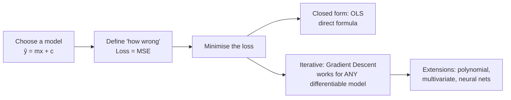
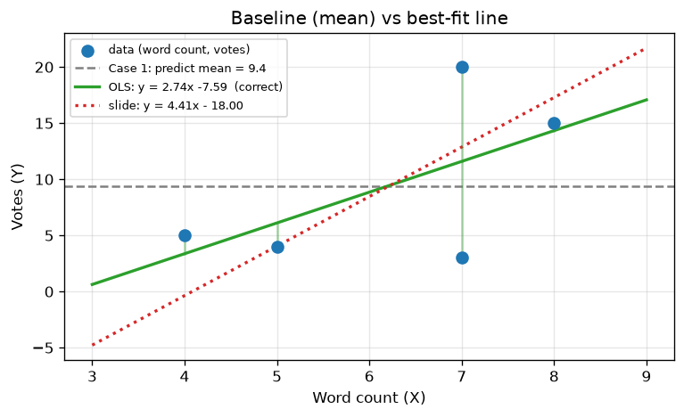
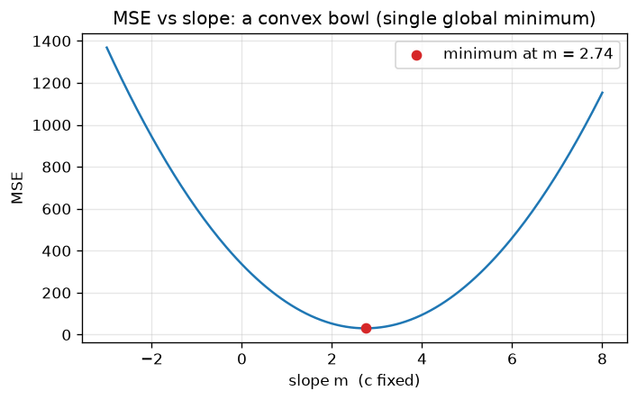
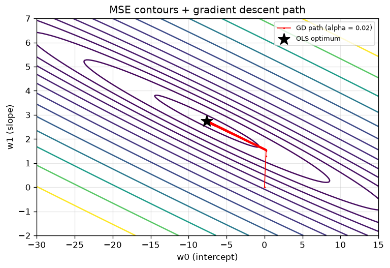
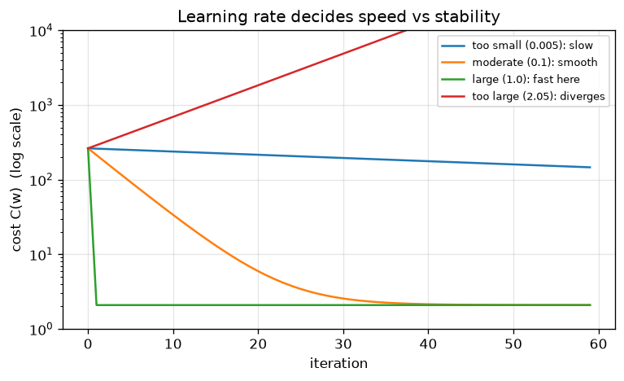
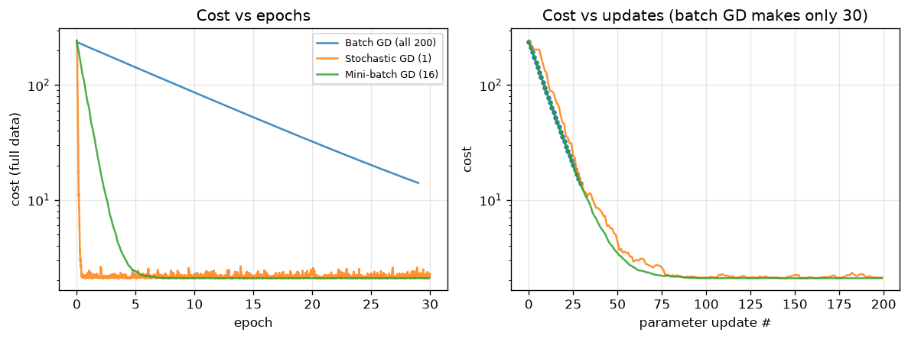
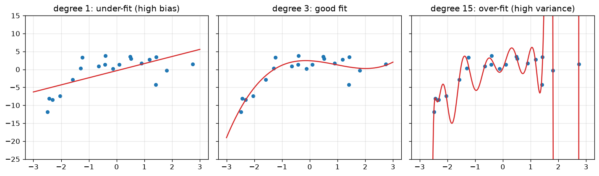

# 03 · Supervised Learning: Regression (Linear, Gradient Descent, Polynomial, Multivariate)

> **Course:** Machine Learning Paradigms (DS602) · Dr. Sunil Saumya · IIIT Dharwad
> **Deck:** `MLP_Unit_1_Supervised_Learning_Regression.pdf` (dated 3 Oct 2026)
> **Status:** 📄 Written from the **slides only**. The professor said linear regression would be taught *"in the next class"*. Once you add that transcript, this note will get a "Professor emphasised" section and class Q&A.
> **Notebook:** [`code/03_linear_regression.ipynb`](code/03_linear_regression.ipynb): OLS by hand, GD from scratch, GD variants, polynomial, multivariate, house-price case study.
> **Figures:** generated by [`code/make_figures.py`](code/make_figures.py)

---

## 📌 Table of Contents

1. [Big Picture](#1-big-picture)
2. [Regression vs Classification](#2-regression-vs-classification-)
3. [Case 1: No Inputs, Predict the Mean](#3-case-1-no-inputs--predict-the-mean-)
4. [Case 2: Simple Linear Regression](#4-case-2-simple-linear-regression-)
5. [OLS: Deriving the Formulas](#5-ols-deriving-the-formulas-)
6. [Worked Example & Slide Correction](#6-worked-example--slide-correction-)
7. [Loss Function: MSE](#7-loss-function-mse-)
8. [Convexity of MSE](#8-convexity-of-mse-)
9. [Gradient Descent](#9-gradient-descent-)
10. [Gradient Descent for Linear Regression (derivation)](#10-gradient-descent-for-linear-regression-derivation-)
11. [The Learning Rate α](#11-the-learning-rate-α-)
12. [Batch vs Stochastic vs Mini-batch GD](#12-batch-vs-stochastic-vs-mini-batch-gd-)
13. [Polynomial Regression](#13-polynomial-regression-)
14. [Multivariate Linear Regression](#14-multivariate-linear-regression-)
15. [Normal Equation (closed form, beyond slides)](#15-normal-equation-closed-form-beyond-slides-)
16. [Evaluating Regression Models](#16-evaluating-regression-models-)
17. [Over-fitting, Bias–Variance, Regularisation](#17-over-fitting-biasvariance-regularisation-)
18. [Advanced: Why Squared Error? (Probabilistic View)](#18--advanced-why-squared-error-probabilistic-view)
19. [Case Study: House Prices](#19-case-study-house-prices-)
20. [Common Confusions](#20--common-confusions)
21. [Exam / Interview Questions](#21--exam--interview-questions)
22. [Cheat Sheet](#22--cheat-sheet)
23. [Go Deeper: Curated Links](#23--go-deeper-curated-links)

---

## 1. Big Picture

Regression answers **"how much?"** questions: how many votes, what price, what salary, what temperature.

The whole topic follows a single storyline:



> 💡 **Why this matters beyond regression:** "Model + loss + gradient descent" is **exactly** how neural networks and LLMs are trained, only with billions of parameters instead of two. Master it here.

---

## 2. Regression vs Classification 🟢

The same review dataset, two different questions:

| Review Text | Votes | Rating | Sentiment |
|---|---|---|---|
| Worst product ever, broke in a day. | 7 | 1.0 | 0 |
| Absolutely love it! Works perfectly as expected. | 8 | 5.0 | 1 |
| Decent quality, but overpriced. | 4 | 3.0 | 0 |
| Amazing value for money, very satisfied. | 7 | 5.0 | 1 |
| Late delivery and poor support. | 5 | 2.0 | 0 |

| | Regression | Classification |
|---|---|---|
| Problem | Given text + rating → predict **votes** | Given text + votes + rating → predict **sentiment** |
| Output | **Continuous** real number | **Categorical** (0/1) |
| Question type | "How much / how many?" | "Which class?" |
| More examples | House price, rainfall in mm, stock price, delivery time | Spam/ham, fraud/legit, digit 0–9, tumour benign/malignant |

> ⚠️ **Tricky cases:** "Votes" are integers, yet we treat them as regression because they're ordered quantities where being off by 1 is better than off by 10. A rating of 1–5 *could* be either (regression or ordinal classification). The deciding question: **does distance between values carry meaning?**

---

## 3. Case 1: No Inputs → Predict the Mean 🟢

*"Predict how many votes a review will receive,"* but you are given **only the output column**:

| Votes (Y) |
|---|
| 3, 15, 5, 20, 4 |

The best you can do is predict the **mean = 9.4** for every review.

**Why the mean? (Proof, beyond slides.)** We want the constant $k$ minimising $L(k) = \frac1n\sum (y_i - k)^2$. Setting $\frac{dL}{dk} = -\frac2n\sum(y_i - k) = 0$ gives $k = \frac1n\sum y_i = \bar y$. ∎

> 🎯 This is the **baseline model**. Any real model must beat it. Here its MSE = **46.64**. The **R²** metric (Section 16) literally measures "how much better than predicting the mean".

---

## 4. Case 2: Simple Linear Regression 🟢

Now we also have an input, word count:

| Word Count (X) | Votes (Y) |
|---|---|
| 7 | 3 |
| 8 | 15 |
| 4 | 5 |
| 7 | 20 |
| 5 | 4 |

**Assumption:** votes are a **linear function** of word count:
$$\hat Y = mX + c$$
- $m$ = **slope**: extra votes per extra word
- $c$ = **intercept**: predicted votes at 0 words
- In the ML notation used later: $\hat y = w_0 + w_1 x$ (so $w_1 = m$, $w_0 = c$). These are the **parameters/weights** the model learns.

**Goal:** find the **best-fit line**, the line closest to all the points.



> 📝 **Small data note:** if you count the words yourself, "Absolutely love it! Works perfectly as expected." has 7 words and "Amazing value for money, very satisfied." has 6. The slide uses 8 and 7. These notes keep the slide's values so the numbers match your exam material.

---

## 5. OLS: Deriving the Formulas 🟡

**Ordinary Least Squares (OLS)** picks $m, c$ that minimise the **sum of squared residuals**:
$$
S(m,c) = \sum_{i=1}^{n} \big(Y_i - (mX_i + c)\big)^2
$$
A **residual** $e_i = Y_i - \hat Y_i$ is the vertical gap between a point and the line (the green vertical segments in the figure above).

**Step 1: derivative w.r.t. $c$, set to 0**
$$
\frac{\partial S}{\partial c} = -2\sum (Y_i - mX_i - c) = 0 \;\Rightarrow\; \sum Y_i = m\sum X_i + nc \;\Rightarrow\; \boxed{c = \bar Y - m\bar X}
$$
➡️ Meaning: **the best-fit line always passes through $(\bar X, \bar Y)$**.

**Step 2: derivative w.r.t. $m$, set to 0**
$$
\frac{\partial S}{\partial m} = -2\sum X_i (Y_i - mX_i - c) = 0
$$
Substitute $c = \bar Y - m\bar X$:
$$
\sum X_i\big[(Y_i - \bar Y) - m(X_i - \bar X)\big] = 0
\;\Rightarrow\; m = \frac{\sum X_i (Y_i - \bar Y)}{\sum X_i (X_i - \bar X)}
$$
Because $\sum \bar X (Y_i - \bar Y) = 0$ and $\sum \bar X(X_i - \bar X) = 0$, we can subtract $\bar X$ inside freely:
$$
\boxed{m = \frac{\sum (X_i - \bar X)(Y_i - \bar Y)}{\sum (X_i - \bar X)^2} = \frac{\operatorname{Cov}(X,Y)}{\operatorname{Var}(X)}}
$$

> 🔗 **Connection:** $m = r_{XY}\cdot \frac{s_Y}{s_X}$, where $r$ is the Pearson correlation from [Note 02](02-ML-Pipeline-Hands-On.md#5-feature-selection--pearson-correlation-). Slope and correlation share the same numerator.

---

## 6. Worked Example & Slide Correction 🟢

Means: $\bar X = 31/5 = 6.2$, $\bar Y = 47/5 = 9.4$

| $X_i$ | $Y_i$ | $X_i - \bar X$ | $Y_i - \bar Y$ | $(X_i-\bar X)(Y_i-\bar Y)$ | $(X_i-\bar X)^2$ |
|---|---|---|---|---|---|
| 7 | 3 | 0.8 | −6.4 | −5.12 | 0.64 |
| 8 | 15 | 1.8 | 5.6 | 10.08 | 3.24 |
| 4 | 5 | −2.2 | −4.4 | 9.68 | 4.84 |
| 7 | 20 | 0.8 | 10.6 | 8.48 | 0.64 |
| 5 | 4 | −1.2 | −5.4 | 6.48 | 1.44 |
| **Σ** | | **0** | **0** | **29.60** | **10.80** |

$$
m = \frac{29.6}{10.8} = \mathbf{2.74}, \qquad c = 9.4 - 2.74 \times 6.2 = \mathbf{-7.59}
$$
$$
\boxed{\hat Y = 2.74X - 7.59}
$$

> ⚠️ **The slide shows $m = 4.41$, $c = -18.00$ (i.e. $\hat Y = 4.41X - 18.00$). That is an arithmetic error.** Evidence (see notebook Part A):
>
> | Line | MSE on the 5 points |
> |---|---|
> | Mean only (baseline) | 46.64 |
> | Slide: $4.41X - 18.00$ | 36.44 |
> | **Correct OLS: $2.74X - 7.59$** | **30.41** ✅ (lowest possible) |
>
> `np.polyfit`, `sklearn.LinearRegression` and gradient descent all return **2.7407, −7.5926**. Since OLS is *by definition* the line with the lowest squared error, any line with higher MSE can't be the OLS answer. In an exam, **show the table above**. Use the method from the slides and compute carefully. You may want to mention this to the professor.

**Sanity checks to do in exams:**

1. $\sum (X_i - \bar X) = 0$ and $\sum (Y_i - \bar Y) = 0$ (they always do).
2. The line passes through $(\bar X, \bar Y)$: $2.74 \times 6.2 - 7.59 = 9.40$ ✅
3. The sign of $m$ matches the scatter trend (more words → more votes, so positive).

**Interpretation:** each extra word adds ≈2.74 votes. The intercept (−7.59 votes at 0 words) is **meaningless** physically, because we never observed reviews near 0 words. **Don't extrapolate** outside the data range.

---

## 7. Loss Function: MSE 🟢

The final hypothesis $\hat Y = mX + c$ needs a score for "how wrong". **Mean Squared Error:**
$$
L(m, c) = \frac{1}{n}\sum_{i=1}^{n} \big(Y_i - (mX_i + c)\big)^2
$$
**Goal: choose $m, c$ to minimise MSE.**

**Why square the errors?**

| Reason | Explanation |
|---|---|
| Signs don't cancel | Errors of +5 and −5 would sum to 0 otherwise |
| Penalises big errors more | An error of 10 costs 100, not 10 |
| Smooth & differentiable | Allows calculus, giving closed form and gradient descent |
| Convex for linear models | One global minimum, no local traps (Section 8) |
| Statistical justification | Equals maximum likelihood under Gaussian noise (Section 18) |

**Downside:** sensitive to **outliers**. One crazy point (a review with 10,000 votes) drags the line. Alternatives: **MAE** (absolute error) or **Huber loss**.

### Effect of different lines on MSE
The slides show three lines (poor fit → better → best OLS fit), with error decreasing. Every line has an MSE; OLS is the one at the bottom of the "error bowl".

---

## 8. Convexity of MSE 🟡

**Slide experiment:** fix $c$, vary $m$, compute MSE for each $m$, and plot. The result is a **U-shaped (convex)** curve.



**Why it's convex (proof sketch):** as a function of $m$,
$$
L(m) = \frac1n\sum (Y_i - c - mX_i)^2 \;\Rightarrow\; L''(m) = \frac{2}{n}\sum X_i^2 \;\ge 0
$$
A positive second derivative everywhere means the curve bends upward everywhere: a **bowl**. In 2-D $(m, c)$ the surface is a **paraboloid** (bowl). Formally, its Hessian $\frac{2}{n}X^\top X$ is positive semi-definite.

**Why we care:** for a convex function, **any local minimum is the global minimum**. Gradient descent can't get stuck in a wrong valley. (Neural network losses are **non-convex**, which is why training them is harder.)

---

## 9. Gradient Descent 🟢→🟡

OLS gives a direct formula, but only for this special case. **Gradient descent (GD)** is the **general-purpose** minimiser that works for almost any differentiable loss (logistic regression, neural nets, LLMs).

### Intuition: walking down a foggy hill
You're on a hillside in thick fog and want to reach the valley. You can't see far, but you can feel the **slope under your feet**. Take a step **downhill**, feel again, step again. Repeat until the ground is flat.

- **Slope under your feet** = gradient (partial derivatives)
- **Step size** = learning rate $\alpha$
- **Flat ground** = minimum (gradient ≈ 0)

### Algorithm (slides)
Given a function $G(\theta_0, \theta_1)$:

1. Start with some $(\theta_0, \theta_1)$, e.g. zeros or random.
2. Repeat until convergence:
$$
\theta_j := \theta_j - \alpha \frac{\partial}{\partial \theta_j} G(\theta_0, \theta_1), \qquad j = 0, 1
$$
3. The values at the minimum are the optimal parameters.

**Why the minus sign?** The gradient points **uphill** (direction of steepest increase). We want to go down, so we step in the **negative** gradient direction.

- If $\frac{\partial G}{\partial \theta} > 0$ (rising to the right), $\theta$ decreases, so we move left. ✅
- If $\frac{\partial G}{\partial \theta} < 0$ (falling to the right), $\theta$ increases, so we move right. ✅

> ⚠️ **Simultaneous update:** compute **both** gradients using the *old* $\theta_0, \theta_1$, then update both. Updating $\theta_0$ first and then using the new $\theta_0$ to compute $\theta_1$'s gradient is a classic bug.

**Stopping criteria ("until convergence"):** change in cost < tolerance (e.g. $10^{-6}$), gradient norm ≈ 0, or a maximum number of iterations.

---

## 10. Gradient Descent for Linear Regression (derivation) 🟡

**Cost (slides use the ½ convention):**
$$
C(w_0, w_1) = \frac{1}{2M}\sum_{i=1}^{M}\big(w_0 + w_1 x_i - y_i\big)^2
$$
Map to GD: $\theta_0 = w_0$, $\theta_1 = w_1$, $G = C$.

> 💡 **Why $\frac{1}{2M}$ instead of $\frac1M$?** The ½ cancels the 2 that comes down from the square when differentiating. It's cosmetic: scaling the cost by a constant doesn't move the minimum (it just rescales $\alpha$).

**Partial derivatives (chain rule):** let $e_i = w_0 + w_1 x_i - y_i$ (prediction − truth).
$$
\frac{\partial C}{\partial w_0} = \frac{1}{2M}\sum 2e_i \cdot \frac{\partial e_i}{\partial w_0} = \frac{1}{M}\sum_{i=1}^{M} (w_0 + w_1 x_i - y_i)\cdot 1
$$
$$
\frac{\partial C}{\partial w_1} = \frac{1}{2M}\sum 2e_i \cdot \frac{\partial e_i}{\partial w_1} = \frac{1}{M}\sum_{i=1}^{M} (w_0 + w_1 x_i - y_i)\, x_i
$$

**Update rules:**
$$
w_0 := w_0 - \alpha\,\frac{1}{M}\sum_{i=1}^{M}(w_0 + w_1 x_i - y_i)
$$
$$
w_1 := w_1 - \alpha\,\frac{1}{M}\sum_{i=1}^{M}(w_0 + w_1 x_i - y_i)\,x_i
$$

**Reading the formula:** the update = average error × (input that the weight multiplies). For $w_0$ that input is 1; for $w_1$ it is $x_i$. **This pattern generalises to every weight in multivariate regression** (Section 14).

### From scratch (NumPy)
```python
def gradient_descent(x, y, alpha=0.01, iters=1000, w0=0.0, w1=0.0):
    M = len(x)
    for _ in range(iters):
        err = w0 + w1 * x - y                       # e_i for all i
        grad_w0 = err.sum() / M
        grad_w1 = (err * x).sum() / M
        w0, w1 = w0 - alpha * grad_w0, w1 - alpha * grad_w1   # simultaneous!
    return w0, w1
```
On the slide data it converges to **w1 = 2.7407, w0 = −7.5926**, exactly the OLS answer. The path below goes down the bowl:



> 🔴 **Notice the zig-zag along a long narrow valley.** Because $x$ isn't centred (values 4–8), the bowl is stretched, and GD needed ~20,000 iterations. **Standardising** $x$ (mean 0, std 1) makes the bowl round, and GD converges in ~50 iterations (notebook Part C). This is *why* we use `StandardScaler` before gradient-based models.

### Worked first iteration (exam-style)
Start $w_0 = w_1 = 0$, $\alpha = 0.01$. Predictions are all 0, so $e_i = -y_i = [-3, -15, -5, -20, -4]$.

- $\frac{\partial C}{\partial w_0} = \frac{1}{5}(-47) = -9.4$ → $w_0 = 0 - 0.01(-9.4) = 0.094$
- $\frac{\partial C}{\partial w_1} = \frac15(-3·7 - 15·8 - 5·4 - 20·7 - 4·5) = \frac15(-321) = -64.2$ → $w_1 = 0 - 0.01(-64.2) = 0.642$

Both weights increased, since the line must rise to reach the points. ✅

---

## 11. The Learning Rate α 🟢

| α | Behaviour |
|---|---|
| **Too small** (e.g. 0.0005) | Tiny steps, very slow convergence |
| **Moderate** (e.g. 0.01) | Smooth, stable convergence |
| **Too large** (e.g. 0.1+, problem-dependent) | **Overshoots** the minimum, oscillates, may **diverge** (cost explodes) |



**Why large α diverges:** if a step jumps past the valley floor to a point **higher** on the other side, the next gradient is even bigger, so the next jump is bigger again, and the cost explodes.

**Practical tips (beyond slides):**

- Try α on a log scale: 0.001, 0.003, 0.01, 0.03, 0.1, 0.3, 1.
- **Plot cost vs iteration.** It should decrease monotonically (for batch GD). If it rises, α is too large.
- **Scale features** first. Then one α suits all weights.
- Modern optimisers adapt α automatically: **Momentum, RMSProp, Adam** (used for neural nets).
- **Learning-rate schedules:** start large, decay over time.

> ✏️ "Good" α depends on the data scale. In the figure, α = 1.0 converges in one step because the data is standardised. On raw data, α = 0.1 can already diverge. Never memorise a "good α"; **check the loss curve**.

---

## 12. Batch vs Stochastic vs Mini-batch GD 🟡

They differ in **how many samples are used to compute each gradient**:

| Variant | Samples per update | Pros | Cons |
|---|---|---|---|
| **Batch GD** | All M | Exact gradient, smooth & stable | Slow per step; whole dataset must fit in memory |
| **Stochastic GD (SGD)** | 1 | Very fast updates; noise can escape shallow local minima; online learning | Noisy, zig-zag; never fully settles (needs decaying α) |
| **Mini-batch GD** | b (e.g. 32–512) | Best of both; GPU-friendly vectorisation | One more hyperparameter (batch size) |



**Reading the plot:** *per epoch* (one full pass over the data), SGD and mini-batch make **many** updates, so they drop fast. Batch makes only **one** update per epoch, so it's slowest per epoch. Per update (right panel) batch is smoothest, and SGD is noisiest.

**Terminology:**

- **Epoch** = one pass over the entire training set.
- **Iteration / step** = one parameter update.
- Updates per epoch = M / batch size.

> 💡 In deep learning, "SGD" in code almost always means **mini-batch** GD. Every LLM is trained with mini-batch gradient methods (Adam variants).

---

## 13. Polynomial Regression 🟢→🟡

When the relationship is **curved**, a straight line under-fits. Add powers of $x$:
$$
\hat y_i = w_0 + w_1 x_i + w_2 x_i^2 + w_3 x_i^3
$$

**GD updates (slides).** Same pattern: error × the input each weight multiplies:
$$
w_k := w_k - \alpha \frac1M\sum_{i=1}^{M}\big(w_0 + w_1x_i + w_2x_i^2 + w_3x_i^3 - y_i\big)\,x_i^{k}, \qquad k = 0,1,2,3
$$

> 🔑 **Key insight: polynomial regression is still *linear* regression.** "Linear" means **linear in the parameters** $w$, not in $x$. Create new features $x_2 = x^2$, $x_3 = x^3$ and it becomes multivariate linear regression: same maths, same convex MSE. (`sklearn.preprocessing.PolynomialFeatures` does exactly this.)



**Choosing the degree (notebook Part E: train vs test MSE):**

| Degree | Train MSE | Test MSE | Verdict |
|---|---|---|---|
| 1 | 14.04 | 14.35 | Under-fit (too simple) |
| 3 | 4.96 | 3.59 | Good |
| 9 | 4.12 | 3.13 | OK |
| 15 | 3.16 | **544.06** | Over-fit (memorised noise) |

Train error **always** decreases with degree; test error is **U-shaped**. Choose the degree by **validation/test error**, never by train error.

⚠️ With high powers ($x^{15}$), feature values explode in scale, so **feature scaling is essential** for GD.

---

## 14. Multivariate Linear Regression 🟡

### Motivation (slides: salary prediction)

- **Univariate:** $x$ = total experience in months, $y$ = salary (₹), M = 100 samples. Learn $y = h_w(x)$; predict $\hat y^{(k)} = h_w(x_k)$, expecting $\hat y^{(k)} \approx y_k$.
- But experience has components: **teaching ($x_1$), research ($x_2$), admin ($x_3$)**. Univariate uses $x = x_1 + x_2 + x_3$ and treats a month of research the same as a month of admin.
- Each component may affect salary differently, so give each its **own weight**.

### Model
$$
h_w(x) = w_0 + w_1x_1 + w_2x_2 + \dots + w_Nx_N
$$
Add a dummy feature $x_0 = 1$:
$$
h_w(x) = w_0x_0 + w_1x_1 + \dots + w_Nx_N = \mathbf{w}^\top \mathbf{x}
$$
where $\mathbf w = [w_0, w_1, \dots, w_N]^\top$ and $\mathbf x = [x_0, x_1, \dots, x_N]^\top$ are **(N+1)-dimensional column vectors**. The prediction is their **inner (dot) product**.

> 💡 **Why $x_0 = 1$?** It folds the intercept into the dot product, so there's no special case and everything becomes one clean matrix operation.

### Data in matrix form

- $X$ is an $M \times (N+1)$ matrix: row $i$ is sample $\mathbf x^{(i)\top}$ (with leading 1), column $j$ is feature $j$.
- $\mathbf y$ is an $M$-dimensional column vector.
- Notation: $x^{(i)}_j$ = feature $j$ of sample $i$ (superscript = **which row**, subscript = **which column**).

### Cost
$$
\min_{\mathbf w} C(\mathbf w) = \min_{\mathbf w}\frac{1}{2M}\sum_{i=1}^{M}\big(\mathbf w^\top \mathbf x^{(i)} - y^{(i)}\big)^2
$$

### Gradient & update (for each $j = 0, \dots, N$)
$$
\frac{\partial C}{\partial w_j} = \frac{1}{M}\sum_{i=1}^{M}\big(\mathbf w^\top \mathbf x^{(i)} - y^{(i)}\big)\,x^{(i)}_j
\qquad
w_j := w_j - \alpha\frac{1}{M}\sum_{i=1}^{M}\big(\mathbf w^\top \mathbf x^{(i)} - y^{(i)}\big)\,x^{(i)}_j
$$
Repeat all (N+1) updates simultaneously until convergence.

> 📝 **Slide typo:** two update lines in the deck read $(w_0 + w_1x^{(i)} - y^{(i)})$. In the multivariate case it should be the full prediction $\mathbf w^\top\mathbf x^{(i)}$, as in the $w_N$ line.

### 🔴 Vectorised form (what you actually code)
All N+1 updates in one line:
$$
\nabla_{\mathbf w} C = \frac{1}{M}X^\top(X\mathbf w - \mathbf y), \qquad \mathbf w := \mathbf w - \alpha\,\frac{1}{M}X^\top(X\mathbf w - \mathbf y)
$$
```python
w = np.zeros(N + 1)
for _ in range(iters):
    w -= alpha * X.T @ (X @ w - y) / M      # X already contains the column of 1s
```
Shapes: $X\mathbf w$ is (M,), the error is (M,), $X^\top \cdot$ error is (N+1,). ✅

**Notebook Part F result** (synthetic salary data, true weights `[20000, 300, 500, 150]`):
```text
GD              : [19668.63   300.26   505.82   148.37]
Normal equation : [19668.63   300.26   505.82   148.37]
sklearn         : [19668.63   300.26   505.82   148.37]
```
All three agree. Research months pay the most per month (≈₹506), admin the least (≈₹148), which a univariate model on *total* experience could never reveal.

**Interpreting a coefficient:** $w_j$ = expected change in $y$ per unit increase in $x_j$, **holding all other features constant**.

---

## 15. Normal Equation (closed form, beyond slides) 🔴

OLS generalised to many features. Set the gradient to zero:
$$
X^\top(X\mathbf w - \mathbf y) = 0 \;\Rightarrow\; X^\top X\,\mathbf w = X^\top \mathbf y \;\Rightarrow\; \boxed{\mathbf w = (X^\top X)^{-1}X^\top \mathbf y}
$$
(The univariate formulas in Section 5 are the special case N = 1.)

| | Normal equation | Gradient descent |
|---|---|---|
| Iterations | None (one shot) | Many |
| Learning rate | Not needed | Must tune α |
| Cost | $O(N^3)$ to solve $X^\top X$ | $O(MN)$ per iteration |
| Works when | N up to ~10⁴ | N huge; streaming data |
| Generalises to | Only linear least squares | Any differentiable model (logistic, NN) |
| Feature scaling | Not needed | Strongly recommended |

> ⚠️ If features are **perfectly correlated** (e.g. experience in months *and* in years), $X^\top X$ is **singular** (not invertible). Use `np.linalg.lstsq` / pseudo-inverse, or drop the duplicate feature, or use regularisation. Never compute `inv()` explicitly in code.

---

## 16. Evaluating Regression Models 🟢

| Metric | Formula | Units | Notes |
|---|---|---|---|
| **MSE** | $\frac1n\sum(y_i-\hat y_i)^2$ | squared units | Penalises big errors; used as loss |
| **RMSE** | $\sqrt{\text{MSE}}$ | same as $y$ | "Typical error size" |
| **MAE** | $\frac1n\sum\lvert y_i-\hat y_i\rvert$ | same as $y$ | Robust to outliers |
| **R²** | $1 - \frac{\sum(y_i-\hat y_i)^2}{\sum(y_i-\bar y)^2}$ | unitless | 1 = perfect; 0 = no better than the mean; < 0 = worse than the mean |

For the slide example: R² = 1 − 30.41/46.64 = **0.35**. Word count explains ~35% of the variance in votes.

> Always evaluate on **held-out test data**, and compare against the **mean baseline**.

---

## 17. Over-fitting, Bias–Variance, Regularisation 🟡→🔴

| | Under-fitting (high bias) | Good fit | Over-fitting (high variance) |
|---|---|---|---|
| Model | Too simple | Just right | Too complex |
| Train error | High | Low | **Very low** |
| Test error | High | Low | **High** |
| Example | Line through a cubic curve | Cubic | Degree-15 polynomial |
| Fix | More features, higher degree | — | More data, simpler model, **regularisation**, cross-validation |

**Regularisation (preview):** add a penalty on large weights to the loss.

- **Ridge (L2):** $\text{MSE} + \lambda\sum w_j^2$ shrinks weights smoothly.
- **Lasso (L1):** $\text{MSE} + \lambda\sum |w_j|$ drives some weights to exactly 0 (automatic feature selection).
- **Elastic Net:** both.

### Assumptions of linear regression (for valid inference)

1. **Linearity** of the relationship (in parameters).
2. **Independent** errors.
3. **Homoscedasticity**: constant error variance.
4. **Normally distributed** errors (for confidence intervals / tests).
5. No severe **multicollinearity** among features.

Check them with residual plots: residuals vs predicted should look like random noise with no pattern.

---

## 18. 🔴 Advanced: Why Squared Error? (Probabilistic View)

Assume data is generated as $y = \mathbf w^\top\mathbf x + \varepsilon$ with Gaussian noise $\varepsilon \sim \mathcal N(0, \sigma^2)$. Then
$$
p(y_i \mid \mathbf x_i; \mathbf w) = \frac{1}{\sqrt{2\pi}\sigma}\exp\!\left(-\frac{(y_i - \mathbf w^\top \mathbf x_i)^2}{2\sigma^2}\right)
$$
The log-likelihood of all data is
$$
\log \mathcal L(\mathbf w) = -\frac{n}{2}\log(2\pi\sigma^2) - \frac{1}{2\sigma^2}\sum_i (y_i - \mathbf w^\top\mathbf x_i)^2
$$
**Maximising likelihood is the same as minimising the sum of squared errors.** So MSE isn't arbitrary: it's the **maximum likelihood estimator** under Gaussian noise. (With Laplace noise you'd get MAE instead.) This "loss = negative log-likelihood" idea is how **cross-entropy** arises for classification and for training **LLMs**. You'll see this again in Gen AI.

---

## 19. Case Study: House Prices 🟢

The course plan's supervised case study: *Linear Regression · predicting house prices · scikit-learn.* Notebook Part G uses the **California Housing** dataset (20,640 districts, 8 features: median income, house age, rooms, location…; target = median house value in units of 100,000 USD).

```python
pipe = make_pipeline(StandardScaler(), LinearRegression()).fit(X_train, y_train)
```

| Model | RMSE | MAE | R² |
|---|---|---|---|
| Baseline (predict mean) | 1.145 | 0.906 | 0.000 |
| LinearRegression (OLS / normal equation) | 0.746 | 0.533 | 0.576 |
| SGDRegressor (gradient descent) | 0.742 | 0.530 | 0.580 |

- OLS and GD reach essentially the **same solution**, as theory predicts.
- Most influential (standardised) features: **latitude, longitude, median income**. Location and income drive price, as in real estate everywhere.
- R² ≈ 0.58: decent for a straight-line model. Non-linear models (trees, boosting) reach ~0.8+. That's a hint of why later paradigms exist.

**Real-world uses of regression:** Zillow/MagicBricks price estimates, Swiggy/Zomato delivery-time prediction, electricity demand forecasting, crop yield prediction, insurance premium estimation, ride-fare estimation.

---

## 20. ⚠️ Common Confusions

| Confusion | Clarification |
|---|---|
| "Linear" = straight line in x | Linear **in parameters**; polynomial regression is linear regression |
| OLS and GD give different answers | For linear regression both minimise the same convex MSE, so the answer is the same (GD approximately) |
| Bigger α = faster always | Too big diverges |
| ½ in cost changes the answer | Only rescales; minimum unchanged |
| Lower train error = better model | Judge on test/validation error |
| Intercept always meaningful | Not if x = 0 is outside the data range |
| Normal equation always better | Fails or is slow for huge N; can't extend to non-linear models |
| SGD = "stochastic" means random answer | Same expected direction; noisier path |
| Slide answer $4.41X - 18$ | Correct OLS is $2.74X - 7.59$ (Section 6) |

---

## 21. 📝 Exam / Interview Questions

<details>
<summary><b>Q1.</b> Derive the OLS formulas for slope and intercept.</summary>

Minimise $S = \sum (y_i - mx_i - c)^2$. $\partial S/\partial c = 0 \Rightarrow c = \bar y - m\bar x$. $\partial S/\partial m = 0$ and substitution gives $m = \sum(x_i-\bar x)(y_i-\bar y)/\sum(x_i-\bar x)^2$. (Full steps in Section 5.)
</details>

<details>
<summary><b>Q2.</b> Fit a line to X = [1,2,3,4,5], Y = [2,4,5,4,5].</summary>

$\bar x = 3$, $\bar y = 4$. dx = [−2,−1,0,1,2], dy = [−2,0,1,0,1]. Σdx·dy = 4+0+0+0+2 = 6; Σdx² = 10. m = 0.6; c = 4 − 0.6·3 = 2.2. **ŷ = 0.6x + 2.2.**
</details>

<details>
<summary><b>Q3.</b> Derive the gradient descent update rules for univariate linear regression with cost $\frac{1}{2M}\sum(w_0 + w_1x_i - y_i)^2$.</summary>

$\partial C/\partial w_0 = \frac1M\sum(w_0+w_1x_i-y_i)$, $\partial C/\partial w_1 = \frac1M\sum(w_0+w_1x_i-y_i)x_i$; update $w_j := w_j - \alpha\,\partial C/\partial w_j$ simultaneously.
</details>

<details>
<summary><b>Q4.</b> Why is the MSE of a linear model convex? Why does it matter?</summary>

The second derivative w.r.t. the parameters is $\frac2n\sum x_i^2 \ge 0$ (Hessian $\frac2nX^\top X$ is PSD), so it's a bowl. Any local minimum is global, and GD converges to the optimum with a suitable α.
</details>

<details>
<summary><b>Q5.</b> Compare batch, stochastic and mini-batch gradient descent.</summary>

Batch: full data per update, stable but slow and memory-heavy. SGD: one sample, fast and noisy, good for online learning. Mini-batch: b samples, balances speed and stability, GPU-friendly, the standard in deep learning.
</details>

<details>
<summary><b>Q6.</b> What happens if the learning rate is too small or too large?</summary>

Too small: very slow convergence. Too large: overshoots, oscillates, may diverge (cost increases).
</details>

<details>
<summary><b>Q7.</b> Is polynomial regression a linear model? Explain.</summary>

Yes. It is linear in the weights; the powers of x are just engineered features, so OLS/GD and convexity apply unchanged.
</details>

<details>
<summary><b>Q8.</b> Write multivariate linear regression in vector form and give the vectorised GD update.</summary>

$h_w(\mathbf x) = \mathbf w^\top \mathbf x$ with $x_0 = 1$; $\mathbf w := \mathbf w - \frac{\alpha}{M}X^\top(X\mathbf w - \mathbf y)$.
</details>

<details>
<summary><b>Q9.</b> When would you prefer the normal equation over gradient descent?</summary>

Few features (≲10⁴), data fits in memory, an exact solution is needed with no α tuning. Prefer GD for many features, huge or streaming data, or non-linear models.
</details>

<details>
<summary><b>Q10.</b> Your model has R² = −0.2 on test data. Interpret it.</summary>

It's worse than predicting the mean of y for every sample. Likely a bug, data leakage in reverse, severe over-fitting, or a distribution shift between train and test.
</details>

<details>
<summary><b>Q11.</b> Do one GD iteration from w0 = w1 = 0, α = 0.1 on points (1, 2), (2, 4).</summary>

errors = [−2, −4]; ∂/∂w0 = (−2−4)/2 = −3; ∂/∂w1 = (−2·1 − 4·2)/2 = −5. New w0 = 0.3, w1 = 0.5.
</details>

---

## 22. 🧾 Cheat Sheet

| Concept | Formula |
|---|---|
| Model | $\hat y = w_0 + w_1x$ ; multivariate $\hat y = \mathbf w^\top\mathbf x$ ($x_0=1$) |
| OLS slope | $m = \frac{\sum(x-\bar x)(y-\bar y)}{\sum(x-\bar x)^2}$ |
| OLS intercept | $c = \bar y - m\bar x$ (line passes through the means) |
| MSE | $\frac1n\sum(y-\hat y)^2$ |
| GD cost | $\frac{1}{2M}\sum(\hat y - y)^2$ |
| GD update | $w_j := w_j - \alpha\frac1M\sum(\hat y^{(i)} - y^{(i)})x^{(i)}_j$ |
| Vectorised | $\mathbf w := \mathbf w - \frac{\alpha}{M}X^\top(X\mathbf w - \mathbf y)$ |
| Normal eq. | $\mathbf w = (X^\top X)^{-1}X^\top\mathbf y$ |
| R² | $1 - SS_{res}/SS_{tot}$ |

- Baseline = predict the mean. Beat it.
- MSE is convex for linear models → single global minimum.
- α: small = slow, large = diverge. Scale features. Plot the loss.
- Batch (all) / SGD (1) / Mini-batch (b). Epoch = one pass.
- Polynomial = linear regression on powered features; choose degree by test error.
- Slide example correct answer: **ŷ = 2.74x − 7.59** (not 4.41x − 18).

---

## 23. 📚 Go Deeper: Curated Links

| Topic | Why | Link |
|---|---|---|
| Least squares intuition | Visual derivation of fitting a line | [StatQuest — Fitting a Line to Data (Least Squares)](https://www.youtube.com/watch?v=PaFPbb66DxQ) |
| Linear regression end-to-end | R², p-values, interpretation | [StatQuest — Linear Regression, Clearly Explained](https://www.youtube.com/watch?v=7ArmBVF2dCs) |
| R² | What the number means | [StatQuest — R-squared, Clearly Explained](https://www.youtube.com/watch?v=2AQKmw14mHM) |
| Gradient descent | Step-by-step worked numbers | [StatQuest — Gradient Descent, Step-by-Step](https://www.youtube.com/watch?v=sDv4f4s2SB8) |
| SGD | Stochastic & mini-batch | [StatQuest — Stochastic Gradient Descent](https://www.youtube.com/watch?v=vMh0zPT0tLI) |
| GD geometry (neural-net view) | Gradient as "direction of steepest ascent" | [3Blue1Brown — Gradient descent, how neural networks learn](https://www.youtube.com/watch?v=IHZwWFHWa-w) |
| Interactive OLS | Drag points, watch the line & residuals | [Setosa — Ordinary Least Squares Regression](https://setosa.io/ev/ordinary-least-squares-regression/) · [Seeing Theory — Regression](https://seeing-theory.brown.edu/regression-analysis/index.html) |
| Google crash course | Linear regression + GD with interactive exercises | [Linear regression](https://developers.google.com/machine-learning/crash-course/linear-regression) · [Gradient descent](https://developers.google.com/machine-learning/crash-course/linear-regression/gradient-descent) |
| Rigorous notes | Normal equation, probabilistic interpretation (Section 18) | [Stanford CS229 Lecture Notes (Andrew Ng), Ch. 1](https://cs229.stanford.edu/main_notes.pdf) |
| Textbook | Ch. 3 Linear Regression, with R/Python labs | [ISL — An Introduction to Statistical Learning (free)](https://www.statlearning.com/) |
| Maths foundation | Vector calculus, least squares, linked to Applied Math course | [Mathematics for Machine Learning (free book)](https://mml-book.github.io/) |
| Optimiser zoo | Momentum, RMSProp, Adam (research level) | [Ruder — Overview of GD optimisation algorithms](https://www.ruder.io/optimizing-gradient-descent/) · [arXiv 1609.04747](https://arxiv.org/abs/1609.04747) · [Distill — Why Momentum Really Works](https://distill.pub/2017/momentum/) |
| Bias–variance | Under/over-fitting | [StatQuest — Bias and Variance](https://www.youtube.com/watch?v=EuBBz3bI-aA) · [sklearn — Underfitting vs Overfitting](https://scikit-learn.org/stable/auto_examples/model_selection/plot_underfitting_overfitting.html) |
| Regularisation | Ridge (L2) preview | [StatQuest — Ridge Regression](https://www.youtube.com/watch?v=Q81RR3yKn30) |
| API docs | Functions used | [sklearn Linear Models](https://scikit-learn.org/stable/modules/linear_model.html) · [SGD](https://scikit-learn.org/stable/modules/sgd.html) · [PolynomialFeatures](https://scikit-learn.org/stable/modules/generated/sklearn.preprocessing.PolynomialFeatures.html) |

---
⬅️ [02 · ML Pipeline Hands-On](02-ML-Pipeline-Hands-On.md) · [MLP Index](README.md)
